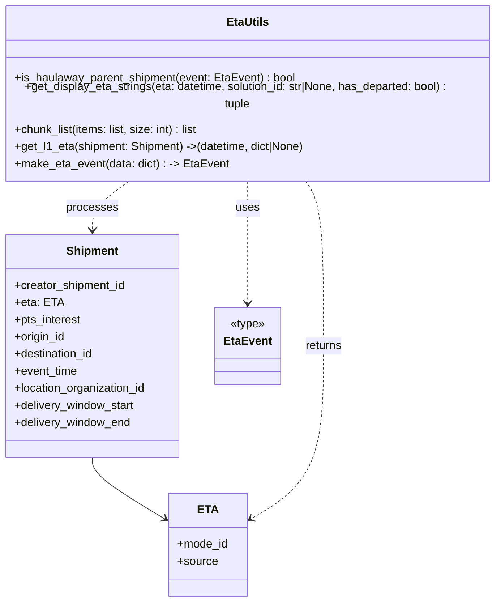

# Diagram: shipment_core/shipment_service/shipment_service/eta/tests/test_eta_utils.py


> Auto-generated by Obscura crawlers

## Diagram 1



### SVG

<svg id="container" width="714.484375" xmlns="http://www.w3.org/2000/svg" class="classDiagram" height="818" viewBox="0 0 714.484375 818" role="graphics-document document" aria-roledescription="class"><style>#container{font-family:"trebuchet ms",verdana,arial,sans-serif;font-size:16px;fill:#333;}@keyframes edge-animation-frame{from{stroke-dashoffset:0;}}@keyframes dash{to{stroke-dashoffset:0;}}#container .edge-animation-slow{stroke-dasharray:9,5!important;stroke-dashoffset:900;animation:dash 50s linear infinite;stroke-linecap:round;}#container .edge-animation-fast{stroke-dasharray:9,5!important;stroke-dashoffset:900;animation:dash 20s linear infinite;stroke-linecap:round;}#container .error-icon{fill:#552222;}#container .error-text{fill:#552222;stroke:#552222;}#container .edge-thickness-normal{stroke-width:1px;}#container .edge-thickness-thick{stroke-width:3.5px;}#container .edge-pattern-solid{stroke-dasharray:0;}#container .edge-thickness-invisible{stroke-width:0;fill:none;}#container .edge-pattern-dashed{stroke-dasharray:3;}#container .edge-pattern-dotted{stroke-dasharray:2;}#container .marker{fill:#333333;stroke:#333333;}#container .marker.cross{stroke:#333333;}#container svg{font-family:"trebuchet ms",verdana,arial,sans-serif;font-size:16px;}#container p{margin:0;}#container g.classGroup text{fill:#9370DB;stroke:none;font-family:"trebuchet ms",verdana,arial,sans-serif;font-size:10px;}#container g.classGroup text .title{font-weight:bolder;}#container .nodeLabel,#container .edgeLabel{color:#131300;}#container .edgeLabel .label rect{fill:#ECECFF;}#container .label text{fill:#131300;}#container .labelBkg{background:#ECECFF;}#container .edgeLabel .label span{background:#ECECFF;}#container .classTitle{font-weight:bolder;}#container .node rect,#container .node circle,#container .node ellipse,#container .node polygon,#container .node path{fill:#ECECFF;stroke:#9370DB;stroke-width:1px;}#container .divider{stroke:#9370DB;stroke-width:1;}#container g.clickable{cursor:pointer;}#container g.classGroup rect{fill:#ECECFF;stroke:#9370DB;}#container g.classGroup line{stroke:#9370DB;stroke-width:1;}#container .classLabel .box{stroke:none;stroke-width:0;fill:#ECECFF;opacity:0.5;}#container .classLabel .label{fill:#9370DB;font-size:10px;}#container .relation{stroke:#333333;stroke-width:1;fill:none;}#container .dashed-line{stroke-dasharray:3;}#container .dotted-line{stroke-dasharray:1 2;}#container #compositionStart,#container .composition{fill:#333333!important;stroke:#333333!important;stroke-width:1;}#container #compositionEnd,#container .composition{fill:#333333!important;stroke:#333333!important;stroke-width:1;}#container #dependencyStart,#container .dependency{fill:#333333!important;stroke:#333333!important;stroke-width:1;}#container #dependencyStart,#container .dependency{fill:#333333!important;stroke:#333333!important;stroke-width:1;}#container #extensionStart,#container .extension{fill:transparent!important;stroke:#333333!important;stroke-width:1;}#container #extensionEnd,#container .extension{fill:transparent!important;stroke:#333333!important;stroke-width:1;}#container #aggregationStart,#container .aggregation{fill:transparent!important;stroke:#333333!important;stroke-width:1;}#container #aggregationEnd,#container .aggregation{fill:transparent!important;stroke:#333333!important;stroke-width:1;}#container #lollipopStart,#container .lollipop{fill:#ECECFF!important;stroke:#333333!important;stroke-width:1;}#container #lollipopEnd,#container .lollipop{fill:#ECECFF!important;stroke:#333333!important;stroke-width:1;}#container .edgeTerminals{font-size:11px;line-height:initial;}#container .classTitleText{text-anchor:middle;font-size:18px;fill:#333;}#container .label-icon{display:inline-block;height:1em;overflow:visible;vertical-align:-0.125em;}#container .node .label-icon path{fill:currentColor;stroke:revert;stroke-width:revert;}#container :root{--mermaid-font-family:"trebuchet ms",verdana,arial,sans-serif;}</style><g><defs><marker id="container_class-aggregationStart" class="marker aggregation class" refX="18" refY="7" markerWidth="190" markerHeight="240" orient="auto"><path d="M 18,7 L9,13 L1,7 L9,1 Z"></path></marker></defs><defs><marker id="container_class-aggregationEnd" class="marker aggregation class" refX="1" refY="7" markerWidth="20" markerHeight="28" orient="auto"><path d="M 18,7 L9,13 L1,7 L9,1 Z"></path></marker></defs><defs><marker id="container_class-extensionStart" class="marker extension class" refX="18" refY="7" markerWidth="190" markerHeight="240" orient="auto"><path d="M 1,7 L18,13 V 1 Z"></path></marker></defs><defs><marker id="container_class-extensionEnd" class="marker extension class" refX="1" refY="7" markerWidth="20" markerHeight="28" orient="auto"><path d="M 1,1 V 13 L18,7 Z"></path></marker></defs><defs><marker id="container_class-compositionStart" class="marker composition class" refX="18" refY="7" markerWidth="190" markerHeight="240" orient="auto"><path d="M 18,7 L9,13 L1,7 L9,1 Z"></path></marker></defs><defs><marker id="container_class-compositionEnd" class="marker composition class" refX="1" refY="7" markerWidth="20" markerHeight="28" orient="auto"><path d="M 18,7 L9,13 L1,7 L9,1 Z"></path></marker></defs><defs><marker id="container_class-dependencyStart" class="marker dependency class" refX="6" refY="7" markerWidth="190" markerHeight="240" orient="auto"><path d="M 5,7 L9,13 L1,7 L9,1 Z"></path></marker></defs><defs><marker id="container_class-dependencyEnd" class="marker dependency class" refX="13" refY="7" markerWidth="20" markerHeight="28" orient="auto"><path d="M 18,7 L9,13 L14,7 L9,1 Z"></path></marker></defs><defs><marker id="container_class-lollipopStart" class="marker lollipop class" refX="13" refY="7" markerWidth="190" markerHeight="240" orient="auto"><circle stroke="black" fill="transparent" cx="7" cy="7" r="6"></circle></marker></defs><defs><marker id="container_class-lollipopEnd" class="marker lollipop class" refX="1" refY="7" markerWidth="190" markerHeight="240" orient="auto"><circle stroke="black" fill="transparent" cx="7" cy="7" r="6"></circle></marker></defs><g class="root"><g class="clusters"></g><g class="edgePaths"><path d="M140.094,616L140.094,620.167C140.094,624.333,140.094,632.667,157.053,647.049C174.012,661.431,207.93,681.863,224.89,692.078L241.849,702.294" id="id_Shipment_ETA_1" class="edge-thickness-normal edge-pattern-solid relation" style=";;;" data-edge="true" data-et="edge" data-id="id_Shipment_ETA_1" data-points="W3sieCI6MTQwLjA5Mzc1LCJ5Ijo2MTZ9LHsieCI6MTQwLjA5Mzc1LCJ5Ijo2NDF9LHsieCI6MjQ2Ljk4ODI4MTI1LCJ5Ijo3MDUuMzg5Nzk3MjA1NTExNH1d" marker-end="url(#container_class-dependencyEnd)"></path><path d="M357.242,230L357.242,236.167C357.242,242.333,357.242,254.667,357.242,283C357.242,311.333,357.242,355.667,357.242,377.833L357.242,400" id="id_EtaUtils_EtaEvent_2" class="edge-thickness-normal edge-pattern-dashed relation" style=";;;" data-edge="true" data-et="edge" data-id="id_EtaUtils_EtaEvent_2" data-points="W3sieCI6MzU3LjI0MjE4NzUsInkiOjIzMH0seyJ4IjozNTcuMjQyMTg3NSwieSI6MjY3fSx7IngiOjM1Ny4yNDIxODc1LCJ5Ijo0MDZ9XQ==" marker-end="url(#container_class-dependencyEnd)"></path><path d="M194.381,230L185.333,236.167C176.285,242.333,158.189,254.667,149.142,266C140.094,277.333,140.094,287.667,140.094,292.833L140.094,298" id="id_EtaUtils_Shipment_3" class="edge-thickness-normal edge-pattern-dashed relation" style=";;;" data-edge="true" data-et="edge" data-id="id_EtaUtils_Shipment_3" data-points="W3sieCI6MTk0LjM4MDg1OTM3NSwieSI6MjMwfSx7IngiOjE0MC4wOTM3NSwieSI6MjY3fSx7IngiOjE0MC4wOTM3NSwieSI6MzA0fV0=" marker-end="url(#container_class-dependencyEnd)"></path><path d="M435.928,230L440.299,236.167C444.671,242.333,453.413,254.667,457.785,293C462.156,331.333,462.156,395.667,462.156,458C462.156,520.333,462.156,580.667,445.197,621.049C428.238,661.431,394.32,681.863,377.36,692.078L360.401,702.294" id="id_EtaUtils_ETA_4" class="edge-thickness-normal edge-pattern-dashed relation" style=";;;" data-edge="true" data-et="edge" data-id="id_EtaUtils_ETA_4" data-points="W3sieCI6NDM1LjkyNzczNDM3NSwieSI6MjMwfSx7IngiOjQ2Mi4xNTYyNSwieSI6MjY3fSx7IngiOjQ2Mi4xNTYyNSwieSI6NDYwfSx7IngiOjQ2Mi4xNTYyNSwieSI6NjQxfSx7IngiOjM1NS4yNjE3MTg3NSwieSI6NzA1LjM4OTc5NzIwNTUxMTR9XQ==" marker-end="url(#container_class-dependencyEnd)"></path></g><g class="edgeLabels"><g class="edgeLabel"><g class="label" data-id="id_Shipment_ETA_1" transform="translate(0, 0)"><foreignObject width="0" height="0"><div xmlns="http://www.w3.org/1999/xhtml" class="labelBkg" style="display: table-cell; white-space: nowrap; line-height: 1.5; max-width: 200px; text-align: center;"><span class="edgeLabel"></span></div></foreignObject></g></g><g class="edgeLabel" transform="translate(357.2421875, 267)"><g class="label" data-id="id_EtaUtils_EtaEvent_2" transform="translate(-16.4921875, -12)"><foreignObject width="32.984375" height="24"><div xmlns="http://www.w3.org/1999/xhtml" class="labelBkg" style="display: table-cell; white-space: nowrap; line-height: 1.5; max-width: 200px; text-align: center;"><span class="edgeLabel"><p>uses</p></span></div></foreignObject></g></g><g class="edgeLabel" transform="translate(140.09375, 267)"><g class="label" data-id="id_EtaUtils_Shipment_3" transform="translate(-35.7890625, -12)"><foreignObject width="71.578125" height="24"><div xmlns="http://www.w3.org/1999/xhtml" class="labelBkg" style="display: table-cell; white-space: nowrap; line-height: 1.5; max-width: 200px; text-align: center;"><span class="edgeLabel"><p>processes</p></span></div></foreignObject></g></g><g class="edgeLabel" transform="translate(462.15625, 460)"><g class="label" data-id="id_EtaUtils_ETA_4" transform="translate(-26.265625, -12)"><foreignObject width="52.53125" height="24"><div xmlns="http://www.w3.org/1999/xhtml" class="labelBkg" style="display: table-cell; white-space: nowrap; line-height: 1.5; max-width: 200px; text-align: center;"><span class="edgeLabel"><p>returns</p></span></div></foreignObject></g></g></g><g class="nodes"><g class="node default" id="classId-Shipment-0" transform="translate(140.09375, 460)"><g class="basic label-container"><path d="M-123.5 -156 L123.5 -156 L123.5 156 L-123.5 156" stroke="none" stroke-width="0" fill="#ECECFF" style=""></path><path d="M-123.5 -156 C-67.43256614766699 -156, -11.365132295333964 -156, 123.5 -156 M-123.5 -156 C-37.967771520116216 -156, 47.56445695976757 -156, 123.5 -156 M123.5 -156 C123.5 -44.189372101456044, 123.5 67.62125579708791, 123.5 156 M123.5 -156 C123.5 -49.86526690123067, 123.5 56.26946619753866, 123.5 156 M123.5 156 C66.78706939488048 156, 10.074138789760951 156, -123.5 156 M123.5 156 C64.56041544883443 156, 5.620830897668867 156, -123.5 156 M-123.5 156 C-123.5 59.6181319846864, -123.5 -36.7637360306272, -123.5 -156 M-123.5 156 C-123.5 36.742166376957755, -123.5 -82.51566724608449, -123.5 -156" stroke="#9370DB" stroke-width="1.3" fill="none" stroke-dasharray="0 0" style=""></path></g><g class="annotation-group text" transform="translate(0, -132)"></g><g class="label-group text" transform="translate(-35.109375, -132)"><g class="label" style="font-weight: bolder" transform="translate(0,-12)"><foreignObject width="70.21875" height="24"><div xmlns="http://www.w3.org/1999/xhtml" style="display: table-cell; white-space: nowrap; line-height: 1.5; max-width: 120px; text-align: center;"><span class="nodeLabel markdown-node-label" style=""><p>Shipment</p></span></div></foreignObject></g></g><g class="members-group text" transform="translate(-111.5, -84)"><g class="label" style="" transform="translate(0,-12)"><foreignObject width="157.546875" height="24"><div xmlns="http://www.w3.org/1999/xhtml" style="display: table-cell; white-space: nowrap; line-height: 1.5; max-width: 215px; text-align: center;"><span class="nodeLabel markdown-node-label" style=""><p>+creator_shipment_id</p></span></div></foreignObject></g><g class="label" style="" transform="translate(0,12)"><foreignObject width="64.359375" height="24"><div xmlns="http://www.w3.org/1999/xhtml" style="display: table-cell; white-space: nowrap; line-height: 1.5; max-width: 123px; text-align: center;"><span class="nodeLabel markdown-node-label" style=""><p>+eta: ETA</p></span></div></foreignObject></g><g class="label" style="" transform="translate(0,36)"><foreignObject width="94.546875" height="24"><div xmlns="http://www.w3.org/1999/xhtml" style="display: table-cell; white-space: nowrap; line-height: 1.5; max-width: 152px; text-align: center;"><span class="nodeLabel markdown-node-label" style=""><p>+pts_interest</p></span></div></foreignObject></g><g class="label" style="" transform="translate(0,60)"><foreignObject width="72.625" height="24"><div xmlns="http://www.w3.org/1999/xhtml" style="display: table-cell; white-space: nowrap; line-height: 1.5; max-width: 130px; text-align: center;"><span class="nodeLabel markdown-node-label" style=""><p>+origin_id</p></span></div></foreignObject></g><g class="label" style="" transform="translate(0,84)"><foreignObject width="113.53125" height="24"><div xmlns="http://www.w3.org/1999/xhtml" style="display: table-cell; white-space: nowrap; line-height: 1.5; max-width: 171px; text-align: center;"><span class="nodeLabel markdown-node-label" style=""><p>+destination_id</p></span></div></foreignObject></g><g class="label" style="" transform="translate(0,108)"><foreignObject width="89.046875" height="24"><div xmlns="http://www.w3.org/1999/xhtml" style="display: table-cell; white-space: nowrap; line-height: 1.5; max-width: 146px; text-align: center;"><span class="nodeLabel markdown-node-label" style=""><p>+event_time</p></span></div></foreignObject></g><g class="label" style="" transform="translate(0,132)"><foreignObject width="187.890625" height="24"><div xmlns="http://www.w3.org/1999/xhtml" style="display: table-cell; white-space: nowrap; line-height: 1.5; max-width: 245px; text-align: center;"><span class="nodeLabel markdown-node-label" style=""><p>+location_organization_id</p></span></div></foreignObject></g><g class="label" style="" transform="translate(0,156)"><foreignObject width="171.109375" height="24"><div xmlns="http://www.w3.org/1999/xhtml" style="display: table-cell; white-space: nowrap; line-height: 1.5; max-width: 229px; text-align: center;"><span class="nodeLabel markdown-node-label" style=""><p>+delivery_window_start</p></span></div></foreignObject></g><g class="label" style="" transform="translate(0,180)"><foreignObject width="164.671875" height="24"><div xmlns="http://www.w3.org/1999/xhtml" style="display: table-cell; white-space: nowrap; line-height: 1.5; max-width: 222px; text-align: center;"><span class="nodeLabel markdown-node-label" style=""><p>+delivery_window_end</p></span></div></foreignObject></g></g><g class="methods-group text" transform="translate(-111.5, 156)"></g><g class="divider" style=""><path d="M-123.5 -108 C-41.7924708891249 -108, 39.9150582217502 -108, 123.5 -108 M-123.5 -108 C-27.264643841689022 -108, 68.97071231662196 -108, 123.5 -108" stroke="#9370DB" stroke-width="1.3" fill="none" stroke-dasharray="0 0" style=""></path></g><g class="divider" style=""><path d="M-123.5 132 C-60.86655606971315 132, 1.7668878605737035 132, 123.5 132 M-123.5 132 C-30.24834464098339 132, 63.00331071803322 132, 123.5 132" stroke="#9370DB" stroke-width="1.3" fill="none" stroke-dasharray="0 0" style=""></path></g></g><g class="node default" id="classId-ETA-1" transform="translate(301.125, 738)"><g class="basic label-container"><path d="M-54.13671875 -72 L54.13671875 -72 L54.13671875 72 L-54.13671875 72" stroke="none" stroke-width="0" fill="#ECECFF" style=""></path><path d="M-54.13671875 -72 C-24.530782056173777 -72, 5.075154637652446 -72, 54.13671875 -72 M-54.13671875 -72 C-30.47449178288935 -72, -6.812264815778697 -72, 54.13671875 -72 M54.13671875 -72 C54.13671875 -18.013771843533924, 54.13671875 35.97245631293215, 54.13671875 72 M54.13671875 -72 C54.13671875 -39.025434082692335, 54.13671875 -6.050868165384671, 54.13671875 72 M54.13671875 72 C31.85197984867312 72, 9.567240947346242 72, -54.13671875 72 M54.13671875 72 C14.479183933737318 72, -25.178350882525365 72, -54.13671875 72 M-54.13671875 72 C-54.13671875 16.28526316739054, -54.13671875 -39.42947366521892, -54.13671875 -72 M-54.13671875 72 C-54.13671875 43.16114802929509, -54.13671875 14.322296058590183, -54.13671875 -72" stroke="#9370DB" stroke-width="1.3" fill="none" stroke-dasharray="0 0" style=""></path></g><g class="annotation-group text" transform="translate(0, -48)"></g><g class="label-group text" transform="translate(-12.8515625, -48)"><g class="label" style="font-weight: bolder" transform="translate(0,-12)"><foreignObject width="25.703125" height="24"><div xmlns="http://www.w3.org/1999/xhtml" style="display: table-cell; white-space: nowrap; line-height: 1.5; max-width: 76px; text-align: center;"><span class="nodeLabel markdown-node-label" style=""><p>ETA</p></span></div></foreignObject></g></g><g class="members-group text" transform="translate(-42.13671875, 0)"><g class="label" style="" transform="translate(0,-12)"><foreignObject width="71.421875" height="24"><div xmlns="http://www.w3.org/1999/xhtml" style="display: table-cell; white-space: nowrap; line-height: 1.5; max-width: 129px; text-align: center;"><span class="nodeLabel markdown-node-label" style=""><p>+mode_id</p></span></div></foreignObject></g><g class="label" style="" transform="translate(0,12)"><foreignObject width="55.859375" height="24"><div xmlns="http://www.w3.org/1999/xhtml" style="display: table-cell; white-space: nowrap; line-height: 1.5; max-width: 113px; text-align: center;"><span class="nodeLabel markdown-node-label" style=""><p>+source</p></span></div></foreignObject></g></g><g class="methods-group text" transform="translate(-42.13671875, 72)"></g><g class="divider" style=""><path d="M-54.13671875 -24 C-14.834209127798779 -24, 24.468300494402442 -24, 54.13671875 -24 M-54.13671875 -24 C-26.302684031247935 -24, 1.5313506875041298 -24, 54.13671875 -24" stroke="#9370DB" stroke-width="1.3" fill="none" stroke-dasharray="0 0" style=""></path></g><g class="divider" style=""><path d="M-54.13671875 48 C-28.528195530651967 48, -2.919672311303934 48, 54.13671875 48 M-54.13671875 48 C-19.60849898135975 48, 14.919720787280497 48, 54.13671875 48" stroke="#9370DB" stroke-width="1.3" fill="none" stroke-dasharray="0 0" style=""></path></g></g><g class="node default" id="classId-EtaEvent-2" transform="translate(357.2421875, 460)"><g class="basic label-container"><path d="M-43.6484375 -54 L43.6484375 -54 L43.6484375 54 L-43.6484375 54" stroke="none" stroke-width="0" fill="#ECECFF" style=""></path><path d="M-43.6484375 -54 C-10.488598556054527 -54, 22.671240387890947 -54, 43.6484375 -54 M-43.6484375 -54 C-20.27806291975892 -54, 3.09231166048216 -54, 43.6484375 -54 M43.6484375 -54 C43.6484375 -25.438616958894592, 43.6484375 3.1227660822108163, 43.6484375 54 M43.6484375 -54 C43.6484375 -17.77472099966846, 43.6484375 18.45055800066308, 43.6484375 54 M43.6484375 54 C18.63268159231806 54, -6.383074315363878 54, -43.6484375 54 M43.6484375 54 C11.949188278815612 54, -19.750060942368776 54, -43.6484375 54 M-43.6484375 54 C-43.6484375 26.614988791042727, -43.6484375 -0.7700224179145465, -43.6484375 -54 M-43.6484375 54 C-43.6484375 26.255897927963247, -43.6484375 -1.4882041440735065, -43.6484375 -54" stroke="#9370DB" stroke-width="1.3" fill="none" stroke-dasharray="0 0" style=""></path></g><g class="annotation-group text" transform="translate(-24.8671875, -30)"><g class="label" style="" transform="translate(0,-12)"><foreignObject width="49.734375" height="24"><div xmlns="http://www.w3.org/1999/xhtml" style="display: table-cell; white-space: nowrap; line-height: 1.5; max-width: 100px; text-align: center;"><span class="nodeLabel markdown-node-label" style=""><p>«type»</p></span></div></foreignObject></g></g><g class="label-group text" transform="translate(-31.6484375, -6)"><g class="label" style="font-weight: bolder" transform="translate(0,-12)"><foreignObject width="63.296875" height="24"><div xmlns="http://www.w3.org/1999/xhtml" style="display: table-cell; white-space: nowrap; line-height: 1.5; max-width: 113px; text-align: center;"><span class="nodeLabel markdown-node-label" style=""><p>EtaEvent</p></span></div></foreignObject></g></g><g class="members-group text" transform="translate(-31.6484375, 42)"></g><g class="methods-group text" transform="translate(-31.6484375, 72)"></g><g class="divider" style=""><path d="M-43.6484375 18 C-14.963206889358261 18, 13.722023721283477 18, 43.6484375 18 M-43.6484375 18 C-18.97297752949317 18, 5.702482441013657 18, 43.6484375 18" stroke="#9370DB" stroke-width="1.3" fill="none" stroke-dasharray="0 0" style=""></path></g><g class="divider" style=""><path d="M-43.6484375 36 C-17.503821033327412 36, 8.640795433345176 36, 43.6484375 36 M-43.6484375 36 C-22.565961369396643 36, -1.4834852387932855 36, 43.6484375 36" stroke="#9370DB" stroke-width="1.3" fill="none" stroke-dasharray="0 0" style=""></path></g></g><g class="node default" id="classId-EtaUtils-3" transform="translate(357.2421875, 119)"><g class="basic label-container"><path d="M-349.2421875 -111 L349.2421875 -111 L349.2421875 111 L-349.2421875 111" stroke="none" stroke-width="0" fill="#ECECFF" style=""></path><path d="M-349.2421875 -111 C-199.23392158165308 -111, -49.225655663306156 -111, 349.2421875 -111 M-349.2421875 -111 C-185.23988436206346 -111, -21.237581224126927 -111, 349.2421875 -111 M349.2421875 -111 C349.2421875 -51.86716833291414, 349.2421875 7.26566333417172, 349.2421875 111 M349.2421875 -111 C349.2421875 -62.52889525871268, 349.2421875 -14.05779051742536, 349.2421875 111 M349.2421875 111 C123.89494903546097 111, -101.45228942907806 111, -349.2421875 111 M349.2421875 111 C180.12813745640221 111, 11.014087412804429 111, -349.2421875 111 M-349.2421875 111 C-349.2421875 23.48400319840293, -349.2421875 -64.03199360319414, -349.2421875 -111 M-349.2421875 111 C-349.2421875 55.84251068245335, -349.2421875 0.685021364906703, -349.2421875 -111" stroke="#9370DB" stroke-width="1.3" fill="none" stroke-dasharray="0 0" style=""></path></g><g class="annotation-group text" transform="translate(0, -87)"></g><g class="label-group text" transform="translate(-28.234375, -87)"><g class="label" style="font-weight: bolder" transform="translate(0,-12)"><foreignObject width="56.46875" height="24"><div xmlns="http://www.w3.org/1999/xhtml" style="display: table-cell; white-space: nowrap; line-height: 1.5; max-width: 106px; text-align: center;"><span class="nodeLabel markdown-node-label" style=""><p>EtaUtils</p></span></div></foreignObject></g></g><g class="members-group text" transform="translate(-337.2421875, -39)"></g><g class="methods-group text" transform="translate(-337.2421875, -9)"><g class="label" style="" transform="translate(0,-12)"><foreignObject width="395.109375" height="24"><div xmlns="http://www.w3.org/1999/xhtml" style="display: table-cell; white-space: nowrap; line-height: 1.5; max-width: 453px; text-align: center;"><span class="nodeLabel markdown-node-label" style=""><p>+is_haulaway_parent_shipment(event: EtaEvent) : bool</p></span></div></foreignObject></g><g class="label" style="" transform="translate(0,12)"><foreignObject width="646.25" height="24"><div xmlns="http://www.w3.org/1999/xhtml" style="display: table-cell; white-space: nowrap; line-height: 1.5; max-width: 704px; text-align: center;"><span class="nodeLabel markdown-node-label" style=""><p>+get_display_eta_strings(eta: datetime, solution_id: str|None, has_departed: bool) : tuple</p></span></div></foreignObject></g><g class="label" style="" transform="translate(0,36)"><foreignObject width="261.59375" height="24"><div xmlns="http://www.w3.org/1999/xhtml" style="display: table-cell; white-space: nowrap; line-height: 1.5; max-width: 319px; text-align: center;"><span class="nodeLabel markdown-node-label" style=""><p>+chunk_list(items: list, size: int) : list</p></span></div></foreignObject></g><g class="label" style="" transform="translate(0,60)"><foreignObject width="412.234375" height="24"><div xmlns="http://www.w3.org/1999/xhtml" style="display: table-cell; white-space: nowrap; line-height: 1.5; max-width: 491px; text-align: center;"><span class="nodeLabel markdown-node-label" style=""><p>+get_l1_eta(shipment: Shipment) -&gt;(datetime, dict|None)</p></span></div></foreignObject></g><g class="label" style="" transform="translate(0,84)"><foreignObject width="298.5" height="24"><div xmlns="http://www.w3.org/1999/xhtml" style="display: table-cell; white-space: nowrap; line-height: 1.5; max-width: 377px; text-align: center;"><span class="nodeLabel markdown-node-label" style=""><p>+make_eta_event(data: dict) : -&gt; EtaEvent</p></span></div></foreignObject></g></g><g class="divider" style=""><path d="M-349.2421875 -63 C-71.13929265405852 -63, 206.96360219188296 -63, 349.2421875 -63 M-349.2421875 -63 C-118.61625885951082 -63, 112.00966978097836 -63, 349.2421875 -63" stroke="#9370DB" stroke-width="1.3" fill="none" stroke-dasharray="0 0" style=""></path></g><g class="divider" style=""><path d="M-349.2421875 -39 C-149.6550636053009 -39, 49.93206028939818 -39, 349.2421875 -39 M-349.2421875 -39 C-146.49315165828878 -39, 56.25588418342244 -39, 349.2421875 -39" stroke="#9370DB" stroke-width="1.3" fill="none" stroke-dasharray="0 0" style=""></path></g></g></g></g></g></svg>

## Diagram 2

```mermaid
flowchart TD
    A[Start: get_display_eta_strings(eta, solution_id, has_departed)] --> B{solution_id is None?}
    B -- Yes --> R1[return (eta.isoformat(), eta.isoformat())]
    B -- No --> C{has_departed == True?}
    C -- Yes --> R1
    C -- No --> D[Invoke presentation config lambda]
    D --> E{statusCode == 404 or non-200?}
    E -- Yes --> R1
    E -- No --> F[parse body -> metadata.config]
    F --> G{config == RANGE_OF_DAYS?}
    G -- Yes --> H[read minus_window, plus_window]
    H --> R2[return (eta - minus_window days, eta + plus_window days)]
    G -- No --> I{config == DATE_AND_TIME?}
    I -- Yes --> R1
    I -- No --> J{config == DATE_WITHOUT_TIME?}
    J -- Yes --> R3[return (eta.isoformat(), eta.date().isoformat())]
    J -- No --> R1
```

> SVG rendering failed for this diagram.

## Diagram 3

```mermaid
flowchart TD
    X[Start: is_haulaway_parent_shipment(event)] --> X1{event.current_shipment exists and is dict?}
    X1 -- No --> RX[return False]
    X1 -- Yes --> X2{shipment_details exists and is dict?}
    X2 -- No --> RX
    X2 -- Yes --> X3{relation == "Parent"?}
    X3 -- No --> RX
    X3 -- Yes --> X4{(submode_id == 1) OR (sub_mode == "Haul-away")}
    X4 -- Yes --> RY[return True]
    X4 -- No --> RX
```

> SVG rendering failed for this diagram.
