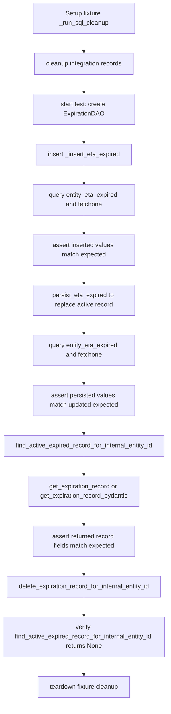

# Diagram: shipment_core/shipment_service/shipment_service/eta/tests/test_expiration_dao.py


> Auto-generated by Obscura crawlers

## Diagram 1

```mermaid
classDiagram
    class TestExpirationDao {
        +test_insert_and_persist_eta_expired(db_conn_entity)
        +test_find_active_expired_record_for_internal_entity_id_pydantic(db_conn_entity)
        +test_find_active_expired_record_for_internal_entity_id(db_conn_entity)
        +test_delete_expiration_record_for_internal_entity_id(db_conn_entity)
    }
    class ExpirationDAO {
        +_insert_eta_expired(...)
        +persist_eta_expired(...)
        +find_active_expired_record_for_internal_entity_id(...)
        +get_expiration_record(...)
        +get_expiration_record_pydantic(...)
        +delete_expiration_record_for_internal_entity_id(...)
    }
    class MockEtaExpirationSource {
        <<enum>>
        +IntegrationTest
    }
    class FvDatabaseConnector {
        +get_cursor()
    }
    class Cursor {
        +execute(sql, params)
        +fetchone()
        +fetchall()
    }

    TestExpirationDao --> ExpirationDAO : uses
    TestExpirationDao --> FvDatabaseConnector : fixture db_conn_entity
    FvDatabaseConnector --> Cursor : returns
    ExpirationDAO --> Cursor : executes SQL
    ExpirationDAO --|> MockEtaExpirationSource : accepts expiration_source
    MockEtaExpirationSource <|-- "string enum" : represents
```

> SVG rendering failed for this diagram.

## Diagram 2



### SVG

<svg id="container" width="440.796875" xmlns="http://www.w3.org/2000/svg" class="flowchart" height="1790" viewBox="0 0 440.796875 1790" role="graphics-document document" aria-roledescription="flowchart-v2"><style>#container{font-family:"trebuchet ms",verdana,arial,sans-serif;font-size:16px;fill:#333;}@keyframes edge-animation-frame{from{stroke-dashoffset:0;}}@keyframes dash{to{stroke-dashoffset:0;}}#container .edge-animation-slow{stroke-dasharray:9,5!important;stroke-dashoffset:900;animation:dash 50s linear infinite;stroke-linecap:round;}#container .edge-animation-fast{stroke-dasharray:9,5!important;stroke-dashoffset:900;animation:dash 20s linear infinite;stroke-linecap:round;}#container .error-icon{fill:#552222;}#container .error-text{fill:#552222;stroke:#552222;}#container .edge-thickness-normal{stroke-width:1px;}#container .edge-thickness-thick{stroke-width:3.5px;}#container .edge-pattern-solid{stroke-dasharray:0;}#container .edge-thickness-invisible{stroke-width:0;fill:none;}#container .edge-pattern-dashed{stroke-dasharray:3;}#container .edge-pattern-dotted{stroke-dasharray:2;}#container .marker{fill:#333333;stroke:#333333;}#container .marker.cross{stroke:#333333;}#container svg{font-family:"trebuchet ms",verdana,arial,sans-serif;font-size:16px;}#container p{margin:0;}#container .label{font-family:"trebuchet ms",verdana,arial,sans-serif;color:#333;}#container .cluster-label text{fill:#333;}#container .cluster-label span{color:#333;}#container .cluster-label span p{background-color:transparent;}#container .label text,#container span{fill:#333;color:#333;}#container .node rect,#container .node circle,#container .node ellipse,#container .node polygon,#container .node path{fill:#ECECFF;stroke:#9370DB;stroke-width:1px;}#container .rough-node .label text,#container .node .label text,#container .image-shape .label,#container .icon-shape .label{text-anchor:middle;}#container .node .katex path{fill:#000;stroke:#000;stroke-width:1px;}#container .rough-node .label,#container .node .label,#container .image-shape .label,#container .icon-shape .label{text-align:center;}#container .node.clickable{cursor:pointer;}#container .root .anchor path{fill:#333333!important;stroke-width:0;stroke:#333333;}#container .arrowheadPath{fill:#333333;}#container .edgePath .path{stroke:#333333;stroke-width:2.0px;}#container .flowchart-link{stroke:#333333;fill:none;}#container .edgeLabel{background-color:rgba(232,232,232, 0.8);text-align:center;}#container .edgeLabel p{background-color:rgba(232,232,232, 0.8);}#container .edgeLabel rect{opacity:0.5;background-color:rgba(232,232,232, 0.8);fill:rgba(232,232,232, 0.8);}#container .labelBkg{background-color:rgba(232, 232, 232, 0.5);}#container .cluster rect{fill:#ffffde;stroke:#aaaa33;stroke-width:1px;}#container .cluster text{fill:#333;}#container .cluster span{color:#333;}#container div.mermaidTooltip{position:absolute;text-align:center;max-width:200px;padding:2px;font-family:"trebuchet ms",verdana,arial,sans-serif;font-size:12px;background:hsl(80, 100%, 96.2745098039%);border:1px solid #aaaa33;border-radius:2px;pointer-events:none;z-index:100;}#container .flowchartTitleText{text-anchor:middle;font-size:18px;fill:#333;}#container rect.text{fill:none;stroke-width:0;}#container .icon-shape,#container .image-shape{background-color:rgba(232,232,232, 0.8);text-align:center;}#container .icon-shape p,#container .image-shape p{background-color:rgba(232,232,232, 0.8);padding:2px;}#container .icon-shape rect,#container .image-shape rect{opacity:0.5;background-color:rgba(232,232,232, 0.8);fill:rgba(232,232,232, 0.8);}#container .label-icon{display:inline-block;height:1em;overflow:visible;vertical-align:-0.125em;}#container .node .label-icon path{fill:currentColor;stroke:revert;stroke-width:revert;}#container :root{--mermaid-font-family:"trebuchet ms",verdana,arial,sans-serif;}</style><g><marker id="container_flowchart-v2-pointEnd" class="marker flowchart-v2" viewBox="0 0 10 10" refX="5" refY="5" markerUnits="userSpaceOnUse" markerWidth="8" markerHeight="8" orient="auto"><path d="M 0 0 L 10 5 L 0 10 z" class="arrowMarkerPath" style="stroke-width: 1; stroke-dasharray: 1, 0;"></path></marker><marker id="container_flowchart-v2-pointStart" class="marker flowchart-v2" viewBox="0 0 10 10" refX="4.5" refY="5" markerUnits="userSpaceOnUse" markerWidth="8" markerHeight="8" orient="auto"><path d="M 0 5 L 10 10 L 10 0 z" class="arrowMarkerPath" style="stroke-width: 1; stroke-dasharray: 1, 0;"></path></marker><marker id="container_flowchart-v2-circleEnd" class="marker flowchart-v2" viewBox="0 0 10 10" refX="11" refY="5" markerUnits="userSpaceOnUse" markerWidth="11" markerHeight="11" orient="auto"><circle cx="5" cy="5" r="5" class="arrowMarkerPath" style="stroke-width: 1; stroke-dasharray: 1, 0;"></circle></marker><marker id="container_flowchart-v2-circleStart" class="marker flowchart-v2" viewBox="0 0 10 10" refX="-1" refY="5" markerUnits="userSpaceOnUse" markerWidth="11" markerHeight="11" orient="auto"><circle cx="5" cy="5" r="5" class="arrowMarkerPath" style="stroke-width: 1; stroke-dasharray: 1, 0;"></circle></marker><marker id="container_flowchart-v2-crossEnd" class="marker cross flowchart-v2" viewBox="0 0 11 11" refX="12" refY="5.2" markerUnits="userSpaceOnUse" markerWidth="11" markerHeight="11" orient="auto"><path d="M 1,1 l 9,9 M 10,1 l -9,9" class="arrowMarkerPath" style="stroke-width: 2; stroke-dasharray: 1, 0;"></path></marker><marker id="container_flowchart-v2-crossStart" class="marker cross flowchart-v2" viewBox="0 0 11 11" refX="-1" refY="5.2" markerUnits="userSpaceOnUse" markerWidth="11" markerHeight="11" orient="auto"><path d="M 1,1 l 9,9 M 10,1 l -9,9" class="arrowMarkerPath" style="stroke-width: 2; stroke-dasharray: 1, 0;"></path></marker><g class="root"><g class="clusters"></g><g class="edgePaths"><path d="M220.398,86L220.398,90.167C220.398,94.333,220.398,102.667,220.398,110.333C220.398,118,220.398,125,220.398,128.5L220.398,132" id="L_A_B_0" class="edge-thickness-normal edge-pattern-solid edge-thickness-normal edge-pattern-solid flowchart-link" style=";" data-edge="true" data-et="edge" data-id="L_A_B_0" data-points="W3sieCI6MjIwLjM5ODQzNzUsInkiOjg2fSx7IngiOjIyMC4zOTg0Mzc1LCJ5IjoxMTF9LHsieCI6MjIwLjM5ODQzNzUsInkiOjEzNn1d" marker-end="url(#container_flowchart-v2-pointEnd)"></path><path d="M220.398,190L220.398,194.167C220.398,198.333,220.398,206.667,220.398,214.333C220.398,222,220.398,229,220.398,232.5L220.398,236" id="L_B_C_0" class="edge-thickness-normal edge-pattern-solid edge-thickness-normal edge-pattern-solid flowchart-link" style=";" data-edge="true" data-et="edge" data-id="L_B_C_0" data-points="W3sieCI6MjIwLjM5ODQzNzUsInkiOjE5MH0seyJ4IjoyMjAuMzk4NDM3NSwieSI6MjE1fSx7IngiOjIyMC4zOTg0Mzc1LCJ5IjoyNDB9XQ==" marker-end="url(#container_flowchart-v2-pointEnd)"></path><path d="M220.398,318L220.398,322.167C220.398,326.333,220.398,334.667,220.398,342.333C220.398,350,220.398,357,220.398,360.5L220.398,364" id="L_C_D_0" class="edge-thickness-normal edge-pattern-solid edge-thickness-normal edge-pattern-solid flowchart-link" style=";" data-edge="true" data-et="edge" data-id="L_C_D_0" data-points="W3sieCI6MjIwLjM5ODQzNzUsInkiOjMxOH0seyJ4IjoyMjAuMzk4NDM3NSwieSI6MzQzfSx7IngiOjIyMC4zOTg0Mzc1LCJ5IjozNjh9XQ==" marker-end="url(#container_flowchart-v2-pointEnd)"></path><path d="M220.398,422L220.398,426.167C220.398,430.333,220.398,438.667,220.398,446.333C220.398,454,220.398,461,220.398,464.5L220.398,468" id="L_D_E_0" class="edge-thickness-normal edge-pattern-solid edge-thickness-normal edge-pattern-solid flowchart-link" style=";" data-edge="true" data-et="edge" data-id="L_D_E_0" data-points="W3sieCI6MjIwLjM5ODQzNzUsInkiOjQyMn0seyJ4IjoyMjAuMzk4NDM3NSwieSI6NDQ3fSx7IngiOjIyMC4zOTg0Mzc1LCJ5Ijo0NzJ9XQ==" marker-end="url(#container_flowchart-v2-pointEnd)"></path><path d="M220.398,550L220.398,554.167C220.398,558.333,220.398,566.667,220.398,574.333C220.398,582,220.398,589,220.398,592.5L220.398,596" id="L_E_F_0" class="edge-thickness-normal edge-pattern-solid edge-thickness-normal edge-pattern-solid flowchart-link" style=";" data-edge="true" data-et="edge" data-id="L_E_F_0" data-points="W3sieCI6MjIwLjM5ODQzNzUsInkiOjU1MH0seyJ4IjoyMjAuMzk4NDM3NSwieSI6NTc1fSx7IngiOjIyMC4zOTg0Mzc1LCJ5Ijo2MDB9XQ==" marker-end="url(#container_flowchart-v2-pointEnd)"></path><path d="M220.398,678L220.398,682.167C220.398,686.333,220.398,694.667,220.398,702.333C220.398,710,220.398,717,220.398,720.5L220.398,724" id="L_F_G_0" class="edge-thickness-normal edge-pattern-solid edge-thickness-normal edge-pattern-solid flowchart-link" style=";" data-edge="true" data-et="edge" data-id="L_F_G_0" data-points="W3sieCI6MjIwLjM5ODQzNzUsInkiOjY3OH0seyJ4IjoyMjAuMzk4NDM3NSwieSI6NzAzfSx7IngiOjIyMC4zOTg0Mzc1LCJ5Ijo3Mjh9XQ==" marker-end="url(#container_flowchart-v2-pointEnd)"></path><path d="M220.398,806L220.398,810.167C220.398,814.333,220.398,822.667,220.398,830.333C220.398,838,220.398,845,220.398,848.5L220.398,852" id="L_G_H_0" class="edge-thickness-normal edge-pattern-solid edge-thickness-normal edge-pattern-solid flowchart-link" style=";" data-edge="true" data-et="edge" data-id="L_G_H_0" data-points="W3sieCI6MjIwLjM5ODQzNzUsInkiOjgwNn0seyJ4IjoyMjAuMzk4NDM3NSwieSI6ODMxfSx7IngiOjIyMC4zOTg0Mzc1LCJ5Ijo4NTZ9XQ==" marker-end="url(#container_flowchart-v2-pointEnd)"></path><path d="M220.398,934L220.398,938.167C220.398,942.333,220.398,950.667,220.398,958.333C220.398,966,220.398,973,220.398,976.5L220.398,980" id="L_H_I_0" class="edge-thickness-normal edge-pattern-solid edge-thickness-normal edge-pattern-solid flowchart-link" style=";" data-edge="true" data-et="edge" data-id="L_H_I_0" data-points="W3sieCI6MjIwLjM5ODQzNzUsInkiOjkzNH0seyJ4IjoyMjAuMzk4NDM3NSwieSI6OTU5fSx7IngiOjIyMC4zOTg0Mzc1LCJ5Ijo5ODR9XQ==" marker-end="url(#container_flowchart-v2-pointEnd)"></path><path d="M220.398,1062L220.398,1066.167C220.398,1070.333,220.398,1078.667,220.398,1086.333C220.398,1094,220.398,1101,220.398,1104.5L220.398,1108" id="L_I_J_0" class="edge-thickness-normal edge-pattern-solid edge-thickness-normal edge-pattern-solid flowchart-link" style=";" data-edge="true" data-et="edge" data-id="L_I_J_0" data-points="W3sieCI6MjIwLjM5ODQzNzUsInkiOjEwNjJ9LHsieCI6MjIwLjM5ODQzNzUsInkiOjEwODd9LHsieCI6MjIwLjM5ODQzNzUsInkiOjExMTJ9XQ==" marker-end="url(#container_flowchart-v2-pointEnd)"></path><path d="M220.398,1166L220.398,1170.167C220.398,1174.333,220.398,1182.667,220.398,1190.333C220.398,1198,220.398,1205,220.398,1208.5L220.398,1212" id="L_J_K_0" class="edge-thickness-normal edge-pattern-solid edge-thickness-normal edge-pattern-solid flowchart-link" style=";" data-edge="true" data-et="edge" data-id="L_J_K_0" data-points="W3sieCI6MjIwLjM5ODQzNzUsInkiOjExNjZ9LHsieCI6MjIwLjM5ODQzNzUsInkiOjExOTF9LHsieCI6MjIwLjM5ODQzNzUsInkiOjEyMTZ9XQ==" marker-end="url(#container_flowchart-v2-pointEnd)"></path><path d="M220.398,1294L220.398,1298.167C220.398,1302.333,220.398,1310.667,220.398,1318.333C220.398,1326,220.398,1333,220.398,1336.5L220.398,1340" id="L_K_L_0" class="edge-thickness-normal edge-pattern-solid edge-thickness-normal edge-pattern-solid flowchart-link" style=";" data-edge="true" data-et="edge" data-id="L_K_L_0" data-points="W3sieCI6MjIwLjM5ODQzNzUsInkiOjEyOTR9LHsieCI6MjIwLjM5ODQzNzUsInkiOjEzMTl9LHsieCI6MjIwLjM5ODQzNzUsInkiOjEzNDR9XQ==" marker-end="url(#container_flowchart-v2-pointEnd)"></path><path d="M220.398,1422L220.398,1426.167C220.398,1430.333,220.398,1438.667,220.398,1446.333C220.398,1454,220.398,1461,220.398,1464.5L220.398,1468" id="L_L_M_0" class="edge-thickness-normal edge-pattern-solid edge-thickness-normal edge-pattern-solid flowchart-link" style=";" data-edge="true" data-et="edge" data-id="L_L_M_0" data-points="W3sieCI6MjIwLjM5ODQzNzUsInkiOjE0MjJ9LHsieCI6MjIwLjM5ODQzNzUsInkiOjE0NDd9LHsieCI6MjIwLjM5ODQzNzUsInkiOjE0NzJ9XQ==" marker-end="url(#container_flowchart-v2-pointEnd)"></path><path d="M220.398,1526L220.398,1530.167C220.398,1534.333,220.398,1542.667,220.398,1550.333C220.398,1558,220.398,1565,220.398,1568.5L220.398,1572" id="L_M_N_0" class="edge-thickness-normal edge-pattern-solid edge-thickness-normal edge-pattern-solid flowchart-link" style=";" data-edge="true" data-et="edge" data-id="L_M_N_0" data-points="W3sieCI6MjIwLjM5ODQzNzUsInkiOjE1MjZ9LHsieCI6MjIwLjM5ODQzNzUsInkiOjE1NTF9LHsieCI6MjIwLjM5ODQzNzUsInkiOjE1NzZ9XQ==" marker-end="url(#container_flowchart-v2-pointEnd)"></path><path d="M220.398,1678L220.398,1682.167C220.398,1686.333,220.398,1694.667,220.398,1702.333C220.398,1710,220.398,1717,220.398,1720.5L220.398,1724" id="L_N_O_0" class="edge-thickness-normal edge-pattern-solid edge-thickness-normal edge-pattern-solid flowchart-link" style=";" data-edge="true" data-et="edge" data-id="L_N_O_0" data-points="W3sieCI6MjIwLjM5ODQzNzUsInkiOjE2Nzh9LHsieCI6MjIwLjM5ODQzNzUsInkiOjE3MDN9LHsieCI6MjIwLjM5ODQzNzUsInkiOjE3Mjh9XQ==" marker-end="url(#container_flowchart-v2-pointEnd)"></path></g><g class="edgeLabels"><g class="edgeLabel"><g class="label" data-id="L_A_B_0" transform="translate(0, 0)"><foreignObject width="0" height="0"><div xmlns="http://www.w3.org/1999/xhtml" class="labelBkg" style="display: table-cell; white-space: nowrap; line-height: 1.5; max-width: 200px; text-align: center;"><span class="edgeLabel"></span></div></foreignObject></g></g><g class="edgeLabel"><g class="label" data-id="L_B_C_0" transform="translate(0, 0)"><foreignObject width="0" height="0"><div xmlns="http://www.w3.org/1999/xhtml" class="labelBkg" style="display: table-cell; white-space: nowrap; line-height: 1.5; max-width: 200px; text-align: center;"><span class="edgeLabel"></span></div></foreignObject></g></g><g class="edgeLabel"><g class="label" data-id="L_C_D_0" transform="translate(0, 0)"><foreignObject width="0" height="0"><div xmlns="http://www.w3.org/1999/xhtml" class="labelBkg" style="display: table-cell; white-space: nowrap; line-height: 1.5; max-width: 200px; text-align: center;"><span class="edgeLabel"></span></div></foreignObject></g></g><g class="edgeLabel"><g class="label" data-id="L_D_E_0" transform="translate(0, 0)"><foreignObject width="0" height="0"><div xmlns="http://www.w3.org/1999/xhtml" class="labelBkg" style="display: table-cell; white-space: nowrap; line-height: 1.5; max-width: 200px; text-align: center;"><span class="edgeLabel"></span></div></foreignObject></g></g><g class="edgeLabel"><g class="label" data-id="L_E_F_0" transform="translate(0, 0)"><foreignObject width="0" height="0"><div xmlns="http://www.w3.org/1999/xhtml" class="labelBkg" style="display: table-cell; white-space: nowrap; line-height: 1.5; max-width: 200px; text-align: center;"><span class="edgeLabel"></span></div></foreignObject></g></g><g class="edgeLabel"><g class="label" data-id="L_F_G_0" transform="translate(0, 0)"><foreignObject width="0" height="0"><div xmlns="http://www.w3.org/1999/xhtml" class="labelBkg" style="display: table-cell; white-space: nowrap; line-height: 1.5; max-width: 200px; text-align: center;"><span class="edgeLabel"></span></div></foreignObject></g></g><g class="edgeLabel"><g class="label" data-id="L_G_H_0" transform="translate(0, 0)"><foreignObject width="0" height="0"><div xmlns="http://www.w3.org/1999/xhtml" class="labelBkg" style="display: table-cell; white-space: nowrap; line-height: 1.5; max-width: 200px; text-align: center;"><span class="edgeLabel"></span></div></foreignObject></g></g><g class="edgeLabel"><g class="label" data-id="L_H_I_0" transform="translate(0, 0)"><foreignObject width="0" height="0"><div xmlns="http://www.w3.org/1999/xhtml" class="labelBkg" style="display: table-cell; white-space: nowrap; line-height: 1.5; max-width: 200px; text-align: center;"><span class="edgeLabel"></span></div></foreignObject></g></g><g class="edgeLabel"><g class="label" data-id="L_I_J_0" transform="translate(0, 0)"><foreignObject width="0" height="0"><div xmlns="http://www.w3.org/1999/xhtml" class="labelBkg" style="display: table-cell; white-space: nowrap; line-height: 1.5; max-width: 200px; text-align: center;"><span class="edgeLabel"></span></div></foreignObject></g></g><g class="edgeLabel"><g class="label" data-id="L_J_K_0" transform="translate(0, 0)"><foreignObject width="0" height="0"><div xmlns="http://www.w3.org/1999/xhtml" class="labelBkg" style="display: table-cell; white-space: nowrap; line-height: 1.5; max-width: 200px; text-align: center;"><span class="edgeLabel"></span></div></foreignObject></g></g><g class="edgeLabel"><g class="label" data-id="L_K_L_0" transform="translate(0, 0)"><foreignObject width="0" height="0"><div xmlns="http://www.w3.org/1999/xhtml" class="labelBkg" style="display: table-cell; white-space: nowrap; line-height: 1.5; max-width: 200px; text-align: center;"><span class="edgeLabel"></span></div></foreignObject></g></g><g class="edgeLabel"><g class="label" data-id="L_L_M_0" transform="translate(0, 0)"><foreignObject width="0" height="0"><div xmlns="http://www.w3.org/1999/xhtml" class="labelBkg" style="display: table-cell; white-space: nowrap; line-height: 1.5; max-width: 200px; text-align: center;"><span class="edgeLabel"></span></div></foreignObject></g></g><g class="edgeLabel"><g class="label" data-id="L_M_N_0" transform="translate(0, 0)"><foreignObject width="0" height="0"><div xmlns="http://www.w3.org/1999/xhtml" class="labelBkg" style="display: table-cell; white-space: nowrap; line-height: 1.5; max-width: 200px; text-align: center;"><span class="edgeLabel"></span></div></foreignObject></g></g><g class="edgeLabel"><g class="label" data-id="L_N_O_0" transform="translate(0, 0)"><foreignObject width="0" height="0"><div xmlns="http://www.w3.org/1999/xhtml" class="labelBkg" style="display: table-cell; white-space: nowrap; line-height: 1.5; max-width: 200px; text-align: center;"><span class="edgeLabel"></span></div></foreignObject></g></g></g><g class="nodes"><g class="node default" id="flowchart-A-0" transform="translate(220.3984375, 47)"><rect class="basic label-container" style="" x="-130" y="-39" width="260" height="78"></rect><g class="label" style="" transform="translate(-100, -24)"><rect></rect><foreignObject width="200" height="48"><div xmlns="http://www.w3.org/1999/xhtml" style="display: table; white-space: break-spaces; line-height: 1.5; max-width: 200px; text-align: center; width: 200px;"><span class="nodeLabel"><p>Setup fixture _run_sql_cleanup</p></span></div></foreignObject></g></g><g class="node default" id="flowchart-B-1" transform="translate(220.3984375, 163)"><rect class="basic label-container" style="" x="-129.90625" y="-27" width="259.8125" height="54"></rect><g class="label" style="" transform="translate(-99.90625, -12)"><rect></rect><foreignObject width="199.8125" height="24"><div xmlns="http://www.w3.org/1999/xhtml" style="display: table-cell; white-space: nowrap; line-height: 1.5; max-width: 200px; text-align: center;"><span class="nodeLabel"><p>cleanup integration records</p></span></div></foreignObject></g></g><g class="node default" id="flowchart-C-3" transform="translate(220.3984375, 279)"><rect class="basic label-container" style="" x="-130" y="-39" width="260" height="78"></rect><g class="label" style="" transform="translate(-100, -24)"><rect></rect><foreignObject width="200" height="48"><div xmlns="http://www.w3.org/1999/xhtml" style="display: table; white-space: break-spaces; line-height: 1.5; max-width: 200px; text-align: center; width: 200px;"><span class="nodeLabel"><p>start test: create ExpirationDAO</p></span></div></foreignObject></g></g><g class="node default" id="flowchart-D-5" transform="translate(220.3984375, 395)"><rect class="basic label-container" style="" x="-125.03125" y="-27" width="250.0625" height="54"></rect><g class="label" style="" transform="translate(-95.03125, -12)"><rect></rect><foreignObject width="190.0625" height="24"><div xmlns="http://www.w3.org/1999/xhtml" style="display: table-cell; white-space: nowrap; line-height: 1.5; max-width: 200px; text-align: center;"><span class="nodeLabel"><p>insert _insert_eta_expired</p></span></div></foreignObject></g></g><g class="node default" id="flowchart-E-7" transform="translate(220.3984375, 511)"><rect class="basic label-container" style="" x="-130" y="-39" width="260" height="78"></rect><g class="label" style="" transform="translate(-100, -24)"><rect></rect><foreignObject width="200" height="48"><div xmlns="http://www.w3.org/1999/xhtml" style="display: table; white-space: break-spaces; line-height: 1.5; max-width: 200px; text-align: center; width: 200px;"><span class="nodeLabel"><p>query entity_eta_expired and fetchone</p></span></div></foreignObject></g></g><g class="node default" id="flowchart-F-9" transform="translate(220.3984375, 639)"><rect class="basic label-container" style="" x="-130" y="-39" width="260" height="78"></rect><g class="label" style="" transform="translate(-100, -24)"><rect></rect><foreignObject width="200" height="48"><div xmlns="http://www.w3.org/1999/xhtml" style="display: table; white-space: break-spaces; line-height: 1.5; max-width: 200px; text-align: center; width: 200px;"><span class="nodeLabel"><p>assert inserted values match expected</p></span></div></foreignObject></g></g><g class="node default" id="flowchart-G-11" transform="translate(220.3984375, 767)"><rect class="basic label-container" style="" x="-130" y="-39" width="260" height="78"></rect><g class="label" style="" transform="translate(-100, -24)"><rect></rect><foreignObject width="200" height="48"><div xmlns="http://www.w3.org/1999/xhtml" style="display: table; white-space: break-spaces; line-height: 1.5; max-width: 200px; text-align: center; width: 200px;"><span class="nodeLabel"><p>persist_eta_expired to replace active record</p></span></div></foreignObject></g></g><g class="node default" id="flowchart-H-13" transform="translate(220.3984375, 895)"><rect class="basic label-container" style="" x="-130" y="-39" width="260" height="78"></rect><g class="label" style="" transform="translate(-100, -24)"><rect></rect><foreignObject width="200" height="48"><div xmlns="http://www.w3.org/1999/xhtml" style="display: table; white-space: break-spaces; line-height: 1.5; max-width: 200px; text-align: center; width: 200px;"><span class="nodeLabel"><p>query entity_eta_expired and fetchone</p></span></div></foreignObject></g></g><g class="node default" id="flowchart-I-15" transform="translate(220.3984375, 1023)"><rect class="basic label-container" style="" x="-130" y="-39" width="260" height="78"></rect><g class="label" style="" transform="translate(-100, -24)"><rect></rect><foreignObject width="200" height="48"><div xmlns="http://www.w3.org/1999/xhtml" style="display: table; white-space: break-spaces; line-height: 1.5; max-width: 200px; text-align: center; width: 200px;"><span class="nodeLabel"><p>assert persisted values match updated expected</p></span></div></foreignObject></g></g><g class="node default" id="flowchart-J-17" transform="translate(220.3984375, 1139)"><rect class="basic label-container" style="" x="-210.28125" y="-27" width="420.5625" height="54"></rect><g class="label" style="" transform="translate(-180.28125, -12)"><rect></rect><foreignObject width="360.5625" height="24"><div xmlns="http://www.w3.org/1999/xhtml" style="display: table; white-space: break-spaces; line-height: 1.5; max-width: 200px; text-align: center; width: 200px;"><span class="nodeLabel"><p>find_active_expired_record_for_internal_entity_id</p></span></div></foreignObject></g></g><g class="node default" id="flowchart-K-19" transform="translate(220.3984375, 1255)"><rect class="basic label-container" style="" x="-145.03125" y="-39" width="290.0625" height="78"></rect><g class="label" style="" transform="translate(-115.03125, -24)"><rect></rect><foreignObject width="230.0625" height="48"><div xmlns="http://www.w3.org/1999/xhtml" style="display: table; white-space: break-spaces; line-height: 1.5; max-width: 200px; text-align: center; width: 200px;"><span class="nodeLabel"><p>get_expiration_record or get_expiration_record_pydantic</p></span></div></foreignObject></g></g><g class="node default" id="flowchart-L-21" transform="translate(220.3984375, 1383)"><rect class="basic label-container" style="" x="-130" y="-39" width="260" height="78"></rect><g class="label" style="" transform="translate(-100, -24)"><rect></rect><foreignObject width="200" height="48"><div xmlns="http://www.w3.org/1999/xhtml" style="display: table; white-space: break-spaces; line-height: 1.5; max-width: 200px; text-align: center; width: 200px;"><span class="nodeLabel"><p>assert returned record fields match expected</p></span></div></foreignObject></g></g><g class="node default" id="flowchart-M-23" transform="translate(220.3984375, 1499)"><rect class="basic label-container" style="" x="-203.234375" y="-27" width="406.46875" height="54"></rect><g class="label" style="" transform="translate(-173.234375, -12)"><rect></rect><foreignObject width="346.46875" height="24"><div xmlns="http://www.w3.org/1999/xhtml" style="display: table; white-space: break-spaces; line-height: 1.5; max-width: 200px; text-align: center; width: 200px;"><span class="nodeLabel"><p>delete_expiration_record_for_internal_entity_id</p></span></div></foreignObject></g></g><g class="node default" id="flowchart-N-25" transform="translate(220.3984375, 1627)"><rect class="basic label-container" style="" x="-212.3984375" y="-51" width="424.796875" height="102"></rect><g class="label" style="" transform="translate(-182.3984375, -36)"><rect></rect><foreignObject width="364.796875" height="72"><div xmlns="http://www.w3.org/1999/xhtml" style="display: table; white-space: break-spaces; line-height: 1.5; max-width: 200px; text-align: center; width: 200px;"><span class="nodeLabel"><p>verify find_active_expired_record_for_internal_entity_id returns None</p></span></div></foreignObject></g></g><g class="node default" id="flowchart-O-27" transform="translate(220.3984375, 1755)"><rect class="basic label-container" style="" x="-120.4609375" y="-27" width="240.921875" height="54"></rect><g class="label" style="" transform="translate(-90.4609375, -12)"><rect></rect><foreignObject width="180.921875" height="24"><div xmlns="http://www.w3.org/1999/xhtml" style="display: table-cell; white-space: nowrap; line-height: 1.5; max-width: 200px; text-align: center;"><span class="nodeLabel"><p>teardown fixture cleanup</p></span></div></foreignObject></g></g></g></g></g></svg>
