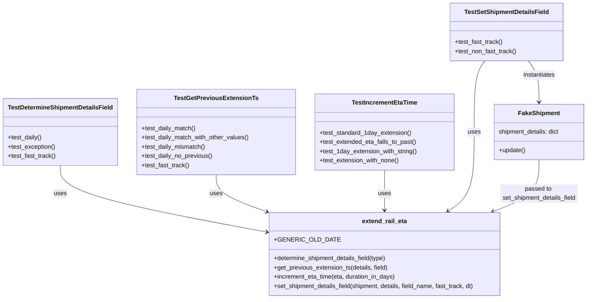

# Diagram: shipment_core/shipment_service/shipment_service/eta/tests/test_extend_rail_eta.py


> Auto-generated by Obscura crawlers

## Diagram 1



### SVG

<svg id="container" width="1509.453125" xmlns="http://www.w3.org/2000/svg" class="classDiagram" height="776" viewBox="0 0 1509.453125 776" role="graphics-document document" aria-roledescription="class"><style>#container{font-family:"trebuchet ms",verdana,arial,sans-serif;font-size:16px;fill:#333;}@keyframes edge-animation-frame{from{stroke-dashoffset:0;}}@keyframes dash{to{stroke-dashoffset:0;}}#container .edge-animation-slow{stroke-dasharray:9,5!important;stroke-dashoffset:900;animation:dash 50s linear infinite;stroke-linecap:round;}#container .edge-animation-fast{stroke-dasharray:9,5!important;stroke-dashoffset:900;animation:dash 20s linear infinite;stroke-linecap:round;}#container .error-icon{fill:#552222;}#container .error-text{fill:#552222;stroke:#552222;}#container .edge-thickness-normal{stroke-width:1px;}#container .edge-thickness-thick{stroke-width:3.5px;}#container .edge-pattern-solid{stroke-dasharray:0;}#container .edge-thickness-invisible{stroke-width:0;fill:none;}#container .edge-pattern-dashed{stroke-dasharray:3;}#container .edge-pattern-dotted{stroke-dasharray:2;}#container .marker{fill:#333333;stroke:#333333;}#container .marker.cross{stroke:#333333;}#container svg{font-family:"trebuchet ms",verdana,arial,sans-serif;font-size:16px;}#container p{margin:0;}#container g.classGroup text{fill:#9370DB;stroke:none;font-family:"trebuchet ms",verdana,arial,sans-serif;font-size:10px;}#container g.classGroup text .title{font-weight:bolder;}#container .nodeLabel,#container .edgeLabel{color:#131300;}#container .edgeLabel .label rect{fill:#ECECFF;}#container .label text{fill:#131300;}#container .labelBkg{background:#ECECFF;}#container .edgeLabel .label span{background:#ECECFF;}#container .classTitle{font-weight:bolder;}#container .node rect,#container .node circle,#container .node ellipse,#container .node polygon,#container .node path{fill:#ECECFF;stroke:#9370DB;stroke-width:1px;}#container .divider{stroke:#9370DB;stroke-width:1;}#container g.clickable{cursor:pointer;}#container g.classGroup rect{fill:#ECECFF;stroke:#9370DB;}#container g.classGroup line{stroke:#9370DB;stroke-width:1;}#container .classLabel .box{stroke:none;stroke-width:0;fill:#ECECFF;opacity:0.5;}#container .classLabel .label{fill:#9370DB;font-size:10px;}#container .relation{stroke:#333333;stroke-width:1;fill:none;}#container .dashed-line{stroke-dasharray:3;}#container .dotted-line{stroke-dasharray:1 2;}#container #compositionStart,#container .composition{fill:#333333!important;stroke:#333333!important;stroke-width:1;}#container #compositionEnd,#container .composition{fill:#333333!important;stroke:#333333!important;stroke-width:1;}#container #dependencyStart,#container .dependency{fill:#333333!important;stroke:#333333!important;stroke-width:1;}#container #dependencyStart,#container .dependency{fill:#333333!important;stroke:#333333!important;stroke-width:1;}#container #extensionStart,#container .extension{fill:transparent!important;stroke:#333333!important;stroke-width:1;}#container #extensionEnd,#container .extension{fill:transparent!important;stroke:#333333!important;stroke-width:1;}#container #aggregationStart,#container .aggregation{fill:transparent!important;stroke:#333333!important;stroke-width:1;}#container #aggregationEnd,#container .aggregation{fill:transparent!important;stroke:#333333!important;stroke-width:1;}#container #lollipopStart,#container .lollipop{fill:#ECECFF!important;stroke:#333333!important;stroke-width:1;}#container #lollipopEnd,#container .lollipop{fill:#ECECFF!important;stroke:#333333!important;stroke-width:1;}#container .edgeTerminals{font-size:11px;line-height:initial;}#container .classTitleText{text-anchor:middle;font-size:18px;fill:#333;}#container .label-icon{display:inline-block;height:1em;overflow:visible;vertical-align:-0.125em;}#container .node .label-icon path{fill:currentColor;stroke:revert;stroke-width:revert;}#container :root{--mermaid-font-family:"trebuchet ms",verdana,arial,sans-serif;}</style><g><defs><marker id="container_class-aggregationStart" class="marker aggregation class" refX="18" refY="7" markerWidth="190" markerHeight="240" orient="auto"><path d="M 18,7 L9,13 L1,7 L9,1 Z"></path></marker></defs><defs><marker id="container_class-aggregationEnd" class="marker aggregation class" refX="1" refY="7" markerWidth="20" markerHeight="28" orient="auto"><path d="M 18,7 L9,13 L1,7 L9,1 Z"></path></marker></defs><defs><marker id="container_class-extensionStart" class="marker extension class" refX="18" refY="7" markerWidth="190" markerHeight="240" orient="auto"><path d="M 1,7 L18,13 V 1 Z"></path></marker></defs><defs><marker id="container_class-extensionEnd" class="marker extension class" refX="1" refY="7" markerWidth="20" markerHeight="28" orient="auto"><path d="M 1,1 V 13 L18,7 Z"></path></marker></defs><defs><marker id="container_class-compositionStart" class="marker composition class" refX="18" refY="7" markerWidth="190" markerHeight="240" orient="auto"><path d="M 18,7 L9,13 L1,7 L9,1 Z"></path></marker></defs><defs><marker id="container_class-compositionEnd" class="marker composition class" refX="1" refY="7" markerWidth="20" markerHeight="28" orient="auto"><path d="M 18,7 L9,13 L1,7 L9,1 Z"></path></marker></defs><defs><marker id="container_class-dependencyStart" class="marker dependency class" refX="6" refY="7" markerWidth="190" markerHeight="240" orient="auto"><path d="M 5,7 L9,13 L1,7 L9,1 Z"></path></marker></defs><defs><marker id="container_class-dependencyEnd" class="marker dependency class" refX="13" refY="7" markerWidth="20" markerHeight="28" orient="auto"><path d="M 18,7 L9,13 L14,7 L9,1 Z"></path></marker></defs><defs><marker id="container_class-lollipopStart" class="marker lollipop class" refX="13" refY="7" markerWidth="190" markerHeight="240" orient="auto"><circle stroke="black" fill="transparent" cx="7" cy="7" r="6"></circle></marker></defs><defs><marker id="container_class-lollipopEnd" class="marker lollipop class" refX="1" refY="7" markerWidth="190" markerHeight="240" orient="auto"><circle stroke="black" fill="transparent" cx="7" cy="7" r="6"></circle></marker></defs><g class="root"><g class="clusters"></g><g class="edgePaths"><path d="M151.563,430L151.563,442.167C151.563,454.333,151.563,478.667,238.009,507.17C324.455,535.674,497.348,568.349,583.795,584.686L670.241,601.023" id="id_TestDetermineShipmentDetailsField_extend_rail_eta_1" class="edge-thickness-normal edge-pattern-solid relation" style=";;;" data-edge="true" data-et="edge" data-id="id_TestDetermineShipmentDetailsField_extend_rail_eta_1" data-points="W3sieCI6MTUxLjU2MjUsInkiOjQzMH0seyJ4IjoxNTEuNTYyNSwieSI6NTAzfSx7IngiOjY3Ni4xMzY3MTg3NSwieSI6NjAyLjEzNzEwNzg0NjgyNTJ9XQ==" marker-end="url(#container_class-dependencyEnd)"></path><path d="M549.145,454L549.145,462.167C549.145,470.333,549.145,486.667,570.736,502.659C592.328,518.652,635.512,534.304,657.104,542.13L678.696,549.955" id="id_TestGetPreviousExtensionTs_extend_rail_eta_2" class="edge-thickness-normal edge-pattern-solid relation" style=";;;" data-edge="true" data-et="edge" data-id="id_TestGetPreviousExtensionTs_extend_rail_eta_2" data-points="W3sieCI6NTQ5LjE0NDUzMTI1LCJ5Ijo0NTR9LHsieCI6NTQ5LjE0NDUzMTI1LCJ5Ijo1MDN9LHsieCI6Njg0LjMzNzA4MjAwNjM2OTQsInkiOjU1Mn1d" marker-end="url(#container_class-dependencyEnd)"></path><path d="M982.313,442L982.313,452.167C982.313,462.333,982.313,482.667,982.313,500C982.313,517.333,982.313,531.667,982.313,538.833L982.313,546" id="id_TestIncrementEtaTime_extend_rail_eta_3" class="edge-thickness-normal edge-pattern-solid relation" style=";;;" data-edge="true" data-et="edge" data-id="id_TestIncrementEtaTime_extend_rail_eta_3" data-points="W3sieCI6OTgyLjMxMjUsInkiOjQ0Mn0seyJ4Ijo5ODIuMzEyNSwieSI6NTAzfSx7IngiOjk4Mi4zMTI1LCJ5Ijo1NTJ9XQ==" marker-end="url(#container_class-dependencyEnd)"></path><path d="M1241.033,158L1236.353,164.167C1231.673,170.333,1222.313,182.667,1217.633,213.5C1212.953,244.333,1212.953,293.667,1212.953,345C1212.953,396.333,1212.953,449.667,1201.783,483.937C1190.612,518.208,1168.271,533.416,1157.1,541.02L1145.93,548.624" id="id_TestSetShipmentDetailsField_extend_rail_eta_4" class="edge-thickness-normal edge-pattern-solid relation" style=";;;" data-edge="true" data-et="edge" data-id="id_TestSetShipmentDetailsField_extend_rail_eta_4" data-points="W3sieCI6MTI0MS4wMzI4MzY5MTQwNjI1LCJ5IjoxNTh9LHsieCI6MTIxMi45NTMxMjUsInkiOjE5NX0seyJ4IjoxMjEyLjk1MzEyNSwieSI6MzQzfSx7IngiOjEyMTIuOTUzMTI1LCJ5Ijo1MDN9LHsieCI6MTE0MC45Njk3NDUyMjI5MywieSI6NTUyfV0=" marker-end="url(#container_class-dependencyEnd)"></path><path d="M1354.87,158L1359.549,164.167C1364.229,170.333,1373.589,182.667,1378.269,200.5C1382.949,218.333,1382.949,241.667,1382.949,253.333L1382.949,265" id="id_TestSetShipmentDetailsField_FakeShipment_5" class="edge-thickness-normal edge-pattern-solid relation" style=";;;" data-edge="true" data-et="edge" data-id="id_TestSetShipmentDetailsField_FakeShipment_5" data-points="W3sieCI6MTM1NC44Njk1MDY4MzU5Mzc1LCJ5IjoxNTh9LHsieCI6MTM4Mi45NDkyMTg3NSwieSI6MTk1fSx7IngiOjEzODIuOTQ5MjE4NzUsInkiOjI3MX1d" marker-end="url(#container_class-dependencyEnd)"></path><path d="M1382.949,415L1382.949,429.667C1382.949,444.333,1382.949,473.667,1363.04,496.135C1343.132,518.604,1303.314,534.207,1283.405,542.009L1263.496,549.811" id="id_FakeShipment_extend_rail_eta_6" class="edge-thickness-normal edge-pattern-solid relation" style=";;;" data-edge="true" data-et="edge" data-id="id_FakeShipment_extend_rail_eta_6" data-points="W3sieCI6MTM4Mi45NDkyMTg3NSwieSI6NDE1fSx7IngiOjEzODIuOTQ5MjE4NzUsInkiOjUwM30seyJ4IjoxMjU3LjkwOTczMzI4MDI1NDgsInkiOjU1Mn1d" marker-end="url(#container_class-dependencyEnd)"></path></g><g class="edgeLabels"><g class="edgeLabel" transform="translate(151.5625, 503)"><g class="label" data-id="id_TestDetermineShipmentDetailsField_extend_rail_eta_1" transform="translate(-16.4921875, -12)"><foreignObject width="32.984375" height="24"><div xmlns="http://www.w3.org/1999/xhtml" class="labelBkg" style="display: table-cell; white-space: nowrap; line-height: 1.5; max-width: 200px; text-align: center;"><span class="edgeLabel"><p>uses</p></span></div></foreignObject></g></g><g class="edgeLabel" transform="translate(549.14453125, 503)"><g class="label" data-id="id_TestGetPreviousExtensionTs_extend_rail_eta_2" transform="translate(-16.4921875, -12)"><foreignObject width="32.984375" height="24"><div xmlns="http://www.w3.org/1999/xhtml" class="labelBkg" style="display: table-cell; white-space: nowrap; line-height: 1.5; max-width: 200px; text-align: center;"><span class="edgeLabel"><p>uses</p></span></div></foreignObject></g></g><g class="edgeLabel" transform="translate(982.3125, 503)"><g class="label" data-id="id_TestIncrementEtaTime_extend_rail_eta_3" transform="translate(-16.4921875, -12)"><foreignObject width="32.984375" height="24"><div xmlns="http://www.w3.org/1999/xhtml" class="labelBkg" style="display: table-cell; white-space: nowrap; line-height: 1.5; max-width: 200px; text-align: center;"><span class="edgeLabel"><p>uses</p></span></div></foreignObject></g></g><g class="edgeLabel" transform="translate(1212.953125, 343)"><g class="label" data-id="id_TestSetShipmentDetailsField_extend_rail_eta_4" transform="translate(-16.4921875, -12)"><foreignObject width="32.984375" height="24"><div xmlns="http://www.w3.org/1999/xhtml" class="labelBkg" style="display: table-cell; white-space: nowrap; line-height: 1.5; max-width: 200px; text-align: center;"><span class="edgeLabel"><p>uses</p></span></div></foreignObject></g></g><g class="edgeLabel" transform="translate(1382.94921875, 195)"><g class="label" data-id="id_TestSetShipmentDetailsField_FakeShipment_5" transform="translate(-42.9140625, -12)"><foreignObject width="85.828125" height="24"><div xmlns="http://www.w3.org/1999/xhtml" class="labelBkg" style="display: table-cell; white-space: nowrap; line-height: 1.5; max-width: 200px; text-align: center;"><span class="edgeLabel"><p>instantiates</p></span></div></foreignObject></g></g><g class="edgeLabel" transform="translate(1382.94921875, 503)"><g class="label" data-id="id_FakeShipment_extend_rail_eta_6" transform="translate(-100, -24)"><foreignObject width="200" height="48"><div xmlns="http://www.w3.org/1999/xhtml" class="labelBkg" style="display: table; white-space: break-spaces; line-height: 1.5; max-width: 200px; text-align: center; width: 200px;"><span class="edgeLabel"><p>passed to set_shipment_details_field</p></span></div></foreignObject></g></g></g><g class="nodes"><g class="node default" id="classId-TestDetermineShipmentDetailsField-0" transform="translate(151.5625, 343)"><g class="basic label-container"><path d="M-143.5625 -87 L143.5625 -87 L143.5625 87 L-143.5625 87" stroke="none" stroke-width="0" fill="#ECECFF" style=""></path><path d="M-143.5625 -87 C-79.34868462980646 -87, -15.134869259612913 -87, 143.5625 -87 M-143.5625 -87 C-66.00511117005092 -87, 11.552277659898152 -87, 143.5625 -87 M143.5625 -87 C143.5625 -21.83377544217329, 143.5625 43.33244911565342, 143.5625 87 M143.5625 -87 C143.5625 -36.61621852211692, 143.5625 13.767562955766167, 143.5625 87 M143.5625 87 C83.05435919556166 87, 22.546218391123304 87, -143.5625 87 M143.5625 87 C60.2398855895415 87, -23.082728820916998 87, -143.5625 87 M-143.5625 87 C-143.5625 17.454825639835818, -143.5625 -52.090348720328365, -143.5625 -87 M-143.5625 87 C-143.5625 25.49711696123049, -143.5625 -36.00576607753902, -143.5625 -87" stroke="#9370DB" stroke-width="1.3" fill="none" stroke-dasharray="0 0" style=""></path></g><g class="annotation-group text" transform="translate(0, -63)"></g><g class="label-group text" transform="translate(-131.5625, -63)"><g class="label" style="font-weight: bolder" transform="translate(0,-12)"><foreignObject width="263.125" height="24"><div xmlns="http://www.w3.org/1999/xhtml" style="display: table-cell; white-space: nowrap; line-height: 1.5; max-width: 310px; text-align: center;"><span class="nodeLabel markdown-node-label" style=""><p>TestDetermineShipmentDetailsField</p></span></div></foreignObject></g></g><g class="members-group text" transform="translate(-131.5625, -15)"></g><g class="methods-group text" transform="translate(-131.5625, 15)"><g class="label" style="" transform="translate(0,-12)"><foreignObject width="88.96875" height="24"><div xmlns="http://www.w3.org/1999/xhtml" style="display: table-cell; white-space: nowrap; line-height: 1.5; max-width: 146px; text-align: center;"><span class="nodeLabel markdown-node-label" style=""><p>+test_daily()</p></span></div></foreignObject></g><g class="label" style="" transform="translate(0,12)"><foreignObject width="124.53125" height="24"><div xmlns="http://www.w3.org/1999/xhtml" style="display: table-cell; white-space: nowrap; line-height: 1.5; max-width: 182px; text-align: center;"><span class="nodeLabel markdown-node-label" style=""><p>+test_exception()</p></span></div></foreignObject></g><g class="label" style="" transform="translate(0,36)"><foreignObject width="124.515625" height="24"><div xmlns="http://www.w3.org/1999/xhtml" style="display: table-cell; white-space: nowrap; line-height: 1.5; max-width: 182px; text-align: center;"><span class="nodeLabel markdown-node-label" style=""><p>+test_fast_track()</p></span></div></foreignObject></g></g><g class="divider" style=""><path d="M-143.5625 -39 C-81.36715777004886 -39, -19.171815540097725 -39, 143.5625 -39 M-143.5625 -39 C-42.29179045338175 -39, 58.9789190932365 -39, 143.5625 -39" stroke="#9370DB" stroke-width="1.3" fill="none" stroke-dasharray="0 0" style=""></path></g><g class="divider" style=""><path d="M-143.5625 -15 C-32.8805732721283 -15, 77.8013534557434 -15, 143.5625 -15 M-143.5625 -15 C-66.13631186498938 -15, 11.289876270021239 -15, 143.5625 -15" stroke="#9370DB" stroke-width="1.3" fill="none" stroke-dasharray="0 0" style=""></path></g></g><g class="node default" id="classId-TestGetPreviousExtensionTs-1" transform="translate(549.14453125, 343)"><g class="basic label-container"><path d="M-204.01953125 -111 L204.01953125 -111 L204.01953125 111 L-204.01953125 111" stroke="none" stroke-width="0" fill="#ECECFF" style=""></path><path d="M-204.01953125 -111 C-115.44308743611916 -111, -26.866643622238314 -111, 204.01953125 -111 M-204.01953125 -111 C-87.86914647049011 -111, 28.281238309019784 -111, 204.01953125 -111 M204.01953125 -111 C204.01953125 -54.943845586851246, 204.01953125 1.1123088262975074, 204.01953125 111 M204.01953125 -111 C204.01953125 -40.59828446011885, 204.01953125 29.803431079762305, 204.01953125 111 M204.01953125 111 C42.863420999279214 111, -118.29268925144157 111, -204.01953125 111 M204.01953125 111 C46.612638921016526 111, -110.79425340796695 111, -204.01953125 111 M-204.01953125 111 C-204.01953125 28.34087935095505, -204.01953125 -54.3182412980899, -204.01953125 -111 M-204.01953125 111 C-204.01953125 26.234710868915016, -204.01953125 -58.53057826216997, -204.01953125 -111" stroke="#9370DB" stroke-width="1.3" fill="none" stroke-dasharray="0 0" style=""></path></g><g class="annotation-group text" transform="translate(0, -87)"></g><g class="label-group text" transform="translate(-102.8203125, -87)"><g class="label" style="font-weight: bolder" transform="translate(0,-12)"><foreignObject width="205.640625" height="24"><div xmlns="http://www.w3.org/1999/xhtml" style="display: table-cell; white-space: nowrap; line-height: 1.5; max-width: 251px; text-align: center;"><span class="nodeLabel markdown-node-label" style=""><p>TestGetPreviousExtensionTs</p></span></div></foreignObject></g></g><g class="members-group text" transform="translate(-192.01953125, -39)"></g><g class="methods-group text" transform="translate(-192.01953125, -9)"><g class="label" style="" transform="translate(0,-12)"><foreignObject width="141.78125" height="24"><div xmlns="http://www.w3.org/1999/xhtml" style="display: table-cell; white-space: nowrap; line-height: 1.5; max-width: 199px; text-align: center;"><span class="nodeLabel markdown-node-label" style=""><p>+test_daily_match()</p></span></div></foreignObject></g><g class="label" style="" transform="translate(0,12)"><foreignObject width="281.21875" height="24"><div xmlns="http://www.w3.org/1999/xhtml" style="display: table-cell; white-space: nowrap; line-height: 1.5; max-width: 339px; text-align: center;"><span class="nodeLabel markdown-node-label" style=""><p>+test_daily_match_with_other_values()</p></span></div></foreignObject></g><g class="label" style="" transform="translate(0,36)"><foreignObject width="167.484375" height="24"><div xmlns="http://www.w3.org/1999/xhtml" style="display: table-cell; white-space: nowrap; line-height: 1.5; max-width: 225px; text-align: center;"><span class="nodeLabel markdown-node-label" style=""><p>+test_daily_mismatch()</p></span></div></foreignObject></g><g class="label" style="" transform="translate(0,60)"><foreignObject width="185.890625" height="24"><div xmlns="http://www.w3.org/1999/xhtml" style="display: table-cell; white-space: nowrap; line-height: 1.5; max-width: 243px; text-align: center;"><span class="nodeLabel markdown-node-label" style=""><p>+test_daily_no_previous()</p></span></div></foreignObject></g><g class="label" style="" transform="translate(0,84)"><foreignObject width="124.515625" height="24"><div xmlns="http://www.w3.org/1999/xhtml" style="display: table-cell; white-space: nowrap; line-height: 1.5; max-width: 182px; text-align: center;"><span class="nodeLabel markdown-node-label" style=""><p>+test_fast_track()</p></span></div></foreignObject></g></g><g class="divider" style=""><path d="M-204.01953125 -63 C-108.26712105545104 -63, -12.514710860902085 -63, 204.01953125 -63 M-204.01953125 -63 C-61.34815672416053 -63, 81.32321780167894 -63, 204.01953125 -63" stroke="#9370DB" stroke-width="1.3" fill="none" stroke-dasharray="0 0" style=""></path></g><g class="divider" style=""><path d="M-204.01953125 -39 C-115.63241747086933 -39, -27.245303691738656 -39, 204.01953125 -39 M-204.01953125 -39 C-64.90159947806504 -39, 74.21633229386993 -39, 204.01953125 -39" stroke="#9370DB" stroke-width="1.3" fill="none" stroke-dasharray="0 0" style=""></path></g></g><g class="node default" id="classId-TestIncrementEtaTime-2" transform="translate(982.3125, 343)"><g class="basic label-container"><path d="M-179.1484375 -99 L179.1484375 -99 L179.1484375 99 L-179.1484375 99" stroke="none" stroke-width="0" fill="#ECECFF" style=""></path><path d="M-179.1484375 -99 C-74.62328066308785 -99, 29.90187617382429 -99, 179.1484375 -99 M-179.1484375 -99 C-87.21362304364538 -99, 4.721191412709231 -99, 179.1484375 -99 M179.1484375 -99 C179.1484375 -38.623614428314845, 179.1484375 21.75277114337031, 179.1484375 99 M179.1484375 -99 C179.1484375 -22.0582699930342, 179.1484375 54.8834600139316, 179.1484375 99 M179.1484375 99 C99.82773954288228 99, 20.50704158576457 99, -179.1484375 99 M179.1484375 99 C67.5861166040781 99, -43.9762042918438 99, -179.1484375 99 M-179.1484375 99 C-179.1484375 32.206750674193145, -179.1484375 -34.58649865161371, -179.1484375 -99 M-179.1484375 99 C-179.1484375 46.18242236249769, -179.1484375 -6.635155275004621, -179.1484375 -99" stroke="#9370DB" stroke-width="1.3" fill="none" stroke-dasharray="0 0" style=""></path></g><g class="annotation-group text" transform="translate(0, -75)"></g><g class="label-group text" transform="translate(-81.5, -75)"><g class="label" style="font-weight: bolder" transform="translate(0,-12)"><foreignObject width="163" height="24"><div xmlns="http://www.w3.org/1999/xhtml" style="display: table-cell; white-space: nowrap; line-height: 1.5; max-width: 211px; text-align: center;"><span class="nodeLabel markdown-node-label" style=""><p>TestIncrementEtaTime</p></span></div></foreignObject></g></g><g class="members-group text" transform="translate(-167.1484375, -27)"></g><g class="methods-group text" transform="translate(-167.1484375, 3)"><g class="label" style="" transform="translate(0,-12)"><foreignObject width="236.59375" height="24"><div xmlns="http://www.w3.org/1999/xhtml" style="display: table-cell; white-space: nowrap; line-height: 1.5; max-width: 294px; text-align: center;"><span class="nodeLabel markdown-node-label" style=""><p>+test_standard_1day_extension()</p></span></div></foreignObject></g><g class="label" style="" transform="translate(0,12)"><foreignObject width="252.796875" height="24"><div xmlns="http://www.w3.org/1999/xhtml" style="display: table-cell; white-space: nowrap; line-height: 1.5; max-width: 310px; text-align: center;"><span class="nodeLabel markdown-node-label" style=""><p>+test_extended_eta_falls_to_past()</p></span></div></foreignObject></g><g class="label" style="" transform="translate(0,36)"><foreignObject width="252.609375" height="24"><div xmlns="http://www.w3.org/1999/xhtml" style="display: table-cell; white-space: nowrap; line-height: 1.5; max-width: 310px; text-align: center;"><span class="nodeLabel markdown-node-label" style=""><p>+test_1day_extension_with_string()</p></span></div></foreignObject></g><g class="label" style="" transform="translate(0,60)"><foreignObject width="208.734375" height="24"><div xmlns="http://www.w3.org/1999/xhtml" style="display: table-cell; white-space: nowrap; line-height: 1.5; max-width: 266px; text-align: center;"><span class="nodeLabel markdown-node-label" style=""><p>+test_extension_with_none()</p></span></div></foreignObject></g></g><g class="divider" style=""><path d="M-179.1484375 -51 C-36.66135865931287 -51, 105.82572018137427 -51, 179.1484375 -51 M-179.1484375 -51 C-103.24408118352316 -51, -27.33972486704633 -51, 179.1484375 -51" stroke="#9370DB" stroke-width="1.3" fill="none" stroke-dasharray="0 0" style=""></path></g><g class="divider" style=""><path d="M-179.1484375 -27 C-105.22487751929863 -27, -31.30131753859726 -27, 179.1484375 -27 M-179.1484375 -27 C-95.15615354673695 -27, -11.16386959347389 -27, 179.1484375 -27" stroke="#9370DB" stroke-width="1.3" fill="none" stroke-dasharray="0 0" style=""></path></g></g><g class="node default" id="classId-TestSetShipmentDetailsField-3" transform="translate(1297.951171875, 83)"><g class="basic label-container"><path d="M-145.171875 -75 L145.171875 -75 L145.171875 75 L-145.171875 75" stroke="none" stroke-width="0" fill="#ECECFF" style=""></path><path d="M-145.171875 -75 C-66.5610114521888 -75, 12.049852095622413 -75, 145.171875 -75 M-145.171875 -75 C-44.88230816654439 -75, 55.40725866691122 -75, 145.171875 -75 M145.171875 -75 C145.171875 -24.19196232775115, 145.171875 26.616075344497702, 145.171875 75 M145.171875 -75 C145.171875 -24.697251551637194, 145.171875 25.60549689672561, 145.171875 75 M145.171875 75 C51.19064059999907 75, -42.79059380000186 75, -145.171875 75 M145.171875 75 C34.15356181371848 75, -76.86475137256303 75, -145.171875 75 M-145.171875 75 C-145.171875 16.53020719063845, -145.171875 -41.9395856187231, -145.171875 -75 M-145.171875 75 C-145.171875 19.739558381034712, -145.171875 -35.520883237930576, -145.171875 -75" stroke="#9370DB" stroke-width="1.3" fill="none" stroke-dasharray="0 0" style=""></path></g><g class="annotation-group text" transform="translate(0, -51)"></g><g class="label-group text" transform="translate(-105.40625, -51)"><g class="label" style="font-weight: bolder" transform="translate(0,-12)"><foreignObject width="210.8125" height="24"><div xmlns="http://www.w3.org/1999/xhtml" style="display: table-cell; white-space: nowrap; line-height: 1.5; max-width: 257px; text-align: center;"><span class="nodeLabel markdown-node-label" style=""><p>TestSetShipmentDetailsField</p></span></div></foreignObject></g></g><g class="members-group text" transform="translate(-133.171875, -3)"></g><g class="methods-group text" transform="translate(-133.171875, 27)"><g class="label" style="" transform="translate(0,-12)"><foreignObject width="124.515625" height="24"><div xmlns="http://www.w3.org/1999/xhtml" style="display: table-cell; white-space: nowrap; line-height: 1.5; max-width: 182px; text-align: center;"><span class="nodeLabel markdown-node-label" style=""><p>+test_fast_track()</p></span></div></foreignObject></g><g class="label" style="" transform="translate(0,12)"><foreignObject width="160.9375" height="24"><div xmlns="http://www.w3.org/1999/xhtml" style="display: table-cell; white-space: nowrap; line-height: 1.5; max-width: 218px; text-align: center;"><span class="nodeLabel markdown-node-label" style=""><p>+test_non_fast_track()</p></span></div></foreignObject></g></g><g class="divider" style=""><path d="M-145.171875 -27 C-38.65388371912424 -27, 67.86410756175152 -27, 145.171875 -27 M-145.171875 -27 C-66.07654284425207 -27, 13.018789311495851 -27, 145.171875 -27" stroke="#9370DB" stroke-width="1.3" fill="none" stroke-dasharray="0 0" style=""></path></g><g class="divider" style=""><path d="M-145.171875 -3 C-38.25835643443607 -3, 68.65516213112787 -3, 145.171875 -3 M-145.171875 -3 C-55.95972770039364 -3, 33.252419599212715 -3, 145.171875 -3" stroke="#9370DB" stroke-width="1.3" fill="none" stroke-dasharray="0 0" style=""></path></g></g><g class="node default" id="classId-FakeShipment-4" transform="translate(1382.94921875, 343)"><g class="basic label-container"><path d="M-118.50390625 -72 L118.50390625 -72 L118.50390625 72 L-118.50390625 72" stroke="none" stroke-width="0" fill="#ECECFF" style=""></path><path d="M-118.50390625 -72 C-58.35224407676017 -72, 1.7994180964796556 -72, 118.50390625 -72 M-118.50390625 -72 C-69.22578994542586 -72, -19.94767364085172 -72, 118.50390625 -72 M118.50390625 -72 C118.50390625 -36.453295113957864, 118.50390625 -0.9065902279157285, 118.50390625 72 M118.50390625 -72 C118.50390625 -27.90533228198781, 118.50390625 16.18933543602438, 118.50390625 72 M118.50390625 72 C52.84728368706365 72, -12.809338875872697 72, -118.50390625 72 M118.50390625 72 C53.28173375375954 72, -11.940438742480922 72, -118.50390625 72 M-118.50390625 72 C-118.50390625 23.757293495111867, -118.50390625 -24.485413009776266, -118.50390625 -72 M-118.50390625 72 C-118.50390625 35.33512673149491, -118.50390625 -1.3297465370101804, -118.50390625 -72" stroke="#9370DB" stroke-width="1.3" fill="none" stroke-dasharray="0 0" style=""></path></g><g class="annotation-group text" transform="translate(0, -48)"></g><g class="label-group text" transform="translate(-51.6328125, -48)"><g class="label" style="font-weight: bolder" transform="translate(0,-12)"><foreignObject width="103.265625" height="24"><div xmlns="http://www.w3.org/1999/xhtml" style="display: table-cell; white-space: nowrap; line-height: 1.5; max-width: 152px; text-align: center;"><span class="nodeLabel markdown-node-label" style=""><p>FakeShipment</p></span></div></foreignObject></g></g><g class="members-group text" transform="translate(-106.50390625, 0)"><g class="label" style="" transform="translate(0,-12)"><foreignObject width="161.375" height="24"><div xmlns="http://www.w3.org/1999/xhtml" style="display: table-cell; white-space: nowrap; line-height: 1.5; max-width: 212px; text-align: center;"><span class="nodeLabel markdown-node-label" style=""><p>shipment_details: dict</p></span></div></foreignObject></g></g><g class="methods-group text" transform="translate(-106.50390625, 48)"><g class="label" style="" transform="translate(0,-12)"><foreignObject width="69.703125" height="24"><div xmlns="http://www.w3.org/1999/xhtml" style="display: table-cell; white-space: nowrap; line-height: 1.5; max-width: 127px; text-align: center;"><span class="nodeLabel markdown-node-label" style=""><p>+update()</p></span></div></foreignObject></g></g><g class="divider" style=""><path d="M-118.50390625 -24 C-42.28447447967872 -24, 33.93495729064256 -24, 118.50390625 -24 M-118.50390625 -24 C-54.77747763644106 -24, 8.948950977117875 -24, 118.50390625 -24" stroke="#9370DB" stroke-width="1.3" fill="none" stroke-dasharray="0 0" style=""></path></g><g class="divider" style=""><path d="M-118.50390625 24 C-24.19127826115978 24, 70.12134972768044 24, 118.50390625 24 M-118.50390625 24 C-68.51904246558884 24, -18.53417868117768 24, 118.50390625 24" stroke="#9370DB" stroke-width="1.3" fill="none" stroke-dasharray="0 0" style=""></path></g></g><g class="node default" id="classId-extend_rail_eta-5" transform="translate(982.3125, 660)"><g class="basic label-container"><path d="M-306.17578125 -108 L306.17578125 -108 L306.17578125 108 L-306.17578125 108" stroke="none" stroke-width="0" fill="#ECECFF" style=""></path><path d="M-306.17578125 -108 C-68.10616264606682 -108, 169.96345595786636 -108, 306.17578125 -108 M-306.17578125 -108 C-165.43823823611365 -108, -24.700695222227296 -108, 306.17578125 -108 M306.17578125 -108 C306.17578125 -52.195935987078016, 306.17578125 3.6081280258439676, 306.17578125 108 M306.17578125 -108 C306.17578125 -37.157358799488975, 306.17578125 33.68528240102205, 306.17578125 108 M306.17578125 108 C90.3532059700093 108, -125.4693693099814 108, -306.17578125 108 M306.17578125 108 C79.60717532601964 108, -146.9614305979607 108, -306.17578125 108 M-306.17578125 108 C-306.17578125 31.32297253944094, -306.17578125 -45.35405492111812, -306.17578125 -108 M-306.17578125 108 C-306.17578125 22.77316906222015, -306.17578125 -62.4536618755597, -306.17578125 -108" stroke="#9370DB" stroke-width="1.3" fill="none" stroke-dasharray="0 0" style=""></path></g><g class="annotation-group text" transform="translate(0, -84)"></g><g class="label-group text" transform="translate(-57.0859375, -84)"><g class="label" style="font-weight: bolder" transform="translate(0,-12)"><foreignObject width="114.171875" height="24"><div xmlns="http://www.w3.org/1999/xhtml" style="display: table-cell; white-space: nowrap; line-height: 1.5; max-width: 162px; text-align: center;"><span class="nodeLabel markdown-node-label" style=""><p>extend_rail_eta</p></span></div></foreignObject></g></g><g class="members-group text" transform="translate(-294.17578125, -36)"><g class="label" style="" transform="translate(0,-12)"><foreignObject width="149.546875" height="24"><div xmlns="http://www.w3.org/1999/xhtml" style="display: table-cell; white-space: nowrap; line-height: 1.5; max-width: 207px; text-align: center;"><span class="nodeLabel markdown-node-label" style=""><p>+GENERIC_OLD_DATE</p></span></div></foreignObject></g></g><g class="methods-group text" transform="translate(-294.17578125, 12)"><g class="label" style="" transform="translate(0,-12)"><foreignObject width="298.75" height="24"><div xmlns="http://www.w3.org/1999/xhtml" style="display: table-cell; white-space: nowrap; line-height: 1.5; max-width: 356px; text-align: center;"><span class="nodeLabel markdown-node-label" style=""><p>+determine_shipment_details_field(type)</p></span></div></foreignObject></g><g class="label" style="" transform="translate(0,12)"><foreignObject width="300.71875" height="24"><div xmlns="http://www.w3.org/1999/xhtml" style="display: table-cell; white-space: nowrap; line-height: 1.5; max-width: 358px; text-align: center;"><span class="nodeLabel markdown-node-label" style=""><p>+get_previous_extension_ts(details, field)</p></span></div></foreignObject></g><g class="label" style="" transform="translate(0,36)"><foreignObject width="320.546875" height="24"><div xmlns="http://www.w3.org/1999/xhtml" style="display: table-cell; white-space: nowrap; line-height: 1.5; max-width: 378px; text-align: center;"><span class="nodeLabel markdown-node-label" style=""><p>+increment_eta_time(eta, duration_in_days)</p></span></div></foreignObject></g><g class="label" style="" transform="translate(0,60)"><foreignObject width="531.265625" height="24"><div xmlns="http://www.w3.org/1999/xhtml" style="display: table-cell; white-space: nowrap; line-height: 1.5; max-width: 589px; text-align: center;"><span class="nodeLabel markdown-node-label" style=""><p>+set_shipment_details_field(shipment, details, field_name, fast_track, dt)</p></span></div></foreignObject></g></g><g class="divider" style=""><path d="M-306.17578125 -60 C-159.75383339830873 -60, -13.331885546617457 -60, 306.17578125 -60 M-306.17578125 -60 C-90.12876219289171 -60, 125.91825686421657 -60, 306.17578125 -60" stroke="#9370DB" stroke-width="1.3" fill="none" stroke-dasharray="0 0" style=""></path></g><g class="divider" style=""><path d="M-306.17578125 -12 C-182.83573950390314 -12, -59.49569775780628 -12, 306.17578125 -12 M-306.17578125 -12 C-156.33303246501904 -12, -6.49028368003809 -12, 306.17578125 -12" stroke="#9370DB" stroke-width="1.3" fill="none" stroke-dasharray="0 0" style=""></path></g></g></g></g></g></svg>

## Diagram 2

```mermaid
flowchart TD
    A[determine_shipment_details_field(extension_type)] -->|DAILY| B[return DAILY field value]
    A -->|EXCEPTION| C[return EXCEPTION field value]
    A -->|FAST_TRACK| B
    subgraph previous_extension
        P1[get_previous_extension_ts(shipment_details, field)]
        P1 --> Q{shipment_details has field?}
        Q -- yes --> R[parse ISO string to datetime and return]
        Q -- no --> S[return GENERIC_OLD_DATE]
        R --> T[if parsing fails -> GENERIC_OLD_DATE]
    end
    subgraph increment_eta
        I1[increment_eta_time(eta, duration_in_days)]
        I1 --> U{eta is None?}
        U -- yes --> U1[return (None, None)]
        U -- no --> V{eta in past?}
        V -- no --> W[old_eta = eta; new_eta = eta + days; return]
        V -- yes --> X[old_eta = eta; new_eta = now + days; return new_eta date-matched]
    end
    subgraph set_field
        S1[set_shipment_details_field(shipment, details, field_name, fast_track, dt)]
        S1 --> Y{fast_track?}
        Y -- true --> Z[store (dt - 2 hours).isoformat() in shipment.shipment_details[field_name]]
        Y -- false --> Z2[store dt.isoformat() in shipment.shipment_details[field_name]]
    end
    B --> P1
    C --> P1
    Z --> P1
    Z2 --> P1
```

> SVG rendering failed for this diagram.
