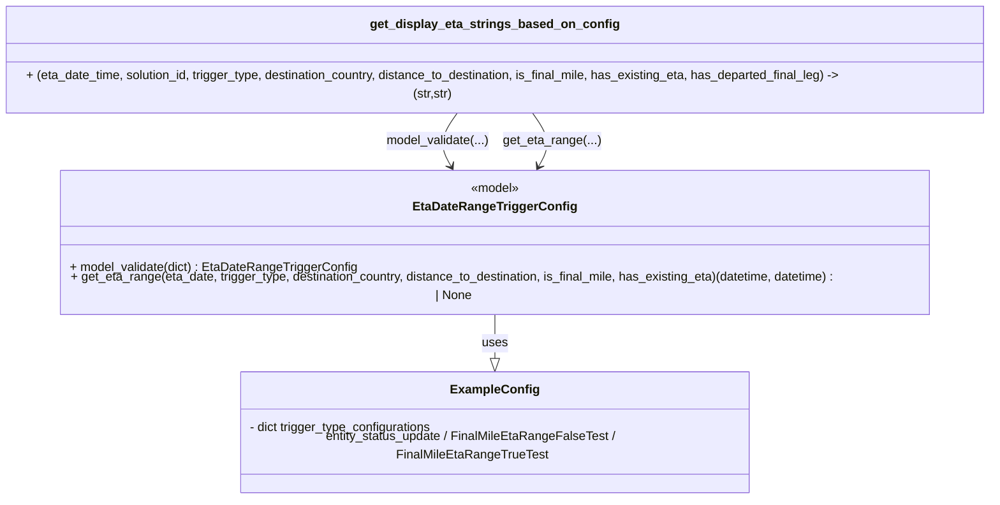

# Diagram: shipment_core/shipment_service/shipment_service/eta/tests/test_get_eta_range.py


> Auto-generated by Obscura crawlers

## Diagram 1



### SVG

<svg id="container" width="1315.6484375" xmlns="http://www.w3.org/2000/svg" class="classDiagram" height="608" viewBox="0 0 1315.6484375 608" role="graphics-document document" aria-roledescription="class"><style>#container{font-family:"trebuchet ms",verdana,arial,sans-serif;font-size:16px;fill:#333;}@keyframes edge-animation-frame{from{stroke-dashoffset:0;}}@keyframes dash{to{stroke-dashoffset:0;}}#container .edge-animation-slow{stroke-dasharray:9,5!important;stroke-dashoffset:900;animation:dash 50s linear infinite;stroke-linecap:round;}#container .edge-animation-fast{stroke-dasharray:9,5!important;stroke-dashoffset:900;animation:dash 20s linear infinite;stroke-linecap:round;}#container .error-icon{fill:#552222;}#container .error-text{fill:#552222;stroke:#552222;}#container .edge-thickness-normal{stroke-width:1px;}#container .edge-thickness-thick{stroke-width:3.5px;}#container .edge-pattern-solid{stroke-dasharray:0;}#container .edge-thickness-invisible{stroke-width:0;fill:none;}#container .edge-pattern-dashed{stroke-dasharray:3;}#container .edge-pattern-dotted{stroke-dasharray:2;}#container .marker{fill:#333333;stroke:#333333;}#container .marker.cross{stroke:#333333;}#container svg{font-family:"trebuchet ms",verdana,arial,sans-serif;font-size:16px;}#container p{margin:0;}#container g.classGroup text{fill:#9370DB;stroke:none;font-family:"trebuchet ms",verdana,arial,sans-serif;font-size:10px;}#container g.classGroup text .title{font-weight:bolder;}#container .nodeLabel,#container .edgeLabel{color:#131300;}#container .edgeLabel .label rect{fill:#ECECFF;}#container .label text{fill:#131300;}#container .labelBkg{background:#ECECFF;}#container .edgeLabel .label span{background:#ECECFF;}#container .classTitle{font-weight:bolder;}#container .node rect,#container .node circle,#container .node ellipse,#container .node polygon,#container .node path{fill:#ECECFF;stroke:#9370DB;stroke-width:1px;}#container .divider{stroke:#9370DB;stroke-width:1;}#container g.clickable{cursor:pointer;}#container g.classGroup rect{fill:#ECECFF;stroke:#9370DB;}#container g.classGroup line{stroke:#9370DB;stroke-width:1;}#container .classLabel .box{stroke:none;stroke-width:0;fill:#ECECFF;opacity:0.5;}#container .classLabel .label{fill:#9370DB;font-size:10px;}#container .relation{stroke:#333333;stroke-width:1;fill:none;}#container .dashed-line{stroke-dasharray:3;}#container .dotted-line{stroke-dasharray:1 2;}#container #compositionStart,#container .composition{fill:#333333!important;stroke:#333333!important;stroke-width:1;}#container #compositionEnd,#container .composition{fill:#333333!important;stroke:#333333!important;stroke-width:1;}#container #dependencyStart,#container .dependency{fill:#333333!important;stroke:#333333!important;stroke-width:1;}#container #dependencyStart,#container .dependency{fill:#333333!important;stroke:#333333!important;stroke-width:1;}#container #extensionStart,#container .extension{fill:transparent!important;stroke:#333333!important;stroke-width:1;}#container #extensionEnd,#container .extension{fill:transparent!important;stroke:#333333!important;stroke-width:1;}#container #aggregationStart,#container .aggregation{fill:transparent!important;stroke:#333333!important;stroke-width:1;}#container #aggregationEnd,#container .aggregation{fill:transparent!important;stroke:#333333!important;stroke-width:1;}#container #lollipopStart,#container .lollipop{fill:#ECECFF!important;stroke:#333333!important;stroke-width:1;}#container #lollipopEnd,#container .lollipop{fill:#ECECFF!important;stroke:#333333!important;stroke-width:1;}#container .edgeTerminals{font-size:11px;line-height:initial;}#container .classTitleText{text-anchor:middle;font-size:18px;fill:#333;}#container .label-icon{display:inline-block;height:1em;overflow:visible;vertical-align:-0.125em;}#container .node .label-icon path{fill:currentColor;stroke:revert;stroke-width:revert;}#container :root{--mermaid-font-family:"trebuchet ms",verdana,arial,sans-serif;}</style><g><defs><marker id="container_class-aggregationStart" class="marker aggregation class" refX="18" refY="7" markerWidth="190" markerHeight="240" orient="auto"><path d="M 18,7 L9,13 L1,7 L9,1 Z"></path></marker></defs><defs><marker id="container_class-aggregationEnd" class="marker aggregation class" refX="1" refY="7" markerWidth="20" markerHeight="28" orient="auto"><path d="M 18,7 L9,13 L1,7 L9,1 Z"></path></marker></defs><defs><marker id="container_class-extensionStart" class="marker extension class" refX="18" refY="7" markerWidth="190" markerHeight="240" orient="auto"><path d="M 1,7 L18,13 V 1 Z"></path></marker></defs><defs><marker id="container_class-extensionEnd" class="marker extension class" refX="1" refY="7" markerWidth="20" markerHeight="28" orient="auto"><path d="M 1,1 V 13 L18,7 Z"></path></marker></defs><defs><marker id="container_class-compositionStart" class="marker composition class" refX="18" refY="7" markerWidth="190" markerHeight="240" orient="auto"><path d="M 18,7 L9,13 L1,7 L9,1 Z"></path></marker></defs><defs><marker id="container_class-compositionEnd" class="marker composition class" refX="1" refY="7" markerWidth="20" markerHeight="28" orient="auto"><path d="M 18,7 L9,13 L1,7 L9,1 Z"></path></marker></defs><defs><marker id="container_class-dependencyStart" class="marker dependency class" refX="6" refY="7" markerWidth="190" markerHeight="240" orient="auto"><path d="M 5,7 L9,13 L1,7 L9,1 Z"></path></marker></defs><defs><marker id="container_class-dependencyEnd" class="marker dependency class" refX="13" refY="7" markerWidth="20" markerHeight="28" orient="auto"><path d="M 18,7 L9,13 L14,7 L9,1 Z"></path></marker></defs><defs><marker id="container_class-lollipopStart" class="marker lollipop class" refX="13" refY="7" markerWidth="190" markerHeight="240" orient="auto"><circle stroke="black" fill="transparent" cx="7" cy="7" r="6"></circle></marker></defs><defs><marker id="container_class-lollipopEnd" class="marker lollipop class" refX="1" refY="7" markerWidth="190" markerHeight="240" orient="auto"><circle stroke="black" fill="transparent" cx="7" cy="7" r="6"></circle></marker></defs><g class="root"><g class="clusters"></g><g class="edgePaths"><path d="M657.824,382L657.824,388.167C657.824,394.333,657.824,406.667,657.824,416.125C657.824,425.583,657.824,432.167,657.824,435.458L657.824,438.75" id="id_EtaDateRangeTriggerConfig_ExampleConfig_1" class="edge-thickness-normal edge-pattern-solid relation" style=";;;" data-edge="true" data-et="edge" data-id="id_EtaDateRangeTriggerConfig_ExampleConfig_1" data-points="W3sieCI6NjU3LjgyNDIxODc1LCJ5IjozODJ9LHsieCI6NjU3LjgyNDIxODc1LCJ5Ijo0MTl9LHsieCI6NjU3LjgyNDIxODc1LCJ5Ijo0NTZ9XQ==" marker-end="url(#container_class-extensionEnd)"></path><path d="M610.889,134L606.295,140.167C601.701,146.333,592.513,158.667,591.108,170.143C589.704,181.619,596.084,192.238,599.274,197.547L602.464,202.857" id="id_get_display_eta_strings_based_on_config_EtaDateRangeTriggerConfig_2" class="edge-thickness-normal edge-pattern-solid relation" style=";;;" data-edge="true" data-et="edge" data-id="id_get_display_eta_strings_based_on_config_EtaDateRangeTriggerConfig_2" data-points="W3sieCI6NjEwLjg4OTIxODc1LCJ5IjoxMzR9LHsieCI6NTgzLjMyNDIxODc1LCJ5IjoxNzF9LHsieCI6NjA1LjU1NDA1NzQ1OTY3NzQsInkiOjIwOH1d" marker-end="url(#container_class-dependencyEnd)"></path><path d="M704.759,134L709.353,140.167C713.948,146.333,723.136,158.667,724.54,170.143C725.944,181.619,719.564,192.238,716.374,197.547L713.184,202.857" id="id_get_display_eta_strings_based_on_config_EtaDateRangeTriggerConfig_3" class="edge-thickness-normal edge-pattern-solid relation" style=";;;" data-edge="true" data-et="edge" data-id="id_get_display_eta_strings_based_on_config_EtaDateRangeTriggerConfig_3" data-points="W3sieCI6NzA0Ljc1OTIxODc1LCJ5IjoxMzR9LHsieCI6NzMyLjMyNDIxODc1LCJ5IjoxNzF9LHsieCI6NzEwLjA5NDM4MDA0MDMyMjYsInkiOjIwOH1d" marker-end="url(#container_class-dependencyEnd)"></path></g><g class="edgeLabels"><g class="edgeLabel" transform="translate(657.82421875, 419)"><g class="label" data-id="id_EtaDateRangeTriggerConfig_ExampleConfig_1" transform="translate(-16.4921875, -12)"><foreignObject width="32.984375" height="24"><div xmlns="http://www.w3.org/1999/xhtml" class="labelBkg" style="display: table-cell; white-space: nowrap; line-height: 1.5; max-width: 200px; text-align: center;"><span class="edgeLabel"><p>uses</p></span></div></foreignObject></g></g><g class="edgeLabel" transform="translate(584.21285, 169.80721)"><g class="label" data-id="id_get_display_eta_strings_based_on_config_EtaDateRangeTriggerConfig_2" transform="translate(-66.828125, -12)"><foreignObject width="133.65625" height="24"><div xmlns="http://www.w3.org/1999/xhtml" class="labelBkg" style="display: table-cell; white-space: nowrap; line-height: 1.5; max-width: 200px; text-align: center;"><span class="edgeLabel"><p>model_validate(...)</p></span></div></foreignObject></g></g><g class="edgeLabel" transform="translate(731.43559, 169.80721)"><g class="label" data-id="id_get_display_eta_strings_based_on_config_EtaDateRangeTriggerConfig_3" transform="translate(-62.171875, -12)"><foreignObject width="124.34375" height="24"><div xmlns="http://www.w3.org/1999/xhtml" class="labelBkg" style="display: table-cell; white-space: nowrap; line-height: 1.5; max-width: 200px; text-align: center;"><span class="edgeLabel"><p>get_eta_range(...)</p></span></div></foreignObject></g></g></g><g class="nodes"><g class="node default" id="classId-EtaDateRangeTriggerConfig-0" transform="translate(657.82421875, 295)"><g class="basic label-container"><path d="M-590.41796875 -87 L590.41796875 -87 L590.41796875 87 L-590.41796875 87" stroke="none" stroke-width="0" fill="#ECECFF" style=""></path><path d="M-590.41796875 -87 C-316.4908207631982 -87, -42.5636727763964 -87, 590.41796875 -87 M-590.41796875 -87 C-309.2944379140729 -87, -28.170907078145774 -87, 590.41796875 -87 M590.41796875 -87 C590.41796875 -34.07809613927264, 590.41796875 18.843807721454723, 590.41796875 87 M590.41796875 -87 C590.41796875 -34.94987725823752, 590.41796875 17.100245483524958, 590.41796875 87 M590.41796875 87 C189.8231019448512 87, -210.7717648602976 87, -590.41796875 87 M590.41796875 87 C304.1697979742927 87, 17.921627198585384 87, -590.41796875 87 M-590.41796875 87 C-590.41796875 41.35925687801991, -590.41796875 -4.281486243960174, -590.41796875 -87 M-590.41796875 87 C-590.41796875 43.39154532538639, -590.41796875 -0.2169093492272225, -590.41796875 -87" stroke="#9370DB" stroke-width="1.3" fill="none" stroke-dasharray="0 0" style=""></path></g><g class="annotation-group text" transform="translate(-32.1484375, -63)"><g class="label" style="" transform="translate(0,-12)"><foreignObject width="64.296875" height="24"><div xmlns="http://www.w3.org/1999/xhtml" style="display: table-cell; white-space: nowrap; line-height: 1.5; max-width: 114px; text-align: center;"><span class="nodeLabel markdown-node-label" style=""><p>«model»</p></span></div></foreignObject></g></g><g class="label-group text" transform="translate(-99.5546875, -39)"><g class="label" style="font-weight: bolder" transform="translate(0,-12)"><foreignObject width="199.109375" height="24"><div xmlns="http://www.w3.org/1999/xhtml" style="display: table-cell; white-space: nowrap; line-height: 1.5; max-width: 246px; text-align: center;"><span class="nodeLabel markdown-node-label" style=""><p>EtaDateRangeTriggerConfig</p></span></div></foreignObject></g></g><g class="members-group text" transform="translate(-578.41796875, 9)"></g><g class="methods-group text" transform="translate(-578.41796875, 39)"><g class="label" style="" transform="translate(0,-12)"><foreignObject width="369.015625" height="24"><div xmlns="http://www.w3.org/1999/xhtml" style="display: table-cell; white-space: nowrap; line-height: 1.5; max-width: 427px; text-align: center;"><span class="nodeLabel markdown-node-label" style=""><p>+ model_validate(dict) : EtaDateRangeTriggerConfig</p></span></div></foreignObject></g><g class="label" style="" transform="translate(0,12)"><foreignObject width="1057.28125" height="24"><div xmlns="http://www.w3.org/1999/xhtml" style="display: table-cell; white-space: nowrap; line-height: 1.5; max-width: 1115px; text-align: center;"><span class="nodeLabel markdown-node-label" style=""><p>+ get_eta_range(eta_date, trigger_type, destination_country, distance_to_destination, is_final_mile, has_existing_eta)(datetime, datetime) : | None</p></span></div></foreignObject></g></g><g class="divider" style=""><path d="M-590.41796875 -15 C-274.50336308373323 -15, 41.41124258253353 -15, 590.41796875 -15 M-590.41796875 -15 C-171.43481914965838 -15, 247.54833045068324 -15, 590.41796875 -15" stroke="#9370DB" stroke-width="1.3" fill="none" stroke-dasharray="0 0" style=""></path></g><g class="divider" style=""><path d="M-590.41796875 9 C-331.45978446175894 9, -72.50160017351789 9, 590.41796875 9 M-590.41796875 9 C-124.54916695200478 9, 341.31963484599044 9, 590.41796875 9" stroke="#9370DB" stroke-width="1.3" fill="none" stroke-dasharray="0 0" style=""></path></g></g><g class="node default" id="classId-get_display_eta_strings_based_on_config-1" transform="translate(657.82421875, 71)"><g class="basic label-container"><path d="M-649.82421875 -63 L649.82421875 -63 L649.82421875 63 L-649.82421875 63" stroke="none" stroke-width="0" fill="#ECECFF" style=""></path><path d="M-649.82421875 -63 C-231.45844128757625 -63, 186.9073361748475 -63, 649.82421875 -63 M-649.82421875 -63 C-234.85951727767798 -63, 180.10518419464404 -63, 649.82421875 -63 M649.82421875 -63 C649.82421875 -34.896515640432064, 649.82421875 -6.7930312808641276, 649.82421875 63 M649.82421875 -63 C649.82421875 -37.38191348597273, 649.82421875 -11.763826971945456, 649.82421875 63 M649.82421875 63 C200.57523655468947 63, -248.67374564062106 63, -649.82421875 63 M649.82421875 63 C286.25711514265134 63, -77.30998846469731 63, -649.82421875 63 M-649.82421875 63 C-649.82421875 14.827853208864077, -649.82421875 -33.344293582271845, -649.82421875 -63 M-649.82421875 63 C-649.82421875 14.401880136229899, -649.82421875 -34.1962397275402, -649.82421875 -63" stroke="#9370DB" stroke-width="1.3" fill="none" stroke-dasharray="0 0" style=""></path></g><g class="annotation-group text" transform="translate(0, -39)"></g><g class="label-group text" transform="translate(-152.6484375, -39)"><g class="label" style="font-weight: bolder" transform="translate(0,-12)"><foreignObject width="305.296875" height="24"><div xmlns="http://www.w3.org/1999/xhtml" style="display: table-cell; white-space: nowrap; line-height: 1.5; max-width: 351px; text-align: center;"><span class="nodeLabel markdown-node-label" style=""><p>get_display_eta_strings_based_on_config</p></span></div></foreignObject></g></g><g class="members-group text" transform="translate(-637.82421875, 9)"></g><g class="methods-group text" transform="translate(-637.82421875, 39)"><g class="label" style="" transform="translate(0,-12)"><foreignObject width="1123" height="24"><div xmlns="http://www.w3.org/1999/xhtml" style="display: table-cell; white-space: nowrap; line-height: 1.5; max-width: 1202px; text-align: center;"><span class="nodeLabel markdown-node-label" style=""><p>+ (eta_date_time, solution_id, trigger_type, destination_country, distance_to_destination, is_final_mile, has_existing_eta, has_departed_final_leg) -&gt;(str,str)</p></span></div></foreignObject></g></g><g class="divider" style=""><path d="M-649.82421875 -15 C-196.4856297839226 -15, 256.8529591821548 -15, 649.82421875 -15 M-649.82421875 -15 C-248.4734869177504 -15, 152.87724491449922 -15, 649.82421875 -15" stroke="#9370DB" stroke-width="1.3" fill="none" stroke-dasharray="0 0" style=""></path></g><g class="divider" style=""><path d="M-649.82421875 9 C-243.03772688826473 9, 163.74876497347054 9, 649.82421875 9 M-649.82421875 9 C-233.72888873674185 9, 182.3664412765163 9, 649.82421875 9" stroke="#9370DB" stroke-width="1.3" fill="none" stroke-dasharray="0 0" style=""></path></g></g><g class="node default" id="classId-ExampleConfig-2" transform="translate(657.82421875, 528)"><g class="basic label-container"><path d="M-327.62109375 -72 L327.62109375 -72 L327.62109375 72 L-327.62109375 72" stroke="none" stroke-width="0" fill="#ECECFF" style=""></path><path d="M-327.62109375 -72 C-83.73465329142033 -72, 160.15178716715934 -72, 327.62109375 -72 M-327.62109375 -72 C-125.8653778984748 -72, 75.89033795305039 -72, 327.62109375 -72 M327.62109375 -72 C327.62109375 -20.54578371097862, 327.62109375 30.908432578042763, 327.62109375 72 M327.62109375 -72 C327.62109375 -37.187976277669414, 327.62109375 -2.375952555338827, 327.62109375 72 M327.62109375 72 C126.20898394303268 72, -75.20312586393464 72, -327.62109375 72 M327.62109375 72 C67.93823212431818 72, -191.74462950136365 72, -327.62109375 72 M-327.62109375 72 C-327.62109375 40.32092475651519, -327.62109375 8.64184951303038, -327.62109375 -72 M-327.62109375 72 C-327.62109375 38.032905889062924, -327.62109375 4.065811778125848, -327.62109375 -72" stroke="#9370DB" stroke-width="1.3" fill="none" stroke-dasharray="0 0" style=""></path></g><g class="annotation-group text" transform="translate(0, -48)"></g><g class="label-group text" transform="translate(-53.7890625, -48)"><g class="label" style="font-weight: bolder" transform="translate(0,-12)"><foreignObject width="107.578125" height="24"><div xmlns="http://www.w3.org/1999/xhtml" style="display: table-cell; white-space: nowrap; line-height: 1.5; max-width: 157px; text-align: center;"><span class="nodeLabel markdown-node-label" style=""><p>ExampleConfig</p></span></div></foreignObject></g></g><g class="members-group text" transform="translate(-315.62109375, 0)"><g class="label" style="" transform="translate(0,-12)"><foreignObject width="239.890625" height="24"><div xmlns="http://www.w3.org/1999/xhtml" style="display: table-cell; white-space: nowrap; line-height: 1.5; max-width: 297px; text-align: center;"><span class="nodeLabel markdown-node-label" style=""><p>- dict trigger_type_configurations</p></span></div></foreignObject></g><g class="label" style="" transform="translate(0,12)"><foreignObject width="577.453125" height="24"><div xmlns="http://www.w3.org/1999/xhtml" style="display: table-cell; white-space: nowrap; line-height: 1.5; max-width: 628px; text-align: center;"><span class="nodeLabel markdown-node-label" style=""><p>entity_status_update / FinalMileEtaRangeFalseTest / FinalMileEtaRangeTrueTest</p></span></div></foreignObject></g></g><g class="methods-group text" transform="translate(-315.62109375, 72)"></g><g class="divider" style=""><path d="M-327.62109375 -24 C-153.69837317852372 -24, 20.224347392952552 -24, 327.62109375 -24 M-327.62109375 -24 C-144.03987049354092 -24, 39.541352762918166 -24, 327.62109375 -24" stroke="#9370DB" stroke-width="1.3" fill="none" stroke-dasharray="0 0" style=""></path></g><g class="divider" style=""><path d="M-327.62109375 48 C-151.69347212511778 48, 24.23414949976444 48, 327.62109375 48 M-327.62109375 48 C-122.47942849625986 48, 82.66223675748029 48, 327.62109375 48" stroke="#9370DB" stroke-width="1.3" fill="none" stroke-dasharray="0 0" style=""></path></g></g></g></g></g></svg>

## Diagram 2

```mermaid
flowchart LR
    A([Start]) --> B{has_departed_final_leg?}
    B -- Yes --> C[Return (eta, eta) as strings]
    B -- No --> D[Invoke system config lambda]
    D --> E{response statusCode == "200" and body valid JSON?}
    E -- No --> F[Fallback: return default (eta, eta) strings]
    E -- Yes --> G[Extract ETA_DATE_RANGE payload]
    G --> H{parse ETA_DATE_RANGE into dict?}
    H -- No --> F
    H -- Yes --> I[EtaDateRangeTriggerConfig.model_validate(payload)]
    I --> J[call get_eta_range(...) on config]
    J --> K{get_eta_range returned None?}
    K -- Yes --> F
    K -- No --> L[Format datetimes to ISO strings]
    L --> M[Return (start_iso, end_iso)]
    F --> C
    C --> Z([End])
```

> SVG rendering failed for this diagram.
