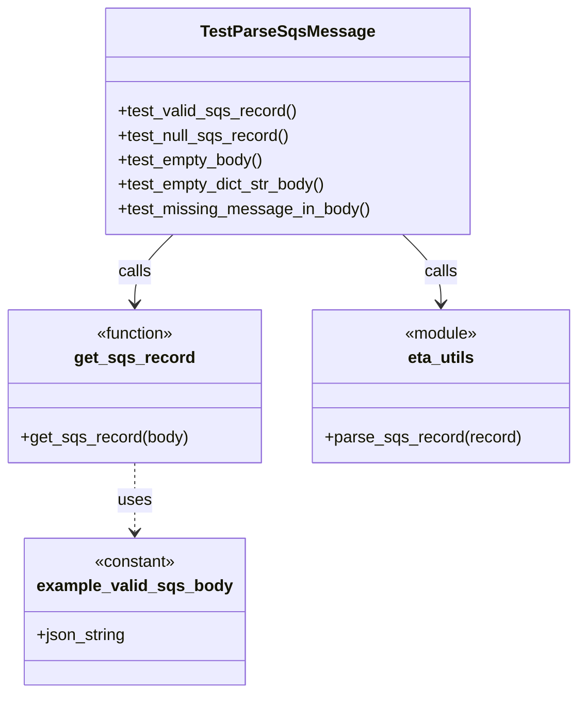

# Diagram: shipment_core/shipment_service/shipment_service/eta/tests/test_parse_sqs_message.py

> Auto-generated by Obscura crawlers

## Mermaid

```mermaid
classDiagram
class TestParseSqsMessage {
  +test_valid_sqs_record()
  +test_null_sqs_record()
  +test_empty_body()
  +test_empty_dict_str_body()
  +test_missing_message_in_body()
}
class get_sqs_record <<function>> {
  +get_sqs_record(body)
}
class eta_utils <<module>> {
  +parse_sqs_record(record)
}
class example_valid_sqs_body <<constant>> {
  +json_string
}
TestParseSqsMessage --> get_sqs_record : calls
TestParseSqsMessage --> eta_utils : calls
get_sqs_record ..> example_valid_sqs_body : uses
```

> SVG rendering failed for this diagram.
