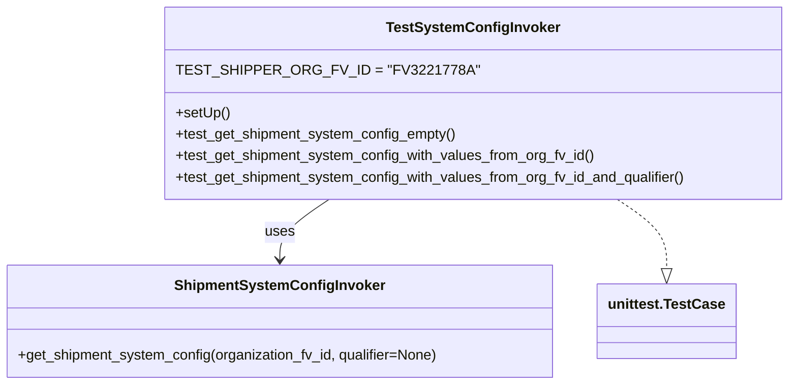

# Diagram: shipment_core/shipment_service/shipment_service/eta/tests/test_system_config_invoker.py


> Auto-generated by Obscura crawlers

## Diagram 1



### SVG

<svg id="container" width="885.220703125" xmlns="http://www.w3.org/2000/svg" class="classDiagram" height="432" viewBox="0 0 885.220703125 432" role="graphics-document document" aria-roledescription="class"><style>#container{font-family:"trebuchet ms",verdana,arial,sans-serif;font-size:16px;fill:#333;}@keyframes edge-animation-frame{from{stroke-dashoffset:0;}}@keyframes dash{to{stroke-dashoffset:0;}}#container .edge-animation-slow{stroke-dasharray:9,5!important;stroke-dashoffset:900;animation:dash 50s linear infinite;stroke-linecap:round;}#container .edge-animation-fast{stroke-dasharray:9,5!important;stroke-dashoffset:900;animation:dash 20s linear infinite;stroke-linecap:round;}#container .error-icon{fill:#552222;}#container .error-text{fill:#552222;stroke:#552222;}#container .edge-thickness-normal{stroke-width:1px;}#container .edge-thickness-thick{stroke-width:3.5px;}#container .edge-pattern-solid{stroke-dasharray:0;}#container .edge-thickness-invisible{stroke-width:0;fill:none;}#container .edge-pattern-dashed{stroke-dasharray:3;}#container .edge-pattern-dotted{stroke-dasharray:2;}#container .marker{fill:#333333;stroke:#333333;}#container .marker.cross{stroke:#333333;}#container svg{font-family:"trebuchet ms",verdana,arial,sans-serif;font-size:16px;}#container p{margin:0;}#container g.classGroup text{fill:#9370DB;stroke:none;font-family:"trebuchet ms",verdana,arial,sans-serif;font-size:10px;}#container g.classGroup text .title{font-weight:bolder;}#container .nodeLabel,#container .edgeLabel{color:#131300;}#container .edgeLabel .label rect{fill:#ECECFF;}#container .label text{fill:#131300;}#container .labelBkg{background:#ECECFF;}#container .edgeLabel .label span{background:#ECECFF;}#container .classTitle{font-weight:bolder;}#container .node rect,#container .node circle,#container .node ellipse,#container .node polygon,#container .node path{fill:#ECECFF;stroke:#9370DB;stroke-width:1px;}#container .divider{stroke:#9370DB;stroke-width:1;}#container g.clickable{cursor:pointer;}#container g.classGroup rect{fill:#ECECFF;stroke:#9370DB;}#container g.classGroup line{stroke:#9370DB;stroke-width:1;}#container .classLabel .box{stroke:none;stroke-width:0;fill:#ECECFF;opacity:0.5;}#container .classLabel .label{fill:#9370DB;font-size:10px;}#container .relation{stroke:#333333;stroke-width:1;fill:none;}#container .dashed-line{stroke-dasharray:3;}#container .dotted-line{stroke-dasharray:1 2;}#container #compositionStart,#container .composition{fill:#333333!important;stroke:#333333!important;stroke-width:1;}#container #compositionEnd,#container .composition{fill:#333333!important;stroke:#333333!important;stroke-width:1;}#container #dependencyStart,#container .dependency{fill:#333333!important;stroke:#333333!important;stroke-width:1;}#container #dependencyStart,#container .dependency{fill:#333333!important;stroke:#333333!important;stroke-width:1;}#container #extensionStart,#container .extension{fill:transparent!important;stroke:#333333!important;stroke-width:1;}#container #extensionEnd,#container .extension{fill:transparent!important;stroke:#333333!important;stroke-width:1;}#container #aggregationStart,#container .aggregation{fill:transparent!important;stroke:#333333!important;stroke-width:1;}#container #aggregationEnd,#container .aggregation{fill:transparent!important;stroke:#333333!important;stroke-width:1;}#container #lollipopStart,#container .lollipop{fill:#ECECFF!important;stroke:#333333!important;stroke-width:1;}#container #lollipopEnd,#container .lollipop{fill:#ECECFF!important;stroke:#333333!important;stroke-width:1;}#container .edgeTerminals{font-size:11px;line-height:initial;}#container .classTitleText{text-anchor:middle;font-size:18px;fill:#333;}#container .label-icon{display:inline-block;height:1em;overflow:visible;vertical-align:-0.125em;}#container .node .label-icon path{fill:currentColor;stroke:revert;stroke-width:revert;}#container :root{--mermaid-font-family:"trebuchet ms",verdana,arial,sans-serif;}</style><g><defs><marker id="container_class-aggregationStart" class="marker aggregation class" refX="18" refY="7" markerWidth="190" markerHeight="240" orient="auto"><path d="M 18,7 L9,13 L1,7 L9,1 Z"></path></marker></defs><defs><marker id="container_class-aggregationEnd" class="marker aggregation class" refX="1" refY="7" markerWidth="20" markerHeight="28" orient="auto"><path d="M 18,7 L9,13 L1,7 L9,1 Z"></path></marker></defs><defs><marker id="container_class-extensionStart" class="marker extension class" refX="18" refY="7" markerWidth="190" markerHeight="240" orient="auto"><path d="M 1,7 L18,13 V 1 Z"></path></marker></defs><defs><marker id="container_class-extensionEnd" class="marker extension class" refX="1" refY="7" markerWidth="20" markerHeight="28" orient="auto"><path d="M 1,1 V 13 L18,7 Z"></path></marker></defs><defs><marker id="container_class-compositionStart" class="marker composition class" refX="18" refY="7" markerWidth="190" markerHeight="240" orient="auto"><path d="M 18,7 L9,13 L1,7 L9,1 Z"></path></marker></defs><defs><marker id="container_class-compositionEnd" class="marker composition class" refX="1" refY="7" markerWidth="20" markerHeight="28" orient="auto"><path d="M 18,7 L9,13 L1,7 L9,1 Z"></path></marker></defs><defs><marker id="container_class-dependencyStart" class="marker dependency class" refX="6" refY="7" markerWidth="190" markerHeight="240" orient="auto"><path d="M 5,7 L9,13 L1,7 L9,1 Z"></path></marker></defs><defs><marker id="container_class-dependencyEnd" class="marker dependency class" refX="13" refY="7" markerWidth="20" markerHeight="28" orient="auto"><path d="M 18,7 L9,13 L14,7 L9,1 Z"></path></marker></defs><defs><marker id="container_class-lollipopStart" class="marker lollipop class" refX="13" refY="7" markerWidth="190" markerHeight="240" orient="auto"><circle stroke="black" fill="transparent" cx="7" cy="7" r="6"></circle></marker></defs><defs><marker id="container_class-lollipopEnd" class="marker lollipop class" refX="1" refY="7" markerWidth="190" markerHeight="240" orient="auto"><circle stroke="black" fill="transparent" cx="7" cy="7" r="6"></circle></marker></defs><g class="root"><g class="clusters"></g><g class="edgePaths"><path d="M369.406,224L360.239,230.167C351.072,236.333,332.737,248.667,323.57,260C314.402,271.333,314.402,281.667,314.402,286.833L314.402,292" id="id_TestSystemConfigInvoker_ShipmentSystemConfigInvoker_1" class="edge-thickness-normal edge-pattern-solid relation" style=";;;" data-edge="true" data-et="edge" data-id="id_TestSystemConfigInvoker_ShipmentSystemConfigInvoker_1" data-points="W3sieCI6MzY5LjQwNjQ1MjA0NzQxMzgsInkiOjIyNH0seyJ4IjozMTQuNDAyMzQzNzUsInkiOjI2MX0seyJ4IjozMTQuNDAyMzQzNzUsInkiOjI5OH1d" marker-end="url(#container_class-dependencyEnd)"></path><path d="M690.512,224L699.679,230.167C708.846,236.333,727.181,248.667,736.348,261.625C745.516,274.583,745.516,288.167,745.516,294.958L745.516,301.75" id="id_TestSystemConfigInvoker_unittest.TestCase_2" class="edge-thickness-normal edge-pattern-dashed relation" style=";;;" data-edge="true" data-et="edge" data-id="id_TestSystemConfigInvoker_unittest.TestCase_2" data-points="W3sieCI6NjkwLjUxMTUxNjcwMjU4NjMsInkiOjIyNH0seyJ4Ijo3NDUuNTE1NjI1LCJ5IjoyNjF9LHsieCI6NzQ1LjUxNTYyNSwieSI6MzE5fV0=" marker-end="url(#container_class-extensionEnd)"></path></g><g class="edgeLabels"><g class="edgeLabel" transform="translate(314.40234375, 261)"><g class="label" data-id="id_TestSystemConfigInvoker_ShipmentSystemConfigInvoker_1" transform="translate(-16.4921875, -12)"><foreignObject width="32.984375" height="24"><div xmlns="http://www.w3.org/1999/xhtml" class="labelBkg" style="display: table-cell; white-space: nowrap; line-height: 1.5; max-width: 200px; text-align: center;"><span class="edgeLabel"><p>uses</p></span></div></foreignObject></g></g><g class="edgeLabel"><g class="label" data-id="id_TestSystemConfigInvoker_unittest.TestCase_2" transform="translate(0, 0)"><foreignObject width="0" height="0"><div xmlns="http://www.w3.org/1999/xhtml" class="labelBkg" style="display: table-cell; white-space: nowrap; line-height: 1.5; max-width: 200px; text-align: center;"><span class="edgeLabel"></span></div></foreignObject></g></g></g><g class="nodes"><g class="node default" id="classId-TestSystemConfigInvoker-0" transform="translate(529.958984375, 116)"><g class="basic label-container"><path d="M-347.26171875 -108 L347.26171875 -108 L347.26171875 108 L-347.26171875 108" stroke="none" stroke-width="0" fill="#ECECFF" style=""></path><path d="M-347.26171875 -108 C-180.36124896733224 -108, -13.460779184664489 -108, 347.26171875 -108 M-347.26171875 -108 C-134.56975687604415 -108, 78.1222049979117 -108, 347.26171875 -108 M347.26171875 -108 C347.26171875 -61.30834268929037, 347.26171875 -14.61668537858074, 347.26171875 108 M347.26171875 -108 C347.26171875 -25.651639598691503, 347.26171875 56.696720802616994, 347.26171875 108 M347.26171875 108 C191.24921599572332 108, 35.23671324144664 108, -347.26171875 108 M347.26171875 108 C166.8507921422261 108, -13.560134465547776 108, -347.26171875 108 M-347.26171875 108 C-347.26171875 49.171124711729256, -347.26171875 -9.657750576541488, -347.26171875 -108 M-347.26171875 108 C-347.26171875 59.030492455018525, -347.26171875 10.06098491003705, -347.26171875 -108" stroke="#9370DB" stroke-width="1.3" fill="none" stroke-dasharray="0 0" style=""></path></g><g class="annotation-group text" transform="translate(0, -84)"></g><g class="label-group text" transform="translate(-92.2890625, -84)"><g class="label" style="font-weight: bolder" transform="translate(0,-12)"><foreignObject width="184.578125" height="24"><div xmlns="http://www.w3.org/1999/xhtml" style="display: table-cell; white-space: nowrap; line-height: 1.5; max-width: 231px; text-align: center;"><span class="nodeLabel markdown-node-label" style=""><p>TestSystemConfigInvoker</p></span></div></foreignObject></g></g><g class="members-group text" transform="translate(-335.26171875, -36)"><g class="label" style="" transform="translate(0,-12)"><foreignObject width="295.25" height="24"><div xmlns="http://www.w3.org/1999/xhtml" style="display: table-cell; white-space: nowrap; line-height: 1.5; max-width: 345px; text-align: center;"><span class="nodeLabel markdown-node-label" style=""><p>TEST_SHIPPER_ORG_FV_ID = "FV3221778A"</p></span></div></foreignObject></g></g><g class="methods-group text" transform="translate(-335.26171875, 12)"><g class="label" style="" transform="translate(0,-12)"><foreignObject width="60.421875" height="24"><div xmlns="http://www.w3.org/1999/xhtml" style="display: table-cell; white-space: nowrap; line-height: 1.5; max-width: 118px; text-align: center;"><span class="nodeLabel markdown-node-label" style=""><p>+setUp()</p></span></div></foreignObject></g><g class="label" style="" transform="translate(0,12)"><foreignObject width="317.4375" height="24"><div xmlns="http://www.w3.org/1999/xhtml" style="display: table-cell; white-space: nowrap; line-height: 1.5; max-width: 375px; text-align: center;"><span class="nodeLabel markdown-node-label" style=""><p>+test_get_shipment_system_config_empty()</p></span></div></foreignObject></g><g class="label" style="" transform="translate(0,36)"><foreignObject width="473.859375" height="24"><div xmlns="http://www.w3.org/1999/xhtml" style="display: table-cell; white-space: nowrap; line-height: 1.5; max-width: 531px; text-align: center;"><span class="nodeLabel markdown-node-label" style=""><p>+test_get_shipment_system_config_with_values_from_org_fv_id()</p></span></div></foreignObject></g><g class="label" style="" transform="translate(0,60)"><foreignObject width="578.234375" height="24"><div xmlns="http://www.w3.org/1999/xhtml" style="display: table-cell; white-space: nowrap; line-height: 1.5; max-width: 636px; text-align: center;"><span class="nodeLabel markdown-node-label" style=""><p>+test_get_shipment_system_config_with_values_from_org_fv_id_and_qualifier()</p></span></div></foreignObject></g></g><g class="divider" style=""><path d="M-347.26171875 -60 C-125.09857080607568 -60, 97.06457713784863 -60, 347.26171875 -60 M-347.26171875 -60 C-172.79538578733744 -60, 1.670947175325125 -60, 347.26171875 -60" stroke="#9370DB" stroke-width="1.3" fill="none" stroke-dasharray="0 0" style=""></path></g><g class="divider" style=""><path d="M-347.26171875 -12 C-106.7206444558673 -12, 133.8204298382654 -12, 347.26171875 -12 M-347.26171875 -12 C-142.32385832990053 -12, 62.61400209019894 -12, 347.26171875 -12" stroke="#9370DB" stroke-width="1.3" fill="none" stroke-dasharray="0 0" style=""></path></g></g><g class="node default" id="classId-ShipmentSystemConfigInvoker-1" transform="translate(314.40234375, 361)"><g class="basic label-container"><path d="M-306.40234375 -63 L306.40234375 -63 L306.40234375 63 L-306.40234375 63" stroke="none" stroke-width="0" fill="#ECECFF" style=""></path><path d="M-306.40234375 -63 C-111.41356924950989 -63, 83.57520525098022 -63, 306.40234375 -63 M-306.40234375 -63 C-173.11982765361358 -63, -39.83731155722717 -63, 306.40234375 -63 M306.40234375 -63 C306.40234375 -33.45076699217488, 306.40234375 -3.9015339843497614, 306.40234375 63 M306.40234375 -63 C306.40234375 -18.438060792578447, 306.40234375 26.123878414843105, 306.40234375 63 M306.40234375 63 C79.2389061780008 63, -147.9245313939984 63, -306.40234375 63 M306.40234375 63 C106.63812132069128 63, -93.12610110861743 63, -306.40234375 63 M-306.40234375 63 C-306.40234375 25.359065868732188, -306.40234375 -12.281868262535625, -306.40234375 -63 M-306.40234375 63 C-306.40234375 17.69939971267567, -306.40234375 -27.601200574648658, -306.40234375 -63" stroke="#9370DB" stroke-width="1.3" fill="none" stroke-dasharray="0 0" style=""></path></g><g class="annotation-group text" transform="translate(0, -39)"></g><g class="label-group text" transform="translate(-112.1484375, -39)"><g class="label" style="font-weight: bolder" transform="translate(0,-12)"><foreignObject width="224.296875" height="24"><div xmlns="http://www.w3.org/1999/xhtml" style="display: table-cell; white-space: nowrap; line-height: 1.5; max-width: 271px; text-align: center;"><span class="nodeLabel markdown-node-label" style=""><p>ShipmentSystemConfigInvoker</p></span></div></foreignObject></g></g><g class="members-group text" transform="translate(-294.40234375, 9)"></g><g class="methods-group text" transform="translate(-294.40234375, 39)"><g class="label" style="" transform="translate(0,-12)"><foreignObject width="476.65625" height="24"><div xmlns="http://www.w3.org/1999/xhtml" style="display: table-cell; white-space: nowrap; line-height: 1.5; max-width: 534px; text-align: center;"><span class="nodeLabel markdown-node-label" style=""><p>+get_shipment_system_config(organization_fv_id, qualifier=None)</p></span></div></foreignObject></g></g><g class="divider" style=""><path d="M-306.40234375 -15 C-161.0176991076574 -15, -15.633054465314785 -15, 306.40234375 -15 M-306.40234375 -15 C-137.919684930195 -15, 30.56297388961002 -15, 306.40234375 -15" stroke="#9370DB" stroke-width="1.3" fill="none" stroke-dasharray="0 0" style=""></path></g><g class="divider" style=""><path d="M-306.40234375 9 C-147.87300058825696 9, 10.656342573486086 9, 306.40234375 9 M-306.40234375 9 C-176.4676921383824 9, -46.53304052676481 9, 306.40234375 9" stroke="#9370DB" stroke-width="1.3" fill="none" stroke-dasharray="0 0" style=""></path></g></g><g class="node default" id="classId-unittest.TestCase-2" transform="translate(745.515625, 361)"><g class="basic label-container"><path d="M-74.7109375 -42 L74.7109375 -42 L74.7109375 42 L-74.7109375 42" stroke="none" stroke-width="0" fill="#ECECFF" style=""></path><path d="M-74.7109375 -42 C-33.7461415597922 -42, 7.2186543804156 -42, 74.7109375 -42 M-74.7109375 -42 C-41.049081328936964 -42, -7.387225157873928 -42, 74.7109375 -42 M74.7109375 -42 C74.7109375 -10.914075837298327, 74.7109375 20.171848325403346, 74.7109375 42 M74.7109375 -42 C74.7109375 -10.234849276685821, 74.7109375 21.530301446628357, 74.7109375 42 M74.7109375 42 C31.77603195286786 42, -11.158873594264278 42, -74.7109375 42 M74.7109375 42 C33.36185298494185 42, -7.987231530116304 42, -74.7109375 42 M-74.7109375 42 C-74.7109375 24.324115297422708, -74.7109375 6.6482305948454155, -74.7109375 -42 M-74.7109375 42 C-74.7109375 9.306538087224808, -74.7109375 -23.386923825550383, -74.7109375 -42" stroke="#9370DB" stroke-width="1.3" fill="none" stroke-dasharray="0 0" style=""></path></g><g class="annotation-group text" transform="translate(0, -18)"></g><g class="label-group text" transform="translate(-62.7109375, -18)"><g class="label" style="font-weight: bolder" transform="translate(0,-12)"><foreignObject width="125.421875" height="24"><div xmlns="http://www.w3.org/1999/xhtml" style="display: table-cell; white-space: nowrap; line-height: 1.5; max-width: 172px; text-align: center;"><span class="nodeLabel markdown-node-label" style=""><p>unittest.TestCase</p></span></div></foreignObject></g></g><g class="members-group text" transform="translate(-62.7109375, 30)"></g><g class="methods-group text" transform="translate(-62.7109375, 60)"></g><g class="divider" style=""><path d="M-74.7109375 6 C-21.774972014493457 6, 31.160993471013086 6, 74.7109375 6 M-74.7109375 6 C-34.34266517315466 6, 6.025607153690686 6, 74.7109375 6" stroke="#9370DB" stroke-width="1.3" fill="none" stroke-dasharray="0 0" style=""></path></g><g class="divider" style=""><path d="M-74.7109375 24 C-16.083246764004834 24, 42.54444397199033 24, 74.7109375 24 M-74.7109375 24 C-39.76487248879104 24, -4.818807477582084 24, 74.7109375 24" stroke="#9370DB" stroke-width="1.3" fill="none" stroke-dasharray="0 0" style=""></path></g></g></g></g></g></svg>

## Diagram 2

```mermaid
sequenceDiagram
participant TestRunner as "unittest (main)"
participant TestClass as "TestSystemConfigInvoker"
participant Invoker as "ShipmentSystemConfigInvoker"
TestRunner->>TestClass: instantiate TestSystemConfigInvoker
TestClass->>Invoker: ShipmentSystemConfigInvoker()  -> setUp (self.invoker)
TestClass->>Invoker: get_shipment_system_config(organization_fv_id="NOT_REAL_ORG", qualifier="NOTHING_HERE")
Invoker-->>TestClass: response ([])
TestClass->>TestRunner: assert response is not None; assert response == []
TestClass->>Invoker: get_shipment_system_config(organization_fv_id="FV3221778A")
Invoker-->>TestClass: response (list with >1 items)
TestClass->>TestRunner: assert response is not None; assert len(response) > 1
TestClass->>Invoker: get_shipment_system_config(organization_fv_id="FV3221778A", qualifier="ETA_HOLIDAYS")
Invoker-->>TestClass: response (list with 1 item)
TestClass->>TestRunner: assert response is not None; assert len(response) == 1
```

> SVG rendering failed for this diagram.
