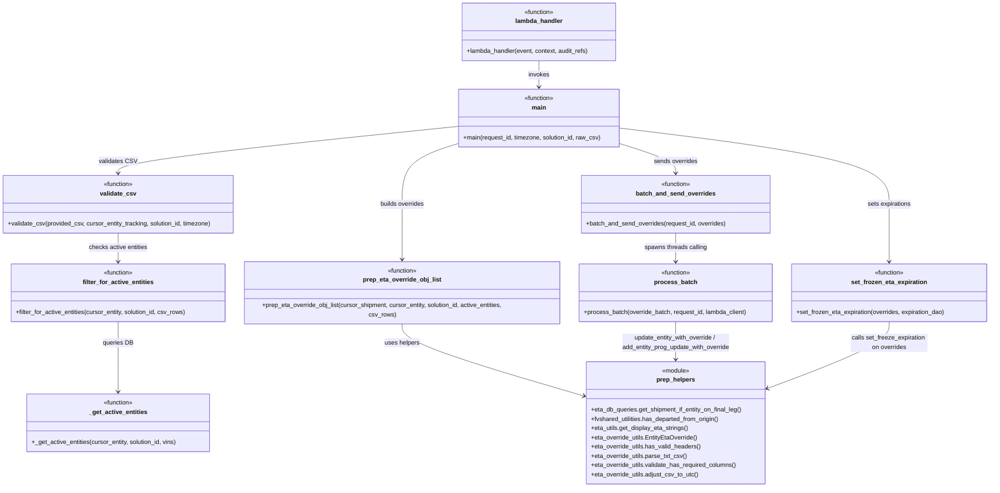

# Diagram: shipment_core/shipment_service/shipment_service/eta/vin_eta_override.py

> Auto-generated by Obscura crawlers

## Mermaid

```mermaid
classDiagram
    class lambda_handler <<function>> {
        +lambda_handler(event, context, audit_refs)
    }
    class main <<function>> {
        +main(request_id, timezone, solution_id, raw_csv)
    }
    class validate_csv <<function>> {
        +validate_csv(provided_csv, cursor_entity_tracking, solution_id, timezone)
    }
    class prep_eta_override_obj_list <<function>> {
        +prep_eta_override_obj_list(cursor_shipment, cursor_entity, solution_id, active_entities, csv_rows)
    }
    class batch_and_send_overrides <<function>> {
        +batch_and_send_overrides(request_id, overrides)
    }
    class process_batch <<function>> {
        +process_batch(override_batch, request_id, lambda_client)
    }
    class set_frozen_eta_expiration <<function>> {
        +set_frozen_eta_expiration(overrides, expiration_dao)
    }
    class filter_for_active_entities <<function>> {
        +filter_for_active_entities(cursor_entity, solution_id, csv_rows)
    }
    class _get_active_entities <<function>> {
        +_get_active_entities(cursor_entity, solution_id, vins)
    }
    class prep_helpers <<module>> {
        +eta_db_queries.get_shipment_if_entity_on_final_leg()
        +fvshared_utilities.has_departed_from_origin()
        +eta_utils.get_display_eta_strings()
        +eta_override_utils.EntityEtaOverride()
        +eta_override_utils.has_valid_headers()
        +eta_override_utils.parse_txt_csv()
        +eta_override_utils.validate_has_required_columns()
        +eta_override_utils.adjust_csv_to_utc()
    }

    lambda_handler --> main : invokes
    main --> validate_csv : validates CSV
    main --> prep_eta_override_obj_list : builds overrides
    main --> batch_and_send_overrides : sends overrides
    main --> set_frozen_eta_expiration : sets expirations
    validate_csv --> filter_for_active_entities : checks active entities
    filter_for_active_entities --> _get_active_entities : queries DB
    prep_eta_override_obj_list --> prep_helpers : uses helpers
    batch_and_send_overrides --> process_batch : spawns threads calling
    process_batch --> prep_helpers : update_entity_with_override / add_entity_prog_update_with_override
    set_frozen_eta_expiration --> prep_helpers : calls set_freeze_expiration on overrides
```

> SVG rendering failed for this diagram.
