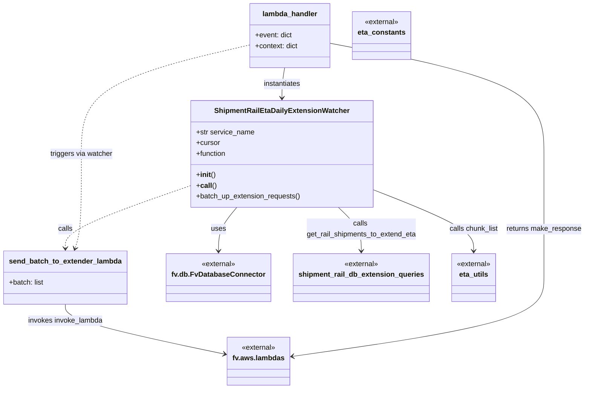

# Diagram: shipment_core/shipment_service/shipment_service/eta/watchers/shipment_rail_eta_daily_extension_watcher.py


> Auto-generated by Obscura crawlers

## Diagram 1



> SVG rendering failed for this diagram.

## Diagram 2

```mermaid
flowchart TD
    A[lambda_handler(event, context)] --> B[Create ShipmentRailEtaDailyExtensionWatcher]
    B --> C[Establish DB connection via FvDatabaseConnector]
    C --> D[batch_up_extension_requests()]
    D --> E[get_rail_shipments_to_extend_eta(cursor, limit=QUERY_LIMIT)]
    E --> F{records returned}
    F -->|0..N| G[Extract record ids]
    G --> H[chunk_list(all_record_ids, 50)]
    H --> I[For each batch]
    I --> J[send_batch_to_extender_lambda(batch)]
    J --> K[fv.aws.lambdas.invoke_lambda(name="extend_rail_eta", body=... , invoke_type="Event")]
    K --> L[Invoke complete]
    L --> M[fv.aws.lambdas.make_response({}, 200)]
    M --> N[Return response from lambda_handler]
```

> SVG rendering failed for this diagram.
