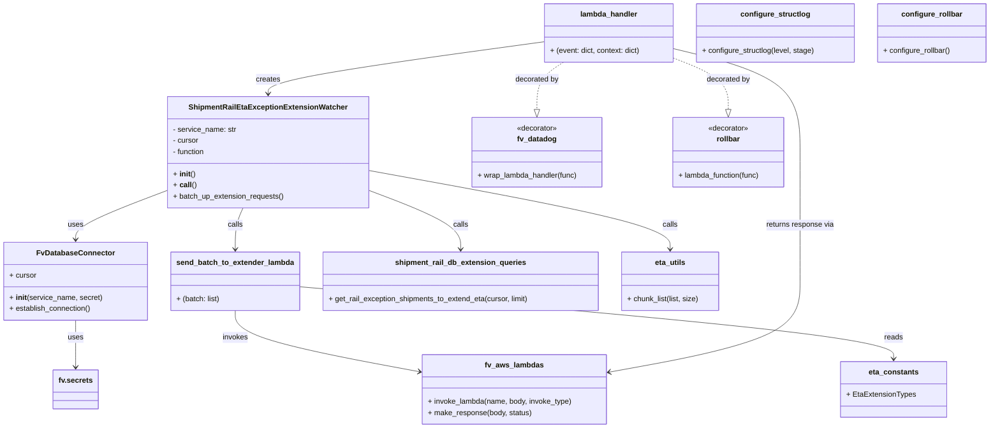
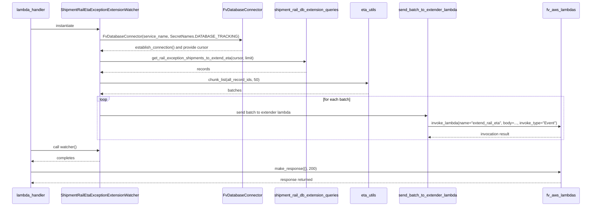

# Diagram: shipment_core/shipment_service/shipment_service/eta/watchers/shipment_rail_eta_exception_extension_watcher.py

> Auto-generated by Obscura crawlers

## Diagram 1

### SVG

<svg id="container" width="2115.958984375" xmlns="http://www.w3.org/2000/svg" class="classDiagram" height="922" viewBox="0 0 2115.958984375 922" role="graphics-document document" aria-roledescription="class"><g><defs><marker id="container_class-aggregationStart" class="marker aggregation class" refX="18" refY="7" markerWidth="190" markerHeight="240" orient="auto"><path d="M 18,7 L9,13 L1,7 L9,1 Z"></path></marker></defs><defs><marker id="container_class-aggregationEnd" class="marker aggregation class" refX="1" refY="7" markerWidth="20" markerHeight="28" orient="auto"><path d="M 18,7 L9,13 L1,7 L9,1 Z"></path></marker></defs><defs><marker id="container_class-extensionStart" class="marker extension class" refX="18" refY="7" markerWidth="190" markerHeight="240" orient="auto"><path d="M 1,7 L18,13 V 1 Z"></path></marker></defs><defs><marker id="container_class-extensionEnd" class="marker extension class" refX="1" refY="7" markerWidth="20" markerHeight="28" orient="auto"><path d="M 1,1 V 13 L18,7 Z"></path></marker></defs><defs><marker id="container_class-compositionStart" class="marker composition class" refX="18" refY="7" markerWidth="190" markerHeight="240" orient="auto"><path d="M 18,7 L9,13 L1,7 L9,1 Z"></path></marker></defs><defs><marker id="container_class-compositionEnd" class="marker composition class" refX="1" refY="7" markerWidth="20" markerHeight="28" orient="auto"><path d="M 18,7 L9,13 L1,7 L9,1 Z"></path></marker></defs><defs><marker id="container_class-dependencyStart" class="marker dependency class" refX="6" refY="7" markerWidth="190" markerHeight="240" orient="auto"><path d="M 5,7 L9,13 L1,7 L9,1 Z"></path></marker></defs><defs><marker id="container_class-dependencyEnd" class="marker dependency class" refX="13" refY="7" markerWidth="20" markerHeight="28" orient="auto"><path d="M 18,7 L9,13 L14,7 L9,1 Z"></path></marker></defs><defs><marker id="container_class-lollipopStart" class="marker lollipop class" refX="13" refY="7" markerWidth="190" markerHeight="240" orient="auto"><circle stroke="black" fill="transparent" cx="7" cy="7" r="6"></circle></marker></defs><defs><marker id="container_class-lollipopEnd" class="marker lollipop class" refX="1" refY="7" markerWidth="190" markerHeight="240" orient="auto"><circle stroke="black" fill="transparent" cx="7" cy="7" r="6"></circle></marker></defs><g class="root"><g class="clusters"></g><g class="edgePaths"><path d="M354.055,409.838L321.514,422.365C288.973,434.892,223.891,459.946,191.35,477.64C158.809,495.333,158.809,505.667,158.809,510.833L158.809,516" id="id_ShipmentRailEtaExceptionExtensionWatcher_FvDatabaseConnector_1" class="edge-thickness-normal edge-pattern-solid relation" style=";;;" data-edge="true" data-et="edge" data-id="id_ShipmentRailEtaExceptionExtensionWatcher_FvDatabaseConnector_1" data-points="W3sieCI6MzU0LjA1NDY4NzUsInkiOjQwOS44MzgzMTM4OTAwMDYzfSx7IngiOjE1OC44MDg1OTM3NSwieSI6NDg1fSx7IngiOjE1OC44MDg1OTM3NSwieSI6NTIyfV0=" marker-end="url(#container_class-dependencyEnd)"></path><path d="M779.234,409.838L811.775,422.365C844.316,434.892,909.398,459.946,941.939,481.14C974.48,502.333,974.48,519.667,974.48,528.333L974.48,537" id="id_ShipmentRailEtaExceptionExtensionWatcher_shipment_rail_db_extension_queries_2" class="edge-thickness-normal edge-pattern-solid relation" style=";;;" data-edge="true" data-et="edge" data-id="id_ShipmentRailEtaExceptionExtensionWatcher_shipment_rail_db_extension_queries_2" data-points="W3sieCI6Nzc5LjIzNDM3NSwieSI6NDA5LjgzODMxMzg5MDAwNjN9LHsieCI6OTc0LjQ4MDQ2ODc1LCJ5Ijo0ODV9LHsieCI6OTc0LjQ4MDQ2ODc1LCJ5Ijo1NDN9XQ==" marker-end="url(#container_class-dependencyEnd)"></path><path d="M779.234,366.749L887.363,386.457C995.492,406.166,1211.75,445.583,1319.879,473.958C1428.008,502.333,1428.008,519.667,1428.008,528.333L1428.008,537" id="id_ShipmentRailEtaExceptionExtensionWatcher_eta_utils_3" class="edge-thickness-normal edge-pattern-solid relation" style=";;;" data-edge="true" data-et="edge" data-id="id_ShipmentRailEtaExceptionExtensionWatcher_eta_utils_3" data-points="W3sieCI6Nzc5LjIzNDM3NSwieSI6MzY2Ljc0ODU4MTY5MDU0MzIzfSx7IngiOjE0MjguMDA3ODEyNSwieSI6NDg1fSx7IngiOjE0MjguMDA3ODEyNSwieSI6NTQzfV0=" marker-end="url(#container_class-dependencyEnd)"></path><path d="M510.427,448L507.538,454.167C504.649,460.333,498.872,472.667,495.983,487.5C493.094,502.333,493.094,519.667,493.094,528.333L493.094,537" id="id_ShipmentRailEtaExceptionExtensionWatcher_send_batch_to_extender_lambda_4" class="edge-thickness-normal edge-pattern-solid relation" style=";;;" data-edge="true" data-et="edge" data-id="id_ShipmentRailEtaExceptionExtensionWatcher_send_batch_to_extender_lambda_4" data-points="W3sieCI6NTEwLjQyNzM3MzYwNjY4NzksInkiOjQ0OH0seyJ4Ijo0OTMuMDkzNzUsInkiOjQ4NX0seyJ4Ijo0OTMuMDkzNzUsInkiOjU0M31d" marker-end="url(#container_class-dependencyEnd)"></path><path d="M493.094,669L493.094,678.667C493.094,688.333,493.094,707.667,559.254,729.662C625.414,751.658,757.734,776.315,823.895,788.644L890.055,800.973" id="id_send_batch_to_extender_lambda_fv_aws_lambdas_5" class="edge-thickness-normal edge-pattern-solid relation" style=";;;" data-edge="true" data-et="edge" data-id="id_send_batch_to_extender_lambda_fv_aws_lambdas_5" data-points="W3sieCI6NDkzLjA5Mzc1LCJ5Ijo2Njl9LHsieCI6NDkzLjA5Mzc1LCJ5Ijo3Mjd9LHsieCI6ODk1Ljk1MzEyNSwieSI6ODAyLjA3MjM2MzU0NjU1NDd9XQ==" marker-end="url(#container_class-dependencyEnd)"></path><path d="M1156.67,90.18L1058.332,103.65C959.995,117.12,763.32,144.06,664.982,162.697C566.645,181.333,566.645,191.667,566.645,196.833L566.645,202" id="id_lambda_handler_ShipmentRailEtaExceptionExtensionWatcher_6" class="edge-thickness-normal edge-pattern-solid relation" style=";;;" data-edge="true" data-et="edge" data-id="id_lambda_handler_ShipmentRailEtaExceptionExtensionWatcher_6" data-points="W3sieCI6MTE1Ni42Njk5MjE4NzUsInkiOjkwLjE4MDQ0MjMzNzQ4MDk3fSx7IngiOjU2Ni42NDQ1MzEyNSwieSI6MTcxfSx7IngiOjU2Ni42NDQ1MzEyNSwieSI6MjA4fV0=" marker-end="url(#container_class-dependencyEnd)"></path><path d="M1436.725,104.811L1482.412,115.842C1528.099,126.874,1619.473,148.937,1665.16,186.135C1710.848,223.333,1710.848,275.667,1710.848,328C1710.848,380.333,1710.848,432.667,1710.848,479C1710.848,525.333,1710.848,565.667,1710.848,606C1710.848,646.333,1710.848,686.667,1642.07,719.323C1573.293,751.98,1435.739,776.961,1366.962,789.451L1298.185,801.941" id="id_lambda_handler_fv_aws_lambdas_7" class="edge-thickness-normal edge-pattern-solid relation" style=";;;" data-edge="true" data-et="edge" data-id="id_lambda_handler_fv_aws_lambdas_7" data-points="W3sieCI6MTQzNi43MjQ2MDkzNzUsInkiOjEwNC44MTA3NDc3MTg2NDQ2Mn0seyJ4IjoxNzEwLjg0NzY1NjI1LCJ5IjoxNzF9LHsieCI6MTcxMC44NDc2NTYyNSwieSI6MzI4fSx7IngiOjE3MTAuODQ3NjU2MjUsInkiOjQ4NX0seyJ4IjoxNzEwLjg0NzY1NjI1LCJ5Ijo2MDZ9LHsieCI6MTcxMC44NDc2NTYyNSwieSI6NzI3fSx7IngiOjEyOTIuMjgxMjUsInkiOjgwMy4wMTI4NDQ5NTQ4MDgzfV0=" marker-end="url(#container_class-dependencyEnd)"></path><path d="M1197.315,134L1187.587,140.167C1177.859,146.333,1158.403,158.667,1148.675,175.625C1138.947,192.583,1138.947,214.167,1138.947,224.958L1138.947,235.75" id="id_lambda_handler_fv_datadog_8" class="edge-thickness-normal edge-pattern-dashed relation" style=";;;" data-edge="true" data-et="edge" data-id="id_lambda_handler_fv_datadog_8" data-points="W3sieCI6MTE5Ny4zMTQ3NjU2MjUsInkiOjEzNH0seyJ4IjoxMTM4Ljk0NzI2NTYyNSwieSI6MTcxfSx7IngiOjExMzguOTQ3MjY1NjI1LCJ5IjoyNTN9XQ==" marker-end="url(#container_class-extensionEnd)"></path><path d="M1436.725,125.651L1456.09,133.209C1475.456,140.767,1514.187,155.884,1533.552,174.234C1552.918,192.583,1552.918,214.167,1552.918,224.958L1552.918,235.75" id="id_lambda_handler_rollbar_9" class="edge-thickness-normal edge-pattern-dashed relation" style=";;;" data-edge="true" data-et="edge" data-id="id_lambda_handler_rollbar_9" data-points="W3sieCI6MTQzNi43MjQ2MDkzNzUsInkiOjEyNS42NTEwNjUyODk0NzY2OX0seyJ4IjoxNTUyLjkxNzk2ODc1LCJ5IjoxNzF9LHsieCI6MTU1Mi45MTc5Njg3NSwieSI6MjUzfV0=" marker-end="url(#container_class-extensionEnd)"></path><path d="M626.57,617.394L840.563,635.662C1054.555,653.93,1482.539,690.465,1696.531,716.399C1910.523,742.333,1910.523,757.667,1910.523,765.333L1910.523,773" id="id_send_batch_to_extender_lambda_eta_constants_10" class="edge-thickness-normal edge-pattern-solid relation" style=";;;" data-edge="true" data-et="edge" data-id="id_send_batch_to_extender_lambda_eta_constants_10" data-points="W3sieCI6NjI2LjU3MDMxMjUsInkiOjYxNy4zOTQzMzE3Mjk0MTc4fSx7IngiOjE5MTAuNTIzNDM3NSwieSI6NzI3fSx7IngiOjE5MTAuNTIzNDM3NSwieSI6Nzc5fV0=" marker-end="url(#container_class-dependencyEnd)"></path><path d="M158.809,690L158.809,696.167C158.809,702.333,158.809,714.667,158.809,731.5C158.809,748.333,158.809,769.667,158.809,780.333L158.809,791" id="id_FvDatabaseConnector_fv.secrets_11" class="edge-thickness-normal edge-pattern-solid relation" style=";;;" data-edge="true" data-et="edge" data-id="id_FvDatabaseConnector_fv.secrets_11" data-points="W3sieCI6MTU4LjgwODU5Mzc1LCJ5Ijo2OTB9LHsieCI6MTU4LjgwODU5Mzc1LCJ5Ijo3Mjd9LHsieCI6MTU4LjgwODU5Mzc1LCJ5Ijo3OTd9XQ==" marker-end="url(#container_class-dependencyEnd)"></path></g><g class="edgeLabels"><g class="edgeLabel" transform="translate(158.80859375, 485)"><g class="label" data-id="id_ShipmentRailEtaExceptionExtensionWatcher_FvDatabaseConnector_1" transform="translate(-16.4921875, -12)"><foreignObject width="32.984375" height="24">

uses

</foreignObject></g></g><g class="edgeLabel" transform="translate(974.48046875, 485)"><g class="label" data-id="id_ShipmentRailEtaExceptionExtensionWatcher_shipment_rail_db_extension_queries_2" transform="translate(-16.4453125, -12)"><foreignObject width="32.890625" height="24">

calls

</foreignObject></g></g><g class="edgeLabel" transform="translate(1428.0078125, 485)"><g class="label" data-id="id_ShipmentRailEtaExceptionExtensionWatcher_eta_utils_3" transform="translate(-16.4453125, -12)"><foreignObject width="32.890625" height="24">

calls

</foreignObject></g></g><g class="edgeLabel" transform="translate(493.09375, 485)"><g class="label" data-id="id_ShipmentRailEtaExceptionExtensionWatcher_send_batch_to_extender_lambda_4" transform="translate(-16.4453125, -12)"><foreignObject width="32.890625" height="24">

calls

</foreignObject></g></g><g class="edgeLabel" transform="translate(493.09375, 727)"><g class="label" data-id="id_send_batch_to_extender_lambda_fv_aws_lambdas_5" transform="translate(-27.5859375, -12)"><foreignObject width="55.171875" height="24">

invokes

</foreignObject></g></g><g class="edgeLabel" transform="translate(566.64453125, 171)"><g class="label" data-id="id_lambda_handler_ShipmentRailEtaExceptionExtensionWatcher_6" transform="translate(-26.171875, -12)"><foreignObject width="52.34375" height="24">

creates

</foreignObject></g></g><g class="edgeLabel" transform="translate(1710.84765625, 485)"><g class="label" data-id="id_lambda_handler_fv_aws_lambdas_7" transform="translate(-74.203125, -12)"><foreignObject width="148.40625" height="24">

returns response via

</foreignObject></g></g><g class="edgeLabel" transform="translate(1138.947265625, 171)"><g class="label" data-id="id_lambda_handler_fv_datadog_8" transform="translate(-47.328125, -12)"><foreignObject width="94.65625" height="24">

decorated by

</foreignObject></g></g><g class="edgeLabel" transform="translate(1552.91796875, 171)"><g class="label" data-id="id_lambda_handler_rollbar_9" transform="translate(-47.328125, -12)"><foreignObject width="94.65625" height="24">

decorated by

</foreignObject></g></g><g class="edgeLabel" transform="translate(1910.5234375, 727)"><g class="label" data-id="id_send_batch_to_extender_lambda_eta_constants_10" transform="translate(-20.0078125, -12)"><foreignObject width="40.015625" height="24">

reads

</foreignObject></g></g><g class="edgeLabel" transform="translate(158.80859375, 727)"><g class="label" data-id="id_FvDatabaseConnector_fv.secrets_11" transform="translate(-16.4921875, -12)"><foreignObject width="32.984375" height="24">

uses

</foreignObject></g></g></g><g class="nodes"><g class="node default" id="classId-ShipmentRailEtaExceptionExtensionWatcher-0" transform="translate(566.64453125, 328)"><g class="basic label-container"><path d="M-212.58984375 -120 L212.58984375 -120 L212.58984375 120 L-212.58984375 120" stroke="none" stroke-width="0" fill="#ECECFF" style=""></path><path d="M-212.58984375 -120 C-43.97128082902168 -120, 124.64728209195664 -120, 212.58984375 -120 M-212.58984375 -120 C-83.17846996291965 -120, 46.2329038241607 -120, 212.58984375 -120 M212.58984375 -120 C212.58984375 -53.07201230910603, 212.58984375 13.855975381787943, 212.58984375 120 M212.58984375 -120 C212.58984375 -44.22846580749827, 212.58984375 31.543068385003465, 212.58984375 120 M212.58984375 120 C82.10796910336882 120, -48.37390554326237 120, -212.58984375 120 M212.58984375 120 C59.461623228524616 120, -93.66659729295077 120, -212.58984375 120 M-212.58984375 120 C-212.58984375 32.55995659206482, -212.58984375 -54.88008681587036, -212.58984375 -120 M-212.58984375 120 C-212.58984375 35.868035576834544, -212.58984375 -48.26392884633091, -212.58984375 -120" stroke="#9370DB" stroke-width="1.3" fill="none" stroke-dasharray="0 0" style=""></path></g><g class="annotation-group text" transform="translate(0, -96)"></g><g class="label-group text" transform="translate(-161.7421875, -96)"><g class="label" style="font-weight: bolder" transform="translate(0,-12)"><foreignObject width="323.484375" height="24">

ShipmentRailEtaExceptionExtensionWatcher

</foreignObject></g></g><g class="members-group text" transform="translate(-200.58984375, -48)"><g class="label" style="" transform="translate(0,-12)"><foreignObject width="137.515625" height="24">

- service_name: str

</foreignObject></g><g class="label" style="" transform="translate(0,12)"><foreignObject width="56.421875" height="24">

- cursor

</foreignObject></g><g class="label" style="" transform="translate(0,36)"><foreignObject width="71.40625" height="24">

- function

</foreignObject></g></g><g class="methods-group text" transform="translate(-200.58984375, 48)"><g class="label" style="" transform="translate(0,-12)"><foreignObject width="47.046875" height="24">

+ <strong>init</strong>()

</foreignObject></g><g class="label" style="" transform="translate(0,12)"><foreignObject width="48.234375" height="24">

+ <strong>call</strong>()

</foreignObject></g><g class="label" style="" transform="translate(0,36)"><foreignObject width="239.4375" height="24">

+ batch_up_extension_requests()

</foreignObject></g></g><g class="divider" style=""><path d="M-212.58984375 -72 C-67.91423946923035 -72, 76.7613648115393 -72, 212.58984375 -72 M-212.58984375 -72 C-62.82665635214684 -72, 86.93653104570632 -72, 212.58984375 -72" stroke="#9370DB" stroke-width="1.3" fill="none" stroke-dasharray="0 0" style=""></path></g><g class="divider" style=""><path d="M-212.58984375 24 C-119.00557101819719 24, -25.421298286394375 24, 212.58984375 24 M-212.58984375 24 C-50.93538046203304 24, 110.71908282593392 24, 212.58984375 24" stroke="#9370DB" stroke-width="1.3" fill="none" stroke-dasharray="0 0" style=""></path></g></g><g class="node default" id="classId-send_batch_to_extender_lambda-1" transform="translate(493.09375, 606)"><g class="basic label-container"><path d="M-133.4765625 -63 L133.4765625 -63 L133.4765625 63 L-133.4765625 63" stroke="none" stroke-width="0" fill="#ECECFF" style=""></path><path d="M-133.4765625 -63 C-50.94479788342754 -63, 31.58696673314492 -63, 133.4765625 -63 M-133.4765625 -63 C-77.44064888823884 -63, -21.40473527647768 -63, 133.4765625 -63 M133.4765625 -63 C133.4765625 -28.345825138720308, 133.4765625 6.3083497225593845, 133.4765625 63 M133.4765625 -63 C133.4765625 -13.573947127845344, 133.4765625 35.85210574430931, 133.4765625 63 M133.4765625 63 C27.74641439505595 63, -77.9837337098881 63, -133.4765625 63 M133.4765625 63 C29.20491881817607 63, -75.06672486364786 63, -133.4765625 63 M-133.4765625 63 C-133.4765625 33.887018023090334, -133.4765625 4.774036046180662, -133.4765625 -63 M-133.4765625 63 C-133.4765625 26.782652646535524, -133.4765625 -9.434694706928951, -133.4765625 -63" stroke="#9370DB" stroke-width="1.3" fill="none" stroke-dasharray="0 0" style=""></path></g><g class="annotation-group text" transform="translate(0, -39)"></g><g class="label-group text" transform="translate(-121.4765625, -39)"><g class="label" style="font-weight: bolder" transform="translate(0,-12)"><foreignObject width="242.953125" height="24">

send_batch_to_extender_lambda

</foreignObject></g></g><g class="members-group text" transform="translate(-121.4765625, 9)"></g><g class="methods-group text" transform="translate(-121.4765625, 39)"><g class="label" style="" transform="translate(0,-12)"><foreignObject width="93.734375" height="24">

+ (batch: list)

</foreignObject></g></g><g class="divider" style=""><path d="M-133.4765625 -15 C-57.83264846269026 -15, 17.811265574619483 -15, 133.4765625 -15 M-133.4765625 -15 C-63.82750902902201 -15, 5.821544441955979 -15, 133.4765625 -15" stroke="#9370DB" stroke-width="1.3" fill="none" stroke-dasharray="0 0" style=""></path></g><g class="divider" style=""><path d="M-133.4765625 9 C-74.68895680788371 9, -15.901351115767426 9, 133.4765625 9 M-133.4765625 9 C-70.94504260686509 9, -8.41352271373016 9, 133.4765625 9" stroke="#9370DB" stroke-width="1.3" fill="none" stroke-dasharray="0 0" style=""></path></g></g><g class="node default" id="classId-lambda_handler-2" transform="translate(1296.697265625, 71)"><g class="basic label-container"><path d="M-140.02734375 -63 L140.02734375 -63 L140.02734375 63 L-140.02734375 63" stroke="none" stroke-width="0" fill="#ECECFF" style=""></path><path d="M-140.02734375 -63 C-78.9516532951846 -63, -17.875962840369212 -63, 140.02734375 -63 M-140.02734375 -63 C-67.40107449932088 -63, 5.225194751358231 -63, 140.02734375 -63 M140.02734375 -63 C140.02734375 -14.38249660775, 140.02734375 34.2350067845, 140.02734375 63 M140.02734375 -63 C140.02734375 -30.452072916108136, 140.02734375 2.0958541677837275, 140.02734375 63 M140.02734375 63 C61.275864500477695 63, -17.47561474904461 63, -140.02734375 63 M140.02734375 63 C56.823502678496624 63, -26.380338393006753 63, -140.02734375 63 M-140.02734375 63 C-140.02734375 19.47091155769691, -140.02734375 -24.058176884606183, -140.02734375 -63 M-140.02734375 63 C-140.02734375 27.5918774308295, -140.02734375 -7.816245138341003, -140.02734375 -63" stroke="#9370DB" stroke-width="1.3" fill="none" stroke-dasharray="0 0" style=""></path></g><g class="annotation-group text" transform="translate(0, -39)"></g><g class="label-group text" transform="translate(-59.9765625, -39)"><g class="label" style="font-weight: bolder" transform="translate(0,-12)"><foreignObject width="119.953125" height="24">

lambda_handler

</foreignObject></g></g><g class="members-group text" transform="translate(-128.02734375, 9)"></g><g class="methods-group text" transform="translate(-128.02734375, 39)"><g class="label" style="" transform="translate(0,-12)"><foreignObject width="196.078125" height="24">

+ (event: dict, context: dict)

</foreignObject></g></g><g class="divider" style=""><path d="M-140.02734375 -15 C-78.51929804400689 -15, -17.01125233801379 -15, 140.02734375 -15 M-140.02734375 -15 C-70.28869751329847 -15, -0.5500512765969461 -15, 140.02734375 -15" stroke="#9370DB" stroke-width="1.3" fill="none" stroke-dasharray="0 0" style=""></path></g><g class="divider" style=""><path d="M-140.02734375 9 C-71.31732188742669 9, -2.607300024853373 9, 140.02734375 9 M-140.02734375 9 C-59.53626052235988 9, 20.954822705280236 9, 140.02734375 9" stroke="#9370DB" stroke-width="1.3" fill="none" stroke-dasharray="0 0" style=""></path></g></g><g class="node default" id="classId-FvDatabaseConnector-3" transform="translate(158.80859375, 606)"><g class="basic label-container"><path d="M-150.80859375 -84 L150.80859375 -84 L150.80859375 84 L-150.80859375 84" stroke="none" stroke-width="0" fill="#ECECFF" style=""></path><path d="M-150.80859375 -84 C-88.53569885798251 -84, -26.262803965965034 -84, 150.80859375 -84 M-150.80859375 -84 C-33.55033133398372 -84, 83.70793108203256 -84, 150.80859375 -84 M150.80859375 -84 C150.80859375 -27.104892111837557, 150.80859375 29.790215776324885, 150.80859375 84 M150.80859375 -84 C150.80859375 -50.36562323052306, 150.80859375 -16.731246461046126, 150.80859375 84 M150.80859375 84 C87.54881841286142 84, 24.289043075722844 84, -150.80859375 84 M150.80859375 84 C56.74414109664734 84, -37.32031155670532 84, -150.80859375 84 M-150.80859375 84 C-150.80859375 30.81885586548512, -150.80859375 -22.36228826902976, -150.80859375 -84 M-150.80859375 84 C-150.80859375 32.57197017140455, -150.80859375 -18.856059657190897, -150.80859375 -84" stroke="#9370DB" stroke-width="1.3" fill="none" stroke-dasharray="0 0" style=""></path></g><g class="annotation-group text" transform="translate(0, -60)"></g><g class="label-group text" transform="translate(-79.3046875, -60)"><g class="label" style="font-weight: bolder" transform="translate(0,-12)"><foreignObject width="158.609375" height="24">

FvDatabaseConnector

</foreignObject></g></g><g class="members-group text" transform="translate(-138.80859375, -12)"><g class="label" style="" transform="translate(0,-12)"><foreignObject width="57.953125" height="24">

+ cursor

</foreignObject></g></g><g class="methods-group text" transform="translate(-138.80859375, 36)"><g class="label" style="" transform="translate(0,-12)"><foreignObject width="198.3125" height="24">

+ <strong>init</strong>(service_name, secret)

</foreignObject></g><g class="label" style="" transform="translate(0,12)"><foreignObject width="177.515625" height="24">

+ establish_connection()

</foreignObject></g></g><g class="divider" style=""><path d="M-150.80859375 -36 C-52.11614937152599 -36, 46.576295006948015 -36, 150.80859375 -36 M-150.80859375 -36 C-45.9593813833677 -36, 58.8898309832646 -36, 150.80859375 -36" stroke="#9370DB" stroke-width="1.3" fill="none" stroke-dasharray="0 0" style=""></path></g><g class="divider" style=""><path d="M-150.80859375 12 C-33.07204862568018 12, 84.66449649863964 12, 150.80859375 12 M-150.80859375 12 C-55.425367628649724 12, 39.95785849270055 12, 150.80859375 12" stroke="#9370DB" stroke-width="1.3" fill="none" stroke-dasharray="0 0" style=""></path></g></g><g class="node default" id="classId-shipment_rail_db_extension_queries-4" transform="translate(974.48046875, 606)"><g class="basic label-container"><path d="M-297.91015625 -63 L297.91015625 -63 L297.91015625 63 L-297.91015625 63" stroke="none" stroke-width="0" fill="#ECECFF" style=""></path><path d="M-297.91015625 -63 C-77.23323078348483 -63, 143.44369468303034 -63, 297.91015625 -63 M-297.91015625 -63 C-136.35940797407952 -63, 25.191340301840967 -63, 297.91015625 -63 M297.91015625 -63 C297.91015625 -30.835279712166056, 297.91015625 1.3294405756678884, 297.91015625 63 M297.91015625 -63 C297.91015625 -34.18870057084666, 297.91015625 -5.377401141693326, 297.91015625 63 M297.91015625 63 C129.3895323258789 63, -39.13109159824222 63, -297.91015625 63 M297.91015625 63 C150.9467924454937 63, 3.9834286409874267 63, -297.91015625 63 M-297.91015625 63 C-297.91015625 19.88334136589485, -297.91015625 -23.2333172682103, -297.91015625 -63 M-297.91015625 63 C-297.91015625 24.564821009485676, -297.91015625 -13.870357981028647, -297.91015625 -63" stroke="#9370DB" stroke-width="1.3" fill="none" stroke-dasharray="0 0" style=""></path></g><g class="annotation-group text" transform="translate(0, -39)"></g><g class="label-group text" transform="translate(-135.2421875, -39)"><g class="label" style="font-weight: bolder" transform="translate(0,-12)"><foreignObject width="270.484375" height="24">

shipment_rail_db_extension_queries

</foreignObject></g></g><g class="members-group text" transform="translate(-285.91015625, 9)"></g><g class="methods-group text" transform="translate(-285.91015625, 39)"><g class="label" style="" transform="translate(0,-12)"><foreignObject width="436.578125" height="24">

+ get_rail_exception_shipments_to_extend_eta(cursor, limit)

</foreignObject></g></g><g class="divider" style=""><path d="M-297.91015625 -15 C-135.64311289545935 -15, 26.623930459081294 -15, 297.91015625 -15 M-297.91015625 -15 C-139.8349372037593 -15, 18.24028184248141 -15, 297.91015625 -15" stroke="#9370DB" stroke-width="1.3" fill="none" stroke-dasharray="0 0" style=""></path></g><g class="divider" style=""><path d="M-297.91015625 9 C-128.8801317355121 9, 40.14989277897581 9, 297.91015625 9 M-297.91015625 9 C-117.5229898991652 9, 62.86417645166961 9, 297.91015625 9" stroke="#9370DB" stroke-width="1.3" fill="none" stroke-dasharray="0 0" style=""></path></g></g><g class="node default" id="classId-eta_utils-5" transform="translate(1428.0078125, 606)"><g class="basic label-container"><path d="M-105.6171875 -63 L105.6171875 -63 L105.6171875 63 L-105.6171875 63" stroke="none" stroke-width="0" fill="#ECECFF" style=""></path><path d="M-105.6171875 -63 C-45.407458562927374 -63, 14.802270374145252 -63, 105.6171875 -63 M-105.6171875 -63 C-34.24960470529916 -63, 37.117978089401674 -63, 105.6171875 -63 M105.6171875 -63 C105.6171875 -15.065514492544125, 105.6171875 32.86897101491175, 105.6171875 63 M105.6171875 -63 C105.6171875 -13.339786269266455, 105.6171875 36.32042746146709, 105.6171875 63 M105.6171875 63 C39.7655424453302 63, -26.086102609339605 63, -105.6171875 63 M105.6171875 63 C62.61756271344266 63, 19.61793792688532 63, -105.6171875 63 M-105.6171875 63 C-105.6171875 31.257031672874458, -105.6171875 -0.4859366542510841, -105.6171875 -63 M-105.6171875 63 C-105.6171875 18.937740555302156, -105.6171875 -25.124518889395688, -105.6171875 -63" stroke="#9370DB" stroke-width="1.3" fill="none" stroke-dasharray="0 0" style=""></path></g><g class="annotation-group text" transform="translate(0, -39)"></g><g class="label-group text" transform="translate(-31.953125, -39)"><g class="label" style="font-weight: bolder" transform="translate(0,-12)"><foreignObject width="63.90625" height="24">

eta_utils

</foreignObject></g></g><g class="members-group text" transform="translate(-93.6171875, 9)"></g><g class="methods-group text" transform="translate(-93.6171875, 39)"><g class="label" style="" transform="translate(0,-12)"><foreignObject width="155.28125" height="24">

+ chunk_list(list, size)

</foreignObject></g></g><g class="divider" style=""><path d="M-105.6171875 -15 C-28.03247043567204 -15, 49.55224662865592 -15, 105.6171875 -15 M-105.6171875 -15 C-40.138970066008596 -15, 25.339247367982807 -15, 105.6171875 -15" stroke="#9370DB" stroke-width="1.3" fill="none" stroke-dasharray="0 0" style=""></path></g><g class="divider" style=""><path d="M-105.6171875 9 C-35.31706158929167 9, 34.98306432141666 9, 105.6171875 9 M-105.6171875 9 C-62.65005561734727 9, -19.68292373469454 9, 105.6171875 9" stroke="#9370DB" stroke-width="1.3" fill="none" stroke-dasharray="0 0" style=""></path></g></g><g class="node default" id="classId-fv_aws_lambdas-6" transform="translate(1094.1171875, 839)"><g class="basic label-container"><path d="M-198.1640625 -75 L198.1640625 -75 L198.1640625 75 L-198.1640625 75" stroke="none" stroke-width="0" fill="#ECECFF" style=""></path><path d="M-198.1640625 -75 C-86.4458376426611 -75, 25.272387214677792 -75, 198.1640625 -75 M-198.1640625 -75 C-52.28839010625623 -75, 93.58728228748754 -75, 198.1640625 -75 M198.1640625 -75 C198.1640625 -38.249894696101954, 198.1640625 -1.4997893922039083, 198.1640625 75 M198.1640625 -75 C198.1640625 -26.454925270666102, 198.1640625 22.090149458667796, 198.1640625 75 M198.1640625 75 C75.5430811933387 75, -47.07790011332261 75, -198.1640625 75 M198.1640625 75 C65.81097564952165 75, -66.5421112009567 75, -198.1640625 75 M-198.1640625 75 C-198.1640625 38.71624775075244, -198.1640625 2.4324955015048744, -198.1640625 -75 M-198.1640625 75 C-198.1640625 25.161793452010592, -198.1640625 -24.676413095978816, -198.1640625 -75" stroke="#9370DB" stroke-width="1.3" fill="none" stroke-dasharray="0 0" style=""></path></g><g class="annotation-group text" transform="translate(0, -51)"></g><g class="label-group text" transform="translate(-60.0625, -51)"><g class="label" style="font-weight: bolder" transform="translate(0,-12)"><foreignObject width="120.125" height="24">

fv_aws_lambdas

</foreignObject></g></g><g class="members-group text" transform="translate(-186.1640625, -3)"></g><g class="methods-group text" transform="translate(-186.1640625, 27)"><g class="label" style="" transform="translate(0,-12)"><foreignObject width="312.265625" height="24">

+ invoke_lambda(name, body, invoke_type)

</foreignObject></g><g class="label" style="" transform="translate(0,12)"><foreignObject width="224.21875" height="24">

+ make_response(body, status)

</foreignObject></g></g><g class="divider" style=""><path d="M-198.1640625 -27 C-40.51922555252173 -27, 117.12561139495654 -27, 198.1640625 -27 M-198.1640625 -27 C-73.88314550567881 -27, 50.39777148864238 -27, 198.1640625 -27" stroke="#9370DB" stroke-width="1.3" fill="none" stroke-dasharray="0 0" style=""></path></g><g class="divider" style=""><path d="M-198.1640625 -3 C-40.40075139640717 -3, 117.36255970718565 -3, 198.1640625 -3 M-198.1640625 -3 C-62.758433834689185 -3, 72.64719483062163 -3, 198.1640625 -3" stroke="#9370DB" stroke-width="1.3" fill="none" stroke-dasharray="0 0" style=""></path></g></g><g class="node default" id="classId-fv_datadog-7" transform="translate(1138.947265625, 328)"><g class="basic label-container"><path d="M-142.5703125 -75 L142.5703125 -75 L142.5703125 75 L-142.5703125 75" stroke="none" stroke-width="0" fill="#ECECFF" style=""></path><path d="M-142.5703125 -75 C-57.874526422354506 -75, 26.821259655290987 -75, 142.5703125 -75 M-142.5703125 -75 C-56.652819519534546 -75, 29.264673460930908 -75, 142.5703125 -75 M142.5703125 -75 C142.5703125 -15.309352461367887, 142.5703125 44.38129507726423, 142.5703125 75 M142.5703125 -75 C142.5703125 -23.211452207338098, 142.5703125 28.577095585323804, 142.5703125 75 M142.5703125 75 C61.8197778083555 75, -18.930756883289007 75, -142.5703125 75 M142.5703125 75 C72.48918421773676 75, 2.408055935473527 75, -142.5703125 75 M-142.5703125 75 C-142.5703125 40.39590229356812, -142.5703125 5.791804587136241, -142.5703125 -75 M-142.5703125 75 C-142.5703125 20.001062458453895, -142.5703125 -34.99787508309221, -142.5703125 -75" stroke="#9370DB" stroke-width="1.3" fill="none" stroke-dasharray="0 0" style=""></path></g><g class="annotation-group text" transform="translate(-44.0625, -51)"><g class="label" style="" transform="translate(0,-12)"><foreignObject width="88.125" height="24">

«decorator»

</foreignObject></g></g><g class="label-group text" transform="translate(-41.15625, -27)"><g class="label" style="font-weight: bolder" transform="translate(0,-12)"><foreignObject width="82.3125" height="24">

fv_datadog

</foreignObject></g></g><g class="members-group text" transform="translate(-130.5703125, 21)"></g><g class="methods-group text" transform="translate(-130.5703125, 51)"><g class="label" style="" transform="translate(0,-12)"><foreignObject width="217.078125" height="24">

+ wrap_lambda_handler(func)

</foreignObject></g></g><g class="divider" style=""><path d="M-142.5703125 -3 C-40.486436475871486 -3, 61.59743954825703 -3, 142.5703125 -3 M-142.5703125 -3 C-38.68507326381042 -3, 65.20016597237915 -3, 142.5703125 -3" stroke="#9370DB" stroke-width="1.3" fill="none" stroke-dasharray="0 0" style=""></path></g><g class="divider" style=""><path d="M-142.5703125 21 C-83.60252799547679 21, -24.634743490953582 21, 142.5703125 21 M-142.5703125 21 C-44.57385634686197 21, 53.422599806276054 21, 142.5703125 21" stroke="#9370DB" stroke-width="1.3" fill="none" stroke-dasharray="0 0" style=""></path></g></g><g class="node default" id="classId-rollbar-8" transform="translate(1552.91796875, 328)"><g class="basic label-container"><path d="M-122.9296875 -75 L122.9296875 -75 L122.9296875 75 L-122.9296875 75" stroke="none" stroke-width="0" fill="#ECECFF" style=""></path><path d="M-122.9296875 -75 C-68.97452588043122 -75, -15.019364260862432 -75, 122.9296875 -75 M-122.9296875 -75 C-71.51878476510586 -75, -20.10788203021174 -75, 122.9296875 -75 M122.9296875 -75 C122.9296875 -29.907678984801223, 122.9296875 15.184642030397555, 122.9296875 75 M122.9296875 -75 C122.9296875 -35.08852480165795, 122.9296875 4.8229503966841065, 122.9296875 75 M122.9296875 75 C40.661416424684646 75, -41.60685465063071 75, -122.9296875 75 M122.9296875 75 C36.13277229044594 75, -50.664142919108116 75, -122.9296875 75 M-122.9296875 75 C-122.9296875 33.109535320642074, -122.9296875 -8.780929358715852, -122.9296875 -75 M-122.9296875 75 C-122.9296875 31.38425019240791, -122.9296875 -12.231499615184177, -122.9296875 -75" stroke="#9370DB" stroke-width="1.3" fill="none" stroke-dasharray="0 0" style=""></path></g><g class="annotation-group text" transform="translate(-44.0625, -51)"><g class="label" style="" transform="translate(0,-12)"><foreignObject width="88.125" height="24">

«decorator»

</foreignObject></g></g><g class="label-group text" transform="translate(-24.6875, -27)"><g class="label" style="font-weight: bolder" transform="translate(0,-12)"><foreignObject width="49.375" height="24">

rollbar

</foreignObject></g></g><g class="members-group text" transform="translate(-110.9296875, 21)"></g><g class="methods-group text" transform="translate(-110.9296875, 51)"><g class="label" style="" transform="translate(0,-12)"><foreignObject width="177.796875" height="24">

+ lambda_function(func)

</foreignObject></g></g><g class="divider" style=""><path d="M-122.9296875 -3 C-42.70413213755947 -3, 37.52142322488106 -3, 122.9296875 -3 M-122.9296875 -3 C-67.1186774063516 -3, -11.307667312703202 -3, 122.9296875 -3" stroke="#9370DB" stroke-width="1.3" fill="none" stroke-dasharray="0 0" style=""></path></g><g class="divider" style=""><path d="M-122.9296875 21 C-69.26203874978339 21, -15.594389999566772 21, 122.9296875 21 M-122.9296875 21 C-48.271567702489506 21, 26.38655209502099 21, 122.9296875 21" stroke="#9370DB" stroke-width="1.3" fill="none" stroke-dasharray="0 0" style=""></path></g></g><g class="node default" id="classId-eta_constants-9" transform="translate(1910.5234375, 839)"><g class="basic label-container"><path d="M-111.1796875 -60 L111.1796875 -60 L111.1796875 60 L-111.1796875 60" stroke="none" stroke-width="0" fill="#ECECFF" style=""></path><path d="M-111.1796875 -60 C-31.17139781641133 -60, 48.83689186717734 -60, 111.1796875 -60 M-111.1796875 -60 C-46.182713409850265 -60, 18.81426068029947 -60, 111.1796875 -60 M111.1796875 -60 C111.1796875 -25.353606737430127, 111.1796875 9.292786525139746, 111.1796875 60 M111.1796875 -60 C111.1796875 -34.902974613041906, 111.1796875 -9.805949226083804, 111.1796875 60 M111.1796875 60 C24.308449755615413 60, -62.56278798876917 60, -111.1796875 60 M111.1796875 60 C49.616092853467016 60, -11.947501793065967 60, -111.1796875 60 M-111.1796875 60 C-111.1796875 22.782800837642554, -111.1796875 -14.434398324714891, -111.1796875 -60 M-111.1796875 60 C-111.1796875 18.94024152325479, -111.1796875 -22.119516953490418, -111.1796875 -60" stroke="#9370DB" stroke-width="1.3" fill="none" stroke-dasharray="0 0" style=""></path></g><g class="annotation-group text" transform="translate(0, -36)"></g><g class="label-group text" transform="translate(-51.5625, -36)"><g class="label" style="font-weight: bolder" transform="translate(0,-12)"><foreignObject width="103.125" height="24">

eta_constants

</foreignObject></g></g><g class="members-group text" transform="translate(-99.1796875, 12)"><g class="label" style="" transform="translate(0,-12)"><foreignObject width="146.796875" height="24">

+ EtaExtensionTypes

</foreignObject></g></g><g class="methods-group text" transform="translate(-99.1796875, 60)"></g><g class="divider" style=""><path d="M-111.1796875 -12 C-42.79218133320259 -12, 25.595324833594816 -12, 111.1796875 -12 M-111.1796875 -12 C-34.82543053130445 -12, 41.5288264373911 -12, 111.1796875 -12" stroke="#9370DB" stroke-width="1.3" fill="none" stroke-dasharray="0 0" style=""></path></g><g class="divider" style=""><path d="M-111.1796875 36 C-44.6855046843683 36, 21.808678131263406 36, 111.1796875 36 M-111.1796875 36 C-43.79421725847696 36, 23.591252983046076 36, 111.1796875 36" stroke="#9370DB" stroke-width="1.3" fill="none" stroke-dasharray="0 0" style=""></path></g></g><g class="node default" id="classId-configure_structlog-10" transform="translate(1655.791015625, 71)"><g class="basic label-container"><path d="M-169.06640625 -63 L169.06640625 -63 L169.06640625 63 L-169.06640625 63" stroke="none" stroke-width="0" fill="#ECECFF" style=""></path><path d="M-169.06640625 -63 C-87.42975931719197 -63, -5.793112384383932 -63, 169.06640625 -63 M-169.06640625 -63 C-48.55817388333897 -63, 71.95005848332207 -63, 169.06640625 -63 M169.06640625 -63 C169.06640625 -20.36117434008095, 169.06640625 22.2776513198381, 169.06640625 63 M169.06640625 -63 C169.06640625 -16.92821303425915, 169.06640625 29.143573931481697, 169.06640625 63 M169.06640625 63 C52.999046728348446 63, -63.06831279330311 63, -169.06640625 63 M169.06640625 63 C62.36991004759578 63, -44.32658615480844 63, -169.06640625 63 M-169.06640625 63 C-169.06640625 19.672607365420866, -169.06640625 -23.654785269158268, -169.06640625 -63 M-169.06640625 63 C-169.06640625 20.775350896838013, -169.06640625 -21.449298206323974, -169.06640625 -63" stroke="#9370DB" stroke-width="1.3" fill="none" stroke-dasharray="0 0" style=""></path></g><g class="annotation-group text" transform="translate(0, -39)"></g><g class="label-group text" transform="translate(-71.0390625, -39)"><g class="label" style="font-weight: bolder" transform="translate(0,-12)"><foreignObject width="142.078125" height="24">

configure_structlog

</foreignObject></g></g><g class="members-group text" transform="translate(-157.06640625, 9)"></g><g class="methods-group text" transform="translate(-157.06640625, 39)"><g class="label" style="" transform="translate(0,-12)"><foreignObject width="243.09375" height="24">

+ configure_structlog(level, stage)

</foreignObject></g></g><g class="divider" style=""><path d="M-169.06640625 -15 C-82.30282275843393 -15, 4.460760733132133 -15, 169.06640625 -15 M-169.06640625 -15 C-60.15398046894694 -15, 48.75844531210612 -15, 169.06640625 -15" stroke="#9370DB" stroke-width="1.3" fill="none" stroke-dasharray="0 0" style=""></path></g><g class="divider" style=""><path d="M-169.06640625 9 C-80.87551960880656 9, 7.315367032386888 9, 169.06640625 9 M-169.06640625 9 C-52.50431532200453 9, 64.05777560599094 9, 169.06640625 9" stroke="#9370DB" stroke-width="1.3" fill="none" stroke-dasharray="0 0" style=""></path></g></g><g class="node default" id="classId-configure_rollbar-11" transform="translate(1991.408203125, 71)"><g class="basic label-container"><path d="M-116.55078125 -63 L116.55078125 -63 L116.55078125 63 L-116.55078125 63" stroke="none" stroke-width="0" fill="#ECECFF" style=""></path><path d="M-116.55078125 -63 C-35.48903221721319 -63, 45.572716815573614 -63, 116.55078125 -63 M-116.55078125 -63 C-56.35323294984041 -63, 3.844315350319178 -63, 116.55078125 -63 M116.55078125 -63 C116.55078125 -34.158037459750986, 116.55078125 -5.316074919501965, 116.55078125 63 M116.55078125 -63 C116.55078125 -23.287144085005593, 116.55078125 16.425711829988813, 116.55078125 63 M116.55078125 63 C54.64021902707354 63, -7.2703431958529166 63, -116.55078125 63 M116.55078125 63 C68.11284290653222 63, 19.67490456306443 63, -116.55078125 63 M-116.55078125 63 C-116.55078125 29.355956919804157, -116.55078125 -4.2880861603916856, -116.55078125 -63 M-116.55078125 63 C-116.55078125 12.707935120113945, -116.55078125 -37.58412975977211, -116.55078125 -63" stroke="#9370DB" stroke-width="1.3" fill="none" stroke-dasharray="0 0" style=""></path></g><g class="annotation-group text" transform="translate(0, -39)"></g><g class="label-group text" transform="translate(-62.7265625, -39)"><g class="label" style="font-weight: bolder" transform="translate(0,-12)"><foreignObject width="125.453125" height="24">

configure_rollbar

</foreignObject></g></g><g class="members-group text" transform="translate(-104.55078125, 9)"></g><g class="methods-group text" transform="translate(-104.55078125, 39)"><g class="label" style="" transform="translate(0,-12)"><foreignObject width="146.375" height="24">

+ configure_rollbar()

</foreignObject></g></g><g class="divider" style=""><path d="M-116.55078125 -15 C-31.975488006135734 -15, 52.59980523772853 -15, 116.55078125 -15 M-116.55078125 -15 C-35.6576384339955 -15, 45.235504382009 -15, 116.55078125 -15" stroke="#9370DB" stroke-width="1.3" fill="none" stroke-dasharray="0 0" style=""></path></g><g class="divider" style=""><path d="M-116.55078125 9 C-60.74218052803567 9, -4.933579806071336 9, 116.55078125 9 M-116.55078125 9 C-43.28217414772715 9, 29.986432954545705 9, 116.55078125 9" stroke="#9370DB" stroke-width="1.3" fill="none" stroke-dasharray="0 0" style=""></path></g></g><g class="node default" id="classId-fv.secrets-12" transform="translate(158.80859375, 839)"><g class="basic label-container"><path d="M-47.0703125 -42 L47.0703125 -42 L47.0703125 42 L-47.0703125 42" stroke="none" stroke-width="0" fill="#ECECFF" style=""></path><path d="M-47.0703125 -42 C-15.415115909318065 -42, 16.24008068136387 -42, 47.0703125 -42 M-47.0703125 -42 C-16.48665306918638 -42, 14.097006361627237 -42, 47.0703125 -42 M47.0703125 -42 C47.0703125 -10.698306484526682, 47.0703125 20.603387030946635, 47.0703125 42 M47.0703125 -42 C47.0703125 -16.46820165601072, 47.0703125 9.06359668797856, 47.0703125 42 M47.0703125 42 C19.92120315429169 42, -7.227906191416622 42, -47.0703125 42 M47.0703125 42 C24.0851443893131 42, 1.099976278626201 42, -47.0703125 42 M-47.0703125 42 C-47.0703125 9.52786001596489, -47.0703125 -22.94427996807022, -47.0703125 -42 M-47.0703125 42 C-47.0703125 24.876781974269363, -47.0703125 7.753563948538726, -47.0703125 -42" stroke="#9370DB" stroke-width="1.3" fill="none" stroke-dasharray="0 0" style=""></path></g><g class="annotation-group text" transform="translate(0, -18)"></g><g class="label-group text" transform="translate(-35.0703125, -18)"><g class="label" style="font-weight: bolder" transform="translate(0,-12)"><foreignObject width="70.140625" height="24">

fv.secrets

</foreignObject></g></g><g class="members-group text" transform="translate(-35.0703125, 30)"></g><g class="methods-group text" transform="translate(-35.0703125, 60)"></g><g class="divider" style=""><path d="M-47.0703125 6 C-21.4384213161183 6, 4.1934698677633975 6, 47.0703125 6 M-47.0703125 6 C-23.0269522932935 6, 1.0164079134129977 6, 47.0703125 6" stroke="#9370DB" stroke-width="1.3" fill="none" stroke-dasharray="0 0" style=""></path></g><g class="divider" style=""><path d="M-47.0703125 24 C-19.69645147587022 24, 7.677409548259561 24, 47.0703125 24 M-47.0703125 24 C-19.67271237155072 24, 7.7248877568985606 24, 47.0703125 24" stroke="#9370DB" stroke-width="1.3" fill="none" stroke-dasharray="0 0" style=""></path></g></g></g></g></g></svg>

## Diagram 2

### SVG

<svg id="container" width="2527.5" xmlns="http://www.w3.org/2000/svg" height="898" viewBox="-50 -10 2527.5 898" role="graphics-document document" aria-roledescription="sequence"><g><rect x="2277.5" y="812" fill="#eaeaea" stroke="#666" width="150" height="65" name="A" rx="3" ry="3" class="actor actor-bottom"></rect><text x="2352.5" y="844.5" dominant-baseline="central" alignment-baseline="central" class="actor actor-box" style="text-anchor: middle; font-size: 16px; font-weight: 400;"><tspan x="2352.5" dy="0">fv_aws_lambdas</tspan></text></g><g><rect x="1640" y="812" fill="#eaeaea" stroke="#666" width="261" height="65" name="S" rx="3" ry="3" class="actor actor-bottom"></rect><text x="1770.5" y="844.5" dominant-baseline="central" alignment-baseline="central" class="actor actor-box" style="text-anchor: middle; font-size: 16px; font-weight: 400;"><tspan x="1770.5" dy="0">send_batch_to_extender_lambda</tspan></text></g><g><rect x="1440" y="812" fill="#eaeaea" stroke="#666" width="150" height="65" name="U" rx="3" ry="3" class="actor actor-bottom"></rect><text x="1515" y="844.5" dominant-baseline="central" alignment-baseline="central" class="actor actor-box" style="text-anchor: middle; font-size: 16px; font-weight: 400;"><tspan x="1515" dy="0">eta_utils</tspan></text></g><g><rect x="1102" y="812" fill="#eaeaea" stroke="#666" width="288" height="65" name="Q" rx="3" ry="3" class="actor actor-bottom"></rect><text x="1246" y="844.5" dominant-baseline="central" alignment-baseline="central" class="actor actor-box" style="text-anchor: middle; font-size: 16px; font-weight: 400;"><tspan x="1246" dy="0">shipment_rail_db_extension_queries</tspan></text></g><g><rect x="875" y="812" fill="#eaeaea" stroke="#666" width="177" height="65" name="DB" rx="3" ry="3" class="actor actor-bottom"></rect><text x="963.5" y="844.5" dominant-baseline="central" alignment-baseline="central" class="actor actor-box" style="text-anchor: middle; font-size: 16px; font-weight: 400;"><tspan x="963.5" dy="0">FvDatabaseConnector</tspan></text></g><g><rect x="200" y="812" fill="#eaeaea" stroke="#666" width="341" height="65" name="W" rx="3" ry="3" class="actor actor-bottom"></rect><text x="370.5" y="844.5" dominant-baseline="central" alignment-baseline="central" class="actor actor-box" style="text-anchor: middle; font-size: 16px; font-weight: 400;"><tspan x="370.5" dy="0">ShipmentRailEtaExceptionExtensionWatcher</tspan></text></g><g><rect x="0" y="812" fill="#eaeaea" stroke="#666" width="150" height="65" name="L" rx="3" ry="3" class="actor actor-bottom"></rect><text x="75" y="844.5" dominant-baseline="central" alignment-baseline="central" class="actor actor-box" style="text-anchor: middle; font-size: 16px; font-weight: 400;"><tspan x="75" dy="0">lambda_handler</tspan></text></g><g><line id="actor6" x1="2352.5" y1="65" x2="2352.5" y2="812" class="actor-line 200" stroke-width="0.5px" stroke="#999" name="A"></line><g id="root-6"><rect x="2277.5" y="0" fill="#eaeaea" stroke="#666" width="150" height="65" name="A" rx="3" ry="3" class="actor actor-top"></rect><text x="2352.5" y="32.5" dominant-baseline="central" alignment-baseline="central" class="actor actor-box" style="text-anchor: middle; font-size: 16px; font-weight: 400;"><tspan x="2352.5" dy="0">fv_aws_lambdas</tspan></text></g></g><g><line id="actor5" x1="1770.5" y1="65" x2="1770.5" y2="812" class="actor-line 200" stroke-width="0.5px" stroke="#999" name="S"></line><g id="root-5"><rect x="1640" y="0" fill="#eaeaea" stroke="#666" width="261" height="65" name="S" rx="3" ry="3" class="actor actor-top"></rect><text x="1770.5" y="32.5" dominant-baseline="central" alignment-baseline="central" class="actor actor-box" style="text-anchor: middle; font-size: 16px; font-weight: 400;"><tspan x="1770.5" dy="0">send_batch_to_extender_lambda</tspan></text></g></g><g><line id="actor4" x1="1515" y1="65" x2="1515" y2="812" class="actor-line 200" stroke-width="0.5px" stroke="#999" name="U"></line><g id="root-4"><rect x="1440" y="0" fill="#eaeaea" stroke="#666" width="150" height="65" name="U" rx="3" ry="3" class="actor actor-top"></rect><text x="1515" y="32.5" dominant-baseline="central" alignment-baseline="central" class="actor actor-box" style="text-anchor: middle; font-size: 16px; font-weight: 400;"><tspan x="1515" dy="0">eta_utils</tspan></text></g></g><g><line id="actor3" x1="1246" y1="65" x2="1246" y2="812" class="actor-line 200" stroke-width="0.5px" stroke="#999" name="Q"></line><g id="root-3"><rect x="1102" y="0" fill="#eaeaea" stroke="#666" width="288" height="65" name="Q" rx="3" ry="3" class="actor actor-top"></rect><text x="1246" y="32.5" dominant-baseline="central" alignment-baseline="central" class="actor actor-box" style="text-anchor: middle; font-size: 16px; font-weight: 400;"><tspan x="1246" dy="0">shipment_rail_db_extension_queries</tspan></text></g></g><g><line id="actor2" x1="963.5" y1="65" x2="963.5" y2="812" class="actor-line 200" stroke-width="0.5px" stroke="#999" name="DB"></line><g id="root-2"><rect x="875" y="0" fill="#eaeaea" stroke="#666" width="177" height="65" name="DB" rx="3" ry="3" class="actor actor-top"></rect><text x="963.5" y="32.5" dominant-baseline="central" alignment-baseline="central" class="actor actor-box" style="text-anchor: middle; font-size: 16px; font-weight: 400;"><tspan x="963.5" dy="0">FvDatabaseConnector</tspan></text></g></g><g><line id="actor1" x1="370.5" y1="65" x2="370.5" y2="812" class="actor-line 200" stroke-width="0.5px" stroke="#999" name="W"></line><g id="root-1"><rect x="200" y="0" fill="#eaeaea" stroke="#666" width="341" height="65" name="W" rx="3" ry="3" class="actor actor-top"></rect><text x="370.5" y="32.5" dominant-baseline="central" alignment-baseline="central" class="actor actor-box" style="text-anchor: middle; font-size: 16px; font-weight: 400;"><tspan x="370.5" dy="0">ShipmentRailEtaExceptionExtensionWatcher</tspan></text></g></g><g><line id="actor0" x1="75" y1="65" x2="75" y2="812" class="actor-line 200" stroke-width="0.5px" stroke="#999" name="L"></line><g id="root-0"><rect x="0" y="0" fill="#eaeaea" stroke="#666" width="150" height="65" name="L" rx="3" ry="3" class="actor actor-top"></rect><text x="75" y="32.5" dominant-baseline="central" alignment-baseline="central" class="actor actor-box" style="text-anchor: middle; font-size: 16px; font-weight: 400;"><tspan x="75" dy="0">lambda_handler</tspan></text></g></g><g></g><defs><symbol id="computer" width="24" height="24"><path transform="scale(.5)" d="M2 2v13h20v-13h-20zm18 11h-16v-9h16v9zm-10.228 6l.466-1h3.524l.467 1h-4.457zm14.228 3h-24l2-6h2.104l-1.33 4h18.45l-1.297-4h2.073l2 6zm-5-10h-14v-7h14v7z"></path></symbol></defs><defs><symbol id="database" fill-rule="evenodd" clip-rule="evenodd"><path transform="scale(.5)" d="M12.258.001l.256.004.255.005.253.008.251.01.249.012.247.015.246.016.242.019.241.02.239.023.236.024.233.027.231.028.229.031.225.032.223.034.22.036.217.038.214.04.211.041.208.043.205.045.201.046.198.048.194.05.191.051.187.053.183.054.18.056.175.057.172.059.168.06.163.061.16.063.155.064.15.066.074.033.073.033.071.034.07.034.069.035.068.035.067.035.066.035.064.036.064.036.062.036.06.036.06.037.058.037.058.037.055.038.055.038.053.038.052.038.051.039.05.039.048.039.047.039.045.04.044.04.043.04.041.04.04.041.039.041.037.041.036.041.034.041.033.042.032.042.03.042.029.042.027.042.026.043.024.043.023.043.021.043.02.043.018.044.017.043.015.044.013.044.012.044.011.045.009.044.007.045.006.045.004.045.002.045.001.045v17l-.001.045-.002.045-.004.045-.006.045-.007.045-.009.044-.011.045-.012.044-.013.044-.015.044-.017.043-.018.044-.02.043-.021.043-.023.043-.024.043-.026.043-.027.042-.029.042-.03.042-.032.042-.033.042-.034.041-.036.041-.037.041-.039.041-.04.041-.041.04-.043.04-.044.04-.045.04-.047.039-.048.039-.05.039-.051.039-.052.038-.053.038-.055.038-.055.038-.058.037-.058.037-.06.037-.06.036-.062.036-.064.036-.064.036-.066.035-.067.035-.068.035-.069.035-.07.034-.071.034-.073.033-.074.033-.15.066-.155.064-.16.063-.163.061-.168.06-.172.059-.175.057-.18.056-.183.054-.187.053-.191.051-.194.05-.198.048-.201.046-.205.045-.208.043-.211.041-.214.04-.217.038-.22.036-.223.034-.225.032-.229.031-.231.028-.233.027-.236.024-.239.023-.241.02-.242.019-.246.016-.247.015-.249.012-.251.01-.253.008-.255.005-.256.004-.258.001-.258-.001-.256-.004-.255-.005-.253-.008-.251-.01-.249-.012-.247-.015-.245-.016-.243-.019-.241-.02-.238-.023-.236-.024-.234-.027-.231-.028-.228-.031-.226-.032-.223-.034-.22-.036-.217-.038-.214-.04-.211-.041-.208-.043-.204-.045-.201-.046-.198-.048-.195-.05-.19-.051-.187-.053-.184-.054-.179-.056-.176-.057-.172-.059-.167-.06-.164-.061-.159-.063-.155-.064-.151-.066-.074-.033-.072-.033-.072-.034-.07-.034-.069-.035-.068-.035-.067-.035-.066-.035-.064-.036-.063-.036-.062-.036-.061-.036-.06-.037-.058-.037-.057-.037-.056-.038-.055-.038-.053-.038-.052-.038-.051-.039-.049-.039-.049-.039-.046-.039-.046-.04-.044-.04-.043-.04-.041-.04-.04-.041-.039-.041-.037-.041-.036-.041-.034-.041-.033-.042-.032-.042-.03-.042-.029-.042-.027-.042-.026-.043-.024-.043-.023-.043-.021-.043-.02-.043-.018-.044-.017-.043-.015-.044-.013-.044-.012-.044-.011-.045-.009-.044-.007-.045-.006-.045-.004-.045-.002-.045-.001-.045v-17l.001-.045.002-.045.004-.045.006-.045.007-.045.009-.044.011-.045.012-.044.013-.044.015-.044.017-.043.018-.044.02-.043.021-.043.023-.043.024-.043.026-.043.027-.042.029-.042.03-.042.032-.042.033-.042.034-.041.036-.041.037-.041.039-.041.04-.041.041-.04.043-.04.044-.04.046-.04.046-.039.049-.039.049-.039.051-.039.052-.038.053-.038.055-.038.056-.038.057-.037.058-.037.06-.037.061-.036.062-.036.063-.036.064-.036.066-.035.067-.035.068-.035.069-.035.07-.034.072-.034.072-.033.074-.033.151-.066.155-.064.159-.063.164-.061.167-.06.172-.059.176-.057.179-.056.184-.054.187-.053.19-.051.195-.05.198-.048.201-.046.204-.045.208-.043.211-.041.214-.04.217-.038.22-.036.223-.034.226-.032.228-.031.231-.028.234-.027.236-.024.238-.023.241-.02.243-.019.245-.016.247-.015.249-.012.251-.01.253-.008.255-.005.256-.004.258-.001.258.001zm-9.258 20.499v.01l.001.021.003.021.004.022.005.021.006.022.007.022.009.023.01.022.011.023.012.023.013.023.015.023.016.024.017.023.018.024.019.024.021.024.022.025.023.024.024.025.052.049.056.05.061.051.066.051.07.051.075.051.079.052.084.052.088.052.092.052.097.052.102.051.105.052.11.052.114.051.119.051.123.051.127.05.131.05.135.05.139.048.144.049.147.047.152.047.155.047.16.045.163.045.167.043.171.043.176.041.178.041.183.039.187.039.19.037.194.035.197.035.202.033.204.031.209.03.212.029.216.027.219.025.222.024.226.021.23.02.233.018.236.016.24.015.243.012.246.01.249.008.253.005.256.004.259.001.26-.001.257-.004.254-.005.25-.008.247-.011.244-.012.241-.014.237-.016.233-.018.231-.021.226-.021.224-.024.22-.026.216-.027.212-.028.21-.031.205-.031.202-.034.198-.034.194-.036.191-.037.187-.039.183-.04.179-.04.175-.042.172-.043.168-.044.163-.045.16-.046.155-.046.152-.047.148-.048.143-.049.139-.049.136-.05.131-.05.126-.05.123-.051.118-.052.114-.051.11-.052.106-.052.101-.052.096-.052.092-.052.088-.053.083-.051.079-.052.074-.052.07-.051.065-.051.06-.051.056-.05.051-.05.023-.024.023-.025.021-.024.02-.024.019-.024.018-.024.017-.024.015-.023.014-.024.013-.023.012-.023.01-.023.01-.022.008-.022.006-.022.006-.022.004-.022.004-.021.001-.021.001-.021v-4.127l-.077.055-.08.053-.083.054-.085.053-.087.052-.09.052-.093.051-.095.05-.097.05-.1.049-.102.049-.105.048-.106.047-.109.047-.111.046-.114.045-.115.045-.118.044-.12.043-.122.042-.124.042-.126.041-.128.04-.13.04-.132.038-.134.038-.135.037-.138.037-.139.035-.142.035-.143.034-.144.033-.147.032-.148.031-.15.03-.151.03-.153.029-.154.027-.156.027-.158.026-.159.025-.161.024-.162.023-.163.022-.165.021-.166.02-.167.019-.169.018-.169.017-.171.016-.173.015-.173.014-.175.013-.175.012-.177.011-.178.01-.179.008-.179.008-.181.006-.182.005-.182.004-.184.003-.184.002h-.37l-.184-.002-.184-.003-.182-.004-.182-.005-.181-.006-.179-.008-.179-.008-.178-.01-.176-.011-.176-.012-.175-.013-.173-.014-.172-.015-.171-.016-.17-.017-.169-.018-.167-.019-.166-.02-.165-.021-.163-.022-.162-.023-.161-.024-.159-.025-.157-.026-.156-.027-.155-.027-.153-.029-.151-.03-.15-.03-.148-.031-.146-.032-.145-.033-.143-.034-.141-.035-.14-.035-.137-.037-.136-.037-.134-.038-.132-.038-.13-.04-.128-.04-.126-.041-.124-.042-.122-.042-.12-.044-.117-.043-.116-.045-.113-.045-.112-.046-.109-.047-.106-.047-.105-.048-.102-.049-.1-.049-.097-.05-.095-.05-.093-.052-.09-.051-.087-.052-.085-.053-.083-.054-.08-.054-.077-.054v4.127zm0-5.654v.011l.001.021.003.021.004.021.005.022.006.022.007.022.009.022.01.022.011.023.012.023.013.023.015.024.016.023.017.024.018.024.019.024.021.024.022.024.023.025.024.024.052.05.056.05.061.05.066.051.07.051.075.052.079.051.084.052.088.052.092.052.097.052.102.052.105.052.11.051.114.051.119.052.123.05.127.051.131.05.135.049.139.049.144.048.147.048.152.047.155.046.16.045.163.045.167.044.171.042.176.042.178.04.183.04.187.038.19.037.194.036.197.034.202.033.204.032.209.03.212.028.216.027.219.025.222.024.226.022.23.02.233.018.236.016.24.014.243.012.246.01.249.008.253.006.256.003.259.001.26-.001.257-.003.254-.006.25-.008.247-.01.244-.012.241-.015.237-.016.233-.018.231-.02.226-.022.224-.024.22-.025.216-.027.212-.029.21-.03.205-.032.202-.033.198-.035.194-.036.191-.037.187-.039.183-.039.179-.041.175-.042.172-.043.168-.044.163-.045.16-.045.155-.047.152-.047.148-.048.143-.048.139-.05.136-.049.131-.05.126-.051.123-.051.118-.051.114-.052.11-.052.106-.052.101-.052.096-.052.092-.052.088-.052.083-.052.079-.052.074-.051.07-.052.065-.051.06-.05.056-.051.051-.049.023-.025.023-.024.021-.025.02-.024.019-.024.018-.024.017-.024.015-.023.014-.023.013-.024.012-.022.01-.023.01-.023.008-.022.006-.022.006-.022.004-.021.004-.022.001-.021.001-.021v-4.139l-.077.054-.08.054-.083.054-.085.052-.087.053-.09.051-.093.051-.095.051-.097.05-.1.049-.102.049-.105.048-.106.047-.109.047-.111.046-.114.045-.115.044-.118.044-.12.044-.122.042-.124.042-.126.041-.128.04-.13.039-.132.039-.134.038-.135.037-.138.036-.139.036-.142.035-.143.033-.144.033-.147.033-.148.031-.15.03-.151.03-.153.028-.154.028-.156.027-.158.026-.159.025-.161.024-.162.023-.163.022-.165.021-.166.02-.167.019-.169.018-.169.017-.171.016-.173.015-.173.014-.175.013-.175.012-.177.011-.178.009-.179.009-.179.007-.181.007-.182.005-.182.004-.184.003-.184.002h-.37l-.184-.002-.184-.003-.182-.004-.182-.005-.181-.007-.179-.007-.179-.009-.178-.009-.176-.011-.176-.012-.175-.013-.173-.014-.172-.015-.171-.016-.17-.017-.169-.018-.167-.019-.166-.02-.165-.021-.163-.022-.162-.023-.161-.024-.159-.025-.157-.026-.156-.027-.155-.028-.153-.028-.151-.03-.15-.03-.148-.031-.146-.033-.145-.033-.143-.033-.141-.035-.14-.036-.137-.036-.136-.037-.134-.038-.132-.039-.13-.039-.128-.04-.126-.041-.124-.042-.122-.043-.12-.043-.117-.044-.116-.044-.113-.046-.112-.046-.109-.046-.106-.047-.105-.048-.102-.049-.1-.049-.097-.05-.095-.051-.093-.051-.09-.051-.087-.053-.085-.052-.083-.054-.08-.054-.077-.054v4.139zm0-5.666v.011l.001.02.003.022.004.021.005.022.006.021.007.022.009.023.01.022.011.023.012.023.013.023.015.023.016.024.017.024.018.023.019.024.021.025.022.024.023.024.024.025.052.05.056.05.061.05.066.051.07.051.075.052.079.051.084.052.088.052.092.052.097.052.102.052.105.051.11.052.114.051.119.051.123.051.127.05.131.05.135.05.139.049.144.048.147.048.152.047.155.046.16.045.163.045.167.043.171.043.176.042.178.04.183.04.187.038.19.037.194.036.197.034.202.033.204.032.209.03.212.028.216.027.219.025.222.024.226.021.23.02.233.018.236.017.24.014.243.012.246.01.249.008.253.006.256.003.259.001.26-.001.257-.003.254-.006.25-.008.247-.01.244-.013.241-.014.237-.016.233-.018.231-.02.226-.022.224-.024.22-.025.216-.027.212-.029.21-.03.205-.032.202-.033.198-.035.194-.036.191-.037.187-.039.183-.039.179-.041.175-.042.172-.043.168-.044.163-.045.16-.045.155-.047.152-.047.148-.048.143-.049.139-.049.136-.049.131-.051.126-.05.123-.051.118-.052.114-.051.11-.052.106-.052.101-.052.096-.052.092-.052.088-.052.083-.052.079-.052.074-.052.07-.051.065-.051.06-.051.056-.05.051-.049.023-.025.023-.025.021-.024.02-.024.019-.024.018-.024.017-.024.015-.023.014-.024.013-.023.012-.023.01-.022.01-.023.008-.022.006-.022.006-.022.004-.022.004-.021.001-.021.001-.021v-4.153l-.077.054-.08.054-.083.053-.085.053-.087.053-.09.051-.093.051-.095.051-.097.05-.1.049-.102.048-.105.048-.106.048-.109.046-.111.046-.114.046-.115.044-.118.044-.12.043-.122.043-.124.042-.126.041-.128.04-.13.039-.132.039-.134.038-.135.037-.138.036-.139.036-.142.034-.143.034-.144.033-.147.032-.148.032-.15.03-.151.03-.153.028-.154.028-.156.027-.158.026-.159.024-.161.024-.162.023-.163.023-.165.021-.166.02-.167.019-.169.018-.169.017-.171.016-.173.015-.173.014-.175.013-.175.012-.177.01-.178.01-.179.009-.179.007-.181.006-.182.006-.182.004-.184.003-.184.001-.185.001-.185-.001-.184-.001-.184-.003-.182-.004-.182-.006-.181-.006-.179-.007-.179-.009-.178-.01-.176-.01-.176-.012-.175-.013-.173-.014-.172-.015-.171-.016-.17-.017-.169-.018-.167-.019-.166-.02-.165-.021-.163-.023-.162-.023-.161-.024-.159-.024-.157-.026-.156-.027-.155-.028-.153-.028-.151-.03-.15-.03-.148-.032-.146-.032-.145-.033-.143-.034-.141-.034-.14-.036-.137-.036-.136-.037-.134-.038-.132-.039-.13-.039-.128-.041-.126-.041-.124-.041-.122-.043-.12-.043-.117-.044-.116-.044-.113-.046-.112-.046-.109-.046-.106-.048-.105-.048-.102-.048-.1-.05-.097-.049-.095-.051-.093-.051-.09-.052-.087-.052-.085-.053-.083-.053-.08-.054-.077-.054v4.153zm8.74-8.179l-.257.004-.254.005-.25.008-.247.011-.244.012-.241.014-.237.016-.233.018-.231.021-.226.022-.224.023-.22.026-.216.027-.212.028-.21.031-.205.032-.202.033-.198.034-.194.036-.191.038-.187.038-.183.04-.179.041-.175.042-.172.043-.168.043-.163.045-.16.046-.155.046-.152.048-.148.048-.143.048-.139.049-.136.05-.131.05-.126.051-.123.051-.118.051-.114.052-.11.052-.106.052-.101.052-.096.052-.092.052-.088.052-.083.052-.079.052-.074.051-.07.052-.065.051-.06.05-.056.05-.051.05-.023.025-.023.024-.021.024-.02.025-.019.024-.018.024-.017.023-.015.024-.014.023-.013.023-.012.023-.01.023-.01.022-.008.022-.006.023-.006.021-.004.022-.004.021-.001.021-.001.021.001.021.001.021.004.021.004.022.006.021.006.023.008.022.01.022.01.023.012.023.013.023.014.023.015.024.017.023.018.024.019.024.02.025.021.024.023.024.023.025.051.05.056.05.06.05.065.051.07.052.074.051.079.052.083.052.088.052.092.052.096.052.101.052.106.052.11.052.114.052.118.051.123.051.126.051.131.05.136.05.139.049.143.048.148.048.152.048.155.046.16.046.163.045.168.043.172.043.175.042.179.041.183.04.187.038.191.038.194.036.198.034.202.033.205.032.21.031.212.028.216.027.22.026.224.023.226.022.231.021.233.018.237.016.241.014.244.012.247.011.25.008.254.005.257.004.26.001.26-.001.257-.004.254-.005.25-.008.247-.011.244-.012.241-.014.237-.016.233-.018.231-.021.226-.022.224-.023.22-.026.216-.027.212-.028.21-.031.205-.032.202-.033.198-.034.194-.036.191-.038.187-.038.183-.04.179-.041.175-.042.172-.043.168-.043.163-.045.16-.046.155-.046.152-.048.148-.048.143-.048.139-.049.136-.05.131-.05.126-.051.123-.051.118-.051.114-.052.11-.052.106-.052.101-.052.096-.052.092-.052.088-.052.083-.052.079-.052.074-.051.07-.052.065-.051.06-.05.056-.05.051-.05.023-.025.023-.024.021-.024.02-.025.019-.024.018-.024.017-.023.015-.024.014-.023.013-.023.012-.023.01-.023.01-.022.008-.022.006-.023.006-.021.004-.022.004-.021.001-.021.001-.021-.001-.021-.001-.021-.004-.021-.004-.022-.006-.021-.006-.023-.008-.022-.01-.022-.01-.023-.012-.023-.013-.023-.014-.023-.015-.024-.017-.023-.018-.024-.019-.024-.02-.025-.021-.024-.023-.024-.023-.025-.051-.05-.056-.05-.06-.05-.065-.051-.07-.052-.074-.051-.079-.052-.083-.052-.088-.052-.092-.052-.096-.052-.101-.052-.106-.052-.11-.052-.114-.052-.118-.051-.123-.051-.126-.051-.131-.05-.136-.05-.139-.049-.143-.048-.148-.048-.152-.048-.155-.046-.16-.046-.163-.045-.168-.043-.172-.043-.175-.042-.179-.041-.183-.04-.187-.038-.191-.038-.194-.036-.198-.034-.202-.033-.205-.032-.21-.031-.212-.028-.216-.027-.22-.026-.224-.023-.226-.022-.231-.021-.233-.018-.237-.016-.241-.014-.244-.012-.247-.011-.25-.008-.254-.005-.257-.004-.26-.001-.26.001z"></path></symbol></defs><defs><symbol id="clock" width="24" height="24"><path transform="scale(.5)" d="M12 2c5.514 0 10 4.486 10 10s-4.486 10-10 10-10-4.486-10-10 4.486-10 10-10zm0-2c-6.627 0-12 5.373-12 12s5.373 12 12 12 12-5.373 12-12-5.373-12-12-12zm5.848 12.459c.202.038.202.333.001.372-1.907.361-6.045 1.111-6.547 1.111-.719 0-1.301-.582-1.301-1.301 0-.512.77-5.447 1.125-7.445.034-.192.312-.181.343.014l.985 6.238 5.394 1.011z"></path></symbol></defs><defs><marker id="arrowhead" refX="7.9" refY="5" markerUnits="userSpaceOnUse" markerWidth="12" markerHeight="12" orient="auto-start-reverse"><path d="M -1 0 L 10 5 L 0 10 z"></path></marker></defs><defs><marker id="crosshead" markerWidth="15" markerHeight="8" orient="auto" refX="4" refY="4.5"><path fill="none" stroke="#000000" stroke-width="1pt" d="M 1,2 L 6,7 M 6,2 L 1,7" style="stroke-dasharray: 0, 0;"></path></marker></defs><defs><marker id="filled-head" refX="15.5" refY="7" markerWidth="20" markerHeight="28" orient="auto"><path d="M 18,7 L9,13 L14,7 L9,1 Z"></path></marker></defs><defs><marker id="sequencenumber" refX="15" refY="15" markerWidth="60" markerHeight="40" orient="auto"><circle cx="15" cy="15" r="6"></circle></marker></defs><g><line x1="359.5" y1="411" x2="2363.5" y2="411" class="loopLine"></line><line x1="2363.5" y1="411" x2="2363.5" y2="600" class="loopLine"></line><line x1="359.5" y1="600" x2="2363.5" y2="600" class="loopLine"></line><line x1="359.5" y1="411" x2="359.5" y2="600" class="loopLine"></line><polygon points="359.5,411 409.5,411 409.5,424 401.1,431 359.5,431" class="labelBox"></polygon><text x="385" y="424" text-anchor="middle" dominant-baseline="middle" alignment-baseline="middle" class="labelText" style="font-size: 16px; font-weight: 400;">loop</text><text x="1386.5" y="429" text-anchor="middle" class="loopText" style="font-size: 16px; font-weight: 400;"><tspan x="1386.5">[for each batch]</tspan></text></g><text x="221" y="80" text-anchor="middle" dominant-baseline="middle" alignment-baseline="middle" class="messageText" dy="1em" style="font-size: 16px; font-weight: 400;">instantiate</text><line x1="76" y1="113" x2="366.5" y2="113" class="messageLine0" stroke-width="2" stroke="none" marker-end="url(#arrowhead)" style="fill: none;"></line><text x="666" y="128" text-anchor="middle" dominant-baseline="middle" alignment-baseline="middle" class="messageText" dy="1em" style="font-size: 16px; font-weight: 400;">FvDatabaseConnector(service_name, SecretNames.DATABASE_TRACKING)</text><line x1="371.5" y1="161" x2="959.5" y2="161" class="messageLine0" stroke-width="2" stroke="none" marker-end="url(#arrowhead)" style="fill: none;"></line><text x="669" y="176" text-anchor="middle" dominant-baseline="middle" alignment-baseline="middle" class="messageText" dy="1em" style="font-size: 16px; font-weight: 400;">establish_connection() and provide cursor</text><line x1="962.5" y1="209" x2="374.5" y2="209" class="messageLine1" stroke-width="2" stroke="none" marker-end="url(#arrowhead)" style="stroke-dasharray: 3, 3; fill: none;"></line><text x="807" y="224" text-anchor="middle" dominant-baseline="middle" alignment-baseline="middle" class="messageText" dy="1em" style="font-size: 16px; font-weight: 400;">get_rail_exception_shipments_to_extend_eta(cursor, limit)</text><line x1="371.5" y1="257" x2="1242" y2="257" class="messageLine0" stroke-width="2" stroke="none" marker-end="url(#arrowhead)" style="fill: none;"></line><text x="810" y="272" text-anchor="middle" dominant-baseline="middle" alignment-baseline="middle" class="messageText" dy="1em" style="font-size: 16px; font-weight: 400;">records</text><line x1="1245" y1="305" x2="374.5" y2="305" class="messageLine1" stroke-width="2" stroke="none" marker-end="url(#arrowhead)" style="stroke-dasharray: 3, 3; fill: none;"></line><text x="941" y="320" text-anchor="middle" dominant-baseline="middle" alignment-baseline="middle" class="messageText" dy="1em" style="font-size: 16px; font-weight: 400;">chunk_list(all_record_ids, 50)</text><line x1="371.5" y1="353" x2="1511" y2="353" class="messageLine0" stroke-width="2" stroke="none" marker-end="url(#arrowhead)" style="fill: none;"></line><text x="944" y="368" text-anchor="middle" dominant-baseline="middle" alignment-baseline="middle" class="messageText" dy="1em" style="font-size: 16px; font-weight: 400;">batches</text><line x1="1514" y1="401" x2="374.5" y2="401" class="messageLine1" stroke-width="2" stroke="none" marker-end="url(#arrowhead)" style="stroke-dasharray: 3, 3; fill: none;"></line><text x="1069" y="461" text-anchor="middle" dominant-baseline="middle" alignment-baseline="middle" class="messageText" dy="1em" style="font-size: 16px; font-weight: 400;">send batch to extender lambda</text><line x1="371.5" y1="494" x2="1766.5" y2="494" class="messageLine0" stroke-width="2" stroke="none" marker-end="url(#arrowhead)" style="fill: none;"></line><text x="2060" y="509" text-anchor="middle" dominant-baseline="middle" alignment-baseline="middle" class="messageText" dy="1em" style="font-size: 16px; font-weight: 400;">invoke_lambda(name="extend_rail_eta", body=..., invoke_type="Event")</text><line x1="1771.5" y1="542" x2="2348.5" y2="542" class="messageLine0" stroke-width="2" stroke="none" marker-end="url(#arrowhead)" style="fill: none;"></line><text x="2063" y="557" text-anchor="middle" dominant-baseline="middle" alignment-baseline="middle" class="messageText" dy="1em" style="font-size: 16px; font-weight: 400;">invocation result</text><line x1="2351.5" y1="590" x2="1774.5" y2="590" class="messageLine1" stroke-width="2" stroke="none" marker-end="url(#arrowhead)" style="stroke-dasharray: 3, 3; fill: none;"></line><text x="221" y="615" text-anchor="middle" dominant-baseline="middle" alignment-baseline="middle" class="messageText" dy="1em" style="font-size: 16px; font-weight: 400;">call watcher()</text><line x1="76" y1="648" x2="366.5" y2="648" class="messageLine0" stroke-width="2" stroke="none" marker-end="url(#arrowhead)" style="fill: none;"></line><text x="224" y="663" text-anchor="middle" dominant-baseline="middle" alignment-baseline="middle" class="messageText" dy="1em" style="font-size: 16px; font-weight: 400;">completes</text><line x1="369.5" y1="696" x2="79" y2="696" class="messageLine1" stroke-width="2" stroke="none" marker-end="url(#arrowhead)" style="stroke-dasharray: 3, 3; fill: none;"></line><text x="1212" y="711" text-anchor="middle" dominant-baseline="middle" alignment-baseline="middle" class="messageText" dy="1em" style="font-size: 16px; font-weight: 400;">make_response({}, 200)</text><line x1="76" y1="744" x2="2348.5" y2="744" class="messageLine0" stroke-width="2" stroke="none" marker-end="url(#arrowhead)" style="fill: none;"></line><text x="1215" y="759" text-anchor="middle" dominant-baseline="middle" alignment-baseline="middle" class="messageText" dy="1em" style="font-size: 16px; font-weight: 400;">response returned</text><line x1="2351.5" y1="792" x2="79" y2="792" class="messageLine1" stroke-width="2" stroke="none" marker-end="url(#arrowhead)" style="stroke-dasharray: 3, 3; fill: none;"></line></svg>
