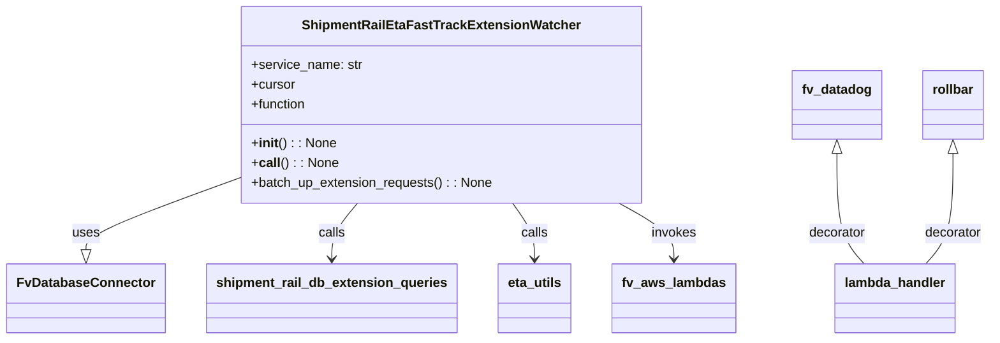
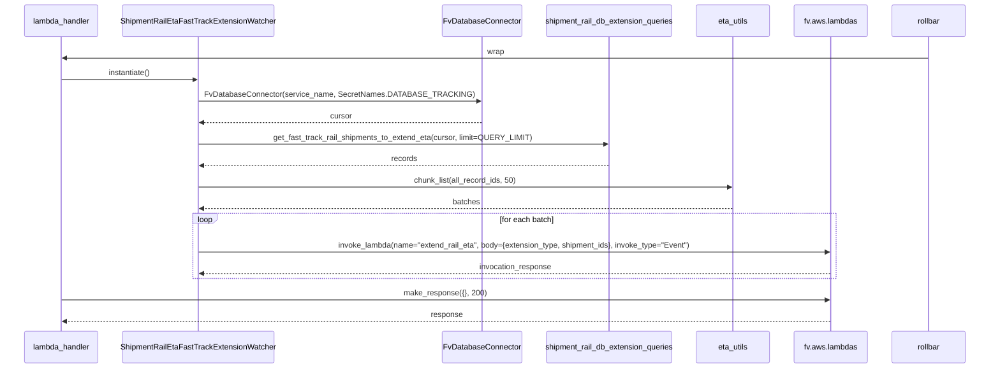

# Diagram: shipment_core/shipment_service/shipment_service/eta/watchers/shipment_rail_eta_fast_track_extension_watcher.py

> Auto-generated by Obscura crawlers

## Diagram 1

### SVG

<svg id="container" width="1173.6328125" xmlns="http://www.w3.org/2000/svg" class="classDiagram" height="414" viewBox="0 0 1173.6328125 414" role="graphics-document document" aria-roledescription="class"><g><defs><marker id="container_class-aggregationStart" class="marker aggregation class" refX="18" refY="7" markerWidth="190" markerHeight="240" orient="auto"><path d="M 18,7 L9,13 L1,7 L9,1 Z"></path></marker></defs><defs><marker id="container_class-aggregationEnd" class="marker aggregation class" refX="1" refY="7" markerWidth="20" markerHeight="28" orient="auto"><path d="M 18,7 L9,13 L1,7 L9,1 Z"></path></marker></defs><defs><marker id="container_class-extensionStart" class="marker extension class" refX="18" refY="7" markerWidth="190" markerHeight="240" orient="auto"><path d="M 1,7 L18,13 V 1 Z"></path></marker></defs><defs><marker id="container_class-extensionEnd" class="marker extension class" refX="1" refY="7" markerWidth="20" markerHeight="28" orient="auto"><path d="M 1,1 V 13 L18,7 Z"></path></marker></defs><defs><marker id="container_class-compositionStart" class="marker composition class" refX="18" refY="7" markerWidth="190" markerHeight="240" orient="auto"><path d="M 18,7 L9,13 L1,7 L9,1 Z"></path></marker></defs><defs><marker id="container_class-compositionEnd" class="marker composition class" refX="1" refY="7" markerWidth="20" markerHeight="28" orient="auto"><path d="M 18,7 L9,13 L1,7 L9,1 Z"></path></marker></defs><defs><marker id="container_class-dependencyStart" class="marker dependency class" refX="6" refY="7" markerWidth="190" markerHeight="240" orient="auto"><path d="M 5,7 L9,13 L1,7 L9,1 Z"></path></marker></defs><defs><marker id="container_class-dependencyEnd" class="marker dependency class" refX="13" refY="7" markerWidth="20" markerHeight="28" orient="auto"><path d="M 18,7 L9,13 L14,7 L9,1 Z"></path></marker></defs><defs><marker id="container_class-lollipopStart" class="marker lollipop class" refX="13" refY="7" markerWidth="190" markerHeight="240" orient="auto"><circle stroke="black" fill="transparent" cx="7" cy="7" r="6"></circle></marker></defs><defs><marker id="container_class-lollipopEnd" class="marker lollipop class" refX="1" refY="7" markerWidth="190" markerHeight="240" orient="auto"><circle stroke="black" fill="transparent" cx="7" cy="7" r="6"></circle></marker></defs><g class="root"><g class="clusters"></g><g class="edgePaths"><path d="M278.164,217.823L248.354,229.019C218.544,240.216,158.924,262.608,129.115,277.096C99.305,291.583,99.305,298.167,99.305,301.458L99.305,304.75" id="id_ShipmentRailEtaFastTrackExtensionWatcher_FvDatabaseConnector_1" class="edge-thickness-normal edge-pattern-solid relation" style=";;;" data-edge="true" data-et="edge" data-id="id_ShipmentRailEtaFastTrackExtensionWatcher_FvDatabaseConnector_1" data-points="W3sieCI6Mjc4LjE2NDA2MjUsInkiOjIxNy44MjMyNzIxNTYzOTM2N30seyJ4Ijo5OS4zMDQ2ODc1LCJ5IjoyODV9LHsieCI6OTkuMzA0Njg3NSwieSI6MzIyfV0=" marker-end="url(#container_class-extensionEnd)"></path><path d="M418.363,248L413.278,254.167C408.193,260.333,398.022,272.667,392.937,284C387.852,295.333,387.852,305.667,387.852,310.833L387.852,316" id="id_ShipmentRailEtaFastTrackExtensionWatcher_shipment_rail_db_extension_queries_2" class="edge-thickness-normal edge-pattern-solid relation" style=";;;" data-edge="true" data-et="edge" data-id="id_ShipmentRailEtaFastTrackExtensionWatcher_shipment_rail_db_extension_queries_2" data-points="W3sieCI6NDE4LjM2MzMwNjEzMDU3MzMsInkiOjI0OH0seyJ4IjozODcuODUxNTYyNSwieSI6Mjg1fSx7IngiOjM4Ny44NTE1NjI1LCJ5IjozMjJ9XQ==" marker-end="url(#container_class-dependencyEnd)"></path><path d="M602.716,248L607.105,254.167C611.493,260.333,620.27,272.667,624.658,284C629.047,295.333,629.047,305.667,629.047,310.833L629.047,316" id="id_ShipmentRailEtaFastTrackExtensionWatcher_eta_utils_3" class="edge-thickness-normal edge-pattern-solid relation" style=";;;" data-edge="true" data-et="edge" data-id="id_ShipmentRailEtaFastTrackExtensionWatcher_eta_utils_3" data-points="W3sieCI6NjAyLjcxNjQxMTIyNjExNDYsInkiOjI0OH0seyJ4Ijo2MjkuMDQ2ODc1LCJ5IjoyODV9LHsieCI6NjI5LjA0Njg3NSwieSI6MzIyfV0=" marker-end="url(#container_class-dependencyEnd)"></path><path d="M729.607,248L740.517,254.167C751.426,260.333,773.244,272.667,784.153,284C795.063,295.333,795.063,305.667,795.063,310.833L795.063,316" id="id_ShipmentRailEtaFastTrackExtensionWatcher_fv_aws_lambdas_4" class="edge-thickness-normal edge-pattern-solid relation" style=";;;" data-edge="true" data-et="edge" data-id="id_ShipmentRailEtaFastTrackExtensionWatcher_fv_aws_lambdas_4" data-points="W3sieCI6NzI5LjYwNzMzNDc5Mjk5MzcsInkiOjI0OH0seyJ4Ijo3OTUuMDYyNSwieSI6Mjg1fSx7IngiOjc5NS4wNjI1LCJ5IjozMjJ9XQ==" marker-end="url(#container_class-dependencyEnd)"></path><path d="M989.102,187.25L989.102,203.542C989.102,219.833,989.102,252.417,994.56,274.875C1000.018,297.333,1010.934,309.667,1016.392,315.833L1021.85,322" id="id_fv_datadog_lambda_handler_5" class="edge-thickness-normal edge-pattern-solid relation" style=";;;" data-edge="true" data-et="edge" data-id="id_fv_datadog_lambda_handler_5" data-points="W3sieCI6OTg5LjEwMTU2MjUsInkiOjE3MH0seyJ4Ijo5ODkuMTAxNTYyNSwieSI6Mjg1fSx7IngiOjEwMjEuODQ5NzgyNDM2NzA4OSwieSI6MzIyfV0=" marker-start="url(#container_class-extensionStart)"></path><path d="M1128.945,187.25L1128.945,203.542C1128.945,219.833,1128.945,252.417,1123.487,274.875C1118.029,297.333,1107.113,309.667,1101.655,315.833L1096.197,322" id="id_rollbar_lambda_handler_6" class="edge-thickness-normal edge-pattern-solid relation" style=";;;" data-edge="true" data-et="edge" data-id="id_rollbar_lambda_handler_6" data-points="W3sieCI6MTEyOC45NDUzMTI1LCJ5IjoxNzB9LHsieCI6MTEyOC45NDUzMTI1LCJ5IjoyODV9LHsieCI6MTA5Ni4xOTcwOTI1NjMyOTEsInkiOjMyMn1d" marker-start="url(#container_class-extensionStart)"></path></g><g class="edgeLabels"><g class="edgeLabel" transform="translate(99.3046875, 285)"><g class="label" data-id="id_ShipmentRailEtaFastTrackExtensionWatcher_FvDatabaseConnector_1" transform="translate(-16.4921875, -12)"><foreignObject width="32.984375" height="24">

uses

</foreignObject></g></g><g class="edgeLabel" transform="translate(387.8515625, 285)"><g class="label" data-id="id_ShipmentRailEtaFastTrackExtensionWatcher_shipment_rail_db_extension_queries_2" transform="translate(-16.4453125, -12)"><foreignObject width="32.890625" height="24">

calls

</foreignObject></g></g><g class="edgeLabel" transform="translate(629.046875, 285)"><g class="label" data-id="id_ShipmentRailEtaFastTrackExtensionWatcher_eta_utils_3" transform="translate(-16.4453125, -12)"><foreignObject width="32.890625" height="24">

calls

</foreignObject></g></g><g class="edgeLabel" transform="translate(795.0625, 285)"><g class="label" data-id="id_ShipmentRailEtaFastTrackExtensionWatcher_fv_aws_lambdas_4" transform="translate(-27.5859375, -12)"><foreignObject width="55.171875" height="24">

invokes

</foreignObject></g></g><g class="edgeLabel" transform="translate(989.1015625, 285)"><g class="label" data-id="id_fv_datadog_lambda_handler_5" transform="translate(-35.171875, -12)"><foreignObject width="70.34375" height="24">

decorator

</foreignObject></g></g><g class="edgeLabel" transform="translate(1128.9453125, 285)"><g class="label" data-id="id_rollbar_lambda_handler_6" transform="translate(-35.171875, -12)"><foreignObject width="70.34375" height="24">

decorator

</foreignObject></g></g></g><g class="nodes"><g class="node default" id="classId-ShipmentRailEtaFastTrackExtensionWatcher-0" transform="translate(517.3203125, 128)"><g class="basic label-container"><path d="M-239.15625 -120 L239.15625 -120 L239.15625 120 L-239.15625 120" stroke="none" stroke-width="0" fill="#ECECFF" style=""></path><path d="M-239.15625 -120 C-104.68959714040784 -120, 29.777055719184318 -120, 239.15625 -120 M-239.15625 -120 C-108.37450043253057 -120, 22.407249134938866 -120, 239.15625 -120 M239.15625 -120 C239.15625 -38.891402364557564, 239.15625 42.21719527088487, 239.15625 120 M239.15625 -120 C239.15625 -36.53981318716157, 239.15625 46.92037362567686, 239.15625 120 M239.15625 120 C139.15022359876934 120, 39.144197197538716 120, -239.15625 120 M239.15625 120 C77.84317961789779 120, -83.46989076420442 120, -239.15625 120 M-239.15625 120 C-239.15625 51.5850654529374, -239.15625 -16.8298690941252, -239.15625 -120 M-239.15625 120 C-239.15625 45.059703358201375, -239.15625 -29.88059328359725, -239.15625 -120" stroke="#9370DB" stroke-width="1.3" fill="none" stroke-dasharray="0 0" style=""></path></g><g class="annotation-group text" transform="translate(0, -96)"></g><g class="label-group text" transform="translate(-160.359375, -96)"><g class="label" style="font-weight: bolder" transform="translate(0,-12)"><foreignObject width="320.71875" height="24">

ShipmentRailEtaFastTrackExtensionWatcher

</foreignObject></g></g><g class="members-group text" transform="translate(-227.15625, -48)"><g class="label" style="" transform="translate(0,-12)"><foreignObject width="134.8125" height="24">

+service_name: str

</foreignObject></g><g class="label" style="" transform="translate(0,12)"><foreignObject width="53.71875" height="24">

+cursor

</foreignObject></g><g class="label" style="" transform="translate(0,36)"><foreignObject width="68.453125" height="24">

+function

</foreignObject></g></g><g class="methods-group text" transform="translate(-227.15625, 48)"><g class="label" style="" transform="translate(0,-12)"><foreignObject width="101.5625" height="24">

+<strong>init</strong>() : : None

</foreignObject></g><g class="label" style="" transform="translate(0,12)"><foreignObject width="102.75" height="24">

+<strong>call</strong>() : : None

</foreignObject></g><g class="label" style="" transform="translate(0,36)"><foreignObject width="293.953125" height="24">

+batch_up_extension_requests() : : None

</foreignObject></g></g><g class="divider" style=""><path d="M-239.15625 -72 C-115.34538082721777 -72, 8.465488345564466 -72, 239.15625 -72 M-239.15625 -72 C-129.89519572804483 -72, -20.634141456089623 -72, 239.15625 -72" stroke="#9370DB" stroke-width="1.3" fill="none" stroke-dasharray="0 0" style=""></path></g><g class="divider" style=""><path d="M-239.15625 24 C-112.63299928585606 24, 13.890251428287883 24, 239.15625 24 M-239.15625 24 C-55.133928789558695 24, 128.8883924208826 24, 239.15625 24" stroke="#9370DB" stroke-width="1.3" fill="none" stroke-dasharray="0 0" style=""></path></g></g><g class="node default" id="classId-FvDatabaseConnector-1" transform="translate(99.3046875, 364)"><g class="basic label-container"><path d="M-91.3046875 -42 L91.3046875 -42 L91.3046875 42 L-91.3046875 42" stroke="none" stroke-width="0" fill="#ECECFF" style=""></path><path d="M-91.3046875 -42 C-24.16882298220507 -42, 42.96704153558986 -42, 91.3046875 -42 M-91.3046875 -42 C-39.59196046201529 -42, 12.120766575969427 -42, 91.3046875 -42 M91.3046875 -42 C91.3046875 -22.56140546029074, 91.3046875 -3.122810920581479, 91.3046875 42 M91.3046875 -42 C91.3046875 -19.347412904431952, 91.3046875 3.3051741911360963, 91.3046875 42 M91.3046875 42 C50.20700075725649 42, 9.109314014512975 42, -91.3046875 42 M91.3046875 42 C20.677150454117793 42, -49.95038659176441 42, -91.3046875 42 M-91.3046875 42 C-91.3046875 23.929285036085858, -91.3046875 5.858570072171716, -91.3046875 -42 M-91.3046875 42 C-91.3046875 15.629130546167989, -91.3046875 -10.741738907664022, -91.3046875 -42" stroke="#9370DB" stroke-width="1.3" fill="none" stroke-dasharray="0 0" style=""></path></g><g class="annotation-group text" transform="translate(0, -18)"></g><g class="label-group text" transform="translate(-79.3046875, -18)"><g class="label" style="font-weight: bolder" transform="translate(0,-12)"><foreignObject width="158.609375" height="24">

FvDatabaseConnector

</foreignObject></g></g><g class="members-group text" transform="translate(-79.3046875, 30)"></g><g class="methods-group text" transform="translate(-79.3046875, 60)"></g><g class="divider" style=""><path d="M-91.3046875 6 C-44.46407319720896 6, 2.3765411055820778 6, 91.3046875 6 M-91.3046875 6 C-50.548582561368576 6, -9.792477622737152 6, 91.3046875 6" stroke="#9370DB" stroke-width="1.3" fill="none" stroke-dasharray="0 0" style=""></path></g><g class="divider" style=""><path d="M-91.3046875 24 C-33.886882604402736 24, 23.53092229119453 24, 91.3046875 24 M-91.3046875 24 C-25.09982226371406 24, 41.10504297257188 24, 91.3046875 24" stroke="#9370DB" stroke-width="1.3" fill="none" stroke-dasharray="0 0" style=""></path></g></g><g class="node default" id="classId-shipment_rail_db_extension_queries-2" transform="translate(387.8515625, 364)"><g class="basic label-container"><path d="M-147.2421875 -42 L147.2421875 -42 L147.2421875 42 L-147.2421875 42" stroke="none" stroke-width="0" fill="#ECECFF" style=""></path><path d="M-147.2421875 -42 C-33.21616163273093 -42, 80.80986423453814 -42, 147.2421875 -42 M-147.2421875 -42 C-47.90150836318266 -42, 51.439170773634686 -42, 147.2421875 -42 M147.2421875 -42 C147.2421875 -23.92392626871244, 147.2421875 -5.8478525374248775, 147.2421875 42 M147.2421875 -42 C147.2421875 -11.850256593623232, 147.2421875 18.299486812753536, 147.2421875 42 M147.2421875 42 C51.54072807978574 42, -44.160731340428526 42, -147.2421875 42 M147.2421875 42 C33.71072528700236 42, -79.82073692599528 42, -147.2421875 42 M-147.2421875 42 C-147.2421875 19.22390500229084, -147.2421875 -3.552189995418317, -147.2421875 -42 M-147.2421875 42 C-147.2421875 18.25440045364516, -147.2421875 -5.491199092709678, -147.2421875 -42" stroke="#9370DB" stroke-width="1.3" fill="none" stroke-dasharray="0 0" style=""></path></g><g class="annotation-group text" transform="translate(0, -18)"></g><g class="label-group text" transform="translate(-135.2421875, -18)"><g class="label" style="font-weight: bolder" transform="translate(0,-12)"><foreignObject width="270.484375" height="24">

shipment_rail_db_extension_queries

</foreignObject></g></g><g class="members-group text" transform="translate(-135.2421875, 30)"></g><g class="methods-group text" transform="translate(-135.2421875, 60)"></g><g class="divider" style=""><path d="M-147.2421875 6 C-32.10275831995229 6, 83.03667086009543 6, 147.2421875 6 M-147.2421875 6 C-65.38535683623877 6, 16.47147382752246 6, 147.2421875 6" stroke="#9370DB" stroke-width="1.3" fill="none" stroke-dasharray="0 0" style=""></path></g><g class="divider" style=""><path d="M-147.2421875 24 C-50.62705568655886 24, 45.98807612688228 24, 147.2421875 24 M-147.2421875 24 C-59.13344271222245 24, 28.975302075555106 24, 147.2421875 24" stroke="#9370DB" stroke-width="1.3" fill="none" stroke-dasharray="0 0" style=""></path></g></g><g class="node default" id="classId-eta_utils-3" transform="translate(629.046875, 364)"><g class="basic label-container"><path d="M-43.953125 -42 L43.953125 -42 L43.953125 42 L-43.953125 42" stroke="none" stroke-width="0" fill="#ECECFF" style=""></path><path d="M-43.953125 -42 C-20.56903606185255 -42, 2.8150528762948994 -42, 43.953125 -42 M-43.953125 -42 C-13.643404210726775 -42, 16.66631657854645 -42, 43.953125 -42 M43.953125 -42 C43.953125 -18.21031471992044, 43.953125 5.57937056015912, 43.953125 42 M43.953125 -42 C43.953125 -20.2681092516406, 43.953125 1.463781496718802, 43.953125 42 M43.953125 42 C26.23171609823829 42, 8.510307196476582 42, -43.953125 42 M43.953125 42 C19.816068003223283 42, -4.320988993553435 42, -43.953125 42 M-43.953125 42 C-43.953125 20.320348754785375, -43.953125 -1.3593024904292506, -43.953125 -42 M-43.953125 42 C-43.953125 22.975759823718764, -43.953125 3.9515196474375287, -43.953125 -42" stroke="#9370DB" stroke-width="1.3" fill="none" stroke-dasharray="0 0" style=""></path></g><g class="annotation-group text" transform="translate(0, -18)"></g><g class="label-group text" transform="translate(-31.953125, -18)"><g class="label" style="font-weight: bolder" transform="translate(0,-12)"><foreignObject width="63.90625" height="24">

eta_utils

</foreignObject></g></g><g class="members-group text" transform="translate(-31.953125, 30)"></g><g class="methods-group text" transform="translate(-31.953125, 60)"></g><g class="divider" style=""><path d="M-43.953125 6 C-15.032028449626129 6, 13.889068100747743 6, 43.953125 6 M-43.953125 6 C-11.4914482777844 6, 20.9702284444312 6, 43.953125 6" stroke="#9370DB" stroke-width="1.3" fill="none" stroke-dasharray="0 0" style=""></path></g><g class="divider" style=""><path d="M-43.953125 24 C-19.928714627022728 24, 4.0956957459545436 24, 43.953125 24 M-43.953125 24 C-17.287586455609947 24, 9.377952088780106 24, 43.953125 24" stroke="#9370DB" stroke-width="1.3" fill="none" stroke-dasharray="0 0" style=""></path></g></g><g class="node default" id="classId-fv_aws_lambdas-4" transform="translate(795.0625, 364)"><g class="basic label-container"><path d="M-72.0625 -42 L72.0625 -42 L72.0625 42 L-72.0625 42" stroke="none" stroke-width="0" fill="#ECECFF" style=""></path><path d="M-72.0625 -42 C-16.046227576513274 -42, 39.97004484697345 -42, 72.0625 -42 M-72.0625 -42 C-40.70233633988528 -42, -9.342172679770563 -42, 72.0625 -42 M72.0625 -42 C72.0625 -17.525674191704013, 72.0625 6.948651616591974, 72.0625 42 M72.0625 -42 C72.0625 -14.742947002312405, 72.0625 12.51410599537519, 72.0625 42 M72.0625 42 C27.425918916961542 42, -17.210662166076915 42, -72.0625 42 M72.0625 42 C34.51603752024407 42, -3.030424959511862 42, -72.0625 42 M-72.0625 42 C-72.0625 19.27430285995707, -72.0625 -3.4513942800858572, -72.0625 -42 M-72.0625 42 C-72.0625 18.40845749603206, -72.0625 -5.18308500793588, -72.0625 -42" stroke="#9370DB" stroke-width="1.3" fill="none" stroke-dasharray="0 0" style=""></path></g><g class="annotation-group text" transform="translate(0, -18)"></g><g class="label-group text" transform="translate(-60.0625, -18)"><g class="label" style="font-weight: bolder" transform="translate(0,-12)"><foreignObject width="120.125" height="24">

fv_aws_lambdas

</foreignObject></g></g><g class="members-group text" transform="translate(-60.0625, 30)"></g><g class="methods-group text" transform="translate(-60.0625, 60)"></g><g class="divider" style=""><path d="M-72.0625 6 C-25.258227829315693 6, 21.546044341368614 6, 72.0625 6 M-72.0625 6 C-16.504146155174695 6, 39.05420768965061 6, 72.0625 6" stroke="#9370DB" stroke-width="1.3" fill="none" stroke-dasharray="0 0" style=""></path></g><g class="divider" style=""><path d="M-72.0625 24 C-18.12321431693678 24, 35.81607136612644 24, 72.0625 24 M-72.0625 24 C-19.47566669074746 24, 33.11116661850508 24, 72.0625 24" stroke="#9370DB" stroke-width="1.3" fill="none" stroke-dasharray="0 0" style=""></path></g></g><g class="node default" id="classId-fv_datadog-5" transform="translate(989.1015625, 128)"><g class="basic label-container"><path d="M-53.15625 -42 L53.15625 -42 L53.15625 42 L-53.15625 42" stroke="none" stroke-width="0" fill="#ECECFF" style=""></path><path d="M-53.15625 -42 C-24.750882754312446 -42, 3.654484491375108 -42, 53.15625 -42 M-53.15625 -42 C-17.204214068231614 -42, 18.74782186353677 -42, 53.15625 -42 M53.15625 -42 C53.15625 -11.653935650609743, 53.15625 18.692128698780515, 53.15625 42 M53.15625 -42 C53.15625 -19.634618116736593, 53.15625 2.730763766526813, 53.15625 42 M53.15625 42 C13.574820251798634 42, -26.00660949640273 42, -53.15625 42 M53.15625 42 C28.856596659171853 42, 4.556943318343706 42, -53.15625 42 M-53.15625 42 C-53.15625 9.599471376361748, -53.15625 -22.801057247276503, -53.15625 -42 M-53.15625 42 C-53.15625 11.036101344057535, -53.15625 -19.92779731188493, -53.15625 -42" stroke="#9370DB" stroke-width="1.3" fill="none" stroke-dasharray="0 0" style=""></path></g><g class="annotation-group text" transform="translate(0, -18)"></g><g class="label-group text" transform="translate(-41.15625, -18)"><g class="label" style="font-weight: bolder" transform="translate(0,-12)"><foreignObject width="82.3125" height="24">

fv_datadog

</foreignObject></g></g><g class="members-group text" transform="translate(-41.15625, 30)"></g><g class="methods-group text" transform="translate(-41.15625, 60)"></g><g class="divider" style=""><path d="M-53.15625 6 C-18.218545997754603 6, 16.719158004490794 6, 53.15625 6 M-53.15625 6 C-16.508601957492665 6, 20.13904608501467 6, 53.15625 6" stroke="#9370DB" stroke-width="1.3" fill="none" stroke-dasharray="0 0" style=""></path></g><g class="divider" style=""><path d="M-53.15625 24 C-14.166162191587759 24, 24.823925616824482 24, 53.15625 24 M-53.15625 24 C-16.937556172607167 24, 19.281137654785667 24, 53.15625 24" stroke="#9370DB" stroke-width="1.3" fill="none" stroke-dasharray="0 0" style=""></path></g></g><g class="node default" id="classId-rollbar-6" transform="translate(1128.9453125, 128)"><g class="basic label-container"><path d="M-36.6875 -42 L36.6875 -42 L36.6875 42 L-36.6875 42" stroke="none" stroke-width="0" fill="#ECECFF" style=""></path><path d="M-36.6875 -42 C-17.567021623184477 -42, 1.5534567536310462 -42, 36.6875 -42 M-36.6875 -42 C-21.41245682078693 -42, -6.137413641573854 -42, 36.6875 -42 M36.6875 -42 C36.6875 -22.80788698889141, 36.6875 -3.6157739777828226, 36.6875 42 M36.6875 -42 C36.6875 -11.447246513451205, 36.6875 19.10550697309759, 36.6875 42 M36.6875 42 C19.321097414073144 42, 1.9546948281462875 42, -36.6875 42 M36.6875 42 C13.90156082393123 42, -8.884378352137539 42, -36.6875 42 M-36.6875 42 C-36.6875 15.417228775099506, -36.6875 -11.165542449800988, -36.6875 -42 M-36.6875 42 C-36.6875 22.001828606927628, -36.6875 2.0036572138552557, -36.6875 -42" stroke="#9370DB" stroke-width="1.3" fill="none" stroke-dasharray="0 0" style=""></path></g><g class="annotation-group text" transform="translate(0, -18)"></g><g class="label-group text" transform="translate(-24.6875, -18)"><g class="label" style="font-weight: bolder" transform="translate(0,-12)"><foreignObject width="49.375" height="24">

rollbar

</foreignObject></g></g><g class="members-group text" transform="translate(-24.6875, 30)"></g><g class="methods-group text" transform="translate(-24.6875, 60)"></g><g class="divider" style=""><path d="M-36.6875 6 C-16.902023944946045 6, 2.8834521101079105 6, 36.6875 6 M-36.6875 6 C-16.90883014166042 6, 2.8698397166791594 6, 36.6875 6" stroke="#9370DB" stroke-width="1.3" fill="none" stroke-dasharray="0 0" style=""></path></g><g class="divider" style=""><path d="M-36.6875 24 C-21.860349706381353 24, -7.0331994127627055 24, 36.6875 24 M-36.6875 24 C-18.722885882551136 24, -0.7582717651022719 24, 36.6875 24" stroke="#9370DB" stroke-width="1.3" fill="none" stroke-dasharray="0 0" style=""></path></g></g><g class="node default" id="classId-lambda_handler-7" transform="translate(1059.0234375, 364)"><g class="basic label-container"><path d="M-71.9765625 -42 L71.9765625 -42 L71.9765625 42 L-71.9765625 42" stroke="none" stroke-width="0" fill="#ECECFF" style=""></path><path d="M-71.9765625 -42 C-35.73922967110666 -42, 0.498103157786673 -42, 71.9765625 -42 M-71.9765625 -42 C-16.576373786953496 -42, 38.82381492609301 -42, 71.9765625 -42 M71.9765625 -42 C71.9765625 -20.243435600183034, 71.9765625 1.5131287996339324, 71.9765625 42 M71.9765625 -42 C71.9765625 -10.981583016234964, 71.9765625 20.03683396753007, 71.9765625 42 M71.9765625 42 C37.1783845068864 42, 2.380206513772805 42, -71.9765625 42 M71.9765625 42 C24.98641562203452 42, -22.00373125593096 42, -71.9765625 42 M-71.9765625 42 C-71.9765625 24.53074114609141, -71.9765625 7.0614822921828235, -71.9765625 -42 M-71.9765625 42 C-71.9765625 13.371613588977283, -71.9765625 -15.256772822045434, -71.9765625 -42" stroke="#9370DB" stroke-width="1.3" fill="none" stroke-dasharray="0 0" style=""></path></g><g class="annotation-group text" transform="translate(0, -18)"></g><g class="label-group text" transform="translate(-59.9765625, -18)"><g class="label" style="font-weight: bolder" transform="translate(0,-12)"><foreignObject width="119.953125" height="24">

lambda_handler

</foreignObject></g></g><g class="members-group text" transform="translate(-59.9765625, 30)"></g><g class="methods-group text" transform="translate(-59.9765625, 60)"></g><g class="divider" style=""><path d="M-71.9765625 6 C-33.59505232246572 6, 4.786457855068562 6, 71.9765625 6 M-71.9765625 6 C-32.42862688781626 6, 7.119308724367485 6, 71.9765625 6" stroke="#9370DB" stroke-width="1.3" fill="none" stroke-dasharray="0 0" style=""></path></g><g class="divider" style=""><path d="M-71.9765625 24 C-41.73991726317536 24, -11.503272026350707 24, 71.9765625 24 M-71.9765625 24 C-31.33794153200644 24, 9.30067943598712 24, 71.9765625 24" stroke="#9370DB" stroke-width="1.3" fill="none" stroke-dasharray="0 0" style=""></path></g></g></g></g></g></svg>

## Diagram 2

### SVG

<svg id="container" width="2088" xmlns="http://www.w3.org/2000/svg" height="802" viewBox="-50 -10 2088 802" role="graphics-document document" aria-roledescription="sequence"><g><rect x="1838" y="716" fill="#eaeaea" stroke="#666" width="150" height="65" name="Rollbar" rx="3" ry="3" class="actor actor-bottom"></rect><text x="1913" y="748.5" dominant-baseline="central" alignment-baseline="central" class="actor actor-box" style="text-anchor: middle; font-size: 16px; font-weight: 400;"><tspan x="1913" dy="0">rollbar</tspan></text></g><g><rect x="1638" y="716" fill="#eaeaea" stroke="#666" width="150" height="65" name="AWS" rx="3" ry="3" class="actor actor-bottom"></rect><text x="1713" y="748.5" dominant-baseline="central" alignment-baseline="central" class="actor actor-box" style="text-anchor: middle; font-size: 16px; font-weight: 400;"><tspan x="1713" dy="0">fv.aws.lambdas</tspan></text></g><g><rect x="1438" y="716" fill="#eaeaea" stroke="#666" width="150" height="65" name="Utils" rx="3" ry="3" class="actor actor-bottom"></rect><text x="1513" y="748.5" dominant-baseline="central" alignment-baseline="central" class="actor actor-box" style="text-anchor: middle; font-size: 16px; font-weight: 400;"><tspan x="1513" dy="0">eta_utils</tspan></text></g><g><rect x="1100" y="716" fill="#eaeaea" stroke="#666" width="288" height="65" name="Queries" rx="3" ry="3" class="actor actor-bottom"></rect><text x="1244" y="748.5" dominant-baseline="central" alignment-baseline="central" class="actor actor-box" style="text-anchor: middle; font-size: 16px; font-weight: 400;"><tspan x="1244" dy="0">shipment_rail_db_extension_queries</tspan></text></g><g><rect x="873" y="716" fill="#eaeaea" stroke="#666" width="177" height="65" name="DB" rx="3" ry="3" class="actor actor-bottom"></rect><text x="961.5" y="748.5" dominant-baseline="central" alignment-baseline="central" class="actor actor-box" style="text-anchor: middle; font-size: 16px; font-weight: 400;"><tspan x="961.5" dy="0">FvDatabaseConnector</tspan></text></g><g><rect x="200" y="716" fill="#eaeaea" stroke="#666" width="337" height="65" name="Watcher" rx="3" ry="3" class="actor actor-bottom"></rect><text x="368.5" y="748.5" dominant-baseline="central" alignment-baseline="central" class="actor actor-box" style="text-anchor: middle; font-size: 16px; font-weight: 400;"><tspan x="368.5" dy="0">ShipmentRailEtaFastTrackExtensionWatcher</tspan></text></g><g><rect x="0" y="716" fill="#eaeaea" stroke="#666" width="150" height="65" name="Handler" rx="3" ry="3" class="actor actor-bottom"></rect><text x="75" y="748.5" dominant-baseline="central" alignment-baseline="central" class="actor actor-box" style="text-anchor: middle; font-size: 16px; font-weight: 400;"><tspan x="75" dy="0">lambda_handler</tspan></text></g><g><line id="actor6" x1="1913" y1="65" x2="1913" y2="716" class="actor-line 200" stroke-width="0.5px" stroke="#999" name="Rollbar"></line><g id="root-6"><rect x="1838" y="0" fill="#eaeaea" stroke="#666" width="150" height="65" name="Rollbar" rx="3" ry="3" class="actor actor-top"></rect><text x="1913" y="32.5" dominant-baseline="central" alignment-baseline="central" class="actor actor-box" style="text-anchor: middle; font-size: 16px; font-weight: 400;"><tspan x="1913" dy="0">rollbar</tspan></text></g></g><g><line id="actor5" x1="1713" y1="65" x2="1713" y2="716" class="actor-line 200" stroke-width="0.5px" stroke="#999" name="AWS"></line><g id="root-5"><rect x="1638" y="0" fill="#eaeaea" stroke="#666" width="150" height="65" name="AWS" rx="3" ry="3" class="actor actor-top"></rect><text x="1713" y="32.5" dominant-baseline="central" alignment-baseline="central" class="actor actor-box" style="text-anchor: middle; font-size: 16px; font-weight: 400;"><tspan x="1713" dy="0">fv.aws.lambdas</tspan></text></g></g><g><line id="actor4" x1="1513" y1="65" x2="1513" y2="716" class="actor-line 200" stroke-width="0.5px" stroke="#999" name="Utils"></line><g id="root-4"><rect x="1438" y="0" fill="#eaeaea" stroke="#666" width="150" height="65" name="Utils" rx="3" ry="3" class="actor actor-top"></rect><text x="1513" y="32.5" dominant-baseline="central" alignment-baseline="central" class="actor actor-box" style="text-anchor: middle; font-size: 16px; font-weight: 400;"><tspan x="1513" dy="0">eta_utils</tspan></text></g></g><g><line id="actor3" x1="1244" y1="65" x2="1244" y2="716" class="actor-line 200" stroke-width="0.5px" stroke="#999" name="Queries"></line><g id="root-3"><rect x="1100" y="0" fill="#eaeaea" stroke="#666" width="288" height="65" name="Queries" rx="3" ry="3" class="actor actor-top"></rect><text x="1244" y="32.5" dominant-baseline="central" alignment-baseline="central" class="actor actor-box" style="text-anchor: middle; font-size: 16px; font-weight: 400;"><tspan x="1244" dy="0">shipment_rail_db_extension_queries</tspan></text></g></g><g><line id="actor2" x1="961.5" y1="65" x2="961.5" y2="716" class="actor-line 200" stroke-width="0.5px" stroke="#999" name="DB"></line><g id="root-2"><rect x="873" y="0" fill="#eaeaea" stroke="#666" width="177" height="65" name="DB" rx="3" ry="3" class="actor actor-top"></rect><text x="961.5" y="32.5" dominant-baseline="central" alignment-baseline="central" class="actor actor-box" style="text-anchor: middle; font-size: 16px; font-weight: 400;"><tspan x="961.5" dy="0">FvDatabaseConnector</tspan></text></g></g><g><line id="actor1" x1="368.5" y1="65" x2="368.5" y2="716" class="actor-line 200" stroke-width="0.5px" stroke="#999" name="Watcher"></line><g id="root-1"><rect x="200" y="0" fill="#eaeaea" stroke="#666" width="337" height="65" name="Watcher" rx="3" ry="3" class="actor actor-top"></rect><text x="368.5" y="32.5" dominant-baseline="central" alignment-baseline="central" class="actor actor-box" style="text-anchor: middle; font-size: 16px; font-weight: 400;"><tspan x="368.5" dy="0">ShipmentRailEtaFastTrackExtensionWatcher</tspan></text></g></g><g><line id="actor0" x1="75" y1="65" x2="75" y2="716" class="actor-line 200" stroke-width="0.5px" stroke="#999" name="Handler"></line><g id="root-0"><rect x="0" y="0" fill="#eaeaea" stroke="#666" width="150" height="65" name="Handler" rx="3" ry="3" class="actor actor-top"></rect><text x="75" y="32.5" dominant-baseline="central" alignment-baseline="central" class="actor actor-box" style="text-anchor: middle; font-size: 16px; font-weight: 400;"><tspan x="75" dy="0">lambda_handler</tspan></text></g></g><g></g><defs><symbol id="computer" width="24" height="24"><path transform="scale(.5)" d="M2 2v13h20v-13h-20zm18 11h-16v-9h16v9zm-10.228 6l.466-1h3.524l.467 1h-4.457zm14.228 3h-24l2-6h2.104l-1.33 4h18.45l-1.297-4h2.073l2 6zm-5-10h-14v-7h14v7z"></path></symbol></defs><defs><symbol id="database" fill-rule="evenodd" clip-rule="evenodd"><path transform="scale(.5)" d="M12.258.001l.256.004.255.005.253.008.251.01.249.012.247.015.246.016.242.019.241.02.239.023.236.024.233.027.231.028.229.031.225.032.223.034.22.036.217.038.214.04.211.041.208.043.205.045.201.046.198.048.194.05.191.051.187.053.183.054.18.056.175.057.172.059.168.06.163.061.16.063.155.064.15.066.074.033.073.033.071.034.07.034.069.035.068.035.067.035.066.035.064.036.064.036.062.036.06.036.06.037.058.037.058.037.055.038.055.038.053.038.052.038.051.039.05.039.048.039.047.039.045.04.044.04.043.04.041.04.04.041.039.041.037.041.036.041.034.041.033.042.032.042.03.042.029.042.027.042.026.043.024.043.023.043.021.043.02.043.018.044.017.043.015.044.013.044.012.044.011.045.009.044.007.045.006.045.004.045.002.045.001.045v17l-.001.045-.002.045-.004.045-.006.045-.007.045-.009.044-.011.045-.012.044-.013.044-.015.044-.017.043-.018.044-.02.043-.021.043-.023.043-.024.043-.026.043-.027.042-.029.042-.03.042-.032.042-.033.042-.034.041-.036.041-.037.041-.039.041-.04.041-.041.04-.043.04-.044.04-.045.04-.047.039-.048.039-.05.039-.051.039-.052.038-.053.038-.055.038-.055.038-.058.037-.058.037-.06.037-.06.036-.062.036-.064.036-.064.036-.066.035-.067.035-.068.035-.069.035-.07.034-.071.034-.073.033-.074.033-.15.066-.155.064-.16.063-.163.061-.168.06-.172.059-.175.057-.18.056-.183.054-.187.053-.191.051-.194.05-.198.048-.201.046-.205.045-.208.043-.211.041-.214.04-.217.038-.22.036-.223.034-.225.032-.229.031-.231.028-.233.027-.236.024-.239.023-.241.02-.242.019-.246.016-.247.015-.249.012-.251.01-.253.008-.255.005-.256.004-.258.001-.258-.001-.256-.004-.255-.005-.253-.008-.251-.01-.249-.012-.247-.015-.245-.016-.243-.019-.241-.02-.238-.023-.236-.024-.234-.027-.231-.028-.228-.031-.226-.032-.223-.034-.22-.036-.217-.038-.214-.04-.211-.041-.208-.043-.204-.045-.201-.046-.198-.048-.195-.05-.19-.051-.187-.053-.184-.054-.179-.056-.176-.057-.172-.059-.167-.06-.164-.061-.159-.063-.155-.064-.151-.066-.074-.033-.072-.033-.072-.034-.07-.034-.069-.035-.068-.035-.067-.035-.066-.035-.064-.036-.063-.036-.062-.036-.061-.036-.06-.037-.058-.037-.057-.037-.056-.038-.055-.038-.053-.038-.052-.038-.051-.039-.049-.039-.049-.039-.046-.039-.046-.04-.044-.04-.043-.04-.041-.04-.04-.041-.039-.041-.037-.041-.036-.041-.034-.041-.033-.042-.032-.042-.03-.042-.029-.042-.027-.042-.026-.043-.024-.043-.023-.043-.021-.043-.02-.043-.018-.044-.017-.043-.015-.044-.013-.044-.012-.044-.011-.045-.009-.044-.007-.045-.006-.045-.004-.045-.002-.045-.001-.045v-17l.001-.045.002-.045.004-.045.006-.045.007-.045.009-.044.011-.045.012-.044.013-.044.015-.044.017-.043.018-.044.02-.043.021-.043.023-.043.024-.043.026-.043.027-.042.029-.042.03-.042.032-.042.033-.042.034-.041.036-.041.037-.041.039-.041.04-.041.041-.04.043-.04.044-.04.046-.04.046-.039.049-.039.049-.039.051-.039.052-.038.053-.038.055-.038.056-.038.057-.037.058-.037.06-.037.061-.036.062-.036.063-.036.064-.036.066-.035.067-.035.068-.035.069-.035.07-.034.072-.034.072-.033.074-.033.151-.066.155-.064.159-.063.164-.061.167-.06.172-.059.176-.057.179-.056.184-.054.187-.053.19-.051.195-.05.198-.048.201-.046.204-.045.208-.043.211-.041.214-.04.217-.038.22-.036.223-.034.226-.032.228-.031.231-.028.234-.027.236-.024.238-.023.241-.02.243-.019.245-.016.247-.015.249-.012.251-.01.253-.008.255-.005.256-.004.258-.001.258.001zm-9.258 20.499v.01l.001.021.003.021.004.022.005.021.006.022.007.022.009.023.01.022.011.023.012.023.013.023.015.023.016.024.017.023.018.024.019.024.021.024.022.025.023.024.024.025.052.049.056.05.061.051.066.051.07.051.075.051.079.052.084.052.088.052.092.052.097.052.102.051.105.052.11.052.114.051.119.051.123.051.127.05.131.05.135.05.139.048.144.049.147.047.152.047.155.047.16.045.163.045.167.043.171.043.176.041.178.041.183.039.187.039.19.037.194.035.197.035.202.033.204.031.209.03.212.029.216.027.219.025.222.024.226.021.23.02.233.018.236.016.24.015.243.012.246.01.249.008.253.005.256.004.259.001.26-.001.257-.004.254-.005.25-.008.247-.011.244-.012.241-.014.237-.016.233-.018.231-.021.226-.021.224-.024.22-.026.216-.027.212-.028.21-.031.205-.031.202-.034.198-.034.194-.036.191-.037.187-.039.183-.04.179-.04.175-.042.172-.043.168-.044.163-.045.16-.046.155-.046.152-.047.148-.048.143-.049.139-.049.136-.05.131-.05.126-.05.123-.051.118-.052.114-.051.11-.052.106-.052.101-.052.096-.052.092-.052.088-.053.083-.051.079-.052.074-.052.07-.051.065-.051.06-.051.056-.05.051-.05.023-.024.023-.025.021-.024.02-.024.019-.024.018-.024.017-.024.015-.023.014-.024.013-.023.012-.023.01-.023.01-.022.008-.022.006-.022.006-.022.004-.022.004-.021.001-.021.001-.021v-4.127l-.077.055-.08.053-.083.054-.085.053-.087.052-.09.052-.093.051-.095.05-.097.05-.1.049-.102.049-.105.048-.106.047-.109.047-.111.046-.114.045-.115.045-.118.044-.12.043-.122.042-.124.042-.126.041-.128.04-.13.04-.132.038-.134.038-.135.037-.138.037-.139.035-.142.035-.143.034-.144.033-.147.032-.148.031-.15.03-.151.03-.153.029-.154.027-.156.027-.158.026-.159.025-.161.024-.162.023-.163.022-.165.021-.166.02-.167.019-.169.018-.169.017-.171.016-.173.015-.173.014-.175.013-.175.012-.177.011-.178.01-.179.008-.179.008-.181.006-.182.005-.182.004-.184.003-.184.002h-.37l-.184-.002-.184-.003-.182-.004-.182-.005-.181-.006-.179-.008-.179-.008-.178-.01-.176-.011-.176-.012-.175-.013-.173-.014-.172-.015-.171-.016-.17-.017-.169-.018-.167-.019-.166-.02-.165-.021-.163-.022-.162-.023-.161-.024-.159-.025-.157-.026-.156-.027-.155-.027-.153-.029-.151-.03-.15-.03-.148-.031-.146-.032-.145-.033-.143-.034-.141-.035-.14-.035-.137-.037-.136-.037-.134-.038-.132-.038-.13-.04-.128-.04-.126-.041-.124-.042-.122-.042-.12-.044-.117-.043-.116-.045-.113-.045-.112-.046-.109-.047-.106-.047-.105-.048-.102-.049-.1-.049-.097-.05-.095-.05-.093-.052-.09-.051-.087-.052-.085-.053-.083-.054-.08-.054-.077-.054v4.127zm0-5.654v.011l.001.021.003.021.004.021.005.022.006.022.007.022.009.022.01.022.011.023.012.023.013.023.015.024.016.023.017.024.018.024.019.024.021.024.022.024.023.025.024.024.052.05.056.05.061.05.066.051.07.051.075.052.079.051.084.052.088.052.092.052.097.052.102.052.105.052.11.051.114.051.119.052.123.05.127.051.131.05.135.049.139.049.144.048.147.048.152.047.155.046.16.045.163.045.167.044.171.042.176.042.178.04.183.04.187.038.19.037.194.036.197.034.202.033.204.032.209.03.212.028.216.027.219.025.222.024.226.022.23.02.233.018.236.016.24.014.243.012.246.01.249.008.253.006.256.003.259.001.26-.001.257-.003.254-.006.25-.008.247-.01.244-.012.241-.015.237-.016.233-.018.231-.02.226-.022.224-.024.22-.025.216-.027.212-.029.21-.03.205-.032.202-.033.198-.035.194-.036.191-.037.187-.039.183-.039.179-.041.175-.042.172-.043.168-.044.163-.045.16-.045.155-.047.152-.047.148-.048.143-.048.139-.05.136-.049.131-.05.126-.051.123-.051.118-.051.114-.052.11-.052.106-.052.101-.052.096-.052.092-.052.088-.052.083-.052.079-.052.074-.051.07-.052.065-.051.06-.05.056-.051.051-.049.023-.025.023-.024.021-.025.02-.024.019-.024.018-.024.017-.024.015-.023.014-.023.013-.024.012-.022.01-.023.01-.023.008-.022.006-.022.006-.022.004-.021.004-.022.001-.021.001-.021v-4.139l-.077.054-.08.054-.083.054-.085.052-.087.053-.09.051-.093.051-.095.051-.097.05-.1.049-.102.049-.105.048-.106.047-.109.047-.111.046-.114.045-.115.044-.118.044-.12.044-.122.042-.124.042-.126.041-.128.04-.13.039-.132.039-.134.038-.135.037-.138.036-.139.036-.142.035-.143.033-.144.033-.147.033-.148.031-.15.03-.151.03-.153.028-.154.028-.156.027-.158.026-.159.025-.161.024-.162.023-.163.022-.165.021-.166.02-.167.019-.169.018-.169.017-.171.016-.173.015-.173.014-.175.013-.175.012-.177.011-.178.009-.179.009-.179.007-.181.007-.182.005-.182.004-.184.003-.184.002h-.37l-.184-.002-.184-.003-.182-.004-.182-.005-.181-.007-.179-.007-.179-.009-.178-.009-.176-.011-.176-.012-.175-.013-.173-.014-.172-.015-.171-.016-.17-.017-.169-.018-.167-.019-.166-.02-.165-.021-.163-.022-.162-.023-.161-.024-.159-.025-.157-.026-.156-.027-.155-.028-.153-.028-.151-.03-.15-.03-.148-.031-.146-.033-.145-.033-.143-.033-.141-.035-.14-.036-.137-.036-.136-.037-.134-.038-.132-.039-.13-.039-.128-.04-.126-.041-.124-.042-.122-.043-.12-.043-.117-.044-.116-.044-.113-.046-.112-.046-.109-.046-.106-.047-.105-.048-.102-.049-.1-.049-.097-.05-.095-.051-.093-.051-.09-.051-.087-.053-.085-.052-.083-.054-.08-.054-.077-.054v4.139zm0-5.666v.011l.001.02.003.022.004.021.005.022.006.021.007.022.009.023.01.022.011.023.012.023.013.023.015.023.016.024.017.024.018.023.019.024.021.025.022.024.023.024.024.025.052.05.056.05.061.05.066.051.07.051.075.052.079.051.084.052.088.052.092.052.097.052.102.052.105.051.11.052.114.051.119.051.123.051.127.05.131.05.135.05.139.049.144.048.147.048.152.047.155.046.16.045.163.045.167.043.171.043.176.042.178.04.183.04.187.038.19.037.194.036.197.034.202.033.204.032.209.03.212.028.216.027.219.025.222.024.226.021.23.02.233.018.236.017.24.014.243.012.246.01.249.008.253.006.256.003.259.001.26-.001.257-.003.254-.006.25-.008.247-.01.244-.013.241-.014.237-.016.233-.018.231-.02.226-.022.224-.024.22-.025.216-.027.212-.029.21-.03.205-.032.202-.033.198-.035.194-.036.191-.037.187-.039.183-.039.179-.041.175-.042.172-.043.168-.044.163-.045.16-.045.155-.047.152-.047.148-.048.143-.049.139-.049.136-.049.131-.051.126-.05.123-.051.118-.052.114-.051.11-.052.106-.052.101-.052.096-.052.092-.052.088-.052.083-.052.079-.052.074-.052.07-.051.065-.051.06-.051.056-.05.051-.049.023-.025.023-.025.021-.024.02-.024.019-.024.018-.024.017-.024.015-.023.014-.024.013-.023.012-.023.01-.022.01-.023.008-.022.006-.022.006-.022.004-.022.004-.021.001-.021.001-.021v-4.153l-.077.054-.08.054-.083.053-.085.053-.087.053-.09.051-.093.051-.095.051-.097.05-.1.049-.102.048-.105.048-.106.048-.109.046-.111.046-.114.046-.115.044-.118.044-.12.043-.122.043-.124.042-.126.041-.128.04-.13.039-.132.039-.134.038-.135.037-.138.036-.139.036-.142.034-.143.034-.144.033-.147.032-.148.032-.15.03-.151.03-.153.028-.154.028-.156.027-.158.026-.159.024-.161.024-.162.023-.163.023-.165.021-.166.02-.167.019-.169.018-.169.017-.171.016-.173.015-.173.014-.175.013-.175.012-.177.01-.178.01-.179.009-.179.007-.181.006-.182.006-.182.004-.184.003-.184.001-.185.001-.185-.001-.184-.001-.184-.003-.182-.004-.182-.006-.181-.006-.179-.007-.179-.009-.178-.01-.176-.01-.176-.012-.175-.013-.173-.014-.172-.015-.171-.016-.17-.017-.169-.018-.167-.019-.166-.02-.165-.021-.163-.023-.162-.023-.161-.024-.159-.024-.157-.026-.156-.027-.155-.028-.153-.028-.151-.03-.15-.03-.148-.032-.146-.032-.145-.033-.143-.034-.141-.034-.14-.036-.137-.036-.136-.037-.134-.038-.132-.039-.13-.039-.128-.041-.126-.041-.124-.041-.122-.043-.12-.043-.117-.044-.116-.044-.113-.046-.112-.046-.109-.046-.106-.048-.105-.048-.102-.048-.1-.05-.097-.049-.095-.051-.093-.051-.09-.052-.087-.052-.085-.053-.083-.053-.08-.054-.077-.054v4.153zm8.74-8.179l-.257.004-.254.005-.25.008-.247.011-.244.012-.241.014-.237.016-.233.018-.231.021-.226.022-.224.023-.22.026-.216.027-.212.028-.21.031-.205.032-.202.033-.198.034-.194.036-.191.038-.187.038-.183.04-.179.041-.175.042-.172.043-.168.043-.163.045-.16.046-.155.046-.152.048-.148.048-.143.048-.139.049-.136.05-.131.05-.126.051-.123.051-.118.051-.114.052-.11.052-.106.052-.101.052-.096.052-.092.052-.088.052-.083.052-.079.052-.074.051-.07.052-.065.051-.06.05-.056.05-.051.05-.023.025-.023.024-.021.024-.02.025-.019.024-.018.024-.017.023-.015.024-.014.023-.013.023-.012.023-.01.023-.01.022-.008.022-.006.023-.006.021-.004.022-.004.021-.001.021-.001.021.001.021.001.021.004.021.004.022.006.021.006.023.008.022.01.022.01.023.012.023.013.023.014.023.015.024.017.023.018.024.019.024.02.025.021.024.023.024.023.025.051.05.056.05.06.05.065.051.07.052.074.051.079.052.083.052.088.052.092.052.096.052.101.052.106.052.11.052.114.052.118.051.123.051.126.051.131.05.136.05.139.049.143.048.148.048.152.048.155.046.16.046.163.045.168.043.172.043.175.042.179.041.183.04.187.038.191.038.194.036.198.034.202.033.205.032.21.031.212.028.216.027.22.026.224.023.226.022.231.021.233.018.237.016.241.014.244.012.247.011.25.008.254.005.257.004.26.001.26-.001.257-.004.254-.005.25-.008.247-.011.244-.012.241-.014.237-.016.233-.018.231-.021.226-.022.224-.023.22-.026.216-.027.212-.028.21-.031.205-.032.202-.033.198-.034.194-.036.191-.038.187-.038.183-.04.179-.041.175-.042.172-.043.168-.043.163-.045.16-.046.155-.046.152-.048.148-.048.143-.048.139-.049.136-.05.131-.05.126-.051.123-.051.118-.051.114-.052.11-.052.106-.052.101-.052.096-.052.092-.052.088-.052.083-.052.079-.052.074-.051.07-.052.065-.051.06-.05.056-.05.051-.05.023-.025.023-.024.021-.024.02-.025.019-.024.018-.024.017-.023.015-.024.014-.023.013-.023.012-.023.01-.023.01-.022.008-.022.006-.023.006-.021.004-.022.004-.021.001-.021.001-.021-.001-.021-.001-.021-.004-.021-.004-.022-.006-.021-.006-.023-.008-.022-.01-.022-.01-.023-.012-.023-.013-.023-.014-.023-.015-.024-.017-.023-.018-.024-.019-.024-.02-.025-.021-.024-.023-.024-.023-.025-.051-.05-.056-.05-.06-.05-.065-.051-.07-.052-.074-.051-.079-.052-.083-.052-.088-.052-.092-.052-.096-.052-.101-.052-.106-.052-.11-.052-.114-.052-.118-.051-.123-.051-.126-.051-.131-.05-.136-.05-.139-.049-.143-.048-.148-.048-.152-.048-.155-.046-.16-.046-.163-.045-.168-.043-.172-.043-.175-.042-.179-.041-.183-.04-.187-.038-.191-.038-.194-.036-.198-.034-.202-.033-.205-.032-.21-.031-.212-.028-.216-.027-.22-.026-.224-.023-.226-.022-.231-.021-.233-.018-.237-.016-.241-.014-.244-.012-.247-.011-.25-.008-.254-.005-.257-.004-.26-.001-.26.001z"></path></symbol></defs><defs><symbol id="clock" width="24" height="24"><path transform="scale(.5)" d="M12 2c5.514 0 10 4.486 10 10s-4.486 10-10 10-10-4.486-10-10 4.486-10 10-10zm0-2c-6.627 0-12 5.373-12 12s5.373 12 12 12 12-5.373 12-12-5.373-12-12-12zm5.848 12.459c.202.038.202.333.001.372-1.907.361-6.045 1.111-6.547 1.111-.719 0-1.301-.582-1.301-1.301 0-.512.77-5.447 1.125-7.445.034-.192.312-.181.343.014l.985 6.238 5.394 1.011z"></path></symbol></defs><defs><marker id="arrowhead" refX="7.9" refY="5" markerUnits="userSpaceOnUse" markerWidth="12" markerHeight="12" orient="auto-start-reverse"><path d="M -1 0 L 10 5 L 0 10 z"></path></marker></defs><defs><marker id="crosshead" markerWidth="15" markerHeight="8" orient="auto" refX="4" refY="4.5"><path fill="none" stroke="#000000" stroke-width="1pt" d="M 1,2 L 6,7 M 6,2 L 1,7" style="stroke-dasharray: 0, 0;"></path></marker></defs><defs><marker id="filled-head" refX="15.5" refY="7" markerWidth="20" markerHeight="28" orient="auto"><path d="M 18,7 L9,13 L14,7 L9,1 Z"></path></marker></defs><defs><marker id="sequencenumber" refX="15" refY="15" markerWidth="60" markerHeight="40" orient="auto"><circle cx="15" cy="15" r="6"></circle></marker></defs><g><line x1="357.5" y1="459" x2="1724" y2="459" class="loopLine"></line><line x1="1724" y1="459" x2="1724" y2="600" class="loopLine"></line><line x1="357.5" y1="600" x2="1724" y2="600" class="loopLine"></line><line x1="357.5" y1="459" x2="357.5" y2="600" class="loopLine"></line><polygon points="357.5,459 407.5,459 407.5,472 399.1,479 357.5,479" class="labelBox"></polygon><text x="383" y="472" text-anchor="middle" dominant-baseline="middle" alignment-baseline="middle" class="labelText" style="font-size: 16px; font-weight: 400;">loop</text><text x="1065.75" y="477" text-anchor="middle" class="loopText" style="font-size: 16px; font-weight: 400;"><tspan x="1065.75">[for each batch]</tspan></text></g><text x="996" y="80" text-anchor="middle" dominant-baseline="middle" alignment-baseline="middle" class="messageText" dy="1em" style="font-size: 16px; font-weight: 400;">wrap</text><line x1="1912" y1="113" x2="79" y2="113" class="messageLine0" stroke-width="2" stroke="none" marker-end="url(#arrowhead)" style="fill: none;"></line><text x="220" y="128" text-anchor="middle" dominant-baseline="middle" alignment-baseline="middle" class="messageText" dy="1em" style="font-size: 16px; font-weight: 400;">instantiate()</text><line x1="76" y1="161" x2="364.5" y2="161" class="messageLine0" stroke-width="2" stroke="none" marker-end="url(#arrowhead)" style="fill: none;"></line><text x="664" y="176" text-anchor="middle" dominant-baseline="middle" alignment-baseline="middle" class="messageText" dy="1em" style="font-size: 16px; font-weight: 400;">FvDatabaseConnector(service_name, SecretNames.DATABASE_TRACKING)</text><line x1="369.5" y1="209" x2="957.5" y2="209" class="messageLine0" stroke-width="2" stroke="none" marker-end="url(#arrowhead)" style="fill: none;"></line><text x="667" y="224" text-anchor="middle" dominant-baseline="middle" alignment-baseline="middle" class="messageText" dy="1em" style="font-size: 16px; font-weight: 400;">cursor</text><line x1="960.5" y1="257" x2="372.5" y2="257" class="messageLine1" stroke-width="2" stroke="none" marker-end="url(#arrowhead)" style="stroke-dasharray: 3, 3; fill: none;"></line><text x="805" y="272" text-anchor="middle" dominant-baseline="middle" alignment-baseline="middle" class="messageText" dy="1em" style="font-size: 16px; font-weight: 400;">get_fast_track_rail_shipments_to_extend_eta(cursor, limit=QUERY_LIMIT)</text><line x1="369.5" y1="305" x2="1240" y2="305" class="messageLine0" stroke-width="2" stroke="none" marker-end="url(#arrowhead)" style="fill: none;"></line><text x="808" y="320" text-anchor="middle" dominant-baseline="middle" alignment-baseline="middle" class="messageText" dy="1em" style="font-size: 16px; font-weight: 400;">records</text><line x1="1243" y1="353" x2="372.5" y2="353" class="messageLine1" stroke-width="2" stroke="none" marker-end="url(#arrowhead)" style="stroke-dasharray: 3, 3; fill: none;"></line><text x="939" y="368" text-anchor="middle" dominant-baseline="middle" alignment-baseline="middle" class="messageText" dy="1em" style="font-size: 16px; font-weight: 400;">chunk_list(all_record_ids, 50)</text><line x1="369.5" y1="401" x2="1509" y2="401" class="messageLine0" stroke-width="2" stroke="none" marker-end="url(#arrowhead)" style="fill: none;"></line><text x="942" y="416" text-anchor="middle" dominant-baseline="middle" alignment-baseline="middle" class="messageText" dy="1em" style="font-size: 16px; font-weight: 400;">batches</text><line x1="1512" y1="449" x2="372.5" y2="449" class="messageLine1" stroke-width="2" stroke="none" marker-end="url(#arrowhead)" style="stroke-dasharray: 3, 3; fill: none;"></line><text x="1039" y="509" text-anchor="middle" dominant-baseline="middle" alignment-baseline="middle" class="messageText" dy="1em" style="font-size: 16px; font-weight: 400;">invoke_lambda(name="extend_rail_eta", body={extension_type, shipment_ids}, invoke_type="Event")</text><line x1="369.5" y1="542" x2="1709" y2="542" class="messageLine0" stroke-width="2" stroke="none" marker-end="url(#arrowhead)" style="fill: none;"></line><text x="1042" y="557" text-anchor="middle" dominant-baseline="middle" alignment-baseline="middle" class="messageText" dy="1em" style="font-size: 16px; font-weight: 400;">invocation_response</text><line x1="1712" y1="590" x2="372.5" y2="590" class="messageLine1" stroke-width="2" stroke="none" marker-end="url(#arrowhead)" style="stroke-dasharray: 3, 3; fill: none;"></line><text x="893" y="615" text-anchor="middle" dominant-baseline="middle" alignment-baseline="middle" class="messageText" dy="1em" style="font-size: 16px; font-weight: 400;">make_response({}, 200)</text><line x1="76" y1="648" x2="1709" y2="648" class="messageLine0" stroke-width="2" stroke="none" marker-end="url(#arrowhead)" style="fill: none;"></line><text x="896" y="663" text-anchor="middle" dominant-baseline="middle" alignment-baseline="middle" class="messageText" dy="1em" style="font-size: 16px; font-weight: 400;">response</text><line x1="1712" y1="696" x2="79" y2="696" class="messageLine1" stroke-width="2" stroke="none" marker-end="url(#arrowhead)" style="stroke-dasharray: 3, 3; fill: none;"></line></svg>
