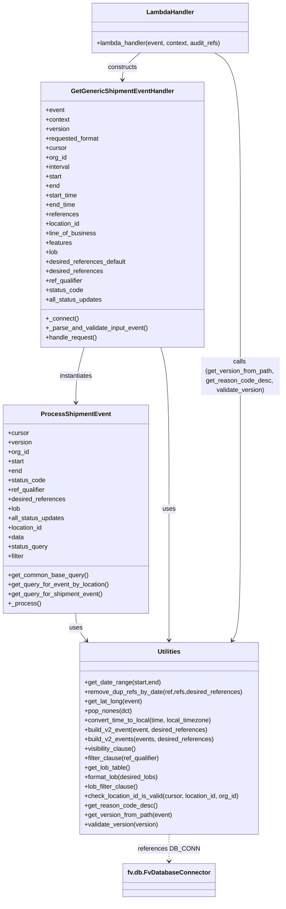
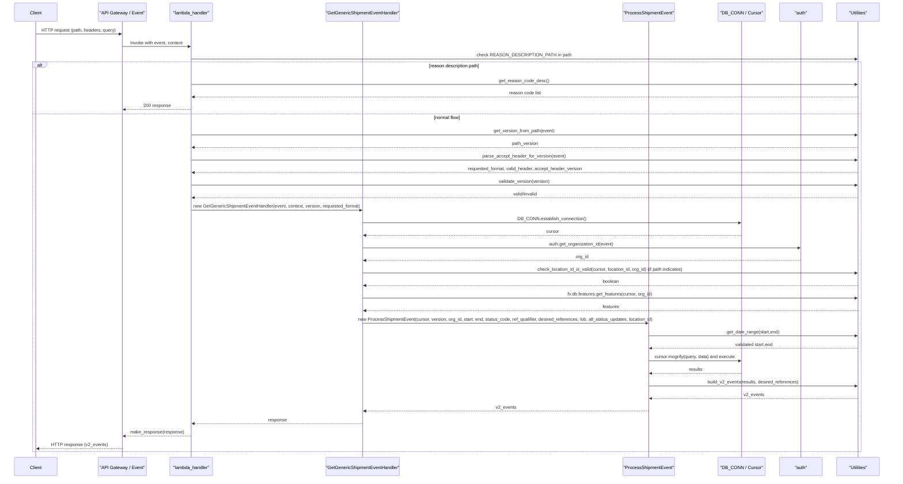

# Diagram: shipment_core/shipment_service/shipment_service/events/get_events.py

> Auto-generated by Obscura crawlers

## Diagram 1

### SVG

<svg id="container" width="713.28515625" xmlns="http://www.w3.org/2000/svg" class="classDiagram" height="2280" viewBox="0 0 713.28515625 2280" role="graphics-document document" aria-roledescription="class"><g><defs><marker id="container_class-aggregationStart" class="marker aggregation class" refX="18" refY="7" markerWidth="190" markerHeight="240" orient="auto"><path d="M 18,7 L9,13 L1,7 L9,1 Z"></path></marker></defs><defs><marker id="container_class-aggregationEnd" class="marker aggregation class" refX="1" refY="7" markerWidth="20" markerHeight="28" orient="auto"><path d="M 18,7 L9,13 L1,7 L9,1 Z"></path></marker></defs><defs><marker id="container_class-extensionStart" class="marker extension class" refX="18" refY="7" markerWidth="190" markerHeight="240" orient="auto"><path d="M 1,7 L18,13 V 1 Z"></path></marker></defs><defs><marker id="container_class-extensionEnd" class="marker extension class" refX="1" refY="7" markerWidth="20" markerHeight="28" orient="auto"><path d="M 1,1 V 13 L18,7 Z"></path></marker></defs><defs><marker id="container_class-compositionStart" class="marker composition class" refX="18" refY="7" markerWidth="190" markerHeight="240" orient="auto"><path d="M 18,7 L9,13 L1,7 L9,1 Z"></path></marker></defs><defs><marker id="container_class-compositionEnd" class="marker composition class" refX="1" refY="7" markerWidth="20" markerHeight="28" orient="auto"><path d="M 18,7 L9,13 L1,7 L9,1 Z"></path></marker></defs><defs><marker id="container_class-dependencyStart" class="marker dependency class" refX="6" refY="7" markerWidth="190" markerHeight="240" orient="auto"><path d="M 5,7 L9,13 L1,7 L9,1 Z"></path></marker></defs><defs><marker id="container_class-dependencyEnd" class="marker dependency class" refX="13" refY="7" markerWidth="20" markerHeight="28" orient="auto"><path d="M 18,7 L9,13 L14,7 L9,1 Z"></path></marker></defs><defs><marker id="container_class-lollipopStart" class="marker lollipop class" refX="13" refY="7" markerWidth="190" markerHeight="240" orient="auto"><circle stroke="black" fill="transparent" cx="7" cy="7" r="6"></circle></marker></defs><defs><marker id="container_class-lollipopEnd" class="marker lollipop class" refX="1" refY="7" markerWidth="190" markerHeight="240" orient="auto"><circle stroke="black" fill="transparent" cx="7" cy="7" r="6"></circle></marker></defs><g class="root"><g class="clusters"></g><g class="edgePaths"><path d="M190.844,1554L190.844,1560.167C190.844,1566.333,190.844,1578.667,195.363,1590.233C199.882,1601.8,208.92,1612.599,213.44,1617.999L217.959,1623.399" id="id_ProcessShipmentEvent_Utilities_1" class="edge-thickness-normal edge-pattern-solid relation" style=";;;" data-edge="true" data-et="edge" data-id="id_ProcessShipmentEvent_Utilities_1" data-points="W3sieCI6MTkwLjg0Mzc1LCJ5IjoxNTU0fSx7IngiOjE5MC44NDM3NSwieSI6MTU5MX0seyJ4IjoyMjEuODA5NTcwMzEyNSwieSI6MTYyOH1d" marker-end="url(#container_class-dependencyEnd)"></path><path d="M211.756,880L208.271,892.167C204.785,904.333,197.815,928.667,194.329,952C190.844,975.333,190.844,997.667,190.844,1008.833L190.844,1020" id="id_GetGenericShipmentEventHandler_ProcessShipmentEvent_2" class="edge-thickness-normal edge-pattern-solid relation" style=";;;" data-edge="true" data-et="edge" data-id="id_GetGenericShipmentEventHandler_ProcessShipmentEvent_2" data-points="W3sieCI6MjExLjc1NjM3MDMzOTI0MjA0LCJ5Ijo4ODB9LHsieCI6MTkwLjg0Mzc1LCJ5Ijo5NTN9LHsieCI6MTkwLjg0Mzc1LCJ5IjoxMDI2fV0=" marker-end="url(#container_class-dependencyEnd)"></path><path d="M404.267,880L407.753,892.167C411.238,904.333,418.209,928.667,421.694,997C425.18,1065.333,425.18,1177.667,425.18,1284C425.18,1390.333,425.18,1490.667,425.18,1546C425.18,1601.333,425.18,1611.667,425.18,1616.833L425.18,1622" id="id_GetGenericShipmentEventHandler_Utilities_3" class="edge-thickness-normal edge-pattern-solid relation" style=";;;" data-edge="true" data-et="edge" data-id="id_GetGenericShipmentEventHandler_Utilities_3" data-points="W3sieCI6NDA0LjI2NzA2NzE2MDc1Nzk2LCJ5Ijo4ODB9LHsieCI6NDI1LjE3OTY4NzUsInkiOjk1M30seyJ4Ijo0MjUuMTc5Njg3NSwieSI6MTI5MH0seyJ4Ijo0MjUuMTc5Njg3NSwieSI6MTU5MX0seyJ4Ijo0MjUuMTc5Njg3NSwieSI6MTYyOH1d" marker-end="url(#container_class-dependencyEnd)"></path><path d="M352.451,134L345.044,140.167C337.638,146.333,322.825,158.667,315.418,170C308.012,181.333,308.012,191.667,308.012,196.833L308.012,202" id="id_LambdaHandler_GetGenericShipmentEventHandler_4" class="edge-thickness-normal edge-pattern-solid relation" style=";;;" data-edge="true" data-et="edge" data-id="id_LambdaHandler_GetGenericShipmentEventHandler_4" data-points="W3sieCI6MzUyLjQ1MDc0MjE4NzUsInkiOjEzNH0seyJ4IjozMDguMDExNzE4NzUsInkiOjE3MX0seyJ4IjozMDguMDExNzE4NzUsInkiOjIwOH1d" marker-end="url(#container_class-dependencyEnd)"></path><path d="M539.733,134L550.658,140.167C561.584,146.333,583.434,158.667,594.36,227C605.285,295.333,605.285,419.667,605.285,550C605.285,680.333,605.285,816.667,605.285,941C605.285,1065.333,605.285,1177.667,605.285,1284C605.285,1390.333,605.285,1490.667,601.86,1546.159C598.434,1601.651,591.583,1612.303,588.157,1617.628L584.731,1622.954" id="id_LambdaHandler_Utilities_5" class="edge-thickness-normal edge-pattern-solid relation" style=";;;" data-edge="true" data-et="edge" data-id="id_LambdaHandler_Utilities_5" data-points="W3sieCI6NTM5LjczMzAwNzgxMjUsInkiOjEzNH0seyJ4Ijo2MDUuMjg1MTU2MjUsInkiOjE3MX0seyJ4Ijo2MDUuMjg1MTU2MjUsInkiOjU0NH0seyJ4Ijo2MDUuMjg1MTU2MjUsInkiOjk1M30seyJ4Ijo2MDUuMjg1MTU2MjUsInkiOjEyOTB9LHsieCI6NjA1LjI4NTE1NjI1LCJ5IjoxNTkxfSx7IngiOjU4MS40ODU1MDUwMjIzMjE0LCJ5IjoxNjI4fV0=" marker-end="url(#container_class-dependencyEnd)"></path><path d="M425.18,2114L425.18,2120.167C425.18,2126.333,425.18,2138.667,425.18,2150C425.18,2161.333,425.18,2171.667,425.18,2176.833L425.18,2182" id="id_Utilities_fv.db.FvDatabaseConnector_6" class="edge-thickness-normal edge-pattern-dashed relation" style=";;;" data-edge="true" data-et="edge" data-id="id_Utilities_fv.db.FvDatabaseConnector_6" data-points="W3sieCI6NDI1LjE3OTY4NzUsInkiOjIxMTR9LHsieCI6NDI1LjE3OTY4NzUsInkiOjIxNTF9LHsieCI6NDI1LjE3OTY4NzUsInkiOjIxODh9XQ==" marker-end="url(#container_class-dependencyEnd)"></path></g><g class="edgeLabels"><g class="edgeLabel" transform="translate(190.84375, 1591)"><g class="label" data-id="id_ProcessShipmentEvent_Utilities_1" transform="translate(-16.4921875, -12)"><foreignObject width="32.984375" height="24">

uses

</foreignObject></g></g><g class="edgeLabel" transform="translate(190.84375, 953)"><g class="label" data-id="id_GetGenericShipmentEventHandler_ProcessShipmentEvent_2" transform="translate(-42.9140625, -12)"><foreignObject width="85.828125" height="24">

instantiates

</foreignObject></g></g><g class="edgeLabel" transform="translate(425.1796875, 1290)"><g class="label" data-id="id_GetGenericShipmentEventHandler_Utilities_3" transform="translate(-16.4921875, -12)"><foreignObject width="32.984375" height="24">

uses

</foreignObject></g></g><g class="edgeLabel" transform="translate(308.01171875, 171)"><g class="label" data-id="id_LambdaHandler_GetGenericShipmentEventHandler_4" transform="translate(-37.84375, -12)"><foreignObject width="75.6875" height="24">

constructs

</foreignObject></g></g><g class="edgeLabel" transform="translate(605.28515625, 953)"><g class="label" data-id="id_LambdaHandler_Utilities_5" transform="translate(-100, -48)"><foreignObject width="200" height="96">

calls (get_version_from_path, get_reason_code_desc, validate_version)

</foreignObject></g></g><g class="edgeLabel" transform="translate(425.1796875, 2151)"><g class="label" data-id="id_Utilities_fv.db.FvDatabaseConnector_6" transform="translate(-74.4296875, -12)"><foreignObject width="148.859375" height="24">

references DB_CONN

</foreignObject></g></g></g><g class="nodes"><g class="node default" id="classId-ProcessShipmentEvent-0" transform="translate(190.84375, 1290)"><g class="basic label-container"><path d="M-182.84375 -264 L182.84375 -264 L182.84375 264 L-182.84375 264" stroke="none" stroke-width="0" fill="#ECECFF" style=""></path><path d="M-182.84375 -264 C-74.94647387437671 -264, 32.950802251246586 -264, 182.84375 -264 M-182.84375 -264 C-37.76803645862677 -264, 107.30767708274647 -264, 182.84375 -264 M182.84375 -264 C182.84375 -143.13537842215078, 182.84375 -22.27075684430156, 182.84375 264 M182.84375 -264 C182.84375 -120.53249195500769, 182.84375 22.93501608998463, 182.84375 264 M182.84375 264 C50.12233587374499 264, -82.59907825251003 264, -182.84375 264 M182.84375 264 C62.85191652059201 264, -57.139916958815974 264, -182.84375 264 M-182.84375 264 C-182.84375 111.61233952643283, -182.84375 -40.77532094713433, -182.84375 -264 M-182.84375 264 C-182.84375 142.8672007694486, -182.84375 21.734401538897202, -182.84375 -264" stroke="#9370DB" stroke-width="1.3" fill="none" stroke-dasharray="0 0" style=""></path></g><g class="annotation-group text" transform="translate(0, -240)"></g><g class="label-group text" transform="translate(-83.359375, -240)"><g class="label" style="font-weight: bolder" transform="translate(0,-12)"><foreignObject width="166.71875" height="24">

ProcessShipmentEvent

</foreignObject></g></g><g class="members-group text" transform="translate(-170.84375, -192)"><g class="label" style="" transform="translate(0,-12)"><foreignObject width="53.71875" height="24">

+cursor

</foreignObject></g><g class="label" style="" transform="translate(0,12)"><foreignObject width="61" height="24">

+version

</foreignObject></g><g class="label" style="" transform="translate(0,36)"><foreignObject width="54.0625" height="24">

+org_id

</foreignObject></g><g class="label" style="" transform="translate(0,60)"><foreignObject width="41.78125" height="24">

+start

</foreignObject></g><g class="label" style="" transform="translate(0,84)"><foreignObject width="35.65625" height="24">

+end

</foreignObject></g><g class="label" style="" transform="translate(0,108)"><foreignObject width="95.03125" height="24">

+status_code

</foreignObject></g><g class="label" style="" transform="translate(0,132)"><foreignObject width="96.015625" height="24">

+ref_qualifier

</foreignObject></g><g class="label" style="" transform="translate(0,156)"><foreignObject width="146.21875" height="24">

+desired_references

</foreignObject></g><g class="label" style="" transform="translate(0,180)"><foreignObject width="31.453125" height="24">

+lob

</foreignObject></g><g class="label" style="" transform="translate(0,204)"><foreignObject width="144.890625" height="24">

+all_status_updates

</foreignObject></g><g class="label" style="" transform="translate(0,228)"><foreignObject width="89.546875" height="24">

+location_id

</foreignObject></g><g class="label" style="" transform="translate(0,252)"><foreignObject width="40.625" height="24">

+data

</foreignObject></g><g class="label" style="" transform="translate(0,276)"><foreignObject width="101.71875" height="24">

+status_query

</foreignObject></g><g class="label" style="" transform="translate(0,300)"><foreignObject width="42.078125" height="24">

+filter

</foreignObject></g></g><g class="methods-group text" transform="translate(-170.84375, 168)"><g class="label" style="" transform="translate(0,-12)"><foreignObject width="203.46875" height="24">

+get_common_base_query()

</foreignObject></g><g class="label" style="" transform="translate(0,12)"><foreignObject width="258.328125" height="24">

+get_query_for_event_by_location()

</foreignObject></g><g class="label" style="" transform="translate(0,36)"><foreignObject width="242.625" height="24">

+get_query_for_shipment_event()

</foreignObject></g><g class="label" style="" transform="translate(0,60)"><foreignObject width="80.78125" height="24">

+_process()

</foreignObject></g></g><g class="divider" style=""><path d="M-182.84375 -216 C-77.44255893040733 -216, 27.95863213918534 -216, 182.84375 -216 M-182.84375 -216 C-77.13499040194856 -216, 28.573769196102887 -216, 182.84375 -216" stroke="#9370DB" stroke-width="1.3" fill="none" stroke-dasharray="0 0" style=""></path></g><g class="divider" style=""><path d="M-182.84375 144 C-59.321761058831356 144, 64.20022788233729 144, 182.84375 144 M-182.84375 144 C-100.8730126324465 144, -18.902275264893007 144, 182.84375 144" stroke="#9370DB" stroke-width="1.3" fill="none" stroke-dasharray="0 0" style=""></path></g></g><g class="node default" id="classId-GetGenericShipmentEventHandler-1" transform="translate(308.01171875, 544)"><g class="basic label-container"><path d="M-205.2109375 -336 L205.2109375 -336 L205.2109375 336 L-205.2109375 336" stroke="none" stroke-width="0" fill="#ECECFF" style=""></path><path d="M-205.2109375 -336 C-92.03013386013959 -336, 21.15066977972083 -336, 205.2109375 -336 M-205.2109375 -336 C-66.44259991523671 -336, 72.32573766952657 -336, 205.2109375 -336 M205.2109375 -336 C205.2109375 -93.2660688266009, 205.2109375 149.4678623467982, 205.2109375 336 M205.2109375 -336 C205.2109375 -69.44799577343878, 205.2109375 197.10400845312245, 205.2109375 336 M205.2109375 336 C80.08298487374086 336, -45.04496775251829 336, -205.2109375 336 M205.2109375 336 C116.33012173701883 336, 27.449305974037657 336, -205.2109375 336 M-205.2109375 336 C-205.2109375 88.23929671480019, -205.2109375 -159.52140657039962, -205.2109375 -336 M-205.2109375 336 C-205.2109375 87.4491580260719, -205.2109375 -161.1016839478562, -205.2109375 -336" stroke="#9370DB" stroke-width="1.3" fill="none" stroke-dasharray="0 0" style=""></path></g><g class="annotation-group text" transform="translate(0, -312)"></g><g class="label-group text" transform="translate(-124.96875, -312)"><g class="label" style="font-weight: bolder" transform="translate(0,-12)"><foreignObject width="249.9375" height="24">

GetGenericShipmentEventHandler

</foreignObject></g></g><g class="members-group text" transform="translate(-193.2109375, -264)"><g class="label" style="" transform="translate(0,-12)"><foreignObject width="48.328125" height="24">

+event

</foreignObject></g><g class="label" style="" transform="translate(0,12)"><foreignObject width="61.6875" height="24">

+context

</foreignObject></g><g class="label" style="" transform="translate(0,36)"><foreignObject width="61" height="24">

+version

</foreignObject></g><g class="label" style="" transform="translate(0,60)"><foreignObject width="138.21875" height="24">

+requested_format

</foreignObject></g><g class="label" style="" transform="translate(0,84)"><foreignObject width="53.71875" height="24">

+cursor

</foreignObject></g><g class="label" style="" transform="translate(0,108)"><foreignObject width="54.0625" height="24">

+org_id

</foreignObject></g><g class="label" style="" transform="translate(0,132)"><foreignObject width="63.15625" height="24">

+interval

</foreignObject></g><g class="label" style="" transform="translate(0,156)"><foreignObject width="41.78125" height="24">

+start

</foreignObject></g><g class="label" style="" transform="translate(0,180)"><foreignObject width="35.65625" height="24">

+end

</foreignObject></g><g class="label" style="" transform="translate(0,204)"><foreignObject width="82.5" height="24">

+start_time

</foreignObject></g><g class="label" style="" transform="translate(0,228)"><foreignObject width="76.375" height="24">

+end_time

</foreignObject></g><g class="label" style="" transform="translate(0,252)"><foreignObject width="83.640625" height="24">

+references

</foreignObject></g><g class="label" style="" transform="translate(0,276)"><foreignObject width="89.546875" height="24">

+location_id

</foreignObject></g><g class="label" style="" transform="translate(0,300)"><foreignObject width="129.1875" height="24">

+line_of_business

</foreignObject></g><g class="label" style="" transform="translate(0,324)"><foreignObject width="67.1875" height="24">

+features

</foreignObject></g><g class="label" style="" transform="translate(0,348)"><foreignObject width="31.453125" height="24">

+lob

</foreignObject></g><g class="label" style="" transform="translate(0,372)"><foreignObject width="205.671875" height="24">

+desired_references_default

</foreignObject></g><g class="label" style="" transform="translate(0,396)"><foreignObject width="146.21875" height="24">

+desired_references

</foreignObject></g><g class="label" style="" transform="translate(0,420)"><foreignObject width="96.015625" height="24">

+ref_qualifier

</foreignObject></g><g class="label" style="" transform="translate(0,444)"><foreignObject width="95.03125" height="24">

+status_code

</foreignObject></g><g class="label" style="" transform="translate(0,468)"><foreignObject width="144.890625" height="24">

+all_status_updates

</foreignObject></g></g><g class="methods-group text" transform="translate(-193.2109375, 264)"><g class="label" style="" transform="translate(0,-12)"><foreignObject width="82.640625" height="24">

+_connect()

</foreignObject></g><g class="label" style="" transform="translate(0,12)"><foreignObject width="261.453125" height="24">

+_parse_and_validate_input_event()

</foreignObject></g><g class="label" style="" transform="translate(0,36)"><foreignObject width="131.96875" height="24">

+handle_request()

</foreignObject></g></g><g class="divider" style=""><path d="M-205.2109375 -288 C-66.06924292540577 -288, 73.07245164918845 -288, 205.2109375 -288 M-205.2109375 -288 C-77.70712680439884 -288, 49.79668389120232 -288, 205.2109375 -288" stroke="#9370DB" stroke-width="1.3" fill="none" stroke-dasharray="0 0" style=""></path></g><g class="divider" style=""><path d="M-205.2109375 240 C-102.85661948460243 240, -0.5023014692048662 240, 205.2109375 240 M-205.2109375 240 C-87.77550633426823 240, 29.65992483146354 240, 205.2109375 240" stroke="#9370DB" stroke-width="1.3" fill="none" stroke-dasharray="0 0" style=""></path></g></g><g class="node default" id="classId-Utilities-2" transform="translate(425.1796875, 1871)"><g class="basic label-container"><path d="M-226.796875 -243 L226.796875 -243 L226.796875 243 L-226.796875 243" stroke="none" stroke-width="0" fill="#ECECFF" style=""></path><path d="M-226.796875 -243 C-96.14085010988163 -243, 34.51517478023675 -243, 226.796875 -243 M-226.796875 -243 C-50.06770302915072 -243, 126.66146894169856 -243, 226.796875 -243 M226.796875 -243 C226.796875 -108.36457840310814, 226.796875 26.27084319378372, 226.796875 243 M226.796875 -243 C226.796875 -95.95847600282656, 226.796875 51.083047994346884, 226.796875 243 M226.796875 243 C46.81546356114555 243, -133.1659478777089 243, -226.796875 243 M226.796875 243 C107.27096240100408 243, -12.254950197991832 243, -226.796875 243 M-226.796875 243 C-226.796875 54.124612139218584, -226.796875 -134.75077572156283, -226.796875 -243 M-226.796875 243 C-226.796875 101.24261024360192, -226.796875 -40.51477951279617, -226.796875 -243" stroke="#9370DB" stroke-width="1.3" fill="none" stroke-dasharray="0 0" style=""></path></g><g class="annotation-group text" transform="translate(0, -219)"></g><g class="label-group text" transform="translate(-28.8125, -219)"><g class="label" style="font-weight: bolder" transform="translate(0,-12)"><foreignObject width="57.625" height="24">

Utilities

</foreignObject></g></g><g class="members-group text" transform="translate(-214.796875, -171)"></g><g class="methods-group text" transform="translate(-214.796875, -141)"><g class="label" style="" transform="translate(0,-12)"><foreignObject width="195.125" height="24">

+get_date_range(start,end)

</foreignObject></g><g class="label" style="" transform="translate(0,12)"><foreignObject width="400.78125" height="24">

+remove_dup_refs_by_date(ref,refs,desired_references)

</foreignObject></g><g class="label" style="" transform="translate(0,36)"><foreignObject width="148.3125" height="24">

+get_lat_long(event)

</foreignObject></g><g class="label" style="" transform="translate(0,60)"><foreignObject width="121.984375" height="24">

+pop_nones(dct)

</foreignObject></g><g class="label" style="" transform="translate(0,84)"><foreignObject width="328.8125" height="24">

+convert_time_to_local(time, local_timezone)

</foreignObject></g><g class="label" style="" transform="translate(0,108)"><foreignObject width="314.375" height="24">

+build_v2_event(event, desired_references)

</foreignObject></g><g class="label" style="" transform="translate(0,132)"><foreignObject width="329.25" height="24">

+build_v2_events(events, desired_references)

</foreignObject></g><g class="label" style="" transform="translate(0,156)"><foreignObject width="133.34375" height="24">

+visibility_clause()

</foreignObject></g><g class="label" style="" transform="translate(0,180)"><foreignObject width="193.640625" height="24">

+filter_clause(ref_qualifier)

</foreignObject></g><g class="label" style="" transform="translate(0,204)"><foreignObject width="117.421875" height="24">

+get_lob_table()

</foreignObject></g><g class="label" style="" transform="translate(0,228)"><foreignObject width="191.984375" height="24">

+format_lob(desired_lobs)

</foreignObject></g><g class="label" style="" transform="translate(0,252)"><foreignObject width="137" height="24">

+lob_filter_clause()

</foreignObject></g><g class="label" style="" transform="translate(0,276)"><foreignObject width="400.625" height="24">

+check_location_id_is_valid(cursor, location_id, org_id)

</foreignObject></g><g class="label" style="" transform="translate(0,300)"><foreignObject width="182.28125" height="24">

+get_reason_code_desc()

</foreignObject></g><g class="label" style="" transform="translate(0,324)"><foreignObject width="225.890625" height="24">

+get_version_from_path(event)

</foreignObject></g><g class="label" style="" transform="translate(0,348)"><foreignObject width="189.9375" height="24">

+validate_version(version)

</foreignObject></g></g><g class="divider" style=""><path d="M-226.796875 -195 C-114.59798800461877 -195, -2.3991010092375404 -195, 226.796875 -195 M-226.796875 -195 C-51.62251516399789 -195, 123.55184467200422 -195, 226.796875 -195" stroke="#9370DB" stroke-width="1.3" fill="none" stroke-dasharray="0 0" style=""></path></g><g class="divider" style=""><path d="M-226.796875 -171 C-134.32460748375797 -171, -41.85233996751592 -171, 226.796875 -171 M-226.796875 -171 C-77.75877757489684 -171, 71.27931985020632 -171, 226.796875 -171" stroke="#9370DB" stroke-width="1.3" fill="none" stroke-dasharray="0 0" style=""></path></g></g><g class="node default" id="classId-LambdaHandler-3" transform="translate(428.1171875, 71)"><g class="basic label-container"><path d="M-201.953125 -63 L201.953125 -63 L201.953125 63 L-201.953125 63" stroke="none" stroke-width="0" fill="#ECECFF" style=""></path><path d="M-201.953125 -63 C-113.1308929917204 -63, -24.308660983440802 -63, 201.953125 -63 M-201.953125 -63 C-118.69057000997385 -63, -35.42801501994771 -63, 201.953125 -63 M201.953125 -63 C201.953125 -17.118066468616753, 201.953125 28.763867062766494, 201.953125 63 M201.953125 -63 C201.953125 -26.213608619053453, 201.953125 10.572782761893095, 201.953125 63 M201.953125 63 C72.20073981507284 63, -57.55164536985433 63, -201.953125 63 M201.953125 63 C54.75730843517232 63, -92.43850812965536 63, -201.953125 63 M-201.953125 63 C-201.953125 30.390951133674193, -201.953125 -2.2180977326516143, -201.953125 -63 M-201.953125 63 C-201.953125 34.93421770833726, -201.953125 6.868435416674515, -201.953125 -63" stroke="#9370DB" stroke-width="1.3" fill="none" stroke-dasharray="0 0" style=""></path></g><g class="annotation-group text" transform="translate(0, -39)"></g><g class="label-group text" transform="translate(-58.21875, -39)"><g class="label" style="font-weight: bolder" transform="translate(0,-12)"><foreignObject width="116.4375" height="24">

LambdaHandler

</foreignObject></g></g><g class="members-group text" transform="translate(-189.953125, 9)"></g><g class="methods-group text" transform="translate(-189.953125, 39)"><g class="label" style="" transform="translate(0,-12)"><foreignObject width="321.6875" height="24">

+lambda_handler(event, context, audit_refs)

</foreignObject></g></g><g class="divider" style=""><path d="M-201.953125 -15 C-84.60917298844183 -15, 32.734779023116346 -15, 201.953125 -15 M-201.953125 -15 C-64.01468624390353 -15, 73.92375251219295 -15, 201.953125 -15" stroke="#9370DB" stroke-width="1.3" fill="none" stroke-dasharray="0 0" style=""></path></g><g class="divider" style=""><path d="M-201.953125 9 C-79.1174274443963 9, 43.7182701112074 9, 201.953125 9 M-201.953125 9 C-81.51304427179379 9, 38.927036456412424 9, 201.953125 9" stroke="#9370DB" stroke-width="1.3" fill="none" stroke-dasharray="0 0" style=""></path></g></g><g class="node default" id="classId-fv.db.FvDatabaseConnector-4" transform="translate(425.1796875, 2230)"><g class="basic label-container"><path d="M-111.1953125 -42 L111.1953125 -42 L111.1953125 42 L-111.1953125 42" stroke="none" stroke-width="0" fill="#ECECFF" style=""></path><path d="M-111.1953125 -42 C-38.8880375986281 -42, 33.419237302743795 -42, 111.1953125 -42 M-111.1953125 -42 C-38.76454123414152 -42, 33.666230031716964 -42, 111.1953125 -42 M111.1953125 -42 C111.1953125 -16.639917130121887, 111.1953125 8.720165739756226, 111.1953125 42 M111.1953125 -42 C111.1953125 -11.937057720038926, 111.1953125 18.12588455992215, 111.1953125 42 M111.1953125 42 C59.6426464008315 42, 8.089980301663005 42, -111.1953125 42 M111.1953125 42 C37.19280469206012 42, -36.809703115879756 42, -111.1953125 42 M-111.1953125 42 C-111.1953125 23.08359760999329, -111.1953125 4.167195219986581, -111.1953125 -42 M-111.1953125 42 C-111.1953125 10.24019104541599, -111.1953125 -21.51961790916802, -111.1953125 -42" stroke="#9370DB" stroke-width="1.3" fill="none" stroke-dasharray="0 0" style=""></path></g><g class="annotation-group text" transform="translate(0, -18)"></g><g class="label-group text" transform="translate(-99.1953125, -18)"><g class="label" style="font-weight: bolder" transform="translate(0,-12)"><foreignObject width="198.390625" height="24">

fv.db.FvDatabaseConnector

</foreignObject></g></g><g class="members-group text" transform="translate(-99.1953125, 30)"></g><g class="methods-group text" transform="translate(-99.1953125, 60)"></g><g class="divider" style=""><path d="M-111.1953125 6 C-61.71425841648461 6, -12.233204332969223 6, 111.1953125 6 M-111.1953125 6 C-62.70558315079567 6, -14.215853801591336 6, 111.1953125 6" stroke="#9370DB" stroke-width="1.3" fill="none" stroke-dasharray="0 0" style=""></path></g><g class="divider" style=""><path d="M-111.1953125 24 C-27.27658557264681 24, 56.64214135470638 24, 111.1953125 24 M-111.1953125 24 C-25.278599973519533 24, 60.63811255296093 24, 111.1953125 24" stroke="#9370DB" stroke-width="1.3" fill="none" stroke-dasharray="0 0" style=""></path></g></g></g></g></g></svg>

## Diagram 2

### SVG

<svg id="container" width="3387" xmlns="http://www.w3.org/2000/svg" height="1807" viewBox="-50 -10 3387 1807" role="graphics-document document" aria-roledescription="sequence"><g><rect x="3137" y="1721" fill="#eaeaea" stroke="#666" width="150" height="65" name="Utils" rx="3" ry="3" class="actor actor-bottom"></rect><text x="3212" y="1753.5" dominant-baseline="central" alignment-baseline="central" class="actor actor-box" style="text-anchor: middle; font-size: 16px; font-weight: 400;"><tspan x="3212" dy="0">"Utilities"</tspan></text></g><g><rect x="2937" y="1721" fill="#eaeaea" stroke="#666" width="150" height="65" name="Auth" rx="3" ry="3" class="actor actor-bottom"></rect><text x="3012" y="1753.5" dominant-baseline="central" alignment-baseline="central" class="actor actor-box" style="text-anchor: middle; font-size: 16px; font-weight: 400;"><tspan x="3012" dy="0">"auth"</tspan></text></g><g><rect x="2721" y="1721" fill="#eaeaea" stroke="#666" width="166" height="65" name="DB" rx="3" ry="3" class="actor actor-bottom"></rect><text x="2804" y="1753.5" dominant-baseline="central" alignment-baseline="central" class="actor actor-box" style="text-anchor: middle; font-size: 16px; font-weight: 400;"><tspan x="2804" dy="0">"DB_CONN / Cursor"</tspan></text></g><g><rect x="2347.5" y="1721" fill="#eaeaea" stroke="#666" width="197" height="65" name="Processor" rx="3" ry="3" class="actor actor-bottom"></rect><text x="2446" y="1753.5" dominant-baseline="central" alignment-baseline="central" class="actor actor-box" style="text-anchor: middle; font-size: 16px; font-weight: 400;"><tspan x="2446" dy="0">"ProcessShipmentEvent"</tspan></text></g><g><rect x="1188" y="1721" fill="#eaeaea" stroke="#666" width="280" height="65" name="Handler" rx="3" ry="3" class="actor actor-bottom"></rect><text x="1328" y="1753.5" dominant-baseline="central" alignment-baseline="central" class="actor actor-box" style="text-anchor: middle; font-size: 16px; font-weight: 400;"><tspan x="1328" dy="0">"GetGenericShipmentEventHandler"</tspan></text></g><g><rect x="589" y="1721" fill="#eaeaea" stroke="#666" width="152" height="65" name="Lambda" rx="3" ry="3" class="actor actor-bottom"></rect><text x="665" y="1753.5" dominant-baseline="central" alignment-baseline="central" class="actor actor-box" style="text-anchor: middle; font-size: 16px; font-weight: 400;"><tspan x="665" dy="0">"lambda_handler"</tspan></text></g><g><rect x="316.5" y="1721" fill="#eaeaea" stroke="#666" width="177" height="65" name="API_Gateway" rx="3" ry="3" class="actor actor-bottom"></rect><text x="405" y="1753.5" dominant-baseline="central" alignment-baseline="central" class="actor actor-box" style="text-anchor: middle; font-size: 16px; font-weight: 400;"><tspan x="405" dy="0">"API Gateway / Event"</tspan></text></g><g><rect x="0" y="1721" fill="#eaeaea" stroke="#666" width="150" height="65" name="Client" rx="3" ry="3" class="actor actor-bottom"></rect><text x="75" y="1753.5" dominant-baseline="central" alignment-baseline="central" class="actor actor-box" style="text-anchor: middle; font-size: 16px; font-weight: 400;"><tspan x="75" dy="0">Client</tspan></text></g><g><line id="actor7" x1="3212" y1="65" x2="3212" y2="1721" class="actor-line 200" stroke-width="0.5px" stroke="#999" name="Utils"></line><g id="root-7"><rect x="3137" y="0" fill="#eaeaea" stroke="#666" width="150" height="65" name="Utils" rx="3" ry="3" class="actor actor-top"></rect><text x="3212" y="32.5" dominant-baseline="central" alignment-baseline="central" class="actor actor-box" style="text-anchor: middle; font-size: 16px; font-weight: 400;"><tspan x="3212" dy="0">"Utilities"</tspan></text></g></g><g><line id="actor6" x1="3012" y1="65" x2="3012" y2="1721" class="actor-line 200" stroke-width="0.5px" stroke="#999" name="Auth"></line><g id="root-6"><rect x="2937" y="0" fill="#eaeaea" stroke="#666" width="150" height="65" name="Auth" rx="3" ry="3" class="actor actor-top"></rect><text x="3012" y="32.5" dominant-baseline="central" alignment-baseline="central" class="actor actor-box" style="text-anchor: middle; font-size: 16px; font-weight: 400;"><tspan x="3012" dy="0">"auth"</tspan></text></g></g><g><line id="actor5" x1="2804" y1="65" x2="2804" y2="1721" class="actor-line 200" stroke-width="0.5px" stroke="#999" name="DB"></line><g id="root-5"><rect x="2721" y="0" fill="#eaeaea" stroke="#666" width="166" height="65" name="DB" rx="3" ry="3" class="actor actor-top"></rect><text x="2804" y="32.5" dominant-baseline="central" alignment-baseline="central" class="actor actor-box" style="text-anchor: middle; font-size: 16px; font-weight: 400;"><tspan x="2804" dy="0">"DB_CONN / Cursor"</tspan></text></g></g><g><line id="actor4" x1="2446" y1="65" x2="2446" y2="1721" class="actor-line 200" stroke-width="0.5px" stroke="#999" name="Processor"></line><g id="root-4"><rect x="2347.5" y="0" fill="#eaeaea" stroke="#666" width="197" height="65" name="Processor" rx="3" ry="3" class="actor actor-top"></rect><text x="2446" y="32.5" dominant-baseline="central" alignment-baseline="central" class="actor actor-box" style="text-anchor: middle; font-size: 16px; font-weight: 400;"><tspan x="2446" dy="0">"ProcessShipmentEvent"</tspan></text></g></g><g><line id="actor3" x1="1328" y1="65" x2="1328" y2="1721" class="actor-line 200" stroke-width="0.5px" stroke="#999" name="Handler"></line><g id="root-3"><rect x="1188" y="0" fill="#eaeaea" stroke="#666" width="280" height="65" name="Handler" rx="3" ry="3" class="actor actor-top"></rect><text x="1328" y="32.5" dominant-baseline="central" alignment-baseline="central" class="actor actor-box" style="text-anchor: middle; font-size: 16px; font-weight: 400;"><tspan x="1328" dy="0">"GetGenericShipmentEventHandler"</tspan></text></g></g><g><line id="actor2" x1="665" y1="65" x2="665" y2="1721" class="actor-line 200" stroke-width="0.5px" stroke="#999" name="Lambda"></line><g id="root-2"><rect x="589" y="0" fill="#eaeaea" stroke="#666" width="152" height="65" name="Lambda" rx="3" ry="3" class="actor actor-top"></rect><text x="665" y="32.5" dominant-baseline="central" alignment-baseline="central" class="actor actor-box" style="text-anchor: middle; font-size: 16px; font-weight: 400;"><tspan x="665" dy="0">"lambda_handler"</tspan></text></g></g><g><line id="actor1" x1="405" y1="65" x2="405" y2="1721" class="actor-line 200" stroke-width="0.5px" stroke="#999" name="API_Gateway"></line><g id="root-1"><rect x="316.5" y="0" fill="#eaeaea" stroke="#666" width="177" height="65" name="API_Gateway" rx="3" ry="3" class="actor actor-top"></rect><text x="405" y="32.5" dominant-baseline="central" alignment-baseline="central" class="actor actor-box" style="text-anchor: middle; font-size: 16px; font-weight: 400;"><tspan x="405" dy="0">"API Gateway / Event"</tspan></text></g></g><g><line id="actor0" x1="75" y1="65" x2="75" y2="1721" class="actor-line 200" stroke-width="0.5px" stroke="#999" name="Client"></line><g id="root-0"><rect x="0" y="0" fill="#eaeaea" stroke="#666" width="150" height="65" name="Client" rx="3" ry="3" class="actor actor-top"></rect><text x="75" y="32.5" dominant-baseline="central" alignment-baseline="central" class="actor actor-box" style="text-anchor: middle; font-size: 16px; font-weight: 400;"><tspan x="75" dy="0">Client</tspan></text></g></g><g></g><defs><symbol id="computer" width="24" height="24"><path transform="scale(.5)" d="M2 2v13h20v-13h-20zm18 11h-16v-9h16v9zm-10.228 6l.466-1h3.524l.467 1h-4.457zm14.228 3h-24l2-6h2.104l-1.33 4h18.45l-1.297-4h2.073l2 6zm-5-10h-14v-7h14v7z"></path></symbol></defs><defs><symbol id="database" fill-rule="evenodd" clip-rule="evenodd"><path transform="scale(.5)" d="M12.258.001l.256.004.255.005.253.008.251.01.249.012.247.015.246.016.242.019.241.02.239.023.236.024.233.027.231.028.229.031.225.032.223.034.22.036.217.038.214.04.211.041.208.043.205.045.201.046.198.048.194.05.191.051.187.053.183.054.18.056.175.057.172.059.168.06.163.061.16.063.155.064.15.066.074.033.073.033.071.034.07.034.069.035.068.035.067.035.066.035.064.036.064.036.062.036.06.036.06.037.058.037.058.037.055.038.055.038.053.038.052.038.051.039.05.039.048.039.047.039.045.04.044.04.043.04.041.04.04.041.039.041.037.041.036.041.034.041.033.042.032.042.03.042.029.042.027.042.026.043.024.043.023.043.021.043.02.043.018.044.017.043.015.044.013.044.012.044.011.045.009.044.007.045.006.045.004.045.002.045.001.045v17l-.001.045-.002.045-.004.045-.006.045-.007.045-.009.044-.011.045-.012.044-.013.044-.015.044-.017.043-.018.044-.02.043-.021.043-.023.043-.024.043-.026.043-.027.042-.029.042-.03.042-.032.042-.033.042-.034.041-.036.041-.037.041-.039.041-.04.041-.041.04-.043.04-.044.04-.045.04-.047.039-.048.039-.05.039-.051.039-.052.038-.053.038-.055.038-.055.038-.058.037-.058.037-.06.037-.06.036-.062.036-.064.036-.064.036-.066.035-.067.035-.068.035-.069.035-.07.034-.071.034-.073.033-.074.033-.15.066-.155.064-.16.063-.163.061-.168.06-.172.059-.175.057-.18.056-.183.054-.187.053-.191.051-.194.05-.198.048-.201.046-.205.045-.208.043-.211.041-.214.04-.217.038-.22.036-.223.034-.225.032-.229.031-.231.028-.233.027-.236.024-.239.023-.241.02-.242.019-.246.016-.247.015-.249.012-.251.01-.253.008-.255.005-.256.004-.258.001-.258-.001-.256-.004-.255-.005-.253-.008-.251-.01-.249-.012-.247-.015-.245-.016-.243-.019-.241-.02-.238-.023-.236-.024-.234-.027-.231-.028-.228-.031-.226-.032-.223-.034-.22-.036-.217-.038-.214-.04-.211-.041-.208-.043-.204-.045-.201-.046-.198-.048-.195-.05-.19-.051-.187-.053-.184-.054-.179-.056-.176-.057-.172-.059-.167-.06-.164-.061-.159-.063-.155-.064-.151-.066-.074-.033-.072-.033-.072-.034-.07-.034-.069-.035-.068-.035-.067-.035-.066-.035-.064-.036-.063-.036-.062-.036-.061-.036-.06-.037-.058-.037-.057-.037-.056-.038-.055-.038-.053-.038-.052-.038-.051-.039-.049-.039-.049-.039-.046-.039-.046-.04-.044-.04-.043-.04-.041-.04-.04-.041-.039-.041-.037-.041-.036-.041-.034-.041-.033-.042-.032-.042-.03-.042-.029-.042-.027-.042-.026-.043-.024-.043-.023-.043-.021-.043-.02-.043-.018-.044-.017-.043-.015-.044-.013-.044-.012-.044-.011-.045-.009-.044-.007-.045-.006-.045-.004-.045-.002-.045-.001-.045v-17l.001-.045.002-.045.004-.045.006-.045.007-.045.009-.044.011-.045.012-.044.013-.044.015-.044.017-.043.018-.044.02-.043.021-.043.023-.043.024-.043.026-.043.027-.042.029-.042.03-.042.032-.042.033-.042.034-.041.036-.041.037-.041.039-.041.04-.041.041-.04.043-.04.044-.04.046-.04.046-.039.049-.039.049-.039.051-.039.052-.038.053-.038.055-.038.056-.038.057-.037.058-.037.06-.037.061-.036.062-.036.063-.036.064-.036.066-.035.067-.035.068-.035.069-.035.07-.034.072-.034.072-.033.074-.033.151-.066.155-.064.159-.063.164-.061.167-.06.172-.059.176-.057.179-.056.184-.054.187-.053.19-.051.195-.05.198-.048.201-.046.204-.045.208-.043.211-.041.214-.04.217-.038.22-.036.223-.034.226-.032.228-.031.231-.028.234-.027.236-.024.238-.023.241-.02.243-.019.245-.016.247-.015.249-.012.251-.01.253-.008.255-.005.256-.004.258-.001.258.001zm-9.258 20.499v.01l.001.021.003.021.004.022.005.021.006.022.007.022.009.023.01.022.011.023.012.023.013.023.015.023.016.024.017.023.018.024.019.024.021.024.022.025.023.024.024.025.052.049.056.05.061.051.066.051.07.051.075.051.079.052.084.052.088.052.092.052.097.052.102.051.105.052.11.052.114.051.119.051.123.051.127.05.131.05.135.05.139.048.144.049.147.047.152.047.155.047.16.045.163.045.167.043.171.043.176.041.178.041.183.039.187.039.19.037.194.035.197.035.202.033.204.031.209.03.212.029.216.027.219.025.222.024.226.021.23.02.233.018.236.016.24.015.243.012.246.01.249.008.253.005.256.004.259.001.26-.001.257-.004.254-.005.25-.008.247-.011.244-.012.241-.014.237-.016.233-.018.231-.021.226-.021.224-.024.22-.026.216-.027.212-.028.21-.031.205-.031.202-.034.198-.034.194-.036.191-.037.187-.039.183-.04.179-.04.175-.042.172-.043.168-.044.163-.045.16-.046.155-.046.152-.047.148-.048.143-.049.139-.049.136-.05.131-.05.126-.05.123-.051.118-.052.114-.051.11-.052.106-.052.101-.052.096-.052.092-.052.088-.053.083-.051.079-.052.074-.052.07-.051.065-.051.06-.051.056-.05.051-.05.023-.024.023-.025.021-.024.02-.024.019-.024.018-.024.017-.024.015-.023.014-.024.013-.023.012-.023.01-.023.01-.022.008-.022.006-.022.006-.022.004-.022.004-.021.001-.021.001-.021v-4.127l-.077.055-.08.053-.083.054-.085.053-.087.052-.09.052-.093.051-.095.05-.097.05-.1.049-.102.049-.105.048-.106.047-.109.047-.111.046-.114.045-.115.045-.118.044-.12.043-.122.042-.124.042-.126.041-.128.04-.13.04-.132.038-.134.038-.135.037-.138.037-.139.035-.142.035-.143.034-.144.033-.147.032-.148.031-.15.03-.151.03-.153.029-.154.027-.156.027-.158.026-.159.025-.161.024-.162.023-.163.022-.165.021-.166.02-.167.019-.169.018-.169.017-.171.016-.173.015-.173.014-.175.013-.175.012-.177.011-.178.01-.179.008-.179.008-.181.006-.182.005-.182.004-.184.003-.184.002h-.37l-.184-.002-.184-.003-.182-.004-.182-.005-.181-.006-.179-.008-.179-.008-.178-.01-.176-.011-.176-.012-.175-.013-.173-.014-.172-.015-.171-.016-.17-.017-.169-.018-.167-.019-.166-.02-.165-.021-.163-.022-.162-.023-.161-.024-.159-.025-.157-.026-.156-.027-.155-.027-.153-.029-.151-.03-.15-.03-.148-.031-.146-.032-.145-.033-.143-.034-.141-.035-.14-.035-.137-.037-.136-.037-.134-.038-.132-.038-.13-.04-.128-.04-.126-.041-.124-.042-.122-.042-.12-.044-.117-.043-.116-.045-.113-.045-.112-.046-.109-.047-.106-.047-.105-.048-.102-.049-.1-.049-.097-.05-.095-.05-.093-.052-.09-.051-.087-.052-.085-.053-.083-.054-.08-.054-.077-.054v4.127zm0-5.654v.011l.001.021.003.021.004.021.005.022.006.022.007.022.009.022.01.022.011.023.012.023.013.023.015.024.016.023.017.024.018.024.019.024.021.024.022.024.023.025.024.024.052.05.056.05.061.05.066.051.07.051.075.052.079.051.084.052.088.052.092.052.097.052.102.052.105.052.11.051.114.051.119.052.123.05.127.051.131.05.135.049.139.049.144.048.147.048.152.047.155.046.16.045.163.045.167.044.171.042.176.042.178.04.183.04.187.038.19.037.194.036.197.034.202.033.204.032.209.03.212.028.216.027.219.025.222.024.226.022.23.02.233.018.236.016.24.014.243.012.246.01.249.008.253.006.256.003.259.001.26-.001.257-.003.254-.006.25-.008.247-.01.244-.012.241-.015.237-.016.233-.018.231-.02.226-.022.224-.024.22-.025.216-.027.212-.029.21-.03.205-.032.202-.033.198-.035.194-.036.191-.037.187-.039.183-.039.179-.041.175-.042.172-.043.168-.044.163-.045.16-.045.155-.047.152-.047.148-.048.143-.048.139-.05.136-.049.131-.05.126-.051.123-.051.118-.051.114-.052.11-.052.106-.052.101-.052.096-.052.092-.052.088-.052.083-.052.079-.052.074-.051.07-.052.065-.051.06-.05.056-.051.051-.049.023-.025.023-.024.021-.025.02-.024.019-.024.018-.024.017-.024.015-.023.014-.023.013-.024.012-.022.01-.023.01-.023.008-.022.006-.022.006-.022.004-.021.004-.022.001-.021.001-.021v-4.139l-.077.054-.08.054-.083.054-.085.052-.087.053-.09.051-.093.051-.095.051-.097.05-.1.049-.102.049-.105.048-.106.047-.109.047-.111.046-.114.045-.115.044-.118.044-.12.044-.122.042-.124.042-.126.041-.128.04-.13.039-.132.039-.134.038-.135.037-.138.036-.139.036-.142.035-.143.033-.144.033-.147.033-.148.031-.15.03-.151.03-.153.028-.154.028-.156.027-.158.026-.159.025-.161.024-.162.023-.163.022-.165.021-.166.02-.167.019-.169.018-.169.017-.171.016-.173.015-.173.014-.175.013-.175.012-.177.011-.178.009-.179.009-.179.007-.181.007-.182.005-.182.004-.184.003-.184.002h-.37l-.184-.002-.184-.003-.182-.004-.182-.005-.181-.007-.179-.007-.179-.009-.178-.009-.176-.011-.176-.012-.175-.013-.173-.014-.172-.015-.171-.016-.17-.017-.169-.018-.167-.019-.166-.02-.165-.021-.163-.022-.162-.023-.161-.024-.159-.025-.157-.026-.156-.027-.155-.028-.153-.028-.151-.03-.15-.03-.148-.031-.146-.033-.145-.033-.143-.033-.141-.035-.14-.036-.137-.036-.136-.037-.134-.038-.132-.039-.13-.039-.128-.04-.126-.041-.124-.042-.122-.043-.12-.043-.117-.044-.116-.044-.113-.046-.112-.046-.109-.046-.106-.047-.105-.048-.102-.049-.1-.049-.097-.05-.095-.051-.093-.051-.09-.051-.087-.053-.085-.052-.083-.054-.08-.054-.077-.054v4.139zm0-5.666v.011l.001.02.003.022.004.021.005.022.006.021.007.022.009.023.01.022.011.023.012.023.013.023.015.023.016.024.017.024.018.023.019.024.021.025.022.024.023.024.024.025.052.05.056.05.061.05.066.051.07.051.075.052.079.051.084.052.088.052.092.052.097.052.102.052.105.051.11.052.114.051.119.051.123.051.127.05.131.05.135.05.139.049.144.048.147.048.152.047.155.046.16.045.163.045.167.043.171.043.176.042.178.04.183.04.187.038.19.037.194.036.197.034.202.033.204.032.209.03.212.028.216.027.219.025.222.024.226.021.23.02.233.018.236.017.24.014.243.012.246.01.249.008.253.006.256.003.259.001.26-.001.257-.003.254-.006.25-.008.247-.01.244-.013.241-.014.237-.016.233-.018.231-.02.226-.022.224-.024.22-.025.216-.027.212-.029.21-.03.205-.032.202-.033.198-.035.194-.036.191-.037.187-.039.183-.039.179-.041.175-.042.172-.043.168-.044.163-.045.16-.045.155-.047.152-.047.148-.048.143-.049.139-.049.136-.049.131-.051.126-.05.123-.051.118-.052.114-.051.11-.052.106-.052.101-.052.096-.052.092-.052.088-.052.083-.052.079-.052.074-.052.07-.051.065-.051.06-.051.056-.05.051-.049.023-.025.023-.025.021-.024.02-.024.019-.024.018-.024.017-.024.015-.023.014-.024.013-.023.012-.023.01-.022.01-.023.008-.022.006-.022.006-.022.004-.022.004-.021.001-.021.001-.021v-4.153l-.077.054-.08.054-.083.053-.085.053-.087.053-.09.051-.093.051-.095.051-.097.05-.1.049-.102.048-.105.048-.106.048-.109.046-.111.046-.114.046-.115.044-.118.044-.12.043-.122.043-.124.042-.126.041-.128.04-.13.039-.132.039-.134.038-.135.037-.138.036-.139.036-.142.034-.143.034-.144.033-.147.032-.148.032-.15.03-.151.03-.153.028-.154.028-.156.027-.158.026-.159.024-.161.024-.162.023-.163.023-.165.021-.166.02-.167.019-.169.018-.169.017-.171.016-.173.015-.173.014-.175.013-.175.012-.177.01-.178.01-.179.009-.179.007-.181.006-.182.006-.182.004-.184.003-.184.001-.185.001-.185-.001-.184-.001-.184-.003-.182-.004-.182-.006-.181-.006-.179-.007-.179-.009-.178-.01-.176-.01-.176-.012-.175-.013-.173-.014-.172-.015-.171-.016-.17-.017-.169-.018-.167-.019-.166-.02-.165-.021-.163-.023-.162-.023-.161-.024-.159-.024-.157-.026-.156-.027-.155-.028-.153-.028-.151-.03-.15-.03-.148-.032-.146-.032-.145-.033-.143-.034-.141-.034-.14-.036-.137-.036-.136-.037-.134-.038-.132-.039-.13-.039-.128-.041-.126-.041-.124-.041-.122-.043-.12-.043-.117-.044-.116-.044-.113-.046-.112-.046-.109-.046-.106-.048-.105-.048-.102-.048-.1-.05-.097-.049-.095-.051-.093-.051-.09-.052-.087-.052-.085-.053-.083-.053-.08-.054-.077-.054v4.153zm8.74-8.179l-.257.004-.254.005-.25.008-.247.011-.244.012-.241.014-.237.016-.233.018-.231.021-.226.022-.224.023-.22.026-.216.027-.212.028-.21.031-.205.032-.202.033-.198.034-.194.036-.191.038-.187.038-.183.04-.179.041-.175.042-.172.043-.168.043-.163.045-.16.046-.155.046-.152.048-.148.048-.143.048-.139.049-.136.05-.131.05-.126.051-.123.051-.118.051-.114.052-.11.052-.106.052-.101.052-.096.052-.092.052-.088.052-.083.052-.079.052-.074.051-.07.052-.065.051-.06.05-.056.05-.051.05-.023.025-.023.024-.021.024-.02.025-.019.024-.018.024-.017.023-.015.024-.014.023-.013.023-.012.023-.01.023-.01.022-.008.022-.006.023-.006.021-.004.022-.004.021-.001.021-.001.021.001.021.001.021.004.021.004.022.006.021.006.023.008.022.01.022.01.023.012.023.013.023.014.023.015.024.017.023.018.024.019.024.02.025.021.024.023.024.023.025.051.05.056.05.06.05.065.051.07.052.074.051.079.052.083.052.088.052.092.052.096.052.101.052.106.052.11.052.114.052.118.051.123.051.126.051.131.05.136.05.139.049.143.048.148.048.152.048.155.046.16.046.163.045.168.043.172.043.175.042.179.041.183.04.187.038.191.038.194.036.198.034.202.033.205.032.21.031.212.028.216.027.22.026.224.023.226.022.231.021.233.018.237.016.241.014.244.012.247.011.25.008.254.005.257.004.26.001.26-.001.257-.004.254-.005.25-.008.247-.011.244-.012.241-.014.237-.016.233-.018.231-.021.226-.022.224-.023.22-.026.216-.027.212-.028.21-.031.205-.032.202-.033.198-.034.194-.036.191-.038.187-.038.183-.04.179-.041.175-.042.172-.043.168-.043.163-.045.16-.046.155-.046.152-.048.148-.048.143-.048.139-.049.136-.05.131-.05.126-.051.123-.051.118-.051.114-.052.11-.052.106-.052.101-.052.096-.052.092-.052.088-.052.083-.052.079-.052.074-.051.07-.052.065-.051.06-.05.056-.05.051-.05.023-.025.023-.024.021-.024.02-.025.019-.024.018-.024.017-.023.015-.024.014-.023.013-.023.012-.023.01-.023.01-.022.008-.022.006-.023.006-.021.004-.022.004-.021.001-.021.001-.021-.001-.021-.001-.021-.004-.021-.004-.022-.006-.021-.006-.023-.008-.022-.01-.022-.01-.023-.012-.023-.013-.023-.014-.023-.015-.024-.017-.023-.018-.024-.019-.024-.02-.025-.021-.024-.023-.024-.023-.025-.051-.05-.056-.05-.06-.05-.065-.051-.07-.052-.074-.051-.079-.052-.083-.052-.088-.052-.092-.052-.096-.052-.101-.052-.106-.052-.11-.052-.114-.052-.118-.051-.123-.051-.126-.051-.131-.05-.136-.05-.139-.049-.143-.048-.148-.048-.152-.048-.155-.046-.16-.046-.163-.045-.168-.043-.172-.043-.175-.042-.179-.041-.183-.04-.187-.038-.191-.038-.194-.036-.198-.034-.202-.033-.205-.032-.21-.031-.212-.028-.216-.027-.22-.026-.224-.023-.226-.022-.231-.021-.233-.018-.237-.016-.241-.014-.244-.012-.247-.011-.25-.008-.254-.005-.257-.004-.26-.001-.26.001z"></path></symbol></defs><defs><symbol id="clock" width="24" height="24"><path transform="scale(.5)" d="M12 2c5.514 0 10 4.486 10 10s-4.486 10-10 10-10-4.486-10-10 4.486-10 10-10zm0-2c-6.627 0-12 5.373-12 12s5.373 12 12 12 12-5.373 12-12-5.373-12-12-12zm5.848 12.459c.202.038.202.333.001.372-1.907.361-6.045 1.111-6.547 1.111-.719 0-1.301-.582-1.301-1.301 0-.512.77-5.447 1.125-7.445.034-.192.312-.181.343.014l.985 6.238 5.394 1.011z"></path></symbol></defs><defs><marker id="arrowhead" refX="7.9" refY="5" markerUnits="userSpaceOnUse" markerWidth="12" markerHeight="12" orient="auto-start-reverse"><path d="M -1 0 L 10 5 L 0 10 z"></path></marker></defs><defs><marker id="crosshead" markerWidth="15" markerHeight="8" orient="auto" refX="4" refY="4.5"><path fill="none" stroke="#000000" stroke-width="1pt" d="M 1,2 L 6,7 M 6,2 L 1,7" style="stroke-dasharray: 0, 0;"></path></marker></defs><defs><marker id="filled-head" refX="15.5" refY="7" markerWidth="20" markerHeight="28" orient="auto"><path d="M 18,7 L9,13 L14,7 L9,1 Z"></path></marker></defs><defs><marker id="sequencenumber" refX="15" refY="15" markerWidth="60" markerHeight="40" orient="auto"><circle cx="15" cy="15" r="6"></circle></marker></defs><g><line x1="64" y1="219" x2="3223" y2="219" class="loopLine"></line><line x1="3223" y1="219" x2="3223" y2="1701" class="loopLine"></line><line x1="64" y1="1701" x2="3223" y2="1701" class="loopLine"></line><line x1="64" y1="219" x2="64" y2="1701" class="loopLine"></line><line x1="64" y1="413" x2="3223" y2="413" class="loopLine" style="stroke-dasharray: 3, 3;"></line><polygon points="64,219 114,219 114,232 105.6,239 64,239" class="labelBox"></polygon><text x="89" y="232" text-anchor="middle" dominant-baseline="middle" alignment-baseline="middle" class="labelText" style="font-size: 16px; font-weight: 400;">alt</text><text x="1668.5" y="237" text-anchor="middle" class="loopText" style="font-size: 16px; font-weight: 400;"><tspan x="1668.5">[reason description path]</tspan></text><text x="1643.5" y="431" text-anchor="middle" class="loopText" style="font-size: 16px; font-weight: 400;">[normal flow]</text></g><text x="239" y="80" text-anchor="middle" dominant-baseline="middle" alignment-baseline="middle" class="messageText" dy="1em" style="font-size: 16px; font-weight: 400;">HTTP request (path, headers, query)</text><line x1="76" y1="113" x2="401" y2="113" class="messageLine0" stroke-width="2" stroke="none" marker-end="url(#arrowhead)" style="fill: none;"></line><text x="534" y="128" text-anchor="middle" dominant-baseline="middle" alignment-baseline="middle" class="messageText" dy="1em" style="font-size: 16px; font-weight: 400;">Invoke with event, context</text><line x1="406" y1="161" x2="661" y2="161" class="messageLine0" stroke-width="2" stroke="none" marker-end="url(#arrowhead)" style="fill: none;"></line><text x="1937" y="176" text-anchor="middle" dominant-baseline="middle" alignment-baseline="middle" class="messageText" dy="1em" style="font-size: 16px; font-weight: 400;">check REASON_DESCRIPTION_PATH in path</text><line x1="666" y1="209" x2="3208" y2="209" class="messageLine0" stroke-width="2" stroke="none" marker-end="url(#arrowhead)" style="fill: none;"></line><text x="1937" y="269" text-anchor="middle" dominant-baseline="middle" alignment-baseline="middle" class="messageText" dy="1em" style="font-size: 16px; font-weight: 400;">get_reason_code_desc()</text><line x1="666" y1="302" x2="3208" y2="302" class="messageLine0" stroke-width="2" stroke="none" marker-end="url(#arrowhead)" style="fill: none;"></line><text x="1940" y="317" text-anchor="middle" dominant-baseline="middle" alignment-baseline="middle" class="messageText" dy="1em" style="font-size: 16px; font-weight: 400;">reason code list</text><line x1="3211" y1="350" x2="669" y2="350" class="messageLine1" stroke-width="2" stroke="none" marker-end="url(#arrowhead)" style="stroke-dasharray: 3, 3; fill: none;"></line><text x="537" y="365" text-anchor="middle" dominant-baseline="middle" alignment-baseline="middle" class="messageText" dy="1em" style="font-size: 16px; font-weight: 400;">200 response</text><line x1="664" y1="398" x2="409" y2="398" class="messageLine1" stroke-width="2" stroke="none" marker-end="url(#arrowhead)" style="stroke-dasharray: 3, 3; fill: none;"></line><text x="1937" y="458" text-anchor="middle" dominant-baseline="middle" alignment-baseline="middle" class="messageText" dy="1em" style="font-size: 16px; font-weight: 400;">get_version_from_path(event)</text><line x1="666" y1="491" x2="3208" y2="491" class="messageLine0" stroke-width="2" stroke="none" marker-end="url(#arrowhead)" style="fill: none;"></line><text x="1940" y="506" text-anchor="middle" dominant-baseline="middle" alignment-baseline="middle" class="messageText" dy="1em" style="font-size: 16px; font-weight: 400;">path_version</text><line x1="3211" y1="539" x2="669" y2="539" class="messageLine1" stroke-width="2" stroke="none" marker-end="url(#arrowhead)" style="stroke-dasharray: 3, 3; fill: none;"></line><text x="1937" y="554" text-anchor="middle" dominant-baseline="middle" alignment-baseline="middle" class="messageText" dy="1em" style="font-size: 16px; font-weight: 400;">parse_accept_header_for_version(event)</text><line x1="666" y1="587" x2="3208" y2="587" class="messageLine0" stroke-width="2" stroke="none" marker-end="url(#arrowhead)" style="fill: none;"></line><text x="1940" y="602" text-anchor="middle" dominant-baseline="middle" alignment-baseline="middle" class="messageText" dy="1em" style="font-size: 16px; font-weight: 400;">requested_format, valid_header, accept_header_version</text><line x1="3211" y1="635" x2="669" y2="635" class="messageLine1" stroke-width="2" stroke="none" marker-end="url(#arrowhead)" style="stroke-dasharray: 3, 3; fill: none;"></line><text x="1937" y="650" text-anchor="middle" dominant-baseline="middle" alignment-baseline="middle" class="messageText" dy="1em" style="font-size: 16px; font-weight: 400;">validate_version(version)</text><line x1="666" y1="683" x2="3208" y2="683" class="messageLine0" stroke-width="2" stroke="none" marker-end="url(#arrowhead)" style="fill: none;"></line><text x="1940" y="698" text-anchor="middle" dominant-baseline="middle" alignment-baseline="middle" class="messageText" dy="1em" style="font-size: 16px; font-weight: 400;">valid/invalid</text><line x1="3211" y1="731" x2="669" y2="731" class="messageLine1" stroke-width="2" stroke="none" marker-end="url(#arrowhead)" style="stroke-dasharray: 3, 3; fill: none;"></line><text x="995" y="746" text-anchor="middle" dominant-baseline="middle" alignment-baseline="middle" class="messageText" dy="1em" style="font-size: 16px; font-weight: 400;">new GetGenericShipmentEventHandler(event, context, version, requested_format)</text><line x1="666" y1="779" x2="1324" y2="779" class="messageLine0" stroke-width="2" stroke="none" marker-end="url(#arrowhead)" style="fill: none;"></line><text x="2065" y="794" text-anchor="middle" dominant-baseline="middle" alignment-baseline="middle" class="messageText" dy="1em" style="font-size: 16px; font-weight: 400;">DB_CONN.establish_connection()</text><line x1="1329" y1="827" x2="2800" y2="827" class="messageLine0" stroke-width="2" stroke="none" marker-end="url(#arrowhead)" style="fill: none;"></line><text x="2068" y="842" text-anchor="middle" dominant-baseline="middle" alignment-baseline="middle" class="messageText" dy="1em" style="font-size: 16px; font-weight: 400;">cursor</text><line x1="2803" y1="875" x2="1332" y2="875" class="messageLine1" stroke-width="2" stroke="none" marker-end="url(#arrowhead)" style="stroke-dasharray: 3, 3; fill: none;"></line><text x="2169" y="890" text-anchor="middle" dominant-baseline="middle" alignment-baseline="middle" class="messageText" dy="1em" style="font-size: 16px; font-weight: 400;">auth.get_organization_id(event)</text><line x1="1329" y1="923" x2="3008" y2="923" class="messageLine0" stroke-width="2" stroke="none" marker-end="url(#arrowhead)" style="fill: none;"></line><text x="2172" y="938" text-anchor="middle" dominant-baseline="middle" alignment-baseline="middle" class="messageText" dy="1em" style="font-size: 16px; font-weight: 400;">org_id</text><line x1="3011" y1="971" x2="1332" y2="971" class="messageLine1" stroke-width="2" stroke="none" marker-end="url(#arrowhead)" style="stroke-dasharray: 3, 3; fill: none;"></line><text x="2269" y="986" text-anchor="middle" dominant-baseline="middle" alignment-baseline="middle" class="messageText" dy="1em" style="font-size: 16px; font-weight: 400;">check_location_id_is_valid(cursor, location_id, org_id) (if path indicates)</text><line x1="1329" y1="1019" x2="3208" y2="1019" class="messageLine0" stroke-width="2" stroke="none" marker-end="url(#arrowhead)" style="fill: none;"></line><text x="2272" y="1034" text-anchor="middle" dominant-baseline="middle" alignment-baseline="middle" class="messageText" dy="1em" style="font-size: 16px; font-weight: 400;">boolean</text><line x1="3211" y1="1067" x2="1332" y2="1067" class="messageLine1" stroke-width="2" stroke="none" marker-end="url(#arrowhead)" style="stroke-dasharray: 3, 3; fill: none;"></line><text x="2269" y="1082" text-anchor="middle" dominant-baseline="middle" alignment-baseline="middle" class="messageText" dy="1em" style="font-size: 16px; font-weight: 400;">fv.db.features.get_features(cursor, org_id)</text><line x1="1329" y1="1115" x2="3208" y2="1115" class="messageLine0" stroke-width="2" stroke="none" marker-end="url(#arrowhead)" style="fill: none;"></line><text x="2272" y="1130" text-anchor="middle" dominant-baseline="middle" alignment-baseline="middle" class="messageText" dy="1em" style="font-size: 16px; font-weight: 400;">features</text><line x1="3211" y1="1163" x2="1332" y2="1163" class="messageLine1" stroke-width="2" stroke="none" marker-end="url(#arrowhead)" style="stroke-dasharray: 3, 3; fill: none;"></line><text x="1886" y="1178" text-anchor="middle" dominant-baseline="middle" alignment-baseline="middle" class="messageText" dy="1em" style="font-size: 16px; font-weight: 400;">new ProcessShipmentEvent(cursor, version, org_id, start, end, status_code, ref_qualifier, desired_references, lob, all_status_updates, location_id)</text><line x1="1329" y1="1211" x2="2442" y2="1211" class="messageLine0" stroke-width="2" stroke="none" marker-end="url(#arrowhead)" style="fill: none;"></line><text x="2828" y="1226" text-anchor="middle" dominant-baseline="middle" alignment-baseline="middle" class="messageText" dy="1em" style="font-size: 16px; font-weight: 400;">get_date_range(start,end)</text><line x1="2447" y1="1259" x2="3208" y2="1259" class="messageLine0" stroke-width="2" stroke="none" marker-end="url(#arrowhead)" style="fill: none;"></line><text x="2831" y="1274" text-anchor="middle" dominant-baseline="middle" alignment-baseline="middle" class="messageText" dy="1em" style="font-size: 16px; font-weight: 400;">validated start,end</text><line x1="3211" y1="1307" x2="2450" y2="1307" class="messageLine1" stroke-width="2" stroke="none" marker-end="url(#arrowhead)" style="stroke-dasharray: 3, 3; fill: none;"></line><text x="2624" y="1322" text-anchor="middle" dominant-baseline="middle" alignment-baseline="middle" class="messageText" dy="1em" style="font-size: 16px; font-weight: 400;">cursor.mogrify(query, data) and execute</text><line x1="2447" y1="1355" x2="2800" y2="1355" class="messageLine0" stroke-width="2" stroke="none" marker-end="url(#arrowhead)" style="fill: none;"></line><text x="2627" y="1370" text-anchor="middle" dominant-baseline="middle" alignment-baseline="middle" class="messageText" dy="1em" style="font-size: 16px; font-weight: 400;">results</text><line x1="2803" y1="1403" x2="2450" y2="1403" class="messageLine1" stroke-width="2" stroke="none" marker-end="url(#arrowhead)" style="stroke-dasharray: 3, 3; fill: none;"></line><text x="2828" y="1418" text-anchor="middle" dominant-baseline="middle" alignment-baseline="middle" class="messageText" dy="1em" style="font-size: 16px; font-weight: 400;">build_v2_events(results, desired_references)</text><line x1="2447" y1="1451" x2="3208" y2="1451" class="messageLine0" stroke-width="2" stroke="none" marker-end="url(#arrowhead)" style="fill: none;"></line><text x="2831" y="1466" text-anchor="middle" dominant-baseline="middle" alignment-baseline="middle" class="messageText" dy="1em" style="font-size: 16px; font-weight: 400;">v2_events</text><line x1="3211" y1="1499" x2="2450" y2="1499" class="messageLine1" stroke-width="2" stroke="none" marker-end="url(#arrowhead)" style="stroke-dasharray: 3, 3; fill: none;"></line><text x="1889" y="1514" text-anchor="middle" dominant-baseline="middle" alignment-baseline="middle" class="messageText" dy="1em" style="font-size: 16px; font-weight: 400;">v2_events</text><line x1="2445" y1="1547" x2="1332" y2="1547" class="messageLine1" stroke-width="2" stroke="none" marker-end="url(#arrowhead)" style="stroke-dasharray: 3, 3; fill: none;"></line><text x="998" y="1562" text-anchor="middle" dominant-baseline="middle" alignment-baseline="middle" class="messageText" dy="1em" style="font-size: 16px; font-weight: 400;">response</text><line x1="1327" y1="1595" x2="669" y2="1595" class="messageLine1" stroke-width="2" stroke="none" marker-end="url(#arrowhead)" style="stroke-dasharray: 3, 3; fill: none;"></line><text x="537" y="1610" text-anchor="middle" dominant-baseline="middle" alignment-baseline="middle" class="messageText" dy="1em" style="font-size: 16px; font-weight: 400;">make_response(response)</text><line x1="664" y1="1643" x2="409" y2="1643" class="messageLine1" stroke-width="2" stroke="none" marker-end="url(#arrowhead)" style="stroke-dasharray: 3, 3; fill: none;"></line><text x="242" y="1658" text-anchor="middle" dominant-baseline="middle" alignment-baseline="middle" class="messageText" dy="1em" style="font-size: 16px; font-weight: 400;">HTTP response (v2_events)</text><line x1="404" y1="1691" x2="79" y2="1691" class="messageLine1" stroke-width="2" stroke="none" marker-end="url(#arrowhead)" style="stroke-dasharray: 3, 3; fill: none;"></line></svg>
