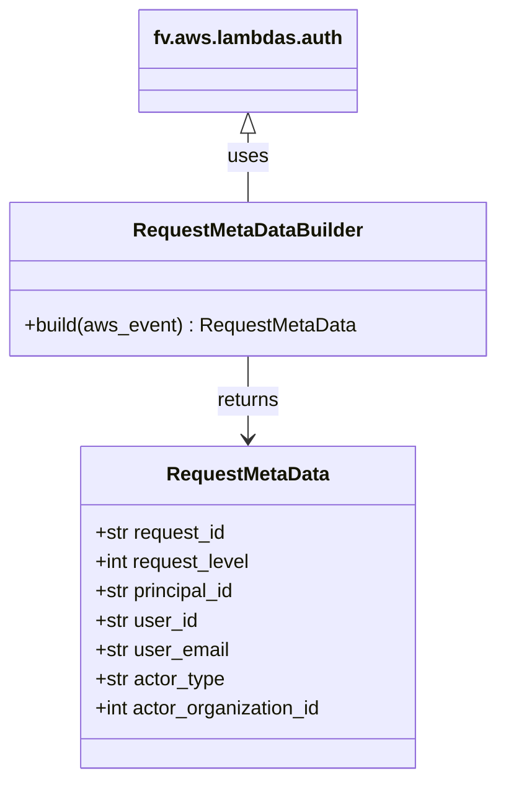

# Diagram: shipment_core/shipment_service/shipment_service/fvshared/RequestMetaData.py


> Auto-generated by Obscura crawlers

## Diagram 1



### SVG

<svg id="container" width="403.0078125" xmlns="http://www.w3.org/2000/svg" class="classDiagram" height="638" viewBox="0 0 403.0078125 638" role="graphics-document document" aria-roledescription="class"><style>#container{font-family:"trebuchet ms",verdana,arial,sans-serif;font-size:16px;fill:#333;}@keyframes edge-animation-frame{from{stroke-dashoffset:0;}}@keyframes dash{to{stroke-dashoffset:0;}}#container .edge-animation-slow{stroke-dasharray:9,5!important;stroke-dashoffset:900;animation:dash 50s linear infinite;stroke-linecap:round;}#container .edge-animation-fast{stroke-dasharray:9,5!important;stroke-dashoffset:900;animation:dash 20s linear infinite;stroke-linecap:round;}#container .error-icon{fill:#552222;}#container .error-text{fill:#552222;stroke:#552222;}#container .edge-thickness-normal{stroke-width:1px;}#container .edge-thickness-thick{stroke-width:3.5px;}#container .edge-pattern-solid{stroke-dasharray:0;}#container .edge-thickness-invisible{stroke-width:0;fill:none;}#container .edge-pattern-dashed{stroke-dasharray:3;}#container .edge-pattern-dotted{stroke-dasharray:2;}#container .marker{fill:#333333;stroke:#333333;}#container .marker.cross{stroke:#333333;}#container svg{font-family:"trebuchet ms",verdana,arial,sans-serif;font-size:16px;}#container p{margin:0;}#container g.classGroup text{fill:#9370DB;stroke:none;font-family:"trebuchet ms",verdana,arial,sans-serif;font-size:10px;}#container g.classGroup text .title{font-weight:bolder;}#container .nodeLabel,#container .edgeLabel{color:#131300;}#container .edgeLabel .label rect{fill:#ECECFF;}#container .label text{fill:#131300;}#container .labelBkg{background:#ECECFF;}#container .edgeLabel .label span{background:#ECECFF;}#container .classTitle{font-weight:bolder;}#container .node rect,#container .node circle,#container .node ellipse,#container .node polygon,#container .node path{fill:#ECECFF;stroke:#9370DB;stroke-width:1px;}#container .divider{stroke:#9370DB;stroke-width:1;}#container g.clickable{cursor:pointer;}#container g.classGroup rect{fill:#ECECFF;stroke:#9370DB;}#container g.classGroup line{stroke:#9370DB;stroke-width:1;}#container .classLabel .box{stroke:none;stroke-width:0;fill:#ECECFF;opacity:0.5;}#container .classLabel .label{fill:#9370DB;font-size:10px;}#container .relation{stroke:#333333;stroke-width:1;fill:none;}#container .dashed-line{stroke-dasharray:3;}#container .dotted-line{stroke-dasharray:1 2;}#container #compositionStart,#container .composition{fill:#333333!important;stroke:#333333!important;stroke-width:1;}#container #compositionEnd,#container .composition{fill:#333333!important;stroke:#333333!important;stroke-width:1;}#container #dependencyStart,#container .dependency{fill:#333333!important;stroke:#333333!important;stroke-width:1;}#container #dependencyStart,#container .dependency{fill:#333333!important;stroke:#333333!important;stroke-width:1;}#container #extensionStart,#container .extension{fill:transparent!important;stroke:#333333!important;stroke-width:1;}#container #extensionEnd,#container .extension{fill:transparent!important;stroke:#333333!important;stroke-width:1;}#container #aggregationStart,#container .aggregation{fill:transparent!important;stroke:#333333!important;stroke-width:1;}#container #aggregationEnd,#container .aggregation{fill:transparent!important;stroke:#333333!important;stroke-width:1;}#container #lollipopStart,#container .lollipop{fill:#ECECFF!important;stroke:#333333!important;stroke-width:1;}#container #lollipopEnd,#container .lollipop{fill:#ECECFF!important;stroke:#333333!important;stroke-width:1;}#container .edgeTerminals{font-size:11px;line-height:initial;}#container .classTitleText{text-anchor:middle;font-size:18px;fill:#333;}#container .label-icon{display:inline-block;height:1em;overflow:visible;vertical-align:-0.125em;}#container .node .label-icon path{fill:currentColor;stroke:revert;stroke-width:revert;}#container :root{--mermaid-font-family:"trebuchet ms",verdana,arial,sans-serif;}</style><g><defs><marker id="container_class-aggregationStart" class="marker aggregation class" refX="18" refY="7" markerWidth="190" markerHeight="240" orient="auto"><path d="M 18,7 L9,13 L1,7 L9,1 Z"></path></marker></defs><defs><marker id="container_class-aggregationEnd" class="marker aggregation class" refX="1" refY="7" markerWidth="20" markerHeight="28" orient="auto"><path d="M 18,7 L9,13 L1,7 L9,1 Z"></path></marker></defs><defs><marker id="container_class-extensionStart" class="marker extension class" refX="18" refY="7" markerWidth="190" markerHeight="240" orient="auto"><path d="M 1,7 L18,13 V 1 Z"></path></marker></defs><defs><marker id="container_class-extensionEnd" class="marker extension class" refX="1" refY="7" markerWidth="20" markerHeight="28" orient="auto"><path d="M 1,1 V 13 L18,7 Z"></path></marker></defs><defs><marker id="container_class-compositionStart" class="marker composition class" refX="18" refY="7" markerWidth="190" markerHeight="240" orient="auto"><path d="M 18,7 L9,13 L1,7 L9,1 Z"></path></marker></defs><defs><marker id="container_class-compositionEnd" class="marker composition class" refX="1" refY="7" markerWidth="20" markerHeight="28" orient="auto"><path d="M 18,7 L9,13 L1,7 L9,1 Z"></path></marker></defs><defs><marker id="container_class-dependencyStart" class="marker dependency class" refX="6" refY="7" markerWidth="190" markerHeight="240" orient="auto"><path d="M 5,7 L9,13 L1,7 L9,1 Z"></path></marker></defs><defs><marker id="container_class-dependencyEnd" class="marker dependency class" refX="13" refY="7" markerWidth="20" markerHeight="28" orient="auto"><path d="M 18,7 L9,13 L14,7 L9,1 Z"></path></marker></defs><defs><marker id="container_class-lollipopStart" class="marker lollipop class" refX="13" refY="7" markerWidth="190" markerHeight="240" orient="auto"><circle stroke="black" fill="transparent" cx="7" cy="7" r="6"></circle></marker></defs><defs><marker id="container_class-lollipopEnd" class="marker lollipop class" refX="1" refY="7" markerWidth="190" markerHeight="240" orient="auto"><circle stroke="black" fill="transparent" cx="7" cy="7" r="6"></circle></marker></defs><g class="root"><g class="clusters"></g><g class="edgePaths"><path d="M201.504,292L201.504,298.167C201.504,304.333,201.504,316.667,201.504,328C201.504,339.333,201.504,349.667,201.504,354.833L201.504,360" id="id_RequestMetaDataBuilder_RequestMetaData_1" class="edge-thickness-normal edge-pattern-solid relation" style=";;;" data-edge="true" data-et="edge" data-id="id_RequestMetaDataBuilder_RequestMetaData_1" data-points="W3sieCI6MjAxLjUwMzkwNjI1LCJ5IjoyOTJ9LHsieCI6MjAxLjUwMzkwNjI1LCJ5IjozMjl9LHsieCI6MjAxLjUwMzkwNjI1LCJ5IjozNjZ9XQ==" marker-end="url(#container_class-dependencyEnd)"></path><path d="M201.504,109.25L201.504,112.542C201.504,115.833,201.504,122.417,201.504,131.875C201.504,141.333,201.504,153.667,201.504,159.833L201.504,166" id="id_fv.aws.lambdas.auth_RequestMetaDataBuilder_2" class="edge-thickness-normal edge-pattern-solid relation" style=";;;" data-edge="true" data-et="edge" data-id="id_fv.aws.lambdas.auth_RequestMetaDataBuilder_2" data-points="W3sieCI6MjAxLjUwMzkwNjI1LCJ5Ijo5Mn0seyJ4IjoyMDEuNTAzOTA2MjUsInkiOjEyOX0seyJ4IjoyMDEuNTAzOTA2MjUsInkiOjE2Nn1d" marker-start="url(#container_class-extensionStart)"></path></g><g class="edgeLabels"><g class="edgeLabel" transform="translate(201.50390625, 329)"><g class="label" data-id="id_RequestMetaDataBuilder_RequestMetaData_1" transform="translate(-26.265625, -12)"><foreignObject width="52.53125" height="24"><div xmlns="http://www.w3.org/1999/xhtml" class="labelBkg" style="display: table-cell; white-space: nowrap; line-height: 1.5; max-width: 200px; text-align: center;"><span class="edgeLabel"><p>returns</p></span></div></foreignObject></g></g><g class="edgeLabel" transform="translate(201.50390625, 129)"><g class="label" data-id="id_fv.aws.lambdas.auth_RequestMetaDataBuilder_2" transform="translate(-16.4921875, -12)"><foreignObject width="32.984375" height="24"><div xmlns="http://www.w3.org/1999/xhtml" class="labelBkg" style="display: table-cell; white-space: nowrap; line-height: 1.5; max-width: 200px; text-align: center;"><span class="edgeLabel"><p>uses</p></span></div></foreignObject></g></g></g><g class="nodes"><g class="node default" id="classId-RequestMetaData-0" transform="translate(201.50390625, 498)"><g class="basic label-container"><path d="M-138.86328125 -132 L138.86328125 -132 L138.86328125 132 L-138.86328125 132" stroke="none" stroke-width="0" fill="#ECECFF" style=""></path><path d="M-138.86328125 -132 C-28.373959957674217 -132, 82.11536133465157 -132, 138.86328125 -132 M-138.86328125 -132 C-70.59403556551432 -132, -2.324789881028636 -132, 138.86328125 -132 M138.86328125 -132 C138.86328125 -28.486644046691822, 138.86328125 75.02671190661636, 138.86328125 132 M138.86328125 -132 C138.86328125 -43.91759020724973, 138.86328125 44.16481958550054, 138.86328125 132 M138.86328125 132 C36.58416583416977 132, -65.69494958166047 132, -138.86328125 132 M138.86328125 132 C36.90735529690278 132, -65.04857065619444 132, -138.86328125 132 M-138.86328125 132 C-138.86328125 44.55768704601307, -138.86328125 -42.884625907973856, -138.86328125 -132 M-138.86328125 132 C-138.86328125 27.067410969798857, -138.86328125 -77.86517806040229, -138.86328125 -132" stroke="#9370DB" stroke-width="1.3" fill="none" stroke-dasharray="0 0" style=""></path></g><g class="annotation-group text" transform="translate(0, -108)"></g><g class="label-group text" transform="translate(-64.9453125, -108)"><g class="label" style="font-weight: bolder" transform="translate(0,-12)"><foreignObject width="129.890625" height="24"><div xmlns="http://www.w3.org/1999/xhtml" style="display: table-cell; white-space: nowrap; line-height: 1.5; max-width: 178px; text-align: center;"><span class="nodeLabel markdown-node-label" style=""><p>RequestMetaData</p></span></div></foreignObject></g></g><g class="members-group text" transform="translate(-126.86328125, -60)"><g class="label" style="" transform="translate(0,-12)"><foreignObject width="109.3125" height="24"><div xmlns="http://www.w3.org/1999/xhtml" style="display: table-cell; white-space: nowrap; line-height: 1.5; max-width: 167px; text-align: center;"><span class="nodeLabel markdown-node-label" style=""><p>+str request_id</p></span></div></foreignObject></g><g class="label" style="" transform="translate(0,12)"><foreignObject width="129.796875" height="24"><div xmlns="http://www.w3.org/1999/xhtml" style="display: table-cell; white-space: nowrap; line-height: 1.5; max-width: 187px; text-align: center;"><span class="nodeLabel markdown-node-label" style=""><p>+int request_level</p></span></div></foreignObject></g><g class="label" style="" transform="translate(0,36)"><foreignObject width="118.359375" height="24"><div xmlns="http://www.w3.org/1999/xhtml" style="display: table-cell; white-space: nowrap; line-height: 1.5; max-width: 176px; text-align: center;"><span class="nodeLabel markdown-node-label" style=""><p>+str principal_id</p></span></div></foreignObject></g><g class="label" style="" transform="translate(0,60)"><foreignObject width="84.453125" height="24"><div xmlns="http://www.w3.org/1999/xhtml" style="display: table-cell; white-space: nowrap; line-height: 1.5; max-width: 142px; text-align: center;"><span class="nodeLabel markdown-node-label" style=""><p>+str user_id</p></span></div></foreignObject></g><g class="label" style="" transform="translate(0,84)"><foreignObject width="110.390625" height="24"><div xmlns="http://www.w3.org/1999/xhtml" style="display: table-cell; white-space: nowrap; line-height: 1.5; max-width: 168px; text-align: center;"><span class="nodeLabel markdown-node-label" style=""><p>+str user_email</p></span></div></foreignObject></g><g class="label" style="" transform="translate(0,108)"><foreignObject width="107.578125" height="24"><div xmlns="http://www.w3.org/1999/xhtml" style="display: table-cell; white-space: nowrap; line-height: 1.5; max-width: 165px; text-align: center;"><span class="nodeLabel markdown-node-label" style=""><p>+str actor_type</p></span></div></foreignObject></g><g class="label" style="" transform="translate(0,132)"><foreignObject width="188.78125" height="24"><div xmlns="http://www.w3.org/1999/xhtml" style="display: table-cell; white-space: nowrap; line-height: 1.5; max-width: 246px; text-align: center;"><span class="nodeLabel markdown-node-label" style=""><p>+int actor_organization_id</p></span></div></foreignObject></g></g><g class="methods-group text" transform="translate(-126.86328125, 132)"></g><g class="divider" style=""><path d="M-138.86328125 -84 C-63.69370282514096 -84, 11.47587559971808 -84, 138.86328125 -84 M-138.86328125 -84 C-29.156361849508187 -84, 80.55055755098363 -84, 138.86328125 -84" stroke="#9370DB" stroke-width="1.3" fill="none" stroke-dasharray="0 0" style=""></path></g><g class="divider" style=""><path d="M-138.86328125 108 C-40.57054688762712 108, 57.722187474745766 108, 138.86328125 108 M-138.86328125 108 C-47.487933261976394 108, 43.88741472604721 108, 138.86328125 108" stroke="#9370DB" stroke-width="1.3" fill="none" stroke-dasharray="0 0" style=""></path></g></g><g class="node default" id="classId-RequestMetaDataBuilder-1" transform="translate(201.50390625, 229)"><g class="basic label-container"><path d="M-193.50390625 -63 L193.50390625 -63 L193.50390625 63 L-193.50390625 63" stroke="none" stroke-width="0" fill="#ECECFF" style=""></path><path d="M-193.50390625 -63 C-114.51220838502496 -63, -35.520510520049925 -63, 193.50390625 -63 M-193.50390625 -63 C-88.28713902569937 -63, 16.92962819860125 -63, 193.50390625 -63 M193.50390625 -63 C193.50390625 -35.16727644207556, 193.50390625 -7.334552884151115, 193.50390625 63 M193.50390625 -63 C193.50390625 -20.317950408832587, 193.50390625 22.364099182334826, 193.50390625 63 M193.50390625 63 C60.73196726946989 63, -72.03997171106022 63, -193.50390625 63 M193.50390625 63 C59.56572209803497 63, -74.37246205393006 63, -193.50390625 63 M-193.50390625 63 C-193.50390625 32.06390394879497, -193.50390625 1.1278078975899533, -193.50390625 -63 M-193.50390625 63 C-193.50390625 27.249097059485948, -193.50390625 -8.501805881028105, -193.50390625 -63" stroke="#9370DB" stroke-width="1.3" fill="none" stroke-dasharray="0 0" style=""></path></g><g class="annotation-group text" transform="translate(0, -39)"></g><g class="label-group text" transform="translate(-91.4765625, -39)"><g class="label" style="font-weight: bolder" transform="translate(0,-12)"><foreignObject width="182.953125" height="24"><div xmlns="http://www.w3.org/1999/xhtml" style="display: table-cell; white-space: nowrap; line-height: 1.5; max-width: 231px; text-align: center;"><span class="nodeLabel markdown-node-label" style=""><p>RequestMetaDataBuilder</p></span></div></foreignObject></g></g><g class="members-group text" transform="translate(-181.50390625, 9)"></g><g class="methods-group text" transform="translate(-181.50390625, 39)"><g class="label" style="" transform="translate(0,-12)"><foreignObject width="271.53125" height="24"><div xmlns="http://www.w3.org/1999/xhtml" style="display: table-cell; white-space: nowrap; line-height: 1.5; max-width: 329px; text-align: center;"><span class="nodeLabel markdown-node-label" style=""><p>+build(aws_event) : RequestMetaData</p></span></div></foreignObject></g></g><g class="divider" style=""><path d="M-193.50390625 -15 C-105.28337460049697 -15, -17.06284295099394 -15, 193.50390625 -15 M-193.50390625 -15 C-69.96674465678582 -15, 53.57041693642836 -15, 193.50390625 -15" stroke="#9370DB" stroke-width="1.3" fill="none" stroke-dasharray="0 0" style=""></path></g><g class="divider" style=""><path d="M-193.50390625 9 C-62.16375523597512 9, 69.17639577804977 9, 193.50390625 9 M-193.50390625 9 C-101.39756852991643 9, -9.291230809832854 9, 193.50390625 9" stroke="#9370DB" stroke-width="1.3" fill="none" stroke-dasharray="0 0" style=""></path></g></g><g class="node default" id="classId-fv.aws.lambdas.auth-2" transform="translate(201.50390625, 50)"><g class="basic label-container"><path d="M-86.484375 -42 L86.484375 -42 L86.484375 42 L-86.484375 42" stroke="none" stroke-width="0" fill="#ECECFF" style=""></path><path d="M-86.484375 -42 C-35.461434942605464 -42, 15.561505114789071 -42, 86.484375 -42 M-86.484375 -42 C-48.92086108254596 -42, -11.357347165091923 -42, 86.484375 -42 M86.484375 -42 C86.484375 -8.421160152646507, 86.484375 25.157679694706985, 86.484375 42 M86.484375 -42 C86.484375 -24.864519555091384, 86.484375 -7.729039110182768, 86.484375 42 M86.484375 42 C39.239935980101876 42, -8.004503039796248 42, -86.484375 42 M86.484375 42 C29.126538850841698 42, -28.231297298316605 42, -86.484375 42 M-86.484375 42 C-86.484375 19.38660496939348, -86.484375 -3.2267900612130376, -86.484375 -42 M-86.484375 42 C-86.484375 12.330954446839122, -86.484375 -17.338091106321755, -86.484375 -42" stroke="#9370DB" stroke-width="1.3" fill="none" stroke-dasharray="0 0" style=""></path></g><g class="annotation-group text" transform="translate(0, -18)"></g><g class="label-group text" transform="translate(-74.484375, -18)"><g class="label" style="font-weight: bolder" transform="translate(0,-12)"><foreignObject width="148.96875" height="24"><div xmlns="http://www.w3.org/1999/xhtml" style="display: table-cell; white-space: nowrap; line-height: 1.5; max-width: 197px; text-align: center;"><span class="nodeLabel markdown-node-label" style=""><p>fv.aws.lambdas.auth</p></span></div></foreignObject></g></g><g class="members-group text" transform="translate(-74.484375, 30)"></g><g class="methods-group text" transform="translate(-74.484375, 60)"></g><g class="divider" style=""><path d="M-86.484375 6 C-17.926469994147737 6, 50.631435011704525 6, 86.484375 6 M-86.484375 6 C-31.380917522574073 6, 23.722539954851854 6, 86.484375 6" stroke="#9370DB" stroke-width="1.3" fill="none" stroke-dasharray="0 0" style=""></path></g><g class="divider" style=""><path d="M-86.484375 24 C-46.85006156423836 24, -7.215748128476719 24, 86.484375 24 M-86.484375 24 C-46.54874871301697 24, -6.613122426033939 24, 86.484375 24" stroke="#9370DB" stroke-width="1.3" fill="none" stroke-dasharray="0 0" style=""></path></g></g></g></g></g></svg>

## Diagram 2

```mermaid
flowchart TD
    A[AWS Event (aws_event)] --> B[Extract requestContext]
    B --> C{authorizer present?}
    C -->|yes| D[principalId, user_id, email, actor_type]
    C -->|no| E[defaults/empty strings]
    B --> F[lambda_level -> int(request_level)]
    A --> G[fv.aws.lambdas.auth.get_organization_id(aws_event)]
    G --> H[int(actor_organization_id)]
    D --> I[RequestMetaDataBuilder.build()]
    E --> I
    F --> I
    H --> I
    I --> J[RequestMetaData(request_id, request_level, principal_id, user_id, user_email, actor_type, actor_organization_id)]
    style J fill:#f9f,stroke:#333,stroke-width:2px
```

> SVG rendering failed for this diagram.
