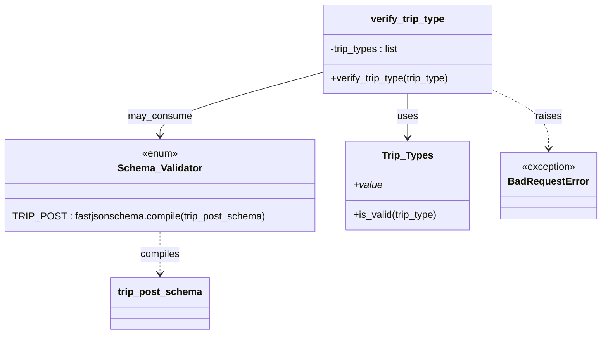

# Diagram: shipment_core/shipment_service/shipment_service/fvshared/__init__.py


> Auto-generated by Obscura crawlers

## Diagram 1



### SVG

<svg id="container" width="958.375" xmlns="http://www.w3.org/2000/svg" class="classDiagram" height="542" viewBox="0 0 958.375 542" role="graphics-document document" aria-roledescription="class"><style>#container{font-family:"trebuchet ms",verdana,arial,sans-serif;font-size:16px;fill:#333;}@keyframes edge-animation-frame{from{stroke-dashoffset:0;}}@keyframes dash{to{stroke-dashoffset:0;}}#container .edge-animation-slow{stroke-dasharray:9,5!important;stroke-dashoffset:900;animation:dash 50s linear infinite;stroke-linecap:round;}#container .edge-animation-fast{stroke-dasharray:9,5!important;stroke-dashoffset:900;animation:dash 20s linear infinite;stroke-linecap:round;}#container .error-icon{fill:#552222;}#container .error-text{fill:#552222;stroke:#552222;}#container .edge-thickness-normal{stroke-width:1px;}#container .edge-thickness-thick{stroke-width:3.5px;}#container .edge-pattern-solid{stroke-dasharray:0;}#container .edge-thickness-invisible{stroke-width:0;fill:none;}#container .edge-pattern-dashed{stroke-dasharray:3;}#container .edge-pattern-dotted{stroke-dasharray:2;}#container .marker{fill:#333333;stroke:#333333;}#container .marker.cross{stroke:#333333;}#container svg{font-family:"trebuchet ms",verdana,arial,sans-serif;font-size:16px;}#container p{margin:0;}#container g.classGroup text{fill:#9370DB;stroke:none;font-family:"trebuchet ms",verdana,arial,sans-serif;font-size:10px;}#container g.classGroup text .title{font-weight:bolder;}#container .nodeLabel,#container .edgeLabel{color:#131300;}#container .edgeLabel .label rect{fill:#ECECFF;}#container .label text{fill:#131300;}#container .labelBkg{background:#ECECFF;}#container .edgeLabel .label span{background:#ECECFF;}#container .classTitle{font-weight:bolder;}#container .node rect,#container .node circle,#container .node ellipse,#container .node polygon,#container .node path{fill:#ECECFF;stroke:#9370DB;stroke-width:1px;}#container .divider{stroke:#9370DB;stroke-width:1;}#container g.clickable{cursor:pointer;}#container g.classGroup rect{fill:#ECECFF;stroke:#9370DB;}#container g.classGroup line{stroke:#9370DB;stroke-width:1;}#container .classLabel .box{stroke:none;stroke-width:0;fill:#ECECFF;opacity:0.5;}#container .classLabel .label{fill:#9370DB;font-size:10px;}#container .relation{stroke:#333333;stroke-width:1;fill:none;}#container .dashed-line{stroke-dasharray:3;}#container .dotted-line{stroke-dasharray:1 2;}#container #compositionStart,#container .composition{fill:#333333!important;stroke:#333333!important;stroke-width:1;}#container #compositionEnd,#container .composition{fill:#333333!important;stroke:#333333!important;stroke-width:1;}#container #dependencyStart,#container .dependency{fill:#333333!important;stroke:#333333!important;stroke-width:1;}#container #dependencyStart,#container .dependency{fill:#333333!important;stroke:#333333!important;stroke-width:1;}#container #extensionStart,#container .extension{fill:transparent!important;stroke:#333333!important;stroke-width:1;}#container #extensionEnd,#container .extension{fill:transparent!important;stroke:#333333!important;stroke-width:1;}#container #aggregationStart,#container .aggregation{fill:transparent!important;stroke:#333333!important;stroke-width:1;}#container #aggregationEnd,#container .aggregation{fill:transparent!important;stroke:#333333!important;stroke-width:1;}#container #lollipopStart,#container .lollipop{fill:#ECECFF!important;stroke:#333333!important;stroke-width:1;}#container #lollipopEnd,#container .lollipop{fill:#ECECFF!important;stroke:#333333!important;stroke-width:1;}#container .edgeTerminals{font-size:11px;line-height:initial;}#container .classTitleText{text-anchor:middle;font-size:18px;fill:#333;}#container .label-icon{display:inline-block;height:1em;overflow:visible;vertical-align:-0.125em;}#container .node .label-icon path{fill:currentColor;stroke:revert;stroke-width:revert;}#container :root{--mermaid-font-family:"trebuchet ms",verdana,arial,sans-serif;}</style><g><defs><marker id="container_class-aggregationStart" class="marker aggregation class" refX="18" refY="7" markerWidth="190" markerHeight="240" orient="auto"><path d="M 18,7 L9,13 L1,7 L9,1 Z"></path></marker></defs><defs><marker id="container_class-aggregationEnd" class="marker aggregation class" refX="1" refY="7" markerWidth="20" markerHeight="28" orient="auto"><path d="M 18,7 L9,13 L1,7 L9,1 Z"></path></marker></defs><defs><marker id="container_class-extensionStart" class="marker extension class" refX="18" refY="7" markerWidth="190" markerHeight="240" orient="auto"><path d="M 1,7 L18,13 V 1 Z"></path></marker></defs><defs><marker id="container_class-extensionEnd" class="marker extension class" refX="1" refY="7" markerWidth="20" markerHeight="28" orient="auto"><path d="M 1,1 V 13 L18,7 Z"></path></marker></defs><defs><marker id="container_class-compositionStart" class="marker composition class" refX="18" refY="7" markerWidth="190" markerHeight="240" orient="auto"><path d="M 18,7 L9,13 L1,7 L9,1 Z"></path></marker></defs><defs><marker id="container_class-compositionEnd" class="marker composition class" refX="1" refY="7" markerWidth="20" markerHeight="28" orient="auto"><path d="M 18,7 L9,13 L1,7 L9,1 Z"></path></marker></defs><defs><marker id="container_class-dependencyStart" class="marker dependency class" refX="6" refY="7" markerWidth="190" markerHeight="240" orient="auto"><path d="M 5,7 L9,13 L1,7 L9,1 Z"></path></marker></defs><defs><marker id="container_class-dependencyEnd" class="marker dependency class" refX="13" refY="7" markerWidth="20" markerHeight="28" orient="auto"><path d="M 18,7 L9,13 L14,7 L9,1 Z"></path></marker></defs><defs><marker id="container_class-lollipopStart" class="marker lollipop class" refX="13" refY="7" markerWidth="190" markerHeight="240" orient="auto"><circle stroke="black" fill="transparent" cx="7" cy="7" r="6"></circle></marker></defs><defs><marker id="container_class-lollipopEnd" class="marker lollipop class" refX="1" refY="7" markerWidth="190" markerHeight="240" orient="auto"><circle stroke="black" fill="transparent" cx="7" cy="7" r="6"></circle></marker></defs><g class="root"><g class="clusters"></g><g class="edgePaths"><path d="M651.133,152L651.133,158.167C651.133,164.333,651.133,176.667,651.133,188.5C651.133,200.333,651.133,211.667,651.133,217.333L651.133,223" id="id_verify_trip_type_Trip_Types_1" class="edge-thickness-normal edge-pattern-solid relation" style=";;;" data-edge="true" data-et="edge" data-id="id_verify_trip_type_Trip_Types_1" data-points="W3sieCI6NjUxLjEzMjgxMjUsInkiOjE1Mn0seyJ4Ijo2NTEuMTMyODEyNSwieSI6MTg5fSx7IngiOjY1MS4xMzI4MTI1LCJ5IjoyMjl9XQ==" marker-end="url(#container_class-dependencyEnd)"></path><path d="M790.77,147.658L804.99,154.548C819.211,161.439,847.652,175.219,861.873,190.776C876.094,206.333,876.094,223.667,876.094,232.333L876.094,241" id="id_verify_trip_type_BadRequestError_2" class="edge-thickness-normal edge-pattern-dashed relation" style=";;;" data-edge="true" data-et="edge" data-id="id_verify_trip_type_BadRequestError_2" data-points="W3sieCI6NzkwLjc2OTUzMTI1LCJ5IjoxNDcuNjU3OTc4ODE1NzY2NjN9LHsieCI6ODc2LjA5Mzc1LCJ5IjoxODl9LHsieCI6ODc2LjA5Mzc1LCJ5IjoyNDd9XQ==" marker-end="url(#container_class-dependencyEnd)"></path><path d="M254.227,376L254.227,382.167C254.227,388.333,254.227,400.667,254.227,412C254.227,423.333,254.227,433.667,254.227,438.833L254.227,444" id="id_Schema_Validator_trip_post_schema_3" class="edge-thickness-normal edge-pattern-dashed relation" style=";;;" data-edge="true" data-et="edge" data-id="id_Schema_Validator_trip_post_schema_3" data-points="W3sieCI6MjU0LjIyNjU2MjUsInkiOjM3Nn0seyJ4IjoyNTQuMjI2NTYyNSwieSI6NDEzfSx7IngiOjI1NC4yMjY1NjI1LCJ5Ijo0NTB9XQ==" marker-end="url(#container_class-dependencyEnd)"></path><path d="M511.496,118.348L468.618,130.123C425.74,141.898,339.983,165.449,297.105,182.391C254.227,199.333,254.227,209.667,254.227,214.833L254.227,220" id="id_verify_trip_type_Schema_Validator_4" class="edge-thickness-normal edge-pattern-solid relation" style=";;;" data-edge="true" data-et="edge" data-id="id_verify_trip_type_Schema_Validator_4" data-points="W3sieCI6NTExLjQ5NjA5Mzc1LCJ5IjoxMTguMzQ3NjAwNTgyNjMxMjl9LHsieCI6MjU0LjIyNjU2MjUsInkiOjE4OX0seyJ4IjoyNTQuMjI2NTYyNSwieSI6MjI2fV0=" marker-end="url(#container_class-dependencyEnd)"></path></g><g class="edgeLabels"><g class="edgeLabel" transform="translate(651.1328125, 189)"><g class="label" data-id="id_verify_trip_type_Trip_Types_1" transform="translate(-16.4921875, -12)"><foreignObject width="32.984375" height="24"><div xmlns="http://www.w3.org/1999/xhtml" class="labelBkg" style="display: table-cell; white-space: nowrap; line-height: 1.5; max-width: 200px; text-align: center;"><span class="edgeLabel"><p>uses</p></span></div></foreignObject></g></g><g class="edgeLabel" transform="translate(876.09375, 189)"><g class="label" data-id="id_verify_trip_type_BadRequestError_2" transform="translate(-21.25, -12)"><foreignObject width="42.5" height="24"><div xmlns="http://www.w3.org/1999/xhtml" class="labelBkg" style="display: table-cell; white-space: nowrap; line-height: 1.5; max-width: 200px; text-align: center;"><span class="edgeLabel"><p>raises</p></span></div></foreignObject></g></g><g class="edgeLabel" transform="translate(254.2265625, 413)"><g class="label" data-id="id_Schema_Validator_trip_post_schema_3" transform="translate(-32.6015625, -12)"><foreignObject width="65.203125" height="24"><div xmlns="http://www.w3.org/1999/xhtml" class="labelBkg" style="display: table-cell; white-space: nowrap; line-height: 1.5; max-width: 200px; text-align: center;"><span class="edgeLabel"><p>compiles</p></span></div></foreignObject></g></g><g class="edgeLabel" transform="translate(254.2265625, 189)"><g class="label" data-id="id_verify_trip_type_Schema_Validator_4" transform="translate(-51.421875, -12)"><foreignObject width="102.84375" height="24"><div xmlns="http://www.w3.org/1999/xhtml" class="labelBkg" style="display: table-cell; white-space: nowrap; line-height: 1.5; max-width: 200px; text-align: center;"><span class="edgeLabel"><p>may_consume</p></span></div></foreignObject></g></g></g><g class="nodes"><g class="node default" id="classId-Schema_Validator-0" transform="translate(254.2265625, 301)"><g class="basic label-container"><path d="M-246.2265625 -75 L246.2265625 -75 L246.2265625 75 L-246.2265625 75" stroke="none" stroke-width="0" fill="#ECECFF" style=""></path><path d="M-246.2265625 -75 C-121.75706111054664 -75, 2.712440278906712 -75, 246.2265625 -75 M-246.2265625 -75 C-61.97007169041251 -75, 122.28641911917498 -75, 246.2265625 -75 M246.2265625 -75 C246.2265625 -31.94809402405385, 246.2265625 11.103811951892297, 246.2265625 75 M246.2265625 -75 C246.2265625 -22.667391875184883, 246.2265625 29.665216249630234, 246.2265625 75 M246.2265625 75 C138.58639670084213 75, 30.94623090168426 75, -246.2265625 75 M246.2265625 75 C100.97078386401427 75, -44.28499477197147 75, -246.2265625 75 M-246.2265625 75 C-246.2265625 16.061124578526567, -246.2265625 -42.87775084294687, -246.2265625 -75 M-246.2265625 75 C-246.2265625 18.87616643650822, -246.2265625 -37.24766712698356, -246.2265625 -75" stroke="#9370DB" stroke-width="1.3" fill="none" stroke-dasharray="0 0" style=""></path></g><g class="annotation-group text" transform="translate(-29.53125, -51)"><g class="label" style="" transform="translate(0,-12)"><foreignObject width="59.0625" height="24"><div xmlns="http://www.w3.org/1999/xhtml" style="display: table-cell; white-space: nowrap; line-height: 1.5; max-width: 109px; text-align: center;"><span class="nodeLabel markdown-node-label" style=""><p>«enum»</p></span></div></foreignObject></g></g><g class="label-group text" transform="translate(-65.53125, -27)"><g class="label" style="font-weight: bolder" transform="translate(0,-12)"><foreignObject width="131.0625" height="24"><div xmlns="http://www.w3.org/1999/xhtml" style="display: table-cell; white-space: nowrap; line-height: 1.5; max-width: 181px; text-align: center;"><span class="nodeLabel markdown-node-label" style=""><p>Schema_Validator</p></span></div></foreignObject></g></g><g class="members-group text" transform="translate(-234.2265625, 21)"></g><g class="methods-group text" transform="translate(-234.2265625, 51)"><g class="label" style="" transform="translate(0,-12)"><foreignObject width="402.921875" height="24"><div xmlns="http://www.w3.org/1999/xhtml" style="display: table-cell; white-space: nowrap; line-height: 1.5; max-width: 453px; text-align: center;"><span class="nodeLabel markdown-node-label" style=""><p>TRIP_POST : fastjsonschema.compile(trip_post_schema)</p></span></div></foreignObject></g></g><g class="divider" style=""><path d="M-246.2265625 -3 C-139.4800301968392 -3, -32.73349789367842 -3, 246.2265625 -3 M-246.2265625 -3 C-61.31265353850702 -3, 123.60125542298596 -3, 246.2265625 -3" stroke="#9370DB" stroke-width="1.3" fill="none" stroke-dasharray="0 0" style=""></path></g><g class="divider" style=""><path d="M-246.2265625 21 C-145.9809433152795 21, -45.73532413055898 21, 246.2265625 21 M-246.2265625 21 C-55.915813637120465 21, 134.39493522575907 21, 246.2265625 21" stroke="#9370DB" stroke-width="1.3" fill="none" stroke-dasharray="0 0" style=""></path></g></g><g class="node default" id="classId-verify_trip_type-1" transform="translate(651.1328125, 80)"><g class="basic label-container"><path d="M-139.63671875 -72 L139.63671875 -72 L139.63671875 72 L-139.63671875 72" stroke="none" stroke-width="0" fill="#ECECFF" style=""></path><path d="M-139.63671875 -72 C-53.72221296186433 -72, 32.19229282627134 -72, 139.63671875 -72 M-139.63671875 -72 C-80.40791245279055 -72, -21.179106155581124 -72, 139.63671875 -72 M139.63671875 -72 C139.63671875 -37.18638654326372, 139.63671875 -2.3727730865274452, 139.63671875 72 M139.63671875 -72 C139.63671875 -34.9551938395564, 139.63671875 2.0896123208871984, 139.63671875 72 M139.63671875 72 C50.095641570030295 72, -39.44543560993941 72, -139.63671875 72 M139.63671875 72 C76.67330226616255 72, 13.709885782325102 72, -139.63671875 72 M-139.63671875 72 C-139.63671875 23.512633088101843, -139.63671875 -24.974733823796313, -139.63671875 -72 M-139.63671875 72 C-139.63671875 35.71199386797333, -139.63671875 -0.5760122640533467, -139.63671875 -72" stroke="#9370DB" stroke-width="1.3" fill="none" stroke-dasharray="0 0" style=""></path></g><g class="annotation-group text" transform="translate(0, -48)"></g><g class="label-group text" transform="translate(-58.2265625, -48)"><g class="label" style="font-weight: bolder" transform="translate(0,-12)"><foreignObject width="116.453125" height="24"><div xmlns="http://www.w3.org/1999/xhtml" style="display: table-cell; white-space: nowrap; line-height: 1.5; max-width: 163px; text-align: center;"><span class="nodeLabel markdown-node-label" style=""><p>verify_trip_type</p></span></div></foreignObject></g></g><g class="members-group text" transform="translate(-127.63671875, 0)"><g class="label" style="" transform="translate(0,-12)"><foreignObject width="114.0625" height="24"><div xmlns="http://www.w3.org/1999/xhtml" style="display: table-cell; white-space: nowrap; line-height: 1.5; max-width: 172px; text-align: center;"><span class="nodeLabel markdown-node-label" style=""><p>-trip_types : list</p></span></div></foreignObject></g></g><g class="methods-group text" transform="translate(-127.63671875, 48)"><g class="label" style="" transform="translate(0,-12)"><foreignObject width="197.046875" height="24"><div xmlns="http://www.w3.org/1999/xhtml" style="display: table-cell; white-space: nowrap; line-height: 1.5; max-width: 254px; text-align: center;"><span class="nodeLabel markdown-node-label" style=""><p>+verify_trip_type(trip_type)</p></span></div></foreignObject></g></g><g class="divider" style=""><path d="M-139.63671875 -24 C-65.19547558813673 -24, 9.245767573726539 -24, 139.63671875 -24 M-139.63671875 -24 C-76.63008425474526 -24, -13.623449759490512 -24, 139.63671875 -24" stroke="#9370DB" stroke-width="1.3" fill="none" stroke-dasharray="0 0" style=""></path></g><g class="divider" style=""><path d="M-139.63671875 24 C-50.08149596692094 24, 39.47372681615812 24, 139.63671875 24 M-139.63671875 24 C-62.62529473445605 24, 14.386129281087904 24, 139.63671875 24" stroke="#9370DB" stroke-width="1.3" fill="none" stroke-dasharray="0 0" style=""></path></g></g><g class="node default" id="classId-Trip_Types-2" transform="translate(651.1328125, 301)"><g class="basic label-container"><path d="M-100.6796875 -72 L100.6796875 -72 L100.6796875 72 L-100.6796875 72" stroke="none" stroke-width="0" fill="#ECECFF" style=""></path><path d="M-100.6796875 -72 C-42.997508766907856 -72, 14.684669966184288 -72, 100.6796875 -72 M-100.6796875 -72 C-27.186247862233557 -72, 46.307191775532885 -72, 100.6796875 -72 M100.6796875 -72 C100.6796875 -19.978784417460005, 100.6796875 32.04243116507999, 100.6796875 72 M100.6796875 -72 C100.6796875 -23.114755173153767, 100.6796875 25.770489653692465, 100.6796875 72 M100.6796875 72 C24.440816279506194 72, -51.79805494098761 72, -100.6796875 72 M100.6796875 72 C47.36257569962283 72, -5.954536100754339 72, -100.6796875 72 M-100.6796875 72 C-100.6796875 35.302551417892325, -100.6796875 -1.394897164215351, -100.6796875 -72 M-100.6796875 72 C-100.6796875 15.867660362707603, -100.6796875 -40.26467927458479, -100.6796875 -72" stroke="#9370DB" stroke-width="1.3" fill="none" stroke-dasharray="0 0" style=""></path></g><g class="annotation-group text" transform="translate(0, -48)"></g><g class="label-group text" transform="translate(-39.125, -48)"><g class="label" style="font-weight: bolder" transform="translate(0,-12)"><foreignObject width="78.25" height="24"><div xmlns="http://www.w3.org/1999/xhtml" style="display: table-cell; white-space: nowrap; line-height: 1.5; max-width: 126px; text-align: center;"><span class="nodeLabel markdown-node-label" style=""><p>Trip_Types</p></span></div></foreignObject></g></g><g class="members-group text" transform="translate(-88.6796875, 0)"><g class="label" style="font-style:italic;" transform="translate(0,-12)"><foreignObject width="46.640625" height="24"><div xmlns="http://www.w3.org/1999/xhtml" style="display: table-cell; white-space: nowrap; line-height: 1.5; max-width: 104px; text-align: center;"><span class="nodeLabel markdown-node-label" style=""><p>+value</p></span></div></foreignObject></g></g><g class="methods-group text" transform="translate(-88.6796875, 48)"><g class="label" style="" transform="translate(0,-12)"><foreignObject width="138.234375" height="24"><div xmlns="http://www.w3.org/1999/xhtml" style="display: table-cell; white-space: nowrap; line-height: 1.5; max-width: 196px; text-align: center;"><span class="nodeLabel markdown-node-label" style=""><p>+is_valid(trip_type)</p></span></div></foreignObject></g></g><g class="divider" style=""><path d="M-100.6796875 -24 C-46.575995600603534 -24, 7.527696298792932 -24, 100.6796875 -24 M-100.6796875 -24 C-40.55683646767278 -24, 19.566014564654438 -24, 100.6796875 -24" stroke="#9370DB" stroke-width="1.3" fill="none" stroke-dasharray="0 0" style=""></path></g><g class="divider" style=""><path d="M-100.6796875 24 C-25.0055837134323 24, 50.6685200731354 24, 100.6796875 24 M-100.6796875 24 C-34.281905538259366 24, 32.11587642348127 24, 100.6796875 24" stroke="#9370DB" stroke-width="1.3" fill="none" stroke-dasharray="0 0" style=""></path></g></g><g class="node default" id="classId-trip_post_schema-3" transform="translate(254.2265625, 492)"><g class="basic label-container"><path d="M-77.765625 -42 L77.765625 -42 L77.765625 42 L-77.765625 42" stroke="none" stroke-width="0" fill="#ECECFF" style=""></path><path d="M-77.765625 -42 C-31.039165991806684 -42, 15.687293016386633 -42, 77.765625 -42 M-77.765625 -42 C-33.66044283095251 -42, 10.444739338094976 -42, 77.765625 -42 M77.765625 -42 C77.765625 -19.861653790348953, 77.765625 2.276692419302094, 77.765625 42 M77.765625 -42 C77.765625 -20.31091742252299, 77.765625 1.3781651549540186, 77.765625 42 M77.765625 42 C35.62222055345561 42, -6.521183893088775 42, -77.765625 42 M77.765625 42 C17.401493678654546 42, -42.96263764269091 42, -77.765625 42 M-77.765625 42 C-77.765625 14.405489010128832, -77.765625 -13.189021979742336, -77.765625 -42 M-77.765625 42 C-77.765625 8.491437275784136, -77.765625 -25.017125448431727, -77.765625 -42" stroke="#9370DB" stroke-width="1.3" fill="none" stroke-dasharray="0 0" style=""></path></g><g class="annotation-group text" transform="translate(0, -18)"></g><g class="label-group text" transform="translate(-65.765625, -18)"><g class="label" style="font-weight: bolder" transform="translate(0,-12)"><foreignObject width="131.53125" height="24"><div xmlns="http://www.w3.org/1999/xhtml" style="display: table-cell; white-space: nowrap; line-height: 1.5; max-width: 180px; text-align: center;"><span class="nodeLabel markdown-node-label" style=""><p>trip_post_schema</p></span></div></foreignObject></g></g><g class="members-group text" transform="translate(-65.765625, 30)"></g><g class="methods-group text" transform="translate(-65.765625, 60)"></g><g class="divider" style=""><path d="M-77.765625 6 C-44.221639787217875 6, -10.67765457443575 6, 77.765625 6 M-77.765625 6 C-26.710820914017276 6, 24.343983171965448 6, 77.765625 6" stroke="#9370DB" stroke-width="1.3" fill="none" stroke-dasharray="0 0" style=""></path></g><g class="divider" style=""><path d="M-77.765625 24 C-39.814105992213776 24, -1.8625869844275513 24, 77.765625 24 M-77.765625 24 C-27.603559683875076 24, 22.558505632249847 24, 77.765625 24" stroke="#9370DB" stroke-width="1.3" fill="none" stroke-dasharray="0 0" style=""></path></g></g><g class="node default" id="classId-BadRequestError-4" transform="translate(876.09375, 301)"><g class="basic label-container"><path d="M-74.28125 -54 L74.28125 -54 L74.28125 54 L-74.28125 54" stroke="none" stroke-width="0" fill="#ECECFF" style=""></path><path d="M-74.28125 -54 C-38.09173313553872 -54, -1.9022162710774353 -54, 74.28125 -54 M-74.28125 -54 C-41.55829573591392 -54, -8.835341471827846 -54, 74.28125 -54 M74.28125 -54 C74.28125 -26.0952397748836, 74.28125 1.809520450232803, 74.28125 54 M74.28125 -54 C74.28125 -19.84051813857384, 74.28125 14.318963722852317, 74.28125 54 M74.28125 54 C38.58173360644177 54, 2.882217212883546 54, -74.28125 54 M74.28125 54 C43.61101397914601 54, 12.94077795829201 54, -74.28125 54 M-74.28125 54 C-74.28125 13.212385970174289, -74.28125 -27.575228059651423, -74.28125 -54 M-74.28125 54 C-74.28125 16.988504191522793, -74.28125 -20.022991616954414, -74.28125 -54" stroke="#9370DB" stroke-width="1.3" fill="none" stroke-dasharray="0 0" style=""></path></g><g class="annotation-group text" transform="translate(-44.3515625, -30)"><g class="label" style="" transform="translate(0,-12)"><foreignObject width="88.703125" height="24"><div xmlns="http://www.w3.org/1999/xhtml" style="display: table-cell; white-space: nowrap; line-height: 1.5; max-width: 139px; text-align: center;"><span class="nodeLabel markdown-node-label" style=""><p>«exception»</p></span></div></foreignObject></g></g><g class="label-group text" transform="translate(-62.28125, -6)"><g class="label" style="font-weight: bolder" transform="translate(0,-12)"><foreignObject width="124.5625" height="24"><div xmlns="http://www.w3.org/1999/xhtml" style="display: table-cell; white-space: nowrap; line-height: 1.5; max-width: 174px; text-align: center;"><span class="nodeLabel markdown-node-label" style=""><p>BadRequestError</p></span></div></foreignObject></g></g><g class="members-group text" transform="translate(-62.28125, 42)"></g><g class="methods-group text" transform="translate(-62.28125, 72)"></g><g class="divider" style=""><path d="M-74.28125 18 C-29.471232704619332 18, 15.338784590761335 18, 74.28125 18 M-74.28125 18 C-31.236870395352497 18, 11.807509209295006 18, 74.28125 18" stroke="#9370DB" stroke-width="1.3" fill="none" stroke-dasharray="0 0" style=""></path></g><g class="divider" style=""><path d="M-74.28125 36 C-17.07579779172609 36, 40.12965441654782 36, 74.28125 36 M-74.28125 36 C-16.840297455578806 36, 40.60065508884239 36, 74.28125 36" stroke="#9370DB" stroke-width="1.3" fill="none" stroke-dasharray="0 0" style=""></path></g></g></g></g></g></svg>

## Diagram 2

```mermaid
flowchart TD
    A[call: verify_trip_type(trip_type)] --> B{Trip_Types.is_valid(trip_type)?}
    B -- Yes --> C[return None (validation passed)]
    B -- No --> D[construct message: "Trip type not valid. Valid types are [... ]"]
    D --> E[raise fv.error.BadRequestError(message, message)]
    style A fill:#f9f,stroke:#333,stroke-width:2px
    style B fill:#fffbcc,stroke:#333,stroke-width:1px
    style C fill:#cfc,stroke:#333,stroke-width:1px
    style D fill:#fcc,stroke:#333,stroke-width:1px
    style E fill:#fcc,stroke:#900,stroke-width:2px
```

> SVG rendering failed for this diagram.
