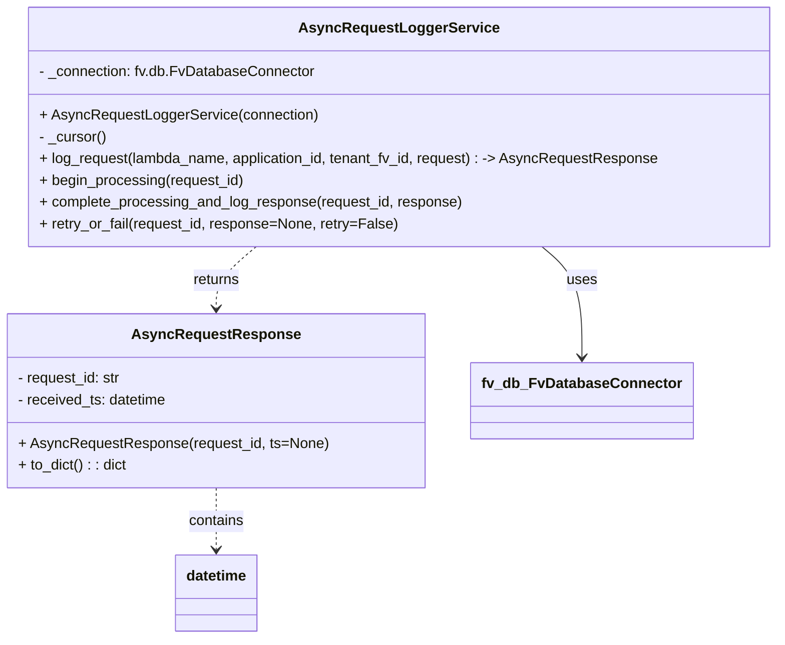

# Diagram: shipment_core/shipment_service/shipment_service/fvshared/async_request.py


> Auto-generated by Obscura crawlers

## Diagram 1



### SVG

<svg id="container" width="842.580078125" xmlns="http://www.w3.org/2000/svg" class="classDiagram" height="704" viewBox="0 0 842.580078125 704" role="graphics-document document" aria-roledescription="class"><style>#container{font-family:"trebuchet ms",verdana,arial,sans-serif;font-size:16px;fill:#333;}@keyframes edge-animation-frame{from{stroke-dashoffset:0;}}@keyframes dash{to{stroke-dashoffset:0;}}#container .edge-animation-slow{stroke-dasharray:9,5!important;stroke-dashoffset:900;animation:dash 50s linear infinite;stroke-linecap:round;}#container .edge-animation-fast{stroke-dasharray:9,5!important;stroke-dashoffset:900;animation:dash 20s linear infinite;stroke-linecap:round;}#container .error-icon{fill:#552222;}#container .error-text{fill:#552222;stroke:#552222;}#container .edge-thickness-normal{stroke-width:1px;}#container .edge-thickness-thick{stroke-width:3.5px;}#container .edge-pattern-solid{stroke-dasharray:0;}#container .edge-thickness-invisible{stroke-width:0;fill:none;}#container .edge-pattern-dashed{stroke-dasharray:3;}#container .edge-pattern-dotted{stroke-dasharray:2;}#container .marker{fill:#333333;stroke:#333333;}#container .marker.cross{stroke:#333333;}#container svg{font-family:"trebuchet ms",verdana,arial,sans-serif;font-size:16px;}#container p{margin:0;}#container g.classGroup text{fill:#9370DB;stroke:none;font-family:"trebuchet ms",verdana,arial,sans-serif;font-size:10px;}#container g.classGroup text .title{font-weight:bolder;}#container .nodeLabel,#container .edgeLabel{color:#131300;}#container .edgeLabel .label rect{fill:#ECECFF;}#container .label text{fill:#131300;}#container .labelBkg{background:#ECECFF;}#container .edgeLabel .label span{background:#ECECFF;}#container .classTitle{font-weight:bolder;}#container .node rect,#container .node circle,#container .node ellipse,#container .node polygon,#container .node path{fill:#ECECFF;stroke:#9370DB;stroke-width:1px;}#container .divider{stroke:#9370DB;stroke-width:1;}#container g.clickable{cursor:pointer;}#container g.classGroup rect{fill:#ECECFF;stroke:#9370DB;}#container g.classGroup line{stroke:#9370DB;stroke-width:1;}#container .classLabel .box{stroke:none;stroke-width:0;fill:#ECECFF;opacity:0.5;}#container .classLabel .label{fill:#9370DB;font-size:10px;}#container .relation{stroke:#333333;stroke-width:1;fill:none;}#container .dashed-line{stroke-dasharray:3;}#container .dotted-line{stroke-dasharray:1 2;}#container #compositionStart,#container .composition{fill:#333333!important;stroke:#333333!important;stroke-width:1;}#container #compositionEnd,#container .composition{fill:#333333!important;stroke:#333333!important;stroke-width:1;}#container #dependencyStart,#container .dependency{fill:#333333!important;stroke:#333333!important;stroke-width:1;}#container #dependencyStart,#container .dependency{fill:#333333!important;stroke:#333333!important;stroke-width:1;}#container #extensionStart,#container .extension{fill:transparent!important;stroke:#333333!important;stroke-width:1;}#container #extensionEnd,#container .extension{fill:transparent!important;stroke:#333333!important;stroke-width:1;}#container #aggregationStart,#container .aggregation{fill:transparent!important;stroke:#333333!important;stroke-width:1;}#container #aggregationEnd,#container .aggregation{fill:transparent!important;stroke:#333333!important;stroke-width:1;}#container #lollipopStart,#container .lollipop{fill:#ECECFF!important;stroke:#333333!important;stroke-width:1;}#container #lollipopEnd,#container .lollipop{fill:#ECECFF!important;stroke:#333333!important;stroke-width:1;}#container .edgeTerminals{font-size:11px;line-height:initial;}#container .classTitleText{text-anchor:middle;font-size:18px;fill:#333;}#container .label-icon{display:inline-block;height:1em;overflow:visible;vertical-align:-0.125em;}#container .node .label-icon path{fill:currentColor;stroke:revert;stroke-width:revert;}#container :root{--mermaid-font-family:"trebuchet ms",verdana,arial,sans-serif;}</style><g><defs><marker id="container_class-aggregationStart" class="marker aggregation class" refX="18" refY="7" markerWidth="190" markerHeight="240" orient="auto"><path d="M 18,7 L9,13 L1,7 L9,1 Z"></path></marker></defs><defs><marker id="container_class-aggregationEnd" class="marker aggregation class" refX="1" refY="7" markerWidth="20" markerHeight="28" orient="auto"><path d="M 18,7 L9,13 L1,7 L9,1 Z"></path></marker></defs><defs><marker id="container_class-extensionStart" class="marker extension class" refX="18" refY="7" markerWidth="190" markerHeight="240" orient="auto"><path d="M 1,7 L18,13 V 1 Z"></path></marker></defs><defs><marker id="container_class-extensionEnd" class="marker extension class" refX="1" refY="7" markerWidth="20" markerHeight="28" orient="auto"><path d="M 1,1 V 13 L18,7 Z"></path></marker></defs><defs><marker id="container_class-compositionStart" class="marker composition class" refX="18" refY="7" markerWidth="190" markerHeight="240" orient="auto"><path d="M 18,7 L9,13 L1,7 L9,1 Z"></path></marker></defs><defs><marker id="container_class-compositionEnd" class="marker composition class" refX="1" refY="7" markerWidth="20" markerHeight="28" orient="auto"><path d="M 18,7 L9,13 L1,7 L9,1 Z"></path></marker></defs><defs><marker id="container_class-dependencyStart" class="marker dependency class" refX="6" refY="7" markerWidth="190" markerHeight="240" orient="auto"><path d="M 5,7 L9,13 L1,7 L9,1 Z"></path></marker></defs><defs><marker id="container_class-dependencyEnd" class="marker dependency class" refX="13" refY="7" markerWidth="20" markerHeight="28" orient="auto"><path d="M 18,7 L9,13 L14,7 L9,1 Z"></path></marker></defs><defs><marker id="container_class-lollipopStart" class="marker lollipop class" refX="13" refY="7" markerWidth="190" markerHeight="240" orient="auto"><circle stroke="black" fill="transparent" cx="7" cy="7" r="6"></circle></marker></defs><defs><marker id="container_class-lollipopEnd" class="marker lollipop class" refX="1" refY="7" markerWidth="190" markerHeight="240" orient="auto"><circle stroke="black" fill="transparent" cx="7" cy="7" r="6"></circle></marker></defs><g class="root"><g class="clusters"></g><g class="edgePaths"><path d="M579.633,272L586.747,278.167C593.862,284.333,608.091,296.667,615.206,317C622.32,337.333,622.32,365.667,622.32,379.833L622.32,394" id="id_AsyncRequestLoggerService_fv_db_FvDatabaseConnector_1" class="edge-thickness-normal edge-pattern-solid relation" style=";;;" data-edge="true" data-et="edge" data-id="id_AsyncRequestLoggerService_fv_db_FvDatabaseConnector_1" data-points="W3sieCI6NTc5LjYzMjcwODQ4NzQyNiwieSI6MjcyfSx7IngiOjYyMi4zMjAzMTI1LCJ5IjozMDl9LHsieCI6NjIyLjMyMDMxMjUsInkiOjQwMH1d" marker-end="url(#container_class-dependencyEnd)"></path><path d="M232.363,538L232.363,544.167C232.363,550.333,232.363,562.667,232.363,574C232.363,585.333,232.363,595.667,232.363,600.833L232.363,606" id="id_AsyncRequestResponse_datetime_2" class="edge-thickness-normal edge-pattern-dashed relation" style=";;;" data-edge="true" data-et="edge" data-id="id_AsyncRequestResponse_datetime_2" data-points="W3sieCI6MjMyLjM2MzI4MTI1LCJ5Ijo1Mzh9LHsieCI6MjMyLjM2MzI4MTI1LCJ5Ijo1NzV9LHsieCI6MjMyLjM2MzI4MTI1LCJ5Ijo2MTJ9XQ==" marker-end="url(#container_class-dependencyEnd)"></path><path d="M275.051,272L267.936,278.167C260.822,284.333,246.592,296.667,239.478,308C232.363,319.333,232.363,329.667,232.363,334.833L232.363,340" id="id_AsyncRequestLoggerService_AsyncRequestResponse_3" class="edge-thickness-normal edge-pattern-dashed relation" style=";;;" data-edge="true" data-et="edge" data-id="id_AsyncRequestLoggerService_AsyncRequestResponse_3" data-points="W3sieCI6Mjc1LjA1MDg4NTI2MjU3Mzk2LCJ5IjoyNzJ9LHsieCI6MjMyLjM2MzI4MTI1LCJ5IjozMDl9LHsieCI6MjMyLjM2MzI4MTI1LCJ5IjozNDZ9XQ==" marker-end="url(#container_class-dependencyEnd)"></path></g><g class="edgeLabels"><g class="edgeLabel" transform="translate(622.3203125, 309)"><g class="label" data-id="id_AsyncRequestLoggerService_fv_db_FvDatabaseConnector_1" transform="translate(-16.4921875, -12)"><foreignObject width="32.984375" height="24"><div xmlns="http://www.w3.org/1999/xhtml" class="labelBkg" style="display: table-cell; white-space: nowrap; line-height: 1.5; max-width: 200px; text-align: center;"><span class="edgeLabel"><p>uses</p></span></div></foreignObject></g></g><g class="edgeLabel" transform="translate(232.36328125, 575)"><g class="label" data-id="id_AsyncRequestResponse_datetime_2" transform="translate(-30.890625, -12)"><foreignObject width="61.78125" height="24"><div xmlns="http://www.w3.org/1999/xhtml" class="labelBkg" style="display: table-cell; white-space: nowrap; line-height: 1.5; max-width: 200px; text-align: center;"><span class="edgeLabel"><p>contains</p></span></div></foreignObject></g></g><g class="edgeLabel" transform="translate(232.36328125, 309)"><g class="label" data-id="id_AsyncRequestLoggerService_AsyncRequestResponse_3" transform="translate(-26.265625, -12)"><foreignObject width="52.53125" height="24"><div xmlns="http://www.w3.org/1999/xhtml" class="labelBkg" style="display: table-cell; white-space: nowrap; line-height: 1.5; max-width: 200px; text-align: center;"><span class="edgeLabel"><p>returns</p></span></div></foreignObject></g></g></g><g class="nodes"><g class="node default" id="classId-AsyncRequestResponse-0" transform="translate(232.36328125, 442)"><g class="basic label-container"><path d="M-224.36328125 -96 L224.36328125 -96 L224.36328125 96 L-224.36328125 96" stroke="none" stroke-width="0" fill="#ECECFF" style=""></path><path d="M-224.36328125 -96 C-45.4292241849262 -96, 133.5048328801476 -96, 224.36328125 -96 M-224.36328125 -96 C-115.90547479749392 -96, -7.4476683449878465 -96, 224.36328125 -96 M224.36328125 -96 C224.36328125 -27.49410847076001, 224.36328125 41.01178305847998, 224.36328125 96 M224.36328125 -96 C224.36328125 -53.74222323358533, 224.36328125 -11.484446467170656, 224.36328125 96 M224.36328125 96 C71.22132659832874 96, -81.92062805334251 96, -224.36328125 96 M224.36328125 96 C125.32921873175349 96, 26.29515621350697 96, -224.36328125 96 M-224.36328125 96 C-224.36328125 48.12517280626773, -224.36328125 0.2503456125354546, -224.36328125 -96 M-224.36328125 96 C-224.36328125 47.58474341821431, -224.36328125 -0.830513163571382, -224.36328125 -96" stroke="#9370DB" stroke-width="1.3" fill="none" stroke-dasharray="0 0" style=""></path></g><g class="annotation-group text" transform="translate(0, -72)"></g><g class="label-group text" transform="translate(-86.4453125, -72)"><g class="label" style="font-weight: bolder" transform="translate(0,-12)"><foreignObject width="172.890625" height="24"><div xmlns="http://www.w3.org/1999/xhtml" style="display: table-cell; white-space: nowrap; line-height: 1.5; max-width: 220px; text-align: center;"><span class="nodeLabel markdown-node-label" style=""><p>AsyncRequestResponse</p></span></div></foreignObject></g></g><g class="members-group text" transform="translate(-212.36328125, -24)"><g class="label" style="" transform="translate(0,-12)"><foreignObject width="115.859375" height="24"><div xmlns="http://www.w3.org/1999/xhtml" style="display: table-cell; white-space: nowrap; line-height: 1.5; max-width: 174px; text-align: center;"><span class="nodeLabel markdown-node-label" style=""><p>- request_id: str</p></span></div></foreignObject></g><g class="label" style="" transform="translate(0,12)"><foreignObject width="166.34375" height="24"><div xmlns="http://www.w3.org/1999/xhtml" style="display: table-cell; white-space: nowrap; line-height: 1.5; max-width: 224px; text-align: center;"><span class="nodeLabel markdown-node-label" style=""><p>- received_ts: datetime</p></span></div></foreignObject></g></g><g class="methods-group text" transform="translate(-212.36328125, 48)"><g class="label" style="" transform="translate(0,-12)"><foreignObject width="338.28125" height="24"><div xmlns="http://www.w3.org/1999/xhtml" style="display: table-cell; white-space: nowrap; line-height: 1.5; max-width: 396px; text-align: center;"><span class="nodeLabel markdown-node-label" style=""><p>+ AsyncRequestResponse(request_id, ts=None)</p></span></div></foreignObject></g><g class="label" style="" transform="translate(0,12)"><foreignObject width="120.5625" height="24"><div xmlns="http://www.w3.org/1999/xhtml" style="display: table-cell; white-space: nowrap; line-height: 1.5; max-width: 178px; text-align: center;"><span class="nodeLabel markdown-node-label" style=""><p>+ to_dict() : : dict</p></span></div></foreignObject></g></g><g class="divider" style=""><path d="M-224.36328125 -48 C-134.4197584905977 -48, -44.47623573119543 -48, 224.36328125 -48 M-224.36328125 -48 C-63.05070224821307 -48, 98.26187675357386 -48, 224.36328125 -48" stroke="#9370DB" stroke-width="1.3" fill="none" stroke-dasharray="0 0" style=""></path></g><g class="divider" style=""><path d="M-224.36328125 24 C-92.90909982895025 24, 38.54508159209951 24, 224.36328125 24 M-224.36328125 24 C-79.8315376228085 24, 64.700206004383 24, 224.36328125 24" stroke="#9370DB" stroke-width="1.3" fill="none" stroke-dasharray="0 0" style=""></path></g></g><g class="node default" id="classId-AsyncRequestLoggerService-1" transform="translate(427.341796875, 140)"><g class="basic label-container"><path d="M-407.23828125 -132 L407.23828125 -132 L407.23828125 132 L-407.23828125 132" stroke="none" stroke-width="0" fill="#ECECFF" style=""></path><path d="M-407.23828125 -132 C-225.54908648412047 -132, -43.85989171824093 -132, 407.23828125 -132 M-407.23828125 -132 C-117.14643462881924 -132, 172.94541199236153 -132, 407.23828125 -132 M407.23828125 -132 C407.23828125 -57.761850265221796, 407.23828125 16.47629946955641, 407.23828125 132 M407.23828125 -132 C407.23828125 -29.158333901294625, 407.23828125 73.68333219741075, 407.23828125 132 M407.23828125 132 C190.22508530069538 132, -26.788110648609234 132, -407.23828125 132 M407.23828125 132 C114.7087955656495 132, -177.820690118701 132, -407.23828125 132 M-407.23828125 132 C-407.23828125 34.99878617811666, -407.23828125 -62.00242764376668, -407.23828125 -132 M-407.23828125 132 C-407.23828125 27.228357835398896, -407.23828125 -77.54328432920221, -407.23828125 -132" stroke="#9370DB" stroke-width="1.3" fill="none" stroke-dasharray="0 0" style=""></path></g><g class="annotation-group text" transform="translate(0, -108)"></g><g class="label-group text" transform="translate(-102.4921875, -108)"><g class="label" style="font-weight: bolder" transform="translate(0,-12)"><foreignObject width="204.984375" height="24"><div xmlns="http://www.w3.org/1999/xhtml" style="display: table-cell; white-space: nowrap; line-height: 1.5; max-width: 251px; text-align: center;"><span class="nodeLabel markdown-node-label" style=""><p>AsyncRequestLoggerService</p></span></div></foreignObject></g></g><g class="members-group text" transform="translate(-395.23828125, -60)"><g class="label" style="" transform="translate(0,-12)"><foreignObject width="303.21875" height="24"><div xmlns="http://www.w3.org/1999/xhtml" style="display: table-cell; white-space: nowrap; line-height: 1.5; max-width: 361px; text-align: center;"><span class="nodeLabel markdown-node-label" style=""><p>- _connection: fv.db.FvDatabaseConnector</p></span></div></foreignObject></g></g><g class="methods-group text" transform="translate(-395.23828125, -12)"><g class="label" style="" transform="translate(0,-12)"><foreignObject width="303.90625" height="24"><div xmlns="http://www.w3.org/1999/xhtml" style="display: table-cell; white-space: nowrap; line-height: 1.5; max-width: 361px; text-align: center;"><span class="nodeLabel markdown-node-label" style=""><p>+ AsyncRequestLoggerService(connection)</p></span></div></foreignObject></g><g class="label" style="" transform="translate(0,12)"><foreignObject width="74.796875" height="24"><div xmlns="http://www.w3.org/1999/xhtml" style="display: table-cell; white-space: nowrap; line-height: 1.5; max-width: 132px; text-align: center;"><span class="nodeLabel markdown-node-label" style=""><p>- _cursor()</p></span></div></foreignObject></g><g class="label" style="" transform="translate(0,36)"><foreignObject width="687.984375" height="24"><div xmlns="http://www.w3.org/1999/xhtml" style="display: table-cell; white-space: nowrap; line-height: 1.5; max-width: 767px; text-align: center;"><span class="nodeLabel markdown-node-label" style=""><p>+ log_request(lambda_name, application_id, tenant_fv_id, request) : -&gt; AsyncRequestResponse</p></span></div></foreignObject></g><g class="label" style="" transform="translate(0,60)"><foreignObject width="226.59375" height="24"><div xmlns="http://www.w3.org/1999/xhtml" style="display: table-cell; white-space: nowrap; line-height: 1.5; max-width: 284px; text-align: center;"><span class="nodeLabel markdown-node-label" style=""><p>+ begin_processing(request_id)</p></span></div></foreignObject></g><g class="label" style="" transform="translate(0,84)"><foreignObject width="468.53125" height="24"><div xmlns="http://www.w3.org/1999/xhtml" style="display: table-cell; white-space: nowrap; line-height: 1.5; max-width: 526px; text-align: center;"><span class="nodeLabel markdown-node-label" style=""><p>+ complete_processing_and_log_response(request_id, response)</p></span></div></foreignObject></g><g class="label" style="" transform="translate(0,108)"><foreignObject width="394.40625" height="24"><div xmlns="http://www.w3.org/1999/xhtml" style="display: table-cell; white-space: nowrap; line-height: 1.5; max-width: 452px; text-align: center;"><span class="nodeLabel markdown-node-label" style=""><p>+ retry_or_fail(request_id, response=None, retry=False)</p></span></div></foreignObject></g></g><g class="divider" style=""><path d="M-407.23828125 -84 C-228.44864644875608 -84, -49.65901164751216 -84, 407.23828125 -84 M-407.23828125 -84 C-240.56041725387874 -84, -73.88255325775748 -84, 407.23828125 -84" stroke="#9370DB" stroke-width="1.3" fill="none" stroke-dasharray="0 0" style=""></path></g><g class="divider" style=""><path d="M-407.23828125 -36 C-243.5009218952642 -36, -79.76356254052843 -36, 407.23828125 -36 M-407.23828125 -36 C-163.96696238587816 -36, 79.30435647824368 -36, 407.23828125 -36" stroke="#9370DB" stroke-width="1.3" fill="none" stroke-dasharray="0 0" style=""></path></g></g><g class="node default" id="classId-fv_db_FvDatabaseConnector-2" transform="translate(622.3203125, 442)"><g class="basic label-container"><path d="M-115.59375 -42 L115.59375 -42 L115.59375 42 L-115.59375 42" stroke="none" stroke-width="0" fill="#ECECFF" style=""></path><path d="M-115.59375 -42 C-27.2682343239141 -42, 61.0572813521718 -42, 115.59375 -42 M-115.59375 -42 C-35.62094800717392 -42, 44.351853985652156 -42, 115.59375 -42 M115.59375 -42 C115.59375 -14.623605811832618, 115.59375 12.752788376334763, 115.59375 42 M115.59375 -42 C115.59375 -10.570802949323514, 115.59375 20.85839410135297, 115.59375 42 M115.59375 42 C32.82832035571852 42, -49.937109288562965 42, -115.59375 42 M115.59375 42 C40.04604442196785 42, -35.5016611560643 42, -115.59375 42 M-115.59375 42 C-115.59375 21.9745696352165, -115.59375 1.949139270433001, -115.59375 -42 M-115.59375 42 C-115.59375 10.713632157593416, -115.59375 -20.572735684813168, -115.59375 -42" stroke="#9370DB" stroke-width="1.3" fill="none" stroke-dasharray="0 0" style=""></path></g><g class="annotation-group text" transform="translate(0, -18)"></g><g class="label-group text" transform="translate(-103.59375, -18)"><g class="label" style="font-weight: bolder" transform="translate(0,-12)"><foreignObject width="207.1875" height="24"><div xmlns="http://www.w3.org/1999/xhtml" style="display: table-cell; white-space: nowrap; line-height: 1.5; max-width: 255px; text-align: center;"><span class="nodeLabel markdown-node-label" style=""><p>fv_db_FvDatabaseConnector</p></span></div></foreignObject></g></g><g class="members-group text" transform="translate(-103.59375, 30)"></g><g class="methods-group text" transform="translate(-103.59375, 60)"></g><g class="divider" style=""><path d="M-115.59375 6 C-27.57167381314987 6, 60.45040237370026 6, 115.59375 6 M-115.59375 6 C-46.94114778913939 6, 21.711454421721214 6, 115.59375 6" stroke="#9370DB" stroke-width="1.3" fill="none" stroke-dasharray="0 0" style=""></path></g><g class="divider" style=""><path d="M-115.59375 24 C-40.07225904435373 24, 35.44923191129254 24, 115.59375 24 M-115.59375 24 C-35.674010165925864 24, 44.24572966814827 24, 115.59375 24" stroke="#9370DB" stroke-width="1.3" fill="none" stroke-dasharray="0 0" style=""></path></g></g><g class="node default" id="classId-datetime-3" transform="translate(232.36328125, 654)"><g class="basic label-container"><path d="M-45.0703125 -42 L45.0703125 -42 L45.0703125 42 L-45.0703125 42" stroke="none" stroke-width="0" fill="#ECECFF" style=""></path><path d="M-45.0703125 -42 C-12.359241485463876 -42, 20.351829529072248 -42, 45.0703125 -42 M-45.0703125 -42 C-25.002956786122017 -42, -4.935601072244033 -42, 45.0703125 -42 M45.0703125 -42 C45.0703125 -20.740921043496883, 45.0703125 0.5181579130062346, 45.0703125 42 M45.0703125 -42 C45.0703125 -17.135172598641578, 45.0703125 7.729654802716844, 45.0703125 42 M45.0703125 42 C17.4951217521034 42, -10.080068995793198 42, -45.0703125 42 M45.0703125 42 C18.990882478456804 42, -7.088547543086392 42, -45.0703125 42 M-45.0703125 42 C-45.0703125 17.67366599127085, -45.0703125 -6.6526680174583035, -45.0703125 -42 M-45.0703125 42 C-45.0703125 10.263665187746085, -45.0703125 -21.47266962450783, -45.0703125 -42" stroke="#9370DB" stroke-width="1.3" fill="none" stroke-dasharray="0 0" style=""></path></g><g class="annotation-group text" transform="translate(0, -18)"></g><g class="label-group text" transform="translate(-33.0703125, -18)"><g class="label" style="font-weight: bolder" transform="translate(0,-12)"><foreignObject width="66.140625" height="24"><div xmlns="http://www.w3.org/1999/xhtml" style="display: table-cell; white-space: nowrap; line-height: 1.5; max-width: 115px; text-align: center;"><span class="nodeLabel markdown-node-label" style=""><p>datetime</p></span></div></foreignObject></g></g><g class="members-group text" transform="translate(-33.0703125, 30)"></g><g class="methods-group text" transform="translate(-33.0703125, 60)"></g><g class="divider" style=""><path d="M-45.0703125 6 C-9.863438802887167 6, 25.343434894225666 6, 45.0703125 6 M-45.0703125 6 C-10.232712795581925 6, 24.60488690883615 6, 45.0703125 6" stroke="#9370DB" stroke-width="1.3" fill="none" stroke-dasharray="0 0" style=""></path></g><g class="divider" style=""><path d="M-45.0703125 24 C-20.538215346324147 24, 3.9938818073517055 24, 45.0703125 24 M-45.0703125 24 C-11.183376208866108 24, 22.703560082267785 24, 45.0703125 24" stroke="#9370DB" stroke-width="1.3" fill="none" stroke-dasharray="0 0" style=""></path></g></g></g></g></g></svg>

## Diagram 2

```mermaid
flowchart TB
    Start([Start])
    BuildSQL[/Prepare INSERT SQL/]
    OpenCursor{{establish_connection()\nget_cursor()}}
    Execute[Execute cursor.execute(sql, params)]
    Fetch[Fetch result: id, ts]
    CreateResponse[Create AsyncRequestResponse(id, ts)]
    CloseCursor([cursor context exits])
    End([Return AsyncRequestResponse])

    Start --> BuildSQL --> OpenCursor --> Execute --> Fetch --> CreateResponse --> CloseCursor --> End
```

> SVG rendering failed for this diagram.
