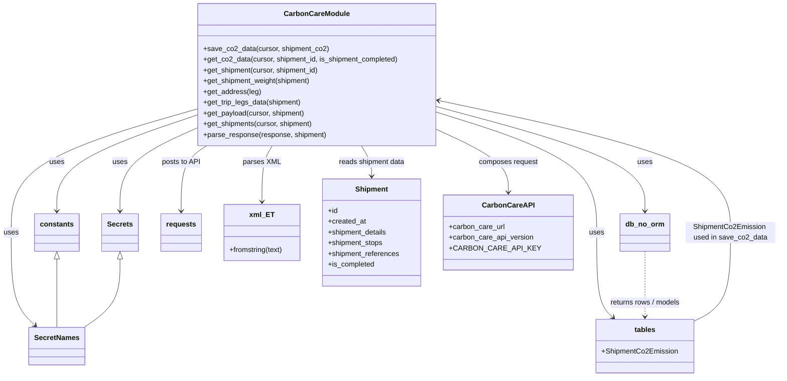

# Diagram: shipment_core/shipment_service/shipment_service/fvshared/carbon_care.py

> Auto-generated by Obscura crawlers

## Mermaid

### SVG

<svg id="container" width="1698.40625" xmlns="http://www.w3.org/2000/svg" class="classDiagram" height="842" viewBox="0 0 1698.40625 842" role="graphics-document document" aria-roledescription="class"><g><defs><marker id="container_class-aggregationStart" class="marker aggregation class" refX="18" refY="7" markerWidth="190" markerHeight="240" orient="auto"><path d="M 18,7 L9,13 L1,7 L9,1 Z"></path></marker></defs><defs><marker id="container_class-aggregationEnd" class="marker aggregation class" refX="1" refY="7" markerWidth="20" markerHeight="28" orient="auto"><path d="M 18,7 L9,13 L1,7 L9,1 Z"></path></marker></defs><defs><marker id="container_class-extensionStart" class="marker extension class" refX="18" refY="7" markerWidth="190" markerHeight="240" orient="auto"><path d="M 1,7 L18,13 V 1 Z"></path></marker></defs><defs><marker id="container_class-extensionEnd" class="marker extension class" refX="1" refY="7" markerWidth="20" markerHeight="28" orient="auto"><path d="M 1,1 V 13 L18,7 Z"></path></marker></defs><defs><marker id="container_class-compositionStart" class="marker composition class" refX="18" refY="7" markerWidth="190" markerHeight="240" orient="auto"><path d="M 18,7 L9,13 L1,7 L9,1 Z"></path></marker></defs><defs><marker id="container_class-compositionEnd" class="marker composition class" refX="1" refY="7" markerWidth="20" markerHeight="28" orient="auto"><path d="M 18,7 L9,13 L1,7 L9,1 Z"></path></marker></defs><defs><marker id="container_class-dependencyStart" class="marker dependency class" refX="6" refY="7" markerWidth="190" markerHeight="240" orient="auto"><path d="M 5,7 L9,13 L1,7 L9,1 Z"></path></marker></defs><defs><marker id="container_class-dependencyEnd" class="marker dependency class" refX="13" refY="7" markerWidth="20" markerHeight="28" orient="auto"><path d="M 18,7 L9,13 L14,7 L9,1 Z"></path></marker></defs><defs><marker id="container_class-lollipopStart" class="marker lollipop class" refX="13" refY="7" markerWidth="190" markerHeight="240" orient="auto"><circle stroke="black" fill="transparent" cx="7" cy="7" r="6"></circle></marker></defs><defs><marker id="container_class-lollipopEnd" class="marker lollipop class" refX="1" refY="7" markerWidth="190" markerHeight="240" orient="auto"><circle stroke="black" fill="transparent" cx="7" cy="7" r="6"></circle></marker></defs><g class="root"><g class="clusters"></g><g class="edgePaths"><path d="M430.141,258.115L379.077,275.596C328.013,293.077,225.885,328.038,174.822,363.686C123.758,399.333,123.758,435.667,123.758,453.833L123.758,472" id="id_CarbonCareModule_constants_1" class="edge-thickness-normal edge-pattern-solid relation" style=";;;" data-edge="true" data-et="edge" data-id="id_CarbonCareModule_constants_1" data-points="W3sieCI6NDMwLjE0MDYyNSwieSI6MjU4LjExNTI0MTA3NzcwM30seyJ4IjoxMjMuNzU3ODEyNSwieSI6MzYzfSx7IngiOjEyMy43NTc4MTI1LCJ5Ijo0Nzh9XQ==" marker-end="url(#container_class-dependencyEnd)"></path><path d="M962.461,240.917L1035.727,261.264C1108.992,281.612,1255.523,322.306,1328.789,360.82C1402.055,399.333,1402.055,435.667,1402.055,453.833L1402.055,472" id="id_CarbonCareModule_db_no_orm_2" class="edge-thickness-normal edge-pattern-solid relation" style=";;;" data-edge="true" data-et="edge" data-id="id_CarbonCareModule_db_no_orm_2" data-points="W3sieCI6OTYyLjQ2MDkzNzUsInkiOjI0MC45MTcyNTM4MjMyMDU0NH0seyJ4IjoxNDAyLjA1NDY4NzUsInkiOjM2M30seyJ4IjoxNDAyLjA1NDY4NzUsInkiOjQ3OH1d" marker-end="url(#container_class-dependencyEnd)"></path><path d="M962.461,253.814L1018.253,272.012C1074.044,290.209,1185.628,326.605,1241.419,370.969C1297.211,415.333,1297.211,467.667,1297.211,520C1297.211,572.333,1297.211,624.667,1303.142,656.321C1309.074,687.975,1320.936,698.95,1326.867,704.438L1332.799,709.925" id="id_CarbonCareModule_tables_3" class="edge-thickness-normal edge-pattern-solid relation" style=";;;" data-edge="true" data-et="edge" data-id="id_CarbonCareModule_tables_3" data-points="W3sieCI6OTYyLjQ2MDkzNzUsInkiOjI1My44MTM5NjA1OTM2MzA3NX0seyJ4IjoxMjk3LjIxMDkzNzUsInkiOjM2M30seyJ4IjoxMjk3LjIxMDkzNzUsInkiOjUyMH0seyJ4IjoxMjk3LjIxMDkzNzUsInkiOjY3N30seyJ4IjoxMzM3LjIwMjg4MzM3NjI4ODYsInkiOjcxNH1d" marker-end="url(#container_class-dependencyEnd)"></path><path d="M430.141,286.758L401.9,299.465C373.659,312.172,317.177,337.586,288.936,368.46C260.695,399.333,260.695,435.667,260.695,453.833L260.695,472" id="id_CarbonCareModule_Secrets_4" class="edge-thickness-normal edge-pattern-solid relation" style=";;;" data-edge="true" data-et="edge" data-id="id_CarbonCareModule_Secrets_4" data-points="W3sieCI6NDMwLjE0MDYyNSwieSI6Mjg2Ljc1ODM0NjQxMDc5Njh9LHsieCI6MjYwLjY5NTMxMjUsInkiOjM2M30seyJ4IjoyNjAuNjk1MzEyNSwieSI6NDc4fV0=" marker-end="url(#container_class-dependencyEnd)"></path><path d="M430.141,244.652L362.533,264.377C294.924,284.101,159.708,323.551,92.1,369.442C24.492,415.333,24.492,467.667,24.492,520C24.492,572.333,24.492,624.667,33.158,659.301C41.823,693.936,59.154,710.871,67.82,719.339L76.485,727.807" id="id_CarbonCareModule_SecretNames_5" class="edge-thickness-normal edge-pattern-solid relation" style=";;;" data-edge="true" data-et="edge" data-id="id_CarbonCareModule_SecretNames_5" data-points="W3sieCI6NDMwLjE0MDYyNSwieSI6MjQ0LjY1MjE2MzI5NTIwOTR9LHsieCI6MjQuNDkyMTg3NSwieSI6MzYzfSx7IngiOjI0LjQ5MjE4NzUsInkiOjUyMH0seyJ4IjoyNC40OTIxODc1LCJ5Ijo2Nzd9LHsieCI6ODAuNzc2ODIwMjMxOTU4NzcsInkiOjczMn1d" marker-end="url(#container_class-dependencyEnd)"></path><path d="M450.947,326L441.431,332.167C431.915,338.333,412.883,350.667,403.367,375C393.852,399.333,393.852,435.667,393.852,453.833L393.852,472" id="id_CarbonCareModule_requests_6" class="edge-thickness-normal edge-pattern-solid relation" style=";;;" data-edge="true" data-et="edge" data-id="id_CarbonCareModule_requests_6" data-points="W3sieCI6NDUwLjk0NjU2ODA4MDM1NzEsInkiOjMyNn0seyJ4IjozOTMuODUxNTYyNSwieSI6MzYzfSx7IngiOjM5My44NTE1NjI1LCJ5Ijo0Nzh9XQ==" marker-end="url(#container_class-dependencyEnd)"></path><path d="M596.732,326L592.871,332.167C589.009,338.333,581.286,350.667,577.424,371.5C573.563,392.333,573.563,421.667,573.563,436.333L573.563,451" id="id_CarbonCareModule_xml_ET_7" class="edge-thickness-normal edge-pattern-solid relation" style=";;;" data-edge="true" data-et="edge" data-id="id_CarbonCareModule_xml_ET_7" data-points="W3sieCI6NTk2LjczMjQ4MTY2NDU0MDgsInkiOjMyNn0seyJ4Ijo1NzMuNTYyNSwieSI6MzYzfSx7IngiOjU3My41NjI1LCJ5Ijo0NTd9XQ==" marker-end="url(#container_class-dependencyEnd)"></path><path d="M1402.055,562L1402.055,581.167C1402.055,600.333,1402.055,638.667,1402.055,663C1402.055,687.333,1402.055,697.667,1402.055,702.833L1402.055,708" id="id_db_no_orm_tables_8" class="edge-thickness-normal edge-pattern-dashed relation" style=";;;" data-edge="true" data-et="edge" data-id="id_db_no_orm_tables_8" data-points="W3sieCI6MTQwMi4wNTQ2ODc1LCJ5Ijo1NjJ9LHsieCI6MTQwMi4wNTQ2ODc1LCJ5Ijo2Nzd9LHsieCI6MTQwMi4wNTQ2ODc1LCJ5Ijo3MTR9XQ==" marker-end="url(#container_class-dependencyEnd)"></path><path d="M1509.074,718.886L1522.63,711.905C1536.185,704.924,1563.296,690.962,1576.851,657.814C1590.406,624.667,1590.406,572.333,1590.406,520C1590.406,467.667,1590.406,415.333,1486.726,366.438C1383.045,317.544,1175.683,272.087,1072.003,249.359L968.322,226.631" id="id_tables_CarbonCareModule_9" class="edge-thickness-normal edge-pattern-solid relation" style=";;;" data-edge="true" data-et="edge" data-id="id_tables_CarbonCareModule_9" data-points="W3sieCI6MTUwOS4wNzQyMTg3NSwieSI6NzE4Ljg4NTU0MDY2OTQ1OTV9LHsieCI6MTU5MC40MDYyNSwieSI6Njc3fSx7IngiOjE1OTAuNDA2MjUsInkiOjUyMH0seyJ4IjoxNTkwLjQwNjI1LCJ5IjozNjN9LHsieCI6OTYyLjQ2MDkzNzUsInkiOjIyNS4zNDU5MDI2MzQ4Nzg2fV0=" marker-end="url(#container_class-dependencyEnd)"></path><path d="M123.758,579.25L123.758,595.542C123.758,611.833,123.758,644.417,123.758,669.875C123.758,695.333,123.758,713.667,123.758,722.833L123.758,732" id="id_constants_SecretNames_10" class="edge-thickness-normal edge-pattern-solid relation" style=";;;" data-edge="true" data-et="edge" data-id="id_constants_SecretNames_10" data-points="W3sieCI6MTIzLjc1NzgxMjUsInkiOjU2Mn0seyJ4IjoxMjMuNzU3ODEyNSwieSI6Njc3fSx7IngiOjEyMy43NTc4MTI1LCJ5Ijo3MzJ9XQ==" marker-start="url(#container_class-extensionStart)"></path><path d="M260.695,579.25L260.695,595.542C260.695,611.833,260.695,644.417,247.754,669.875C234.814,695.333,208.932,713.667,195.991,722.833L183.05,732" id="id_Secrets_SecretNames_11" class="edge-thickness-normal edge-pattern-solid relation" style=";;;" data-edge="true" data-et="edge" data-id="id_Secrets_SecretNames_11" data-points="W3sieCI6MjYwLjY5NTMxMjUsInkiOjU2Mn0seyJ4IjoyNjAuNjk1MzEyNSwieSI6Njc3fSx7IngiOjE4My4wNTAzMzgyNzMxOTU4OCwieSI6NzMyfV0=" marker-start="url(#container_class-extensionStart)"></path><path d="M795.869,326L799.731,332.167C803.592,338.333,811.316,350.667,815.177,362C819.039,373.333,819.039,383.667,819.039,388.833L819.039,394" id="id_CarbonCareModule_Shipment_12" class="edge-thickness-normal edge-pattern-solid relation" style=";;;" data-edge="true" data-et="edge" data-id="id_CarbonCareModule_Shipment_12" data-points="W3sieCI6Nzk1Ljg2OTA4MDgzNTQ1OTIsInkiOjMyNn0seyJ4Ijo4MTkuMDM5MDYyNSwieSI6MzYzfSx7IngiOjgxOS4wMzkwNjI1LCJ5Ijo0MDB9XQ==" marker-end="url(#container_class-dependencyEnd)"></path><path d="M962.461,292.415L987.427,304.179C1012.393,315.944,1062.326,339.472,1087.292,362.403C1112.258,385.333,1112.258,407.667,1112.258,418.833L1112.258,430" id="id_CarbonCareModule_CarbonCareAPI_13" class="edge-thickness-normal edge-pattern-solid relation" style=";;;" data-edge="true" data-et="edge" data-id="id_CarbonCareModule_CarbonCareAPI_13" data-points="W3sieCI6OTYyLjQ2MDkzNzUsInkiOjI5Mi40MTUzMzU0OTMyNjJ9LHsieCI6MTExMi4yNTc4MTI1LCJ5IjozNjN9LHsieCI6MTExMi4yNTc4MTI1LCJ5Ijo0MzZ9XQ==" marker-end="url(#container_class-dependencyEnd)"></path></g><g class="edgeLabels"><g class="edgeLabel" transform="translate(123.7578125, 363)"><g class="label" data-id="id_CarbonCareModule_constants_1" transform="translate(-16.4921875, -12)"><foreignObject width="32.984375" height="24">

uses

</foreignObject></g></g><g class="edgeLabel" transform="translate(1402.0546875, 363)"><g class="label" data-id="id_CarbonCareModule_db_no_orm_2" transform="translate(-16.4921875, -12)"><foreignObject width="32.984375" height="24">

uses

</foreignObject></g></g><g class="edgeLabel" transform="translate(1297.2109375, 520)"><g class="label" data-id="id_CarbonCareModule_tables_3" transform="translate(-16.4921875, -12)"><foreignObject width="32.984375" height="24">

uses

</foreignObject></g></g><g class="edgeLabel" transform="translate(260.6953125, 363)"><g class="label" data-id="id_CarbonCareModule_Secrets_4" transform="translate(-16.4921875, -12)"><foreignObject width="32.984375" height="24">

uses

</foreignObject></g></g><g class="edgeLabel" transform="translate(24.4921875, 520)"><g class="label" data-id="id_CarbonCareModule_SecretNames_5" transform="translate(-16.4921875, -12)"><foreignObject width="32.984375" height="24">

uses

</foreignObject></g></g><g class="edgeLabel" transform="translate(393.8515625, 363)"><g class="label" data-id="id_CarbonCareModule_requests_6" transform="translate(-43.0625, -12)"><foreignObject width="86.125" height="24">

posts to API

</foreignObject></g></g><g class="edgeLabel" transform="translate(573.5625, 363)"><g class="label" data-id="id_CarbonCareModule_xml_ET_7" transform="translate(-40.4765625, -12)"><foreignObject width="80.953125" height="24">

parses XML

</foreignObject></g></g><g class="edgeLabel" transform="translate(1402.0546875, 677)"><g class="label" data-id="id_db_no_orm_tables_8" transform="translate(-80.53125, -12)"><foreignObject width="161.0625" height="24">

returns rows / models

</foreignObject></g></g><g class="edgeLabel" transform="translate(1590.40625, 520)"><g class="label" data-id="id_tables_CarbonCareModule_9" transform="translate(-100, -24)"><foreignObject width="200" height="48">

ShipmentCo2Emission used in save_co2_data

</foreignObject></g></g><g class="edgeLabel"><g class="label" data-id="id_constants_SecretNames_10" transform="translate(0, 0)"><foreignObject width="0" height="0">

</foreignObject></g></g><g class="edgeLabel"><g class="label" data-id="id_Secrets_SecretNames_11" transform="translate(0, 0)"><foreignObject width="0" height="0">

</foreignObject></g></g><g class="edgeLabel" transform="translate(819.0390625, 363)"><g class="label" data-id="id_CarbonCareModule_Shipment_12" transform="translate(-74.7890625, -12)"><foreignObject width="149.578125" height="24">

reads shipment data

</foreignObject></g></g><g class="edgeLabel" transform="translate(1112.2578125, 363)"><g class="label" data-id="id_CarbonCareModule_CarbonCareAPI_13" transform="translate(-66.203125, -12)"><foreignObject width="132.40625" height="24">

composes request

</foreignObject></g></g></g><g class="nodes"><g class="node default" id="classId-CarbonCareModule-0" transform="translate(696.30078125, 167)"><g class="basic label-container"><path d="M-266.16015625 -159 L266.16015625 -159 L266.16015625 159 L-266.16015625 159" stroke="none" stroke-width="0" fill="#ECECFF" style=""></path><path d="M-266.16015625 -159 C-71.94659296723049 -159, 122.26697031553903 -159, 266.16015625 -159 M-266.16015625 -159 C-114.83343925803368 -159, 36.49327773393264 -159, 266.16015625 -159 M266.16015625 -159 C266.16015625 -59.062196461597594, 266.16015625 40.87560707680481, 266.16015625 159 M266.16015625 -159 C266.16015625 -84.02667557868492, 266.16015625 -9.053351157369832, 266.16015625 159 M266.16015625 159 C88.69687770264846 159, -88.76640084470307 159, -266.16015625 159 M266.16015625 159 C139.51213546381143 159, 12.864114677622865 159, -266.16015625 159 M-266.16015625 159 C-266.16015625 92.46885941378082, -266.16015625 25.93771882756164, -266.16015625 -159 M-266.16015625 159 C-266.16015625 32.480210489903556, -266.16015625 -94.03957902019289, -266.16015625 -159" stroke="#9370DB" stroke-width="1.3" fill="none" stroke-dasharray="0 0" style=""></path></g><g class="annotation-group text" transform="translate(0, -135)"></g><g class="label-group text" transform="translate(-69.5546875, -135)"><g class="label" style="font-weight: bolder" transform="translate(0,-12)"><foreignObject width="139.109375" height="24">

CarbonCareModule

</foreignObject></g></g><g class="members-group text" transform="translate(-254.16015625, -87)"></g><g class="methods-group text" transform="translate(-254.16015625, -57)"><g class="label" style="" transform="translate(0,-12)"><foreignObject width="276.5" height="24">

+save_co2_data(cursor, shipment_co2)

</foreignObject></g><g class="label" style="" transform="translate(0,12)"><foreignObject width="438.765625" height="24">

+get_co2_data(cursor, shipment_id, is_shipment_completed)

</foreignObject></g><g class="label" style="" transform="translate(0,36)"><foreignObject width="261.0625" height="24">

+get_shipment(cursor, shipment_id)

</foreignObject></g><g class="label" style="" transform="translate(0,60)"><foreignObject width="242.3125" height="24">

+get_shipment_weight(shipment)

</foreignObject></g><g class="label" style="" transform="translate(0,84)"><foreignObject width="127.609375" height="24">

+get_address(leg)

</foreignObject></g><g class="label" style="" transform="translate(0,108)"><foreignObject width="220.5" height="24">

+get_trip_legs_data(shipment)

</foreignObject></g><g class="label" style="" transform="translate(0,132)"><foreignObject width="227.953125" height="24">

+get_payload(cursor, shipment)

</foreignObject></g><g class="label" style="" transform="translate(0,156)"><foreignObject width="246.140625" height="24">

+get_shipments(cursor, shipment)

</foreignObject></g><g class="label" style="" transform="translate(0,180)"><foreignObject width="275.515625" height="24">

+parse_response(response, shipment)

</foreignObject></g></g><g class="divider" style=""><path d="M-266.16015625 -111 C-98.92403873445818 -111, 68.31207878108364 -111, 266.16015625 -111 M-266.16015625 -111 C-62.687768049330685 -111, 140.78462015133863 -111, 266.16015625 -111" stroke="#9370DB" stroke-width="1.3" fill="none" stroke-dasharray="0 0" style=""></path></g><g class="divider" style=""><path d="M-266.16015625 -87 C-141.62645124083093 -87, -17.092746231661835 -87, 266.16015625 -87 M-266.16015625 -87 C-122.95056581722437 -87, 20.259024615551255 -87, 266.16015625 -87" stroke="#9370DB" stroke-width="1.3" fill="none" stroke-dasharray="0 0" style=""></path></g></g><g class="node default" id="classId-constants-1" transform="translate(123.7578125, 520)"><g class="basic label-container"><path d="M-47.7734375 -42 L47.7734375 -42 L47.7734375 42 L-47.7734375 42" stroke="none" stroke-width="0" fill="#ECECFF" style=""></path><path d="M-47.7734375 -42 C-18.679383568777258 -42, 10.414670362445484 -42, 47.7734375 -42 M-47.7734375 -42 C-17.106396231201106 -42, 13.560645037597787 -42, 47.7734375 -42 M47.7734375 -42 C47.7734375 -23.322558912181584, 47.7734375 -4.645117824363169, 47.7734375 42 M47.7734375 -42 C47.7734375 -22.245497923355707, 47.7734375 -2.4909958467114137, 47.7734375 42 M47.7734375 42 C23.0528594294592 42, -1.6677186410815992 42, -47.7734375 42 M47.7734375 42 C11.227605274005754 42, -25.318226951988493 42, -47.7734375 42 M-47.7734375 42 C-47.7734375 22.05368988975045, -47.7734375 2.107379779500903, -47.7734375 -42 M-47.7734375 42 C-47.7734375 23.75461551644581, -47.7734375 5.50923103289162, -47.7734375 -42" stroke="#9370DB" stroke-width="1.3" fill="none" stroke-dasharray="0 0" style=""></path></g><g class="annotation-group text" transform="translate(0, -18)"></g><g class="label-group text" transform="translate(-35.7734375, -18)"><g class="label" style="font-weight: bolder" transform="translate(0,-12)"><foreignObject width="71.546875" height="24">

constants

</foreignObject></g></g><g class="members-group text" transform="translate(-35.7734375, 30)"></g><g class="methods-group text" transform="translate(-35.7734375, 60)"></g><g class="divider" style=""><path d="M-47.7734375 6 C-12.591788068695344 6, 22.589861362609312 6, 47.7734375 6 M-47.7734375 6 C-22.971273025208735 6, 1.8308914495825306 6, 47.7734375 6" stroke="#9370DB" stroke-width="1.3" fill="none" stroke-dasharray="0 0" style=""></path></g><g class="divider" style=""><path d="M-47.7734375 24 C-18.0519528648209 24, 11.669531770358198 24, 47.7734375 24 M-47.7734375 24 C-17.476903084109537 24, 12.819631331780926 24, 47.7734375 24" stroke="#9370DB" stroke-width="1.3" fill="none" stroke-dasharray="0 0" style=""></path></g></g><g class="node default" id="classId-db_no_orm-2" transform="translate(1402.0546875, 520)"><g class="basic label-container"><path d="M-53.3515625 -42 L53.3515625 -42 L53.3515625 42 L-53.3515625 42" stroke="none" stroke-width="0" fill="#ECECFF" style=""></path><path d="M-53.3515625 -42 C-22.782778794773968 -42, 7.786004910452064 -42, 53.3515625 -42 M-53.3515625 -42 C-27.78817461248317 -42, -2.224786724966343 -42, 53.3515625 -42 M53.3515625 -42 C53.3515625 -21.36752532194241, 53.3515625 -0.7350506438848186, 53.3515625 42 M53.3515625 -42 C53.3515625 -14.99715042934562, 53.3515625 12.00569914130876, 53.3515625 42 M53.3515625 42 C21.2184010648853 42, -10.914760370229402 42, -53.3515625 42 M53.3515625 42 C18.306687420516766 42, -16.738187658966467 42, -53.3515625 42 M-53.3515625 42 C-53.3515625 21.294989282941163, -53.3515625 0.5899785658823262, -53.3515625 -42 M-53.3515625 42 C-53.3515625 22.279492291146738, -53.3515625 2.5589845822934763, -53.3515625 -42" stroke="#9370DB" stroke-width="1.3" fill="none" stroke-dasharray="0 0" style=""></path></g><g class="annotation-group text" transform="translate(0, -18)"></g><g class="label-group text" transform="translate(-41.3515625, -18)"><g class="label" style="font-weight: bolder" transform="translate(0,-12)"><foreignObject width="82.703125" height="24">

db_no_orm

</foreignObject></g></g><g class="members-group text" transform="translate(-41.3515625, 30)"></g><g class="methods-group text" transform="translate(-41.3515625, 60)"></g><g class="divider" style=""><path d="M-53.3515625 6 C-23.77130084919067 6, 5.80896080161866 6, 53.3515625 6 M-53.3515625 6 C-18.975936554919087 6, 15.399689390161825 6, 53.3515625 6" stroke="#9370DB" stroke-width="1.3" fill="none" stroke-dasharray="0 0" style=""></path></g><g class="divider" style=""><path d="M-53.3515625 24 C-30.756138632514766 24, -8.160714765029532 24, 53.3515625 24 M-53.3515625 24 C-14.83202281104871 24, 23.68751687790258 24, 53.3515625 24" stroke="#9370DB" stroke-width="1.3" fill="none" stroke-dasharray="0 0" style=""></path></g></g><g class="node default" id="classId-tables-3" transform="translate(1402.0546875, 774)"><g class="basic label-container"><path d="M-107.01953125 -60 L107.01953125 -60 L107.01953125 60 L-107.01953125 60" stroke="none" stroke-width="0" fill="#ECECFF" style=""></path><path d="M-107.01953125 -60 C-53.75431436718509 -60, -0.48909748437017697 -60, 107.01953125 -60 M-107.01953125 -60 C-58.10354770880407 -60, -9.187564167608144 -60, 107.01953125 -60 M107.01953125 -60 C107.01953125 -34.40426362950868, 107.01953125 -8.808527259017346, 107.01953125 60 M107.01953125 -60 C107.01953125 -15.499066245485864, 107.01953125 29.001867509028273, 107.01953125 60 M107.01953125 60 C56.710086931674034 60, 6.400642613348069 60, -107.01953125 60 M107.01953125 60 C30.7828293974719 60, -45.4538724550562 60, -107.01953125 60 M-107.01953125 60 C-107.01953125 21.652735239991927, -107.01953125 -16.694529520016147, -107.01953125 -60 M-107.01953125 60 C-107.01953125 22.015305324002988, -107.01953125 -15.969389351994025, -107.01953125 -60" stroke="#9370DB" stroke-width="1.3" fill="none" stroke-dasharray="0 0" style=""></path></g><g class="annotation-group text" transform="translate(0, -36)"></g><g class="label-group text" transform="translate(-22.7734375, -36)"><g class="label" style="font-weight: bolder" transform="translate(0,-12)"><foreignObject width="45.546875" height="24">

tables

</foreignObject></g></g><g class="members-group text" transform="translate(-95.01953125, 12)"><g class="label" style="" transform="translate(0,-12)"><foreignObject width="167.265625" height="24">

+ShipmentCo2Emission

</foreignObject></g></g><g class="methods-group text" transform="translate(-95.01953125, 60)"></g><g class="divider" style=""><path d="M-107.01953125 -12 C-49.69913791548706 -12, 7.621255419025886 -12, 107.01953125 -12 M-107.01953125 -12 C-44.14625574307494 -12, 18.727019763850123 -12, 107.01953125 -12" stroke="#9370DB" stroke-width="1.3" fill="none" stroke-dasharray="0 0" style=""></path></g><g class="divider" style=""><path d="M-107.01953125 36 C-50.85371219991243 36, 5.312106850175141 36, 107.01953125 36 M-107.01953125 36 C-53.16716198683976 36, 0.6852072763204831 36, 107.01953125 36" stroke="#9370DB" stroke-width="1.3" fill="none" stroke-dasharray="0 0" style=""></path></g></g><g class="node default" id="classId-Secrets-4" transform="translate(260.6953125, 520)"><g class="basic label-container"><path d="M-39.1640625 -42 L39.1640625 -42 L39.1640625 42 L-39.1640625 42" stroke="none" stroke-width="0" fill="#ECECFF" style=""></path><path d="M-39.1640625 -42 C-13.219859816099383 -42, 12.724342867801234 -42, 39.1640625 -42 M-39.1640625 -42 C-8.113381489620306 -42, 22.93729952075939 -42, 39.1640625 -42 M39.1640625 -42 C39.1640625 -11.393069723686995, 39.1640625 19.21386055262601, 39.1640625 42 M39.1640625 -42 C39.1640625 -12.773725056535017, 39.1640625 16.452549886929965, 39.1640625 42 M39.1640625 42 C18.73966680625546 42, -1.6847288874890793 42, -39.1640625 42 M39.1640625 42 C11.013650841195226 42, -17.13676081760955 42, -39.1640625 42 M-39.1640625 42 C-39.1640625 15.241223819207406, -39.1640625 -11.517552361585189, -39.1640625 -42 M-39.1640625 42 C-39.1640625 25.08787144036516, -39.1640625 8.175742880730319, -39.1640625 -42" stroke="#9370DB" stroke-width="1.3" fill="none" stroke-dasharray="0 0" style=""></path></g><g class="annotation-group text" transform="translate(0, -18)"></g><g class="label-group text" transform="translate(-27.1640625, -18)"><g class="label" style="font-weight: bolder" transform="translate(0,-12)"><foreignObject width="54.328125" height="24">

Secrets

</foreignObject></g></g><g class="members-group text" transform="translate(-27.1640625, 30)"></g><g class="methods-group text" transform="translate(-27.1640625, 60)"></g><g class="divider" style=""><path d="M-39.1640625 6 C-15.686995505195991 6, 7.790071489608017 6, 39.1640625 6 M-39.1640625 6 C-17.44027289809322 6, 4.283516703813561 6, 39.1640625 6" stroke="#9370DB" stroke-width="1.3" fill="none" stroke-dasharray="0 0" style=""></path></g><g class="divider" style=""><path d="M-39.1640625 24 C-8.010646457447617 24, 23.142769585104766 24, 39.1640625 24 M-39.1640625 24 C-9.357663571330143 24, 20.448735357339714 24, 39.1640625 24" stroke="#9370DB" stroke-width="1.3" fill="none" stroke-dasharray="0 0" style=""></path></g></g><g class="node default" id="classId-SecretNames-5" transform="translate(123.7578125, 774)"><g class="basic label-container"><path d="M-60.03125 -42 L60.03125 -42 L60.03125 42 L-60.03125 42" stroke="none" stroke-width="0" fill="#ECECFF" style=""></path><path d="M-60.03125 -42 C-26.039739412689677 -42, 7.951771174620646 -42, 60.03125 -42 M-60.03125 -42 C-23.13701372058354 -42, 13.757222558832922 -42, 60.03125 -42 M60.03125 -42 C60.03125 -17.602965375953968, 60.03125 6.794069248092065, 60.03125 42 M60.03125 -42 C60.03125 -23.693334144553315, 60.03125 -5.38666828910663, 60.03125 42 M60.03125 42 C14.25648265471883 42, -31.51828469056234 42, -60.03125 42 M60.03125 42 C20.27491585096005 42, -19.4814182980799 42, -60.03125 42 M-60.03125 42 C-60.03125 18.068765414775918, -60.03125 -5.862469170448165, -60.03125 -42 M-60.03125 42 C-60.03125 12.111536691789244, -60.03125 -17.776926616421513, -60.03125 -42" stroke="#9370DB" stroke-width="1.3" fill="none" stroke-dasharray="0 0" style=""></path></g><g class="annotation-group text" transform="translate(0, -18)"></g><g class="label-group text" transform="translate(-48.03125, -18)"><g class="label" style="font-weight: bolder" transform="translate(0,-12)"><foreignObject width="96.0625" height="24">

SecretNames

</foreignObject></g></g><g class="members-group text" transform="translate(-48.03125, 30)"></g><g class="methods-group text" transform="translate(-48.03125, 60)"></g><g class="divider" style=""><path d="M-60.03125 6 C-12.405358607699881 6, 35.22053278460024 6, 60.03125 6 M-60.03125 6 C-26.768295761736915 6, 6.494658476526169 6, 60.03125 6" stroke="#9370DB" stroke-width="1.3" fill="none" stroke-dasharray="0 0" style=""></path></g><g class="divider" style=""><path d="M-60.03125 24 C-18.87303874012342 24, 22.28517251975316 24, 60.03125 24 M-60.03125 24 C-14.290188119157165 24, 31.45087376168567 24, 60.03125 24" stroke="#9370DB" stroke-width="1.3" fill="none" stroke-dasharray="0 0" style=""></path></g></g><g class="node default" id="classId-requests-6" transform="translate(393.8515625, 520)"><g class="basic label-container"><path d="M-43.9921875 -42 L43.9921875 -42 L43.9921875 42 L-43.9921875 42" stroke="none" stroke-width="0" fill="#ECECFF" style=""></path><path d="M-43.9921875 -42 C-14.118156236027865 -42, 15.75587502794427 -42, 43.9921875 -42 M-43.9921875 -42 C-15.887183456503195 -42, 12.21782058699361 -42, 43.9921875 -42 M43.9921875 -42 C43.9921875 -11.864459179214492, 43.9921875 18.271081641571016, 43.9921875 42 M43.9921875 -42 C43.9921875 -18.07573944055126, 43.9921875 5.84852111889748, 43.9921875 42 M43.9921875 42 C18.60228737650828 42, -6.7876127469834415 42, -43.9921875 42 M43.9921875 42 C13.501558697711921 42, -16.989070104576157 42, -43.9921875 42 M-43.9921875 42 C-43.9921875 23.088526394888596, -43.9921875 4.177052789777193, -43.9921875 -42 M-43.9921875 42 C-43.9921875 8.780929568526979, -43.9921875 -24.438140862946042, -43.9921875 -42" stroke="#9370DB" stroke-width="1.3" fill="none" stroke-dasharray="0 0" style=""></path></g><g class="annotation-group text" transform="translate(0, -18)"></g><g class="label-group text" transform="translate(-31.9921875, -18)"><g class="label" style="font-weight: bolder" transform="translate(0,-12)"><foreignObject width="63.984375" height="24">

requests

</foreignObject></g></g><g class="members-group text" transform="translate(-31.9921875, 30)"></g><g class="methods-group text" transform="translate(-31.9921875, 60)"></g><g class="divider" style=""><path d="M-43.9921875 6 C-12.709013349882625 6, 18.57416080023475 6, 43.9921875 6 M-43.9921875 6 C-10.446544873100443 6, 23.099097753799114 6, 43.9921875 6" stroke="#9370DB" stroke-width="1.3" fill="none" stroke-dasharray="0 0" style=""></path></g><g class="divider" style=""><path d="M-43.9921875 24 C-13.852771163447354 24, 16.286645173105292 24, 43.9921875 24 M-43.9921875 24 C-23.836250574217907 24, -3.6803136484358134 24, 43.9921875 24" stroke="#9370DB" stroke-width="1.3" fill="none" stroke-dasharray="0 0" style=""></path></g></g><g class="node default" id="classId-xml_ET-7" transform="translate(573.5625, 520)"><g class="basic label-container"><path d="M-85.71875 -63 L85.71875 -63 L85.71875 63 L-85.71875 63" stroke="none" stroke-width="0" fill="#ECECFF" style=""></path><path d="M-85.71875 -63 C-47.94294399175388 -63, -10.167137983507757 -63, 85.71875 -63 M-85.71875 -63 C-46.61531808255197 -63, -7.511886165103945 -63, 85.71875 -63 M85.71875 -63 C85.71875 -34.957518191444926, 85.71875 -6.915036382889852, 85.71875 63 M85.71875 -63 C85.71875 -20.574363066914195, 85.71875 21.85127386617161, 85.71875 63 M85.71875 63 C36.98821932017857 63, -11.742311359642855 63, -85.71875 63 M85.71875 63 C42.772238441650146 63, -0.1742731166997089 63, -85.71875 63 M-85.71875 63 C-85.71875 14.683990248831385, -85.71875 -33.63201950233723, -85.71875 -63 M-85.71875 63 C-85.71875 29.35606291864017, -85.71875 -4.28787416271966, -85.71875 -63" stroke="#9370DB" stroke-width="1.3" fill="none" stroke-dasharray="0 0" style=""></path></g><g class="annotation-group text" transform="translate(0, -39)"></g><g class="label-group text" transform="translate(-25.921875, -39)"><g class="label" style="font-weight: bolder" transform="translate(0,-12)"><foreignObject width="51.84375" height="24">

xml_ET

</foreignObject></g></g><g class="members-group text" transform="translate(-73.71875, 9)"></g><g class="methods-group text" transform="translate(-73.71875, 39)"><g class="label" style="" transform="translate(0,-12)"><foreignObject width="121.515625" height="24">

+fromstring(text)

</foreignObject></g></g><g class="divider" style=""><path d="M-85.71875 -15 C-34.4336657702515 -15, 16.851418459496998 -15, 85.71875 -15 M-85.71875 -15 C-26.521052536744243 -15, 32.676644926511514 -15, 85.71875 -15" stroke="#9370DB" stroke-width="1.3" fill="none" stroke-dasharray="0 0" style=""></path></g><g class="divider" style=""><path d="M-85.71875 9 C-45.246832221325214 9, -4.774914442650427 9, 85.71875 9 M-85.71875 9 C-21.33172299424743 9, 43.05530401150514 9, 85.71875 9" stroke="#9370DB" stroke-width="1.3" fill="none" stroke-dasharray="0 0" style=""></path></g></g><g class="node default" id="classId-Shipment-8" transform="translate(819.0390625, 520)"><g class="basic label-container"><path d="M-109.7578125 -120 L109.7578125 -120 L109.7578125 120 L-109.7578125 120" stroke="none" stroke-width="0" fill="#ECECFF" style=""></path><path d="M-109.7578125 -120 C-54.31518448828454 -120, 1.1274435234309266 -120, 109.7578125 -120 M-109.7578125 -120 C-46.21504226344264 -120, 17.32772797311472 -120, 109.7578125 -120 M109.7578125 -120 C109.7578125 -47.19953103138168, 109.7578125 25.600937937236637, 109.7578125 120 M109.7578125 -120 C109.7578125 -44.343609734268114, 109.7578125 31.312780531463773, 109.7578125 120 M109.7578125 120 C51.056566271296475 120, -7.64467995740705 120, -109.7578125 120 M109.7578125 120 C37.78967131092641 120, -34.17846987814718 120, -109.7578125 120 M-109.7578125 120 C-109.7578125 57.167669864970435, -109.7578125 -5.66466027005913, -109.7578125 -120 M-109.7578125 120 C-109.7578125 40.34444618382754, -109.7578125 -39.311107632344914, -109.7578125 -120" stroke="#9370DB" stroke-width="1.3" fill="none" stroke-dasharray="0 0" style=""></path></g><g class="annotation-group text" transform="translate(0, -96)"></g><g class="label-group text" transform="translate(-35.109375, -96)"><g class="label" style="font-weight: bolder" transform="translate(0,-12)"><foreignObject width="70.21875" height="24">

Shipment

</foreignObject></g></g><g class="members-group text" transform="translate(-97.7578125, -48)"><g class="label" style="" transform="translate(0,-12)"><foreignObject width="22.078125" height="24">

+id

</foreignObject></g><g class="label" style="" transform="translate(0,12)"><foreignObject width="84.90625" height="24">

+created_at

</foreignObject></g><g class="label" style="" transform="translate(0,36)"><foreignObject width="133.765625" height="24">

+shipment_details

</foreignObject></g><g class="label" style="" transform="translate(0,60)"><foreignObject width="124.09375" height="24">

+shipment_stops

</foreignObject></g><g class="label" style="" transform="translate(0,84)"><foreignObject width="160.40625" height="24">

+shipment_references

</foreignObject></g><g class="label" style="" transform="translate(0,108)"><foreignObject width="104.703125" height="24">

+is_completed

</foreignObject></g></g><g class="methods-group text" transform="translate(-97.7578125, 120)"></g><g class="divider" style=""><path d="M-109.7578125 -72 C-58.3493616478016 -72, -6.940910795603202 -72, 109.7578125 -72 M-109.7578125 -72 C-46.905587342286005 -72, 15.94663781542799 -72, 109.7578125 -72" stroke="#9370DB" stroke-width="1.3" fill="none" stroke-dasharray="0 0" style=""></path></g><g class="divider" style=""><path d="M-109.7578125 96 C-52.66078483718581 96, 4.4362428256283835 96, 109.7578125 96 M-109.7578125 96 C-38.74333147773919 96, 32.27114954452162 96, 109.7578125 96" stroke="#9370DB" stroke-width="1.3" fill="none" stroke-dasharray="0 0" style=""></path></g></g><g class="node default" id="classId-CarbonCareAPI-9" transform="translate(1112.2578125, 520)"><g class="basic label-container"><path d="M-133.4609375 -84 L133.4609375 -84 L133.4609375 84 L-133.4609375 84" stroke="none" stroke-width="0" fill="#ECECFF" style=""></path><path d="M-133.4609375 -84 C-49.41702008750475 -84, 34.626897324990495 -84, 133.4609375 -84 M-133.4609375 -84 C-61.75645135554072 -84, 9.948034788918562 -84, 133.4609375 -84 M133.4609375 -84 C133.4609375 -45.12971330425527, 133.4609375 -6.2594266085105374, 133.4609375 84 M133.4609375 -84 C133.4609375 -46.07748070438701, 133.4609375 -8.154961408774014, 133.4609375 84 M133.4609375 84 C52.072050541353576 84, -29.316836417292848 84, -133.4609375 84 M133.4609375 84 C38.4198395319209 84, -56.6212584361582 84, -133.4609375 84 M-133.4609375 84 C-133.4609375 31.26277951132358, -133.4609375 -21.47444097735284, -133.4609375 -84 M-133.4609375 84 C-133.4609375 46.80406619497783, -133.4609375 9.608132389955657, -133.4609375 -84" stroke="#9370DB" stroke-width="1.3" fill="none" stroke-dasharray="0 0" style=""></path></g><g class="annotation-group text" transform="translate(0, -60)"></g><g class="label-group text" transform="translate(-54.328125, -60)"><g class="label" style="font-weight: bolder" transform="translate(0,-12)"><foreignObject width="108.65625" height="24">

CarbonCareAPI

</foreignObject></g></g><g class="members-group text" transform="translate(-121.4609375, -12)"><g class="label" style="" transform="translate(0,-12)"><foreignObject width="125.046875" height="24">

+carbon_care_url

</foreignObject></g><g class="label" style="" transform="translate(0,12)"><foreignObject width="188.59375" height="24">

+carbon_care_api_version

</foreignObject></g><g class="label" style="" transform="translate(0,36)"><foreignObject width="178.109375" height="24">

+CARBON_CARE_API_KEY

</foreignObject></g></g><g class="methods-group text" transform="translate(-121.4609375, 84)"></g><g class="divider" style=""><path d="M-133.4609375 -36 C-54.51315471999733 -36, 24.434628060005338 -36, 133.4609375 -36 M-133.4609375 -36 C-44.675440532609784 -36, 44.11005643478043 -36, 133.4609375 -36" stroke="#9370DB" stroke-width="1.3" fill="none" stroke-dasharray="0 0" style=""></path></g><g class="divider" style=""><path d="M-133.4609375 60 C-29.48865600005712 60, 74.48362549988576 60, 133.4609375 60 M-133.4609375 60 C-68.30153208063552 60, -3.1421266612710497 60, 133.4609375 60" stroke="#9370DB" stroke-width="1.3" fill="none" stroke-dasharray="0 0" style=""></path></g></g></g></g></g></svg>
