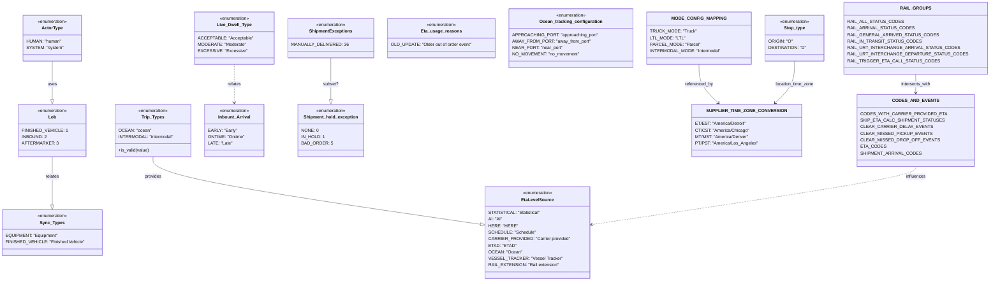

# Diagram: shipment_core/shipment_service/shipment_service/fvshared/constants.py

> Auto-generated by Obscura crawlers

## Mermaid

### SVG

<svg id="container" width="3407.16796875" xmlns="http://www.w3.org/2000/svg" class="classDiagram" height="1028" viewBox="0 0 3407.16796875 1028" role="graphics-document document" aria-roledescription="class"><g><defs><marker id="container_class-aggregationStart" class="marker aggregation class" refX="18" refY="7" markerWidth="190" markerHeight="240" orient="auto"><path d="M 18,7 L9,13 L1,7 L9,1 Z"></path></marker></defs><defs><marker id="container_class-aggregationEnd" class="marker aggregation class" refX="1" refY="7" markerWidth="20" markerHeight="28" orient="auto"><path d="M 18,7 L9,13 L1,7 L9,1 Z"></path></marker></defs><defs><marker id="container_class-extensionStart" class="marker extension class" refX="18" refY="7" markerWidth="190" markerHeight="240" orient="auto"><path d="M 1,7 L18,13 V 1 Z"></path></marker></defs><defs><marker id="container_class-extensionEnd" class="marker extension class" refX="1" refY="7" markerWidth="20" markerHeight="28" orient="auto"><path d="M 1,1 V 13 L18,7 Z"></path></marker></defs><defs><marker id="container_class-compositionStart" class="marker composition class" refX="18" refY="7" markerWidth="190" markerHeight="240" orient="auto"><path d="M 18,7 L9,13 L1,7 L9,1 Z"></path></marker></defs><defs><marker id="container_class-compositionEnd" class="marker composition class" refX="1" refY="7" markerWidth="20" markerHeight="28" orient="auto"><path d="M 18,7 L9,13 L1,7 L9,1 Z"></path></marker></defs><defs><marker id="container_class-dependencyStart" class="marker dependency class" refX="6" refY="7" markerWidth="190" markerHeight="240" orient="auto"><path d="M 5,7 L9,13 L1,7 L9,1 Z"></path></marker></defs><defs><marker id="container_class-dependencyEnd" class="marker dependency class" refX="13" refY="7" markerWidth="20" markerHeight="28" orient="auto"><path d="M 18,7 L9,13 L14,7 L9,1 Z"></path></marker></defs><defs><marker id="container_class-lollipopStart" class="marker lollipop class" refX="13" refY="7" markerWidth="190" markerHeight="240" orient="auto"><circle stroke="black" fill="transparent" cx="7" cy="7" r="6"></circle></marker></defs><defs><marker id="container_class-lollipopEnd" class="marker lollipop class" refX="1" refY="7" markerWidth="190" markerHeight="240" orient="auto"><circle stroke="black" fill="transparent" cx="7" cy="7" r="6"></circle></marker></defs><g class="root"><g class="clusters"></g><g class="edgePaths"><path d="M182.754,224L182.754,238.167C182.754,252.333,182.754,280.667,182.754,304.125C182.754,327.583,182.754,346.167,182.754,355.458L182.754,364.75" id="id_ActorType_Lob_1" class="edge-thickness-normal edge-pattern-solid relation" style=";;;" data-edge="true" data-et="edge" data-id="id_ActorType_Lob_1" data-points="W3sieCI6MTgyLjc1MzkwNjI1LCJ5IjoyMjR9LHsieCI6MTgyLjc1MzkwNjI1LCJ5IjozMDl9LHsieCI6MTgyLjc1MzkwNjI1LCJ5IjozODJ9XQ==" marker-end="url(#container_class-extensionEnd)"></path><path d="M182.754,574L182.754,586.167C182.754,598.333,182.754,622.667,182.754,652.125C182.754,681.583,182.754,716.167,182.754,733.458L182.754,750.75" id="id_Lob_Sync_Types_2" class="edge-thickness-normal edge-pattern-solid relation" style=";;;" data-edge="true" data-et="edge" data-id="id_Lob_Sync_Types_2" data-points="W3sieCI6MTgyLjc1MzkwNjI1LCJ5Ijo1NzR9LHsieCI6MTgyLjc1MzkwNjI1LCJ5Ijo2NDd9LHsieCI6MTgyLjc1MzkwNjI1LCJ5Ijo3Njh9XQ==" marker-end="url(#container_class-extensionEnd)"></path><path d="M535.09,574L535.09,586.167C535.09,598.333,535.09,622.667,723.843,663.936C912.596,705.206,1290.103,763.412,1478.856,792.515L1667.61,821.617" id="id_Trip_Types_EtaLevelSource_3" class="edge-thickness-normal edge-pattern-solid relation" style=";;;" data-edge="true" data-et="edge" data-id="id_Trip_Types_EtaLevelSource_3" data-points="W3sieCI6NTM1LjA4OTg0Mzc1LCJ5Ijo1NzR9LHsieCI6NTM1LjA4OTg0Mzc1LCJ5Ijo2NDd9LHsieCI6MTY4NC42NTgyMDMxMjUsInkiOjgyNC4yNDYxMTEyMjI5MTc0fV0=" marker-end="url(#container_class-extensionEnd)"></path><path d="M1154.02,212L1154.02,228.167C1154.02,244.333,1154.02,276.667,1154.02,302.125C1154.02,327.583,1154.02,346.167,1154.02,355.458L1154.02,364.75" id="id_ShipmentExceptions_Shipment_hold_exception_4" class="edge-thickness-normal edge-pattern-solid relation" style=";;;" data-edge="true" data-et="edge" data-id="id_ShipmentExceptions_Shipment_hold_exception_4" data-points="W3sieCI6MTE1NC4wMTk1MzEyNSwieSI6MjEyfSx7IngiOjExNTQuMDE5NTMxMjUsInkiOjMwOX0seyJ4IjoxMTU0LjAxOTUzMTI1LCJ5IjozODJ9XQ==" marker-end="url(#container_class-extensionEnd)"></path><path d="M2438.008,236L2438.008,248.167C2438.008,260.333,2438.008,284.667,2449.234,308.286C2460.461,331.905,2482.914,354.81,2494.14,366.263L2505.367,377.715" id="id_MODE_CONFIG_MAPPING_SUPPLIER_TIME_ZONE_CONVERSION_5" class="edge-thickness-normal edge-pattern-solid relation" style=";;;" data-edge="true" data-et="edge" data-id="id_MODE_CONFIG_MAPPING_SUPPLIER_TIME_ZONE_CONVERSION_5" data-points="W3sieCI6MjQzOC4wMDc4MTI1LCJ5IjoyMzZ9LHsieCI6MjQzOC4wMDc4MTI1LCJ5IjozMDl9LHsieCI6MjUwOS41NjY4NDU0MTQyMDEsInkiOjM4Mn1d" marker-end="url(#container_class-dependencyEnd)"></path><path d="M3171.758,272L3171.758,278.167C3171.758,284.333,3171.758,296.667,3171.758,308C3171.758,319.333,3171.758,329.667,3171.758,334.833L3171.758,340" id="id_RAIL_GROUPS_CODES_AND_EVENTS_6" class="edge-thickness-normal edge-pattern-solid relation" style=";;;" data-edge="true" data-et="edge" data-id="id_RAIL_GROUPS_CODES_AND_EVENTS_6" data-points="W3sieCI6MzE3MS43NTc4MTI1LCJ5IjoyNzJ9LHsieCI6MzE3MS43NTc4MTI1LCJ5IjozMDl9LHsieCI6MzE3MS43NTc4MTI1LCJ5IjozNDZ9XQ==" marker-end="url(#container_class-dependencyEnd)"></path><path d="M2769.336,224L2769.336,238.167C2769.336,252.333,2769.336,280.667,2758.109,306.286C2746.883,331.905,2724.43,354.81,2713.204,366.263L2701.977,377.715" id="id_Stop_type_SUPPLIER_TIME_ZONE_CONVERSION_7" class="edge-thickness-normal edge-pattern-solid relation" style=";;;" data-edge="true" data-et="edge" data-id="id_Stop_type_SUPPLIER_TIME_ZONE_CONVERSION_7" data-points="W3sieCI6Mjc2OS4zMzU5Mzc1LCJ5IjoyMjR9LHsieCI6Mjc2OS4zMzU5Mzc1LCJ5IjozMDl9LHsieCI6MjY5Ny43NzY5MDQ1ODU3OTksInkiOjM4Mn1d" marker-end="url(#container_class-dependencyEnd)"></path><path d="M3171.758,610L3171.758,616.167C3171.758,622.333,3171.758,634.667,2984.897,670.14C2798.036,705.613,2424.315,764.226,2237.454,793.533L2050.594,822.839" id="id_CODES_AND_EVENTS_EtaLevelSource_8" class="edge-thickness-normal edge-pattern-dashed relation" style=";;;" data-edge="true" data-et="edge" data-id="id_CODES_AND_EVENTS_EtaLevelSource_8" data-points="W3sieCI6MzE3MS43NTc4MTI1LCJ5Ijo2MTB9LHsieCI6MzE3MS43NTc4MTI1LCJ5Ijo2NDd9LHsieCI6MjA0NC42NjYwMTU2MjUsInkiOjgyMy43Njg4NjA3NzA0NjQxfV0=" marker-end="url(#container_class-dependencyEnd)"></path><path d="M827.02,236L827.02,248.167C827.02,260.333,827.02,284.667,827.02,308C827.02,331.333,827.02,353.667,827.02,364.833L827.02,376" id="id_Live_Dwell_Type_Inbount_Arrival_9" class="edge-thickness-normal edge-pattern-dashed relation" style=";;;" data-edge="true" data-et="edge" data-id="id_Live_Dwell_Type_Inbount_Arrival_9" data-points="W3sieCI6ODI3LjAxOTUzMTI1LCJ5IjoyMzZ9LHsieCI6ODI3LjAxOTUzMTI1LCJ5IjozMDl9LHsieCI6ODI3LjAxOTUzMTI1LCJ5IjozODJ9XQ==" marker-end="url(#container_class-dependencyEnd)"></path></g><g class="edgeLabels"><g class="edgeLabel" transform="translate(182.75390625, 309)"><g class="label" data-id="id_ActorType_Lob_1" transform="translate(-16.4921875, -12)"><foreignObject width="32.984375" height="24">

uses

</foreignObject></g></g><g class="edgeLabel" transform="translate(182.75390625, 647)"><g class="label" data-id="id_Lob_Sync_Types_2" transform="translate(-24.734375, -12)"><foreignObject width="49.46875" height="24">

relates

</foreignObject></g></g><g class="edgeLabel" transform="translate(535.08984375, 647)"><g class="label" data-id="id_Trip_Types_EtaLevelSource_3" transform="translate(-31.3125, -12)"><foreignObject width="62.625" height="24">

provides

</foreignObject></g></g><g class="edgeLabel" transform="translate(1154.01953125, 309)"><g class="label" data-id="id_ShipmentExceptions_Shipment_hold_exception_4" transform="translate(-27.5625, -12)"><foreignObject width="55.125" height="24">

subset?

</foreignObject></g></g><g class="edgeLabel" transform="translate(2438.0078125, 309)"><g class="label" data-id="id_MODE_CONFIG_MAPPING_SUPPLIER_TIME_ZONE_CONVERSION_5" transform="translate(-51.6953125, -12)"><foreignObject width="103.390625" height="24">

referenced_by

</foreignObject></g></g><g class="edgeLabel" transform="translate(3171.7578125, 309)"><g class="label" data-id="id_RAIL_GROUPS_CODES_AND_EVENTS_6" transform="translate(-54.9921875, -12)"><foreignObject width="109.984375" height="24">

intersects_with

</foreignObject></g></g><g class="edgeLabel" transform="translate(2769.3359375, 309)"><g class="label" data-id="id_Stop_type_SUPPLIER_TIME_ZONE_CONVERSION_7" transform="translate(-71.1015625, -12)"><foreignObject width="142.203125" height="24">

location_time_zone

</foreignObject></g></g><g class="edgeLabel" transform="translate(3171.7578125, 647)"><g class="label" data-id="id_CODES_AND_EVENTS_EtaLevelSource_8" transform="translate(-37.1484375, -12)"><foreignObject width="74.296875" height="24">

influences

</foreignObject></g></g><g class="edgeLabel" transform="translate(827.01953125, 309)"><g class="label" data-id="id_Live_Dwell_Type_Inbount_Arrival_9" transform="translate(-24.734375, -12)"><foreignObject width="49.46875" height="24">

relates

</foreignObject></g></g></g><g class="nodes"><g class="node default" id="classId-ActorType-0" transform="translate(182.75390625, 140)"><g class="basic label-container"><path d="M-102.51171875 -84 L102.51171875 -84 L102.51171875 84 L-102.51171875 84" stroke="none" stroke-width="0" fill="#ECECFF" style=""></path><path d="M-102.51171875 -84 C-56.944536682879004 -84, -11.377354615758009 -84, 102.51171875 -84 M-102.51171875 -84 C-44.40004687562256 -84, 13.711624998754885 -84, 102.51171875 -84 M102.51171875 -84 C102.51171875 -30.425390400879238, 102.51171875 23.149219198241525, 102.51171875 84 M102.51171875 -84 C102.51171875 -18.47170607954554, 102.51171875 47.05658784090892, 102.51171875 84 M102.51171875 84 C29.053364692722823 84, -44.40498936455435 84, -102.51171875 84 M102.51171875 84 C31.62410464747032 84, -39.26350945505936 84, -102.51171875 84 M-102.51171875 84 C-102.51171875 22.176753950203093, -102.51171875 -39.646492099593814, -102.51171875 -84 M-102.51171875 84 C-102.51171875 47.55267473429018, -102.51171875 11.105349468580357, -102.51171875 -84" stroke="#9370DB" stroke-width="1.3" fill="none" stroke-dasharray="0 0" style=""></path></g><g class="annotation-group text" transform="translate(-55.5546875, -60)"><g class="label" style="" transform="translate(0,-12)"><foreignObject width="111.109375" height="24">

«enumeration»

</foreignObject></g></g><g class="label-group text" transform="translate(-36.71875, -36)"><g class="label" style="font-weight: bolder" transform="translate(0,-12)"><foreignObject width="73.4375" height="24">

ActorType

</foreignObject></g></g><g class="members-group text" transform="translate(-90.51171875, 12)"><g class="label" style="" transform="translate(0,-12)"><foreignObject width="125.1875" height="24">

HUMAN: "human"

</foreignObject></g><g class="label" style="" transform="translate(0,12)"><foreignObject width="125.46875" height="24">

SYSTEM: "system"

</foreignObject></g></g><g class="methods-group text" transform="translate(-90.51171875, 84)"></g><g class="divider" style=""><path d="M-102.51171875 -12 C-43.18145807242424 -12, 16.148802605151516 -12, 102.51171875 -12 M-102.51171875 -12 C-54.84598615591934 -12, -7.180253561838683 -12, 102.51171875 -12" stroke="#9370DB" stroke-width="1.3" fill="none" stroke-dasharray="0 0" style=""></path></g><g class="divider" style=""><path d="M-102.51171875 60 C-49.830502306001954 60, 2.8507141379960927 60, 102.51171875 60 M-102.51171875 60 C-57.72730672512042 60, -12.942894700240842 60, 102.51171875 60" stroke="#9370DB" stroke-width="1.3" fill="none" stroke-dasharray="0 0" style=""></path></g></g><g class="node default" id="classId-Lob-1" transform="translate(182.75390625, 478)"><g class="basic label-container"><path d="M-113.33984375 -96 L113.33984375 -96 L113.33984375 96 L-113.33984375 96" stroke="none" stroke-width="0" fill="#ECECFF" style=""></path><path d="M-113.33984375 -96 C-29.340838131066505 -96, 54.65816748786699 -96, 113.33984375 -96 M-113.33984375 -96 C-46.91378301667332 -96, 19.512277716653358 -96, 113.33984375 -96 M113.33984375 -96 C113.33984375 -24.94505027635857, 113.33984375 46.10989944728286, 113.33984375 96 M113.33984375 -96 C113.33984375 -26.599001326475573, 113.33984375 42.801997347048854, 113.33984375 96 M113.33984375 96 C46.864467689954026 96, -19.61090837009195 96, -113.33984375 96 M113.33984375 96 C42.199357617842665 96, -28.94112851431467 96, -113.33984375 96 M-113.33984375 96 C-113.33984375 37.819367672383095, -113.33984375 -20.36126465523381, -113.33984375 -96 M-113.33984375 96 C-113.33984375 37.1762680085765, -113.33984375 -21.647463982847, -113.33984375 -96" stroke="#9370DB" stroke-width="1.3" fill="none" stroke-dasharray="0 0" style=""></path></g><g class="annotation-group text" transform="translate(-55.5546875, -72)"><g class="label" style="" transform="translate(0,-12)"><foreignObject width="111.109375" height="24">

«enumeration»

</foreignObject></g></g><g class="label-group text" transform="translate(-13.359375, -48)"><g class="label" style="font-weight: bolder" transform="translate(0,-12)"><foreignObject width="26.71875" height="24">

Lob

</foreignObject></g></g><g class="members-group text" transform="translate(-101.33984375, 0)"><g class="label" style="" transform="translate(0,-12)"><foreignObject width="147.125" height="24">

FINISHED_VEHICLE: 1

</foreignObject></g><g class="label" style="" transform="translate(0,12)"><foreignObject width="84.28125" height="24">

INBOUND: 2

</foreignObject></g><g class="label" style="" transform="translate(0,36)"><foreignObject width="116.515625" height="24">

AFTERMARKET: 3

</foreignObject></g></g><g class="methods-group text" transform="translate(-101.33984375, 96)"></g><g class="divider" style=""><path d="M-113.33984375 -24 C-36.83058844459616 -24, 39.67866686080768 -24, 113.33984375 -24 M-113.33984375 -24 C-36.48243713805208 -24, 40.374969473895845 -24, 113.33984375 -24" stroke="#9370DB" stroke-width="1.3" fill="none" stroke-dasharray="0 0" style=""></path></g><g class="divider" style=""><path d="M-113.33984375 72 C-45.80058438214833 72, 21.73867498570334 72, 113.33984375 72 M-113.33984375 72 C-63.58379024907821 72, -13.827736748156426 72, 113.33984375 72" stroke="#9370DB" stroke-width="1.3" fill="none" stroke-dasharray="0 0" style=""></path></g></g><g class="node default" id="classId-Sync_Types-2" transform="translate(182.75390625, 852)"><g class="basic label-container"><path d="M-174.75390625 -84 L174.75390625 -84 L174.75390625 84 L-174.75390625 84" stroke="none" stroke-width="0" fill="#ECECFF" style=""></path><path d="M-174.75390625 -84 C-85.64273379808071 -84, 3.468438653838575 -84, 174.75390625 -84 M-174.75390625 -84 C-98.2196538218801 -84, -21.685401393760202 -84, 174.75390625 -84 M174.75390625 -84 C174.75390625 -38.97807203218488, 174.75390625 6.0438559356302335, 174.75390625 84 M174.75390625 -84 C174.75390625 -18.117485279270483, 174.75390625 47.765029441459035, 174.75390625 84 M174.75390625 84 C88.13288808312907 84, 1.5118699162581493 84, -174.75390625 84 M174.75390625 84 C56.60982331253906 84, -61.53425962492187 84, -174.75390625 84 M-174.75390625 84 C-174.75390625 48.749892532054446, -174.75390625 13.499785064108892, -174.75390625 -84 M-174.75390625 84 C-174.75390625 17.616284462240785, -174.75390625 -48.76743107551843, -174.75390625 -84" stroke="#9370DB" stroke-width="1.3" fill="none" stroke-dasharray="0 0" style=""></path></g><g class="annotation-group text" transform="translate(-55.5546875, -60)"><g class="label" style="" transform="translate(0,-12)"><foreignObject width="111.109375" height="24">

«enumeration»

</foreignObject></g></g><g class="label-group text" transform="translate(-42.0546875, -36)"><g class="label" style="font-weight: bolder" transform="translate(0,-12)"><foreignObject width="84.109375" height="24">

Sync_Types

</foreignObject></g></g><g class="members-group text" transform="translate(-162.75390625, 12)"><g class="label" style="" transform="translate(0,-12)"><foreignObject width="182.453125" height="24">

EQUIPMENT: "Equipment"

</foreignObject></g><g class="label" style="" transform="translate(0,12)"><foreignObject width="269.953125" height="24">

FINISHED_VEHICLE: "Finished Vehicle"

</foreignObject></g></g><g class="methods-group text" transform="translate(-162.75390625, 84)"></g><g class="divider" style=""><path d="M-174.75390625 -12 C-38.964737277763476 -12, 96.82443169447305 -12, 174.75390625 -12 M-174.75390625 -12 C-37.87716565582369 -12, 98.99957493835262 -12, 174.75390625 -12" stroke="#9370DB" stroke-width="1.3" fill="none" stroke-dasharray="0 0" style=""></path></g><g class="divider" style=""><path d="M-174.75390625 60 C-89.73358091011382 60, -4.713255570227631 60, 174.75390625 60 M-174.75390625 60 C-85.99903142632844 60, 2.7558433973431136 60, 174.75390625 60" stroke="#9370DB" stroke-width="1.3" fill="none" stroke-dasharray="0 0" style=""></path></g></g><g class="node default" id="classId-Trip_Types-3" transform="translate(535.08984375, 478)"><g class="basic label-container"><path d="M-136.57421875 -96 L136.57421875 -96 L136.57421875 96 L-136.57421875 96" stroke="none" stroke-width="0" fill="#ECECFF" style=""></path><path d="M-136.57421875 -96 C-41.118158967939706 -96, 54.33790081412059 -96, 136.57421875 -96 M-136.57421875 -96 C-59.12401618325575 -96, 18.326186383488505 -96, 136.57421875 -96 M136.57421875 -96 C136.57421875 -37.243824344299696, 136.57421875 21.512351311400607, 136.57421875 96 M136.57421875 -96 C136.57421875 -57.57927696057409, 136.57421875 -19.158553921148183, 136.57421875 96 M136.57421875 96 C49.53033133587445 96, -37.5135560782511 96, -136.57421875 96 M136.57421875 96 C33.98408547962444 96, -68.60604779075112 96, -136.57421875 96 M-136.57421875 96 C-136.57421875 29.596217411652134, -136.57421875 -36.80756517669573, -136.57421875 -96 M-136.57421875 96 C-136.57421875 28.446958871360778, -136.57421875 -39.106082257278445, -136.57421875 -96" stroke="#9370DB" stroke-width="1.3" fill="none" stroke-dasharray="0 0" style=""></path></g><g class="annotation-group text" transform="translate(-55.5546875, -72)"><g class="label" style="" transform="translate(0,-12)"><foreignObject width="111.109375" height="24">

«enumeration»

</foreignObject></g></g><g class="label-group text" transform="translate(-39.125, -48)"><g class="label" style="font-weight: bolder" transform="translate(0,-12)"><foreignObject width="78.25" height="24">

Trip_Types

</foreignObject></g></g><g class="members-group text" transform="translate(-124.57421875, 0)"><g class="label" style="" transform="translate(0,-12)"><foreignObject width="112.53125" height="24">

OCEAN: "ocean"

</foreignObject></g><g class="label" style="" transform="translate(0,12)"><foreignObject width="193.59375" height="24">

INTERMODAL: "intermodal"

</foreignObject></g></g><g class="methods-group text" transform="translate(-124.57421875, 72)"><g class="label" style="" transform="translate(0,-12)"><foreignObject width="111.671875" height="24">

+is_valid(value)

</foreignObject></g></g><g class="divider" style=""><path d="M-136.57421875 -24 C-39.317364744091506 -24, 57.93948926181699 -24, 136.57421875 -24 M-136.57421875 -24 C-43.36681356627243 -24, 49.840591617455146 -24, 136.57421875 -24" stroke="#9370DB" stroke-width="1.3" fill="none" stroke-dasharray="0 0" style=""></path></g><g class="divider" style=""><path d="M-136.57421875 48 C-40.302257105745184 48, 55.96970453850963 48, 136.57421875 48 M-136.57421875 48 C-45.43720549501663 48, 45.699807759966745 48, 136.57421875 48" stroke="#9370DB" stroke-width="1.3" fill="none" stroke-dasharray="0 0" style=""></path></g></g><g class="node default" id="classId-ShipmentExceptions-4" transform="translate(1154.01953125, 140)"><g class="basic label-container"><path d="M-141.6484375 -72 L141.6484375 -72 L141.6484375 72 L-141.6484375 72" stroke="none" stroke-width="0" fill="#ECECFF" style=""></path><path d="M-141.6484375 -72 C-64.15686837428277 -72, 13.334700751434468 -72, 141.6484375 -72 M-141.6484375 -72 C-56.84811519723725 -72, 27.952207105525503 -72, 141.6484375 -72 M141.6484375 -72 C141.6484375 -24.58474076026294, 141.6484375 22.830518479474122, 141.6484375 72 M141.6484375 -72 C141.6484375 -24.15538052716861, 141.6484375 23.68923894566278, 141.6484375 72 M141.6484375 72 C44.61998513807504 72, -52.408467223849925 72, -141.6484375 72 M141.6484375 72 C79.94917521741421 72, 18.249912934828416 72, -141.6484375 72 M-141.6484375 72 C-141.6484375 36.57809834279611, -141.6484375 1.1561966855922208, -141.6484375 -72 M-141.6484375 72 C-141.6484375 26.53348219142579, -141.6484375 -18.93303561714842, -141.6484375 -72" stroke="#9370DB" stroke-width="1.3" fill="none" stroke-dasharray="0 0" style=""></path></g><g class="annotation-group text" transform="translate(-55.5546875, -48)"><g class="label" style="" transform="translate(0,-12)"><foreignObject width="111.109375" height="24">

«enumeration»

</foreignObject></g></g><g class="label-group text" transform="translate(-74.671875, -24)"><g class="label" style="font-weight: bolder" transform="translate(0,-12)"><foreignObject width="149.34375" height="24">

ShipmentExceptions

</foreignObject></g></g><g class="members-group text" transform="translate(-129.6484375, 24)"><g class="label" style="" transform="translate(0,-12)"><foreignObject width="184.625" height="24">

MANUALLY_DELIVERED: 36

</foreignObject></g></g><g class="methods-group text" transform="translate(-129.6484375, 72)"></g><g class="divider" style=""><path d="M-141.6484375 0 C-33.86438491266961 0, 73.91966767466079 0, 141.6484375 0 M-141.6484375 0 C-52.52096562068671 0, 36.60650625862658 0, 141.6484375 0" stroke="#9370DB" stroke-width="1.3" fill="none" stroke-dasharray="0 0" style=""></path></g><g class="divider" style=""><path d="M-141.6484375 48 C-52.65992173259009 48, 36.328594034819815 48, 141.6484375 48 M-141.6484375 48 C-81.99853403859396 48, -22.348630577187933 48, 141.6484375 48" stroke="#9370DB" stroke-width="1.3" fill="none" stroke-dasharray="0 0" style=""></path></g></g><g class="node default" id="classId-Live_Dwell_Type-5" transform="translate(827.01953125, 140)"><g class="basic label-container"><path d="M-135.3515625 -96 L135.3515625 -96 L135.3515625 96 L-135.3515625 96" stroke="none" stroke-width="0" fill="#ECECFF" style=""></path><path d="M-135.3515625 -96 C-58.674041669040164 -96, 18.00347916191967 -96, 135.3515625 -96 M-135.3515625 -96 C-78.86495991953845 -96, -22.378357339076913 -96, 135.3515625 -96 M135.3515625 -96 C135.3515625 -21.184375318811618, 135.3515625 53.631249362376764, 135.3515625 96 M135.3515625 -96 C135.3515625 -22.528649871060665, 135.3515625 50.94270025787867, 135.3515625 96 M135.3515625 96 C56.90648276516781 96, -21.538596969664383 96, -135.3515625 96 M135.3515625 96 C70.59229325043151 96, 5.83302400086302 96, -135.3515625 96 M-135.3515625 96 C-135.3515625 49.17386197970722, -135.3515625 2.347723959414438, -135.3515625 -96 M-135.3515625 96 C-135.3515625 23.585051502723232, -135.3515625 -48.829896994553536, -135.3515625 -96" stroke="#9370DB" stroke-width="1.3" fill="none" stroke-dasharray="0 0" style=""></path></g><g class="annotation-group text" transform="translate(-55.5546875, -72)"><g class="label" style="" transform="translate(0,-12)"><foreignObject width="111.109375" height="24">

«enumeration»

</foreignObject></g></g><g class="label-group text" transform="translate(-60.28125, -48)"><g class="label" style="font-weight: bolder" transform="translate(0,-12)"><foreignObject width="120.5625" height="24">

Live_Dwell_Type

</foreignObject></g></g><g class="members-group text" transform="translate(-123.3515625, 0)"><g class="label" style="" transform="translate(0,-12)"><foreignObject width="186.421875" height="24">

ACCEPTABLE: "Acceptable"

</foreignObject></g><g class="label" style="" transform="translate(0,12)"><foreignObject width="166.453125" height="24">

MODERATE: "Moderate"

</foreignObject></g><g class="label" style="" transform="translate(0,36)"><foreignObject width="162.5" height="24">

EXCESSIVE: "Excessive"

</foreignObject></g></g><g class="methods-group text" transform="translate(-123.3515625, 96)"></g><g class="divider" style=""><path d="M-135.3515625 -24 C-42.655354178335045 -24, 50.04085414332991 -24, 135.3515625 -24 M-135.3515625 -24 C-58.15491713910954 -24, 19.041728221780915 -24, 135.3515625 -24" stroke="#9370DB" stroke-width="1.3" fill="none" stroke-dasharray="0 0" style=""></path></g><g class="divider" style=""><path d="M-135.3515625 72 C-35.578888553686724 72, 64.19378539262655 72, 135.3515625 72 M-135.3515625 72 C-53.64243024504913 72, 28.066702009901746 72, 135.3515625 72" stroke="#9370DB" stroke-width="1.3" fill="none" stroke-dasharray="0 0" style=""></path></g></g><g class="node default" id="classId-Inbount_Arrival-6" transform="translate(827.01953125, 478)"><g class="basic label-container"><path d="M-105.35546875 -96 L105.35546875 -96 L105.35546875 96 L-105.35546875 96" stroke="none" stroke-width="0" fill="#ECECFF" style=""></path><path d="M-105.35546875 -96 C-26.783748590715348 -96, 51.787971568569304 -96, 105.35546875 -96 M-105.35546875 -96 C-45.18742311932956 -96, 14.980622511340883 -96, 105.35546875 -96 M105.35546875 -96 C105.35546875 -25.969935899489798, 105.35546875 44.060128201020405, 105.35546875 96 M105.35546875 -96 C105.35546875 -34.646208173165135, 105.35546875 26.70758365366973, 105.35546875 96 M105.35546875 96 C52.46487110033166 96, -0.4257265493366731 96, -105.35546875 96 M105.35546875 96 C33.176475155786974 96, -39.00251843842605 96, -105.35546875 96 M-105.35546875 96 C-105.35546875 56.825133578308005, -105.35546875 17.65026715661601, -105.35546875 -96 M-105.35546875 96 C-105.35546875 36.02269266426781, -105.35546875 -23.954614671464384, -105.35546875 -96" stroke="#9370DB" stroke-width="1.3" fill="none" stroke-dasharray="0 0" style=""></path></g><g class="annotation-group text" transform="translate(-55.5546875, -72)"><g class="label" style="" transform="translate(0,-12)"><foreignObject width="111.109375" height="24">

«enumeration»

</foreignObject></g></g><g class="label-group text" transform="translate(-56.8515625, -48)"><g class="label" style="font-weight: bolder" transform="translate(0,-12)"><foreignObject width="113.703125" height="24">

Inbount_Arrival

</foreignObject></g></g><g class="members-group text" transform="translate(-93.35546875, 0)"><g class="label" style="" transform="translate(0,-12)"><foreignObject width="98.375" height="24">

EARLY: "Early"

</foreignObject></g><g class="label" style="" transform="translate(0,12)"><foreignObject width="129.859375" height="24">

ONTIME: "Ontime"

</foreignObject></g><g class="label" style="" transform="translate(0,36)"><foreignObject width="84.625" height="24">

LATE: "Late"

</foreignObject></g></g><g class="methods-group text" transform="translate(-93.35546875, 96)"></g><g class="divider" style=""><path d="M-105.35546875 -24 C-35.09638614822336 -24, 35.16269645355328 -24, 105.35546875 -24 M-105.35546875 -24 C-25.55645386270743 -24, 54.24256102458514 -24, 105.35546875 -24" stroke="#9370DB" stroke-width="1.3" fill="none" stroke-dasharray="0 0" style=""></path></g><g class="divider" style=""><path d="M-105.35546875 72 C-46.1433778647441 72, 13.068713020511794 72, 105.35546875 72 M-105.35546875 72 C-34.97999004969236 72, 35.39548865061528 72, 105.35546875 72" stroke="#9370DB" stroke-width="1.3" fill="none" stroke-dasharray="0 0" style=""></path></g></g><g class="node default" id="classId-EtaLevelSource-7" transform="translate(1864.662109375, 852)"><g class="basic label-container"><path d="M-180.00390625 -168 L180.00390625 -168 L180.00390625 168 L-180.00390625 168" stroke="none" stroke-width="0" fill="#ECECFF" style=""></path><path d="M-180.00390625 -168 C-47.05639112896873 -168, 85.89112399206255 -168, 180.00390625 -168 M-180.00390625 -168 C-54.32357745621441 -168, 71.35675133757118 -168, 180.00390625 -168 M180.00390625 -168 C180.00390625 -36.84178334042599, 180.00390625 94.31643331914802, 180.00390625 168 M180.00390625 -168 C180.00390625 -80.84502144074574, 180.00390625 6.309957118508521, 180.00390625 168 M180.00390625 168 C74.82106137513935 168, -30.361783499721298 168, -180.00390625 168 M180.00390625 168 C47.59136123456307 168, -84.82118378087387 168, -180.00390625 168 M-180.00390625 168 C-180.00390625 54.90874485938538, -180.00390625 -58.18251028122924, -180.00390625 -168 M-180.00390625 168 C-180.00390625 50.96003204538927, -180.00390625 -66.07993590922146, -180.00390625 -168" stroke="#9370DB" stroke-width="1.3" fill="none" stroke-dasharray="0 0" style=""></path></g><g class="annotation-group text" transform="translate(-55.5546875, -144)"><g class="label" style="" transform="translate(0,-12)"><foreignObject width="111.109375" height="24">

«enumeration»

</foreignObject></g></g><g class="label-group text" transform="translate(-55.4140625, -120)"><g class="label" style="font-weight: bolder" transform="translate(0,-12)"><foreignObject width="110.828125" height="24">

EtaLevelSource

</foreignObject></g></g><g class="members-group text" transform="translate(-168.00390625, -72)"><g class="label" style="" transform="translate(0,-12)"><foreignObject width="177.125" height="24">

STATISTICAL: "Statistical"

</foreignObject></g><g class="label" style="" transform="translate(0,12)"><foreignObject width="48.15625" height="24">

AI: "AI"

</foreignObject></g><g class="label" style="" transform="translate(0,36)"><foreignObject width="96.21875" height="24">

HERE: "HERE"

</foreignObject></g><g class="label" style="" transform="translate(0,60)"><foreignObject width="161.90625" height="24">

SCHEDULE: "Schedule"

</foreignObject></g><g class="label" style="" transform="translate(0,84)"><foreignObject width="280.453125" height="24">

CARRIER_PROVIDED: "Carrier provided"

</foreignObject></g><g class="label" style="" transform="translate(0,108)"><foreignObject width="91.859375" height="24">

ETAD: "ETAD"

</foreignObject></g><g class="label" style="" transform="translate(0,132)"><foreignObject width="114.421875" height="24">

OCEAN: "Ocean"

</foreignObject></g><g class="label" style="" transform="translate(0,156)"><foreignObject width="245.609375" height="24">

VESSEL_TRACKER: "Vessel Tracker"

</foreignObject></g><g class="label" style="" transform="translate(0,180)"><foreignObject width="243.28125" height="24">

RAIL_EXTENSION: "Rail extension"

</foreignObject></g></g><g class="methods-group text" transform="translate(-168.00390625, 168)"></g><g class="divider" style=""><path d="M-180.00390625 -96 C-54.93556377083435 -96, 70.1327787083313 -96, 180.00390625 -96 M-180.00390625 -96 C-55.60888090513849 -96, 68.78614443972302 -96, 180.00390625 -96" stroke="#9370DB" stroke-width="1.3" fill="none" stroke-dasharray="0 0" style=""></path></g><g class="divider" style=""><path d="M-180.00390625 144 C-37.97356011903722 144, 104.05678601192557 144, 180.00390625 144 M-180.00390625 144 C-86.23647955574705 144, 7.530947138505894 144, 180.00390625 144" stroke="#9370DB" stroke-width="1.3" fill="none" stroke-dasharray="0 0" style=""></path></g></g><g class="node default" id="classId-Shipment_hold_exception-8" transform="translate(1154.01953125, 478)"><g class="basic label-container"><path d="M-110.52734375 -96 L110.52734375 -96 L110.52734375 96 L-110.52734375 96" stroke="none" stroke-width="0" fill="#ECECFF" style=""></path><path d="M-110.52734375 -96 C-47.88853615958964 -96, 14.750271430820717 -96, 110.52734375 -96 M-110.52734375 -96 C-57.54083599542588 -96, -4.55432824085176 -96, 110.52734375 -96 M110.52734375 -96 C110.52734375 -25.33996611912181, 110.52734375 45.32006776175638, 110.52734375 96 M110.52734375 -96 C110.52734375 -52.46708527894077, 110.52734375 -8.934170557881544, 110.52734375 96 M110.52734375 96 C37.41460736600888 96, -35.69812901798224 96, -110.52734375 96 M110.52734375 96 C56.32778598875384 96, 2.1282282275076767 96, -110.52734375 96 M-110.52734375 96 C-110.52734375 37.377248686191244, -110.52734375 -21.245502627617512, -110.52734375 -96 M-110.52734375 96 C-110.52734375 23.328535701855998, -110.52734375 -49.342928596288004, -110.52734375 -96" stroke="#9370DB" stroke-width="1.3" fill="none" stroke-dasharray="0 0" style=""></path></g><g class="annotation-group text" transform="translate(-55.5546875, -72)"><g class="label" style="" transform="translate(0,-12)"><foreignObject width="111.109375" height="24">

«enumeration»

</foreignObject></g></g><g class="label-group text" transform="translate(-95.4921875, -48)"><g class="label" style="font-weight: bolder" transform="translate(0,-12)"><foreignObject width="190.984375" height="24">

Shipment_hold_exception

</foreignObject></g></g><g class="members-group text" transform="translate(-98.52734375, 0)"><g class="label" style="" transform="translate(0,-12)"><foreignObject width="58.5" height="24">

NONE: 0

</foreignObject></g><g class="label" style="" transform="translate(0,12)"><foreignObject width="79.203125" height="24">

IN_HOLD: 1

</foreignObject></g><g class="label" style="" transform="translate(0,36)"><foreignObject width="101.5625" height="24">

BAD_ORDER: 5

</foreignObject></g></g><g class="methods-group text" transform="translate(-98.52734375, 96)"></g><g class="divider" style=""><path d="M-110.52734375 -24 C-47.56337655283711 -24, 15.400590644325774 -24, 110.52734375 -24 M-110.52734375 -24 C-27.50702638693194 -24, 55.51329097613612 -24, 110.52734375 -24" stroke="#9370DB" stroke-width="1.3" fill="none" stroke-dasharray="0 0" style=""></path></g><g class="divider" style=""><path d="M-110.52734375 72 C-46.13449002570097 72, 18.25836369859806 72, 110.52734375 72 M-110.52734375 72 C-38.95016107099012 72, 32.62702160801976 72, 110.52734375 72" stroke="#9370DB" stroke-width="1.3" fill="none" stroke-dasharray="0 0" style=""></path></g></g><g class="node default" id="classId-Eta_usage_reasons-9" transform="translate(1536.59375, 140)"><g class="basic label-container"><path d="M-190.92578125 -72 L190.92578125 -72 L190.92578125 72 L-190.92578125 72" stroke="none" stroke-width="0" fill="#ECECFF" style=""></path><path d="M-190.92578125 -72 C-96.5479528284357 -72, -2.1701244068713947 -72, 190.92578125 -72 M-190.92578125 -72 C-56.45083380049434 -72, 78.02411364901133 -72, 190.92578125 -72 M190.92578125 -72 C190.92578125 -22.117557942580348, 190.92578125 27.764884114839305, 190.92578125 72 M190.92578125 -72 C190.92578125 -29.767793513436622, 190.92578125 12.464412973126755, 190.92578125 72 M190.92578125 72 C43.064895159988566 72, -104.79599093002287 72, -190.92578125 72 M190.92578125 72 C56.21656421856571 72, -78.49265281286858 72, -190.92578125 72 M-190.92578125 72 C-190.92578125 27.496894314741112, -190.92578125 -17.006211370517775, -190.92578125 -72 M-190.92578125 72 C-190.92578125 38.390088495187356, -190.92578125 4.780176990374713, -190.92578125 -72" stroke="#9370DB" stroke-width="1.3" fill="none" stroke-dasharray="0 0" style=""></path></g><g class="annotation-group text" transform="translate(-55.5546875, -48)"><g class="label" style="" transform="translate(0,-12)"><foreignObject width="111.109375" height="24">

«enumeration»

</foreignObject></g></g><g class="label-group text" transform="translate(-69.3828125, -24)"><g class="label" style="font-weight: bolder" transform="translate(0,-12)"><foreignObject width="138.765625" height="24">

Eta_usage_reasons

</foreignObject></g></g><g class="members-group text" transform="translate(-178.92578125, 24)"><g class="label" style="" transform="translate(0,-12)"><foreignObject width="288.46875" height="24">

OLD_UPDATE: "Older out of order event"

</foreignObject></g></g><g class="methods-group text" transform="translate(-178.92578125, 72)"></g><g class="divider" style=""><path d="M-190.92578125 0 C-81.15409572942659 0, 28.617589791146827 0, 190.92578125 0 M-190.92578125 0 C-81.5929517492595 0, 27.739877751481004 0, 190.92578125 0" stroke="#9370DB" stroke-width="1.3" fill="none" stroke-dasharray="0 0" style=""></path></g><g class="divider" style=""><path d="M-190.92578125 48 C-102.51882504250472 48, -14.111868835009432 48, 190.92578125 48 M-190.92578125 48 C-49.10941932315839 48, 92.70694260368322 48, 190.92578125 48" stroke="#9370DB" stroke-width="1.3" fill="none" stroke-dasharray="0 0" style=""></path></g></g><g class="node default" id="classId-Ocean_tracking_configuration-10" transform="translate(1993.3671875, 140)"><g class="basic label-container"><path d="M-215.84765625 -108 L215.84765625 -108 L215.84765625 108 L-215.84765625 108" stroke="none" stroke-width="0" fill="#ECECFF" style=""></path><path d="M-215.84765625 -108 C-67.64131527887585 -108, 80.5650256922483 -108, 215.84765625 -108 M-215.84765625 -108 C-118.35296465203484 -108, -20.858273054069684 -108, 215.84765625 -108 M215.84765625 -108 C215.84765625 -64.16407723512307, 215.84765625 -20.328154470246133, 215.84765625 108 M215.84765625 -108 C215.84765625 -55.378138627741436, 215.84765625 -2.756277255482871, 215.84765625 108 M215.84765625 108 C85.2843820976343 108, -45.27889205473139 108, -215.84765625 108 M215.84765625 108 C80.62902882866084 108, -54.58959859267833 108, -215.84765625 108 M-215.84765625 108 C-215.84765625 21.796497837052243, -215.84765625 -64.40700432589551, -215.84765625 -108 M-215.84765625 108 C-215.84765625 42.45070930664906, -215.84765625 -23.09858138670188, -215.84765625 -108" stroke="#9370DB" stroke-width="1.3" fill="none" stroke-dasharray="0 0" style=""></path></g><g class="annotation-group text" transform="translate(-55.5546875, -84)"><g class="label" style="" transform="translate(0,-12)"><foreignObject width="111.109375" height="24">

«enumeration»

</foreignObject></g></g><g class="label-group text" transform="translate(-109.1328125, -60)"><g class="label" style="font-weight: bolder" transform="translate(0,-12)"><foreignObject width="218.265625" height="24">

Ocean_tracking_configuration

</foreignObject></g></g><g class="members-group text" transform="translate(-203.84765625, -12)"><g class="label" style="" transform="translate(0,-12)"><foreignObject width="298.5625" height="24">

APPROACHING_PORT: "approaching_port"

</foreignObject></g><g class="label" style="" transform="translate(0,12)"><foreignObject width="270.453125" height="24">

AWAY_FROM_PORT: "away_from_port"

</foreignObject></g><g class="label" style="" transform="translate(0,36)"><foreignObject width="175.28125" height="24">

NEAR_PORT: "near_port"

</foreignObject></g><g class="label" style="" transform="translate(0,60)"><foreignObject width="234.421875" height="24">

NO_MOVEMENT: "no_movement"

</foreignObject></g></g><g class="methods-group text" transform="translate(-203.84765625, 108)"></g><g class="divider" style=""><path d="M-215.84765625 -36 C-88.41054061533292 -36, 39.02657501933416 -36, 215.84765625 -36 M-215.84765625 -36 C-75.06761712373662 -36, 65.71242200252675 -36, 215.84765625 -36" stroke="#9370DB" stroke-width="1.3" fill="none" stroke-dasharray="0 0" style=""></path></g><g class="divider" style=""><path d="M-215.84765625 84 C-108.16188972227954 84, -0.47612319455907937 84, 215.84765625 84 M-215.84765625 84 C-58.050176150934504 84, 99.74730394813099 84, 215.84765625 84" stroke="#9370DB" stroke-width="1.3" fill="none" stroke-dasharray="0 0" style=""></path></g></g><g class="node default" id="classId-Stop_type-11" transform="translate(2769.3359375, 140)"><g class="basic label-container"><path d="M-102.53515625 -84 L102.53515625 -84 L102.53515625 84 L-102.53515625 84" stroke="none" stroke-width="0" fill="#ECECFF" style=""></path><path d="M-102.53515625 -84 C-27.69337029929318 -84, 47.14841565141364 -84, 102.53515625 -84 M-102.53515625 -84 C-53.603825260293576 -84, -4.672494270587151 -84, 102.53515625 -84 M102.53515625 -84 C102.53515625 -17.912236869625104, 102.53515625 48.17552626074979, 102.53515625 84 M102.53515625 -84 C102.53515625 -48.9499839277787, 102.53515625 -13.899967855557406, 102.53515625 84 M102.53515625 84 C30.75553187642511 84, -41.02409249714978 84, -102.53515625 84 M102.53515625 84 C48.48216099887524 84, -5.570834252249526 84, -102.53515625 84 M-102.53515625 84 C-102.53515625 49.3589146860665, -102.53515625 14.717829372132996, -102.53515625 -84 M-102.53515625 84 C-102.53515625 42.36504535513982, -102.53515625 0.7300907102796401, -102.53515625 -84" stroke="#9370DB" stroke-width="1.3" fill="none" stroke-dasharray="0 0" style=""></path></g><g class="annotation-group text" transform="translate(-55.5546875, -60)"><g class="label" style="" transform="translate(0,-12)"><foreignObject width="111.109375" height="24">

«enumeration»

</foreignObject></g></g><g class="label-group text" transform="translate(-37.1953125, -36)"><g class="label" style="font-weight: bolder" transform="translate(0,-12)"><foreignObject width="74.390625" height="24">

Stop_type

</foreignObject></g></g><g class="members-group text" transform="translate(-90.53515625, 12)"><g class="label" style="" transform="translate(0,-12)"><foreignObject width="83.140625" height="24">

ORIGIN: "O"

</foreignObject></g><g class="label" style="" transform="translate(0,12)"><foreignObject width="125.515625" height="24">

DESTINATION: "D"

</foreignObject></g></g><g class="methods-group text" transform="translate(-90.53515625, 84)"></g><g class="divider" style=""><path d="M-102.53515625 -12 C-35.02346541950219 -12, 32.488225410995625 -12, 102.53515625 -12 M-102.53515625 -12 C-43.92992512596714 -12, 14.675305998065724 -12, 102.53515625 -12" stroke="#9370DB" stroke-width="1.3" fill="none" stroke-dasharray="0 0" style=""></path></g><g class="divider" style=""><path d="M-102.53515625 60 C-31.86741884353458 60, 38.80031856293084 60, 102.53515625 60 M-102.53515625 60 C-56.25177524656502 60, -9.968394243130035 60, 102.53515625 60" stroke="#9370DB" stroke-width="1.3" fill="none" stroke-dasharray="0 0" style=""></path></g></g><g class="node default" id="classId-MODE_CONFIG_MAPPING-12" transform="translate(2438.0078125, 140)"><g class="basic label-container"><path d="M-178.79296875 -96 L178.79296875 -96 L178.79296875 96 L-178.79296875 96" stroke="none" stroke-width="0" fill="#ECECFF" style=""></path><path d="M-178.79296875 -96 C-74.68500799757463 -96, 29.42295275485074 -96, 178.79296875 -96 M-178.79296875 -96 C-99.60708106840848 -96, -20.421193386816952 -96, 178.79296875 -96 M178.79296875 -96 C178.79296875 -54.26286511740035, 178.79296875 -12.525730234800704, 178.79296875 96 M178.79296875 -96 C178.79296875 -45.475934056086516, 178.79296875 5.048131887826969, 178.79296875 96 M178.79296875 96 C49.810058636789734 96, -79.17285147642053 96, -178.79296875 96 M178.79296875 96 C63.95277839538083 96, -50.887411959238335 96, -178.79296875 96 M-178.79296875 96 C-178.79296875 35.99791692293752, -178.79296875 -24.00416615412496, -178.79296875 -96 M-178.79296875 96 C-178.79296875 56.707758559418316, -178.79296875 17.415517118836632, -178.79296875 -96" stroke="#9370DB" stroke-width="1.3" fill="none" stroke-dasharray="0 0" style=""></path></g><g class="annotation-group text" transform="translate(0, -72)"></g><g class="label-group text" transform="translate(-89.2421875, -72)"><g class="label" style="font-weight: bolder" transform="translate(0,-12)"><foreignObject width="178.484375" height="24">

MODE_CONFIG_MAPPING

</foreignObject></g></g><g class="members-group text" transform="translate(-166.79296875, -24)"><g class="label" style="" transform="translate(0,-12)"><foreignObject width="157.5" height="24">

TRUCK_MODE: "Truck"

</foreignObject></g><g class="label" style="" transform="translate(0,12)"><foreignObject width="115.5625" height="24">

LTL_MODE: "LTL"

</foreignObject></g><g class="label" style="" transform="translate(0,36)"><foreignObject width="167.234375" height="24">

PARCEL_MODE: "Parcel"

</foreignObject></g><g class="label" style="" transform="translate(0,60)"><foreignObject width="244.34375" height="24">

INTERMODAL_MODE: "Intermodal"

</foreignObject></g></g><g class="methods-group text" transform="translate(-166.79296875, 96)"></g><g class="divider" style=""><path d="M-178.79296875 -48 C-101.88178073969733 -48, -24.970592729394667 -48, 178.79296875 -48 M-178.79296875 -48 C-94.13580746923577 -48, -9.478646188471544 -48, 178.79296875 -48" stroke="#9370DB" stroke-width="1.3" fill="none" stroke-dasharray="0 0" style=""></path></g><g class="divider" style=""><path d="M-178.79296875 72 C-40.93794450950671 72, 96.91707973098659 72, 178.79296875 72 M-178.79296875 72 C-83.71801110545731 72, 11.356946539085385 72, 178.79296875 72" stroke="#9370DB" stroke-width="1.3" fill="none" stroke-dasharray="0 0" style=""></path></g></g><g class="node default" id="classId-SUPPLIER_TIME_ZONE_CONVERSION-13" transform="translate(2603.671875, 478)"><g class="basic label-container"><path d="M-189.4296875 -96 L189.4296875 -96 L189.4296875 96 L-189.4296875 96" stroke="none" stroke-width="0" fill="#ECECFF" style=""></path><path d="M-189.4296875 -96 C-86.41310667847702 -96, 16.603474143045958 -96, 189.4296875 -96 M-189.4296875 -96 C-93.17487565592852 -96, 3.079936188142966 -96, 189.4296875 -96 M189.4296875 -96 C189.4296875 -43.8711984538678, 189.4296875 8.257603092264404, 189.4296875 96 M189.4296875 -96 C189.4296875 -43.539164932124635, 189.4296875 8.92167013575073, 189.4296875 96 M189.4296875 96 C60.12303020307857 96, -69.18362709384286 96, -189.4296875 96 M189.4296875 96 C66.51947096487343 96, -56.39074557025313 96, -189.4296875 96 M-189.4296875 96 C-189.4296875 51.40509236709761, -189.4296875 6.810184734195218, -189.4296875 -96 M-189.4296875 96 C-189.4296875 41.54594807190187, -189.4296875 -12.908103856196263, -189.4296875 -96" stroke="#9370DB" stroke-width="1.3" fill="none" stroke-dasharray="0 0" style=""></path></g><g class="annotation-group text" transform="translate(0, -72)"></g><g class="label-group text" transform="translate(-129.75, -72)"><g class="label" style="font-weight: bolder" transform="translate(0,-12)"><foreignObject width="259.5" height="24">

SUPPLIER_TIME_ZONE_CONVERSION

</foreignObject></g></g><g class="members-group text" transform="translate(-177.4296875, -24)"><g class="label" style="" transform="translate(0,-12)"><foreignObject width="185.8125" height="24">

ET/EST: "America/Detroit"

</foreignObject></g><g class="label" style="" transform="translate(0,12)"><foreignObject width="191.890625" height="24">

CT/CST: "America/Chicago"

</foreignObject></g><g class="label" style="" transform="translate(0,36)"><foreignObject width="194.453125" height="24">

MT/MST: "America/Denver"

</foreignObject></g><g class="label" style="" transform="translate(0,60)"><foreignObject width="225.109375" height="24">

PT/PST: "America/Los_Angeles"

</foreignObject></g></g><g class="methods-group text" transform="translate(-177.4296875, 96)"></g><g class="divider" style=""><path d="M-189.4296875 -48 C-41.949484241661 -48, 105.530719016678 -48, 189.4296875 -48 M-189.4296875 -48 C-63.86518237773846 -48, 61.69932274452307 -48, 189.4296875 -48" stroke="#9370DB" stroke-width="1.3" fill="none" stroke-dasharray="0 0" style=""></path></g><g class="divider" style=""><path d="M-189.4296875 72 C-109.81901565843411 72, -30.208343816868222 72, 189.4296875 72 M-189.4296875 72 C-66.35922692762746 72, 56.71123364474508 72, 189.4296875 72" stroke="#9370DB" stroke-width="1.3" fill="none" stroke-dasharray="0 0" style=""></path></g></g><g class="node default" id="classId-RAIL_GROUPS-14" transform="translate(3171.7578125, 140)"><g class="basic label-container"><path d="M-227.41015625 -132 L227.41015625 -132 L227.41015625 132 L-227.41015625 132" stroke="none" stroke-width="0" fill="#ECECFF" style=""></path><path d="M-227.41015625 -132 C-76.41882613634002 -132, 74.57250397731997 -132, 227.41015625 -132 M-227.41015625 -132 C-107.62689677351007 -132, 12.156362702979862 -132, 227.41015625 -132 M227.41015625 -132 C227.41015625 -31.95467823853734, 227.41015625 68.09064352292532, 227.41015625 132 M227.41015625 -132 C227.41015625 -70.24721968502539, 227.41015625 -8.494439370050785, 227.41015625 132 M227.41015625 132 C106.52504725786694 132, -14.360061734266111 132, -227.41015625 132 M227.41015625 132 C129.55603294804138 132, 31.701909646082783 132, -227.41015625 132 M-227.41015625 132 C-227.41015625 35.896293441195425, -227.41015625 -60.20741311760915, -227.41015625 -132 M-227.41015625 132 C-227.41015625 69.37255615836523, -227.41015625 6.745112316730442, -227.41015625 -132" stroke="#9370DB" stroke-width="1.3" fill="none" stroke-dasharray="0 0" style=""></path></g><g class="annotation-group text" transform="translate(0, -108)"></g><g class="label-group text" transform="translate(-49.9140625, -108)"><g class="label" style="font-weight: bolder" transform="translate(0,-12)"><foreignObject width="99.828125" height="24">

RAIL_GROUPS

</foreignObject></g></g><g class="members-group text" transform="translate(-215.41015625, -60)"><g class="label" style="" transform="translate(0,-12)"><foreignObject width="178.984375" height="24">

RAIL_ALL_STATUS_CODES

</foreignObject></g><g class="label" style="" transform="translate(0,12)"><foreignObject width="212.9375" height="24">

RAIL_ARRIVAL_STATUS_CODES

</foreignObject></g><g class="label" style="" transform="translate(0,36)"><foreignObject width="286.890625" height="24">

RAIL_GENERAL_ARRIVED_STATUS_CODES

</foreignObject></g><g class="label" style="" transform="translate(0,60)"><foreignObject width="236.015625" height="24">

RAIL_IN_TRANSIT_STATUS_CODES

</foreignObject></g><g class="label" style="" transform="translate(0,84)"><foreignObject width="357.125" height="24">

RAIL_URT_INTERCHANGE_ARRIVAL_STATUS_CODES

</foreignObject></g><g class="label" style="" transform="translate(0,108)"><foreignObject width="380.90625" height="24">

RAIL_URT_INTERCHANGE_DEPARTURE_STATUS_CODES

</foreignObject></g><g class="label" style="" transform="translate(0,132)"><foreignObject width="289.453125" height="24">

RAIL_TRIGGER_ETA_CALL_STATUS_CODES

</foreignObject></g></g><g class="methods-group text" transform="translate(-215.41015625, 132)"></g><g class="divider" style=""><path d="M-227.41015625 -84 C-110.48935875990392 -84, 6.431438730192156 -84, 227.41015625 -84 M-227.41015625 -84 C-46.368107298788175 -84, 134.67394165242365 -84, 227.41015625 -84" stroke="#9370DB" stroke-width="1.3" fill="none" stroke-dasharray="0 0" style=""></path></g><g class="divider" style=""><path d="M-227.41015625 108 C-88.39681650595759 108, 50.616523238084824 108, 227.41015625 108 M-227.41015625 108 C-65.60206480123622 108, 96.20602664752755 108, 227.41015625 108" stroke="#9370DB" stroke-width="1.3" fill="none" stroke-dasharray="0 0" style=""></path></g></g><g class="node default" id="classId-CODES_AND_EVENTS-15" transform="translate(3171.7578125, 478)"><g class="basic label-container"><path d="M-185.46875 -132 L185.46875 -132 L185.46875 132 L-185.46875 132" stroke="none" stroke-width="0" fill="#ECECFF" style=""></path><path d="M-185.46875 -132 C-107.64079200427875 -132, -29.812834008557502 -132, 185.46875 -132 M-185.46875 -132 C-64.15139837830235 -132, 57.16595324339531 -132, 185.46875 -132 M185.46875 -132 C185.46875 -31.263712317928295, 185.46875 69.47257536414341, 185.46875 132 M185.46875 -132 C185.46875 -38.64518770347371, 185.46875 54.70962459305258, 185.46875 132 M185.46875 132 C64.84712718170955 132, -55.774495636580895 132, -185.46875 132 M185.46875 132 C110.95567627986435 132, 36.4426025597287 132, -185.46875 132 M-185.46875 132 C-185.46875 74.40742101223356, -185.46875 16.814842024467126, -185.46875 -132 M-185.46875 132 C-185.46875 26.541287458155736, -185.46875 -78.91742508368853, -185.46875 -132" stroke="#9370DB" stroke-width="1.3" fill="none" stroke-dasharray="0 0" style=""></path></g><g class="annotation-group text" transform="translate(0, -108)"></g><g class="label-group text" transform="translate(-73.890625, -108)"><g class="label" style="font-weight: bolder" transform="translate(0,-12)"><foreignObject width="147.78125" height="24">

CODES_AND_EVENTS

</foreignObject></g></g><g class="members-group text" transform="translate(-173.46875, -60)"><g class="label" style="" transform="translate(0,-12)"><foreignObject width="273.046875" height="24">

CODES_WITH_CARRIER_PROVIDED_ETA

</foreignObject></g><g class="label" style="" transform="translate(0,12)"><foreignObject width="263.453125" height="24">

SKIP_ETA_CALC_SHIPMENT_STATUSES

</foreignObject></g><g class="label" style="" transform="translate(0,36)"><foreignObject width="225.46875" height="24">

CLEAR_CARRIER_DELAY_EVENTS

</foreignObject></g><g class="label" style="" transform="translate(0,60)"><foreignObject width="226.140625" height="24">

CLEAR_MISSED_PICKUP_EVENTS

</foreignObject></g><g class="label" style="" transform="translate(0,84)"><foreignObject width="247.03125" height="24">

CLEAR_MISSED_DROP_OFF_EVENTS

</foreignObject></g><g class="label" style="" transform="translate(0,108)"><foreignObject width="80.03125" height="24">

ETA_CODES

</foreignObject></g><g class="label" style="" transform="translate(0,132)"><foreignObject width="194.75" height="24">

SHIPMENT_ARRIVAL_CODES

</foreignObject></g></g><g class="methods-group text" transform="translate(-173.46875, 132)"></g><g class="divider" style=""><path d="M-185.46875 -84 C-52.15314436286556 -84, 81.16246127426888 -84, 185.46875 -84 M-185.46875 -84 C-104.44005462121537 -84, -23.411359242430734 -84, 185.46875 -84" stroke="#9370DB" stroke-width="1.3" fill="none" stroke-dasharray="0 0" style=""></path></g><g class="divider" style=""><path d="M-185.46875 108 C-65.67662301571275 108, 54.1155039685745 108, 185.46875 108 M-185.46875 108 C-108.65656884603749 108, -31.844387692074974 108, 185.46875 108" stroke="#9370DB" stroke-width="1.3" fill="none" stroke-dasharray="0 0" style=""></path></g></g></g></g></g></svg>
