# Diagram: shipment_core/shipment_service/shipment_service/fvshared/database.py

> Auto-generated by Obscura crawlers

## Mermaid

```mermaid
classDiagram
    class DBUtils {
        +get_engine_or_die(db_name, env)
        +get_database_session_and_engine(db_name, autocommit)
        +get_engine_or_die_ng(configuration, db_name, app_name)
        +get_database_session_and_engine_ng(configuration, db_name, autocommit, app_name)
    }
    class ShipmentQueries {
        +get_shipment_do_query(session, creator_org_id, carrier_org_id, shipment_id, is_rail_inter)
        +get_existing_shipments(session, creator_id, carrier_id, shipment_id)
        +get_intermodal_parent_shipment(session, pro_number, trailer_number)
        +get_shipment_by_db_id(session, shipment_id)
        +get_shipment_by_db_id_security(session, shipment_id, user_org_id)
        +get_users_shipment_ids_ng(session, user_org_id)
        +get_active_shipment_id_list_security(session, user_org_id)
    }
    class StopsAndStatus {
        +get_shipment_stops_by_shipment_db_id(session, shipment_id, sorted_by_sequence, filter_by_mode_id)
        +get_shipment_stop_by_stop_id(session, stop_id)
        +get_shipment_statuses_by_shipment_db_id(session, shipment_id)
        +does_shipment_have_status(session, shipment_id, status_code)
        +get_updated_shipment_stops(session, shipment_id, sequence_id, distance, eta, eta_str, now)
        +get_ordinal_shipment_stop(session, shipment_id, mode_id, stop_sequence)
        +update_shipment_eta_and_tracking(session, shipment, body_datetime)
    }
    class OrgValidation {
        +validate_payload_and_orgs(session, json_body, payload_field)
        +validate_organizations(session, payload)
        +valid_orgs(session, carrier_id, sender_id, creator_id)
        +get_org_by_fv_id(session, fv_id)
        +get_org_category(session, id)
        +get_shipment_orgs_are_archived(session, carrier_org_id, creator_org_id)
    }
    class ReferencesAndProviders {
        +add_new_shipment_reference(session, ref, shipment, autocommit, actor_org_id)
        +update_shipment_reference(session, qualifier, value, shipment_db_id)
        +get_carriers_obc_provider_name(session, carrier_org_id)
    }
    class Utilities {
        +convert_row_to_json(row, skip_fields, only_include_fields)
        +object_to_dict(obj)
        +is_rack_return_trip(session, origin_code, destination_code, org_id)
        +query_carrier_feature(session, carrier_fv_id, feature_name)
        +get_system_configuration_setting(cursor, organization_fv_id, qualifier)
        +get_user_org_id(session, event)
    }

    %% Tables / Models as classes
    class Shipments
    class ShipmentStops
    class ShipmentStatus
    class ShipmentReferences
    class Organizations
    class ShipmentOrganizations
    class ViewShipmentActive
    class OrganizationProfiles
    class OBCProviderOrganizations
    class OBCProviders
    class RackReturnPair
    class Users
    class UserOrganizations

    %% Associations: modules use tables
    DBUtils --> Shipments : creates engine / sessions
    ShipmentQueries --> Shipments : queries
    ShipmentQueries --> Organizations : looks up fv_id
    ShipmentQueries --> ShipmentOrganizations : joins for security
    StopsAndStatus --> ShipmentStops : reads/updates stops
    StopsAndStatus --> ShipmentStatus : reads statuses
    ReferencesAndProviders --> ShipmentReferences : add/update/delete
    ReferencesAndProviders --> Shipments : modify shipments (vins, trailer_number)
    ReferencesAndProviders --> OBCProviderOrganizations : lookup
    ReferencesAndProviders --> OBCProviders : lookup provider names
    Utilities --> OrganizationProfiles : get_org_category
    Utilities --> RackReturnPair : is_rack_return_trip
    Utilities --> Users : get_user_org_id (look up by email)
    Utilities --> UserOrganizations : map user -> org
    ShipmentQueries --> ViewShipmentActive : get active ids
    OrgValidation --> Organizations : validate fv_id and profiles
    OrgValidation --> ShipmentOrganizations : check archived state
    StopsAndStatus --> Shipments : update shipment eta/tracking
    ReferencesAndProviders --> ShipmentOrganizations : uses actor_org_id

    %% Indicate cardinality where meaningful
    ShipmentOrganizations "1" o-- "many" Shipments : associates
    Organizations "1" o-- "many" ShipmentOrganizations : owns
    Users "1" o-- "many" UserOrganizations : membership
    OBCProviders "1" o-- "many" OBCProviderOrganizations : provides
    Organizations "1" o-- "many" OBCProviderOrganizations : linked
    Shipments "1" o-- "many" ShipmentStops : route
    Shipments "1" o-- "many" ShipmentStatus : statuses
    Shipments "1" o-- "many" ShipmentReferences : references
```

### SVG

<svg id="container" width="4422.2734375" xmlns="http://www.w3.org/2000/svg" class="classDiagram" height="1242" viewBox="0 0 4422.2734375 1242" role="graphics-document document" aria-roledescription="class"><g><defs><marker id="container_class-aggregationStart" class="marker aggregation class" refX="18" refY="7" markerWidth="190" markerHeight="240" orient="auto"><path d="M 18,7 L9,13 L1,7 L9,1 Z"></path></marker></defs><defs><marker id="container_class-aggregationEnd" class="marker aggregation class" refX="1" refY="7" markerWidth="20" markerHeight="28" orient="auto"><path d="M 18,7 L9,13 L1,7 L9,1 Z"></path></marker></defs><defs><marker id="container_class-extensionStart" class="marker extension class" refX="18" refY="7" markerWidth="190" markerHeight="240" orient="auto"><path d="M 1,7 L18,13 V 1 Z"></path></marker></defs><defs><marker id="container_class-extensionEnd" class="marker extension class" refX="1" refY="7" markerWidth="20" markerHeight="28" orient="auto"><path d="M 1,1 V 13 L18,7 Z"></path></marker></defs><defs><marker id="container_class-compositionStart" class="marker composition class" refX="18" refY="7" markerWidth="190" markerHeight="240" orient="auto"><path d="M 18,7 L9,13 L1,7 L9,1 Z"></path></marker></defs><defs><marker id="container_class-compositionEnd" class="marker composition class" refX="1" refY="7" markerWidth="20" markerHeight="28" orient="auto"><path d="M 18,7 L9,13 L1,7 L9,1 Z"></path></marker></defs><defs><marker id="container_class-dependencyStart" class="marker dependency class" refX="6" refY="7" markerWidth="190" markerHeight="240" orient="auto"><path d="M 5,7 L9,13 L1,7 L9,1 Z"></path></marker></defs><defs><marker id="container_class-dependencyEnd" class="marker dependency class" refX="13" refY="7" markerWidth="20" markerHeight="28" orient="auto"><path d="M 18,7 L9,13 L14,7 L9,1 Z"></path></marker></defs><defs><marker id="container_class-lollipopStart" class="marker lollipop class" refX="13" refY="7" markerWidth="190" markerHeight="240" orient="auto"><circle stroke="black" fill="transparent" cx="7" cy="7" r="6"></circle></marker></defs><defs><marker id="container_class-lollipopEnd" class="marker lollipop class" refX="1" refY="7" markerWidth="190" markerHeight="240" orient="auto"><circle stroke="black" fill="transparent" cx="7" cy="7" r="6"></circle></marker></defs><g class="root"><g class="clusters"></g><g class="edgePaths"><path d="M357.219,858L357.219,872.167C357.219,886.333,357.219,914.667,603.254,943.437C849.289,972.206,1341.359,1001.413,1587.394,1016.016L1833.429,1030.619" id="id_DBUtils_Shipments_1" class="edge-thickness-normal edge-pattern-solid relation" style=";;;" data-edge="true" data-et="edge" data-id="id_DBUtils_Shipments_1" data-points="W3sieCI6MzU3LjIxODc1LCJ5Ijo4NTh9LHsieCI6MzU3LjIxODc1LCJ5Ijo5NDN9LHsieCI6MTgzOS40MTc5Njg3NSwieSI6MTAzMC45NzQ3ODkyMzA4MzU4fV0=" marker-end="url(#container_class-dependencyEnd)"></path><path d="M3064.809,278L3045.591,286.167C3026.372,294.333,2987.935,310.667,2968.717,341.5C2949.498,372.333,2949.498,417.667,2949.498,461C2949.498,504.333,2949.498,545.667,2949.498,595C2949.498,644.333,2949.498,701.667,2949.498,761C2949.498,820.333,2949.498,881.667,2782.471,926.685C2615.443,971.702,2281.388,1000.405,2114.361,1014.756L1947.333,1029.107" id="id_ShipmentQueries_Shipments_2" class="edge-thickness-normal edge-pattern-solid relation" style=";;;" data-edge="true" data-et="edge" data-id="id_ShipmentQueries_Shipments_2" data-points="W3sieCI6MzA2NC44MDkzODk4NjA3MzM1LCJ5IjoyNzh9LHsieCI6Mjk0OS40OTgwNDY4NzUsInkiOjMyN30seyJ4IjoyOTQ5LjQ5ODA0Njg3NSwieSI6NDYzfSx7IngiOjI5NDkuNDk4MDQ2ODc1LCJ5Ijo1ODd9LHsieCI6Mjk0OS40OTgwNDY4NzUsInkiOjc1OX0seyJ4IjoyOTQ5LjQ5ODA0Njg3NSwieSI6OTQzfSx7IngiOjE5NDEuMzU1NDY4NzUsInkiOjEwMjkuNjIwNzA5NDMxNzM1M31d" marker-end="url(#container_class-dependencyEnd)"></path><path d="M3247.736,278L3239.583,286.167C3231.431,294.333,3215.126,310.667,3274.681,338.237C3334.237,365.807,3469.653,404.614,3537.362,424.017L3605.07,443.421" id="id_ShipmentQueries_Organizations_3" class="edge-thickness-normal edge-pattern-solid relation" style=";;;" data-edge="true" data-et="edge" data-id="id_ShipmentQueries_Organizations_3" data-points="W3sieCI6MzI0Ny43MzYwNTIxMzk5NDU1LCJ5IjoyNzh9LHsieCI6MzE5OC44MjAzMTI1LCJ5IjozMjd9LHsieCI6MzYxMC44Mzc4OTA2MjUsInkiOjQ0NS4wNzM0NjI1MzQxMDc2fV0=" marker-end="url(#container_class-dependencyEnd)"></path><path d="M3420.514,278L3422.814,286.167C3425.113,294.333,3429.712,310.667,3432.011,341.5C3434.311,372.333,3434.311,417.667,3434.311,461C3434.311,504.333,3434.311,545.667,3436.644,587.006C3438.978,628.346,3443.646,669.692,3445.98,690.365L3448.314,711.038" id="id_ShipmentQueries_ShipmentOrganizations_4" class="edge-thickness-normal edge-pattern-solid relation" style=";;;" data-edge="true" data-et="edge" data-id="id_ShipmentQueries_ShipmentOrganizations_4" data-points="W3sieCI6MzQyMC41MTQyMTMyMzAyOTksInkiOjI3OH0seyJ4IjozNDM0LjMxMDU0Njg3NSwieSI6MzI3fSx7IngiOjM0MzQuMzEwNTQ2ODc1LCJ5Ijo0NjN9LHsieCI6MzQzNC4zMTA1NDY4NzUsInkiOjU4N30seyJ4IjozNDQ4Ljk4NjkxODYwNDY1MTIsInkiOjcxN31d" marker-end="url(#container_class-dependencyEnd)"></path><path d="M850.109,894L830.153,902.167C810.197,910.333,770.284,926.667,750.327,950C730.371,973.333,730.371,1003.667,730.371,1032C730.371,1060.333,730.371,1086.667,795.913,1110.918C861.455,1135.17,992.539,1157.34,1058.081,1168.425L1123.623,1179.509" id="id_StopsAndStatus_ShipmentStops_5" class="edge-thickness-normal edge-pattern-solid relation" style=";;;" data-edge="true" data-et="edge" data-id="id_StopsAndStatus_ShipmentStops_5" data-points="W3sieCI6ODUwLjEwOTIyNjM5MjY2MywieSI6ODk0fSx7IngiOjczMC4zNzEwOTM3NSwieSI6OTQzfSx7IngiOjczMC4zNzEwOTM3NSwieSI6MTAzNH0seyJ4Ijo3MzAuMzcxMDkzNzUsInkiOjExMTN9LHsieCI6MTEyOS41MzkwNjI1LCJ5IjoxMTgwLjUwOTk1NTc2MTQ2M31d" marker-end="url(#container_class-dependencyEnd)"></path><path d="M1180,894L1180,902.167C1180,910.333,1180,926.667,1180,950C1180,973.333,1180,1003.667,1180,1032C1180,1060.333,1180,1086.667,1201.635,1108.13C1223.271,1129.594,1266.541,1146.188,1288.177,1154.485L1309.812,1162.782" id="id_StopsAndStatus_ShipmentStatus_6" class="edge-thickness-normal edge-pattern-solid relation" style=";;;" data-edge="true" data-et="edge" data-id="id_StopsAndStatus_ShipmentStatus_6" data-points="W3sieCI6MTE4MCwieSI6ODk0fSx7IngiOjExODAsInkiOjk0M30seyJ4IjoxMTgwLCJ5IjoxMDM0fSx7IngiOjExODAsInkiOjExMTN9LHsieCI6MTMxNS40MTQwNjI1LCJ5IjoxMTY0LjkzMDYzNTYxODkzMn1d" marker-end="url(#container_class-dependencyEnd)"></path><path d="M1684.107,550L1676.517,556.167C1668.926,562.333,1653.744,574.667,1646.153,609.5C1638.563,644.333,1638.563,701.667,1638.563,761C1638.563,820.333,1638.563,881.667,1638.563,927.5C1638.563,973.333,1638.563,1003.667,1638.563,1032C1638.563,1060.333,1638.563,1086.667,1647.995,1105.486C1657.427,1124.305,1676.292,1135.61,1685.724,1141.263L1695.156,1146.916" id="id_ReferencesAndProviders_ShipmentReferences_7" class="edge-thickness-normal edge-pattern-solid relation" style=";;;" data-edge="true" data-et="edge" data-id="id_ReferencesAndProviders_ShipmentReferences_7" data-points="W3sieCI6MTY4NC4xMDczMjczNjg5NTE3LCJ5Ijo1NTB9LHsieCI6MTYzOC41NjI1LCJ5Ijo1ODd9LHsieCI6MTYzOC41NjI1LCJ5Ijo3NTl9LHsieCI6MTYzOC41NjI1LCJ5Ijo5NDN9LHsieCI6MTYzOC41NjI1LCJ5IjoxMDM0fSx7IngiOjE2MzguNTYyNSwieSI6MTExM30seyJ4IjoxNzAwLjMwMjk1Njg4MjkxMTMsInkiOjExNTB9XQ==" marker-end="url(#container_class-dependencyEnd)"></path><path d="M1768.301,550L1766.678,556.167C1765.055,562.333,1761.809,574.667,1760.186,609.5C1758.563,644.333,1758.563,701.667,1758.563,761C1758.563,820.333,1758.563,881.667,1771.215,921.068C1783.868,960.469,1809.174,977.938,1821.827,986.672L1834.48,995.407" id="id_ReferencesAndProviders_Shipments_8" class="edge-thickness-normal edge-pattern-solid relation" style=";;;" data-edge="true" data-et="edge" data-id="id_ReferencesAndProviders_Shipments_8" data-points="W3sieCI6MTc2OC4zMDA4NzU3NTYwNDgzLCJ5Ijo1NTB9LHsieCI6MTc1OC41NjI1LCJ5Ijo1ODd9LHsieCI6MTc1OC41NjI1LCJ5Ijo3NTl9LHsieCI6MTc1OC41NjI1LCJ5Ijo5NDN9LHsieCI6MTgzOS40MTc5Njg3NSwieSI6OTk4LjgxNTU5ODQyMzU2MzV9XQ==" marker-end="url(#container_class-dependencyEnd)"></path><path d="M1892.728,550L1899.924,556.167C1907.12,562.333,1921.513,574.667,1928.71,609.5C1935.906,644.333,1935.906,701.667,1935.906,761C1935.906,820.333,1935.906,881.667,1974.898,922.519C2013.889,963.37,2091.872,983.741,2130.863,993.926L2169.855,1004.111" id="id_ReferencesAndProviders_OBCProviderOrganizations_9" class="edge-thickness-normal edge-pattern-solid relation" style=";;;" data-edge="true" data-et="edge" data-id="id_ReferencesAndProviders_OBCProviderOrganizations_9" data-points="W3sieCI6MTg5Mi43Mjc1MzkwNjI1LCJ5Ijo1NTB9LHsieCI6MTkzNS45MDYyNSwieSI6NTg3fSx7IngiOjE5MzUuOTA2MjUsInkiOjc1OX0seyJ4IjoxOTM1LjkwNjI1LCJ5Ijo5NDN9LHsieCI6MjE3NS42NjAxNTYyNSwieSI6MTAwNS42Mjc0ODUwNTg4MTE3fV0=" marker-end="url(#container_class-dependencyEnd)"></path><path d="M2078.907,550L2099.3,556.167C2119.693,562.333,2160.479,574.667,2180.873,601.5C2201.266,628.333,2201.266,669.667,2201.266,690.333L2201.266,711" id="id_ReferencesAndProviders_OBCProviders_10" class="edge-thickness-normal edge-pattern-solid relation" style=";;;" data-edge="true" data-et="edge" data-id="id_ReferencesAndProviders_OBCProviders_10" data-points="W3sieCI6MjA3OC45MDcxMDA1NTQ0MzU2LCJ5Ijo1NTB9LHsieCI6MjIwMS4yNjU2MjUsInkiOjU4N30seyJ4IjoyMjAxLjI2NTYyNSwieSI6NzE3fV0=" marker-end="url(#container_class-dependencyEnd)"></path><path d="M2409.111,266L2387.324,276.167C2365.538,286.333,2321.964,306.667,2300.177,331.5C2278.391,356.333,2278.391,385.667,2278.391,400.333L2278.391,415" id="id_Utilities_OrganizationProfiles_11" class="edge-thickness-normal edge-pattern-solid relation" style=";;;" data-edge="true" data-et="edge" data-id="id_Utilities_OrganizationProfiles_11" data-points="W3sieCI6MjQwOS4xMTEyMDA3NDcyODI1LCJ5IjoyNjZ9LHsieCI6MjI3OC4zOTA2MjUsInkiOjMyN30seyJ4IjoyMjc4LjM5MDYyNSwieSI6NDIxfV0=" marker-end="url(#container_class-dependencyEnd)"></path><path d="M2584.28,266L2576.972,276.167C2569.664,286.333,2555.048,306.667,2547.74,331.5C2540.432,356.333,2540.432,385.667,2540.432,400.333L2540.432,415" id="id_Utilities_RackReturnPair_12" class="edge-thickness-normal edge-pattern-solid relation" style=";;;" data-edge="true" data-et="edge" data-id="id_Utilities_RackReturnPair_12" data-points="W3sieCI6MjU4NC4yNzk5MjMxNDg3NzcsInkiOjI2Nn0seyJ4IjoyNTQwLjQzMTY0MDYyNSwieSI6MzI3fSx7IngiOjI1NDAuNDMxNjQwNjI1LCJ5Ijo0MjF9XQ==" marker-end="url(#container_class-dependencyEnd)"></path><path d="M2710.455,266L2713.576,276.167C2716.697,286.333,2722.939,306.667,2726.061,331.5C2729.182,356.333,2729.182,385.667,2729.182,400.333L2729.182,415" id="id_Utilities_Users_13" class="edge-thickness-normal edge-pattern-solid relation" style=";;;" data-edge="true" data-et="edge" data-id="id_Utilities_Users_13" data-points="W3sieCI6MjcxMC40NTUxOTQ4ODc5MDc1LCJ5IjoyNjZ9LHsieCI6MjcyOS4xODE2NDA2MjUsInkiOjMyN30seyJ4IjoyNzI5LjE4MTY0MDYyNSwieSI6NDIxfV0=" marker-end="url(#container_class-dependencyEnd)"></path><path d="M2793.759,266L2803.766,276.167C2813.772,286.333,2833.786,306.667,2843.792,339.5C2853.799,372.333,2853.799,417.667,2853.799,461C2853.799,504.333,2853.799,545.667,2846.29,587.06C2838.782,628.453,2823.765,669.906,2816.257,690.632L2808.749,711.359" id="id_Utilities_UserOrganizations_14" class="edge-thickness-normal edge-pattern-solid relation" style=";;;" data-edge="true" data-et="edge" data-id="id_Utilities_UserOrganizations_14" data-points="W3sieCI6Mjc5My43NTkwNzU2NjIzNjQsInkiOjI2Nn0seyJ4IjoyODUzLjc5ODgyODEyNSwieSI6MzI3fSx7IngiOjI4NTMuNzk4ODI4MTI1LCJ5Ijo0NjN9LHsieCI6Mjg1My43OTg4MjgxMjUsInkiOjU4N30seyJ4IjoyODA2LjcwNTEyMzU0NjUxMTUsInkiOjcxN31d" marker-end="url(#container_class-dependencyEnd)"></path><path d="M3470.32,278L3475.632,286.167C3480.944,294.333,3491.569,310.667,3543.235,335.851C3594.901,361.036,3687.608,395.071,3733.961,412.089L3780.315,429.107" id="id_ShipmentQueries_ViewShipmentActive_15" class="edge-thickness-normal edge-pattern-solid relation" style=";;;" data-edge="true" data-et="edge" data-id="id_ShipmentQueries_ViewShipmentActive_15" data-points="W3sieCI6MzQ3MC4zMTk1Mzc2MTg4ODYsInkiOjI3OH0seyJ4IjozNTAyLjE5MzM1OTM3NSwieSI6MzI3fSx7IngiOjM3ODUuOTQ3MjY1NjI1LCJ5Ijo0MzEuMTc0NDU0MDQwMjYwMjN9XQ==" marker-end="url(#container_class-dependencyEnd)"></path><path d="M3818.433,266L3794.259,276.167C3770.086,286.333,3721.739,306.667,3697.566,331.5C3673.393,356.333,3673.393,385.667,3673.393,400.333L3673.393,415" id="id_OrgValidation_Organizations_16" class="edge-thickness-normal edge-pattern-solid relation" style=";;;" data-edge="true" data-et="edge" data-id="id_OrgValidation_Organizations_16" data-points="W3sieCI6MzgxOC40MzI2OTE0OTExNjg1LCJ5IjoyNjZ9LHsieCI6MzY3My4zOTI1NzgxMjUsInkiOjMyN30seyJ4IjozNjczLjM5MjU3ODEyNSwieSI6NDIxfV0=" marker-end="url(#container_class-dependencyEnd)"></path><path d="M4110.891,266L4110.891,276.167C4110.891,286.333,4110.891,306.667,4110.891,339.5C4110.891,372.333,4110.891,417.667,4110.891,461C4110.891,504.333,4110.891,545.667,4018.607,590.487C3926.323,635.307,3741.756,683.614,3649.473,707.768L3557.189,731.921" id="id_OrgValidation_ShipmentOrganizations_17" class="edge-thickness-normal edge-pattern-solid relation" style=";;;" data-edge="true" data-et="edge" data-id="id_OrgValidation_ShipmentOrganizations_17" data-points="W3sieCI6NDExMC44OTA2MjUsInkiOjI2Nn0seyJ4Ijo0MTEwLjg5MDYyNSwieSI6MzI3fSx7IngiOjQxMTAuODkwNjI1LCJ5Ijo0NjN9LHsieCI6NDExMC44OTA2MjUsInkiOjU4N30seyJ4IjozNTUxLjM4NDc2NTYyNSwieSI6NzMzLjQ0MDI4Njg2MzE5OX1d" marker-end="url(#container_class-dependencyEnd)"></path><path d="M1322.466,894L1331.084,902.167C1339.703,910.333,1356.939,926.667,1442.113,948.329C1527.287,969.991,1680.398,996.982,1756.954,1010.478L1833.509,1023.973" id="id_StopsAndStatus_Shipments_18" class="edge-thickness-normal edge-pattern-solid relation" style=";;;" data-edge="true" data-et="edge" data-id="id_StopsAndStatus_Shipments_18" data-points="W3sieCI6MTMyMi40NjU5MjY0NjA1OTc4LCJ5Ijo4OTR9LHsieCI6MTM3NC4xNzU3ODEyNSwieSI6OTQzfSx7IngiOjE4MzkuNDE3OTY4NzUsInkiOjEwMjUuMDE0OTk4MTA4MjEwNH1d" marker-end="url(#container_class-dependencyEnd)"></path><path d="M2142.008,538.29L2179.835,546.408C2217.661,554.527,2293.315,570.763,2494.672,604.811C2696.028,638.859,3023.087,690.717,3186.617,716.647L3350.146,742.576" id="id_ReferencesAndProviders_ShipmentOrganizations_19" class="edge-thickness-normal edge-pattern-solid relation" style=";;;" data-edge="true" data-et="edge" data-id="id_ReferencesAndProviders_ShipmentOrganizations_19" data-points="W3sieCI6MjE0Mi4wMDc4MTI1LCJ5Ijo1MzguMjg5OTk1ODc1ODQyNn0seyJ4IjoyMzY4Ljk2ODc1LCJ5Ijo1ODd9LHsieCI6MzM1Ni4wNzIyNjU2MjUsInkiOjc0My41MTU1ODA3NDY3NDUyfV0=" marker-end="url(#container_class-dependencyEnd)"></path><path d="M3453.729,818.25L3453.729,839.042C3453.729,859.833,3453.729,901.417,3201.666,936.881C2949.604,972.344,2445.48,1001.689,2193.418,1016.361L1941.355,1031.033" id="id_ShipmentOrganizations_Shipments_20" class="edge-thickness-normal edge-pattern-solid relation" style=";;;" data-edge="true" data-et="edge" data-id="id_ShipmentOrganizations_Shipments_20" data-points="W3sieCI6MzQ1My43Mjg1MTU2MjUsInkiOjgwMX0seyJ4IjozNDUzLjcyODUxNTYyNSwieSI6OTQzfSx7IngiOjE5NDEuMzU1NDY4NzUsInkiOjEwMzEuMDMzMTc4Mzc1MTUwM31d" marker-start="url(#container_class-aggregationStart)"></path><path d="M3626.764,518.175L3617.07,529.646C3607.376,541.117,3587.988,564.058,3563.823,597.196C3539.659,630.333,3510.719,673.667,3496.249,695.333L3481.778,717" id="id_Organizations_ShipmentOrganizations_21" class="edge-thickness-normal edge-pattern-solid relation" style=";;;" data-edge="true" data-et="edge" data-id="id_Organizations_ShipmentOrganizations_21" data-points="W3sieCI6MzYzNy44OTgxODU0ODM4NzA3LCJ5Ijo1MDV9LHsieCI6MzU2OC41OTk2MDkzNzUsInkiOjU4N30seyJ4IjozNDgxLjc3ODQzMzg2NjI3OSwieSI6NzE3fV0=" marker-start="url(#container_class-aggregationStart)"></path><path d="M2729.182,522.25L2729.182,533.042C2729.182,543.833,2729.182,565.417,2737.031,597.875C2744.88,630.333,2760.577,673.667,2768.426,695.333L2776.275,717" id="id_Users_UserOrganizations_22" class="edge-thickness-normal edge-pattern-solid relation" style=";;;" data-edge="true" data-et="edge" data-id="id_Users_UserOrganizations_22" data-points="W3sieCI6MjcyOS4xODE2NDA2MjUsInkiOjUwNX0seyJ4IjoyNzI5LjE4MTY0MDYyNSwieSI6NTg3fSx7IngiOjI3NzYuMjc1MzQ1MjAzNDg4NSwieSI6NzE3fV0=" marker-start="url(#container_class-aggregationStart)"></path><path d="M2201.266,818.25L2201.266,839.042C2201.266,859.833,2201.266,901.417,2208.715,930.375C2216.165,959.333,2231.065,975.667,2238.514,983.833L2245.964,992" id="id_OBCProviders_OBCProviderOrganizations_23" class="edge-thickness-normal edge-pattern-solid relation" style=";;;" data-edge="true" data-et="edge" data-id="id_OBCProviders_OBCProviderOrganizations_23" data-points="W3sieCI6MjIwMS4yNjU2MjUsInkiOjgwMX0seyJ4IjoyMjAxLjI2NTYyNSwieSI6OTQzfSx7IngiOjIyNDUuOTY0MjQyNzg4NDYxNCwieSI6OTkyfV0=" marker-start="url(#container_class-aggregationStart)"></path><path d="M3750.336,513.881L3768.765,526.067C3787.193,538.254,3824.051,562.627,3842.479,603.48C3860.908,644.333,3860.908,701.667,3860.908,761C3860.908,820.333,3860.908,881.667,3616.239,926.455C3371.57,971.244,2882.232,999.487,2637.563,1013.609L2392.895,1027.731" id="id_Organizations_OBCProviderOrganizations_24" class="edge-thickness-normal edge-pattern-solid relation" style=";;;" data-edge="true" data-et="edge" data-id="id_Organizations_OBCProviderOrganizations_24" data-points="W3sieCI6MzczNS45NDcyNjU2MjUsInkiOjUwNC4zNjYwNTI4Mjg5MzA5NX0seyJ4IjozODYwLjkwODIwMzEyNSwieSI6NTg3fSx7IngiOjM4NjAuOTA4MjAzMTI1LCJ5Ijo3NTl9LHsieCI6Mzg2MC45MDgyMDMxMjUsInkiOjk0M30seyJ4IjoyMzkyLjg5NDUzMTI1LCJ5IjoxMDI3LjczMDgzMTc4OTk5OTJ9XQ==" marker-start="url(#container_class-aggregationStart)"></path><path d="M1823.302,1059.606L1799.987,1068.505C1776.673,1077.404,1730.043,1095.202,1637.062,1115.427C1544.081,1135.652,1404.747,1158.303,1335.081,1169.629L1265.414,1180.955" id="id_Shipments_ShipmentStops_25" class="edge-thickness-normal edge-pattern-solid relation" style=";;;" data-edge="true" data-et="edge" data-id="id_Shipments_ShipmentStops_25" data-points="W3sieCI6MTgzOS40MTc5Njg3NSwieSI6MTA1My40NTQ0MTE2MjU5MzJ9LHsieCI6MTY4My40MTQwNjI1LCJ5IjoxMTEzfSx7IngiOjEyNjUuNDE0MDYyNSwieSI6MTE4MC45NTUyNDExNTc1NTYyfV0=" marker-start="url(#container_class-aggregationStart)"></path><path d="M1915.842,1091.786L1917.4,1095.322C1918.957,1098.857,1922.072,1105.929,1845.53,1120.907C1768.987,1135.886,1612.786,1158.772,1534.686,1170.215L1456.586,1181.658" id="id_Shipments_ShipmentStatus_26" class="edge-thickness-normal edge-pattern-solid relation" style=";;;" data-edge="true" data-et="edge" data-id="id_Shipments_ShipmentStatus_26" data-points="W3sieCI6MTkwOC44ODgzOTk5MjA4ODYsInkiOjEwNzZ9LHsieCI6MTkyNS4xODc1LCJ5IjoxMTEzfSx7IngiOjE0NTYuNTg1OTM3NSwieSI6MTE4MS42NTc5Nzc4NjAyMDYzfV0=" marker-start="url(#container_class-aggregationStart)"></path><path d="M1955.867,1076.082L1965.441,1082.235C1975.016,1088.388,1994.164,1100.694,1977.83,1115.272C1961.496,1129.851,1909.68,1146.702,1883.771,1155.127L1857.863,1163.552" id="id_Shipments_ShipmentReferences_27" class="edge-thickness-normal edge-pattern-solid relation" style=";;;" data-edge="true" data-et="edge" data-id="id_Shipments_ShipmentReferences_27" data-points="W3sieCI6MTk0MS4zNTU0Njg3NSwieSI6MTA2Ni43NTU3OTE0MTM3NzI0fSx7IngiOjIwMTMuMzEyNSwieSI6MTExM30seyJ4IjoxODU3Ljg2MzI4MTI1LCJ5IjoxMTYzLjU1MjQyODg4NjEzNzV9XQ==" marker-start="url(#container_class-aggregationStart)"></path></g><g class="edgeLabels"><g class="edgeLabel" transform="translate(357.21875, 943)"><g class="label" data-id="id_DBUtils_Shipments_1" transform="translate(-92.046875, -12)"><foreignObject width="184.09375" height="24">

creates engine / sessions

</foreignObject></g></g><g class="edgeLabel" transform="translate(2949.498046875, 587)"><g class="label" data-id="id_ShipmentQueries_Shipments_2" transform="translate(-27.2421875, -12)"><foreignObject width="54.484375" height="24">

queries

</foreignObject></g></g><g class="edgeLabel" transform="translate(3198.8203125, 327)"><g class="label" data-id="id_ShipmentQueries_Organizations_3" transform="translate(-50.671875, -12)"><foreignObject width="101.34375" height="24">

looks up fv_id

</foreignObject></g></g><g class="edgeLabel" transform="translate(3434.310546875, 463)"><g class="label" data-id="id_ShipmentQueries_ShipmentOrganizations_4" transform="translate(-60.8203125, -12)"><foreignObject width="121.640625" height="24">

joins for security

</foreignObject></g></g><g class="edgeLabel" transform="translate(730.37109375, 1034)"><g class="label" data-id="id_StopsAndStatus_ShipmentStops_5" transform="translate(-75.1171875, -12)"><foreignObject width="150.234375" height="24">

reads/updates stops

</foreignObject></g></g><g class="edgeLabel" transform="translate(1180, 1034)"><g class="label" data-id="id_StopsAndStatus_ShipmentStatus_6" transform="translate(-52.421875, -12)"><foreignObject width="104.84375" height="24">

reads statuses

</foreignObject></g></g><g class="edgeLabel" transform="translate(1638.5625, 943)"><g class="label" data-id="id_ReferencesAndProviders_ShipmentReferences_7" transform="translate(-70.2109375, -12)"><foreignObject width="140.421875" height="24">

add/update/delete

</foreignObject></g></g><g class="edgeLabel" transform="translate(1758.5625, 759)"><g class="label" data-id="id_ReferencesAndProviders_Shipments_8" transform="translate(-100, -24)"><foreignObject width="200" height="48">

modify shipments (vins, trailer_number)

</foreignObject></g></g><g class="edgeLabel" transform="translate(1935.90625, 759)"><g class="label" data-id="id_ReferencesAndProviders_OBCProviderOrganizations_9" transform="translate(-25.1015625, -12)"><foreignObject width="50.203125" height="24">

lookup

</foreignObject></g></g><g class="edgeLabel" transform="translate(2201.265625, 587)"><g class="label" data-id="id_ReferencesAndProviders_OBCProviders_10" transform="translate(-83.9921875, -12)"><foreignObject width="167.984375" height="24">

lookup provider names

</foreignObject></g></g><g class="edgeLabel" transform="translate(2278.390625, 327)"><g class="label" data-id="id_Utilities_OrganizationProfiles_11" transform="translate(-62.0703125, -12)"><foreignObject width="124.140625" height="24">

get_org_category

</foreignObject></g></g><g class="edgeLabel" transform="translate(2540.431640625, 327)"><g class="label" data-id="id_Utilities_RackReturnPair_12" transform="translate(-68.75, -12)"><foreignObject width="137.5" height="24">

is_rack_return_trip

</foreignObject></g></g><g class="edgeLabel" transform="translate(2729.181640625, 327)"><g class="label" data-id="id_Utilities_Users_13" transform="translate(-100, -24)"><foreignObject width="200" height="48">

get_user_org_id (look up by email)

</foreignObject></g></g><g class="edgeLabel" transform="translate(2853.798828125, 463)"><g class="label" data-id="id_Utilities_UserOrganizations_14" transform="translate(-57.1875, -12)"><foreignObject width="114.375" height="24">

map user -&gt; org

</foreignObject></g></g><g class="edgeLabel" transform="translate(3616.6336, 369.0144)"><g class="label" data-id="id_ShipmentQueries_ViewShipmentActive_15" transform="translate(-47.8828125, -12)"><foreignObject width="95.765625" height="24">

get active ids

</foreignObject></g></g><g class="edgeLabel" transform="translate(3673.392578125, 327)"><g class="label" data-id="id_OrgValidation_Organizations_16" transform="translate(-93.9765625, -12)"><foreignObject width="187.953125" height="24">

validate fv_id and profiles

</foreignObject></g></g><g class="edgeLabel" transform="translate(4110.890625, 463)"><g class="label" data-id="id_OrgValidation_ShipmentOrganizations_17" transform="translate(-74.1015625, -12)"><foreignObject width="148.203125" height="24">

check archived state

</foreignObject></g></g><g class="edgeLabel" transform="translate(1571.71856, 977.82373)"><g class="label" data-id="id_StopsAndStatus_Shipments_18" transform="translate(-100, -24)"><foreignObject width="200" height="48">

update shipment eta/tracking

</foreignObject></g></g><g class="edgeLabel" transform="translate(2747.88801, 647.08161)"><g class="label" data-id="id_ReferencesAndProviders_ShipmentOrganizations_19" transform="translate(-63.7109375, -12)"><foreignObject width="127.421875" height="24">

uses actor_org_id

</foreignObject></g></g><g class="edgeLabel" transform="translate(3453.728515625, 943)"><g class="label" data-id="id_ShipmentOrganizations_Shipments_20" transform="translate(-37.6328125, -12)"><foreignObject width="75.265625" height="24">

associates

</foreignObject></g></g><g class="edgeLabel" transform="translate(3555.00221, 607.3598)"><g class="label" data-id="id_Organizations_ShipmentOrganizations_21" transform="translate(-18.8359375, -12)"><foreignObject width="37.671875" height="24">

owns

</foreignObject></g></g><g class="edgeLabel" transform="translate(2729.181640625, 587)"><g class="label" data-id="id_Users_UserOrganizations_22" transform="translate(-45.5859375, -12)"><foreignObject width="91.171875" height="24">

membership

</foreignObject></g></g><g class="edgeLabel" transform="translate(2201.265625, 943)"><g class="label" data-id="id_OBCProviders_OBCProviderOrganizations_23" transform="translate(-31.3125, -12)"><foreignObject width="62.625" height="24">

provides

</foreignObject></g></g><g class="edgeLabel" transform="translate(3860.908203125, 759)"><g class="label" data-id="id_Organizations_OBCProviderOrganizations_24" transform="translate(-22.4609375, -12)"><foreignObject width="44.921875" height="24">

linked

</foreignObject></g></g><g class="edgeLabel" transform="translate(1556.823, 1133.58021)"><g class="label" data-id="id_Shipments_ShipmentStops_25" transform="translate(-19.3046875, -12)"><foreignObject width="38.609375" height="24">

route

</foreignObject></g></g><g class="edgeLabel" transform="translate(1710.88864, 1144.39837)"><g class="label" data-id="id_Shipments_ShipmentStatus_26" transform="translate(-30.296875, -12)"><foreignObject width="60.59375" height="24">

statuses

</foreignObject></g></g><g class="edgeLabel" transform="translate(1976.25911, 1125.04984)"><g class="label" data-id="id_Shipments_ShipmentReferences_27" transform="translate(-37.828125, -12)"><foreignObject width="75.65625" height="24">

references

</foreignObject></g></g><g class="edgeTerminals" transform="translate(3438.7285178125003, 818.5000018750001)"><g class="inner" transform="translate(0, 0)"><foreignObject style="width: 9px; height: 12px;">
1
</foreignObject></g></g><g class="edgeTerminals" transform="translate(3615.145651680568, 508.68405010295265)"><g class="inner" transform="translate(0, 0)"><foreignObject style="width: 9px; height: 12px;">
1
</foreignObject></g></g><g class="edgeTerminals" transform="translate(2714.1816403125, 522.4999997321428)"><g class="inner" transform="translate(0, 0)"><foreignObject style="width: 9px; height: 12px;">
1
</foreignObject></g></g><g class="edgeTerminals" transform="translate(2186.2656275, 818.500002142857)"><g class="inner" transform="translate(0, 0)"><foreignObject style="width: 9px; height: 12px;">
1
</foreignObject></g></g><g class="edgeTerminals" transform="translate(3742.270577168199, 526.5305696337156)"><g class="inner" transform="translate(0, 0)"><foreignObject style="width: 9px; height: 12px;">
1
</foreignObject></g></g><g class="edgeTerminals" transform="translate(1817.7194736310446, 1045.6810398881144)"><g class="inner" transform="translate(0, 0)"><foreignObject style="width: 9px; height: 12px;">
1
</foreignObject></g></g><g class="edgeTerminals" transform="translate(1902.2161373953654, 1098.0619791909608)"><g class="inner" transform="translate(0, 0)"><foreignObject style="width: 9px; height: 12px;">
1
</foreignObject></g></g><g class="edgeTerminals" transform="translate(1947.9677426249825, 1088.8358247484005)"><g class="inner" transform="translate(0, 0)"><foreignObject style="width: 9px; height: 12px;">
1
</foreignObject></g></g><g class="edgeTerminals" transform="translate(1954.6975480831923, 1039.9909017649472)"><g class="inner" transform="translate(0, 0)"></g><foreignObject style="width: 36px; height: 12px;">
many
</foreignObject></g><g class="edgeTerminals" transform="translate(3498.9715645948722, 705.7778739293502)"><g class="inner" transform="translate(0, 0)"></g><foreignObject style="width: 36px; height: 12px;">
many
</foreignObject></g><g class="edgeTerminals" transform="translate(2779.417985925118, 690.4373607169366)"><g class="inner" transform="translate(0, 0)"></g><foreignObject style="width: 36px; height: 12px;">
many
</foreignObject></g><g class="edgeTerminals" transform="translate(2240.2522047108696, 963.9621420826184)"><g class="inner" transform="translate(0, 0)"></g><foreignObject style="width: 36px; height: 12px;">
many
</foreignObject></g><g class="edgeTerminals" transform="translate(2406.2297863348076, 1036.6975229373418)"><g class="inner" transform="translate(0, 0)"></g><foreignObject style="width: 36px; height: 12px;">
many
</foreignObject></g><g class="edgeTerminals" transform="translate(1280.0942725845987, 1187.9527116999961)"><g class="inner" transform="translate(0, 0)"></g><foreignObject style="width: 36px; height: 12px;">
many
</foreignObject></g><g class="edgeTerminals" transform="translate(1471.0756052214178, 1188.962561677893)"><g class="inner" transform="translate(0, 0)"></g><foreignObject style="width: 36px; height: 12px;">
many
</foreignObject></g><g class="edgeTerminals" transform="translate(1874.1442857747143, 1167.4050422642147)"><g class="inner" transform="translate(0, 0)"></g><foreignObject style="width: 36px; height: 12px;">
many
</foreignObject></g></g><g class="nodes"><g class="node default" id="classId-DBUtils-0" transform="translate(357.21875, 759)"><g class="basic label-container"><path d="M-349.21875 -99 L349.21875 -99 L349.21875 99 L-349.21875 99" stroke="none" stroke-width="0" fill="#ECECFF" style=""></path><path d="M-349.21875 -99 C-203.3708810227881 -99, -57.523012045576195 -99, 349.21875 -99 M-349.21875 -99 C-73.60859394378804 -99, 202.00156211242393 -99, 349.21875 -99 M349.21875 -99 C349.21875 -31.914070385569147, 349.21875 35.171859228861706, 349.21875 99 M349.21875 -99 C349.21875 -41.26104676646573, 349.21875 16.477906467068536, 349.21875 99 M349.21875 99 C154.3053284684971 99, -40.60809306300581 99, -349.21875 99 M349.21875 99 C161.52680500695774 99, -26.16513998608451 99, -349.21875 99 M-349.21875 99 C-349.21875 22.50725556629233, -349.21875 -53.98548886741534, -349.21875 -99 M-349.21875 99 C-349.21875 53.418846043242006, -349.21875 7.837692086484012, -349.21875 -99" stroke="#9370DB" stroke-width="1.3" fill="none" stroke-dasharray="0 0" style=""></path></g><g class="annotation-group text" transform="translate(0, -75)"></g><g class="label-group text" transform="translate(-26.9375, -75)"><g class="label" style="font-weight: bolder" transform="translate(0,-12)"><foreignObject width="53.875" height="24">

DBUtils

</foreignObject></g></g><g class="members-group text" transform="translate(-337.21875, -27)"></g><g class="methods-group text" transform="translate(-337.21875, 3)"><g class="label" style="" transform="translate(0,-12)"><foreignObject width="252.03125" height="24">

+get_engine_or_die(db_name, env)

</foreignObject></g><g class="label" style="" transform="translate(0,12)"><foreignObject width="433.3125" height="24">

+get_database_session_and_engine(db_name, autocommit)

</foreignObject></g><g class="label" style="" transform="translate(0,36)"><foreignObject width="432.21875" height="24">

+get_engine_or_die_ng(configuration, db_name, app_name)

</foreignObject></g><g class="label" style="" transform="translate(0,60)"><foreignObject width="647.5" height="24">

+get_database_session_and_engine_ng(configuration, db_name, autocommit, app_name)

</foreignObject></g></g><g class="divider" style=""><path d="M-349.21875 -51 C-86.15084253622132 -51, 176.91706492755736 -51, 349.21875 -51 M-349.21875 -51 C-200.0004768383402 -51, -50.78220367668041 -51, 349.21875 -51" stroke="#9370DB" stroke-width="1.3" fill="none" stroke-dasharray="0 0" style=""></path></g><g class="divider" style=""><path d="M-349.21875 -27 C-87.70036108768272 -27, 173.81802782463456 -27, 349.21875 -27 M-349.21875 -27 C-204.5476820607728 -27, -59.87661412154557 -27, 349.21875 -27" stroke="#9370DB" stroke-width="1.3" fill="none" stroke-dasharray="0 0" style=""></path></g></g><g class="node default" id="classId-ShipmentQueries-1" transform="translate(3382.50390625, 143)"><g class="basic label-container"><path d="M-375.00390625 -135 L375.00390625 -135 L375.00390625 135 L-375.00390625 135" stroke="none" stroke-width="0" fill="#ECECFF" style=""></path><path d="M-375.00390625 -135 C-221.13262717675775 -135, -67.2613481035155 -135, 375.00390625 -135 M-375.00390625 -135 C-103.3390791158647 -135, 168.3257480182706 -135, 375.00390625 -135 M375.00390625 -135 C375.00390625 -42.68462577864409, 375.00390625 49.63074844271182, 375.00390625 135 M375.00390625 -135 C375.00390625 -37.345027048135265, 375.00390625 60.30994590372947, 375.00390625 135 M375.00390625 135 C125.42894532932229 135, -124.14601559135542 135, -375.00390625 135 M375.00390625 135 C172.68377783745635 135, -29.636350575087306 135, -375.00390625 135 M-375.00390625 135 C-375.00390625 58.38612106302453, -375.00390625 -18.227757873950935, -375.00390625 -135 M-375.00390625 135 C-375.00390625 73.89881432011818, -375.00390625 12.797628640236354, -375.00390625 -135" stroke="#9370DB" stroke-width="1.3" fill="none" stroke-dasharray="0 0" style=""></path></g><g class="annotation-group text" transform="translate(0, -111)"></g><g class="label-group text" transform="translate(-63.3671875, -111)"><g class="label" style="font-weight: bolder" transform="translate(0,-12)"><foreignObject width="126.734375" height="24">

ShipmentQueries

</foreignObject></g></g><g class="members-group text" transform="translate(-363.00390625, -63)"></g><g class="methods-group text" transform="translate(-363.00390625, -33)"><g class="label" style="" transform="translate(0,-12)"><foreignObject width="662.640625" height="24">

+get_shipment_do_query(session, creator_org_id, carrier_org_id, shipment_id, is_rail_inter)

</foreignObject></g><g class="label" style="" transform="translate(0,12)"><foreignObject width="500.6875" height="24">

+get_existing_shipments(session, creator_id, carrier_id, shipment_id)

</foreignObject></g><g class="label" style="" transform="translate(0,36)"><foreignObject width="528.5" height="24">

+get_intermodal_parent_shipment(session, pro_number, trailer_number)

</foreignObject></g><g class="label" style="" transform="translate(0,60)"><foreignObject width="345.125" height="24">

+get_shipment_by_db_id(session, shipment_id)

</foreignObject></g><g class="label" style="" transform="translate(0,84)"><foreignObject width="503.234375" height="24">

+get_shipment_by_db_id_security(session, shipment_id, user_org_id)

</foreignObject></g><g class="label" style="" transform="translate(0,108)"><foreignObject width="366.59375" height="24">

+get_users_shipment_ids_ng(session, user_org_id)

</foreignObject></g><g class="label" style="" transform="translate(0,132)"><foreignObject width="433.859375" height="24">

+get_active_shipment_id_list_security(session, user_org_id)

</foreignObject></g></g><g class="divider" style=""><path d="M-375.00390625 -87 C-98.03430492636562 -87, 178.93529639726876 -87, 375.00390625 -87 M-375.00390625 -87 C-102.85414251976789 -87, 169.29562121046422 -87, 375.00390625 -87" stroke="#9370DB" stroke-width="1.3" fill="none" stroke-dasharray="0 0" style=""></path></g><g class="divider" style=""><path d="M-375.00390625 -63 C-214.670524013158 -63, -54.337141776316 -63, 375.00390625 -63 M-375.00390625 -63 C-125.05556408179211 -63, 124.89277808641577 -63, 375.00390625 -63" stroke="#9370DB" stroke-width="1.3" fill="none" stroke-dasharray="0 0" style=""></path></g></g><g class="node default" id="classId-StopsAndStatus-2" transform="translate(1180, 759)"><g class="basic label-container"><path d="M-423.5625 -135 L423.5625 -135 L423.5625 135 L-423.5625 135" stroke="none" stroke-width="0" fill="#ECECFF" style=""></path><path d="M-423.5625 -135 C-157.42090801070606 -135, 108.72068397858789 -135, 423.5625 -135 M-423.5625 -135 C-235.1775413689931 -135, -46.79258273798621 -135, 423.5625 -135 M423.5625 -135 C423.5625 -31.203853665497675, 423.5625 72.59229266900465, 423.5625 135 M423.5625 -135 C423.5625 -35.22761679562538, 423.5625 64.54476640874924, 423.5625 135 M423.5625 135 C179.18865541558037 135, -65.18518916883926 135, -423.5625 135 M423.5625 135 C162.56676307261296 135, -98.42897385477409 135, -423.5625 135 M-423.5625 135 C-423.5625 75.23229830293684, -423.5625 15.46459660587368, -423.5625 -135 M-423.5625 135 C-423.5625 49.85377446748237, -423.5625 -35.292451065035266, -423.5625 -135" stroke="#9370DB" stroke-width="1.3" fill="none" stroke-dasharray="0 0" style=""></path></g><g class="annotation-group text" transform="translate(0, -111)"></g><g class="label-group text" transform="translate(-58.453125, -111)"><g class="label" style="font-weight: bolder" transform="translate(0,-12)"><foreignObject width="116.90625" height="24">

StopsAndStatus

</foreignObject></g></g><g class="members-group text" transform="translate(-411.5625, -63)"></g><g class="methods-group text" transform="translate(-411.5625, -33)"><g class="label" style="" transform="translate(0,-12)"><foreignObject width="764.671875" height="24">

+get_shipment_stops_by_shipment_db_id(session, shipment_id, sorted_by_sequence, filter_by_mode_id)

</foreignObject></g><g class="label" style="" transform="translate(0,12)"><foreignObject width="361.171875" height="24">

+get_shipment_stop_by_stop_id(session, stop_id)

</foreignObject></g><g class="label" style="" transform="translate(0,36)"><foreignObject width="490.484375" height="24">

+get_shipment_statuses_by_shipment_db_id(session, shipment_id)

</foreignObject></g><g class="label" style="" transform="translate(0,60)"><foreignObject width="473.25" height="24">

+does_shipment_have_status(session, shipment_id, status_code)

</foreignObject></g><g class="label" style="" transform="translate(0,84)"><foreignObject width="683.09375" height="24">

+get_updated_shipment_stops(session, shipment_id, sequence_id, distance, eta, eta_str, now)

</foreignObject></g><g class="label" style="" transform="translate(0,108)"><foreignObject width="559.390625" height="24">

+get_ordinal_shipment_stop(session, shipment_id, mode_id, stop_sequence)

</foreignObject></g><g class="label" style="" transform="translate(0,132)"><foreignObject width="526.96875" height="24">

+update_shipment_eta_and_tracking(session, shipment, body_datetime)

</foreignObject></g></g><g class="divider" style=""><path d="M-423.5625 -87 C-231.92342424301197 -87, -40.28434848602393 -87, 423.5625 -87 M-423.5625 -87 C-193.707342460276 -87, 36.14781507944798 -87, 423.5625 -87" stroke="#9370DB" stroke-width="1.3" fill="none" stroke-dasharray="0 0" style=""></path></g><g class="divider" style=""><path d="M-423.5625 -63 C-173.21252454097964 -63, 77.13745091804071 -63, 423.5625 -63 M-423.5625 -63 C-90.16031018461649 -63, 243.24187963076702 -63, 423.5625 -63" stroke="#9370DB" stroke-width="1.3" fill="none" stroke-dasharray="0 0" style=""></path></g></g><g class="node default" id="classId-OrgValidation-3" transform="translate(4110.890625, 143)"><g class="basic label-container"><path d="M-303.3828125 -123 L303.3828125 -123 L303.3828125 123 L-303.3828125 123" stroke="none" stroke-width="0" fill="#ECECFF" style=""></path><path d="M-303.3828125 -123 C-171.145487170906 -123, -38.90816184181199 -123, 303.3828125 -123 M-303.3828125 -123 C-164.11409572646477 -123, -24.845378952929536 -123, 303.3828125 -123 M303.3828125 -123 C303.3828125 -44.727645278278146, 303.3828125 33.54470944344371, 303.3828125 123 M303.3828125 -123 C303.3828125 -28.072578529283277, 303.3828125 66.85484294143345, 303.3828125 123 M303.3828125 123 C132.00185503452855 123, -39.37910243094291 123, -303.3828125 123 M303.3828125 123 C80.36152002110433 123, -142.65977245779135 123, -303.3828125 123 M-303.3828125 123 C-303.3828125 71.97808237342429, -303.3828125 20.956164746848557, -303.3828125 -123 M-303.3828125 123 C-303.3828125 36.02988721210794, -303.3828125 -50.940225575784126, -303.3828125 -123" stroke="#9370DB" stroke-width="1.3" fill="none" stroke-dasharray="0 0" style=""></path></g><g class="annotation-group text" transform="translate(0, -99)"></g><g class="label-group text" transform="translate(-50.046875, -99)"><g class="label" style="font-weight: bolder" transform="translate(0,-12)"><foreignObject width="100.09375" height="24">

OrgValidation

</foreignObject></g></g><g class="members-group text" transform="translate(-291.3828125, -51)"></g><g class="methods-group text" transform="translate(-291.3828125, -21)"><g class="label" style="" transform="translate(0,-12)"><foreignObject width="459.28125" height="24">

+validate_payload_and_orgs(session, json_body, payload_field)

</foreignObject></g><g class="label" style="" transform="translate(0,12)"><foreignObject width="301.625" height="24">

+validate_organizations(session, payload)

</foreignObject></g><g class="label" style="" transform="translate(0,36)"><foreignObject width="383.546875" height="24">

+valid_orgs(session, carrier_id, sender_id, creator_id)

</foreignObject></g><g class="label" style="" transform="translate(0,60)"><foreignObject width="238.328125" height="24">

+get_org_by_fv_id(session, fv_id)

</foreignObject></g><g class="label" style="" transform="translate(0,84)"><foreignObject width="218.859375" height="24">

+get_org_category(session, id)

</foreignObject></g><g class="label" style="" transform="translate(0,108)"><foreignObject width="532.71875" height="24">

+get_shipment_orgs_are_archived(session, carrier_org_id, creator_org_id)

</foreignObject></g></g><g class="divider" style=""><path d="M-303.3828125 -75 C-179.55562176593958 -75, -55.728431031879154 -75, 303.3828125 -75 M-303.3828125 -75 C-105.70121608915363 -75, 91.98038032169273 -75, 303.3828125 -75" stroke="#9370DB" stroke-width="1.3" fill="none" stroke-dasharray="0 0" style=""></path></g><g class="divider" style=""><path d="M-303.3828125 -51 C-110.25562324428304 -51, 82.87156601143391 -51, 303.3828125 -51 M-303.3828125 -51 C-82.04152315710922 -51, 139.29976618578155 -51, 303.3828125 -51" stroke="#9370DB" stroke-width="1.3" fill="none" stroke-dasharray="0 0" style=""></path></g></g><g class="node default" id="classId-ReferencesAndProviders-4" transform="translate(1791.19921875, 463)"><g class="basic label-container"><path d="M-350.80859375 -87 L350.80859375 -87 L350.80859375 87 L-350.80859375 87" stroke="none" stroke-width="0" fill="#ECECFF" style=""></path><path d="M-350.80859375 -87 C-135.53941299298083 -87, 79.72976776403834 -87, 350.80859375 -87 M-350.80859375 -87 C-193.03434289127543 -87, -35.26009203255086 -87, 350.80859375 -87 M350.80859375 -87 C350.80859375 -25.545981816324094, 350.80859375 35.90803636735181, 350.80859375 87 M350.80859375 -87 C350.80859375 -21.90943991736765, 350.80859375 43.1811201652647, 350.80859375 87 M350.80859375 87 C210.46280817125 87, 70.1170225925 87, -350.80859375 87 M350.80859375 87 C159.02787551981748 87, -32.75284271036503 87, -350.80859375 87 M-350.80859375 87 C-350.80859375 29.86405038715567, -350.80859375 -27.271899225688657, -350.80859375 -87 M-350.80859375 87 C-350.80859375 38.24520517504699, -350.80859375 -10.509589649906019, -350.80859375 -87" stroke="#9370DB" stroke-width="1.3" fill="none" stroke-dasharray="0 0" style=""></path></g><g class="annotation-group text" transform="translate(0, -63)"></g><g class="label-group text" transform="translate(-89.2734375, -63)"><g class="label" style="font-weight: bolder" transform="translate(0,-12)"><foreignObject width="178.546875" height="24">

ReferencesAndProviders

</foreignObject></g></g><g class="members-group text" transform="translate(-338.80859375, -15)"></g><g class="methods-group text" transform="translate(-338.80859375, 15)"><g class="label" style="" transform="translate(0,-12)"><foreignObject width="588.34375" height="24">

+add_new_shipment_reference(session, ref, shipment, autocommit, actor_org_id)

</foreignObject></g><g class="label" style="" transform="translate(0,12)"><foreignObject width="516.859375" height="24">

+update_shipment_reference(session, qualifier, value, shipment_db_id)

</foreignObject></g><g class="label" style="" transform="translate(0,36)"><foreignObject width="418.5" height="24">

+get_carriers_obc_provider_name(session, carrier_org_id)

</foreignObject></g></g><g class="divider" style=""><path d="M-350.80859375 -39 C-115.25639521666992 -39, 120.29580331666017 -39, 350.80859375 -39 M-350.80859375 -39 C-141.9570641051882 -39, 66.89446553962358 -39, 350.80859375 -39" stroke="#9370DB" stroke-width="1.3" fill="none" stroke-dasharray="0 0" style=""></path></g><g class="divider" style=""><path d="M-350.80859375 -15 C-143.84445289827244 -15, 63.11968795345513 -15, 350.80859375 -15 M-350.80859375 -15 C-188.04926647228174 -15, -25.289939194563487 -15, 350.80859375 -15" stroke="#9370DB" stroke-width="1.3" fill="none" stroke-dasharray="0 0" style=""></path></g></g><g class="node default" id="classId-Utilities-5" transform="translate(2672.6953125, 143)"><g class="basic label-container"><path d="M-284.8046875 -123 L284.8046875 -123 L284.8046875 123 L-284.8046875 123" stroke="none" stroke-width="0" fill="#ECECFF" style=""></path><path d="M-284.8046875 -123 C-68.37794850886021 -123, 148.04879048227957 -123, 284.8046875 -123 M-284.8046875 -123 C-150.69685792051808 -123, -16.58902834103617 -123, 284.8046875 -123 M284.8046875 -123 C284.8046875 -37.610950786901654, 284.8046875 47.77809842619669, 284.8046875 123 M284.8046875 -123 C284.8046875 -34.233378849537104, 284.8046875 54.53324230092579, 284.8046875 123 M284.8046875 123 C150.70896421074377 123, 16.613240921487545 123, -284.8046875 123 M284.8046875 123 C153.75049168990066 123, 22.696295879801312 123, -284.8046875 123 M-284.8046875 123 C-284.8046875 50.71030736172639, -284.8046875 -21.579385276547214, -284.8046875 -123 M-284.8046875 123 C-284.8046875 49.95132713604211, -284.8046875 -23.09734572791578, -284.8046875 -123" stroke="#9370DB" stroke-width="1.3" fill="none" stroke-dasharray="0 0" style=""></path></g><g class="annotation-group text" transform="translate(0, -99)"></g><g class="label-group text" transform="translate(-28.8125, -99)"><g class="label" style="font-weight: bolder" transform="translate(0,-12)"><foreignObject width="57.625" height="24">

Utilities

</foreignObject></g></g><g class="members-group text" transform="translate(-272.8046875, -51)"></g><g class="methods-group text" transform="translate(-272.8046875, -21)"><g class="label" style="" transform="translate(0,-12)"><foreignObject width="428.734375" height="24">

+convert_row_to_json(row, skip_fields, only_include_fields)

</foreignObject></g><g class="label" style="" transform="translate(0,12)"><foreignObject width="145.21875" height="24">

+object_to_dict(obj)

</foreignObject></g><g class="label" style="" transform="translate(0,36)"><foreignObject width="491.34375" height="24">

+is_rack_return_trip(session, origin_code, destination_code, org_id)

</foreignObject></g><g class="label" style="" transform="translate(0,60)"><foreignObject width="434.84375" height="24">

+query_carrier_feature(session, carrier_fv_id, feature_name)

</foreignObject></g><g class="label" style="" transform="translate(0,84)"><foreignObject width="516.796875" height="24">

+get_system_configuration_setting(cursor, organization_fv_id, qualifier)

</foreignObject></g><g class="label" style="" transform="translate(0,108)"><foreignObject width="236.015625" height="24">

+get_user_org_id(session, event)

</foreignObject></g></g><g class="divider" style=""><path d="M-284.8046875 -75 C-140.41758257277257 -75, 3.9695223544548526 -75, 284.8046875 -75 M-284.8046875 -75 C-123.00284302209928 -75, 38.79900145580143 -75, 284.8046875 -75" stroke="#9370DB" stroke-width="1.3" fill="none" stroke-dasharray="0 0" style=""></path></g><g class="divider" style=""><path d="M-284.8046875 -51 C-150.25316117264762 -51, -15.701634845295246 -51, 284.8046875 -51 M-284.8046875 -51 C-89.92287066257666 -51, 104.95894617484669 -51, 284.8046875 -51" stroke="#9370DB" stroke-width="1.3" fill="none" stroke-dasharray="0 0" style=""></path></g></g><g class="node default" id="classId-Shipments-6" transform="translate(1890.38671875, 1034)"><g class="basic label-container"><path d="M-50.96875 -42 L50.96875 -42 L50.96875 42 L-50.96875 42" stroke="none" stroke-width="0" fill="#ECECFF" style=""></path><path d="M-50.96875 -42 C-12.630971899668758 -42, 25.706806200662484 -42, 50.96875 -42 M-50.96875 -42 C-20.437949552353615 -42, 10.09285089529277 -42, 50.96875 -42 M50.96875 -42 C50.96875 -22.56718441769928, 50.96875 -3.1343688353985613, 50.96875 42 M50.96875 -42 C50.96875 -9.638782302247208, 50.96875 22.722435395505585, 50.96875 42 M50.96875 42 C25.1511836396789 42, -0.6663827206421971 42, -50.96875 42 M50.96875 42 C24.167056444855255 42, -2.634637110289489 42, -50.96875 42 M-50.96875 42 C-50.96875 17.953539921445877, -50.96875 -6.092920157108246, -50.96875 -42 M-50.96875 42 C-50.96875 18.636788141438483, -50.96875 -4.726423717123033, -50.96875 -42" stroke="#9370DB" stroke-width="1.3" fill="none" stroke-dasharray="0 0" style=""></path></g><g class="annotation-group text" transform="translate(0, -18)"></g><g class="label-group text" transform="translate(-38.96875, -18)"><g class="label" style="font-weight: bolder" transform="translate(0,-12)"><foreignObject width="77.9375" height="24">

Shipments

</foreignObject></g></g><g class="members-group text" transform="translate(-38.96875, 30)"></g><g class="methods-group text" transform="translate(-38.96875, 60)"></g><g class="divider" style=""><path d="M-50.96875 6 C-14.422113791118647 6, 22.124522417762705 6, 50.96875 6 M-50.96875 6 C-15.266433232070916 6, 20.435883535858167 6, 50.96875 6" stroke="#9370DB" stroke-width="1.3" fill="none" stroke-dasharray="0 0" style=""></path></g><g class="divider" style=""><path d="M-50.96875 24 C-11.870048252183551 24, 27.228653495632898 24, 50.96875 24 M-50.96875 24 C-27.201838767375936 24, -3.4349275347518713 24, 50.96875 24" stroke="#9370DB" stroke-width="1.3" fill="none" stroke-dasharray="0 0" style=""></path></g></g><g class="node default" id="classId-ShipmentStops-7" transform="translate(1197.4765625, 1192)"><g class="basic label-container"><path d="M-67.9375 -42 L67.9375 -42 L67.9375 42 L-67.9375 42" stroke="none" stroke-width="0" fill="#ECECFF" style=""></path><path d="M-67.9375 -42 C-27.683358764392516 -42, 12.570782471214969 -42, 67.9375 -42 M-67.9375 -42 C-37.776579091917455 -42, -7.615658183834917 -42, 67.9375 -42 M67.9375 -42 C67.9375 -21.66188476780563, 67.9375 -1.3237695356112624, 67.9375 42 M67.9375 -42 C67.9375 -18.770596848998487, 67.9375 4.458806302003026, 67.9375 42 M67.9375 42 C38.78269185620009 42, 9.627883712400177 42, -67.9375 42 M67.9375 42 C14.668416058128138 42, -38.600667883743725 42, -67.9375 42 M-67.9375 42 C-67.9375 17.10223384674819, -67.9375 -7.795532306503617, -67.9375 -42 M-67.9375 42 C-67.9375 20.31753545215961, -67.9375 -1.364929095680779, -67.9375 -42" stroke="#9370DB" stroke-width="1.3" fill="none" stroke-dasharray="0 0" style=""></path></g><g class="annotation-group text" transform="translate(0, -18)"></g><g class="label-group text" transform="translate(-55.9375, -18)"><g class="label" style="font-weight: bolder" transform="translate(0,-12)"><foreignObject width="111.875" height="24">

ShipmentStops

</foreignObject></g></g><g class="members-group text" transform="translate(-55.9375, 30)"></g><g class="methods-group text" transform="translate(-55.9375, 60)"></g><g class="divider" style=""><path d="M-67.9375 6 C-37.83552109832064 6, -7.733542196641288 6, 67.9375 6 M-67.9375 6 C-32.06323239477183 6, 3.811035210456339 6, 67.9375 6" stroke="#9370DB" stroke-width="1.3" fill="none" stroke-dasharray="0 0" style=""></path></g><g class="divider" style=""><path d="M-67.9375 24 C-23.091591924117118 24, 21.754316151765764 24, 67.9375 24 M-67.9375 24 C-22.315142197160704 24, 23.307215605678593 24, 67.9375 24" stroke="#9370DB" stroke-width="1.3" fill="none" stroke-dasharray="0 0" style=""></path></g></g><g class="node default" id="classId-ShipmentStatus-8" transform="translate(1386, 1192)"><g class="basic label-container"><path d="M-70.5859375 -42 L70.5859375 -42 L70.5859375 42 L-70.5859375 42" stroke="none" stroke-width="0" fill="#ECECFF" style=""></path><path d="M-70.5859375 -42 C-19.102282301569687 -42, 32.381372896860626 -42, 70.5859375 -42 M-70.5859375 -42 C-33.821324545100126 -42, 2.9432884097997487 -42, 70.5859375 -42 M70.5859375 -42 C70.5859375 -15.44669245263417, 70.5859375 11.106615094731659, 70.5859375 42 M70.5859375 -42 C70.5859375 -13.899616966050498, 70.5859375 14.200766067899004, 70.5859375 42 M70.5859375 42 C29.103895430885956 42, -12.378146638228088 42, -70.5859375 42 M70.5859375 42 C19.984226056830146 42, -30.61748538633971 42, -70.5859375 42 M-70.5859375 42 C-70.5859375 20.318947038905804, -70.5859375 -1.362105922188391, -70.5859375 -42 M-70.5859375 42 C-70.5859375 13.565071073900885, -70.5859375 -14.86985785219823, -70.5859375 -42" stroke="#9370DB" stroke-width="1.3" fill="none" stroke-dasharray="0 0" style=""></path></g><g class="annotation-group text" transform="translate(0, -18)"></g><g class="label-group text" transform="translate(-58.5859375, -18)"><g class="label" style="font-weight: bolder" transform="translate(0,-12)"><foreignObject width="117.171875" height="24">

ShipmentStatus

</foreignObject></g></g><g class="members-group text" transform="translate(-58.5859375, 30)"></g><g class="methods-group text" transform="translate(-58.5859375, 60)"></g><g class="divider" style=""><path d="M-70.5859375 6 C-21.193199425441 6, 28.199538649117997 6, 70.5859375 6 M-70.5859375 6 C-36.02956819204119 6, -1.4731988840823789 6, 70.5859375 6" stroke="#9370DB" stroke-width="1.3" fill="none" stroke-dasharray="0 0" style=""></path></g><g class="divider" style=""><path d="M-70.5859375 24 C-40.263944281335604 24, -9.941951062671208 24, 70.5859375 24 M-70.5859375 24 C-33.640591993761355 24, 3.3047535124772907 24, 70.5859375 24" stroke="#9370DB" stroke-width="1.3" fill="none" stroke-dasharray="0 0" style=""></path></g></g><g class="node default" id="classId-ShipmentReferences-9" transform="translate(1770.38671875, 1192)"><g class="basic label-container"><path d="M-87.4765625 -42 L87.4765625 -42 L87.4765625 42 L-87.4765625 42" stroke="none" stroke-width="0" fill="#ECECFF" style=""></path><path d="M-87.4765625 -42 C-31.078083001277697 -42, 25.320396497444605 -42, 87.4765625 -42 M-87.4765625 -42 C-44.30952061933344 -42, -1.142478738666881 -42, 87.4765625 -42 M87.4765625 -42 C87.4765625 -14.310241022927986, 87.4765625 13.379517954144028, 87.4765625 42 M87.4765625 -42 C87.4765625 -9.605920898971242, 87.4765625 22.788158202057517, 87.4765625 42 M87.4765625 42 C33.0233047824549 42, -21.4299529350902 42, -87.4765625 42 M87.4765625 42 C31.08724978146263 42, -25.302062937074737 42, -87.4765625 42 M-87.4765625 42 C-87.4765625 10.605405303941875, -87.4765625 -20.78918939211625, -87.4765625 -42 M-87.4765625 42 C-87.4765625 10.677799920844205, -87.4765625 -20.64440015831159, -87.4765625 -42" stroke="#9370DB" stroke-width="1.3" fill="none" stroke-dasharray="0 0" style=""></path></g><g class="annotation-group text" transform="translate(0, -18)"></g><g class="label-group text" transform="translate(-75.4765625, -18)"><g class="label" style="font-weight: bolder" transform="translate(0,-12)"><foreignObject width="150.953125" height="24">

ShipmentReferences

</foreignObject></g></g><g class="members-group text" transform="translate(-75.4765625, 30)"></g><g class="methods-group text" transform="translate(-75.4765625, 60)"></g><g class="divider" style=""><path d="M-87.4765625 6 C-22.60600838238139 6, 42.26454573523722 6, 87.4765625 6 M-87.4765625 6 C-46.77356737349949 6, -6.070572246998978 6, 87.4765625 6" stroke="#9370DB" stroke-width="1.3" fill="none" stroke-dasharray="0 0" style=""></path></g><g class="divider" style=""><path d="M-87.4765625 24 C-45.29246459686193 24, -3.108366693723866 24, 87.4765625 24 M-87.4765625 24 C-48.305222110624776 24, -9.133881721249551 24, 87.4765625 24" stroke="#9370DB" stroke-width="1.3" fill="none" stroke-dasharray="0 0" style=""></path></g></g><g class="node default" id="classId-Organizations-10" transform="translate(3673.392578125, 463)"><g class="basic label-container"><path d="M-62.5546875 -42 L62.5546875 -42 L62.5546875 42 L-62.5546875 42" stroke="none" stroke-width="0" fill="#ECECFF" style=""></path><path d="M-62.5546875 -42 C-36.60203342845363 -42, -10.64937935690726 -42, 62.5546875 -42 M-62.5546875 -42 C-30.148960351781675 -42, 2.2567667964366507 -42, 62.5546875 -42 M62.5546875 -42 C62.5546875 -14.584878772288054, 62.5546875 12.830242455423893, 62.5546875 42 M62.5546875 -42 C62.5546875 -9.80047059243028, 62.5546875 22.39905881513944, 62.5546875 42 M62.5546875 42 C17.593347600045135 42, -27.36799229990973 42, -62.5546875 42 M62.5546875 42 C27.583876858565404 42, -7.3869337828691926 42, -62.5546875 42 M-62.5546875 42 C-62.5546875 24.550386461583447, -62.5546875 7.100772923166893, -62.5546875 -42 M-62.5546875 42 C-62.5546875 8.591774539254828, -62.5546875 -24.816450921490343, -62.5546875 -42" stroke="#9370DB" stroke-width="1.3" fill="none" stroke-dasharray="0 0" style=""></path></g><g class="annotation-group text" transform="translate(0, -18)"></g><g class="label-group text" transform="translate(-50.5546875, -18)"><g class="label" style="font-weight: bolder" transform="translate(0,-12)"><foreignObject width="101.109375" height="24">

Organizations

</foreignObject></g></g><g class="members-group text" transform="translate(-50.5546875, 30)"></g><g class="methods-group text" transform="translate(-50.5546875, 60)"></g><g class="divider" style=""><path d="M-62.5546875 6 C-13.977643249447283 6, 34.599401001105434 6, 62.5546875 6 M-62.5546875 6 C-28.632713241346394 6, 5.289261017307211 6, 62.5546875 6" stroke="#9370DB" stroke-width="1.3" fill="none" stroke-dasharray="0 0" style=""></path></g><g class="divider" style=""><path d="M-62.5546875 24 C-22.36085785006255 24, 17.832971799874898 24, 62.5546875 24 M-62.5546875 24 C-16.659004247145702 24, 29.236679005708595 24, 62.5546875 24" stroke="#9370DB" stroke-width="1.3" fill="none" stroke-dasharray="0 0" style=""></path></g></g><g class="node default" id="classId-ShipmentOrganizations-11" transform="translate(3453.728515625, 759)"><g class="basic label-container"><path d="M-97.65625 -42 L97.65625 -42 L97.65625 42 L-97.65625 42" stroke="none" stroke-width="0" fill="#ECECFF" style=""></path><path d="M-97.65625 -42 C-50.957854175340074 -42, -4.259458350680148 -42, 97.65625 -42 M-97.65625 -42 C-34.79031324621931 -42, 28.075623507561374 -42, 97.65625 -42 M97.65625 -42 C97.65625 -11.184441647616659, 97.65625 19.631116704766683, 97.65625 42 M97.65625 -42 C97.65625 -15.90724599865576, 97.65625 10.18550800268848, 97.65625 42 M97.65625 42 C46.89775046891045 42, -3.860749062179096 42, -97.65625 42 M97.65625 42 C49.766583423800405 42, 1.8769168476008105 42, -97.65625 42 M-97.65625 42 C-97.65625 24.470793697602968, -97.65625 6.941587395205936, -97.65625 -42 M-97.65625 42 C-97.65625 22.14178230164179, -97.65625 2.2835646032835797, -97.65625 -42" stroke="#9370DB" stroke-width="1.3" fill="none" stroke-dasharray="0 0" style=""></path></g><g class="annotation-group text" transform="translate(0, -18)"></g><g class="label-group text" transform="translate(-85.65625, -18)"><g class="label" style="font-weight: bolder" transform="translate(0,-12)"><foreignObject width="171.3125" height="24">

ShipmentOrganizations

</foreignObject></g></g><g class="members-group text" transform="translate(-85.65625, 30)"></g><g class="methods-group text" transform="translate(-85.65625, 60)"></g><g class="divider" style=""><path d="M-97.65625 6 C-54.82074638225694 6, -11.985242764513885 6, 97.65625 6 M-97.65625 6 C-52.14369870164247 6, -6.631147403284942 6, 97.65625 6" stroke="#9370DB" stroke-width="1.3" fill="none" stroke-dasharray="0 0" style=""></path></g><g class="divider" style=""><path d="M-97.65625 24 C-25.704464372490975 24, 46.24732125501805 24, 97.65625 24 M-97.65625 24 C-29.481811594533312 24, 38.692626810933376 24, 97.65625 24" stroke="#9370DB" stroke-width="1.3" fill="none" stroke-dasharray="0 0" style=""></path></g></g><g class="node default" id="classId-ViewShipmentActive-12" transform="translate(3872.634765625, 463)"><g class="basic label-container"><path d="M-86.6875 -42 L86.6875 -42 L86.6875 42 L-86.6875 42" stroke="none" stroke-width="0" fill="#ECECFF" style=""></path><path d="M-86.6875 -42 C-20.215263946402615 -42, 46.25697210719477 -42, 86.6875 -42 M-86.6875 -42 C-37.71609580106961 -42, 11.255308397860773 -42, 86.6875 -42 M86.6875 -42 C86.6875 -15.782067286606964, 86.6875 10.435865426786073, 86.6875 42 M86.6875 -42 C86.6875 -23.863185624929493, 86.6875 -5.726371249858985, 86.6875 42 M86.6875 42 C38.078038055610875 42, -10.53142388877825 42, -86.6875 42 M86.6875 42 C43.33210125616367 42, -0.023297487672664374 42, -86.6875 42 M-86.6875 42 C-86.6875 15.667034951445451, -86.6875 -10.665930097109097, -86.6875 -42 M-86.6875 42 C-86.6875 14.262009583618664, -86.6875 -13.475980832762673, -86.6875 -42" stroke="#9370DB" stroke-width="1.3" fill="none" stroke-dasharray="0 0" style=""></path></g><g class="annotation-group text" transform="translate(0, -18)"></g><g class="label-group text" transform="translate(-74.6875, -18)"><g class="label" style="font-weight: bolder" transform="translate(0,-12)"><foreignObject width="149.375" height="24">

ViewShipmentActive

</foreignObject></g></g><g class="members-group text" transform="translate(-74.6875, 30)"></g><g class="methods-group text" transform="translate(-74.6875, 60)"></g><g class="divider" style=""><path d="M-86.6875 6 C-38.7135005369203 6, 9.2604989261594 6, 86.6875 6 M-86.6875 6 C-26.54702527002977 6, 33.59344945994046 6, 86.6875 6" stroke="#9370DB" stroke-width="1.3" fill="none" stroke-dasharray="0 0" style=""></path></g><g class="divider" style=""><path d="M-86.6875 24 C-43.04343396013725 24, 0.6006320797255 24, 86.6875 24 M-86.6875 24 C-37.35251989704602 24, 11.982460205907955 24, 86.6875 24" stroke="#9370DB" stroke-width="1.3" fill="none" stroke-dasharray="0 0" style=""></path></g></g><g class="node default" id="classId-OrganizationProfiles-13" transform="translate(2278.390625, 463)"><g class="basic label-container"><path d="M-86.3828125 -42 L86.3828125 -42 L86.3828125 42 L-86.3828125 42" stroke="none" stroke-width="0" fill="#ECECFF" style=""></path><path d="M-86.3828125 -42 C-26.663991108322392 -42, 33.054830283355216 -42, 86.3828125 -42 M-86.3828125 -42 C-20.78516600518998 -42, 44.81248048962004 -42, 86.3828125 -42 M86.3828125 -42 C86.3828125 -17.562053647655418, 86.3828125 6.875892704689164, 86.3828125 42 M86.3828125 -42 C86.3828125 -12.345590912571247, 86.3828125 17.308818174857507, 86.3828125 42 M86.3828125 42 C39.880308953792365 42, -6.622194592415269 42, -86.3828125 42 M86.3828125 42 C44.883571425394564 42, 3.384330350789128 42, -86.3828125 42 M-86.3828125 42 C-86.3828125 12.473898456494766, -86.3828125 -17.05220308701047, -86.3828125 -42 M-86.3828125 42 C-86.3828125 25.0166773630724, -86.3828125 8.0333547261448, -86.3828125 -42" stroke="#9370DB" stroke-width="1.3" fill="none" stroke-dasharray="0 0" style=""></path></g><g class="annotation-group text" transform="translate(0, -18)"></g><g class="label-group text" transform="translate(-74.3828125, -18)"><g class="label" style="font-weight: bolder" transform="translate(0,-12)"><foreignObject width="148.765625" height="24">

OrganizationProfiles

</foreignObject></g></g><g class="members-group text" transform="translate(-74.3828125, 30)"></g><g class="methods-group text" transform="translate(-74.3828125, 60)"></g><g class="divider" style=""><path d="M-86.3828125 6 C-49.90834157274707 6, -13.433870645494139 6, 86.3828125 6 M-86.3828125 6 C-34.2941004224469 6, 17.794611655106195 6, 86.3828125 6" stroke="#9370DB" stroke-width="1.3" fill="none" stroke-dasharray="0 0" style=""></path></g><g class="divider" style=""><path d="M-86.3828125 24 C-30.434213495887512 24, 25.514385508224976 24, 86.3828125 24 M-86.3828125 24 C-49.24880507233307 24, -12.11479764466614 24, 86.3828125 24" stroke="#9370DB" stroke-width="1.3" fill="none" stroke-dasharray="0 0" style=""></path></g></g><g class="node default" id="classId-OBCProviderOrganizations-14" transform="translate(2284.27734375, 1034)"><g class="basic label-container"><path d="M-108.6171875 -42 L108.6171875 -42 L108.6171875 42 L-108.6171875 42" stroke="none" stroke-width="0" fill="#ECECFF" style=""></path><path d="M-108.6171875 -42 C-46.95740160146201 -42, 14.70238429707598 -42, 108.6171875 -42 M-108.6171875 -42 C-29.237323682275928 -42, 50.142540135448144 -42, 108.6171875 -42 M108.6171875 -42 C108.6171875 -21.3840543135804, 108.6171875 -0.7681086271607995, 108.6171875 42 M108.6171875 -42 C108.6171875 -22.80893771555977, 108.6171875 -3.6178754311195434, 108.6171875 42 M108.6171875 42 C40.55704989807107 42, -27.503087703857858 42, -108.6171875 42 M108.6171875 42 C50.17750313524194 42, -8.262181229516116 42, -108.6171875 42 M-108.6171875 42 C-108.6171875 9.132024139340032, -108.6171875 -23.735951721319935, -108.6171875 -42 M-108.6171875 42 C-108.6171875 12.448244068733253, -108.6171875 -17.103511862533495, -108.6171875 -42" stroke="#9370DB" stroke-width="1.3" fill="none" stroke-dasharray="0 0" style=""></path></g><g class="annotation-group text" transform="translate(0, -18)"></g><g class="label-group text" transform="translate(-96.6171875, -18)"><g class="label" style="font-weight: bolder" transform="translate(0,-12)"><foreignObject width="193.234375" height="24">

OBCProviderOrganizations

</foreignObject></g></g><g class="members-group text" transform="translate(-96.6171875, 30)"></g><g class="methods-group text" transform="translate(-96.6171875, 60)"></g><g class="divider" style=""><path d="M-108.6171875 6 C-52.697717571921075 6, 3.2217523561578503 6, 108.6171875 6 M-108.6171875 6 C-46.08154634807708 6, 16.454094803845834 6, 108.6171875 6" stroke="#9370DB" stroke-width="1.3" fill="none" stroke-dasharray="0 0" style=""></path></g><g class="divider" style=""><path d="M-108.6171875 24 C-28.134620441084095 24, 52.34794661783181 24, 108.6171875 24 M-108.6171875 24 C-64.18556914259253 24, -19.75395078518504 24, 108.6171875 24" stroke="#9370DB" stroke-width="1.3" fill="none" stroke-dasharray="0 0" style=""></path></g></g><g class="node default" id="classId-OBCProviders-15" transform="translate(2201.265625, 759)"><g class="basic label-container"><path d="M-61.8359375 -42 L61.8359375 -42 L61.8359375 42 L-61.8359375 42" stroke="none" stroke-width="0" fill="#ECECFF" style=""></path><path d="M-61.8359375 -42 C-28.579624521555893 -42, 4.676688456888215 -42, 61.8359375 -42 M-61.8359375 -42 C-14.735229482492173 -42, 32.365478535015654 -42, 61.8359375 -42 M61.8359375 -42 C61.8359375 -11.686749024375192, 61.8359375 18.626501951249615, 61.8359375 42 M61.8359375 -42 C61.8359375 -13.290847062991642, 61.8359375 15.418305874016717, 61.8359375 42 M61.8359375 42 C14.59145862369867 42, -32.65302025260266 42, -61.8359375 42 M61.8359375 42 C14.979182391882269 42, -31.877572716235463 42, -61.8359375 42 M-61.8359375 42 C-61.8359375 20.094164801285213, -61.8359375 -1.8116703974295731, -61.8359375 -42 M-61.8359375 42 C-61.8359375 12.815086939712259, -61.8359375 -16.369826120575482, -61.8359375 -42" stroke="#9370DB" stroke-width="1.3" fill="none" stroke-dasharray="0 0" style=""></path></g><g class="annotation-group text" transform="translate(0, -18)"></g><g class="label-group text" transform="translate(-49.8359375, -18)"><g class="label" style="font-weight: bolder" transform="translate(0,-12)"><foreignObject width="99.671875" height="24">

OBCProviders

</foreignObject></g></g><g class="members-group text" transform="translate(-49.8359375, 30)"></g><g class="methods-group text" transform="translate(-49.8359375, 60)"></g><g class="divider" style=""><path d="M-61.8359375 6 C-34.66535615015289 6, -7.494774800305784 6, 61.8359375 6 M-61.8359375 6 C-14.263950541683457 6, 33.30803641663309 6, 61.8359375 6" stroke="#9370DB" stroke-width="1.3" fill="none" stroke-dasharray="0 0" style=""></path></g><g class="divider" style=""><path d="M-61.8359375 24 C-19.934172968581542 24, 21.967591562836915 24, 61.8359375 24 M-61.8359375 24 C-32.95678241865698 24, -4.077627337313956 24, 61.8359375 24" stroke="#9370DB" stroke-width="1.3" fill="none" stroke-dasharray="0 0" style=""></path></g></g><g class="node default" id="classId-RackReturnPair-16" transform="translate(2540.431640625, 463)"><g class="basic label-container"><path d="M-68.4453125 -42 L68.4453125 -42 L68.4453125 42 L-68.4453125 42" stroke="none" stroke-width="0" fill="#ECECFF" style=""></path><path d="M-68.4453125 -42 C-26.580819569508556 -42, 15.283673360982888 -42, 68.4453125 -42 M-68.4453125 -42 C-37.90201597593665 -42, -7.358719451873299 -42, 68.4453125 -42 M68.4453125 -42 C68.4453125 -18.417620863362675, 68.4453125 5.16475827327465, 68.4453125 42 M68.4453125 -42 C68.4453125 -11.125561110644565, 68.4453125 19.74887777871087, 68.4453125 42 M68.4453125 42 C37.03174467849121 42, 5.618176856982423 42, -68.4453125 42 M68.4453125 42 C16.610359803343236 42, -35.22459289331353 42, -68.4453125 42 M-68.4453125 42 C-68.4453125 21.454236859385478, -68.4453125 0.9084737187709564, -68.4453125 -42 M-68.4453125 42 C-68.4453125 18.877365791349007, -68.4453125 -4.245268417301986, -68.4453125 -42" stroke="#9370DB" stroke-width="1.3" fill="none" stroke-dasharray="0 0" style=""></path></g><g class="annotation-group text" transform="translate(0, -18)"></g><g class="label-group text" transform="translate(-56.4453125, -18)"><g class="label" style="font-weight: bolder" transform="translate(0,-12)"><foreignObject width="112.890625" height="24">

RackReturnPair

</foreignObject></g></g><g class="members-group text" transform="translate(-56.4453125, 30)"></g><g class="methods-group text" transform="translate(-56.4453125, 60)"></g><g class="divider" style=""><path d="M-68.4453125 6 C-18.15577340012519 6, 32.13376569974962 6, 68.4453125 6 M-68.4453125 6 C-39.010889265332644 6, -9.576466030665287 6, 68.4453125 6" stroke="#9370DB" stroke-width="1.3" fill="none" stroke-dasharray="0 0" style=""></path></g><g class="divider" style=""><path d="M-68.4453125 24 C-34.28072154059231 24, -0.1161305811846205 24, 68.4453125 24 M-68.4453125 24 C-37.49561256875681 24, -6.545912637513631 24, 68.4453125 24" stroke="#9370DB" stroke-width="1.3" fill="none" stroke-dasharray="0 0" style=""></path></g></g><g class="node default" id="classId-Users-17" transform="translate(2729.181640625, 463)"><g class="basic label-container"><path d="M-32.4296875 -42 L32.4296875 -42 L32.4296875 42 L-32.4296875 42" stroke="none" stroke-width="0" fill="#ECECFF" style=""></path><path d="M-32.4296875 -42 C-14.76947557003416 -42, 2.8907363599316795 -42, 32.4296875 -42 M-32.4296875 -42 C-9.073190518950994 -42, 14.283306462098011 -42, 32.4296875 -42 M32.4296875 -42 C32.4296875 -15.287615902302505, 32.4296875 11.42476819539499, 32.4296875 42 M32.4296875 -42 C32.4296875 -15.219075272693697, 32.4296875 11.561849454612606, 32.4296875 42 M32.4296875 42 C13.17476262936642 42, -6.0801622412671605 42, -32.4296875 42 M32.4296875 42 C11.28253151415208 42, -9.86462447169584 42, -32.4296875 42 M-32.4296875 42 C-32.4296875 23.758626315030998, -32.4296875 5.517252630061996, -32.4296875 -42 M-32.4296875 42 C-32.4296875 16.312860275683907, -32.4296875 -9.374279448632187, -32.4296875 -42" stroke="#9370DB" stroke-width="1.3" fill="none" stroke-dasharray="0 0" style=""></path></g><g class="annotation-group text" transform="translate(0, -18)"></g><g class="label-group text" transform="translate(-20.4296875, -18)"><g class="label" style="font-weight: bolder" transform="translate(0,-12)"><foreignObject width="40.859375" height="24">

Users

</foreignObject></g></g><g class="members-group text" transform="translate(-20.4296875, 30)"></g><g class="methods-group text" transform="translate(-20.4296875, 60)"></g><g class="divider" style=""><path d="M-32.4296875 6 C-18.05534482023421 6, -3.6810021404684186 6, 32.4296875 6 M-32.4296875 6 C-14.827967425574148 6, 2.773752648851705 6, 32.4296875 6" stroke="#9370DB" stroke-width="1.3" fill="none" stroke-dasharray="0 0" style=""></path></g><g class="divider" style=""><path d="M-32.4296875 24 C-16.029253128336403 24, 0.37118124332719304 24, 32.4296875 24 M-32.4296875 24 C-9.358663347549076 24, 13.712360804901849 24, 32.4296875 24" stroke="#9370DB" stroke-width="1.3" fill="none" stroke-dasharray="0 0" style=""></path></g></g><g class="node default" id="classId-UserOrganizations-18" transform="translate(2791.490234375, 759)"><g class="basic label-container"><path d="M-79.2109375 -42 L79.2109375 -42 L79.2109375 42 L-79.2109375 42" stroke="none" stroke-width="0" fill="#ECECFF" style=""></path><path d="M-79.2109375 -42 C-22.914588208676186 -42, 33.38176108264763 -42, 79.2109375 -42 M-79.2109375 -42 C-45.305089910707665 -42, -11.39924232141533 -42, 79.2109375 -42 M79.2109375 -42 C79.2109375 -16.96538181799274, 79.2109375 8.069236364014522, 79.2109375 42 M79.2109375 -42 C79.2109375 -23.531778192450517, 79.2109375 -5.063556384901034, 79.2109375 42 M79.2109375 42 C40.27783337389733 42, 1.3447292477946604 42, -79.2109375 42 M79.2109375 42 C25.0788258639789 42, -29.0532857720422 42, -79.2109375 42 M-79.2109375 42 C-79.2109375 13.270057798023004, -79.2109375 -15.459884403953993, -79.2109375 -42 M-79.2109375 42 C-79.2109375 21.013510026493105, -79.2109375 0.027020052986209464, -79.2109375 -42" stroke="#9370DB" stroke-width="1.3" fill="none" stroke-dasharray="0 0" style=""></path></g><g class="annotation-group text" transform="translate(0, -18)"></g><g class="label-group text" transform="translate(-67.2109375, -18)"><g class="label" style="font-weight: bolder" transform="translate(0,-12)"><foreignObject width="134.421875" height="24">

UserOrganizations

</foreignObject></g></g><g class="members-group text" transform="translate(-67.2109375, 30)"></g><g class="methods-group text" transform="translate(-67.2109375, 60)"></g><g class="divider" style=""><path d="M-79.2109375 6 C-28.666979229051393 6, 21.876979041897215 6, 79.2109375 6 M-79.2109375 6 C-40.41714652644921 6, -1.623355552898417 6, 79.2109375 6" stroke="#9370DB" stroke-width="1.3" fill="none" stroke-dasharray="0 0" style=""></path></g><g class="divider" style=""><path d="M-79.2109375 24 C-18.732678398644325 24, 41.74558070271135 24, 79.2109375 24 M-79.2109375 24 C-21.32132865471995 24, 36.5682801905601 24, 79.2109375 24" stroke="#9370DB" stroke-width="1.3" fill="none" stroke-dasharray="0 0" style=""></path></g></g></g></g></g></svg>
