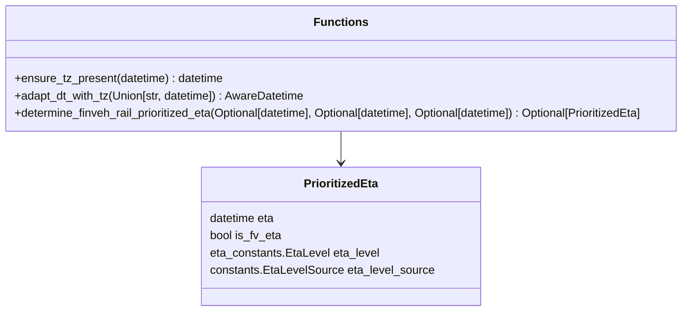

# Diagram: shipment_core/shipment_service/shipment_service/fvshared/determine_prioritized_eta.py


> Auto-generated by Obscura crawlers

## Diagram 1



### SVG

<svg id="container" width="982.0703125" xmlns="http://www.w3.org/2000/svg" class="classDiagram" height="432" viewBox="0 0 982.0703125 432" role="graphics-document document" aria-roledescription="class"><style>#container{font-family:"trebuchet ms",verdana,arial,sans-serif;font-size:16px;fill:#333;}@keyframes edge-animation-frame{from{stroke-dashoffset:0;}}@keyframes dash{to{stroke-dashoffset:0;}}#container .edge-animation-slow{stroke-dasharray:9,5!important;stroke-dashoffset:900;animation:dash 50s linear infinite;stroke-linecap:round;}#container .edge-animation-fast{stroke-dasharray:9,5!important;stroke-dashoffset:900;animation:dash 20s linear infinite;stroke-linecap:round;}#container .error-icon{fill:#552222;}#container .error-text{fill:#552222;stroke:#552222;}#container .edge-thickness-normal{stroke-width:1px;}#container .edge-thickness-thick{stroke-width:3.5px;}#container .edge-pattern-solid{stroke-dasharray:0;}#container .edge-thickness-invisible{stroke-width:0;fill:none;}#container .edge-pattern-dashed{stroke-dasharray:3;}#container .edge-pattern-dotted{stroke-dasharray:2;}#container .marker{fill:#333333;stroke:#333333;}#container .marker.cross{stroke:#333333;}#container svg{font-family:"trebuchet ms",verdana,arial,sans-serif;font-size:16px;}#container p{margin:0;}#container g.classGroup text{fill:#9370DB;stroke:none;font-family:"trebuchet ms",verdana,arial,sans-serif;font-size:10px;}#container g.classGroup text .title{font-weight:bolder;}#container .nodeLabel,#container .edgeLabel{color:#131300;}#container .edgeLabel .label rect{fill:#ECECFF;}#container .label text{fill:#131300;}#container .labelBkg{background:#ECECFF;}#container .edgeLabel .label span{background:#ECECFF;}#container .classTitle{font-weight:bolder;}#container .node rect,#container .node circle,#container .node ellipse,#container .node polygon,#container .node path{fill:#ECECFF;stroke:#9370DB;stroke-width:1px;}#container .divider{stroke:#9370DB;stroke-width:1;}#container g.clickable{cursor:pointer;}#container g.classGroup rect{fill:#ECECFF;stroke:#9370DB;}#container g.classGroup line{stroke:#9370DB;stroke-width:1;}#container .classLabel .box{stroke:none;stroke-width:0;fill:#ECECFF;opacity:0.5;}#container .classLabel .label{fill:#9370DB;font-size:10px;}#container .relation{stroke:#333333;stroke-width:1;fill:none;}#container .dashed-line{stroke-dasharray:3;}#container .dotted-line{stroke-dasharray:1 2;}#container #compositionStart,#container .composition{fill:#333333!important;stroke:#333333!important;stroke-width:1;}#container #compositionEnd,#container .composition{fill:#333333!important;stroke:#333333!important;stroke-width:1;}#container #dependencyStart,#container .dependency{fill:#333333!important;stroke:#333333!important;stroke-width:1;}#container #dependencyStart,#container .dependency{fill:#333333!important;stroke:#333333!important;stroke-width:1;}#container #extensionStart,#container .extension{fill:transparent!important;stroke:#333333!important;stroke-width:1;}#container #extensionEnd,#container .extension{fill:transparent!important;stroke:#333333!important;stroke-width:1;}#container #aggregationStart,#container .aggregation{fill:transparent!important;stroke:#333333!important;stroke-width:1;}#container #aggregationEnd,#container .aggregation{fill:transparent!important;stroke:#333333!important;stroke-width:1;}#container #lollipopStart,#container .lollipop{fill:#ECECFF!important;stroke:#333333!important;stroke-width:1;}#container #lollipopEnd,#container .lollipop{fill:#ECECFF!important;stroke:#333333!important;stroke-width:1;}#container .edgeTerminals{font-size:11px;line-height:initial;}#container .classTitleText{text-anchor:middle;font-size:18px;fill:#333;}#container .label-icon{display:inline-block;height:1em;overflow:visible;vertical-align:-0.125em;}#container .node .label-icon path{fill:currentColor;stroke:revert;stroke-width:revert;}#container :root{--mermaid-font-family:"trebuchet ms",verdana,arial,sans-serif;}</style><g><defs><marker id="container_class-aggregationStart" class="marker aggregation class" refX="18" refY="7" markerWidth="190" markerHeight="240" orient="auto"><path d="M 18,7 L9,13 L1,7 L9,1 Z"></path></marker></defs><defs><marker id="container_class-aggregationEnd" class="marker aggregation class" refX="1" refY="7" markerWidth="20" markerHeight="28" orient="auto"><path d="M 18,7 L9,13 L1,7 L9,1 Z"></path></marker></defs><defs><marker id="container_class-extensionStart" class="marker extension class" refX="18" refY="7" markerWidth="190" markerHeight="240" orient="auto"><path d="M 1,7 L18,13 V 1 Z"></path></marker></defs><defs><marker id="container_class-extensionEnd" class="marker extension class" refX="1" refY="7" markerWidth="20" markerHeight="28" orient="auto"><path d="M 1,1 V 13 L18,7 Z"></path></marker></defs><defs><marker id="container_class-compositionStart" class="marker composition class" refX="18" refY="7" markerWidth="190" markerHeight="240" orient="auto"><path d="M 18,7 L9,13 L1,7 L9,1 Z"></path></marker></defs><defs><marker id="container_class-compositionEnd" class="marker composition class" refX="1" refY="7" markerWidth="20" markerHeight="28" orient="auto"><path d="M 18,7 L9,13 L1,7 L9,1 Z"></path></marker></defs><defs><marker id="container_class-dependencyStart" class="marker dependency class" refX="6" refY="7" markerWidth="190" markerHeight="240" orient="auto"><path d="M 5,7 L9,13 L1,7 L9,1 Z"></path></marker></defs><defs><marker id="container_class-dependencyEnd" class="marker dependency class" refX="13" refY="7" markerWidth="20" markerHeight="28" orient="auto"><path d="M 18,7 L9,13 L14,7 L9,1 Z"></path></marker></defs><defs><marker id="container_class-lollipopStart" class="marker lollipop class" refX="13" refY="7" markerWidth="190" markerHeight="240" orient="auto"><circle stroke="black" fill="transparent" cx="7" cy="7" r="6"></circle></marker></defs><defs><marker id="container_class-lollipopEnd" class="marker lollipop class" refX="1" refY="7" markerWidth="190" markerHeight="240" orient="auto"><circle stroke="black" fill="transparent" cx="7" cy="7" r="6"></circle></marker></defs><g class="root"><g class="clusters"></g><g class="edgePaths"><path d="M491.035,182L491.035,186.167C491.035,190.333,491.035,198.667,491.035,206C491.035,213.333,491.035,219.667,491.035,222.833L491.035,226" id="id_Functions_PrioritizedEta_1" class="edge-thickness-normal edge-pattern-solid relation" style=";;;" data-edge="true" data-et="edge" data-id="id_Functions_PrioritizedEta_1" data-points="W3sieCI6NDkxLjAzNTE1NjI1LCJ5IjoxODJ9LHsieCI6NDkxLjAzNTE1NjI1LCJ5IjoyMDd9LHsieCI6NDkxLjAzNTE1NjI1LCJ5IjoyMzJ9XQ==" marker-end="url(#container_class-dependencyEnd)"></path></g><g class="edgeLabels"><g class="edgeLabel"><g class="label" data-id="id_Functions_PrioritizedEta_1" transform="translate(0, 0)"><foreignObject width="0" height="0"><div xmlns="http://www.w3.org/1999/xhtml" class="labelBkg" style="display: table-cell; white-space: nowrap; line-height: 1.5; max-width: 200px; text-align: center;"><span class="edgeLabel"></span></div></foreignObject></g></g></g><g class="nodes"><g class="node default" id="classId-PrioritizedEta-0" transform="translate(491.03515625, 328)"><g class="basic label-container"><path d="M-191.8125 -96 L191.8125 -96 L191.8125 96 L-191.8125 96" stroke="none" stroke-width="0" fill="#ECECFF" style=""></path><path d="M-191.8125 -96 C-104.06659810669356 -96, -16.320696213387123 -96, 191.8125 -96 M-191.8125 -96 C-95.55122823969586 -96, 0.7100435206082807 -96, 191.8125 -96 M191.8125 -96 C191.8125 -46.58617219411158, 191.8125 2.8276556117768337, 191.8125 96 M191.8125 -96 C191.8125 -55.08990446444899, 191.8125 -14.179808928897984, 191.8125 96 M191.8125 96 C62.18755659426003 96, -67.43738681147994 96, -191.8125 96 M191.8125 96 C109.65958777800876 96, 27.506675556017512 96, -191.8125 96 M-191.8125 96 C-191.8125 30.806319456470163, -191.8125 -34.38736108705967, -191.8125 -96 M-191.8125 96 C-191.8125 38.23010294421664, -191.8125 -19.53979411156672, -191.8125 -96" stroke="#9370DB" stroke-width="1.3" fill="none" stroke-dasharray="0 0" style=""></path></g><g class="annotation-group text" transform="translate(0, -72)"></g><g class="label-group text" transform="translate(-49.84375, -72)"><g class="label" style="font-weight: bolder" transform="translate(0,-12)"><foreignObject width="99.6875" height="24"><div xmlns="http://www.w3.org/1999/xhtml" style="display: table-cell; white-space: nowrap; line-height: 1.5; max-width: 148px; text-align: center;"><span class="nodeLabel markdown-node-label" style=""><p>PrioritizedEta</p></span></div></foreignObject></g></g><g class="members-group text" transform="translate(-179.8125, -24)"><g class="label" style="" transform="translate(0,-12)"><foreignObject width="92.578125" height="24"><div xmlns="http://www.w3.org/1999/xhtml" style="display: table-cell; white-space: nowrap; line-height: 1.5; max-width: 143px; text-align: center;"><span class="nodeLabel markdown-node-label" style=""><p>datetime eta</p></span></div></foreignObject></g><g class="label" style="" transform="translate(0,12)"><foreignObject width="100.625" height="24"><div xmlns="http://www.w3.org/1999/xhtml" style="display: table-cell; white-space: nowrap; line-height: 1.5; max-width: 151px; text-align: center;"><span class="nodeLabel markdown-node-label" style=""><p>bool is_fv_eta</p></span></div></foreignObject></g><g class="label" style="" transform="translate(0,36)"><foreignObject width="235.5625" height="24"><div xmlns="http://www.w3.org/1999/xhtml" style="display: table-cell; white-space: nowrap; line-height: 1.5; max-width: 286px; text-align: center;"><span class="nodeLabel markdown-node-label" style=""><p>eta_constants.EtaLevel eta_level</p></span></div></foreignObject></g><g class="label" style="" transform="translate(0,60)"><foreignObject width="309.78125" height="24"><div xmlns="http://www.w3.org/1999/xhtml" style="display: table-cell; white-space: nowrap; line-height: 1.5; max-width: 360px; text-align: center;"><span class="nodeLabel markdown-node-label" style=""><p>constants.EtaLevelSource eta_level_source</p></span></div></foreignObject></g></g><g class="methods-group text" transform="translate(-179.8125, 96)"></g><g class="divider" style=""><path d="M-191.8125 -48 C-47.64828426845514 -48, 96.51593146308971 -48, 191.8125 -48 M-191.8125 -48 C-58.78074499167616 -48, 74.25101001664768 -48, 191.8125 -48" stroke="#9370DB" stroke-width="1.3" fill="none" stroke-dasharray="0 0" style=""></path></g><g class="divider" style=""><path d="M-191.8125 72 C-88.86788557731988 72, 14.076728845360236 72, 191.8125 72 M-191.8125 72 C-48.798308705439524 72, 94.21588258912095 72, 191.8125 72" stroke="#9370DB" stroke-width="1.3" fill="none" stroke-dasharray="0 0" style=""></path></g></g><g class="node default" id="classId-Functions-1" transform="translate(491.03515625, 95)"><g class="basic label-container"><path d="M-483.03515625 -87 L483.03515625 -87 L483.03515625 87 L-483.03515625 87" stroke="none" stroke-width="0" fill="#ECECFF" style=""></path><path d="M-483.03515625 -87 C-104.69815869624375 -87, 273.6388388575125 -87, 483.03515625 -87 M-483.03515625 -87 C-203.77766969335755 -87, 75.4798168632849 -87, 483.03515625 -87 M483.03515625 -87 C483.03515625 -46.2972320337209, 483.03515625 -5.594464067441805, 483.03515625 87 M483.03515625 -87 C483.03515625 -41.92358987768635, 483.03515625 3.152820244627307, 483.03515625 87 M483.03515625 87 C142.37769393055902 87, -198.27976838888196 87, -483.03515625 87 M483.03515625 87 C250.6037990584183 87, 18.172441866836607 87, -483.03515625 87 M-483.03515625 87 C-483.03515625 21.92714324097541, -483.03515625 -43.14571351804918, -483.03515625 -87 M-483.03515625 87 C-483.03515625 44.34998816072974, -483.03515625 1.6999763214594736, -483.03515625 -87" stroke="#9370DB" stroke-width="1.3" fill="none" stroke-dasharray="0 0" style=""></path></g><g class="annotation-group text" transform="translate(0, -63)"></g><g class="label-group text" transform="translate(-35.1328125, -63)"><g class="label" style="font-weight: bolder" transform="translate(0,-12)"><foreignObject width="70.265625" height="24"><div xmlns="http://www.w3.org/1999/xhtml" style="display: table-cell; white-space: nowrap; line-height: 1.5; max-width: 120px; text-align: center;"><span class="nodeLabel markdown-node-label" style=""><p>Functions</p></span></div></foreignObject></g></g><g class="members-group text" transform="translate(-471.03515625, -15)"></g><g class="methods-group text" transform="translate(-471.03515625, 15)"><g class="label" style="" transform="translate(0,-12)"><foreignObject width="294.5" height="24"><div xmlns="http://www.w3.org/1999/xhtml" style="display: table-cell; white-space: nowrap; line-height: 1.5; max-width: 352px; text-align: center;"><span class="nodeLabel markdown-node-label" style=""><p>+ensure_tz_present(datetime) : datetime</p></span></div></foreignObject></g><g class="label" style="" transform="translate(0,12)"><foreignObject width="410.3125" height="24"><div xmlns="http://www.w3.org/1999/xhtml" style="display: table-cell; white-space: nowrap; line-height: 1.5; max-width: 468px; text-align: center;"><span class="nodeLabel markdown-node-label" style=""><p>+adapt_dt_with_tz(Union[str, datetime]) : AwareDatetime</p></span></div></foreignObject></g><g class="label" style="" transform="translate(0,36)"><foreignObject width="906.9375" height="24"><div xmlns="http://www.w3.org/1999/xhtml" style="display: table-cell; white-space: nowrap; line-height: 1.5; max-width: 964px; text-align: center;"><span class="nodeLabel markdown-node-label" style=""><p>+determine_finveh_rail_prioritized_eta(Optional[datetime], Optional[datetime], Optional[datetime]) : Optional[PrioritizedEta]</p></span></div></foreignObject></g></g><g class="divider" style=""><path d="M-483.03515625 -39 C-270.16529581184164 -39, -57.29543537368329 -39, 483.03515625 -39 M-483.03515625 -39 C-193.1526052485229 -39, 96.72994575295422 -39, 483.03515625 -39" stroke="#9370DB" stroke-width="1.3" fill="none" stroke-dasharray="0 0" style=""></path></g><g class="divider" style=""><path d="M-483.03515625 -15 C-186.41099284169212 -15, 110.21317056661576 -15, 483.03515625 -15 M-483.03515625 -15 C-204.98305214963068 -15, 73.06905195073864 -15, 483.03515625 -15" stroke="#9370DB" stroke-width="1.3" fill="none" stroke-dasharray="0 0" style=""></path></g></g></g></g></g></svg>

## Diagram 2

```mermaid
flowchart LR
    Start(("start"))
    A[FV ETA is None?\n(fv_eta is None)]
    B[ETAD present?\n(etad != None)]
    C[Return PrioritizedEta\neta=etad,\nis_fv_eta=false,\neta_level=CARRIER_PROVIDED_ETA,\neta_level_source=ETAD]
    D[FV ETA present?\n(fv_eta != None)]
    E[ETAD is None?\n(etad is None)]
    F[Schedule is None OR fv_eta > schedule?]
    G[Return PrioritizedEta\neta=fv_eta,\nis_fv_eta=true,\neta_level=STATISTICAL_ETA,\neta_level_source=STATISTICAL]
    H[FV ETA > ETAD?]
    I[Return PrioritizedEta\neta=fv_eta,\nis_fv_eta=true,\neta_level=STATISTICAL_ETA,\neta_level_source=STATISTICAL]
    J[Return PrioritizedEta\neta=etad,\nis_fv_eta=false,\neta_level=CARRIER_PROVIDED_ETA,\neta_level_source=ETAD]
    K[Return None]

    Start --> A
    A -- yes --> B
    B -- yes --> C
    B -- no --> K
    A -- no --> D
    D -- no --> K
    D -- yes --> E
    E -- yes --> F
    F -- yes --> G
    F -- no --> K
    E -- no --> H
    H -- yes --> I
    H -- no --> J
```

> SVG rendering failed for this diagram.
