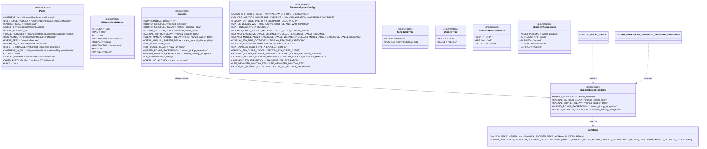

# Diagram: shipment_core/shipment_service/shipment_service/fvshared/enums.py

> Auto-generated by Obscura crawlers

## Mermaid

```mermaid
classDiagram
class Paths <<enumeration>> {
  +SHIPMENT_ID = "shipmentIdentification.shipmentId"
  +REFERENCE_NUMBER = "shipmentIdentification.referenceNumber"
  +CARRIER_SCAC = "carrier.scac"
  +ASSET_ID = "telematics.trackingAssetId"
  +ROUTE_ID = "route_id"
  +TRAILER_NUMBER = "shipmentDetails.equipmentDetail.trailerNumber"
  +PRO_NUMBER = "shipmentIdentification.proNumber"
  +EVENT_REFS = "eventReferences"
  +SHIPMENT_REFS = "shipmentReferences"
  +REFS_TO_REPLACE = "shipmentReferencesToReplace"
  +SHIPMENT_ID_3PL = "shipmentIdentification.uniqueShipmentIdentifier"
  +STOPS = "stops"
  +ACCESS_GRANTS = "shipmentMeta.accessGrants"
  +THIRD_PARTY_FV_ID = "thirdParty.fvThirdPartyId"
  +RACK = "rack"
}
class ShipmentModeName <<enumeration>> {
  +TRUCK = "Truck"
  +RAIL = "Rail"
  +LTL = "LTL"
  +INTERMODAL = "Intermodal"
  +OCEAN = "Ocean"
  +MULTIMODAL = "Multimodal"
  +AIR = "Air"
  +PARCEL = "Parcel"
}
class ShipmentExceptionName <<enumeration>> {
  +BEHIND_SCHEDULE = "behind_schedule"
  +MANUAL_CARRIER_DELAY = "manual_carrier_delay"
  +MANUAL_SHIPPER_DELAY = "manual_shipper_delay"
  +MISSED_PICKUP_EXCEPTIONS = "missed_pickup_exceptions"
  +MISSED_DELIVERY_EXCEPTIONS = "missed_delivery_exceptions"
}
class Statuses <<enumeration>> {
  +SUPPLEMENTAL_DATA = "RP"
  +BEHIND_SCHEDULE = "behind_schedule"
  +BEHIND_SCHEDULE_CLEAR = "behind_schedule_clear"
  +MANUAL_CARRIER_DELAY = "manual_carrier_delay"
  +MANUAL_SHIPPER_DELAY = "manual_shipper_delay"
  +CLEAR_MANUAL_CARRIER_DELAY = "clear_manual_carrier_delay"
  +CLEAR_MANUAL_SHIPPER_DELAY = "clear_manual_shipper_delay"
  +OFF_ROUTE = "off_route"
  +OFF_ROUTE_CLEAR = "clear_off_route"
  +MISSED_PICKUP_EXCEPTIONS = "missed_pickup_exceptions"
  +MISSED_DELIVERY_EXCEPTIONS = "missed_delivery_exceptions"
  +NO_ACTIVITY = "no_activity"
  +CLEAR_NO_ACTIVITY = "clear_no_activity"
}
class ShipmentSystemConfig <<enumeration>> {
  +ALLOW_OFF_ROUTE_EXCEPTION = "ALLOW_OFF_ROUTE_EXCEPTION"
  +VIN_ORGANIZATION_OWNERSHIP_OVERRIDE = "VIN_ORGANIZATION_OWNERSHIP_OVERRIDE"
  +FEDERATION_CODE_PREFIX = "FEDERATION_CODE_PREFIX"
  +STATUS_DETAILS_WAIT_MINUTES = "STATUS_DETAILS_WAIT_MINUTES"
  +ETA_HOLIDAYS = "ETA_HOLIDAYS"
  +DEFAULT_EARLY_ARRIVAL_MILES = "DEFAULT_EARLY_ARRIVAL_MILES"
  +DEFAULT_EXCESSIVE_DWELL_DISTANCE = "DEFAULT_EXCESSIVE_DWELL_DISTANCE"
  +DEFAULT_MOBILE_ASSET_EXCESSIVE_DWELL_DISTANCE = "DEFAULT_MOBILE_ASSET_EXCESSIVE_DWELL_DISTANCE"
  +DISPLAY_ETA_TIME_CATEGORY = "DISPLAY_ETA_TIME_CATEGORY"
  +SHIPPER_CONFIGURATION = "SHIPPER_CONFIGURATION"
  +ETA_ENABLED_CONFIG = "ETA_ENABLED_CONFIG"
  +FROZEN_ETA_CLEAR_CODES = "FROZEN_ETA_CLEAR_CODES"
  +ALLOWED_OCEAN_DELIVERY_WINDOW = "ALLOWED_OCEAN_DELIVERY_WINDOW"
  +ALLOWED_DEFAULT_DELIVERY_WINDOW = "ALLOWED_DEFAULT_DELIVERY_WINDOW"
  +SHIPMENT_ETA_EXPIRATION = "SHIPMENT_ETA_EXPIRATION"
  +USE_WEIGHTED_WINDOW_ETA = "USE_WEIGHTED_WINDOW_ETA"
  +ALLOW_NO_ACTIVITY_EXCEPTION = "ALLOW_NO_ACTIVITY_EXCEPTION"
}
class ScheduledType <<enumeration>> {
  +ORIGIN = "ORIGIN"
  +DESTINATION = "DESTINATION"
}
class WindowType <<enumeration>> {
  +OPEN = "OPEN"
  +CLOSE = "CLOSE"
}
class PartviewMilestoneCodes <<enumeration>> {
  +SKIP = "--SKIP--"
  +ARRIVAL = "AR"
  +DEPARTURE = "DP"
}
class ShipmentActiveStatus <<enumeration>> {
  +ASSET_PENDING = "asset_pending"
  +IN_TRANSIT = "in_transit"
  +ARRIVED = "arrived"
  +CANCELED = "canceled"
  +EXPIRED = "expired"
}
class Constants {
  +MANUAL_DELAY_CODES : List = [MANUAL_CARRIER_DELAY, MANUAL_SHIPPER_DELAY]
  +BEHIND_SCHEDULED_EXCLUDED_OVERRIDE_EXCEPTION : List = [MANUAL_CARRIER_DELAY, MANUAL_SHIPPER_DELAY, MISSED_PICKUP_EXCEPTIONS, MISSED_DELIVERY_EXCEPTIONS]
}
ShipmentExceptionName --> Constants : used in
Statuses --> ShipmentExceptionName : shares values
MANUAL_DELAY_CODES ..> ShipmentExceptionName : contains
BEHIND_SCHEDULED_EXCLUDED_OVERRIDE_EXCEPTION ..> ShipmentExceptionName : contains
```

> SVG rendering failed for this diagram.
