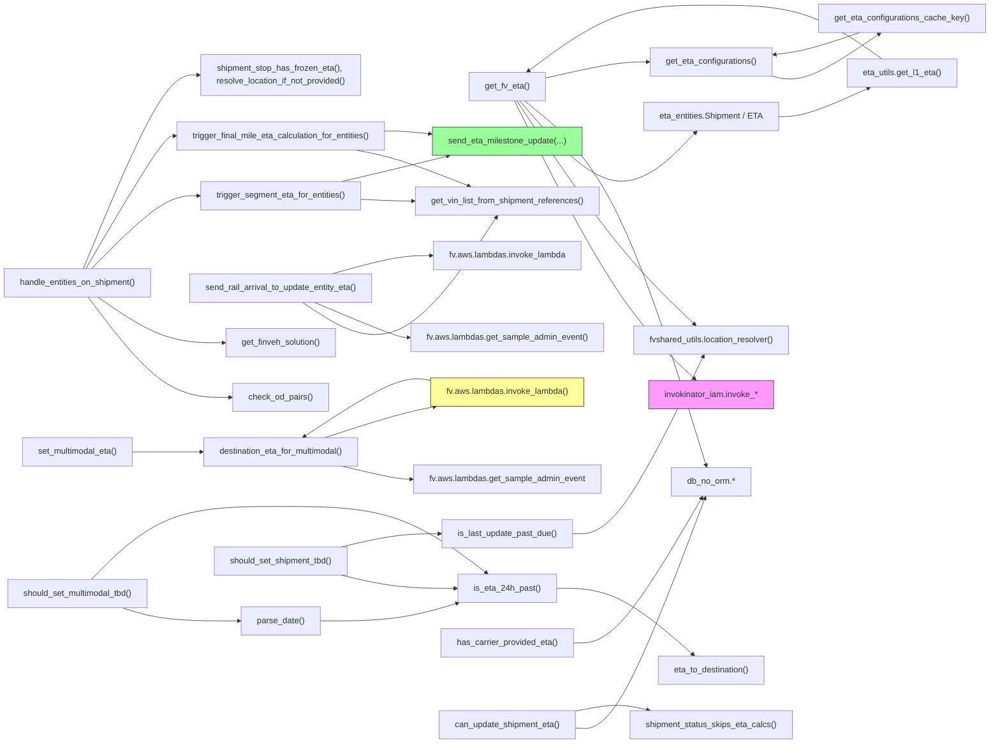

# Diagram: shipment_core/shipment_service/shipment_service/fvshared/eta_shared_utils.py

> Auto-generated by Obscura crawlers

## Mermaid

### SVG

<svg id="container" width="1906.09375" xmlns="http://www.w3.org/2000/svg" class="flowchart" height="1422" viewBox="0 0 1906.09375 1422" role="graphics-document document" aria-roledescription="flowchart-v2"><g><marker id="container_flowchart-v2-pointEnd" class="marker flowchart-v2" viewBox="0 0 10 10" refX="5" refY="5" markerUnits="userSpaceOnUse" markerWidth="8" markerHeight="8" orient="auto"><path d="M 0 0 L 10 5 L 0 10 z" class="arrowMarkerPath" style="stroke-width: 1; stroke-dasharray: 1, 0;"></path></marker><marker id="container_flowchart-v2-pointStart" class="marker flowchart-v2" viewBox="0 0 10 10" refX="4.5" refY="5" markerUnits="userSpaceOnUse" markerWidth="8" markerHeight="8" orient="auto"><path d="M 0 5 L 10 10 L 10 0 z" class="arrowMarkerPath" style="stroke-width: 1; stroke-dasharray: 1, 0;"></path></marker><marker id="container_flowchart-v2-circleEnd" class="marker flowchart-v2" viewBox="0 0 10 10" refX="11" refY="5" markerUnits="userSpaceOnUse" markerWidth="11" markerHeight="11" orient="auto"><circle cx="5" cy="5" r="5" class="arrowMarkerPath" style="stroke-width: 1; stroke-dasharray: 1, 0;"></circle></marker><marker id="container_flowchart-v2-circleStart" class="marker flowchart-v2" viewBox="0 0 10 10" refX="-1" refY="5" markerUnits="userSpaceOnUse" markerWidth="11" markerHeight="11" orient="auto"><circle cx="5" cy="5" r="5" class="arrowMarkerPath" style="stroke-width: 1; stroke-dasharray: 1, 0;"></circle></marker><marker id="container_flowchart-v2-crossEnd" class="marker cross flowchart-v2" viewBox="0 0 11 11" refX="12" refY="5.2" markerUnits="userSpaceOnUse" markerWidth="11" markerHeight="11" orient="auto"><path d="M 1,1 l 9,9 M 10,1 l -9,9" class="arrowMarkerPath" style="stroke-width: 2; stroke-dasharray: 1, 0;"></path></marker><marker id="container_flowchart-v2-crossStart" class="marker cross flowchart-v2" viewBox="0 0 11 11" refX="-1" refY="5.2" markerUnits="userSpaceOnUse" markerWidth="11" markerHeight="11" orient="auto"><path d="M 1,1 l 9,9 M 10,1 l -9,9" class="arrowMarkerPath" style="stroke-width: 2; stroke-dasharray: 1, 0;"></path></marker><g class="root"><g class="clusters"></g><g class="edgePaths"><path d="M998.077,198L1030.754,262.833C1063.432,327.667,1128.786,457.333,1186.655,547.692C1244.525,638.051,1294.909,689.102,1320.101,714.628L1345.293,740.153" id="L_get_fv_eta_invokinator_iam_0" class="edge-thickness-normal edge-pattern-solid edge-thickness-normal edge-pattern-solid flowchart-link" style=";" data-edge="true" data-et="edge" data-id="L_get_fv_eta_invokinator_iam_0" data-points="W3sieCI6OTk4LjA3NzI2MTExNzc4ODUsInkiOjE5OH0seyJ4IjoxMTk0LjE0MDYyNSwieSI6NTg3fSx7IngiOjEzNDguMTAyNzE1MTYzOTM0NCwieSI6NzQzfV0=" marker-end="url(#container_flowchart-v2-pointEnd)"></path><path d="M1002.613,198L1034.535,245.5C1066.456,293,1130.298,388,1187.411,461.026C1244.525,534.051,1294.909,585.102,1320.101,610.628L1345.293,636.153" id="L_get_fv_eta_fvshared_utils_0" class="edge-thickness-normal edge-pattern-solid edge-thickness-normal edge-pattern-solid flowchart-link" style=";" data-edge="true" data-et="edge" data-id="L_get_fv_eta_fvshared_utils_0" data-points="W3sieCI6MTAwMi42MTM0MzE0OTAzODQ2LCJ5IjoxOTh9LHsieCI6MTE5NC4xNDA2MjUsInkiOjQ4M30seyJ4IjoxMzQ4LjEwMjcxNTE2MzkzNDQsInkiOjYzOX1d" marker-end="url(#container_flowchart-v2-pointEnd)"></path><path d="M1008.662,198L1039.575,232.5C1070.488,267,1132.314,336,1185.98,348.958C1239.645,361.917,1285.149,318.833,1307.902,297.292L1330.654,275.75" id="L_get_fv_eta_eta_entities_0" class="edge-thickness-normal edge-pattern-solid edge-thickness-normal edge-pattern-solid flowchart-link" style=";" data-edge="true" data-et="edge" data-id="L_get_fv_eta_eta_entities_0" data-points="W3sieCI6MTAwOC42NjE2NTg2NTM4NDYyLCJ5IjoxOTh9LHsieCI6MTE5NC4xNDA2MjUsInkiOjQwNX0seyJ4IjoxMzMzLjU1ODM4ODE1Nzg5NDgsInkiOjI3M31d" marker-end="url(#container_flowchart-v2-pointEnd)"></path><path d="M1504.75,234L1513.185,234C1521.62,234,1538.49,234,1567.672,223.957C1596.855,213.914,1638.351,193.829,1659.098,183.786L1679.846,173.743" id="L_eta_entities_eta_utils_0" class="edge-thickness-normal edge-pattern-solid edge-thickness-normal edge-pattern-solid flowchart-link" style=";" data-edge="true" data-et="edge" data-id="L_eta_entities_eta_utils_0" data-points="W3sieCI6MTUwNC43NSwieSI6MjM0fSx7IngiOjE1NTUuMzU5Mzc1LCJ5IjoyMzR9LHsieCI6MTY4My40NDY2MjkyMTM0ODMyLCJ5IjoxNzJ9XQ==" marker-end="url(#container_flowchart-v2-pointEnd)"></path><path d="M1702.453,118L1677.938,100C1653.422,82,1604.391,46,1549.773,28C1495.156,10,1434.953,10,1374.75,10C1314.547,10,1254.344,10,1195.686,31.927C1137.028,53.855,1079.916,97.709,1051.36,119.637L1022.804,141.564" id="L_eta_utils_get_fv_eta_0" class="edge-thickness-normal edge-pattern-solid edge-thickness-normal edge-pattern-solid flowchart-link" style=";" data-edge="true" data-et="edge" data-id="L_eta_utils_get_fv_eta_0" data-points="W3sieCI6MTcwMi40NTMxMjUsInkiOjExOH0seyJ4IjoxNTU1LjM1OTM3NSwieSI6MTB9LHsieCI6MTM3NC43NSwieSI6MTB9LHsieCI6MTE5NC4xNDA2MjUsInkiOjEwfSx7IngiOjEwMTkuNjMxMTE0MTMwNDM0OCwieSI6MTQ0fV0=" marker-end="url(#container_flowchart-v2-pointEnd)"></path><path d="M1016.634,198L1046.219,222.833C1075.803,247.667,1134.972,297.333,1193.082,415.196C1251.193,533.059,1308.246,719.117,1336.772,812.146L1365.298,905.176" id="L_get_fv_eta_db_no_orm_0" class="edge-thickness-normal edge-pattern-solid edge-thickness-normal edge-pattern-solid flowchart-link" style=";" data-edge="true" data-et="edge" data-id="L_get_fv_eta_db_no_orm_0" data-points="W3sieCI6MTAxNi42MzQzMjE3MzI5NTQ1LCJ5IjoxOTh9LHsieCI6MTE5NC4xNDA2MjUsInkiOjM0N30seyJ4IjoxMzY2LjQ3MDc5MjY1NzA0NTksInkiOjkwOX1d" marker-end="url(#container_flowchart-v2-pointEnd)"></path><path d="M1056.859,152.701L1079.74,146.918C1102.62,141.134,1148.38,129.567,1181.066,123.784C1213.753,118,1233.365,118,1243.171,118L1252.977,118" id="L_get_fv_eta_get_eta_cfg_0" class="edge-thickness-normal edge-pattern-solid edge-thickness-normal edge-pattern-solid flowchart-link" style=";" data-edge="true" data-et="edge" data-id="L_get_fv_eta_get_eta_cfg_0" data-points="W3sieCI6MTA1Ni44NTkzNzUsInkiOjE1Mi43MDEzOTM1NDY0NjM5OH0seyJ4IjoxMTk0LjE0MDYyNSwieSI6MTE4fSx7IngiOjEyNTYuOTc2NTYyNSwieSI6MTE4fV0=" marker-end="url(#container_flowchart-v2-pointEnd)"></path><path d="M701.438,385.778L713.664,386.315C725.891,386.852,750.344,387.926,767.182,388.463C784.021,389,793.245,389,797.857,389L802.469,389" id="L_trigger_segment_get_vins_0" class="edge-thickness-normal edge-pattern-solid edge-thickness-normal edge-pattern-solid flowchart-link" style=";" data-edge="true" data-et="edge" data-id="L_trigger_segment_get_vins_0" data-points="W3sieCI6NzAxLjQzNzUsInkiOjM4NS43Nzc5NTY5NzA3OTkxNX0seyJ4Ijo3NzQuNzk2ODc1LCJ5IjozODl9LHsieCI6ODA2LjQ2ODc1LCJ5IjozODl9XQ==" marker-end="url(#container_flowchart-v2-pointEnd)"></path><path d="M665.335,352L683.579,347.833C701.823,343.667,738.31,335.333,772.707,327.16C807.104,318.988,839.411,310.975,855.565,306.969L871.718,302.963" id="L_trigger_segment_send_eta_0" class="edge-thickness-normal edge-pattern-solid edge-thickness-normal edge-pattern-solid flowchart-link" style=";" data-edge="true" data-et="edge" data-id="L_trigger_segment_send_eta_0" data-points="W3sieCI6NjY1LjMzNTQ4Njc3ODg0NjIsInkiOjM1Mn0seyJ4Ijo3NzQuNzk2ODc1LCJ5IjozMjd9LHsieCI6ODc1LjYwMDY2MTA1NzY5MjMsInkiOjMwMn1d" marker-end="url(#container_flowchart-v2-pointEnd)"></path><path d="M693.483,292L707.035,294.5C720.587,297,747.692,302,784.063,313.424C820.433,324.848,866.069,342.695,888.887,351.619L911.705,360.543" id="L_trigger_final_get_vins_0" class="edge-thickness-normal edge-pattern-solid edge-thickness-normal edge-pattern-solid flowchart-link" style=";" data-edge="true" data-et="edge" data-id="L_trigger_final_get_vins_0" data-points="W3sieCI6NjkzLjQ4MjcwMDg5Mjg1NzEsInkiOjI5Mn0seyJ4Ijo3NzQuNzk2ODc1LCJ5IjozMDd9LHsieCI6OTE1LjQzMDQ0OTY5NTEyMiwieSI6MzYyfV0=" marker-end="url(#container_flowchart-v2-pointEnd)"></path><path d="M749.797,256.098L753.964,255.915C758.13,255.732,766.464,255.366,780.956,256.168C795.449,256.97,816.101,258.94,826.427,259.925L836.752,260.91" id="L_trigger_final_send_eta_0" class="edge-thickness-normal edge-pattern-solid edge-thickness-normal edge-pattern-solid flowchart-link" style=";" data-edge="true" data-et="edge" data-id="L_trigger_final_send_eta_0" data-points="W3sieCI6NzQ5Ljc5Njg3NSwieSI6MjU2LjA5ODAzMzgzMzE2NzV9LHsieCI6Nzc0Ljc5Njg3NSwieSI6MjU1fSx7IngiOjg0MC43MzQzNzUsInkiOjI2MS4yODk1ODkzODgxODA5Nn1d" marker-end="url(#container_flowchart-v2-pointEnd)"></path><path d="M589.222,582L620.151,601.833C651.081,621.667,712.939,661.333,775.417,634.22C837.896,607.107,900.994,513.213,932.544,466.267L964.093,419.32" id="L_send_rail_get_vins_0" class="edge-thickness-normal edge-pattern-solid edge-thickness-normal edge-pattern-solid flowchart-link" style=";" data-edge="true" data-et="edge" data-id="L_send_rail_get_vins_0" data-points="W3sieCI6NTg5LjIyMjMzNTE4ODM1NjIsInkiOjU4Mn0seyJ4Ijo3NzQuNzk2ODc1LCJ5Ijo3MDF9LHsieCI6OTY2LjMyNDA2ODUwOTYxNTQsInkiOjQxNn1d" marker-end="url(#container_flowchart-v2-pointEnd)"></path><path d="M612.515,582L639.562,593.167C666.609,604.333,720.703,626.667,751.25,637.833C781.797,649,788.797,649,792.297,649L795.797,649" id="L_send_rail_fv.aws.lambdas_0" class="edge-thickness-normal edge-pattern-solid edge-thickness-normal edge-pattern-solid flowchart-link" style=";" data-edge="true" data-et="edge" data-id="L_send_rail_fv.aws.lambdas_0" data-points="W3sieCI6NjEyLjUxNDU0NDU0Nzg3MjMsInkiOjU4Mn0seyJ4Ijo3NzQuNzk2ODc1LCJ5Ijo2NDl9LHsieCI6Nzk5Ljc5Njg3NSwieSI6NjQ5fV0=" marker-end="url(#container_flowchart-v2-pointEnd)"></path><path d="M646.268,528L667.689,522.167C689.111,516.333,731.954,504.667,763.976,498.833C795.997,493,817.198,493,827.798,493L838.398,493" id="L_send_rail_fv.aws.lambdas.invoke_lambda_0" class="edge-thickness-normal edge-pattern-solid edge-thickness-normal edge-pattern-solid flowchart-link" style=";" data-edge="true" data-et="edge" data-id="L_send_rail_fv.aws.lambdas.invoke_lambda_0" data-points="W3sieCI6NjQ2LjI2ODAxOTE1MzIyNTksInkiOjUyOH0seyJ4Ijo3NzQuNzk2ODc1LCJ5Ijo0OTN9LHsieCI6ODQyLjM5ODQzNzUsInkiOjQ5M31d" marker-end="url(#container_flowchart-v2-pointEnd)"></path><path d="M259.023,867L269.092,867C279.161,867,299.299,867,321.297,867C343.294,867,367.151,867,379.079,867L391.008,867" id="L_set_multimodal_dest_multimodal_0" class="edge-thickness-normal edge-pattern-solid edge-thickness-normal edge-pattern-solid flowchart-link" style=";" data-edge="true" data-et="edge" data-id="L_set_multimodal_dest_multimodal_0" data-points="W3sieCI6MjU5LjAyMzQzNzUsInkiOjg2N30seyJ4IjozMTkuNDM3NSwieSI6ODY3fSx7IngiOjM5NS4wMDc4MTI1LCJ5Ijo4Njd9XQ==" marker-end="url(#container_flowchart-v2-pointEnd)"></path><path d="M665.335,894L683.579,898.167C701.823,902.333,738.31,910.667,760.918,914.833C783.526,919,792.255,919,796.62,919L800.984,919" id="L_dest_multimodal_fv.aws.lambdas.get_sample_admin_event_0" class="edge-thickness-normal edge-pattern-solid edge-thickness-normal edge-pattern-solid flowchart-link" style=";" data-edge="true" data-et="edge" data-id="L_dest_multimodal_fv.aws.lambdas.get_sample_admin_event_0" data-points="W3sieCI6NjY1LjMzNTQ4Njc3ODg0NjIsInkiOjg5NH0seyJ4Ijo3NzQuNzk2ODc1LCJ5Ijo5MTl9LHsieCI6ODA0Ljk4NDM3NSwieSI6OTE5fV0=" marker-end="url(#container_flowchart-v2-pointEnd)"></path><path d="M632.497,840L656.214,832.5C679.93,825,727.364,810,762.907,800.131C798.45,790.262,822.104,785.524,833.931,783.155L845.758,780.786" id="L_dest_multimodal_lambda_invoke_0" class="edge-thickness-normal edge-pattern-solid edge-thickness-normal edge-pattern-solid flowchart-link" style=";" data-edge="true" data-et="edge" data-id="L_dest_multimodal_lambda_invoke_0" data-points="W3sieCI6NjMyLjQ5NzA3MDMxMjUsInkiOjg0MH0seyJ4Ijo3NzQuNzk2ODc1LCJ5Ijo3OTV9LHsieCI6ODQ5LjY3OTY4NzUsInkiOjc4MH1d" marker-end="url(#container_flowchart-v2-pointEnd)"></path><path d="M837.219,730.527L826.815,728.939C816.411,727.351,795.604,724.176,754.833,742.061C714.061,759.947,653.325,798.894,622.957,818.367L592.59,837.841" id="L_lambda_invoke_dest_multimodal_0" class="edge-thickness-normal edge-pattern-solid edge-thickness-normal edge-pattern-solid flowchart-link" style=";" data-edge="true" data-et="edge" data-id="L_lambda_invoke_dest_multimodal_0" data-points="W3sieCI6ODM3LjIxODc1LCJ5Ijo3MzAuNTI2NzkwMzcxODYwOH0seyJ4Ijo3NzQuNzk2ODc1LCJ5Ijo3MjF9LHsieCI6NTg5LjIyMjMzNTE4ODM1NjIsInkiOjg0MH1d" marker-end="url(#container_flowchart-v2-pointEnd)"></path><path d="M172.053,572L196.617,603.833C221.181,635.667,270.309,699.333,316.89,731.167C363.471,763,407.505,763,429.522,763L451.539,763" id="L_handle_entities_on_shipment_check_od_0" class="edge-thickness-normal edge-pattern-solid edge-thickness-normal edge-pattern-solid flowchart-link" style=";" data-edge="true" data-et="edge" data-id="L_handle_entities_on_shipment_check_od_0" data-points="W3sieCI6MTcyLjA1MzE4MjMzOTQ0OTUzLCJ5Ijo1NzJ9LHsieCI6MzE5LjQzNzUsInkiOjc2M30seyJ4Ijo0NTUuNTM5MDYyNSwieSI6NzYzfV0=" marker-end="url(#container_flowchart-v2-pointEnd)"></path><path d="M191.06,572L212.456,586.5C233.853,601,276.645,630,317.533,644.5C358.422,659,397.406,659,416.898,659L436.391,659" id="L_handle_entities_on_shipment_get_finveh_solution_0" class="edge-thickness-normal edge-pattern-solid edge-thickness-normal edge-pattern-solid flowchart-link" style=";" data-edge="true" data-et="edge" data-id="L_handle_entities_on_shipment_get_finveh_solution_0" data-points="W3sieCI6MTkxLjA2MDAzMjg5NDczNjg1LCJ5Ijo1NzJ9LHsieCI6MzE5LjQzNzUsInkiOjY1OX0seyJ4Ijo0NDAuMzkwNjI1LCJ5Ijo2NTl9XQ==" marker-end="url(#container_flowchart-v2-pointEnd)"></path><path d="M178.58,518L202.056,494.833C225.532,471.667,272.485,425.333,307.521,402.167C342.557,379,365.677,379,377.237,379L388.797,379" id="L_handle_entities_on_shipment_trigger_segment_0" class="edge-thickness-normal edge-pattern-solid edge-thickness-normal edge-pattern-solid flowchart-link" style=";" data-edge="true" data-et="edge" data-id="L_handle_entities_on_shipment_trigger_segment_0" data-points="W3sieCI6MTc4LjU3OTYzMTAyNDA5NjQsInkiOjUxOH0seyJ4IjozMTkuNDM3NSwieSI6Mzc5fSx7IngiOjM5Mi43OTY4NzUsInkiOjM3OX1d" marker-end="url(#container_flowchart-v2-pointEnd)"></path><path d="M167.44,518L192.773,475.833C218.106,433.667,268.772,349.333,297.605,307.167C326.438,265,333.438,265,336.938,265L340.438,265" id="L_handle_entities_on_shipment_trigger_final_0" class="edge-thickness-normal edge-pattern-solid edge-thickness-normal edge-pattern-solid flowchart-link" style=";" data-edge="true" data-et="edge" data-id="L_handle_entities_on_shipment_trigger_final_0" data-points="W3sieCI6MTY3LjQzOTg0Mzc1LCJ5Ijo1MTh9LHsieCI6MzE5LjQzNzUsInkiOjI2NX0seyJ4IjozNDQuNDM3NSwieSI6MjY1fV0=" marker-end="url(#container_flowchart-v2-pointEnd)"></path><path d="M162.688,518L188.813,456.5C214.938,395,267.188,272,304.491,210.5C341.794,149,364.151,149,375.329,149L386.508,149" id="L_handle_entities_on_shipment_shipment_funcs_0" class="edge-thickness-normal edge-pattern-solid edge-thickness-normal edge-pattern-solid flowchart-link" style=";" data-edge="true" data-et="edge" data-id="L_handle_entities_on_shipment_shipment_funcs_0" data-points="W3sieCI6MTYyLjY4ODIxMDIyNzI3MjcyLCJ5Ijo1MTh9LHsieCI6MzE5LjQzNzUsInkiOjE0OX0seyJ4IjozOTAuNTA3ODEyNSwieSI6MTQ5fV0=" marker-end="url(#container_flowchart-v2-pointEnd)"></path><path d="M1476.343,145L1489.512,148.5C1502.682,152,1529.021,159,1565.975,145.554C1602.93,132.107,1650.501,98.214,1674.287,81.268L1698.073,64.321" id="L_get_eta_cfg_cached_key_0" class="edge-thickness-normal edge-pattern-solid edge-thickness-normal edge-pattern-solid flowchart-link" style=";" data-edge="true" data-et="edge" data-id="L_get_eta_cfg_cached_key_0" data-points="W3sieCI6MTQ3Ni4zNDI3NzM0Mzc1LCJ5IjoxNDV9LHsieCI6MTU1NS4zNTkzNzUsInkiOjE2Nn0seyJ4IjoxNzAxLjMzMDI3MTk0NjU2NDgsInkiOjYyfV0=" marker-end="url(#container_flowchart-v2-pointEnd)"></path><path d="M1659.155,62L1641.856,67.833C1624.557,73.667,1589.958,85.333,1562.848,92.307C1535.738,99.281,1516.118,101.563,1506.307,102.703L1496.497,103.844" id="L_cached_key_get_eta_cfg_0" class="edge-thickness-normal edge-pattern-solid edge-thickness-normal edge-pattern-solid flowchart-link" style=";" data-edge="true" data-et="edge" data-id="L_cached_key_get_eta_cfg_0" data-points="W3sieCI6MTY1OS4xNTUzNjc5NDM1NDgzLCJ5Ijo2Mn0seyJ4IjoxNTU1LjM1OTM3NSwieSI6OTd9LHsieCI6MTQ5Mi41MjM0Mzc1LCJ5IjoxMDQuMzA2MTI1MDk3MzI2NzZ9XQ==" marker-end="url(#container_flowchart-v2-pointEnd)"></path><path d="M622.5,1189L647.883,1189C673.266,1189,724.031,1189,768.502,1183.356C812.973,1177.711,851.148,1166.423,870.236,1160.779L889.324,1155.134" id="L_parse_date_is_eta_24h_past_0" class="edge-thickness-normal edge-pattern-solid edge-thickness-normal edge-pattern-solid flowchart-link" style=";" data-edge="true" data-et="edge" data-id="L_parse_date_is_eta_24h_past_0" data-points="W3sieCI6NjIyLjUsInkiOjExODl9LHsieCI6Nzc0Ljc5Njg3NSwieSI6MTE4OX0seyJ4Ijo4OTMuMTYwMDMwMjQxOTM1NSwieSI6MTE1NH1d" marker-end="url(#container_flowchart-v2-pointEnd)"></path><path d="M1077.609,1127L1097.031,1127C1116.453,1127,1155.297,1127,1199.106,1148.064C1242.915,1169.128,1291.689,1211.257,1316.076,1232.321L1340.464,1253.385" id="L_is_eta_24h_past_eta_to_destination_0" class="edge-thickness-normal edge-pattern-solid edge-thickness-normal edge-pattern-solid flowchart-link" style=";" data-edge="true" data-et="edge" data-id="L_is_eta_24h_past_eta_to_destination_0" data-points="W3sieCI6MTA3Ny42MDkzNzUsInkiOjExMjd9LHsieCI6MTE5NC4xNDA2MjUsInkiOjExMjd9LHsieCI6MTM0My40OTA2ODUwOTYxNTM4LCJ5IjoxMjU2fV0=" marker-end="url(#container_flowchart-v2-pointEnd)"></path><path d="M665.335,1102L683.579,1106.167C701.823,1110.333,738.31,1118.667,775.309,1122.833C812.307,1127,849.818,1127,868.573,1127L887.328,1127" id="L_should_set_shipment_tbd_is_eta_24h_past_0" class="edge-thickness-normal edge-pattern-solid edge-thickness-normal edge-pattern-solid flowchart-link" style=";" data-edge="true" data-et="edge" data-id="L_should_set_shipment_tbd_is_eta_24h_past_0" data-points="W3sieCI6NjY1LjMzNTQ4Njc3ODg0NjIsInkiOjExMDJ9LHsieCI6Nzc0Ljc5Njg3NSwieSI6MTEyN30seyJ4Ijo4OTEuMzI4MTI1LCJ5IjoxMTI3fV0=" marker-end="url(#container_flowchart-v2-pointEnd)"></path><path d="M665.335,1048L683.579,1043.833C701.823,1039.667,738.31,1031.333,769.941,1027.167C801.573,1023,828.349,1023,841.737,1023L855.125,1023" id="L_should_set_shipment_tbd_is_last_update_past_due_0" class="edge-thickness-normal edge-pattern-solid edge-thickness-normal edge-pattern-solid flowchart-link" style=";" data-edge="true" data-et="edge" data-id="L_should_set_shipment_tbd_is_last_update_past_due_0" data-points="W3sieCI6NjY1LjMzNTQ4Njc3ODg0NjIsInkiOjEwNDh9LHsieCI6Nzc0Ljc5Njg3NSwieSI6MTAyM30seyJ4Ijo4NTkuMTI1LCJ5IjoxMDIzfV0=" marker-end="url(#container_flowchart-v2-pointEnd)"></path><path d="M1109.813,1023L1123.867,1023C1137.922,1023,1166.031,1023,1207.61,968.595C1249.189,914.19,1304.237,805.379,1331.761,750.974L1359.285,696.569" id="L_is_last_update_past_due_fvshared_utils_0" class="edge-thickness-normal edge-pattern-solid edge-thickness-normal edge-pattern-solid flowchart-link" style=";" data-edge="true" data-et="edge" data-id="L_is_last_update_past_due_fvshared_utils_0" data-points="W3sieCI6MTEwOS44MTI1LCJ5IjoxMDIzfSx7IngiOjExOTQuMTQwNjI1LCJ5IjoxMDIzfSx7IngiOjEzNjEuMDkwNDY3NDM2OTc0NywieSI6NjkzfV0=" marker-end="url(#container_flowchart-v2-pointEnd)"></path><path d="M238.563,1164L252.042,1168.167C265.521,1172.333,292.479,1180.667,330.675,1184.833C368.87,1189,418.302,1189,443.018,1189L467.734,1189" id="L_should_set_multimodal_tbd_parse_date_0" class="edge-thickness-normal edge-pattern-solid edge-thickness-normal edge-pattern-solid flowchart-link" style=";" data-edge="true" data-et="edge" data-id="L_should_set_multimodal_tbd_parse_date_0" data-points="W3sieCI6MjM4LjU2MzEwMDk2MTUzODQ1LCJ5IjoxMTY0fSx7IngiOjMxOS40Mzc1LCJ5IjoxMTg5fSx7IngiOjQ3MS43MzQzNzUsInkiOjExODl9XQ==" marker-end="url(#container_flowchart-v2-pointEnd)"></path><path d="M178.58,1110L202.056,1086.833C225.532,1063.667,272.485,1017.333,333.908,994.167C395.331,971,471.224,971,547.117,971C623.01,971,698.904,971,765.212,992.102C831.521,1013.204,888.246,1055.408,916.608,1076.51L944.97,1097.612" id="L_should_set_multimodal_tbd_is_eta_24h_past_0" class="edge-thickness-normal edge-pattern-solid edge-thickness-normal edge-pattern-solid flowchart-link" style=";" data-edge="true" data-et="edge" data-id="L_should_set_multimodal_tbd_is_eta_24h_past_0" data-points="W3sieCI6MTc4LjU3OTYzMTAyNDA5NjQsInkiOjExMTB9LHsieCI6MzE5LjQzNzUsInkiOjk3MX0seyJ4Ijo1NDcuMTE3MTg3NSwieSI6OTcxfSx7IngiOjc3NC43OTY4NzUsInkiOjk3MX0seyJ4Ijo5NDguMTc5Mzg3MDE5MjMwNywieSI6MTEwMH1d" marker-end="url(#container_flowchart-v2-pointEnd)"></path><path d="M1111.594,1231L1125.352,1231C1139.109,1231,1166.625,1231,1207.381,1186.902C1248.137,1142.804,1302.134,1054.608,1329.133,1010.51L1356.131,966.411" id="L_has_carrier_provided_eta_db_no_orm_0" class="edge-thickness-normal edge-pattern-solid edge-thickness-normal edge-pattern-solid flowchart-link" style=";" data-edge="true" data-et="edge" data-id="L_has_carrier_provided_eta_db_no_orm_0" data-points="W3sieCI6MTExMS41OTM3NSwieSI6MTIzMX0seyJ4IjoxMTk0LjE0MDYyNSwieSI6MTIzMX0seyJ4IjoxMzU4LjIxOTY1MDQyMzcyODgsInkiOjk2M31d" marker-end="url(#container_flowchart-v2-pointEnd)"></path><path d="M1115.883,1393.268L1128.926,1393.89C1141.969,1394.512,1168.055,1395.756,1209.193,1324.665C1250.331,1253.575,1306.522,1110.15,1334.618,1038.437L1362.713,966.724" id="L_can_update_shipment_eta_db_no_orm_0" class="edge-thickness-normal edge-pattern-solid edge-thickness-normal edge-pattern-solid flowchart-link" style=";" data-edge="true" data-et="edge" data-id="L_can_update_shipment_eta_db_no_orm_0" data-points="W3sieCI6MTExNS44ODI4MTI1LCJ5IjoxMzkzLjI2NzYwNTYzMzgwMjh9LHsieCI6MTE5NC4xNDA2MjUsInkiOjEzOTd9LHsieCI6MTM2NC4xNzIwMTA1NzQ4MzczLCJ5Ijo5NjN9XQ==" marker-end="url(#container_flowchart-v2-pointEnd)"></path><path d="M1115.883,1360.676L1128.926,1358.063C1141.969,1355.451,1168.055,1350.225,1191.199,1349.962C1214.343,1349.698,1234.545,1354.396,1244.647,1356.745L1254.748,1359.094" id="L_can_update_shipment_eta_shipment_status_skips_eta_calcs_0" class="edge-thickness-normal edge-pattern-solid edge-thickness-normal edge-pattern-solid flowchart-link" style=";" data-edge="true" data-et="edge" data-id="L_can_update_shipment_eta_shipment_status_skips_eta_calcs_0" data-points="W3sieCI6MTExNS44ODI4MTI1LCJ5IjoxMzYwLjY3NjA1NjMzODAyODN9LHsieCI6MTE5NC4xNDA2MjUsInkiOjEzNDV9LHsieCI6MTI1OC42NDM5NzMyMTQyODU4LCJ5IjoxMzYwfV0=" marker-end="url(#container_flowchart-v2-pointEnd)"></path></g><g class="edgeLabels"><g class="edgeLabel"><g class="label" data-id="L_get_fv_eta_invokinator_iam_0" transform="translate(0, 0)"><foreignObject width="0" height="0">

</foreignObject></g></g><g class="edgeLabel"><g class="label" data-id="L_get_fv_eta_fvshared_utils_0" transform="translate(0, 0)"><foreignObject width="0" height="0">

</foreignObject></g></g><g class="edgeLabel"><g class="label" data-id="L_get_fv_eta_eta_entities_0" transform="translate(0, 0)"><foreignObject width="0" height="0">

</foreignObject></g></g><g class="edgeLabel"><g class="label" data-id="L_eta_entities_eta_utils_0" transform="translate(0, 0)"><foreignObject width="0" height="0">

</foreignObject></g></g><g class="edgeLabel"><g class="label" data-id="L_eta_utils_get_fv_eta_0" transform="translate(0, 0)"><foreignObject width="0" height="0">

</foreignObject></g></g><g class="edgeLabel"><g class="label" data-id="L_get_fv_eta_db_no_orm_0" transform="translate(0, 0)"><foreignObject width="0" height="0">

</foreignObject></g></g><g class="edgeLabel"><g class="label" data-id="L_get_fv_eta_get_eta_cfg_0" transform="translate(0, 0)"><foreignObject width="0" height="0">

</foreignObject></g></g><g class="edgeLabel"><g class="label" data-id="L_trigger_segment_get_vins_0" transform="translate(0, 0)"><foreignObject width="0" height="0">

</foreignObject></g></g><g class="edgeLabel"><g class="label" data-id="L_trigger_segment_send_eta_0" transform="translate(0, 0)"><foreignObject width="0" height="0">

</foreignObject></g></g><g class="edgeLabel"><g class="label" data-id="L_trigger_final_get_vins_0" transform="translate(0, 0)"><foreignObject width="0" height="0">

</foreignObject></g></g><g class="edgeLabel"><g class="label" data-id="L_trigger_final_send_eta_0" transform="translate(0, 0)"><foreignObject width="0" height="0">

</foreignObject></g></g><g class="edgeLabel"><g class="label" data-id="L_send_rail_get_vins_0" transform="translate(0, 0)"><foreignObject width="0" height="0">

</foreignObject></g></g><g class="edgeLabel"><g class="label" data-id="L_send_rail_fv.aws.lambdas_0" transform="translate(0, 0)"><foreignObject width="0" height="0">

</foreignObject></g></g><g class="edgeLabel"><g class="label" data-id="L_send_rail_fv.aws.lambdas.invoke_lambda_0" transform="translate(0, 0)"><foreignObject width="0" height="0">

</foreignObject></g></g><g class="edgeLabel"><g class="label" data-id="L_set_multimodal_dest_multimodal_0" transform="translate(0, 0)"><foreignObject width="0" height="0">

</foreignObject></g></g><g class="edgeLabel"><g class="label" data-id="L_dest_multimodal_fv.aws.lambdas.get_sample_admin_event_0" transform="translate(0, 0)"><foreignObject width="0" height="0">

</foreignObject></g></g><g class="edgeLabel"><g class="label" data-id="L_dest_multimodal_lambda_invoke_0" transform="translate(0, 0)"><foreignObject width="0" height="0">

</foreignObject></g></g><g class="edgeLabel"><g class="label" data-id="L_lambda_invoke_dest_multimodal_0" transform="translate(0, 0)"><foreignObject width="0" height="0">

</foreignObject></g></g><g class="edgeLabel"><g class="label" data-id="L_handle_entities_on_shipment_check_od_0" transform="translate(0, 0)"><foreignObject width="0" height="0">

</foreignObject></g></g><g class="edgeLabel"><g class="label" data-id="L_handle_entities_on_shipment_get_finveh_solution_0" transform="translate(0, 0)"><foreignObject width="0" height="0">

</foreignObject></g></g><g class="edgeLabel"><g class="label" data-id="L_handle_entities_on_shipment_trigger_segment_0" transform="translate(0, 0)"><foreignObject width="0" height="0">

</foreignObject></g></g><g class="edgeLabel"><g class="label" data-id="L_handle_entities_on_shipment_trigger_final_0" transform="translate(0, 0)"><foreignObject width="0" height="0">

</foreignObject></g></g><g class="edgeLabel"><g class="label" data-id="L_handle_entities_on_shipment_shipment_funcs_0" transform="translate(0, 0)"><foreignObject width="0" height="0">

</foreignObject></g></g><g class="edgeLabel"><g class="label" data-id="L_get_eta_cfg_cached_key_0" transform="translate(0, 0)"><foreignObject width="0" height="0">

</foreignObject></g></g><g class="edgeLabel"><g class="label" data-id="L_cached_key_get_eta_cfg_0" transform="translate(0, 0)"><foreignObject width="0" height="0">

</foreignObject></g></g><g class="edgeLabel"><g class="label" data-id="L_parse_date_is_eta_24h_past_0" transform="translate(0, 0)"><foreignObject width="0" height="0">

</foreignObject></g></g><g class="edgeLabel"><g class="label" data-id="L_is_eta_24h_past_eta_to_destination_0" transform="translate(0, 0)"><foreignObject width="0" height="0">

</foreignObject></g></g><g class="edgeLabel"><g class="label" data-id="L_should_set_shipment_tbd_is_eta_24h_past_0" transform="translate(0, 0)"><foreignObject width="0" height="0">

</foreignObject></g></g><g class="edgeLabel"><g class="label" data-id="L_should_set_shipment_tbd_is_last_update_past_due_0" transform="translate(0, 0)"><foreignObject width="0" height="0">

</foreignObject></g></g><g class="edgeLabel"><g class="label" data-id="L_is_last_update_past_due_fvshared_utils_0" transform="translate(0, 0)"><foreignObject width="0" height="0">

</foreignObject></g></g><g class="edgeLabel"><g class="label" data-id="L_should_set_multimodal_tbd_parse_date_0" transform="translate(0, 0)"><foreignObject width="0" height="0">

</foreignObject></g></g><g class="edgeLabel"><g class="label" data-id="L_should_set_multimodal_tbd_is_eta_24h_past_0" transform="translate(0, 0)"><foreignObject width="0" height="0">

</foreignObject></g></g><g class="edgeLabel"><g class="label" data-id="L_has_carrier_provided_eta_db_no_orm_0" transform="translate(0, 0)"><foreignObject width="0" height="0">

</foreignObject></g></g><g class="edgeLabel"><g class="label" data-id="L_can_update_shipment_eta_db_no_orm_0" transform="translate(0, 0)"><foreignObject width="0" height="0">

</foreignObject></g></g><g class="edgeLabel"><g class="label" data-id="L_can_update_shipment_eta_shipment_status_skips_eta_calcs_0" transform="translate(0, 0)"><foreignObject width="0" height="0">

</foreignObject></g></g></g><g class="nodes"><g class="node default" id="flowchart-get_fv_eta-0" transform="translate(984.46875, 171)"><rect class="basic label-container" style="" x="-72.390625" y="-27" width="144.78125" height="54"></rect><g class="label" style="" transform="translate(-42.390625, -12)"><rect></rect><foreignObject width="84.78125" height="24">

get_fv_eta()

</foreignObject></g></g><g class="node default" id="flowchart-get_finveh_solution-1" transform="translate(547.1171875, 659)"><rect class="basic label-container" style="" x="-106.7265625" y="-27" width="213.453125" height="54"></rect><g class="label" style="" transform="translate(-76.7265625, -12)"><rect></rect><foreignObject width="153.453125" height="24">

get_finveh_solution()

</foreignObject></g></g><g class="node default" id="flowchart-invokinator_iam-2" transform="translate(1374.75, 770)"><rect class="basic label-container" style="fill:#f9f !important;stroke:#333 !important;stroke-width:1px !important" x="-120.8515625" y="-27" width="241.703125" height="54"></rect><g class="label" style="" transform="translate(-90.8515625, -12)"><rect></rect><foreignObject width="181.703125" height="24">

invokinator_iam.invoke_*

</foreignObject></g></g><g class="node default" id="flowchart-fvshared_utils-3" transform="translate(1374.75, 666)"><rect class="basic label-container" style="" x="-151.28125" y="-27" width="302.5625" height="54"></rect><g class="label" style="" transform="translate(-121.28125, -12)"><rect></rect><foreignObject width="242.5625" height="24">

fvshared_utils.location_resolver()

</foreignObject></g></g><g class="node default" id="flowchart-eta_utils-4" transform="translate(1739.2265625, 145)"><rect class="basic label-container" style="" x="-104.96875" y="-27" width="209.9375" height="54"></rect><g class="label" style="" transform="translate(-74.96875, -12)"><rect></rect><foreignObject width="149.9375" height="24">

eta_utils.get_l1_eta()

</foreignObject></g></g><g class="node default" id="flowchart-trigger_segment-5" transform="translate(547.1171875, 379)"><rect class="basic label-container" style="" x="-154.3203125" y="-27" width="308.640625" height="54"></rect><g class="label" style="" transform="translate(-124.3203125, -12)"><rect></rect><foreignObject width="248.640625" height="24">

trigger_segment_eta_for_entities()

</foreignObject></g></g><g class="node default" id="flowchart-trigger_final-6" transform="translate(547.1171875, 265)"><rect class="basic label-container" style="" x="-202.6796875" y="-27" width="405.359375" height="54"></rect><g class="label" style="" transform="translate(-172.6796875, -12)"><rect></rect><foreignObject width="345.359375" height="24">

trigger_final_mile_eta_calculation_for_entities()

</foreignObject></g></g><g class="node default" id="flowchart-get_vins-7" transform="translate(984.46875, 389)"><rect class="basic label-container" style="" x="-178" y="-27" width="356" height="54"></rect><g class="label" style="" transform="translate(-148, -12)"><rect></rect><foreignObject width="296" height="24">

get_vin_list_from_shipment_references()

</foreignObject></g></g><g class="node default" id="flowchart-send_eta-8" transform="translate(984.46875, 275)"><rect class="basic label-container" style="fill:#9f9 !important;stroke:#333 !important;stroke-width:1px !important" x="-143.734375" y="-27" width="287.46875" height="54"></rect><g class="label" style="" transform="translate(-113.734375, -12)"><rect></rect><foreignObject width="227.46875" height="24">

send_eta_milestone_update(...)

</foreignObject></g></g><g class="node default" id="flowchart-send_rail-9" transform="translate(547.1171875, 555)"><rect class="basic label-container" style="" x="-176.953125" y="-27" width="353.90625" height="54"></rect><g class="label" style="" transform="translate(-146.953125, -12)"><rect></rect><foreignObject width="293.90625" height="24">

send_rail_arrival_to_update_entity_eta()

</foreignObject></g></g><g class="node default" id="flowchart-set_multimodal-10" transform="translate(151.21875, 867)"><rect class="basic label-container" style="" x="-107.8046875" y="-27" width="215.609375" height="54"></rect><g class="label" style="" transform="translate(-77.8046875, -12)"><rect></rect><foreignObject width="155.609375" height="24">

set_multimodal_eta()

</foreignObject></g></g><g class="node default" id="flowchart-dest_multimodal-11" transform="translate(547.1171875, 867)"><rect class="basic label-container" style="" x="-152.109375" y="-27" width="304.21875" height="54"></rect><g class="label" style="" transform="translate(-122.109375, -12)"><rect></rect><foreignObject width="244.21875" height="24">

destination_eta_for_multimodal()

</foreignObject></g></g><g class="node default" id="flowchart-lambda_invoke-12" transform="translate(984.46875, 753)"><rect class="basic label-container" style="fill:#ff9 !important;stroke:#333 !important;stroke-width:1px !important" x="-147.25" y="-27" width="294.5" height="54"></rect><g class="label" style="" transform="translate(-117.25, -12)"><rect></rect><foreignObject width="234.5" height="24">

fv.aws.lambdas.invoke_lambda()

</foreignObject></g></g><g class="node default" id="flowchart-db_no_orm-13" transform="translate(1374.75, 936)"><rect class="basic label-container" style="" x="-75.984375" y="-27" width="151.96875" height="54"></rect><g class="label" style="" transform="translate(-45.984375, -12)"><rect></rect><foreignObject width="91.96875" height="24">

db_no_orm.*

</foreignObject></g></g><g class="node default" id="flowchart-eta_entities-14" transform="translate(1374.75, 234)"><rect class="basic label-container" style="" x="-130" y="-39" width="260" height="78"></rect><g class="label" style="" transform="translate(-100, -24)"><rect></rect><foreignObject width="200" height="48">

eta_entities.Shipment / ETA

</foreignObject></g></g><g class="node default" id="flowchart-check_od-15" transform="translate(547.1171875, 763)"><rect class="basic label-container" style="" x="-91.578125" y="-27" width="183.15625" height="54"></rect><g class="label" style="" transform="translate(-61.578125, -12)"><rect></rect><foreignObject width="123.15625" height="24">

check_od_pairs()

</foreignObject></g></g><g class="node default" id="flowchart-get_eta_cfg-16" transform="translate(1374.75, 118)"><rect class="basic label-container" style="" x="-117.7734375" y="-27" width="235.546875" height="54"></rect><g class="label" style="" transform="translate(-87.7734375, -12)"><rect></rect><foreignObject width="175.546875" height="24">

get_eta_configurations()

</foreignObject></g></g><g class="node default" id="flowchart-cached_key-17" transform="translate(1739.2265625, 35)"><rect class="basic label-container" style="" x="-158.8671875" y="-27" width="317.734375" height="54"></rect><g class="label" style="" transform="translate(-128.8671875, -12)"><rect></rect><foreignObject width="257.734375" height="24">

get_eta_configurations_cache_key()

</foreignObject></g></g><g class="node default" id="flowchart-shipment_funcs-18" transform="translate(547.1171875, 149)"><rect class="basic label-container" style="" x="-156.609375" y="-39" width="313.21875" height="78"></rect><g class="label" style="" transform="translate(-126.609375, -24)"><rect></rect><foreignObject width="253.21875" height="48">

shipment_stop_has_frozen_eta(), resolve_location_if_not_provided()

</foreignObject></g></g><g class="node default" id="flowchart-fv.aws.lambdas-44" transform="translate(984.46875, 649)"><rect class="basic label-container" style="" x="-184.671875" y="-27" width="369.34375" height="54"></rect><g class="label" style="" transform="translate(-154.671875, -12)"><rect></rect><foreignObject width="309.34375" height="24">

fv.aws.lambdas.get_sample_admin_event()

</foreignObject></g></g><g class="node default" id="flowchart-fv.aws.lambdas.invoke_lambda-46" transform="translate(984.46875, 493)"><rect class="basic label-container" style="" x="-142.0703125" y="-27" width="284.140625" height="54"></rect><g class="label" style="" transform="translate(-112.0703125, -12)"><rect></rect><foreignObject width="224.140625" height="24">

fv.aws.lambdas.invoke_lambda

</foreignObject></g></g><g class="node default" id="flowchart-fv.aws.lambdas.get_sample_admin_event-50" transform="translate(984.46875, 919)"><rect class="basic label-container" style="" x="-179.484375" y="-27" width="358.96875" height="54"></rect><g class="label" style="" transform="translate(-149.484375, -12)"><rect></rect><foreignObject width="298.96875" height="24">

fv.aws.lambdas.get_sample_admin_event

</foreignObject></g></g><g class="node default" id="flowchart-handle_entities_on_shipment-55" transform="translate(151.21875, 545)"><rect class="basic label-container" style="" x="-143.21875" y="-27" width="286.4375" height="54"></rect><g class="label" style="" transform="translate(-113.21875, -12)"><rect></rect><foreignObject width="226.4375" height="24">

handle_entities_on_shipment()

</foreignObject></g></g><g class="node default" id="flowchart-parse_date-69" transform="translate(547.1171875, 1189)"><rect class="basic label-container" style="" x="-75.3828125" y="-27" width="150.765625" height="54"></rect><g class="label" style="" transform="translate(-45.3828125, -12)"><rect></rect><foreignObject width="90.765625" height="24">

parse_date()

</foreignObject></g></g><g class="node default" id="flowchart-is_eta_24h_past-70" transform="translate(984.46875, 1127)"><rect class="basic label-container" style="" x="-93.140625" y="-27" width="186.28125" height="54"></rect><g class="label" style="" transform="translate(-63.140625, -12)"><rect></rect><foreignObject width="126.28125" height="24">

is_eta_24h_past()

</foreignObject></g></g><g class="node default" id="flowchart-eta_to_destination-72" transform="translate(1374.75, 1283)"><rect class="basic label-container" style="" x="-103.578125" y="-27" width="207.15625" height="54"></rect><g class="label" style="" transform="translate(-73.578125, -12)"><rect></rect><foreignObject width="147.15625" height="24">

eta_to_destination()

</foreignObject></g></g><g class="node default" id="flowchart-should_set_shipment_tbd-73" transform="translate(547.1171875, 1075)"><rect class="basic label-container" style="" x="-129.9765625" y="-27" width="259.953125" height="54"></rect><g class="label" style="" transform="translate(-99.9765625, -12)"><rect></rect><foreignObject width="199.953125" height="24">

should_set_shipment_tbd()

</foreignObject></g></g><g class="node default" id="flowchart-is_last_update_past_due-76" transform="translate(984.46875, 1023)"><rect class="basic label-container" style="" x="-125.34375" y="-27" width="250.6875" height="54"></rect><g class="label" style="" transform="translate(-95.34375, -12)"><rect></rect><foreignObject width="190.6875" height="24">

is_last_update_past_due()

</foreignObject></g></g><g class="node default" id="flowchart-should_set_multimodal_tbd-79" transform="translate(151.21875, 1137)"><rect class="basic label-container" style="" x="-137.6875" y="-27" width="275.375" height="54"></rect><g class="label" style="" transform="translate(-107.6875, -12)"><rect></rect><foreignObject width="215.375" height="24">

should_set_multimodal_tbd()

</foreignObject></g></g><g class="node default" id="flowchart-has_carrier_provided_eta-83" transform="translate(984.46875, 1231)"><rect class="basic label-container" style="" x="-127.125" y="-27" width="254.25" height="54"></rect><g class="label" style="" transform="translate(-97.125, -12)"><rect></rect><foreignObject width="194.25" height="24">

has_carrier_provided_eta()

</foreignObject></g></g><g class="node default" id="flowchart-can_update_shipment_eta-85" transform="translate(984.46875, 1387)"><rect class="basic label-container" style="" x="-131.4140625" y="-27" width="262.828125" height="54"></rect><g class="label" style="" transform="translate(-101.4140625, -12)"><rect></rect><foreignObject width="202.828125" height="24">

can_update_shipment_eta()

</foreignObject></g></g><g class="node default" id="flowchart-shipment_status_skips_eta_calcs-88" transform="translate(1374.75, 1387)"><rect class="basic label-container" style="" x="-155.609375" y="-27" width="311.21875" height="54"></rect><g class="label" style="" transform="translate(-125.609375, -12)"><rect></rect><foreignObject width="251.21875" height="24">

shipment_status_skips_eta_calcs()

</foreignObject></g></g></g></g></g></svg>
