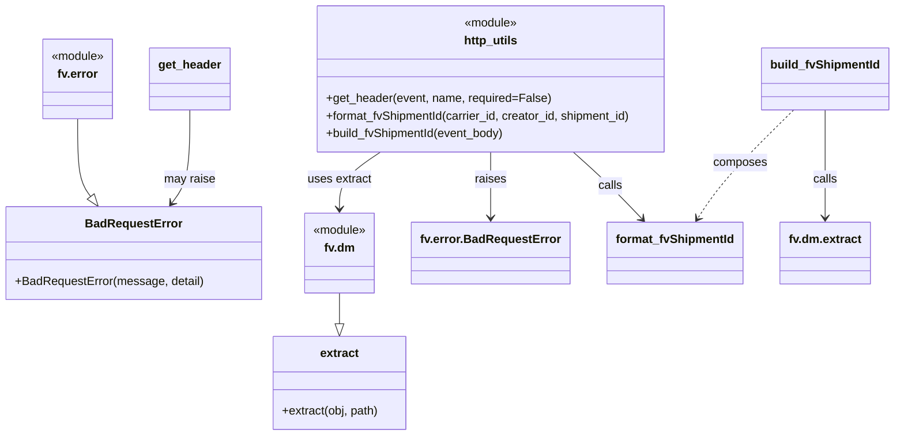

# Diagram: shipment_core/shipment_service/shipment_service/fvshared/httputil.py

> Auto-generated by Obscura crawlers

## Mermaid

### SVG

<svg id="container" width="1197.8828125" xmlns="http://www.w3.org/2000/svg" class="classDiagram" height="590" viewBox="0 0 1197.8828125 590" role="graphics-document document" aria-roledescription="class"><g><defs><marker id="container_class-aggregationStart" class="marker aggregation class" refX="18" refY="7" markerWidth="190" markerHeight="240" orient="auto"><path d="M 18,7 L9,13 L1,7 L9,1 Z"></path></marker></defs><defs><marker id="container_class-aggregationEnd" class="marker aggregation class" refX="1" refY="7" markerWidth="20" markerHeight="28" orient="auto"><path d="M 18,7 L9,13 L1,7 L9,1 Z"></path></marker></defs><defs><marker id="container_class-extensionStart" class="marker extension class" refX="18" refY="7" markerWidth="190" markerHeight="240" orient="auto"><path d="M 1,7 L18,13 V 1 Z"></path></marker></defs><defs><marker id="container_class-extensionEnd" class="marker extension class" refX="1" refY="7" markerWidth="20" markerHeight="28" orient="auto"><path d="M 1,1 V 13 L18,7 Z"></path></marker></defs><defs><marker id="container_class-compositionStart" class="marker composition class" refX="18" refY="7" markerWidth="190" markerHeight="240" orient="auto"><path d="M 18,7 L9,13 L1,7 L9,1 Z"></path></marker></defs><defs><marker id="container_class-compositionEnd" class="marker composition class" refX="1" refY="7" markerWidth="20" markerHeight="28" orient="auto"><path d="M 18,7 L9,13 L1,7 L9,1 Z"></path></marker></defs><defs><marker id="container_class-dependencyStart" class="marker dependency class" refX="6" refY="7" markerWidth="190" markerHeight="240" orient="auto"><path d="M 5,7 L9,13 L1,7 L9,1 Z"></path></marker></defs><defs><marker id="container_class-dependencyEnd" class="marker dependency class" refX="13" refY="7" markerWidth="20" markerHeight="28" orient="auto"><path d="M 18,7 L9,13 L14,7 L9,1 Z"></path></marker></defs><defs><marker id="container_class-lollipopStart" class="marker lollipop class" refX="13" refY="7" markerWidth="190" markerHeight="240" orient="auto"><circle stroke="black" fill="transparent" cx="7" cy="7" r="6"></circle></marker></defs><defs><marker id="container_class-lollipopEnd" class="marker lollipop class" refX="1" refY="7" markerWidth="190" markerHeight="240" orient="auto"><circle stroke="black" fill="transparent" cx="7" cy="7" r="6"></circle></marker></defs><g class="root"><g class="clusters"></g><g class="edgePaths"><path d="M101.676,161L101.676,174.667C101.676,188.333,101.676,215.667,104.629,233.212C107.582,250.758,113.488,258.516,116.441,262.396L119.395,266.275" id="id_fv.error_BadRequestError_1" class="edge-thickness-normal edge-pattern-solid relation" style=";;;" data-edge="true" data-et="edge" data-id="id_fv.error_BadRequestError_1" data-points="W3sieCI6MTAxLjY3NTc4MTI1LCJ5IjoxNjF9LHsieCI6MTAxLjY3NTc4MTI1LCJ5IjoyNDN9LHsieCI6MTI5Ljg0MzQ3NjU2MjUsInkiOjI4MH1d" marker-end="url(#container_class-extensionEnd)"></path><path d="M462.547,397L462.547,402.667C462.547,408.333,462.547,419.667,462.547,426.625C462.547,433.583,462.547,436.167,462.547,437.458L462.547,438.75" id="id_fv.dm_extract_2" class="edge-thickness-normal edge-pattern-solid relation" style=";;;" data-edge="true" data-et="edge" data-id="id_fv.dm_extract_2" data-points="W3sieCI6NDYyLjU0Njg3NSwieSI6Mzk3fSx7IngiOjQ2Mi41NDY4NzUsInkiOjQzMX0seyJ4Ijo0NjIuNTQ2ODc1LCJ5Ijo0NTZ9XQ==" marker-end="url(#container_class-extensionEnd)"></path><path d="M516.523,206L507.527,212.167C498.531,218.333,480.539,230.667,471.543,243.5C462.547,256.333,462.547,269.667,462.547,276.333L462.547,283" id="id_http_utils_fv.dm_3" class="edge-thickness-normal edge-pattern-solid relation" style=";;;" data-edge="true" data-et="edge" data-id="id_http_utils_fv.dm_3" data-points="W3sieCI6NTE2LjUyMzQ1MTg2MTIxMzMsInkiOjIwNn0seyJ4Ijo0NjIuNTQ2ODc1LCJ5IjoyNDN9LHsieCI6NDYyLjU0Njg3NSwieSI6Mjg5fV0=" marker-end="url(#container_class-dependencyEnd)"></path><path d="M662.919,206L663.042,212.167C663.165,218.333,663.411,230.667,663.533,245.5C663.656,260.333,663.656,277.667,663.656,286.333L663.656,295" id="id_http_utils_fv.error.BadRequestError_4" class="edge-thickness-normal edge-pattern-solid relation" style=";;;" data-edge="true" data-et="edge" data-id="id_http_utils_fv.error.BadRequestError_4" data-points="W3sieCI6NjYyLjkxOTI0Njg5Nzk3NzksInkiOjIwNn0seyJ4Ijo2NjMuNjU2MjUsInkiOjI0M30seyJ4Ijo2NjMuNjU2MjUsInkiOjMwMX1d" marker-end="url(#container_class-dependencyEnd)"></path><path d="M772.216,206L779.146,212.167C786.077,218.333,799.939,230.667,815.128,245.766C830.317,260.865,846.832,278.73,855.09,287.662L863.348,296.594" id="id_http_utils_format_fvShipmentId_5" class="edge-thickness-normal edge-pattern-solid relation" style=";;;" data-edge="true" data-et="edge" data-id="id_http_utils_format_fvShipmentId_5" data-points="W3sieCI6NzcyLjIxNTYzMzYxNjcyNzksInkiOjIwNn0seyJ4Ijo4MTMuODAwNzgxMjUsInkiOjI0M30seyJ4Ijo4NjcuNDIxMzI4MTI1LCJ5IjozMDF9XQ==" marker-end="url(#container_class-dependencyEnd)"></path><path d="M1063.847,149L1048.147,164.667C1032.446,180.333,1001.045,211.667,979.752,236.155C958.459,260.644,947.274,278.288,941.681,287.11L936.088,295.932" id="id_build_fvShipmentId_format_fvShipmentId_6" class="edge-thickness-normal edge-pattern-dashed relation" style=";;;" data-edge="true" data-et="edge" data-id="id_build_fvShipmentId_format_fvShipmentId_6" data-points="W3sieCI6MTA2My44NDcwMjQzNTY2MTc2LCJ5IjoxNDl9LHsieCI6OTY5LjY0NDUzMTI1LCJ5IjoyNDN9LHsieCI6OTMyLjg3NTcwMzEyNSwieSI6MzAxfV0=" marker-end="url(#container_class-dependencyEnd)"></path><path d="M1105.938,149L1105.938,164.667C1105.938,180.333,1105.938,211.667,1105.938,236C1105.938,260.333,1105.938,277.667,1105.938,286.333L1105.938,295" id="id_build_fvShipmentId_fv.dm.extract_7" class="edge-thickness-normal edge-pattern-solid relation" style=";;;" data-edge="true" data-et="edge" data-id="id_build_fvShipmentId_fv.dm.extract_7" data-points="W3sieCI6MTEwNS45Mzc1LCJ5IjoxNDl9LHsieCI6MTEwNS45Mzc1LCJ5IjoyNDN9LHsieCI6MTEwNS45Mzc1LCJ5IjozMDF9XQ==" marker-end="url(#container_class-dependencyEnd)"></path><path d="M253.934,149L253.934,164.667C253.934,180.333,253.934,211.667,249.845,232.704C245.756,253.742,237.578,264.484,233.489,269.855L229.4,275.226" id="id_get_header_BadRequestError_8" class="edge-thickness-normal edge-pattern-solid relation" style=";;;" data-edge="true" data-et="edge" data-id="id_get_header_BadRequestError_8" data-points="W3sieCI6MjUzLjkzMzU5Mzc1LCJ5IjoxNDl9LHsieCI6MjUzLjkzMzU5Mzc1LCJ5IjoyNDN9LHsieCI6MjI1Ljc2NTg5ODQzNzUsInkiOjI4MH1d" marker-end="url(#container_class-dependencyEnd)"></path></g><g class="edgeLabels"><g class="edgeLabel"><g class="label" data-id="id_fv.error_BadRequestError_1" transform="translate(0, 0)"><foreignObject width="0" height="0">

</foreignObject></g></g><g class="edgeLabel"><g class="label" data-id="id_fv.dm_extract_2" transform="translate(0, 0)"><foreignObject width="0" height="0">

</foreignObject></g></g><g class="edgeLabel" transform="translate(462.546875, 243)"><g class="label" data-id="id_http_utils_fv.dm_3" transform="translate(-43.5390625, -12)"><foreignObject width="87.078125" height="24">

uses extract

</foreignObject></g></g><g class="edgeLabel" transform="translate(663.65625, 243)"><g class="label" data-id="id_http_utils_fv.error.BadRequestError_4" transform="translate(-21.25, -12)"><foreignObject width="42.5" height="24">

raises

</foreignObject></g></g><g class="edgeLabel" transform="translate(821.71803, 251.56389)"><g class="label" data-id="id_http_utils_format_fvShipmentId_5" transform="translate(-16.4453125, -12)"><foreignObject width="32.890625" height="24">

calls

</foreignObject></g></g><g class="edgeLabel" transform="translate(992.44018, 220.25335)"><g class="label" data-id="id_build_fvShipmentId_format_fvShipmentId_6" transform="translate(-36.453125, -12)"><foreignObject width="72.90625" height="24">

composes

</foreignObject></g></g><g class="edgeLabel" transform="translate(1105.9375, 243)"><g class="label" data-id="id_build_fvShipmentId_fv.dm.extract_7" transform="translate(-16.4453125, -12)"><foreignObject width="32.890625" height="24">

calls

</foreignObject></g></g><g class="edgeLabel" transform="translate(253.93359375, 243)"><g class="label" data-id="id_get_header_BadRequestError_8" transform="translate(-34.65625, -12)"><foreignObject width="69.3125" height="24">

may raise

</foreignObject></g></g></g><g class="nodes"><g class="node default" id="classId-fv.error-0" transform="translate(101.67578125, 107)"><g class="basic label-container"><path d="M-48.6015625 -54 L48.6015625 -54 L48.6015625 54 L-48.6015625 54" stroke="none" stroke-width="0" fill="#ECECFF" style=""></path><path d="M-48.6015625 -54 C-16.81040748460502 -54, 14.980747530789962 -54, 48.6015625 -54 M-48.6015625 -54 C-16.03618643307327 -54, 16.529189633853463 -54, 48.6015625 -54 M48.6015625 -54 C48.6015625 -11.683974183354486, 48.6015625 30.632051633291027, 48.6015625 54 M48.6015625 -54 C48.6015625 -21.719819427351936, 48.6015625 10.560361145296127, 48.6015625 54 M48.6015625 54 C9.90913594707532 54, -28.78329060584936 54, -48.6015625 54 M48.6015625 54 C26.66487371799296 54, 4.728184935985922 54, -48.6015625 54 M-48.6015625 54 C-48.6015625 28.374610076681844, -48.6015625 2.7492201533636873, -48.6015625 -54 M-48.6015625 54 C-48.6015625 28.981133221596792, -48.6015625 3.9622664431935846, -48.6015625 -54" stroke="#9370DB" stroke-width="1.3" fill="none" stroke-dasharray="0 0" style=""></path></g><g class="annotation-group text" transform="translate(-36.6015625, -30)"><g class="label" style="" transform="translate(0,-12)"><foreignObject width="73.203125" height="24">

«module»

</foreignObject></g></g><g class="label-group text" transform="translate(-26.9453125, -6)"><g class="label" style="font-weight: bolder" transform="translate(0,-12)"><foreignObject width="53.890625" height="24">

fv.error

</foreignObject></g></g><g class="members-group text" transform="translate(-36.6015625, 42)"></g><g class="methods-group text" transform="translate(-36.6015625, 72)"></g><g class="divider" style=""><path d="M-48.6015625 18 C-24.13596028067706 18, 0.329641938645878 18, 48.6015625 18 M-48.6015625 18 C-13.826717028671062 18, 20.948128442657875 18, 48.6015625 18" stroke="#9370DB" stroke-width="1.3" fill="none" stroke-dasharray="0 0" style=""></path></g><g class="divider" style=""><path d="M-48.6015625 36 C-10.146734087389774 36, 28.308094325220452 36, 48.6015625 36 M-48.6015625 36 C-23.931446021955484 36, 0.7386704560890323 36, 48.6015625 36" stroke="#9370DB" stroke-width="1.3" fill="none" stroke-dasharray="0 0" style=""></path></g></g><g class="node default" id="classId-BadRequestError-1" transform="translate(177.8046875, 343)"><g class="basic label-container"><path d="M-169.8046875 -63 L169.8046875 -63 L169.8046875 63 L-169.8046875 63" stroke="none" stroke-width="0" fill="#ECECFF" style=""></path><path d="M-169.8046875 -63 C-99.52753643188616 -63, -29.250385363772324 -63, 169.8046875 -63 M-169.8046875 -63 C-83.29592906989328 -63, 3.2128293602134477 -63, 169.8046875 -63 M169.8046875 -63 C169.8046875 -36.71529379952531, 169.8046875 -10.430587599050618, 169.8046875 63 M169.8046875 -63 C169.8046875 -35.90252411165474, 169.8046875 -8.805048223309491, 169.8046875 63 M169.8046875 63 C92.57376505447117 63, 15.342842608942334 63, -169.8046875 63 M169.8046875 63 C67.08525930444156 63, -35.63416889111687 63, -169.8046875 63 M-169.8046875 63 C-169.8046875 30.335488465230867, -169.8046875 -2.329023069538266, -169.8046875 -63 M-169.8046875 63 C-169.8046875 16.948256617350843, -169.8046875 -29.103486765298314, -169.8046875 -63" stroke="#9370DB" stroke-width="1.3" fill="none" stroke-dasharray="0 0" style=""></path></g><g class="annotation-group text" transform="translate(0, -39)"></g><g class="label-group text" transform="translate(-62.28125, -39)"><g class="label" style="font-weight: bolder" transform="translate(0,-12)"><foreignObject width="124.5625" height="24">

BadRequestError

</foreignObject></g></g><g class="members-group text" transform="translate(-157.8046875, 9)"></g><g class="methods-group text" transform="translate(-157.8046875, 39)"><g class="label" style="" transform="translate(0,-12)"><foreignObject width="253.328125" height="24">

+BadRequestError(message, detail)

</foreignObject></g></g><g class="divider" style=""><path d="M-169.8046875 -15 C-65.24495202079827 -15, 39.31478345840347 -15, 169.8046875 -15 M-169.8046875 -15 C-96.86493602799771 -15, -23.92518455599543 -15, 169.8046875 -15" stroke="#9370DB" stroke-width="1.3" fill="none" stroke-dasharray="0 0" style=""></path></g><g class="divider" style=""><path d="M-169.8046875 9 C-56.71323666039203 9, 56.378214179215945 9, 169.8046875 9 M-169.8046875 9 C-56.9042802079741 9, 55.99612708405181 9, 169.8046875 9" stroke="#9370DB" stroke-width="1.3" fill="none" stroke-dasharray="0 0" style=""></path></g></g><g class="node default" id="classId-fv.dm-2" transform="translate(462.546875, 343)"><g class="basic label-container"><path d="M-48.6015625 -54 L48.6015625 -54 L48.6015625 54 L-48.6015625 54" stroke="none" stroke-width="0" fill="#ECECFF" style=""></path><path d="M-48.6015625 -54 C-16.281385668108314 -54, 16.038791163783372 -54, 48.6015625 -54 M-48.6015625 -54 C-26.30552467172793 -54, -4.009486843455861 -54, 48.6015625 -54 M48.6015625 -54 C48.6015625 -11.412236950245386, 48.6015625 31.175526099509227, 48.6015625 54 M48.6015625 -54 C48.6015625 -11.96015886753969, 48.6015625 30.07968226492062, 48.6015625 54 M48.6015625 54 C28.307649174471166 54, 8.013735848942332 54, -48.6015625 54 M48.6015625 54 C17.000279170029106 54, -14.601004159941787 54, -48.6015625 54 M-48.6015625 54 C-48.6015625 31.631255882059317, -48.6015625 9.262511764118635, -48.6015625 -54 M-48.6015625 54 C-48.6015625 12.839750815365164, -48.6015625 -28.32049836926967, -48.6015625 -54" stroke="#9370DB" stroke-width="1.3" fill="none" stroke-dasharray="0 0" style=""></path></g><g class="annotation-group text" transform="translate(-36.6015625, -30)"><g class="label" style="" transform="translate(0,-12)"><foreignObject width="73.203125" height="24">

«module»

</foreignObject></g></g><g class="label-group text" transform="translate(-20.0390625, -6)"><g class="label" style="font-weight: bolder" transform="translate(0,-12)"><foreignObject width="40.078125" height="24">

fv.dm

</foreignObject></g></g><g class="members-group text" transform="translate(-36.6015625, 42)"></g><g class="methods-group text" transform="translate(-36.6015625, 72)"></g><g class="divider" style=""><path d="M-48.6015625 18 C-17.231126790522875 18, 14.13930891895425 18, 48.6015625 18 M-48.6015625 18 C-11.14855612977594 18, 26.30445024044812 18, 48.6015625 18" stroke="#9370DB" stroke-width="1.3" fill="none" stroke-dasharray="0 0" style=""></path></g><g class="divider" style=""><path d="M-48.6015625 36 C-16.247038462055613 36, 16.107485575888774 36, 48.6015625 36 M-48.6015625 36 C-16.68625154149988 36, 15.229059417000236 36, 48.6015625 36" stroke="#9370DB" stroke-width="1.3" fill="none" stroke-dasharray="0 0" style=""></path></g></g><g class="node default" id="classId-extract-3" transform="translate(462.546875, 519)"><g class="basic label-container"><path d="M-91.28125 -63 L91.28125 -63 L91.28125 63 L-91.28125 63" stroke="none" stroke-width="0" fill="#ECECFF" style=""></path><path d="M-91.28125 -63 C-30.041301597118753 -63, 31.198646805762493 -63, 91.28125 -63 M-91.28125 -63 C-28.235639649600877 -63, 34.809970700798246 -63, 91.28125 -63 M91.28125 -63 C91.28125 -32.65512689025255, 91.28125 -2.310253780505107, 91.28125 63 M91.28125 -63 C91.28125 -25.657014176545793, 91.28125 11.685971646908413, 91.28125 63 M91.28125 63 C23.53320960841198 63, -44.21483078317604 63, -91.28125 63 M91.28125 63 C51.223526594966856 63, 11.165803189933712 63, -91.28125 63 M-91.28125 63 C-91.28125 15.573281231767119, -91.28125 -31.853437536465762, -91.28125 -63 M-91.28125 63 C-91.28125 32.637972629387896, -91.28125 2.275945258775792, -91.28125 -63" stroke="#9370DB" stroke-width="1.3" fill="none" stroke-dasharray="0 0" style=""></path></g><g class="annotation-group text" transform="translate(0, -39)"></g><g class="label-group text" transform="translate(-25.734375, -39)"><g class="label" style="font-weight: bolder" transform="translate(0,-12)"><foreignObject width="51.46875" height="24">

extract

</foreignObject></g></g><g class="members-group text" transform="translate(-79.28125, 9)"></g><g class="methods-group text" transform="translate(-79.28125, 39)"><g class="label" style="" transform="translate(0,-12)"><foreignObject width="132.828125" height="24">

+extract(obj, path)

</foreignObject></g></g><g class="divider" style=""><path d="M-91.28125 -15 C-32.87134561029576 -15, 25.538558779408476 -15, 91.28125 -15 M-91.28125 -15 C-49.57465815309155 -15, -7.8680663061830955 -15, 91.28125 -15" stroke="#9370DB" stroke-width="1.3" fill="none" stroke-dasharray="0 0" style=""></path></g><g class="divider" style=""><path d="M-91.28125 9 C-47.53971469568724 9, -3.7981793913744752 9, 91.28125 9 M-91.28125 9 C-47.9428406373511 9, -4.604431274702193 9, 91.28125 9" stroke="#9370DB" stroke-width="1.3" fill="none" stroke-dasharray="0 0" style=""></path></g></g><g class="node default" id="classId-http_utils-4" transform="translate(660.947265625, 107)"><g class="basic label-container"><path d="M-240.85546875 -99 L240.85546875 -99 L240.85546875 99 L-240.85546875 99" stroke="none" stroke-width="0" fill="#ECECFF" style=""></path><path d="M-240.85546875 -99 C-57.637375685989014 -99, 125.58071737802197 -99, 240.85546875 -99 M-240.85546875 -99 C-86.3639178617531 -99, 68.12763302649381 -99, 240.85546875 -99 M240.85546875 -99 C240.85546875 -27.08393931539456, 240.85546875 44.83212136921088, 240.85546875 99 M240.85546875 -99 C240.85546875 -54.77182792156237, 240.85546875 -10.54365584312474, 240.85546875 99 M240.85546875 99 C131.15473897372425 99, 21.4540091974485 99, -240.85546875 99 M240.85546875 99 C119.48363536258663 99, -1.8881980248267496 99, -240.85546875 99 M-240.85546875 99 C-240.85546875 24.501073199207028, -240.85546875 -49.997853601585945, -240.85546875 -99 M-240.85546875 99 C-240.85546875 44.440446361608196, -240.85546875 -10.119107276783609, -240.85546875 -99" stroke="#9370DB" stroke-width="1.3" fill="none" stroke-dasharray="0 0" style=""></path></g><g class="annotation-group text" transform="translate(-36.6015625, -75)"><g class="label" style="" transform="translate(0,-12)"><foreignObject width="73.203125" height="24">

«module»

</foreignObject></g></g><g class="label-group text" transform="translate(-35.5703125, -51)"><g class="label" style="font-weight: bolder" transform="translate(0,-12)"><foreignObject width="71.140625" height="24">

http_utils

</foreignObject></g></g><g class="members-group text" transform="translate(-228.85546875, -3)"></g><g class="methods-group text" transform="translate(-228.85546875, 27)"><g class="label" style="" transform="translate(0,-12)"><foreignObject width="303.375" height="24">

+get_header(event, name, required=False)

</foreignObject></g><g class="label" style="" transform="translate(0,12)"><foreignObject width="421.109375" height="24">

+format_fvShipmentId(carrier_id, creator_id, shipment_id)

</foreignObject></g><g class="label" style="" transform="translate(0,36)"><foreignObject width="246.03125" height="24">

+build_fvShipmentId(event_body)

</foreignObject></g></g><g class="divider" style=""><path d="M-240.85546875 -27 C-82.78984904999743 -27, 75.27577065000514 -27, 240.85546875 -27 M-240.85546875 -27 C-132.7623020432 -27, -24.66913533639999 -27, 240.85546875 -27" stroke="#9370DB" stroke-width="1.3" fill="none" stroke-dasharray="0 0" style=""></path></g><g class="divider" style=""><path d="M-240.85546875 -3 C-112.87683697150024 -3, 15.101794806999521 -3, 240.85546875 -3 M-240.85546875 -3 C-84.76452550847958 -3, 71.32641773304084 -3, 240.85546875 -3" stroke="#9370DB" stroke-width="1.3" fill="none" stroke-dasharray="0 0" style=""></path></g></g><g class="node default" id="classId-fv.error.BadRequestError-5" transform="translate(663.65625, 343)"><g class="basic label-container"><path d="M-102.5078125 -42 L102.5078125 -42 L102.5078125 42 L-102.5078125 42" stroke="none" stroke-width="0" fill="#ECECFF" style=""></path><path d="M-102.5078125 -42 C-21.78678545230757 -42, 58.93424159538486 -42, 102.5078125 -42 M-102.5078125 -42 C-32.46039548868539 -42, 37.587021522629215 -42, 102.5078125 -42 M102.5078125 -42 C102.5078125 -25.147096189707877, 102.5078125 -8.294192379415755, 102.5078125 42 M102.5078125 -42 C102.5078125 -17.56538557320978, 102.5078125 6.869228853580438, 102.5078125 42 M102.5078125 42 C33.150355295155194 42, -36.20710190968961 42, -102.5078125 42 M102.5078125 42 C44.55176309516383 42, -13.404286309672344 42, -102.5078125 42 M-102.5078125 42 C-102.5078125 14.041193644351658, -102.5078125 -13.917612711296684, -102.5078125 -42 M-102.5078125 42 C-102.5078125 22.303515023346613, -102.5078125 2.6070300466932252, -102.5078125 -42" stroke="#9370DB" stroke-width="1.3" fill="none" stroke-dasharray="0 0" style=""></path></g><g class="annotation-group text" transform="translate(0, -18)"></g><g class="label-group text" transform="translate(-90.5078125, -18)"><g class="label" style="font-weight: bolder" transform="translate(0,-12)"><foreignObject width="181.015625" height="24">

fv.error.BadRequestError

</foreignObject></g></g><g class="members-group text" transform="translate(-90.5078125, 30)"></g><g class="methods-group text" transform="translate(-90.5078125, 60)"></g><g class="divider" style=""><path d="M-102.5078125 6 C-43.179244073459714 6, 16.149324353080573 6, 102.5078125 6 M-102.5078125 6 C-30.44964060015552 6, 41.60853129968896 6, 102.5078125 6" stroke="#9370DB" stroke-width="1.3" fill="none" stroke-dasharray="0 0" style=""></path></g><g class="divider" style=""><path d="M-102.5078125 24 C-50.30263697598641 24, 1.9025385480271808 24, 102.5078125 24 M-102.5078125 24 C-34.84393278592758 24, 32.819946928144844 24, 102.5078125 24" stroke="#9370DB" stroke-width="1.3" fill="none" stroke-dasharray="0 0" style=""></path></g></g><g class="node default" id="classId-format_fvShipmentId-6" transform="translate(906.25, 343)"><g class="basic label-container"><path d="M-90.0859375 -42 L90.0859375 -42 L90.0859375 42 L-90.0859375 42" stroke="none" stroke-width="0" fill="#ECECFF" style=""></path><path d="M-90.0859375 -42 C-39.8353491405185 -42, 10.415239218962995 -42, 90.0859375 -42 M-90.0859375 -42 C-22.618560788253603 -42, 44.84881592349279 -42, 90.0859375 -42 M90.0859375 -42 C90.0859375 -16.34141013134999, 90.0859375 9.317179737300023, 90.0859375 42 M90.0859375 -42 C90.0859375 -22.69788800537407, 90.0859375 -3.3957760107481434, 90.0859375 42 M90.0859375 42 C43.27771949713876 42, -3.530498505722477 42, -90.0859375 42 M90.0859375 42 C50.59170772870521 42, 11.097477957410419 42, -90.0859375 42 M-90.0859375 42 C-90.0859375 9.333358036252093, -90.0859375 -23.333283927495813, -90.0859375 -42 M-90.0859375 42 C-90.0859375 11.305066506668101, -90.0859375 -19.389866986663797, -90.0859375 -42" stroke="#9370DB" stroke-width="1.3" fill="none" stroke-dasharray="0 0" style=""></path></g><g class="annotation-group text" transform="translate(0, -18)"></g><g class="label-group text" transform="translate(-78.0859375, -18)"><g class="label" style="font-weight: bolder" transform="translate(0,-12)"><foreignObject width="156.171875" height="24">

format_fvShipmentId

</foreignObject></g></g><g class="members-group text" transform="translate(-78.0859375, 30)"></g><g class="methods-group text" transform="translate(-78.0859375, 60)"></g><g class="divider" style=""><path d="M-90.0859375 6 C-46.34065459127752 6, -2.59537168255504 6, 90.0859375 6 M-90.0859375 6 C-37.37016831573819 6, 15.345600868523618 6, 90.0859375 6" stroke="#9370DB" stroke-width="1.3" fill="none" stroke-dasharray="0 0" style=""></path></g><g class="divider" style=""><path d="M-90.0859375 24 C-48.97828443302926 24, -7.870631366058518 24, 90.0859375 24 M-90.0859375 24 C-48.1337166149949 24, -6.1814957299898055 24, 90.0859375 24" stroke="#9370DB" stroke-width="1.3" fill="none" stroke-dasharray="0 0" style=""></path></g></g><g class="node default" id="classId-build_fvShipmentId-7" transform="translate(1105.9375, 107)"><g class="basic label-container"><path d="M-83.9453125 -42 L83.9453125 -42 L83.9453125 42 L-83.9453125 42" stroke="none" stroke-width="0" fill="#ECECFF" style=""></path><path d="M-83.9453125 -42 C-50.18166227120834 -42, -16.418012042416677 -42, 83.9453125 -42 M-83.9453125 -42 C-44.040898051456374 -42, -4.136483602912747 -42, 83.9453125 -42 M83.9453125 -42 C83.9453125 -21.998585227820502, 83.9453125 -1.9971704556410046, 83.9453125 42 M83.9453125 -42 C83.9453125 -13.470954168822484, 83.9453125 15.058091662355032, 83.9453125 42 M83.9453125 42 C31.764333763574648 42, -20.416644972850705 42, -83.9453125 42 M83.9453125 42 C31.684652682642778 42, -20.576007134714445 42, -83.9453125 42 M-83.9453125 42 C-83.9453125 10.362656718792454, -83.9453125 -21.27468656241509, -83.9453125 -42 M-83.9453125 42 C-83.9453125 22.07686107485463, -83.9453125 2.1537221497092602, -83.9453125 -42" stroke="#9370DB" stroke-width="1.3" fill="none" stroke-dasharray="0 0" style=""></path></g><g class="annotation-group text" transform="translate(0, -18)"></g><g class="label-group text" transform="translate(-71.9453125, -18)"><g class="label" style="font-weight: bolder" transform="translate(0,-12)"><foreignObject width="143.890625" height="24">

build_fvShipmentId

</foreignObject></g></g><g class="members-group text" transform="translate(-71.9453125, 30)"></g><g class="methods-group text" transform="translate(-71.9453125, 60)"></g><g class="divider" style=""><path d="M-83.9453125 6 C-44.61255822129533 6, -5.279803942590661 6, 83.9453125 6 M-83.9453125 6 C-48.917780069123694 6, -13.890247638247388 6, 83.9453125 6" stroke="#9370DB" stroke-width="1.3" fill="none" stroke-dasharray="0 0" style=""></path></g><g class="divider" style=""><path d="M-83.9453125 24 C-41.05915561225711 24, 1.8270012754857845 24, 83.9453125 24 M-83.9453125 24 C-18.9552635383467 24, 46.0347854233066 24, 83.9453125 24" stroke="#9370DB" stroke-width="1.3" fill="none" stroke-dasharray="0 0" style=""></path></g></g><g class="node default" id="classId-fv.dm.extract-8" transform="translate(1105.9375, 343)"><g class="basic label-container"><path d="M-59.6015625 -42 L59.6015625 -42 L59.6015625 42 L-59.6015625 42" stroke="none" stroke-width="0" fill="#ECECFF" style=""></path><path d="M-59.6015625 -42 C-21.853461468916798 -42, 15.894639562166404 -42, 59.6015625 -42 M-59.6015625 -42 C-34.05660665054273 -42, -8.511650801085473 -42, 59.6015625 -42 M59.6015625 -42 C59.6015625 -10.745561495908959, 59.6015625 20.508877008182083, 59.6015625 42 M59.6015625 -42 C59.6015625 -12.91813400638313, 59.6015625 16.16373198723374, 59.6015625 42 M59.6015625 42 C17.72752061676934 42, -24.14652126646132 42, -59.6015625 42 M59.6015625 42 C35.50508692302246 42, 11.408611346044928 42, -59.6015625 42 M-59.6015625 42 C-59.6015625 13.089453819673672, -59.6015625 -15.821092360652656, -59.6015625 -42 M-59.6015625 42 C-59.6015625 13.936552526867533, -59.6015625 -14.126894946264933, -59.6015625 -42" stroke="#9370DB" stroke-width="1.3" fill="none" stroke-dasharray="0 0" style=""></path></g><g class="annotation-group text" transform="translate(0, -18)"></g><g class="label-group text" transform="translate(-47.6015625, -18)"><g class="label" style="font-weight: bolder" transform="translate(0,-12)"><foreignObject width="95.203125" height="24">

fv.dm.extract

</foreignObject></g></g><g class="members-group text" transform="translate(-47.6015625, 30)"></g><g class="methods-group text" transform="translate(-47.6015625, 60)"></g><g class="divider" style=""><path d="M-59.6015625 6 C-31.60196340677666 6, -3.6023643135533234 6, 59.6015625 6 M-59.6015625 6 C-26.038268823984673 6, 7.525024852030654 6, 59.6015625 6" stroke="#9370DB" stroke-width="1.3" fill="none" stroke-dasharray="0 0" style=""></path></g><g class="divider" style=""><path d="M-59.6015625 24 C-12.275789452745848 24, 35.049983594508305 24, 59.6015625 24 M-59.6015625 24 C-14.163042335687038 24, 31.275477828625924 24, 59.6015625 24" stroke="#9370DB" stroke-width="1.3" fill="none" stroke-dasharray="0 0" style=""></path></g></g><g class="node default" id="classId-get_header-9" transform="translate(253.93359375, 107)"><g class="basic label-container"><path d="M-53.65625 -42 L53.65625 -42 L53.65625 42 L-53.65625 42" stroke="none" stroke-width="0" fill="#ECECFF" style=""></path><path d="M-53.65625 -42 C-24.993568592986986 -42, 3.669112814026029 -42, 53.65625 -42 M-53.65625 -42 C-23.986728833353855 -42, 5.682792333292291 -42, 53.65625 -42 M53.65625 -42 C53.65625 -14.876986273086409, 53.65625 12.246027453827182, 53.65625 42 M53.65625 -42 C53.65625 -13.461012545090039, 53.65625 15.077974909819922, 53.65625 42 M53.65625 42 C28.73973461088006 42, 3.8232192217601195 42, -53.65625 42 M53.65625 42 C17.649088539833656 42, -18.35807292033269 42, -53.65625 42 M-53.65625 42 C-53.65625 11.526252734132935, -53.65625 -18.94749453173413, -53.65625 -42 M-53.65625 42 C-53.65625 14.273484832834406, -53.65625 -13.453030334331189, -53.65625 -42" stroke="#9370DB" stroke-width="1.3" fill="none" stroke-dasharray="0 0" style=""></path></g><g class="annotation-group text" transform="translate(0, -18)"></g><g class="label-group text" transform="translate(-41.65625, -18)"><g class="label" style="font-weight: bolder" transform="translate(0,-12)"><foreignObject width="83.3125" height="24">

get_header

</foreignObject></g></g><g class="members-group text" transform="translate(-41.65625, 30)"></g><g class="methods-group text" transform="translate(-41.65625, 60)"></g><g class="divider" style=""><path d="M-53.65625 6 C-25.982781171956525 6, 1.6906876560869506 6, 53.65625 6 M-53.65625 6 C-26.71954067411831 6, 0.21716865176338018 6, 53.65625 6" stroke="#9370DB" stroke-width="1.3" fill="none" stroke-dasharray="0 0" style=""></path></g><g class="divider" style=""><path d="M-53.65625 24 C-29.488396786416097 24, -5.320543572832193 24, 53.65625 24 M-53.65625 24 C-17.966905116646558 24, 17.722439766706884 24, 53.65625 24" stroke="#9370DB" stroke-width="1.3" fill="none" stroke-dasharray="0 0" style=""></path></g></g></g></g></g></svg>
