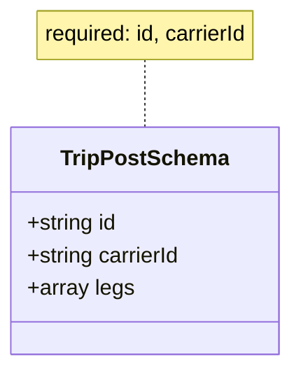

# Diagram: shipment_core/shipment_service/shipment_service/fvshared/json_schema/trip_post.py

> Auto-generated by Obscura crawlers

## Mermaid

### SVG

<svg id="container" width="215.203125" xmlns="http://www.w3.org/2000/svg" class="classDiagram" height="270" viewBox="0 0 215.203125 270" role="graphics-document document" aria-roledescription="class"><g><defs><marker id="container_class-aggregationStart" class="marker aggregation class" refX="18" refY="7" markerWidth="190" markerHeight="240" orient="auto"><path d="M 18,7 L9,13 L1,7 L9,1 Z"></path></marker></defs><defs><marker id="container_class-aggregationEnd" class="marker aggregation class" refX="1" refY="7" markerWidth="20" markerHeight="28" orient="auto"><path d="M 18,7 L9,13 L1,7 L9,1 Z"></path></marker></defs><defs><marker id="container_class-extensionStart" class="marker extension class" refX="18" refY="7" markerWidth="190" markerHeight="240" orient="auto"><path d="M 1,7 L18,13 V 1 Z"></path></marker></defs><defs><marker id="container_class-extensionEnd" class="marker extension class" refX="1" refY="7" markerWidth="20" markerHeight="28" orient="auto"><path d="M 1,1 V 13 L18,7 Z"></path></marker></defs><defs><marker id="container_class-compositionStart" class="marker composition class" refX="18" refY="7" markerWidth="190" markerHeight="240" orient="auto"><path d="M 18,7 L9,13 L1,7 L9,1 Z"></path></marker></defs><defs><marker id="container_class-compositionEnd" class="marker composition class" refX="1" refY="7" markerWidth="20" markerHeight="28" orient="auto"><path d="M 18,7 L9,13 L1,7 L9,1 Z"></path></marker></defs><defs><marker id="container_class-dependencyStart" class="marker dependency class" refX="6" refY="7" markerWidth="190" markerHeight="240" orient="auto"><path d="M 5,7 L9,13 L1,7 L9,1 Z"></path></marker></defs><defs><marker id="container_class-dependencyEnd" class="marker dependency class" refX="13" refY="7" markerWidth="20" markerHeight="28" orient="auto"><path d="M 18,7 L9,13 L14,7 L9,1 Z"></path></marker></defs><defs><marker id="container_class-lollipopStart" class="marker lollipop class" refX="13" refY="7" markerWidth="190" markerHeight="240" orient="auto"><circle stroke="black" fill="transparent" cx="7" cy="7" r="6"></circle></marker></defs><defs><marker id="container_class-lollipopEnd" class="marker lollipop class" refX="1" refY="7" markerWidth="190" markerHeight="240" orient="auto"><circle stroke="black" fill="transparent" cx="7" cy="7" r="6"></circle></marker></defs><g class="root"><g class="clusters"></g><g class="edgePaths"><path d="M107.602,44L107.602,48.167C107.602,52.333,107.602,60.667,107.602,69C107.602,77.333,107.602,85.667,107.602,89.833L107.602,94" id="edgeNote1" class="edge-thickness-normal edge-pattern-dotted relation" style="fill: none;;;fill: none" data-edge="true" data-et="edge" data-id="edgeNote1" data-points="W3sieCI6MTA3LjYwMTU2MjUsInkiOjQ0fSx7IngiOjEwNy42MDE1NjI1LCJ5Ijo2OX0seyJ4IjoxMDcuNjAxNTYyNSwieSI6OTR9XQ=="></path></g><g class="edgeLabels"><g class="edgeLabel"><g class="label" data-id="edgeNote1" transform="translate(0, 0)"><foreignObject width="0" height="0">

</foreignObject></g></g></g><g class="nodes"><g class="node default" id="classId-TripPostSchema-0" transform="translate(107.6015625, 178)"><g class="basic label-container"><path d="M-99.6015625 -84 L99.6015625 -84 L99.6015625 84 L-99.6015625 84" stroke="none" stroke-width="0" fill="#ECECFF" style=""></path><path d="M-99.6015625 -84 C-39.52781419215439 -84, 20.545934115691225 -84, 99.6015625 -84 M-99.6015625 -84 C-38.986898333486195 -84, 21.62776583302761 -84, 99.6015625 -84 M99.6015625 -84 C99.6015625 -49.05734236198023, 99.6015625 -14.114684723960465, 99.6015625 84 M99.6015625 -84 C99.6015625 -48.85132393374777, 99.6015625 -13.702647867495543, 99.6015625 84 M99.6015625 84 C50.69660429186268 84, 1.7916460837253538 84, -99.6015625 84 M99.6015625 84 C26.473974965126487 84, -46.653612569747025 84, -99.6015625 84 M-99.6015625 84 C-99.6015625 29.241318264124395, -99.6015625 -25.51736347175121, -99.6015625 -84 M-99.6015625 84 C-99.6015625 24.195874657030487, -99.6015625 -35.608250685939026, -99.6015625 -84" stroke="#9370DB" stroke-width="1.3" fill="none" stroke-dasharray="0 0" style=""></path></g><g class="annotation-group text" transform="translate(0, -60)"></g><g class="label-group text" transform="translate(-59.09375, -60)"><g class="label" style="font-weight: bolder" transform="translate(0,-12)"><foreignObject width="118.1875" height="24">

TripPostSchema

</foreignObject></g></g><g class="members-group text" transform="translate(-87.6015625, -12)"><g class="label" style="" transform="translate(0,-12)"><foreignObject width="67.9375" height="24">

+string id

</foreignObject></g><g class="label" style="" transform="translate(0,12)"><foreignObject width="116.109375" height="24">

+string carrierId

</foreignObject></g><g class="label" style="" transform="translate(0,36)"><foreignObject width="77.828125" height="24">

+array legs

</foreignObject></g></g><g class="methods-group text" transform="translate(-87.6015625, 84)"></g><g class="divider" style=""><path d="M-99.6015625 -36 C-38.132754643175 -36, 23.336053213650004 -36, 99.6015625 -36 M-99.6015625 -36 C-24.691582371984325 -36, 50.21839775603135 -36, 99.6015625 -36" stroke="#9370DB" stroke-width="1.3" fill="none" stroke-dasharray="0 0" style=""></path></g><g class="divider" style=""><path d="M-99.6015625 60 C-43.33659277183947 60, 12.92837695632106 60, 99.6015625 60 M-99.6015625 60 C-41.18346677535084 60, 17.234628949298326 60, 99.6015625 60" stroke="#9370DB" stroke-width="1.3" fill="none" stroke-dasharray="0 0" style=""></path></g></g><g class="node undefined" id="note0" transform="translate(107.6015625, 26)"><g class="basic label-container"><path d="M-83.140625 -18 L83.140625 -18 L83.140625 18 L-83.140625 18" stroke="none" stroke-width="0" fill="#fff5ad" style="fill:#fff5ad !important;stroke:#aaaa33 !important"></path><path d="M-83.140625 -18 C-19.348340629641164 -18, 44.44394374071767 -18, 83.140625 -18 M-83.140625 -18 C-29.08653800212076 -18, 24.967548995758477 -18, 83.140625 -18 M83.140625 -18 C83.140625 -7.363907701326527, 83.140625 3.2721845973469463, 83.140625 18 M83.140625 -18 C83.140625 -9.032694207412572, 83.140625 -0.06538841482514357, 83.140625 18 M83.140625 18 C25.526233757762768 18, -32.088157484474465 18, -83.140625 18 M83.140625 18 C24.52435219969643 18, -34.09192060060714 18, -83.140625 18 M-83.140625 18 C-83.140625 3.6649451073472967, -83.140625 -10.670109785305407, -83.140625 -18 M-83.140625 18 C-83.140625 7.111689546700777, -83.140625 -3.7766209065984455, -83.140625 -18" stroke="#aaaa33" stroke-width="1.3" fill="none" stroke-dasharray="0 0" style="fill:#fff5ad !important;stroke:#aaaa33 !important"></path></g><g class="label" style="text-align:left !important;white-space:nowrap !important" transform="translate(-77.140625, -12)"><rect></rect><foreignObject width="154.28125" height="24">

required: id, carrierId

</foreignObject></g></g></g></g></g></svg>
