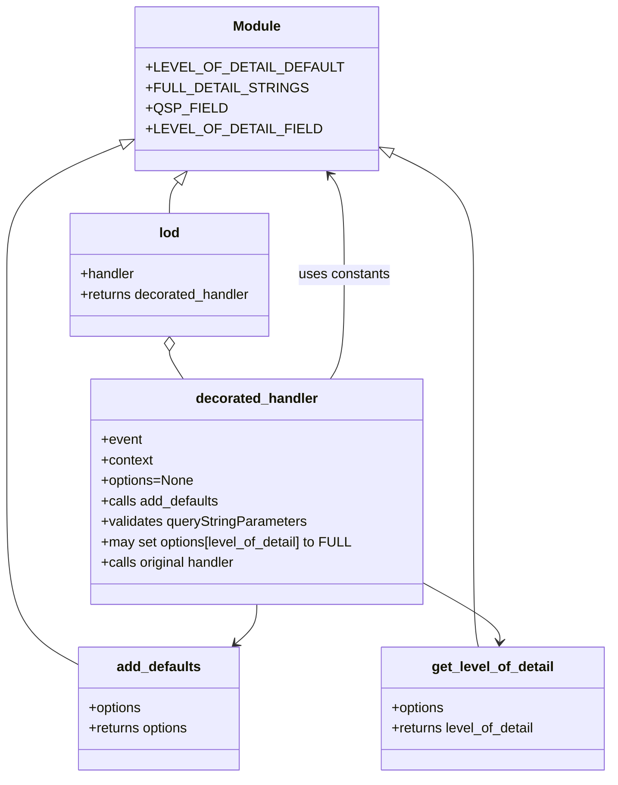

# Diagram: shipment_core/shipment_service/shipment_service/fvshared/level_of_detail.py


> Auto-generated by Obscura crawlers

## Diagram 1

```mermaid
flowchart TD
    Event[Incoming event] --> DecoratedHandler((decorated_handler))
    DecoratedHandler --> AddDefaults[/add_defaults(options)/]
    AddDefaults --> OptionsSet{"options is None?\n(set default LEVEL_OF_DETAIL)"}
    OptionsSet -- yes --> DefaultsApplied[/options[level_of_detail]=LEVEL_OF_DETAIL_DEFAULT/]
    OptionsSet -- no --> DefaultsKept[/use existing options/]
    DecoratedHandler --> CheckQSP{event[queryStringParameters]\nexists and not None?}
    CheckQSP -- yes --> LodValue[/lod_value = event[queryStringParameters].get(level_of_detail, DEFAULT)/]
    LodValue --> IsString{isinstance(lod_value, string_types)?}
    IsString -- yes --> InFullList{lod_value.lower() in FULL_DETAIL_STRINGS?}
    InFullList -- yes --> SetFull[/options[level_of_detail]=SHIPMENT_INFO_LOD_FULL/]
    InFullList -- no --> KeepDefault[/options unchanged/]
    IsString -- no --> KeepDefault
    CheckQSP -- no --> SkipQSP[/keep defaults/]
    DecoratedHandler --> TryExcept[/try: ... except (KeyError, ValueError): log warning/]
    TryExcept --> CallHandler[/return handler(event, context, options)/]
    CallHandler --> Response[Handler Response]
```

> SVG rendering failed for this diagram.

## Diagram 2



### SVG

<svg id="container" width="725.6407470703125" xmlns="http://www.w3.org/2000/svg" class="classDiagram" height="910" viewBox="-73.38099670410156 0 725.6407470703125 910" role="graphics-document document" aria-roledescription="class"><style>#container{font-family:"trebuchet ms",verdana,arial,sans-serif;font-size:16px;fill:#333;}@keyframes edge-animation-frame{from{stroke-dashoffset:0;}}@keyframes dash{to{stroke-dashoffset:0;}}#container .edge-animation-slow{stroke-dasharray:9,5!important;stroke-dashoffset:900;animation:dash 50s linear infinite;stroke-linecap:round;}#container .edge-animation-fast{stroke-dasharray:9,5!important;stroke-dashoffset:900;animation:dash 20s linear infinite;stroke-linecap:round;}#container .error-icon{fill:#552222;}#container .error-text{fill:#552222;stroke:#552222;}#container .edge-thickness-normal{stroke-width:1px;}#container .edge-thickness-thick{stroke-width:3.5px;}#container .edge-pattern-solid{stroke-dasharray:0;}#container .edge-thickness-invisible{stroke-width:0;fill:none;}#container .edge-pattern-dashed{stroke-dasharray:3;}#container .edge-pattern-dotted{stroke-dasharray:2;}#container .marker{fill:#333333;stroke:#333333;}#container .marker.cross{stroke:#333333;}#container svg{font-family:"trebuchet ms",verdana,arial,sans-serif;font-size:16px;}#container p{margin:0;}#container g.classGroup text{fill:#9370DB;stroke:none;font-family:"trebuchet ms",verdana,arial,sans-serif;font-size:10px;}#container g.classGroup text .title{font-weight:bolder;}#container .nodeLabel,#container .edgeLabel{color:#131300;}#container .edgeLabel .label rect{fill:#ECECFF;}#container .label text{fill:#131300;}#container .labelBkg{background:#ECECFF;}#container .edgeLabel .label span{background:#ECECFF;}#container .classTitle{font-weight:bolder;}#container .node rect,#container .node circle,#container .node ellipse,#container .node polygon,#container .node path{fill:#ECECFF;stroke:#9370DB;stroke-width:1px;}#container .divider{stroke:#9370DB;stroke-width:1;}#container g.clickable{cursor:pointer;}#container g.classGroup rect{fill:#ECECFF;stroke:#9370DB;}#container g.classGroup line{stroke:#9370DB;stroke-width:1;}#container .classLabel .box{stroke:none;stroke-width:0;fill:#ECECFF;opacity:0.5;}#container .classLabel .label{fill:#9370DB;font-size:10px;}#container .relation{stroke:#333333;stroke-width:1;fill:none;}#container .dashed-line{stroke-dasharray:3;}#container .dotted-line{stroke-dasharray:1 2;}#container #compositionStart,#container .composition{fill:#333333!important;stroke:#333333!important;stroke-width:1;}#container #compositionEnd,#container .composition{fill:#333333!important;stroke:#333333!important;stroke-width:1;}#container #dependencyStart,#container .dependency{fill:#333333!important;stroke:#333333!important;stroke-width:1;}#container #dependencyStart,#container .dependency{fill:#333333!important;stroke:#333333!important;stroke-width:1;}#container #extensionStart,#container .extension{fill:transparent!important;stroke:#333333!important;stroke-width:1;}#container #extensionEnd,#container .extension{fill:transparent!important;stroke:#333333!important;stroke-width:1;}#container #aggregationStart,#container .aggregation{fill:transparent!important;stroke:#333333!important;stroke-width:1;}#container #aggregationEnd,#container .aggregation{fill:transparent!important;stroke:#333333!important;stroke-width:1;}#container #lollipopStart,#container .lollipop{fill:#ECECFF!important;stroke:#333333!important;stroke-width:1;}#container #lollipopEnd,#container .lollipop{fill:#ECECFF!important;stroke:#333333!important;stroke-width:1;}#container .edgeTerminals{font-size:11px;line-height:initial;}#container .classTitleText{text-anchor:middle;font-size:18px;fill:#333;}#container .label-icon{display:inline-block;height:1em;overflow:visible;vertical-align:-0.125em;}#container .node .label-icon path{fill:currentColor;stroke:revert;stroke-width:revert;}#container :root{--mermaid-font-family:"trebuchet ms",verdana,arial,sans-serif;}</style><g><defs><marker id="container_class-aggregationStart" class="marker aggregation class" refX="18" refY="7" markerWidth="190" markerHeight="240" orient="auto"><path d="M 18,7 L9,13 L1,7 L9,1 Z"></path></marker></defs><defs><marker id="container_class-aggregationEnd" class="marker aggregation class" refX="1" refY="7" markerWidth="20" markerHeight="28" orient="auto"><path d="M 18,7 L9,13 L1,7 L9,1 Z"></path></marker></defs><defs><marker id="container_class-extensionStart" class="marker extension class" refX="18" refY="7" markerWidth="190" markerHeight="240" orient="auto"><path d="M 1,7 L18,13 V 1 Z"></path></marker></defs><defs><marker id="container_class-extensionEnd" class="marker extension class" refX="1" refY="7" markerWidth="20" markerHeight="28" orient="auto"><path d="M 1,1 V 13 L18,7 Z"></path></marker></defs><defs><marker id="container_class-compositionStart" class="marker composition class" refX="18" refY="7" markerWidth="190" markerHeight="240" orient="auto"><path d="M 18,7 L9,13 L1,7 L9,1 Z"></path></marker></defs><defs><marker id="container_class-compositionEnd" class="marker composition class" refX="1" refY="7" markerWidth="20" markerHeight="28" orient="auto"><path d="M 18,7 L9,13 L1,7 L9,1 Z"></path></marker></defs><defs><marker id="container_class-dependencyStart" class="marker dependency class" refX="6" refY="7" markerWidth="190" markerHeight="240" orient="auto"><path d="M 5,7 L9,13 L1,7 L9,1 Z"></path></marker></defs><defs><marker id="container_class-dependencyEnd" class="marker dependency class" refX="13" refY="7" markerWidth="20" markerHeight="28" orient="auto"><path d="M 18,7 L9,13 L14,7 L9,1 Z"></path></marker></defs><defs><marker id="container_class-lollipopStart" class="marker lollipop class" refX="13" refY="7" markerWidth="190" markerHeight="240" orient="auto"><circle stroke="black" fill="transparent" cx="7" cy="7" r="6"></circle></marker></defs><defs><marker id="container_class-lollipopEnd" class="marker lollipop class" refX="1" refY="7" markerWidth="190" markerHeight="240" orient="auto"><circle stroke="black" fill="transparent" cx="7" cy="7" r="6"></circle></marker></defs><g class="root"><g class="clusters"></g><g class="edgePaths"><path d="M89.703,161.757L63.856,172.297C38.008,182.838,-13.686,203.919,-39.534,230.626C-65.381,257.333,-65.381,289.667,-65.381,322C-65.381,354.333,-65.381,386.667,-65.381,429C-65.381,471.333,-65.381,523.667,-65.381,576C-65.381,628.333,-65.381,680.667,-51.201,714.424C-37.021,748.181,-8.662,763.363,5.518,770.954L19.697,778.544" id="id_Module_add_defaults_1" class="edge-thickness-normal edge-pattern-solid relation" style=";;;" data-edge="true" data-et="edge" data-id="id_Module_add_defaults_1" data-points="W3sieCI6MTA1LjY3NTc4MTI1LCJ5IjoxNTUuMjQyODIzMzgzODIxNDJ9LHsieCI6LTY1LjM4MDg1OTM3NSwieSI6MjI1fSx7IngiOi02NS4zODA4NTkzNzUsInkiOjMyMn0seyJ4IjotNjUuMzgwODU5Mzc1LCJ5Ijo0MTl9LHsieCI6LTY1LjM4MDg1OTM3NSwieSI6NTc2fSx7IngiOi02NS4zODA4NTkzNzUsInkiOjczM30seyJ4IjoxOS42OTcyNjU2MjUsInkiOjc3OC41NDQyMjU3NTI5MDQ5fV0=" marker-start="url(#container_class-extensionStart)"></path><path d="M372.59,170.633L391.799,179.694C411.008,188.755,449.427,206.878,468.636,232.105C487.846,257.333,487.846,289.667,487.846,322C487.846,354.333,487.846,386.667,487.846,429C487.846,471.333,487.846,523.667,487.846,576C487.846,628.333,487.846,680.667,488.87,711C489.893,741.333,491.941,749.667,492.965,753.833L493.989,758" id="id_Module_get_level_of_detail_2" class="edge-thickness-normal edge-pattern-solid relation" style=";;;" data-edge="true" data-et="edge" data-id="id_Module_get_level_of_detail_2" data-points="W3sieCI6MzU2Ljk4ODI4MTI1LCJ5IjoxNjMuMjczMjc4MjU3ODkwMTN9LHsieCI6NDg3Ljg0NTcwMzEyNSwieSI6MjI1fSx7IngiOjQ4Ny44NDU3MDMxMjUsInkiOjMyMn0seyJ4Ijo0ODcuODQ1NzAzMTI1LCJ5Ijo0MTl9LHsieCI6NDg3Ljg0NTcwMzEyNSwieSI6NTc2fSx7IngiOjQ4Ny44NDU3MDMxMjUsInkiOjczM30seyJ4Ijo0OTMuOTg4OTg1OTg1ODI0NzQsInkiOjc1OH1d" marker-start="url(#container_class-extensionStart)"></path><path d="M137.519,213.078L135.81,215.065C134.101,217.052,130.683,221.026,128.974,227.18C127.266,233.333,127.266,241.667,127.266,245.833L127.266,250" id="id_Module_lod_3" class="edge-thickness-normal edge-pattern-solid relation" style=";;;" data-edge="true" data-et="edge" data-id="id_Module_lod_3" data-points="W3sieCI6MTQ4Ljc2Njk0ODYwNTM3MTksInkiOjIwMH0seyJ4IjoxMjcuMjY1NjI1LCJ5IjoyMjV9LHsieCI6MTI3LjI2NTYyNSwieSI6MjUwfV0=" marker-start="url(#container_class-extensionStart)"></path><path d="M127.266,411.25L127.266,412.542C127.266,413.833,127.266,416.417,130.027,421.875C132.789,427.333,138.313,435.667,141.075,439.833L143.837,444" id="id_lod_decorated_handler_4" class="edge-thickness-normal edge-pattern-solid relation" style=";;;" data-edge="true" data-et="edge" data-id="id_lod_decorated_handler_4" data-points="W3sieCI6MTI3LjI2NTYyNSwieSI6Mzk0fSx7IngiOjEyNy4yNjU2MjUsInkiOjQxOX0seyJ4IjoxNDMuODM2NzA4Nzk3NzcwNywieSI6NDQ0fV0=" marker-start="url(#container_class-aggregationStart)"></path><path d="M231.332,708L231.332,712.167C231.332,716.333,231.332,724.667,227.136,732.357C222.94,740.047,214.548,747.094,210.351,750.618L206.155,754.142" id="id_decorated_handler_add_defaults_5" class="edge-thickness-normal edge-pattern-solid relation" style=";;;" data-edge="true" data-et="edge" data-id="id_decorated_handler_add_defaults_5" data-points="W3sieCI6MjMxLjMzMjAzMTI1LCJ5Ijo3MDh9LHsieCI6MjMxLjMzMjAzMTI1LCJ5Ijo3MzN9LHsieCI6MjAxLjU2MDQ2NjMzMzc2MjksInkiOjc1OH1d" marker-end="url(#container_class-dependencyEnd)"></path><path d="M427.359,681.997L443.08,690.498C458.8,698.998,490.241,715.999,505.634,727.671C521.028,739.344,520.374,745.688,520.047,748.86L519.72,752.032" id="id_decorated_handler_get_level_of_detail_6" class="edge-thickness-normal edge-pattern-solid relation" style=";;;" data-edge="true" data-et="edge" data-id="id_decorated_handler_get_level_of_detail_6" data-points="W3sieCI6NDI3LjM1OTM3NSwieSI6NjgxLjk5NzM2MzA5MjcxNTV9LHsieCI6NTIxLjY4MTY0MDYyNSwieSI6NzMzfSx7IngiOjUxOS4xMDQzMjEwMzczNzEyLCJ5Ijo3NTh9XQ==" marker-end="url(#container_class-dependencyEnd)"></path><path d="M318.827,444L321.589,439.833C324.351,435.667,329.875,427.333,332.637,407C335.398,386.667,335.398,354.333,335.398,322C335.398,289.667,335.398,257.333,332.467,237.758C329.535,218.183,323.672,211.366,320.741,207.957L317.809,204.549" id="id_decorated_handler_Module_7" class="edge-thickness-normal edge-pattern-solid relation" style=";;;" data-edge="true" data-et="edge" data-id="id_decorated_handler_Module_7" data-points="W3sieCI6MzE4LjgyNzM1MzcwMjIyOTMsInkiOjQ0NH0seyJ4IjozMzUuMzk4NDM3NSwieSI6NDE5fSx7IngiOjMzNS4zOTg0Mzc1LCJ5IjozMjJ9LHsieCI6MzM1LjM5ODQzNzUsInkiOjIyNX0seyJ4IjozMTMuODk3MTEzODk0NjI4MSwieSI6MjAwfV0=" marker-end="url(#container_class-dependencyEnd)"></path></g><g class="edgeLabels"><g class="edgeLabel"><g class="label" data-id="id_Module_add_defaults_1" transform="translate(0, 0)"><foreignObject width="0" height="0"><div xmlns="http://www.w3.org/1999/xhtml" class="labelBkg" style="display: table-cell; white-space: nowrap; line-height: 1.5; max-width: 200px; text-align: center;"><span class="edgeLabel"></span></div></foreignObject></g></g><g class="edgeLabel"><g class="label" data-id="id_Module_get_level_of_detail_2" transform="translate(0, 0)"><foreignObject width="0" height="0"><div xmlns="http://www.w3.org/1999/xhtml" class="labelBkg" style="display: table-cell; white-space: nowrap; line-height: 1.5; max-width: 200px; text-align: center;"><span class="edgeLabel"></span></div></foreignObject></g></g><g class="edgeLabel"><g class="label" data-id="id_Module_lod_3" transform="translate(0, 0)"><foreignObject width="0" height="0"><div xmlns="http://www.w3.org/1999/xhtml" class="labelBkg" style="display: table-cell; white-space: nowrap; line-height: 1.5; max-width: 200px; text-align: center;"><span class="edgeLabel"></span></div></foreignObject></g></g><g class="edgeLabel"><g class="label" data-id="id_lod_decorated_handler_4" transform="translate(0, 0)"><foreignObject width="0" height="0"><div xmlns="http://www.w3.org/1999/xhtml" class="labelBkg" style="display: table-cell; white-space: nowrap; line-height: 1.5; max-width: 200px; text-align: center;"><span class="edgeLabel"></span></div></foreignObject></g></g><g class="edgeLabel"><g class="label" data-id="id_decorated_handler_add_defaults_5" transform="translate(0, 0)"><foreignObject width="0" height="0"><div xmlns="http://www.w3.org/1999/xhtml" class="labelBkg" style="display: table-cell; white-space: nowrap; line-height: 1.5; max-width: 200px; text-align: center;"><span class="edgeLabel"></span></div></foreignObject></g></g><g class="edgeLabel"><g class="label" data-id="id_decorated_handler_get_level_of_detail_6" transform="translate(0, 0)"><foreignObject width="0" height="0"><div xmlns="http://www.w3.org/1999/xhtml" class="labelBkg" style="display: table-cell; white-space: nowrap; line-height: 1.5; max-width: 200px; text-align: center;"><span class="edgeLabel"></span></div></foreignObject></g></g><g class="edgeLabel" transform="translate(335.3984375, 322)"><g class="label" data-id="id_decorated_handler_Module_7" transform="translate(-53.8671875, -12)"><foreignObject width="107.734375" height="24"><div xmlns="http://www.w3.org/1999/xhtml" class="labelBkg" style="display: table-cell; white-space: nowrap; line-height: 1.5; max-width: 200px; text-align: center;"><span class="edgeLabel"><p>uses constants</p></span></div></foreignObject></g></g></g><g class="nodes"><g class="node default" id="classId-Module-0" transform="translate(231.33203125, 104)"><g class="basic label-container"><path d="M-125.65625 -96 L125.65625 -96 L125.65625 96 L-125.65625 96" stroke="none" stroke-width="0" fill="#ECECFF" style=""></path><path d="M-125.65625 -96 C-60.430022309491406 -96, 4.796205381017188 -96, 125.65625 -96 M-125.65625 -96 C-66.11426482302954 -96, -6.572279646059101 -96, 125.65625 -96 M125.65625 -96 C125.65625 -53.56764318524807, 125.65625 -11.135286370496146, 125.65625 96 M125.65625 -96 C125.65625 -26.762948364924924, 125.65625 42.47410327015015, 125.65625 96 M125.65625 96 C72.95070438731221 96, 20.245158774624414 96, -125.65625 96 M125.65625 96 C30.773696458160344 96, -64.10885708367931 96, -125.65625 96 M-125.65625 96 C-125.65625 39.15284218230221, -125.65625 -17.694315635395583, -125.65625 -96 M-125.65625 96 C-125.65625 39.090832570289095, -125.65625 -17.81833485942181, -125.65625 -96" stroke="#9370DB" stroke-width="1.3" fill="none" stroke-dasharray="0 0" style=""></path></g><g class="annotation-group text" transform="translate(0, -72)"></g><g class="label-group text" transform="translate(-27.09375, -72)"><g class="label" style="font-weight: bolder" transform="translate(0,-12)"><foreignObject width="54.1875" height="24"><div xmlns="http://www.w3.org/1999/xhtml" style="display: table-cell; white-space: nowrap; line-height: 1.5; max-width: 104px; text-align: center;"><span class="nodeLabel markdown-node-label" style=""><p>Module</p></span></div></foreignObject></g></g><g class="members-group text" transform="translate(-113.65625, -24)"><g class="label" style="" transform="translate(0,-12)"><foreignObject width="200.21875" height="24"><div xmlns="http://www.w3.org/1999/xhtml" style="display: table-cell; white-space: nowrap; line-height: 1.5; max-width: 258px; text-align: center;"><span class="nodeLabel markdown-node-label" style=""><p>+LEVEL_OF_DETAIL_DEFAULT</p></span></div></foreignObject></g><g class="label" style="" transform="translate(0,12)"><foreignObject width="167.671875" height="24"><div xmlns="http://www.w3.org/1999/xhtml" style="display: table-cell; white-space: nowrap; line-height: 1.5; max-width: 225px; text-align: center;"><span class="nodeLabel markdown-node-label" style=""><p>+FULL_DETAIL_STRINGS</p></span></div></foreignObject></g><g class="label" style="" transform="translate(0,36)"><foreignObject width="83.1875" height="24"><div xmlns="http://www.w3.org/1999/xhtml" style="display: table-cell; white-space: nowrap; line-height: 1.5; max-width: 141px; text-align: center;"><span class="nodeLabel markdown-node-label" style=""><p>+QSP_FIELD</p></span></div></foreignObject></g><g class="label" style="" transform="translate(0,60)"><foreignObject width="179.1875" height="24"><div xmlns="http://www.w3.org/1999/xhtml" style="display: table-cell; white-space: nowrap; line-height: 1.5; max-width: 237px; text-align: center;"><span class="nodeLabel markdown-node-label" style=""><p>+LEVEL_OF_DETAIL_FIELD</p></span></div></foreignObject></g></g><g class="methods-group text" transform="translate(-113.65625, 96)"></g><g class="divider" style=""><path d="M-125.65625 -48 C-58.40459249298972 -48, 8.847065014020558 -48, 125.65625 -48 M-125.65625 -48 C-51.35228936640635 -48, 22.951671267187294 -48, 125.65625 -48" stroke="#9370DB" stroke-width="1.3" fill="none" stroke-dasharray="0 0" style=""></path></g><g class="divider" style=""><path d="M-125.65625 72 C-68.24478507361704 72, -10.833320147234062 72, 125.65625 72 M-125.65625 72 C-49.093222108254025 72, 27.46980578349195 72, 125.65625 72" stroke="#9370DB" stroke-width="1.3" fill="none" stroke-dasharray="0 0" style=""></path></g></g><g class="node default" id="classId-add_defaults-1" transform="translate(115.818359375, 830)"><g class="basic label-container"><path d="M-96.12109375 -72 L96.12109375 -72 L96.12109375 72 L-96.12109375 72" stroke="none" stroke-width="0" fill="#ECECFF" style=""></path><path d="M-96.12109375 -72 C-50.62305005645189 -72, -5.125006362903775 -72, 96.12109375 -72 M-96.12109375 -72 C-41.21066153387279 -72, 13.699770682254425 -72, 96.12109375 -72 M96.12109375 -72 C96.12109375 -33.24492095382156, 96.12109375 5.510158092356875, 96.12109375 72 M96.12109375 -72 C96.12109375 -42.854489985308014, 96.12109375 -13.708979970616028, 96.12109375 72 M96.12109375 72 C30.625206135624936 72, -34.87068147875013 72, -96.12109375 72 M96.12109375 72 C39.82880488971895 72, -16.463483970562095 72, -96.12109375 72 M-96.12109375 72 C-96.12109375 30.16897932828951, -96.12109375 -11.66204134342098, -96.12109375 -72 M-96.12109375 72 C-96.12109375 20.895598145278434, -96.12109375 -30.20880370944313, -96.12109375 -72" stroke="#9370DB" stroke-width="1.3" fill="none" stroke-dasharray="0 0" style=""></path></g><g class="annotation-group text" transform="translate(0, -48)"></g><g class="label-group text" transform="translate(-48.1484375, -48)"><g class="label" style="font-weight: bolder" transform="translate(0,-12)"><foreignObject width="96.296875" height="24"><div xmlns="http://www.w3.org/1999/xhtml" style="display: table-cell; white-space: nowrap; line-height: 1.5; max-width: 145px; text-align: center;"><span class="nodeLabel markdown-node-label" style=""><p>add_defaults</p></span></div></foreignObject></g></g><g class="members-group text" transform="translate(-84.12109375, 0)"><g class="label" style="" transform="translate(0,-12)"><foreignObject width="63.3125" height="24"><div xmlns="http://www.w3.org/1999/xhtml" style="display: table-cell; white-space: nowrap; line-height: 1.5; max-width: 121px; text-align: center;"><span class="nodeLabel markdown-node-label" style=""><p>+options</p></span></div></foreignObject></g><g class="label" style="" transform="translate(0,12)"><foreignObject width="120.09375" height="24"><div xmlns="http://www.w3.org/1999/xhtml" style="display: table-cell; white-space: nowrap; line-height: 1.5; max-width: 177px; text-align: center;"><span class="nodeLabel markdown-node-label" style=""><p>+returns options</p></span></div></foreignObject></g></g><g class="methods-group text" transform="translate(-84.12109375, 72)"></g><g class="divider" style=""><path d="M-96.12109375 -24 C-39.66676050757554 -24, 16.787572734848922 -24, 96.12109375 -24 M-96.12109375 -24 C-19.604535248133814 -24, 56.91202325373237 -24, 96.12109375 -24" stroke="#9370DB" stroke-width="1.3" fill="none" stroke-dasharray="0 0" style=""></path></g><g class="divider" style=""><path d="M-96.12109375 48 C-26.988928730601145 48, 42.14323628879771 48, 96.12109375 48 M-96.12109375 48 C-57.221178774693875 48, -18.32126379938775 48, 96.12109375 48" stroke="#9370DB" stroke-width="1.3" fill="none" stroke-dasharray="0 0" style=""></path></g></g><g class="node default" id="classId-get_level_of_detail-2" transform="translate(511.681640625, 830)"><g class="basic label-container"><path d="M-132.578125 -72 L132.578125 -72 L132.578125 72 L-132.578125 72" stroke="none" stroke-width="0" fill="#ECECFF" style=""></path><path d="M-132.578125 -72 C-31.639190529364214 -72, 69.29974394127157 -72, 132.578125 -72 M-132.578125 -72 C-67.00513552606219 -72, -1.4321460521243807 -72, 132.578125 -72 M132.578125 -72 C132.578125 -26.691461766062034, 132.578125 18.617076467875933, 132.578125 72 M132.578125 -72 C132.578125 -39.25191401908832, 132.578125 -6.503828038176636, 132.578125 72 M132.578125 72 C77.27938595891331 72, 21.980646917826633 72, -132.578125 72 M132.578125 72 C42.95168896719335 72, -46.6747470656133 72, -132.578125 72 M-132.578125 72 C-132.578125 21.256089532616897, -132.578125 -29.487820934766205, -132.578125 -72 M-132.578125 72 C-132.578125 29.38275457081511, -132.578125 -13.234490858369782, -132.578125 -72" stroke="#9370DB" stroke-width="1.3" fill="none" stroke-dasharray="0 0" style=""></path></g><g class="annotation-group text" transform="translate(0, -48)"></g><g class="label-group text" transform="translate(-69.84375, -48)"><g class="label" style="font-weight: bolder" transform="translate(0,-12)"><foreignObject width="139.6875" height="24"><div xmlns="http://www.w3.org/1999/xhtml" style="display: table-cell; white-space: nowrap; line-height: 1.5; max-width: 188px; text-align: center;"><span class="nodeLabel markdown-node-label" style=""><p>get_level_of_detail</p></span></div></foreignObject></g></g><g class="members-group text" transform="translate(-120.578125, 0)"><g class="label" style="" transform="translate(0,-12)"><foreignObject width="63.3125" height="24"><div xmlns="http://www.w3.org/1999/xhtml" style="display: table-cell; white-space: nowrap; line-height: 1.5; max-width: 121px; text-align: center;"><span class="nodeLabel markdown-node-label" style=""><p>+options</p></span></div></foreignObject></g><g class="label" style="" transform="translate(0,12)"><foreignObject width="171.3125" height="24"><div xmlns="http://www.w3.org/1999/xhtml" style="display: table-cell; white-space: nowrap; line-height: 1.5; max-width: 229px; text-align: center;"><span class="nodeLabel markdown-node-label" style=""><p>+returns level_of_detail</p></span></div></foreignObject></g></g><g class="methods-group text" transform="translate(-120.578125, 72)"></g><g class="divider" style=""><path d="M-132.578125 -24 C-32.48493011997783 -24, 67.60826476004434 -24, 132.578125 -24 M-132.578125 -24 C-75.15155225279366 -24, -17.724979505587342 -24, 132.578125 -24" stroke="#9370DB" stroke-width="1.3" fill="none" stroke-dasharray="0 0" style=""></path></g><g class="divider" style=""><path d="M-132.578125 48 C-41.809037330696356 48, 48.96005033860729 48, 132.578125 48 M-132.578125 48 C-57.64603902470235 48, 17.286046950595306 48, 132.578125 48" stroke="#9370DB" stroke-width="1.3" fill="none" stroke-dasharray="0 0" style=""></path></g></g><g class="node default" id="classId-lod-3" transform="translate(127.265625, 322)"><g class="basic label-container"><path d="M-119.265625 -72 L119.265625 -72 L119.265625 72 L-119.265625 72" stroke="none" stroke-width="0" fill="#ECECFF" style=""></path><path d="M-119.265625 -72 C-31.09676342069531 -72, 57.07209815860938 -72, 119.265625 -72 M-119.265625 -72 C-41.60654000133417 -72, 36.052544997331665 -72, 119.265625 -72 M119.265625 -72 C119.265625 -25.068830232452214, 119.265625 21.862339535095572, 119.265625 72 M119.265625 -72 C119.265625 -23.709525787668653, 119.265625 24.580948424662694, 119.265625 72 M119.265625 72 C52.70226063268126 72, -13.861103734637481 72, -119.265625 72 M119.265625 72 C44.73348312694374 72, -29.798658746112523 72, -119.265625 72 M-119.265625 72 C-119.265625 40.75165041972908, -119.265625 9.503300839458163, -119.265625 -72 M-119.265625 72 C-119.265625 23.87454325435391, -119.265625 -24.25091349129218, -119.265625 -72" stroke="#9370DB" stroke-width="1.3" fill="none" stroke-dasharray="0 0" style=""></path></g><g class="annotation-group text" transform="translate(0, -48)"></g><g class="label-group text" transform="translate(-11.8125, -48)"><g class="label" style="font-weight: bolder" transform="translate(0,-12)"><foreignObject width="23.625" height="24"><div xmlns="http://www.w3.org/1999/xhtml" style="display: table-cell; white-space: nowrap; line-height: 1.5; max-width: 74px; text-align: center;"><span class="nodeLabel markdown-node-label" style=""><p>lod</p></span></div></foreignObject></g></g><g class="members-group text" transform="translate(-107.265625, 0)"><g class="label" style="" transform="translate(0,-12)"><foreignObject width="64.515625" height="24"><div xmlns="http://www.w3.org/1999/xhtml" style="display: table-cell; white-space: nowrap; line-height: 1.5; max-width: 123px; text-align: center;"><span class="nodeLabel markdown-node-label" style=""><p>+handler</p></span></div></foreignObject></g><g class="label" style="" transform="translate(0,12)"><foreignObject width="202.71875" height="24"><div xmlns="http://www.w3.org/1999/xhtml" style="display: table-cell; white-space: nowrap; line-height: 1.5; max-width: 261px; text-align: center;"><span class="nodeLabel markdown-node-label" style=""><p>+returns decorated_handler</p></span></div></foreignObject></g></g><g class="methods-group text" transform="translate(-107.265625, 72)"></g><g class="divider" style=""><path d="M-119.265625 -24 C-64.24756407843105 -24, -9.229503156862123 -24, 119.265625 -24 M-119.265625 -24 C-28.307226178980017 -24, 62.65117264203997 -24, 119.265625 -24" stroke="#9370DB" stroke-width="1.3" fill="none" stroke-dasharray="0 0" style=""></path></g><g class="divider" style=""><path d="M-119.265625 48 C-39.12444679213934 48, 41.016731415721324 48, 119.265625 48 M-119.265625 48 C-27.36330731577516 48, 64.53901036844968 48, 119.265625 48" stroke="#9370DB" stroke-width="1.3" fill="none" stroke-dasharray="0 0" style=""></path></g></g><g class="node default" id="classId-decorated_handler-4" transform="translate(231.33203125, 576)"><g class="basic label-container"><path d="M-196.02734375 -132 L196.02734375 -132 L196.02734375 132 L-196.02734375 132" stroke="none" stroke-width="0" fill="#ECECFF" style=""></path><path d="M-196.02734375 -132 C-106.14454261168923 -132, -16.261741473378464 -132, 196.02734375 -132 M-196.02734375 -132 C-48.3699391584841 -132, 99.2874654330318 -132, 196.02734375 -132 M196.02734375 -132 C196.02734375 -50.165143041622215, 196.02734375 31.66971391675557, 196.02734375 132 M196.02734375 -132 C196.02734375 -34.32370827889552, 196.02734375 63.35258344220895, 196.02734375 132 M196.02734375 132 C89.8922199913788 132, -16.24290376724241 132, -196.02734375 132 M196.02734375 132 C39.672595904858895 132, -116.68215194028221 132, -196.02734375 132 M-196.02734375 132 C-196.02734375 30.224361230023135, -196.02734375 -71.55127753995373, -196.02734375 -132 M-196.02734375 132 C-196.02734375 73.1542707215374, -196.02734375 14.308541443074802, -196.02734375 -132" stroke="#9370DB" stroke-width="1.3" fill="none" stroke-dasharray="0 0" style=""></path></g><g class="annotation-group text" transform="translate(0, -108)"></g><g class="label-group text" transform="translate(-69.5703125, -108)"><g class="label" style="font-weight: bolder" transform="translate(0,-12)"><foreignObject width="139.140625" height="24"><div xmlns="http://www.w3.org/1999/xhtml" style="display: table-cell; white-space: nowrap; line-height: 1.5; max-width: 189px; text-align: center;"><span class="nodeLabel markdown-node-label" style=""><p>decorated_handler</p></span></div></foreignObject></g></g><g class="members-group text" transform="translate(-184.02734375, -60)"><g class="label" style="" transform="translate(0,-12)"><foreignObject width="48.328125" height="24"><div xmlns="http://www.w3.org/1999/xhtml" style="display: table-cell; white-space: nowrap; line-height: 1.5; max-width: 106px; text-align: center;"><span class="nodeLabel markdown-node-label" style=""><p>+event</p></span></div></foreignObject></g><g class="label" style="" transform="translate(0,12)"><foreignObject width="61.6875" height="24"><div xmlns="http://www.w3.org/1999/xhtml" style="display: table-cell; white-space: nowrap; line-height: 1.5; max-width: 119px; text-align: center;"><span class="nodeLabel markdown-node-label" style=""><p>+context</p></span></div></foreignObject></g><g class="label" style="" transform="translate(0,36)"><foreignObject width="109.6875" height="24"><div xmlns="http://www.w3.org/1999/xhtml" style="display: table-cell; white-space: nowrap; line-height: 1.5; max-width: 167px; text-align: center;"><span class="nodeLabel markdown-node-label" style=""><p>+options=None</p></span></div></foreignObject></g><g class="label" style="" transform="translate(0,60)"><foreignObject width="140.203125" height="24"><div xmlns="http://www.w3.org/1999/xhtml" style="display: table-cell; white-space: nowrap; line-height: 1.5; max-width: 198px; text-align: center;"><span class="nodeLabel markdown-node-label" style=""><p>+calls add_defaults</p></span></div></foreignObject></g><g class="label" style="" transform="translate(0,84)"><foreignObject width="243.5" height="24"><div xmlns="http://www.w3.org/1999/xhtml" style="display: table-cell; white-space: nowrap; line-height: 1.5; max-width: 301px; text-align: center;"><span class="nodeLabel markdown-node-label" style=""><p>+validates queryStringParameters</p></span></div></foreignObject></g><g class="label" style="" transform="translate(0,108)"><foreignObject width="298.484375" height="24"><div xmlns="http://www.w3.org/1999/xhtml" style="display: table-cell; white-space: nowrap; line-height: 1.5; max-width: 356px; text-align: center;"><span class="nodeLabel markdown-node-label" style=""><p>+may set options[level_of_detail] to FULL</p></span></div></foreignObject></g><g class="label" style="" transform="translate(0,132)"><foreignObject width="161.359375" height="24"><div xmlns="http://www.w3.org/1999/xhtml" style="display: table-cell; white-space: nowrap; line-height: 1.5; max-width: 220px; text-align: center;"><span class="nodeLabel markdown-node-label" style=""><p>+calls original handler</p></span></div></foreignObject></g></g><g class="methods-group text" transform="translate(-184.02734375, 132)"></g><g class="divider" style=""><path d="M-196.02734375 -84 C-75.45324402891877 -84, 45.12085569216245 -84, 196.02734375 -84 M-196.02734375 -84 C-49.130624471537374 -84, 97.76609480692525 -84, 196.02734375 -84" stroke="#9370DB" stroke-width="1.3" fill="none" stroke-dasharray="0 0" style=""></path></g><g class="divider" style=""><path d="M-196.02734375 108 C-110.64747716146462 108, -25.267610572929243 108, 196.02734375 108 M-196.02734375 108 C-73.9391568452407 108, 48.149030059518594 108, 196.02734375 108" stroke="#9370DB" stroke-width="1.3" fill="none" stroke-dasharray="0 0" style=""></path></g></g></g></g></g></svg>
