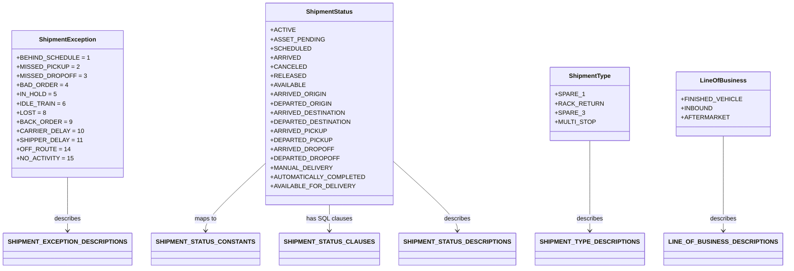
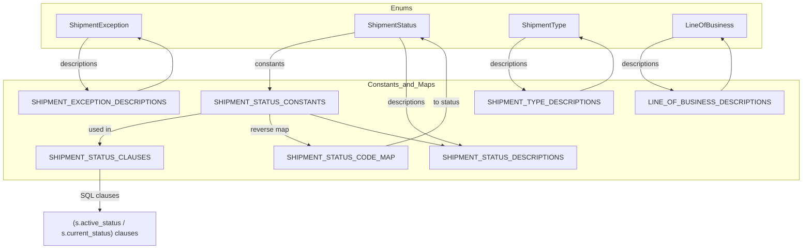

# Diagram: shipment_core/shipment_service/shipment_service/fvshared/ng_searching.py

> Auto-generated by Obscura crawlers

## Diagram 1

### SVG

<svg id="container" width="1841.6875" xmlns="http://www.w3.org/2000/svg" class="classDiagram" height="702" viewBox="0 0 1841.6875 702" role="graphics-document document" aria-roledescription="class"><g><defs><marker id="container_class-aggregationStart" class="marker aggregation class" refX="18" refY="7" markerWidth="190" markerHeight="240" orient="auto"><path d="M 18,7 L9,13 L1,7 L9,1 Z"></path></marker></defs><defs><marker id="container_class-aggregationEnd" class="marker aggregation class" refX="1" refY="7" markerWidth="20" markerHeight="28" orient="auto"><path d="M 18,7 L9,13 L1,7 L9,1 Z"></path></marker></defs><defs><marker id="container_class-extensionStart" class="marker extension class" refX="18" refY="7" markerWidth="190" markerHeight="240" orient="auto"><path d="M 1,7 L18,13 V 1 Z"></path></marker></defs><defs><marker id="container_class-extensionEnd" class="marker extension class" refX="1" refY="7" markerWidth="20" markerHeight="28" orient="auto"><path d="M 1,1 V 13 L18,7 Z"></path></marker></defs><defs><marker id="container_class-compositionStart" class="marker composition class" refX="18" refY="7" markerWidth="190" markerHeight="240" orient="auto"><path d="M 18,7 L9,13 L1,7 L9,1 Z"></path></marker></defs><defs><marker id="container_class-compositionEnd" class="marker composition class" refX="1" refY="7" markerWidth="20" markerHeight="28" orient="auto"><path d="M 18,7 L9,13 L1,7 L9,1 Z"></path></marker></defs><defs><marker id="container_class-dependencyStart" class="marker dependency class" refX="6" refY="7" markerWidth="190" markerHeight="240" orient="auto"><path d="M 5,7 L9,13 L1,7 L9,1 Z"></path></marker></defs><defs><marker id="container_class-dependencyEnd" class="marker dependency class" refX="13" refY="7" markerWidth="20" markerHeight="28" orient="auto"><path d="M 18,7 L9,13 L14,7 L9,1 Z"></path></marker></defs><defs><marker id="container_class-lollipopStart" class="marker lollipop class" refX="13" refY="7" markerWidth="190" markerHeight="240" orient="auto"><circle stroke="black" fill="transparent" cx="7" cy="7" r="6"></circle></marker></defs><defs><marker id="container_class-lollipopEnd" class="marker lollipop class" refX="1" refY="7" markerWidth="190" markerHeight="240" orient="auto"><circle stroke="black" fill="transparent" cx="7" cy="7" r="6"></circle></marker></defs><g class="root"><g class="clusters"></g><g class="edgePaths"><path d="M623.199,425.368L599.508,449.974C575.818,474.579,528.436,523.789,504.745,553.561C481.055,583.333,481.055,593.667,481.055,598.833L481.055,604" id="id_ShipmentStatus_SHIPMENT_STATUS_CONSTANTS_1" class="edge-thickness-normal edge-pattern-solid relation" style=";;;" data-edge="true" data-et="edge" data-id="id_ShipmentStatus_SHIPMENT_STATUS_CONSTANTS_1" data-points="W3sieCI6NjIzLjE5OTIxODc1LCJ5Ijo0MjUuMzY4MzI4MTIxNjMwNH0seyJ4Ijo0ODEuMDU0Njg3NSwieSI6NTczfSx7IngiOjQ4MS4wNTQ2ODc1LCJ5Ijo2MTB9XQ==" marker-end="url(#container_class-dependencyEnd)"></path><path d="M770.867,536L770.867,542.167C770.867,548.333,770.867,560.667,770.867,572C770.867,583.333,770.867,593.667,770.867,598.833L770.867,604" id="id_ShipmentStatus_SHIPMENT_STATUS_CLAUSES_2" class="edge-thickness-normal edge-pattern-solid relation" style=";;;" data-edge="true" data-et="edge" data-id="id_ShipmentStatus_SHIPMENT_STATUS_CLAUSES_2" data-points="W3sieCI6NzcwLjg2NzE4NzUsInkiOjUzNn0seyJ4Ijo3NzAuODY3MTg3NSwieSI6NTczfSx7IngiOjc3MC44NjcxODc1LCJ5Ijo2MTB9XQ==" marker-end="url(#container_class-dependencyEnd)"></path><path d="M918.535,420.045L943.963,445.537C969.391,471.03,1020.246,522.015,1045.674,552.674C1071.102,583.333,1071.102,593.667,1071.102,598.833L1071.102,604" id="id_ShipmentStatus_SHIPMENT_STATUS_DESCRIPTIONS_3" class="edge-thickness-normal edge-pattern-solid relation" style=";;;" data-edge="true" data-et="edge" data-id="id_ShipmentStatus_SHIPMENT_STATUS_DESCRIPTIONS_3" data-points="W3sieCI6OTE4LjUzNTE1NjI1LCJ5Ijo0MjAuMDQ0NTM1NTE5MTI1N30seyJ4IjoxMDcxLjEwMTU2MjUsInkiOjU3M30seyJ4IjoxMDcxLjEwMTU2MjUsInkiOjYxMH1d" marker-end="url(#container_class-dependencyEnd)"></path><path d="M156.93,464L156.93,482.167C156.93,500.333,156.93,536.667,156.93,560C156.93,583.333,156.93,593.667,156.93,598.833L156.93,604" id="id_ShipmentException_SHIPMENT_EXCEPTION_DESCRIPTIONS_4" class="edge-thickness-normal edge-pattern-solid relation" style=";;;" data-edge="true" data-et="edge" data-id="id_ShipmentException_SHIPMENT_EXCEPTION_DESCRIPTIONS_4" data-points="W3sieCI6MTU2LjkyOTY4NzUsInkiOjQ2NH0seyJ4IjoxNTYuOTI5Njg3NSwieSI6NTczfSx7IngiOjE1Ni45Mjk2ODc1LCJ5Ijo2MTB9XQ==" marker-end="url(#container_class-dependencyEnd)"></path><path d="M1383.719,368L1383.719,402.167C1383.719,436.333,1383.719,504.667,1383.719,544C1383.719,583.333,1383.719,593.667,1383.719,598.833L1383.719,604" id="id_ShipmentType_SHIPMENT_TYPE_DESCRIPTIONS_5" class="edge-thickness-normal edge-pattern-solid relation" style=";;;" data-edge="true" data-et="edge" data-id="id_ShipmentType_SHIPMENT_TYPE_DESCRIPTIONS_5" data-points="W3sieCI6MTM4My43MTg3NSwieSI6MzY4fSx7IngiOjEzODMuNzE4NzUsInkiOjU3M30seyJ4IjoxMzgzLjcxODc1LCJ5Ijo2MTB9XQ==" marker-end="url(#container_class-dependencyEnd)"></path><path d="M1697.203,356L1697.203,392.167C1697.203,428.333,1697.203,500.667,1697.203,542C1697.203,583.333,1697.203,593.667,1697.203,598.833L1697.203,604" id="id_LineOfBusiness_LINE_OF_BUSINESS_DESCRIPTIONS_6" class="edge-thickness-normal edge-pattern-solid relation" style=";;;" data-edge="true" data-et="edge" data-id="id_LineOfBusiness_LINE_OF_BUSINESS_DESCRIPTIONS_6" data-points="W3sieCI6MTY5Ny4yMDMxMjUsInkiOjM1Nn0seyJ4IjoxNjk3LjIwMzEyNSwieSI6NTczfSx7IngiOjE2OTcuMjAzMTI1LCJ5Ijo2MTB9XQ==" marker-end="url(#container_class-dependencyEnd)"></path></g><g class="edgeLabels"><g class="edgeLabel" transform="translate(481.0546875, 573)"><g class="label" data-id="id_ShipmentStatus_SHIPMENT_STATUS_CONSTANTS_1" transform="translate(-29.2578125, -12)"><foreignObject width="58.515625" height="24">

maps to

</foreignObject></g></g><g class="edgeLabel" transform="translate(770.8671875, 573)"><g class="label" data-id="id_ShipmentStatus_SHIPMENT_STATUS_CLAUSES_2" transform="translate(-57.78125, -12)"><foreignObject width="115.5625" height="24">

has SQL clauses

</foreignObject></g></g><g class="edgeLabel" transform="translate(1071.1015625, 573)"><g class="label" data-id="id_ShipmentStatus_SHIPMENT_STATUS_DESCRIPTIONS_3" transform="translate(-34.8984375, -12)"><foreignObject width="69.796875" height="24">

describes

</foreignObject></g></g><g class="edgeLabel" transform="translate(156.9296875, 573)"><g class="label" data-id="id_ShipmentException_SHIPMENT_EXCEPTION_DESCRIPTIONS_4" transform="translate(-34.8984375, -12)"><foreignObject width="69.796875" height="24">

describes

</foreignObject></g></g><g class="edgeLabel" transform="translate(1383.71875, 573)"><g class="label" data-id="id_ShipmentType_SHIPMENT_TYPE_DESCRIPTIONS_5" transform="translate(-34.8984375, -12)"><foreignObject width="69.796875" height="24">

describes

</foreignObject></g></g><g class="edgeLabel" transform="translate(1697.203125, 573)"><g class="label" data-id="id_LineOfBusiness_LINE_OF_BUSINESS_DESCRIPTIONS_6" transform="translate(-34.8984375, -12)"><foreignObject width="69.796875" height="24">

describes

</foreignObject></g></g></g><g class="nodes"><g class="node default" id="classId-ShipmentException-0" transform="translate(156.9296875, 272)"><g class="basic label-container"><path d="M-131.61328125 -192 L131.61328125 -192 L131.61328125 192 L-131.61328125 192" stroke="none" stroke-width="0" fill="#ECECFF" style=""></path><path d="M-131.61328125 -192 C-27.293824188535964 -192, 77.02563287292807 -192, 131.61328125 -192 M-131.61328125 -192 C-66.29831358337208 -192, -0.9833459167441561 -192, 131.61328125 -192 M131.61328125 -192 C131.61328125 -61.9057436159122, 131.61328125 68.1885127681756, 131.61328125 192 M131.61328125 -192 C131.61328125 -57.66854009231733, 131.61328125 76.66291981536534, 131.61328125 192 M131.61328125 192 C69.79567541815388 192, 7.978069586307768 192, -131.61328125 192 M131.61328125 192 C74.78351809438684 192, 17.953754938773685 192, -131.61328125 192 M-131.61328125 192 C-131.61328125 95.98555218578618, -131.61328125 -0.028895628427648035, -131.61328125 -192 M-131.61328125 192 C-131.61328125 44.004238143392115, -131.61328125 -103.99152371321577, -131.61328125 -192" stroke="#9370DB" stroke-width="1.3" fill="none" stroke-dasharray="0 0" style=""></path></g><g class="annotation-group text" transform="translate(0, -168)"></g><g class="label-group text" transform="translate(-70.8046875, -168)"><g class="label" style="font-weight: bolder" transform="translate(0,-12)"><foreignObject width="141.609375" height="24">

ShipmentException

</foreignObject></g></g><g class="members-group text" transform="translate(-119.61328125, -120)"><g class="label" style="" transform="translate(0,-12)"><foreignObject width="168.421875" height="24">

+BEHIND_SCHEDULE = 1

</foreignObject></g><g class="label" style="" transform="translate(0,12)"><foreignObject width="145.53125" height="24">

+MISSED_PICKUP = 2

</foreignObject></g><g class="label" style="" transform="translate(0,36)"><foreignObject width="160.40625" height="24">

+MISSED_DROPOFF = 3

</foreignObject></g><g class="label" style="" transform="translate(0,60)"><foreignObject width="118.4375" height="24">

+BAD_ORDER = 4

</foreignObject></g><g class="label" style="" transform="translate(0,84)"><foreignObject width="96.6875" height="24">

+IN_HOLD = 5

</foreignObject></g><g class="label" style="" transform="translate(0,108)"><foreignObject width="114.84375" height="24">

+IDLE_TRAIN = 6

</foreignObject></g><g class="label" style="" transform="translate(0,132)"><foreignObject width="68.25" height="24">

+LOST = 8

</foreignObject></g><g class="label" style="" transform="translate(0,156)"><foreignObject width="126.890625" height="24">

+BACK_ORDER = 9

</foreignObject></g><g class="label" style="" transform="translate(0,180)"><foreignObject width="153.109375" height="24">

+CARRIER_DELAY = 10

</foreignObject></g><g class="label" style="" transform="translate(0,204)"><foreignObject width="150.953125" height="24">

+SHIPPER_DELAY = 11

</foreignObject></g><g class="label" style="" transform="translate(0,228)"><foreignObject width="121.453125" height="24">

+OFF_ROUTE = 14

</foreignObject></g><g class="label" style="" transform="translate(0,252)"><foreignObject width="130.578125" height="24">

+NO_ACTIVITY = 15

</foreignObject></g></g><g class="methods-group text" transform="translate(-119.61328125, 192)"></g><g class="divider" style=""><path d="M-131.61328125 -144 C-41.37138743880969 -144, 48.87050637238062 -144, 131.61328125 -144 M-131.61328125 -144 C-77.52762132902734 -144, -23.441961408054695 -144, 131.61328125 -144" stroke="#9370DB" stroke-width="1.3" fill="none" stroke-dasharray="0 0" style=""></path></g><g class="divider" style=""><path d="M-131.61328125 168 C-73.32581762307315 168, -15.038353996146299 168, 131.61328125 168 M-131.61328125 168 C-39.74441165847708 168, 52.124457933045846 168, 131.61328125 168" stroke="#9370DB" stroke-width="1.3" fill="none" stroke-dasharray="0 0" style=""></path></g></g><g class="node default" id="classId-ShipmentStatus-1" transform="translate(770.8671875, 272)"><g class="basic label-container"><path d="M-147.66796875 -264 L147.66796875 -264 L147.66796875 264 L-147.66796875 264" stroke="none" stroke-width="0" fill="#ECECFF" style=""></path><path d="M-147.66796875 -264 C-50.50197886228149 -264, 46.66401102543702 -264, 147.66796875 -264 M-147.66796875 -264 C-54.34176704394221 -264, 38.984434662115575 -264, 147.66796875 -264 M147.66796875 -264 C147.66796875 -138.25748241167162, 147.66796875 -12.514964823343234, 147.66796875 264 M147.66796875 -264 C147.66796875 -95.39252245007478, 147.66796875 73.21495509985044, 147.66796875 264 M147.66796875 264 C60.79098587832247 264, -26.085996993355053 264, -147.66796875 264 M147.66796875 264 C30.110267821703175 264, -87.44743310659365 264, -147.66796875 264 M-147.66796875 264 C-147.66796875 93.94887489774456, -147.66796875 -76.10225020451088, -147.66796875 -264 M-147.66796875 264 C-147.66796875 152.38768244950933, -147.66796875 40.77536489901868, -147.66796875 -264" stroke="#9370DB" stroke-width="1.3" fill="none" stroke-dasharray="0 0" style=""></path></g><g class="annotation-group text" transform="translate(0, -240)"></g><g class="label-group text" transform="translate(-58.5859375, -240)"><g class="label" style="font-weight: bolder" transform="translate(0,-12)"><foreignObject width="117.171875" height="24">

ShipmentStatus

</foreignObject></g></g><g class="members-group text" transform="translate(-135.66796875, -192)"><g class="label" style="" transform="translate(0,-12)"><foreignObject width="56.09375" height="24">

+ACTIVE

</foreignObject></g><g class="label" style="" transform="translate(0,12)"><foreignObject width="123.4375" height="24">

+ASSET_PENDING

</foreignObject></g><g class="label" style="" transform="translate(0,36)"><foreignObject width="92.203125" height="24">

+SCHEDULED

</foreignObject></g><g class="label" style="" transform="translate(0,60)"><foreignObject width="68.84375" height="24">

+ARRIVED

</foreignObject></g><g class="label" style="" transform="translate(0,84)"><foreignObject width="81.40625" height="24">

+CANCELED

</foreignObject></g><g class="label" style="" transform="translate(0,108)"><foreignObject width="79.515625" height="24">

+RELEASED

</foreignObject></g><g class="label" style="" transform="translate(0,132)"><foreignObject width="82.734375" height="24">

+AVAILABLE

</foreignObject></g><g class="label" style="" transform="translate(0,156)"><foreignObject width="127.09375" height="24">

+ARRIVED_ORIGIN

</foreignObject></g><g class="label" style="" transform="translate(0,180)"><foreignObject width="139.109375" height="24">

+DEPARTED_ORIGIN

</foreignObject></g><g class="label" style="" transform="translate(0,204)"><foreignObject width="170.875" height="24">

+ARRIVED_DESTINATION

</foreignObject></g><g class="label" style="" transform="translate(0,228)"><foreignObject width="182.890625" height="24">

+DEPARTED_DESTINATION

</foreignObject></g><g class="label" style="" transform="translate(0,252)"><foreignObject width="128.703125" height="24">

+ARRIVED_PICKUP

</foreignObject></g><g class="label" style="" transform="translate(0,276)"><foreignObject width="140.71875" height="24">

+DEPARTED_PICKUP

</foreignObject></g><g class="label" style="" transform="translate(0,300)"><foreignObject width="143.515625" height="24">

+ARRIVED_DROPOFF

</foreignObject></g><g class="label" style="" transform="translate(0,324)"><foreignObject width="155.53125" height="24">

+DEPARTED_DROPOFF

</foreignObject></g><g class="label" style="" transform="translate(0,348)"><foreignObject width="143.5" height="24">

+MANUAL_DELIVERY

</foreignObject></g><g class="label" style="" transform="translate(0,372)"><foreignObject width="212.75" height="24">

+AUTOMATICALLY_COMPLETED

</foreignObject></g><g class="label" style="" transform="translate(0,396)"><foreignObject width="194.78125" height="24">

+AVAILABLE_FOR_DELIVERY

</foreignObject></g></g><g class="methods-group text" transform="translate(-135.66796875, 264)"></g><g class="divider" style=""><path d="M-147.66796875 -216 C-83.34235794892389 -216, -19.01674714784778 -216, 147.66796875 -216 M-147.66796875 -216 C-36.503556257097685 -216, 74.66085623580463 -216, 147.66796875 -216" stroke="#9370DB" stroke-width="1.3" fill="none" stroke-dasharray="0 0" style=""></path></g><g class="divider" style=""><path d="M-147.66796875 240 C-73.95216082188388 240, -0.2363528937677586 240, 147.66796875 240 M-147.66796875 240 C-34.94504822556128 240, 77.77787229887744 240, 147.66796875 240" stroke="#9370DB" stroke-width="1.3" fill="none" stroke-dasharray="0 0" style=""></path></g></g><g class="node default" id="classId-ShipmentType-2" transform="translate(1383.71875, 272)"><g class="basic label-container"><path d="M-93.76953125 -96 L93.76953125 -96 L93.76953125 96 L-93.76953125 96" stroke="none" stroke-width="0" fill="#ECECFF" style=""></path><path d="M-93.76953125 -96 C-42.54290027728836 -96, 8.683730695423279 -96, 93.76953125 -96 M-93.76953125 -96 C-27.42101459772327 -96, 38.92750205455346 -96, 93.76953125 -96 M93.76953125 -96 C93.76953125 -47.494090835446876, 93.76953125 1.011818329106248, 93.76953125 96 M93.76953125 -96 C93.76953125 -34.40409444609484, 93.76953125 27.191811107810324, 93.76953125 96 M93.76953125 96 C40.96088838038459 96, -11.847754489230823 96, -93.76953125 96 M93.76953125 96 C55.62737685802561 96, 17.485222466051226 96, -93.76953125 96 M-93.76953125 96 C-93.76953125 54.33874714073682, -93.76953125 12.677494281473642, -93.76953125 -96 M-93.76953125 96 C-93.76953125 47.75504626998041, -93.76953125 -0.48990746003917707, -93.76953125 -96" stroke="#9370DB" stroke-width="1.3" fill="none" stroke-dasharray="0 0" style=""></path></g><g class="annotation-group text" transform="translate(0, -72)"></g><g class="label-group text" transform="translate(-52.4453125, -72)"><g class="label" style="font-weight: bolder" transform="translate(0,-12)"><foreignObject width="104.890625" height="24">

ShipmentType

</foreignObject></g></g><g class="members-group text" transform="translate(-81.76953125, -24)"><g class="label" style="" transform="translate(0,-12)"><foreignObject width="65.46875" height="24">

+SPARE_1

</foreignObject></g><g class="label" style="" transform="translate(0,12)"><foreignObject width="111.09375" height="24">

+RACK_RETURN

</foreignObject></g><g class="label" style="" transform="translate(0,36)"><foreignObject width="68.125" height="24">

+SPARE_3

</foreignObject></g><g class="label" style="" transform="translate(0,60)"><foreignObject width="95.109375" height="24">

+MULTI_STOP

</foreignObject></g></g><g class="methods-group text" transform="translate(-81.76953125, 96)"></g><g class="divider" style=""><path d="M-93.76953125 -48 C-46.68350606904264 -48, 0.4025191119147138 -48, 93.76953125 -48 M-93.76953125 -48 C-31.674733960457267 -48, 30.420063329085465 -48, 93.76953125 -48" stroke="#9370DB" stroke-width="1.3" fill="none" stroke-dasharray="0 0" style=""></path></g><g class="divider" style=""><path d="M-93.76953125 72 C-18.972767404564834 72, 55.82399644087033 72, 93.76953125 72 M-93.76953125 72 C-37.327362969412455 72, 19.11480531117509 72, 93.76953125 72" stroke="#9370DB" stroke-width="1.3" fill="none" stroke-dasharray="0 0" style=""></path></g></g><g class="node default" id="classId-LineOfBusiness-3" transform="translate(1697.203125, 272)"><g class="basic label-container"><path d="M-110.109375 -84 L110.109375 -84 L110.109375 84 L-110.109375 84" stroke="none" stroke-width="0" fill="#ECECFF" style=""></path><path d="M-110.109375 -84 C-41.45972711999259 -84, 27.189920760014815 -84, 110.109375 -84 M-110.109375 -84 C-45.46877383779302 -84, 19.171827324413954 -84, 110.109375 -84 M110.109375 -84 C110.109375 -37.934967081008736, 110.109375 8.130065837982528, 110.109375 84 M110.109375 -84 C110.109375 -49.585494480194434, 110.109375 -15.170988960388868, 110.109375 84 M110.109375 84 C24.670160954393836 84, -60.76905309121233 84, -110.109375 84 M110.109375 84 C60.88614293131562 84, 11.662910862631236 84, -110.109375 84 M-110.109375 84 C-110.109375 33.47478646708608, -110.109375 -17.050427065827833, -110.109375 -84 M-110.109375 84 C-110.109375 21.560056377371396, -110.109375 -40.87988724525721, -110.109375 -84" stroke="#9370DB" stroke-width="1.3" fill="none" stroke-dasharray="0 0" style=""></path></g><g class="annotation-group text" transform="translate(0, -60)"></g><g class="label-group text" transform="translate(-56.109375, -60)"><g class="label" style="font-weight: bolder" transform="translate(0,-12)"><foreignObject width="112.21875" height="24">

LineOfBusiness

</foreignObject></g></g><g class="members-group text" transform="translate(-98.109375, -12)"><g class="label" style="" transform="translate(0,-12)"><foreignObject width="140.109375" height="24">

+FINISHED_VEHICLE

</foreignObject></g><g class="label" style="" transform="translate(0,12)"><foreignObject width="76.265625" height="24">

+INBOUND

</foreignObject></g><g class="label" style="" transform="translate(0,36)"><foreignObject width="108.921875" height="24">

+AFTERMARKET

</foreignObject></g></g><g class="methods-group text" transform="translate(-98.109375, 84)"></g><g class="divider" style=""><path d="M-110.109375 -36 C-65.18128397563743 -36, -20.25319295127484 -36, 110.109375 -36 M-110.109375 -36 C-46.826864673703284 -36, 16.455645652593432 -36, 110.109375 -36" stroke="#9370DB" stroke-width="1.3" fill="none" stroke-dasharray="0 0" style=""></path></g><g class="divider" style=""><path d="M-110.109375 60 C-30.872621566864723 60, 48.364131866270554 60, 110.109375 60 M-110.109375 60 C-28.55592737026423 60, 52.99752025947154 60, 110.109375 60" stroke="#9370DB" stroke-width="1.3" fill="none" stroke-dasharray="0 0" style=""></path></g></g><g class="node default" id="classId-SHIPMENT_STATUS_CONSTANTS-4" transform="translate(481.0546875, 652)"><g class="basic label-container"><path d="M-125.1953125 -42 L125.1953125 -42 L125.1953125 42 L-125.1953125 42" stroke="none" stroke-width="0" fill="#ECECFF" style=""></path><path d="M-125.1953125 -42 C-68.2555347699837 -42, -11.315757039967394 -42, 125.1953125 -42 M-125.1953125 -42 C-31.104150051064536 -42, 62.98701239787093 -42, 125.1953125 -42 M125.1953125 -42 C125.1953125 -23.14283732311624, 125.1953125 -4.285674646232479, 125.1953125 42 M125.1953125 -42 C125.1953125 -10.72227871052015, 125.1953125 20.5554425789597, 125.1953125 42 M125.1953125 42 C28.746767209504526 42, -67.70177808099095 42, -125.1953125 42 M125.1953125 42 C34.293273754081895 42, -56.60876499183621 42, -125.1953125 42 M-125.1953125 42 C-125.1953125 9.450757255931329, -125.1953125 -23.098485488137342, -125.1953125 -42 M-125.1953125 42 C-125.1953125 24.667741262355992, -125.1953125 7.335482524711985, -125.1953125 -42" stroke="#9370DB" stroke-width="1.3" fill="none" stroke-dasharray="0 0" style=""></path></g><g class="annotation-group text" transform="translate(0, -18)"></g><g class="label-group text" transform="translate(-113.1953125, -18)"><g class="label" style="font-weight: bolder" transform="translate(0,-12)"><foreignObject width="226.390625" height="24">

SHIPMENT_STATUS_CONSTANTS

</foreignObject></g></g><g class="members-group text" transform="translate(-113.1953125, 30)"></g><g class="methods-group text" transform="translate(-113.1953125, 60)"></g><g class="divider" style=""><path d="M-125.1953125 6 C-34.01084688996961 6, 57.17361872006077 6, 125.1953125 6 M-125.1953125 6 C-48.738027225249766 6, 27.719258049500468 6, 125.1953125 6" stroke="#9370DB" stroke-width="1.3" fill="none" stroke-dasharray="0 0" style=""></path></g><g class="divider" style=""><path d="M-125.1953125 24 C-74.07522561025044 24, -22.955138720500884 24, 125.1953125 24 M-125.1953125 24 C-70.65895451646222 24, -16.122596532924433 24, 125.1953125 24" stroke="#9370DB" stroke-width="1.3" fill="none" stroke-dasharray="0 0" style=""></path></g></g><g class="node default" id="classId-SHIPMENT_STATUS_CLAUSES-5" transform="translate(770.8671875, 652)"><g class="basic label-container"><path d="M-114.6171875 -42 L114.6171875 -42 L114.6171875 42 L-114.6171875 42" stroke="none" stroke-width="0" fill="#ECECFF" style=""></path><path d="M-114.6171875 -42 C-29.434838422855123 -42, 55.747510654289755 -42, 114.6171875 -42 M-114.6171875 -42 C-27.88559901271759 -42, 58.84598947456482 -42, 114.6171875 -42 M114.6171875 -42 C114.6171875 -19.558135597876745, 114.6171875 2.883728804246509, 114.6171875 42 M114.6171875 -42 C114.6171875 -16.765581572884297, 114.6171875 8.468836854231405, 114.6171875 42 M114.6171875 42 C30.96666248474493 42, -52.68386253051014 42, -114.6171875 42 M114.6171875 42 C57.04637430549501 42, -0.5244388890099856 42, -114.6171875 42 M-114.6171875 42 C-114.6171875 10.518880719915778, -114.6171875 -20.962238560168444, -114.6171875 -42 M-114.6171875 42 C-114.6171875 17.100709476748463, -114.6171875 -7.798581046503074, -114.6171875 -42" stroke="#9370DB" stroke-width="1.3" fill="none" stroke-dasharray="0 0" style=""></path></g><g class="annotation-group text" transform="translate(0, -18)"></g><g class="label-group text" transform="translate(-102.6171875, -18)"><g class="label" style="font-weight: bolder" transform="translate(0,-12)"><foreignObject width="205.234375" height="24">

SHIPMENT_STATUS_CLAUSES

</foreignObject></g></g><g class="members-group text" transform="translate(-102.6171875, 30)"></g><g class="methods-group text" transform="translate(-102.6171875, 60)"></g><g class="divider" style=""><path d="M-114.6171875 6 C-29.87157978464218 6, 54.87402793071564 6, 114.6171875 6 M-114.6171875 6 C-47.60435864966611 6, 19.40847020066778 6, 114.6171875 6" stroke="#9370DB" stroke-width="1.3" fill="none" stroke-dasharray="0 0" style=""></path></g><g class="divider" style=""><path d="M-114.6171875 24 C-42.95750306465618 24, 28.70218137068764 24, 114.6171875 24 M-114.6171875 24 C-35.16943667657539 24, 44.278314146849226 24, 114.6171875 24" stroke="#9370DB" stroke-width="1.3" fill="none" stroke-dasharray="0 0" style=""></path></g></g><g class="node default" id="classId-SHIPMENT_STATUS_DESCRIPTIONS-6" transform="translate(1071.1015625, 652)"><g class="basic label-container"><path d="M-135.6171875 -42 L135.6171875 -42 L135.6171875 42 L-135.6171875 42" stroke="none" stroke-width="0" fill="#ECECFF" style=""></path><path d="M-135.6171875 -42 C-53.47214085176698 -42, 28.67290579646604 -42, 135.6171875 -42 M-135.6171875 -42 C-64.16292132086431 -42, 7.291344858271373 -42, 135.6171875 -42 M135.6171875 -42 C135.6171875 -14.66360900986085, 135.6171875 12.672781980278302, 135.6171875 42 M135.6171875 -42 C135.6171875 -8.635240438090925, 135.6171875 24.72951912381815, 135.6171875 42 M135.6171875 42 C39.759149666737116 42, -56.09888816652577 42, -135.6171875 42 M135.6171875 42 C64.94391422040955 42, -5.729359059180894 42, -135.6171875 42 M-135.6171875 42 C-135.6171875 23.16446330697089, -135.6171875 4.328926613941782, -135.6171875 -42 M-135.6171875 42 C-135.6171875 23.4658905227392, -135.6171875 4.931781045478402, -135.6171875 -42" stroke="#9370DB" stroke-width="1.3" fill="none" stroke-dasharray="0 0" style=""></path></g><g class="annotation-group text" transform="translate(0, -18)"></g><g class="label-group text" transform="translate(-123.6171875, -18)"><g class="label" style="font-weight: bolder" transform="translate(0,-12)"><foreignObject width="247.234375" height="24">

SHIPMENT_STATUS_DESCRIPTIONS

</foreignObject></g></g><g class="members-group text" transform="translate(-123.6171875, 30)"></g><g class="methods-group text" transform="translate(-123.6171875, 60)"></g><g class="divider" style=""><path d="M-135.6171875 6 C-58.30050134373954 6, 19.01618481252092 6, 135.6171875 6 M-135.6171875 6 C-72.87418247997762 6, -10.13117745995524 6, 135.6171875 6" stroke="#9370DB" stroke-width="1.3" fill="none" stroke-dasharray="0 0" style=""></path></g><g class="divider" style=""><path d="M-135.6171875 24 C-42.40271625463055 24, 50.811754990738905 24, 135.6171875 24 M-135.6171875 24 C-33.013069379730936 24, 69.59104874053813 24, 135.6171875 24" stroke="#9370DB" stroke-width="1.3" fill="none" stroke-dasharray="0 0" style=""></path></g></g><g class="node default" id="classId-SHIPMENT_EXCEPTION_DESCRIPTIONS-7" transform="translate(156.9296875, 652)"><g class="basic label-container"><path d="M-148.9296875 -42 L148.9296875 -42 L148.9296875 42 L-148.9296875 42" stroke="none" stroke-width="0" fill="#ECECFF" style=""></path><path d="M-148.9296875 -42 C-60.646605994677586 -42, 27.63647551064483 -42, 148.9296875 -42 M-148.9296875 -42 C-75.03835635648939 -42, -1.1470252129787752 -42, 148.9296875 -42 M148.9296875 -42 C148.9296875 -9.818235066009379, 148.9296875 22.363529867981242, 148.9296875 42 M148.9296875 -42 C148.9296875 -11.887953521935977, 148.9296875 18.224092956128047, 148.9296875 42 M148.9296875 42 C44.77110540823307 42, -59.38747668353386 42, -148.9296875 42 M148.9296875 42 C54.64039643743813 42, -39.648894625123745 42, -148.9296875 42 M-148.9296875 42 C-148.9296875 15.056714555620378, -148.9296875 -11.886570888759245, -148.9296875 -42 M-148.9296875 42 C-148.9296875 16.85702437410579, -148.9296875 -8.285951251788418, -148.9296875 -42" stroke="#9370DB" stroke-width="1.3" fill="none" stroke-dasharray="0 0" style=""></path></g><g class="annotation-group text" transform="translate(0, -18)"></g><g class="label-group text" transform="translate(-136.9296875, -18)"><g class="label" style="font-weight: bolder" transform="translate(0,-12)"><foreignObject width="273.859375" height="24">

SHIPMENT_EXCEPTION_DESCRIPTIONS

</foreignObject></g></g><g class="members-group text" transform="translate(-136.9296875, 30)"></g><g class="methods-group text" transform="translate(-136.9296875, 60)"></g><g class="divider" style=""><path d="M-148.9296875 6 C-50.156386253578916 6, 48.61691499284217 6, 148.9296875 6 M-148.9296875 6 C-88.8240603455634 6, -28.718433191126806 6, 148.9296875 6" stroke="#9370DB" stroke-width="1.3" fill="none" stroke-dasharray="0 0" style=""></path></g><g class="divider" style=""><path d="M-148.9296875 24 C-74.97753019174878 24, -1.0253728834975675 24, 148.9296875 24 M-148.9296875 24 C-79.63482786639658 24, -10.339968232793154 24, 148.9296875 24" stroke="#9370DB" stroke-width="1.3" fill="none" stroke-dasharray="0 0" style=""></path></g></g><g class="node default" id="classId-SHIPMENT_TYPE_DESCRIPTIONS-8" transform="translate(1383.71875, 652)"><g class="basic label-container"><path d="M-127 -42 L127 -42 L127 42 L-127 42" stroke="none" stroke-width="0" fill="#ECECFF" style=""></path><path d="M-127 -42 C-40.263642085469385 -42, 46.47271582906123 -42, 127 -42 M-127 -42 C-73.51303323569567 -42, -20.02606647139136 -42, 127 -42 M127 -42 C127 -13.476381580916762, 127 15.047236838166477, 127 42 M127 -42 C127 -23.711247549854548, 127 -5.422495099709096, 127 42 M127 42 C36.5646383252283 42, -53.8707233495434 42, -127 42 M127 42 C74.46978794727663 42, 21.939575894553258 42, -127 42 M-127 42 C-127 19.054885875443535, -127 -3.89022824911293, -127 -42 M-127 42 C-127 10.221092898474318, -127 -21.557814203051365, -127 -42" stroke="#9370DB" stroke-width="1.3" fill="none" stroke-dasharray="0 0" style=""></path></g><g class="annotation-group text" transform="translate(0, -18)"></g><g class="label-group text" transform="translate(-115, -18)"><g class="label" style="font-weight: bolder" transform="translate(0,-12)"><foreignObject width="230" height="24">

SHIPMENT_TYPE_DESCRIPTIONS

</foreignObject></g></g><g class="members-group text" transform="translate(-115, 30)"></g><g class="methods-group text" transform="translate(-115, 60)"></g><g class="divider" style=""><path d="M-127 6 C-56.08901552669688 6, 14.821968946606233 6, 127 6 M-127 6 C-76.15429921811406 6, -25.308598436228138 6, 127 6" stroke="#9370DB" stroke-width="1.3" fill="none" stroke-dasharray="0 0" style=""></path></g><g class="divider" style=""><path d="M-127 24 C-70.15460152938311 24, -13.309203058766215 24, 127 24 M-127 24 C-41.13400739406454 24, 44.73198521187092 24, 127 24" stroke="#9370DB" stroke-width="1.3" fill="none" stroke-dasharray="0 0" style=""></path></g></g><g class="node default" id="classId-LINE_OF_BUSINESS_DESCRIPTIONS-9" transform="translate(1697.203125, 652)"><g class="basic label-container"><path d="M-136.484375 -42 L136.484375 -42 L136.484375 42 L-136.484375 42" stroke="none" stroke-width="0" fill="#ECECFF" style=""></path><path d="M-136.484375 -42 C-30.19410009248071 -42, 76.09617481503858 -42, 136.484375 -42 M-136.484375 -42 C-41.62451526142067 -42, 53.23534447715866 -42, 136.484375 -42 M136.484375 -42 C136.484375 -16.49230423111567, 136.484375 9.015391537768657, 136.484375 42 M136.484375 -42 C136.484375 -11.682779861364306, 136.484375 18.634440277271388, 136.484375 42 M136.484375 42 C78.60503239366943 42, 20.725689787338865 42, -136.484375 42 M136.484375 42 C77.79257645687035 42, 19.1007779137407 42, -136.484375 42 M-136.484375 42 C-136.484375 17.657883208568574, -136.484375 -6.684233582862852, -136.484375 -42 M-136.484375 42 C-136.484375 20.923983918961476, -136.484375 -0.15203216207704884, -136.484375 -42" stroke="#9370DB" stroke-width="1.3" fill="none" stroke-dasharray="0 0" style=""></path></g><g class="annotation-group text" transform="translate(0, -18)"></g><g class="label-group text" transform="translate(-124.484375, -18)"><g class="label" style="font-weight: bolder" transform="translate(0,-12)"><foreignObject width="248.96875" height="24">

LINE_OF_BUSINESS_DESCRIPTIONS

</foreignObject></g></g><g class="members-group text" transform="translate(-124.484375, 30)"></g><g class="methods-group text" transform="translate(-124.484375, 60)"></g><g class="divider" style=""><path d="M-136.484375 6 C-76.73010944575614 6, -16.97584389151227 6, 136.484375 6 M-136.484375 6 C-64.35473262603094 6, 7.774909747938125 6, 136.484375 6" stroke="#9370DB" stroke-width="1.3" fill="none" stroke-dasharray="0 0" style=""></path></g><g class="divider" style=""><path d="M-136.484375 24 C-74.6517295271474 24, -12.819084054294791 24, 136.484375 24 M-136.484375 24 C-58.147200610570025 24, 20.18997377885995 24, 136.484375 24" stroke="#9370DB" stroke-width="1.3" fill="none" stroke-dasharray="0 0" style=""></path></g></g></g></g></g></svg>

## Diagram 2

### SVG

<svg id="container" width="1706.44921875" xmlns="http://www.w3.org/2000/svg" class="flowchart" height="578" viewBox="0 0 1706.44921875 578" role="graphics-document document" aria-roledescription="flowchart-v2"><g><marker id="container_flowchart-v2-pointEnd" class="marker flowchart-v2" viewBox="0 0 10 10" refX="5" refY="5" markerUnits="userSpaceOnUse" markerWidth="8" markerHeight="8" orient="auto"><path d="M 0 0 L 10 5 L 0 10 z" class="arrowMarkerPath" style="stroke-width: 1; stroke-dasharray: 1, 0;"></path></marker><marker id="container_flowchart-v2-pointStart" class="marker flowchart-v2" viewBox="0 0 10 10" refX="4.5" refY="5" markerUnits="userSpaceOnUse" markerWidth="8" markerHeight="8" orient="auto"><path d="M 0 5 L 10 10 L 10 0 z" class="arrowMarkerPath" style="stroke-width: 1; stroke-dasharray: 1, 0;"></path></marker><marker id="container_flowchart-v2-circleEnd" class="marker flowchart-v2" viewBox="0 0 10 10" refX="11" refY="5" markerUnits="userSpaceOnUse" markerWidth="11" markerHeight="11" orient="auto"><circle cx="5" cy="5" r="5" class="arrowMarkerPath" style="stroke-width: 1; stroke-dasharray: 1, 0;"></circle></marker><marker id="container_flowchart-v2-circleStart" class="marker flowchart-v2" viewBox="0 0 10 10" refX="-1" refY="5" markerUnits="userSpaceOnUse" markerWidth="11" markerHeight="11" orient="auto"><circle cx="5" cy="5" r="5" class="arrowMarkerPath" style="stroke-width: 1; stroke-dasharray: 1, 0;"></circle></marker><marker id="container_flowchart-v2-crossEnd" class="marker cross flowchart-v2" viewBox="0 0 11 11" refX="12" refY="5.2" markerUnits="userSpaceOnUse" markerWidth="11" markerHeight="11" orient="auto"><path d="M 1,1 l 9,9 M 10,1 l -9,9" class="arrowMarkerPath" style="stroke-width: 2; stroke-dasharray: 1, 0;"></path></marker><marker id="container_flowchart-v2-crossStart" class="marker cross flowchart-v2" viewBox="0 0 11 11" refX="-1" refY="5.2" markerUnits="userSpaceOnUse" markerWidth="11" markerHeight="11" orient="auto"><path d="M 1,1 l 9,9 M 10,1 l -9,9" class="arrowMarkerPath" style="stroke-width: 2; stroke-dasharray: 1, 0;"></path></marker><g class="root"><g class="clusters"><g class="cluster" id="Constants_and_Maps" data-look="classic"><rect style="" x="8" y="186" width="1690.44921875" height="232"></rect><g class="cluster-label" transform="translate(776.419921875, 186)"><foreignObject width="153.609375" height="24">

Constants_and_Maps

</foreignObject></g></g><g class="cluster" id="Enums" data-look="classic"><rect style="" x="73.265625" y="8" width="1557.16015625" height="104"></rect><g class="cluster-label" transform="translate(827.705078125, 8)"><foreignObject width="48.28125" height="24">

Enums

</foreignObject></g></g></g><g class="edgePaths"><path d="M183.764,87L179.949,91.167C176.134,95.333,168.505,103.667,164.69,114C160.875,124.333,160.875,136.667,160.875,149C160.875,161.333,160.875,173.667,164.24,183.508C167.604,193.35,174.334,200.7,177.698,204.375L181.063,208.05" id="L_SE_ED_0" class="edge-thickness-normal edge-pattern-solid edge-thickness-normal edge-pattern-solid flowchart-link" style=";" data-edge="true" data-et="edge" data-id="L_SE_ED_0" data-points="W3sieCI6MTgzLjc2NDEyMjU5NjE1Mzg0LCJ5Ijo4N30seyJ4IjoxNjAuODc1LCJ5IjoxMTJ9LHsieCI6MTYwLjg3NSwieSI6MTQ5fSx7IngiOjE2MC44NzUsInkiOjE4Nn0seyJ4IjoxODMuNzY0MTIyNTk2MTUzODQsInkiOjIxMX1d" marker-end="url(#container_flowchart-v2-pointEnd)"></path><path d="M742.793,77.195L713.213,82.996C683.633,88.796,624.473,100.398,594.893,112.366C565.313,124.333,565.313,136.667,565.313,149C565.313,161.333,565.313,173.667,565.313,183.333C565.313,193,565.313,200,565.313,203.5L565.313,207" id="L_SS_C1_0" class="edge-thickness-normal edge-pattern-solid edge-thickness-normal edge-pattern-solid flowchart-link" style=";" data-edge="true" data-et="edge" data-id="L_SS_C1_0" data-points="W3sieCI6NzQyLjc5Mjk2ODc1LCJ5Ijo3Ny4xOTQ2Nzg5MjM0MTAwOH0seyJ4Ijo1NjUuMzEyNSwieSI6MTEyfSx7IngiOjU2NS4zMTI1LCJ5IjoxNDl9LHsieCI6NTY1LjMxMjUsInkiOjE4Nn0seyJ4Ijo1NjUuMzEyNSwieSI6MjExfV0=" marker-end="url(#container_flowchart-v2-pointEnd)"></path><path d="M423.969,263.448L388.282,269.874C352.595,276.299,281.221,289.149,245.535,301.075C209.848,313,209.848,324,209.848,329.5L209.848,335" id="L_C1_C2_0" class="edge-thickness-normal edge-pattern-solid edge-thickness-normal edge-pattern-solid flowchart-link" style=";" data-edge="true" data-et="edge" data-id="L_C1_C2_0" data-points="W3sieCI6NDIzLjk2ODc1LCJ5IjoyNjMuNDQ4MzY3NTY0NDc4NzZ9LHsieCI6MjA5Ljg0NzY1NjI1LCJ5IjozMDJ9LHsieCI6MjA5Ljg0NzY1NjI1LCJ5IjozMzl9XQ==" marker-end="url(#container_flowchart-v2-pointEnd)"></path><path d="M565.313,265L565.313,271.167C565.313,277.333,565.313,289.667,580.024,301.751C594.736,313.836,624.159,325.671,638.87,331.589L653.582,337.507" id="L_C1_C3_0" class="edge-thickness-normal edge-pattern-solid edge-thickness-normal edge-pattern-solid flowchart-link" style=";" data-edge="true" data-et="edge" data-id="L_C1_C3_0" data-points="W3sieCI6NTY1LjMxMjUsInkiOjI2NX0seyJ4Ijo1NjUuMzEyNSwieSI6MzAyfSx7IngiOjY1Ny4yOTMwOTA4MjAzMTI1LCJ5IjozMzl9XQ==" marker-end="url(#container_flowchart-v2-pointEnd)"></path><path d="M820.847,339L842.872,332.833C864.897,326.667,908.946,314.333,930.971,297.5C952.996,280.667,952.996,259.333,952.996,240C952.996,220.667,952.996,203.333,952.996,188.5C952.996,173.667,952.996,161.333,952.996,149C952.996,136.667,952.996,124.333,943.792,114.26C934.588,104.188,916.18,96.375,906.977,92.469L897.773,88.563" id="L_C3_SS_0" class="edge-thickness-normal edge-pattern-solid edge-thickness-normal edge-pattern-solid flowchart-link" style=";" data-edge="true" data-et="edge" data-id="L_C3_SS_0" data-points="W3sieCI6ODIwLjg0NzEwNjkzMzU5MzgsInkiOjMzOX0seyJ4Ijo5NTIuOTk2MDkzNzUsInkiOjMwMn0seyJ4Ijo5NTIuOTk2MDkzNzUsInkiOjIzOH0seyJ4Ijo5NTIuOTk2MDkzNzUsInkiOjE4Nn0seyJ4Ijo5NTIuOTk2MDkzNzUsInkiOjE0OX0seyJ4Ijo5NTIuOTk2MDkzNzUsInkiOjExMn0seyJ4Ijo4OTQuMDkwNTk0OTUxOTIzMSwieSI6ODd9XQ==" marker-end="url(#container_flowchart-v2-pointEnd)"></path><path d="M209.848,393L209.848,397.167C209.848,401.333,209.848,409.667,209.848,420C209.848,430.333,209.848,442.667,209.848,454.333C209.848,466,209.848,477,209.848,482.5L209.848,488" id="L_C2_C2_SQL_0" class="edge-thickness-normal edge-pattern-solid edge-thickness-normal edge-pattern-solid flowchart-link" style=";" data-edge="true" data-et="edge" data-id="L_C2_C2_SQL_0" data-points="W3sieCI6MjA5Ljg0NzY1NjI1LCJ5IjozOTN9LHsieCI6MjA5Ljg0NzY1NjI1LCJ5Ijo0MTh9LHsieCI6MjA5Ljg0NzY1NjI1LCJ5Ijo0NTV9LHsieCI6MjA5Ljg0NzY1NjI1LCJ5Ijo0OTJ9XQ==" marker-end="url(#container_flowchart-v2-pointEnd)"></path><path d="M843.823,87L845.883,91.167C847.943,95.333,852.063,103.667,854.123,114C856.184,124.333,856.184,136.667,856.184,149C856.184,161.333,856.184,173.667,856.184,188.5C856.184,203.333,856.184,220.667,856.184,240C856.184,259.333,856.184,280.667,875.644,297.304C895.104,313.942,934.025,325.884,953.486,331.856L972.946,337.827" id="L_SS_CD_0" class="edge-thickness-normal edge-pattern-solid edge-thickness-normal edge-pattern-solid flowchart-link" style=";" data-edge="true" data-et="edge" data-id="L_SS_CD_0" data-points="W3sieCI6ODQzLjgyMjU2NjEwNTc2OTMsInkiOjg3fSx7IngiOjg1Ni4xODM1OTM3NSwieSI6MTEyfSx7IngiOjg1Ni4xODM1OTM3NSwieSI6MTQ5fSx7IngiOjg1Ni4xODM1OTM3NSwieSI6MTg2fSx7IngiOjg1Ni4xODM1OTM3NSwieSI6MjM4fSx7IngiOjg1Ni4xODM1OTM3NSwieSI6MzAyfSx7IngiOjk3Ni43NzAwODA1NjY0MDYyLCJ5IjozMzl9XQ==" marker-end="url(#container_flowchart-v2-pointEnd)"></path><path d="M1125.457,87L1119.644,91.167C1113.832,95.333,1102.207,103.667,1096.394,114C1090.582,124.333,1090.582,136.667,1090.582,149C1090.582,161.333,1090.582,173.667,1095.853,183.612C1101.123,193.557,1111.664,201.113,1116.935,204.891L1122.206,208.67" id="L_ST_TD_0" class="edge-thickness-normal edge-pattern-solid edge-thickness-normal edge-pattern-solid flowchart-link" style=";" data-edge="true" data-et="edge" data-id="L_ST_TD_0" data-points="W3sieCI6MTEyNS40NTY1ODA1Mjg4NDYyLCJ5Ijo4N30seyJ4IjoxMDkwLjU4MjAzMTI1LCJ5IjoxMTJ9LHsieCI6MTA5MC41ODIwMzEyNSwieSI6MTQ5fSx7IngiOjEwOTAuNTgyMDMxMjUsInkiOjE4Nn0seyJ4IjoxMTI1LjQ1NjU4MDUyODg0NjIsInkiOjIxMX1d" marker-end="url(#container_flowchart-v2-pointEnd)"></path><path d="M1436.806,87L1425.516,91.167C1414.226,95.333,1391.646,103.667,1380.356,114C1369.066,124.333,1369.066,136.667,1369.066,149C1369.066,161.333,1369.066,173.667,1379.731,183.769C1390.395,193.872,1411.724,201.743,1422.389,205.679L1433.053,209.615" id="L_LB_LD_0" class="edge-thickness-normal edge-pattern-solid edge-thickness-normal edge-pattern-solid flowchart-link" style=";" data-edge="true" data-et="edge" data-id="L_LB_LD_0" data-points="W3sieCI6MTQzNi44MDYwMzk2NjM0NjE0LCJ5Ijo4N30seyJ4IjoxMzY5LjA2NjQwNjI1LCJ5IjoxMTJ9LHsieCI6MTM2OS4wNjY0MDYyNSwieSI6MTQ5fSx7IngiOjEzNjkuMDY2NDA2MjUsInkiOjE4Nn0seyJ4IjoxNDM2LjgwNjAzOTY2MzQ2MTQsInkiOjIxMX1d" marker-end="url(#container_flowchart-v2-pointEnd)"></path><path d="M650.729,265L670.238,271.167C689.746,277.333,728.764,289.667,776.237,301.86C823.709,314.052,879.637,326.105,907.601,332.131L935.565,338.157" id="L_C1_CD_0" class="edge-thickness-normal edge-pattern-solid edge-thickness-normal edge-pattern-solid flowchart-link" style=";" data-edge="true" data-et="edge" data-id="L_C1_CD_0" data-points="W3sieCI6NjUwLjcyOTAwMzkwNjI1LCJ5IjoyNjV9LHsieCI6NzY3Ljc4MTI1LCJ5IjozMDJ9LHsieCI6OTM5LjQ3NTM0MTc5Njg3NSwieSI6MzM5fV0=" marker-end="url(#container_flowchart-v2-pointEnd)"></path><path d="M286.777,211L298.859,206.833C310.941,202.667,335.105,194.333,347.187,184C359.27,173.667,359.27,161.333,359.27,149C359.27,136.667,359.27,124.333,347.818,114.217C336.366,104.101,313.462,96.203,302.01,92.253L290.558,88.304" id="L_ED_SE_0" class="edge-thickness-normal edge-pattern-solid edge-thickness-normal edge-pattern-solid flowchart-link" style=";" data-edge="true" data-et="edge" data-id="L_ED_SE_0" data-points="W3sieCI6Mjg2Ljc3NjY2NzY2ODI2OTIsInkiOjIxMX0seyJ4IjozNTkuMjY5NTMxMjUsInkiOjE4Nn0seyJ4IjozNTkuMjY5NTMxMjUsInkiOjE0OX0seyJ4IjozNTkuMjY5NTMxMjUsInkiOjExMn0seyJ4IjoyODYuNzc2NjY3NjY4MjY5MiwieSI6ODd9XQ==" marker-end="url(#container_flowchart-v2-pointEnd)"></path><path d="M1236.28,211L1247.57,206.833C1258.86,202.667,1281.44,194.333,1292.73,184C1304.02,173.667,1304.02,161.333,1304.02,149C1304.02,136.667,1304.02,124.333,1293.355,114.231C1282.691,104.128,1261.362,96.257,1250.697,92.321L1240.032,88.385" id="L_TD_ST_0" class="edge-thickness-normal edge-pattern-solid edge-thickness-normal edge-pattern-solid flowchart-link" style=";" data-edge="true" data-et="edge" data-id="L_TD_ST_0" data-points="W3sieCI6MTIzNi4yNzk4OTc4MzY1Mzg2LCJ5IjoyMTF9LHsieCI6MTMwNC4wMTk1MzEyNSwieSI6MTg2fSx7IngiOjEzMDQuMDE5NTMxMjUsInkiOjE0OX0seyJ4IjoxMzA0LjAxOTUzMTI1LCJ5IjoxMTJ9LHsieCI6MTIzNi4yNzk4OTc4MzY1Mzg2LCJ5Ijo4N31d" marker-end="url(#container_flowchart-v2-pointEnd)"></path><path d="M1536.046,211L1540.071,206.833C1544.096,202.667,1552.146,194.333,1556.17,184C1560.195,173.667,1560.195,161.333,1560.195,149C1560.195,136.667,1560.195,124.333,1556.634,114.479C1553.072,104.626,1545.949,97.251,1542.387,93.564L1538.825,89.877" id="L_LD_LB_0" class="edge-thickness-normal edge-pattern-solid edge-thickness-normal edge-pattern-solid flowchart-link" style=";" data-edge="true" data-et="edge" data-id="L_LD_LB_0" data-points="W3sieCI6MTUzNi4wNDYwNDg2Nzc4ODQ1LCJ5IjoyMTF9LHsieCI6MTU2MC4xOTUzMTI1LCJ5IjoxODZ9LHsieCI6MTU2MC4xOTUzMTI1LCJ5IjoxNDl9LHsieCI6MTU2MC4xOTUzMTI1LCJ5IjoxMTJ9LHsieCI6MTUzNi4wNDYwNDg2Nzc4ODQ1LCJ5Ijo4N31d" marker-end="url(#container_flowchart-v2-pointEnd)"></path></g><g class="edgeLabels"><g class="edgeLabel" transform="translate(160.875, 149)"><g class="label" data-id="L_SE_ED_0" transform="translate(-45.046875, -12)"><foreignObject width="90.09375" height="24">

descriptions

</foreignObject></g></g><g class="edgeLabel" transform="translate(565.3125, 149)"><g class="label" data-id="L_SS_C1_0" transform="translate(-35.2578125, -12)"><foreignObject width="70.515625" height="24">

constants

</foreignObject></g></g><g class="edgeLabel" transform="translate(209.84765625, 302)"><g class="label" data-id="L_C1_C2_0" transform="translate(-26.6015625, -12)"><foreignObject width="53.203125" height="24">

used in

</foreignObject></g></g><g class="edgeLabel" transform="translate(565.3125, 302)"><g class="label" data-id="L_C1_C3_0" transform="translate(-44.5859375, -12)"><foreignObject width="89.171875" height="24">

reverse map

</foreignObject></g></g><g class="edgeLabel" transform="translate(952.99609375, 238)"><g class="label" data-id="L_C3_SS_0" transform="translate(-31.765625, -12)"><foreignObject width="63.53125" height="24">

to status

</foreignObject></g></g><g class="edgeLabel" transform="translate(209.84765625, 455)"><g class="label" data-id="L_C2_C2_SQL_0" transform="translate(-42.9609375, -12)"><foreignObject width="85.921875" height="24">

SQL clauses

</foreignObject></g></g><g class="edgeLabel" transform="translate(856.18359375, 238)"><g class="label" data-id="L_SS_CD_0" transform="translate(-45.046875, -12)"><foreignObject width="90.09375" height="24">

descriptions

</foreignObject></g></g><g class="edgeLabel" transform="translate(1090.58203125, 149)"><g class="label" data-id="L_ST_TD_0" transform="translate(-45.046875, -12)"><foreignObject width="90.09375" height="24">

descriptions

</foreignObject></g></g><g class="edgeLabel" transform="translate(1369.06640625, 149)"><g class="label" data-id="L_LB_LD_0" transform="translate(-45.046875, -12)"><foreignObject width="90.09375" height="24">

descriptions

</foreignObject></g></g><g class="edgeLabel"><g class="label" data-id="L_C1_CD_0" transform="translate(0, 0)"><foreignObject width="0" height="0">

</foreignObject></g></g><g class="edgeLabel"><g class="label" data-id="L_ED_SE_0" transform="translate(0, 0)"><foreignObject width="0" height="0">

</foreignObject></g></g><g class="edgeLabel"><g class="label" data-id="L_TD_ST_0" transform="translate(0, 0)"><foreignObject width="0" height="0">

</foreignObject></g></g><g class="edgeLabel"><g class="label" data-id="L_LD_LB_0" transform="translate(0, 0)"><foreignObject width="0" height="0">

</foreignObject></g></g></g><g class="nodes"><g class="node default" id="flowchart-SE-0" transform="translate(208.484375, 60)"><rect class="basic label-container" style="" x="-100.21875" y="-27" width="200.4375" height="54"></rect><g class="label" style="" transform="translate(-70.21875, -12)"><rect></rect><foreignObject width="140.4375" height="24">

ShipmentException

</foreignObject></g></g><g class="node default" id="flowchart-SS-1" transform="translate(830.47265625, 60)"><rect class="basic label-container" style="" x="-87.6796875" y="-27" width="175.359375" height="54"></rect><g class="label" style="" transform="translate(-57.6796875, -12)"><rect></rect><foreignObject width="115.359375" height="24">

ShipmentStatus

</foreignObject></g></g><g class="node default" id="flowchart-ST-2" transform="translate(1163.12109375, 60)"><rect class="basic label-container" style="" x="-81.71875" y="-27" width="163.4375" height="54"></rect><g class="label" style="" transform="translate(-51.71875, -12)"><rect></rect><foreignObject width="103.4375" height="24">

ShipmentType

</foreignObject></g></g><g class="node default" id="flowchart-LB-3" transform="translate(1509.96484375, 60)"><rect class="basic label-container" style="" x="-85.4609375" y="-27" width="170.921875" height="54"></rect><g class="label" style="" transform="translate(-55.4609375, -12)"><rect></rect><foreignObject width="110.921875" height="24">

LineOfBusiness

</foreignObject></g></g><g class="node default" id="flowchart-C1-4" transform="translate(565.3125, 238)"><rect class="basic label-container" style="" x="-141.34375" y="-27" width="282.6875" height="54"></rect><g class="label" style="" transform="translate(-111.34375, -12)"><rect></rect><foreignObject width="222.6875" height="24">

SHIPMENT_STATUS_CONSTANTS

</foreignObject></g></g><g class="node default" id="flowchart-C2-5" transform="translate(209.84765625, 366)"><rect class="basic label-container" style="" x="-130.84375" y="-27" width="261.6875" height="54"></rect><g class="label" style="" transform="translate(-100.84375, -12)"><rect></rect><foreignObject width="201.6875" height="24">

SHIPMENT_STATUS_CLAUSES

</foreignObject></g></g><g class="node default" id="flowchart-C3-6" transform="translate(724.4140625, 366)"><rect class="basic label-container" style="" x="-138.6171875" y="-27" width="277.234375" height="54"></rect><g class="label" style="" transform="translate(-108.6171875, -12)"><rect></rect><foreignObject width="217.234375" height="24">

SHIPMENT_STATUS_CODE_MAP

</foreignObject></g></g><g class="node default" id="flowchart-CD-7" transform="translate(1064.765625, 366)"><rect class="basic label-container" style="" x="-151.734375" y="-27" width="303.46875" height="54"></rect><g class="label" style="" transform="translate(-121.734375, -12)"><rect></rect><foreignObject width="243.46875" height="24">

SHIPMENT_STATUS_DESCRIPTIONS

</foreignObject></g></g><g class="node default" id="flowchart-ED-8" transform="translate(208.484375, 238)"><rect class="basic label-container" style="" x="-165.484375" y="-27" width="330.96875" height="54"></rect><g class="label" style="" transform="translate(-135.484375, -12)"><rect></rect><foreignObject width="270.96875" height="24">

SHIPMENT_EXCEPTION_DESCRIPTIONS

</foreignObject></g></g><g class="node default" id="flowchart-TD-9" transform="translate(1163.12109375, 238)"><rect class="basic label-container" style="" x="-143.359375" y="-27" width="286.71875" height="54"></rect><g class="label" style="" transform="translate(-113.359375, -12)"><rect></rect><foreignObject width="226.71875" height="24">

SHIPMENT_TYPE_DESCRIPTIONS

</foreignObject></g></g><g class="node default" id="flowchart-LD-10" transform="translate(1509.96484375, 238)"><rect class="basic label-container" style="" x="-153.484375" y="-27" width="306.96875" height="54"></rect><g class="label" style="" transform="translate(-123.484375, -12)"><rect></rect><foreignObject width="246.96875" height="24">

LINE_OF_BUSINESS_DESCRIPTIONS

</foreignObject></g></g><g class="node default" id="flowchart-C2_SQL-22" transform="translate(209.84765625, 531)"><rect class="basic label-container" style="" x="-130" y="-39" width="260" height="78"></rect><g class="label" style="" transform="translate(-100, -24)"><rect></rect><foreignObject width="200" height="48">

(s.active_status / s.current_status) clauses

</foreignObject></g></g></g></g></g></svg>
