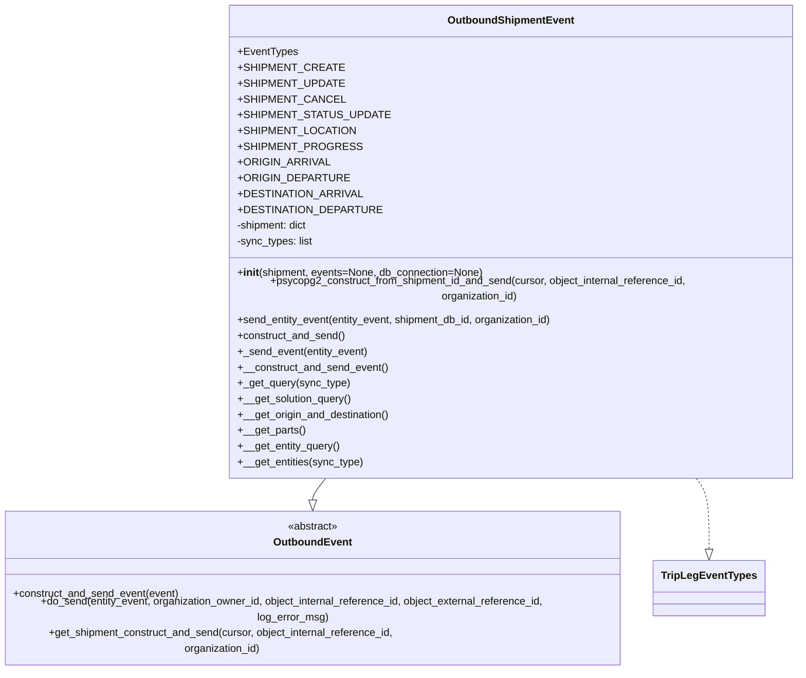

# Diagram: shipment_core/shipment_service/shipment_service/fvshared/outbound_shipment_event.py


> Auto-generated by Obscura crawlers

## Diagram 1



### SVG

<svg id="container" width="1250.2578125" xmlns="http://www.w3.org/2000/svg" class="classDiagram" height="960" viewBox="0 0 1250.2578125 960" role="graphics-document document" aria-roledescription="class"><style>#container{font-family:"trebuchet ms",verdana,arial,sans-serif;font-size:16px;fill:#333;}@keyframes edge-animation-frame{from{stroke-dashoffset:0;}}@keyframes dash{to{stroke-dashoffset:0;}}#container .edge-animation-slow{stroke-dasharray:9,5!important;stroke-dashoffset:900;animation:dash 50s linear infinite;stroke-linecap:round;}#container .edge-animation-fast{stroke-dasharray:9,5!important;stroke-dashoffset:900;animation:dash 20s linear infinite;stroke-linecap:round;}#container .error-icon{fill:#552222;}#container .error-text{fill:#552222;stroke:#552222;}#container .edge-thickness-normal{stroke-width:1px;}#container .edge-thickness-thick{stroke-width:3.5px;}#container .edge-pattern-solid{stroke-dasharray:0;}#container .edge-thickness-invisible{stroke-width:0;fill:none;}#container .edge-pattern-dashed{stroke-dasharray:3;}#container .edge-pattern-dotted{stroke-dasharray:2;}#container .marker{fill:#333333;stroke:#333333;}#container .marker.cross{stroke:#333333;}#container svg{font-family:"trebuchet ms",verdana,arial,sans-serif;font-size:16px;}#container p{margin:0;}#container g.classGroup text{fill:#9370DB;stroke:none;font-family:"trebuchet ms",verdana,arial,sans-serif;font-size:10px;}#container g.classGroup text .title{font-weight:bolder;}#container .nodeLabel,#container .edgeLabel{color:#131300;}#container .edgeLabel .label rect{fill:#ECECFF;}#container .label text{fill:#131300;}#container .labelBkg{background:#ECECFF;}#container .edgeLabel .label span{background:#ECECFF;}#container .classTitle{font-weight:bolder;}#container .node rect,#container .node circle,#container .node ellipse,#container .node polygon,#container .node path{fill:#ECECFF;stroke:#9370DB;stroke-width:1px;}#container .divider{stroke:#9370DB;stroke-width:1;}#container g.clickable{cursor:pointer;}#container g.classGroup rect{fill:#ECECFF;stroke:#9370DB;}#container g.classGroup line{stroke:#9370DB;stroke-width:1;}#container .classLabel .box{stroke:none;stroke-width:0;fill:#ECECFF;opacity:0.5;}#container .classLabel .label{fill:#9370DB;font-size:10px;}#container .relation{stroke:#333333;stroke-width:1;fill:none;}#container .dashed-line{stroke-dasharray:3;}#container .dotted-line{stroke-dasharray:1 2;}#container #compositionStart,#container .composition{fill:#333333!important;stroke:#333333!important;stroke-width:1;}#container #compositionEnd,#container .composition{fill:#333333!important;stroke:#333333!important;stroke-width:1;}#container #dependencyStart,#container .dependency{fill:#333333!important;stroke:#333333!important;stroke-width:1;}#container #dependencyStart,#container .dependency{fill:#333333!important;stroke:#333333!important;stroke-width:1;}#container #extensionStart,#container .extension{fill:transparent!important;stroke:#333333!important;stroke-width:1;}#container #extensionEnd,#container .extension{fill:transparent!important;stroke:#333333!important;stroke-width:1;}#container #aggregationStart,#container .aggregation{fill:transparent!important;stroke:#333333!important;stroke-width:1;}#container #aggregationEnd,#container .aggregation{fill:transparent!important;stroke:#333333!important;stroke-width:1;}#container #lollipopStart,#container .lollipop{fill:#ECECFF!important;stroke:#333333!important;stroke-width:1;}#container #lollipopEnd,#container .lollipop{fill:#ECECFF!important;stroke:#333333!important;stroke-width:1;}#container .edgeTerminals{font-size:11px;line-height:initial;}#container .classTitleText{text-anchor:middle;font-size:18px;fill:#333;}#container .label-icon{display:inline-block;height:1em;overflow:visible;vertical-align:-0.125em;}#container .node .label-icon path{fill:currentColor;stroke:revert;stroke-width:revert;}#container :root{--mermaid-font-family:"trebuchet ms",verdana,arial,sans-serif;}</style><g><defs><marker id="container_class-aggregationStart" class="marker aggregation class" refX="18" refY="7" markerWidth="190" markerHeight="240" orient="auto"><path d="M 18,7 L9,13 L1,7 L9,1 Z"></path></marker></defs><defs><marker id="container_class-aggregationEnd" class="marker aggregation class" refX="1" refY="7" markerWidth="20" markerHeight="28" orient="auto"><path d="M 18,7 L9,13 L1,7 L9,1 Z"></path></marker></defs><defs><marker id="container_class-extensionStart" class="marker extension class" refX="18" refY="7" markerWidth="190" markerHeight="240" orient="auto"><path d="M 1,7 L18,13 V 1 Z"></path></marker></defs><defs><marker id="container_class-extensionEnd" class="marker extension class" refX="1" refY="7" markerWidth="20" markerHeight="28" orient="auto"><path d="M 1,1 V 13 L18,7 Z"></path></marker></defs><defs><marker id="container_class-compositionStart" class="marker composition class" refX="18" refY="7" markerWidth="190" markerHeight="240" orient="auto"><path d="M 18,7 L9,13 L1,7 L9,1 Z"></path></marker></defs><defs><marker id="container_class-compositionEnd" class="marker composition class" refX="1" refY="7" markerWidth="20" markerHeight="28" orient="auto"><path d="M 18,7 L9,13 L1,7 L9,1 Z"></path></marker></defs><defs><marker id="container_class-dependencyStart" class="marker dependency class" refX="6" refY="7" markerWidth="190" markerHeight="240" orient="auto"><path d="M 5,7 L9,13 L1,7 L9,1 Z"></path></marker></defs><defs><marker id="container_class-dependencyEnd" class="marker dependency class" refX="13" refY="7" markerWidth="20" markerHeight="28" orient="auto"><path d="M 18,7 L9,13 L14,7 L9,1 Z"></path></marker></defs><defs><marker id="container_class-lollipopStart" class="marker lollipop class" refX="13" refY="7" markerWidth="190" markerHeight="240" orient="auto"><circle stroke="black" fill="transparent" cx="7" cy="7" r="6"></circle></marker></defs><defs><marker id="container_class-lollipopEnd" class="marker lollipop class" refX="1" refY="7" markerWidth="190" markerHeight="240" orient="auto"><circle stroke="black" fill="transparent" cx="7" cy="7" r="6"></circle></marker></defs><g class="root"><g class="clusters"></g><g class="edgePaths"><path d="M514.514,704L511.071,708.167C507.629,712.333,500.744,720.667,497.302,726.125C493.859,731.583,493.859,734.167,493.859,735.458L493.859,736.75" id="id_OutboundShipmentEvent_OutboundEvent_1" class="edge-thickness-normal edge-pattern-solid relation" style=";;;" data-edge="true" data-et="edge" data-id="id_OutboundShipmentEvent_OutboundEvent_1" data-points="W3sieCI6NTE0LjUxMzU0MDk2ODQ5ODcsInkiOjcwNH0seyJ4Ijo0OTMuODU5Mzc1LCJ5Ijo3Mjl9LHsieCI6NDkzLjg1OTM3NSwieSI6NzU0fV0=" marker-end="url(#container_class-extensionEnd)"></path><path d="M1089.526,704L1092.968,708.167C1096.41,712.333,1103.295,720.667,1106.737,735.625C1110.18,750.583,1110.18,772.167,1110.18,782.958L1110.18,793.75" id="id_OutboundShipmentEvent_TripLegEventTypes_2" class="edge-thickness-normal edge-pattern-dashed relation" style=";;;" data-edge="true" data-et="edge" data-id="id_OutboundShipmentEvent_TripLegEventTypes_2" data-points="W3sieCI6MTA4OS41MjU1MjE1MzE1MDE1LCJ5Ijo3MDR9LHsieCI6MTExMC4xNzk2ODc1LCJ5Ijo3Mjl9LHsieCI6MTExMC4xNzk2ODc1LCJ5Ijo4MTF9XQ==" marker-end="url(#container_class-extensionEnd)"></path></g><g class="edgeLabels"><g class="edgeLabel"><g class="label" data-id="id_OutboundShipmentEvent_OutboundEvent_1" transform="translate(0, 0)"><foreignObject width="0" height="0"><div xmlns="http://www.w3.org/1999/xhtml" class="labelBkg" style="display: table-cell; white-space: nowrap; line-height: 1.5; max-width: 200px; text-align: center;"><span class="edgeLabel"></span></div></foreignObject></g></g><g class="edgeLabel"><g class="label" data-id="id_OutboundShipmentEvent_TripLegEventTypes_2" transform="translate(0, 0)"><foreignObject width="0" height="0"><div xmlns="http://www.w3.org/1999/xhtml" class="labelBkg" style="display: table-cell; white-space: nowrap; line-height: 1.5; max-width: 200px; text-align: center;"><span class="edgeLabel"></span></div></foreignObject></g></g></g><g class="nodes"><g class="node default" id="classId-OutboundEvent-0" transform="translate(493.859375, 853)"><g class="basic label-container"><path d="M-485.859375 -99 L485.859375 -99 L485.859375 99 L-485.859375 99" stroke="none" stroke-width="0" fill="#ECECFF" style=""></path><path d="M-485.859375 -99 C-118.1654354613857 -99, 249.5285040772286 -99, 485.859375 -99 M-485.859375 -99 C-262.00297205728043 -99, -38.14656911456086 -99, 485.859375 -99 M485.859375 -99 C485.859375 -24.887918527437662, 485.859375 49.224162945124675, 485.859375 99 M485.859375 -99 C485.859375 -35.821920558355245, 485.859375 27.35615888328951, 485.859375 99 M485.859375 99 C251.54252133808637 99, 17.225667676172748 99, -485.859375 99 M485.859375 99 C260.690991179289 99, 35.52260735857794 99, -485.859375 99 M-485.859375 99 C-485.859375 37.290599019941546, -485.859375 -24.41880196011691, -485.859375 -99 M-485.859375 99 C-485.859375 48.177869031976, -485.859375 -2.6442619360479966, -485.859375 -99" stroke="#9370DB" stroke-width="1.3" fill="none" stroke-dasharray="0 0" style=""></path></g><g class="annotation-group text" transform="translate(-38.609375, -75)"><g class="label" style="" transform="translate(0,-12)"><foreignObject width="77.21875" height="24"><div xmlns="http://www.w3.org/1999/xhtml" style="display: table-cell; white-space: nowrap; line-height: 1.5; max-width: 127px; text-align: center;"><span class="nodeLabel markdown-node-label" style=""><p>«abstract»</p></span></div></foreignObject></g></g><g class="label-group text" transform="translate(-56.84375, -51)"><g class="label" style="font-weight: bolder" transform="translate(0,-12)"><foreignObject width="113.6875" height="24"><div xmlns="http://www.w3.org/1999/xhtml" style="display: table-cell; white-space: nowrap; line-height: 1.5; max-width: 163px; text-align: center;"><span class="nodeLabel markdown-node-label" style=""><p>OutboundEvent</p></span></div></foreignObject></g></g><g class="members-group text" transform="translate(-473.859375, -3)"></g><g class="methods-group text" transform="translate(-473.859375, 27)"><g class="label" style="" transform="translate(0,-12)"><foreignObject width="254.34375" height="24"><div xmlns="http://www.w3.org/1999/xhtml" style="display: table-cell; white-space: nowrap; line-height: 1.5; max-width: 312px; text-align: center;"><span class="nodeLabel markdown-node-label" style=""><p>+construct_and_send_event(event)</p></span></div></foreignObject></g><g class="label" style="" transform="translate(0,12)"><foreignObject width="890.875" height="24"><div xmlns="http://www.w3.org/1999/xhtml" style="display: table-cell; white-space: nowrap; line-height: 1.5; max-width: 948px; text-align: center;"><span class="nodeLabel markdown-node-label" style=""><p>+do_send(entity_event, organization_owner_id, object_internal_reference_id, object_external_reference_id, log_error_msg)</p></span></div></foreignObject></g><g class="label" style="" transform="translate(0,36)"><foreignObject width="655.65625" height="24"><div xmlns="http://www.w3.org/1999/xhtml" style="display: table-cell; white-space: nowrap; line-height: 1.5; max-width: 713px; text-align: center;"><span class="nodeLabel markdown-node-label" style=""><p>+get_shipment_construct_and_send(cursor, object_internal_reference_id, organization_id)</p></span></div></foreignObject></g></g><g class="divider" style=""><path d="M-485.859375 -27 C-221.48293607549584 -27, 42.893502849008314 -27, 485.859375 -27 M-485.859375 -27 C-195.4167776449966 -27, 95.02581971000677 -27, 485.859375 -27" stroke="#9370DB" stroke-width="1.3" fill="none" stroke-dasharray="0 0" style=""></path></g><g class="divider" style=""><path d="M-485.859375 -3 C-238.68271181526188 -3, 8.493951369476235 -3, 485.859375 -3 M-485.859375 -3 C-172.63913663041893 -3, 140.58110173916214 -3, 485.859375 -3" stroke="#9370DB" stroke-width="1.3" fill="none" stroke-dasharray="0 0" style=""></path></g></g><g class="node default" id="classId-OutboundShipmentEvent-1" transform="translate(802.01953125, 356)"><g class="basic label-container"><path d="M-440.23828125 -348 L440.23828125 -348 L440.23828125 348 L-440.23828125 348" stroke="none" stroke-width="0" fill="#ECECFF" style=""></path><path d="M-440.23828125 -348 C-142.98121525504286 -348, 154.2758507399143 -348, 440.23828125 -348 M-440.23828125 -348 C-123.35963775032099 -348, 193.51900574935803 -348, 440.23828125 -348 M440.23828125 -348 C440.23828125 -206.54580663881978, 440.23828125 -65.09161327763957, 440.23828125 348 M440.23828125 -348 C440.23828125 -186.48871676392778, 440.23828125 -24.977433527855567, 440.23828125 348 M440.23828125 348 C140.86714912075132 348, -158.50398300849736 348, -440.23828125 348 M440.23828125 348 C100.89850290079636 348, -238.44127544840728 348, -440.23828125 348 M-440.23828125 348 C-440.23828125 192.9830012999557, -440.23828125 37.966002599911405, -440.23828125 -348 M-440.23828125 348 C-440.23828125 144.9354064633279, -440.23828125 -58.12918707334421, -440.23828125 -348" stroke="#9370DB" stroke-width="1.3" fill="none" stroke-dasharray="0 0" style=""></path></g><g class="annotation-group text" transform="translate(0, -324)"></g><g class="label-group text" transform="translate(-91.9453125, -324)"><g class="label" style="font-weight: bolder" transform="translate(0,-12)"><foreignObject width="183.890625" height="24"><div xmlns="http://www.w3.org/1999/xhtml" style="display: table-cell; white-space: nowrap; line-height: 1.5; max-width: 233px; text-align: center;"><span class="nodeLabel markdown-node-label" style=""><p>OutboundShipmentEvent</p></span></div></foreignObject></g></g><g class="members-group text" transform="translate(-428.23828125, -276)"><g class="label" style="" transform="translate(0,-12)"><foreignObject width="89.109375" height="24"><div xmlns="http://www.w3.org/1999/xhtml" style="display: table-cell; white-space: nowrap; line-height: 1.5; max-width: 146px; text-align: center;"><span class="nodeLabel markdown-node-label" style=""><p>+EventTypes</p></span></div></foreignObject></g><g class="label" style="" transform="translate(0,12)"><foreignObject width="139.96875" height="24"><div xmlns="http://www.w3.org/1999/xhtml" style="display: table-cell; white-space: nowrap; line-height: 1.5; max-width: 197px; text-align: center;"><span class="nodeLabel markdown-node-label" style=""><p>+SHIPMENT_CREATE</p></span></div></foreignObject></g><g class="label" style="" transform="translate(0,36)"><foreignObject width="142.96875" height="24"><div xmlns="http://www.w3.org/1999/xhtml" style="display: table-cell; white-space: nowrap; line-height: 1.5; max-width: 200px; text-align: center;"><span class="nodeLabel markdown-node-label" style=""><p>+SHIPMENT_UPDATE</p></span></div></foreignObject></g><g class="label" style="" transform="translate(0,60)"><foreignObject width="142.125" height="24"><div xmlns="http://www.w3.org/1999/xhtml" style="display: table-cell; white-space: nowrap; line-height: 1.5; max-width: 200px; text-align: center;"><span class="nodeLabel markdown-node-label" style=""><p>+SHIPMENT_CANCEL</p></span></div></foreignObject></g><g class="label" style="" transform="translate(0,84)"><foreignObject width="202.171875" height="24"><div xmlns="http://www.w3.org/1999/xhtml" style="display: table-cell; white-space: nowrap; line-height: 1.5; max-width: 260px; text-align: center;"><span class="nodeLabel markdown-node-label" style=""><p>+SHIPMENT_STATUS_UPDATE</p></span></div></foreignObject></g><g class="label" style="" transform="translate(0,108)"><foreignObject width="158.859375" height="24"><div xmlns="http://www.w3.org/1999/xhtml" style="display: table-cell; white-space: nowrap; line-height: 1.5; max-width: 216px; text-align: center;"><span class="nodeLabel markdown-node-label" style=""><p>+SHIPMENT_LOCATION</p></span></div></foreignObject></g><g class="label" style="" transform="translate(0,132)"><foreignObject width="163.546875" height="24"><div xmlns="http://www.w3.org/1999/xhtml" style="display: table-cell; white-space: nowrap; line-height: 1.5; max-width: 221px; text-align: center;"><span class="nodeLabel markdown-node-label" style=""><p>+SHIPMENT_PROGRESS</p></span></div></foreignObject></g><g class="label" style="" transform="translate(0,156)"><foreignObject width="126.578125" height="24"><div xmlns="http://www.w3.org/1999/xhtml" style="display: table-cell; white-space: nowrap; line-height: 1.5; max-width: 184px; text-align: center;"><span class="nodeLabel markdown-node-label" style=""><p>+ORIGIN_ARRIVAL</p></span></div></foreignObject></g><g class="label" style="" transform="translate(0,180)"><foreignObject width="150.359375" height="24"><div xmlns="http://www.w3.org/1999/xhtml" style="display: table-cell; white-space: nowrap; line-height: 1.5; max-width: 208px; text-align: center;"><span class="nodeLabel markdown-node-label" style=""><p>+ORIGIN_DEPARTURE</p></span></div></foreignObject></g><g class="label" style="" transform="translate(0,204)"><foreignObject width="169.71875" height="24"><div xmlns="http://www.w3.org/1999/xhtml" style="display: table-cell; white-space: nowrap; line-height: 1.5; max-width: 227px; text-align: center;"><span class="nodeLabel markdown-node-label" style=""><p>+DESTINATION_ARRIVAL</p></span></div></foreignObject></g><g class="label" style="" transform="translate(0,228)"><foreignObject width="193.5" height="24"><div xmlns="http://www.w3.org/1999/xhtml" style="display: table-cell; white-space: nowrap; line-height: 1.5; max-width: 251px; text-align: center;"><span class="nodeLabel markdown-node-label" style=""><p>+DESTINATION_DEPARTURE</p></span></div></foreignObject></g><g class="label" style="" transform="translate(0,252)"><foreignObject width="110.546875" height="24"><div xmlns="http://www.w3.org/1999/xhtml" style="display: table-cell; white-space: nowrap; line-height: 1.5; max-width: 168px; text-align: center;"><span class="nodeLabel markdown-node-label" style=""><p>-shipment: dict</p></span></div></foreignObject></g><g class="label" style="" transform="translate(0,276)"><foreignObject width="116.34375" height="24"><div xmlns="http://www.w3.org/1999/xhtml" style="display: table-cell; white-space: nowrap; line-height: 1.5; max-width: 174px; text-align: center;"><span class="nodeLabel markdown-node-label" style=""><p>-sync_types: list</p></span></div></foreignObject></g></g><g class="methods-group text" transform="translate(-428.23828125, 60)"><g class="label" style="" transform="translate(0,-12)"><foreignObject width="375.40625" height="24"><div xmlns="http://www.w3.org/1999/xhtml" style="display: table-cell; white-space: nowrap; line-height: 1.5; max-width: 464px; text-align: center;"><span class="nodeLabel markdown-node-label" style=""><p>+<strong>init</strong>(shipment, events=None, db_connection=None)</p></span></div></foreignObject></g><g class="label" style="" transform="translate(0,12)"><foreignObject width="764.53125" height="24"><div xmlns="http://www.w3.org/1999/xhtml" style="display: table-cell; white-space: nowrap; line-height: 1.5; max-width: 822px; text-align: center;"><span class="nodeLabel markdown-node-label" style=""><p>+psycopg2_construct_from_shipment_id_and_send(cursor, object_internal_reference_id, organization_id)</p></span></div></foreignObject></g><g class="label" style="" transform="translate(0,36)"><foreignObject width="487.6875" height="24"><div xmlns="http://www.w3.org/1999/xhtml" style="display: table-cell; white-space: nowrap; line-height: 1.5; max-width: 545px; text-align: center;"><span class="nodeLabel markdown-node-label" style=""><p>+send_entity_event(entity_event, shipment_db_id, organization_id)</p></span></div></foreignObject></g><g class="label" style="" transform="translate(0,60)"><foreignObject width="165.671875" height="24"><div xmlns="http://www.w3.org/1999/xhtml" style="display: table-cell; white-space: nowrap; line-height: 1.5; max-width: 223px; text-align: center;"><span class="nodeLabel markdown-node-label" style=""><p>+construct_and_send()</p></span></div></foreignObject></g><g class="label" style="" transform="translate(0,84)"><foreignObject width="198.6875" height="24"><div xmlns="http://www.w3.org/1999/xhtml" style="display: table-cell; white-space: nowrap; line-height: 1.5; max-width: 256px; text-align: center;"><span class="nodeLabel markdown-node-label" style=""><p>+_send_event(entity_event)</p></span></div></foreignObject></g><g class="label" style="" transform="translate(0,108)"><foreignObject width="228.890625" height="24"><div xmlns="http://www.w3.org/1999/xhtml" style="display: table-cell; white-space: nowrap; line-height: 1.5; max-width: 286px; text-align: center;"><span class="nodeLabel markdown-node-label" style=""><p>+__construct_and_send_event()</p></span></div></foreignObject></g><g class="label" style="" transform="translate(0,132)"><foreignObject width="169.640625" height="24"><div xmlns="http://www.w3.org/1999/xhtml" style="display: table-cell; white-space: nowrap; line-height: 1.5; max-width: 227px; text-align: center;"><span class="nodeLabel markdown-node-label" style=""><p>+_get_query(sync_type)</p></span></div></foreignObject></g><g class="label" style="" transform="translate(0,156)"><foreignObject width="174.0625" height="24"><div xmlns="http://www.w3.org/1999/xhtml" style="display: table-cell; white-space: nowrap; line-height: 1.5; max-width: 231px; text-align: center;"><span class="nodeLabel markdown-node-label" style=""><p>+__get_solution_query()</p></span></div></foreignObject></g><g class="label" style="" transform="translate(0,180)"><foreignObject width="233.28125" height="24"><div xmlns="http://www.w3.org/1999/xhtml" style="display: table-cell; white-space: nowrap; line-height: 1.5; max-width: 291px; text-align: center;"><span class="nodeLabel markdown-node-label" style=""><p>+__get_origin_and_destination()</p></span></div></foreignObject></g><g class="label" style="" transform="translate(0,204)"><foreignObject width="102.0625" height="24"><div xmlns="http://www.w3.org/1999/xhtml" style="display: table-cell; white-space: nowrap; line-height: 1.5; max-width: 159px; text-align: center;"><span class="nodeLabel markdown-node-label" style=""><p>+__get_parts()</p></span></div></foreignObject></g><g class="label" style="" transform="translate(0,228)"><foreignObject width="155.390625" height="24"><div xmlns="http://www.w3.org/1999/xhtml" style="display: table-cell; white-space: nowrap; line-height: 1.5; max-width: 213px; text-align: center;"><span class="nodeLabel markdown-node-label" style=""><p>+__get_entity_query()</p></span></div></foreignObject></g><g class="label" style="" transform="translate(0,252)"><foreignObject width="191.015625" height="24"><div xmlns="http://www.w3.org/1999/xhtml" style="display: table-cell; white-space: nowrap; line-height: 1.5; max-width: 248px; text-align: center;"><span class="nodeLabel markdown-node-label" style=""><p>+__get_entities(sync_type)</p></span></div></foreignObject></g></g><g class="divider" style=""><path d="M-440.23828125 -300 C-170.47781797044377 -300, 99.28264530911247 -300, 440.23828125 -300 M-440.23828125 -300 C-134.86530348918484 -300, 170.50767427163032 -300, 440.23828125 -300" stroke="#9370DB" stroke-width="1.3" fill="none" stroke-dasharray="0 0" style=""></path></g><g class="divider" style=""><path d="M-440.23828125 36 C-237.48915435059752 36, -34.74002745119503 36, 440.23828125 36 M-440.23828125 36 C-258.3557226389256 36, -76.47316402785123 36, 440.23828125 36" stroke="#9370DB" stroke-width="1.3" fill="none" stroke-dasharray="0 0" style=""></path></g></g><g class="node default" id="classId-TripLegEventTypes-2" transform="translate(1110.1796875, 853)"><g class="basic label-container"><path d="M-80.4609375 -42 L80.4609375 -42 L80.4609375 42 L-80.4609375 42" stroke="none" stroke-width="0" fill="#ECECFF" style=""></path><path d="M-80.4609375 -42 C-37.28996049449986 -42, 5.881016511000283 -42, 80.4609375 -42 M-80.4609375 -42 C-47.59144897191024 -42, -14.721960443820478 -42, 80.4609375 -42 M80.4609375 -42 C80.4609375 -9.970257808689546, 80.4609375 22.05948438262091, 80.4609375 42 M80.4609375 -42 C80.4609375 -14.117812083041095, 80.4609375 13.76437583391781, 80.4609375 42 M80.4609375 42 C46.32236829667977 42, 12.18379909335954 42, -80.4609375 42 M80.4609375 42 C23.58900110991989 42, -33.28293528016022 42, -80.4609375 42 M-80.4609375 42 C-80.4609375 21.625533647568787, -80.4609375 1.2510672951375739, -80.4609375 -42 M-80.4609375 42 C-80.4609375 11.649745057449081, -80.4609375 -18.700509885101837, -80.4609375 -42" stroke="#9370DB" stroke-width="1.3" fill="none" stroke-dasharray="0 0" style=""></path></g><g class="annotation-group text" transform="translate(0, -18)"></g><g class="label-group text" transform="translate(-68.4609375, -18)"><g class="label" style="font-weight: bolder" transform="translate(0,-12)"><foreignObject width="136.921875" height="24"><div xmlns="http://www.w3.org/1999/xhtml" style="display: table-cell; white-space: nowrap; line-height: 1.5; max-width: 184px; text-align: center;"><span class="nodeLabel markdown-node-label" style=""><p>TripLegEventTypes</p></span></div></foreignObject></g></g><g class="members-group text" transform="translate(-68.4609375, 30)"></g><g class="methods-group text" transform="translate(-68.4609375, 60)"></g><g class="divider" style=""><path d="M-80.4609375 6 C-28.637308541975834 6, 23.186320416048332 6, 80.4609375 6 M-80.4609375 6 C-46.16654411849327 6, -11.87215073698654 6, 80.4609375 6" stroke="#9370DB" stroke-width="1.3" fill="none" stroke-dasharray="0 0" style=""></path></g><g class="divider" style=""><path d="M-80.4609375 24 C-45.402612573206014 24, -10.344287646412027 24, 80.4609375 24 M-80.4609375 24 C-17.619755018970245 24, 45.22142746205951 24, 80.4609375 24" stroke="#9370DB" stroke-width="1.3" fill="none" stroke-dasharray="0 0" style=""></path></g></g></g></g></g></svg>

## Diagram 2

```mermaid
flowchart LR
    A[construct_and_send()] --> B[__construct_and_send_event()]
    B --> C{shipment is not None?}
    C -- no --> D[log error: invalid shipment]
    C -- yes --> E[__get_origin_and_destination()]
    E --> F[__get_parts()]
    F --> G[build shipment_event dict]
    G --> H[filter out None and currentException]
    H --> I[event = {"shipment": shipment_event}]
    I --> J[super.construct_and_send_event(event)]
    J --> K[done]
    subgraph Sending
      S1[send_entity_event(entity_event, shipment_db_id, org_id)]
      S1 --> S2{is haul-away parent?}
      S2 -- yes --> S3[skip send]
      S2 -- no --> S4[super.do_send(...)]
    end
    style Sending stroke:#333,stroke-dasharray:5 5
```

> SVG rendering failed for this diagram.
