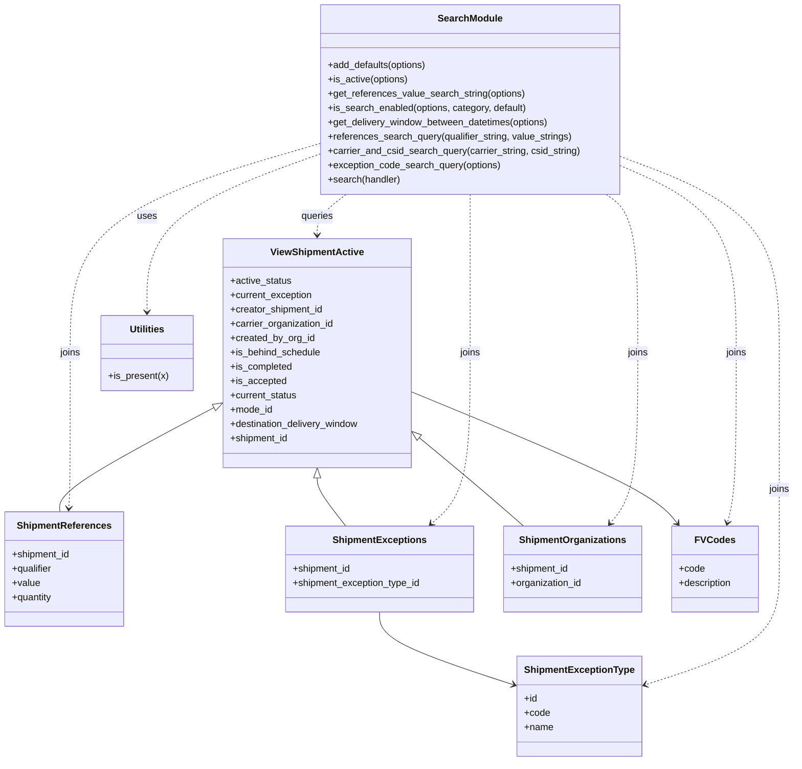

# Diagram: shipment_core/shipment_service/shipment_service/fvshared/searching.py


> Auto-generated by Obscura crawlers

## Diagram 1

```mermaid
flowchart LR
    Event["Lambda Event (event)"] -->|contains queryStringParameters| QSP[QSP_FIELD: queryStringParameters]
    Event -->|may be None| NoQSP[No queryStringParameters]
    QSP --> AddDefaults["add_defaults(options)"]
    NoQSP --> AddDefaults
    AddDefaults --> Parse["parse QSP into options fields"]
    Parse --> Decode{"contains '%' ?"}
    Decode -- yes --> Urldecode["urllib.parse.unquote(option)"]
    Decode -- no --> SkipDecode[Skip decode]
    Urldecode --> Build["build search options"]
    SkipDecode --> Build
    Build --> Validate["validate types / lists (e.g., CSV -> lists)"]
    Validate --> DeliveryWindowCheck{"delivery_window present?"}
    DeliveryWindowCheck -- yes --> GetWindow["get_delivery_window_between_datetimes"]
    DeliveryWindowCheck -- no --> Continue["continue"]
    GetWindow --> Continue
    Continue --> DecoratedHandler["call handler(event, context, options)"]
    AddDefaults -->|on error (KeyError/ValueError)| Warn["log warning and continue"]
    Warn --> DecoratedHandler
```

> SVG rendering failed for this diagram.

## Diagram 2



### SVG

<svg id="container" width="1333.6640625" xmlns="http://www.w3.org/2000/svg" class="classDiagram" height="1276" viewBox="0 0 1333.6640625 1276" role="graphics-document document" aria-roledescription="class"><style>#container{font-family:"trebuchet ms",verdana,arial,sans-serif;font-size:16px;fill:#333;}@keyframes edge-animation-frame{from{stroke-dashoffset:0;}}@keyframes dash{to{stroke-dashoffset:0;}}#container .edge-animation-slow{stroke-dasharray:9,5!important;stroke-dashoffset:900;animation:dash 50s linear infinite;stroke-linecap:round;}#container .edge-animation-fast{stroke-dasharray:9,5!important;stroke-dashoffset:900;animation:dash 20s linear infinite;stroke-linecap:round;}#container .error-icon{fill:#552222;}#container .error-text{fill:#552222;stroke:#552222;}#container .edge-thickness-normal{stroke-width:1px;}#container .edge-thickness-thick{stroke-width:3.5px;}#container .edge-pattern-solid{stroke-dasharray:0;}#container .edge-thickness-invisible{stroke-width:0;fill:none;}#container .edge-pattern-dashed{stroke-dasharray:3;}#container .edge-pattern-dotted{stroke-dasharray:2;}#container .marker{fill:#333333;stroke:#333333;}#container .marker.cross{stroke:#333333;}#container svg{font-family:"trebuchet ms",verdana,arial,sans-serif;font-size:16px;}#container p{margin:0;}#container g.classGroup text{fill:#9370DB;stroke:none;font-family:"trebuchet ms",verdana,arial,sans-serif;font-size:10px;}#container g.classGroup text .title{font-weight:bolder;}#container .nodeLabel,#container .edgeLabel{color:#131300;}#container .edgeLabel .label rect{fill:#ECECFF;}#container .label text{fill:#131300;}#container .labelBkg{background:#ECECFF;}#container .edgeLabel .label span{background:#ECECFF;}#container .classTitle{font-weight:bolder;}#container .node rect,#container .node circle,#container .node ellipse,#container .node polygon,#container .node path{fill:#ECECFF;stroke:#9370DB;stroke-width:1px;}#container .divider{stroke:#9370DB;stroke-width:1;}#container g.clickable{cursor:pointer;}#container g.classGroup rect{fill:#ECECFF;stroke:#9370DB;}#container g.classGroup line{stroke:#9370DB;stroke-width:1;}#container .classLabel .box{stroke:none;stroke-width:0;fill:#ECECFF;opacity:0.5;}#container .classLabel .label{fill:#9370DB;font-size:10px;}#container .relation{stroke:#333333;stroke-width:1;fill:none;}#container .dashed-line{stroke-dasharray:3;}#container .dotted-line{stroke-dasharray:1 2;}#container #compositionStart,#container .composition{fill:#333333!important;stroke:#333333!important;stroke-width:1;}#container #compositionEnd,#container .composition{fill:#333333!important;stroke:#333333!important;stroke-width:1;}#container #dependencyStart,#container .dependency{fill:#333333!important;stroke:#333333!important;stroke-width:1;}#container #dependencyStart,#container .dependency{fill:#333333!important;stroke:#333333!important;stroke-width:1;}#container #extensionStart,#container .extension{fill:transparent!important;stroke:#333333!important;stroke-width:1;}#container #extensionEnd,#container .extension{fill:transparent!important;stroke:#333333!important;stroke-width:1;}#container #aggregationStart,#container .aggregation{fill:transparent!important;stroke:#333333!important;stroke-width:1;}#container #aggregationEnd,#container .aggregation{fill:transparent!important;stroke:#333333!important;stroke-width:1;}#container #lollipopStart,#container .lollipop{fill:#ECECFF!important;stroke:#333333!important;stroke-width:1;}#container #lollipopEnd,#container .lollipop{fill:#ECECFF!important;stroke:#333333!important;stroke-width:1;}#container .edgeTerminals{font-size:11px;line-height:initial;}#container .classTitleText{text-anchor:middle;font-size:18px;fill:#333;}#container .label-icon{display:inline-block;height:1em;overflow:visible;vertical-align:-0.125em;}#container .node .label-icon path{fill:currentColor;stroke:revert;stroke-width:revert;}#container :root{--mermaid-font-family:"trebuchet ms",verdana,arial,sans-serif;}</style><g><defs><marker id="container_class-aggregationStart" class="marker aggregation class" refX="18" refY="7" markerWidth="190" markerHeight="240" orient="auto"><path d="M 18,7 L9,13 L1,7 L9,1 Z"></path></marker></defs><defs><marker id="container_class-aggregationEnd" class="marker aggregation class" refX="1" refY="7" markerWidth="20" markerHeight="28" orient="auto"><path d="M 18,7 L9,13 L1,7 L9,1 Z"></path></marker></defs><defs><marker id="container_class-extensionStart" class="marker extension class" refX="18" refY="7" markerWidth="190" markerHeight="240" orient="auto"><path d="M 1,7 L18,13 V 1 Z"></path></marker></defs><defs><marker id="container_class-extensionEnd" class="marker extension class" refX="1" refY="7" markerWidth="20" markerHeight="28" orient="auto"><path d="M 1,1 V 13 L18,7 Z"></path></marker></defs><defs><marker id="container_class-compositionStart" class="marker composition class" refX="18" refY="7" markerWidth="190" markerHeight="240" orient="auto"><path d="M 18,7 L9,13 L1,7 L9,1 Z"></path></marker></defs><defs><marker id="container_class-compositionEnd" class="marker composition class" refX="1" refY="7" markerWidth="20" markerHeight="28" orient="auto"><path d="M 18,7 L9,13 L1,7 L9,1 Z"></path></marker></defs><defs><marker id="container_class-dependencyStart" class="marker dependency class" refX="6" refY="7" markerWidth="190" markerHeight="240" orient="auto"><path d="M 5,7 L9,13 L1,7 L9,1 Z"></path></marker></defs><defs><marker id="container_class-dependencyEnd" class="marker dependency class" refX="13" refY="7" markerWidth="20" markerHeight="28" orient="auto"><path d="M 18,7 L9,13 L14,7 L9,1 Z"></path></marker></defs><defs><marker id="container_class-lollipopStart" class="marker lollipop class" refX="13" refY="7" markerWidth="190" markerHeight="240" orient="auto"><circle stroke="black" fill="transparent" cx="7" cy="7" r="6"></circle></marker></defs><defs><marker id="container_class-lollipopEnd" class="marker lollipop class" refX="1" refY="7" markerWidth="190" markerHeight="240" orient="auto"><circle stroke="black" fill="transparent" cx="7" cy="7" r="6"></circle></marker></defs><g class="root"><g class="clusters"></g><g class="edgePaths"><path d="M358.667,683.76L315.083,706.633C271.498,729.506,184.329,775.253,141.208,804.293C98.087,833.333,99.015,845.667,99.478,851.833L99.942,858" id="id_ViewShipmentActive_ShipmentReferences_1" class="edge-thickness-normal edge-pattern-solid relation" style=";;;" data-edge="true" data-et="edge" data-id="id_ViewShipmentActive_ShipmentReferences_1" data-points="W3sieCI6MzczLjk0MTQwNjI1LCJ5Ijo2NzUuNzQzNDg3MzY4NjI4NH0seyJ4Ijo5Ny4xNjAxNTYyNSwieSI6ODIxfSx7IngiOjk5Ljk0MjExMTEzNzIxODA1LCJ5Ijo4NTh9XQ==" marker-start="url(#container_class-extensionStart)"></path><path d="M533.512,801.25L533.512,804.542C533.512,807.833,533.512,814.417,541.621,827.875C549.73,841.333,565.948,861.667,574.057,871.833L582.166,882" id="id_ViewShipmentActive_ShipmentExceptions_2" class="edge-thickness-normal edge-pattern-solid relation" style=";;;" data-edge="true" data-et="edge" data-id="id_ViewShipmentActive_ShipmentExceptions_2" data-points="W3sieCI6NTMzLjUxMTcxODc1LCJ5Ijo3ODR9LHsieCI6NTMzLjUxMTcxODc1LCJ5Ijo4MjF9LHsieCI6NTgyLjE2NTg4MzQ1ODY0NjYsInkiOjg4Mn1d" marker-start="url(#container_class-extensionStart)"></path><path d="M639.594,1026L639.594,1034.167C639.594,1042.333,639.594,1058.667,677.659,1079.247C715.725,1099.827,791.856,1124.655,829.922,1137.069L867.987,1149.482" id="id_ShipmentExceptions_ShipmentExceptionType_3" class="edge-thickness-normal edge-pattern-solid relation" style=";;;" data-edge="true" data-et="edge" data-id="id_ShipmentExceptions_ShipmentExceptionType_3" data-points="W3sieCI6NjM5LjU5Mzc1LCJ5IjoxMDI2fSx7IngiOjYzOS41OTM3NSwieSI6MTA3NX0seyJ4Ijo4NzMuNjkxNDA2MjUsInkiOjExNTEuMzQyNjc1MTU5MjM1Nn1d" marker-end="url(#container_class-dependencyEnd)"></path><path d="M706.389,734.602L723.846,749.002C741.302,763.402,776.216,792.201,805.256,816.767C834.296,841.333,857.463,861.667,869.046,871.833L880.63,882" id="id_ViewShipmentActive_ShipmentOrganizations_4" class="edge-thickness-normal edge-pattern-solid relation" style=";;;" data-edge="true" data-et="edge" data-id="id_ViewShipmentActive_ShipmentOrganizations_4" data-points="W3sieCI6NjkzLjA4MjAzMTI1LCJ5Ijo3MjMuNjI1ODYxODI2MzY4NH0seyJ4Ijo4MTEuMTI4OTA2MjUsInkiOjgyMX0seyJ4Ijo4ODAuNjI5OTkyOTUxMTI3OSwieSI6ODgyfV0=" marker-start="url(#container_class-extensionStart)"></path><path d="M693.082,657.48L759.496,684.734C825.91,711.987,958.738,766.493,1032.843,803.14C1106.949,839.786,1122.331,858.572,1130.022,867.965L1137.713,877.358" id="id_ViewShipmentActive_FVCodes_5" class="edge-thickness-normal edge-pattern-solid relation" style=";;;" data-edge="true" data-et="edge" data-id="id_ViewShipmentActive_FVCodes_5" data-points="W3sieCI6NjkzLjA4MjAzMTI1LCJ5Ijo2NTcuNDgwMzIzNjY4OTk1Mn0seyJ4IjoxMDkxLjU2NjQwNjI1LCJ5Ijo4MjF9LHsieCI6MTE0MS41MTQwOTc3NDQzNjEsInkiOjg4Mn1d" marker-end="url(#container_class-dependencyEnd)"></path><path d="M539.648,257.56L490.848,275.133C442.048,292.707,344.448,327.853,295.648,372.093C246.848,416.333,246.848,469.667,246.848,496.333L246.848,523" id="id_SearchModule_Utilities_6" class="edge-thickness-normal edge-pattern-dashed relation" style=";;;" data-edge="true" data-et="edge" data-id="id_SearchModule_Utilities_6" data-points="W3sieCI6NTM5LjY0ODQzNzUsInkiOjI1Ny41NjAxMTM2ODIwMzQ4fSx7IngiOjI0Ni44NDc2NTYyNSwieSI6MzYzfSx7IngiOjI0Ni44NDc2NTYyNSwieSI6NTI5fV0=" marker-end="url(#container_class-dependencyEnd)"></path><path d="M582.144,326L574.038,332.167C565.933,338.333,549.722,350.667,541.617,362C533.512,373.333,533.512,383.667,533.512,388.833L533.512,394" id="id_SearchModule_ViewShipmentActive_7" class="edge-thickness-normal edge-pattern-dashed relation" style=";;;" data-edge="true" data-et="edge" data-id="id_SearchModule_ViewShipmentActive_7" data-points="W3sieCI6NTgyLjE0MzUzNDc1NzY1MywieSI6MzI2fSx7IngiOjUzMy41MTE3MTg3NSwieSI6MzYzfSx7IngiOjUzMy41MTE3MTg3NSwieSI6NDAwfV0=" marker-end="url(#container_class-dependencyEnd)"></path><path d="M539.648,240.134L469.234,260.612C398.819,281.089,257.99,322.045,187.575,380.689C117.16,439.333,117.16,515.667,117.16,592C117.16,668.333,117.16,744.667,116.771,788.003C116.383,831.339,115.605,841.678,115.217,846.847L114.828,852.017" id="id_SearchModule_ShipmentReferences_8" class="edge-thickness-normal edge-pattern-dashed relation" style=";;;" data-edge="true" data-et="edge" data-id="id_SearchModule_ShipmentReferences_8" data-points="W3sieCI6NTM5LjY0ODQzNzUsInkiOjI0MC4xMzQyMDk2NzIxODQzNH0seyJ4IjoxMTcuMTYwMTU2MjUsInkiOjM2M30seyJ4IjoxMTcuMTYwMTU2MjUsInkiOjU5Mn0seyJ4IjoxMTcuMTYwMTU2MjUsInkiOjgyMX0seyJ4IjoxMTQuMzc4MjAxMzYyNzgxOTUsInkiOjg1OH1d" marker-end="url(#container_class-dependencyEnd)"></path><path d="M791.129,326L791.129,332.167C791.129,338.333,791.129,350.667,791.129,395C791.129,439.333,791.129,515.667,791.129,592C791.129,668.333,791.129,744.667,780.297,792.34C769.465,840.014,747.801,859.028,736.969,868.535L726.137,878.042" id="id_SearchModule_ShipmentExceptions_9" class="edge-thickness-normal edge-pattern-dashed relation" style=";;;" data-edge="true" data-et="edge" data-id="id_SearchModule_ShipmentExceptions_9" data-points="W3sieCI6NzkxLjEyODkwNjI1LCJ5IjozMjZ9LHsieCI6NzkxLjEyODkwNjI1LCJ5IjozNjN9LHsieCI6NzkxLjEyODkwNjI1LCJ5Ijo1OTJ9LHsieCI6NzkxLjEyODkwNjI1LCJ5Ijo4MjF9LHsieCI6NzIxLjYyNzgxOTU0ODg3MjEsInkiOjg4Mn1d" marker-end="url(#container_class-dependencyEnd)"></path><path d="M1042.609,262.35L1086.853,279.125C1131.096,295.9,1219.583,329.45,1263.827,384.392C1308.07,439.333,1308.07,515.667,1308.07,592C1308.07,668.333,1308.07,744.667,1308.07,805C1308.07,865.333,1308.07,909.667,1308.07,952C1308.07,994.333,1308.07,1034.667,1270.005,1067.247C1231.939,1099.827,1155.808,1124.655,1117.743,1137.069L1079.677,1149.482" id="id_SearchModule_ShipmentExceptionType_10" class="edge-thickness-normal edge-pattern-dashed relation" style=";;;" data-edge="true" data-et="edge" data-id="id_SearchModule_ShipmentExceptionType_10" data-points="W3sieCI6MTA0Mi42MDkzNzUsInkiOjI2Mi4zNDk2MzAxMTEwMDQ1fSx7IngiOjEzMDguMDcwMzEyNSwieSI6MzYzfSx7IngiOjEzMDguMDcwMzEyNSwieSI6NTkyfSx7IngiOjEzMDguMDcwMzEyNSwieSI6ODIxfSx7IngiOjEzMDguMDcwMzEyNSwieSI6OTU0fSx7IngiOjEzMDguMDcwMzEyNSwieSI6MTA3NX0seyJ4IjoxMDczLjk3MjY1NjI1LCJ5IjoxMTUxLjM0MjY3NTE1OTIzNTZ9XQ==" marker-end="url(#container_class-dependencyEnd)"></path><path d="M1018.627,326L1027.45,332.167C1036.273,338.333,1053.92,350.667,1062.743,395C1071.566,439.333,1071.566,515.667,1071.566,592C1071.566,668.333,1071.566,744.667,1063.875,792.226C1056.184,839.786,1040.802,858.572,1033.111,867.965L1025.42,877.358" id="id_SearchModule_ShipmentOrganizations_11" class="edge-thickness-normal edge-pattern-dashed relation" style=";;;" data-edge="true" data-et="edge" data-id="id_SearchModule_ShipmentOrganizations_11" data-points="W3sieCI6MTAxOC42MjY2NzQxMDcxNDI5LCJ5IjozMjZ9LHsieCI6MTA3MS41NjY0MDYyNSwieSI6MzYzfSx7IngiOjEwNzEuNTY2NDA2MjUsInkiOjU5Mn0seyJ4IjoxMDcxLjU2NjQwNjI1LCJ5Ijo4MjF9LHsieCI6MTAyMS42MTg3MTQ3NTU2MzkxLCJ5Ijo4ODJ9XQ==" marker-end="url(#container_class-dependencyEnd)"></path><path d="M1042.609,277.928L1074.753,292.107C1106.897,306.285,1171.185,334.643,1203.329,386.988C1235.473,439.333,1235.473,515.667,1235.473,592C1235.473,668.333,1235.473,744.667,1233.051,792.033C1230.63,839.399,1225.788,857.798,1223.367,866.998L1220.945,876.198" id="id_SearchModule_FVCodes_12" class="edge-thickness-normal edge-pattern-dashed relation" style=";;;" data-edge="true" data-et="edge" data-id="id_SearchModule_FVCodes_12" data-points="W3sieCI6MTA0Mi42MDkzNzUsInkiOjI3Ny45MjgwMTg4NDgwMjAyNn0seyJ4IjoxMjM1LjQ3MjY1NjI1LCJ5IjozNjN9LHsieCI6MTIzNS40NzI2NTYyNSwieSI6NTkyfSx7IngiOjEyMzUuNDcyNjU2MjUsInkiOjgyMX0seyJ4IjoxMjE5LjQxODIzMzA4MjcwNjgsInkiOjg4Mn1d" marker-end="url(#container_class-dependencyEnd)"></path></g><g class="edgeLabels"><g class="edgeLabel"><g class="label" data-id="id_ViewShipmentActive_ShipmentReferences_1" transform="translate(0, 0)"><foreignObject width="0" height="0"><div xmlns="http://www.w3.org/1999/xhtml" class="labelBkg" style="display: table-cell; white-space: nowrap; line-height: 1.5; max-width: 200px; text-align: center;"><span class="edgeLabel"></span></div></foreignObject></g></g><g class="edgeLabel"><g class="label" data-id="id_ViewShipmentActive_ShipmentExceptions_2" transform="translate(0, 0)"><foreignObject width="0" height="0"><div xmlns="http://www.w3.org/1999/xhtml" class="labelBkg" style="display: table-cell; white-space: nowrap; line-height: 1.5; max-width: 200px; text-align: center;"><span class="edgeLabel"></span></div></foreignObject></g></g><g class="edgeLabel"><g class="label" data-id="id_ShipmentExceptions_ShipmentExceptionType_3" transform="translate(0, 0)"><foreignObject width="0" height="0"><div xmlns="http://www.w3.org/1999/xhtml" class="labelBkg" style="display: table-cell; white-space: nowrap; line-height: 1.5; max-width: 200px; text-align: center;"><span class="edgeLabel"></span></div></foreignObject></g></g><g class="edgeLabel"><g class="label" data-id="id_ViewShipmentActive_ShipmentOrganizations_4" transform="translate(0, 0)"><foreignObject width="0" height="0"><div xmlns="http://www.w3.org/1999/xhtml" class="labelBkg" style="display: table-cell; white-space: nowrap; line-height: 1.5; max-width: 200px; text-align: center;"><span class="edgeLabel"></span></div></foreignObject></g></g><g class="edgeLabel"><g class="label" data-id="id_ViewShipmentActive_FVCodes_5" transform="translate(0, 0)"><foreignObject width="0" height="0"><div xmlns="http://www.w3.org/1999/xhtml" class="labelBkg" style="display: table-cell; white-space: nowrap; line-height: 1.5; max-width: 200px; text-align: center;"><span class="edgeLabel"></span></div></foreignObject></g></g><g class="edgeLabel" transform="translate(246.84765625, 363)"><g class="label" data-id="id_SearchModule_Utilities_6" transform="translate(-16.4921875, -12)"><foreignObject width="32.984375" height="24"><div xmlns="http://www.w3.org/1999/xhtml" class="labelBkg" style="display: table-cell; white-space: nowrap; line-height: 1.5; max-width: 200px; text-align: center;"><span class="edgeLabel"><p>uses</p></span></div></foreignObject></g></g><g class="edgeLabel" transform="translate(533.51171875, 363)"><g class="label" data-id="id_SearchModule_ViewShipmentActive_7" transform="translate(-27.2421875, -12)"><foreignObject width="54.484375" height="24"><div xmlns="http://www.w3.org/1999/xhtml" class="labelBkg" style="display: table-cell; white-space: nowrap; line-height: 1.5; max-width: 200px; text-align: center;"><span class="edgeLabel"><p>queries</p></span></div></foreignObject></g></g><g class="edgeLabel" transform="translate(117.16015625, 592)"><g class="label" data-id="id_SearchModule_ShipmentReferences_8" transform="translate(-17.59375, -12)"><foreignObject width="35.1875" height="24"><div xmlns="http://www.w3.org/1999/xhtml" class="labelBkg" style="display: table-cell; white-space: nowrap; line-height: 1.5; max-width: 200px; text-align: center;"><span class="edgeLabel"><p>joins</p></span></div></foreignObject></g></g><g class="edgeLabel" transform="translate(791.12890625, 592)"><g class="label" data-id="id_SearchModule_ShipmentExceptions_9" transform="translate(-17.59375, -12)"><foreignObject width="35.1875" height="24"><div xmlns="http://www.w3.org/1999/xhtml" class="labelBkg" style="display: table-cell; white-space: nowrap; line-height: 1.5; max-width: 200px; text-align: center;"><span class="edgeLabel"><p>joins</p></span></div></foreignObject></g></g><g class="edgeLabel" transform="translate(1308.0703125, 821)"><g class="label" data-id="id_SearchModule_ShipmentExceptionType_10" transform="translate(-17.59375, -12)"><foreignObject width="35.1875" height="24"><div xmlns="http://www.w3.org/1999/xhtml" class="labelBkg" style="display: table-cell; white-space: nowrap; line-height: 1.5; max-width: 200px; text-align: center;"><span class="edgeLabel"><p>joins</p></span></div></foreignObject></g></g><g class="edgeLabel" transform="translate(1071.56640625, 592)"><g class="label" data-id="id_SearchModule_ShipmentOrganizations_11" transform="translate(-17.59375, -12)"><foreignObject width="35.1875" height="24"><div xmlns="http://www.w3.org/1999/xhtml" class="labelBkg" style="display: table-cell; white-space: nowrap; line-height: 1.5; max-width: 200px; text-align: center;"><span class="edgeLabel"><p>joins</p></span></div></foreignObject></g></g><g class="edgeLabel" transform="translate(1235.47265625, 592)"><g class="label" data-id="id_SearchModule_FVCodes_12" transform="translate(-17.59375, -12)"><foreignObject width="35.1875" height="24"><div xmlns="http://www.w3.org/1999/xhtml" class="labelBkg" style="display: table-cell; white-space: nowrap; line-height: 1.5; max-width: 200px; text-align: center;"><span class="edgeLabel"><p>joins</p></span></div></foreignObject></g></g></g><g class="nodes"><g class="node default" id="classId-ViewShipmentActive-0" transform="translate(533.51171875, 592)"><g class="basic label-container"><path d="M-159.5703125 -192 L159.5703125 -192 L159.5703125 192 L-159.5703125 192" stroke="none" stroke-width="0" fill="#ECECFF" style=""></path><path d="M-159.5703125 -192 C-70.42509074793861 -192, 18.720131004122777 -192, 159.5703125 -192 M-159.5703125 -192 C-84.589585212879 -192, -9.608857925758002 -192, 159.5703125 -192 M159.5703125 -192 C159.5703125 -92.20551664206766, 159.5703125 7.588966715864672, 159.5703125 192 M159.5703125 -192 C159.5703125 -54.24915368609874, 159.5703125 83.50169262780253, 159.5703125 192 M159.5703125 192 C91.7567760926749 192, 23.943239685349795 192, -159.5703125 192 M159.5703125 192 C45.728134363456235 192, -68.11404377308753 192, -159.5703125 192 M-159.5703125 192 C-159.5703125 63.200388060763316, -159.5703125 -65.59922387847337, -159.5703125 -192 M-159.5703125 192 C-159.5703125 74.38375501008566, -159.5703125 -43.23248997982867, -159.5703125 -192" stroke="#9370DB" stroke-width="1.3" fill="none" stroke-dasharray="0 0" style=""></path></g><g class="annotation-group text" transform="translate(0, -168)"></g><g class="label-group text" transform="translate(-74.6875, -168)"><g class="label" style="font-weight: bolder" transform="translate(0,-12)"><foreignObject width="149.375" height="24"><div xmlns="http://www.w3.org/1999/xhtml" style="display: table-cell; white-space: nowrap; line-height: 1.5; max-width: 197px; text-align: center;"><span class="nodeLabel markdown-node-label" style=""><p>ViewShipmentActive</p></span></div></foreignObject></g></g><g class="members-group text" transform="translate(-147.5703125, -120)"><g class="label" style="" transform="translate(0,-12)"><foreignObject width="103.3125" height="24"><div xmlns="http://www.w3.org/1999/xhtml" style="display: table-cell; white-space: nowrap; line-height: 1.5; max-width: 161px; text-align: center;"><span class="nodeLabel markdown-node-label" style=""><p>+active_status</p></span></div></foreignObject></g><g class="label" style="" transform="translate(0,12)"><foreignObject width="139.28125" height="24"><div xmlns="http://www.w3.org/1999/xhtml" style="display: table-cell; white-space: nowrap; line-height: 1.5; max-width: 197px; text-align: center;"><span class="nodeLabel markdown-node-label" style=""><p>+current_exception</p></span></div></foreignObject></g><g class="label" style="" transform="translate(0,36)"><foreignObject width="157.546875" height="24"><div xmlns="http://www.w3.org/1999/xhtml" style="display: table-cell; white-space: nowrap; line-height: 1.5; max-width: 215px; text-align: center;"><span class="nodeLabel markdown-node-label" style=""><p>+creator_shipment_id</p></span></div></foreignObject></g><g class="label" style="" transform="translate(0,60)"><foreignObject width="175.421875" height="24"><div xmlns="http://www.w3.org/1999/xhtml" style="display: table-cell; white-space: nowrap; line-height: 1.5; max-width: 233px; text-align: center;"><span class="nodeLabel markdown-node-label" style=""><p>+carrier_organization_id</p></span></div></foreignObject></g><g class="label" style="" transform="translate(0,84)"><foreignObject width="141.640625" height="24"><div xmlns="http://www.w3.org/1999/xhtml" style="display: table-cell; white-space: nowrap; line-height: 1.5; max-width: 199px; text-align: center;"><span class="nodeLabel markdown-node-label" style=""><p>+created_by_org_id</p></span></div></foreignObject></g><g class="label" style="" transform="translate(0,108)"><foreignObject width="152.78125" height="24"><div xmlns="http://www.w3.org/1999/xhtml" style="display: table-cell; white-space: nowrap; line-height: 1.5; max-width: 210px; text-align: center;"><span class="nodeLabel markdown-node-label" style=""><p>+is_behind_schedule</p></span></div></foreignObject></g><g class="label" style="" transform="translate(0,132)"><foreignObject width="104.703125" height="24"><div xmlns="http://www.w3.org/1999/xhtml" style="display: table-cell; white-space: nowrap; line-height: 1.5; max-width: 162px; text-align: center;"><span class="nodeLabel markdown-node-label" style=""><p>+is_completed</p></span></div></foreignObject></g><g class="label" style="" transform="translate(0,156)"><foreignObject width="93.0625" height="24"><div xmlns="http://www.w3.org/1999/xhtml" style="display: table-cell; white-space: nowrap; line-height: 1.5; max-width: 150px; text-align: center;"><span class="nodeLabel markdown-node-label" style=""><p>+is_accepted</p></span></div></foreignObject></g><g class="label" style="" transform="translate(0,180)"><foreignObject width="113.25" height="24"><div xmlns="http://www.w3.org/1999/xhtml" style="display: table-cell; white-space: nowrap; line-height: 1.5; max-width: 171px; text-align: center;"><span class="nodeLabel markdown-node-label" style=""><p>+current_status</p></span></div></foreignObject></g><g class="label" style="" transform="translate(0,204)"><foreignObject width="71.421875" height="24"><div xmlns="http://www.w3.org/1999/xhtml" style="display: table-cell; white-space: nowrap; line-height: 1.5; max-width: 129px; text-align: center;"><span class="nodeLabel markdown-node-label" style=""><p>+mode_id</p></span></div></foreignObject></g><g class="label" style="" transform="translate(0,228)"><foreignObject width="220.453125" height="24"><div xmlns="http://www.w3.org/1999/xhtml" style="display: table-cell; white-space: nowrap; line-height: 1.5; max-width: 278px; text-align: center;"><span class="nodeLabel markdown-node-label" style=""><p>+destination_delivery_window</p></span></div></foreignObject></g><g class="label" style="" transform="translate(0,252)"><foreignObject width="98.84375" height="24"><div xmlns="http://www.w3.org/1999/xhtml" style="display: table-cell; white-space: nowrap; line-height: 1.5; max-width: 156px; text-align: center;"><span class="nodeLabel markdown-node-label" style=""><p>+shipment_id</p></span></div></foreignObject></g></g><g class="methods-group text" transform="translate(-147.5703125, 192)"></g><g class="divider" style=""><path d="M-159.5703125 -144 C-47.077645430899324 -144, 65.41502163820135 -144, 159.5703125 -144 M-159.5703125 -144 C-55.21111669901468 -144, 49.14807910197064 -144, 159.5703125 -144" stroke="#9370DB" stroke-width="1.3" fill="none" stroke-dasharray="0 0" style=""></path></g><g class="divider" style=""><path d="M-159.5703125 168 C-85.86336797350157 168, -12.156423447003135 168, 159.5703125 168 M-159.5703125 168 C-91.35687216905659 168, -23.143431838113173 168, 159.5703125 168" stroke="#9370DB" stroke-width="1.3" fill="none" stroke-dasharray="0 0" style=""></path></g></g><g class="node default" id="classId-ShipmentReferences-1" transform="translate(107.16015625, 954)"><g class="basic label-container"><path d="M-99.16015625 -96 L99.16015625 -96 L99.16015625 96 L-99.16015625 96" stroke="none" stroke-width="0" fill="#ECECFF" style=""></path><path d="M-99.16015625 -96 C-56.27266536549361 -96, -13.385174480987217 -96, 99.16015625 -96 M-99.16015625 -96 C-24.11492889722591 -96, 50.93029845554818 -96, 99.16015625 -96 M99.16015625 -96 C99.16015625 -24.627875970615918, 99.16015625 46.744248058768164, 99.16015625 96 M99.16015625 -96 C99.16015625 -47.05919504938056, 99.16015625 1.8816099012388747, 99.16015625 96 M99.16015625 96 C43.34603435786243 96, -12.468087534275142 96, -99.16015625 96 M99.16015625 96 C21.715894805585364 96, -55.72836663882927 96, -99.16015625 96 M-99.16015625 96 C-99.16015625 48.75287401792133, -99.16015625 1.5057480358426574, -99.16015625 -96 M-99.16015625 96 C-99.16015625 34.38917378056948, -99.16015625 -27.221652438861042, -99.16015625 -96" stroke="#9370DB" stroke-width="1.3" fill="none" stroke-dasharray="0 0" style=""></path></g><g class="annotation-group text" transform="translate(0, -72)"></g><g class="label-group text" transform="translate(-75.4765625, -72)"><g class="label" style="font-weight: bolder" transform="translate(0,-12)"><foreignObject width="150.953125" height="24"><div xmlns="http://www.w3.org/1999/xhtml" style="display: table-cell; white-space: nowrap; line-height: 1.5; max-width: 199px; text-align: center;"><span class="nodeLabel markdown-node-label" style=""><p>ShipmentReferences</p></span></div></foreignObject></g></g><g class="members-group text" transform="translate(-87.16015625, -24)"><g class="label" style="" transform="translate(0,-12)"><foreignObject width="98.84375" height="24"><div xmlns="http://www.w3.org/1999/xhtml" style="display: table-cell; white-space: nowrap; line-height: 1.5; max-width: 156px; text-align: center;"><span class="nodeLabel markdown-node-label" style=""><p>+shipment_id</p></span></div></foreignObject></g><g class="label" style="" transform="translate(0,12)"><foreignObject width="68.71875" height="24"><div xmlns="http://www.w3.org/1999/xhtml" style="display: table-cell; white-space: nowrap; line-height: 1.5; max-width: 127px; text-align: center;"><span class="nodeLabel markdown-node-label" style=""><p>+qualifier</p></span></div></foreignObject></g><g class="label" style="" transform="translate(0,36)"><foreignObject width="46.71875" height="24"><div xmlns="http://www.w3.org/1999/xhtml" style="display: table-cell; white-space: nowrap; line-height: 1.5; max-width: 104px; text-align: center;"><span class="nodeLabel markdown-node-label" style=""><p>+value</p></span></div></foreignObject></g><g class="label" style="" transform="translate(0,60)"><foreignObject width="68.8125" height="24"><div xmlns="http://www.w3.org/1999/xhtml" style="display: table-cell; white-space: nowrap; line-height: 1.5; max-width: 126px; text-align: center;"><span class="nodeLabel markdown-node-label" style=""><p>+quantity</p></span></div></foreignObject></g></g><g class="methods-group text" transform="translate(-87.16015625, 96)"></g><g class="divider" style=""><path d="M-99.16015625 -48 C-53.78237331546466 -48, -8.40459038092932 -48, 99.16015625 -48 M-99.16015625 -48 C-41.31351829622074 -48, 16.533119657558515 -48, 99.16015625 -48" stroke="#9370DB" stroke-width="1.3" fill="none" stroke-dasharray="0 0" style=""></path></g><g class="divider" style=""><path d="M-99.16015625 72 C-38.203473339379855 72, 22.75320957124029 72, 99.16015625 72 M-99.16015625 72 C-43.185795952435555 72, 12.78856434512889 72, 99.16015625 72" stroke="#9370DB" stroke-width="1.3" fill="none" stroke-dasharray="0 0" style=""></path></g></g><g class="node default" id="classId-ShipmentExceptions-2" transform="translate(639.59375, 954)"><g class="basic label-container"><path d="M-157.8671875 -72 L157.8671875 -72 L157.8671875 72 L-157.8671875 72" stroke="none" stroke-width="0" fill="#ECECFF" style=""></path><path d="M-157.8671875 -72 C-59.298876244825465 -72, 39.26943501034907 -72, 157.8671875 -72 M-157.8671875 -72 C-64.59355479858317 -72, 28.68007790283366 -72, 157.8671875 -72 M157.8671875 -72 C157.8671875 -19.01669238459997, 157.8671875 33.96661523080006, 157.8671875 72 M157.8671875 -72 C157.8671875 -20.264277302826734, 157.8671875 31.47144539434653, 157.8671875 72 M157.8671875 72 C55.69335807857054 72, -46.48047134285892 72, -157.8671875 72 M157.8671875 72 C35.549206167743336 72, -86.76877516451333 72, -157.8671875 72 M-157.8671875 72 C-157.8671875 19.289484461092442, -157.8671875 -33.421031077815115, -157.8671875 -72 M-157.8671875 72 C-157.8671875 24.156029214663974, -157.8671875 -23.687941570672052, -157.8671875 -72" stroke="#9370DB" stroke-width="1.3" fill="none" stroke-dasharray="0 0" style=""></path></g><g class="annotation-group text" transform="translate(0, -48)"></g><g class="label-group text" transform="translate(-74.671875, -48)"><g class="label" style="font-weight: bolder" transform="translate(0,-12)"><foreignObject width="149.34375" height="24"><div xmlns="http://www.w3.org/1999/xhtml" style="display: table-cell; white-space: nowrap; line-height: 1.5; max-width: 198px; text-align: center;"><span class="nodeLabel markdown-node-label" style=""><p>ShipmentExceptions</p></span></div></foreignObject></g></g><g class="members-group text" transform="translate(-145.8671875, 0)"><g class="label" style="" transform="translate(0,-12)"><foreignObject width="98.84375" height="24"><div xmlns="http://www.w3.org/1999/xhtml" style="display: table-cell; white-space: nowrap; line-height: 1.5; max-width: 156px; text-align: center;"><span class="nodeLabel markdown-node-label" style=""><p>+shipment_id</p></span></div></foreignObject></g><g class="label" style="" transform="translate(0,12)"><foreignObject width="217.0625" height="24"><div xmlns="http://www.w3.org/1999/xhtml" style="display: table-cell; white-space: nowrap; line-height: 1.5; max-width: 274px; text-align: center;"><span class="nodeLabel markdown-node-label" style=""><p>+shipment_exception_type_id</p></span></div></foreignObject></g></g><g class="methods-group text" transform="translate(-145.8671875, 72)"></g><g class="divider" style=""><path d="M-157.8671875 -24 C-67.60486703779648 -24, 22.657453424407038 -24, 157.8671875 -24 M-157.8671875 -24 C-92.51425392577531 -24, -27.161320351550614 -24, 157.8671875 -24" stroke="#9370DB" stroke-width="1.3" fill="none" stroke-dasharray="0 0" style=""></path></g><g class="divider" style=""><path d="M-157.8671875 48 C-89.83417050933899 48, -21.801153518677978 48, 157.8671875 48 M-157.8671875 48 C-71.58354754958893 48, 14.700092400822143 48, 157.8671875 48" stroke="#9370DB" stroke-width="1.3" fill="none" stroke-dasharray="0 0" style=""></path></g></g><g class="node default" id="classId-ShipmentExceptionType-3" transform="translate(973.83203125, 1184)"><g class="basic label-container"><path d="M-100.140625 -84 L100.140625 -84 L100.140625 84 L-100.140625 84" stroke="none" stroke-width="0" fill="#ECECFF" style=""></path><path d="M-100.140625 -84 C-35.48392050761122 -84, 29.172783984777567 -84, 100.140625 -84 M-100.140625 -84 C-54.06723127672802 -84, -7.993837553456046 -84, 100.140625 -84 M100.140625 -84 C100.140625 -27.263706839719482, 100.140625 29.472586320561035, 100.140625 84 M100.140625 -84 C100.140625 -38.40942140841235, 100.140625 7.181157183175301, 100.140625 84 M100.140625 84 C22.169616062562966 84, -55.80139287487407 84, -100.140625 84 M100.140625 84 C22.727169731412687 84, -54.686285537174626 84, -100.140625 84 M-100.140625 84 C-100.140625 35.35232943586592, -100.140625 -13.295341128268163, -100.140625 -84 M-100.140625 84 C-100.140625 45.115311255858735, -100.140625 6.2306225117174705, -100.140625 -84" stroke="#9370DB" stroke-width="1.3" fill="none" stroke-dasharray="0 0" style=""></path></g><g class="annotation-group text" transform="translate(0, -60)"></g><g class="label-group text" transform="translate(-88.140625, -60)"><g class="label" style="font-weight: bolder" transform="translate(0,-12)"><foreignObject width="176.28125" height="24"><div xmlns="http://www.w3.org/1999/xhtml" style="display: table-cell; white-space: nowrap; line-height: 1.5; max-width: 224px; text-align: center;"><span class="nodeLabel markdown-node-label" style=""><p>ShipmentExceptionType</p></span></div></foreignObject></g></g><g class="members-group text" transform="translate(-88.140625, -12)"><g class="label" style="" transform="translate(0,-12)"><foreignObject width="22.078125" height="24"><div xmlns="http://www.w3.org/1999/xhtml" style="display: table-cell; white-space: nowrap; line-height: 1.5; max-width: 79px; text-align: center;"><span class="nodeLabel markdown-node-label" style=""><p>+id</p></span></div></foreignObject></g><g class="label" style="" transform="translate(0,12)"><foreignObject width="42.953125" height="24"><div xmlns="http://www.w3.org/1999/xhtml" style="display: table-cell; white-space: nowrap; line-height: 1.5; max-width: 100px; text-align: center;"><span class="nodeLabel markdown-node-label" style=""><p>+code</p></span></div></foreignObject></g><g class="label" style="" transform="translate(0,36)"><foreignObject width="48.5" height="24"><div xmlns="http://www.w3.org/1999/xhtml" style="display: table-cell; white-space: nowrap; line-height: 1.5; max-width: 106px; text-align: center;"><span class="nodeLabel markdown-node-label" style=""><p>+name</p></span></div></foreignObject></g></g><g class="methods-group text" transform="translate(-88.140625, 84)"></g><g class="divider" style=""><path d="M-100.140625 -36 C-59.66225664321198 -36, -19.183888286423965 -36, 100.140625 -36 M-100.140625 -36 C-36.91644999749358 -36, 26.30772500501284 -36, 100.140625 -36" stroke="#9370DB" stroke-width="1.3" fill="none" stroke-dasharray="0 0" style=""></path></g><g class="divider" style=""><path d="M-100.140625 60 C-58.541187339632415 60, -16.94174967926483 60, 100.140625 60 M-100.140625 60 C-51.844024862256305 60, -3.5474247245126094 60, 100.140625 60" stroke="#9370DB" stroke-width="1.3" fill="none" stroke-dasharray="0 0" style=""></path></g></g><g class="node default" id="classId-ShipmentOrganizations-4" transform="translate(962.6640625, 954)"><g class="basic label-container"><path d="M-115.203125 -72 L115.203125 -72 L115.203125 72 L-115.203125 72" stroke="none" stroke-width="0" fill="#ECECFF" style=""></path><path d="M-115.203125 -72 C-57.18965975779728 -72, 0.8238054844054403 -72, 115.203125 -72 M-115.203125 -72 C-54.6288686970517 -72, 5.945387605896599 -72, 115.203125 -72 M115.203125 -72 C115.203125 -22.455827352112543, 115.203125 27.088345295774914, 115.203125 72 M115.203125 -72 C115.203125 -35.78531155933364, 115.203125 0.4293768813327148, 115.203125 72 M115.203125 72 C48.54330929344238 72, -18.116506413115246 72, -115.203125 72 M115.203125 72 C52.50139111039398 72, -10.200342779212036 72, -115.203125 72 M-115.203125 72 C-115.203125 36.916670429944425, -115.203125 1.8333408598888496, -115.203125 -72 M-115.203125 72 C-115.203125 37.14356311034714, -115.203125 2.287126220694276, -115.203125 -72" stroke="#9370DB" stroke-width="1.3" fill="none" stroke-dasharray="0 0" style=""></path></g><g class="annotation-group text" transform="translate(0, -48)"></g><g class="label-group text" transform="translate(-85.65625, -48)"><g class="label" style="font-weight: bolder" transform="translate(0,-12)"><foreignObject width="171.3125" height="24"><div xmlns="http://www.w3.org/1999/xhtml" style="display: table-cell; white-space: nowrap; line-height: 1.5; max-width: 219px; text-align: center;"><span class="nodeLabel markdown-node-label" style=""><p>ShipmentOrganizations</p></span></div></foreignObject></g></g><g class="members-group text" transform="translate(-103.203125, 0)"><g class="label" style="" transform="translate(0,-12)"><foreignObject width="98.84375" height="24"><div xmlns="http://www.w3.org/1999/xhtml" style="display: table-cell; white-space: nowrap; line-height: 1.5; max-width: 156px; text-align: center;"><span class="nodeLabel markdown-node-label" style=""><p>+shipment_id</p></span></div></foreignObject></g><g class="label" style="" transform="translate(0,12)"><foreignObject width="120.75" height="24"><div xmlns="http://www.w3.org/1999/xhtml" style="display: table-cell; white-space: nowrap; line-height: 1.5; max-width: 178px; text-align: center;"><span class="nodeLabel markdown-node-label" style=""><p>+organization_id</p></span></div></foreignObject></g></g><g class="methods-group text" transform="translate(-103.203125, 72)"></g><g class="divider" style=""><path d="M-115.203125 -24 C-26.479706300662343 -24, 62.243712398675314 -24, 115.203125 -24 M-115.203125 -24 C-28.39558437834235 -24, 58.4119562433153 -24, 115.203125 -24" stroke="#9370DB" stroke-width="1.3" fill="none" stroke-dasharray="0 0" style=""></path></g><g class="divider" style=""><path d="M-115.203125 48 C-40.61865670444921 48, 33.965811591101584 48, 115.203125 48 M-115.203125 48 C-46.5661145927923 48, 22.070895814415394 48, 115.203125 48" stroke="#9370DB" stroke-width="1.3" fill="none" stroke-dasharray="0 0" style=""></path></g></g><g class="node default" id="classId-FVCodes-5" transform="translate(1200.46875, 954)"><g class="basic label-container"><path d="M-72.6015625 -72 L72.6015625 -72 L72.6015625 72 L-72.6015625 72" stroke="none" stroke-width="0" fill="#ECECFF" style=""></path><path d="M-72.6015625 -72 C-15.46019420690044 -72, 41.68117408619912 -72, 72.6015625 -72 M-72.6015625 -72 C-22.786010654970482 -72, 27.029541190059035 -72, 72.6015625 -72 M72.6015625 -72 C72.6015625 -18.37432060833123, 72.6015625 35.25135878333754, 72.6015625 72 M72.6015625 -72 C72.6015625 -35.23425052459092, 72.6015625 1.5314989508181611, 72.6015625 72 M72.6015625 72 C25.219655055813952 72, -22.162252388372096 72, -72.6015625 72 M72.6015625 72 C36.492105601674616 72, 0.38264870334923273 72, -72.6015625 72 M-72.6015625 72 C-72.6015625 42.44944547942866, -72.6015625 12.89889095885733, -72.6015625 -72 M-72.6015625 72 C-72.6015625 40.75941321633944, -72.6015625 9.518826432678871, -72.6015625 -72" stroke="#9370DB" stroke-width="1.3" fill="none" stroke-dasharray="0 0" style=""></path></g><g class="annotation-group text" transform="translate(0, -48)"></g><g class="label-group text" transform="translate(-30.609375, -48)"><g class="label" style="font-weight: bolder" transform="translate(0,-12)"><foreignObject width="61.21875" height="24"><div xmlns="http://www.w3.org/1999/xhtml" style="display: table-cell; white-space: nowrap; line-height: 1.5; max-width: 110px; text-align: center;"><span class="nodeLabel markdown-node-label" style=""><p>FVCodes</p></span></div></foreignObject></g></g><g class="members-group text" transform="translate(-60.6015625, 0)"><g class="label" style="" transform="translate(0,-12)"><foreignObject width="42.953125" height="24"><div xmlns="http://www.w3.org/1999/xhtml" style="display: table-cell; white-space: nowrap; line-height: 1.5; max-width: 100px; text-align: center;"><span class="nodeLabel markdown-node-label" style=""><p>+code</p></span></div></foreignObject></g><g class="label" style="" transform="translate(0,12)"><foreignObject width="90.59375" height="24"><div xmlns="http://www.w3.org/1999/xhtml" style="display: table-cell; white-space: nowrap; line-height: 1.5; max-width: 148px; text-align: center;"><span class="nodeLabel markdown-node-label" style=""><p>+description</p></span></div></foreignObject></g></g><g class="methods-group text" transform="translate(-60.6015625, 72)"></g><g class="divider" style=""><path d="M-72.6015625 -24 C-38.8577108644565 -24, -5.113859228913 -24, 72.6015625 -24 M-72.6015625 -24 C-19.990840442335944 -24, 32.61988161532811 -24, 72.6015625 -24" stroke="#9370DB" stroke-width="1.3" fill="none" stroke-dasharray="0 0" style=""></path></g><g class="divider" style=""><path d="M-72.6015625 48 C-41.50700238429819 48, -10.412442268596386 48, 72.6015625 48 M-72.6015625 48 C-17.914308709263317 48, 36.77294508147337 48, 72.6015625 48" stroke="#9370DB" stroke-width="1.3" fill="none" stroke-dasharray="0 0" style=""></path></g></g><g class="node default" id="classId-Utilities-6" transform="translate(246.84765625, 592)"><g class="basic label-container"><path d="M-77.09375 -63 L77.09375 -63 L77.09375 63 L-77.09375 63" stroke="none" stroke-width="0" fill="#ECECFF" style=""></path><path d="M-77.09375 -63 C-45.789993266520646 -63, -14.486236533041293 -63, 77.09375 -63 M-77.09375 -63 C-22.112381903841317 -63, 32.868986192317365 -63, 77.09375 -63 M77.09375 -63 C77.09375 -14.564139856519795, 77.09375 33.87172028696041, 77.09375 63 M77.09375 -63 C77.09375 -34.6876536254986, 77.09375 -6.375307250997203, 77.09375 63 M77.09375 63 C25.774990113355507 63, -25.543769773288986 63, -77.09375 63 M77.09375 63 C42.39084720744612 63, 7.687944414892243 63, -77.09375 63 M-77.09375 63 C-77.09375 23.903385527921934, -77.09375 -15.193228944156132, -77.09375 -63 M-77.09375 63 C-77.09375 37.41126812175823, -77.09375 11.822536243516467, -77.09375 -63" stroke="#9370DB" stroke-width="1.3" fill="none" stroke-dasharray="0 0" style=""></path></g><g class="annotation-group text" transform="translate(0, -39)"></g><g class="label-group text" transform="translate(-28.8125, -39)"><g class="label" style="font-weight: bolder" transform="translate(0,-12)"><foreignObject width="57.625" height="24"><div xmlns="http://www.w3.org/1999/xhtml" style="display: table-cell; white-space: nowrap; line-height: 1.5; max-width: 107px; text-align: center;"><span class="nodeLabel markdown-node-label" style=""><p>Utilities</p></span></div></foreignObject></g></g><g class="members-group text" transform="translate(-65.09375, 9)"></g><g class="methods-group text" transform="translate(-65.09375, 39)"><g class="label" style="" transform="translate(0,-12)"><foreignObject width="101.375" height="24"><div xmlns="http://www.w3.org/1999/xhtml" style="display: table-cell; white-space: nowrap; line-height: 1.5; max-width: 159px; text-align: center;"><span class="nodeLabel markdown-node-label" style=""><p>+is_present(x)</p></span></div></foreignObject></g></g><g class="divider" style=""><path d="M-77.09375 -15 C-29.432909075873624 -15, 18.22793184825275 -15, 77.09375 -15 M-77.09375 -15 C-45.5455856473488 -15, -13.997421294697602 -15, 77.09375 -15" stroke="#9370DB" stroke-width="1.3" fill="none" stroke-dasharray="0 0" style=""></path></g><g class="divider" style=""><path d="M-77.09375 9 C-39.25852445637311 9, -1.423298912746219 9, 77.09375 9 M-77.09375 9 C-24.93261037565935 9, 27.228529248681298 9, 77.09375 9" stroke="#9370DB" stroke-width="1.3" fill="none" stroke-dasharray="0 0" style=""></path></g></g><g class="node default" id="classId-SearchModule-7" transform="translate(791.12890625, 167)"><g class="basic label-container"><path d="M-251.48046875 -159 L251.48046875 -159 L251.48046875 159 L-251.48046875 159" stroke="none" stroke-width="0" fill="#ECECFF" style=""></path><path d="M-251.48046875 -159 C-102.69142179797183 -159, 46.097625154056345 -159, 251.48046875 -159 M-251.48046875 -159 C-120.38432369165196 -159, 10.711821366696086 -159, 251.48046875 -159 M251.48046875 -159 C251.48046875 -58.23284449176205, 251.48046875 42.5343110164759, 251.48046875 159 M251.48046875 -159 C251.48046875 -43.58477170525805, 251.48046875 71.8304565894839, 251.48046875 159 M251.48046875 159 C107.02800672516699 159, -37.42445529966602 159, -251.48046875 159 M251.48046875 159 C130.09037908852076 159, 8.700289427041525 159, -251.48046875 159 M-251.48046875 159 C-251.48046875 87.51079354572002, -251.48046875 16.02158709144004, -251.48046875 -159 M-251.48046875 159 C-251.48046875 55.30256367028797, -251.48046875 -48.39487265942407, -251.48046875 -159" stroke="#9370DB" stroke-width="1.3" fill="none" stroke-dasharray="0 0" style=""></path></g><g class="annotation-group text" transform="translate(0, -135)"></g><g class="label-group text" transform="translate(-51.8046875, -135)"><g class="label" style="font-weight: bolder" transform="translate(0,-12)"><foreignObject width="103.609375" height="24"><div xmlns="http://www.w3.org/1999/xhtml" style="display: table-cell; white-space: nowrap; line-height: 1.5; max-width: 153px; text-align: center;"><span class="nodeLabel markdown-node-label" style=""><p>SearchModule</p></span></div></foreignObject></g></g><g class="members-group text" transform="translate(-239.48046875, -87)"></g><g class="methods-group text" transform="translate(-239.48046875, -57)"><g class="label" style="" transform="translate(0,-12)"><foreignObject width="168.53125" height="24"><div xmlns="http://www.w3.org/1999/xhtml" style="display: table-cell; white-space: nowrap; line-height: 1.5; max-width: 226px; text-align: center;"><span class="nodeLabel markdown-node-label" style=""><p>+add_defaults(options)</p></span></div></foreignObject></g><g class="label" style="" transform="translate(0,12)"><foreignObject width="136.515625" height="24"><div xmlns="http://www.w3.org/1999/xhtml" style="display: table-cell; white-space: nowrap; line-height: 1.5; max-width: 194px; text-align: center;"><span class="nodeLabel markdown-node-label" style=""><p>+is_active(options)</p></span></div></foreignObject></g><g class="label" style="" transform="translate(0,36)"><foreignObject width="332.03125" height="24"><div xmlns="http://www.w3.org/1999/xhtml" style="display: table-cell; white-space: nowrap; line-height: 1.5; max-width: 389px; text-align: center;"><span class="nodeLabel markdown-node-label" style=""><p>+get_references_value_search_string(options)</p></span></div></foreignObject></g><g class="label" style="" transform="translate(0,60)"><foreignObject width="337.53125" height="24"><div xmlns="http://www.w3.org/1999/xhtml" style="display: table-cell; white-space: nowrap; line-height: 1.5; max-width: 395px; text-align: center;"><span class="nodeLabel markdown-node-label" style=""><p>+is_search_enabled(options, category, default)</p></span></div></foreignObject></g><g class="label" style="" transform="translate(0,84)"><foreignObject width="376.578125" height="24"><div xmlns="http://www.w3.org/1999/xhtml" style="display: table-cell; white-space: nowrap; line-height: 1.5; max-width: 434px; text-align: center;"><span class="nodeLabel markdown-node-label" style=""><p>+get_delivery_window_between_datetimes(options)</p></span></div></foreignObject></g><g class="label" style="" transform="translate(0,108)"><foreignObject width="412.453125" height="24"><div xmlns="http://www.w3.org/1999/xhtml" style="display: table-cell; white-space: nowrap; line-height: 1.5; max-width: 470px; text-align: center;"><span class="nodeLabel markdown-node-label" style=""><p>+references_search_query(qualifier_string, value_strings)</p></span></div></foreignObject></g><g class="label" style="" transform="translate(0,132)"><foreignObject width="427.15625" height="24"><div xmlns="http://www.w3.org/1999/xhtml" style="display: table-cell; white-space: nowrap; line-height: 1.5; max-width: 485px; text-align: center;"><span class="nodeLabel markdown-node-label" style=""><p>+carrier_and_csid_search_query(carrier_string, csid_string)</p></span></div></foreignObject></g><g class="label" style="" transform="translate(0,156)"><foreignObject width="292.5" height="24"><div xmlns="http://www.w3.org/1999/xhtml" style="display: table-cell; white-space: nowrap; line-height: 1.5; max-width: 350px; text-align: center;"><span class="nodeLabel markdown-node-label" style=""><p>+exception_code_search_query(options)</p></span></div></foreignObject></g><g class="label" style="" transform="translate(0,180)"><foreignObject width="122.34375" height="24"><div xmlns="http://www.w3.org/1999/xhtml" style="display: table-cell; white-space: nowrap; line-height: 1.5; max-width: 180px; text-align: center;"><span class="nodeLabel markdown-node-label" style=""><p>+search(handler)</p></span></div></foreignObject></g></g><g class="divider" style=""><path d="M-251.48046875 -111 C-133.17653984302714 -111, -14.872610936054286 -111, 251.48046875 -111 M-251.48046875 -111 C-128.42192922504148 -111, -5.363389700082934 -111, 251.48046875 -111" stroke="#9370DB" stroke-width="1.3" fill="none" stroke-dasharray="0 0" style=""></path></g><g class="divider" style=""><path d="M-251.48046875 -87 C-57.976068407774676 -87, 135.52833193445065 -87, 251.48046875 -87 M-251.48046875 -87 C-142.92834121337637 -87, -34.37621367675277 -87, 251.48046875 -87" stroke="#9370DB" stroke-width="1.3" fill="none" stroke-dasharray="0 0" style=""></path></g></g></g></g></g></svg>
