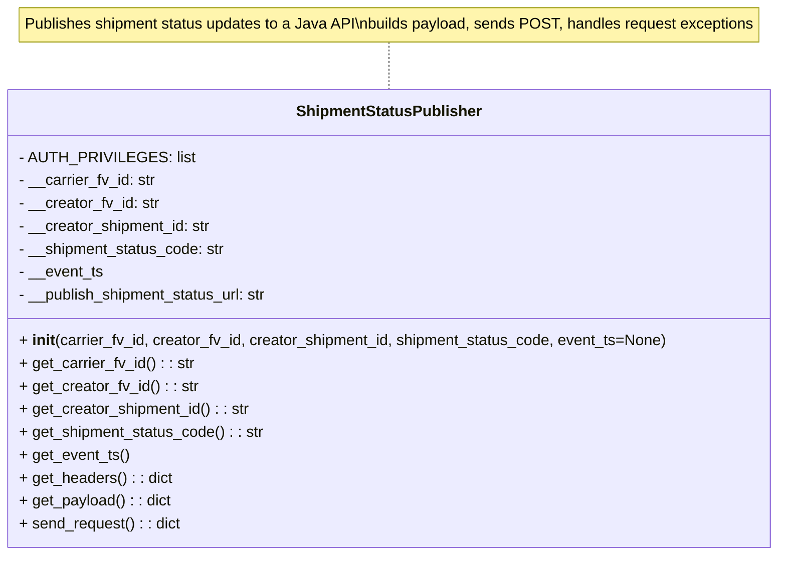
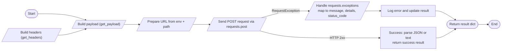

# Diagram: shipment_core/shipment_service/shipment_service/fvshared/shipment_status_publisher.py

> Auto-generated by Obscura crawlers

## Diagram 1

### SVG

<svg id="container" width="817.140625" xmlns="http://www.w3.org/2000/svg" class="classDiagram" height="582" viewBox="0 0 817.140625 582" role="graphics-document document" aria-roledescription="class"><g><defs><marker id="container_class-aggregationStart" class="marker aggregation class" refX="18" refY="7" markerWidth="190" markerHeight="240" orient="auto"><path d="M 18,7 L9,13 L1,7 L9,1 Z"></path></marker></defs><defs><marker id="container_class-aggregationEnd" class="marker aggregation class" refX="1" refY="7" markerWidth="20" markerHeight="28" orient="auto"><path d="M 18,7 L9,13 L1,7 L9,1 Z"></path></marker></defs><defs><marker id="container_class-extensionStart" class="marker extension class" refX="18" refY="7" markerWidth="190" markerHeight="240" orient="auto"><path d="M 1,7 L18,13 V 1 Z"></path></marker></defs><defs><marker id="container_class-extensionEnd" class="marker extension class" refX="1" refY="7" markerWidth="20" markerHeight="28" orient="auto"><path d="M 1,1 V 13 L18,7 Z"></path></marker></defs><defs><marker id="container_class-compositionStart" class="marker composition class" refX="18" refY="7" markerWidth="190" markerHeight="240" orient="auto"><path d="M 18,7 L9,13 L1,7 L9,1 Z"></path></marker></defs><defs><marker id="container_class-compositionEnd" class="marker composition class" refX="1" refY="7" markerWidth="20" markerHeight="28" orient="auto"><path d="M 18,7 L9,13 L1,7 L9,1 Z"></path></marker></defs><defs><marker id="container_class-dependencyStart" class="marker dependency class" refX="6" refY="7" markerWidth="190" markerHeight="240" orient="auto"><path d="M 5,7 L9,13 L1,7 L9,1 Z"></path></marker></defs><defs><marker id="container_class-dependencyEnd" class="marker dependency class" refX="13" refY="7" markerWidth="20" markerHeight="28" orient="auto"><path d="M 18,7 L9,13 L14,7 L9,1 Z"></path></marker></defs><defs><marker id="container_class-lollipopStart" class="marker lollipop class" refX="13" refY="7" markerWidth="190" markerHeight="240" orient="auto"><circle stroke="black" fill="transparent" cx="7" cy="7" r="6"></circle></marker></defs><defs><marker id="container_class-lollipopEnd" class="marker lollipop class" refX="1" refY="7" markerWidth="190" markerHeight="240" orient="auto"><circle stroke="black" fill="transparent" cx="7" cy="7" r="6"></circle></marker></defs><g class="root"><g class="clusters"></g><g class="edgePaths"><path d="M408.57,44L408.57,48.167C408.57,52.333,408.57,60.667,408.57,69C408.57,77.333,408.57,85.667,408.57,89.833L408.57,94" id="edgeNote1" class="edge-thickness-normal edge-pattern-dotted relation" style="fill: none;;;fill: none" data-edge="true" data-et="edge" data-id="edgeNote1" data-points="W3sieCI6NDA4LjU3MDMxMjUsInkiOjQ0fSx7IngiOjQwOC41NzAzMTI1LCJ5Ijo2OX0seyJ4Ijo0MDguNTcwMzEyNSwieSI6OTR9XQ=="></path></g><g class="edgeLabels"><g class="edgeLabel"><g class="label" data-id="edgeNote1" transform="translate(0, 0)"><foreignObject width="0" height="0">

</foreignObject></g></g></g><g class="nodes"><g class="node default" id="classId-ShipmentStatusPublisher-0" transform="translate(408.5703125, 334)"><g class="basic label-container"><path d="M-400.5703125 -240 L400.5703125 -240 L400.5703125 240 L-400.5703125 240" stroke="none" stroke-width="0" fill="#ECECFF" style=""></path><path d="M-400.5703125 -240 C-139.819166569576 -240, 120.931979360848 -240, 400.5703125 -240 M-400.5703125 -240 C-81.53673075657088 -240, 237.49685098685825 -240, 400.5703125 -240 M400.5703125 -240 C400.5703125 -54.77406837494701, 400.5703125 130.451863250106, 400.5703125 240 M400.5703125 -240 C400.5703125 -76.38874618739084, 400.5703125 87.22250762521833, 400.5703125 240 M400.5703125 240 C216.5462279127881 240, 32.522143325576224 240, -400.5703125 240 M400.5703125 240 C221.27829302727352 240, 41.98627355454704 240, -400.5703125 240 M-400.5703125 240 C-400.5703125 131.7129782858597, -400.5703125 23.425956571719382, -400.5703125 -240 M-400.5703125 240 C-400.5703125 89.58894764615096, -400.5703125 -60.82210470769809, -400.5703125 -240" stroke="#9370DB" stroke-width="1.3" fill="none" stroke-dasharray="0 0" style=""></path></g><g class="annotation-group text" transform="translate(0, -216)"></g><g class="label-group text" transform="translate(-93.265625, -216)"><g class="label" style="font-weight: bolder" transform="translate(0,-12)"><foreignObject width="186.53125" height="24">

ShipmentStatusPublisher

</foreignObject></g></g><g class="members-group text" transform="translate(-388.5703125, -168)"><g class="label" style="" transform="translate(0,-12)"><foreignObject width="169.15625" height="24">

- AUTH_PRIVILEGES: list

</foreignObject></g><g class="label" style="" transform="translate(0,12)"><foreignObject width="144.1875" height="24">

- __carrier_fv_id: str

</foreignObject></g><g class="label" style="" transform="translate(0,36)"><foreignObject width="147.890625" height="24">

- __creator_fv_id: str

</foreignObject></g><g class="label" style="" transform="translate(0,60)"><foreignObject width="203.90625" height="24">

- __creator_shipment_id: str

</foreignObject></g><g class="label" style="" transform="translate(0,84)"><foreignObject width="218.484375" height="24">

- __shipment_status_code: str

</foreignObject></g><g class="label" style="" transform="translate(0,108)"><foreignObject width="88.4375" height="24">

- __event_ts

</foreignObject></g><g class="label" style="" transform="translate(0,132)"><foreignObject width="266.546875" height="24">

- __publish_shipment_status_url: str

</foreignObject></g></g><g class="methods-group text" transform="translate(-388.5703125, 24)"><g class="label" style="" transform="translate(0,-12)"><foreignObject width="683.875" height="24">

+ <strong>init</strong>(carrier_fv_id, creator_fv_id, creator_shipment_id, shipment_status_code, event_ts=None)

</foreignObject></g><g class="label" style="" transform="translate(0,12)"><foreignObject width="182.8125" height="24">

+ get_carrier_fv_id() : : str

</foreignObject></g><g class="label" style="" transform="translate(0,36)"><foreignObject width="186.515625" height="24">

+ get_creator_fv_id() : : str

</foreignObject></g><g class="label" style="" transform="translate(0,60)"><foreignObject width="242.53125" height="24">

+ get_creator_shipment_id() : : str

</foreignObject></g><g class="label" style="" transform="translate(0,84)"><foreignObject width="257.109375" height="24">

+ get_shipment_status_code() : : str

</foreignObject></g><g class="label" style="" transform="translate(0,108)"><foreignObject width="114.75" height="24">

+ get_event_ts()

</foreignObject></g><g class="label" style="" transform="translate(0,132)"><foreignObject width="159.71875" height="24">

+ get_headers() : : dict

</foreignObject></g><g class="label" style="" transform="translate(0,156)"><foreignObject width="159.125" height="24">

+ get_payload() : : dict

</foreignObject></g><g class="label" style="" transform="translate(0,180)"><foreignObject width="169.21875" height="24">

+ send_request() : : dict

</foreignObject></g></g><g class="divider" style=""><path d="M-400.5703125 -192 C-190.46799948506964 -192, 19.63431352986072 -192, 400.5703125 -192 M-400.5703125 -192 C-121.88869337235627 -192, 156.79292575528746 -192, 400.5703125 -192" stroke="#9370DB" stroke-width="1.3" fill="none" stroke-dasharray="0 0" style=""></path></g><g class="divider" style=""><path d="M-400.5703125 0 C-131.02359708086908 0, 138.52311833826184 0, 400.5703125 0 M-400.5703125 0 C-84.50673010135438 0, 231.55685229729124 0, 400.5703125 0" stroke="#9370DB" stroke-width="1.3" fill="none" stroke-dasharray="0 0" style=""></path></g></g><g class="node undefined" id="note0" transform="translate(408.5703125, 26)"><g class="basic label-container"><path d="M-391.6015625 -18 L391.6015625 -18 L391.6015625 18 L-391.6015625 18" stroke="none" stroke-width="0" fill="#fff5ad" style="fill:#fff5ad !important;stroke:#aaaa33 !important"></path><path d="M-391.6015625 -18 C-105.00948336763184 -18, 181.5825957647363 -18, 391.6015625 -18 M-391.6015625 -18 C-121.96004562008613 -18, 147.68147125982773 -18, 391.6015625 -18 M391.6015625 -18 C391.6015625 -4.573192942110413, 391.6015625 8.853614115779173, 391.6015625 18 M391.6015625 -18 C391.6015625 -6.973481064646993, 391.6015625 4.053037870706014, 391.6015625 18 M391.6015625 18 C160.30014718023767 18, -71.00126813952465 18, -391.6015625 18 M391.6015625 18 C208.79997005266242 18, 25.998377605324833 18, -391.6015625 18 M-391.6015625 18 C-391.6015625 7.734223481013922, -391.6015625 -2.531553037972156, -391.6015625 -18 M-391.6015625 18 C-391.6015625 6.48477528455714, -391.6015625 -5.030449430885721, -391.6015625 -18" stroke="#aaaa33" stroke-width="1.3" fill="none" stroke-dasharray="0 0" style="fill:#fff5ad !important;stroke:#aaaa33 !important"></path></g><g class="label" style="text-align:left !important;white-space:nowrap !important" transform="translate(-385.6015625, -12)"><rect></rect><foreignObject width="771.203125" height="24">

Publishes shipment status updates to a Java API\nbuilds payload, sends POST, handles request exceptions

</foreignObject></g></g></g></g></g></svg>

## Diagram 2

### SVG

<svg id="container" width="2397.0224609375" xmlns="http://www.w3.org/2000/svg" class="flowchart" height="226.5" viewBox="0 0 2397.0224609375 226.5" role="graphics-document document" aria-roledescription="flowchart-v2"><g><marker id="container_flowchart-v2-pointEnd" class="marker flowchart-v2" viewBox="0 0 10 10" refX="5" refY="5" markerUnits="userSpaceOnUse" markerWidth="8" markerHeight="8" orient="auto"><path d="M 0 0 L 10 5 L 0 10 z" class="arrowMarkerPath" style="stroke-width: 1; stroke-dasharray: 1, 0;"></path></marker><marker id="container_flowchart-v2-pointStart" class="marker flowchart-v2" viewBox="0 0 10 10" refX="4.5" refY="5" markerUnits="userSpaceOnUse" markerWidth="8" markerHeight="8" orient="auto"><path d="M 0 5 L 10 10 L 10 0 z" class="arrowMarkerPath" style="stroke-width: 1; stroke-dasharray: 1, 0;"></path></marker><marker id="container_flowchart-v2-circleEnd" class="marker flowchart-v2" viewBox="0 0 10 10" refX="11" refY="5" markerUnits="userSpaceOnUse" markerWidth="11" markerHeight="11" orient="auto"><circle cx="5" cy="5" r="5" class="arrowMarkerPath" style="stroke-width: 1; stroke-dasharray: 1, 0;"></circle></marker><marker id="container_flowchart-v2-circleStart" class="marker flowchart-v2" viewBox="0 0 10 10" refX="-1" refY="5" markerUnits="userSpaceOnUse" markerWidth="11" markerHeight="11" orient="auto"><circle cx="5" cy="5" r="5" class="arrowMarkerPath" style="stroke-width: 1; stroke-dasharray: 1, 0;"></circle></marker><marker id="container_flowchart-v2-crossEnd" class="marker cross flowchart-v2" viewBox="0 0 11 11" refX="12" refY="5.2" markerUnits="userSpaceOnUse" markerWidth="11" markerHeight="11" orient="auto"><path d="M 1,1 l 9,9 M 10,1 l -9,9" class="arrowMarkerPath" style="stroke-width: 2; stroke-dasharray: 1, 0;"></path></marker><marker id="container_flowchart-v2-crossStart" class="marker cross flowchart-v2" viewBox="0 0 11 11" refX="-1" refY="5.2" markerUnits="userSpaceOnUse" markerWidth="11" markerHeight="11" orient="auto"><path d="M 1,1 l 9,9 M 10,1 l -9,9" class="arrowMarkerPath" style="stroke-width: 2; stroke-dasharray: 1, 0;"></path></marker><g class="root"><g class="clusters"></g><g class="edgePaths"><path d="M177.388,71.5L199.657,71.417C221.926,71.333,266.463,71.167,298.462,74.134C330.462,77.101,349.924,83.202,359.655,86.253L369.386,89.303" id="L_Start_BuildPayload_0" class="edge-thickness-normal edge-pattern-solid edge-thickness-normal edge-pattern-solid flowchart-link" style=";" data-edge="true" data-et="edge" data-id="L_Start_BuildPayload_0" data-points="W3sieCI6MTc3LjM4ODQxOTIzNDE5NTI1LCJ5Ijo3MS41fSx7IngiOjMxMSwieSI6NzF9LHsieCI6MzczLjIwMjk3MDI5NzAyOTcsInkiOjkwLjV9XQ==" marker-end="url(#container_flowchart-v2-pointEnd)"></path><path d="M270.75,172.5L277.458,172.417C284.167,172.333,297.583,172.167,314.02,169.19C330.456,166.213,349.913,160.427,359.641,157.534L369.369,154.64" id="L_BuildHeaders_BuildPayload_0" class="edge-thickness-normal edge-pattern-solid edge-thickness-normal edge-pattern-solid flowchart-link" style=";" data-edge="true" data-et="edge" data-id="L_BuildHeaders_BuildPayload_0" data-points="W3sieCI6MjcwLjc1LCJ5IjoxNzIuNX0seyJ4IjozMTEsInkiOjE3Mn0seyJ4IjozNzMuMjAyOTcwMjk3MDI5NywieSI6MTUzLjV9XQ==" marker-end="url(#container_flowchart-v2-pointEnd)"></path><path d="M598.75,122L605.458,121.917C612.167,121.833,625.583,121.667,638.5,121.659C651.417,121.651,663.834,121.801,670.042,121.876L676.25,121.952" id="L_BuildPayload_PrepareURL_0" class="edge-thickness-normal edge-pattern-solid edge-thickness-normal edge-pattern-solid flowchart-link" style=";" data-edge="true" data-et="edge" data-id="L_BuildPayload_PrepareURL_0" data-points="W3sieCI6NTk4Ljc1LCJ5IjoxMjJ9LHsieCI6NjM5LCJ5IjoxMjEuNX0seyJ4Ijo2ODAuMjUsInkiOjEyMn1d" marker-end="url(#container_flowchart-v2-pointEnd)"></path><path d="M926.75,122L933.458,121.917C940.167,121.833,953.583,121.667,966.5,121.659C979.417,121.651,991.834,121.801,998.042,121.876L1004.25,121.952" id="L_PrepareURL_SendRequest_0" class="edge-thickness-normal edge-pattern-solid edge-thickness-normal edge-pattern-solid flowchart-link" style=";" data-edge="true" data-et="edge" data-id="L_PrepareURL_SendRequest_0" data-points="W3sieCI6OTI2Ljc1LCJ5IjoxMjJ9LHsieCI6OTY3LCJ5IjoxMjEuNX0seyJ4IjoxMDA4LjI1LCJ5IjoxMjJ9XQ==" marker-end="url(#container_flowchart-v2-pointEnd)"></path><path d="M1240.89,149.721L1260.721,154.684C1280.551,159.647,1320.213,169.574,1382.19,174.537C1444.167,179.5,1528.458,179.5,1601.938,179.5C1675.417,179.5,1738.083,179.5,1772.917,179.5C1807.75,179.5,1814.75,179.5,1818.25,179.5L1821.75,179.5" id="L_SendRequest_Success_0" class="edge-thickness-normal edge-pattern-solid edge-thickness-normal edge-pattern-solid flowchart-link" style=";" data-edge="true" data-et="edge" data-id="L_SendRequest_Success_0" data-points="W3sieCI6MTI0MC44ODk2MDI1MjA2MDEsInkiOjE0OS43MjA3OTQ5NTg3OTc4NX0seyJ4IjoxMzU5Ljg3NSwieSI6MTc5LjV9LHsieCI6MTYxMi43NSwieSI6MTc5LjV9LHsieCI6MTgwMC43NSwieSI6MTc5LjV9LHsieCI6MTgyNS43NSwieSI6MTc5LjV9XQ==" marker-end="url(#container_flowchart-v2-pointEnd)"></path><path d="M1255.803,90.5L1273.148,86C1290.494,81.5,1325.184,72.5,1361.55,68.081C1397.917,63.661,1435.958,63.822,1454.979,63.903L1474,63.983" id="L_SendRequest_HandleError_0" class="edge-thickness-normal edge-pattern-solid edge-thickness-normal edge-pattern-solid flowchart-link" style=";" data-edge="true" data-et="edge" data-id="L_SendRequest_HandleError_0" data-points="W3sieCI6MTI1NS44MDI4MDE3MjQxMzgsInkiOjkwLjV9LHsieCI6MTM1OS44NzUsInkiOjYzLjV9LHsieCI6MTQ3OCwieSI6NjR9XQ==" marker-end="url(#container_flowchart-v2-pointEnd)"></path><path d="M1748.5,64L1757.208,63.917C1765.917,63.833,1783.333,63.667,1795.628,63.583C1807.922,63.5,1815.094,63.5,1818.68,63.5L1822.266,63.5" id="L_HandleError_LogError_0" class="edge-thickness-normal edge-pattern-solid edge-thickness-normal edge-pattern-solid flowchart-link" style=";" data-edge="true" data-et="edge" data-id="L_HandleError_LogError_0" data-points="W3sieCI6MTc0OC41LCJ5Ijo2NH0seyJ4IjoxODAwLjc1LCJ5Ijo2My41fSx7IngiOjE4MjYuMjY1NjI1LCJ5Ijo2My41fV0=" marker-end="url(#container_flowchart-v2-pointEnd)"></path><path d="M2085.234,63.5L2089.487,63.5C2093.74,63.5,2102.245,63.5,2117.133,69.666C2132.02,75.831,2153.291,88.163,2163.926,94.328L2174.561,100.494" id="L_LogError_ReturnResult_0" class="edge-thickness-normal edge-pattern-solid edge-thickness-normal edge-pattern-solid flowchart-link" style=";" data-edge="true" data-et="edge" data-id="L_LogError_ReturnResult_0" data-points="W3sieCI6MjA4NS4yMzQzNzUsInkiOjYzLjV9LHsieCI6MjExMC43NSwieSI6NjMuNX0seyJ4IjoyMTc4LjAyMTk3MzkwNTg5MiwieSI6MTAyLjV9XQ==" marker-end="url(#container_flowchart-v2-pointEnd)"></path><path d="M2085.75,179.5L2089.917,179.5C2094.083,179.5,2102.417,179.5,2117.215,173.495C2132.013,167.489,2153.276,155.478,2163.908,149.473L2174.539,143.467" id="L_Success_ReturnResult_0" class="edge-thickness-normal edge-pattern-solid edge-thickness-normal edge-pattern-solid flowchart-link" style=";" data-edge="true" data-et="edge" data-id="L_Success_ReturnResult_0" data-points="W3sieCI6MjA4NS43NSwieSI6MTc5LjV9LHsieCI6MjExMC43NSwieSI6MTc5LjV9LHsieCI6MjE3OC4wMjE5NzM5MDU4OTIsInkiOjE0MS41fV0=" marker-end="url(#container_flowchart-v2-pointEnd)"></path><path d="M2287.433,122L2291.516,121.917C2295.6,121.833,2303.766,121.667,2311.433,121.654C2319.1,121.641,2326.267,121.781,2329.85,121.851L2333.434,121.922" id="L_ReturnResult_End_0" class="edge-thickness-normal edge-pattern-solid edge-thickness-normal edge-pattern-solid flowchart-link" style=";" data-edge="true" data-et="edge" data-id="L_ReturnResult_End_0" data-points="W3sieCI6MjI4Ny40MzMwODc0MzE3OTMsInkiOjEyMn0seyJ4IjoyMzExLjkzMzA5MDIwOTk2MSwieSI6MTIxLjV9LHsieCI6MjMzNy40MzMwOTAyMDk5NDYsInkiOjEyMi4wMDAwMDAwMDAwMDAwMX1d" marker-end="url(#container_flowchart-v2-pointEnd)"></path></g><g class="edgeLabels"><g class="edgeLabel"><g class="label" data-id="L_Start_BuildPayload_0" transform="translate(0, 0)"><foreignObject width="0" height="0">

</foreignObject></g></g><g class="edgeLabel"><g class="label" data-id="L_BuildHeaders_BuildPayload_0" transform="translate(0, 0)"><foreignObject width="0" height="0">

</foreignObject></g></g><g class="edgeLabel"><g class="label" data-id="L_BuildPayload_PrepareURL_0" transform="translate(0, 0)"><foreignObject width="0" height="0">

</foreignObject></g></g><g class="edgeLabel"><g class="label" data-id="L_PrepareURL_SendRequest_0" transform="translate(0, 0)"><foreignObject width="0" height="0">

</foreignObject></g></g><g class="edgeLabel" transform="translate(1612.75, 179.5)"><g class="label" data-id="L_SendRequest_Success_0" transform="translate(-32.203125, -12)"><foreignObject width="64.40625" height="24">

HTTP 2xx

</foreignObject></g></g><g class="edgeLabel" transform="translate(1359.875, 63.5)"><g class="label" data-id="L_SendRequest_HandleError_0" transform="translate(-64.875, -12)"><foreignObject width="129.75" height="24">

RequestException

</foreignObject></g></g><g class="edgeLabel"><g class="label" data-id="L_HandleError_LogError_0" transform="translate(0, 0)"><foreignObject width="0" height="0">

</foreignObject></g></g><g class="edgeLabel"><g class="label" data-id="L_LogError_ReturnResult_0" transform="translate(0, 0)"><foreignObject width="0" height="0">

</foreignObject></g></g><g class="edgeLabel"><g class="label" data-id="L_Success_ReturnResult_0" transform="translate(0, 0)"><foreignObject width="0" height="0">

</foreignObject></g></g><g class="edgeLabel"><g class="label" data-id="L_ReturnResult_End_0" transform="translate(0, 0)"><foreignObject width="0" height="0">

</foreignObject></g></g></g><g class="nodes"><g class="node default" id="flowchart-Start-0" transform="translate(147, 71)"><g class="basic label-container outer-path"><path d="M-10.3984375 -19.5 C-4.9469274940838 -19.5, 0.5045825118323997 -19.5, 10.3984375 -19.5 C10.3984375 -19.5, 10.3984375 -19.5, 10.398437499999998 -19.5 C10.810550835505495 -19.486784327460285, 11.222664171010994 -19.47356865492057, 11.6478067896239 -19.45993515863156 C11.897366733233225 -19.435860411011312, 12.14692667684255 -19.411785663391065, 12.892042152847864 -19.3399052695533 C13.217057607299955 -19.287359291409977, 13.542073061752044 -19.23481331326666, 14.126030759676757 -19.140403561325776 C14.489678935868886 -19.057403238136043, 14.853327112061015 -18.97440291494631, 15.34470188623539 -18.862249829261074 C15.696402662080219 -18.757866885105376, 16.048103437925047 -18.653483940949673, 16.543047751460602 -18.50658706670804 C16.838571399007893 -18.397831632619983, 17.13409504655519 -18.289076198531927, 17.716144095147794 -18.074876768247425 C18.019600082374616 -17.940545804404138, 18.323056069601442 -17.806214840560855, 18.85917041279238 -17.568892924097174 C19.194687569607712 -17.393853838295612, 19.530204726423047 -17.218814752494048, 19.967429764076783 -16.990714730406097 C20.370816257975516 -16.746179467242516, 20.77420275187425 -16.50164420407894, 21.036368073605697 -16.342718045390892 C21.31290140924092 -16.149820361386926, 21.589434744876137 -15.956922677382957, 22.061592844578712 -15.627565626425154 C22.259028119859273 -15.470116248362235, 22.456463395139835 -15.312666870299314, 23.03889120850187 -14.848196188198123 C23.332099823953858 -14.581911881519474, 23.62530843940585 -14.315627574840825, 23.964247236767985 -14.007812326905688 C24.169008741830083 -13.79637926169686, 24.37377024689218 -13.58494619648803, 24.833858442968648 -13.10986736009568 C25.13286254665499 -12.758640126090222, 25.431866650341338 -12.407412892084764, 25.644151408126582 -12.158051136245305 C25.906686022065294 -11.806278670962788, 26.169220636004003 -11.454506205680271, 26.391796464640635 -11.156274872382312 C26.590902581796396 -10.850394408952456, 26.790008698952153 -10.544513945522601, 27.073721378604247 -10.108655082055241 C27.285524101557193 -9.732577900100914, 27.497326824510143 -9.356500718146584, 27.6871239742735 -9.019496659696287 C27.83378574204436 -8.714950360860973, 27.98044750981522 -8.410404062025659, 28.22948364880834 -7.893275190886684 C28.376886717251118 -7.5291867619885675, 28.5242897856939 -7.16509833309045, 28.698571729970325 -6.734618561215508 C28.793389072333035 -6.449043833110943, 28.88820641469575 -6.163469105006378, 29.09246063421488 -5.548287939305138 C29.169465278134517 -5.254635858015774, 29.246469922054153 -4.960983776726411, 29.40953178754556 -4.339158212148133 C29.46174820441744 -4.071037947454658, 29.513964621289315 -3.802917682761184, 29.648482276581777 -3.1121979531509023 C29.688513153722106 -2.8017263750413175, 29.728544030862434 -2.4912547969317327, 29.808330202509367 -1.872449005199798 C29.824592922851725 -1.619144008835956, 29.840855643194086 -1.3658390124721143, 29.888418715913414 -0.6250057626472757 C29.888418715913414 -0.15017533309841002, 29.888418715913414 0.32465509645045565, 29.888418715913414 0.625005762647271 C29.862238360929634 1.0327859239218526, 29.83605800594585 1.4405660851964344, 29.808330202509367 1.8724490051997846 C29.7542014654198 2.292260801138327, 29.700072728330234 2.7120725970768693, 29.648482276581777 3.1121979531508885 C29.564326785737663 3.5443186123661237, 29.48017129489355 3.9764392715813592, 29.40953178754556 4.339158212148129 C29.287532758433986 4.80439338486425, 29.165533729322412 5.269628557580371, 29.092460634214884 5.548287939305125 C28.96414173739393 5.934764011690091, 28.835822840572977 6.321240084075057, 28.69857172997033 6.734618561215495 C28.567311146339485 7.058834740534426, 28.43605056270864 7.383050919853357, 28.229483648808344 7.893275190886679 C28.05019669597095 8.265568384579783, 27.870909743133556 8.637861578272888, 27.687123974273504 9.019496659696284 C27.527828287431436 9.302342282121792, 27.36853260058937 9.5851879045473, 27.07372137860425 10.108655082055236 C26.923577671081137 10.33931613604143, 26.773433963558027 10.569977190027625, 26.39179646464064 11.156274872382301 C26.118151382501434 11.52293435286901, 25.844506300362223 11.889593833355718, 25.644151408126582 12.158051136245302 C25.4359247560658 12.402646010188052, 25.227698104005015 12.647240884130802, 24.83385844296866 13.10986736009567 C24.605051016904635 13.346129812945815, 24.376243590840613 13.582392265795962, 23.96424723676799 14.007812326905684 C23.695495508771355 14.251885535491162, 23.42674378077472 14.495958744076642, 23.038891208501887 14.848196188198111 C22.71567582500295 15.105951855415935, 22.392460441504014 15.363707522633758, 22.061592844578715 15.627565626425152 C21.827051030327368 15.791171842895395, 21.592509216076017 15.954778059365637, 21.036368073605708 16.34271804539089 C20.694152093220104 16.55017138378497, 20.3519361128345 16.75762472217905, 19.967429764076787 16.990714730406093 C19.678073650324922 17.141671629609004, 19.388717536573058 17.292628528811917, 18.859170412792388 17.56889292409717 C18.575697213428352 17.69437810052194, 18.292224014064317 17.81986327694671, 17.716144095147804 18.07487676824742 C17.285479344486387 18.233365377512136, 16.854814593824965 18.39185398677685, 16.543047751460616 18.506587066708033 C16.298835363640915 18.579068021515937, 16.054622975821214 18.651548976323845, 15.344701886235413 18.86224982926107 C14.954267064717648 18.951364029447184, 14.563832243199885 19.040478229633294, 14.126030759676766 19.140403561325773 C13.752979002514518 19.20071567636418, 13.37992724535227 19.26102779140259, 12.892042152847878 19.3399052695533 C12.633725079786117 19.364824806919835, 12.375408006724356 19.389744344286367, 11.6478067896239 19.45993515863156 C11.210162174564443 19.47396956961295, 10.772517559504989 19.48800398059434, 10.398437500000004 19.5 C10.398437500000002 19.5, 10.398437500000002 19.5, 10.3984375 19.5 C5.669830655005532 19.5, 0.9412238100110635 19.5, -10.398437499999996 19.5 C-10.77240986340633 19.488007434198607, -11.14638222681266 19.47601486839721, -11.647806789623893 19.45993515863156 C-12.142222530917762 19.412239466690863, -12.636638272211629 19.36454377475017, -12.892042152847871 19.3399052695533 C-13.3509121782032 19.265718722444042, -13.809782203558528 19.191532175334785, -14.126030759676759 19.140403561325773 C-14.53577055232821 19.046883127455107, -14.94551034497966 18.95336269358444, -15.344701886235388 18.862249829261074 C-15.727140684163238 18.748744001498306, -16.10957948209109 18.635238173735534, -16.54304775146059 18.506587066708043 C-16.891125554354126 18.378491217647284, -17.239203357247664 18.250395368586524, -17.716144095147797 18.074876768247425 C-18.07933687303214 17.91410209920899, -18.442529650916484 17.753327430170554, -18.85917041279238 17.568892924097174 C-19.24911227680807 17.365460503409874, -19.63905414082376 17.16202808272257, -19.96742976407678 16.990714730406097 C-20.374940273118444 16.743679465027473, -20.782450782160105 16.496644199648845, -21.036368073605686 16.3427180453909 C-21.343204030244454 16.12868256475418, -21.650039986883222 15.914647084117458, -22.061592844578712 15.627565626425156 C-22.4078390492704 15.351443492182003, -22.75408525396209 15.07532135793885, -23.03889120850187 14.848196188198125 C-23.36903344420968 14.548369744813181, -23.699175679917488 14.248543301428237, -23.964247236767974 14.007812326905697 C-24.252216857435492 13.710460050820934, -24.54018647810301 13.413107774736172, -24.833858442968655 13.109867360095677 C-25.015995188675202 12.89591917471434, -25.19813193438175 12.681970989333003, -25.64415140812658 12.158051136245307 C-25.932319299296292 11.771932414712843, -26.22048719046601 11.38581369318038, -26.391796464640635 11.156274872382316 C-26.556852325173473 10.902704746899417, -26.721908185706315 10.649134621416518, -27.073721378604244 10.108655082055249 C-27.234652371977475 9.822905807290917, -27.395583365350706 9.537156532526588, -27.6871239742735 9.019496659696289 C-27.85855092452116 8.663524929557878, -28.029977874768825 8.307553199419466, -28.22948364880834 7.893275190886686 C-28.33874282938446 7.623402902481114, -28.448002009960582 7.353530614075543, -28.698571729970325 6.73461856121551 C-28.786884736751496 6.468633855557404, -28.875197743532667 6.202649149899298, -29.09246063421488 5.5482879393051325 C-29.177166836670494 5.225266477441508, -29.261873039126105 4.902245015577884, -29.409531787545557 4.339158212148136 C-29.496247523150025 3.893891237196405, -29.582963258754496 3.4486242622446746, -29.648482276581777 3.112197953150904 C-29.700402436471478 2.7095154458416264, -29.75232259636118 2.3068329385323487, -29.808330202509364 1.872449005199809 C-29.840189590181847 1.3762133257660167, -29.87204897785433 0.8799776463322243, -29.888418715913414 0.6250057626472781 C-29.888418715913414 0.30999752779530215, -29.888418715913414 -0.005010707056673835, -29.888418715913414 -0.6250057626472687 C-29.860789771634327 -1.055348871476491, -29.833160827355236 -1.4856919803057131, -29.808330202509367 -1.8724490051997822 C-29.75301571805862 -2.3014572235193342, -29.697701233607873 -2.730465441838886, -29.648482276581777 -3.112197953150895 C-29.584007164230123 -3.443264028256815, -29.51953205187847 -3.7743301033627352, -29.40953178754556 -4.339158212148126 C-29.33229516749098 -4.633694918979124, -29.2550585474364 -4.928231625810121, -29.092460634214884 -5.548287939305123 C-29.00915937516157 -5.7991780593204805, -28.92585811610826 -6.050068179335838, -28.698571729970332 -6.734618561215485 C-28.57522269859442 -7.039293053505273, -28.45187366721851 -7.343967545795061, -28.229483648808344 -7.893275190886676 C-28.093639044177788 -8.17535941901094, -27.95779443954723 -8.457443647135202, -27.687123974273504 -9.019496659696282 C-27.481903894149987 -9.38388569274209, -27.27668381402647 -9.748274725787901, -27.073721378604247 -10.108655082055243 C-26.876759152020963 -10.41124195385055, -26.67979692543768 -10.713828825645857, -26.39179646464064 -11.156274872382308 C-26.16470975404875 -11.460550376550517, -25.937623043456856 -11.764825880718725, -25.644151408126586 -12.158051136245302 C-25.425915182757365 -12.414403824556999, -25.207678957388143 -12.670756512868694, -24.833858442968662 -13.10986736009567 C-24.506862142145348 -13.447517887591323, -24.179865841322034 -13.785168415086973, -23.964247236767996 -14.007812326905677 C-23.615108020045607 -14.324891325815488, -23.265968803323215 -14.6419703247253, -23.038891208501887 -14.848196188198107 C-22.66843803207066 -15.143622738228968, -22.297984855639438 -15.439049288259831, -22.06159284457872 -15.627565626425149 C-21.65455186914035 -15.911499790371122, -21.24751089370198 -16.195433954317096, -21.03636807360571 -16.342718045390885 C-20.821271311701533 -16.473110966506077, -20.606174549797355 -16.60350388762127, -19.96742976407679 -16.99071473040609 C-19.577017501971113 -17.194392557475634, -19.186605239865436 -17.39807038454518, -18.859170412792388 -17.56889292409717 C-18.577474492667797 -17.693591351723754, -18.295778572543206 -17.818289779350337, -17.716144095147804 -18.07487676824742 C-17.395710819648933 -18.192799175683735, -17.075277544150058 -18.31072158312005, -16.54304775146062 -18.506587066708033 C-16.23045485603763 -18.599362997235986, -15.917861960614633 -18.69213892776394, -15.344701886235413 -18.862249829261067 C-14.994331058083782 -18.94221968440335, -14.643960229932151 -19.022189539545632, -14.126030759676768 -19.140403561325773 C-13.701478274772958 -19.209041914631328, -13.276925789869146 -19.277680267936883, -12.89204215284788 -19.3399052695533 C-12.479876293701949 -19.379666414283136, -12.067710434556018 -19.419427559012977, -11.647806789623903 -19.45993515863156 C-11.333646803823505 -19.47000965790086, -11.019486818023108 -19.480084157170165, -10.398437500000005 -19.5 C-10.398437500000004 -19.5, -10.398437500000004 -19.5, -10.3984375 -19.5" stroke="none" stroke-width="0" fill="#ECECFF" style=""></path><path d="M-10.3984375 -19.5 C-2.325122520294295 -19.5, 5.74819245941141 -19.5, 10.3984375 -19.5 M-10.3984375 -19.5 C-5.99564382017795 -19.5, -1.5928501403558997 -19.5, 10.3984375 -19.5 M10.3984375 -19.5 C10.3984375 -19.5, 10.398437499999998 -19.5, 10.398437499999998 -19.5 M10.3984375 -19.5 C10.3984375 -19.5, 10.3984375 -19.5, 10.398437499999998 -19.5 M10.398437499999998 -19.5 C10.773058851231859 -19.48798662242222, 11.14768020246372 -19.47597324484444, 11.6478067896239 -19.45993515863156 M10.398437499999998 -19.5 C10.859501316639038 -19.485214580806662, 11.320565133278079 -19.470429161613325, 11.6478067896239 -19.45993515863156 M11.6478067896239 -19.45993515863156 C12.112930260883537 -19.41506525675196, 12.578053732143175 -19.370195354872354, 12.892042152847864 -19.3399052695533 M11.6478067896239 -19.45993515863156 C11.97709914531656 -19.428168721109888, 12.30639150100922 -19.396402283588216, 12.892042152847864 -19.3399052695533 M12.892042152847864 -19.3399052695533 C13.237504815537065 -19.28405354535267, 13.582967478226264 -19.228201821152044, 14.126030759676757 -19.140403561325776 M12.892042152847864 -19.3399052695533 C13.373332139144875 -19.262094037028387, 13.854622125441887 -19.184282804503475, 14.126030759676757 -19.140403561325776 M14.126030759676757 -19.140403561325776 C14.523786545829704 -19.04961839873544, 14.921542331982653 -18.958833236145107, 15.34470188623539 -18.862249829261074 M14.126030759676757 -19.140403561325776 C14.574804917985793 -19.037973788216807, 15.023579076294828 -18.935544015107837, 15.34470188623539 -18.862249829261074 M15.34470188623539 -18.862249829261074 C15.669136090997263 -18.765959460277642, 15.993570295759138 -18.66966909129421, 16.543047751460602 -18.50658706670804 M15.34470188623539 -18.862249829261074 C15.639948473885838 -18.774622191827387, 15.935195061536287 -18.686994554393696, 16.543047751460602 -18.50658706670804 M16.543047751460602 -18.50658706670804 C16.97754564994987 -18.346687823609443, 17.41204354843914 -18.186788580510846, 17.716144095147794 -18.074876768247425 M16.543047751460602 -18.50658706670804 C16.79357360442279 -18.414391236982357, 17.044099457384977 -18.32219540725667, 17.716144095147794 -18.074876768247425 M17.716144095147794 -18.074876768247425 C18.019898219096092 -17.940413828121454, 18.32365234304439 -17.805950887995486, 18.85917041279238 -17.568892924097174 M17.716144095147794 -18.074876768247425 C17.995308807887938 -17.951298831044337, 18.274473520628085 -17.82772089384125, 18.85917041279238 -17.568892924097174 M18.85917041279238 -17.568892924097174 C19.133061732136536 -17.426003998231092, 19.40695305148069 -17.28311507236501, 19.967429764076783 -16.990714730406097 M18.85917041279238 -17.568892924097174 C19.268663247117985 -17.355260774722186, 19.67815608144359 -17.141628625347195, 19.967429764076783 -16.990714730406097 M19.967429764076783 -16.990714730406097 C20.32339197615242 -16.774928345579692, 20.679354188228057 -16.55914196075329, 21.036368073605697 -16.342718045390892 M19.967429764076783 -16.990714730406097 C20.337254706085194 -16.766524677228002, 20.707079648093604 -16.542334624049907, 21.036368073605697 -16.342718045390892 M21.036368073605697 -16.342718045390892 C21.288826895341153 -16.16661370011449, 21.54128571707661 -15.990509354838087, 22.061592844578712 -15.627565626425154 M21.036368073605697 -16.342718045390892 C21.32878961891391 -16.138737434108556, 21.62121116422212 -15.934756822826223, 22.061592844578712 -15.627565626425154 M22.061592844578712 -15.627565626425154 C22.298455980146638 -15.438673579002486, 22.535319115714564 -15.249781531579819, 23.03889120850187 -14.848196188198123 M22.061592844578712 -15.627565626425154 C22.388021631552995 -15.367247355448, 22.714450418527274 -15.106929084470847, 23.03889120850187 -14.848196188198123 M23.03889120850187 -14.848196188198123 C23.231483448021567 -14.673289011977756, 23.424075687541265 -14.498381835757389, 23.964247236767985 -14.007812326905688 M23.03889120850187 -14.848196188198123 C23.274422008313554 -14.634293347612623, 23.509952808125238 -14.420390507027124, 23.964247236767985 -14.007812326905688 M23.964247236767985 -14.007812326905688 C24.20732929205185 -13.756810147417202, 24.450411347335713 -13.505807967928718, 24.833858442968648 -13.10986736009568 M23.964247236767985 -14.007812326905688 C24.24501171652113 -13.717899950368084, 24.525776196274276 -13.42798757383048, 24.833858442968648 -13.10986736009568 M24.833858442968648 -13.10986736009568 C25.039525484563704 -12.868279150251935, 25.245192526158764 -12.62669094040819, 25.644151408126582 -12.158051136245305 M24.833858442968648 -13.10986736009568 C25.016756371420914 -12.895025046148696, 25.199654299873185 -12.680182732201711, 25.644151408126582 -12.158051136245305 M25.644151408126582 -12.158051136245305 C25.93085792601111 -11.773890521781142, 26.21756444389564 -11.38972990731698, 26.391796464640635 -11.156274872382312 M25.644151408126582 -12.158051136245305 C25.813141943997135 -11.931619213533294, 25.982132479867687 -11.705187290821282, 26.391796464640635 -11.156274872382312 M26.391796464640635 -11.156274872382312 C26.567753902588144 -10.88595699650706, 26.74371134053565 -10.61563912063181, 27.073721378604247 -10.108655082055241 M26.391796464640635 -11.156274872382312 C26.59452651171886 -10.844827079430107, 26.797256558797088 -10.533379286477903, 27.073721378604247 -10.108655082055241 M27.073721378604247 -10.108655082055241 C27.2885412794593 -9.727220595213337, 27.503361180314347 -9.345786108371435, 27.6871239742735 -9.019496659696287 M27.073721378604247 -10.108655082055241 C27.30136515341795 -9.7044505084417, 27.52900892823165 -9.300245934828162, 27.6871239742735 -9.019496659696287 M27.6871239742735 -9.019496659696287 C27.885332400666993 -8.607912621309264, 28.08354082706049 -8.196328582922241, 28.22948364880834 -7.893275190886684 M27.6871239742735 -9.019496659696287 C27.82622844199801 -8.730643256107543, 27.965332909722513 -8.4417898525188, 28.22948364880834 -7.893275190886684 M28.22948364880834 -7.893275190886684 C28.331725910439403 -7.640734827938308, 28.433968172070465 -7.388194464989931, 28.698571729970325 -6.734618561215508 M28.22948364880834 -7.893275190886684 C28.407419618044223 -7.4537699067161185, 28.58535558728011 -7.014264622545554, 28.698571729970325 -6.734618561215508 M28.698571729970325 -6.734618561215508 C28.846056550158895 -6.290417781322473, 28.993541370347465 -5.846217001429438, 29.09246063421488 -5.548287939305138 M28.698571729970325 -6.734618561215508 C28.78614960690577 -6.470847949525696, 28.873727483841215 -6.207077337835884, 29.09246063421488 -5.548287939305138 M29.09246063421488 -5.548287939305138 C29.20770025709233 -5.108829312104935, 29.322939879969777 -4.669370684904733, 29.40953178754556 -4.339158212148133 M29.09246063421488 -5.548287939305138 C29.21514889008281 -5.080424446254273, 29.33783714595074 -4.612560953203409, 29.40953178754556 -4.339158212148133 M29.40953178754556 -4.339158212148133 C29.471854627789433 -4.019143599432789, 29.53417746803331 -3.6991289867174446, 29.648482276581777 -3.1121979531509023 M29.40953178754556 -4.339158212148133 C29.458887987552608 -4.08572455654852, 29.50824418755965 -3.8322909009489066, 29.648482276581777 -3.1121979531509023 M29.648482276581777 -3.1121979531509023 C29.71097479922014 -2.6275182881121832, 29.773467321858497 -2.1428386230734637, 29.808330202509367 -1.872449005199798 M29.648482276581777 -3.1121979531509023 C29.7070855899514 -2.657682227189278, 29.765688903321024 -2.2031665012276536, 29.808330202509367 -1.872449005199798 M29.808330202509367 -1.872449005199798 C29.82929291151961 -1.5459378915711421, 29.850255620529847 -1.219426777942486, 29.888418715913414 -0.6250057626472757 M29.808330202509367 -1.872449005199798 C29.83031426350792 -1.530029509932711, 29.85229832450647 -1.1876100146656239, 29.888418715913414 -0.6250057626472757 M29.888418715913414 -0.6250057626472757 C29.888418715913414 -0.3296379029606513, 29.888418715913414 -0.03427004327402694, 29.888418715913414 0.625005762647271 M29.888418715913414 -0.6250057626472757 C29.888418715913414 -0.37069575329661797, 29.888418715913414 -0.11638574394596024, 29.888418715913414 0.625005762647271 M29.888418715913414 0.625005762647271 C29.85721704265157 1.1109970092378607, 29.826015369389726 1.5969882558284503, 29.808330202509367 1.8724490051997846 M29.888418715913414 0.625005762647271 C29.872354875437914 0.875213044551819, 29.856291034962418 1.125420326456367, 29.808330202509367 1.8724490051997846 M29.808330202509367 1.8724490051997846 C29.775247680170626 2.1290305155761047, 29.742165157831884 2.385612025952425, 29.648482276581777 3.1121979531508885 M29.808330202509367 1.8724490051997846 C29.75631638222423 2.275857924040735, 29.70430256193909 2.6792668428816846, 29.648482276581777 3.1121979531508885 M29.648482276581777 3.1121979531508885 C29.599105556675003 3.365736974098736, 29.549728836768224 3.619275995046583, 29.40953178754556 4.339158212148129 M29.648482276581777 3.1121979531508885 C29.57058373574007 3.5121904965106343, 29.492685194898357 3.9121830398703796, 29.40953178754556 4.339158212148129 M29.40953178754556 4.339158212148129 C29.34057670547738 4.6021138253957234, 29.271621623409196 4.865069438643318, 29.092460634214884 5.548287939305125 M29.40953178754556 4.339158212148129 C29.329096559594223 4.645892597174889, 29.248661331642886 4.952626982201649, 29.092460634214884 5.548287939305125 M29.092460634214884 5.548287939305125 C28.968323697722735 5.922168613484629, 28.844186761230585 6.296049287664134, 28.69857172997033 6.734618561215495 M29.092460634214884 5.548287939305125 C28.955229789130048 5.961605379934782, 28.81799894404521 6.374922820564438, 28.69857172997033 6.734618561215495 M28.69857172997033 6.734618561215495 C28.53296817765399 7.143662537163722, 28.367364625337654 7.55270651311195, 28.229483648808344 7.893275190886679 M28.69857172997033 6.734618561215495 C28.592057076571542 6.997711814431223, 28.48554242317276 7.2608050676469515, 28.229483648808344 7.893275190886679 M28.229483648808344 7.893275190886679 C28.09811054030187 8.166074261634588, 27.966737431795398 8.438873332382498, 27.687123974273504 9.019496659696284 M28.229483648808344 7.893275190886679 C28.104135885919966 8.153562502536875, 27.978788123031585 8.41384981418707, 27.687123974273504 9.019496659696284 M27.687123974273504 9.019496659696284 C27.499105438390973 9.353342609096986, 27.311086902508443 9.687188558497688, 27.07372137860425 10.108655082055236 M27.687123974273504 9.019496659696284 C27.524544634308253 9.308172740747937, 27.361965294343005 9.59684882179959, 27.07372137860425 10.108655082055236 M27.07372137860425 10.108655082055236 C26.829912585531613 10.483210860042668, 26.586103792458974 10.857766638030098, 26.39179646464064 11.156274872382301 M27.07372137860425 10.108655082055236 C26.937250357179966 10.318311218563338, 26.80077933575568 10.52796735507144, 26.39179646464064 11.156274872382301 M26.39179646464064 11.156274872382301 C26.234331575888415 11.36726347796381, 26.07686668713619 11.578252083545317, 25.644151408126582 12.158051136245302 M26.39179646464064 11.156274872382301 C26.094382698162292 11.55478222451177, 25.796968931683942 11.95328957664124, 25.644151408126582 12.158051136245302 M25.644151408126582 12.158051136245302 C25.359664237575686 12.49222595455297, 25.07517706702479 12.826400772860637, 24.83385844296866 13.10986736009567 M25.644151408126582 12.158051136245302 C25.438086409341278 12.40010680924912, 25.232021410555973 12.642162482252937, 24.83385844296866 13.10986736009567 M24.83385844296866 13.10986736009567 C24.62531368780193 13.325206941648139, 24.416768932635204 13.540546523200607, 23.96424723676799 14.007812326905684 M24.83385844296866 13.10986736009567 C24.552566260737347 13.40032463276716, 24.271274078506032 13.690781905438653, 23.96424723676799 14.007812326905684 M23.96424723676799 14.007812326905684 C23.624481165764536 14.316378882873403, 23.284715094761083 14.624945438841122, 23.038891208501887 14.848196188198111 M23.96424723676799 14.007812326905684 C23.66274009966825 14.28163313137797, 23.361232962568515 14.555453935850256, 23.038891208501887 14.848196188198111 M23.038891208501887 14.848196188198111 C22.783955983917075 15.051500245693257, 22.529020759332266 15.254804303188404, 22.061592844578715 15.627565626425152 M23.038891208501887 14.848196188198111 C22.657032279342907 15.152718522509529, 22.275173350183923 15.457240856820949, 22.061592844578715 15.627565626425152 M22.061592844578715 15.627565626425152 C21.757740466661385 15.83951989170284, 21.453888088744055 16.05147415698053, 21.036368073605708 16.34271804539089 M22.061592844578715 15.627565626425152 C21.751885189214658 15.843604279778804, 21.442177533850597 16.059642933132455, 21.036368073605708 16.34271804539089 M21.036368073605708 16.34271804539089 C20.709120077069798 16.541097704013648, 20.38187208053389 16.739477362636407, 19.967429764076787 16.990714730406093 M21.036368073605708 16.34271804539089 C20.623420305342712 16.593049409262367, 20.210472537079717 16.84338077313385, 19.967429764076787 16.990714730406093 M19.967429764076787 16.990714730406093 C19.667784032343075 17.14703971671932, 19.368138300609363 17.303364703032546, 18.859170412792388 17.56889292409717 M19.967429764076787 16.990714730406093 C19.701349744134617 17.129528506377536, 19.435269724192448 17.26834228234898, 18.859170412792388 17.56889292409717 M18.859170412792388 17.56889292409717 C18.407507835408563 17.768830549010666, 17.955845258024738 17.968768173924165, 17.716144095147804 18.07487676824742 M18.859170412792388 17.56889292409717 C18.536102920418188 17.711905319514567, 18.213035428043984 17.854917714931968, 17.716144095147804 18.07487676824742 M17.716144095147804 18.07487676824742 C17.46913304333102 18.16577911866113, 17.222121991514236 18.256681469074838, 16.543047751460616 18.506587066708033 M17.716144095147804 18.07487676824742 C17.34325632848039 18.212102913317757, 16.97036856181298 18.349329058388093, 16.543047751460616 18.506587066708033 M16.543047751460616 18.506587066708033 C16.116681926850607 18.633130205412403, 15.690316102240594 18.75967334411677, 15.344701886235413 18.86224982926107 M16.543047751460616 18.506587066708033 C16.126591411032383 18.630189122523195, 15.710135070604148 18.753791178338357, 15.344701886235413 18.86224982926107 M15.344701886235413 18.86224982926107 C14.907301930813784 18.9620835147846, 14.469901975392155 19.061917200308127, 14.126030759676766 19.140403561325773 M15.344701886235413 18.86224982926107 C14.93962099964136 18.954706898226338, 14.534540113047306 19.047163967191608, 14.126030759676766 19.140403561325773 M14.126030759676766 19.140403561325773 C13.87078612380291 19.181669534602143, 13.615541487929054 19.222935507878514, 12.892042152847878 19.3399052695533 M14.126030759676766 19.140403561325773 C13.766704059800018 19.19849671554167, 13.40737735992327 19.256589869757565, 12.892042152847878 19.3399052695533 M12.892042152847878 19.3399052695533 C12.397518738826834 19.38761134855249, 11.902995324805788 19.435317427551677, 11.6478067896239 19.45993515863156 M12.892042152847878 19.3399052695533 C12.488608951512376 19.378823985286722, 12.085175750176873 19.417742701020146, 11.6478067896239 19.45993515863156 M11.6478067896239 19.45993515863156 C11.160053062652436 19.4755764713005, 10.672299335680972 19.491217783969436, 10.398437500000004 19.5 M11.6478067896239 19.45993515863156 C11.31193840170018 19.470705804104114, 10.97607001377646 19.48147644957667, 10.398437500000004 19.5 M10.398437500000004 19.5 C10.398437500000002 19.5, 10.398437500000002 19.5, 10.3984375 19.5 M10.398437500000004 19.5 C10.398437500000002 19.5, 10.398437500000002 19.5, 10.3984375 19.5 M10.3984375 19.5 C2.465940762796474 19.5, -5.466555974407052 19.5, -10.398437499999996 19.5 M10.3984375 19.5 C6.122546073816211 19.5, 1.8466546476324215 19.5, -10.398437499999996 19.5 M-10.398437499999996 19.5 C-10.701879205675635 19.49026921511243, -11.005320911351271 19.480538430224865, -11.647806789623893 19.45993515863156 M-10.398437499999996 19.5 C-10.849340086231058 19.48554043168821, -11.300242672462119 19.47108086337642, -11.647806789623893 19.45993515863156 M-11.647806789623893 19.45993515863156 C-11.949132995373521 19.430866581960675, -12.25045920112315 19.40179800528979, -12.892042152847871 19.3399052695533 M-11.647806789623893 19.45993515863156 C-12.068495555448749 19.4193518193447, -12.489184321273607 19.37876848005784, -12.892042152847871 19.3399052695533 M-12.892042152847871 19.3399052695533 C-13.36196942311494 19.26393107283693, -13.83189669338201 19.187956876120555, -14.126030759676759 19.140403561325773 M-12.892042152847871 19.3399052695533 C-13.178567111654274 19.29358213624772, -13.465092070460678 19.247259002942144, -14.126030759676759 19.140403561325773 M-14.126030759676759 19.140403561325773 C-14.440434852665472 19.068642878779546, -14.754838945654186 18.99688219623332, -15.344701886235388 18.862249829261074 M-14.126030759676759 19.140403561325773 C-14.597995698736943 19.03268064384434, -15.069960637797125 18.92495772636291, -15.344701886235388 18.862249829261074 M-15.344701886235388 18.862249829261074 C-15.600447157698758 18.78634597512507, -15.856192429162126 18.710442120989068, -16.54304775146059 18.506587066708043 M-15.344701886235388 18.862249829261074 C-15.74954772394835 18.742093709707035, -16.154393561661312 18.621937590152996, -16.54304775146059 18.506587066708043 M-16.54304775146059 18.506587066708043 C-17.00274519128179 18.337414159457293, -17.462442631102984 18.168241252206542, -17.716144095147797 18.074876768247425 M-16.54304775146059 18.506587066708043 C-16.879678306369748 18.382703910722736, -17.216308861278904 18.258820754737428, -17.716144095147797 18.074876768247425 M-17.716144095147797 18.074876768247425 C-18.15054431817425 17.88258067553839, -18.584944541200706 17.69028458282935, -18.85917041279238 17.568892924097174 M-17.716144095147797 18.074876768247425 C-18.10023782867865 17.9048498661491, -18.484331562209505 17.734822964050778, -18.85917041279238 17.568892924097174 M-18.85917041279238 17.568892924097174 C-19.14960741926217 17.417372123855664, -19.440044425731962 17.265851323614157, -19.96742976407678 16.990714730406097 M-18.85917041279238 17.568892924097174 C-19.201360937194377 17.390372346700143, -19.543551461596373 17.211851769303117, -19.96742976407678 16.990714730406097 M-19.96742976407678 16.990714730406097 C-20.33973920911553 16.765018556890453, -20.712048654154273 16.539322383374806, -21.036368073605686 16.3427180453909 M-19.96742976407678 16.990714730406097 C-20.262082259649052 16.81209465601992, -20.556734755221324 16.63347458163374, -21.036368073605686 16.3427180453909 M-21.036368073605686 16.3427180453909 C-21.25159767069119 16.192583195603145, -21.466827267776694 16.04244834581539, -22.061592844578712 15.627565626425156 M-21.036368073605686 16.3427180453909 C-21.323757953223517 16.14224730627688, -21.611147832841347 15.941776567162858, -22.061592844578712 15.627565626425156 M-22.061592844578712 15.627565626425156 C-22.311119819246098 15.428574504319581, -22.560646793913488 15.229583382214004, -23.03889120850187 14.848196188198125 M-22.061592844578712 15.627565626425156 C-22.288537259918225 15.446583494436418, -22.51548167525774 15.26560136244768, -23.03889120850187 14.848196188198125 M-23.03889120850187 14.848196188198125 C-23.229850851167438 14.674771693244532, -23.420810493833006 14.501347198290938, -23.964247236767974 14.007812326905697 M-23.03889120850187 14.848196188198125 C-23.3909482855565 14.528467265736925, -23.743005362611132 14.208738343275726, -23.964247236767974 14.007812326905697 M-23.964247236767974 14.007812326905697 C-24.197894441273224 13.766552405461788, -24.43154164577847 13.52529248401788, -24.833858442968655 13.109867360095677 M-23.964247236767974 14.007812326905697 C-24.220516792151294 13.743192970850632, -24.47678634753461 13.478573614795566, -24.833858442968655 13.109867360095677 M-24.833858442968655 13.109867360095677 C-25.14676006175714 12.742315314060232, -25.459661680545622 12.374763268024786, -25.64415140812658 12.158051136245307 M-24.833858442968655 13.109867360095677 C-25.031921368579724 12.877211377573179, -25.229984294190793 12.644555395050682, -25.64415140812658 12.158051136245307 M-25.64415140812658 12.158051136245307 C-25.84282833288813 11.891842156905026, -26.04150525764968 11.625633177564746, -26.391796464640635 11.156274872382316 M-25.64415140812658 12.158051136245307 C-25.880454462284963 11.84142657132417, -26.11675751644335 11.524802006403036, -26.391796464640635 11.156274872382316 M-26.391796464640635 11.156274872382316 C-26.59147676906984 10.849512303109579, -26.79115707349904 10.54274973383684, -27.073721378604244 10.108655082055249 M-26.391796464640635 11.156274872382316 C-26.598720312846947 10.838384274704085, -26.80564416105326 10.520493677025856, -27.073721378604244 10.108655082055249 M-27.073721378604244 10.108655082055249 C-27.232109166312892 9.827421526475883, -27.39049695402154 9.546187970896517, -27.6871239742735 9.019496659696289 M-27.073721378604244 10.108655082055249 C-27.294646706633262 9.716379791024423, -27.51557203466228 9.324104499993597, -27.6871239742735 9.019496659696289 M-27.6871239742735 9.019496659696289 C-27.845820563045095 8.689959797549031, -28.004517151816692 8.360422935401772, -28.22948364880834 7.893275190886686 M-27.6871239742735 9.019496659696289 C-27.900869738493686 8.575649006866369, -28.11461550271387 8.13180135403645, -28.22948364880834 7.893275190886686 M-28.22948364880834 7.893275190886686 C-28.334926082286717 7.632830341604326, -28.440368515765098 7.372385492321967, -28.698571729970325 6.73461856121551 M-28.22948364880834 7.893275190886686 C-28.398763778099458 7.475149998728976, -28.568043907390575 7.057024806571265, -28.698571729970325 6.73461856121551 M-28.698571729970325 6.73461856121551 C-28.782713606736184 6.481196634584206, -28.866855483502043 6.227774707952903, -29.09246063421488 5.5482879393051325 M-28.698571729970325 6.73461856121551 C-28.84025958170452 6.307877326685563, -28.98194743343871 5.881136092155615, -29.09246063421488 5.5482879393051325 M-29.09246063421488 5.5482879393051325 C-29.200919001097287 5.134689180228967, -29.309377367979693 4.7210904211528, -29.409531787545557 4.339158212148136 M-29.09246063421488 5.5482879393051325 C-29.18492814828398 5.195669232485551, -29.27739566235308 4.84305052566597, -29.409531787545557 4.339158212148136 M-29.409531787545557 4.339158212148136 C-29.470681142652072 4.025169197596965, -29.531830497758587 3.7111801830457933, -29.648482276581777 3.112197953150904 M-29.409531787545557 4.339158212148136 C-29.503101598639912 3.85869700816521, -29.596671409734267 3.378235804182284, -29.648482276581777 3.112197953150904 M-29.648482276581777 3.112197953150904 C-29.6908177281537 2.7838525508395606, -29.733153179725626 2.4555071485282176, -29.808330202509364 1.872449005199809 M-29.648482276581777 3.112197953150904 C-29.68912267437818 2.7969990531962865, -29.72976307217458 2.481800153241669, -29.808330202509364 1.872449005199809 M-29.808330202509364 1.872449005199809 C-29.839502737518487 1.3869116104153514, -29.87067527252761 0.9013742156308936, -29.888418715913414 0.6250057626472781 M-29.808330202509364 1.872449005199809 C-29.837292008311625 1.4213455022806936, -29.86625381411389 0.9702419993615778, -29.888418715913414 0.6250057626472781 M-29.888418715913414 0.6250057626472781 C-29.888418715913414 0.3058991740972462, -29.888418715913414 -0.013207414452785726, -29.888418715913414 -0.6250057626472687 M-29.888418715913414 0.6250057626472781 C-29.888418715913414 0.2982379657165765, -29.888418715913414 -0.028529831214125112, -29.888418715913414 -0.6250057626472687 M-29.888418715913414 -0.6250057626472687 C-29.860121744319144 -1.0657539361323638, -29.83182477272488 -1.506502109617459, -29.808330202509367 -1.8724490051997822 M-29.888418715913414 -0.6250057626472687 C-29.870177365860332 -0.9091295138767381, -29.851936015807254 -1.1932532651062076, -29.808330202509367 -1.8724490051997822 M-29.808330202509367 -1.8724490051997822 C-29.770514111883802 -2.165743136459935, -29.732698021258233 -2.4590372677200873, -29.648482276581777 -3.112197953150895 M-29.808330202509367 -1.8724490051997822 C-29.76337657564931 -2.221100458028682, -29.718422948789257 -2.569751910857582, -29.648482276581777 -3.112197953150895 M-29.648482276581777 -3.112197953150895 C-29.577280711022993 -3.4778029438390328, -29.506079145464213 -3.8434079345271703, -29.40953178754556 -4.339158212148126 M-29.648482276581777 -3.112197953150895 C-29.600404629879904 -3.3590665077507826, -29.55232698317803 -3.60593506235067, -29.40953178754556 -4.339158212148126 M-29.40953178754556 -4.339158212148126 C-29.334196213850984 -4.626445405289725, -29.258860640156406 -4.913732598431323, -29.092460634214884 -5.548287939305123 M-29.40953178754556 -4.339158212148126 C-29.34431391806848 -4.587862214067664, -29.2790960485914 -4.836566215987203, -29.092460634214884 -5.548287939305123 M-29.092460634214884 -5.548287939305123 C-28.97152038471813 -5.912540701577404, -28.850580135221374 -6.2767934638496845, -28.698571729970332 -6.734618561215485 M-29.092460634214884 -5.548287939305123 C-28.978456310098505 -5.8916507994213445, -28.864451985982125 -6.235013659537567, -28.698571729970332 -6.734618561215485 M-28.698571729970332 -6.734618561215485 C-28.514736352407905 -7.188695498009914, -28.33090097484548 -7.6427724348043435, -28.229483648808344 -7.893275190886676 M-28.698571729970332 -6.734618561215485 C-28.54093193259428 -7.12399190849248, -28.383292135218227 -7.513365255769475, -28.229483648808344 -7.893275190886676 M-28.229483648808344 -7.893275190886676 C-28.023352568494506 -8.32131078965693, -27.81722148818067 -8.749346388427183, -27.687123974273504 -9.019496659696282 M-28.229483648808344 -7.893275190886676 C-28.058578335724857 -8.24816373029243, -27.887673022641373 -8.603052269698185, -27.687123974273504 -9.019496659696282 M-27.687123974273504 -9.019496659696282 C-27.553345153709508 -9.25703450218218, -27.41956633314551 -9.494572344668079, -27.073721378604247 -10.108655082055243 M-27.687123974273504 -9.019496659696282 C-27.53207548782573 -9.294800947746047, -27.377027001377954 -9.570105235795813, -27.073721378604247 -10.108655082055243 M-27.073721378604247 -10.108655082055243 C-26.895407985116552 -10.382592338302864, -26.71709459162886 -10.656529594550484, -26.39179646464064 -11.156274872382308 M-27.073721378604247 -10.108655082055243 C-26.834487092224617 -10.476183189335172, -26.59525280584499 -10.843711296615101, -26.39179646464064 -11.156274872382308 M-26.39179646464064 -11.156274872382308 C-26.20444135189366 -11.407313655061364, -26.01708623914668 -11.658352437740417, -25.644151408126586 -12.158051136245302 M-26.39179646464064 -11.156274872382308 C-26.148962053161654 -11.481650861094163, -25.906127641682662 -11.807026849806016, -25.644151408126586 -12.158051136245302 M-25.644151408126586 -12.158051136245302 C-25.476812329275702 -12.354617140126878, -25.30947325042482 -12.551183144008455, -24.833858442968662 -13.10986736009567 M-25.644151408126586 -12.158051136245302 C-25.44874558310605 -12.387585937220852, -25.253339758085513 -12.617120738196402, -24.833858442968662 -13.10986736009567 M-24.833858442968662 -13.10986736009567 C-24.659027909951174 -13.290394239289933, -24.484197376933686 -13.470921118484194, -23.964247236767996 -14.007812326905677 M-24.833858442968662 -13.10986736009567 C-24.50518295867679 -13.449251782386135, -24.17650747438492 -13.7886362046766, -23.964247236767996 -14.007812326905677 M-23.964247236767996 -14.007812326905677 C-23.662062279879205 -14.282248709376253, -23.35987732299041 -14.556685091846827, -23.038891208501887 -14.848196188198107 M-23.964247236767996 -14.007812326905677 C-23.70270514311439 -14.24533793633729, -23.441163049460783 -14.482863545768904, -23.038891208501887 -14.848196188198107 M-23.038891208501887 -14.848196188198107 C-22.819721520305766 -15.02297818218417, -22.60055183210964 -15.197760176170233, -22.06159284457872 -15.627565626425149 M-23.038891208501887 -14.848196188198107 C-22.816233219005806 -15.02576000964329, -22.593575229509725 -15.203323831088474, -22.06159284457872 -15.627565626425149 M-22.06159284457872 -15.627565626425149 C-21.696363815449445 -15.88233358663588, -21.33113478632017 -16.137101546846612, -21.03636807360571 -16.342718045390885 M-22.06159284457872 -15.627565626425149 C-21.78833117382009 -15.818181138639295, -21.515069503061465 -16.00879665085344, -21.03636807360571 -16.342718045390885 M-21.03636807360571 -16.342718045390885 C-20.749081967051346 -16.5168725714647, -20.461795860496984 -16.691027097538512, -19.96742976407679 -16.99071473040609 M-21.03636807360571 -16.342718045390885 C-20.707693718005793 -16.541962371260464, -20.379019362405877 -16.74120669713004, -19.96742976407679 -16.99071473040609 M-19.96742976407679 -16.99071473040609 C-19.667005704606108 -17.147445769801152, -19.366581645135426 -17.30417680919621, -18.859170412792388 -17.56889292409717 M-19.96742976407679 -16.99071473040609 C-19.57331856281503 -17.196322291664078, -19.17920736155327 -17.401929852922066, -18.859170412792388 -17.56889292409717 M-18.859170412792388 -17.56889292409717 C-18.465075316250477 -17.743347132920597, -18.070980219708563 -17.917801341744024, -17.716144095147804 -18.07487676824742 M-18.859170412792388 -17.56889292409717 C-18.40755953594659 -17.768807662716124, -17.955948659100788 -17.96872240133508, -17.716144095147804 -18.07487676824742 M-17.716144095147804 -18.07487676824742 C-17.3126508315975 -18.22336601908477, -16.9091575680472 -18.371855269922126, -16.54304775146062 -18.506587066708033 M-17.716144095147804 -18.07487676824742 C-17.334527940484474 -18.21531504078459, -16.952911785821144 -18.35575331332176, -16.54304775146062 -18.506587066708033 M-16.54304775146062 -18.506587066708033 C-16.235874202978486 -18.597754563510673, -15.92870065449635 -18.68892206031331, -15.344701886235413 -18.862249829261067 M-16.54304775146062 -18.506587066708033 C-16.243558838525583 -18.595473804017768, -15.944069925590549 -18.684360541327504, -15.344701886235413 -18.862249829261067 M-15.344701886235413 -18.862249829261067 C-14.961892125872822 -18.949623658996686, -14.579082365510232 -19.036997488732304, -14.126030759676768 -19.140403561325773 M-15.344701886235413 -18.862249829261067 C-14.941862515411492 -18.954195286879063, -14.53902314458757 -19.046140744497055, -14.126030759676768 -19.140403561325773 M-14.126030759676768 -19.140403561325773 C-13.665996228451254 -19.21477837671324, -13.205961697225742 -19.289153192100713, -12.89204215284788 -19.3399052695533 M-14.126030759676768 -19.140403561325773 C-13.713507988574465 -19.207097043795724, -13.300985217472162 -19.273790526265675, -12.89204215284788 -19.3399052695533 M-12.89204215284788 -19.3399052695533 C-12.641728676263835 -19.364052709593363, -12.391415199679788 -19.388200149633423, -11.647806789623903 -19.45993515863156 M-12.89204215284788 -19.3399052695533 C-12.593964945638296 -19.368660419242516, -12.295887738428714 -19.397415568931734, -11.647806789623903 -19.45993515863156 M-11.647806789623903 -19.45993515863156 C-11.1810629699488 -19.47490272446681, -10.714319150273694 -19.489870290302058, -10.398437500000005 -19.5 M-11.647806789623903 -19.45993515863156 C-11.397544504740209 -19.467960583001794, -11.147282219856516 -19.475986007372025, -10.398437500000005 -19.5 M-10.398437500000005 -19.5 C-10.398437500000004 -19.5, -10.398437500000002 -19.5, -10.3984375 -19.5 M-10.398437500000005 -19.5 C-10.398437500000004 -19.5, -10.398437500000002 -19.5, -10.3984375 -19.5" stroke="#9370DB" stroke-width="1.3" fill="none" stroke-dasharray="0 0" style=""></path></g><g class="label" style="" transform="translate(-17.5234375, -12)"><rect></rect><foreignObject width="35.046875" height="24">

Start

</foreignObject></g></g><g class="node default" id="flowchart-BuildPayload-1" transform="translate(475, 121.5)"><polygon points="-31.5,0 215,0 246.5,-63 0,-63" class="label-container" transform="translate(-107.5,31.5)"></polygon><g class="label" style="" transform="translate(-100, -24)"><rect></rect><foreignObject width="200" height="48">

Build payload (get_payload)

</foreignObject></g></g><g class="node default" id="flowchart-BuildHeaders-2" transform="translate(147, 172)"><polygon points="-31.5,0 215,0 246.5,-63 0,-63" class="label-container" transform="translate(-107.5,31.5)"></polygon><g class="label" style="" transform="translate(-100, -24)"><rect></rect><foreignObject width="200" height="48">

Build headers (get_headers)

</foreignObject></g></g><g class="node default" id="flowchart-PrepareURL-5" transform="translate(803, 121.5)"><polygon points="-31.5,0 215,0 246.5,-63 0,-63" class="label-container" transform="translate(-107.5,31.5)"></polygon><g class="label" style="" transform="translate(-100, -24)"><rect></rect><foreignObject width="200" height="48">

Prepare URL from env + path

</foreignObject></g></g><g class="node default" id="flowchart-SendRequest-7" transform="translate(1131, 121.5)"><polygon points="-31.5,0 215,0 246.5,-63 0,-63" class="label-container" transform="translate(-107.5,31.5)"></polygon><g class="label" style="" transform="translate(-100, -24)"><rect></rect><foreignObject width="200" height="48">

Send POST request via requests.post

</foreignObject></g></g><g class="node default" id="flowchart-Success-9" transform="translate(1955.75, 179.5)"><rect class="basic label-container" style="" x="-130" y="-39" width="260" height="78"></rect><g class="label" style="" transform="translate(-100, -24)"><rect></rect><foreignObject width="200" height="48">

Success: parse JSON or text\nreturn success result

</foreignObject></g></g><g class="node default" id="flowchart-HandleError-11" transform="translate(1612.75, 63.5)"><polygon points="-55.5,0 215,0 270.5,-111 0,-111" class="label-container" transform="translate(-107.5,55.5)"></polygon><g class="label" style="" transform="translate(-100, -48)"><rect></rect><foreignObject width="200" height="96">

Handle requests.exceptions\nmap to message, details, status_code

</foreignObject></g></g><g class="node default" id="flowchart-LogError-13" transform="translate(1955.75, 63.5)"><rect class="basic label-container" style="" x="-129.484375" y="-27" width="258.96875" height="54"></rect><g class="label" style="" transform="translate(-99.484375, -12)"><rect></rect><foreignObject width="198.96875" height="24">

Log error and update result

</foreignObject></g></g><g class="node default" id="flowchart-ReturnResult-15" transform="translate(2211.3415451049805, 121.5)"><g class="basic label-container outer-path"><path d="M-56.1015625 -19.5 C-17.757320474616833 -19.5, 20.586921550766334 -19.5, 56.1015625 -19.5 C56.1015625 -19.5, 56.1015625 -19.5, 56.1015625 -19.5 C56.355669768795075 -19.491851274479536, 56.609777037590156 -19.483702548959073, 57.3509317896239 -19.45993515863156 C57.64185245938087 -19.4318703915034, 57.932773129137836 -19.403805624375238, 58.595167152847864 -19.3399052695533 C58.996799603918724 -19.27497244957034, 59.39843205498958 -19.21003962958738, 59.82915575967676 -19.140403561325776 C60.10112881466549 -19.07832748631464, 60.373101869654235 -19.01625141130351, 61.04782688623539 -18.862249829261074 C61.415338622745985 -18.7531742749732, 61.78285035925658 -18.644098720685328, 62.246172751460605 -18.50658706670804 C62.50216225255818 -18.412380563963126, 62.75815175365575 -18.31817406121821, 63.4192690951478 -18.074876768247425 C63.74805336278204 -17.929333726004522, 64.07683763041628 -17.783790683761616, 64.56229541279238 -17.568892924097174 C64.82533084390798 -17.4316675081664, 65.08836627502359 -17.294442092235624, 65.67055476407678 -16.990714730406097 C66.00948790254824 -16.785251470072488, 66.3484210410197 -16.579788209738883, 66.7394930736057 -16.342718045390892 C67.0591149766728 -16.119763642020466, 67.3787368797399 -15.896809238650043, 67.76471784457871 -15.627565626425154 C67.98163022822091 -15.454583772751448, 68.19854261186312 -15.28160191907774, 68.74201620850187 -14.848196188198123 C69.07473244483863 -14.546032105546292, 69.4074486811754 -14.24386802289446, 69.66737223676799 -14.007812326905688 C69.8997404777577 -13.76787304029642, 70.13210871874742 -13.527933753687153, 70.53698344296865 -13.10986736009568 C70.82918861923115 -12.766626533112202, 71.12139379549365 -12.423385706128723, 71.34727640812658 -12.158051136245305 C71.53542507994871 -11.90594905670026, 71.72357375177086 -11.653846977155215, 72.09492146464063 -11.156274872382312 C72.31309561528617 -10.821100789028227, 72.53126976593171 -10.48592670567414, 72.77684637860425 -10.108655082055241 C72.93233900028005 -9.832562186934537, 73.08783162195586 -9.55646929181383, 73.3902489742735 -9.019496659696287 C73.53260682442075 -8.723887537895472, 73.67496467456802 -8.428278416094656, 73.93260864880834 -7.893275190886684 C74.07812442990969 -7.5338483982101145, 74.22364021101104 -7.174421605533544, 74.40169672997033 -6.734618561215508 C74.5272398755821 -6.356502609216695, 74.65278302119388 -5.9783866572178805, 74.79558563421489 -5.548287939305138 C74.90212899579319 -5.141991925422044, 75.0086723573715 -4.73569591153895, 75.11265678754556 -4.339158212148133 C75.19429049562072 -3.919986374472481, 75.27592420369588 -3.500814536796829, 75.35160727658177 -3.1121979531509023 C75.39792814947772 -2.7529424100609505, 75.44424902237365 -2.393686866970999, 75.51145520250937 -1.872449005199798 C75.52783600679327 -1.6173047561307838, 75.54421681107718 -1.3621605070617697, 75.59154371591342 -0.6250057626472757 C75.59154371591342 -0.24624896275303648, 75.59154371591342 0.13250783714120273, 75.59154371591342 0.625005762647271 C75.56906007836648 0.975206565906483, 75.54657644081954 1.325407369165695, 75.51145520250937 1.8724490051997846 C75.46499446877796 2.2327892813109793, 75.41853373504655 2.5931295574221744, 75.35160727658177 3.1121979531508885 C75.26985852494482 3.531960515201862, 75.18810977330787 3.9517230772528347, 75.11265678754556 4.339158212148129 C75.01182726790468 4.723664870329059, 74.9109977482638 5.108171528509989, 74.79558563421489 5.548287939305125 C74.66737804304589 5.934428776800561, 74.53917045187688 6.320569614295996, 74.40169672997033 6.734618561215495 C74.22483888267007 7.171460863360993, 74.04798103536982 7.6083031655064906, 73.93260864880834 7.893275190886679 C73.8134112239762 8.140791193966924, 73.69421379914408 8.388307197047169, 73.3902489742735 9.019496659696284 C73.17429160444485 9.402950837882049, 72.95833423461619 9.786405016067814, 72.77684637860425 10.108655082055236 C72.52116838153317 10.501445144711814, 72.2654903844621 10.894235207368393, 72.09492146464065 11.156274872382301 C71.91059454742987 11.403256148917137, 71.72626763021908 11.650237425451973, 71.34727640812659 12.158051136245302 C71.09857637674995 12.450188344532991, 70.84987634537329 12.742325552820681, 70.53698344296866 13.10986736009567 C70.28716584291557 13.367824542556887, 70.03734824286249 13.625781725018104, 69.66737223676799 14.007812326905684 C69.40306890749174 14.24784561747149, 69.1387655782155 14.487878908037297, 68.7420162085019 14.848196188198111 C68.42656436102155 15.099760642037472, 68.11111251354122 15.351325095876831, 67.76471784457871 15.627565626425152 C67.4971125882294 15.814235468809594, 67.22950733188009 16.000905311194035, 66.7394930736057 16.34271804539089 C66.40372468491505 16.54626281580924, 66.06795629622438 16.74980758622759, 65.67055476407678 16.990714730406093 C65.42690629300795 17.117825981698413, 65.18325782193911 17.244937232990733, 64.56229541279238 17.56889292409717 C64.15178060679348 17.75061565122383, 63.741265800794594 17.932338378350487, 63.419269095147804 18.07487676824742 C63.04344332052643 18.213184127403466, 62.66761754590505 18.351491486559507, 62.24617275146062 18.506587066708033 C61.7861763868881 18.643111573142967, 61.326180022315576 18.779636079577905, 61.04782688623541 18.86224982926107 C60.652252764687205 18.952537041142065, 60.256678643139 19.04282425302306, 59.829155759676766 19.140403561325773 C59.39118325789778 19.21121155888592, 58.95321075611879 19.28201955644607, 58.59516715284788 19.3399052695533 C58.24346225877477 19.373833817697513, 57.89175736470166 19.407762365841723, 57.3509317896239 19.45993515863156 C56.901544591279844 19.474346131403333, 56.45215739293579 19.48875710417511, 56.10156250000001 19.5 C56.10156250000001 19.5, 56.10156250000001 19.5, 56.1015625 19.5 C21.534576054009868 19.5, -13.032410391980264 19.5, -56.10156249999999 19.5 C-56.40128615972965 19.49038844560918, -56.70100981945931 19.480776891218365, -57.35093178962389 19.45993515863156 C-57.698909995556384 19.426366119610275, -58.046888201488876 19.392797080588988, -58.59516715284787 19.3399052695533 C-58.85904171101141 19.29724407736718, -59.122916269174944 19.25458288518106, -59.82915575967676 19.140403561325773 C-60.28964454685371 19.0353000006228, -60.75013333403065 18.93019643991983, -61.047826886235384 18.862249829261074 C-61.48465657490428 18.732601070629972, -61.92148626357318 18.602952311998873, -62.24617275146059 18.506587066708043 C-62.48235862103012 18.41966848342821, -62.71854449059965 18.332749900148382, -63.4192690951478 18.074876768247425 C-63.68805149415275 17.95589477335451, -63.956833893157714 17.836912778461596, -64.56229541279238 17.568892924097174 C-64.90777448420425 17.388656713831505, -65.25325355561614 17.208420503565836, -65.67055476407678 16.990714730406097 C-65.89718802704868 16.853328314547642, -66.12382129002059 16.715941898689188, -66.73949307360569 16.3427180453909 C-67.07263215749032 16.11033464183149, -67.40577124137495 15.877951238272082, -67.76471784457871 15.627565626425156 C-67.99343283558765 15.445171507457047, -68.22214782659658 15.26277738848894, -68.74201620850187 14.848196188198125 C-68.96174895608674 14.648640720651454, -69.18148170367162 14.449085253104782, -69.66737223676797 14.007812326905697 C-69.89999226217742 13.767613052211173, -70.13261228758687 13.52741377751665, -70.53698344296865 13.109867360095677 C-70.72003173079494 12.894848425472272, -70.90308001862124 12.679829490848867, -71.34727640812658 12.158051136245307 C-71.56932267745385 11.860529364178038, -71.79136894678113 11.563007592110772, -72.09492146464063 11.156274872382316 C-72.32651893572496 10.80047896416802, -72.55811640680929 10.444683055953725, -72.77684637860425 10.108655082055249 C-72.96004007339268 9.783376126585257, -73.1432337681811 9.458097171115265, -73.3902489742735 9.019496659696289 C-73.56917903022749 8.647944570017952, -73.74810908618147 8.276392480339615, -73.93260864880834 7.893275190886686 C-74.02772218815299 7.658342909810227, -74.12283572749763 7.423410628733769, -74.40169672997033 6.73461856121551 C-74.51431381882531 6.395433832680669, -74.6269309076803 6.056249104145827, -74.79558563421489 5.5482879393051325 C-74.89989808207861 5.150499366299864, -75.00421052994234 4.752710793294596, -75.11265678754556 4.339158212148136 C-75.19920121565636 3.8947708649705337, -75.28574564376716 3.4503835177929316, -75.35160727658177 3.112197953150904 C-75.38901751646004 2.82205152014255, -75.4264277563383 2.531905087134196, -75.51145520250937 1.872449005199809 C-75.54146133246222 1.4050793106720287, -75.57146746241507 0.9377096161442485, -75.59154371591342 0.6250057626472781 C-75.59154371591342 0.29916638525131417, -75.59154371591342 -0.0266729921446498, -75.59154371591342 -0.6250057626472687 C-75.56033993199472 -1.1110298844220585, -75.52913614807602 -1.5970540061968483, -75.51145520250937 -1.8724490051997822 C-75.47709154452795 -2.1389667506318775, -75.44272788654652 -2.4054844960639725, -75.35160727658177 -3.112197953150895 C-75.28195765248105 -3.4698340524547993, -75.21230802838035 -3.827470151758703, -75.11265678754556 -4.339158212148126 C-75.02075320235573 -4.689626413742717, -74.92884961716591 -5.040094615337307, -74.79558563421489 -5.548287939305123 C-74.64460694242695 -6.003011703782634, -74.49362825063899 -6.457735468260145, -74.40169672997033 -6.734618561215485 C-74.29037374735512 -7.009588480558484, -74.17905076473993 -7.284558399901483, -73.93260864880834 -7.893275190886676 C-73.76561301652617 -8.240045194454714, -73.59861738424402 -8.586815198022752, -73.3902489742735 -9.019496659696282 C-73.24076098064921 -9.284927729676998, -73.09127298702492 -9.550358799657714, -72.77684637860425 -10.108655082055243 C-72.6005550705202 -10.37948587211691, -72.42426376243614 -10.650316662178577, -72.09492146464063 -11.156274872382308 C-71.9201333109387 -11.390475074814535, -71.74534515723674 -11.624675277246762, -71.34727640812659 -12.158051136245302 C-71.11846741373458 -12.426823200658765, -70.88965841934257 -12.695595265072228, -70.53698344296866 -13.10986736009567 C-70.31175150532019 -13.342437827603696, -70.08651956767173 -13.57500829511172, -69.66737223676799 -14.007812326905677 C-69.31780209759798 -14.325282678180837, -68.96823195842798 -14.642753029455996, -68.7420162085019 -14.848196188198107 C-68.3603970957679 -15.152527275292385, -67.9787779830339 -15.456858362386665, -67.76471784457871 -15.627565626425149 C-67.54528268072374 -15.780634097535236, -67.32584751686876 -15.933702568645325, -66.73949307360571 -16.342718045390885 C-66.36221770897941 -16.571424588543486, -65.98494234435312 -16.800131131696087, -65.67055476407678 -16.99071473040609 C-65.2815520754646 -17.193657183886952, -64.89254938685244 -17.39659963736781, -64.5622954127924 -17.56889292409717 C-64.32057846099316 -17.675893848380074, -64.07886150919394 -17.782894772662978, -63.419269095147804 -18.07487676824742 C-62.97515308334199 -18.238315565955368, -62.53103707153618 -18.40175436366332, -62.24617275146062 -18.506587066708033 C-61.92483551309536 -18.60195827232126, -61.6034982747301 -18.69732947793448, -61.04782688623541 -18.862249829261067 C-60.60720729897566 -18.962818374741587, -60.16658771171591 -19.063386920222108, -59.829155759676766 -19.140403561325773 C-59.40167644052842 -19.209515102494045, -58.974197121380065 -19.27862664366232, -58.59516715284788 -19.3399052695533 C-58.14410767447502 -19.383418434953537, -57.69304819610217 -19.42693160035378, -57.3509317896239 -19.45993515863156 C-56.90061140633235 -19.474376056828266, -56.4502910230408 -19.488816955024973, -56.10156250000001 -19.5 C-56.10156250000001 -19.5, -56.1015625 -19.5, -56.1015625 -19.5" stroke="none" stroke-width="0" fill="#ECECFF" style=""></path><path d="M-56.1015625 -19.5 C-24.70508394118241 -19.5, 6.691394617635183 -19.5, 56.1015625 -19.5 M-56.1015625 -19.5 C-25.51772687484691 -19.5, 5.066108750306178 -19.5, 56.1015625 -19.5 M56.1015625 -19.5 C56.1015625 -19.5, 56.1015625 -19.5, 56.1015625 -19.5 M56.1015625 -19.5 C56.1015625 -19.5, 56.1015625 -19.5, 56.1015625 -19.5 M56.1015625 -19.5 C56.55699372683186 -19.485395206998607, 57.012424953663725 -19.470790413997218, 57.3509317896239 -19.45993515863156 M56.1015625 -19.5 C56.572861571655636 -19.484886356099995, 57.044160643311265 -19.469772712199994, 57.3509317896239 -19.45993515863156 M57.3509317896239 -19.45993515863156 C57.83472102983047 -19.41326459247052, 58.31851027003703 -19.36659402630948, 58.595167152847864 -19.3399052695533 M57.3509317896239 -19.45993515863156 C57.813459171931285 -19.41531569833093, 58.27598655423867 -19.370696238030295, 58.595167152847864 -19.3399052695533 M58.595167152847864 -19.3399052695533 C58.870729254135654 -19.2953545260331, 59.146291355423436 -19.250803782512904, 59.82915575967676 -19.140403561325776 M58.595167152847864 -19.3399052695533 C59.079378784175454 -19.26162168811754, 59.56359041550304 -19.18333810668178, 59.82915575967676 -19.140403561325776 M59.82915575967676 -19.140403561325776 C60.139862581628904 -19.069486756766697, 60.450569403581056 -18.998569952207614, 61.04782688623539 -18.862249829261074 M59.82915575967676 -19.140403561325776 C60.30891000550896 -19.030902785403608, 60.788664251341174 -18.921402009481437, 61.04782688623539 -18.862249829261074 M61.04782688623539 -18.862249829261074 C61.331550962442535 -18.778042012740862, 61.61527503864967 -18.69383419622065, 62.246172751460605 -18.50658706670804 M61.04782688623539 -18.862249829261074 C61.422893863284216 -18.750931919239722, 61.79796084033303 -18.63961400921837, 62.246172751460605 -18.50658706670804 M62.246172751460605 -18.50658706670804 C62.679358310532585 -18.347170776646138, 63.112543869604565 -18.18775448658424, 63.4192690951478 -18.074876768247425 M62.246172751460605 -18.50658706670804 C62.51329305496197 -18.40828432578652, 62.780413358463335 -18.309981584865, 63.4192690951478 -18.074876768247425 M63.4192690951478 -18.074876768247425 C63.7162391934722 -17.943416915024184, 64.0132092917966 -17.811957061800943, 64.56229541279238 -17.568892924097174 M63.4192690951478 -18.074876768247425 C63.70082249420874 -17.950241430467983, 63.98237589326968 -17.82560609268854, 64.56229541279238 -17.568892924097174 M64.56229541279238 -17.568892924097174 C64.96211122142097 -17.360309272829888, 65.36192703004956 -17.1517256215626, 65.67055476407678 -16.990714730406097 M64.56229541279238 -17.568892924097174 C64.87929190276536 -17.403516058324215, 65.19628839273834 -17.238139192551255, 65.67055476407678 -16.990714730406097 M65.67055476407678 -16.990714730406097 C65.91449595830079 -16.84283614490992, 66.15843715252481 -16.694957559413748, 66.7394930736057 -16.342718045390892 M65.67055476407678 -16.990714730406097 C65.94528196954036 -16.824173483977816, 66.22000917500392 -16.65763223754953, 66.7394930736057 -16.342718045390892 M66.7394930736057 -16.342718045390892 C67.05537953084965 -16.122369327321852, 67.3712659880936 -15.902020609252812, 67.76471784457871 -15.627565626425154 M66.7394930736057 -16.342718045390892 C67.04226972101736 -16.131514163146335, 67.34504636842902 -15.92031028090178, 67.76471784457871 -15.627565626425154 M67.76471784457871 -15.627565626425154 C68.100660210771 -15.359660529188616, 68.43660257696328 -15.091755431952077, 68.74201620850187 -14.848196188198123 M67.76471784457871 -15.627565626425154 C67.99131877416059 -15.446857415187585, 68.21791970374248 -15.266149203950018, 68.74201620850187 -14.848196188198123 M68.74201620850187 -14.848196188198123 C69.0345854556862 -14.582492538863411, 69.32715470287052 -14.316788889528699, 69.66737223676799 -14.007812326905688 M68.74201620850187 -14.848196188198123 C69.07856690976648 -14.542549745953202, 69.41511761103109 -14.236903303708281, 69.66737223676799 -14.007812326905688 M69.66737223676799 -14.007812326905688 C69.87380281609086 -13.794655805489061, 70.08023339541374 -13.581499284072436, 70.53698344296865 -13.10986736009568 M69.66737223676799 -14.007812326905688 C70.0080753808561 -13.656008358386373, 70.34877852494421 -13.304204389867056, 70.53698344296865 -13.10986736009568 M70.53698344296865 -13.10986736009568 C70.76864443527847 -12.83774517664467, 71.0003054275883 -12.565622993193662, 71.34727640812658 -12.158051136245305 M70.53698344296865 -13.10986736009568 C70.71059574534448 -12.905932470905174, 70.88420804772029 -12.70199758171467, 71.34727640812658 -12.158051136245305 M71.34727640812658 -12.158051136245305 C71.57899357427071 -11.847571243480274, 71.81071074041485 -11.537091350715244, 72.09492146464063 -11.156274872382312 M71.34727640812658 -12.158051136245305 C71.59534136106876 -11.825666698484907, 71.84340631401093 -11.49328226072451, 72.09492146464063 -11.156274872382312 M72.09492146464063 -11.156274872382312 C72.27827958390118 -10.874587562649054, 72.46163770316171 -10.592900252915799, 72.77684637860425 -10.108655082055241 M72.09492146464063 -11.156274872382312 C72.28027825813743 -10.871517062302999, 72.46563505163421 -10.586759252223684, 72.77684637860425 -10.108655082055241 M72.77684637860425 -10.108655082055241 C72.92919510324867 -9.838144494467851, 73.0815438278931 -9.567633906880461, 73.3902489742735 -9.019496659696287 M72.77684637860425 -10.108655082055241 C72.91096743800945 -9.870509559851337, 73.04508849741465 -9.63236403764743, 73.3902489742735 -9.019496659696287 M73.3902489742735 -9.019496659696287 C73.59337716512691 -8.597696625142165, 73.79650535598032 -8.175896590588042, 73.93260864880834 -7.893275190886684 M73.3902489742735 -9.019496659696287 C73.53049902468545 -8.728264429145534, 73.67074907509739 -8.437032198594782, 73.93260864880834 -7.893275190886684 M73.93260864880834 -7.893275190886684 C74.04881125376596 -7.606252510016832, 74.16501385872358 -7.3192298291469795, 74.40169672997033 -6.734618561215508 M73.93260864880834 -7.893275190886684 C74.11092256392432 -7.4528363730851925, 74.2892364790403 -7.0123975552837, 74.40169672997033 -6.734618561215508 M74.40169672997033 -6.734618561215508 C74.5322626928466 -6.341374683893289, 74.66282865572286 -5.948130806571069, 74.79558563421489 -5.548287939305138 M74.40169672997033 -6.734618561215508 C74.5462232772994 -6.299327627838508, 74.69074982462847 -5.864036694461509, 74.79558563421489 -5.548287939305138 M74.79558563421489 -5.548287939305138 C74.90654844676016 -5.125138643482852, 75.01751125930542 -4.701989347660565, 75.11265678754556 -4.339158212148133 M74.79558563421489 -5.548287939305138 C74.88155246210215 -5.220459166312132, 74.9675192899894 -4.892630393319127, 75.11265678754556 -4.339158212148133 M75.11265678754556 -4.339158212148133 C75.19626744269539 -3.9098351690719997, 75.27987809784521 -3.4805121259958662, 75.35160727658177 -3.1121979531509023 M75.11265678754556 -4.339158212148133 C75.16186080288372 -4.0865059926589735, 75.21106481822189 -3.833853773169814, 75.35160727658177 -3.1121979531509023 M75.35160727658177 -3.1121979531509023 C75.41386040088655 -2.6293750143129766, 75.47611352519131 -2.146552075475051, 75.51145520250937 -1.872449005199798 M75.35160727658177 -3.1121979531509023 C75.41548702934897 -2.6167592051725275, 75.47936678211616 -2.121320457194152, 75.51145520250937 -1.872449005199798 M75.51145520250937 -1.872449005199798 C75.53915956820936 -1.4409311468609243, 75.56686393390935 -1.0094132885220506, 75.59154371591342 -0.6250057626472757 M75.51145520250937 -1.872449005199798 C75.52981696520649 -1.5864497298439477, 75.54817872790362 -1.3004504544880975, 75.59154371591342 -0.6250057626472757 M75.59154371591342 -0.6250057626472757 C75.59154371591342 -0.16906692830033226, 75.59154371591342 0.28687190604661117, 75.59154371591342 0.625005762647271 M75.59154371591342 -0.6250057626472757 C75.59154371591342 -0.21974052537991495, 75.59154371591342 0.1855247118874458, 75.59154371591342 0.625005762647271 M75.59154371591342 0.625005762647271 C75.56794548748158 0.9925672186201859, 75.54434725904976 1.360128674593101, 75.51145520250937 1.8724490051997846 M75.59154371591342 0.625005762647271 C75.56042868206725 1.109647530404612, 75.52931364822108 1.5942892981619532, 75.51145520250937 1.8724490051997846 M75.51145520250937 1.8724490051997846 C75.46194675398945 2.256426755371309, 75.41243830546952 2.6404045055428336, 75.35160727658177 3.1121979531508885 M75.51145520250937 1.8724490051997846 C75.45911195400988 2.278412904218266, 75.40676870551039 2.6843768032367477, 75.35160727658177 3.1121979531508885 M75.35160727658177 3.1121979531508885 C75.26630541658511 3.550204975679269, 75.18100355658845 3.9882119982076496, 75.11265678754556 4.339158212148129 M75.35160727658177 3.1121979531508885 C75.27681834277404 3.49622332160691, 75.20202940896628 3.8802486900629316, 75.11265678754556 4.339158212148129 M75.11265678754556 4.339158212148129 C75.04863720932993 4.583292610145085, 74.98461763111428 4.82742700814204, 74.79558563421489 5.548287939305125 M75.11265678754556 4.339158212148129 C75.01890309562087 4.6966816725641, 74.92514940369618 5.054205132980071, 74.79558563421489 5.548287939305125 M74.79558563421489 5.548287939305125 C74.6798061911899 5.896997174747292, 74.5640267481649 6.245706410189458, 74.40169672997033 6.734618561215495 M74.79558563421489 5.548287939305125 C74.65849138704016 5.961193968793444, 74.52139713986544 6.374099998281763, 74.40169672997033 6.734618561215495 M74.40169672997033 6.734618561215495 C74.2935059147043 7.001851966649694, 74.18531509943827 7.269085372083894, 73.93260864880834 7.893275190886679 M74.40169672997033 6.734618561215495 C74.30068211590248 6.984126610947775, 74.19966750183464 7.233634660680054, 73.93260864880834 7.893275190886679 M73.93260864880834 7.893275190886679 C73.75196548262056 8.268384590620169, 73.57132231643278 8.64349399035366, 73.3902489742735 9.019496659696284 M73.93260864880834 7.893275190886679 C73.7502835596487 8.271877139658658, 73.56795847048903 8.650479088430636, 73.3902489742735 9.019496659696284 M73.3902489742735 9.019496659696284 C73.24809474993661 9.271905879682551, 73.10594052559972 9.524315099668819, 72.77684637860425 10.108655082055236 M73.3902489742735 9.019496659696284 C73.16224751587869 9.424336336727478, 72.93424605748388 9.829176013758673, 72.77684637860425 10.108655082055236 M72.77684637860425 10.108655082055236 C72.53901035318573 10.47403508501325, 72.30117432776723 10.839415087971265, 72.09492146464065 11.156274872382301 M72.77684637860425 10.108655082055236 C72.6291032587947 10.33562818866533, 72.48136013898517 10.562601295275424, 72.09492146464065 11.156274872382301 M72.09492146464065 11.156274872382301 C71.79897588308994 11.552814990463128, 71.50303030153923 11.949355108543955, 71.34727640812659 12.158051136245302 M72.09492146464065 11.156274872382301 C71.87071416909191 11.456692222712782, 71.64650687354319 11.75710957304326, 71.34727640812659 12.158051136245302 M71.34727640812659 12.158051136245302 C71.08994912953528 12.460322400015599, 70.83262185094398 12.762593663785895, 70.53698344296866 13.10986736009567 M71.34727640812659 12.158051136245302 C71.06437609433925 12.490361942303785, 70.78147578055192 12.822672748362267, 70.53698344296866 13.10986736009567 M70.53698344296866 13.10986736009567 C70.2025882442053 13.455157857175235, 69.86819304544194 13.8004483542548, 69.66737223676799 14.007812326905684 M70.53698344296866 13.10986736009567 C70.19074195354808 13.46739012487736, 69.84450046412752 13.82491288965905, 69.66737223676799 14.007812326905684 M69.66737223676799 14.007812326905684 C69.33589062435087 14.308855156780062, 69.00440901193375 14.609897986654438, 68.7420162085019 14.848196188198111 M69.66737223676799 14.007812326905684 C69.46725912119021 14.189549763770529, 69.26714600561243 14.371287200635376, 68.7420162085019 14.848196188198111 M68.7420162085019 14.848196188198111 C68.5264148265931 15.020132552876646, 68.3108134446843 15.19206891755518, 67.76471784457871 15.627565626425152 M68.7420162085019 14.848196188198111 C68.4845968871532 15.053481246757858, 68.22717756580451 15.258766305317604, 67.76471784457871 15.627565626425152 M67.76471784457871 15.627565626425152 C67.37456527570552 15.899719169038592, 66.98441270683233 16.171872711652032, 66.7394930736057 16.34271804539089 M67.76471784457871 15.627565626425152 C67.42803397168493 15.8624217213459, 67.09135009879115 16.097277816266647, 66.7394930736057 16.34271804539089 M66.7394930736057 16.34271804539089 C66.34908814081585 16.579383809922145, 65.95868320802599 16.8160495744534, 65.67055476407678 16.990714730406093 M66.7394930736057 16.34271804539089 C66.45389994778687 16.515846276593763, 66.16830682196805 16.688974507796637, 65.67055476407678 16.990714730406093 M65.67055476407678 16.990714730406093 C65.2924607292575 17.18796614619053, 64.9143666944382 17.38521756197496, 64.56229541279238 17.56889292409717 M65.67055476407678 16.990714730406093 C65.29273638252211 17.187822338058943, 64.91491800096743 17.384929945711793, 64.56229541279238 17.56889292409717 M64.56229541279238 17.56889292409717 C64.209616014271 17.725013631959936, 63.856936615749646 17.881134339822697, 63.419269095147804 18.07487676824742 M64.56229541279238 17.56889292409717 C64.13070432160211 17.759945497472266, 63.69911323041183 17.950998070847362, 63.419269095147804 18.07487676824742 M63.419269095147804 18.07487676824742 C63.154897622313 18.172167914073736, 62.89052614947819 18.269459059900047, 62.24617275146062 18.506587066708033 M63.419269095147804 18.07487676824742 C63.1182008711753 18.185672657713457, 62.81713264720279 18.296468547179494, 62.24617275146062 18.506587066708033 M62.24617275146062 18.506587066708033 C61.97892369232391 18.585905184640872, 61.7116746331872 18.665223302573708, 61.04782688623541 18.86224982926107 M62.24617275146062 18.506587066708033 C61.96415519308015 18.590288397694984, 61.68213763469968 18.67398972868194, 61.04782688623541 18.86224982926107 M61.04782688623541 18.86224982926107 C60.78931034775572 18.92125454219099, 60.53079380927604 18.980259255120906, 59.829155759676766 19.140403561325773 M61.04782688623541 18.86224982926107 C60.716258778965866 18.937928086061238, 60.384690671696326 19.013606342861404, 59.829155759676766 19.140403561325773 M59.829155759676766 19.140403561325773 C59.53893688772999 19.187323897861162, 59.248718015783204 19.234244234396552, 58.59516715284788 19.3399052695533 M59.829155759676766 19.140403561325773 C59.42339495230143 19.20600382194016, 59.0176341449261 19.271604082554546, 58.59516715284788 19.3399052695533 M58.59516715284788 19.3399052695533 C58.141627121934114 19.38365773087386, 57.68808709102035 19.42741019219442, 57.3509317896239 19.45993515863156 M58.59516715284788 19.3399052695533 C58.32350109023153 19.366112567887654, 58.051835027615176 19.392319866222014, 57.3509317896239 19.45993515863156 M57.3509317896239 19.45993515863156 C57.06824304744061 19.469000436373122, 56.78555430525732 19.47806571411468, 56.10156250000001 19.5 M57.3509317896239 19.45993515863156 C56.996237712418946 19.471309507317383, 56.64154363521399 19.482683856003206, 56.10156250000001 19.5 M56.10156250000001 19.5 C56.10156250000001 19.5, 56.1015625 19.5, 56.1015625 19.5 M56.10156250000001 19.5 C56.10156250000001 19.5, 56.1015625 19.5, 56.1015625 19.5 M56.1015625 19.5 C16.583008647461938 19.5, -22.935545205076124 19.5, -56.10156249999999 19.5 M56.1015625 19.5 C29.472747580378098 19.5, 2.843932660756195 19.5, -56.10156249999999 19.5 M-56.10156249999999 19.5 C-56.57011857545678 19.484974318649176, -57.03867465091357 19.46994863729835, -57.35093178962389 19.45993515863156 M-56.10156249999999 19.5 C-56.53865255740959 19.48598337260306, -56.9757426148192 19.471966745206117, -57.35093178962389 19.45993515863156 M-57.35093178962389 19.45993515863156 C-57.712515589657635 19.425053604310445, -58.07409938969138 19.390172049989335, -58.59516715284787 19.3399052695533 M-57.35093178962389 19.45993515863156 C-57.758282337064344 19.420638541230687, -58.1656328845048 19.38134192382982, -58.59516715284787 19.3399052695533 M-58.59516715284787 19.3399052695533 C-59.061738744403506 19.264473592947315, -59.52831033595914 19.18904191634133, -59.82915575967676 19.140403561325773 M-58.59516715284787 19.3399052695533 C-59.04747131175044 19.26678024081307, -59.49977547065302 19.19365521207284, -59.82915575967676 19.140403561325773 M-59.82915575967676 19.140403561325773 C-60.169326062842515 19.06276190944687, -60.50949636600827 18.985120257567967, -61.047826886235384 18.862249829261074 M-59.82915575967676 19.140403561325773 C-60.26793442298276 19.040255194724544, -60.70671308628877 18.940106828123316, -61.047826886235384 18.862249829261074 M-61.047826886235384 18.862249829261074 C-61.315862684572096 18.782698211263355, -61.58389848290881 18.703146593265636, -62.24617275146059 18.506587066708043 M-61.047826886235384 18.862249829261074 C-61.41523904017465 18.753203830557656, -61.78265119411391 18.644157831854233, -62.24617275146059 18.506587066708043 M-62.24617275146059 18.506587066708043 C-62.61708139765592 18.37008925626622, -62.98799004385126 18.2335914458244, -63.4192690951478 18.074876768247425 M-62.24617275146059 18.506587066708043 C-62.6705328201517 18.350418638688243, -63.094892888842814 18.19425021066844, -63.4192690951478 18.074876768247425 M-63.4192690951478 18.074876768247425 C-63.77186782220008 17.91879177125099, -64.12446654925236 17.762706774254557, -64.56229541279238 17.568892924097174 M-63.4192690951478 18.074876768247425 C-63.85587815546224 17.881602888793825, -64.29248721577669 17.688329009340226, -64.56229541279238 17.568892924097174 M-64.56229541279238 17.568892924097174 C-64.99714617003485 17.34203156257898, -65.43199692727732 17.11517020106079, -65.67055476407678 16.990714730406097 M-64.56229541279238 17.568892924097174 C-64.99912384417928 17.34099981124459, -65.4359522755662 17.113106698392006, -65.67055476407678 16.990714730406097 M-65.67055476407678 16.990714730406097 C-66.04721847427663 16.76237897576129, -66.42388218447648 16.534043221116484, -66.73949307360569 16.3427180453909 M-65.67055476407678 16.990714730406097 C-65.94989454902345 16.82137731118863, -66.22923433397014 16.652039891971167, -66.73949307360569 16.3427180453909 M-66.73949307360569 16.3427180453909 C-67.04491557115556 16.129668532626933, -67.35033806870544 15.916619019862967, -67.76471784457871 15.627565626425156 M-66.73949307360569 16.3427180453909 C-66.97091728677533 16.18128653247648, -67.20234149994498 16.019855019562062, -67.76471784457871 15.627565626425156 M-67.76471784457871 15.627565626425156 C-68.06246538157166 15.390119889068002, -68.3602129185646 15.15267415171085, -68.74201620850187 14.848196188198125 M-67.76471784457871 15.627565626425156 C-68.04544331792674 15.403694531848686, -68.32616879127477 15.179823437272214, -68.74201620850187 14.848196188198125 M-68.74201620850187 14.848196188198125 C-69.01679575504437 14.598648674296621, -69.29157530158689 14.349101160395119, -69.66737223676797 14.007812326905697 M-68.74201620850187 14.848196188198125 C-68.95327333195834 14.656338058232139, -69.16453045541483 14.464479928266151, -69.66737223676797 14.007812326905697 M-69.66737223676797 14.007812326905697 C-69.87635814143947 13.792017222270513, -70.08534404611096 13.576222117635327, -70.53698344296865 13.109867360095677 M-69.66737223676797 14.007812326905697 C-69.9680914337132 13.697295066554515, -70.26881063065844 13.386777806203332, -70.53698344296865 13.109867360095677 M-70.53698344296865 13.109867360095677 C-70.73718580572094 12.874698272969678, -70.93738816847323 12.639529185843678, -71.34727640812658 12.158051136245307 M-70.53698344296865 13.109867360095677 C-70.7241380997466 12.890024850842638, -70.91129275652456 12.670182341589598, -71.34727640812658 12.158051136245307 M-71.34727640812658 12.158051136245307 C-71.50672340444851 11.944406687094105, -71.66617040077045 11.730762237942901, -72.09492146464063 11.156274872382316 M-71.34727640812658 12.158051136245307 C-71.56089808807403 11.871817546451133, -71.77451976802146 11.585583956656958, -72.09492146464063 11.156274872382316 M-72.09492146464063 11.156274872382316 C-72.24322929273677 10.92843422219861, -72.39153712083291 10.700593572014906, -72.77684637860425 10.108655082055249 M-72.09492146464063 11.156274872382316 C-72.34691809178355 10.769140382521647, -72.59891471892645 10.382005892660978, -72.77684637860425 10.108655082055249 M-72.77684637860425 10.108655082055249 C-72.99924132478462 9.713770335181712, -73.221636270965 9.318885588308174, -73.3902489742735 9.019496659696289 M-72.77684637860425 10.108655082055249 C-72.98313998256668 9.74235989872735, -73.18943358652913 9.376064715399455, -73.3902489742735 9.019496659696289 M-73.3902489742735 9.019496659696289 C-73.54079272002993 8.706889350512943, -73.69133646578634 8.394282041329598, -73.93260864880834 7.893275190886686 M-73.3902489742735 9.019496659696289 C-73.55180344451206 8.684025345534003, -73.71335791475063 8.348554031371718, -73.93260864880834 7.893275190886686 M-73.93260864880834 7.893275190886686 C-74.09737776563703 7.486292286725649, -74.26214688246573 7.079309382564613, -74.40169672997033 6.73461856121551 M-73.93260864880834 7.893275190886686 C-74.10825005336584 7.459437525834122, -74.28389145792333 7.0255998607815595, -74.40169672997033 6.73461856121551 M-74.40169672997033 6.73461856121551 C-74.5574845099023 6.265410589472325, -74.71327228983428 5.79620261772914, -74.79558563421489 5.5482879393051325 M-74.40169672997033 6.73461856121551 C-74.51266013457874 6.400414466152547, -74.62362353918716 6.066210371089586, -74.79558563421489 5.5482879393051325 M-74.79558563421489 5.5482879393051325 C-74.89040969019361 5.1866827168524665, -74.98523374617231 4.8250774943998005, -75.11265678754556 4.339158212148136 M-74.79558563421489 5.5482879393051325 C-74.9012990416726 5.1451569001882635, -75.00701244913031 4.742025861071395, -75.11265678754556 4.339158212148136 M-75.11265678754556 4.339158212148136 C-75.20494589452935 3.8652731530960547, -75.29723500151313 3.3913880940439736, -75.35160727658177 3.112197953150904 M-75.11265678754556 4.339158212148136 C-75.20615971475857 3.859040442759999, -75.29966264197158 3.3789226733718625, -75.35160727658177 3.112197953150904 M-75.35160727658177 3.112197953150904 C-75.40906687713134 2.666552637970073, -75.46652647768089 2.2209073227892424, -75.51145520250937 1.872449005199809 M-75.35160727658177 3.112197953150904 C-75.40432403297538 2.703337200663094, -75.45704078936899 2.294476448175284, -75.51145520250937 1.872449005199809 M-75.51145520250937 1.872449005199809 C-75.53745857511551 1.467425487314601, -75.56346194772165 1.062401969429393, -75.59154371591342 0.6250057626472781 M-75.51145520250937 1.872449005199809 C-75.53855394748794 1.4503641784451793, -75.56565269246653 1.0282793516905495, -75.59154371591342 0.6250057626472781 M-75.59154371591342 0.6250057626472781 C-75.59154371591342 0.20905765385656133, -75.59154371591342 -0.20689045493415548, -75.59154371591342 -0.6250057626472687 M-75.59154371591342 0.6250057626472781 C-75.59154371591342 0.25845098243973685, -75.59154371591342 -0.10810379776780443, -75.59154371591342 -0.6250057626472687 M-75.59154371591342 -0.6250057626472687 C-75.56853563973773 -0.9833751208684096, -75.54552756356205 -1.3417444790895505, -75.51145520250937 -1.8724490051997822 M-75.59154371591342 -0.6250057626472687 C-75.56808542045266 -0.9903876496438095, -75.5446271249919 -1.3557695366403504, -75.51145520250937 -1.8724490051997822 M-75.51145520250937 -1.8724490051997822 C-75.47556118164282 -2.1508359429646497, -75.43966716077625 -2.4292228807295175, -75.35160727658177 -3.112197953150895 M-75.51145520250937 -1.8724490051997822 C-75.45057544668974 -2.344620369269212, -75.38969569087011 -2.8167917333386416, -75.35160727658177 -3.112197953150895 M-75.35160727658177 -3.112197953150895 C-75.26611634730678 -3.5511758064637258, -75.18062541803178 -3.990153659776556, -75.11265678754556 -4.339158212148126 M-75.35160727658177 -3.112197953150895 C-75.30035165814452 -3.3753847209474177, -75.24909603970725 -3.63857148874394, -75.11265678754556 -4.339158212148126 M-75.11265678754556 -4.339158212148126 C-75.03185915517302 -4.647274602299969, -74.9510615228005 -4.955390992451813, -74.79558563421489 -5.548287939305123 M-75.11265678754556 -4.339158212148126 C-74.99988059300325 -4.769222719449818, -74.88710439846096 -5.199287226751509, -74.79558563421489 -5.548287939305123 M-74.79558563421489 -5.548287939305123 C-74.68713945273191 -5.874910559379278, -74.57869327124895 -6.201533179453433, -74.40169672997033 -6.734618561215485 M-74.79558563421489 -5.548287939305123 C-74.64387612181477 -6.005212819026046, -74.49216660941465 -6.46213769874697, -74.40169672997033 -6.734618561215485 M-74.40169672997033 -6.734618561215485 C-74.29258573734936 -7.004124822506811, -74.18347474472839 -7.273631083798137, -73.93260864880834 -7.893275190886676 M-74.40169672997033 -6.734618561215485 C-74.23851697719081 -7.137675705446797, -74.07533722441129 -7.540732849678108, -73.93260864880834 -7.893275190886676 M-73.93260864880834 -7.893275190886676 C-73.75961156540093 -8.252507336126763, -73.58661448199354 -8.61173948136685, -73.3902489742735 -9.019496659696282 M-73.93260864880834 -7.893275190886676 C-73.7733865249667 -8.223903337851555, -73.61416440112504 -8.554531484816431, -73.3902489742735 -9.019496659696282 M-73.3902489742735 -9.019496659696282 C-73.24796849648938 -9.272130055462677, -73.10568801870524 -9.524763451229072, -72.77684637860425 -10.108655082055243 M-73.3902489742735 -9.019496659696282 C-73.17020401056902 -9.410208774722324, -72.95015904686456 -9.800920889748369, -72.77684637860425 -10.108655082055243 M-72.77684637860425 -10.108655082055243 C-72.54016551844502 -10.472260440969691, -72.30348465828578 -10.835865799884138, -72.09492146464063 -11.156274872382308 M-72.77684637860425 -10.108655082055243 C-72.56148500944346 -10.439507977711168, -72.34612364028267 -10.77036087336709, -72.09492146464063 -11.156274872382308 M-72.09492146464063 -11.156274872382308 C-71.88792864369564 -11.433626395014674, -71.68093582275066 -11.710977917647039, -71.34727640812659 -12.158051136245302 M-72.09492146464063 -11.156274872382308 C-71.90517727284669 -11.410514803334726, -71.71543308105274 -11.664754734287143, -71.34727640812659 -12.158051136245302 M-71.34727640812659 -12.158051136245302 C-71.0613205254393 -12.493951187400462, -70.77536464275201 -12.829851238555621, -70.53698344296866 -13.10986736009567 M-71.34727640812659 -12.158051136245302 C-71.06171914165306 -12.493482950113881, -70.77616187517953 -12.828914763982459, -70.53698344296866 -13.10986736009567 M-70.53698344296866 -13.10986736009567 C-70.20985799651488 -13.44765124105783, -69.8827325500611 -13.785435122019988, -69.66737223676799 -14.007812326905677 M-70.53698344296866 -13.10986736009567 C-70.35352394158025 -13.299304357584388, -70.17006444019184 -13.488741355073106, -69.66737223676799 -14.007812326905677 M-69.66737223676799 -14.007812326905677 C-69.32906487237524 -14.315054124124813, -68.99075750798251 -14.622295921343952, -68.7420162085019 -14.848196188198107 M-69.66737223676799 -14.007812326905677 C-69.30832330218634 -14.33389106937851, -68.94927436760469 -14.659969811851344, -68.7420162085019 -14.848196188198107 M-68.7420162085019 -14.848196188198107 C-68.49557469946835 -15.044726733568384, -68.24913319043479 -15.241257278938658, -67.76471784457871 -15.627565626425149 M-68.7420162085019 -14.848196188198107 C-68.45870268226741 -15.074131186080544, -68.17538915603292 -15.300066183962981, -67.76471784457871 -15.627565626425149 M-67.76471784457871 -15.627565626425149 C-67.38863561558735 -15.889904309032227, -67.01255338659598 -16.152242991639305, -66.73949307360571 -16.342718045390885 M-67.76471784457871 -15.627565626425149 C-67.40162784070831 -15.880841495212204, -67.03853783683792 -16.13411736399926, -66.73949307360571 -16.342718045390885 M-66.73949307360571 -16.342718045390885 C-66.31552563138693 -16.59972960037315, -65.89155818916817 -16.85674115535541, -65.67055476407678 -16.99071473040609 M-66.73949307360571 -16.342718045390885 C-66.38229647310864 -16.55925272373244, -66.02509987261155 -16.77578740207399, -65.67055476407678 -16.99071473040609 M-65.67055476407678 -16.99071473040609 C-65.38899858975867 -17.137602406202518, -65.10744241544054 -17.284490081998946, -64.5622954127924 -17.56889292409717 M-65.67055476407678 -16.99071473040609 C-65.37627646311924 -17.144239531521393, -65.08199816216171 -17.297764332636696, -64.5622954127924 -17.56889292409717 M-64.5622954127924 -17.56889292409717 C-64.15734125025567 -17.748154119313753, -63.75238708771894 -17.927415314530336, -63.419269095147804 -18.07487676824742 M-64.5622954127924 -17.56889292409717 C-64.14539212320524 -17.753443643400715, -63.7284888336181 -17.937994362704256, -63.419269095147804 -18.07487676824742 M-63.419269095147804 -18.07487676824742 C-63.11485277873594 -18.186904786680568, -62.81043646232408 -18.29893280511372, -62.24617275146062 -18.506587066708033 M-63.419269095147804 -18.07487676824742 C-62.99268230039757 -18.23186465204061, -62.56609550564733 -18.388852535833802, -62.24617275146062 -18.506587066708033 M-62.24617275146062 -18.506587066708033 C-61.945751361997495 -18.595750558156638, -61.64532997253436 -18.68491404960524, -61.04782688623541 -18.862249829261067 M-62.24617275146062 -18.506587066708033 C-61.988763088085705 -18.582984903626812, -61.73135342471079 -18.659382740545592, -61.04782688623541 -18.862249829261067 M-61.04782688623541 -18.862249829261067 C-60.59993933417473 -18.964477240279496, -60.15205178211404 -19.06670465129793, -59.829155759676766 -19.140403561325773 M-61.04782688623541 -18.862249829261067 C-60.670737848392505 -18.94831794141277, -60.2936488105496 -19.034386053564475, -59.829155759676766 -19.140403561325773 M-59.829155759676766 -19.140403561325773 C-59.35226607094536 -19.217503387865094, -58.875376382213965 -19.294603214404418, -58.59516715284788 -19.3399052695533 M-59.829155759676766 -19.140403561325773 C-59.55224733633173 -19.185171967755302, -59.2753389129867 -19.22994037418483, -58.59516715284788 -19.3399052695533 M-58.59516715284788 -19.3399052695533 C-58.15655257877418 -19.382217890002984, -57.71793800470048 -19.424530510452673, -57.3509317896239 -19.45993515863156 M-58.59516715284788 -19.3399052695533 C-58.20182258506589 -19.37785074694117, -57.8084780172839 -19.415796224329046, -57.3509317896239 -19.45993515863156 M-57.3509317896239 -19.45993515863156 C-57.09826684461254 -19.468037631635593, -56.84560189960118 -19.476140104639626, -56.10156250000001 -19.5 M-57.3509317896239 -19.45993515863156 C-56.86245479220152 -19.475599665176098, -56.37397779477914 -19.491264171720637, -56.10156250000001 -19.5 M-56.10156250000001 -19.5 C-56.10156250000001 -19.5, -56.10156250000001 -19.5, -56.1015625 -19.5 M-56.10156250000001 -19.5 C-56.10156250000001 -19.5, -56.10156250000001 -19.5, -56.1015625 -19.5" stroke="#9370DB" stroke-width="1.3" fill="none" stroke-dasharray="0 0" style=""></path></g><g class="label" style="" transform="translate(-63.2265625, -12)"><rect></rect><foreignObject width="126.453125" height="24">

Return result dict

</foreignObject></g></g><g class="node default" id="flowchart-End-19" transform="translate(2362.977758407593, 121.5)"><g class="basic label-container outer-path"><path d="M-6.5546875 -19.5 C-3.5204840744885826 -19.5, -0.48628064897716516 -19.5, 6.5546875 -19.5 C6.5546875 -19.5, 6.554687499999999 -19.5, 6.554687499999999 -19.5 C7.046782252679593 -19.484219479085894, 7.538877005359187 -19.46843895817179, 7.8040567896239 -19.45993515863156 C8.082503017692467 -19.433073785890368, 8.360949245761036 -19.406212413149177, 9.048292152847864 -19.3399052695533 C9.393199681487959 -19.2841432951206, 9.738107210128053 -19.228381320687905, 10.282280759676757 -19.140403561325776 C10.702065984635158 -19.044590323083618, 11.121851209593558 -18.948777084841463, 11.50095188623539 -18.862249829261074 C11.856489762888588 -18.756728053726803, 12.212027639541786 -18.651206278192532, 12.699297751460602 -18.50658706670804 C13.11826198609678 -18.352404355498997, 13.537226220732956 -18.19822164428995, 13.872394095147794 -18.074876768247425 C14.144564557312757 -17.954394978296897, 14.416735019477722 -17.833913188346372, 15.015420412792382 -17.568892924097174 C15.275062796607813 -17.43343765876955, 15.534705180423243 -17.297982393441924, 16.123679764076783 -16.990714730406097 C16.399497038641556 -16.82351267768271, 16.67531431320633 -16.656310624959325, 17.192618073605697 -16.342718045390892 C17.446958326647838 -16.165301295080795, 17.701298579689983 -15.987884544770697, 18.217842844578712 -15.627565626425154 C18.548201062399734 -15.364113738914272, 18.878559280220756 -15.100661851403391, 19.19514120850187 -14.848196188198123 C19.516448671867558 -14.55639325129903, 19.837756135233242 -14.264590314399936, 20.120497236767985 -14.007812326905688 C20.34392549667542 -13.777104304749974, 20.567353756582857 -13.546396282594259, 20.990108442968648 -13.10986736009568 C21.16460695364262 -12.904891480211495, 21.33910546431659 -12.699915600327309, 21.800401408126582 -12.158051136245305 C22.096439175417114 -11.761387497671407, 22.392476942707646 -11.36472385909751, 22.548046464640635 -11.156274872382312 C22.71105014170283 -10.905857451798743, 22.874053818765027 -10.655440031215177, 23.229971378604247 -10.108655082055241 C23.361060791811393 -9.875892554663457, 23.49215020501854 -9.643130027271672, 23.8433739742735 -9.019496659696287 C23.98234310241069 -8.730924291656411, 24.12131223054788 -8.442351923616535, 24.38573364880834 -7.893275190886684 C24.496216506935678 -7.620380395271415, 24.606699365063015 -7.347485599656144, 24.854821729970325 -6.734618561215508 C25.000987825065014 -6.2943895711949285, 25.147153920159703 -5.85416058117435, 25.24871063421488 -5.548287939305138 C25.337839980962286 -5.208399111254052, 25.42696932770969 -4.868510283202966, 25.56578178754556 -4.339158212148133 C25.65022320395218 -3.9055693855998213, 25.7346646203588 -3.4719805590515094, 25.804732276581777 -3.1121979531509023 C25.860397031345304 -2.680473107454123, 25.91606178610883 -2.2487482617573438, 25.964580202509367 -1.872449005199798 C25.981034038819903 -1.6161672233655815, 25.99748787513044 -1.3598854415313648, 26.044668715913414 -0.6250057626472757 C26.044668715913414 -0.25477870359372246, 26.044668715913414 0.11544835545983079, 26.044668715913414 0.625005762647271 C26.022454649644708 0.9710077756539308, 26.000240583376 1.3170097886605905, 25.964580202509367 1.8724490051997846 C25.90070376447612 2.367862044756232, 25.836827326442876 2.8632750843126793, 25.804732276581777 3.1121979531508885 C25.748471752251888 3.4010838549188422, 25.692211227921998 3.689969756686796, 25.56578178754556 4.339158212148129 C25.45386290846078 4.765953404047423, 25.341944029376002 5.192748595946716, 25.248710634214884 5.548287939305125 C25.144697564619413 5.8615587326945935, 25.040684495023946 6.174829526084062, 24.85482172997033 6.734618561215495 C24.75673933708649 6.976883967932639, 24.65865694420265 7.219149374649784, 24.385733648808344 7.893275190886679 C24.186032104549678 8.307959720468338, 23.986330560291012 8.722644250049996, 23.843373974273504 9.019496659696284 C23.678156397925854 9.312857196595294, 23.5129388215782 9.606217733494303, 23.22997137860425 10.108655082055236 C22.975431989827314 10.499695936612873, 22.720892601050377 10.89073679117051, 22.54804646464064 11.156274872382301 C22.303797688996436 11.483545980224319, 22.05954891335223 11.810817088066338, 21.800401408126582 12.158051136245302 C21.568278016743015 12.430716479959582, 21.33615462535945 12.703381823673862, 20.99010844296866 13.10986736009567 C20.69025389497955 13.419491799410658, 20.39039934699044 13.729116238725645, 20.12049723676799 14.007812326905684 C19.808249330793863 14.291387613484519, 19.496001424819735 14.574962900063351, 19.195141208501887 14.848196188198111 C18.940915275427376 15.050934604588832, 18.686689342352864 15.253673020979555, 18.217842844578715 15.627565626425152 C17.89432858670353 15.853235168012375, 17.57081432882834 16.0789047095996, 17.192618073605708 16.34271804539089 C16.771723495874113 16.59786681186287, 16.35082891814252 16.853015578334848, 16.123679764076787 16.990714730406093 C15.818457611116319 17.14994893210145, 15.51323545815585 17.309183133796807, 15.015420412792386 17.56889292409717 C14.764344331004171 17.68003685759747, 14.513268249215958 17.791180791097773, 13.872394095147804 18.07487676824742 C13.526176333221727 18.202288105038125, 13.17995857129565 18.32969944182883, 12.699297751460616 18.506587066708033 C12.24962760793008 18.640046804941147, 11.799957464399544 18.773506543174264, 11.500951886235413 18.86224982926107 C11.25135548568831 18.919218578917217, 11.001759085141208 18.976187328573364, 10.282280759676766 19.140403561325773 C9.820491869759314 19.2150620078213, 9.358702979841862 19.28972045431683, 9.048292152847878 19.3399052695533 C8.677766832206714 19.375649401613657, 8.30724151156555 19.411393533674016, 7.804056789623901 19.45993515863156 C7.318860723068023 19.475494452109153, 6.833664656512147 19.49105374558675, 6.5546875000000036 19.5 C6.554687500000003 19.5, 6.554687500000001 19.5, 6.5546875 19.5 C2.2656524162320135 19.5, -2.023382667535973 19.5, -6.5546874999999964 19.5 C-7.004912151308367 19.485562171741662, -7.455136802616736 19.471124343483325, -7.8040567896238935 19.45993515863156 C-8.091465907721615 19.432209146668708, -8.378875025819337 19.404483134705856, -9.048292152847871 19.3399052695533 C-9.405568982406963 19.28214352247338, -9.762845811966057 19.224381775393457, -10.282280759676759 19.140403561325773 C-10.64998366024238 19.05647777375734, -11.017686560808004 18.972551986188908, -11.500951886235388 18.862249829261074 C-11.947554509328032 18.729700514992185, -12.394157132420679 18.597151200723296, -12.699297751460593 18.506587066708043 C-13.149536547551097 18.34089502778493, -13.599775343641602 18.17520298886182, -13.872394095147797 18.074876768247425 C-14.307157478551824 17.882419915212004, -14.741920861955851 17.689963062176588, -15.01542041279238 17.568892924097174 C-15.325649268719753 17.40704672867093, -15.635878124647123 17.245200533244688, -16.12367976407678 16.990714730406097 C-16.48863846511081 16.76947462110388, -16.85359716614484 16.54823451180166, -17.192618073605686 16.3427180453909 C-17.569542714208378 16.079791732911175, -17.94646735481107 15.81686542043145, -18.217842844578712 15.627565626425156 C-18.570067049617727 15.346676195986282, -18.92229125465674 15.065786765547408, -19.19514120850187 14.848196188198125 C-19.412463078245857 14.650830216118218, -19.629784947989844 14.453464244038312, -20.120497236767974 14.007812326905697 C-20.42654617547047 13.691791670610206, -20.732595114172963 13.375771014314713, -20.990108442968655 13.109867360095677 C-21.18678982270734 12.878834219967068, -21.383471202446028 12.647801079838459, -21.80040140812658 12.158051136245307 C-22.0439483408878 11.831720433927288, -22.28749527364902 11.50538973160927, -22.548046464640635 11.156274872382316 C-22.72591441481592 10.883021936680832, -22.903782364991205 10.60976900097935, -23.229971378604244 10.108655082055249 C-23.47040868039944 9.681734305800978, -23.71084598219464 9.254813529546709, -23.8433739742735 9.019496659696289 C-24.05864052365666 8.572491063935866, -24.273907073039815 8.125485468175443, -24.38573364880834 7.893275190886686 C-24.562003272102103 7.457885813409768, -24.738272895395866 7.022496435932851, -24.854821729970325 6.73461856121551 C-24.977001066766157 6.366633865420161, -25.099180403561988 5.998649169624811, -25.24871063421488 5.5482879393051325 C-25.339358393008077 5.202608748039502, -25.43000615180127 4.856929556773872, -25.565781787545557 4.339158212148136 C-25.660566413191063 3.852459192196195, -25.75535103883657 3.3657601722442547, -25.804732276581777 3.112197953150904 C-25.867827962340154 2.6228402740613515, -25.930923648098535 2.133482594971799, -25.964580202509364 1.872449005199809 C-25.98079094319745 1.6199536339084812, -25.99700168388554 1.3674582626171534, -26.044668715913414 0.6250057626472781 C-26.044668715913414 0.1259013252520358, -26.044668715913414 -0.37320311214320656, -26.044668715913414 -0.6250057626472687 C-26.024976350196386 -0.93173025408147, -26.005283984479362 -1.2384547455156714, -25.964580202509367 -1.8724490051997822 C-25.92592410409739 -2.1722580709730446, -25.88726800568541 -2.4720671367463067, -25.804732276581777 -3.112197953150895 C-25.749010677053363 -3.398316589965065, -25.693289077524952 -3.684435226779235, -25.56578178754556 -4.339158212148126 C-25.47242874916115 -4.695153806970658, -25.379075710776736 -5.05114940179319, -25.248710634214884 -5.548287939305123 C-25.094620457612653 -6.012383000295483, -24.940530281010425 -6.476478061285842, -24.854821729970332 -6.734618561215485 C-24.676927527620016 -7.174020680371193, -24.4990333252697 -7.613422799526901, -24.385733648808344 -7.893275190886676 C-24.19839431753709 -8.282289320690987, -24.011054986265837 -8.671303450495298, -23.843373974273504 -9.019496659696282 C-23.62206448070478 -9.412454075543836, -23.400754987136054 -9.80541149139139, -23.229971378604247 -10.108655082055243 C-22.997286108991606 -10.46612214092384, -22.764600839378964 -10.823589199792437, -22.54804646464064 -11.156274872382308 C-22.308164374410513 -11.477695019582688, -22.068282284180384 -11.799115166783068, -21.800401408126586 -12.158051136245302 C-21.571797806837324 -12.426581934233083, -21.34319420554806 -12.695112732220862, -20.990108442968662 -13.10986736009567 C-20.742898479186284 -13.365131944016461, -20.495688515403906 -13.620396527937253, -20.120497236767996 -14.007812326905677 C-19.80696106175348 -14.29255758534126, -19.493424886738964 -14.577302843776845, -19.195141208501887 -14.848196188198107 C-18.895854119561978 -15.086869677263769, -18.596567030622065 -15.325543166329428, -18.21784284457872 -15.627565626425149 C-17.845725791340207 -15.887138374076727, -17.473608738101696 -16.146711121728305, -17.19261807360571 -16.342718045390885 C-16.93317058202769 -16.49999663946818, -16.673723090449666 -16.657275233545477, -16.12367976407679 -16.99071473040609 C-15.88863023883338 -17.11333991716917, -15.65358071358997 -17.23596510393225, -15.01542041279239 -17.56889292409717 C-14.714487876771296 -17.702106830947198, -14.413555340750204 -17.835320737797225, -13.872394095147806 -18.07487676824742 C-13.51271403882058 -18.207242353821833, -13.153033982493353 -18.339607939396245, -12.699297751460618 -18.506587066708033 C-12.233250592589606 -18.64490741712949, -11.767203433718596 -18.78322776755095, -11.500951886235413 -18.862249829261067 C-11.040991690529786 -18.967232742410093, -10.58103149482416 -19.07221565555912, -10.282280759676768 -19.140403561325773 C-9.871938008051428 -19.20674459515299, -9.461595256426088 -19.273085628980212, -9.04829215284788 -19.3399052695533 C-8.716156719751941 -19.371945975332764, -8.384021286656 -19.40398668111223, -7.804056789623903 -19.45993515863156 C-7.504134379546057 -19.4695530865592, -7.204211969468211 -19.479171014486838, -6.554687500000006 -19.5 C-6.554687500000004 -19.5, -6.554687500000003 -19.5, -6.5546875 -19.5" stroke="none" stroke-width="0" fill="#ECECFF" style=""></path><path d="M-6.5546875 -19.5 C-2.7245437486077977 -19.5, 1.1056000027844046 -19.5, 6.5546875 -19.5 M-6.5546875 -19.5 C-2.4322314336200153 -19.5, 1.6902246327599695 -19.5, 6.5546875 -19.5 M6.5546875 -19.5 C6.5546875 -19.5, 6.554687499999999 -19.5, 6.554687499999999 -19.5 M6.5546875 -19.5 C6.5546875 -19.5, 6.554687499999999 -19.5, 6.554687499999999 -19.5 M6.554687499999999 -19.5 C7.00633626540001 -19.485516503174612, 7.457985030800021 -19.471033006349227, 7.8040567896239 -19.45993515863156 M6.554687499999999 -19.5 C6.928269749365958 -19.48801994439657, 7.301851998731917 -19.47603988879314, 7.8040567896239 -19.45993515863156 M7.8040567896239 -19.45993515863156 C8.16941836895036 -19.42468916648552, 8.534779948276823 -19.389443174339487, 9.048292152847864 -19.3399052695533 M7.8040567896239 -19.45993515863156 C8.227365044121573 -19.41909912042283, 8.650673298619244 -19.378263082214097, 9.048292152847864 -19.3399052695533 M9.048292152847864 -19.3399052695533 C9.404285615875152 -19.282351007221585, 9.760279078902439 -19.224796744889872, 10.282280759676757 -19.140403561325776 M9.048292152847864 -19.3399052695533 C9.367704732166082 -19.288265120810678, 9.6871173114843 -19.236624972068057, 10.282280759676757 -19.140403561325776 M10.282280759676757 -19.140403561325776 C10.547614315771932 -19.07984290861032, 10.812947871867108 -19.01928225589486, 11.50095188623539 -18.862249829261074 M10.282280759676757 -19.140403561325776 C10.739319878164162 -19.03608736499, 11.196358996651567 -18.931771168654222, 11.50095188623539 -18.862249829261074 M11.50095188623539 -18.862249829261074 C11.916917534105568 -18.738793408421447, 12.332883181975747 -18.61533698758182, 12.699297751460602 -18.50658706670804 M11.50095188623539 -18.862249829261074 C11.85058975498491 -18.758479145102843, 12.200227623734428 -18.654708460944608, 12.699297751460602 -18.50658706670804 M12.699297751460602 -18.50658706670804 C13.000107838716495 -18.395886173939907, 13.300917925972389 -18.28518528117177, 13.872394095147794 -18.074876768247425 M12.699297751460602 -18.50658706670804 C12.985201371410703 -18.40137189170231, 13.271104991360803 -18.296156716696583, 13.872394095147794 -18.074876768247425 M13.872394095147794 -18.074876768247425 C14.29842896598401 -17.88628376880365, 14.724463836820226 -17.697690769359877, 15.015420412792382 -17.568892924097174 M13.872394095147794 -18.074876768247425 C14.128343431740534 -17.96157558940513, 14.384292768333275 -17.84827441056283, 15.015420412792382 -17.568892924097174 M15.015420412792382 -17.568892924097174 C15.373417930728223 -17.3821258482984, 15.731415448664066 -17.195358772499628, 16.123679764076783 -16.990714730406097 M15.015420412792382 -17.568892924097174 C15.334624467191478 -17.40236437337712, 15.653828521590574 -17.235835822657066, 16.123679764076783 -16.990714730406097 M16.123679764076783 -16.990714730406097 C16.431878372861537 -16.803882922584716, 16.74007698164629 -16.617051114763335, 17.192618073605697 -16.342718045390892 M16.123679764076783 -16.990714730406097 C16.53027174679786 -16.74423628108087, 16.936863729518937 -16.497757831755642, 17.192618073605697 -16.342718045390892 M17.192618073605697 -16.342718045390892 C17.465183096783882 -16.152588484371474, 17.73774811996207 -15.962458923352058, 18.217842844578712 -15.627565626425154 M17.192618073605697 -16.342718045390892 C17.54922405375702 -16.093965150861408, 17.90583003390834 -15.845212256331923, 18.217842844578712 -15.627565626425154 M18.217842844578712 -15.627565626425154 C18.4280316116901 -15.459945678011822, 18.638220378801485 -15.29232572959849, 19.19514120850187 -14.848196188198123 M18.217842844578712 -15.627565626425154 C18.522048215587 -15.384969938290945, 18.826253586595286 -15.142374250156738, 19.19514120850187 -14.848196188198123 M19.19514120850187 -14.848196188198123 C19.540806576349862 -14.534272046923036, 19.886471944197854 -14.220347905647948, 20.120497236767985 -14.007812326905688 M19.19514120850187 -14.848196188198123 C19.542639507672686 -14.532607427192353, 19.8901378068435 -14.217018666186583, 20.120497236767985 -14.007812326905688 M20.120497236767985 -14.007812326905688 C20.45940452932808 -13.657862722531199, 20.798311821888177 -13.307913118156709, 20.990108442968648 -13.10986736009568 M20.120497236767985 -14.007812326905688 C20.313647693089255 -13.808368622806594, 20.506798149410525 -13.608924918707501, 20.990108442968648 -13.10986736009568 M20.990108442968648 -13.10986736009568 C21.193198385522788 -12.871306357426487, 21.396288328076924 -12.632745354757295, 21.800401408126582 -12.158051136245305 M20.990108442968648 -13.10986736009568 C21.21039840692117 -12.851102233583006, 21.43068837087369 -12.592337107070332, 21.800401408126582 -12.158051136245305 M21.800401408126582 -12.158051136245305 C21.95878749798315 -11.945828205107128, 22.117173587839716 -11.733605273968951, 22.548046464640635 -11.156274872382312 M21.800401408126582 -12.158051136245305 C21.986360425697228 -11.90888299391565, 22.172319443267877 -11.659714851585997, 22.548046464640635 -11.156274872382312 M22.548046464640635 -11.156274872382312 C22.688111194924055 -10.94109783402063, 22.82817592520748 -10.725920795658947, 23.229971378604247 -10.108655082055241 M22.548046464640635 -11.156274872382312 C22.767144687761864 -10.819681165557368, 22.98624291088309 -10.483087458732424, 23.229971378604247 -10.108655082055241 M23.229971378604247 -10.108655082055241 C23.468873418236342 -9.684460319233711, 23.70777545786844 -9.260265556412183, 23.8433739742735 -9.019496659696287 M23.229971378604247 -10.108655082055241 C23.381309090704157 -9.839939649616761, 23.532646802804063 -9.571224217178282, 23.8433739742735 -9.019496659696287 M23.8433739742735 -9.019496659696287 C24.050598397829326 -8.589190710290248, 24.25782282138515 -8.158884760884208, 24.38573364880834 -7.893275190886684 M23.8433739742735 -9.019496659696287 C24.056589880525788 -8.576749268273849, 24.26980578677808 -8.134001876851409, 24.38573364880834 -7.893275190886684 M24.38573364880834 -7.893275190886684 C24.544029317229256 -7.502281829448473, 24.702324985650172 -7.111288468010263, 24.854821729970325 -6.734618561215508 M24.38573364880834 -7.893275190886684 C24.50322618904439 -7.603066344939911, 24.620718729280437 -7.312857498993139, 24.854821729970325 -6.734618561215508 M24.854821729970325 -6.734618561215508 C24.96792606359728 -6.393966329059424, 25.081030397224232 -6.05331409690334, 25.24871063421488 -5.548287939305138 M24.854821729970325 -6.734618561215508 C24.97225430411821 -6.3809303582218595, 25.089686878266093 -6.02724215522821, 25.24871063421488 -5.548287939305138 M25.24871063421488 -5.548287939305138 C25.317306066156092 -5.286703827865034, 25.385901498097304 -5.025119716424929, 25.56578178754556 -4.339158212148133 M25.24871063421488 -5.548287939305138 C25.333399533646396 -5.225332461371572, 25.418088433077912 -4.902376983438007, 25.56578178754556 -4.339158212148133 M25.56578178754556 -4.339158212148133 C25.641743121850777 -3.949112814924536, 25.717704456155992 -3.5590674177009385, 25.804732276581777 -3.1121979531509023 M25.56578178754556 -4.339158212148133 C25.61560945832223 -4.083303653791896, 25.665437129098894 -3.8274490954356595, 25.804732276581777 -3.1121979531509023 M25.804732276581777 -3.1121979531509023 C25.855515176840083 -2.7183358069654266, 25.906298077098384 -2.324473660779951, 25.964580202509367 -1.872449005199798 M25.804732276581777 -3.1121979531509023 C25.863616873198485 -2.655500649870558, 25.922501469815188 -2.1988033465902133, 25.964580202509367 -1.872449005199798 M25.964580202509367 -1.872449005199798 C25.993931027459908 -1.4152862150356236, 26.02328185241045 -0.9581234248714493, 26.044668715913414 -0.6250057626472757 M25.964580202509367 -1.872449005199798 C25.98301468830555 -1.5853170088751782, 26.001449174101726 -1.2981850125505585, 26.044668715913414 -0.6250057626472757 M26.044668715913414 -0.6250057626472757 C26.044668715913414 -0.21509958888211372, 26.044668715913414 0.19480658488304825, 26.044668715913414 0.625005762647271 M26.044668715913414 -0.6250057626472757 C26.044668715913414 -0.25843392645789454, 26.044668715913414 0.10813790973148663, 26.044668715913414 0.625005762647271 M26.044668715913414 0.625005762647271 C26.025886676658118 0.9175511846377034, 26.007104637402826 1.2100966066281356, 25.964580202509367 1.8724490051997846 M26.044668715913414 0.625005762647271 C26.020544564119234 1.0007588995064705, 25.996420412325055 1.37651203636567, 25.964580202509367 1.8724490051997846 M25.964580202509367 1.8724490051997846 C25.92828864169087 2.153919184328771, 25.891997080872372 2.435389363457757, 25.804732276581777 3.1121979531508885 M25.964580202509367 1.8724490051997846 C25.903675409773125 2.344814550650414, 25.84277061703688 2.817180096101044, 25.804732276581777 3.1121979531508885 M25.804732276581777 3.1121979531508885 C25.755695054434465 3.3639937248567726, 25.706657832287153 3.6157894965626562, 25.56578178754556 4.339158212148129 M25.804732276581777 3.1121979531508885 C25.744289734187234 3.4225576338110155, 25.68384719179269 3.7329173144711425, 25.56578178754556 4.339158212148129 M25.56578178754556 4.339158212148129 C25.487782720334625 4.6366024604329965, 25.40978365312369 4.934046708717865, 25.248710634214884 5.548287939305125 M25.56578178754556 4.339158212148129 C25.470149954198046 4.703843839800952, 25.374518120850535 5.068529467453776, 25.248710634214884 5.548287939305125 M25.248710634214884 5.548287939305125 C25.143709181437035 5.864535585362443, 25.038707728659187 6.18078323141976, 24.85482172997033 6.734618561215495 M25.248710634214884 5.548287939305125 C25.125059414691993 5.920705711361714, 25.0014081951691 6.293123483418304, 24.85482172997033 6.734618561215495 M24.85482172997033 6.734618561215495 C24.719530260126334 7.068791107412793, 24.584238790282335 7.402963653610093, 24.385733648808344 7.893275190886679 M24.85482172997033 6.734618561215495 C24.706296830570558 7.101477934266511, 24.557771931170787 7.468337307317528, 24.385733648808344 7.893275190886679 M24.385733648808344 7.893275190886679 C24.217073805572173 8.243500964109126, 24.048413962336003 8.593726737331572, 23.843373974273504 9.019496659696284 M24.385733648808344 7.893275190886679 C24.22271614374552 8.231784528165479, 24.05969863868269 8.570293865444278, 23.843373974273504 9.019496659696284 M23.843373974273504 9.019496659696284 C23.67007358272138 9.32720905346463, 23.49677319116925 9.634921447232976, 23.22997137860425 10.108655082055236 M23.843373974273504 9.019496659696284 C23.652936459764337 9.357637750596728, 23.462498945255167 9.695778841497173, 23.22997137860425 10.108655082055236 M23.22997137860425 10.108655082055236 C22.99016084035698 10.477068466949149, 22.750350302109716 10.845481851843063, 22.54804646464064 11.156274872382301 M23.22997137860425 10.108655082055236 C22.978361809830933 10.495194946320487, 22.726752241057618 10.881734810585737, 22.54804646464064 11.156274872382301 M22.54804646464064 11.156274872382301 C22.261209070555008 11.540610849032875, 21.974371676469374 11.92494682568345, 21.800401408126582 12.158051136245302 M22.54804646464064 11.156274872382301 C22.33571394437758 11.440781105644268, 22.12338142411452 11.725287338906234, 21.800401408126582 12.158051136245302 M21.800401408126582 12.158051136245302 C21.538692112250523 12.46546976686212, 21.276982816374463 12.772888397478937, 20.99010844296866 13.10986736009567 M21.800401408126582 12.158051136245302 C21.60942910867921 12.382378065807865, 21.41845680923183 12.606704995370428, 20.99010844296866 13.10986736009567 M20.99010844296866 13.10986736009567 C20.809314660114747 13.296551784337957, 20.628520877260836 13.483236208580244, 20.12049723676799 14.007812326905684 M20.99010844296866 13.10986736009567 C20.709474404863286 13.399645044922488, 20.428840366757917 13.689422729749309, 20.12049723676799 14.007812326905684 M20.12049723676799 14.007812326905684 C19.911745493522762 14.197395136852538, 19.702993750277535 14.386977946799393, 19.195141208501887 14.848196188198111 M20.12049723676799 14.007812326905684 C19.905890368489217 14.202712606489886, 19.691283500210446 14.397612886074088, 19.195141208501887 14.848196188198111 M19.195141208501887 14.848196188198111 C18.967112104841302 15.030043330258135, 18.739083001180717 15.211890472318158, 18.217842844578715 15.627565626425152 M19.195141208501887 14.848196188198111 C18.913499381649906 15.07279805030879, 18.63185755479793 15.29739991241947, 18.217842844578715 15.627565626425152 M18.217842844578715 15.627565626425152 C17.88393681175038 15.860484020367004, 17.55003077892205 16.093402414308855, 17.192618073605708 16.34271804539089 M18.217842844578715 15.627565626425152 C17.93188484773696 15.82703754609979, 17.645926850895208 16.026509465774428, 17.192618073605708 16.34271804539089 M17.192618073605708 16.34271804539089 C16.827401785853855 16.564114305275197, 16.462185498102002 16.78551056515951, 16.123679764076787 16.990714730406093 M17.192618073605708 16.34271804539089 C16.841409940933374 16.555622479344937, 16.49020180826104 16.768526913298984, 16.123679764076787 16.990714730406093 M16.123679764076787 16.990714730406093 C15.71623617369651 17.20327779052741, 15.308792583316235 17.41584085064872, 15.015420412792386 17.56889292409717 M16.123679764076787 16.990714730406093 C15.781064992027513 17.169456637528963, 15.438450219978238 17.348198544651837, 15.015420412792386 17.56889292409717 M15.015420412792386 17.56889292409717 C14.748210936617262 17.687178632712417, 14.481001460442139 17.80546434132766, 13.872394095147804 18.07487676824742 M15.015420412792386 17.56889292409717 C14.669252343036657 17.72213125986709, 14.323084273280928 17.87536959563701, 13.872394095147804 18.07487676824742 M13.872394095147804 18.07487676824742 C13.593805795453719 18.177399837776857, 13.315217495759631 18.279922907306293, 12.699297751460616 18.506587066708033 M13.872394095147804 18.07487676824742 C13.577079696797451 18.183555196696723, 13.281765298447098 18.292233625146025, 12.699297751460616 18.506587066708033 M12.699297751460616 18.506587066708033 C12.251142055076294 18.639597324977647, 11.802986358691973 18.77260758324726, 11.500951886235413 18.86224982926107 M12.699297751460616 18.506587066708033 C12.296726673711092 18.626068049445383, 11.89415559596157 18.745549032182737, 11.500951886235413 18.86224982926107 M11.500951886235413 18.86224982926107 C11.134857757728437 18.945808425105337, 10.768763629221459 19.029367020949604, 10.282280759676766 19.140403561325773 M11.500951886235413 18.86224982926107 C11.110161271092572 18.951445237020337, 10.719370655949731 19.0406406447796, 10.282280759676766 19.140403561325773 M10.282280759676766 19.140403561325773 C9.946890581905174 19.194626844278208, 9.611500404133585 19.248850127230646, 9.048292152847878 19.3399052695533 M10.282280759676766 19.140403561325773 C10.00069598267994 19.18592800434806, 9.719111205683111 19.231452447370348, 9.048292152847878 19.3399052695533 M9.048292152847878 19.3399052695533 C8.712152094753684 19.37233229669008, 8.376012036659489 19.40475932382686, 7.804056789623901 19.45993515863156 M9.048292152847878 19.3399052695533 C8.721458615230919 19.37143450785237, 8.394625077613957 19.40296374615144, 7.804056789623901 19.45993515863156 M7.804056789623901 19.45993515863156 C7.355724521754018 19.474312301836324, 6.907392253884137 19.488689445041093, 6.5546875000000036 19.5 M7.804056789623901 19.45993515863156 C7.320655943337196 19.475436882889305, 6.837255097050493 19.490938607147054, 6.5546875000000036 19.5 M6.5546875000000036 19.5 C6.554687500000003 19.5, 6.554687500000002 19.5, 6.5546875 19.5 M6.5546875000000036 19.5 C6.554687500000002 19.5, 6.554687500000001 19.5, 6.5546875 19.5 M6.5546875 19.5 C2.359063914520859 19.5, -1.836559670958282 19.5, -6.5546874999999964 19.5 M6.5546875 19.5 C3.7272481140512674 19.5, 0.8998087281025349 19.5, -6.5546874999999964 19.5 M-6.5546874999999964 19.5 C-7.031968850320931 19.484694516066998, -7.5092502006418655 19.469389032133996, -7.8040567896238935 19.45993515863156 M-6.5546874999999964 19.5 C-6.960508892509232 19.48698609782565, -7.366330285018467 19.4739721956513, -7.8040567896238935 19.45993515863156 M-7.8040567896238935 19.45993515863156 C-8.08603672961936 19.43273289295069, -8.368016669614828 19.405530627269822, -9.048292152847871 19.3399052695533 M-7.8040567896238935 19.45993515863156 C-8.098450599901666 19.43153534181442, -8.392844410179439 19.403135524997282, -9.048292152847871 19.3399052695533 M-9.048292152847871 19.3399052695533 C-9.421678418575903 19.279539073764127, -9.795064684303936 19.219172877974955, -10.282280759676759 19.140403561325773 M-9.048292152847871 19.3399052695533 C-9.37693376133733 19.28677304294646, -9.705575369826787 19.233640816339623, -10.282280759676759 19.140403561325773 M-10.282280759676759 19.140403561325773 C-10.595248763784253 19.068970656695328, -10.908216767891748 18.997537752064883, -11.500951886235388 18.862249829261074 M-10.282280759676759 19.140403561325773 C-10.750303422669406 19.033580442631003, -11.218326085662053 18.92675732393623, -11.500951886235388 18.862249829261074 M-11.500951886235388 18.862249829261074 C-11.94238127917397 18.73123590254707, -12.383810672112553 18.60022197583307, -12.699297751460593 18.506587066708043 M-11.500951886235388 18.862249829261074 C-11.781065373807818 18.779113616495277, -12.061178861380247 18.695977403729483, -12.699297751460593 18.506587066708043 M-12.699297751460593 18.506587066708043 C-13.079201619117963 18.366778931617276, -13.459105486775334 18.22697079652651, -13.872394095147797 18.074876768247425 M-12.699297751460593 18.506587066708043 C-13.133219051934095 18.346900017009265, -13.567140352407595 18.187212967310483, -13.872394095147797 18.074876768247425 M-13.872394095147797 18.074876768247425 C-14.108790101937007 17.97023126848023, -14.34518610872622 17.865585768713036, -15.01542041279238 17.568892924097174 M-13.872394095147797 18.074876768247425 C-14.236038175198022 17.91390232112756, -14.599682255248245 17.752927874007693, -15.01542041279238 17.568892924097174 M-15.01542041279238 17.568892924097174 C-15.341433258732257 17.398812231191535, -15.667446104672134 17.228731538285896, -16.12367976407678 16.990714730406097 M-15.01542041279238 17.568892924097174 C-15.381567381736545 17.37787428492733, -15.747714350680711 17.186855645757486, -16.12367976407678 16.990714730406097 M-16.12367976407678 16.990714730406097 C-16.44075109024998 16.798504229161964, -16.75782241642318 16.606293727917834, -17.192618073605686 16.3427180453909 M-16.12367976407678 16.990714730406097 C-16.37431315782903 16.838779294228175, -16.624946551581278 16.686843858050253, -17.192618073605686 16.3427180453909 M-17.192618073605686 16.3427180453909 C-17.595133693998054 16.061940573225556, -17.997649314390426 15.781163101060212, -18.217842844578712 15.627565626425156 M-17.192618073605686 16.3427180453909 C-17.553572820587906 16.090931639375263, -17.914527567570126 15.839145233359625, -18.217842844578712 15.627565626425156 M-18.217842844578712 15.627565626425156 C-18.591824228198686 15.329325425050806, -18.965805611818656 15.031085223676454, -19.19514120850187 14.848196188198125 M-18.217842844578712 15.627565626425156 C-18.570373531736102 15.34643178465271, -18.922904218893493 15.065297942880264, -19.19514120850187 14.848196188198125 M-19.19514120850187 14.848196188198125 C-19.558483068401102 14.51821872453645, -19.921824928300335 14.188241260874776, -20.120497236767974 14.007812326905697 M-19.19514120850187 14.848196188198125 C-19.38143878827838 14.679005655408949, -19.567736368054895 14.50981512261977, -20.120497236767974 14.007812326905697 M-20.120497236767974 14.007812326905697 C-20.438567649909267 13.67937851127074, -20.75663806305056 13.350944695635782, -20.990108442968655 13.109867360095677 M-20.120497236767974 14.007812326905697 C-20.433913707905987 13.684184088484871, -20.747330179044 13.360555850064046, -20.990108442968655 13.109867360095677 M-20.990108442968655 13.109867360095677 C-21.270881637655933 12.780055189168628, -21.551654832343214 12.450243018241578, -21.80040140812658 12.158051136245307 M-20.990108442968655 13.109867360095677 C-21.23543803334633 12.821689263588908, -21.480767623724006 12.533511167082137, -21.80040140812658 12.158051136245307 M-21.80040140812658 12.158051136245307 C-22.00171348990604 11.888311286568767, -22.2030255716855 11.618571436892227, -22.548046464640635 11.156274872382316 M-21.80040140812658 12.158051136245307 C-22.093010253536214 11.765981940610605, -22.38561909894585 11.3739127449759, -22.548046464640635 11.156274872382316 M-22.548046464640635 11.156274872382316 C-22.805907868082997 10.760130511212742, -23.06376927152536 10.363986150043168, -23.229971378604244 10.108655082055249 M-22.548046464640635 11.156274872382316 C-22.78585518937289 10.790936810609658, -23.023663914105143 10.425598748837002, -23.229971378604244 10.108655082055249 M-23.229971378604244 10.108655082055249 C-23.44413140254693 9.728392273491034, -23.658291426489612 9.348129464926819, -23.8433739742735 9.019496659696289 M-23.229971378604244 10.108655082055249 C-23.42157585793392 9.768441926947993, -23.613180337263593 9.428228771840736, -23.8433739742735 9.019496659696289 M-23.8433739742735 9.019496659696289 C-23.980113472952038 8.735554164933731, -24.116852971630575 8.451611670171175, -24.38573364880834 7.893275190886686 M-23.8433739742735 9.019496659696289 C-24.013817661248066 8.665566696782928, -24.18426134822263 8.31163673386957, -24.38573364880834 7.893275190886686 M-24.38573364880834 7.893275190886686 C-24.56970523340126 7.438861820093562, -24.753676817994176 6.984448449300439, -24.854821729970325 6.73461856121551 M-24.38573364880834 7.893275190886686 C-24.50935156596739 7.5879365455139975, -24.632969483126438 7.28259790014131, -24.854821729970325 6.73461856121551 M-24.854821729970325 6.73461856121551 C-24.934348787999518 6.495095733347533, -25.01387584602871 6.255572905479557, -25.24871063421488 5.5482879393051325 M-24.854821729970325 6.73461856121551 C-24.95057438579665 6.4462268179805, -25.046327041622977 6.157835074745489, -25.24871063421488 5.5482879393051325 M-25.24871063421488 5.5482879393051325 C-25.374614789511366 5.068160827953558, -25.500518944807848 4.588033716601983, -25.565781787545557 4.339158212148136 M-25.24871063421488 5.5482879393051325 C-25.31936193548776 5.278863907083978, -25.390013236760637 5.0094398748628235, -25.565781787545557 4.339158212148136 M-25.565781787545557 4.339158212148136 C-25.644224184895812 3.9363730805611303, -25.722666582246067 3.533587948974125, -25.804732276581777 3.112197953150904 M-25.565781787545557 4.339158212148136 C-25.637468898146945 3.9710600502862046, -25.709156008748334 3.6029618884242733, -25.804732276581777 3.112197953150904 M-25.804732276581777 3.112197953150904 C-25.866745252885273 2.631237554788251, -25.92875822918877 2.150277156425598, -25.964580202509364 1.872449005199809 M-25.804732276581777 3.112197953150904 C-25.860132431403983 2.682525292347834, -25.91553258622619 2.252852631544764, -25.964580202509364 1.872449005199809 M-25.964580202509364 1.872449005199809 C-25.99441557843718 1.4077389424420836, -26.024250954364998 0.9430288796843581, -26.044668715913414 0.6250057626472781 M-25.964580202509364 1.872449005199809 C-25.989174351756862 1.4893752786300412, -26.013768501004364 1.1063015520602733, -26.044668715913414 0.6250057626472781 M-26.044668715913414 0.6250057626472781 C-26.044668715913414 0.36240402239041763, -26.044668715913414 0.09980228213355713, -26.044668715913414 -0.6250057626472687 M-26.044668715913414 0.6250057626472781 C-26.044668715913414 0.26363147877366405, -26.044668715913414 -0.09774280509995004, -26.044668715913414 -0.6250057626472687 M-26.044668715913414 -0.6250057626472687 C-26.01667924438224 -1.0609643744400987, -25.988689772851064 -1.4969229862329287, -25.964580202509367 -1.8724490051997822 M-26.044668715913414 -0.6250057626472687 C-26.014904749630567 -1.0886035625437747, -25.98514078334772 -1.5522013624402804, -25.964580202509367 -1.8724490051997822 M-25.964580202509367 -1.8724490051997822 C-25.92050101620812 -2.2143184697323677, -25.876421829906878 -2.5561879342649534, -25.804732276581777 -3.112197953150895 M-25.964580202509367 -1.8724490051997822 C-25.90605181530806 -2.326383618595808, -25.84752342810675 -2.780318231991833, -25.804732276581777 -3.112197953150895 M-25.804732276581777 -3.112197953150895 C-25.735843608421906 -3.465926704526661, -25.666954940262034 -3.8196554559024274, -25.56578178754556 -4.339158212148126 M-25.804732276581777 -3.112197953150895 C-25.75471578037232 -3.3690220901962475, -25.70469928416286 -3.6258462272416, -25.56578178754556 -4.339158212148126 M-25.56578178754556 -4.339158212148126 C-25.47919164592583 -4.669363950548924, -25.392601504306104 -4.999569688949721, -25.248710634214884 -5.548287939305123 M-25.56578178754556 -4.339158212148126 C-25.478074851441523 -4.673622771939384, -25.390367915337485 -5.008087331730643, -25.248710634214884 -5.548287939305123 M-25.248710634214884 -5.548287939305123 C-25.09116984660347 -6.022775690874939, -24.933629058992057 -6.497263442444755, -24.854821729970332 -6.734618561215485 M-25.248710634214884 -5.548287939305123 C-25.109102887646355 -5.968764228495839, -24.96949514107783 -6.389240517686555, -24.854821729970332 -6.734618561215485 M-24.854821729970332 -6.734618561215485 C-24.76095467471338 -6.966472002496216, -24.667087619456424 -7.198325443776948, -24.385733648808344 -7.893275190886676 M-24.854821729970332 -6.734618561215485 C-24.689244594180753 -7.14359728783189, -24.523667458391174 -7.552576014448294, -24.385733648808344 -7.893275190886676 M-24.385733648808344 -7.893275190886676 C-24.265233389793124 -8.143496557024289, -24.144733130777905 -8.393717923161903, -23.843373974273504 -9.019496659696282 M-24.385733648808344 -7.893275190886676 C-24.267328435035726 -8.139146150751241, -24.148923221263107 -8.385017110615808, -23.843373974273504 -9.019496659696282 M-23.843373974273504 -9.019496659696282 C-23.645269988945845 -9.37125034584931, -23.447166003618186 -9.723004032002338, -23.229971378604247 -10.108655082055243 M-23.843373974273504 -9.019496659696282 C-23.675925114543745 -9.316819066182166, -23.508476254813985 -9.614141472668052, -23.229971378604247 -10.108655082055243 M-23.229971378604247 -10.108655082055243 C-23.09230295891133 -10.320150743850421, -22.954634539218414 -10.531646405645597, -22.54804646464064 -11.156274872382308 M-23.229971378604247 -10.108655082055243 C-23.04759757653352 -10.388830216258778, -22.86522377446279 -10.669005350462312, -22.54804646464064 -11.156274872382308 M-22.54804646464064 -11.156274872382308 C-22.26222890187788 -11.539244367968779, -21.976411339115117 -11.922213863555251, -21.800401408126586 -12.158051136245302 M-22.54804646464064 -11.156274872382308 C-22.283165619042688 -11.51119107434211, -22.018284773444734 -11.86610727630191, -21.800401408126586 -12.158051136245302 M-21.800401408126586 -12.158051136245302 C-21.60545116764303 -12.387050781700223, -21.410500927159468 -12.616050427155146, -20.990108442968662 -13.10986736009567 M-21.800401408126586 -12.158051136245302 C-21.53544573639235 -12.46928314466915, -21.270490064658116 -12.780515153093, -20.990108442968662 -13.10986736009567 M-20.990108442968662 -13.10986736009567 C-20.75322131367168 -13.354472769889817, -20.516334184374696 -13.599078179683966, -20.120497236767996 -14.007812326905677 M-20.990108442968662 -13.10986736009567 C-20.65470320529633 -13.456200805274491, -20.319297967623992 -13.802534250453311, -20.120497236767996 -14.007812326905677 M-20.120497236767996 -14.007812326905677 C-19.811394340808427 -14.288531398601695, -19.502291444848858 -14.56925047029771, -19.195141208501887 -14.848196188198107 M-20.120497236767996 -14.007812326905677 C-19.811712643004487 -14.288242324969048, -19.502928049240975 -14.56867232303242, -19.195141208501887 -14.848196188198107 M-19.195141208501887 -14.848196188198107 C-18.98681081566957 -15.014334132577298, -18.778480422837255 -15.180472076956487, -18.21784284457872 -15.627565626425149 M-19.195141208501887 -14.848196188198107 C-18.922127320763508 -15.065917498464794, -18.64911343302513 -15.28363880873148, -18.21784284457872 -15.627565626425149 M-18.21784284457872 -15.627565626425149 C-17.944587834117392 -15.818176492704218, -17.671332823656066 -16.008787358983287, -17.19261807360571 -16.342718045390885 M-18.21784284457872 -15.627565626425149 C-17.901794468846465 -15.84802729182229, -17.585746093114214 -16.068488957219433, -17.19261807360571 -16.342718045390885 M-17.19261807360571 -16.342718045390885 C-16.789165258637166 -16.587293512776732, -16.38571244366862 -16.831868980162575, -16.12367976407679 -16.99071473040609 M-17.19261807360571 -16.342718045390885 C-16.83472836715823 -16.559672888632715, -16.476838660710747 -16.776627731874544, -16.12367976407679 -16.99071473040609 M-16.12367976407679 -16.99071473040609 C-15.781752592795327 -17.169097916648823, -15.439825421513863 -17.34748110289156, -15.01542041279239 -17.56889292409717 M-16.12367976407679 -16.99071473040609 C-15.82355139480742 -17.147291508412525, -15.523423025538051 -17.30386828641896, -15.01542041279239 -17.56889292409717 M-15.01542041279239 -17.56889292409717 C-14.660513236782103 -17.725999802969607, -14.305606060771819 -17.88310668184204, -13.872394095147806 -18.07487676824742 M-15.01542041279239 -17.56889292409717 C-14.746518046609271 -17.687928024901158, -14.477615680426155 -17.806963125705142, -13.872394095147806 -18.07487676824742 M-13.872394095147806 -18.07487676824742 C-13.62620523157481 -18.16547654578719, -13.380016368001815 -18.256076323326962, -12.699297751460618 -18.506587066708033 M-13.872394095147806 -18.07487676824742 C-13.479661109517409 -18.219406137343327, -13.086928123887013 -18.363935506439237, -12.699297751460618 -18.506587066708033 M-12.699297751460618 -18.506587066708033 C-12.438810748388745 -18.583898241895582, -12.178323745316872 -18.661209417083136, -11.500951886235413 -18.862249829261067 M-12.699297751460618 -18.506587066708033 C-12.292976128989192 -18.627181191431834, -11.886654506517768 -18.747775316155632, -11.500951886235413 -18.862249829261067 M-11.500951886235413 -18.862249829261067 C-11.14981317965683 -18.942394947643425, -10.798674473078249 -19.022540066025787, -10.282280759676768 -19.140403561325773 M-11.500951886235413 -18.862249829261067 C-11.05487873372689 -18.96406311542178, -10.608805581218364 -19.065876401582493, -10.282280759676768 -19.140403561325773 M-10.282280759676768 -19.140403561325773 C-9.902033414585487 -19.20187900321793, -9.521786069494206 -19.263354445110085, -9.04829215284788 -19.3399052695533 M-10.282280759676768 -19.140403561325773 C-9.862239390126817 -19.20831259248514, -9.442198020576866 -19.276221623644503, -9.04829215284788 -19.3399052695533 M-9.04829215284788 -19.3399052695533 C-8.76423566059699 -19.36730785773283, -8.480179168346098 -19.39471044591236, -7.804056789623903 -19.45993515863156 M-9.04829215284788 -19.3399052695533 C-8.589455205309026 -19.38416871805021, -8.130618257770172 -19.428432166547115, -7.804056789623903 -19.45993515863156 M-7.804056789623903 -19.45993515863156 C-7.532499432738351 -19.46864347451255, -7.2609420758528005 -19.477351790393538, -6.554687500000006 -19.5 M-7.804056789623903 -19.45993515863156 C-7.470592996392807 -19.470628693432584, -7.137129203161712 -19.481322228233605, -6.554687500000006 -19.5 M-6.554687500000006 -19.5 C-6.554687500000004 -19.5, -6.5546875000000036 -19.5, -6.5546875 -19.5 M-6.554687500000006 -19.5 C-6.554687500000004 -19.5, -6.5546875000000036 -19.5, -6.5546875 -19.5" stroke="#9370DB" stroke-width="1.3" fill="none" stroke-dasharray="0 0" style=""></path></g><g class="label" style="" transform="translate(-13.6796875, -12)"><rect></rect><foreignObject width="27.359375" height="24">

End

</foreignObject></g></g></g></g></g></svg>
