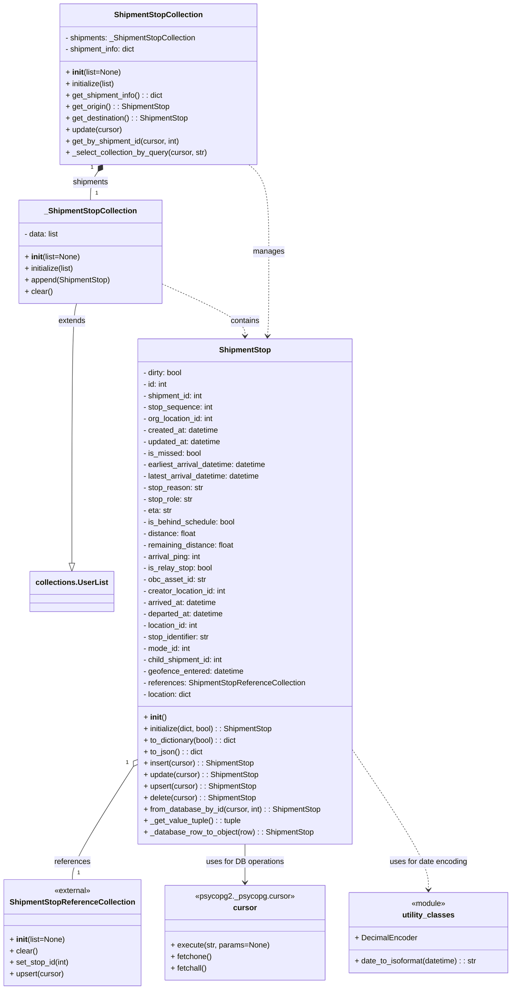

# Diagram: shipment_core/shipment_service/shipment_service/fvshared/shipment_stop.py

> Auto-generated by Obscura crawlers

## Mermaid

### SVG

<svg id="container" width="1060.21875" xmlns="http://www.w3.org/2000/svg" class="classDiagram" height="2068" viewBox="0 0 1060.21875 2068" role="graphics-document document" aria-roledescription="class"><g><defs><marker id="container_class-aggregationStart" class="marker aggregation class" refX="18" refY="7" markerWidth="190" markerHeight="240" orient="auto"><path d="M 18,7 L9,13 L1,7 L9,1 Z"></path></marker></defs><defs><marker id="container_class-aggregationEnd" class="marker aggregation class" refX="1" refY="7" markerWidth="20" markerHeight="28" orient="auto"><path d="M 18,7 L9,13 L1,7 L9,1 Z"></path></marker></defs><defs><marker id="container_class-extensionStart" class="marker extension class" refX="18" refY="7" markerWidth="190" markerHeight="240" orient="auto"><path d="M 1,7 L18,13 V 1 Z"></path></marker></defs><defs><marker id="container_class-extensionEnd" class="marker extension class" refX="1" refY="7" markerWidth="20" markerHeight="28" orient="auto"><path d="M 1,1 V 13 L18,7 Z"></path></marker></defs><defs><marker id="container_class-compositionStart" class="marker composition class" refX="18" refY="7" markerWidth="190" markerHeight="240" orient="auto"><path d="M 18,7 L9,13 L1,7 L9,1 Z"></path></marker></defs><defs><marker id="container_class-compositionEnd" class="marker composition class" refX="1" refY="7" markerWidth="20" markerHeight="28" orient="auto"><path d="M 18,7 L9,13 L1,7 L9,1 Z"></path></marker></defs><defs><marker id="container_class-dependencyStart" class="marker dependency class" refX="6" refY="7" markerWidth="190" markerHeight="240" orient="auto"><path d="M 5,7 L9,13 L1,7 L9,1 Z"></path></marker></defs><defs><marker id="container_class-dependencyEnd" class="marker dependency class" refX="13" refY="7" markerWidth="20" markerHeight="28" orient="auto"><path d="M 18,7 L9,13 L14,7 L9,1 Z"></path></marker></defs><defs><marker id="container_class-lollipopStart" class="marker lollipop class" refX="13" refY="7" markerWidth="190" markerHeight="240" orient="auto"><circle stroke="black" fill="transparent" cx="7" cy="7" r="6"></circle></marker></defs><defs><marker id="container_class-lollipopEnd" class="marker lollipop class" refX="1" refY="7" markerWidth="190" markerHeight="240" orient="auto"><circle stroke="black" fill="transparent" cx="7" cy="7" r="6"></circle></marker></defs><g class="root"><g class="clusters"></g><g class="edgePaths"><path d="M265.305,1610.205L245.401,1642.004C225.498,1673.804,185.69,1737.402,165.786,1775.368C145.883,1813.333,145.883,1825.667,145.883,1831.833L145.883,1838" id="id_ShipmentStop_ShipmentStopReferenceCollection_1" class="edge-thickness-normal edge-pattern-solid relation" style=";;;" data-edge="true" data-et="edge" data-id="id_ShipmentStop_ShipmentStopReferenceCollection_1" data-points="W3sieCI6Mjc0LjQ1NzAzMTI1LCJ5IjoxNTk1LjU4MzQ2NjgwMjE2MDV9LHsieCI6MTQ1Ljg4MjgxMjUsInkiOjE4MDF9LHsieCI6MTQ1Ljg4MjgxMjUsInkiOjE4Mzh9XQ==" marker-start="url(#container_class-aggregationStart)"></path><path d="M196.039,358.257L193.457,362.047C190.875,365.838,185.711,373.419,183.129,383.376C180.547,393.333,180.547,405.667,180.547,411.833L180.547,418" id="id_ShipmentStopCollection__ShipmentStopCollection_2" class="edge-thickness-normal edge-pattern-solid relation" style=";;;" data-edge="true" data-et="edge" data-id="id_ShipmentStopCollection__ShipmentStopCollection_2" data-points="W3sieCI6MjA1Ljc1MDMwNDg3ODA0ODc4LCJ5IjozNDR9LHsieCI6MTgwLjU0Njg3NSwieSI6MzgxfSx7IngiOjE4MC41NDY4NzUsInkiOjQxOH1d" marker-start="url(#container_class-compositionStart)"></path><path d="M150.978,634L149.289,640.167C147.601,646.333,144.224,658.667,142.536,749.125C140.848,839.583,140.848,1008.167,140.848,1092.458L140.848,1176.75" id="id__ShipmentStopCollection_collections.UserList_3" class="edge-thickness-normal edge-pattern-solid relation" style=";;;" data-edge="true" data-et="edge" data-id="id__ShipmentStopCollection_collections.UserList_3" data-points="W3sieCI6MTUwLjk3NzgwMTcyNDEzNzkyLCJ5Ijo2MzR9LHsieCI6MTQwLjg0NzY1NjI1LCJ5Ijo2NzF9LHsieCI6MTQwLjg0NzY1NjI1LCJ5IjoxMTk0fV0=" marker-end="url(#container_class-extensionEnd)"></path><path d="M499.527,1764L499.527,1770.167C499.527,1776.333,499.527,1788.667,499.527,1802C499.527,1815.333,499.527,1829.667,499.527,1836.833L499.527,1844" id="id_ShipmentStop_cursor_4" class="edge-thickness-normal edge-pattern-solid relation" style=";;;" data-edge="true" data-et="edge" data-id="id_ShipmentStop_cursor_4" data-points="W3sieCI6NDk5LjUyNzM0Mzc1LCJ5IjoxNzY0fSx7IngiOjQ5OS41MjczNDM3NSwieSI6MTgwMX0seyJ4Ijo0OTkuNTI3MzQzNzUsInkiOjE4NTB9XQ==" marker-end="url(#container_class-dependencyEnd)"></path><path d="M329.328,593.632L357.695,606.527C386.061,619.421,442.794,645.211,471.161,663.272C499.527,681.333,499.527,691.667,499.527,696.833L499.527,702" id="id__ShipmentStopCollection_ShipmentStop_5" class="edge-thickness-normal edge-pattern-dashed relation" style=";;;" data-edge="true" data-et="edge" data-id="id__ShipmentStopCollection_ShipmentStop_5" data-points="W3sieCI6MzI5LjMyODEyNSwieSI6NTkzLjYzMTk4MTc3Nzg4MTJ9LHsieCI6NDk5LjUyNzM0Mzc1LCJ5Ijo2NzF9LHsieCI6NDk5LjUyNzM0Mzc1LCJ5Ijo3MDh9XQ==" marker-end="url(#container_class-dependencyEnd)"></path><path d="M508.864,344L515.79,350.167C522.715,356.333,536.567,368.667,543.492,399C550.418,429.333,550.418,477.667,550.418,526C550.418,574.333,550.418,622.667,549.952,652.004C549.486,681.341,548.555,691.683,548.089,696.853L547.624,702.024" id="id_ShipmentStopCollection_ShipmentStop_6" class="edge-thickness-normal edge-pattern-dashed relation" style=";;;" data-edge="true" data-et="edge" data-id="id_ShipmentStopCollection_ShipmentStop_6" data-points="W3sieCI6NTA4Ljg2NDE3NjgyOTI2ODMzLCJ5IjozNDR9LHsieCI6NTUwLjQxNzk2ODc1LCJ5IjozODF9LHsieCI6NTUwLjQxNzk2ODc1LCJ5Ijo1MjZ9LHsieCI6NTUwLjQxNzk2ODc1LCJ5Ijo2NzF9LHsieCI6NTQ3LjA4NTMwODM1MTc2OTksInkiOjcwOH1d" marker-end="url(#container_class-dependencyEnd)"></path><path d="M724.598,1566.963L751.124,1605.969C777.65,1644.975,830.702,1722.988,857.228,1771.66C883.754,1820.333,883.754,1839.667,883.754,1849.333L883.754,1859" id="id_ShipmentStop_utility_classes_7" class="edge-thickness-normal edge-pattern-dashed relation" style=";;;" data-edge="true" data-et="edge" data-id="id_ShipmentStop_utility_classes_7" data-points="W3sieCI6NzI0LjU5NzY1NjI1LCJ5IjoxNTY2Ljk2Mjg3MTg0MDc1MTZ9LHsieCI6ODgzLjc1MzkwNjI1LCJ5IjoxODAxfSx7IngiOjg4My43NTM5MDYyNSwieSI6MTg2NX1d" marker-end="url(#container_class-dependencyEnd)"></path></g><g class="edgeLabels"><g class="edgeLabel" transform="translate(145.8828125, 1801)"><g class="label" data-id="id_ShipmentStop_ShipmentStopReferenceCollection_1" transform="translate(-37.828125, -12)"><foreignObject width="75.65625" height="24">

references

</foreignObject></g></g><g class="edgeLabel" transform="translate(180.546875, 381)"><g class="label" data-id="id_ShipmentStopCollection__ShipmentStopCollection_2" transform="translate(-37.9609375, -12)"><foreignObject width="75.921875" height="24">

shipments

</foreignObject></g></g><g class="edgeLabel" transform="translate(140.84765625, 671)"><g class="label" data-id="id__ShipmentStopCollection_collections.UserList_3" transform="translate(-28.5078125, -12)"><foreignObject width="57.015625" height="24">

extends

</foreignObject></g></g><g class="edgeLabel" transform="translate(499.52734375, 1801)"><g class="label" data-id="id_ShipmentStop_cursor_4" transform="translate(-82.4140625, -12)"><foreignObject width="164.828125" height="24">

uses for DB operations

</foreignObject></g></g><g class="edgeLabel" transform="translate(499.52734375, 671)"><g class="label" data-id="id__ShipmentStopCollection_ShipmentStop_5" transform="translate(-30.890625, -12)"><foreignObject width="61.78125" height="24">

contains

</foreignObject></g></g><g class="edgeLabel" transform="translate(550.41796875, 526)"><g class="label" data-id="id_ShipmentStopCollection_ShipmentStop_6" transform="translate(-32.296875, -12)"><foreignObject width="64.59375" height="24">

manages

</foreignObject></g></g><g class="edgeLabel" transform="translate(883.75390625, 1801)"><g class="label" data-id="id_ShipmentStop_utility_classes_7" transform="translate(-82.75, -12)"><foreignObject width="165.5" height="24">

uses for date encoding

</foreignObject></g></g><g class="edgeTerminals" transform="translate(252.4575275509683, 1602.4589151033224)"><g class="inner" transform="translate(0, 0)"><foreignObject style="width: 9px; height: 12px;">
1
</foreignObject></g></g><g class="edgeTerminals" transform="translate(183.50114578130098, 350.01871609701095)"><g class="inner" transform="translate(0, 0)"><foreignObject style="width: 9px; height: 12px;">
1
</foreignObject></g></g><g class="edgeTerminals" transform="translate(155.88281124999997, 1815.4999989285714)"><g class="inner" transform="translate(0, 0)"></g><foreignObject style="width: 9px; height: 12px;">
1
</foreignObject></g><g class="edgeTerminals" transform="translate(190.54687749999985, 395.5000021428571)"><g class="inner" transform="translate(0, 0)"></g><foreignObject style="width: 9px; height: 12px;">
1
</foreignObject></g></g><g class="nodes"><g class="node default" id="classId-ShipmentStop-0" transform="translate(499.52734375, 1236)"><g class="basic label-container"><path d="M-225.0703125 -528 L225.0703125 -528 L225.0703125 528 L-225.0703125 528" stroke="none" stroke-width="0" fill="#ECECFF" style=""></path><path d="M-225.0703125 -528 C-111.86120795287718 -528, 1.3478965942456398 -528, 225.0703125 -528 M-225.0703125 -528 C-103.8783959291887 -528, 17.313520641622603 -528, 225.0703125 -528 M225.0703125 -528 C225.0703125 -300.1827782043099, 225.0703125 -72.36555640861985, 225.0703125 528 M225.0703125 -528 C225.0703125 -224.3958553680509, 225.0703125 79.20828926389822, 225.0703125 528 M225.0703125 528 C124.69165248730188 528, 24.31299247460376 528, -225.0703125 528 M225.0703125 528 C128.68878146100536 528, 32.30725042201075 528, -225.0703125 528 M-225.0703125 528 C-225.0703125 178.3349319314363, -225.0703125 -171.3301361371274, -225.0703125 -528 M-225.0703125 528 C-225.0703125 115.91763706255523, -225.0703125 -296.16472587488954, -225.0703125 -528" stroke="#9370DB" stroke-width="1.3" fill="none" stroke-dasharray="0 0" style=""></path></g><g class="annotation-group text" transform="translate(0, -504)"></g><g class="label-group text" transform="translate(-52.078125, -504)"><g class="label" style="font-weight: bolder" transform="translate(0,-12)"><foreignObject width="104.15625" height="24">

ShipmentStop

</foreignObject></g></g><g class="members-group text" transform="translate(-213.0703125, -456)"><g class="label" style="" transform="translate(0,-12)"><foreignObject width="85.546875" height="24">

- dirty: bool

</foreignObject></g><g class="label" style="" transform="translate(0,12)"><foreignObject width="52.515625" height="24">

- id: int

</foreignObject></g><g class="label" style="" transform="translate(0,36)"><foreignObject width="129.28125" height="24">

- shipment_id: int

</foreignObject></g><g class="label" style="" transform="translate(0,60)"><foreignObject width="147.515625" height="24">

- stop_sequence: int

</foreignObject></g><g class="label" style="" transform="translate(0,84)"><foreignObject width="151.8125" height="24">

- org_location_id: int

</foreignObject></g><g class="label" style="" transform="translate(0,108)"><foreignObject width="161" height="24">

- created_at: datetime

</foreignObject></g><g class="label" style="" transform="translate(0,132)"><foreignObject width="167.484375" height="24">

- updated_at: datetime

</foreignObject></g><g class="label" style="" transform="translate(0,156)"><foreignObject width="122.9375" height="24">

- is_missed: bool

</foreignObject></g><g class="label" style="" transform="translate(0,180)"><foreignObject width="266.296875" height="24">

- earliest_arrival_datetime: datetime

</foreignObject></g><g class="label" style="" transform="translate(0,204)"><foreignObject width="252.5" height="24">

- latest_arrival_datetime: datetime

</foreignObject></g><g class="label" style="" transform="translate(0,228)"><foreignObject width="127.046875" height="24">

- stop_reason: str

</foreignObject></g><g class="label" style="" transform="translate(0,252)"><foreignObject width="106.421875" height="24">

- stop_role: str

</foreignObject></g><g class="label" style="" transform="translate(0,276)"><foreignObject width="61.28125" height="24">

- eta: str

</foreignObject></g><g class="label" style="" transform="translate(0,300)"><foreignObject width="196.4375" height="24">

- is_behind_schedule: bool

</foreignObject></g><g class="label" style="" transform="translate(0,324)"><foreignObject width="113.171875" height="24">

- distance: float

</foreignObject></g><g class="label" style="" transform="translate(0,348)"><foreignObject width="194.171875" height="24">

- remaining_distance: float

</foreignObject></g><g class="label" style="" transform="translate(0,372)"><foreignObject width="124.890625" height="24">

- arrival_ping: int

</foreignObject></g><g class="label" style="" transform="translate(0,396)"><foreignObject width="146.703125" height="24">

- is_relay_stop: bool

</foreignObject></g><g class="label" style="" transform="translate(0,420)"><foreignObject width="132.921875" height="24">

- obc_asset_id: str

</foreignObject></g><g class="label" style="" transform="translate(0,444)"><foreignObject width="178.53125" height="24">

- creator_location_id: int

</foreignObject></g><g class="label" style="" transform="translate(0,468)"><foreignObject width="158.234375" height="24">

- arrived_at: datetime

</foreignObject></g><g class="label" style="" transform="translate(0,492)"><foreignObject width="172.90625" height="24">

- departed_at: datetime

</foreignObject></g><g class="label" style="" transform="translate(0,516)"><foreignObject width="119.984375" height="24">

- location_id: int

</foreignObject></g><g class="label" style="" transform="translate(0,540)"><foreignObject width="144.78125" height="24">

- stop_identifier: str

</foreignObject></g><g class="label" style="" transform="translate(0,564)"><foreignObject width="101.859375" height="24">

- mode_id: int

</foreignObject></g><g class="label" style="" transform="translate(0,588)"><foreignObject width="173.3125" height="24">

- child_shipment_id: int

</foreignObject></g><g class="label" style="" transform="translate(0,612)"><foreignObject width="213.515625" height="24">

- geofence_entered: datetime

</foreignObject></g><g class="label" style="" transform="translate(0,636)"><foreignObject width="341.796875" height="24">

- references: ShipmentStopReferenceCollection

</foreignObject></g><g class="label" style="" transform="translate(0,660)"><foreignObject width="105.4375" height="24">

- location: dict

</foreignObject></g></g><g class="methods-group text" transform="translate(-213.0703125, 264)"><g class="label" style="" transform="translate(0,-12)"><foreignObject width="47.046875" height="24">

+ <strong>init</strong>()

</foreignObject></g><g class="label" style="" transform="translate(0,12)"><foreignObject width="276.359375" height="24">

+ initialize(dict, bool) : : ShipmentStop

</foreignObject></g><g class="label" style="" transform="translate(0,36)"><foreignObject width="199.4375" height="24">

+ to_dictionary(bool) : : dict

</foreignObject></g><g class="label" style="" transform="translate(0,60)"><foreignObject width="124.625" height="24">

+ to_json() : : dict

</foreignObject></g><g class="label" style="" transform="translate(0,84)"><foreignObject width="233.5625" height="24">

+ insert(cursor) : : ShipmentStop

</foreignObject></g><g class="label" style="" transform="translate(0,108)"><foreignObject width="242.875" height="24">

+ update(cursor) : : ShipmentStop

</foreignObject></g><g class="label" style="" transform="translate(0,132)"><foreignObject width="238.484375" height="24">

+ upsert(cursor) : : ShipmentStop

</foreignObject></g><g class="label" style="" transform="translate(0,156)"><foreignObject width="237.40625" height="24">

+ delete(cursor) : : ShipmentStop

</foreignObject></g><g class="label" style="" transform="translate(0,180)"><foreignObject width="374.0625" height="24">

+ from_database_by_id(cursor, int) : : ShipmentStop

</foreignObject></g><g class="label" style="" transform="translate(0,204)"><foreignObject width="204.265625" height="24">

+ _get_value_tuple() : : tuple

</foreignObject></g><g class="label" style="" transform="translate(0,228)"><foreignObject width="357.25" height="24">

+ _database_row_to_object(row) : : ShipmentStop

</foreignObject></g></g><g class="divider" style=""><path d="M-225.0703125 -480 C-108.14176282581947 -480, 8.78678684836106 -480, 225.0703125 -480 M-225.0703125 -480 C-85.55013063594913 -480, 53.97005122810174 -480, 225.0703125 -480" stroke="#9370DB" stroke-width="1.3" fill="none" stroke-dasharray="0 0" style=""></path></g><g class="divider" style=""><path d="M-225.0703125 240 C-83.4870260446836 240, 58.096260410632794 240, 225.0703125 240 M-225.0703125 240 C-78.17951740377924 240, 68.71127769244151 240, 225.0703125 240" stroke="#9370DB" stroke-width="1.3" fill="none" stroke-dasharray="0 0" style=""></path></g></g><g class="node default" id="classId-ShipmentStopReferenceCollection-1" transform="translate(145.8828125, 1949)"><g class="basic label-container"><path d="M-137.8828125 -111 L137.8828125 -111 L137.8828125 111 L-137.8828125 111" stroke="none" stroke-width="0" fill="#ECECFF" style=""></path><path d="M-137.8828125 -111 C-65.9825475464748 -111, 5.9177174070503895 -111, 137.8828125 -111 M-137.8828125 -111 C-56.88750051910279 -111, 24.107811461794427 -111, 137.8828125 -111 M137.8828125 -111 C137.8828125 -60.747842256062754, 137.8828125 -10.495684512125507, 137.8828125 111 M137.8828125 -111 C137.8828125 -58.307335810248055, 137.8828125 -5.614671620496111, 137.8828125 111 M137.8828125 111 C70.57171222359149 111, 3.26061194718298 111, -137.8828125 111 M137.8828125 111 C41.78239920282381 111, -54.31801409435238 111, -137.8828125 111 M-137.8828125 111 C-137.8828125 29.270166296707842, -137.8828125 -52.459667406584316, -137.8828125 -111 M-137.8828125 111 C-137.8828125 46.29129713741676, -137.8828125 -18.417405725166475, -137.8828125 -111" stroke="#9370DB" stroke-width="1.3" fill="none" stroke-dasharray="0 0" style=""></path></g><g class="annotation-group text" transform="translate(-38.65625, -87)"><g class="label" style="" transform="translate(0,-12)"><foreignObject width="77.3125" height="24">

«external»

</foreignObject></g></g><g class="label-group text" transform="translate(-125.28125, -63)"><g class="label" style="font-weight: bolder" transform="translate(0,-12)"><foreignObject width="250.5625" height="24">

ShipmentStopReferenceCollection

</foreignObject></g></g><g class="members-group text" transform="translate(-125.8828125, -15)"></g><g class="methods-group text" transform="translate(-125.8828125, 15)"><g class="label" style="" transform="translate(0,-12)"><foreignObject width="115.859375" height="24">

+ <strong>init</strong>(list=None)

</foreignObject></g><g class="label" style="" transform="translate(0,12)"><foreignObject width="58.296875" height="24">

+ clear()

</foreignObject></g><g class="label" style="" transform="translate(0,36)"><foreignObject width="126.484375" height="24">

+ set_stop_id(int)

</foreignObject></g><g class="label" style="" transform="translate(0,60)"><foreignObject width="115.28125" height="24">

+ upsert(cursor)

</foreignObject></g></g><g class="divider" style=""><path d="M-137.8828125 -39 C-81.57948516293555 -39, -25.27615782587111 -39, 137.8828125 -39 M-137.8828125 -39 C-58.93545139319616 -39, 20.01190971360768 -39, 137.8828125 -39" stroke="#9370DB" stroke-width="1.3" fill="none" stroke-dasharray="0 0" style=""></path></g><g class="divider" style=""><path d="M-137.8828125 -15 C-45.73931739455776 -15, 46.40417771088448 -15, 137.8828125 -15 M-137.8828125 -15 C-72.37920826486977 -15, -6.875604029739549 -15, 137.8828125 -15" stroke="#9370DB" stroke-width="1.3" fill="none" stroke-dasharray="0 0" style=""></path></g></g><g class="node default" id="classId-_ShipmentStopCollection-2" transform="translate(180.546875, 526)"><g class="basic label-container"><path d="M-148.78125 -108 L148.78125 -108 L148.78125 108 L-148.78125 108" stroke="none" stroke-width="0" fill="#ECECFF" style=""></path><path d="M-148.78125 -108 C-53.18577240254889 -108, 42.409705194902216 -108, 148.78125 -108 M-148.78125 -108 C-69.16293149394028 -108, 10.455387012119445 -108, 148.78125 -108 M148.78125 -108 C148.78125 -59.38299728604468, 148.78125 -10.765994572089355, 148.78125 108 M148.78125 -108 C148.78125 -44.46419275586106, 148.78125 19.071614488277874, 148.78125 108 M148.78125 108 C60.46808574902586 108, -27.84507850194828 108, -148.78125 108 M148.78125 108 C49.62778494787838 108, -49.525680104243236 108, -148.78125 108 M-148.78125 108 C-148.78125 61.65947842783152, -148.78125 15.318956855663046, -148.78125 -108 M-148.78125 108 C-148.78125 53.19040629110137, -148.78125 -1.6191874177972636, -148.78125 -108" stroke="#9370DB" stroke-width="1.3" fill="none" stroke-dasharray="0 0" style=""></path></g><g class="annotation-group text" transform="translate(0, -84)"></g><g class="label-group text" transform="translate(-92.78125, -84)"><g class="label" style="font-weight: bolder" transform="translate(0,-12)"><foreignObject width="185.5625" height="24">

_ShipmentStopCollection

</foreignObject></g></g><g class="members-group text" transform="translate(-136.78125, -36)"><g class="label" style="" transform="translate(0,-12)"><foreignObject width="73.859375" height="24">

- data: list

</foreignObject></g></g><g class="methods-group text" transform="translate(-136.78125, 12)"><g class="label" style="" transform="translate(0,-12)"><foreignObject width="115.859375" height="24">

+ <strong>init</strong>(list=None)

</foreignObject></g><g class="label" style="" transform="translate(0,12)"><foreignObject width="107.078125" height="24">

+ initialize(list)

</foreignObject></g><g class="label" style="" transform="translate(0,36)"><foreignObject width="180.78125" height="24">

+ append(ShipmentStop)

</foreignObject></g><g class="label" style="" transform="translate(0,60)"><foreignObject width="58.296875" height="24">

+ clear()

</foreignObject></g></g><g class="divider" style=""><path d="M-148.78125 -60 C-54.62369781530363 -60, 39.53385436939274 -60, 148.78125 -60 M-148.78125 -60 C-82.44595456242556 -60, -16.11065912485111 -60, 148.78125 -60" stroke="#9370DB" stroke-width="1.3" fill="none" stroke-dasharray="0 0" style=""></path></g><g class="divider" style=""><path d="M-148.78125 -12 C-58.738608628829496 -12, 31.304032742341008 -12, 148.78125 -12 M-148.78125 -12 C-69.240619832581 -12, 10.300010334837992 -12, 148.78125 -12" stroke="#9370DB" stroke-width="1.3" fill="none" stroke-dasharray="0 0" style=""></path></g></g><g class="node default" id="classId-ShipmentStopCollection-3" transform="translate(320.1875, 176)"><g class="basic label-container"><path d="M-206.3671875 -168 L206.3671875 -168 L206.3671875 168 L-206.3671875 168" stroke="none" stroke-width="0" fill="#ECECFF" style=""></path><path d="M-206.3671875 -168 C-46.993712508136525 -168, 112.37976248372695 -168, 206.3671875 -168 M-206.3671875 -168 C-50.08039400455965 -168, 106.2063994908807 -168, 206.3671875 -168 M206.3671875 -168 C206.3671875 -72.7319134980689, 206.3671875 22.53617300386219, 206.3671875 168 M206.3671875 -168 C206.3671875 -55.76738199894227, 206.3671875 56.46523600211546, 206.3671875 168 M206.3671875 168 C93.6740024850846 168, -19.0191825298308 168, -206.3671875 168 M206.3671875 168 C88.72663956897817 168, -28.913908362043657 168, -206.3671875 168 M-206.3671875 168 C-206.3671875 93.52533690494299, -206.3671875 19.05067380988598, -206.3671875 -168 M-206.3671875 168 C-206.3671875 67.5913715833896, -206.3671875 -32.817256833220796, -206.3671875 -168" stroke="#9370DB" stroke-width="1.3" fill="none" stroke-dasharray="0 0" style=""></path></g><g class="annotation-group text" transform="translate(0, -144)"></g><g class="label-group text" transform="translate(-88.78125, -144)"><g class="label" style="font-weight: bolder" transform="translate(0,-12)"><foreignObject width="177.5625" height="24">

ShipmentStopCollection

</foreignObject></g></g><g class="members-group text" transform="translate(-194.3671875, -96)"><g class="label" style="" transform="translate(0,-12)"><foreignObject width="278.15625" height="24">

- shipments: _ShipmentStopCollection

</foreignObject></g><g class="label" style="" transform="translate(0,12)"><foreignObject width="151.484375" height="24">

- shipment_info: dict

</foreignObject></g></g><g class="methods-group text" transform="translate(-194.3671875, -24)"><g class="label" style="" transform="translate(0,-12)"><foreignObject width="115.859375" height="24">

+ <strong>init</strong>(list=None)

</foreignObject></g><g class="label" style="" transform="translate(0,12)"><foreignObject width="107.078125" height="24">

+ initialize(list)

</foreignObject></g><g class="label" style="" transform="translate(0,36)"><foreignObject width="206.578125" height="24">

+ get_shipment_info() : : dict

</foreignObject></g><g class="label" style="" transform="translate(0,60)"><foreignObject width="218.59375" height="24">

+ get_origin() : : ShipmentStop

</foreignObject></g><g class="label" style="" transform="translate(0,84)"><foreignObject width="259.5" height="24">

+ get_destination() : : ShipmentStop

</foreignObject></g><g class="label" style="" transform="translate(0,108)"><foreignObject width="119.671875" height="24">

+ update(cursor)

</foreignObject></g><g class="label" style="" transform="translate(0,132)"><foreignObject width="241.671875" height="24">

+ get_by_shipment_id(cursor, int)

</foreignObject></g><g class="label" style="" transform="translate(0,156)"><foreignObject width="299.953125" height="24">

+ _select_collection_by_query(cursor, str)

</foreignObject></g></g><g class="divider" style=""><path d="M-206.3671875 -120 C-86.75466603892747 -120, 32.857855422145064 -120, 206.3671875 -120 M-206.3671875 -120 C-56.41736870958522 -120, 93.53245008082956 -120, 206.3671875 -120" stroke="#9370DB" stroke-width="1.3" fill="none" stroke-dasharray="0 0" style=""></path></g><g class="divider" style=""><path d="M-206.3671875 -48 C-42.63926797312553 -48, 121.08865155374895 -48, 206.3671875 -48 M-206.3671875 -48 C-82.8395462577784 -48, 40.68809498444321 -48, 206.3671875 -48" stroke="#9370DB" stroke-width="1.3" fill="none" stroke-dasharray="0 0" style=""></path></g></g><g class="node default" id="classId-cursor-4" transform="translate(499.52734375, 1949)"><g class="basic label-container"><path d="M-165.76171875 -99 L165.76171875 -99 L165.76171875 99 L-165.76171875 99" stroke="none" stroke-width="0" fill="#ECECFF" style=""></path><path d="M-165.76171875 -99 C-98.25578900417166 -99, -30.74985925834332 -99, 165.76171875 -99 M-165.76171875 -99 C-88.78614557830551 -99, -11.810572406611016 -99, 165.76171875 -99 M165.76171875 -99 C165.76171875 -47.73206486996757, 165.76171875 3.535870260064854, 165.76171875 99 M165.76171875 -99 C165.76171875 -37.56770939868456, 165.76171875 23.864581202630873, 165.76171875 99 M165.76171875 99 C35.21566653706452 99, -95.33038567587096 99, -165.76171875 99 M165.76171875 99 C36.347206257206295 99, -93.06730623558741 99, -165.76171875 99 M-165.76171875 99 C-165.76171875 53.023486201906394, -165.76171875 7.046972403812788, -165.76171875 -99 M-165.76171875 99 C-165.76171875 58.674755981077986, -165.76171875 18.349511962155972, -165.76171875 -99" stroke="#9370DB" stroke-width="1.3" fill="none" stroke-dasharray="0 0" style=""></path></g><g class="annotation-group text" transform="translate(-102.8046875, -75)"><g class="label" style="" transform="translate(0,-12)"><foreignObject width="205.609375" height="24">

«psycopg2._psycopg.cursor»

</foreignObject></g></g><g class="label-group text" transform="translate(-23.1875, -51)"><g class="label" style="font-weight: bolder" transform="translate(0,-12)"><foreignObject width="46.375" height="24">

cursor

</foreignObject></g></g><g class="members-group text" transform="translate(-153.76171875, -3)"></g><g class="methods-group text" transform="translate(-153.76171875, 27)"><g class="label" style="" transform="translate(0,-12)"><foreignObject width="204.71875" height="24">

+ execute(str, params=None)

</foreignObject></g><g class="label" style="" transform="translate(0,12)"><foreignObject width="86.515625" height="24">

+ fetchone()

</foreignObject></g><g class="label" style="" transform="translate(0,36)"><foreignObject width="77" height="24">

+ fetchall()

</foreignObject></g></g><g class="divider" style=""><path d="M-165.76171875 -27 C-60.3950256544709 -27, 44.9716674410582 -27, 165.76171875 -27 M-165.76171875 -27 C-59.00206888113824 -27, 47.757580987723514 -27, 165.76171875 -27" stroke="#9370DB" stroke-width="1.3" fill="none" stroke-dasharray="0 0" style=""></path></g><g class="divider" style=""><path d="M-165.76171875 -3 C-81.755517411386 -3, 2.2506839272280104 -3, 165.76171875 -3 M-165.76171875 -3 C-42.28598591883399 -3, 81.18974691233203 -3, 165.76171875 -3" stroke="#9370DB" stroke-width="1.3" fill="none" stroke-dasharray="0 0" style=""></path></g></g><g class="node default" id="classId-utility_classes-5" transform="translate(883.75390625, 1949)"><g class="basic label-container"><path d="M-168.46484375 -84 L168.46484375 -84 L168.46484375 84 L-168.46484375 84" stroke="none" stroke-width="0" fill="#ECECFF" style=""></path><path d="M-168.46484375 -84 C-73.81428027357101 -84, 20.83628320285797 -84, 168.46484375 -84 M-168.46484375 -84 C-85.87680687645019 -84, -3.288770002900378 -84, 168.46484375 -84 M168.46484375 -84 C168.46484375 -39.635362302669606, 168.46484375 4.729275394660789, 168.46484375 84 M168.46484375 -84 C168.46484375 -21.32426431224345, 168.46484375 41.3514713755131, 168.46484375 84 M168.46484375 84 C89.02701511092584 84, 9.58918647185169 84, -168.46484375 84 M168.46484375 84 C93.90432544009731 84, 19.34380713019462 84, -168.46484375 84 M-168.46484375 84 C-168.46484375 47.054883270534376, -168.46484375 10.109766541068751, -168.46484375 -84 M-168.46484375 84 C-168.46484375 37.36388286353327, -168.46484375 -9.27223427293346, -168.46484375 -84" stroke="#9370DB" stroke-width="1.3" fill="none" stroke-dasharray="0 0" style=""></path></g><g class="annotation-group text" transform="translate(-36.6015625, -60)"><g class="label" style="" transform="translate(0,-12)"><foreignObject width="73.203125" height="24">

«module»

</foreignObject></g></g><g class="label-group text" transform="translate(-51.9296875, -36)"><g class="label" style="font-weight: bolder" transform="translate(0,-12)"><foreignObject width="103.859375" height="24">

utility_classes

</foreignObject></g></g><g class="members-group text" transform="translate(-156.46484375, 12)"><g class="label" style="" transform="translate(0,-12)"><foreignObject width="129.265625" height="24">

+ DecimalEncoder

</foreignObject></g></g><g class="methods-group text" transform="translate(-156.46484375, 60)"><g class="label" style="" transform="translate(0,-12)"><foreignObject width="261" height="24">

+ date_to_isoformat(datetime) : : str

</foreignObject></g></g><g class="divider" style=""><path d="M-168.46484375 -12 C-57.17748750621678 -12, 54.109868737566444 -12, 168.46484375 -12 M-168.46484375 -12 C-45.1345919163346 -12, 78.1956599173308 -12, 168.46484375 -12" stroke="#9370DB" stroke-width="1.3" fill="none" stroke-dasharray="0 0" style=""></path></g><g class="divider" style=""><path d="M-168.46484375 36 C-88.67735987727929 36, -8.889876004558573 36, 168.46484375 36 M-168.46484375 36 C-57.553430006298015 36, 53.35798373740397 36, 168.46484375 36" stroke="#9370DB" stroke-width="1.3" fill="none" stroke-dasharray="0 0" style=""></path></g></g><g class="node default" id="classId-collections.UserList-6" transform="translate(140.84765625, 1236)"><g class="basic label-container"><path d="M-83.609375 -42 L83.609375 -42 L83.609375 42 L-83.609375 42" stroke="none" stroke-width="0" fill="#ECECFF" style=""></path><path d="M-83.609375 -42 C-30.3232128514937 -42, 22.9629492970126 -42, 83.609375 -42 M-83.609375 -42 C-30.728111156656375 -42, 22.15315268668725 -42, 83.609375 -42 M83.609375 -42 C83.609375 -22.822428956482653, 83.609375 -3.644857912965307, 83.609375 42 M83.609375 -42 C83.609375 -18.90276350911349, 83.609375 4.194472981773018, 83.609375 42 M83.609375 42 C37.90699712349891 42, -7.795380753002178 42, -83.609375 42 M83.609375 42 C29.584831753409134 42, -24.439711493181733 42, -83.609375 42 M-83.609375 42 C-83.609375 15.257411005073017, -83.609375 -11.485177989853966, -83.609375 -42 M-83.609375 42 C-83.609375 12.937036813565797, -83.609375 -16.125926372868406, -83.609375 -42" stroke="#9370DB" stroke-width="1.3" fill="none" stroke-dasharray="0 0" style=""></path></g><g class="annotation-group text" transform="translate(0, -18)"></g><g class="label-group text" transform="translate(-71.609375, -18)"><g class="label" style="font-weight: bolder" transform="translate(0,-12)"><foreignObject width="143.21875" height="24">

collections.UserList

</foreignObject></g></g><g class="members-group text" transform="translate(-71.609375, 30)"></g><g class="methods-group text" transform="translate(-71.609375, 60)"></g><g class="divider" style=""><path d="M-83.609375 6 C-34.69225698963308 6, 14.22486102073384 6, 83.609375 6 M-83.609375 6 C-48.67351545357296 6, -13.737655907145921 6, 83.609375 6" stroke="#9370DB" stroke-width="1.3" fill="none" stroke-dasharray="0 0" style=""></path></g><g class="divider" style=""><path d="M-83.609375 24 C-34.661039091441104 24, 14.287296817117792 24, 83.609375 24 M-83.609375 24 C-22.74610399859108 24, 38.11716700281784 24, 83.609375 24" stroke="#9370DB" stroke-width="1.3" fill="none" stroke-dasharray="0 0" style=""></path></g></g></g></g></g></svg>
