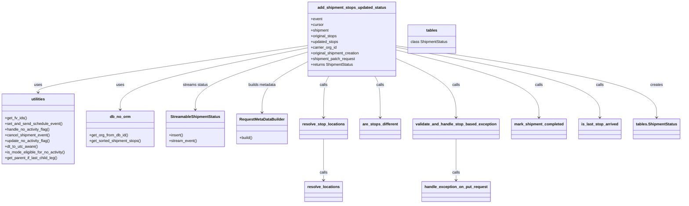

# Diagram: shipment_core/shipment_service/shipment_service/fvshared/shipment_stops_update.py

> Auto-generated by Obscura crawlers

## Diagram 1

### SVG

<svg id="container" width="2804.578125" xmlns="http://www.w3.org/2000/svg" class="classDiagram" height="854" viewBox="0 0 2804.578125 854" role="graphics-document document" aria-roledescription="class"><g><defs><marker id="container_class-aggregationStart" class="marker aggregation class" refX="18" refY="7" markerWidth="190" markerHeight="240" orient="auto"><path d="M 18,7 L9,13 L1,7 L9,1 Z"></path></marker></defs><defs><marker id="container_class-aggregationEnd" class="marker aggregation class" refX="1" refY="7" markerWidth="20" markerHeight="28" orient="auto"><path d="M 18,7 L9,13 L1,7 L9,1 Z"></path></marker></defs><defs><marker id="container_class-extensionStart" class="marker extension class" refX="18" refY="7" markerWidth="190" markerHeight="240" orient="auto"><path d="M 1,7 L18,13 V 1 Z"></path></marker></defs><defs><marker id="container_class-extensionEnd" class="marker extension class" refX="1" refY="7" markerWidth="20" markerHeight="28" orient="auto"><path d="M 1,1 V 13 L18,7 Z"></path></marker></defs><defs><marker id="container_class-compositionStart" class="marker composition class" refX="18" refY="7" markerWidth="190" markerHeight="240" orient="auto"><path d="M 18,7 L9,13 L1,7 L9,1 Z"></path></marker></defs><defs><marker id="container_class-compositionEnd" class="marker composition class" refX="1" refY="7" markerWidth="20" markerHeight="28" orient="auto"><path d="M 18,7 L9,13 L1,7 L9,1 Z"></path></marker></defs><defs><marker id="container_class-dependencyStart" class="marker dependency class" refX="6" refY="7" markerWidth="190" markerHeight="240" orient="auto"><path d="M 5,7 L9,13 L1,7 L9,1 Z"></path></marker></defs><defs><marker id="container_class-dependencyEnd" class="marker dependency class" refX="13" refY="7" markerWidth="20" markerHeight="28" orient="auto"><path d="M 18,7 L9,13 L14,7 L9,1 Z"></path></marker></defs><defs><marker id="container_class-lollipopStart" class="marker lollipop class" refX="13" refY="7" markerWidth="190" markerHeight="240" orient="auto"><circle stroke="black" fill="transparent" cx="7" cy="7" r="6"></circle></marker></defs><defs><marker id="container_class-lollipopEnd" class="marker lollipop class" refX="1" refY="7" markerWidth="190" markerHeight="240" orient="auto"><circle stroke="black" fill="transparent" cx="7" cy="7" r="6"></circle></marker></defs><g class="root"><g class="clusters"></g><g class="edgePaths"><path d="M1276.191,201.487L1148.24,227.406C1020.288,253.325,764.384,305.162,636.432,348.248C508.48,391.333,508.48,425.667,508.48,442.833L508.48,460" id="id_add_shipment_stops_updated_status_db_no_orm_1" class="edge-thickness-normal edge-pattern-solid relation" style=";;;" data-edge="true" data-et="edge" data-id="id_add_shipment_stops_updated_status_db_no_orm_1" data-points="W3sieCI6MTI3Ni4xOTE0MDYyNSwieSI6MjAxLjQ4NzQ2NjY4ODUzMjY2fSx7IngiOjUwOC40ODA0Njg3NSwieSI6MzU3fSx7IngiOjUwOC40ODA0Njg3NSwieSI6NDY2fV0=" marker-end="url(#container_class-dependencyEnd)"></path><path d="M1276.191,191.486L1090.457,219.072C904.723,246.657,533.254,301.829,347.52,334.581C161.785,367.333,161.785,377.667,161.785,382.833L161.785,388" id="id_add_shipment_stops_updated_status_utilities_2" class="edge-thickness-normal edge-pattern-solid relation" style=";;;" data-edge="true" data-et="edge" data-id="id_add_shipment_stops_updated_status_utilities_2" data-points="W3sieCI6MTI3Ni4xOTE0MDYyNSwieSI6MTkxLjQ4NTg5NTY3ODUyMjQ3fSx7IngiOjE2MS43ODUxNTYyNSwieSI6MzU3fSx7IngiOjE2MS43ODUxNTYyNSwieSI6Mzk0fV0=" marker-end="url(#container_class-dependencyEnd)"></path><path d="M1368.14,320L1364.459,326.167C1360.778,332.333,1353.416,344.667,1349.735,373.5C1346.055,402.333,1346.055,447.667,1346.055,470.333L1346.055,493" id="id_add_shipment_stops_updated_status_resolve_stop_locations_3" class="edge-thickness-normal edge-pattern-solid relation" style=";;;" data-edge="true" data-et="edge" data-id="id_add_shipment_stops_updated_status_resolve_stop_locations_3" data-points="W3sieCI6MTM2OC4xMzk1MTE4MTk5NDgyLCJ5IjozMjB9LHsieCI6MTM0Ni4wNTQ2ODc1LCJ5IjozNTd9LHsieCI6MTM0Ni4wNTQ2ODc1LCJ5Ijo0OTl9XQ==" marker-end="url(#container_class-dependencyEnd)"></path><path d="M1554.368,320L1558.049,326.167C1561.73,332.333,1569.092,344.667,1572.772,373.5C1576.453,402.333,1576.453,447.667,1576.453,470.333L1576.453,493" id="id_add_shipment_stops_updated_status_are_stops_different_4" class="edge-thickness-normal edge-pattern-solid relation" style=";;;" data-edge="true" data-et="edge" data-id="id_add_shipment_stops_updated_status_are_stops_different_4" data-points="W3sieCI6MTU1NC4zNjgzMDA2ODAwNTE4LCJ5IjozMjB9LHsieCI6MTU3Ni40NTMxMjUsInkiOjM1N30seyJ4IjoxNTc2LjQ1MzEyNSwieSI6NDk5fV0=" marker-end="url(#container_class-dependencyEnd)"></path><path d="M1646.316,248.314L1686.076,266.428C1725.836,284.542,1805.355,320.771,1845.115,361.552C1884.875,402.333,1884.875,447.667,1884.875,470.333L1884.875,493" id="id_add_shipment_stops_updated_status_validate_and_handle_stop_based_exception_5" class="edge-thickness-normal edge-pattern-solid relation" style=";;;" data-edge="true" data-et="edge" data-id="id_add_shipment_stops_updated_status_validate_and_handle_stop_based_exception_5" data-points="W3sieCI6MTY0Ni4zMTY0MDYyNSwieSI6MjQ4LjMxMzcwMTYyMzgzNDY3fSx7IngiOjE4ODQuODc1LCJ5IjozNTd9LHsieCI6MTg4NC44NzUsInkiOjQ5OX1d" marker-end="url(#container_class-dependencyEnd)"></path><path d="M1646.316,199.413L1783.568,225.678C1920.82,251.942,2195.324,304.471,2332.576,353.402C2469.828,402.333,2469.828,447.667,2469.828,470.333L2469.828,493" id="id_add_shipment_stops_updated_status_is_last_stop_arrived_6" class="edge-thickness-normal edge-pattern-solid relation" style=";;;" data-edge="true" data-et="edge" data-id="id_add_shipment_stops_updated_status_is_last_stop_arrived_6" data-points="W3sieCI6MTY0Ni4zMTY0MDYyNSwieSI6MTk5LjQxMzQyMDA4OTQ2NzI1fSx7IngiOjI0NjkuODI4MTI1LCJ5IjozNTd9LHsieCI6MjQ2OS44MjgxMjUsInkiOjQ5OX1d" marker-end="url(#container_class-dependencyEnd)"></path><path d="M1646.316,210.98L1742.182,235.317C1838.047,259.654,2029.777,308.327,2125.643,355.33C2221.508,402.333,2221.508,447.667,2221.508,470.333L2221.508,493" id="id_add_shipment_stops_updated_status_mark_shipment_completed_7" class="edge-thickness-normal edge-pattern-solid relation" style=";;;" data-edge="true" data-et="edge" data-id="id_add_shipment_stops_updated_status_mark_shipment_completed_7" data-points="W3sieCI6MTY0Ni4zMTY0MDYyNSwieSI6MjEwLjk4MDQzOTMwNjM1ODR9LHsieCI6MjIyMS41MDc4MTI1LCJ5IjozNTd9LHsieCI6MjIyMS41MDc4MTI1LCJ5Ijo0OTl9XQ==" marker-end="url(#container_class-dependencyEnd)"></path><path d="M1646.316,192.803L1822.148,220.169C1997.979,247.535,2349.642,302.268,2525.473,352.3C2701.305,402.333,2701.305,447.667,2701.305,470.333L2701.305,493" id="id_add_shipment_stops_updated_status_tables.ShipmentStatus_8" class="edge-thickness-normal edge-pattern-solid relation" style=";;;" data-edge="true" data-et="edge" data-id="id_add_shipment_stops_updated_status_tables.ShipmentStatus_8" data-points="W3sieCI6MTY0Ni4zMTY0MDYyNSwieSI6MTkyLjgwMjkwMzEwNjkxNjZ9LHsieCI6MjcwMS4zMDQ2ODc1LCJ5IjozNTd9LHsieCI6MjcwMS4zMDQ2ODc1LCJ5Ijo0OTl9XQ==" marker-end="url(#container_class-dependencyEnd)"></path><path d="M1276.191,261.81L1246.174,277.675C1216.156,293.54,1156.121,325.27,1126.104,360.302C1096.086,395.333,1096.086,433.667,1096.086,452.833L1096.086,472" id="id_add_shipment_stops_updated_status_RequestMetaDataBuilder_9" class="edge-thickness-normal edge-pattern-solid relation" style=";;;" data-edge="true" data-et="edge" data-id="id_add_shipment_stops_updated_status_RequestMetaDataBuilder_9" data-points="W3sieCI6MTI3Ni4xOTE0MDYyNSwieSI6MjYxLjgwOTk1NDc1MTEzMTJ9LHsieCI6MTA5Ni4wODU5Mzc1LCJ5IjozNTd9LHsieCI6MTA5Ni4wODU5Mzc1LCJ5Ijo0Nzh9XQ==" marker-end="url(#container_class-dependencyEnd)"></path><path d="M1276.191,219.873L1200.493,242.728C1124.794,265.582,973.397,311.291,897.699,351.312C822,391.333,822,425.667,822,442.833L822,460" id="id_add_shipment_stops_updated_status_StreamableShipmentStatus_10" class="edge-thickness-normal edge-pattern-solid relation" style=";;;" data-edge="true" data-et="edge" data-id="id_add_shipment_stops_updated_status_StreamableShipmentStatus_10" data-points="W3sieCI6MTI3Ni4xOTE0MDYyNSwieSI6MjE5Ljg3MzA0NTM1OTI3NTA0fSx7IngiOjgyMiwieSI6MzU3fSx7IngiOjgyMiwieSI6NDY2fV0=" marker-end="url(#container_class-dependencyEnd)"></path><path d="M1884.875,583L1884.875,606.667C1884.875,630.333,1884.875,677.667,1884.875,706.5C1884.875,735.333,1884.875,745.667,1884.875,750.833L1884.875,756" id="id_validate_and_handle_stop_based_exception_handle_exception_on_put_request_11" class="edge-thickness-normal edge-pattern-solid relation" style=";;;" data-edge="true" data-et="edge" data-id="id_validate_and_handle_stop_based_exception_handle_exception_on_put_request_11" data-points="W3sieCI6MTg4NC44NzUsInkiOjU4M30seyJ4IjoxODg0Ljg3NSwieSI6NzI1fSx7IngiOjE4ODQuODc1LCJ5Ijo3NjJ9XQ==" marker-end="url(#container_class-dependencyEnd)"></path><path d="M1346.055,583L1346.055,606.667C1346.055,630.333,1346.055,677.667,1346.055,706.5C1346.055,735.333,1346.055,745.667,1346.055,750.833L1346.055,756" id="id_resolve_stop_locations_resolve_locations_12" class="edge-thickness-normal edge-pattern-solid relation" style=";;;" data-edge="true" data-et="edge" data-id="id_resolve_stop_locations_resolve_locations_12" data-points="W3sieCI6MTM0Ni4wNTQ2ODc1LCJ5Ijo1ODN9LHsieCI6MTM0Ni4wNTQ2ODc1LCJ5Ijo3MjV9LHsieCI6MTM0Ni4wNTQ2ODc1LCJ5Ijo3NjJ9XQ==" marker-end="url(#container_class-dependencyEnd)"></path></g><g class="edgeLabels"><g class="edgeLabel" transform="translate(508.48046875, 357)"><g class="label" data-id="id_add_shipment_stops_updated_status_db_no_orm_1" transform="translate(-16.4921875, -12)"><foreignObject width="32.984375" height="24">

uses

</foreignObject></g></g><g class="edgeLabel" transform="translate(161.78515625, 357)"><g class="label" data-id="id_add_shipment_stops_updated_status_utilities_2" transform="translate(-16.4921875, -12)"><foreignObject width="32.984375" height="24">

uses

</foreignObject></g></g><g class="edgeLabel" transform="translate(1346.0546875, 357)"><g class="label" data-id="id_add_shipment_stops_updated_status_resolve_stop_locations_3" transform="translate(-16.4453125, -12)"><foreignObject width="32.890625" height="24">

calls

</foreignObject></g></g><g class="edgeLabel" transform="translate(1576.453125, 357)"><g class="label" data-id="id_add_shipment_stops_updated_status_are_stops_different_4" transform="translate(-16.4453125, -12)"><foreignObject width="32.890625" height="24">

calls

</foreignObject></g></g><g class="edgeLabel" transform="translate(1884.875, 357)"><g class="label" data-id="id_add_shipment_stops_updated_status_validate_and_handle_stop_based_exception_5" transform="translate(-16.4453125, -12)"><foreignObject width="32.890625" height="24">

calls

</foreignObject></g></g><g class="edgeLabel" transform="translate(2469.828125, 357)"><g class="label" data-id="id_add_shipment_stops_updated_status_is_last_stop_arrived_6" transform="translate(-16.4453125, -12)"><foreignObject width="32.890625" height="24">

calls

</foreignObject></g></g><g class="edgeLabel" transform="translate(2221.5078125, 357)"><g class="label" data-id="id_add_shipment_stops_updated_status_mark_shipment_completed_7" transform="translate(-16.4453125, -12)"><foreignObject width="32.890625" height="24">

calls

</foreignObject></g></g><g class="edgeLabel" transform="translate(2701.3046875, 357)"><g class="label" data-id="id_add_shipment_stops_updated_status_tables.ShipmentStatus_8" transform="translate(-26.171875, -12)"><foreignObject width="52.34375" height="24">

creates

</foreignObject></g></g><g class="edgeLabel" transform="translate(1096.0859375, 357)"><g class="label" data-id="id_add_shipment_stops_updated_status_RequestMetaDataBuilder_9" transform="translate(-59.328125, -12)"><foreignObject width="118.65625" height="24">

builds metadata

</foreignObject></g></g><g class="edgeLabel" transform="translate(822, 357)"><g class="label" data-id="id_add_shipment_stops_updated_status_StreamableShipmentStatus_10" transform="translate(-53.0234375, -12)"><foreignObject width="106.046875" height="24">

streams status

</foreignObject></g></g><g class="edgeLabel" transform="translate(1884.875, 725)"><g class="label" data-id="id_validate_and_handle_stop_based_exception_handle_exception_on_put_request_11" transform="translate(-16.4453125, -12)"><foreignObject width="32.890625" height="24">

calls

</foreignObject></g></g><g class="edgeLabel" transform="translate(1346.0546875, 725)"><g class="label" data-id="id_resolve_stop_locations_resolve_locations_12" transform="translate(-16.4453125, -12)"><foreignObject width="32.890625" height="24">

calls

</foreignObject></g></g></g><g class="nodes"><g class="node default" id="classId-add_shipment_stops_updated_status-0" transform="translate(1461.25390625, 164)"><g class="basic label-container"><path d="M-185.0625 -156 L185.0625 -156 L185.0625 156 L-185.0625 156" stroke="none" stroke-width="0" fill="#ECECFF" style=""></path><path d="M-185.0625 -156 C-80.36126432164112 -156, 24.33997135671777 -156, 185.0625 -156 M-185.0625 -156 C-63.67368417957083 -156, 57.715131640858345 -156, 185.0625 -156 M185.0625 -156 C185.0625 -34.952052587946, 185.0625 86.095894824108, 185.0625 156 M185.0625 -156 C185.0625 -41.204342393319536, 185.0625 73.59131521336093, 185.0625 156 M185.0625 156 C56.917384106222556 156, -71.22773178755489 156, -185.0625 156 M185.0625 156 C84.41958397216696 156, -16.223332055666077 156, -185.0625 156 M-185.0625 156 C-185.0625 73.4252634465893, -185.0625 -9.149473106821404, -185.0625 -156 M-185.0625 156 C-185.0625 64.63676649786542, -185.0625 -26.726467004269153, -185.0625 -156" stroke="#9370DB" stroke-width="1.3" fill="none" stroke-dasharray="0 0" style=""></path></g><g class="annotation-group text" transform="translate(0, -132)"></g><g class="label-group text" transform="translate(-138.28125, -132)"><g class="label" style="font-weight: bolder" transform="translate(0,-12)"><foreignObject width="276.5625" height="24">

add_shipment_stops_updated_status

</foreignObject></g></g><g class="members-group text" transform="translate(-173.0625, -84)"><g class="label" style="" transform="translate(0,-12)"><foreignObject width="48.328125" height="24">

+event

</foreignObject></g><g class="label" style="" transform="translate(0,12)"><foreignObject width="53.71875" height="24">

+cursor

</foreignObject></g><g class="label" style="" transform="translate(0,36)"><foreignObject width="76.4375" height="24">

+shipment

</foreignObject></g><g class="label" style="" transform="translate(0,60)"><foreignObject width="111.109375" height="24">

+original_stops

</foreignObject></g><g class="label" style="" transform="translate(0,84)"><foreignObject width="116.546875" height="24">

+updated_stops

</foreignObject></g><g class="label" style="" transform="translate(0,108)"><foreignObject width="108.734375" height="24">

+carrier_org_id

</foreignObject></g><g class="label" style="" transform="translate(0,132)"><foreignObject width="207.84375" height="24">

+original_shipment_creation

</foreignObject></g><g class="label" style="" transform="translate(0,156)"><foreignObject width="188.953125" height="24">

+shipment_patch_request

</foreignObject></g><g class="label" style="" transform="translate(0,180)"><foreignObject width="180.109375" height="24">

+returns ShipmentStatus

</foreignObject></g></g><g class="methods-group text" transform="translate(-173.0625, 156)"></g><g class="divider" style=""><path d="M-185.0625 -108 C-76.10357413835561 -108, 32.85535172328878 -108, 185.0625 -108 M-185.0625 -108 C-92.17883614955849 -108, 0.7048277008830155 -108, 185.0625 -108" stroke="#9370DB" stroke-width="1.3" fill="none" stroke-dasharray="0 0" style=""></path></g><g class="divider" style=""><path d="M-185.0625 132 C-46.40289455159865 132, 92.2567108968027 132, 185.0625 132 M-185.0625 132 C-96.89663856673897 132, -8.730777133477943 132, 185.0625 132" stroke="#9370DB" stroke-width="1.3" fill="none" stroke-dasharray="0 0" style=""></path></g></g><g class="node default" id="classId-utilities-1" transform="translate(161.78515625, 541)"><g class="basic label-container"><path d="M-153.78515625 -147 L153.78515625 -147 L153.78515625 147 L-153.78515625 147" stroke="none" stroke-width="0" fill="#ECECFF" style=""></path><path d="M-153.78515625 -147 C-87.2895199663984 -147, -20.793883682796803 -147, 153.78515625 -147 M-153.78515625 -147 C-40.88123686066797 -147, 72.02268252866406 -147, 153.78515625 -147 M153.78515625 -147 C153.78515625 -64.40910560864108, 153.78515625 18.18178878271783, 153.78515625 147 M153.78515625 -147 C153.78515625 -61.31215394409489, 153.78515625 24.375692111810224, 153.78515625 147 M153.78515625 147 C36.708720296364774 147, -80.36771565727045 147, -153.78515625 147 M153.78515625 147 C53.86242121470033 147, -46.06031382059933 147, -153.78515625 147 M-153.78515625 147 C-153.78515625 36.715940271131785, -153.78515625 -73.56811945773643, -153.78515625 -147 M-153.78515625 147 C-153.78515625 53.612037692401955, -153.78515625 -39.77592461519609, -153.78515625 -147" stroke="#9370DB" stroke-width="1.3" fill="none" stroke-dasharray="0 0" style=""></path></g><g class="annotation-group text" transform="translate(0, -123)"></g><g class="label-group text" transform="translate(-28.1796875, -123)"><g class="label" style="font-weight: bolder" transform="translate(0,-12)"><foreignObject width="56.359375" height="24">

utilities

</foreignObject></g></g><g class="members-group text" transform="translate(-141.78515625, -75)"></g><g class="methods-group text" transform="translate(-141.78515625, -45)"><g class="label" style="" transform="translate(0,-12)"><foreignObject width="91.546875" height="24">

+get_fv_ids()

</foreignObject></g><g class="label" style="" transform="translate(0,12)"><foreignObject width="241.1875" height="24">

+set_and_send_schedule_event()

</foreignObject></g><g class="label" style="" transform="translate(0,36)"><foreignObject width="189.484375" height="24">

+handle_no_activity_flag()

</foreignObject></g><g class="label" style="" transform="translate(0,60)"><foreignObject width="189.765625" height="24">

+cancel_shipment_event()

</foreignObject></g><g class="label" style="" transform="translate(0,84)"><foreignObject width="190.46875" height="24">

+update_no_activity_flag()

</foreignObject></g><g class="label" style="" transform="translate(0,108)"><foreignObject width="137.78125" height="24">

+dt_to_utc_aware()

</foreignObject></g><g class="label" style="" transform="translate(0,132)"><foreignObject width="255.390625" height="24">

+is_mode_eligible_for_no_activity()

</foreignObject></g><g class="label" style="" transform="translate(0,156)"><foreignObject width="222.640625" height="24">

+get_parent_if_last_child_leg()

</foreignObject></g></g><g class="divider" style=""><path d="M-153.78515625 -99 C-60.038805073212686 -99, 33.70754610357463 -99, 153.78515625 -99 M-153.78515625 -99 C-68.52305693062115 -99, 16.739042388757696 -99, 153.78515625 -99" stroke="#9370DB" stroke-width="1.3" fill="none" stroke-dasharray="0 0" style=""></path></g><g class="divider" style=""><path d="M-153.78515625 -75 C-35.653569291951584 -75, 82.47801766609683 -75, 153.78515625 -75 M-153.78515625 -75 C-65.45505986378986 -75, 22.875036522420288 -75, 153.78515625 -75" stroke="#9370DB" stroke-width="1.3" fill="none" stroke-dasharray="0 0" style=""></path></g></g><g class="node default" id="classId-db_no_orm-2" transform="translate(508.48046875, 541)"><g class="basic label-container"><path d="M-142.91015625 -75 L142.91015625 -75 L142.91015625 75 L-142.91015625 75" stroke="none" stroke-width="0" fill="#ECECFF" style=""></path><path d="M-142.91015625 -75 C-70.00337055468911 -75, 2.9034151406217745 -75, 142.91015625 -75 M-142.91015625 -75 C-64.45729933172557 -75, 13.99555758654887 -75, 142.91015625 -75 M142.91015625 -75 C142.91015625 -19.961136429831086, 142.91015625 35.07772714033783, 142.91015625 75 M142.91015625 -75 C142.91015625 -28.11145473291701, 142.91015625 18.77709053416598, 142.91015625 75 M142.91015625 75 C64.08185059761057 75, -14.746455054778863 75, -142.91015625 75 M142.91015625 75 C63.025535833023994 75, -16.85908458395201 75, -142.91015625 75 M-142.91015625 75 C-142.91015625 21.552292162103598, -142.91015625 -31.895415675792805, -142.91015625 -75 M-142.91015625 75 C-142.91015625 38.31775933638746, -142.91015625 1.6355186727749214, -142.91015625 -75" stroke="#9370DB" stroke-width="1.3" fill="none" stroke-dasharray="0 0" style=""></path></g><g class="annotation-group text" transform="translate(0, -51)"></g><g class="label-group text" transform="translate(-41.3515625, -51)"><g class="label" style="font-weight: bolder" transform="translate(0,-12)"><foreignObject width="82.703125" height="24">

db_no_orm

</foreignObject></g></g><g class="members-group text" transform="translate(-130.91015625, -3)"></g><g class="methods-group text" transform="translate(-130.91015625, 27)"><g class="label" style="" transform="translate(0,-12)"><foreignObject width="163.84375" height="24">

+get_org_from_db_id()

</foreignObject></g><g class="label" style="" transform="translate(0,12)"><foreignObject width="220.46875" height="24">

+get_sorted_shipment_stops()

</foreignObject></g></g><g class="divider" style=""><path d="M-142.91015625 -27 C-54.47033447854709 -27, 33.969487292905825 -27, 142.91015625 -27 M-142.91015625 -27 C-82.55526659015798 -27, -22.20037693031597 -27, 142.91015625 -27" stroke="#9370DB" stroke-width="1.3" fill="none" stroke-dasharray="0 0" style=""></path></g><g class="divider" style=""><path d="M-142.91015625 -3 C-35.38345903695166 -3, 72.14323817609667 -3, 142.91015625 -3 M-142.91015625 -3 C-38.32599044758818 -3, 66.25817535482363 -3, 142.91015625 -3" stroke="#9370DB" stroke-width="1.3" fill="none" stroke-dasharray="0 0" style=""></path></g></g><g class="node default" id="classId-tables-3" transform="translate(1797.2890625, 164)"><g class="basic label-container"><path d="M-100.97265625 -60 L100.97265625 -60 L100.97265625 60 L-100.97265625 60" stroke="none" stroke-width="0" fill="#ECECFF" style=""></path><path d="M-100.97265625 -60 C-53.874647652892236 -60, -6.776639055784472 -60, 100.97265625 -60 M-100.97265625 -60 C-33.010444034856036 -60, 34.95176818028793 -60, 100.97265625 -60 M100.97265625 -60 C100.97265625 -15.33437217347543, 100.97265625 29.33125565304914, 100.97265625 60 M100.97265625 -60 C100.97265625 -31.78084019041232, 100.97265625 -3.5616803808246402, 100.97265625 60 M100.97265625 60 C46.92484179404058 60, -7.122972661918837 60, -100.97265625 60 M100.97265625 60 C20.850117331620453 60, -59.272421586759094 60, -100.97265625 60 M-100.97265625 60 C-100.97265625 32.03323119879731, -100.97265625 4.066462397594627, -100.97265625 -60 M-100.97265625 60 C-100.97265625 13.647007583692364, -100.97265625 -32.70598483261527, -100.97265625 -60" stroke="#9370DB" stroke-width="1.3" fill="none" stroke-dasharray="0 0" style=""></path></g><g class="annotation-group text" transform="translate(0, -36)"></g><g class="label-group text" transform="translate(-22.7734375, -36)"><g class="label" style="font-weight: bolder" transform="translate(0,-12)"><foreignObject width="45.546875" height="24">

tables

</foreignObject></g></g><g class="members-group text" transform="translate(-88.97265625, 12)"><g class="label" style="" transform="translate(0,-12)"><foreignObject width="155.171875" height="24">

class ShipmentStatus

</foreignObject></g></g><g class="methods-group text" transform="translate(-88.97265625, 60)"></g><g class="divider" style=""><path d="M-100.97265625 -12 C-41.124084826391766 -12, 18.72448659721647 -12, 100.97265625 -12 M-100.97265625 -12 C-21.159998909636386 -12, 58.65265843072723 -12, 100.97265625 -12" stroke="#9370DB" stroke-width="1.3" fill="none" stroke-dasharray="0 0" style=""></path></g><g class="divider" style=""><path d="M-100.97265625 36 C-38.923556102720006 36, 23.125544044559987 36, 100.97265625 36 M-100.97265625 36 C-20.421591813926057 36, 60.12947262214789 36, 100.97265625 36" stroke="#9370DB" stroke-width="1.3" fill="none" stroke-dasharray="0 0" style=""></path></g></g><g class="node default" id="classId-StreamableShipmentStatus-4" transform="translate(822, 541)"><g class="basic label-container"><path d="M-120.609375 -75 L120.609375 -75 L120.609375 75 L-120.609375 75" stroke="none" stroke-width="0" fill="#ECECFF" style=""></path><path d="M-120.609375 -75 C-32.06533033551972 -75, 56.478714328960564 -75, 120.609375 -75 M-120.609375 -75 C-31.350633172369612 -75, 57.908108655260776 -75, 120.609375 -75 M120.609375 -75 C120.609375 -43.01735140070747, 120.609375 -11.03470280141493, 120.609375 75 M120.609375 -75 C120.609375 -24.97608865058851, 120.609375 25.047822698822984, 120.609375 75 M120.609375 75 C40.03062384612764 75, -40.54812730774472 75, -120.609375 75 M120.609375 75 C49.00396412556607 75, -22.601446748867858 75, -120.609375 75 M-120.609375 75 C-120.609375 15.722824428812814, -120.609375 -43.55435114237437, -120.609375 -75 M-120.609375 75 C-120.609375 44.137795506835054, -120.609375 13.275591013670109, -120.609375 -75" stroke="#9370DB" stroke-width="1.3" fill="none" stroke-dasharray="0 0" style=""></path></g><g class="annotation-group text" transform="translate(0, -51)"></g><g class="label-group text" transform="translate(-100.609375, -51)"><g class="label" style="font-weight: bolder" transform="translate(0,-12)"><foreignObject width="201.21875" height="24">

StreamableShipmentStatus

</foreignObject></g></g><g class="members-group text" transform="translate(-108.609375, -3)"></g><g class="methods-group text" transform="translate(-108.609375, 27)"><g class="label" style="" transform="translate(0,-12)"><foreignObject width="60.390625" height="24">

+insert()

</foreignObject></g><g class="label" style="" transform="translate(0,12)"><foreignObject width="116.609375" height="24">

+stream_event()

</foreignObject></g></g><g class="divider" style=""><path d="M-120.609375 -27 C-36.1752007567661 -27, 48.258973486467795 -27, 120.609375 -27 M-120.609375 -27 C-34.41226090020254 -27, 51.78485319959492 -27, 120.609375 -27" stroke="#9370DB" stroke-width="1.3" fill="none" stroke-dasharray="0 0" style=""></path></g><g class="divider" style=""><path d="M-120.609375 -3 C-49.694128226404516 -3, 21.22111854719097 -3, 120.609375 -3 M-120.609375 -3 C-44.54222854174439 -3, 31.524917916511214 -3, 120.609375 -3" stroke="#9370DB" stroke-width="1.3" fill="none" stroke-dasharray="0 0" style=""></path></g></g><g class="node default" id="classId-RequestMetaDataBuilder-5" transform="translate(1096.0859375, 541)"><g class="basic label-container"><path d="M-103.4765625 -63 L103.4765625 -63 L103.4765625 63 L-103.4765625 63" stroke="none" stroke-width="0" fill="#ECECFF" style=""></path><path d="M-103.4765625 -63 C-25.57505953044182 -63, 52.32644343911636 -63, 103.4765625 -63 M-103.4765625 -63 C-29.676705777114933 -63, 44.123150945770135 -63, 103.4765625 -63 M103.4765625 -63 C103.4765625 -18.18829331527663, 103.4765625 26.623413369446737, 103.4765625 63 M103.4765625 -63 C103.4765625 -25.3205068578242, 103.4765625 12.358986284351602, 103.4765625 63 M103.4765625 63 C27.502605787855217 63, -48.47135092428957 63, -103.4765625 63 M103.4765625 63 C25.061978194283498 63, -53.352606111433005 63, -103.4765625 63 M-103.4765625 63 C-103.4765625 22.182756746128973, -103.4765625 -18.634486507742054, -103.4765625 -63 M-103.4765625 63 C-103.4765625 31.0871475765454, -103.4765625 -0.825704846909197, -103.4765625 -63" stroke="#9370DB" stroke-width="1.3" fill="none" stroke-dasharray="0 0" style=""></path></g><g class="annotation-group text" transform="translate(0, -39)"></g><g class="label-group text" transform="translate(-91.4765625, -39)"><g class="label" style="font-weight: bolder" transform="translate(0,-12)"><foreignObject width="182.953125" height="24">

RequestMetaDataBuilder

</foreignObject></g></g><g class="members-group text" transform="translate(-91.4765625, 9)"></g><g class="methods-group text" transform="translate(-91.4765625, 39)"><g class="label" style="" transform="translate(0,-12)"><foreignObject width="55.859375" height="24">

+build()

</foreignObject></g></g><g class="divider" style=""><path d="M-103.4765625 -15 C-25.632937780586744 -15, 52.21068693882651 -15, 103.4765625 -15 M-103.4765625 -15 C-38.541681467185015 -15, 26.39319956562997 -15, 103.4765625 -15" stroke="#9370DB" stroke-width="1.3" fill="none" stroke-dasharray="0 0" style=""></path></g><g class="divider" style=""><path d="M-103.4765625 9 C-34.86787980664276 9, 33.74080288671448 9, 103.4765625 9 M-103.4765625 9 C-26.343350153279147 9, 50.78986219344171 9, 103.4765625 9" stroke="#9370DB" stroke-width="1.3" fill="none" stroke-dasharray="0 0" style=""></path></g></g><g class="node default" id="classId-resolve_locations-6" transform="translate(1346.0546875, 804)"><g class="basic label-container"><path d="M-76.234375 -42 L76.234375 -42 L76.234375 42 L-76.234375 42" stroke="none" stroke-width="0" fill="#ECECFF" style=""></path><path d="M-76.234375 -42 C-42.75053638578269 -42, -9.266697771565376 -42, 76.234375 -42 M-76.234375 -42 C-26.79883015353895 -42, 22.636714692922098 -42, 76.234375 -42 M76.234375 -42 C76.234375 -20.45061895710547, 76.234375 1.0987620857890619, 76.234375 42 M76.234375 -42 C76.234375 -10.5249353536799, 76.234375 20.9501292926402, 76.234375 42 M76.234375 42 C40.28916173351891 42, 4.343948467037819 42, -76.234375 42 M76.234375 42 C17.42724275469216 42, -41.37988949061568 42, -76.234375 42 M-76.234375 42 C-76.234375 17.50476817084629, -76.234375 -6.990463658307419, -76.234375 -42 M-76.234375 42 C-76.234375 18.400446653535898, -76.234375 -5.199106692928204, -76.234375 -42" stroke="#9370DB" stroke-width="1.3" fill="none" stroke-dasharray="0 0" style=""></path></g><g class="annotation-group text" transform="translate(0, -18)"></g><g class="label-group text" transform="translate(-64.234375, -18)"><g class="label" style="font-weight: bolder" transform="translate(0,-12)"><foreignObject width="128.46875" height="24">

resolve_locations

</foreignObject></g></g><g class="members-group text" transform="translate(-64.234375, 30)"></g><g class="methods-group text" transform="translate(-64.234375, 60)"></g><g class="divider" style=""><path d="M-76.234375 6 C-16.0442664589565 6, 44.145842082087 6, 76.234375 6 M-76.234375 6 C-20.05786255320551 6, 36.11864989358898 6, 76.234375 6" stroke="#9370DB" stroke-width="1.3" fill="none" stroke-dasharray="0 0" style=""></path></g><g class="divider" style=""><path d="M-76.234375 24 C-33.44778292650096 24, 9.338809146998074 24, 76.234375 24 M-76.234375 24 C-35.82958771180683 24, 4.575199576386339 24, 76.234375 24" stroke="#9370DB" stroke-width="1.3" fill="none" stroke-dasharray="0 0" style=""></path></g></g><g class="node default" id="classId-resolve_stop_locations-7" transform="translate(1346.0546875, 541)"><g class="basic label-container"><path d="M-96.4921875 -42 L96.4921875 -42 L96.4921875 42 L-96.4921875 42" stroke="none" stroke-width="0" fill="#ECECFF" style=""></path><path d="M-96.4921875 -42 C-43.713147431481865 -42, 9.06589263703627 -42, 96.4921875 -42 M-96.4921875 -42 C-57.54873415614027 -42, -18.60528081228054 -42, 96.4921875 -42 M96.4921875 -42 C96.4921875 -15.85734322802696, 96.4921875 10.285313543946081, 96.4921875 42 M96.4921875 -42 C96.4921875 -16.747631433445072, 96.4921875 8.504737133109856, 96.4921875 42 M96.4921875 42 C44.85872321098561 42, -6.774741078028782 42, -96.4921875 42 M96.4921875 42 C24.077390304275383 42, -48.337406891449234 42, -96.4921875 42 M-96.4921875 42 C-96.4921875 10.936389772264615, -96.4921875 -20.12722045547077, -96.4921875 -42 M-96.4921875 42 C-96.4921875 8.715138977292767, -96.4921875 -24.569722045414466, -96.4921875 -42" stroke="#9370DB" stroke-width="1.3" fill="none" stroke-dasharray="0 0" style=""></path></g><g class="annotation-group text" transform="translate(0, -18)"></g><g class="label-group text" transform="translate(-84.4921875, -18)"><g class="label" style="font-weight: bolder" transform="translate(0,-12)"><foreignObject width="168.984375" height="24">

resolve_stop_locations

</foreignObject></g></g><g class="members-group text" transform="translate(-84.4921875, 30)"></g><g class="methods-group text" transform="translate(-84.4921875, 60)"></g><g class="divider" style=""><path d="M-96.4921875 6 C-43.70652953768429 6, 9.07912842463142 6, 96.4921875 6 M-96.4921875 6 C-43.42850116754676 6, 9.635185164906474 6, 96.4921875 6" stroke="#9370DB" stroke-width="1.3" fill="none" stroke-dasharray="0 0" style=""></path></g><g class="divider" style=""><path d="M-96.4921875 24 C-35.55481353717214 24, 25.382560425655726 24, 96.4921875 24 M-96.4921875 24 C-38.83617344240265 24, 18.819840615194707 24, 96.4921875 24" stroke="#9370DB" stroke-width="1.3" fill="none" stroke-dasharray="0 0" style=""></path></g></g><g class="node default" id="classId-are_stops_different-8" transform="translate(1576.453125, 541)"><g class="basic label-container"><path d="M-83.90625 -42 L83.90625 -42 L83.90625 42 L-83.90625 42" stroke="none" stroke-width="0" fill="#ECECFF" style=""></path><path d="M-83.90625 -42 C-30.371491980229976 -42, 23.163266039540048 -42, 83.90625 -42 M-83.90625 -42 C-34.335963801907646 -42, 15.234322396184709 -42, 83.90625 -42 M83.90625 -42 C83.90625 -13.069121476076571, 83.90625 15.861757047846858, 83.90625 42 M83.90625 -42 C83.90625 -24.26788950265496, 83.90625 -6.535779005309919, 83.90625 42 M83.90625 42 C33.68038837829495 42, -16.5454732434101 42, -83.90625 42 M83.90625 42 C30.866105700103255 42, -22.17403859979349 42, -83.90625 42 M-83.90625 42 C-83.90625 18.73150023257313, -83.90625 -4.5369995348537415, -83.90625 -42 M-83.90625 42 C-83.90625 21.467681248407445, -83.90625 0.9353624968148893, -83.90625 -42" stroke="#9370DB" stroke-width="1.3" fill="none" stroke-dasharray="0 0" style=""></path></g><g class="annotation-group text" transform="translate(0, -18)"></g><g class="label-group text" transform="translate(-71.90625, -18)"><g class="label" style="font-weight: bolder" transform="translate(0,-12)"><foreignObject width="143.8125" height="24">

are_stops_different

</foreignObject></g></g><g class="members-group text" transform="translate(-71.90625, 30)"></g><g class="methods-group text" transform="translate(-71.90625, 60)"></g><g class="divider" style=""><path d="M-83.90625 6 C-30.434960194075238 6, 23.036329611849524 6, 83.90625 6 M-83.90625 6 C-21.6126348570319 6, 40.6809802859362 6, 83.90625 6" stroke="#9370DB" stroke-width="1.3" fill="none" stroke-dasharray="0 0" style=""></path></g><g class="divider" style=""><path d="M-83.90625 24 C-33.4205585332676 24, 17.065132933464795 24, 83.90625 24 M-83.90625 24 C-35.10008478390629 24, 13.70608043218742 24, 83.90625 24" stroke="#9370DB" stroke-width="1.3" fill="none" stroke-dasharray="0 0" style=""></path></g></g><g class="node default" id="classId-validate_and_handle_stop_based_exception-9" transform="translate(1884.875, 541)"><g class="basic label-container"><path d="M-174.515625 -42 L174.515625 -42 L174.515625 42 L-174.515625 42" stroke="none" stroke-width="0" fill="#ECECFF" style=""></path><path d="M-174.515625 -42 C-68.99459420844734 -42, 36.52643658310532 -42, 174.515625 -42 M-174.515625 -42 C-69.74216818385287 -42, 35.03128863229426 -42, 174.515625 -42 M174.515625 -42 C174.515625 -8.670322245920623, 174.515625 24.659355508158754, 174.515625 42 M174.515625 -42 C174.515625 -16.674934919528873, 174.515625 8.650130160942254, 174.515625 42 M174.515625 42 C74.83185551259248 42, -24.851913974815034 42, -174.515625 42 M174.515625 42 C79.76354825542538 42, -14.988528489149246 42, -174.515625 42 M-174.515625 42 C-174.515625 23.486931481453507, -174.515625 4.973862962907013, -174.515625 -42 M-174.515625 42 C-174.515625 11.314116189989477, -174.515625 -19.371767620021046, -174.515625 -42" stroke="#9370DB" stroke-width="1.3" fill="none" stroke-dasharray="0 0" style=""></path></g><g class="annotation-group text" transform="translate(0, -18)"></g><g class="label-group text" transform="translate(-162.515625, -18)"><g class="label" style="font-weight: bolder" transform="translate(0,-12)"><foreignObject width="325.03125" height="24">

validate_and_handle_stop_based_exception

</foreignObject></g></g><g class="members-group text" transform="translate(-162.515625, 30)"></g><g class="methods-group text" transform="translate(-162.515625, 60)"></g><g class="divider" style=""><path d="M-174.515625 6 C-65.5180117331681 6, 43.47960153366381 6, 174.515625 6 M-174.515625 6 C-72.05252119692621 6, 30.410582606147585 6, 174.515625 6" stroke="#9370DB" stroke-width="1.3" fill="none" stroke-dasharray="0 0" style=""></path></g><g class="divider" style=""><path d="M-174.515625 24 C-65.53510596082513 24, 43.44541307834973 24, 174.515625 24 M-174.515625 24 C-65.58092281060188 24, 43.35377937879625 24, 174.515625 24" stroke="#9370DB" stroke-width="1.3" fill="none" stroke-dasharray="0 0" style=""></path></g></g><g class="node default" id="classId-mark_shipment_completed-10" transform="translate(2221.5078125, 541)"><g class="basic label-container"><path d="M-112.1171875 -42 L112.1171875 -42 L112.1171875 42 L-112.1171875 42" stroke="none" stroke-width="0" fill="#ECECFF" style=""></path><path d="M-112.1171875 -42 C-39.73946484606141 -42, 32.63825780787718 -42, 112.1171875 -42 M-112.1171875 -42 C-31.22818162482254 -42, 49.66082425035492 -42, 112.1171875 -42 M112.1171875 -42 C112.1171875 -9.448898887873085, 112.1171875 23.10220222425383, 112.1171875 42 M112.1171875 -42 C112.1171875 -8.492043515598716, 112.1171875 25.015912968802567, 112.1171875 42 M112.1171875 42 C59.921706033774655 42, 7.726224567549309 42, -112.1171875 42 M112.1171875 42 C47.8760483966922 42, -16.365090706615604 42, -112.1171875 42 M-112.1171875 42 C-112.1171875 17.73804340762139, -112.1171875 -6.52391318475722, -112.1171875 -42 M-112.1171875 42 C-112.1171875 17.454073368587473, -112.1171875 -7.091853262825055, -112.1171875 -42" stroke="#9370DB" stroke-width="1.3" fill="none" stroke-dasharray="0 0" style=""></path></g><g class="annotation-group text" transform="translate(0, -18)"></g><g class="label-group text" transform="translate(-100.1171875, -18)"><g class="label" style="font-weight: bolder" transform="translate(0,-12)"><foreignObject width="200.234375" height="24">

mark_shipment_completed

</foreignObject></g></g><g class="members-group text" transform="translate(-100.1171875, 30)"></g><g class="methods-group text" transform="translate(-100.1171875, 60)"></g><g class="divider" style=""><path d="M-112.1171875 6 C-32.542155882163925 6, 47.03287573567215 6, 112.1171875 6 M-112.1171875 6 C-66.06360184311299 6, -20.010016186225997 6, 112.1171875 6" stroke="#9370DB" stroke-width="1.3" fill="none" stroke-dasharray="0 0" style=""></path></g><g class="divider" style=""><path d="M-112.1171875 24 C-64.96138562675836 24, -17.80558375351673 24, 112.1171875 24 M-112.1171875 24 C-55.62703294585706 24, 0.8631216082858799 24, 112.1171875 24" stroke="#9370DB" stroke-width="1.3" fill="none" stroke-dasharray="0 0" style=""></path></g></g><g class="node default" id="classId-is_last_stop_arrived-11" transform="translate(2469.828125, 541)"><g class="basic label-container"><path d="M-86.203125 -42 L86.203125 -42 L86.203125 42 L-86.203125 42" stroke="none" stroke-width="0" fill="#ECECFF" style=""></path><path d="M-86.203125 -42 C-42.2943374498537 -42, 1.6144501002926006 -42, 86.203125 -42 M-86.203125 -42 C-28.163317902814356 -42, 29.87648919437129 -42, 86.203125 -42 M86.203125 -42 C86.203125 -16.76175664914903, 86.203125 8.476486701701937, 86.203125 42 M86.203125 -42 C86.203125 -17.664304662764685, 86.203125 6.671390674470629, 86.203125 42 M86.203125 42 C43.412812098728 42, 0.6224991974559941 42, -86.203125 42 M86.203125 42 C18.084866593182454 42, -50.03339181363509 42, -86.203125 42 M-86.203125 42 C-86.203125 10.236512128682488, -86.203125 -21.526975742635024, -86.203125 -42 M-86.203125 42 C-86.203125 23.199567669631573, -86.203125 4.399135339263147, -86.203125 -42" stroke="#9370DB" stroke-width="1.3" fill="none" stroke-dasharray="0 0" style=""></path></g><g class="annotation-group text" transform="translate(0, -18)"></g><g class="label-group text" transform="translate(-74.203125, -18)"><g class="label" style="font-weight: bolder" transform="translate(0,-12)"><foreignObject width="148.40625" height="24">

is_last_stop_arrived

</foreignObject></g></g><g class="members-group text" transform="translate(-74.203125, 30)"></g><g class="methods-group text" transform="translate(-74.203125, 60)"></g><g class="divider" style=""><path d="M-86.203125 6 C-47.46299318088028 6, -8.722861361760565 6, 86.203125 6 M-86.203125 6 C-47.050183328490505 6, -7.897241656981009 6, 86.203125 6" stroke="#9370DB" stroke-width="1.3" fill="none" stroke-dasharray="0 0" style=""></path></g><g class="divider" style=""><path d="M-86.203125 24 C-22.405747622405215 24, 41.39162975518957 24, 86.203125 24 M-86.203125 24 C-44.20776540397716 24, -2.212405807954326 24, 86.203125 24" stroke="#9370DB" stroke-width="1.3" fill="none" stroke-dasharray="0 0" style=""></path></g></g><g class="node default" id="classId-handle_exception_on_put_request-12" transform="translate(1884.875, 804)"><g class="basic label-container"><path d="M-138.984375 -42 L138.984375 -42 L138.984375 42 L-138.984375 42" stroke="none" stroke-width="0" fill="#ECECFF" style=""></path><path d="M-138.984375 -42 C-35.27862613333458 -42, 68.42712273333083 -42, 138.984375 -42 M-138.984375 -42 C-67.15939515531736 -42, 4.665584689365289 -42, 138.984375 -42 M138.984375 -42 C138.984375 -18.23463502959799, 138.984375 5.530729940804022, 138.984375 42 M138.984375 -42 C138.984375 -13.893690744713926, 138.984375 14.212618510572149, 138.984375 42 M138.984375 42 C59.60743532131225 42, -19.769504357375496 42, -138.984375 42 M138.984375 42 C28.785570787194033 42, -81.41323342561193 42, -138.984375 42 M-138.984375 42 C-138.984375 22.0740552285348, -138.984375 2.148110457069599, -138.984375 -42 M-138.984375 42 C-138.984375 23.59724232795123, -138.984375 5.194484655902457, -138.984375 -42" stroke="#9370DB" stroke-width="1.3" fill="none" stroke-dasharray="0 0" style=""></path></g><g class="annotation-group text" transform="translate(0, -18)"></g><g class="label-group text" transform="translate(-126.984375, -18)"><g class="label" style="font-weight: bolder" transform="translate(0,-12)"><foreignObject width="253.96875" height="24">

handle_exception_on_put_request

</foreignObject></g></g><g class="members-group text" transform="translate(-126.984375, 30)"></g><g class="methods-group text" transform="translate(-126.984375, 60)"></g><g class="divider" style=""><path d="M-138.984375 6 C-64.40298208813661 6, 10.178410823726779 6, 138.984375 6 M-138.984375 6 C-79.6644348270525 6, -20.34449465410499 6, 138.984375 6" stroke="#9370DB" stroke-width="1.3" fill="none" stroke-dasharray="0 0" style=""></path></g><g class="divider" style=""><path d="M-138.984375 24 C-81.42297752943726 24, -23.861580058874523 24, 138.984375 24 M-138.984375 24 C-63.936732869025136 24, 11.110909261949729 24, 138.984375 24" stroke="#9370DB" stroke-width="1.3" fill="none" stroke-dasharray="0 0" style=""></path></g></g><g class="node default" id="classId-tables.ShipmentStatus-13" transform="translate(2701.3046875, 541)"><g class="basic label-container"><path d="M-95.2734375 -42 L95.2734375 -42 L95.2734375 42 L-95.2734375 42" stroke="none" stroke-width="0" fill="#ECECFF" style=""></path><path d="M-95.2734375 -42 C-51.727128306447796 -42, -8.180819112895591 -42, 95.2734375 -42 M-95.2734375 -42 C-35.337023928004875 -42, 24.59938964399025 -42, 95.2734375 -42 M95.2734375 -42 C95.2734375 -14.912775679171883, 95.2734375 12.174448641656234, 95.2734375 42 M95.2734375 -42 C95.2734375 -17.935894705323737, 95.2734375 6.128210589352527, 95.2734375 42 M95.2734375 42 C51.90371905291009 42, 8.534000605820182 42, -95.2734375 42 M95.2734375 42 C43.77339067606956 42, -7.726656147860879 42, -95.2734375 42 M-95.2734375 42 C-95.2734375 8.75170523228374, -95.2734375 -24.49658953543252, -95.2734375 -42 M-95.2734375 42 C-95.2734375 11.773100688244206, -95.2734375 -18.453798623511588, -95.2734375 -42" stroke="#9370DB" stroke-width="1.3" fill="none" stroke-dasharray="0 0" style=""></path></g><g class="annotation-group text" transform="translate(0, -18)"></g><g class="label-group text" transform="translate(-83.2734375, -18)"><g class="label" style="font-weight: bolder" transform="translate(0,-12)"><foreignObject width="166.546875" height="24">

tables.ShipmentStatus

</foreignObject></g></g><g class="members-group text" transform="translate(-83.2734375, 30)"></g><g class="methods-group text" transform="translate(-83.2734375, 60)"></g><g class="divider" style=""><path d="M-95.2734375 6 C-49.15825341027538 6, -3.0430693205507566 6, 95.2734375 6 M-95.2734375 6 C-23.011740236632008 6, 49.249957026735984 6, 95.2734375 6" stroke="#9370DB" stroke-width="1.3" fill="none" stroke-dasharray="0 0" style=""></path></g><g class="divider" style=""><path d="M-95.2734375 24 C-24.351423344689408 24, 46.570590810621184 24, 95.2734375 24 M-95.2734375 24 C-51.32391074820766 24, -7.374383996415318 24, 95.2734375 24" stroke="#9370DB" stroke-width="1.3" fill="none" stroke-dasharray="0 0" style=""></path></g></g></g></g></g></svg>

## Diagram 2

```mermaid
flowchart LR
    Start([Start]) --> GetRequest[/"Extract event, body, headers, actor, org"/]
    GetRequest --> LoadOrg{carrier_org_id?\nset org}
    LoadOrg --> FetchUpdatedStops[/"Maybe fetch updated_stops\nfrom DB"/]
    FetchUpdatedStops --> SummarizeStops[/"Create stop summaries\n(original & updated)"/]
    SummarizeStops --> ResolveLocations[/"resolve_stop_locations\n(map children -> parents)"/]
    ResolveLocations --> SortStops[/"Sort original & updated\nby stop_sequence"/]
    SortStops --> CompareStops[/"are_stops_different?"/]
    CompareStops -- No --> EndNoChange([Log & return False])
    CompareStops -- Yes --> GetFVIds[/"utilities.get_fv_ids\n(carrier_fv_id, creator_fv_id)"/]
    GetFVIds --> BranchCreation{original_shipment_creation?}
    BranchCreation -- True --> OrigCreate[/"Set SC, remarks, status_details\nschedule origin/destination close\nmaybe handle no-activity flag"/]
    BranchCreation -- False --> UpdateFlow[/"Set SU, remarks, status_details\ncheck last stop arrival\nmaybe mark completed or update flags\nvalidate exceptions"/]
    OrigCreate --> BuildStatus
    UpdateFlow --> BuildStatus
    BuildStatus[/"Build status_details JSON\ncreate tables.ShipmentStatus object"/]
    BuildStatus --> Stream[/"RequestMetaDataBuilder.build()\nStreamableShipmentStatus(...).insert().stream_event()"/]
    Stream --> MultiModal{shipment is Child?}
    MultiModal -- True --> StreamParent[/"Create & stream status for parent\nif parent_ship exists"/]
    MultiModal --> Finalize
    StreamParent --> Finalize
    Finalize --> EndDone([Return shipment_status])
```

### SVG

<svg id="container" width="5623.5693359375" xmlns="http://www.w3.org/2000/svg" class="flowchart" height="341.296875" viewBox="0.0000019073486328125 0 5623.5693359375 341.296875" role="graphics-document document" aria-roledescription="flowchart-v2"><g><marker id="container_flowchart-v2-pointEnd" class="marker flowchart-v2" viewBox="0 0 10 10" refX="5" refY="5" markerUnits="userSpaceOnUse" markerWidth="8" markerHeight="8" orient="auto"><path d="M 0 0 L 10 5 L 0 10 z" class="arrowMarkerPath" style="stroke-width: 1; stroke-dasharray: 1, 0;"></path></marker><marker id="container_flowchart-v2-pointStart" class="marker flowchart-v2" viewBox="0 0 10 10" refX="4.5" refY="5" markerUnits="userSpaceOnUse" markerWidth="8" markerHeight="8" orient="auto"><path d="M 0 5 L 10 10 L 10 0 z" class="arrowMarkerPath" style="stroke-width: 1; stroke-dasharray: 1, 0;"></path></marker><marker id="container_flowchart-v2-circleEnd" class="marker flowchart-v2" viewBox="0 0 10 10" refX="11" refY="5" markerUnits="userSpaceOnUse" markerWidth="11" markerHeight="11" orient="auto"><circle cx="5" cy="5" r="5" class="arrowMarkerPath" style="stroke-width: 1; stroke-dasharray: 1, 0;"></circle></marker><marker id="container_flowchart-v2-circleStart" class="marker flowchart-v2" viewBox="0 0 10 10" refX="-1" refY="5" markerUnits="userSpaceOnUse" markerWidth="11" markerHeight="11" orient="auto"><circle cx="5" cy="5" r="5" class="arrowMarkerPath" style="stroke-width: 1; stroke-dasharray: 1, 0;"></circle></marker><marker id="container_flowchart-v2-crossEnd" class="marker cross flowchart-v2" viewBox="0 0 11 11" refX="12" refY="5.2" markerUnits="userSpaceOnUse" markerWidth="11" markerHeight="11" orient="auto"><path d="M 1,1 l 9,9 M 10,1 l -9,9" class="arrowMarkerPath" style="stroke-width: 2; stroke-dasharray: 1, 0;"></path></marker><marker id="container_flowchart-v2-crossStart" class="marker cross flowchart-v2" viewBox="0 0 11 11" refX="-1" refY="5.2" markerUnits="userSpaceOnUse" markerWidth="11" markerHeight="11" orient="auto"><path d="M 1,1 l 9,9 M 10,1 l -9,9" class="arrowMarkerPath" style="stroke-width: 2; stroke-dasharray: 1, 0;"></path></marker><g class="root"><g class="clusters"></g><g class="edgePaths"><path d="M68.277,123.297L72.36,123.214C76.444,123.13,84.61,122.964,94.902,122.955C105.194,122.947,117.61,123.098,123.819,123.173L130.027,123.248" id="L_Start_GetRequest_0" class="edge-thickness-normal edge-pattern-solid edge-thickness-normal edge-pattern-solid flowchart-link" style=";" data-edge="true" data-et="edge" data-id="L_Start_GetRequest_0" data-points="W3sieCI6NjguMjc2ODM3NDMxODI3MjksInkiOjEyMy4yOTY4NzUwMDAwMDAwMX0seyJ4Ijo5Mi43NzY4MzYzOTUyNjM2NywieSI6MTIyLjc5Njg3NX0seyJ4IjoxMzQuMDI2ODM2Mzk1MjYzNjcsInkiOjEyMy4yOTY4NzV9XQ==" marker-end="url(#container_flowchart-v2-pointEnd)"></path><path d="M380.527,123.297L387.235,123.214C393.944,123.13,407.36,122.964,417.569,122.88C427.777,122.797,434.777,122.797,438.277,122.797L441.777,122.797" id="L_GetRequest_LoadOrg_0" class="edge-thickness-normal edge-pattern-solid edge-thickness-normal edge-pattern-solid flowchart-link" style=";" data-edge="true" data-et="edge" data-id="L_GetRequest_LoadOrg_0" data-points="W3sieCI6MzgwLjUyNjgzNjM5NTI2MzcsInkiOjEyMy4yOTY4NzV9LHsieCI6NDIwLjc3NjgzNjM5NTI2MzcsInkiOjEyMi43OTY4NzV9LHsieCI6NDQ1Ljc3NjgzNjM5NTI2MzcsInkiOjEyMi43OTY4NzV9XQ==" marker-end="url(#container_flowchart-v2-pointEnd)"></path><path d="M675.371,122.797L679.537,122.797C683.704,122.797,692.037,122.797,702.412,122.872C712.787,122.947,725.204,123.098,731.412,123.173L737.621,123.248" id="L_LoadOrg_FetchUpdatedStops_0" class="edge-thickness-normal edge-pattern-solid edge-thickness-normal edge-pattern-solid flowchart-link" style=";" data-edge="true" data-et="edge" data-id="L_LoadOrg_FetchUpdatedStops_0" data-points="W3sieCI6Njc1LjM3MDU4NjM5NTI2MzgsInkiOjEyMi43OTY4NzV9LHsieCI6NzAwLjM3MDU4NjM5NTI2MzcsInkiOjEyMi43OTY4NzV9LHsieCI6NzQxLjYyMDU4NjM5NTI2MzcsInkiOjEyMy4yOTY4NzV9XQ==" marker-end="url(#container_flowchart-v2-pointEnd)"></path><path d="M988.121,123.297L994.829,123.214C1001.537,123.13,1014.954,122.964,1028.871,122.956C1042.787,122.949,1057.204,123.102,1064.412,123.178L1071.621,123.255" id="L_FetchUpdatedStops_SummarizeStops_0" class="edge-thickness-normal edge-pattern-solid edge-thickness-normal edge-pattern-solid flowchart-link" style=";" data-edge="true" data-et="edge" data-id="L_FetchUpdatedStops_SummarizeStops_0" data-points="W3sieCI6OTg4LjEyMDU4NjM5NTI2MzcsInkiOjEyMy4yOTY4NzV9LHsieCI6MTAyOC4zNzA1ODYzOTUyNjM3LCJ5IjoxMjIuNzk2ODc1fSx7IngiOjEwNzUuNjIwNTg2Mzk1MjYzNywieSI6MTIzLjI5Njg3NX1d" marker-end="url(#container_flowchart-v2-pointEnd)"></path><path d="M1334.121,123.297L1341.829,123.214C1349.537,123.13,1364.954,122.964,1378.871,122.955C1392.787,122.947,1405.204,123.098,1411.412,123.173L1417.621,123.248" id="L_SummarizeStops_ResolveLocations_0" class="edge-thickness-normal edge-pattern-solid edge-thickness-normal edge-pattern-solid flowchart-link" style=";" data-edge="true" data-et="edge" data-id="L_SummarizeStops_ResolveLocations_0" data-points="W3sieCI6MTMzNC4xMjA1ODYzOTUyNjM3LCJ5IjoxMjMuMjk2ODc1fSx7IngiOjEzODAuMzcwNTg2Mzk1MjYzNywieSI6MTIyLjc5Njg3NX0seyJ4IjoxNDIxLjYyMDU4NjM5NTI2MzcsInkiOjEyMy4yOTY4NzV9XQ==" marker-end="url(#container_flowchart-v2-pointEnd)"></path><path d="M1693.136,123.297L1699.845,123.214C1706.553,123.13,1719.97,122.964,1733.886,122.956C1747.803,122.949,1762.22,123.102,1769.428,123.178L1776.636,123.255" id="L_ResolveLocations_SortStops_0" class="edge-thickness-normal edge-pattern-solid edge-thickness-normal edge-pattern-solid flowchart-link" style=";" data-edge="true" data-et="edge" data-id="L_ResolveLocations_SortStops_0" data-points="W3sieCI6MTY5My4xMzYyMTEzOTUyNjM3LCJ5IjoxMjMuMjk2ODc1fSx7IngiOjE3MzMuMzg2MjExMzk1MjYzNywieSI6MTIyLjc5Njg3NX0seyJ4IjoxNzgwLjYzNjIxMTM5NTI2MzcsInkiOjEyMy4yOTY4NzV9XQ==" marker-end="url(#container_flowchart-v2-pointEnd)"></path><path d="M2039.136,123.297L2046.845,123.214C2054.553,123.13,2069.97,122.964,2082.886,122.954C2095.803,122.945,2106.22,123.092,2111.428,123.166L2116.637,123.24" id="L_SortStops_CompareStops_0" class="edge-thickness-normal edge-pattern-solid edge-thickness-normal edge-pattern-solid flowchart-link" style=";" data-edge="true" data-et="edge" data-id="L_SortStops_CompareStops_0" data-points="W3sieCI6MjAzOS4xMzYyMTEzOTUyNjM3LCJ5IjoxMjMuMjk2ODc1fSx7IngiOjIwODUuMzg2MjExMzk1MjYzNywieSI6MTIyLjc5Njg3NX0seyJ4IjoyMTIwLjYzNjIxMTM5NTI2MzcsInkiOjEyMy4yOTY4NzV9XQ==" marker-end="url(#container_flowchart-v2-pointEnd)"></path><path d="M2265.131,103.797L2279.166,98.547C2293.201,93.297,2321.27,82.797,2355.44,77.628C2389.611,72.458,2429.882,72.62,2450.018,72.7L2470.154,72.781" id="L_CompareStops_EndNoChange_0" class="edge-thickness-normal edge-pattern-solid edge-thickness-normal edge-pattern-solid flowchart-link" style=";" data-edge="true" data-et="edge" data-id="L_CompareStops_EndNoChange_0" data-points="W3sieCI6MjI2NS4xMzEyNjA5MDAyMTQzLCJ5IjoxMDMuNzk2ODc1fSx7IngiOjIzNDkuMzM5MzM2Mzk1MjYzNywieSI6NzIuMjk2ODc1fSx7IngiOjI0NzQuMTU0MDQxMjkwMjg0NiwieSI6NzIuNzk2ODc1fV0=" marker-end="url(#container_flowchart-v2-pointEnd)"></path><path d="M2265.131,142.797L2279.166,147.88C2293.201,152.964,2321.27,163.13,2343.518,168.291C2365.766,173.451,2382.194,173.605,2390.407,173.682L2398.621,173.759" id="L_CompareStops_GetFVIds_0" class="edge-thickness-normal edge-pattern-solid edge-thickness-normal edge-pattern-solid flowchart-link" style=";" data-edge="true" data-et="edge" data-id="L_CompareStops_GetFVIds_0" data-points="W3sieCI6MjI2NS4xMzEyNjA5MDAyMTQzLCJ5IjoxNDIuNzk2ODc1fSx7IngiOjIzNDkuMzM5MzM2Mzk1MjYzNywieSI6MTczLjI5Njg3NX0seyJ4IjoyNDAyLjYyMDU4NjM5NTI2MzcsInkiOjE3My43OTY4NzV9XQ==" marker-end="url(#container_flowchart-v2-pointEnd)"></path><path d="M2701.417,173.797L2708.126,173.714C2714.834,173.63,2728.251,173.464,2738.459,173.38C2748.667,173.297,2755.667,173.297,2759.167,173.297L2762.667,173.297" id="L_GetFVIds_BranchCreation_0" class="edge-thickness-normal edge-pattern-solid edge-thickness-normal edge-pattern-solid flowchart-link" style=";" data-edge="true" data-et="edge" data-id="L_GetFVIds_BranchCreation_0" data-points="W3sieCI6MjcwMS40MTc0NjEzOTUyNjM3LCJ5IjoxNzMuNzk2ODc1fSx7IngiOjI3NDEuNjY3NDYxMzk1MjYzNywieSI6MTczLjI5Njg3NX0seyJ4IjoyNzY2LjY2NzQ2MTM5NTI2MzcsInkiOjE3My4yOTY4NzV9XQ==" marker-end="url(#container_flowchart-v2-pointEnd)"></path><path d="M2982.073,127.968L2996.822,120.106C3011.57,112.244,3041.068,96.52,3068.053,88.738C3095.037,80.955,3119.509,81.113,3131.744,81.192L3143.98,81.271" id="L_BranchCreation_OrigCreate_0" class="edge-thickness-normal edge-pattern-solid edge-thickness-normal edge-pattern-solid flowchart-link" style=";" data-edge="true" data-et="edge" data-id="L_BranchCreation_OrigCreate_0" data-points="W3sieCI6Mjk4Mi4wNzI3MDc0MTYwNTYsInkiOjEyNy45Njc3NDYwMjA3OTE3NH0seyJ4IjozMDcwLjU2NTg5ODg5NTI2MzcsInkiOjgwLjc5Njg3NX0seyJ4IjozMTQ3Ljk3OTk2MTM5NTI2MzcsInkiOjgxLjI5Njg3NX1d" marker-end="url(#container_flowchart-v2-pointEnd)"></path><path d="M2982.073,218.626L2996.822,226.488C3011.57,234.35,3041.068,250.073,3068.053,258.014C3095.037,265.955,3119.509,266.113,3131.744,266.192L3143.98,266.271" id="L_BranchCreation_UpdateFlow_0" class="edge-thickness-normal edge-pattern-solid edge-thickness-normal edge-pattern-solid flowchart-link" style=";" data-edge="true" data-et="edge" data-id="L_BranchCreation_UpdateFlow_0" data-points="W3sieCI6Mjk4Mi4wNzI3MDc0MTYwNTU0LCJ5IjoyMTguNjI2MDAzOTc5MjA4MjZ9LHsieCI6MzA3MC41NjU4OTg4OTUyNjM3LCJ5IjoyNjUuNzk2ODc1fSx7IngiOjMxNDcuOTc5OTYxMzk1MjYzNywieSI6MjY2LjI5Njg3NX1d" marker-end="url(#container_flowchart-v2-pointEnd)"></path><path d="M3430.48,81.297L3440.188,81.214C3449.897,81.13,3469.313,80.964,3491.75,87.183C3514.186,93.403,3539.643,106.009,3552.371,112.312L3565.099,118.615" id="L_OrigCreate_BuildStatus_0" class="edge-thickness-normal edge-pattern-solid edge-thickness-normal edge-pattern-solid flowchart-link" style=";" data-edge="true" data-et="edge" data-id="L_OrigCreate_BuildStatus_0" data-points="W3sieCI6MzQzMC40Nzk5NjEzOTUyNjM3LCJ5Ijo4MS4yOTY4NzV9LHsieCI6MzQ4OC43Mjk5NjEzOTUyNjM3LCJ5Ijo4MC43OTY4NzV9LHsieCI6MzU2OC42ODM1MzY2MzUzOTE2LCJ5IjoxMjAuMzg5NzI0NTE5NzQzODd9XQ==" marker-end="url(#container_flowchart-v2-pointEnd)"></path><path d="M3430.48,266.297L3440.188,266.214C3449.897,266.13,3469.313,265.964,3491.038,260.086C3512.762,254.209,3536.795,242.622,3548.811,236.828L3560.827,231.034" id="L_UpdateFlow_BuildStatus_0" class="edge-thickness-normal edge-pattern-solid edge-thickness-normal edge-pattern-solid flowchart-link" style=";" data-edge="true" data-et="edge" data-id="L_UpdateFlow_BuildStatus_0" data-points="W3sieCI6MzQzMC40Nzk5NjEzOTUyNjM3LCJ5IjoyNjYuMjk2ODc1fSx7IngiOjM0ODguNzI5OTYxMzk1MjYzNywieSI6MjY1Ljc5Njg3NX0seyJ4IjozNTY0LjQyOTk2MTM5NTI2MzUsInkiOjIyOS4yOTY4NzV9XQ==" marker-end="url(#container_flowchart-v2-pointEnd)"></path><path d="M3812.48,173.797L3821.188,173.714C3829.897,173.63,3847.313,173.464,3861.23,173.454C3875.147,173.445,3885.564,173.592,3890.772,173.666L3895.98,173.74" id="L_BuildStatus_Stream_0" class="edge-thickness-normal edge-pattern-solid edge-thickness-normal edge-pattern-solid flowchart-link" style=";" data-edge="true" data-et="edge" data-id="L_BuildStatus_Stream_0" data-points="W3sieCI6MzgxMi40Nzk5NjEzOTUyNjM3LCJ5IjoxNzMuNzk2ODc1fSx7IngiOjM4NjQuNzI5OTYxMzk1MjYzNywieSI6MTczLjI5Njg3NX0seyJ4IjozODk5Ljk3OTk2MTM5NTI2MzcsInkiOjE3My43OTY4NzV9XQ==" marker-end="url(#container_flowchart-v2-pointEnd)"></path><path d="M4571.699,173.797L4577.407,173.714C4583.115,173.63,4594.532,173.464,4603.74,173.38C4612.949,173.297,4619.949,173.297,4623.449,173.297L4626.949,173.297" id="L_Stream_MultiModal_0" class="edge-thickness-normal edge-pattern-solid edge-thickness-normal edge-pattern-solid flowchart-link" style=";" data-edge="true" data-et="edge" data-id="L_Stream_MultiModal_0" data-points="W3sieCI6NDU3MS42OTg3MTEzOTUyNjQsInkiOjE3My43OTY4NzV9LHsieCI6NDYwNS45NDg3MTEzOTUyNjQsInkiOjE3My4yOTY4NzV9LHsieCI6NDYzMC45NDg3MTEzOTUyNjQsInkiOjE3My4yOTY4NzV9XQ==" marker-end="url(#container_flowchart-v2-pointEnd)"></path><path d="M4796.947,194.424L4807.302,197.445C4817.658,200.465,4838.37,206.506,4858.602,209.604C4878.834,212.703,4898.587,212.859,4908.463,212.937L4918.339,213.015" id="L_MultiModal_StreamParent_0" class="edge-thickness-normal edge-pattern-solid edge-thickness-normal edge-pattern-solid flowchart-link" style=";" data-edge="true" data-et="edge" data-id="L_MultiModal_StreamParent_0" data-points="W3sieCI6NDc5Ni45NDY1NTk2MTMxNjEsInkiOjE5NC40MjQwMjY3ODIxMDI1N30seyJ4Ijo0ODU5LjA4MTUyMzg5NTI2NCwieSI6MjEyLjU0Njg3NX0seyJ4Ijo0OTIyLjMzOTMzNjM5NTI2NCwieSI6MjEzLjA0Njg3NX1d" marker-end="url(#container_flowchart-v2-pointEnd)"></path><path d="M4796.947,152.17L4807.302,149.149C4817.658,146.129,4838.37,140.088,4880.727,137.067C4923.084,134.047,4987.087,134.047,5048.421,134.047C5109.756,134.047,5168.423,134.047,5201.434,135.801C5234.444,137.556,5241.799,141.065,5245.477,142.82L5249.154,144.574" id="L_MultiModal_Finalize_0" class="edge-thickness-normal edge-pattern-solid edge-thickness-normal edge-pattern-solid flowchart-link" style=";" data-edge="true" data-et="edge" data-id="L_MultiModal_Finalize_0" data-points="W3sieCI6NDc5Ni45NDY1NTk2MTMxNjEsInkiOjE1Mi4xNjk3MjMyMTc4OTc0M30seyJ4Ijo0ODU5LjA4MTUyMzg5NTI2NCwieSI6MTM0LjA0Njg3NX0seyJ4Ijo1MDUxLjA4OTMzNjM5NTI2NCwieSI6MTM0LjA0Njg3NX0seyJ4Ijo1MjI3LjA4OTMzNjM5NTI2NCwieSI6MTM0LjA0Njg3NX0seyJ4Ijo1MjUyLjc2NDU5NTE1MzIyNiwieSI6MTQ2LjI5Njg3NX1d" marker-end="url(#container_flowchart-v2-pointEnd)"></path><path d="M5180.839,213.047L5188.548,212.964C5196.256,212.88,5211.673,212.714,5223.059,210.876C5234.444,209.038,5241.799,205.529,5245.477,203.774L5249.154,202.019" id="L_StreamParent_Finalize_0" class="edge-thickness-normal edge-pattern-solid edge-thickness-normal edge-pattern-solid flowchart-link" style=";" data-edge="true" data-et="edge" data-id="L_StreamParent_Finalize_0" data-points="W3sieCI6NTE4MC44MzkzMzYzOTUyNjQsInkiOjIxMy4wNDY4NzV9LHsieCI6NTIyNy4wODkzMzYzOTUyNjQsInkiOjIxMi41NDY4NzV9LHsieCI6NTI1Mi43NjQ1OTUxNTMyMjYsInkiOjIwMC4yOTY4NzV9XQ==" marker-end="url(#container_flowchart-v2-pointEnd)"></path><path d="M5366.621,173.297L5370.787,173.297C5374.954,173.297,5383.287,173.297,5391.037,173.367C5398.788,173.437,5405.954,173.578,5409.538,173.648L5413.121,173.718" id="L_Finalize_EndDone_0" class="edge-thickness-normal edge-pattern-solid edge-thickness-normal edge-pattern-solid flowchart-link" style=";" data-edge="true" data-et="edge" data-id="L_Finalize_EndDone_0" data-points="W3sieCI6NTM2Ni42MjA1ODYzOTUyNjQsInkiOjE3My4yOTY4NzV9LHsieCI6NTM5MS42MjA1ODYzOTUyNjQsInkiOjE3My4yOTY4NzV9LHsieCI6NTQxNy4xMjA1ODYzOTUyODIsInkiOjE3My43OTY4NzV9XQ==" marker-end="url(#container_flowchart-v2-pointEnd)"></path></g><g class="edgeLabels"><g class="edgeLabel"><g class="label" data-id="L_Start_GetRequest_0" transform="translate(0, 0)"><foreignObject width="0" height="0">

</foreignObject></g></g><g class="edgeLabel"><g class="label" data-id="L_GetRequest_LoadOrg_0" transform="translate(0, 0)"><foreignObject width="0" height="0">

</foreignObject></g></g><g class="edgeLabel"><g class="label" data-id="L_LoadOrg_FetchUpdatedStops_0" transform="translate(0, 0)"><foreignObject width="0" height="0">

</foreignObject></g></g><g class="edgeLabel"><g class="label" data-id="L_FetchUpdatedStops_SummarizeStops_0" transform="translate(0, 0)"><foreignObject width="0" height="0">

</foreignObject></g></g><g class="edgeLabel"><g class="label" data-id="L_SummarizeStops_ResolveLocations_0" transform="translate(0, 0)"><foreignObject width="0" height="0">

</foreignObject></g></g><g class="edgeLabel"><g class="label" data-id="L_ResolveLocations_SortStops_0" transform="translate(0, 0)"><foreignObject width="0" height="0">

</foreignObject></g></g><g class="edgeLabel"><g class="label" data-id="L_SortStops_CompareStops_0" transform="translate(0, 0)"><foreignObject width="0" height="0">

</foreignObject></g></g><g class="edgeLabel" transform="translate(2349.3393363952637, 72.296875)"><g class="label" data-id="L_CompareStops_EndNoChange_0" transform="translate(-10.140625, -12)"><foreignObject width="20.28125" height="24">

No

</foreignObject></g></g><g class="edgeLabel" transform="translate(2349.3393363952637, 173.296875)"><g class="label" data-id="L_CompareStops_GetFVIds_0" transform="translate(-12.03125, -12)"><foreignObject width="24.0625" height="24">

Yes

</foreignObject></g></g><g class="edgeLabel"><g class="label" data-id="L_GetFVIds_BranchCreation_0" transform="translate(0, 0)"><foreignObject width="0" height="0">

</foreignObject></g></g><g class="edgeLabel" transform="translate(3070.5658988952637, 80.796875)"><g class="label" data-id="L_BranchCreation_OrigCreate_0" transform="translate(-16.0078125, -12)"><foreignObject width="32.015625" height="24">

True

</foreignObject></g></g><g class="edgeLabel" transform="translate(3070.5658988952637, 265.796875)"><g class="label" data-id="L_BranchCreation_UpdateFlow_0" transform="translate(-18.1640625, -12)"><foreignObject width="36.328125" height="24">

False

</foreignObject></g></g><g class="edgeLabel"><g class="label" data-id="L_OrigCreate_BuildStatus_0" transform="translate(0, 0)"><foreignObject width="0" height="0">

</foreignObject></g></g><g class="edgeLabel"><g class="label" data-id="L_UpdateFlow_BuildStatus_0" transform="translate(0, 0)"><foreignObject width="0" height="0">

</foreignObject></g></g><g class="edgeLabel"><g class="label" data-id="L_BuildStatus_Stream_0" transform="translate(0, 0)"><foreignObject width="0" height="0">

</foreignObject></g></g><g class="edgeLabel"><g class="label" data-id="L_Stream_MultiModal_0" transform="translate(0, 0)"><foreignObject width="0" height="0">

</foreignObject></g></g><g class="edgeLabel" transform="translate(4859.081523895264, 212.546875)"><g class="label" data-id="L_MultiModal_StreamParent_0" transform="translate(-16.0078125, -12)"><foreignObject width="32.015625" height="24">

True

</foreignObject></g></g><g class="edgeLabel"><g class="label" data-id="L_MultiModal_Finalize_0" transform="translate(0, 0)"><foreignObject width="0" height="0">

</foreignObject></g></g><g class="edgeLabel"><g class="label" data-id="L_StreamParent_Finalize_0" transform="translate(0, 0)"><foreignObject width="0" height="0">

</foreignObject></g></g><g class="edgeLabel"><g class="label" data-id="L_Finalize_EndDone_0" transform="translate(0, 0)"><foreignObject width="0" height="0">

</foreignObject></g></g></g><g class="nodes"><g class="node default" id="flowchart-Start-0" transform="translate(37.888418197631836, 122.796875)"><g class="basic label-container outer-path"><path d="M-10.3984375 -19.5 C-5.661808950685048 -19.5, -0.9251804013700955 -19.5, 10.3984375 -19.5 C10.3984375 -19.5, 10.398437499999998 -19.5, 10.398437499999998 -19.5 C10.851050079565027 -19.485485595530292, 11.303662659130056 -19.470971191060585, 11.6478067896239 -19.45993515863156 C11.930811434987115 -19.432634040856254, 12.21381608035033 -19.405332923080945, 12.892042152847864 -19.3399052695533 C13.297701107274815 -19.274321475733725, 13.703360061701764 -19.208737681914155, 14.126030759676757 -19.140403561325776 C14.611799133555698 -19.02953009992279, 15.09756750743464 -18.91865663851981, 15.34470188623539 -18.862249829261074 C15.755322398459585 -18.740379816623985, 16.165942910683782 -18.618509803986896, 16.543047751460602 -18.50658706670804 C16.89880578555736 -18.375664821569213, 17.25456381965412 -18.24474257643039, 17.716144095147794 -18.074876768247425 C18.09164254104602 -17.908654745013916, 18.467140986944248 -17.742432721780407, 18.85917041279238 -17.568892924097174 C19.249770555471027 -17.365117079853057, 19.640370698149678 -17.161341235608937, 19.967429764076783 -16.990714730406097 C20.321714910050233 -16.77594499290637, 20.676000056023682 -16.56117525540665, 21.036368073605697 -16.342718045390892 C21.424144004930177 -16.072222342248452, 21.811919936254657 -15.80172663910601, 22.061592844578712 -15.627565626425154 C22.272900767936655 -15.459053180687192, 22.484208691294597 -15.290540734949229, 23.03889120850187 -14.848196188198123 C23.24293478601544 -14.662889209797521, 23.446978363529006 -14.477582231396921, 23.964247236767985 -14.007812326905688 C24.280812303200296 -13.680932905339013, 24.59737736963261 -13.35405348377234, 24.833858442968648 -13.10986736009568 C25.011576010752215 -12.901110192561026, 25.18929357853578 -12.692353025026373, 25.644151408126582 -12.158051136245305 C25.88019136672604 -11.841779095404629, 26.1162313253255 -11.525507054563953, 26.391796464640635 -11.156274872382312 C26.634761248236977 -10.78301571959875, 26.87772603183332 -10.409756566815187, 27.073721378604247 -10.108655082055241 C27.287558845888725 -9.728965005500072, 27.501396313173206 -9.349274928944904, 27.6871239742735 -9.019496659696287 C27.859831158118375 -8.660866497100653, 28.03253834196325 -8.302236334505016, 28.22948364880834 -7.893275190886684 C28.40941851952659 -7.448832581408548, 28.58935339024484 -7.004389971930413, 28.698571729970325 -6.734618561215508 C28.8244425332976 -6.355515756382774, 28.950313336624873 -5.976412951550039, 29.09246063421488 -5.548287939305138 C29.198635753882836 -5.143396191423277, 29.30481087355079 -4.738504443541416, 29.40953178754556 -4.339158212148133 C29.479390331365202 -3.980449354242734, 29.549248875184844 -3.6217404963373347, 29.648482276581777 -3.1121979531509023 C29.70465340303963 -2.6765457885873505, 29.76082452949748 -2.240893624023799, 29.808330202509367 -1.872449005199798 C29.829128928184424 -1.5484920643816031, 29.849927653859478 -1.2245351235634083, 29.888418715913414 -0.6250057626472757 C29.888418715913414 -0.1648971523457186, 29.888418715913414 0.2952114579558385, 29.888418715913414 0.625005762647271 C29.863350835998766 1.015458226746398, 29.838282956084118 1.4059106908455252, 29.808330202509367 1.8724490051997846 C29.760539557100245 2.243103813662562, 29.712748911691122 2.6137586221253395, 29.648482276581777 3.1121979531508885 C29.558586925230458 3.573791582950678, 29.46869157387914 4.035385212750468, 29.40953178754556 4.339158212148129 C29.291943819113563 4.787572098727228, 29.174355850681568 5.2359859853063275, 29.092460634214884 5.548287939305125 C28.956834013258472 5.956773712458372, 28.82120739230206 6.365259485611619, 28.69857172997033 6.734618561215495 C28.531315749166673 7.147744067474931, 28.364059768363017 7.560869573734367, 28.229483648808344 7.893275190886679 C28.118167876726215 8.124424773391192, 28.006852104644082 8.355574355895707, 27.687123974273504 9.019496659696284 C27.490970463222162 9.367787081264773, 27.29481695217082 9.716077502833262, 27.07372137860425 10.108655082055236 C26.898131938024516 10.378407615152458, 26.72254249744478 10.64816014824968, 26.39179646464064 11.156274872382301 C26.169964381165148 11.453509654920916, 25.94813229768965 11.750744437459531, 25.644151408126582 12.158051136245302 C25.4155230811272 12.42661097845912, 25.186894754127817 12.695170820672939, 24.83385844296866 13.10986736009567 C24.64947413821818 13.300259292983492, 24.4650898334677 13.490651225871314, 23.96424723676799 14.007812326905684 C23.665779442697573 14.27887288045535, 23.367311648627155 14.549933434005016, 23.038891208501887 14.848196188198111 C22.727398189985884 15.09660358128728, 22.415905171469877 15.345010974376446, 22.061592844578715 15.627565626425152 C21.6966301072813 15.882147832981566, 21.331667369983887 16.13673003953798, 21.036368073605708 16.34271804539089 C20.62808968835206 16.59021880184176, 20.21981130309841 16.837719558292633, 19.967429764076787 16.990714730406093 C19.542354401555528 17.21247627475967, 19.117279039034266 17.434237819113246, 18.859170412792388 17.56889292409717 C18.603994817435137 17.681851590646733, 18.348819222077886 17.7948102571963, 17.716144095147804 18.07487676824742 C17.261043369166405 18.24235804231357, 16.805942643185002 18.40983931637972, 16.543047751460616 18.506587066708033 C16.1830658386274 18.613427808853313, 15.823083925794181 18.720268550998593, 15.344701886235413 18.86224982926107 C14.893059598720995 18.965334234144876, 14.441417311206578 19.068418639028682, 14.126030759676766 19.140403561325773 C13.677172268342304 19.21297152125514, 13.228313777007841 19.285539481184507, 12.892042152847878 19.3399052695533 C12.57641938250557 19.370353018616303, 12.260796612163261 19.400800767679307, 11.6478067896239 19.45993515863156 C11.253531759767204 19.472578791429275, 10.859256729910511 19.485222424226986, 10.398437500000004 19.5 C10.398437500000002 19.5, 10.398437500000002 19.5, 10.3984375 19.5 C3.0113413292042086 19.5, -4.375754841591583 19.5, -10.398437499999996 19.5 C-10.679111021566786 19.490999346461223, -10.959784543133576 19.481998692922442, -11.647806789623893 19.45993515863156 C-12.034652758730767 19.422616593242164, -12.42149872783764 19.385298027852773, -12.892042152847871 19.3399052695533 C-13.384158206872852 19.260343762355536, -13.876274260897835 19.180782255157773, -14.126030759676759 19.140403561325773 C-14.505625056752782 19.053763640102453, -14.885219353828807 18.967123718879137, -15.344701886235388 18.862249829261074 C-15.742029331040282 18.7443251292573, -16.139356775845176 18.626400429253525, -16.54304775146059 18.506587066708043 C-16.968716184892955 18.34993714836907, -17.39438461832532 18.193287230030094, -17.716144095147797 18.074876768247425 C-17.98532640082987 17.955717746531363, -18.254508706511942 17.836558724815298, -18.85917041279238 17.568892924097174 C-19.26622638923938 17.35653208191657, -19.673282365686386 17.144171239735964, -19.96742976407678 16.990714730406097 C-20.211646690048326 16.842668994704184, -20.455863616019876 16.694623259002274, -21.036368073605686 16.3427180453909 C-21.366622726171993 16.112346696254136, -21.6968773787383 15.881975347117372, -22.061592844578712 15.627565626425156 C-22.268346860870192 15.462684800388143, -22.47510087716167 15.29780397435113, -23.03889120850187 14.848196188198125 C-23.38378380564446 14.534973856831293, -23.728676402787045 14.221751525464459, -23.964247236767974 14.007812326905697 C-24.230738040960816 13.732638692274666, -24.497228845153657 13.457465057643633, -24.833858442968655 13.109867360095677 C-25.09699288715898 12.800774669175688, -25.360127331349304 12.491681978255698, -25.64415140812658 12.158051136245307 C-25.848812168911884 11.88382436177187, -26.05347292969719 11.609597587298431, -26.391796464640635 11.156274872382316 C-26.62413591278841 10.799339088149814, -26.85647536093619 10.442403303917315, -27.073721378604244 10.108655082055249 C-27.202393923574657 9.88018394895223, -27.33106646854507 9.651712815849212, -27.6871239742735 9.019496659696289 C-27.874848702148082 8.629682245599, -28.062573430022667 8.23986783150171, -28.22948364880834 7.893275190886686 C-28.34511020518037 7.607675361160389, -28.460736761552397 7.322075531434091, -28.698571729970325 6.73461856121551 C-28.81734481063846 6.376892966163567, -28.936117891306598 6.019167371111624, -29.09246063421488 5.5482879393051325 C-29.20240966773548 5.129004622278519, -29.312358701256084 4.709721305251904, -29.409531787545557 4.339158212148136 C-29.465957884814916 4.049422128329869, -29.52238398208427 3.7596860445116027, -29.648482276581777 3.112197953150904 C-29.711999219540633 2.6195730864010933, -29.77551616249949 2.1269482196512826, -29.808330202509364 1.872449005199809 C-29.832800678753816 1.4913015854795344, -29.857271154998273 1.1101541657592597, -29.888418715913414 0.6250057626472781 C-29.888418715913414 0.30738859257576445, -29.888418715913414 -0.010228577495749236, -29.888418715913414 -0.6250057626472687 C-29.862235613809034 -1.0328287125426001, -29.836052511704654 -1.4406516624379315, -29.808330202509367 -1.8724490051997822 C-29.759417325275454 -2.2518076220859067, -29.71050444804154 -2.6311662389720314, -29.648482276581777 -3.112197953150895 C-29.557591328083916 -3.578903763878654, -29.46670037958605 -4.045609574606413, -29.40953178754556 -4.339158212148126 C-29.31700329597407 -4.6920094526121385, -29.22447480440258 -5.044860693076151, -29.092460634214884 -5.548287939305123 C-28.97759847471231 -5.8942344629270575, -28.862736315209737 -6.240180986548993, -28.698571729970332 -6.734618561215485 C-28.581571517199947 -7.023611348803563, -28.464571304429565 -7.312604136391641, -28.229483648808344 -7.893275190886676 C-28.030975028621434 -8.30548258810885, -27.83246640843452 -8.717689985331026, -27.687123974273504 -9.019496659696282 C-27.53253692397217 -9.293981621142565, -27.377949873670836 -9.568466582588847, -27.073721378604247 -10.108655082055243 C-26.85937032414562 -10.437955863021166, -26.645019269686987 -10.76725664398709, -26.39179646464064 -11.156274872382308 C-26.130237405359846 -11.506740183298072, -25.868678346079054 -11.857205494213837, -25.644151408126586 -12.158051136245302 C-25.427591591309636 -12.41243461968115, -25.21103177449269 -12.666818103116999, -24.833858442968662 -13.10986736009567 C-24.579451643713305 -13.372563267513494, -24.32504484445795 -13.635259174931315, -23.964247236767996 -14.007812326905677 C-23.60017934263557 -14.33844915564812, -23.23611144850315 -14.669085984390566, -23.038891208501887 -14.848196188198107 C-22.78247024062918 -15.052685086428061, -22.526049272756474 -15.257173984658015, -22.06159284457872 -15.627565626425149 C-21.8297289364963 -15.789303851476635, -21.597865028413878 -15.951042076528124, -21.03636807360571 -16.342718045390885 C-20.743597048708768 -16.520197561196927, -20.450826023811825 -16.69767707700297, -19.96742976407679 -16.99071473040609 C-19.59971220797887 -17.18255274388804, -19.231994651880953 -17.374390757369987, -18.859170412792388 -17.56889292409717 C-18.53858730284839 -17.710805557109303, -18.2180041929044 -17.852718190121436, -17.716144095147804 -18.07487676824742 C-17.383910646664848 -18.19714174842148, -17.05167719818189 -18.319406728595542, -16.54304775146062 -18.506587066708033 C-16.24214197350098 -18.595894322119793, -15.941236195541341 -18.685201577531554, -15.344701886235413 -18.862249829261067 C-14.863093602004373 -18.972173777349038, -14.381485317773333 -19.082097725437013, -14.126030759676768 -19.140403561325773 C-13.856138098501358 -19.184037713735766, -13.586245437325946 -19.22767186614576, -12.89204215284788 -19.3399052695533 C-12.496632002410031 -19.378050011215755, -12.10122185197218 -19.416194752878216, -11.647806789623903 -19.45993515863156 C-11.387454165281783 -19.46828416054857, -11.127101540939664 -19.476633162465582, -10.398437500000005 -19.5 C-10.398437500000004 -19.5, -10.398437500000002 -19.5, -10.3984375 -19.5" stroke="none" stroke-width="0" fill="#ECECFF" style=""></path><path d="M-10.3984375 -19.5 C-2.8910606581904297 -19.5, 4.616316183619141 -19.5, 10.3984375 -19.5 M-10.3984375 -19.5 C-3.803830540444708 -19.5, 2.7907764191105837 -19.5, 10.3984375 -19.5 M10.3984375 -19.5 C10.3984375 -19.5, 10.398437499999998 -19.5, 10.398437499999998 -19.5 M10.3984375 -19.5 C10.3984375 -19.5, 10.398437499999998 -19.5, 10.398437499999998 -19.5 M10.398437499999998 -19.5 C10.824189105070909 -19.486346974700602, 11.249940710141821 -19.472693949401204, 11.6478067896239 -19.45993515863156 M10.398437499999998 -19.5 C10.83163844424686 -19.48610808889249, 11.264839388493721 -19.47221617778498, 11.6478067896239 -19.45993515863156 M11.6478067896239 -19.45993515863156 C12.111092932583803 -19.415242501603323, 12.574379075543707 -19.370549844575084, 12.892042152847864 -19.3399052695533 M11.6478067896239 -19.45993515863156 C11.923578174643069 -19.433331824782375, 12.199349559662238 -19.40672849093319, 12.892042152847864 -19.3399052695533 M12.892042152847864 -19.3399052695533 C13.235141379196879 -19.28443564741143, 13.578240605545894 -19.22896602526956, 14.126030759676757 -19.140403561325776 M12.892042152847864 -19.3399052695533 C13.278091336693599 -19.277491831365257, 13.664140520539334 -19.215078393177212, 14.126030759676757 -19.140403561325776 M14.126030759676757 -19.140403561325776 C14.476299495325609 -19.060457008131035, 14.826568230974463 -18.980510454936297, 15.34470188623539 -18.862249829261074 M14.126030759676757 -19.140403561325776 C14.452544834835477 -19.06587885437426, 14.779058909994196 -18.99135414742275, 15.34470188623539 -18.862249829261074 M15.34470188623539 -18.862249829261074 C15.647545168799939 -18.772367532652744, 15.950388451364486 -18.682485236044418, 16.543047751460602 -18.50658706670804 M15.34470188623539 -18.862249829261074 C15.778386997019643 -18.733534364839908, 16.2120721078039 -18.604818900418742, 16.543047751460602 -18.50658706670804 M16.543047751460602 -18.50658706670804 C16.917096971371752 -18.36893349610765, 17.291146191282902 -18.231279925507263, 17.716144095147794 -18.074876768247425 M16.543047751460602 -18.50658706670804 C16.87025039654448 -18.386173468689076, 17.19745304162836 -18.265759870670113, 17.716144095147794 -18.074876768247425 M17.716144095147794 -18.074876768247425 C18.100365516205574 -17.904793342668647, 18.484586937263355 -17.73470991708987, 18.85917041279238 -17.568892924097174 M17.716144095147794 -18.074876768247425 C18.079113490035944 -17.914200984234984, 18.442082884924094 -17.753525200222544, 18.85917041279238 -17.568892924097174 M18.85917041279238 -17.568892924097174 C19.218288831137716 -17.38154107527274, 19.577407249483052 -17.1941892264483, 19.967429764076783 -16.990714730406097 M18.85917041279238 -17.568892924097174 C19.18106596412943 -17.400960221148576, 19.502961515466477 -17.23302751819998, 19.967429764076783 -16.990714730406097 M19.967429764076783 -16.990714730406097 C20.24060271993571 -16.825115679221938, 20.513775675794633 -16.659516628037778, 21.036368073605697 -16.342718045390892 M19.967429764076783 -16.990714730406097 C20.34580993043462 -16.761338449951303, 20.72419009679245 -16.531962169496506, 21.036368073605697 -16.342718045390892 M21.036368073605697 -16.342718045390892 C21.369301097547577 -16.110478380327358, 21.702234121489454 -15.878238715263821, 22.061592844578712 -15.627565626425154 M21.036368073605697 -16.342718045390892 C21.24922347731465 -16.194239330125445, 21.462078881023604 -16.045760614859994, 22.061592844578712 -15.627565626425154 M22.061592844578712 -15.627565626425154 C22.353880029954112 -15.394474374176934, 22.646167215329513 -15.161383121928715, 23.03889120850187 -14.848196188198123 M22.061592844578712 -15.627565626425154 C22.33011972283101 -15.41342258681928, 22.59864660108331 -15.199279547213404, 23.03889120850187 -14.848196188198123 M23.03889120850187 -14.848196188198123 C23.401083541133357 -14.51926269478619, 23.763275873764847 -14.19032920137426, 23.964247236767985 -14.007812326905688 M23.03889120850187 -14.848196188198123 C23.335577627339735 -14.578753432502058, 23.632264046177596 -14.30931067680599, 23.964247236767985 -14.007812326905688 M23.964247236767985 -14.007812326905688 C24.23129613375531 -13.732062415644078, 24.498345030742637 -13.456312504382469, 24.833858442968648 -13.10986736009568 M23.964247236767985 -14.007812326905688 C24.274167169530568 -13.68779455142863, 24.58408710229315 -13.367776775951572, 24.833858442968648 -13.10986736009568 M24.833858442968648 -13.10986736009568 C25.095442089260683 -12.802596324629924, 25.357025735552718 -12.495325289164166, 25.644151408126582 -12.158051136245305 M24.833858442968648 -13.10986736009568 C25.12997085607749 -12.762036870384412, 25.426083269186332 -12.414206380673141, 25.644151408126582 -12.158051136245305 M25.644151408126582 -12.158051136245305 C25.887308374065366 -11.83224295394264, 26.130465340004154 -11.506434771639974, 26.391796464640635 -11.156274872382312 M25.644151408126582 -12.158051136245305 C25.80088791131603 -11.948038500960633, 25.957624414505474 -11.738025865675962, 26.391796464640635 -11.156274872382312 M26.391796464640635 -11.156274872382312 C26.5559551247251 -10.904083087720174, 26.720113784809563 -10.651891303058036, 27.073721378604247 -10.108655082055241 M26.391796464640635 -11.156274872382312 C26.564417919170324 -10.891081962873807, 26.737039373700014 -10.625889053365302, 27.073721378604247 -10.108655082055241 M27.073721378604247 -10.108655082055241 C27.20213841982948 -9.880637621724347, 27.33055546105472 -9.65262016139345, 27.6871239742735 -9.019496659696287 M27.073721378604247 -10.108655082055241 C27.234495503197287 -9.823184343694825, 27.395269627790327 -9.537713605334408, 27.6871239742735 -9.019496659696287 M27.6871239742735 -9.019496659696287 C27.883997017217737 -8.610685573614278, 28.080870060161974 -8.201874487532267, 28.22948364880834 -7.893275190886684 M27.6871239742735 -9.019496659696287 C27.89981467203041 -8.577839874952165, 28.112505369787318 -8.136183090208045, 28.22948364880834 -7.893275190886684 M28.22948364880834 -7.893275190886684 C28.35765125913935 -7.576698715416924, 28.485818869470357 -7.260122239947163, 28.698571729970325 -6.734618561215508 M28.22948364880834 -7.893275190886684 C28.323335881865585 -7.661458360725802, 28.417188114922833 -7.429641530564918, 28.698571729970325 -6.734618561215508 M28.698571729970325 -6.734618561215508 C28.84744182272402 -6.286245561069525, 28.996311915477715 -5.837872560923542, 29.09246063421488 -5.548287939305138 M28.698571729970325 -6.734618561215508 C28.84978366926531 -6.279192292409734, 29.000995608560295 -5.823766023603959, 29.09246063421488 -5.548287939305138 M29.09246063421488 -5.548287939305138 C29.165608340769552 -5.269344031795615, 29.238756047324223 -4.990400124286092, 29.40953178754556 -4.339158212148133 M29.09246063421488 -5.548287939305138 C29.19447838603442 -5.159250036843915, 29.296496137853957 -4.770212134382692, 29.40953178754556 -4.339158212148133 M29.40953178754556 -4.339158212148133 C29.48052571709718 -3.974619388472889, 29.5515196466488 -3.610080564797645, 29.648482276581777 -3.1121979531509023 M29.40953178754556 -4.339158212148133 C29.49417336718445 -3.904541589706617, 29.578814946823343 -3.4699249672651007, 29.648482276581777 -3.1121979531509023 M29.648482276581777 -3.1121979531509023 C29.70302706789863 -2.6891593227847372, 29.75757185921548 -2.266120692418572, 29.808330202509367 -1.872449005199798 M29.648482276581777 -3.1121979531509023 C29.685365530192207 -2.8261387215706386, 29.722248783802637 -2.540079489990375, 29.808330202509367 -1.872449005199798 M29.808330202509367 -1.872449005199798 C29.826646998350935 -1.5871501249158633, 29.844963794192505 -1.3018512446319284, 29.888418715913414 -0.6250057626472757 M29.808330202509367 -1.872449005199798 C29.837223322461764 -1.4224153398345545, 29.86611644241416 -0.972381674469311, 29.888418715913414 -0.6250057626472757 M29.888418715913414 -0.6250057626472757 C29.888418715913414 -0.3408844374199663, 29.888418715913414 -0.05676311219265695, 29.888418715913414 0.625005762647271 M29.888418715913414 -0.6250057626472757 C29.888418715913414 -0.3718556058304972, 29.888418715913414 -0.11870544901371871, 29.888418715913414 0.625005762647271 M29.888418715913414 0.625005762647271 C29.86595263833141 0.9749330552783887, 29.843486560749408 1.3248603479095062, 29.808330202509367 1.8724490051997846 M29.888418715913414 0.625005762647271 C29.86824239624877 0.939268227456215, 29.848066076584125 1.253530692265159, 29.808330202509367 1.8724490051997846 M29.808330202509367 1.8724490051997846 C29.772041381844208 2.153897932240583, 29.735752561179048 2.4353468592813816, 29.648482276581777 3.1121979531508885 M29.808330202509367 1.8724490051997846 C29.76053386548077 2.243147956739262, 29.712737528452177 2.6138469082787394, 29.648482276581777 3.1121979531508885 M29.648482276581777 3.1121979531508885 C29.589272186374792 3.4162292523067554, 29.53006209616781 3.7202605514626224, 29.40953178754556 4.339158212148129 M29.648482276581777 3.1121979531508885 C29.577135253159767 3.4785498392241756, 29.505788229737757 3.844901725297463, 29.40953178754556 4.339158212148129 M29.40953178754556 4.339158212148129 C29.28578274427746 4.811066947304015, 29.16203370100936 5.2829756824599015, 29.092460634214884 5.548287939305125 M29.40953178754556 4.339158212148129 C29.288854957366624 4.799351267289455, 29.16817812718769 5.259544322430781, 29.092460634214884 5.548287939305125 M29.092460634214884 5.548287939305125 C28.973302389311026 5.9071735876674705, 28.85414414440717 6.2660592360298155, 28.69857172997033 6.734618561215495 M29.092460634214884 5.548287939305125 C28.984368460522653 5.873844344317062, 28.87627628683042 6.199400749328998, 28.69857172997033 6.734618561215495 M28.69857172997033 6.734618561215495 C28.53767428555247 7.132038359668076, 28.37677684113461 7.529458158120657, 28.229483648808344 7.893275190886679 M28.69857172997033 6.734618561215495 C28.595417962367424 6.98941036153709, 28.492264194764523 7.244202161858686, 28.229483648808344 7.893275190886679 M28.229483648808344 7.893275190886679 C28.10422246724839 8.153382714555855, 27.978961285688438 8.41349023822503, 27.687123974273504 9.019496659696284 M28.229483648808344 7.893275190886679 C28.036388331273788 8.294241749325117, 27.84329301373923 8.695208307763554, 27.687123974273504 9.019496659696284 M27.687123974273504 9.019496659696284 C27.53741142868822 9.285326444422093, 27.387698883102935 9.551156229147905, 27.07372137860425 10.108655082055236 M27.687123974273504 9.019496659696284 C27.507867168365088 9.337785270306583, 27.32861036245667 9.65607388091688, 27.07372137860425 10.108655082055236 M27.07372137860425 10.108655082055236 C26.803093716757623 10.524411844354141, 26.532466054910994 10.940168606653044, 26.39179646464064 11.156274872382301 M27.07372137860425 10.108655082055236 C26.88814278130492 10.393753642337913, 26.702564184005592 10.678852202620591, 26.39179646464064 11.156274872382301 M26.39179646464064 11.156274872382301 C26.194079606937024 11.421197449328861, 25.99636274923341 11.686120026275422, 25.644151408126582 12.158051136245302 M26.39179646464064 11.156274872382301 C26.147815867183567 11.483186645885098, 25.903835269726493 11.810098419387895, 25.644151408126582 12.158051136245302 M25.644151408126582 12.158051136245302 C25.3835893648986 12.46412213862116, 25.12302732167062 12.770193140997021, 24.83385844296866 13.10986736009567 M25.644151408126582 12.158051136245302 C25.433132620027514 12.405925812055662, 25.222113831928446 12.653800487866022, 24.83385844296866 13.10986736009567 M24.83385844296866 13.10986736009567 C24.50753187255047 13.446826335962145, 24.181205302132277 13.78378531182862, 23.96424723676799 14.007812326905684 M24.83385844296866 13.10986736009567 C24.60622438034743 13.3449182188562, 24.3785903177262 13.57996907761673, 23.96424723676799 14.007812326905684 M23.96424723676799 14.007812326905684 C23.681976214892945 14.264163400490622, 23.399705193017898 14.520514474075561, 23.038891208501887 14.848196188198111 M23.96424723676799 14.007812326905684 C23.68886293509391 14.257909063416738, 23.413478633419828 14.508005799927792, 23.038891208501887 14.848196188198111 M23.038891208501887 14.848196188198111 C22.64867889998087 15.159380120257994, 22.25846659145985 15.470564052317878, 22.061592844578715 15.627565626425152 M23.038891208501887 14.848196188198111 C22.72636198884167 15.097429924125317, 22.413832769181457 15.346663660052522, 22.061592844578715 15.627565626425152 M22.061592844578715 15.627565626425152 C21.76243963188939 15.836241957463368, 21.463286419200063 16.044918288501584, 21.036368073605708 16.34271804539089 M22.061592844578715 15.627565626425152 C21.79856324630339 15.811043687814225, 21.535533648028068 15.994521749203297, 21.036368073605708 16.34271804539089 M21.036368073605708 16.34271804539089 C20.63871556468207 16.583777333165926, 20.241063055758435 16.824836620940967, 19.967429764076787 16.990714730406093 M21.036368073605708 16.34271804539089 C20.710992816666376 16.539962438264762, 20.385617559727045 16.737206831138636, 19.967429764076787 16.990714730406093 M19.967429764076787 16.990714730406093 C19.577243219944773 17.194274800553355, 19.187056675812755 17.39783487070062, 18.859170412792388 17.56889292409717 M19.967429764076787 16.990714730406093 C19.60056396751127 17.182108381485566, 19.233698170945754 17.37350203256504, 18.859170412792388 17.56889292409717 M18.859170412792388 17.56889292409717 C18.513883935955484 17.72174100483345, 18.168597459118583 17.87458908556973, 17.716144095147804 18.07487676824742 M18.859170412792388 17.56889292409717 C18.587071830782225 17.689342894835416, 18.31497324877206 17.809792865573662, 17.716144095147804 18.07487676824742 M17.716144095147804 18.07487676824742 C17.382002383903128 18.19784400675758, 17.047860672658455 18.320811245267738, 16.543047751460616 18.506587066708033 M17.716144095147804 18.07487676824742 C17.44121829507878 18.17605200405906, 17.16629249500976 18.277227239870694, 16.543047751460616 18.506587066708033 M16.543047751460616 18.506587066708033 C16.19271824207104 18.61056302617774, 15.842388732681464 18.714538985647447, 15.344701886235413 18.86224982926107 M16.543047751460616 18.506587066708033 C16.153207380363618 18.62228964253576, 15.763367009266622 18.73799221836348, 15.344701886235413 18.86224982926107 M15.344701886235413 18.86224982926107 C15.035366505777999 18.93285361124847, 14.726031125320585 19.00345739323587, 14.126030759676766 19.140403561325773 M15.344701886235413 18.86224982926107 C14.995048614340854 18.942055906870166, 14.645395342446296 19.021861984479266, 14.126030759676766 19.140403561325773 M14.126030759676766 19.140403561325773 C13.721492274008487 19.20580620644581, 13.316953788340207 19.271208851565845, 12.892042152847878 19.3399052695533 M14.126030759676766 19.140403561325773 C13.704872674703058 19.208493134374592, 13.28371458972935 19.276582707423415, 12.892042152847878 19.3399052695533 M12.892042152847878 19.3399052695533 C12.541371536942698 19.373734042126554, 12.19070092103752 19.407562814699805, 11.6478067896239 19.45993515863156 M12.892042152847878 19.3399052695533 C12.53983665288034 19.37388211054608, 12.1876311529128 19.407858951538863, 11.6478067896239 19.45993515863156 M11.6478067896239 19.45993515863156 C11.179677945196003 19.474947139514843, 10.711549100768105 19.489959120398126, 10.398437500000004 19.5 M11.6478067896239 19.45993515863156 C11.220064853432303 19.473652009976053, 10.792322917240705 19.487368861320547, 10.398437500000004 19.5 M10.398437500000004 19.5 C10.398437500000002 19.5, 10.398437500000002 19.5, 10.3984375 19.5 M10.398437500000004 19.5 C10.398437500000002 19.5, 10.398437500000002 19.5, 10.3984375 19.5 M10.3984375 19.5 C2.945136843322837 19.5, -4.508163813354326 19.5, -10.398437499999996 19.5 M10.3984375 19.5 C3.691821592112075 19.5, -3.01479431577585 19.5, -10.398437499999996 19.5 M-10.398437499999996 19.5 C-10.87413548762335 19.484745291426883, -11.349833475246703 19.469490582853762, -11.647806789623893 19.45993515863156 M-10.398437499999996 19.5 C-10.824720137527066 19.486329945523327, -11.251002775054136 19.47265989104665, -11.647806789623893 19.45993515863156 M-11.647806789623893 19.45993515863156 C-12.005174548486014 19.42546032073174, -12.362542307348134 19.390985482831926, -12.892042152847871 19.3399052695533 M-11.647806789623893 19.45993515863156 C-12.041335042534634 19.421971961360228, -12.434863295445377 19.384008764088897, -12.892042152847871 19.3399052695533 M-12.892042152847871 19.3399052695533 C-13.364034074672045 19.263597275984786, -13.836025996496216 19.187289282416277, -14.126030759676759 19.140403561325773 M-12.892042152847871 19.3399052695533 C-13.337632832501027 19.267865624074307, -13.783223512154185 19.195825978595312, -14.126030759676759 19.140403561325773 M-14.126030759676759 19.140403561325773 C-14.430543581718965 19.07090049682651, -14.73505640376117 19.00139743232725, -15.344701886235388 18.862249829261074 M-14.126030759676759 19.140403561325773 C-14.434106057842797 19.070087384898574, -14.742181356008837 18.999771208471376, -15.344701886235388 18.862249829261074 M-15.344701886235388 18.862249829261074 C-15.652151546003537 18.771000384078086, -15.959601205771685 18.679750938895094, -16.54304775146059 18.506587066708043 M-15.344701886235388 18.862249829261074 C-15.607885096385314 18.78413843396544, -15.87106830653524 18.706027038669802, -16.54304775146059 18.506587066708043 M-16.54304775146059 18.506587066708043 C-16.874983053311475 18.384431807250625, -17.206918355162358 18.262276547793203, -17.716144095147797 18.074876768247425 M-16.54304775146059 18.506587066708043 C-16.910418387589942 18.37139127667551, -17.27778902371929 18.236195486642973, -17.716144095147797 18.074876768247425 M-17.716144095147797 18.074876768247425 C-17.992534820436298 17.952526793001766, -18.268925545724798 17.830176817756108, -18.85917041279238 17.568892924097174 M-17.716144095147797 18.074876768247425 C-18.095590430554363 17.906907131438555, -18.47503676596093 17.738937494629685, -18.85917041279238 17.568892924097174 M-18.85917041279238 17.568892924097174 C-19.21790089297346 17.381743462364543, -19.576631373154544 17.194594000631913, -19.96742976407678 16.990714730406097 M-18.85917041279238 17.568892924097174 C-19.11083769293345 17.437598265248162, -19.362504973074522 17.306303606399155, -19.96742976407678 16.990714730406097 M-19.96742976407678 16.990714730406097 C-20.27570244747322 16.8038380181198, -20.583975130869657 16.616961305833506, -21.036368073605686 16.3427180453909 M-19.96742976407678 16.990714730406097 C-20.34802160612438 16.759997719150917, -20.72861344817198 16.52928070789574, -21.036368073605686 16.3427180453909 M-21.036368073605686 16.3427180453909 C-21.374879791165608 16.10658692515717, -21.713391508725532 15.870455804923443, -22.061592844578712 15.627565626425156 M-21.036368073605686 16.3427180453909 C-21.33681031064116 16.13314254676978, -21.637252547676628 15.923567048148659, -22.061592844578712 15.627565626425156 M-22.061592844578712 15.627565626425156 C-22.351820042334353 15.39611715948512, -22.642047240089994 15.164668692545085, -23.03889120850187 14.848196188198125 M-22.061592844578712 15.627565626425156 C-22.379986262177592 15.373655348694726, -22.698379679776473 15.119745070964296, -23.03889120850187 14.848196188198125 M-23.03889120850187 14.848196188198125 C-23.288472553467265 14.621533014261075, -23.538053898432665 14.394869840324024, -23.964247236767974 14.007812326905697 M-23.03889120850187 14.848196188198125 C-23.359220252313534 14.55728182605043, -23.6795492961252 14.266367463902736, -23.964247236767974 14.007812326905697 M-23.964247236767974 14.007812326905697 C-24.156543898687566 13.809250235624162, -24.348840560607155 13.61068814434263, -24.833858442968655 13.109867360095677 M-23.964247236767974 14.007812326905697 C-24.158008216392073 13.80773820737154, -24.35176919601617 13.60766408783738, -24.833858442968655 13.109867360095677 M-24.833858442968655 13.109867360095677 C-25.108647554055256 12.787084434269985, -25.38343666514186 12.464301508444294, -25.64415140812658 12.158051136245307 M-24.833858442968655 13.109867360095677 C-25.028507997618757 12.881220917330241, -25.22315755226886 12.652574474564805, -25.64415140812658 12.158051136245307 M-25.64415140812658 12.158051136245307 C-25.795271188413995 11.955564397955376, -25.946390968701408 11.753077659665443, -26.391796464640635 11.156274872382316 M-25.64415140812658 12.158051136245307 C-25.79574407910266 11.954930767513787, -25.947336750078748 11.751810398782267, -26.391796464640635 11.156274872382316 M-26.391796464640635 11.156274872382316 C-26.633057140703944 10.785633686386433, -26.874317816767256 10.414992500390552, -27.073721378604244 10.108655082055249 M-26.391796464640635 11.156274872382316 C-26.563512142661168 10.892473478826922, -26.7352278206817 10.62867208527153, -27.073721378604244 10.108655082055249 M-27.073721378604244 10.108655082055249 C-27.244437044420014 9.805532130563664, -27.415152710235787 9.502409179072078, -27.6871239742735 9.019496659696289 M-27.073721378604244 10.108655082055249 C-27.292674885841326 9.719880958509014, -27.511628393078407 9.33110683496278, -27.6871239742735 9.019496659696289 M-27.6871239742735 9.019496659696289 C-27.805347807141334 8.77400234116144, -27.92357164000917 8.528508022626589, -28.22948364880834 7.893275190886686 M-27.6871239742735 9.019496659696289 C-27.824620306164224 8.73398258457499, -27.962116638054948 8.44846850945369, -28.22948364880834 7.893275190886686 M-28.22948364880834 7.893275190886686 C-28.365434422915943 7.557474150411503, -28.501385197023545 7.221673109936319, -28.698571729970325 6.73461856121551 M-28.22948364880834 7.893275190886686 C-28.41023267304665 7.446821606473408, -28.59098169728496 7.000368022060131, -28.698571729970325 6.73461856121551 M-28.698571729970325 6.73461856121551 C-28.839332317376353 6.310670099102486, -28.98009290478238 5.886721636989463, -29.09246063421488 5.5482879393051325 M-28.698571729970325 6.73461856121551 C-28.805132562956388 6.413674310424549, -28.911693395942446 6.092730059633588, -29.09246063421488 5.5482879393051325 M-29.09246063421488 5.5482879393051325 C-29.167426528269626 5.262410494850385, -29.242392422324368 4.976533050395638, -29.409531787545557 4.339158212148136 M-29.09246063421488 5.5482879393051325 C-29.17890884019536 5.218623463012091, -29.265357046175836 4.88895898671905, -29.409531787545557 4.339158212148136 M-29.409531787545557 4.339158212148136 C-29.476254452843396 3.9965514276840377, -29.542977118141238 3.653944643219939, -29.648482276581777 3.112197953150904 M-29.409531787545557 4.339158212148136 C-29.481560527387504 3.9693058563393038, -29.553589267229448 3.5994535005304713, -29.648482276581777 3.112197953150904 M-29.648482276581777 3.112197953150904 C-29.684804042898303 2.8304935061439487, -29.72112580921483 2.5487890591369933, -29.808330202509364 1.872449005199809 M-29.648482276581777 3.112197953150904 C-29.69833659996948 2.7255376658055663, -29.748190923357182 2.3388773784602286, -29.808330202509364 1.872449005199809 M-29.808330202509364 1.872449005199809 C-29.831143906641618 1.5171071484494132, -29.853957610773872 1.1617652916990173, -29.888418715913414 0.6250057626472781 M-29.808330202509364 1.872449005199809 C-29.830910683725282 1.5207397836255248, -29.853491164941197 1.1690305620512405, -29.888418715913414 0.6250057626472781 M-29.888418715913414 0.6250057626472781 C-29.888418715913414 0.3343369536772862, -29.888418715913414 0.0436681447072943, -29.888418715913414 -0.6250057626472687 M-29.888418715913414 0.6250057626472781 C-29.888418715913414 0.17836663511658962, -29.888418715913414 -0.2682724924140989, -29.888418715913414 -0.6250057626472687 M-29.888418715913414 -0.6250057626472687 C-29.86681741934857 -0.9614633928974262, -29.845216122783732 -1.2979210231475837, -29.808330202509367 -1.8724490051997822 M-29.888418715913414 -0.6250057626472687 C-29.87079694505945 -0.8994790677351665, -29.853175174205486 -1.1739523728230643, -29.808330202509367 -1.8724490051997822 M-29.808330202509367 -1.8724490051997822 C-29.758560894157426 -2.2584499327158762, -29.708791585805486 -2.6444508602319705, -29.648482276581777 -3.112197953150895 M-29.808330202509367 -1.8724490051997822 C-29.757580434500227 -2.2660541842034645, -29.706830666491083 -2.6596593632071475, -29.648482276581777 -3.112197953150895 M-29.648482276581777 -3.112197953150895 C-29.565416209271557 -3.5387246527693397, -29.482350141961334 -3.9652513523877837, -29.40953178754556 -4.339158212148126 M-29.648482276581777 -3.112197953150895 C-29.572457882267443 -3.5025671501935745, -29.49643348795311 -3.8929363472362537, -29.40953178754556 -4.339158212148126 M-29.40953178754556 -4.339158212148126 C-29.29969492207868 -4.758013783771966, -29.189858056611797 -5.176869355395805, -29.092460634214884 -5.548287939305123 M-29.40953178754556 -4.339158212148126 C-29.29372350367183 -4.780785390186389, -29.1779152197981 -5.2224125682246525, -29.092460634214884 -5.548287939305123 M-29.092460634214884 -5.548287939305123 C-28.954027881808454 -5.965225333289491, -28.815595129402027 -6.382162727273861, -28.698571729970332 -6.734618561215485 M-29.092460634214884 -5.548287939305123 C-28.95069455106476 -5.97526479439537, -28.808928467914637 -6.402241649485618, -28.698571729970332 -6.734618561215485 M-28.698571729970332 -6.734618561215485 C-28.56549116307385 -7.063330134387521, -28.43241059617737 -7.3920417075595575, -28.229483648808344 -7.893275190886676 M-28.698571729970332 -6.734618561215485 C-28.538357522123185 -7.130350752128925, -28.378143314276038 -7.526082943042366, -28.229483648808344 -7.893275190886676 M-28.229483648808344 -7.893275190886676 C-28.08340743020482 -8.196605584347274, -27.937331211601293 -8.499935977807871, -27.687123974273504 -9.019496659696282 M-28.229483648808344 -7.893275190886676 C-28.099501553249755 -8.1631857934854, -27.969519457691163 -8.433096396084123, -27.687123974273504 -9.019496659696282 M-27.687123974273504 -9.019496659696282 C-27.51754855310284 -9.32059499135819, -27.347973131932175 -9.621693323020098, -27.073721378604247 -10.108655082055243 M-27.687123974273504 -9.019496659696282 C-27.55723562109798 -9.250126583381403, -27.42734726792246 -9.480756507066523, -27.073721378604247 -10.108655082055243 M-27.073721378604247 -10.108655082055243 C-26.92577066192603 -10.335947113203185, -26.777819945247813 -10.563239144351124, -26.39179646464064 -11.156274872382308 M-27.073721378604247 -10.108655082055243 C-26.830732600458138 -10.481951096910691, -26.587743822312024 -10.85524711176614, -26.39179646464064 -11.156274872382308 M-26.39179646464064 -11.156274872382308 C-26.183186951699817 -11.43579261500542, -25.974577438758995 -11.71531035762853, -25.644151408126586 -12.158051136245302 M-26.39179646464064 -11.156274872382308 C-26.18578984876546 -11.432304970066259, -25.97978323289028 -11.708335067750209, -25.644151408126586 -12.158051136245302 M-25.644151408126586 -12.158051136245302 C-25.466375097691362 -12.366877306241149, -25.288598787256134 -12.575703476236994, -24.833858442968662 -13.10986736009567 M-25.644151408126586 -12.158051136245302 C-25.3330707744604 -12.523464149539105, -25.021990140794216 -12.88887716283291, -24.833858442968662 -13.10986736009567 M-24.833858442968662 -13.10986736009567 C-24.502524876062562 -13.451996470917967, -24.171191309156463 -13.794125581740262, -23.964247236767996 -14.007812326905677 M-24.833858442968662 -13.10986736009567 C-24.57468666405173 -13.377483500226175, -24.3155148851348 -13.64509964035668, -23.964247236767996 -14.007812326905677 M-23.964247236767996 -14.007812326905677 C-23.70466618386519 -14.243556971013708, -23.445085130962383 -14.47930161512174, -23.038891208501887 -14.848196188198107 M-23.964247236767996 -14.007812326905677 C-23.77209697209806 -14.182318113261505, -23.579946707428125 -14.356823899617334, -23.038891208501887 -14.848196188198107 M-23.038891208501887 -14.848196188198107 C-22.799878708054525 -15.038802296915124, -22.560866207607162 -15.22940840563214, -22.06159284457872 -15.627565626425149 M-23.038891208501887 -14.848196188198107 C-22.736974830480634 -15.088966465337819, -22.435058452459376 -15.329736742477532, -22.06159284457872 -15.627565626425149 M-22.06159284457872 -15.627565626425149 C-21.679622956932736 -15.89401128483705, -21.297653069286756 -16.160456943248953, -21.03636807360571 -16.342718045390885 M-22.06159284457872 -15.627565626425149 C-21.797749078174927 -15.811611616255869, -21.53390531177114 -15.99565760608659, -21.03636807360571 -16.342718045390885 M-21.03636807360571 -16.342718045390885 C-20.688483085318758 -16.55360796968955, -20.34059809703181 -16.764497893988217, -19.96742976407679 -16.99071473040609 M-21.03636807360571 -16.342718045390885 C-20.664243173890327 -16.568302346447, -20.292118274174943 -16.79388664750311, -19.96742976407679 -16.99071473040609 M-19.96742976407679 -16.99071473040609 C-19.61730856545619 -17.173372735463126, -19.267187366835596 -17.35603074052016, -18.859170412792388 -17.56889292409717 M-19.96742976407679 -16.99071473040609 C-19.729924065959228 -17.11462130098436, -19.49241836784167 -17.23852787156263, -18.859170412792388 -17.56889292409717 M-18.859170412792388 -17.56889292409717 C-18.629981403489044 -17.670348099865354, -18.400792394185704 -17.77180327563354, -17.716144095147804 -18.07487676824742 M-18.859170412792388 -17.56889292409717 C-18.59480185751551 -17.685921041303686, -18.33043330223863 -17.802949158510202, -17.716144095147804 -18.07487676824742 M-17.716144095147804 -18.07487676824742 C-17.478485784049 -18.162337223621126, -17.24082747295019 -18.24979767899483, -16.54304775146062 -18.506587066708033 M-17.716144095147804 -18.07487676824742 C-17.32007796823865 -18.220632764145133, -16.924011841329495 -18.366388760042845, -16.54304775146062 -18.506587066708033 M-16.54304775146062 -18.506587066708033 C-16.251412812662583 -18.593142785720257, -15.959777873864546 -18.67969850473248, -15.344701886235413 -18.862249829261067 M-16.54304775146062 -18.506587066708033 C-16.238897849747193 -18.596857161021166, -15.934747948033767 -18.687127255334296, -15.344701886235413 -18.862249829261067 M-15.344701886235413 -18.862249829261067 C-14.941327345816077 -18.954317435846907, -14.53795280539674 -19.046385042432746, -14.126030759676768 -19.140403561325773 M-15.344701886235413 -18.862249829261067 C-15.08906577942393 -18.920597102459293, -14.833429672612445 -18.978944375657516, -14.126030759676768 -19.140403561325773 M-14.126030759676768 -19.140403561325773 C-13.65002305534626 -19.21736079546705, -13.174015351015754 -19.294318029608327, -12.89204215284788 -19.3399052695533 M-14.126030759676768 -19.140403561325773 C-13.675299081818606 -19.213274363525514, -13.224567403960442 -19.286145165725255, -12.89204215284788 -19.3399052695533 M-12.89204215284788 -19.3399052695533 C-12.550868965648549 -19.37281783660163, -12.20969577844922 -19.405730403649958, -11.647806789623903 -19.45993515863156 M-12.89204215284788 -19.3399052695533 C-12.574542354504665 -19.370534093250093, -12.257042556161448 -19.40116291694689, -11.647806789623903 -19.45993515863156 M-11.647806789623903 -19.45993515863156 C-11.38690584992607 -19.468301743954797, -11.126004910228238 -19.476668329278034, -10.398437500000005 -19.5 M-11.647806789623903 -19.45993515863156 C-11.386742731975813 -19.46830697482997, -11.125678674327723 -19.476678791028384, -10.398437500000005 -19.5 M-10.398437500000005 -19.5 C-10.398437500000004 -19.5, -10.398437500000002 -19.5, -10.3984375 -19.5 M-10.398437500000005 -19.5 C-10.398437500000004 -19.5, -10.398437500000002 -19.5, -10.3984375 -19.5" stroke="#9370DB" stroke-width="1.3" fill="none" stroke-dasharray="0 0" style=""></path></g><g class="label" style="" transform="translate(-17.5234375, -12)"><rect></rect><foreignObject width="35.046875" height="24">

Start

</foreignObject></g></g><g class="node default" id="flowchart-GetRequest-1" transform="translate(256.7768363952637, 122.796875)"><polygon points="-31.5,0 215,0 246.5,-63 0,-63" class="label-container" transform="translate(-107.5,31.5)"></polygon><g class="label" style="" transform="translate(-100, -24)"><rect></rect><foreignObject width="200" height="48">

Extract event, body, headers, actor, org

</foreignObject></g></g><g class="node default" id="flowchart-LoadOrg-3" transform="translate(560.5737113952637, 122.796875)"><polygon points="114.796875,0 229.59375,-114.796875 114.796875,-229.59375 0,-114.796875" class="label-container" transform="translate(-114.296875, 114.796875)"></polygon><g class="label" style="" transform="translate(-87.796875, -12)"><rect></rect><foreignObject width="175.59375" height="24">

carrier_org_id?\nset org

</foreignObject></g></g><g class="node default" id="flowchart-FetchUpdatedStops-5" transform="translate(864.3705863952637, 122.796875)"><polygon points="-31.5,0 215,0 246.5,-63 0,-63" class="label-container" transform="translate(-107.5,31.5)"></polygon><g class="label" style="" transform="translate(-100, -24)"><rect></rect><foreignObject width="200" height="48">

Maybe fetch updated_stops\nfrom DB

</foreignObject></g></g><g class="node default" id="flowchart-SummarizeStops-7" transform="translate(1204.3705863952637, 122.796875)"><polygon points="-43.5,0 215,0 258.5,-87 0,-87" class="label-container" transform="translate(-107.5,43.5)"></polygon><g class="label" style="" transform="translate(-100, -36)"><rect></rect><foreignObject width="200" height="72">

Create stop summaries\n(original &amp; updated)

</foreignObject></g></g><g class="node default" id="flowchart-ResolveLocations-9" transform="translate(1556.8783988952637, 122.796875)"><polygon points="-31.5,0 240.015625,0 271.515625,-63 0,-63" class="label-container" transform="translate(-120.0078125,31.5)"></polygon><g class="label" style="" transform="translate(-112.5078125, -24)"><rect></rect><foreignObject width="225.015625" height="48">

resolve_stop_locations\n(map children -&gt; parents)

</foreignObject></g></g><g class="node default" id="flowchart-SortStops-11" transform="translate(1909.3862113952637, 122.796875)"><polygon points="-43.5,0 215,0 258.5,-87 0,-87" class="label-container" transform="translate(-107.5,43.5)"></polygon><g class="label" style="" transform="translate(-100, -36)"><rect></rect><foreignObject width="200" height="72">

Sort original &amp; updated\nby stop_sequence

</foreignObject></g></g><g class="node default" id="flowchart-CompareStops-13" transform="translate(2211.3471488952637, 122.796875)"><polygon points="-19.5,0 162.921875,0 182.421875,-39 0,-39" class="label-container" transform="translate(-81.4609375,19.5)"></polygon><g class="label" style="" transform="translate(-73.9609375, -12)"><rect></rect><foreignObject width="147.921875" height="24">

are_stops_different?

</foreignObject></g></g><g class="node default" id="flowchart-EndNoChange-15" transform="translate(2551.5190238952637, 72.296875)"><g class="basic label-container outer-path"><path d="M-58.375 -19.5 C-28.353585751000598 -19.5, 1.667828497998805 -19.5, 58.375 -19.5 C58.375 -19.5, 58.375 -19.5, 58.375 -19.5 C58.839194041597004 -19.485114200584874, 59.30338808319401 -19.47022840116975, 59.6243692896239 -19.45993515863156 C60.03227541115489 -19.42058494566635, 60.440181532685884 -19.381234732701138, 60.868604652847864 -19.3399052695533 C61.228924276387815 -19.281651587139773, 61.589243899927766 -19.223397904726248, 62.10259325967676 -19.140403561325776 C62.44132029282069 -19.063091326411136, 62.780047325964624 -18.9857790914965, 63.32126438623539 -18.862249829261074 C63.59450753222058 -18.781152697815212, 63.867750678205766 -18.70005556636935, 64.5196102514606 -18.50658706670804 C64.8575219944808 -18.382232421654695, 65.195433737501 -18.257877776601347, 65.6927065951478 -18.074876768247425 C66.04161327939984 -17.9204261290781, 66.39051996365188 -17.765975489908776, 66.83573291279238 -17.568892924097174 C67.15544330071981 -17.402100219499708, 67.47515368864724 -17.235307514902246, 67.94399226407678 -16.990714730406097 C68.27135169297438 -16.792267520830833, 68.59871112187197 -16.593820311255573, 69.0129305736057 -16.342718045390892 C69.40186577073162 -16.071413688609173, 69.79080096785754 -15.800109331827457, 70.03815534457871 -15.627565626425154 C70.41757870053492 -15.32498559692962, 70.79700205649114 -15.022405567434085, 71.01545370850187 -14.848196188198123 C71.3530864886454 -14.5415670305456, 71.69071926878894 -14.234937872893076, 71.94080973676799 -14.007812326905688 C72.19699759889771 -13.7432773258421, 72.45318546102743 -13.478742324778516, 72.81042094296865 -13.10986736009568 C73.0461262582582 -12.832994484744185, 73.28183157354775 -12.556121609392692, 73.62071390812658 -12.158051136245305 C73.78773626515364 -11.934256393878792, 73.9547586221807 -11.710461651512277, 74.36835896464063 -11.156274872382312 C74.50498237396765 -10.946384627133744, 74.64160578329465 -10.736494381885178, 75.05028387860425 -10.108655082055241 C75.27243745903702 -9.71419890450751, 75.4945910394698 -9.31974272695978, 75.6636864742735 -9.019496659696287 C75.83083920173249 -8.67240044463228, 75.99799192919147 -8.325304229568273, 76.20604614880834 -7.893275190886684 C76.31438798544302 -7.625668759752099, 76.42272982207771 -7.358062328617513, 76.67513422997033 -6.734618561215508 C76.78619629862129 -6.4001173057763605, 76.89725836727226 -6.065616050337213, 77.06902313421489 -5.548287939305138 C77.13454620885919 -5.29842005780622, 77.2000692835035 -5.048552176307303, 77.38609428754556 -4.339158212148133 C77.45534169623915 -3.9835874039515637, 77.52458910493273 -3.628016595754994, 77.62504477658177 -3.1121979531509023 C77.66364093202066 -2.8128537932399453, 77.70223708745952 -2.513509633328988, 77.78489270250937 -1.872449005199798 C77.81489935846373 -1.4050711177738622, 77.8449060144181 -0.9376932303479264, 77.86498121591342 -0.6250057626472757 C77.86498121591342 -0.1585672387370819, 77.86498121591342 0.3078712851731119, 77.86498121591342 0.625005762647271 C77.84622803748681 0.9171016539348794, 77.8274748590602 1.2091975452224877, 77.78489270250937 1.8724490051997846 C77.72725562366601 2.3194708069802896, 77.66961854482265 2.766492608760794, 77.62504477658177 3.1121979531508885 C77.54162091807112 3.540561834964398, 77.45819705956045 3.968925716777907, 77.38609428754556 4.339158212148129 C77.29858503986452 4.672868900303801, 77.21107579218348 5.006579588459472, 77.06902313421489 5.548287939305125 C76.96224024278365 5.869900994752745, 76.85545735135241 6.1915140502003645, 76.67513422997033 6.734618561215495 C76.5702771279971 6.993617630363508, 76.46542002602388 7.2526166995115195, 76.20604614880834 7.893275190886679 C76.03926169840247 8.239606670770023, 75.8724772479966 8.585938150653368, 75.6636864742735 9.019496659696284 C75.50629291583039 9.298964860538067, 75.34889935738727 9.578433061379851, 75.05028387860425 10.108655082055236 C74.89671549446025 10.344577358985546, 74.74314711031626 10.580499635915857, 74.36835896464065 11.156274872382301 C74.13020441950378 11.475380266540302, 73.89204987436692 11.794485660698303, 73.62071390812659 12.158051136245302 C73.39226458354 12.426400712039529, 73.1638152589534 12.694750287833756, 72.81042094296866 13.10986736009567 C72.55855472038151 13.369939913518357, 72.30668849779434 13.630012466941043, 71.94080973676799 14.007812326905684 C71.63504757669192 14.285497430663336, 71.32928541661586 14.563182534420985, 71.0154537085019 14.848196188198111 C70.67446003924982 15.120129565204, 70.33346636999777 15.39206294220989, 70.03815534457871 15.627565626425152 C69.68012852071422 15.87730964002161, 69.32210169684974 16.127053653618066, 69.0129305736057 16.34271804539089 C68.76951691773684 16.490276834036017, 68.52610326186797 16.63783562268114, 67.94399226407678 16.990714730406093 C67.54289958106418 17.199964526221645, 67.14180689805157 17.409214322037197, 66.83573291279238 17.56889292409717 C66.52248502997824 17.707558469650696, 66.2092371471641 17.846224015204225, 65.6927065951478 18.07487676824742 C65.33083858882601 18.20804753964502, 64.96897058250423 18.341218311042617, 64.51961025146062 18.506587066708033 C64.25772871916705 18.584312130848552, 63.995847186873476 18.662037194989068, 63.32126438623541 18.86224982926107 C62.97239813670509 18.941876274151333, 62.62353188717476 19.021502719041596, 62.102593259676766 19.140403561325773 C61.84616782018218 19.181860437774272, 61.5897423806876 19.223317314222776, 60.86860465284788 19.3399052695533 C60.51858531820263 19.373671213806688, 60.16856598355739 19.407437158060077, 59.6243692896239 19.45993515863156 C59.21102391806257 19.473190340169573, 58.79767854650125 19.486445521707587, 58.37500000000001 19.5 C58.37500000000001 19.5, 58.375 19.5, 58.375 19.5 C33.534083049406576 19.5, 8.693166098813144 19.5, -58.37499999999999 19.5 C-58.664619343431006 19.49071247136602, -58.95423868686201 19.481424942732044, -59.62436928962389 19.45993515863156 C-59.94141294133584 19.429350338851684, -60.25845659304779 19.398765519071812, -60.86860465284787 19.3399052695533 C-61.26925152744443 19.275131789931443, -61.669898402041 19.210358310309587, -62.10259325967676 19.140403561325773 C-62.34850967342451 19.08427474464242, -62.59442608717226 19.028145927959066, -63.321264386235384 18.862249829261074 C-63.768456562406875 18.72952553873301, -64.21564873857837 18.596801248204944, -64.51961025146059 18.506587066708043 C-64.93005440222977 18.355539825120847, -65.34049855299895 18.20449258353365, -65.6927065951478 18.074876768247425 C-66.1197753081304 17.885826117553286, -66.54684402111299 17.696775466859144, -66.83573291279238 17.568892924097174 C-67.12678962683361 17.417048822812585, -67.41784634087485 17.265204721527997, -67.94399226407678 16.990714730406097 C-68.36479435273134 16.735622031356147, -68.78559644138589 16.480529332306194, -69.01293057360569 16.3427180453909 C-69.23908700995601 16.18496110554726, -69.46524344630632 16.027204165703616, -70.03815534457871 15.627565626425156 C-70.29852414999269 15.419928432812405, -70.55889295540668 15.212291239199654, -71.01545370850187 14.848196188198125 C-71.37523384173535 14.521453390456157, -71.73501397496885 14.19471059271419, -71.94080973676797 14.007812326905697 C-72.23889687105375 13.700012887346753, -72.53698400533955 13.39221344778781, -72.81042094296865 13.109867360095677 C-73.02210545073586 12.86121069208258, -73.2337899585031 12.612554024069484, -73.62071390812658 12.158051136245307 C-73.80105831421932 11.916406061794412, -73.98140272031208 11.674760987343516, -74.36835896464063 11.156274872382316 C-74.52918603597867 10.90920130269154, -74.6900131073167 10.662127733000764, -75.05028387860425 10.108655082055249 C-75.19457680457965 9.852448380742779, -75.33886973055505 9.596241679430307, -75.6636864742735 9.019496659696289 C-75.77896253698813 8.780123448956761, -75.89423859970275 8.540750238217235, -76.20604614880834 7.893275190886686 C-76.34707991651453 7.544919057949984, -76.48811368422074 7.196562925013282, -76.67513422997033 6.73461856121551 C-76.81624603011122 6.309612302303228, -76.9573578302521 5.884606043390947, -77.06902313421489 5.5482879393051325 C-77.17249911545147 5.153689176076059, -77.27597509668807 4.759090412846985, -77.38609428754556 4.339158212148136 C-77.4428604680713 4.047675872684939, -77.49962664859704 3.756193533221743, -77.62504477658177 3.112197953150904 C-77.68656328349097 2.63507256176642, -77.74808179040016 2.1579471703819357, -77.78489270250937 1.872449005199809 C-77.80139022085555 1.6154868404007596, -77.81788773920175 1.3585246756017102, -77.86498121591342 0.6250057626472781 C-77.86498121591342 0.18640313921170104, -77.86498121591342 -0.25219948422387606, -77.86498121591342 -0.6250057626472687 C-77.83972189309168 -1.0184401045543603, -77.81446257026992 -1.4118744464614517, -77.78489270250937 -1.8724490051997822 C-77.75030667271251 -2.1406914225201303, -77.71572064291566 -2.4089338398404783, -77.62504477658177 -3.112197953150895 C-77.53811607477165 -3.5585584645582324, -77.45118737296153 -4.00491897596557, -77.38609428754556 -4.339158212148126 C-77.31156061434719 -4.623387411151826, -77.23702694114881 -4.907616610155526, -77.06902313421489 -5.548287939305123 C-76.93657228753402 -5.947208786331319, -76.80412144085317 -6.346129633357516, -76.67513422997033 -6.734618561215485 C-76.51105260495974 -7.1399033472940445, -76.34697097994915 -7.545188133372603, -76.20604614880834 -7.893275190886676 C-76.07312998323934 -8.169278452641056, -75.94021381767034 -8.445281714395435, -75.6636864742735 -9.019496659696282 C-75.4386068687831 -9.419148291026023, -75.21352726329268 -9.818799922355762, -75.05028387860425 -10.108655082055243 C-74.89920104427031 -10.340758887013717, -74.74811820993638 -10.572862691972192, -74.36835896464063 -11.156274872382308 C-74.1823010231002 -11.40557556381933, -73.99624308155975 -11.654876255256351, -73.62071390812659 -12.158051136245302 C-73.42494396425334 -12.38801365194419, -73.2291740203801 -12.61797616764308, -72.81042094296866 -13.10986736009567 C-72.52023947908769 -13.409503545894024, -72.23005801520672 -13.70913973169238, -71.94080973676799 -14.007812326905677 C-71.69818144299188 -14.228160923720274, -71.45555314921576 -14.44850952053487, -71.0154537085019 -14.848196188198107 C-70.62980939109826 -15.155737268901225, -70.24416507369462 -15.463278349604343, -70.03815534457871 -15.627565626425149 C-69.6886642494434 -15.87135548516587, -69.33917315430811 -16.11514534390659, -69.01293057360571 -16.342718045390885 C-68.72134557857103 -16.51947858292454, -68.42976058353635 -16.69623912045819, -67.94399226407678 -16.99071473040609 C-67.5361625024547 -17.203479255816905, -67.12833274083262 -17.41624378122772, -66.8357329127924 -17.56889292409717 C-66.48884872449277 -17.722448264303573, -66.14196453619313 -17.876003604509975, -65.69270659514781 -18.07487676824742 C-65.40079818615577 -18.182301761128244, -65.10888977716374 -18.289726754009063, -64.51961025146062 -18.506587066708033 C-64.11962098363806 -18.625301781811256, -63.7196317158155 -18.74401649691448, -63.32126438623541 -18.862249829261067 C-63.05590591568935 -18.922816168537356, -62.79054744514329 -18.983382507813648, -62.102593259676766 -19.140403561325773 C-61.640228551133276 -19.21515510171122, -61.17786384258979 -19.28990664209666, -60.86860465284788 -19.3399052695533 C-60.48307266312984 -19.377097076931342, -60.0975406734118 -19.41428888430939, -59.6243692896239 -19.45993515863156 C-59.36350161153142 -19.468300677319853, -59.10263393343894 -19.476666196008146, -58.37500000000001 -19.5 C-58.37500000000001 -19.5, -58.375 -19.5, -58.375 -19.5" stroke="none" stroke-width="0" fill="#ECECFF" style=""></path><path d="M-58.375 -19.5 C-21.2277951821262 -19.5, 15.919409635747598 -19.5, 58.375 -19.5 M-58.375 -19.5 C-21.306356982942162 -19.5, 15.762286034115675 -19.5, 58.375 -19.5 M58.375 -19.5 C58.375 -19.5, 58.375 -19.5, 58.375 -19.5 M58.375 -19.5 C58.375 -19.5, 58.375 -19.5, 58.375 -19.5 M58.375 -19.5 C58.81687622151277 -19.485829889635973, 59.25875244302554 -19.47165977927195, 59.6243692896239 -19.45993515863156 M58.375 -19.5 C58.8558130968943 -19.48458125982852, 59.336626193788604 -19.469162519657036, 59.6243692896239 -19.45993515863156 M59.6243692896239 -19.45993515863156 C59.974401806271224 -19.426167942726284, 60.324434322918556 -19.392400726821005, 60.868604652847864 -19.3399052695533 M59.6243692896239 -19.45993515863156 C60.10668385438001 -19.413406852637667, 60.58899841913611 -19.366878546643775, 60.868604652847864 -19.3399052695533 M60.868604652847864 -19.3399052695533 C61.16318437036289 -19.292279905325298, 61.45776408787791 -19.244654541097297, 62.10259325967676 -19.140403561325776 M60.868604652847864 -19.3399052695533 C61.32275941664551 -19.26648104936529, 61.77691418044316 -19.193056829177284, 62.10259325967676 -19.140403561325776 M62.10259325967676 -19.140403561325776 C62.448526985553876 -19.061446445822853, 62.79446071143099 -18.98248933031993, 63.32126438623539 -18.862249829261074 M62.10259325967676 -19.140403561325776 C62.41386081327092 -19.069358773428522, 62.725128366865086 -18.99831398553127, 63.32126438623539 -18.862249829261074 M63.32126438623539 -18.862249829261074 C63.65352889570939 -18.763635466941192, 63.985793405183394 -18.66502110462131, 64.5196102514606 -18.50658706670804 M63.32126438623539 -18.862249829261074 C63.596509907523156 -18.78055840333609, 63.87175542881093 -18.698866977411104, 64.5196102514606 -18.50658706670804 M64.5196102514606 -18.50658706670804 C64.86056325848752 -18.38111320838709, 65.20151626551441 -18.25563935006614, 65.6927065951478 -18.074876768247425 M64.5196102514606 -18.50658706670804 C64.96578087683581 -18.342392152213918, 65.411951502211 -18.178197237719793, 65.6927065951478 -18.074876768247425 M65.6927065951478 -18.074876768247425 C66.06077931211108 -17.911941894936994, 66.42885202907436 -17.74900702162656, 66.83573291279238 -17.568892924097174 M65.6927065951478 -18.074876768247425 C66.09340160664624 -17.89750097285226, 66.49409661814468 -17.7201251774571, 66.83573291279238 -17.568892924097174 M66.83573291279238 -17.568892924097174 C67.26907495437655 -17.342818658571538, 67.70241699596072 -17.116744393045902, 67.94399226407678 -16.990714730406097 M66.83573291279238 -17.568892924097174 C67.1263611027455 -17.41727238355487, 67.41698929269863 -17.265651843012563, 67.94399226407678 -16.990714730406097 M67.94399226407678 -16.990714730406097 C68.32492042451796 -16.75979384096431, 68.70584858495913 -16.528872951522523, 69.0129305736057 -16.342718045390892 M67.94399226407678 -16.990714730406097 C68.31322172204325 -16.766885663153676, 68.68245118000974 -16.543056595901255, 69.0129305736057 -16.342718045390892 M69.0129305736057 -16.342718045390892 C69.23972923477051 -16.184513117318126, 69.46652789593531 -16.026308189245363, 70.03815534457871 -15.627565626425154 M69.0129305736057 -16.342718045390892 C69.24601561537119 -16.18012801034412, 69.47910065713668 -16.017537975297348, 70.03815534457871 -15.627565626425154 M70.03815534457871 -15.627565626425154 C70.32266795088346 -15.400674394095542, 70.6071805571882 -15.173783161765932, 71.01545370850187 -14.848196188198123 M70.03815534457871 -15.627565626425154 C70.31225700853543 -15.408976843571281, 70.58635867249215 -15.190388060717408, 71.01545370850187 -14.848196188198123 M71.01545370850187 -14.848196188198123 C71.38086441281015 -14.516339854782775, 71.74627511711844 -14.184483521367426, 71.94080973676799 -14.007812326905688 M71.01545370850187 -14.848196188198123 C71.21147423921963 -14.670175528619293, 71.40749476993739 -14.492154869040462, 71.94080973676799 -14.007812326905688 M71.94080973676799 -14.007812326905688 C72.25250880651045 -13.685957446427036, 72.56420787625292 -13.364102565948386, 72.81042094296865 -13.10986736009568 M71.94080973676799 -14.007812326905688 C72.2099546248079 -13.729898132798207, 72.47909951284784 -13.451983938690725, 72.81042094296865 -13.10986736009568 M72.81042094296865 -13.10986736009568 C73.04883976258007 -12.829807048164946, 73.2872585821915 -12.549746736234212, 73.62071390812658 -12.158051136245305 M72.81042094296865 -13.10986736009568 C73.02617333957822 -12.856432318378925, 73.2419257361878 -12.60299727666217, 73.62071390812658 -12.158051136245305 M73.62071390812658 -12.158051136245305 C73.89472274387818 -11.790904259056624, 74.16873157962978 -11.423757381867945, 74.36835896464063 -11.156274872382312 M73.62071390812658 -12.158051136245305 C73.87139057883422 -11.822167234611562, 74.12206724954187 -11.486283332977818, 74.36835896464063 -11.156274872382312 M74.36835896464063 -11.156274872382312 C74.51826639860526 -10.92597679803028, 74.66817383256989 -10.69567872367825, 75.05028387860425 -10.108655082055241 M74.36835896464063 -11.156274872382312 C74.55629454709883 -10.86755534995647, 74.74423012955704 -10.578835827530629, 75.05028387860425 -10.108655082055241 M75.05028387860425 -10.108655082055241 C75.28116723077649 -9.698698310798832, 75.51205058294873 -9.288741539542425, 75.6636864742735 -9.019496659696287 M75.05028387860425 -10.108655082055241 C75.21200078215564 -9.821510344187558, 75.37371768570702 -9.534365606319874, 75.6636864742735 -9.019496659696287 M75.6636864742735 -9.019496659696287 C75.7980489698332 -8.740490062769709, 75.9324114653929 -8.461483465843129, 76.20604614880834 -7.893275190886684 M75.6636864742735 -9.019496659696287 C75.78484061968562 -8.767917484464576, 75.90599476509774 -8.516338309232864, 76.20604614880834 -7.893275190886684 M76.20604614880834 -7.893275190886684 C76.38794919475563 -7.443971150540733, 76.56985224070293 -6.994667110194781, 76.67513422997033 -6.734618561215508 M76.20604614880834 -7.893275190886684 C76.374200369087 -7.477931015757682, 76.54235458936569 -7.06258684062868, 76.67513422997033 -6.734618561215508 M76.67513422997033 -6.734618561215508 C76.81268536891572 -6.320336446509731, 76.95023650786113 -5.906054331803953, 77.06902313421489 -5.548287939305138 M76.67513422997033 -6.734618561215508 C76.79447005193518 -6.3751980790384914, 76.91380587390005 -6.015777596861476, 77.06902313421489 -5.548287939305138 M77.06902313421489 -5.548287939305138 C77.15474163582043 -5.22140614204962, 77.24046013742596 -4.894524344794101, 77.38609428754556 -4.339158212148133 M77.06902313421489 -5.548287939305138 C77.1682651736738 -5.169835031076301, 77.26750721313272 -4.791382122847463, 77.38609428754556 -4.339158212148133 M77.38609428754556 -4.339158212148133 C77.46763523190369 -3.9204626965538516, 77.54917617626181 -3.5017671809595696, 77.62504477658177 -3.1121979531509023 M77.38609428754556 -4.339158212148133 C77.47625847103293 -3.8761841861473543, 77.56642265452032 -3.4132101601465754, 77.62504477658177 -3.1121979531509023 M77.62504477658177 -3.1121979531509023 C77.66033490823351 -2.838494660884785, 77.69562503988524 -2.564791368618667, 77.78489270250937 -1.872449005199798 M77.62504477658177 -3.1121979531509023 C77.67175883988685 -2.749892902891955, 77.71847290319192 -2.3875878526330077, 77.78489270250937 -1.872449005199798 M77.78489270250937 -1.872449005199798 C77.80801917500978 -1.5122355286532971, 77.83114564751018 -1.1520220521067965, 77.86498121591342 -0.6250057626472757 M77.78489270250937 -1.872449005199798 C77.81435299684895 -1.4135811409390668, 77.84381329118855 -0.9547132766783355, 77.86498121591342 -0.6250057626472757 M77.86498121591342 -0.6250057626472757 C77.86498121591342 -0.24531631432706852, 77.86498121591342 0.13437313399313866, 77.86498121591342 0.625005762647271 M77.86498121591342 -0.6250057626472757 C77.86498121591342 -0.3377262267115789, 77.86498121591342 -0.05044669077588215, 77.86498121591342 0.625005762647271 M77.86498121591342 0.625005762647271 C77.84822205950069 0.8860431515230629, 77.83146290308797 1.1470805403988547, 77.78489270250937 1.8724490051997846 M77.86498121591342 0.625005762647271 C77.83903682341179 1.0291106177968494, 77.81309243091016 1.433215472946428, 77.78489270250937 1.8724490051997846 M77.78489270250937 1.8724490051997846 C77.7389501824405 2.228770118477132, 77.69300766237164 2.58509123175448, 77.62504477658177 3.1121979531508885 M77.78489270250937 1.8724490051997846 C77.74635164252112 2.1713658556754987, 77.70781058253287 2.470282706151213, 77.62504477658177 3.1121979531508885 M77.62504477658177 3.1121979531508885 C77.5708766103138 3.3903400384909315, 77.51670844404583 3.668482123830974, 77.38609428754556 4.339158212148129 M77.62504477658177 3.1121979531508885 C77.57711597875897 3.358302200215961, 77.52918718093618 3.6044064472810327, 77.38609428754556 4.339158212148129 M77.38609428754556 4.339158212148129 C77.2968287417949 4.679566426027667, 77.20756319604423 5.019974639907205, 77.06902313421489 5.548287939305125 M77.38609428754556 4.339158212148129 C77.26432929060444 4.803500918768152, 77.14256429366331 5.267843625388175, 77.06902313421489 5.548287939305125 M77.06902313421489 5.548287939305125 C76.9820478596859 5.810243608558325, 76.89507258515692 6.072199277811525, 76.67513422997033 6.734618561215495 M77.06902313421489 5.548287939305125 C76.96444791836359 5.863251827651282, 76.8598727025123 6.178215715997438, 76.67513422997033 6.734618561215495 M76.67513422997033 6.734618561215495 C76.56871827166387 6.997468035645045, 76.4623023133574 7.260317510074595, 76.20604614880834 7.893275190886679 M76.67513422997033 6.734618561215495 C76.52761648713728 7.098990238074668, 76.38009874430422 7.4633619149338415, 76.20604614880834 7.893275190886679 M76.20604614880834 7.893275190886679 C76.04452055812811 8.228686536028158, 75.88299496744789 8.564097881169639, 75.6636864742735 9.019496659696284 M76.20604614880834 7.893275190886679 C76.09616944771645 8.12143651168877, 75.98629274662456 8.349597832490863, 75.6636864742735 9.019496659696284 M75.6636864742735 9.019496659696284 C75.49084047132732 9.326402240482947, 75.31799446838113 9.63330782126961, 75.05028387860425 10.108655082055236 M75.6636864742735 9.019496659696284 C75.49359578829511 9.321509896200546, 75.3235051023167 9.623523132704808, 75.05028387860425 10.108655082055236 M75.05028387860425 10.108655082055236 C74.88078729674588 10.369047347994785, 74.71129071488753 10.629439613934332, 74.36835896464065 11.156274872382301 M75.05028387860425 10.108655082055236 C74.78046497164028 10.523169379673284, 74.51064606467631 10.937683677291334, 74.36835896464065 11.156274872382301 M74.36835896464065 11.156274872382301 C74.08791820522896 11.532039941315196, 73.80747744581727 11.907805010248092, 73.62071390812659 12.158051136245302 M74.36835896464065 11.156274872382301 C74.07381144463898 11.550941715353453, 73.77926392463729 11.945608558324604, 73.62071390812659 12.158051136245302 M73.62071390812659 12.158051136245302 C73.31708283612038 12.514713470521238, 73.01345176411415 12.871375804797175, 72.81042094296866 13.10986736009567 M73.62071390812659 12.158051136245302 C73.36945139316904 12.453198383556558, 73.1181888782115 12.748345630867815, 72.81042094296866 13.10986736009567 M72.81042094296866 13.10986736009567 C72.58033500391241 13.347449982578162, 72.35024906485616 13.585032605060654, 71.94080973676799 14.007812326905684 M72.81042094296866 13.10986736009567 C72.6051701355208 13.321805670190274, 72.39991932807294 13.533743980284878, 71.94080973676799 14.007812326905684 M71.94080973676799 14.007812326905684 C71.66470348738375 14.258564717225426, 71.38859723799949 14.509317107545165, 71.0154537085019 14.848196188198111 M71.94080973676799 14.007812326905684 C71.6665650532325 14.25687409237591, 71.39232036969702 14.505935857846135, 71.0154537085019 14.848196188198111 M71.0154537085019 14.848196188198111 C70.73756571050748 15.069804471688457, 70.45967771251307 15.291412755178804, 70.03815534457871 15.627565626425152 M71.0154537085019 14.848196188198111 C70.6735074612085 15.12088922084279, 70.33156121391511 15.39358225348747, 70.03815534457871 15.627565626425152 M70.03815534457871 15.627565626425152 C69.65712868120262 15.893353332417897, 69.27610201782653 16.15914103841064, 69.0129305736057 16.34271804539089 M70.03815534457871 15.627565626425152 C69.73886369220214 15.836338526996235, 69.43957203982556 16.045111427567317, 69.0129305736057 16.34271804539089 M69.0129305736057 16.34271804539089 C68.59158171521598 16.598142199467475, 68.17023285682626 16.853566353544057, 67.94399226407678 16.990714730406093 M69.0129305736057 16.34271804539089 C68.6732523360246 16.548632989183442, 68.33357409844352 16.754547932976, 67.94399226407678 16.990714730406093 M67.94399226407678 16.990714730406093 C67.5899572284175 17.175414581739275, 67.23592219275822 17.360114433072457, 66.83573291279238 17.56889292409717 M67.94399226407678 16.990714730406093 C67.7146174305691 17.110379434125456, 67.48524259706143 17.230044137844814, 66.83573291279238 17.56889292409717 M66.83573291279238 17.56889292409717 C66.49637918018684 17.719114754950834, 66.15702544758129 17.869336585804493, 65.6927065951478 18.07487676824742 M66.83573291279238 17.56889292409717 C66.58725531141312 17.678886587401614, 66.33877771003385 17.788880250706054, 65.6927065951478 18.07487676824742 M65.6927065951478 18.07487676824742 C65.35293227405361 18.199916859249473, 65.01315795295943 18.324956950251526, 64.51961025146062 18.506587066708033 M65.6927065951478 18.07487676824742 C65.39048006848256 18.186098923811613, 65.08825354181732 18.29732107937581, 64.51961025146062 18.506587066708033 M64.51961025146062 18.506587066708033 C64.08672579577072 18.635064900899923, 63.6538413400808 18.76354273509181, 63.32126438623541 18.86224982926107 M64.51961025146062 18.506587066708033 C64.1806850749646 18.6071782800375, 63.84175989846858 18.70776949336696, 63.32126438623541 18.86224982926107 M63.32126438623541 18.86224982926107 C62.857043146723605 18.968205297852947, 62.3928219072118 19.074160766444823, 62.102593259676766 19.140403561325773 M63.32126438623541 18.86224982926107 C62.88086517135352 18.962768076184407, 62.44046595647162 19.063286323107747, 62.102593259676766 19.140403561325773 M62.102593259676766 19.140403561325773 C61.65850435260614 19.212200411860042, 61.21441544553551 19.283997262394312, 60.86860465284788 19.3399052695533 M62.102593259676766 19.140403561325773 C61.7378316716954 19.199375386102236, 61.37307008371403 19.258347210878703, 60.86860465284788 19.3399052695533 M60.86860465284788 19.3399052695533 C60.61654787128594 19.36422088412795, 60.36449108972399 19.3885364987026, 59.6243692896239 19.45993515863156 M60.86860465284788 19.3399052695533 C60.53309109654814 19.372271858815445, 60.1975775402484 19.404638448077595, 59.6243692896239 19.45993515863156 M59.6243692896239 19.45993515863156 C59.1359073655555 19.475599181802973, 58.6474454414871 19.49126320497439, 58.37500000000001 19.5 M59.6243692896239 19.45993515863156 C59.35512825225796 19.468569194654, 59.085887214892026 19.477203230676437, 58.37500000000001 19.5 M58.37500000000001 19.5 C58.37500000000001 19.5, 58.375 19.5, 58.375 19.5 M58.37500000000001 19.5 C58.37500000000001 19.5, 58.375 19.5, 58.375 19.5 M58.375 19.5 C20.691161498175425 19.5, -16.99267700364915 19.5, -58.37499999999999 19.5 M58.375 19.5 C16.980463940616914 19.5, -24.41407211876617 19.5, -58.37499999999999 19.5 M-58.37499999999999 19.5 C-58.711690953351855 19.48920297645519, -59.04838190670371 19.478405952910382, -59.62436928962389 19.45993515863156 M-58.37499999999999 19.5 C-58.72297791182778 19.4888410256656, -59.07095582365557 19.477682051331197, -59.62436928962389 19.45993515863156 M-59.62436928962389 19.45993515863156 C-60.06980416708401 19.4169645917168, -60.51523904454413 19.37399402480204, -60.86860465284787 19.3399052695533 M-59.62436928962389 19.45993515863156 C-60.02604046704343 19.421186423226164, -60.42771164446297 19.38243768782077, -60.86860465284787 19.3399052695533 M-60.86860465284787 19.3399052695533 C-61.344863797669205 19.262907384463414, -61.82112294249055 19.18590949937353, -62.10259325967676 19.140403561325773 M-60.86860465284787 19.3399052695533 C-61.11657263329099 19.299815729495663, -61.36454061373412 19.259726189438027, -62.10259325967676 19.140403561325773 M-62.10259325967676 19.140403561325773 C-62.472821928838535 19.05590128355745, -62.8430505980003 18.971399005789124, -63.321264386235384 18.862249829261074 M-62.10259325967676 19.140403561325773 C-62.430908009583405 19.065467862113547, -62.75922275949005 18.99053216290132, -63.321264386235384 18.862249829261074 M-63.321264386235384 18.862249829261074 C-63.750567584315526 18.73483489352936, -64.17987078239567 18.60741995779765, -64.51961025146059 18.506587066708043 M-63.321264386235384 18.862249829261074 C-63.746877041031226 18.735930227404083, -64.17248969582707 18.609610625547095, -64.51961025146059 18.506587066708043 M-64.51961025146059 18.506587066708043 C-64.82833169892766 18.392974720250386, -65.13705314639472 18.27936237379273, -65.6927065951478 18.074876768247425 M-64.51961025146059 18.506587066708043 C-64.82833776192768 18.39297248901033, -65.13706527239479 18.279357911312616, -65.6927065951478 18.074876768247425 M-65.6927065951478 18.074876768247425 C-66.1415967273065 17.87616642259342, -66.59048685946522 17.67745607693942, -66.83573291279238 17.568892924097174 M-65.6927065951478 18.074876768247425 C-65.94000913889835 17.965403268098367, -66.1873116826489 17.85592976794931, -66.83573291279238 17.568892924097174 M-66.83573291279238 17.568892924097174 C-67.09469952979774 17.433790205881515, -67.35366614680309 17.298687487665855, -67.94399226407678 16.990714730406097 M-66.83573291279238 17.568892924097174 C-67.18142809451334 17.38854396922168, -67.5271232762343 17.208195014346185, -67.94399226407678 16.990714730406097 M-67.94399226407678 16.990714730406097 C-68.3556490052376 16.74116599475088, -68.7673057463984 16.49161725909566, -69.01293057360569 16.3427180453909 M-67.94399226407678 16.990714730406097 C-68.17004368591067 16.853681030064788, -68.39609510774454 16.716647329723482, -69.01293057360569 16.3427180453909 M-69.01293057360569 16.3427180453909 C-69.40000948628966 16.07270855227862, -69.78708839897365 15.80269905916634, -70.03815534457871 15.627565626425156 M-69.01293057360569 16.3427180453909 C-69.2889372720177 16.150187720716083, -69.56494397042971 15.957657396041268, -70.03815534457871 15.627565626425156 M-70.03815534457871 15.627565626425156 C-70.40659512621274 15.333744705166376, -70.77503490784676 15.039923783907597, -71.01545370850187 14.848196188198125 M-70.03815534457871 15.627565626425156 C-70.28275502649144 15.432503889170645, -70.52735470840419 15.237442151916136, -71.01545370850187 14.848196188198125 M-71.01545370850187 14.848196188198125 C-71.36275126130946 14.532789739727983, -71.71004881411704 14.217383291257839, -71.94080973676797 14.007812326905697 M-71.01545370850187 14.848196188198125 C-71.20842788489637 14.672942147013556, -71.40140206129087 14.497688105828987, -71.94080973676797 14.007812326905697 M-71.94080973676797 14.007812326905697 C-72.22463300060379 13.71474150467189, -72.5084562644396 13.421670682438085, -72.81042094296865 13.109867360095677 M-71.94080973676797 14.007812326905697 C-72.16446625257034 13.77686861179831, -72.38812276837271 13.545924896690924, -72.81042094296865 13.109867360095677 M-72.81042094296865 13.109867360095677 C-73.04540532813225 12.833841330292213, -73.28038971329585 12.557815300488748, -73.62071390812658 12.158051136245307 M-72.81042094296865 13.109867360095677 C-73.04617237173207 12.832940317233845, -73.28192380049549 12.556013274372013, -73.62071390812658 12.158051136245307 M-73.62071390812658 12.158051136245307 C-73.81965875651089 11.891483163658874, -74.01860360489519 11.624915191072441, -74.36835896464063 11.156274872382316 M-73.62071390812658 12.158051136245307 C-73.87123930235627 11.822369931310442, -74.12176469658598 11.486688726375576, -74.36835896464063 11.156274872382316 M-74.36835896464063 11.156274872382316 C-74.5067331070873 10.943695030924292, -74.64510724953396 10.73111518946627, -75.05028387860425 10.108655082055249 M-74.36835896464063 11.156274872382316 C-74.64048681049061 10.73821342459845, -74.9126146563406 10.320151976814586, -75.05028387860425 10.108655082055249 M-75.05028387860425 10.108655082055249 C-75.17832040352624 9.88131326695222, -75.30635692844822 9.653971451849193, -75.6636864742735 9.019496659696289 M-75.05028387860425 10.108655082055249 C-75.29563527194956 9.673008838648006, -75.5409866652949 9.237362595240764, -75.6636864742735 9.019496659696289 M-75.6636864742735 9.019496659696289 C-75.81313677514748 8.709159912207287, -75.96258707602146 8.398823164718285, -76.20604614880834 7.893275190886686 M-75.6636864742735 9.019496659696289 C-75.87458077211579 8.581570137811688, -76.08547506995806 8.143643615927088, -76.20604614880834 7.893275190886686 M-76.20604614880834 7.893275190886686 C-76.3743526182249 7.4775549574435605, -76.54265908764147 7.061834724000435, -76.67513422997033 6.73461856121551 M-76.20604614880834 7.893275190886686 C-76.36784205262119 7.493636180357969, -76.52963795643403 7.093997169829252, -76.67513422997033 6.73461856121551 M-76.67513422997033 6.73461856121551 C-76.80445461640836 6.345126161669568, -76.93377500284642 5.955633762123626, -77.06902313421489 5.5482879393051325 M-76.67513422997033 6.73461856121551 C-76.77558165853797 6.432086910494086, -76.87602908710564 6.129555259772662, -77.06902313421489 5.5482879393051325 M-77.06902313421489 5.5482879393051325 C-77.14220128337544 5.269227940945478, -77.215379432536 4.990167942585822, -77.38609428754556 4.339158212148136 M-77.06902313421489 5.5482879393051325 C-77.14841808769384 5.245520571699378, -77.2278130411728 4.9427532040936235, -77.38609428754556 4.339158212148136 M-77.38609428754556 4.339158212148136 C-77.47363385980965 3.8896610100671816, -77.56117343207374 3.4401638079862273, -77.62504477658177 3.112197953150904 M-77.38609428754556 4.339158212148136 C-77.43466512413366 4.08975723171822, -77.48323596072174 3.8403562512883056, -77.62504477658177 3.112197953150904 M-77.62504477658177 3.112197953150904 C-77.67720966651606 2.707617367943256, -77.72937455645034 2.303036782735607, -77.78489270250937 1.872449005199809 M-77.62504477658177 3.112197953150904 C-77.67461561598715 2.727736311592297, -77.72418645539251 2.34327467003369, -77.78489270250937 1.872449005199809 M-77.78489270250937 1.872449005199809 C-77.81000778913587 1.4812612584591414, -77.83512287576235 1.0900735117184737, -77.86498121591342 0.6250057626472781 M-77.78489270250937 1.872449005199809 C-77.81212206195632 1.4483297526701495, -77.83935142140328 1.02421050014049, -77.86498121591342 0.6250057626472781 M-77.86498121591342 0.6250057626472781 C-77.86498121591342 0.25274637209753115, -77.86498121591342 -0.11951301845221585, -77.86498121591342 -0.6250057626472687 M-77.86498121591342 0.6250057626472781 C-77.86498121591342 0.1616834149159792, -77.86498121591342 -0.3016389328153197, -77.86498121591342 -0.6250057626472687 M-77.86498121591342 -0.6250057626472687 C-77.83701507025754 -1.0606010551040939, -77.80904892460165 -1.496196347560919, -77.78489270250937 -1.8724490051997822 M-77.86498121591342 -0.6250057626472687 C-77.83596499611119 -1.0769568075380815, -77.80694877630896 -1.5289078524288944, -77.78489270250937 -1.8724490051997822 M-77.78489270250937 -1.8724490051997822 C-77.72476544061209 -2.3387841750042577, -77.6646381787148 -2.805119344808733, -77.62504477658177 -3.112197953150895 M-77.78489270250937 -1.8724490051997822 C-77.72628559164798 -2.3269941837575963, -77.6676784807866 -2.7815393623154105, -77.62504477658177 -3.112197953150895 M-77.62504477658177 -3.112197953150895 C-77.53924565450393 -3.5527583113697347, -77.4534465324261 -3.9933186695885743, -77.38609428754556 -4.339158212148126 M-77.62504477658177 -3.112197953150895 C-77.53977858102573 -3.550021846314355, -77.4545123854697 -3.9878457394778155, -77.38609428754556 -4.339158212148126 M-77.38609428754556 -4.339158212148126 C-77.28795310898981 -4.7134130606370706, -77.18981193043405 -5.087667909126015, -77.06902313421489 -5.548287939305123 M-77.38609428754556 -4.339158212148126 C-77.30166528409197 -4.661122594078251, -77.21723628063837 -4.983086976008377, -77.06902313421489 -5.548287939305123 M-77.06902313421489 -5.548287939305123 C-76.97323291287483 -5.8367928238822, -76.8774426915348 -6.125297708459277, -76.67513422997033 -6.734618561215485 M-77.06902313421489 -5.548287939305123 C-76.9732302193005 -5.836800936498923, -76.87743730438613 -6.125313933692723, -76.67513422997033 -6.734618561215485 M-76.67513422997033 -6.734618561215485 C-76.57427494697906 -6.983742940185491, -76.4734156639878 -7.2328673191554955, -76.20604614880834 -7.893275190886676 M-76.67513422997033 -6.734618561215485 C-76.52124488923087 -7.114728208089931, -76.36735554849142 -7.494837854964376, -76.20604614880834 -7.893275190886676 M-76.20604614880834 -7.893275190886676 C-76.01676518172673 -8.286321168995553, -75.82748421464511 -8.679367147104427, -75.6636864742735 -9.019496659696282 M-76.20604614880834 -7.893275190886676 C-76.0452693649721 -8.227131622594719, -75.88449258113586 -8.560988054302761, -75.6636864742735 -9.019496659696282 M-75.6636864742735 -9.019496659696282 C-75.44174965511066 -9.413567955659815, -75.21981283594779 -9.807639251623348, -75.05028387860425 -10.108655082055243 M-75.6636864742735 -9.019496659696282 C-75.45393042639505 -9.391939762807526, -75.24417437851659 -9.76438286591877, -75.05028387860425 -10.108655082055243 M-75.05028387860425 -10.108655082055243 C-74.85113608063867 -10.41459957840185, -74.65198828267309 -10.720544074748458, -74.36835896464063 -11.156274872382308 M-75.05028387860425 -10.108655082055243 C-74.85772418977302 -10.404478473616463, -74.6651645009418 -10.700301865177682, -74.36835896464063 -11.156274872382308 M-74.36835896464063 -11.156274872382308 C-74.18472963632018 -11.40232144335575, -74.00110030799975 -11.648368014329192, -73.62071390812659 -12.158051136245302 M-74.36835896464063 -11.156274872382308 C-74.11031999582151 -11.502023582766283, -73.85228102700238 -11.847772293150257, -73.62071390812659 -12.158051136245302 M-73.62071390812659 -12.158051136245302 C-73.32154003504152 -12.509477791046645, -73.02236616195647 -12.86090444584799, -72.81042094296866 -13.10986736009567 M-73.62071390812659 -12.158051136245302 C-73.36569047859375 -12.457616167818802, -73.11066704906091 -12.757181199392305, -72.81042094296866 -13.10986736009567 M-72.81042094296866 -13.10986736009567 C-72.51236729289877 -13.417632224452584, -72.2143136428289 -13.725397088809498, -71.94080973676799 -14.007812326905677 M-72.81042094296866 -13.10986736009567 C-72.53624717081136 -13.392974289933402, -72.26207339865407 -13.676081219771135, -71.94080973676799 -14.007812326905677 M-71.94080973676799 -14.007812326905677 C-71.70986888020114 -14.217546702479456, -71.47892802363431 -14.427281078053236, -71.0154537085019 -14.848196188198107 M-71.94080973676799 -14.007812326905677 C-71.58995733905579 -14.326447191462153, -71.23910494134358 -14.645082056018628, -71.0154537085019 -14.848196188198107 M-71.0154537085019 -14.848196188198107 C-70.70104015509459 -15.098932630144386, -70.38662660168728 -15.349669072090663, -70.03815534457871 -15.627565626425149 M-71.0154537085019 -14.848196188198107 C-70.70434762260649 -15.096295012819056, -70.39324153671107 -15.344393837440004, -70.03815534457871 -15.627565626425149 M-70.03815534457871 -15.627565626425149 C-69.76344357467057 -15.81919266503222, -69.48873180476242 -16.010819703639292, -69.01293057360571 -16.342718045390885 M-70.03815534457871 -15.627565626425149 C-69.78292239133708 -15.805605085750047, -69.52768943809544 -15.983644545074945, -69.01293057360571 -16.342718045390885 M-69.01293057360571 -16.342718045390885 C-68.71228217962458 -16.524972868628325, -68.41163378564343 -16.707227691865764, -67.94399226407678 -16.99071473040609 M-69.01293057360571 -16.342718045390885 C-68.76766132790091 -16.49140170349921, -68.52239208219612 -16.640085361607536, -67.94399226407678 -16.99071473040609 M-67.94399226407678 -16.99071473040609 C-67.67827603389397 -17.129338717493102, -67.41255980371113 -17.267962704580114, -66.8357329127924 -17.56889292409717 M-67.94399226407678 -16.99071473040609 C-67.68157465644137 -17.127617828222988, -67.41915704880596 -17.264520926039886, -66.8357329127924 -17.56889292409717 M-66.8357329127924 -17.56889292409717 C-66.54943430570083 -17.695628824710173, -66.26313569860926 -17.822364725323176, -65.69270659514781 -18.07487676824742 M-66.8357329127924 -17.56889292409717 C-66.52781643393634 -17.705198415268935, -66.21989995508027 -17.841503906440703, -65.69270659514781 -18.07487676824742 M-65.69270659514781 -18.07487676824742 C-65.39148107464122 -18.185730544292035, -65.09025555413461 -18.29658432033665, -64.51961025146062 -18.506587066708033 M-65.69270659514781 -18.07487676824742 C-65.22790419104535 -18.24592834954345, -64.76310178694288 -18.416979930839478, -64.51961025146062 -18.506587066708033 M-64.51961025146062 -18.506587066708033 C-64.09184127057779 -18.633546654828855, -63.664072289694964 -18.760506242949678, -63.32126438623541 -18.862249829261067 M-64.51961025146062 -18.506587066708033 C-64.06054133207144 -18.64283631228081, -63.60147241268225 -18.77908555785359, -63.32126438623541 -18.862249829261067 M-63.32126438623541 -18.862249829261067 C-62.910002000528145 -18.956117785060876, -62.49873961482087 -19.049985740860688, -62.102593259676766 -19.140403561325773 M-63.32126438623541 -18.862249829261067 C-63.01893920717607 -18.931253578525197, -62.716614028116716 -19.000257327789328, -62.102593259676766 -19.140403561325773 M-62.102593259676766 -19.140403561325773 C-61.75972896333312 -19.195835201806286, -61.41686466698946 -19.251266842286796, -60.86860465284788 -19.3399052695533 M-62.102593259676766 -19.140403561325773 C-61.622249322480755 -19.218061843968755, -61.141905385284744 -19.29572012661174, -60.86860465284788 -19.3399052695533 M-60.86860465284788 -19.3399052695533 C-60.40701710120322 -19.384434065520207, -59.94542954955857 -19.42896286148712, -59.6243692896239 -19.45993515863156 M-60.86860465284788 -19.3399052695533 C-60.37131818542876 -19.38787789699074, -59.874031718009654 -19.435850524428187, -59.6243692896239 -19.45993515863156 M-59.6243692896239 -19.45993515863156 C-59.2784394786092 -19.47102845435927, -58.9325096675945 -19.482121750086982, -58.37500000000001 -19.5 M-59.6243692896239 -19.45993515863156 C-59.22702943780654 -19.472677074304237, -58.829689585989186 -19.485418989976917, -58.37500000000001 -19.5 M-58.37500000000001 -19.5 C-58.37500000000001 -19.5, -58.375 -19.5, -58.375 -19.5 M-58.37500000000001 -19.5 C-58.37500000000001 -19.5, -58.375 -19.5, -58.375 -19.5" stroke="#9370DB" stroke-width="1.3" fill="none" stroke-dasharray="0 0" style=""></path></g><g class="label" style="" transform="translate(-65.5, -12)"><rect></rect><foreignObject width="131" height="24">

Log &amp; return False

</foreignObject></g></g><g class="node default" id="flowchart-GetFVIds-17" transform="translate(2551.5190238952637, 173.296875)"><polygon points="-31.5,0 267.296875,0 298.796875,-63 0,-63" class="label-container" transform="translate(-133.6484375,31.5)"></polygon><g class="label" style="" transform="translate(-126.1484375, -24)"><rect></rect><foreignObject width="252.296875" height="48">

utilities.get_fv_ids\n(carrier_fv_id, creator_fv_id)

</foreignObject></g></g><g class="node default" id="flowchart-BranchCreation-19" transform="translate(2897.0346488952637, 173.296875)"><polygon points="130.3671875,0 260.734375,-130.3671875 130.3671875,-260.734375 0,-130.3671875" class="label-container" transform="translate(-129.8671875, 130.3671875)"></polygon><g class="label" style="" transform="translate(-103.3671875, -12)"><rect></rect><foreignObject width="206.734375" height="24">

original_shipment_creation?

</foreignObject></g></g><g class="node default" id="flowchart-OrigCreate-21" transform="translate(3288.7299613952637, 80.796875)"><polygon points="-67.5,0 215,0 282.5,-135 0,-135" class="label-container" transform="translate(-107.5,67.5)"></polygon><g class="label" style="" transform="translate(-100, -60)"><rect></rect><foreignObject width="200" height="120">

Set SC, remarks, status_details\nschedule origin/destination close\nmaybe handle no-activity flag

</foreignObject></g></g><g class="node default" id="flowchart-UpdateFlow-23" transform="translate(3288.7299613952637, 265.796875)"><polygon points="-67.5,0 215,0 282.5,-135 0,-135" class="label-container" transform="translate(-107.5,67.5)"></polygon><g class="label" style="" transform="translate(-100, -60)"><rect></rect><foreignObject width="200" height="120">

Set SU, remarks, status_details\ncheck last stop arrival\nmaybe mark completed or update flags\nvalidate exceptions

</foreignObject></g></g><g class="node default" id="flowchart-BuildStatus-25" transform="translate(3676.7299613952637, 173.296875)"><polygon points="-55.5,0 215,0 270.5,-111 0,-111" class="label-container" transform="translate(-107.5,55.5)"></polygon><g class="label" style="" transform="translate(-100, -48)"><rect></rect><foreignObject width="200" height="96">

Build status_details JSON\ncreate tables.ShipmentStatus object

</foreignObject></g></g><g class="node default" id="flowchart-Stream-30" transform="translate(4235.339336395264, 173.296875)"><polygon points="-19.5,0 652.21875,0 671.71875,-39 0,-39" class="label-container" transform="translate(-326.109375,19.5)"></polygon><g class="label" style="" transform="translate(-318.609375, -12)"><rect></rect><foreignObject width="637.21875" height="24">

RequestMetaDataBuilder.build()\nStreamableShipmentStatus(...).insert().stream_event()

</foreignObject></g></g><g class="node default" id="flowchart-MultiModal-32" transform="translate(4724.511211395264, 173.296875)"><polygon points="93.5625,0 187.125,-93.5625 93.5625,-187.125 0,-93.5625" class="label-container" transform="translate(-93.0625, 93.5625)"></polygon><g class="label" style="" transform="translate(-66.5625, -12)"><rect></rect><foreignObject width="133.125" height="24">

shipment is Child?

</foreignObject></g></g><g class="node default" id="flowchart-StreamParent-34" transform="translate(5051.089336395264, 212.546875)"><polygon points="-43.5,0 215,0 258.5,-87 0,-87" class="label-container" transform="translate(-107.5,43.5)"></polygon><g class="label" style="" transform="translate(-100, -36)"><rect></rect><foreignObject width="200" height="72">

Create &amp; stream status for parent\nif parent_ship exists

</foreignObject></g></g><g class="node default" id="flowchart-Finalize-36" transform="translate(5309.354961395264, 173.296875)"><rect class="basic label-container" style="" x="-57.265625" y="-27" width="114.53125" height="54"></rect><g class="label" style="" transform="translate(-27.265625, -12)"><rect></rect><foreignObject width="54.53125" height="24">

Finalize

</foreignObject></g></g><g class="node default" id="flowchart-EndDone-40" transform="translate(5516.094944000244, 173.296875)"><g class="basic label-container outer-path"><path d="M-79.984375 -19.5 C-17.18037855845246 -19.5, 45.62361788309508 -19.5, 79.984375 -19.5 C79.984375 -19.5, 79.984375 -19.5, 79.984375 -19.5 C80.29416202655015 -19.490065733022405, 80.6039490531003 -19.48013146604481, 81.2337442896239 -19.45993515863156 C81.6387027121401 -19.42086930664518, 82.0436611346563 -19.381803454658797, 82.47797965284786 -19.3399052695533 C82.81841506059324 -19.284866312945045, 83.1588504683386 -19.22982735633679, 83.71196825967675 -19.140403561325776 C84.06299677716245 -19.060283592884815, 84.41402529464816 -18.980163624443854, 84.93063938623538 -18.862249829261074 C85.25860052727243 -18.764912684104438, 85.58656166830949 -18.6675755389478, 86.1289852514606 -18.50658706670804 C86.55011674366251 -18.3516067846809, 86.97124823586441 -18.19662650265376, 87.3020815951478 -18.074876768247425 C87.75110300676779 -17.87610830907018, 88.20012441838777 -17.677339849892935, 88.44510791279238 -17.568892924097174 C88.72570180455361 -17.42250727049431, 89.00629569631482 -17.276121616891444, 89.55336726407678 -16.990714730406097 C89.9761756134238 -16.73440582433427, 90.39898396277083 -16.478096918262445, 90.6223055736057 -16.342718045390892 C91.01795204552789 -16.066732193837698, 91.41359851745008 -15.790746342284505, 91.64753034457871 -15.627565626425154 C91.94570615070619 -15.389778355829938, 92.24388195683365 -15.151991085234723, 92.62482870850187 -14.848196188198123 C92.89826735597859 -14.599866443349924, 93.17170600345531 -14.351536698501725, 93.55018473676799 -14.007812326905688 C93.84966790622592 -13.698571366414887, 94.14915107568385 -13.389330405924087, 94.41979594296865 -13.10986736009568 C94.58511895346082 -12.915669544825791, 94.75044196395298 -12.721471729555901, 95.23008890812658 -12.158051136245305 C95.39577086434235 -11.936052408852893, 95.56145282055812 -11.71405368146048, 95.97773396464063 -11.156274872382312 C96.1637834191275 -10.870452949016716, 96.34983287361437 -10.58463102565112, 96.65965887860425 -10.108655082055241 C96.80592059370368 -9.848952596291555, 96.9521823088031 -9.589250110527868, 97.2730614742735 -9.019496659696287 C97.46266944644861 -8.625771648513986, 97.65227741862371 -8.232046637331687, 97.81542114880834 -7.893275190886684 C97.94726056195923 -7.567629291462356, 98.07909997511011 -7.241983392038027, 98.28450922997033 -6.734618561215508 C98.43105167588323 -6.293256062493865, 98.57759412179611 -5.851893563772221, 98.67839813421489 -5.548287939305138 C98.77978062041454 -5.161672579978371, 98.8811631066142 -4.775057220651606, 98.99546928754556 -4.339158212148133 C99.04829289836671 -4.0679201348556395, 99.10111650918786 -3.796682057563146, 99.23441977658177 -3.1121979531509023 C99.28657073313336 -2.7077254325079605, 99.33872168968496 -2.3032529118650187, 99.39426770250937 -1.872449005199798 C99.42507677272387 -1.3925728679749618, 99.45588584293839 -0.9126967307501256, 99.47435621591342 -0.6250057626472757 C99.47435621591342 -0.29124793473666016, 99.47435621591342 0.04250989317395537, 99.47435621591342 0.625005762647271 C99.45013523740269 1.002267053773714, 99.42591425889198 1.3795283449001567, 99.39426770250937 1.8724490051997846 C99.33452498598507 2.3358017170284313, 99.27478226946077 2.799154428857078, 99.23441977658177 3.1121979531508885 C99.17950231857654 3.394187493198932, 99.1245848605713 3.6761770332469754, 98.99546928754556 4.339158212148129 C98.92515519535516 4.607296319990452, 98.85484110316476 4.875434427832776, 98.67839813421489 5.548287939305125 C98.57008191214797 5.874519142324354, 98.46176569008105 6.200750345343582, 98.28450922997033 6.734618561215495 C98.17250258086604 7.011277150004335, 98.06049593176175 7.287935738793175, 97.81542114880834 7.893275190886679 C97.67383712675378 8.187277442095757, 97.53225310469921 8.481279693304835, 97.2730614742735 9.019496659696284 C97.1176097734292 9.295516895736988, 96.96215807258487 9.571537131777692, 96.65965887860425 10.108655082055236 C96.50718740217232 10.342892214178844, 96.3547159257404 10.577129346302453, 95.97773396464065 11.156274872382301 C95.77165045465894 11.432408001163802, 95.56556694467723 11.708541129945301, 95.23008890812659 12.158051136245302 C95.0442204472025 12.376382806661768, 94.85835198627842 12.594714477078236, 94.41979594296866 13.10986736009567 C94.2334540677102 13.30228064525251, 94.04711219245175 13.49469393040935, 93.55018473676799 14.007812326905684 C93.35011037659301 14.189514567139119, 93.15003601641803 14.371216807372553, 92.6248287085019 14.848196188198111 C92.38607406536241 15.03859666257396, 92.14731942222294 15.228997136949811, 91.64753034457871 15.627565626425152 C91.37946715248896 15.81455490495841, 91.11140396039919 16.001544183491667, 90.6223055736057 16.34271804539089 C90.31622163908754 16.528267925244652, 90.01013770456939 16.713817805098415, 89.55336726407678 16.990714730406093 C89.3006432236574 17.122560700415413, 89.04791918323801 17.254406670424732, 88.44510791279238 17.56889292409717 C88.02966507045635 17.752797146725275, 87.61422222812033 17.936701369353376, 87.3020815951478 18.07487676824742 C87.03068203427604 18.174754315438264, 86.7592824734043 18.274631862629107, 86.12898525146062 18.506587066708033 C85.86748206879928 18.584199838663704, 85.60597888613795 18.66181261061937, 84.93063938623541 18.86224982926107 C84.50083886854095 18.960348992714337, 84.07103835084651 19.058448156167604, 83.71196825967677 19.140403561325773 C83.22869659955164 19.218535175507107, 82.7454249394265 19.29666678968844, 82.47797965284788 19.3399052695533 C82.096009157845 19.376753503819494, 81.71403866284213 19.413601738085692, 81.2337442896239 19.45993515863156 C80.78629978240288 19.47428383308024, 80.33885527518187 19.488632507528916, 79.984375 19.5 C79.984375 19.5, 79.984375 19.5, 79.984375 19.5 C38.825202306518264 19.5, -2.333970386963472 19.5, -79.984375 19.5 C-80.36372233998642 19.487835069161438, -80.74306967997285 19.47567013832288, -81.2337442896239 19.45993515863156 C-81.67838537841229 19.41704116755529, -82.12302646720066 19.374147176479024, -82.47797965284786 19.3399052695533 C-82.75152733248876 19.295680202102897, -83.02507501212966 19.251455134652495, -83.71196825967675 19.140403561325773 C-84.02167146214494 19.06971582636468, -84.33137466461312 18.999028091403584, -84.93063938623538 18.862249829261074 C-85.3257947821512 18.744969781966258, -85.72095017806703 18.627689734671446, -86.12898525146059 18.506587066708043 C-86.48602578894393 18.375192848467627, -86.84306632642726 18.24379863022721, -87.3020815951478 18.074876768247425 C-87.75479215330208 17.874475233334092, -88.20750271145636 17.67407369842076, -88.44510791279238 17.568892924097174 C-88.84645367531655 17.359511096862544, -89.24779943784073 17.150129269627918, -89.55336726407678 16.990714730406097 C-89.78343755541947 16.85124476775105, -90.01350784676217 16.711774805096006, -90.62230557360569 16.3427180453909 C-90.90675103356723 16.144301205967235, -91.19119649352876 15.945884366543568, -91.64753034457871 15.627565626425156 C-92.00188977663996 15.344973409256825, -92.35624920870121 15.062381192088496, -92.62482870850187 14.848196188198125 C-92.95627341320342 14.547186876934505, -93.28771811790497 14.246177565670886, -93.55018473676797 14.007812326905697 C-93.80326484642443 13.746486335421986, -94.05634495608088 13.485160343938276, -94.41979594296865 13.109867360095677 C-94.58495665245002 12.915860192828266, -94.75011736193137 12.721853025560852, -95.23008890812658 12.158051136245307 C-95.42755312238161 11.893467078503557, -95.62501733663665 11.628883020761807, -95.97773396464063 11.156274872382316 C-96.16886837171808 10.862641096336647, -96.3600027787955 10.56900732029098, -96.65965887860425 10.108655082055249 C-96.78894319204399 9.879097692086678, -96.91822750548371 9.649540302118107, -97.2730614742735 9.019496659696289 C-97.4658988645728 8.619065692680648, -97.65873625487208 8.218634725665005, -97.81542114880834 7.893275190886686 C-97.98999132170941 7.462083488736342, -98.1645614946105 7.030891786585997, -98.28450922997033 6.73461856121551 C-98.44075098264634 6.2640432958980155, -98.59699273532235 5.793468030580521, -98.67839813421489 5.5482879393051325 C-98.74742899704931 5.285043341152284, -98.81645985988372 5.021798742999436, -98.99546928754556 4.339158212148136 C-99.05261580522087 4.045722921806203, -99.10976232289617 3.752287631464272, -99.23441977658177 3.112197953150904 C-99.2708569556675 2.8295983874969357, -99.3072941347532 2.5469988218429673, -99.39426770250937 1.872449005199809 C-99.41561865084559 1.539890750687773, -99.43696959918182 1.207332496175737, -99.47435621591342 0.6250057626472781 C-99.47435621591342 0.25118454463773415, -99.47435621591342 -0.12263667337180983, -99.47435621591342 -0.6250057626472687 C-99.4435055081927 -1.1055304376404296, -99.41265480047198 -1.5860551126335904, -99.39426770250937 -1.8724490051997822 C-99.35843829264904 -2.1503348327592526, -99.3226088827887 -2.428220660318723, -99.23441977658177 -3.112197953150895 C-99.16470134735567 -3.470187352231657, -99.09498291812959 -3.8281767513124185, -98.99546928754556 -4.339158212148126 C-98.87483753096596 -4.799179382120152, -98.75420577438636 -5.259200552092179, -98.67839813421489 -5.548287939305123 C-98.56556673101205 -5.888118148509311, -98.45273532780922 -6.227948357713499, -98.28450922997033 -6.734618561215485 C-98.10628399483983 -7.174838337738315, -97.92805875970934 -7.615058114261144, -97.81542114880834 -7.893275190886676 C-97.7036451028851 -8.125380541870536, -97.59186905696187 -8.357485892854397, -97.2730614742735 -9.019496659696282 C-97.03881534233057 -9.435424386953933, -96.80456921038763 -9.851352114211586, -96.65965887860425 -10.108655082055243 C-96.43778108545125 -10.449518954868052, -96.21590329229825 -10.79038282768086, -95.97773396464063 -11.156274872382308 C-95.79754205243837 -11.397715618912441, -95.6173501402361 -11.639156365442572, -95.23008890812659 -12.158051136245302 C-94.97156178004117 -12.461731811504752, -94.71303465195575 -12.765412486764204, -94.41979594296866 -13.10986736009567 C-94.0915058474263 -13.44885383686125, -93.76321575188396 -13.787840313626829, -93.55018473676799 -14.007812326905677 C-93.26271262457485 -14.268886893104204, -92.9752405123817 -14.529961459302733, -92.6248287085019 -14.848196188198107 C-92.29751401884633 -15.109220942988719, -91.97019932919078 -15.37024569777933, -91.64753034457871 -15.627565626425149 C-91.43546513313535 -15.775493137772992, -91.22339992169199 -15.923420649120834, -90.62230557360571 -16.342718045390885 C-90.19593537916568 -16.60118616288982, -89.76956518472562 -16.859654280388757, -89.55336726407678 -16.99071473040609 C-89.24193068243781 -17.153190995562497, -88.93049410079882 -17.3156672607189, -88.4451079127924 -17.56889292409717 C-88.10129052698161 -17.721090681815223, -87.75747314117083 -17.87328843953328, -87.30208159514781 -18.07487676824742 C-86.88267777002284 -18.229221252819872, -86.46327394489785 -18.383565737392324, -86.12898525146062 -18.506587066708033 C-85.66327667266465 -18.64480692834046, -85.1975680938687 -18.78302678997289, -84.93063938623541 -18.862249829261067 C-84.46968441690942 -18.96745979299744, -84.00872944758342 -19.07266975673381, -83.71196825967677 -19.140403561325773 C-83.44700430946033 -19.183240877970643, -83.18204035924387 -19.226078194615518, -82.47797965284788 -19.3399052695533 C-82.22557248585417 -19.36425468538915, -81.97316531886048 -19.388604101225003, -81.2337442896239 -19.45993515863156 C-80.83477487324595 -19.472729331267942, -80.435805456868 -19.48552350390432, -79.984375 -19.5 C-79.984375 -19.5, -79.984375 -19.5, -79.984375 -19.5" stroke="none" stroke-width="0" fill="#ECECFF" style=""></path><path d="M-79.984375 -19.5 C-24.54862310938652 -19.5, 30.887128781226963 -19.5, 79.984375 -19.5 M-79.984375 -19.5 C-18.298521009866477 -19.5, 43.38733298026705 -19.5, 79.984375 -19.5 M79.984375 -19.5 C79.984375 -19.5, 79.984375 -19.5, 79.984375 -19.5 M79.984375 -19.5 C79.984375 -19.5, 79.984375 -19.5, 79.984375 -19.5 M79.984375 -19.5 C80.46665734108224 -19.484534144027123, 80.94893968216448 -19.469068288054245, 81.2337442896239 -19.45993515863156 M79.984375 -19.5 C80.34253843552781 -19.488514395745458, 80.70070187105563 -19.477028791490916, 81.2337442896239 -19.45993515863156 M81.2337442896239 -19.45993515863156 C81.54978138673886 -19.4294474399631, 81.86581848385381 -19.398959721294634, 82.47797965284786 -19.3399052695533 M81.2337442896239 -19.45993515863156 C81.5340294963405 -19.430967005885407, 81.8343147030571 -19.401998853139254, 82.47797965284786 -19.3399052695533 M82.47797965284786 -19.3399052695533 C82.95773824228684 -19.262341621396235, 83.43749683172581 -19.18477797323917, 83.71196825967675 -19.140403561325776 M82.47797965284786 -19.3399052695533 C82.81171474468248 -19.28594956805977, 83.14544983651707 -19.231993866566246, 83.71196825967675 -19.140403561325776 M83.71196825967675 -19.140403561325776 C84.05042632866171 -19.063152715725266, 84.38888439764668 -18.98590187012476, 84.93063938623538 -18.862249829261074 M83.71196825967675 -19.140403561325776 C84.14416268710221 -19.04175800359813, 84.57635711452765 -18.94311244587048, 84.93063938623538 -18.862249829261074 M84.93063938623538 -18.862249829261074 C85.2241926012407 -18.775124775939766, 85.51774581624602 -18.687999722618457, 86.1289852514606 -18.50658706670804 M84.93063938623538 -18.862249829261074 C85.19539327388006 -18.783672265129653, 85.46014716152472 -18.70509470099823, 86.1289852514606 -18.50658706670804 M86.1289852514606 -18.50658706670804 C86.54274909346584 -18.354318148059086, 86.95651293547108 -18.20204922941013, 87.3020815951478 -18.074876768247425 M86.1289852514606 -18.50658706670804 C86.54652661354052 -18.352927985752586, 86.96406797562045 -18.199268904797133, 87.3020815951478 -18.074876768247425 M87.3020815951478 -18.074876768247425 C87.66163149791178 -17.91571469196272, 88.02118140067577 -17.756552615678018, 88.44510791279238 -17.568892924097174 M87.3020815951478 -18.074876768247425 C87.73733131527744 -17.88220462837024, 88.1725810354071 -17.689532488493054, 88.44510791279238 -17.568892924097174 M88.44510791279238 -17.568892924097174 C88.80488042067039 -17.38119983718251, 89.16465292854838 -17.193506750267847, 89.55336726407678 -16.990714730406097 M88.44510791279238 -17.568892924097174 C88.87982861032152 -17.342099414648118, 89.31454930785065 -17.11530590519906, 89.55336726407678 -16.990714730406097 M89.55336726407678 -16.990714730406097 C89.86491369016773 -16.80185345605975, 90.17646011625867 -16.6129921817134, 90.6223055736057 -16.342718045390892 M89.55336726407678 -16.990714730406097 C89.89092291589047 -16.786086510579437, 90.22847856770417 -16.581458290752778, 90.6223055736057 -16.342718045390892 M90.6223055736057 -16.342718045390892 C90.98984256583003 -16.086340150035163, 91.35737955805436 -15.829962254679431, 91.64753034457871 -15.627565626425154 M90.6223055736057 -16.342718045390892 C90.9032593446852 -16.146736856978567, 91.18421311576468 -15.950755668566243, 91.64753034457871 -15.627565626425154 M91.64753034457871 -15.627565626425154 C91.8571997634547 -15.460359844409112, 92.06686918233069 -15.293154062393072, 92.62482870850187 -14.848196188198123 M91.64753034457871 -15.627565626425154 C92.00135398788623 -15.345400686529981, 92.35517763119377 -15.063235746634808, 92.62482870850187 -14.848196188198123 M92.62482870850187 -14.848196188198123 C92.87758031065175 -14.61865387056653, 93.13033191280164 -14.389111552934935, 93.55018473676799 -14.007812326905688 M92.62482870850187 -14.848196188198123 C92.83779661406776 -14.654784371185187, 93.05076451963365 -14.46137255417225, 93.55018473676799 -14.007812326905688 M93.55018473676799 -14.007812326905688 C93.74151571525555 -13.81024738305181, 93.9328466937431 -13.61268243919793, 94.41979594296865 -13.10986736009568 M93.55018473676799 -14.007812326905688 C93.75099253078984 -13.800461792951623, 93.9518003248117 -13.59311125899756, 94.41979594296865 -13.10986736009568 M94.41979594296865 -13.10986736009568 C94.70902981847183 -12.770116792055882, 94.99826369397503 -12.430366224016085, 95.23008890812658 -12.158051136245305 M94.41979594296865 -13.10986736009568 C94.68189881953435 -12.801986407205423, 94.94400169610007 -12.494105454315164, 95.23008890812658 -12.158051136245305 M95.23008890812658 -12.158051136245305 C95.50137712117339 -11.794549645627223, 95.77266533422019 -11.431048155009139, 95.97773396464063 -11.156274872382312 M95.23008890812658 -12.158051136245305 C95.42951251975326 -11.89084166453031, 95.62893613137996 -11.623632192815315, 95.97773396464063 -11.156274872382312 M95.97773396464063 -11.156274872382312 C96.16510507730288 -10.868422527144416, 96.35247618996513 -10.580570181906518, 96.65965887860425 -10.108655082055241 M95.97773396464063 -11.156274872382312 C96.13779365793583 -10.910380201435192, 96.29785335123103 -10.664485530488074, 96.65965887860425 -10.108655082055241 M96.65965887860425 -10.108655082055241 C96.82127380185716 -9.821691420534139, 96.98288872511006 -9.534727759013036, 97.2730614742735 -9.019496659696287 M96.65965887860425 -10.108655082055241 C96.84601827444585 -9.777755103803358, 97.03237767028745 -9.446855125551474, 97.2730614742735 -9.019496659696287 M97.2730614742735 -9.019496659696287 C97.47954762582631 -8.590723747900995, 97.68603377737912 -8.161950836105703, 97.81542114880834 -7.893275190886684 M97.2730614742735 -9.019496659696287 C97.48155642414956 -8.58655243520139, 97.6900513740256 -8.153608210706494, 97.81542114880834 -7.893275190886684 M97.81542114880834 -7.893275190886684 C97.94928597706101 -7.562626477002217, 98.08315080531366 -7.231977763117751, 98.28450922997033 -6.734618561215508 M97.81542114880834 -7.893275190886684 C97.93303454534822 -7.602767827532853, 98.0506479418881 -7.312260464179022, 98.28450922997033 -6.734618561215508 M98.28450922997033 -6.734618561215508 C98.4226256665246 -6.318633860179773, 98.56074210307887 -5.902649159144039, 98.67839813421489 -5.548287939305138 M98.28450922997033 -6.734618561215508 C98.4178584711679 -6.332991893044697, 98.55120771236548 -5.931365224873884, 98.67839813421489 -5.548287939305138 M98.67839813421489 -5.548287939305138 C98.79891973415258 -5.088686844350872, 98.91944133409028 -4.629085749396607, 98.99546928754556 -4.339158212148133 M98.67839813421489 -5.548287939305138 C98.7597567200903 -5.238032390328029, 98.8411153059657 -4.927776841350921, 98.99546928754556 -4.339158212148133 M98.99546928754556 -4.339158212148133 C99.06521302044023 -3.981038884077203, 99.13495675333489 -3.622919556006273, 99.23441977658177 -3.1121979531509023 M98.99546928754556 -4.339158212148133 C99.08184066664253 -3.8956594350825995, 99.16821204573951 -3.452160658017066, 99.23441977658177 -3.1121979531509023 M99.23441977658177 -3.1121979531509023 C99.27859184345769 -2.7696081252225597, 99.32276391033359 -2.4270182972942167, 99.39426770250937 -1.872449005199798 M99.23441977658177 -3.1121979531509023 C99.28564090095288 -2.7149370272836397, 99.336862025324 -2.3176761014163767, 99.39426770250937 -1.872449005199798 M99.39426770250937 -1.872449005199798 C99.42470768847645 -1.3983216530481237, 99.45514767444352 -0.9241943008964496, 99.47435621591342 -0.6250057626472757 M99.39426770250937 -1.872449005199798 C99.41252797082694 -1.5880305867303415, 99.4307882391445 -1.303612168260885, 99.47435621591342 -0.6250057626472757 M99.47435621591342 -0.6250057626472757 C99.47435621591342 -0.21994656311558242, 99.47435621591342 0.18511263641611087, 99.47435621591342 0.625005762647271 M99.47435621591342 -0.6250057626472757 C99.47435621591342 -0.1611049653806979, 99.47435621591342 0.3027958318858799, 99.47435621591342 0.625005762647271 M99.47435621591342 0.625005762647271 C99.45412568756399 0.9401125714780978, 99.43389515921457 1.2552193803089247, 99.39426770250937 1.8724490051997846 M99.47435621591342 0.625005762647271 C99.4515564542555 0.9801304541058606, 99.42875669259756 1.3352551455644504, 99.39426770250937 1.8724490051997846 M99.39426770250937 1.8724490051997846 C99.34366206813098 2.264936312225743, 99.29305643375258 2.657423619251701, 99.23441977658177 3.1121979531508885 M99.39426770250937 1.8724490051997846 C99.35484537263024 2.1782008109227933, 99.31542304275109 2.4839526166458015, 99.23441977658177 3.1121979531508885 M99.23441977658177 3.1121979531508885 C99.14854264060808 3.553158896236641, 99.06266550463441 3.994119839322394, 98.99546928754556 4.339158212148129 M99.23441977658177 3.1121979531508885 C99.15813101826127 3.503924603491876, 99.08184225994077 3.895651253832864, 98.99546928754556 4.339158212148129 M98.99546928754556 4.339158212148129 C98.92821900154657 4.595612699120597, 98.86096871554759 4.852067186093066, 98.67839813421489 5.548287939305125 M98.99546928754556 4.339158212148129 C98.92444832840809 4.6099919100177065, 98.85342736927062 4.880825607887285, 98.67839813421489 5.548287939305125 M98.67839813421489 5.548287939305125 C98.58196039840722 5.8387430342912685, 98.48552266259955 6.129198129277412, 98.28450922997033 6.734618561215495 M98.67839813421489 5.548287939305125 C98.57026816594077 5.873958175575933, 98.46213819766666 6.199628411846742, 98.28450922997033 6.734618561215495 M98.28450922997033 6.734618561215495 C98.176240206132 7.002045143335363, 98.06797118229365 7.269471725455231, 97.81542114880834 7.893275190886679 M98.28450922997033 6.734618561215495 C98.18529617865438 6.979676716119725, 98.08608312733844 7.224734871023955, 97.81542114880834 7.893275190886679 M97.81542114880834 7.893275190886679 C97.6609188419917 8.21410253681121, 97.50641653517506 8.534929882735739, 97.2730614742735 9.019496659696284 M97.81542114880834 7.893275190886679 C97.6230405623119 8.292757595031675, 97.43065997581546 8.692239999176673, 97.2730614742735 9.019496659696284 M97.2730614742735 9.019496659696284 C97.10010751365526 9.326593930261588, 96.92715355303702 9.633691200826892, 96.65965887860425 10.108655082055236 M97.2730614742735 9.019496659696284 C97.0438523322449 9.426480701310496, 96.8146431902163 9.83346474292471, 96.65965887860425 10.108655082055236 M96.65965887860425 10.108655082055236 C96.46735489285616 10.40408564501488, 96.27505090710807 10.699516207974524, 95.97773396464065 11.156274872382301 M96.65965887860425 10.108655082055236 C96.49710361342682 10.358383621568365, 96.33454834824937 10.608112161081495, 95.97773396464065 11.156274872382301 M95.97773396464065 11.156274872382301 C95.70726321077571 11.518681042168751, 95.43679245691075 11.881087211955201, 95.23008890812659 12.158051136245302 M95.97773396464065 11.156274872382301 C95.68973155829417 11.542171859327611, 95.40172915194769 11.92806884627292, 95.23008890812659 12.158051136245302 M95.23008890812659 12.158051136245302 C94.9501052437552 12.48693587993775, 94.67012157938382 12.815820623630199, 94.41979594296866 13.10986736009567 M95.23008890812659 12.158051136245302 C95.01354383612917 12.41241729957712, 94.79699876413176 12.66678346290894, 94.41979594296866 13.10986736009567 M94.41979594296866 13.10986736009567 C94.1375919537381 13.401266148354638, 93.85538796450753 13.692664936613607, 93.55018473676799 14.007812326905684 M94.41979594296866 13.10986736009567 C94.20600556862125 13.330623474125533, 93.99221519427385 13.551379588155395, 93.55018473676799 14.007812326905684 M93.55018473676799 14.007812326905684 C93.25032295756105 14.28013886087351, 92.95046117835412 14.552465394841336, 92.6248287085019 14.848196188198111 M93.55018473676799 14.007812326905684 C93.30130161436772 14.233841393583047, 93.05241849196744 14.459870460260408, 92.6248287085019 14.848196188198111 M92.6248287085019 14.848196188198111 C92.37261875383435 15.049326915456712, 92.12040879916681 15.250457642715313, 91.64753034457871 15.627565626425152 M92.6248287085019 14.848196188198111 C92.29023253079255 15.115027735943075, 91.95563635308321 15.381859283688039, 91.64753034457871 15.627565626425152 M91.64753034457871 15.627565626425152 C91.30469686798106 15.866711418677664, 90.96186339138342 16.105857210930175, 90.6223055736057 16.34271804539089 M91.64753034457871 15.627565626425152 C91.3277232192253 15.850649232844363, 91.0079160938719 16.073732839263574, 90.6223055736057 16.34271804539089 M90.6223055736057 16.34271804539089 C90.26304643835635 16.560503044420066, 89.90378730310701 16.778288043449244, 89.55336726407678 16.990714730406093 M90.6223055736057 16.34271804539089 C90.26183432319024 16.56123783575694, 89.90136307277479 16.779757626122993, 89.55336726407678 16.990714730406093 M89.55336726407678 16.990714730406093 C89.23235896094049 17.158184556536668, 88.91135065780418 17.325654382667246, 88.44510791279238 17.56889292409717 M89.55336726407678 16.990714730406093 C89.21309301343597 17.168235589009345, 88.87281876279516 17.345756447612594, 88.44510791279238 17.56889292409717 M88.44510791279238 17.56889292409717 C88.21023429522467 17.672864507316085, 87.97536067765694 17.776836090534996, 87.3020815951478 18.07487676824742 M88.44510791279238 17.56889292409717 C87.99337948067128 17.76885970094935, 87.54165104855016 17.968826477801528, 87.3020815951478 18.07487676824742 M87.3020815951478 18.07487676824742 C86.9200826944703 18.21545589485587, 86.53808379379278 18.356035021464326, 86.12898525146062 18.506587066708033 M87.3020815951478 18.07487676824742 C86.90364843155675 18.22150385552472, 86.5052152679657 18.36813094280202, 86.12898525146062 18.506587066708033 M86.12898525146062 18.506587066708033 C85.80872941350465 18.60163731835617, 85.48847357554868 18.696687570004304, 84.93063938623541 18.86224982926107 M86.12898525146062 18.506587066708033 C85.67868308994633 18.640234384561193, 85.22838092843206 18.773881702414354, 84.93063938623541 18.86224982926107 M84.93063938623541 18.86224982926107 C84.63578226773348 18.92954904243662, 84.34092514923154 18.99684825561217, 83.71196825967677 19.140403561325773 M84.93063938623541 18.86224982926107 C84.58003879663929 18.942272125953725, 84.22943820704315 19.022294422646382, 83.71196825967677 19.140403561325773 M83.71196825967677 19.140403561325773 C83.43559249266004 19.185085852010953, 83.15921672564332 19.229768142696134, 82.47797965284788 19.3399052695533 M83.71196825967677 19.140403561325773 C83.22782931510028 19.21867539133131, 82.7436903705238 19.296947221336847, 82.47797965284788 19.3399052695533 M82.47797965284788 19.3399052695533 C82.03151351434849 19.382975320980243, 81.5850473758491 19.42604537240719, 81.2337442896239 19.45993515863156 M82.47797965284788 19.3399052695533 C82.05853649514023 19.380368446523153, 81.63909333743258 19.420831623493008, 81.2337442896239 19.45993515863156 M81.2337442896239 19.45993515863156 C80.9762085830461 19.468193827478665, 80.71867287646832 19.476452496325773, 79.984375 19.5 M81.2337442896239 19.45993515863156 C80.8722513921542 19.47152753225017, 80.5107584946845 19.483119905868787, 79.984375 19.5 M79.984375 19.5 C79.984375 19.5, 79.984375 19.5, 79.984375 19.5 M79.984375 19.5 C79.984375 19.5, 79.984375 19.5, 79.984375 19.5 M79.984375 19.5 C21.67558241500442 19.5, -36.63321016999116 19.5, -79.984375 19.5 M79.984375 19.5 C40.90575569887712 19.5, 1.827136397754245 19.5, -79.984375 19.5 M-79.984375 19.5 C-80.26374031226962 19.491041298187106, -80.54310562453922 19.482082596374212, -81.2337442896239 19.45993515863156 M-79.984375 19.5 C-80.45954616425664 19.484762185626852, -80.93471732851327 19.469524371253705, -81.2337442896239 19.45993515863156 M-81.2337442896239 19.45993515863156 C-81.64259678867828 19.420493649764854, -82.05144928773265 19.38105214089815, -82.47797965284786 19.3399052695533 M-81.2337442896239 19.45993515863156 C-81.55847433199315 19.428608841989213, -81.88320437436239 19.397282525346863, -82.47797965284786 19.3399052695533 M-82.47797965284786 19.3399052695533 C-82.75170421556531 19.29565160501883, -83.02542877828276 19.25139794048436, -83.71196825967675 19.140403561325773 M-82.47797965284786 19.3399052695533 C-82.81799460176744 19.28493428946729, -83.15800955068703 19.229963309381283, -83.71196825967675 19.140403561325773 M-83.71196825967675 19.140403561325773 C-84.10495285619633 19.050707391634333, -84.4979374527159 18.961011221942897, -84.93063938623538 18.862249829261074 M-83.71196825967675 19.140403561325773 C-84.05708469047882 19.06163298809038, -84.4022011212809 18.98286241485499, -84.93063938623538 18.862249829261074 M-84.93063938623538 18.862249829261074 C-85.32571130080285 18.74499455879225, -85.7207832153703 18.627739288323426, -86.12898525146059 18.506587066708043 M-84.93063938623538 18.862249829261074 C-85.17596600426151 18.789438176776617, -85.42129262228762 18.716626524292163, -86.12898525146059 18.506587066708043 M-86.12898525146059 18.506587066708043 C-86.3947517540066 18.40878253705249, -86.66051825655263 18.310978007396937, -87.3020815951478 18.074876768247425 M-86.12898525146059 18.506587066708043 C-86.51459102329427 18.364680578172567, -86.90019679512795 18.222774089637095, -87.3020815951478 18.074876768247425 M-87.3020815951478 18.074876768247425 C-87.5880474414959 17.948288170944554, -87.87401328784401 17.82169957364168, -88.44510791279238 17.568892924097174 M-87.3020815951478 18.074876768247425 C-87.55063335577452 17.96485027684399, -87.79918511640123 17.85482378544056, -88.44510791279238 17.568892924097174 M-88.44510791279238 17.568892924097174 C-88.70714337846296 17.43218918949856, -88.96917884413354 17.295485454899946, -89.55336726407678 16.990714730406097 M-88.44510791279238 17.568892924097174 C-88.76996389124024 17.39941576822111, -89.09481986968811 17.229938612345048, -89.55336726407678 16.990714730406097 M-89.55336726407678 16.990714730406097 C-89.77751061622564 16.85483771312091, -90.0016539683745 16.718960695835726, -90.62230557360569 16.3427180453909 M-89.55336726407678 16.990714730406097 C-89.88454956681234 16.789950072244565, -90.21573186954788 16.589185414083033, -90.62230557360569 16.3427180453909 M-90.62230557360569 16.3427180453909 C-90.85199630608892 16.18249573356215, -91.08168703857216 16.0222734217334, -91.64753034457871 15.627565626425156 M-90.62230557360569 16.3427180453909 C-90.98161389417672 16.092080115167054, -91.34092221474776 15.841442184943208, -91.64753034457871 15.627565626425156 M-91.64753034457871 15.627565626425156 C-91.86766598819226 15.452013308698852, -92.0878016318058 15.276460990972549, -92.62482870850187 14.848196188198125 M-91.64753034457871 15.627565626425156 C-91.87369162796247 15.44720802133111, -92.09985291134625 15.26685041623706, -92.62482870850187 14.848196188198125 M-92.62482870850187 14.848196188198125 C-92.93138157608331 14.569792984805073, -93.23793444366474 14.291389781412022, -93.55018473676797 14.007812326905697 M-92.62482870850187 14.848196188198125 C-92.81316128125185 14.677157528633403, -93.00149385400184 14.506118869068683, -93.55018473676797 14.007812326905697 M-93.55018473676797 14.007812326905697 C-93.80414062033002 13.74558202696209, -94.05809650389205 13.483351727018484, -94.41979594296865 13.109867360095677 M-93.55018473676797 14.007812326905697 C-93.82433262565301 13.724732123671629, -94.09848051453804 13.441651920437561, -94.41979594296865 13.109867360095677 M-94.41979594296865 13.109867360095677 C-94.61151587893998 12.884662214130353, -94.8032358149113 12.659457068165027, -95.23008890812658 12.158051136245307 M-94.41979594296865 13.109867360095677 C-94.64000787514517 12.851193894147219, -94.8602198073217 12.59252042819876, -95.23008890812658 12.158051136245307 M-95.23008890812658 12.158051136245307 C-95.48867771646785 11.81156569099308, -95.74726652480912 11.46508024574085, -95.97773396464063 11.156274872382316 M-95.23008890812658 12.158051136245307 C-95.44119683658836 11.875185744434445, -95.65230476505015 11.592320352623583, -95.97773396464063 11.156274872382316 M-95.97773396464063 11.156274872382316 C-96.21549373424862 10.791012018826821, -96.45325350385662 10.425749165271327, -96.65965887860425 10.108655082055249 M-95.97773396464063 11.156274872382316 C-96.164306337678 10.869649605699868, -96.35087871071536 10.583024339017419, -96.65965887860425 10.108655082055249 M-96.65965887860425 10.108655082055249 C-96.88162457314193 9.714532514939757, -97.1035902676796 9.320409947824263, -97.2730614742735 9.019496659696289 M-96.65965887860425 10.108655082055249 C-96.82483651718631 9.815365458703173, -96.99001415576838 9.522075835351098, -97.2730614742735 9.019496659696289 M-97.2730614742735 9.019496659696289 C-97.4638964117315 8.623223828851224, -97.65473134918949 8.226950998006158, -97.81542114880834 7.893275190886686 M-97.2730614742735 9.019496659696289 C-97.40006747262063 8.755765986635454, -97.52707347096775 8.49203531357462, -97.81542114880834 7.893275190886686 M-97.81542114880834 7.893275190886686 C-98.00246474918492 7.431273881714514, -98.18950834956152 6.969272572542341, -98.28450922997033 6.73461856121551 M-97.81542114880834 7.893275190886686 C-97.95301750574362 7.553409529011975, -98.0906138626789 7.213543867137264, -98.28450922997033 6.73461856121551 M-98.28450922997033 6.73461856121551 C-98.42883545750702 6.299930959136532, -98.57316168504371 5.865243357057555, -98.67839813421489 5.5482879393051325 M-98.28450922997033 6.73461856121551 C-98.42125331187755 6.322767173721647, -98.55799739378477 5.9109157862277835, -98.67839813421489 5.5482879393051325 M-98.67839813421489 5.5482879393051325 C-98.80449780164271 5.067415255461266, -98.93059746907053 4.586542571617399, -98.99546928754556 4.339158212148136 M-98.67839813421489 5.5482879393051325 C-98.80338613649818 5.071654516456108, -98.92837413878146 4.595021093607084, -98.99546928754556 4.339158212148136 M-98.99546928754556 4.339158212148136 C-99.05558498004152 4.0304768366375034, -99.11570067253747 3.7217954611268707, -99.23441977658177 3.112197953150904 M-98.99546928754556 4.339158212148136 C-99.04675750510418 4.075804054753201, -99.09804572266282 3.8124498973582654, -99.23441977658177 3.112197953150904 M-99.23441977658177 3.112197953150904 C-99.29316694854256 2.656566488364322, -99.35191412050335 2.20093502357774, -99.39426770250937 1.872449005199809 M-99.23441977658177 3.112197953150904 C-99.28498921487223 2.7199913758352214, -99.33555865316269 2.3277847985195383, -99.39426770250937 1.872449005199809 M-99.39426770250937 1.872449005199809 C-99.4190157886928 1.486977586597136, -99.44376387487624 1.1015061679944629, -99.47435621591342 0.6250057626472781 M-99.39426770250937 1.872449005199809 C-99.41687556469287 1.5203133029539, -99.43948342687636 1.1681776007079907, -99.47435621591342 0.6250057626472781 M-99.47435621591342 0.6250057626472781 C-99.47435621591342 0.35116120692107045, -99.47435621591342 0.07731665119486275, -99.47435621591342 -0.6250057626472687 M-99.47435621591342 0.6250057626472781 C-99.47435621591342 0.3456720381841192, -99.47435621591342 0.06633831372096022, -99.47435621591342 -0.6250057626472687 M-99.47435621591342 -0.6250057626472687 C-99.45080206683288 -0.9918806471436377, -99.42724791775234 -1.3587555316400066, -99.39426770250937 -1.8724490051997822 M-99.47435621591342 -0.6250057626472687 C-99.45432182544474 -0.9370575656658389, -99.43428743497606 -1.249109368684409, -99.39426770250937 -1.8724490051997822 M-99.39426770250937 -1.8724490051997822 C-99.3396601682363 -2.2959742575442843, -99.28505263396325 -2.7194995098887866, -99.23441977658177 -3.112197953150895 M-99.39426770250937 -1.8724490051997822 C-99.34250081464928 -2.2739427649143225, -99.2907339267892 -2.675436524628863, -99.23441977658177 -3.112197953150895 M-99.23441977658177 -3.112197953150895 C-99.18437132324968 -3.3691861832668186, -99.1343228699176 -3.626174413382742, -98.99546928754556 -4.339158212148126 M-99.23441977658177 -3.112197953150895 C-99.14724035582024 -3.5598458533842656, -99.06006093505871 -4.007493753617636, -98.99546928754556 -4.339158212148126 M-98.99546928754556 -4.339158212148126 C-98.90200609110181 -4.695573887393725, -98.80854289465806 -5.051989562639324, -98.67839813421489 -5.548287939305123 M-98.99546928754556 -4.339158212148126 C-98.91508653448359 -4.645692487678953, -98.83470378142164 -4.952226763209779, -98.67839813421489 -5.548287939305123 M-98.67839813421489 -5.548287939305123 C-98.56645397647 -5.885445906553323, -98.45450981872513 -6.222603873801523, -98.28450922997033 -6.734618561215485 M-98.67839813421489 -5.548287939305123 C-98.56391114839307 -5.893104499576407, -98.44942416257126 -6.237921059847692, -98.28450922997033 -6.734618561215485 M-98.28450922997033 -6.734618561215485 C-98.12139541686886 -7.137512833167137, -97.9582816037674 -7.540407105118789, -97.81542114880834 -7.893275190886676 M-98.28450922997033 -6.734618561215485 C-98.10368936457542 -7.181247124655189, -97.9228694991805 -7.627875688094894, -97.81542114880834 -7.893275190886676 M-97.81542114880834 -7.893275190886676 C-97.6838315372543 -8.166523834845258, -97.55224192570029 -8.439772478803839, -97.2730614742735 -9.019496659696282 M-97.81542114880834 -7.893275190886676 C-97.61533700465445 -8.308754197337102, -97.41525286050056 -8.724233203787529, -97.2730614742735 -9.019496659696282 M-97.2730614742735 -9.019496659696282 C-97.0686777413393 -9.38240067361813, -96.8642940084051 -9.74530468753998, -96.65965887860425 -10.108655082055243 M-97.2730614742735 -9.019496659696282 C-97.10499284744918 -9.317919525416789, -96.93692422062486 -9.616342391137296, -96.65965887860425 -10.108655082055243 M-96.65965887860425 -10.108655082055243 C-96.47894745502266 -10.386276356488327, -96.29823603144106 -10.663897630921412, -95.97773396464063 -11.156274872382308 M-96.65965887860425 -10.108655082055243 C-96.51945544401076 -10.324045207484513, -96.37925200941727 -10.539435332913785, -95.97773396464063 -11.156274872382308 M-95.97773396464063 -11.156274872382308 C-95.75332580510664 -11.456961362153947, -95.52891764557266 -11.757647851925588, -95.23008890812659 -12.158051136245302 M-95.97773396464063 -11.156274872382308 C-95.69901694116805 -11.52973029219237, -95.42029991769549 -11.903185712002433, -95.23008890812659 -12.158051136245302 M-95.23008890812659 -12.158051136245302 C-94.98447467284679 -12.44656359285086, -94.73886043756698 -12.735076049456419, -94.41979594296866 -13.10986736009567 M-95.23008890812659 -12.158051136245302 C-94.92325259908462 -12.518478524326587, -94.61641629004265 -12.878905912407873, -94.41979594296866 -13.10986736009567 M-94.41979594296866 -13.10986736009567 C-94.24553268328923 -13.289808482994378, -94.0712694236098 -13.469749605893087, -93.55018473676799 -14.007812326905677 M-94.41979594296866 -13.10986736009567 C-94.09079985725865 -13.449582829672236, -93.76180377154863 -13.789298299248802, -93.55018473676799 -14.007812326905677 M-93.55018473676799 -14.007812326905677 C-93.28692101420339 -14.24690147416246, -93.02365729163877 -14.48599062141924, -92.6248287085019 -14.848196188198107 M-93.55018473676799 -14.007812326905677 C-93.18256057553587 -14.341678863334394, -92.81493641430376 -14.675545399763113, -92.6248287085019 -14.848196188198107 M-92.6248287085019 -14.848196188198107 C-92.33608630475476 -15.078460571428385, -92.04734390100762 -15.308724954658661, -91.64753034457871 -15.627565626425149 M-92.6248287085019 -14.848196188198107 C-92.4103590573622 -15.019230027704905, -92.1958894062225 -15.190263867211701, -91.64753034457871 -15.627565626425149 M-91.64753034457871 -15.627565626425149 C-91.40022255035278 -15.800076837895299, -91.15291475612685 -15.972588049365449, -90.62230557360571 -16.342718045390885 M-91.64753034457871 -15.627565626425149 C-91.31395204326039 -15.860255409052893, -90.98037374194205 -16.092945191680638, -90.62230557360571 -16.342718045390885 M-90.62230557360571 -16.342718045390885 C-90.26904951424967 -16.55686394453555, -89.91579345489363 -16.771009843680215, -89.55336726407678 -16.99071473040609 M-90.62230557360571 -16.342718045390885 C-90.262736220382 -16.56069110037917, -89.90316686715826 -16.77866415536746, -89.55336726407678 -16.99071473040609 M-89.55336726407678 -16.99071473040609 C-89.30768470850394 -17.118887162281254, -89.06200215293111 -17.247059594156415, -88.4451079127924 -17.56889292409717 M-89.55336726407678 -16.99071473040609 C-89.25544383024159 -17.146141195008845, -88.9575203964064 -17.3015676596116, -88.4451079127924 -17.56889292409717 M-88.4451079127924 -17.56889292409717 C-88.19219136957584 -17.680851575276453, -87.93927482635928 -17.79281022645573, -87.30208159514781 -18.07487676824742 M-88.4451079127924 -17.56889292409717 C-88.09092372162937 -17.72567975902431, -87.73673953046634 -17.88246659395145, -87.30208159514781 -18.07487676824742 M-87.30208159514781 -18.07487676824742 C-86.9868792186888 -18.19087415648316, -86.6716768422298 -18.306871544718906, -86.12898525146062 -18.506587066708033 M-87.30208159514781 -18.07487676824742 C-87.05277136583932 -18.166625237231443, -86.80346113653081 -18.258373706215465, -86.12898525146062 -18.506587066708033 M-86.12898525146062 -18.506587066708033 C-85.88783023347574 -18.578160610197422, -85.64667521549087 -18.649734153686815, -84.93063938623541 -18.862249829261067 M-86.12898525146062 -18.506587066708033 C-85.69530287908927 -18.63530171838262, -85.26162050671792 -18.764016370057213, -84.93063938623541 -18.862249829261067 M-84.93063938623541 -18.862249829261067 C-84.62765358143149 -18.93140436204041, -84.32466777662756 -19.000558894819754, -83.71196825967677 -19.140403561325773 M-84.93063938623541 -18.862249829261067 C-84.44385771554995 -18.97335456904776, -83.95707604486448 -19.084459308834454, -83.71196825967677 -19.140403561325773 M-83.71196825967677 -19.140403561325773 C-83.36454800833403 -19.19657177327858, -83.01712775699127 -19.252739985231386, -82.47797965284788 -19.3399052695533 M-83.71196825967677 -19.140403561325773 C-83.3559560117453 -19.197960860655115, -82.99994376381386 -19.255518159984454, -82.47797965284788 -19.3399052695533 M-82.47797965284788 -19.3399052695533 C-82.16220777747377 -19.370367402599395, -81.84643590209966 -19.400829535645496, -81.2337442896239 -19.45993515863156 M-82.47797965284788 -19.3399052695533 C-82.05609290365129 -19.380604176855243, -81.6342061544547 -19.421303084157188, -81.2337442896239 -19.45993515863156 M-81.2337442896239 -19.45993515863156 C-80.74507479375076 -19.475605838226738, -80.25640529787763 -19.49127651782192, -79.984375 -19.5 M-81.2337442896239 -19.45993515863156 C-80.980496775099 -19.46805631350599, -80.72724926057411 -19.476177468380417, -79.984375 -19.5 M-79.984375 -19.5 C-79.984375 -19.5, -79.984375 -19.5, -79.984375 -19.5 M-79.984375 -19.5 C-79.984375 -19.5, -79.984375 -19.5, -79.984375 -19.5" stroke="#9370DB" stroke-width="1.3" fill="none" stroke-dasharray="0 0" style=""></path></g><g class="label" style="" transform="translate(-87.109375, -12)"><rect></rect><foreignObject width="174.21875" height="24">

Return shipment_status

</foreignObject></g></g></g></g></g></svg>
