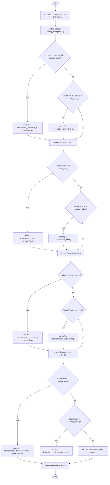
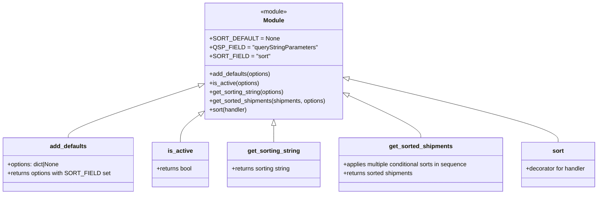

# Diagram: shipment_core/shipment_service/shipment_service/fvshared/sorting.py

> Auto-generated by Obscura crawlers

## Diagram 1

### SVG

<svg id="container" width="966.515625" xmlns="http://www.w3.org/2000/svg" class="flowchart" height="4181.234375" viewBox="0 0 966.515625 4181.234375" role="graphics-document document" aria-roledescription="flowchart-v2"><g><marker id="container_flowchart-v2-pointEnd" class="marker flowchart-v2" viewBox="0 0 10 10" refX="5" refY="5" markerUnits="userSpaceOnUse" markerWidth="8" markerHeight="8" orient="auto"><path d="M 0 0 L 10 5 L 0 10 z" class="arrowMarkerPath" style="stroke-width: 1; stroke-dasharray: 1, 0;"></path></marker><marker id="container_flowchart-v2-pointStart" class="marker flowchart-v2" viewBox="0 0 10 10" refX="4.5" refY="5" markerUnits="userSpaceOnUse" markerWidth="8" markerHeight="8" orient="auto"><path d="M 0 5 L 10 10 L 10 0 z" class="arrowMarkerPath" style="stroke-width: 1; stroke-dasharray: 1, 0;"></path></marker><marker id="container_flowchart-v2-circleEnd" class="marker flowchart-v2" viewBox="0 0 10 10" refX="11" refY="5" markerUnits="userSpaceOnUse" markerWidth="11" markerHeight="11" orient="auto"><circle cx="5" cy="5" r="5" class="arrowMarkerPath" style="stroke-width: 1; stroke-dasharray: 1, 0;"></circle></marker><marker id="container_flowchart-v2-circleStart" class="marker flowchart-v2" viewBox="0 0 10 10" refX="-1" refY="5" markerUnits="userSpaceOnUse" markerWidth="11" markerHeight="11" orient="auto"><circle cx="5" cy="5" r="5" class="arrowMarkerPath" style="stroke-width: 1; stroke-dasharray: 1, 0;"></circle></marker><marker id="container_flowchart-v2-crossEnd" class="marker cross flowchart-v2" viewBox="0 0 11 11" refX="12" refY="5.2" markerUnits="userSpaceOnUse" markerWidth="11" markerHeight="11" orient="auto"><path d="M 1,1 l 9,9 M 10,1 l -9,9" class="arrowMarkerPath" style="stroke-width: 2; stroke-dasharray: 1, 0;"></path></marker><marker id="container_flowchart-v2-crossStart" class="marker cross flowchart-v2" viewBox="0 0 11 11" refX="-1" refY="5.2" markerUnits="userSpaceOnUse" markerWidth="11" markerHeight="11" orient="auto"><path d="M 1,1 l 9,9 M 10,1 l -9,9" class="arrowMarkerPath" style="stroke-width: 2; stroke-dasharray: 1, 0;"></path></marker><g class="root"><g class="clusters"></g><g class="edgePaths"><path d="M492.914,47.5L492.831,51.583C492.747,55.667,492.581,63.833,492.497,71.417C492.414,79,492.414,86,492.414,89.5L492.414,93" id="L_Start_GetSorting_0" class="edge-thickness-normal edge-pattern-solid edge-thickness-normal edge-pattern-solid flowchart-link" style=";" data-edge="true" data-et="edge" data-id="L_Start_GetSorting_0" data-points="W3sieCI6NDkyLjkxNDA2MjUsInkiOjQ3LjV9LHsieCI6NDkyLjQxNDA2MjUsInkiOjcyfSx7IngiOjQ5Mi40MTQwNjI1LCJ5Ijo5N31d" marker-end="url(#container_flowchart-v2-pointEnd)"></path><path d="M492.414,175L492.414,179.167C492.414,183.333,492.414,191.667,492.414,199.333C492.414,207,492.414,214,492.414,217.5L492.414,221" id="L_GetSorting_ToLower_0" class="edge-thickness-normal edge-pattern-solid edge-thickness-normal edge-pattern-solid flowchart-link" style=";" data-edge="true" data-et="edge" data-id="L_GetSorting_ToLower_0" data-points="W3sieCI6NDkyLjQxNDA2MjUsInkiOjE3NX0seyJ4Ijo0OTIuNDE0MDYyNSwieSI6MjAwfSx7IngiOjQ5Mi40MTQwNjI1LCJ5IjoyMjV9XQ==" marker-end="url(#container_flowchart-v2-pointEnd)"></path><path d="M492.414,303L492.414,307.167C492.414,311.333,492.414,319.667,492.414,327.333C492.414,335,492.414,342,492.414,345.5L492.414,349" id="L_ToLower_CheckCreatorNeg_0" class="edge-thickness-normal edge-pattern-solid edge-thickness-normal edge-pattern-solid flowchart-link" style=";" data-edge="true" data-et="edge" data-id="L_ToLower_CheckCreatorNeg_0" data-points="W3sieCI6NDkyLjQxNDA2MjUsInkiOjMwM30seyJ4Ijo0OTIuNDE0MDYyNSwieSI6MzI4fSx7IngiOjQ5Mi40MTQwNjI1LCJ5IjozNTN9XQ==" marker-end="url(#container_flowchart-v2-pointEnd)"></path><path d="M411.915,550.501L384.967,570.084C358.02,589.667,304.125,628.834,277.178,677.75C250.23,726.667,250.23,785.333,250.23,844C250.23,902.667,250.23,961.333,250.23,996.167C250.23,1031,250.23,1042,250.23,1047.5L250.23,1053" id="L_CheckCreatorNeg_SortCreatorDesc_0" class="edge-thickness-normal edge-pattern-solid edge-thickness-normal edge-pattern-solid flowchart-link" style=";" data-edge="true" data-et="edge" data-id="L_CheckCreatorNeg_SortCreatorDesc_0" data-points="W3sieCI6NDExLjkxNDY4MzY3NjAzMSwieSI6NTUwLjUwMDYyMTE3NjAzMX0seyJ4IjoyNTAuMjMwNDY4NzUsInkiOjY2OH0seyJ4IjoyNTAuMjMwNDY4NzUsInkiOjg0NH0seyJ4IjoyNTAuMjMwNDY4NzUsInkiOjEwMjB9LHsieCI6MjUwLjIzMDQ2ODc1LCJ5IjoxMDU3fV0=" marker-end="url(#container_flowchart-v2-pointEnd)"></path><path d="M557.505,565.909L572.49,582.924C587.474,599.94,617.444,633.97,632.429,656.485C647.414,679,647.414,690,647.414,695.5L647.414,701" id="L_CheckCreatorNeg_CheckCreatorPos_0" class="edge-thickness-normal edge-pattern-solid edge-thickness-normal edge-pattern-solid flowchart-link" style=";" data-edge="true" data-et="edge" data-id="L_CheckCreatorNeg_CheckCreatorPos_0" data-points="W3sieCI6NTU3LjUwNDY5Njk0MTA4NzYsInkiOjU2NS45MDkzNjU1NTg5MTI0fSx7IngiOjY0Ny40MTQwNjI1LCJ5Ijo2Njh9LHsieCI6NjQ3LjQxNDA2MjUsInkiOjcwNX1d" marker-end="url(#container_flowchart-v2-pointEnd)"></path><path d="M601.368,936.954L594.512,950.795C587.656,964.636,573.943,992.318,567.087,1013.659C560.23,1035,560.23,1050,560.23,1057.5L560.23,1065" id="L_CheckCreatorPos_SortCreatorAsc_0" class="edge-thickness-normal edge-pattern-solid edge-thickness-normal edge-pattern-solid flowchart-link" style=";" data-edge="true" data-et="edge" data-id="L_CheckCreatorPos_SortCreatorAsc_0" data-points="W3sieCI6NjAxLjM2ODE4NDk0ODk3OTUsInkiOjkzNi45NTQxMjI0NDg5Nzk1fSx7IngiOjU2MC4yMzA0Njg3NSwieSI6MTAyMH0seyJ4Ijo1NjAuMjMwNDY4NzUsInkiOjEwNjl9XQ==" marker-end="url(#container_flowchart-v2-pointEnd)"></path><path d="M693.46,936.954L700.316,950.795C707.173,964.636,720.885,992.318,727.741,1020.826C734.598,1049.333,734.598,1078.667,734.598,1106C734.598,1133.333,734.598,1158.667,721.265,1175.309C707.932,1191.952,681.266,1199.905,667.933,1203.881L654.6,1207.857" id="L_CheckCreatorPos_NextCarrierCheck_0" class="edge-thickness-normal edge-pattern-solid edge-thickness-normal edge-pattern-solid flowchart-link" style=";" data-edge="true" data-et="edge" data-id="L_CheckCreatorPos_NextCarrierCheck_0" data-points="W3sieCI6NjkzLjQ1OTk0MDA1MTAyMDUsInkiOjkzNi45NTQxMjI0NDg5Nzk1fSx7IngiOjczNC41OTc2NTYyNSwieSI6MTAyMH0seyJ4Ijo3MzQuNTk3NjU2MjUsInkiOjExMDh9LHsieCI6NzM0LjU5NzY1NjI1LCJ5IjoxMTg0fSx7IngiOjY1MC43NjcyNzc2NDQyMzA3LCJ5IjoxMjA5fV0=" marker-end="url(#container_flowchart-v2-pointEnd)"></path><path d="M250.23,1159L250.23,1163.167C250.23,1167.333,250.23,1175.667,280.954,1184.987C311.679,1194.307,373.127,1204.615,403.851,1209.769L434.575,1214.922" id="L_SortCreatorDesc_NextCarrierCheck_0" class="edge-thickness-normal edge-pattern-solid edge-thickness-normal edge-pattern-solid flowchart-link" style=";" data-edge="true" data-et="edge" data-id="L_SortCreatorDesc_NextCarrierCheck_0" data-points="W3sieCI6MjUwLjIzMDQ2ODc1LCJ5IjoxMTU5fSx7IngiOjI1MC4yMzA0Njg3NSwieSI6MTE4NH0seyJ4Ijo0MzguNTE5NTMxMjUsInkiOjEyMTUuNTgzOTcxNzc0MTkzNX1d" marker-end="url(#container_flowchart-v2-pointEnd)"></path><path d="M560.23,1147L560.23,1153.167C560.23,1159.333,560.23,1171.667,560.23,1181.333C560.23,1191,560.23,1198,560.23,1201.5L560.23,1205" id="L_SortCreatorAsc_NextCarrierCheck_0" class="edge-thickness-normal edge-pattern-solid edge-thickness-normal edge-pattern-solid flowchart-link" style=";" data-edge="true" data-et="edge" data-id="L_SortCreatorAsc_NextCarrierCheck_0" data-points="W3sieCI6NTYwLjIzMDQ2ODc1LCJ5IjoxMTQ3fSx7IngiOjU2MC4yMzA0Njg3NSwieSI6MTE4NH0seyJ4Ijo1NjAuMjMwNDY4NzUsInkiOjEyMDl9XQ==" marker-end="url(#container_flowchart-v2-pointEnd)"></path><path d="M560.23,1263L560.23,1267.167C560.23,1271.333,560.23,1279.667,560.23,1287.333C560.23,1295,560.23,1302,560.23,1305.5L560.23,1309" id="L_NextCarrierCheck_CheckCarrierNeg_0" class="edge-thickness-normal edge-pattern-solid edge-thickness-normal edge-pattern-solid flowchart-link" style=";" data-edge="true" data-et="edge" data-id="L_NextCarrierCheck_CheckCarrierNeg_0" data-points="W3sieCI6NTYwLjIzMDQ2ODc1LCJ5IjoxMjYzfSx7IngiOjU2MC4yMzA0Njg3NSwieSI6MTI4OH0seyJ4Ijo1NjAuMjMwNDY4NzUsInkiOjEzMTN9XQ==" marker-end="url(#container_flowchart-v2-pointEnd)"></path><path d="M472.275,1503.045L436.39,1523.871C400.505,1544.697,328.735,1586.348,292.85,1636.507C256.965,1686.667,256.965,1745.333,256.965,1804C256.965,1862.667,256.965,1921.333,256.965,1956.167C256.965,1991,256.965,2002,256.965,2007.5L256.965,2013" id="L_CheckCarrierNeg_SortCarrierDesc_0" class="edge-thickness-normal edge-pattern-solid edge-thickness-normal edge-pattern-solid flowchart-link" style=";" data-edge="true" data-et="edge" data-id="L_CheckCarrierNeg_SortCarrierDesc_0" data-points="W3sieCI6NDcyLjI3NTIzMTI0NDcwMjIsInkiOjE1MDMuMDQ0NzYyNDk0NzAyMX0seyJ4IjoyNTYuOTY0ODQzNzUsInkiOjE2Mjh9LHsieCI6MjU2Ljk2NDg0Mzc1LCJ5IjoxODA0fSx7IngiOjI1Ni45NjQ4NDM3NSwieSI6MTk4MH0seyJ4IjoyNTYuOTY0ODQzNzUsInkiOjIwMTd9XQ==" marker-end="url(#container_flowchart-v2-pointEnd)"></path><path d="M625.321,1525.909L640.306,1542.924C655.291,1559.94,685.261,1593.97,700.246,1616.485C715.23,1639,715.23,1650,715.23,1655.5L715.23,1661" id="L_CheckCarrierNeg_CheckCarrierPos_0" class="edge-thickness-normal edge-pattern-solid edge-thickness-normal edge-pattern-solid flowchart-link" style=";" data-edge="true" data-et="edge" data-id="L_CheckCarrierNeg_CheckCarrierPos_0" data-points="W3sieCI6NjI1LjMyMTEwMzE5MTA4NzYsInkiOjE1MjUuOTA5MzY1NTU4OTEyNH0seyJ4Ijo3MTUuMjMwNDY4NzUsInkiOjE2Mjh9LHsieCI6NzE1LjIzMDQ2ODc1LCJ5IjoxNjY1fV0=" marker-end="url(#container_flowchart-v2-pointEnd)"></path><path d="M651.675,1879.444L637.556,1896.204C623.438,1912.963,595.201,1946.481,581.083,1970.741C566.965,1995,566.965,2010,566.965,2017.5L566.965,2025" id="L_CheckCarrierPos_SortCarrierAsc_0" class="edge-thickness-normal edge-pattern-solid edge-thickness-normal edge-pattern-solid flowchart-link" style=";" data-edge="true" data-et="edge" data-id="L_CheckCarrierPos_SortCarrierAsc_0" data-points="W3sieCI6NjUxLjY3NDc5MDA1Mjk0NDEsInkiOjE4NzkuNDQ0MzIxMzAyOTQ0Mn0seyJ4Ijo1NjYuOTY0ODQzNzUsInkiOjE5ODB9LHsieCI6NTY2Ljk2NDg0Mzc1LCJ5IjoyMDI5fV0=" marker-end="url(#container_flowchart-v2-pointEnd)"></path><path d="M733.182,1925.048L734.541,1934.207C735.899,1943.365,738.615,1961.683,739.974,1985.508C741.332,2009.333,741.332,2038.667,741.332,2066C741.332,2093.333,741.332,2118.667,732.861,2135.222C724.389,2151.777,707.446,2159.554,698.975,2163.443L690.503,2167.331" id="L_CheckCarrierPos_NextOriginCheck_0" class="edge-thickness-normal edge-pattern-solid edge-thickness-normal edge-pattern-solid flowchart-link" style=";" data-edge="true" data-et="edge" data-id="L_CheckCarrierPos_NextOriginCheck_0" data-points="W3sieCI6NzMzLjE4MjQxODk2MDY3NjgsInkiOjE5MjUuMDQ4MDQ5Nzg5MzIzMn0seyJ4Ijo3NDEuMzMyMDMxMjUsInkiOjE5ODB9LHsieCI6NzQxLjMzMjAzMTI1LCJ5IjoyMDY4fSx7IngiOjc0MS4zMzIwMzEyNSwieSI6MjE0NH0seyJ4Ijo2ODYuODY4MDEzODIyMTE1NCwieSI6MjE2OX1d" marker-end="url(#container_flowchart-v2-pointEnd)"></path><path d="M256.965,2119L256.965,2123.167C256.965,2127.333,256.965,2135.667,298.343,2145.632C339.721,2155.597,422.478,2167.193,463.856,2172.992L505.234,2178.79" id="L_SortCarrierDesc_NextOriginCheck_0" class="edge-thickness-normal edge-pattern-solid edge-thickness-normal edge-pattern-solid flowchart-link" style=";" data-edge="true" data-et="edge" data-id="L_SortCarrierDesc_NextOriginCheck_0" data-points="W3sieCI6MjU2Ljk2NDg0Mzc1LCJ5IjoyMTE5fSx7IngiOjI1Ni45NjQ4NDM3NSwieSI6MjE0NH0seyJ4Ijo1MDkuMTk1MzEyNSwieSI6MjE3OS4zNDUyNDI0ODEzNDEzfV0=" marker-end="url(#container_flowchart-v2-pointEnd)"></path><path d="M566.965,2107L566.965,2113.167C566.965,2119.333,566.965,2131.667,571.352,2141.568C575.738,2151.469,584.512,2158.938,588.899,2162.673L593.285,2166.407" id="L_SortCarrierAsc_NextOriginCheck_0" class="edge-thickness-normal edge-pattern-solid edge-thickness-normal edge-pattern-solid flowchart-link" style=";" data-edge="true" data-et="edge" data-id="L_SortCarrierAsc_NextOriginCheck_0" data-points="W3sieCI6NTY2Ljk2NDg0Mzc1LCJ5IjoyMTA3fSx7IngiOjU2Ni45NjQ4NDM3NSwieSI6MjE0NH0seyJ4Ijo1OTYuMzMxMjA0OTI3ODg0NiwieSI6MjE2OX1d" marker-end="url(#container_flowchart-v2-pointEnd)"></path><path d="M628.047,2223L628.047,2227.167C628.047,2231.333,628.047,2239.667,628.047,2247.333C628.047,2255,628.047,2262,628.047,2265.5L628.047,2269" id="L_NextOriginCheck_CheckOriginNeg_0" class="edge-thickness-normal edge-pattern-solid edge-thickness-normal edge-pattern-solid flowchart-link" style=";" data-edge="true" data-et="edge" data-id="L_NextOriginCheck_CheckOriginNeg_0" data-points="W3sieCI6NjI4LjA0Njg3NSwieSI6MjIyM30seyJ4Ijo2MjguMDQ2ODc1LCJ5IjoyMjQ4fSx7IngiOjYyOC4wNDY4NzUsInkiOjIyNzN9XQ==" marker-end="url(#container_flowchart-v2-pointEnd)"></path><path d="M543.295,2428.17L494.451,2448.462C445.607,2468.754,347.919,2509.338,299.075,2555.239C250.23,2601.141,250.23,2652.359,250.23,2703.578C250.23,2754.797,250.23,2806.016,250.23,2837.125C250.23,2868.234,250.23,2879.234,250.23,2884.734L250.23,2890.234" id="L_CheckOriginNeg_SortOriginDesc_0" class="edge-thickness-normal edge-pattern-solid edge-thickness-normal edge-pattern-solid flowchart-link" style=";" data-edge="true" data-et="edge" data-id="L_CheckOriginNeg_SortOriginDesc_0" data-points="W3sieCI6NTQzLjI5NTMyMjE3ODM4NTQsInkiOjI0MjguMTcwMzIyMTc4Mzg1NX0seyJ4IjoyNTAuMjMwNDY4NzUsInkiOjI1NDkuOTIxODc1fSx7IngiOjI1MC4yMzA0Njg3NSwieSI6MjcwMy41NzgxMjV9LHsieCI6MjUwLjIzMDQ2ODc1LCJ5IjoyODU3LjIzNDM3NX0seyJ4IjoyNTAuMjMwNDY4NzUsInkiOjI4OTQuMjM0Mzc1fV0=" marker-end="url(#container_flowchart-v2-pointEnd)"></path><path d="M645.151,2495.818L646.651,2504.835C648.15,2513.852,651.149,2531.887,652.649,2546.404C654.148,2560.922,654.148,2571.922,654.148,2577.422L654.148,2582.922" id="L_CheckOriginNeg_CheckOriginPos_0" class="edge-thickness-normal edge-pattern-solid edge-thickness-normal edge-pattern-solid flowchart-link" style=";" data-edge="true" data-et="edge" data-id="L_CheckOriginNeg_CheckOriginPos_0" data-points="W3sieCI6NjQ1LjE1MTI0MDQ5MTEwMTksInkiOjI0OTUuODE3NTA5NTA4ODk4fSx7IngiOjY1NC4xNDg0Mzc1LCJ5IjoyNTQ5LjkyMTg3NX0seyJ4Ijo2NTQuMTQ4NDM3NSwieSI6MjU4Ni45MjE4NzV9XQ==" marker-end="url(#container_flowchart-v2-pointEnd)"></path><path d="M609.895,2775.981L601.617,2789.523C593.34,2803.065,576.785,2830.15,568.508,2851.192C560.23,2872.234,560.23,2887.234,560.23,2894.734L560.23,2902.234" id="L_CheckOriginPos_SortOriginAsc_0" class="edge-thickness-normal edge-pattern-solid edge-thickness-normal edge-pattern-solid flowchart-link" style=";" data-edge="true" data-et="edge" data-id="L_CheckOriginPos_SortOriginAsc_0" data-points="W3sieCI6NjA5Ljg5NDU2NDQ3MDI4OTksInkiOjI3NzUuOTgwNTAxOTcwMjl9LHsieCI6NTYwLjIzMDQ2ODc1LCJ5IjoyODU3LjIzNDM3NX0seyJ4Ijo1NjAuMjMwNDY4NzUsInkiOjI5MDYuMjM0Mzc1fV0=" marker-end="url(#container_flowchart-v2-pointEnd)"></path><path d="M694.237,2780.146L700.964,2792.994C707.69,2805.842,721.144,2831.538,727.871,2859.053C734.598,2886.568,734.598,2915.901,734.598,2943.234C734.598,2970.568,734.598,2995.901,724.307,3012.497C714.016,3029.092,693.435,3036.95,683.144,3040.879L672.853,3044.808" id="L_CheckOriginPos_NextDestinationCheck_0" class="edge-thickness-normal edge-pattern-solid edge-thickness-normal edge-pattern-solid flowchart-link" style=";" data-edge="true" data-et="edge" data-id="L_CheckOriginPos_NextDestinationCheck_0" data-points="W3sieCI6Njk0LjIzNjc5NjkyNTgzOTcsInkiOjI3ODAuMTQ2MDE1NTc0MTZ9LHsieCI6NzM0LjU5NzY1NjI1LCJ5IjoyODU3LjIzNDM3NX0seyJ4Ijo3MzQuNTk3NjU2MjUsInkiOjI5NDUuMjM0Mzc1fSx7IngiOjczNC41OTc2NTYyNSwieSI6MzAyMS4yMzQzNzV9LHsieCI6NjY5LjExNjA4ODg2NzE4NzUsInkiOjMwNDYuMjM0Mzc1fV0=" marker-end="url(#container_flowchart-v2-pointEnd)"></path><path d="M250.23,2996.234L250.23,3000.401C250.23,3004.568,250.23,3012.901,280.699,3023.224C311.168,3033.548,372.106,3045.861,402.575,3052.017L433.044,3058.174" id="L_SortOriginDesc_NextDestinationCheck_0" class="edge-thickness-normal edge-pattern-solid edge-thickness-normal edge-pattern-solid flowchart-link" style=";" data-edge="true" data-et="edge" data-id="L_SortOriginDesc_NextDestinationCheck_0" data-points="W3sieCI6MjUwLjIzMDQ2ODc1LCJ5IjoyOTk2LjIzNDM3NX0seyJ4IjoyNTAuMjMwNDY4NzUsInkiOjMwMjEuMjM0Mzc1fSx7IngiOjQzNi45NjQ4NDM3NSwieSI6MzA1OC45NjYzMDczMTcxMDN9XQ==" marker-end="url(#container_flowchart-v2-pointEnd)"></path><path d="M560.23,2984.234L560.23,2990.401C560.23,2996.568,560.23,3008.901,560.599,3018.571C560.968,3028.242,561.705,3035.249,562.074,3038.753L562.442,3042.256" id="L_SortOriginAsc_NextDestinationCheck_0" class="edge-thickness-normal edge-pattern-solid edge-thickness-normal edge-pattern-solid flowchart-link" style=";" data-edge="true" data-et="edge" data-id="L_SortOriginAsc_NextDestinationCheck_0" data-points="W3sieCI6NTYwLjIzMDQ2ODc1LCJ5IjoyOTg0LjIzNDM3NX0seyJ4Ijo1NjAuMjMwNDY4NzUsInkiOjMwMjEuMjM0Mzc1fSx7IngiOjU2Mi44NjEwODM5ODQzNzUsInkiOjMwNDYuMjM0Mzc1fV0=" marker-end="url(#container_flowchart-v2-pointEnd)"></path><path d="M566.965,3124.234L566.965,3128.401C566.965,3132.568,566.965,3140.901,566.965,3148.568C566.965,3156.234,566.965,3163.234,566.965,3166.734L566.965,3170.234" id="L_NextDestinationCheck_CheckDestNeg_0" class="edge-thickness-normal edge-pattern-solid edge-thickness-normal edge-pattern-solid flowchart-link" style=";" data-edge="true" data-et="edge" data-id="L_NextDestinationCheck_CheckDestNeg_0" data-points="W3sieCI6NTY2Ljk2NDg0Mzc1LCJ5IjozMTI0LjIzNDM3NX0seyJ4Ijo1NjYuOTY0ODQzNzUsInkiOjMxNDkuMjM0Mzc1fSx7IngiOjU2Ni45NjQ4NDM3NSwieSI6MzE3NC4yMzQzNzV9XQ==" marker-end="url(#container_flowchart-v2-pointEnd)"></path><path d="M469.666,3354.935L417.44,3377.319C365.215,3399.702,260.764,3444.468,208.538,3496.185C156.313,3547.901,156.313,3606.568,156.313,3665.234C156.313,3723.901,156.313,3782.568,156.313,3817.401C156.313,3852.234,156.313,3863.234,156.313,3868.734L156.313,3874.234" id="L_CheckDestNeg_SortDestDesc_0" class="edge-thickness-normal edge-pattern-solid edge-thickness-normal edge-pattern-solid flowchart-link" style=";" data-edge="true" data-et="edge" data-id="L_CheckDestNeg_SortDestDesc_0" data-points="W3sieCI6NDY5LjY2NTg2MTg0MTI2MiwieSI6MzM1NC45MzUzOTMwOTEyNjJ9LHsieCI6MTU2LjMxMjUsInkiOjM0ODkuMjM0Mzc1fSx7IngiOjE1Ni4zMTI1LCJ5IjozNjY1LjIzNDM3NX0seyJ4IjoxNTYuMzEyNSwieSI6Mzg0MS4yMzQzNzV9LHsieCI6MTU2LjMxMjUsInkiOjM4NzguMjM0Mzc1fV0=" marker-end="url(#container_flowchart-v2-pointEnd)"></path><path d="M616.706,3402.494L624.762,3416.95C632.818,3431.407,648.931,3460.321,656.987,3480.278C665.043,3500.234,665.043,3511.234,665.043,3516.734L665.043,3522.234" id="L_CheckDestNeg_CheckDestPos_0" class="edge-thickness-normal edge-pattern-solid edge-thickness-normal edge-pattern-solid flowchart-link" style=";" data-edge="true" data-et="edge" data-id="L_CheckDestNeg_CheckDestPos_0" data-points="W3sieCI6NjE2LjcwNTYyMjQ5NjkzNTgsInkiOjM0MDIuNDkzNTk2MjUzMDY0NH0seyJ4Ijo2NjUuMDQyOTY4NzUsInkiOjM0ODkuMjM0Mzc1fSx7IngiOjY2NS4wNDI5Njg3NSwieSI6MzUyNi4yMzQzNzV9XQ==" marker-end="url(#container_flowchart-v2-pointEnd)"></path><path d="M598.108,3737.299L582.018,3754.622C565.929,3771.944,533.749,3806.589,517.66,3831.412C501.57,3856.234,501.57,3871.234,501.57,3878.734L501.57,3886.234" id="L_CheckDestPos_SortDestAsc_0" class="edge-thickness-normal edge-pattern-solid edge-thickness-normal edge-pattern-solid flowchart-link" style=";" data-edge="true" data-et="edge" data-id="L_CheckDestPos_SortDestAsc_0" data-points="W3sieCI6NTk4LjEwNzY4MzA5MzI0ODQsInkiOjM3MzcuMjk5MDg5MzQzMjQ4NH0seyJ4Ijo1MDEuNTcwMzEyNSwieSI6Mzg0MS4yMzQzNzV9LHsieCI6NTAxLjU3MDMxMjUsInkiOjM4OTAuMjM0Mzc1fV0=" marker-end="url(#container_flowchart-v2-pointEnd)"></path><path d="M731.978,3737.299L748.068,3754.622C764.157,3771.944,796.337,3806.589,812.426,3831.412C828.516,3856.234,828.516,3871.234,828.516,3878.734L828.516,3886.234" id="L_CheckDestPos_ReturnUnchanged_0" class="edge-thickness-normal edge-pattern-solid edge-thickness-normal edge-pattern-solid flowchart-link" style=";" data-edge="true" data-et="edge" data-id="L_CheckDestPos_ReturnUnchanged_0" data-points="W3sieCI6NzMxLjk3ODI1NDQwNjc1MTYsInkiOjM3MzcuMjk5MDg5MzQzMjQ4NH0seyJ4Ijo4MjguNTE1NjI1LCJ5IjozODQxLjIzNDM3NX0seyJ4Ijo4MjguNTE1NjI1LCJ5IjozODkwLjIzNDM3NX1d" marker-end="url(#container_flowchart-v2-pointEnd)"></path><path d="M156.313,3980.234L156.313,3984.401C156.313,3988.568,156.313,3996.901,191.117,4006.453C225.922,4016.004,295.531,4026.774,330.336,4032.158L365.141,4037.543" id="L_SortDestDesc_ReturnSorted_0" class="edge-thickness-normal edge-pattern-solid edge-thickness-normal edge-pattern-solid flowchart-link" style=";" data-edge="true" data-et="edge" data-id="L_SortDestDesc_ReturnSorted_0" data-points="W3sieCI6MTU2LjMxMjUsInkiOjM5ODAuMjM0Mzc1fSx7IngiOjE1Ni4zMTI1LCJ5Ijo0MDA1LjIzNDM3NX0seyJ4IjozNjkuMDkzNzUsInkiOjQwMzguMTU0ODU1Njk1NDc0NX1d" marker-end="url(#container_flowchart-v2-pointEnd)"></path><path d="M501.57,3968.234L501.57,3974.401C501.57,3980.568,501.57,3992.901,500.952,4002.578C500.334,4012.255,499.098,4019.275,498.48,4022.785L497.862,4026.295" id="L_SortDestAsc_ReturnSorted_0" class="edge-thickness-normal edge-pattern-solid edge-thickness-normal edge-pattern-solid flowchart-link" style=";" data-edge="true" data-et="edge" data-id="L_SortDestAsc_ReturnSorted_0" data-points="W3sieCI6NTAxLjU3MDMxMjUsInkiOjM5NjguMjM0Mzc1fSx7IngiOjUwMS41NzAzMTI1LCJ5Ijo0MDA1LjIzNDM3NX0seyJ4Ijo0OTcuMTY4MjY5MjMwNzY5MiwieSI6NDAzMC4yMzQzNzV9XQ==" marker-end="url(#container_flowchart-v2-pointEnd)"></path><path d="M828.516,3968.234L828.516,3974.401C828.516,3980.568,828.516,3992.901,793.711,4004.453C758.906,4016.004,689.297,4026.774,654.492,4032.158L619.687,4037.543" id="L_ReturnUnchanged_ReturnSorted_0" class="edge-thickness-normal edge-pattern-solid edge-thickness-normal edge-pattern-solid flowchart-link" style=";" data-edge="true" data-et="edge" data-id="L_ReturnUnchanged_ReturnSorted_0" data-points="W3sieCI6ODI4LjUxNTYyNSwieSI6Mzk2OC4yMzQzNzV9LHsieCI6ODI4LjUxNTYyNSwieSI6NDAwNS4yMzQzNzV9LHsieCI6NjE1LjczNDM3NSwieSI6NDAzOC4xNTQ4NTU2OTU0NzQ1fV0=" marker-end="url(#container_flowchart-v2-pointEnd)"></path><path d="M492.414,4084.234L492.414,4088.401C492.414,4092.568,492.414,4100.901,492.484,4108.651C492.555,4116.401,492.695,4123.568,492.765,4127.152L492.836,4130.735" id="L_ReturnSorted_End_0" class="edge-thickness-normal edge-pattern-solid edge-thickness-normal edge-pattern-solid flowchart-link" style=";" data-edge="true" data-et="edge" data-id="L_ReturnSorted_End_0" data-points="W3sieCI6NDkyLjQxNDA2MjUsInkiOjQwODQuMjM0Mzc1fSx7IngiOjQ5Mi40MTQwNjI1LCJ5Ijo0MTA5LjIzNDM3NX0seyJ4Ijo0OTIuOTE0MDYyNSwieSI6NDEzNC43MzQzNzV9XQ==" marker-end="url(#container_flowchart-v2-pointEnd)"></path></g><g class="edgeLabels"><g class="edgeLabel"><g class="label" data-id="L_Start_GetSorting_0" transform="translate(0, 0)"><foreignObject width="0" height="0">

</foreignObject></g></g><g class="edgeLabel"><g class="label" data-id="L_GetSorting_ToLower_0" transform="translate(0, 0)"><foreignObject width="0" height="0">

</foreignObject></g></g><g class="edgeLabel"><g class="label" data-id="L_ToLower_CheckCreatorNeg_0" transform="translate(0, 0)"><foreignObject width="0" height="0">

</foreignObject></g></g><g class="edgeLabel" transform="translate(250.23046875, 844)"><g class="label" data-id="L_CheckCreatorNeg_SortCreatorDesc_0" transform="translate(-12.0078125, -12)"><foreignObject width="24.015625" height="24">

yes

</foreignObject></g></g><g class="edgeLabel" transform="translate(647.4140625, 668)"><g class="label" data-id="L_CheckCreatorNeg_CheckCreatorPos_0" transform="translate(-9.3671875, -12)"><foreignObject width="18.734375" height="24">

no

</foreignObject></g></g><g class="edgeLabel" transform="translate(560.23046875, 1020)"><g class="label" data-id="L_CheckCreatorPos_SortCreatorAsc_0" transform="translate(-12.0078125, -12)"><foreignObject width="24.015625" height="24">

yes

</foreignObject></g></g><g class="edgeLabel" transform="translate(734.59765625, 1108)"><g class="label" data-id="L_CheckCreatorPos_NextCarrierCheck_0" transform="translate(-9.3671875, -12)"><foreignObject width="18.734375" height="24">

no

</foreignObject></g></g><g class="edgeLabel"><g class="label" data-id="L_SortCreatorDesc_NextCarrierCheck_0" transform="translate(0, 0)"><foreignObject width="0" height="0">

</foreignObject></g></g><g class="edgeLabel"><g class="label" data-id="L_SortCreatorAsc_NextCarrierCheck_0" transform="translate(0, 0)"><foreignObject width="0" height="0">

</foreignObject></g></g><g class="edgeLabel"><g class="label" data-id="L_NextCarrierCheck_CheckCarrierNeg_0" transform="translate(0, 0)"><foreignObject width="0" height="0">

</foreignObject></g></g><g class="edgeLabel" transform="translate(256.96484375, 1804)"><g class="label" data-id="L_CheckCarrierNeg_SortCarrierDesc_0" transform="translate(-12.0078125, -12)"><foreignObject width="24.015625" height="24">

yes

</foreignObject></g></g><g class="edgeLabel" transform="translate(715.23046875, 1628)"><g class="label" data-id="L_CheckCarrierNeg_CheckCarrierPos_0" transform="translate(-9.3671875, -12)"><foreignObject width="18.734375" height="24">

no

</foreignObject></g></g><g class="edgeLabel" transform="translate(566.96484375, 1980)"><g class="label" data-id="L_CheckCarrierPos_SortCarrierAsc_0" transform="translate(-12.0078125, -12)"><foreignObject width="24.015625" height="24">

yes

</foreignObject></g></g><g class="edgeLabel" transform="translate(741.33203125, 2068)"><g class="label" data-id="L_CheckCarrierPos_NextOriginCheck_0" transform="translate(-9.3671875, -12)"><foreignObject width="18.734375" height="24">

no

</foreignObject></g></g><g class="edgeLabel"><g class="label" data-id="L_SortCarrierDesc_NextOriginCheck_0" transform="translate(0, 0)"><foreignObject width="0" height="0">

</foreignObject></g></g><g class="edgeLabel"><g class="label" data-id="L_SortCarrierAsc_NextOriginCheck_0" transform="translate(0, 0)"><foreignObject width="0" height="0">

</foreignObject></g></g><g class="edgeLabel"><g class="label" data-id="L_NextOriginCheck_CheckOriginNeg_0" transform="translate(0, 0)"><foreignObject width="0" height="0">

</foreignObject></g></g><g class="edgeLabel" transform="translate(250.23046875, 2703.578125)"><g class="label" data-id="L_CheckOriginNeg_SortOriginDesc_0" transform="translate(-12.0078125, -12)"><foreignObject width="24.015625" height="24">

yes

</foreignObject></g></g><g class="edgeLabel" transform="translate(654.1484375, 2549.921875)"><g class="label" data-id="L_CheckOriginNeg_CheckOriginPos_0" transform="translate(-9.3671875, -12)"><foreignObject width="18.734375" height="24">

no

</foreignObject></g></g><g class="edgeLabel" transform="translate(560.23046875, 2857.234375)"><g class="label" data-id="L_CheckOriginPos_SortOriginAsc_0" transform="translate(-12.0078125, -12)"><foreignObject width="24.015625" height="24">

yes

</foreignObject></g></g><g class="edgeLabel" transform="translate(734.59765625, 2945.234375)"><g class="label" data-id="L_CheckOriginPos_NextDestinationCheck_0" transform="translate(-9.3671875, -12)"><foreignObject width="18.734375" height="24">

no

</foreignObject></g></g><g class="edgeLabel"><g class="label" data-id="L_SortOriginDesc_NextDestinationCheck_0" transform="translate(0, 0)"><foreignObject width="0" height="0">

</foreignObject></g></g><g class="edgeLabel"><g class="label" data-id="L_SortOriginAsc_NextDestinationCheck_0" transform="translate(0, 0)"><foreignObject width="0" height="0">

</foreignObject></g></g><g class="edgeLabel"><g class="label" data-id="L_NextDestinationCheck_CheckDestNeg_0" transform="translate(0, 0)"><foreignObject width="0" height="0">

</foreignObject></g></g><g class="edgeLabel" transform="translate(156.3125, 3665.234375)"><g class="label" data-id="L_CheckDestNeg_SortDestDesc_0" transform="translate(-12.0078125, -12)"><foreignObject width="24.015625" height="24">

yes

</foreignObject></g></g><g class="edgeLabel" transform="translate(665.04296875, 3489.234375)"><g class="label" data-id="L_CheckDestNeg_CheckDestPos_0" transform="translate(-9.3671875, -12)"><foreignObject width="18.734375" height="24">

no

</foreignObject></g></g><g class="edgeLabel" transform="translate(501.5703125, 3841.234375)"><g class="label" data-id="L_CheckDestPos_SortDestAsc_0" transform="translate(-12.0078125, -12)"><foreignObject width="24.015625" height="24">

yes

</foreignObject></g></g><g class="edgeLabel" transform="translate(828.515625, 3841.234375)"><g class="label" data-id="L_CheckDestPos_ReturnUnchanged_0" transform="translate(-9.3671875, -12)"><foreignObject width="18.734375" height="24">

no

</foreignObject></g></g><g class="edgeLabel"><g class="label" data-id="L_SortDestDesc_ReturnSorted_0" transform="translate(0, 0)"><foreignObject width="0" height="0">

</foreignObject></g></g><g class="edgeLabel"><g class="label" data-id="L_SortDestAsc_ReturnSorted_0" transform="translate(0, 0)"><foreignObject width="0" height="0">

</foreignObject></g></g><g class="edgeLabel"><g class="label" data-id="L_ReturnUnchanged_ReturnSorted_0" transform="translate(0, 0)"><foreignObject width="0" height="0">

</foreignObject></g></g><g class="edgeLabel"><g class="label" data-id="L_ReturnSorted_End_0" transform="translate(0, 0)"><foreignObject width="0" height="0">

</foreignObject></g></g></g><g class="nodes"><g class="node default" id="flowchart-Start-0" transform="translate(492.4140625, 27.5)"><g class="basic label-container outer-path"><path d="M-9.7734375 -19.5 C-3.935099131810188 -19.5, 1.9032392363796244 -19.5, 9.7734375 -19.5 C9.7734375 -19.5, 9.773437499999998 -19.5, 9.773437499999998 -19.5 C10.22483684522339 -19.48552450159421, 10.67623619044678 -19.471049003188423, 11.0228067896239 -19.45993515863156 C11.431077439326671 -19.420549780072026, 11.839348089029441 -19.381164401512496, 12.267042152847864 -19.3399052695533 C12.682213168275677 -19.27278363947824, 13.09738418370349 -19.205662009403184, 13.501030759676757 -19.140403561325776 C13.82426752617733 -19.066626878689046, 14.147504292677905 -18.99285019605232, 14.71970188623539 -18.862249829261074 C15.162180794313572 -18.730924411962654, 15.604659702391755 -18.599598994664234, 15.918047751460602 -18.50658706670804 C16.33140951495785 -18.354466116666796, 16.744771278455104 -18.202345166625552, 17.091144095147794 -18.074876768247425 C17.388624106469514 -17.943191191666305, 17.68610411779123 -17.81150561508518, 18.23417041279238 -17.568892924097174 C18.546694815494053 -17.405849143389144, 18.85921921819573 -17.242805362681118, 19.342429764076783 -16.990714730406097 C19.680210562870094 -16.785950025157284, 20.017991361663405 -16.58118531990847, 20.411368073605697 -16.342718045390892 C20.643442293641446 -16.180833115825024, 20.87551651367719 -16.018948186259152, 21.436592844578712 -15.627565626425154 C21.765387323713313 -15.365360778903858, 22.094181802847913 -15.103155931382563, 22.41389120850187 -14.848196188198123 C22.663566935730483 -14.621447298786839, 22.913242662959096 -14.394698409375556, 23.339247236767985 -14.007812326905688 C23.590573586382728 -13.748297236651416, 23.84189993599747 -13.488782146397144, 24.208858442968648 -13.10986736009568 C24.5042462728729 -12.762888007046474, 24.799634102777155 -12.415908653997267, 25.019151408126582 -12.158051136245305 C25.26157802668473 -11.833221552896678, 25.50400464524288 -11.50839196954805, 25.766796464640635 -11.156274872382312 C25.980628857974544 -10.827770894183976, 26.19446125130845 -10.499266915985642, 26.448721378604247 -10.108655082055241 C26.688044787908304 -9.683712134712842, 26.927368197212356 -9.258769187370444, 27.0621239742735 -9.019496659696287 C27.24702157756059 -8.635552830295698, 27.431919180847682 -8.25160900089511, 27.60448364880834 -7.893275190886684 C27.75632831044808 -7.518215940919715, 27.908172972087815 -7.143156690952747, 28.073571729970325 -6.734618561215508 C28.219053573128416 -6.296450429007225, 28.364535416286504 -5.858282296798944, 28.46746063421488 -5.548287939305138 C28.54029827592602 -5.270526443426958, 28.61313591763716 -4.992764947548778, 28.78453178754556 -4.339158212148133 C28.834637962177705 -4.081873595355823, 28.884744136809854 -3.824588978563513, 29.023482276581777 -3.1121979531509023 C29.055970276288143 -2.8602274429095105, 29.08845827599451 -2.6082569326681186, 29.183330202509367 -1.872449005199798 C29.201470722875047 -1.5898957577398465, 29.219611243240728 -1.307342510279895, 29.263418715913414 -0.6250057626472757 C29.263418715913414 -0.2519048118824273, 29.263418715913414 0.12119613888242109, 29.263418715913414 0.625005762647271 C29.231470627097803 1.1226230339835628, 29.199522538282192 1.6202403053198544, 29.183330202509367 1.8724490051997846 C29.141465258553186 2.197145243355664, 29.099600314597005 2.521841481511543, 29.023482276581777 3.1121979531508885 C28.96431948263955 3.4159863959833006, 28.90515668869732 3.7197748388157126, 28.78453178754556 4.339158212148129 C28.69531152255962 4.67939375084696, 28.606091257573684 5.019629289545792, 28.467460634214884 5.548287939305125 C28.38743424449323 5.789314674673088, 28.30740785477158 6.030341410041052, 28.07357172997033 6.734618561215495 C27.941702507989653 7.06033808902573, 27.809833286008978 7.386057616835964, 27.604483648808344 7.893275190886679 C27.45007145170384 8.213915422065927, 27.295659254599336 8.534555653245175, 27.062123974273504 9.019496659696284 C26.91827472503755 9.274915568030723, 26.774425475801596 9.530334476365162, 26.44872137860425 10.108655082055236 C26.287670731507994 10.356072124149144, 26.126620084411737 10.60348916624305, 25.76679646464064 11.156274872382301 C25.516570536939287 11.491554819451144, 25.266344609237933 11.826834766519985, 25.019151408126582 12.158051136245302 C24.83403348809559 12.375501178621757, 24.648915568064595 12.592951220998215, 24.20885844296866 13.10986736009567 C23.94233580403195 13.38507386671343, 23.675813165095235 13.66028037333119, 23.33924723676799 14.007812326905684 C23.123926566374823 14.20336086268401, 22.90860589598166 14.398909398462335, 22.413891208501887 14.848196188198111 C22.196514529154484 15.02154830534129, 21.979137849807078 15.194900422484467, 21.436592844578715 15.627565626425152 C21.032237787902712 15.909626209714048, 20.62788273122671 16.191686793002944, 20.411368073605708 16.34271804539089 C20.023772199088672 16.5776809422893, 19.636176324571633 16.812643839187718, 19.342429764076787 16.990714730406093 C18.95520917381877 17.192727464317077, 18.567988583560748 17.39474019822806, 18.234170412792388 17.56889292409717 C17.81173501451525 17.7558925438136, 17.38929961623811 17.942892163530033, 17.091144095147804 18.07487676824742 C16.74101822502799 18.203726324979577, 16.390892354908175 18.332575881711733, 15.918047751460616 18.506587066708033 C15.565537112907178 18.611210373864594, 15.213026474353741 18.715833681021156, 14.719701886235413 18.86224982926107 C14.286853962721366 18.961044543206476, 13.85400603920732 19.059839257151886, 13.501030759676766 19.140403561325773 C13.015683388859118 19.218870760314495, 12.530336018041472 19.297337959303217, 12.267042152847878 19.3399052695533 C12.008474699752195 19.36484896078058, 11.749907246656512 19.389792652007863, 11.0228067896239 19.45993515863156 C10.645486128907788 19.47203509781061, 10.268165468191674 19.484135036989667, 9.773437500000004 19.5 C9.773437500000002 19.5, 9.773437500000002 19.5, 9.7734375 19.5 C3.845420266783341 19.5, -2.082596966433318 19.5, -9.773437499999996 19.5 C-10.270177088504889 19.484070528241602, -10.766916677009782 19.468141056483205, -11.022806789623893 19.45993515863156 C-11.362743717018262 19.427141852079792, -11.70268064441263 19.39434854552803, -12.267042152847871 19.3399052695533 C-12.598712931257866 19.28628331024527, -12.930383709667861 19.232661350937246, -13.501030759676759 19.140403561325773 C-13.97297515748849 19.032685332250256, -14.444919555300222 18.92496710317474, -14.719701886235388 18.862249829261074 C-15.083771987100704 18.754195734367205, -15.44784208796602 18.64614163947334, -15.918047751460593 18.506587066708043 C-16.267731651441668 18.37790015907247, -16.617415551422745 18.2492132514369, -17.091144095147797 18.074876768247425 C-17.34100273930135 17.964271758273984, -17.590861383454904 17.853666748300544, -18.23417041279238 17.568892924097174 C-18.607648904205348 17.37404943435142, -18.98112739561832 17.179205944605666, -19.34242976407678 16.990714730406097 C-19.654044189867523 16.801812234242117, -19.965658615658267 16.612909738078134, -20.411368073605686 16.3427180453909 C-20.726656494312277 16.12278649172174, -21.041944915018863 15.90285493805258, -21.436592844578712 15.627565626425156 C-21.799795613864063 15.337921083151693, -22.16299838314941 15.04827653987823, -22.41389120850187 14.848196188198125 C-22.691664430282252 14.595929897653892, -22.96943765206263 14.34366360710966, -23.339247236767974 14.007812326905697 C-23.655220314473407 13.681544182302707, -23.97119339217884 13.355276037699717, -24.208858442968655 13.109867360095677 C-24.511696690486094 12.754136322577247, -24.814534938003533 12.398405285058818, -25.01915140812658 12.158051136245307 C-25.194399272842535 11.92323496293484, -25.369647137558495 11.688418789624372, -25.766796464640635 11.156274872382316 C-25.92454189966933 10.913935523597894, -26.082287334698023 10.671596174813475, -26.448721378604244 10.108655082055249 C-26.602689712575096 9.83526871410556, -26.756658046545944 9.561882346155873, -27.0621239742735 9.019496659696289 C-27.2536261935184 8.621838203943167, -27.4451284127633 8.224179748190046, -27.60448364880834 7.893275190886686 C-27.75674730507427 7.517181016092312, -27.9090109613402 7.141086841297939, -28.073571729970325 6.73461856121551 C-28.162389072047944 6.467114877999419, -28.251206414125562 6.19961119478333, -28.46746063421488 5.5482879393051325 C-28.54061088611896 5.269334325275155, -28.61376113802304 4.990380711245178, -28.784531787545557 4.339158212148136 C-28.86282522882543 3.9371379385006815, -28.941118670105297 3.535117664853227, -29.023482276581777 3.112197953150904 C-29.08600430441426 2.6272894516530396, -29.14852633224674 2.1423809501551756, -29.183330202509364 1.872449005199809 C-29.201153822256444 1.594831740672097, -29.218977442003528 1.3172144761443851, -29.263418715913414 0.6250057626472781 C-29.263418715913414 0.13733004316280922, -29.263418715913414 -0.3503456763216597, -29.263418715913414 -0.6250057626472687 C-29.238601400312955 -1.0115554853010118, -29.213784084712497 -1.398105207954755, -29.183330202509367 -1.8724490051997822 C-29.126197401584815 -2.3155597270229817, -29.06906460066026 -2.758670448846181, -29.023482276581777 -3.112197953150895 C-28.940723883349808 -3.53714481140446, -28.857965490117838 -3.962091669658025, -28.78453178754556 -4.339158212148126 C-28.6716757804405 -4.769527079342613, -28.558819773335436 -5.199895946537102, -28.467460634214884 -5.548287939305123 C-28.315173827194933 -6.00695153844158, -28.16288702017498 -6.4656151375780375, -28.073571729970332 -6.734618561215485 C-27.903083038781208 -7.155728924627231, -27.732594347592084 -7.576839288038975, -27.604483648808344 -7.893275190886676 C-27.389937592999697 -8.338784666323535, -27.17539153719105 -8.784294141760395, -27.062123974273504 -9.019496659696282 C-26.93205652008439 -9.250444595366977, -26.801989065895278 -9.481392531037674, -26.448721378604247 -10.108655082055243 C-26.241541659307046 -10.426938766440086, -26.03436194000985 -10.74522245082493, -25.76679646464064 -11.156274872382308 C-25.547233414889977 -11.450469356442875, -25.327670365139312 -11.744663840503442, -25.019151408126586 -12.158051136245302 C-24.713933105023578 -12.51657792248354, -24.408714801920567 -12.875104708721778, -24.208858442968662 -13.10986736009567 C-23.965089284249547 -13.361579030293292, -23.721320125530433 -13.613290700490916, -23.339247236767996 -14.007812326905677 C-23.02964105954851 -14.28898846532586, -22.72003488232902 -14.570164603746042, -22.413891208501887 -14.848196188198107 C-22.081790633546913 -15.113037559157247, -21.749690058591938 -15.377878930116388, -21.43659284457872 -15.627565626425149 C-21.13530802332062 -15.837728875325094, -20.83402320206252 -16.04789212422504, -20.41136807360571 -16.342718045390885 C-20.01739982517994 -16.581543912801, -19.623431576754168 -16.820369780211117, -19.34242976407679 -16.99071473040609 C-18.90228425244171 -17.220338361899458, -18.46213874080663 -17.449961993392822, -18.234170412792388 -17.56889292409717 C-17.78317739240784 -17.76853415598879, -17.332184372023296 -17.968175387880407, -17.091144095147804 -18.07487676824742 C-16.684323057721173 -18.224590670632868, -16.277502020294538 -18.374304573018314, -15.918047751460618 -18.506587066708033 C-15.5020950051641 -18.63003965842832, -15.086142258867584 -18.753492250148607, -14.719701886235413 -18.862249829261067 C-14.445662939370811 -18.92479743061166, -14.17162399250621 -18.987345031962256, -13.501030759676768 -19.140403561325773 C-13.149887522778329 -19.19717367671104, -12.798744285879891 -19.253943792096308, -12.26704215284788 -19.3399052695533 C-11.781455811719495 -19.386749199878935, -11.295869470591109 -19.433593130204574, -11.022806789623903 -19.45993515863156 C-10.634334374454767 -19.47239271287035, -10.24586195928563 -19.484850267109138, -9.773437500000005 -19.5 C-9.773437500000004 -19.5, -9.773437500000004 -19.5, -9.7734375 -19.5" stroke="none" stroke-width="0" fill="#ECECFF" style=""></path><path d="M-9.7734375 -19.5 C-3.2054048428728983 -19.5, 3.3626278142542034 -19.5, 9.7734375 -19.5 M-9.7734375 -19.5 C-2.6626462724351807 -19.5, 4.448144955129639 -19.5, 9.7734375 -19.5 M9.7734375 -19.5 C9.7734375 -19.5, 9.7734375 -19.5, 9.773437499999998 -19.5 M9.7734375 -19.5 C9.7734375 -19.5, 9.773437499999998 -19.5, 9.773437499999998 -19.5 M9.773437499999998 -19.5 C10.121940711661471 -19.488824180322368, 10.470443923322945 -19.477648360644736, 11.0228067896239 -19.45993515863156 M9.773437499999998 -19.5 C10.15675538873538 -19.487707741391265, 10.54007327747076 -19.47541548278253, 11.0228067896239 -19.45993515863156 M11.0228067896239 -19.45993515863156 C11.460697434223484 -19.41769237478759, 11.89858807882307 -19.375449590943614, 12.267042152847864 -19.3399052695533 M11.0228067896239 -19.45993515863156 C11.376711908550774 -19.425794357441863, 11.73061702747765 -19.391653556252162, 12.267042152847864 -19.3399052695533 M12.267042152847864 -19.3399052695533 C12.568067466303308 -19.291237831359993, 12.869092779758752 -19.24257039316669, 13.501030759676757 -19.140403561325776 M12.267042152847864 -19.3399052695533 C12.5757196253901 -19.29000068962222, 12.884397097932336 -19.240096109691144, 13.501030759676757 -19.140403561325776 M13.501030759676757 -19.140403561325776 C13.751766803936897 -19.083174695428998, 14.002502848197036 -19.025945829532223, 14.71970188623539 -18.862249829261074 M13.501030759676757 -19.140403561325776 C13.921235656676144 -19.04449453567888, 14.34144055367553 -18.948585510031986, 14.71970188623539 -18.862249829261074 M14.71970188623539 -18.862249829261074 C15.189495224112191 -18.72281763257479, 15.65928856198899 -18.583385435888513, 15.918047751460602 -18.50658706670804 M14.71970188623539 -18.862249829261074 C15.14144140070671 -18.737079755121872, 15.563180915178034 -18.61190968098267, 15.918047751460602 -18.50658706670804 M15.918047751460602 -18.50658706670804 C16.28622433157058 -18.371094681840567, 16.65440091168056 -18.2356022969731, 17.091144095147794 -18.074876768247425 M15.918047751460602 -18.50658706670804 C16.1697613235979 -18.41395414534676, 16.421474895735198 -18.32132122398548, 17.091144095147794 -18.074876768247425 M17.091144095147794 -18.074876768247425 C17.406045496389986 -17.93547925913568, 17.720946897632178 -17.796081750023937, 18.23417041279238 -17.568892924097174 M17.091144095147794 -18.074876768247425 C17.537691355772576 -17.877203542322675, 17.98423861639736 -17.67953031639793, 18.23417041279238 -17.568892924097174 M18.23417041279238 -17.568892924097174 C18.47910624009572 -17.441110059881908, 18.72404206739906 -17.31332719566664, 19.342429764076783 -16.990714730406097 M18.23417041279238 -17.568892924097174 C18.675406626043753 -17.338700274269215, 19.116642839295128 -17.10850762444126, 19.342429764076783 -16.990714730406097 M19.342429764076783 -16.990714730406097 C19.71344102650409 -16.765805522818475, 20.0844522889314 -16.54089631523085, 20.411368073605697 -16.342718045390892 M19.342429764076783 -16.990714730406097 C19.644715921424158 -16.807467085391476, 19.947002078771536 -16.624219440376855, 20.411368073605697 -16.342718045390892 M20.411368073605697 -16.342718045390892 C20.6714999678904 -16.16126129686609, 20.93163186217511 -15.97980454834129, 21.436592844578712 -15.627565626425154 M20.411368073605697 -16.342718045390892 C20.723431207827478 -16.125036311953135, 21.035494342049255 -15.907354578515374, 21.436592844578712 -15.627565626425154 M21.436592844578712 -15.627565626425154 C21.77081418670603 -15.361033000082056, 22.105035528833348 -15.094500373738958, 22.41389120850187 -14.848196188198123 M21.436592844578712 -15.627565626425154 C21.754406800023553 -15.374117454342434, 22.072220755468397 -15.120669282259714, 22.41389120850187 -14.848196188198123 M22.41389120850187 -14.848196188198123 C22.66233352179082 -14.622567452692497, 22.91077583507977 -14.396938717186869, 23.339247236767985 -14.007812326905688 M22.41389120850187 -14.848196188198123 C22.656601564925182 -14.6277730642586, 22.899311921348495 -14.407349940319076, 23.339247236767985 -14.007812326905688 M23.339247236767985 -14.007812326905688 C23.595990841220072 -13.742703476266966, 23.85273444567216 -13.477594625628244, 24.208858442968648 -13.10986736009568 M23.339247236767985 -14.007812326905688 C23.54972555865689 -13.790476178963791, 23.760203880545795 -13.573140031021893, 24.208858442968648 -13.10986736009568 M24.208858442968648 -13.10986736009568 C24.404159915957944 -12.880455136953824, 24.59946138894724 -12.651042913811967, 25.019151408126582 -12.158051136245305 M24.208858442968648 -13.10986736009568 C24.430674849745564 -12.849309186984414, 24.652491256522477 -12.588751013873148, 25.019151408126582 -12.158051136245305 M25.019151408126582 -12.158051136245305 C25.190821550233437 -11.928028785293797, 25.362491692340292 -11.69800643434229, 25.766796464640635 -11.156274872382312 M25.019151408126582 -12.158051136245305 C25.21948916479743 -11.889616793451463, 25.419826921468278 -11.621182450657619, 25.766796464640635 -11.156274872382312 M25.766796464640635 -11.156274872382312 C26.028128663680402 -10.754798437136008, 26.28946086272017 -10.353322001889705, 26.448721378604247 -10.108655082055241 M25.766796464640635 -11.156274872382312 C25.9130382945742 -10.931608150174503, 26.05928012450776 -10.706941427966694, 26.448721378604247 -10.108655082055241 M26.448721378604247 -10.108655082055241 C26.65159565427467 -9.748431262354364, 26.85446992994509 -9.388207442653485, 27.0621239742735 -9.019496659696287 M26.448721378604247 -10.108655082055241 C26.64652171836934 -9.757440549346002, 26.844322058134427 -9.406226016636765, 27.0621239742735 -9.019496659696287 M27.0621239742735 -9.019496659696287 C27.277794766662954 -8.57165164468388, 27.493465559052403 -8.123806629671474, 27.60448364880834 -7.893275190886684 M27.0621239742735 -9.019496659696287 C27.254586834494717 -8.619843412401423, 27.447049694715933 -8.220190165106558, 27.60448364880834 -7.893275190886684 M27.60448364880834 -7.893275190886684 C27.766123299609628 -7.494022128317455, 27.927762950410916 -7.094769065748225, 28.073571729970325 -6.734618561215508 M27.60448364880834 -7.893275190886684 C27.763367146115606 -7.500829880734294, 27.92225064342287 -7.1083845705819035, 28.073571729970325 -6.734618561215508 M28.073571729970325 -6.734618561215508 C28.194202847258968 -6.371296855900535, 28.31483396454761 -6.007975150585564, 28.46746063421488 -5.548287939305138 M28.073571729970325 -6.734618561215508 C28.21212585946766 -6.317315598772152, 28.35067998896499 -5.900012636328795, 28.46746063421488 -5.548287939305138 M28.46746063421488 -5.548287939305138 C28.59033840669122 -5.079701737289385, 28.71321617916756 -4.6111155352736315, 28.78453178754556 -4.339158212148133 M28.46746063421488 -5.548287939305138 C28.592147971938694 -5.072801080730228, 28.71683530966251 -4.597314222155318, 28.78453178754556 -4.339158212148133 M28.78453178754556 -4.339158212148133 C28.864275794761085 -3.9296895889983103, 28.94401980197661 -3.520220965848487, 29.023482276581777 -3.1121979531509023 M28.78453178754556 -4.339158212148133 C28.849090295550777 -4.0076639179868465, 28.913648803555994 -3.676169623825559, 29.023482276581777 -3.1121979531509023 M29.023482276581777 -3.1121979531509023 C29.083759142625734 -2.644702483127497, 29.14403600866969 -2.1772070131040913, 29.183330202509367 -1.872449005199798 M29.023482276581777 -3.1121979531509023 C29.06510406186698 -2.7893876056300293, 29.10672584715218 -2.466577258109156, 29.183330202509367 -1.872449005199798 M29.183330202509367 -1.872449005199798 C29.210290015048596 -1.4525281633323286, 29.23724982758782 -1.032607321464859, 29.263418715913414 -0.6250057626472757 M29.183330202509367 -1.872449005199798 C29.201962791619906 -1.5822313898479112, 29.220595380730447 -1.2920137744960245, 29.263418715913414 -0.6250057626472757 M29.263418715913414 -0.6250057626472757 C29.263418715913414 -0.12944443073174566, 29.263418715913414 0.36611690118378437, 29.263418715913414 0.625005762647271 M29.263418715913414 -0.6250057626472757 C29.263418715913414 -0.2648992288029965, 29.263418715913414 0.09520730504128272, 29.263418715913414 0.625005762647271 M29.263418715913414 0.625005762647271 C29.24020382750856 0.9865963882735662, 29.2169889391037 1.3481870138998615, 29.183330202509367 1.8724490051997846 M29.263418715913414 0.625005762647271 C29.235377844714375 1.0617649657561292, 29.20733697351534 1.4985241688649873, 29.183330202509367 1.8724490051997846 M29.183330202509367 1.8724490051997846 C29.119500926124342 2.3674962683257457, 29.055671649739317 2.862543531451707, 29.023482276581777 3.1121979531508885 M29.183330202509367 1.8724490051997846 C29.139664967563174 2.211107944766537, 29.095999732616978 2.5497668843332892, 29.023482276581777 3.1121979531508885 M29.023482276581777 3.1121979531508885 C28.958307740941574 3.4468554190203515, 28.89313320530137 3.781512884889815, 28.78453178754556 4.339158212148129 M29.023482276581777 3.1121979531508885 C28.952637373935254 3.475971555165316, 28.88179247128873 3.8397451571797436, 28.78453178754556 4.339158212148129 M28.78453178754556 4.339158212148129 C28.701000830742352 4.657697952984448, 28.617469873939143 4.976237693820767, 28.467460634214884 5.548287939305125 M28.78453178754556 4.339158212148129 C28.704294662108747 4.645137146428835, 28.624057536671934 4.951116080709543, 28.467460634214884 5.548287939305125 M28.467460634214884 5.548287939305125 C28.367836759846874 5.848339175992775, 28.268212885478864 6.148390412680425, 28.07357172997033 6.734618561215495 M28.467460634214884 5.548287939305125 C28.359973010978 5.872023534667599, 28.25248538774111 6.195759130030072, 28.07357172997033 6.734618561215495 M28.07357172997033 6.734618561215495 C27.904975213937217 7.151055215409173, 27.736378697904104 7.56749186960285, 27.604483648808344 7.893275190886679 M28.07357172997033 6.734618561215495 C27.904035423588308 7.153376515740586, 27.734499117206287 7.572134470265677, 27.604483648808344 7.893275190886679 M27.604483648808344 7.893275190886679 C27.494319827955167 8.122032722016462, 27.38415600710199 8.350790253146245, 27.062123974273504 9.019496659696284 M27.604483648808344 7.893275190886679 C27.440321451147117 8.23416150683855, 27.276159253485893 8.575047822790422, 27.062123974273504 9.019496659696284 M27.062123974273504 9.019496659696284 C26.89214965834486 9.321303269393463, 26.72217534241621 9.623109879090642, 26.44872137860425 10.108655082055236 M27.062123974273504 9.019496659696284 C26.825072932733004 9.440404787972302, 26.588021891192508 9.861312916248318, 26.44872137860425 10.108655082055236 M26.44872137860425 10.108655082055236 C26.253387194212138 10.40874084385436, 26.05805300982003 10.708826605653485, 25.76679646464064 11.156274872382301 M26.44872137860425 10.108655082055236 C26.18622458330857 10.511920649888507, 25.923727788012886 10.91518621772178, 25.76679646464064 11.156274872382301 M25.76679646464064 11.156274872382301 C25.53736034657036 11.463698368536127, 25.307924228500077 11.771121864689954, 25.019151408126582 12.158051136245302 M25.76679646464064 11.156274872382301 C25.587758761484668 11.396169083941007, 25.40872105832869 11.636063295499715, 25.019151408126582 12.158051136245302 M25.019151408126582 12.158051136245302 C24.747364897322637 12.47730703692619, 24.475578386518688 12.796562937607078, 24.20885844296866 13.10986736009567 M25.019151408126582 12.158051136245302 C24.830428524962926 12.379735773445594, 24.641705641799273 12.601420410645888, 24.20885844296866 13.10986736009567 M24.20885844296866 13.10986736009567 C24.033464995394297 13.290975494786048, 23.85807154781994 13.472083629476424, 23.33924723676799 14.007812326905684 M24.20885844296866 13.10986736009567 C23.976614057429565 13.349678755783447, 23.744369671890468 13.589490151471226, 23.33924723676799 14.007812326905684 M23.33924723676799 14.007812326905684 C23.118921302039766 14.20790651132107, 22.898595367311543 14.408000695736456, 22.413891208501887 14.848196188198111 M23.33924723676799 14.007812326905684 C23.03488335719811 14.284227549304086, 22.730519477628235 14.560642771702486, 22.413891208501887 14.848196188198111 M22.413891208501887 14.848196188198111 C22.213421949323052 15.008065087682201, 22.012952690144218 15.167933987166293, 21.436592844578715 15.627565626425152 M22.413891208501887 14.848196188198111 C22.13916474733243 15.06728323020259, 21.86443828616297 15.28637027220707, 21.436592844578715 15.627565626425152 M21.436592844578715 15.627565626425152 C21.04080404318868 15.903650760853772, 20.645015241798642 16.17973589528239, 20.411368073605708 16.34271804539089 M21.436592844578715 15.627565626425152 C21.057748601256282 15.891830970663909, 20.67890435793385 16.156096314902666, 20.411368073605708 16.34271804539089 M20.411368073605708 16.34271804539089 C20.133003376364865 16.511464360710825, 19.854638679124022 16.68021067603076, 19.342429764076787 16.990714730406093 M20.411368073605708 16.34271804539089 C20.106982717726396 16.52723823689183, 19.802597361847084 16.71175842839277, 19.342429764076787 16.990714730406093 M19.342429764076787 16.990714730406093 C18.916604371591088 17.2128675649117, 18.490778979105393 17.435020399417308, 18.234170412792388 17.56889292409717 M19.342429764076787 16.990714730406093 C18.979127059973887 17.180249518430088, 18.615824355870984 17.369784306454083, 18.234170412792388 17.56889292409717 M18.234170412792388 17.56889292409717 C17.905309308884995 17.71446997947893, 17.576448204977602 17.860047034860695, 17.091144095147804 18.07487676824742 M18.234170412792388 17.56889292409717 C17.887766046014804 17.722235861549162, 17.541361679237216 17.875578799001158, 17.091144095147804 18.07487676824742 M17.091144095147804 18.07487676824742 C16.65531081877187 18.235267442752406, 16.219477542395932 18.395658117257394, 15.918047751460616 18.506587066708033 M17.091144095147804 18.07487676824742 C16.67470980156893 18.228128437760855, 16.25827550799006 18.381380107274293, 15.918047751460616 18.506587066708033 M15.918047751460616 18.506587066708033 C15.47340994377258 18.638553234078362, 15.028772136084545 18.770519401448695, 14.719701886235413 18.86224982926107 M15.918047751460616 18.506587066708033 C15.594504096384913 18.6026131252192, 15.27096044130921 18.698639183730368, 14.719701886235413 18.86224982926107 M14.719701886235413 18.86224982926107 C14.338753186600337 18.94919888403019, 13.957804486965262 19.036147938799306, 13.501030759676766 19.140403561325773 M14.719701886235413 18.86224982926107 C14.291596283359901 18.959962139467265, 13.863490680484388 19.057674449673463, 13.501030759676766 19.140403561325773 M13.501030759676766 19.140403561325773 C13.05721446326594 19.212156338282693, 12.613398166855113 19.283909115239613, 12.267042152847878 19.3399052695533 M13.501030759676766 19.140403561325773 C13.030144981067032 19.21653272223764, 12.559259202457296 19.292661883149513, 12.267042152847878 19.3399052695533 M12.267042152847878 19.3399052695533 C11.930479938734814 19.3723730215735, 11.593917724621752 19.40484077359371, 11.0228067896239 19.45993515863156 M12.267042152847878 19.3399052695533 C11.783587163518959 19.386543590934167, 11.300132174190038 19.433181912315035, 11.0228067896239 19.45993515863156 M11.0228067896239 19.45993515863156 C10.541962704039694 19.47535489255001, 10.061118618455488 19.49077462646846, 9.773437500000004 19.5 M11.0228067896239 19.45993515863156 C10.761512503225585 19.468314357817878, 10.500218216827271 19.476693557004197, 9.773437500000004 19.5 M9.773437500000004 19.5 C9.773437500000002 19.5, 9.773437500000002 19.5, 9.7734375 19.5 M9.773437500000004 19.5 C9.773437500000002 19.5, 9.773437500000002 19.5, 9.7734375 19.5 M9.7734375 19.5 C4.813487502039543 19.5, -0.14646249592091465 19.5, -9.773437499999996 19.5 M9.7734375 19.5 C5.660129903865476 19.5, 1.5468223077309524 19.5, -9.773437499999996 19.5 M-9.773437499999996 19.5 C-10.166961276636062 19.487380458430845, -10.560485053272126 19.47476091686169, -11.022806789623893 19.45993515863156 M-9.773437499999996 19.5 C-10.06636314270598 19.490606444783594, -10.359288785411962 19.48121288956719, -11.022806789623893 19.45993515863156 M-11.022806789623893 19.45993515863156 C-11.403769208297872 19.42318417227642, -11.784731626971851 19.386433185921284, -12.267042152847871 19.3399052695533 M-11.022806789623893 19.45993515863156 C-11.35867151070994 19.427534692924812, -11.694536231795984 19.39513422721807, -12.267042152847871 19.3399052695533 M-12.267042152847871 19.3399052695533 C-12.549822573235936 19.29418752417987, -12.832602993624002 19.248469778806438, -13.501030759676759 19.140403561325773 M-12.267042152847871 19.3399052695533 C-12.540070105643794 19.295764227508652, -12.813098058439715 19.251623185464002, -13.501030759676759 19.140403561325773 M-13.501030759676759 19.140403561325773 C-13.83638391893506 19.063861391108944, -14.171737078193358 18.987319220892118, -14.719701886235388 18.862249829261074 M-13.501030759676759 19.140403561325773 C-13.939522954980553 19.040320579176672, -14.37801515028435 18.94023759702757, -14.719701886235388 18.862249829261074 M-14.719701886235388 18.862249829261074 C-15.182597428404776 18.724864862133487, -15.645492970574162 18.587479895005895, -15.918047751460593 18.506587066708043 M-14.719701886235388 18.862249829261074 C-15.112255846117684 18.745741874525795, -15.504809805999978 18.62923391979051, -15.918047751460593 18.506587066708043 M-15.918047751460593 18.506587066708043 C-16.16109369691938 18.41714391208712, -16.404139642378166 18.327700757466193, -17.091144095147797 18.074876768247425 M-15.918047751460593 18.506587066708043 C-16.23441105668024 18.39016244595688, -16.55077436189989 18.27373782520571, -17.091144095147797 18.074876768247425 M-17.091144095147797 18.074876768247425 C-17.362205296380008 17.95488601520677, -17.633266497612222 17.834895262166118, -18.23417041279238 17.568892924097174 M-17.091144095147797 18.074876768247425 C-17.53487601042399 17.878449812194244, -17.978607925700178 17.682022856141064, -18.23417041279238 17.568892924097174 M-18.23417041279238 17.568892924097174 C-18.672375149784326 17.340281793492007, -19.110579886776268 17.11167066288684, -19.34242976407678 16.990714730406097 M-18.23417041279238 17.568892924097174 C-18.508635211813175 17.42570481425112, -18.783100010833973 17.282516704405065, -19.34242976407678 16.990714730406097 M-19.34242976407678 16.990714730406097 C-19.649384783167783 16.804636793965212, -19.956339802258785 16.618558857524327, -20.411368073605686 16.3427180453909 M-19.34242976407678 16.990714730406097 C-19.66482446725697 16.795277166736692, -19.987219170437164 16.599839603067284, -20.411368073605686 16.3427180453909 M-20.411368073605686 16.3427180453909 C-20.647828531934206 16.177773465869187, -20.88428899026273 16.012828886347474, -21.436592844578712 15.627565626425156 M-20.411368073605686 16.3427180453909 C-20.647801533196493 16.17779229901986, -20.884234992787302 16.01286655264882, -21.436592844578712 15.627565626425156 M-21.436592844578712 15.627565626425156 C-21.64414457473907 15.462048644805767, -21.85169630489943 15.29653166318638, -22.41389120850187 14.848196188198125 M-21.436592844578712 15.627565626425156 C-21.668042020294482 15.44299106791306, -21.899491196010256 15.258416509400965, -22.41389120850187 14.848196188198125 M-22.41389120850187 14.848196188198125 C-22.642823598677474 14.640285848659762, -22.871755988853074 14.432375509121398, -23.339247236767974 14.007812326905697 M-22.41389120850187 14.848196188198125 C-22.634419279676415 14.647918428810426, -22.85494735085096 14.447640669422727, -23.339247236767974 14.007812326905697 M-23.339247236767974 14.007812326905697 C-23.58335251596145 13.755753584722294, -23.827457795154924 13.50369484253889, -24.208858442968655 13.109867360095677 M-23.339247236767974 14.007812326905697 C-23.663203162544278 13.673301236265518, -23.987159088320578 13.338790145625339, -24.208858442968655 13.109867360095677 M-24.208858442968655 13.109867360095677 C-24.46211375174377 12.81237926377312, -24.715369060518885 12.514891167450564, -25.01915140812658 12.158051136245307 M-24.208858442968655 13.109867360095677 C-24.423716834447834 12.857482467675416, -24.638575225927013 12.605097575255156, -25.01915140812658 12.158051136245307 M-25.01915140812658 12.158051136245307 C-25.18223388060101 11.93953548024845, -25.345316353075443 11.721019824251593, -25.766796464640635 11.156274872382316 M-25.01915140812658 12.158051136245307 C-25.285903258692105 11.800627958081021, -25.55265510925763 11.443204779916734, -25.766796464640635 11.156274872382316 M-25.766796464640635 11.156274872382316 C-25.999643413479482 10.798559430805316, -26.23249036231833 10.440843989228316, -26.448721378604244 10.108655082055249 M-25.766796464640635 11.156274872382316 C-25.944711149653266 10.882950139420606, -26.1226258346659 10.609625406458896, -26.448721378604244 10.108655082055249 M-26.448721378604244 10.108655082055249 C-26.609595164999867 9.823007384072492, -26.770468951395493 9.537359686089735, -27.0621239742735 9.019496659696289 M-26.448721378604244 10.108655082055249 C-26.687214946217342 9.68518560266573, -26.925708513830436 9.26171612327621, -27.0621239742735 9.019496659696289 M-27.0621239742735 9.019496659696289 C-27.27675664163733 8.573807333511905, -27.49138930900116 8.12811800732752, -27.60448364880834 7.893275190886686 M-27.0621239742735 9.019496659696289 C-27.220748385860674 8.690109675016826, -27.37937279744785 8.360722690337363, -27.60448364880834 7.893275190886686 M-27.60448364880834 7.893275190886686 C-27.738720626979813 7.561707259507732, -27.872957605151285 7.230139328128778, -28.073571729970325 6.73461856121551 M-27.60448364880834 7.893275190886686 C-27.738910606376503 7.561238006724906, -27.873337563944666 7.2292008225631275, -28.073571729970325 6.73461856121551 M-28.073571729970325 6.73461856121551 C-28.179413091981292 6.415841242369395, -28.285254453992263 6.09706392352328, -28.46746063421488 5.5482879393051325 M-28.073571729970325 6.73461856121551 C-28.16460423189219 6.46044316948634, -28.255636733814057 6.18626777775717, -28.46746063421488 5.5482879393051325 M-28.46746063421488 5.5482879393051325 C-28.55894828044578 5.199405893230014, -28.650435926676682 4.850523847154895, -28.784531787545557 4.339158212148136 M-28.46746063421488 5.5482879393051325 C-28.59200629961535 5.0733413387003115, -28.716551965015817 4.598394738095491, -28.784531787545557 4.339158212148136 M-28.784531787545557 4.339158212148136 C-28.85613157408307 3.9715084408982557, -28.927731360620584 3.6038586696483756, -29.023482276581777 3.112197953150904 M-28.784531787545557 4.339158212148136 C-28.870023493153603 3.900176372529211, -28.955515198761645 3.4611945329102864, -29.023482276581777 3.112197953150904 M-29.023482276581777 3.112197953150904 C-29.073534534272916 2.724002526434656, -29.123586791964055 2.3358070997184073, -29.183330202509364 1.872449005199809 M-29.023482276581777 3.112197953150904 C-29.079703883166836 2.676154274689152, -29.135925489751894 2.2401105962274, -29.183330202509364 1.872449005199809 M-29.183330202509364 1.872449005199809 C-29.20653872258638 1.5109575714200334, -29.2297472426634 1.149466137640258, -29.263418715913414 0.6250057626472781 M-29.183330202509364 1.872449005199809 C-29.201691980162632 1.5864494968900087, -29.2200537578159 1.3004499885802085, -29.263418715913414 0.6250057626472781 M-29.263418715913414 0.6250057626472781 C-29.263418715913414 0.25451874123736234, -29.263418715913414 -0.11596828017255345, -29.263418715913414 -0.6250057626472687 M-29.263418715913414 0.6250057626472781 C-29.263418715913414 0.3311890468448113, -29.263418715913414 0.0373723310423445, -29.263418715913414 -0.6250057626472687 M-29.263418715913414 -0.6250057626472687 C-29.246279704769623 -0.8919596955725779, -29.229140693625837 -1.1589136284978871, -29.183330202509367 -1.8724490051997822 M-29.263418715913414 -0.6250057626472687 C-29.24464953606519 -0.9173508889926563, -29.225880356216965 -1.2096960153380438, -29.183330202509367 -1.8724490051997822 M-29.183330202509367 -1.8724490051997822 C-29.130909992067803 -2.2790098058431676, -29.07848978162624 -2.685570606486553, -29.023482276581777 -3.112197953150895 M-29.183330202509367 -1.8724490051997822 C-29.150406613646467 -2.1277978589224493, -29.117483024783567 -2.3831467126451162, -29.023482276581777 -3.112197953150895 M-29.023482276581777 -3.112197953150895 C-28.940436753851195 -3.538619160694991, -28.857391231120612 -3.965040368239086, -28.78453178754556 -4.339158212148126 M-29.023482276581777 -3.112197953150895 C-28.928829394667247 -3.598220496888339, -28.834176512752713 -4.084243040625783, -28.78453178754556 -4.339158212148126 M-28.78453178754556 -4.339158212148126 C-28.68919727100221 -4.702710041968759, -28.593862754458858 -5.066261871789392, -28.467460634214884 -5.548287939305123 M-28.78453178754556 -4.339158212148126 C-28.686340554747122 -4.713603939158067, -28.588149321948684 -5.088049666168008, -28.467460634214884 -5.548287939305123 M-28.467460634214884 -5.548287939305123 C-28.3567450685466 -5.881745582968174, -28.246029502878322 -6.215203226631226, -28.073571729970332 -6.734618561215485 M-28.467460634214884 -5.548287939305123 C-28.367299848500487 -5.849956267422881, -28.267139062786093 -6.15162459554064, -28.073571729970332 -6.734618561215485 M-28.073571729970332 -6.734618561215485 C-27.902824652179564 -7.156367144528852, -27.7320775743888 -7.57811572784222, -27.604483648808344 -7.893275190886676 M-28.073571729970332 -6.734618561215485 C-27.924381884855308 -7.103120363039033, -27.77519203974028 -7.471622164862581, -27.604483648808344 -7.893275190886676 M-27.604483648808344 -7.893275190886676 C-27.455001172971564 -8.203678750374358, -27.305518697134783 -8.51408230986204, -27.062123974273504 -9.019496659696282 M-27.604483648808344 -7.893275190886676 C-27.462263803380647 -8.188597742934498, -27.320043957952954 -8.483920294982317, -27.062123974273504 -9.019496659696282 M-27.062123974273504 -9.019496659696282 C-26.857785054326776 -9.38232110362106, -26.653446134380047 -9.745145547545837, -26.448721378604247 -10.108655082055243 M-27.062123974273504 -9.019496659696282 C-26.84935012858588 -9.39729816840287, -26.636576282898254 -9.775099677109457, -26.448721378604247 -10.108655082055243 M-26.448721378604247 -10.108655082055243 C-26.22805033014566 -10.447665070961113, -26.007379281687076 -10.786675059866983, -25.76679646464064 -11.156274872382308 M-26.448721378604247 -10.108655082055243 C-26.225185807409627 -10.45206574711572, -26.001650236215006 -10.795476412176194, -25.76679646464064 -11.156274872382308 M-25.76679646464064 -11.156274872382308 C-25.608003580706143 -11.36904287052521, -25.449210696771644 -11.581810868668112, -25.019151408126586 -12.158051136245302 M-25.76679646464064 -11.156274872382308 C-25.562482841301257 -11.430036514303085, -25.358169217961873 -11.703798156223861, -25.019151408126586 -12.158051136245302 M-25.019151408126586 -12.158051136245302 C-24.7265257124808 -12.50178592922462, -24.433900016835015 -12.845520722203942, -24.208858442968662 -13.10986736009567 M-25.019151408126586 -12.158051136245302 C-24.731853681066323 -12.495527394154065, -24.444555954006063 -12.833003652062828, -24.208858442968662 -13.10986736009567 M-24.208858442968662 -13.10986736009567 C-23.98658434240637 -13.339383617969277, -23.76431024184408 -13.568899875842883, -23.339247236767996 -14.007812326905677 M-24.208858442968662 -13.10986736009567 C-23.872677235689398 -13.457002057601937, -23.536496028410134 -13.804136755108201, -23.339247236767996 -14.007812326905677 M-23.339247236767996 -14.007812326905677 C-23.123082270311418 -14.204127630029943, -22.90691730385484 -14.400442933154208, -22.413891208501887 -14.848196188198107 M-23.339247236767996 -14.007812326905677 C-23.078110373512636 -14.244969916811412, -22.816973510257277 -14.482127506717145, -22.413891208501887 -14.848196188198107 M-22.413891208501887 -14.848196188198107 C-22.07898288853271 -15.11527666108884, -21.744074568563533 -15.382357133979573, -21.43659284457872 -15.627565626425149 M-22.413891208501887 -14.848196188198107 C-22.1564307823073 -15.053514026778615, -21.89897035611271 -15.258831865359122, -21.43659284457872 -15.627565626425149 M-21.43659284457872 -15.627565626425149 C-21.22525077109645 -15.774988708035472, -21.013908697614184 -15.922411789645794, -20.41136807360571 -16.342718045390885 M-21.43659284457872 -15.627565626425149 C-21.043065722182437 -15.90207311149423, -20.64953859978616 -16.176580596563312, -20.41136807360571 -16.342718045390885 M-20.41136807360571 -16.342718045390885 C-20.018880772797953 -16.580646153651948, -19.626393471990195 -16.818574261913007, -19.34242976407679 -16.99071473040609 M-20.41136807360571 -16.342718045390885 C-20.010226712224796 -16.585892296028298, -19.60908535084388 -16.82906654666571, -19.34242976407679 -16.99071473040609 M-19.34242976407679 -16.99071473040609 C-18.902770616983517 -17.22008462582953, -18.46311146989024 -17.449454521252964, -18.234170412792388 -17.56889292409717 M-19.34242976407679 -16.99071473040609 C-19.075723402143673 -17.12985526859302, -18.809017040210552 -17.26899580677995, -18.234170412792388 -17.56889292409717 M-18.234170412792388 -17.56889292409717 C-17.87999990740004 -17.725673700739602, -17.525829402007695 -17.882454477382034, -17.091144095147804 -18.07487676824742 M-18.234170412792388 -17.56889292409717 C-17.826724554870115 -17.74925711894742, -17.419278696947842 -17.929621313797664, -17.091144095147804 -18.07487676824742 M-17.091144095147804 -18.07487676824742 C-16.776724672541626 -18.190586022227777, -16.462305249935444 -18.306295276208132, -15.918047751460618 -18.506587066708033 M-17.091144095147804 -18.07487676824742 C-16.64153717474086 -18.240336271077986, -16.191930254333922 -18.405795773908554, -15.918047751460618 -18.506587066708033 M-15.918047751460618 -18.506587066708033 C-15.5824819183655 -18.606181244549663, -15.246916085270382 -18.70577542239129, -14.719701886235413 -18.862249829261067 M-15.918047751460618 -18.506587066708033 C-15.602488955407381 -18.60024326097471, -15.286930159354142 -18.693899455241393, -14.719701886235413 -18.862249829261067 M-14.719701886235413 -18.862249829261067 C-14.349535780700233 -18.946737827289887, -13.979369675165053 -19.03122582531871, -13.501030759676768 -19.140403561325773 M-14.719701886235413 -18.862249829261067 C-14.434990524465977 -18.927233339669673, -14.150279162696542 -18.992216850078282, -13.501030759676768 -19.140403561325773 M-13.501030759676768 -19.140403561325773 C-13.099717574924298 -19.205284764806322, -12.698404390171829 -19.270165968286875, -12.26704215284788 -19.3399052695533 M-13.501030759676768 -19.140403561325773 C-13.040010858450458 -19.21493768369331, -12.57899095722415 -19.289471806060853, -12.26704215284788 -19.3399052695533 M-12.26704215284788 -19.3399052695533 C-11.965333589103926 -19.369010731840042, -11.663625025359972 -19.398116194126786, -11.022806789623903 -19.45993515863156 M-12.26704215284788 -19.3399052695533 C-11.867589825266428 -19.37843995518337, -11.468137497684975 -19.416974640813443, -11.022806789623903 -19.45993515863156 M-11.022806789623903 -19.45993515863156 C-10.681697407434324 -19.470873872589245, -10.340588025244745 -19.48181258654693, -9.773437500000005 -19.5 M-11.022806789623903 -19.45993515863156 C-10.647942299514591 -19.4719563331999, -10.273077809405281 -19.483977507768238, -9.773437500000005 -19.5 M-9.773437500000005 -19.5 C-9.773437500000004 -19.5, -9.773437500000002 -19.5, -9.7734375 -19.5 M-9.773437500000005 -19.5 C-9.773437500000004 -19.5, -9.773437500000004 -19.5, -9.7734375 -19.5" stroke="#9370DB" stroke-width="1.3" fill="none" stroke-dasharray="0 0" style=""></path></g><g class="label" style="" transform="translate(-16.8984375, -12)"><rect></rect><foreignObject width="33.796875" height="24">

start

</foreignObject></g></g><g class="node default" id="flowchart-GetSorting-1" transform="translate(492.4140625, 136)"><rect class="basic label-container" style="" x="-130.90625" y="-39" width="261.8125" height="78"></rect><g class="label" style="" transform="translate(-100.90625, -24)"><rect></rect><foreignObject width="201.8125" height="48">

get_sorting_string(options) -&gt; sorting_string

</foreignObject></g></g><g class="node default" id="flowchart-ToLower-3" transform="translate(492.4140625, 264)"><rect class="basic label-container" style="" x="-130" y="-39" width="260" height="78"></rect><g class="label" style="" transform="translate(-100, -24)"><rect></rect><foreignObject width="200" height="48">

sorting_string = sorting_string.lower()

</foreignObject></g></g><g class="node default" id="flowchart-CheckCreatorNeg-5" transform="translate(492.4140625, 492)"><polygon points="139,0 278,-139 139,-278 0,-139" class="label-container" transform="translate(-138.5, 139)"></polygon><g class="label" style="" transform="translate(-100, -24)"><rect></rect><foreignObject width="200" height="48">

'-shipment_creator_id' in sorting_string?

</foreignObject></g></g><g class="node default" id="flowchart-SortCreatorDesc-7" transform="translate(250.23046875, 1108)"><rect class="basic label-container" style="" x="-130" y="-51" width="260" height="102"></rect><g class="label" style="" transform="translate(-100, -36)"><rect></rect><foreignObject width="200" height="72">

sorted(..., key=creator_shipment_id, reverse=True)

</foreignObject></g></g><g class="node default" id="flowchart-CheckCreatorPos-9" transform="translate(647.4140625, 844)"><polygon points="139,0 278,-139 139,-278 0,-139" class="label-container" transform="translate(-138.5, 139)"></polygon><g class="label" style="" transform="translate(-100, -24)"><rect></rect><foreignObject width="200" height="48">

'shipment_creator_id' in sorting_string?

</foreignObject></g></g><g class="node default" id="flowchart-SortCreatorAsc-11" transform="translate(560.23046875, 1108)"><rect class="basic label-container" style="" x="-130" y="-39" width="260" height="78"></rect><g class="label" style="" transform="translate(-100, -24)"><rect></rect><foreignObject width="200" height="48">

sorted(..., key=creator_shipment_id)

</foreignObject></g></g><g class="node default" id="flowchart-NextCarrierCheck-13" transform="translate(560.23046875, 1236)"><rect class="basic label-container" style="" x="-121.7109375" y="-27" width="243.421875" height="54"></rect><g class="label" style="" transform="translate(-91.7109375, -12)"><rect></rect><foreignObject width="183.421875" height="24">

proceed to carrier checks

</foreignObject></g></g><g class="node default" id="flowchart-CheckCarrierNeg-19" transform="translate(560.23046875, 1452)"><polygon points="139,0 278,-139 139,-278 0,-139" class="label-container" transform="translate(-138.5, 139)"></polygon><g class="label" style="" transform="translate(-100, -24)"><rect></rect><foreignObject width="200" height="48">

'-carrier_name' in sorting_string?

</foreignObject></g></g><g class="node default" id="flowchart-SortCarrierDesc-21" transform="translate(256.96484375, 2068)"><rect class="basic label-container" style="" x="-130" y="-51" width="260" height="102"></rect><g class="label" style="" transform="translate(-100, -36)"><rect></rect><foreignObject width="200" height="72">

sorted(..., key=carrier_name, reverse=True)

</foreignObject></g></g><g class="node default" id="flowchart-CheckCarrierPos-23" transform="translate(715.23046875, 1804)"><polygon points="139,0 278,-139 139,-278 0,-139" class="label-container" transform="translate(-138.5, 139)"></polygon><g class="label" style="" transform="translate(-100, -24)"><rect></rect><foreignObject width="200" height="48">

'carrier_name' in sorting_string?

</foreignObject></g></g><g class="node default" id="flowchart-SortCarrierAsc-25" transform="translate(566.96484375, 2068)"><rect class="basic label-container" style="" x="-130" y="-39" width="260" height="78"></rect><g class="label" style="" transform="translate(-100, -24)"><rect></rect><foreignObject width="200" height="48">

sorted(..., key=carrier_name)

</foreignObject></g></g><g class="node default" id="flowchart-NextOriginCheck-27" transform="translate(628.046875, 2196)"><rect class="basic label-container" style="" x="-118.8515625" y="-27" width="237.703125" height="54"></rect><g class="label" style="" transform="translate(-88.8515625, -12)"><rect></rect><foreignObject width="177.703125" height="24">

proceed to origin checks

</foreignObject></g></g><g class="node default" id="flowchart-CheckOriginNeg-33" transform="translate(628.046875, 2392.9609375)"><polygon points="119.9609375,0 239.921875,-119.9609375 119.9609375,-239.921875 0,-119.9609375" class="label-container" transform="translate(-119.4609375, 119.9609375)"></polygon><g class="label" style="" transform="translate(-92.9609375, -12)"><rect></rect><foreignObject width="185.921875" height="24">

'-origin' in sorting_string?

</foreignObject></g></g><g class="node default" id="flowchart-SortOriginDesc-35" transform="translate(250.23046875, 2945.234375)"><rect class="basic label-container" style="" x="-130" y="-51" width="260" height="102"></rect><g class="label" style="" transform="translate(-100, -36)"><rect></rect><foreignObject width="200" height="72">

sorted(..., key=ultimate_origin.name, reverse=True)

</foreignObject></g></g><g class="node default" id="flowchart-CheckOriginPos-37" transform="translate(654.1484375, 2703.578125)"><polygon points="116.65625,0 233.3125,-116.65625 116.65625,-233.3125 0,-116.65625" class="label-container" transform="translate(-116.15625, 116.65625)"></polygon><g class="label" style="" transform="translate(-89.65625, -12)"><rect></rect><foreignObject width="179.3125" height="24">

'origin' in sorting_string?

</foreignObject></g></g><g class="node default" id="flowchart-SortOriginAsc-39" transform="translate(560.23046875, 2945.234375)"><rect class="basic label-container" style="" x="-130" y="-39" width="260" height="78"></rect><g class="label" style="" transform="translate(-100, -24)"><rect></rect><foreignObject width="200" height="48">

sorted(..., key=ultimate_origin.name)

</foreignObject></g></g><g class="node default" id="flowchart-NextDestinationCheck-41" transform="translate(566.96484375, 3085.234375)"><rect class="basic label-container" style="" x="-130" y="-39" width="260" height="78"></rect><g class="label" style="" transform="translate(-100, -24)"><rect></rect><foreignObject width="200" height="48">

proceed to destination checks

</foreignObject></g></g><g class="node default" id="flowchart-CheckDestNeg-47" transform="translate(566.96484375, 3313.234375)"><polygon points="139,0 278,-139 139,-278 0,-139" class="label-container" transform="translate(-138.5, 139)"></polygon><g class="label" style="" transform="translate(-100, -24)"><rect></rect><foreignObject width="200" height="48">

'-destination' in sorting_string?

</foreignObject></g></g><g class="node default" id="flowchart-SortDestDesc-49" transform="translate(156.3125, 3929.234375)"><rect class="basic label-container" style="" x="-148.3125" y="-51" width="296.625" height="102"></rect><g class="label" style="" transform="translate(-118.3125, -36)"><rect></rect><foreignObject width="236.625" height="72">

sorted(..., key=ultimate_destination.name, reverse=True)

</foreignObject></g></g><g class="node default" id="flowchart-CheckDestPos-51" transform="translate(665.04296875, 3665.234375)"><polygon points="139,0 278,-139 139,-278 0,-139" class="label-container" transform="translate(-138.5, 139)"></polygon><g class="label" style="" transform="translate(-100, -24)"><rect></rect><foreignObject width="200" height="48">

'destination' in sorting_string?

</foreignObject></g></g><g class="node default" id="flowchart-SortDestAsc-53" transform="translate(501.5703125, 3929.234375)"><rect class="basic label-container" style="" x="-146.9453125" y="-39" width="293.890625" height="78"></rect><g class="label" style="" transform="translate(-116.9453125, -24)"><rect></rect><foreignObject width="233.890625" height="48">

sorted(..., key=ultimate_destination.name)

</foreignObject></g></g><g class="node default" id="flowchart-ReturnUnchanged-55" transform="translate(828.515625, 3929.234375)"><rect class="basic label-container" style="" x="-130" y="-39" width="260" height="78"></rect><g class="label" style="" transform="translate(-100, -24)"><rect></rect><foreignObject width="200" height="48">

no matching sort -&gt; return shipments

</foreignObject></g></g><g class="node default" id="flowchart-ReturnSorted-57" transform="translate(492.4140625, 4057.234375)"><rect class="basic label-container" style="" x="-123.3203125" y="-27" width="246.640625" height="54"></rect><g class="label" style="" transform="translate(-93.3203125, -12)"><rect></rect><foreignObject width="186.640625" height="24">

return shipments (sorted)

</foreignObject></g></g><g class="node default" id="flowchart-End-63" transform="translate(492.4140625, 4153.734375)"><g class="basic label-container outer-path"><path d="M-6.7109375 -19.5 C-3.894640283879407 -19.5, -1.078343067758814 -19.5, 6.7109375 -19.5 C6.7109375 -19.5, 6.710937499999999 -19.5, 6.710937499999999 -19.5 C7.09381933365471 -19.487721724828972, 7.476701167309421 -19.475443449657945, 7.9603067896239 -19.45993515863156 C8.209855728406701 -19.43586147263369, 8.459404667189503 -19.411787786635823, 9.204542152847864 -19.3399052695533 C9.506438623464998 -19.291096989426016, 9.808335094082132 -19.242288709298737, 10.438530759676757 -19.140403561325776 C10.892547576684397 -19.036777185580394, 11.346564393692034 -18.933150809835013, 11.65720188623539 -18.862249829261074 C11.926267693344748 -18.78239251006626, 12.195333500454106 -18.702535190871444, 12.855547751460602 -18.50658706670804 C13.2718090048887 -18.35339907756965, 13.6880702583168 -18.200211088431267, 14.028644095147794 -18.074876768247425 C14.388721790053086 -17.915481054038164, 14.74879948495838 -17.7560853398289, 15.171670412792382 -17.568892924097174 C15.457605344211343 -17.419720853525966, 15.743540275630306 -17.27054878295476, 16.279929764076783 -16.990714730406097 C16.496435054430886 -16.859467951067128, 16.71294034478499 -16.728221171728155, 17.348868073605697 -16.342718045390892 C17.689039585943117 -16.10542912417174, 18.02921109828054 -15.868140202952585, 18.374092844578712 -15.627565626425154 C18.619473821867835 -15.431880826899121, 18.864854799156955 -15.236196027373088, 19.35139120850187 -14.848196188198123 C19.597887381702776 -14.624334885628413, 19.844383554903683 -14.400473583058702, 20.276747236767985 -14.007812326905688 C20.52473584503086 -13.751743728630881, 20.772724453293737 -13.495675130356075, 21.146358442968648 -13.10986736009568 C21.397800502903515 -12.814509209037665, 21.64924256283838 -12.519151057979647, 21.956651408126582 -12.158051136245305 C22.23054839022889 -11.791054132756603, 22.504445372331197 -11.424057129267899, 22.704296464640635 -11.156274872382312 C22.840919234596605 -10.946385609379353, 22.97754200455258 -10.736496346376395, 23.386221378604247 -10.108655082055241 C23.54925797938919 -9.819167088115545, 23.71229458017413 -9.529679094175851, 23.9996239742735 -9.019496659696287 C24.136593513942902 -8.735076479894113, 24.273563053612303 -8.45065630009194, 24.54198364880834 -7.893275190886684 C24.72025019258439 -7.452953381210686, 24.89851673636044 -7.012631571534688, 25.011071729970325 -6.734618561215508 C25.122355730066978 -6.399448883621931, 25.23363973016363 -6.064279206028353, 25.40496063421488 -5.548287939305138 C25.470933184296747 -5.296706013158911, 25.53690573437861 -5.0451240870126846, 25.72203178754556 -4.339158212148133 C25.816198675208376 -3.8556311461783395, 25.91036556287119 -3.3721040802085454, 25.960982276581777 -3.1121979531509023 C26.00688603668479 -2.7561774545146562, 26.052789796787803 -2.40015695587841, 26.120830202509367 -1.872449005199798 C26.14191422887924 -1.5440482757692662, 26.16299825524911 -1.2156475463387344, 26.200918715913414 -0.6250057626472757 C26.200918715913414 -0.37304291790336114, 26.200918715913414 -0.12108007315944658, 26.200918715913414 0.625005762647271 C26.184167553438318 0.8859186394918939, 26.16741639096322 1.1468315163365166, 26.120830202509367 1.8724490051997846 C26.085155240116347 2.1491369687019115, 26.049480277723323 2.4258249322040384, 25.960982276581777 3.1121979531508885 C25.87169503974132 3.570669043462451, 25.782407802900863 4.029140133774014, 25.72203178754556 4.339158212148129 C25.616255194503495 4.742530205282949, 25.510478601461426 5.14590219841777, 25.404960634214884 5.548287939305125 C25.31852261431207 5.808625483224211, 25.232084594409255 6.0689630271432975, 25.01107172997033 6.734618561215495 C24.87012468091603 7.082760497405422, 24.729177631861734 7.43090243359535, 24.541983648808344 7.893275190886679 C24.409209676168985 8.168983185980222, 24.27643570352962 8.444691181073766, 23.999623974273504 9.019496659696284 C23.758984817682236 9.446775849580986, 23.518345661090972 9.874055039465688, 23.38622137860425 10.108655082055236 C23.23935942674082 10.334274478073379, 23.092497474877383 10.559893874091522, 22.70429646464064 11.156274872382301 C22.548668885608276 11.364801650321557, 22.393041306575906 11.573328428260812, 21.956651408126582 12.158051136245302 C21.745856123434233 12.405663272236426, 21.535060838741884 12.653275408227552, 21.14635844296866 13.10986736009567 C20.915781188446168 13.347957306134802, 20.685203933923678 13.586047252173934, 20.27674723676799 14.007812326905684 C19.970030620174697 14.286364242818742, 19.663314003581405 14.5649161587318, 19.351391208501887 14.848196188198111 C19.106115138274202 15.043797327134342, 18.860839068046516 15.239398466070572, 18.374092844578715 15.627565626425152 C18.15295611208478 15.78182103815806, 17.93181937959084 15.936076449890969, 17.348868073605708 16.34271804539089 C16.937259545352 16.59223755409849, 16.52565101709829 16.841757062806092, 16.279929764076787 16.990714730406093 C15.874050728042002 17.20246156352751, 15.468171692007216 17.414208396648927, 15.171670412792386 17.56889292409717 C14.838692604377702 17.71629232244661, 14.505714795963016 17.86369172079605, 14.028644095147804 18.07487676824742 C13.710148413313291 18.192086123304332, 13.391652731478779 18.30929547836124, 12.855547751460616 18.506587066708033 C12.484453236430456 18.616725970854127, 12.113358721400296 18.72686487500022, 11.657201886235413 18.86224982926107 C11.234707959876413 18.958681310921985, 10.812214033517416 19.055112792582896, 10.438530759676766 19.140403561325773 C9.98159235349165 19.21427781922752, 9.52465394730653 19.288152077129265, 9.204542152847878 19.3399052695533 C8.786357814364852 19.38024700974651, 8.368173475881827 19.420588749939714, 7.960306789623901 19.45993515863156 C7.674549005255454 19.46909885458247, 7.388791220887008 19.47826255053338, 6.7109375000000036 19.5 C6.710937500000003 19.5, 6.710937500000002 19.5, 6.7109375 19.5 C2.861237276307343 19.5, -0.9884629473853144 19.5, -6.7109374999999964 19.5 C-7.136715299126501 19.486346134708224, -7.562493098253006 19.47269226941645, -7.9603067896238935 19.45993515863156 C-8.402272788184817 19.41729923029227, -8.844238786745741 19.374663301952975, -9.204542152847871 19.3399052695533 C-9.486328560501146 19.294348228450147, -9.76811496815442 19.248791187346992, -10.438530759676759 19.140403561325773 C-10.865614485861025 19.042924487805983, -11.292698212045291 18.945445414286198, -11.657201886235388 18.862249829261074 C-12.059129468191063 18.74295983269756, -12.461057050146739 18.62366983613405, -12.855547751460593 18.506587066708043 C-13.183445289650166 18.385917741602665, -13.511342827839739 18.265248416497286, -14.028644095147797 18.074876768247425 C-14.460638232083246 17.88364577847687, -14.892632369018694 17.692414788706312, -15.17167041279238 17.568892924097174 C-15.57929969995851 17.356232986081626, -15.986928987124637 17.143573048066074, -16.27992976407678 16.990714730406097 C-16.54542962281111 16.829767155790993, -16.810929481545436 16.668819581175885, -17.348868073605686 16.3427180453909 C-17.735813888084554 16.07280139582478, -18.12275970256342 15.802884746258659, -18.374092844578712 15.627565626425156 C-18.631362901741994 15.422399602081184, -18.888632958905276 15.217233577737211, -19.35139120850187 14.848196188198125 C-19.56289123852613 14.656117456914235, -19.774391268550392 14.464038725630346, -20.276747236767974 14.007812326905697 C-20.555055066326833 13.720436643388428, -20.83336289588569 13.43306095987116, -21.146358442968655 13.109867360095677 C-21.352740843295276 12.867438849180772, -21.559123243621894 12.625010338265866, -21.95665140812658 12.158051136245307 C-22.21408483404996 11.813113798175547, -22.47151825997334 11.468176460105786, -22.704296464640635 11.156274872382316 C-22.89779371254883 10.859011138309002, -23.09129096045702 10.561747404235689, -23.386221378604244 10.108655082055249 C-23.629284353394127 9.677072157520694, -23.872347328184013 9.245489232986138, -23.9996239742735 9.019496659696289 C-24.138769735300414 8.730557509681562, -24.277915496327328 8.441618359666837, -24.54198364880834 7.893275190886686 C-24.671071920573773 7.574424663874121, -24.800160192339202 7.255574136861555, -25.011071729970325 6.73461856121551 C-25.1231662115731 6.397007842458177, -25.235260693175878 6.059397123700846, -25.40496063421488 5.5482879393051325 C-25.521372985274464 5.104357191282838, -25.637785336334048 4.660426443260542, -25.722031787545557 4.339158212148136 C-25.802216338140084 3.9274274918560117, -25.88240088873461 3.515696771563887, -25.960982276581777 3.112197953150904 C-26.015993113597403 2.6855447643761687, -26.07100395061303 2.258891575601434, -26.120830202509364 1.872449005199809 C-26.141344825882868 1.5529171870515341, -26.161859449256372 1.2333853689032592, -26.200918715913414 0.6250057626472781 C-26.200918715913414 0.18916856616241728, -26.200918715913414 -0.24666863032244357, -26.200918715913414 -0.6250057626472687 C-26.173936962116034 -1.0452683573211528, -26.14695520831865 -1.4655309519950368, -26.120830202509367 -1.8724490051997822 C-26.08514936787723 -2.149182512628892, -26.049468533245093 -2.4259160200580014, -25.960982276581777 -3.112197953150895 C-25.912728104039108 -3.3599729306345236, -25.864473931496438 -3.607747908118152, -25.72203178754556 -4.339158212148126 C-25.636050241486515 -4.667043111909047, -25.550068695427473 -4.994928011669969, -25.404960634214884 -5.548287939305123 C-25.309187642577488 -5.836740930763001, -25.213414650940095 -6.125193922220879, -25.011071729970332 -6.734618561215485 C-24.851286050093954 -7.129292279756098, -24.69150037021758 -7.523965998296711, -24.541983648808344 -7.893275190886676 C-24.43302985720866 -8.119520070381107, -24.324076065608974 -8.345764949875539, -23.999623974273504 -9.019496659696282 C-23.828649606074013 -9.323078963466617, -23.657675237874525 -9.626661267236953, -23.386221378604247 -10.108655082055243 C-23.20961329319448 -10.379972527155836, -23.033005207784708 -10.65128997225643, -22.70429646464064 -11.156274872382308 C-22.422579407615224 -11.533750063844494, -22.14086235058981 -11.911225255306677, -21.956651408126586 -12.158051136245302 C-21.71674606102373 -12.439857607953282, -21.476840713920875 -12.721664079661263, -21.146358442968662 -13.10986736009567 C-20.84426874462592 -13.421799775660036, -20.542179046283184 -13.733732191224403, -20.276747236767996 -14.007812326905677 C-19.972866293336867 -14.283788959480658, -19.668985349905736 -14.559765592055639, -19.351391208501887 -14.848196188198107 C-19.066363355270123 -15.07549831624072, -18.78133550203836 -15.302800444283331, -18.37409284457872 -15.627565626425149 C-17.99058636985264 -15.895083141466344, -17.60707989512656 -16.16260065650754, -17.34886807360571 -16.342718045390885 C-16.935334429308945 -16.593404570757027, -16.521800785012182 -16.844091096123165, -16.27992976407679 -16.99071473040609 C-15.863608790115405 -17.207909115855436, -15.44728781615402 -17.42510350130478, -15.17167041279239 -17.56889292409717 C-14.935328806752162 -17.673514342266532, -14.698987200711933 -17.77813576043589, -14.028644095147806 -18.07487676824742 C-13.71167489355441 -18.19152436446497, -13.394705691961011 -18.30817196068252, -12.855547751460618 -18.506587066708033 C-12.582197845949768 -18.587715883820717, -12.30884794043892 -18.668844700933406, -11.657201886235413 -18.862249829261067 C-11.325570092525226 -18.937942622075717, -10.99393829881504 -19.01363541489037, -10.438530759676768 -19.140403561325773 C-9.951824383348612 -19.21909047378619, -9.465118007020456 -19.297777386246604, -9.20454215284788 -19.3399052695533 C-8.94869158907217 -19.36458686573542, -8.692841025296463 -19.389268461917542, -7.960306789623903 -19.45993515863156 C-7.635641659425885 -19.47034653743467, -7.310976529227868 -19.48075791623778, -6.710937500000006 -19.5 C-6.710937500000004 -19.5, -6.7109375000000036 -19.5, -6.7109375 -19.5" stroke="none" stroke-width="0" fill="#ECECFF" style=""></path><path d="M-6.7109375 -19.5 C-3.5324576366027176 -19.5, -0.3539777732054352 -19.5, 6.7109375 -19.5 M-6.7109375 -19.5 C-4.010565849416293 -19.5, -1.3101941988325851 -19.5, 6.7109375 -19.5 M6.7109375 -19.5 C6.7109375 -19.5, 6.710937499999999 -19.5, 6.710937499999999 -19.5 M6.7109375 -19.5 C6.7109375 -19.5, 6.710937499999999 -19.5, 6.710937499999999 -19.5 M6.710937499999999 -19.5 C7.005770358241651 -19.490545284093535, 7.300603216483302 -19.48109056818707, 7.9603067896239 -19.45993515863156 M6.710937499999999 -19.5 C7.052913643121327 -19.48903349070628, 7.394889786242654 -19.478066981412564, 7.9603067896239 -19.45993515863156 M7.9603067896239 -19.45993515863156 C8.309012257955738 -19.42629596148127, 8.657717726287578 -19.39265676433098, 9.204542152847864 -19.3399052695533 M7.9603067896239 -19.45993515863156 C8.321696676478165 -19.425072310881657, 8.683086563332433 -19.390209463131754, 9.204542152847864 -19.3399052695533 M9.204542152847864 -19.3399052695533 C9.647716710056068 -19.268256244013898, 10.090891267264272 -19.196607218474497, 10.438530759676757 -19.140403561325776 M9.204542152847864 -19.3399052695533 C9.453749359260176 -19.299615381051307, 9.702956565672489 -19.259325492549312, 10.438530759676757 -19.140403561325776 M10.438530759676757 -19.140403561325776 C10.690590859981551 -19.08287248827708, 10.942650960286345 -19.025341415228382, 11.65720188623539 -18.862249829261074 M10.438530759676757 -19.140403561325776 C10.693337147254924 -19.08224566612813, 10.94814353483309 -19.02408777093049, 11.65720188623539 -18.862249829261074 M11.65720188623539 -18.862249829261074 C12.134332009502716 -18.72064011318246, 12.611462132770042 -18.57903039710384, 12.855547751460602 -18.50658706670804 M11.65720188623539 -18.862249829261074 C12.081573941383093 -18.73629843086761, 12.505945996530794 -18.610347032474145, 12.855547751460602 -18.50658706670804 M12.855547751460602 -18.50658706670804 C13.214497472874898 -18.374490251132727, 13.573447194289194 -18.242393435557414, 14.028644095147794 -18.074876768247425 M12.855547751460602 -18.50658706670804 C13.286963067572309 -18.347822242419465, 13.718378383684016 -18.189057418130893, 14.028644095147794 -18.074876768247425 M14.028644095147794 -18.074876768247425 C14.356048362308671 -17.92994461127782, 14.68345262946955 -17.785012454308212, 15.171670412792382 -17.568892924097174 M14.028644095147794 -18.074876768247425 C14.4205192243949 -17.90140527309242, 14.812394353642004 -17.727933777937412, 15.171670412792382 -17.568892924097174 M15.171670412792382 -17.568892924097174 C15.564346834818352 -17.36403388624748, 15.957023256844321 -17.159174848397782, 16.279929764076783 -16.990714730406097 M15.171670412792382 -17.568892924097174 C15.591920030002061 -17.34964896798161, 16.012169647211742 -17.13040501186605, 16.279929764076783 -16.990714730406097 M16.279929764076783 -16.990714730406097 C16.618583253583132 -16.78542099491854, 16.957236743089485 -16.58012725943098, 17.348868073605697 -16.342718045390892 M16.279929764076783 -16.990714730406097 C16.619623561298493 -16.78479035426796, 16.959317358520206 -16.578865978129823, 17.348868073605697 -16.342718045390892 M17.348868073605697 -16.342718045390892 C17.640764406352424 -16.139103799655363, 17.932660739099152 -15.935489553919835, 18.374092844578712 -15.627565626425154 M17.348868073605697 -16.342718045390892 C17.582533943490922 -16.17972284979144, 17.816199813376148 -16.016727654191982, 18.374092844578712 -15.627565626425154 M18.374092844578712 -15.627565626425154 C18.690487271016973 -15.375249490949928, 19.006881697455235 -15.122933355474704, 19.35139120850187 -14.848196188198123 M18.374092844578712 -15.627565626425154 C18.644942938320987 -15.411569884289385, 18.915793032063263 -15.195574142153616, 19.35139120850187 -14.848196188198123 M19.35139120850187 -14.848196188198123 C19.622611774492185 -14.601880846268658, 19.8938323404825 -14.355565504339191, 20.276747236767985 -14.007812326905688 M19.35139120850187 -14.848196188198123 C19.699424405149763 -14.532121647456282, 20.047457601797657 -14.216047106714441, 20.276747236767985 -14.007812326905688 M20.276747236767985 -14.007812326905688 C20.513464037973367 -13.763382794850315, 20.750180839178746 -13.518953262794941, 21.146358442968648 -13.10986736009568 M20.276747236767985 -14.007812326905688 C20.456150690922374 -13.822563531193769, 20.63555414507676 -13.63731473548185, 21.146358442968648 -13.10986736009568 M21.146358442968648 -13.10986736009568 C21.464121042804557 -12.736605329124274, 21.78188364264047 -12.363343298152866, 21.956651408126582 -12.158051136245305 M21.146358442968648 -13.10986736009568 C21.364760771769333 -12.853319557241834, 21.58316310057002 -12.596771754387985, 21.956651408126582 -12.158051136245305 M21.956651408126582 -12.158051136245305 C22.19170549890074 -11.843100068476131, 22.42675958967489 -11.528149000706957, 22.704296464640635 -11.156274872382312 M21.956651408126582 -12.158051136245305 C22.1580741769763 -11.888162975978418, 22.35949694582602 -11.618274815711532, 22.704296464640635 -11.156274872382312 M22.704296464640635 -11.156274872382312 C22.938880501172818 -10.795890797634991, 23.173464537705 -10.43550672288767, 23.386221378604247 -10.108655082055241 M22.704296464640635 -11.156274872382312 C22.909885289349752 -10.840435229299782, 23.115474114058866 -10.52459558621725, 23.386221378604247 -10.108655082055241 M23.386221378604247 -10.108655082055241 C23.538937850660083 -9.837491521700429, 23.691654322715916 -9.566327961345618, 23.9996239742735 -9.019496659696287 M23.386221378604247 -10.108655082055241 C23.61988617383974 -9.693759576988388, 23.853550969075226 -9.278864071921534, 23.9996239742735 -9.019496659696287 M23.9996239742735 -9.019496659696287 C24.15077922276909 -8.70561955199099, 24.301934471264676 -8.391742444285695, 24.54198364880834 -7.893275190886684 M23.9996239742735 -9.019496659696287 C24.133917263264674 -8.74063377169004, 24.26821055225585 -8.461770883683794, 24.54198364880834 -7.893275190886684 M24.54198364880834 -7.893275190886684 C24.675179788830793 -7.564278149859047, 24.808375928853245 -7.235281108831409, 25.011071729970325 -6.734618561215508 M24.54198364880834 -7.893275190886684 C24.69631207390742 -7.512080997154835, 24.850640499006506 -7.130886803422985, 25.011071729970325 -6.734618561215508 M25.011071729970325 -6.734618561215508 C25.118727290736306 -6.410377164772617, 25.226382851502287 -6.086135768329726, 25.40496063421488 -5.548287939305138 M25.011071729970325 -6.734618561215508 C25.15700607684771 -6.295087559901387, 25.302940423725094 -5.855556558587265, 25.40496063421488 -5.548287939305138 M25.40496063421488 -5.548287939305138 C25.490417154219738 -5.222405191436565, 25.575873674224596 -4.896522443567992, 25.72203178754556 -4.339158212148133 M25.40496063421488 -5.548287939305138 C25.48974286098239 -5.224976563791115, 25.574525087749898 -4.901665188277093, 25.72203178754556 -4.339158212148133 M25.72203178754556 -4.339158212148133 C25.81421882716552 -3.8657972474373663, 25.90640586678548 -3.3924362827266, 25.960982276581777 -3.1121979531509023 M25.72203178754556 -4.339158212148133 C25.78702029527855 -4.005455960265217, 25.852008803011536 -3.6717537083823006, 25.960982276581777 -3.1121979531509023 M25.960982276581777 -3.1121979531509023 C26.021712631431946 -2.6411853134980023, 26.082442986282118 -2.170172673845103, 26.120830202509367 -1.872449005199798 M25.960982276581777 -3.1121979531509023 C26.005080933889328 -2.7701774753383974, 26.04917959119688 -2.428156997525893, 26.120830202509367 -1.872449005199798 M26.120830202509367 -1.872449005199798 C26.143840467215238 -1.51404555885448, 26.16685073192111 -1.155642112509162, 26.200918715913414 -0.6250057626472757 M26.120830202509367 -1.872449005199798 C26.144261008795592 -1.5074952842854406, 26.167691815081813 -1.142541563371083, 26.200918715913414 -0.6250057626472757 M26.200918715913414 -0.6250057626472757 C26.200918715913414 -0.15153947707555088, 26.200918715913414 0.32192680849617394, 26.200918715913414 0.625005762647271 M26.200918715913414 -0.6250057626472757 C26.200918715913414 -0.22042734170385053, 26.200918715913414 0.18415107923957463, 26.200918715913414 0.625005762647271 M26.200918715913414 0.625005762647271 C26.169399117454763 1.1159489508027154, 26.13787951899611 1.6068921389581599, 26.120830202509367 1.8724490051997846 M26.200918715913414 0.625005762647271 C26.180018013743013 0.9505510696944209, 26.15911731157261 1.2760963767415707, 26.120830202509367 1.8724490051997846 M26.120830202509367 1.8724490051997846 C26.059342902309822 2.34933236350666, 25.99785560211028 2.826215721813535, 25.960982276581777 3.1121979531508885 M26.120830202509367 1.8724490051997846 C26.06701110560633 2.28985929299697, 26.013192008703292 2.707269580794156, 25.960982276581777 3.1121979531508885 M25.960982276581777 3.1121979531508885 C25.898563538373065 3.432704981647635, 25.836144800164355 3.753212010144381, 25.72203178754556 4.339158212148129 M25.960982276581777 3.1121979531508885 C25.898688580940934 3.432062914489393, 25.836394885300088 3.7519278758278976, 25.72203178754556 4.339158212148129 M25.72203178754556 4.339158212148129 C25.61462214007559 4.7487577495868125, 25.507212492605618 5.158357287025497, 25.404960634214884 5.548287939305125 M25.72203178754556 4.339158212148129 C25.64299482990866 4.640560386451759, 25.563957872271757 4.941962560755389, 25.404960634214884 5.548287939305125 M25.404960634214884 5.548287939305125 C25.26993736972598 5.954956498910034, 25.134914105237076 6.361625058514943, 25.01107172997033 6.734618561215495 M25.404960634214884 5.548287939305125 C25.31644039449202 5.81489679756552, 25.22792015476916 6.081505655825915, 25.01107172997033 6.734618561215495 M25.01107172997033 6.734618561215495 C24.895780881825978 7.019389185128955, 24.780490033681627 7.304159809042415, 24.541983648808344 7.893275190886679 M25.01107172997033 6.734618561215495 C24.88868628263233 7.036912982302003, 24.766300835294334 7.339207403388512, 24.541983648808344 7.893275190886679 M24.541983648808344 7.893275190886679 C24.332434595254906 8.328408284221878, 24.122885541701464 8.763541377557077, 23.999623974273504 9.019496659696284 M24.541983648808344 7.893275190886679 C24.391196314807495 8.206388316271541, 24.24040898080665 8.519501441656402, 23.999623974273504 9.019496659696284 M23.999623974273504 9.019496659696284 C23.871679248460833 9.24667547618505, 23.74373452264816 9.473854292673817, 23.38622137860425 10.108655082055236 M23.999623974273504 9.019496659696284 C23.75517623796321 9.453538368532637, 23.510728501652917 9.887580077368991, 23.38622137860425 10.108655082055236 M23.38622137860425 10.108655082055236 C23.150544016891278 10.470718797879169, 22.914866655178304 10.832782513703103, 22.70429646464064 11.156274872382301 M23.38622137860425 10.108655082055236 C23.242235974389335 10.329855328424058, 23.098250570174418 10.551055574792878, 22.70429646464064 11.156274872382301 M22.70429646464064 11.156274872382301 C22.485856771609996 11.448964160777948, 22.26741707857935 11.741653449173592, 21.956651408126582 12.158051136245302 M22.70429646464064 11.156274872382301 C22.542476659099474 11.373098669719909, 22.380656853558307 11.589922467057514, 21.956651408126582 12.158051136245302 M21.956651408126582 12.158051136245302 C21.685611967751985 12.476429485490366, 21.414572527377384 12.794807834735428, 21.14635844296866 13.10986736009567 M21.956651408126582 12.158051136245302 C21.73772815096139 12.415210851197763, 21.518804893796197 12.672370566150224, 21.14635844296866 13.10986736009567 M21.14635844296866 13.10986736009567 C20.89867389799907 13.365621988056096, 20.650989353029484 13.621376616016523, 20.27674723676799 14.007812326905684 M21.14635844296866 13.10986736009567 C20.960298972800324 13.301989038811067, 20.77423950263199 13.494110717526466, 20.27674723676799 14.007812326905684 M20.27674723676799 14.007812326905684 C19.99226891446885 14.266168012333816, 19.707790592169708 14.52452369776195, 19.351391208501887 14.848196188198111 M20.27674723676799 14.007812326905684 C20.07913294370354 14.187280399279139, 19.881518650639094 14.366748471652595, 19.351391208501887 14.848196188198111 M19.351391208501887 14.848196188198111 C19.058796139804688 15.081532969202346, 18.766201071107492 15.31486975020658, 18.374092844578715 15.627565626425152 M19.351391208501887 14.848196188198111 C18.97234364657595 15.1504765319548, 18.593296084650017 15.45275687571149, 18.374092844578715 15.627565626425152 M18.374092844578715 15.627565626425152 C18.148421373379456 15.784984275573217, 17.9227499021802 15.942402924721284, 17.348868073605708 16.34271804539089 M18.374092844578715 15.627565626425152 C18.08940713346635 15.826150054651333, 17.80472142235398 16.024734482877513, 17.348868073605708 16.34271804539089 M17.348868073605708 16.34271804539089 C16.92445859165469 16.59999756745655, 16.500049109703674 16.857277089522213, 16.279929764076787 16.990714730406093 M17.348868073605708 16.34271804539089 C16.945274208405127 16.587379018256296, 16.541680343204543 16.832039991121704, 16.279929764076787 16.990714730406093 M16.279929764076787 16.990714730406093 C16.037939910587255 17.116960681969683, 15.79595005709772 17.243206633533273, 15.171670412792386 17.56889292409717 M16.279929764076787 16.990714730406093 C16.024289778851 17.12408194695316, 15.768649793625212 17.25744916350023, 15.171670412792386 17.56889292409717 M15.171670412792386 17.56889292409717 C14.743680248763413 17.758351473835667, 14.31569008473444 17.947810023574164, 14.028644095147804 18.07487676824742 M15.171670412792386 17.56889292409717 C14.794223908397267 17.73597729504015, 14.416777404002149 17.90306166598313, 14.028644095147804 18.07487676824742 M14.028644095147804 18.07487676824742 C13.608566793381181 18.22946909844955, 13.18848949161456 18.384061428651673, 12.855547751460616 18.506587066708033 M14.028644095147804 18.07487676824742 C13.72052771944726 18.188266442701774, 13.412411343746715 18.30165611715613, 12.855547751460616 18.506587066708033 M12.855547751460616 18.506587066708033 C12.512548188533996 18.60838753654321, 12.169548625607376 18.710188006378385, 11.657201886235413 18.86224982926107 M12.855547751460616 18.506587066708033 C12.465679196106628 18.62229800747529, 12.075810640752639 18.73800894824255, 11.657201886235413 18.86224982926107 M11.657201886235413 18.86224982926107 C11.233692890620881 18.958912993855613, 10.81018389500635 19.055576158450155, 10.438530759676766 19.140403561325773 M11.657201886235413 18.86224982926107 C11.36323632164774 18.929345551073624, 11.06927075706007 18.996441272886173, 10.438530759676766 19.140403561325773 M10.438530759676766 19.140403561325773 C10.100575178389478 19.195041598823625, 9.762619597102193 19.249679636321478, 9.204542152847878 19.3399052695533 M10.438530759676766 19.140403561325773 C9.966547180250934 19.216710206160016, 9.494563600825101 19.29301685099426, 9.204542152847878 19.3399052695533 M9.204542152847878 19.3399052695533 C8.848906918875812 19.37421297286064, 8.493271684903746 19.408520676167978, 7.960306789623901 19.45993515863156 M9.204542152847878 19.3399052695533 C8.78584159436483 19.380296808869062, 8.367141035881783 19.42068834818483, 7.960306789623901 19.45993515863156 M7.960306789623901 19.45993515863156 C7.485047126156471 19.475175811002142, 7.009787462689041 19.49041646337273, 6.7109375000000036 19.5 M7.960306789623901 19.45993515863156 C7.640116971086835 19.470203022900368, 7.319927152549768 19.48047088716918, 6.7109375000000036 19.5 M6.7109375000000036 19.5 C6.710937500000003 19.5, 6.710937500000001 19.5, 6.7109375 19.5 M6.7109375000000036 19.5 C6.710937500000003 19.5, 6.710937500000002 19.5, 6.7109375 19.5 M6.7109375 19.5 C1.6960480748940956 19.5, -3.318841350211809 19.5, -6.7109374999999964 19.5 M6.7109375 19.5 C3.4447918733061704 19.5, 0.17864624661234085 19.5, -6.7109374999999964 19.5 M-6.7109374999999964 19.5 C-7.026200217129151 19.48989013828332, -7.341462934258306 19.479780276566643, -7.9603067896238935 19.45993515863156 M-6.7109374999999964 19.5 C-7.109057972111652 19.48723305135387, -7.507178444223306 19.474466102707737, -7.9603067896238935 19.45993515863156 M-7.9603067896238935 19.45993515863156 C-8.22863516102377 19.434049843354693, -8.496963532423646 19.40816452807783, -9.204542152847871 19.3399052695533 M-7.9603067896238935 19.45993515863156 C-8.268496942279034 19.430204425257806, -8.576687094934176 19.40047369188405, -9.204542152847871 19.3399052695533 M-9.204542152847871 19.3399052695533 C-9.465136044392148 19.29777447010423, -9.725729935936425 19.255643670655164, -10.438530759676759 19.140403561325773 M-9.204542152847871 19.3399052695533 C-9.554304894147325 19.28335834199057, -9.904067635446781 19.226811414427846, -10.438530759676759 19.140403561325773 M-10.438530759676759 19.140403561325773 C-10.815999603936163 19.05424876083797, -11.193468448195567 18.96809396035017, -11.657201886235388 18.862249829261074 M-10.438530759676759 19.140403561325773 C-10.800900008500477 19.0576951449621, -11.163269257324195 18.974986728598424, -11.657201886235388 18.862249829261074 M-11.657201886235388 18.862249829261074 C-11.922589357910926 18.783484220715042, -12.187976829586464 18.704718612169007, -12.855547751460593 18.506587066708043 M-11.657201886235388 18.862249829261074 C-12.071581672262228 18.73926408389219, -12.485961458289069 18.61627833852331, -12.855547751460593 18.506587066708043 M-12.855547751460593 18.506587066708043 C-13.22794442544547 18.36954164828449, -13.600341099430347 18.23249622986094, -14.028644095147797 18.074876768247425 M-12.855547751460593 18.506587066708043 C-13.250324717530882 18.361305493915907, -13.64510168360117 18.21602392112377, -14.028644095147797 18.074876768247425 M-14.028644095147797 18.074876768247425 C-14.287239254996964 17.960404361935066, -14.54583441484613 17.845931955622707, -15.17167041279238 17.568892924097174 M-14.028644095147797 18.074876768247425 C-14.35579782632633 17.930055516125314, -14.682951557504865 17.785234264003204, -15.17167041279238 17.568892924097174 M-15.17167041279238 17.568892924097174 C-15.576852478425636 17.357509699987805, -15.982034544058891 17.146126475878436, -16.27992976407678 16.990714730406097 M-15.17167041279238 17.568892924097174 C-15.435899079484287 17.431044997930545, -15.700127746176193 17.293197071763917, -16.27992976407678 16.990714730406097 M-16.27992976407678 16.990714730406097 C-16.65563405386254 16.76296058205449, -17.031338343648297 16.535206433702886, -17.348868073605686 16.3427180453909 M-16.27992976407678 16.990714730406097 C-16.702419584631095 16.734598918360295, -17.124909405185413 16.478483106314492, -17.348868073605686 16.3427180453909 M-17.348868073605686 16.3427180453909 C-17.554950506868725 16.198963861111356, -17.761032940131763 16.055209676831815, -18.374092844578712 15.627565626425156 M-17.348868073605686 16.3427180453909 C-17.7025027484722 16.096037804802364, -18.05613742333871 15.84935756421383, -18.374092844578712 15.627565626425156 M-18.374092844578712 15.627565626425156 C-18.676445961047623 15.386447061995538, -18.97879907751653 15.14532849756592, -19.35139120850187 14.848196188198125 M-18.374092844578712 15.627565626425156 C-18.763359750383756 15.317135627873038, -19.152626656188804 15.00670562932092, -19.35139120850187 14.848196188198125 M-19.35139120850187 14.848196188198125 C-19.617886443128583 14.606172267187665, -19.884381677755297 14.364148346177204, -20.276747236767974 14.007812326905697 M-19.35139120850187 14.848196188198125 C-19.629528046417914 14.595599671100238, -19.907664884333958 14.34300315400235, -20.276747236767974 14.007812326905697 M-20.276747236767974 14.007812326905697 C-20.55450935157883 13.721000138669755, -20.832271466389685 13.434187950433813, -21.146358442968655 13.109867360095677 M-20.276747236767974 14.007812326905697 C-20.56335799958966 13.71186318311106, -20.849968762411347 13.415914039316423, -21.146358442968655 13.109867360095677 M-21.146358442968655 13.109867360095677 C-21.33732012449852 12.885552902943198, -21.52828180602838 12.66123844579072, -21.95665140812658 12.158051136245307 M-21.146358442968655 13.109867360095677 C-21.433066260402498 12.773084043600914, -21.719774077836338 12.436300727106152, -21.95665140812658 12.158051136245307 M-21.95665140812658 12.158051136245307 C-22.130111224662656 11.92563078460134, -22.303571041198733 11.693210432957372, -22.704296464640635 11.156274872382316 M-21.95665140812658 12.158051136245307 C-22.1266225325397 11.930305314219709, -22.29659365695282 11.702559492194112, -22.704296464640635 11.156274872382316 M-22.704296464640635 11.156274872382316 C-22.853548381989707 10.926983847582639, -23.00280029933878 10.69769282278296, -23.386221378604244 10.108655082055249 M-22.704296464640635 11.156274872382316 C-22.85147231382012 10.930173245793485, -22.998648162999604 10.704071619204656, -23.386221378604244 10.108655082055249 M-23.386221378604244 10.108655082055249 C-23.553868011184164 9.810981509847231, -23.721514643764085 9.513307937639214, -23.9996239742735 9.019496659696289 M-23.386221378604244 10.108655082055249 C-23.55175234963155 9.814738081167862, -23.717283320658854 9.520821080280475, -23.9996239742735 9.019496659696289 M-23.9996239742735 9.019496659696289 C-24.139138538500003 8.729791681946493, -24.278653102726505 8.440086704196696, -24.54198364880834 7.893275190886686 M-23.9996239742735 9.019496659696289 C-24.13910810223688 8.729854883498097, -24.27859223020026 8.440213107299906, -24.54198364880834 7.893275190886686 M-24.54198364880834 7.893275190886686 C-24.69052851183612 7.526366507288521, -24.839073374863897 7.159457823690356, -25.011071729970325 6.73461856121551 M-24.54198364880834 7.893275190886686 C-24.637484125064418 7.657387168158073, -24.732984601320496 7.421499145429461, -25.011071729970325 6.73461856121551 M-25.011071729970325 6.73461856121551 C-25.15710869623472 6.294778486657891, -25.303145662499116 5.854938412100271, -25.40496063421488 5.5482879393051325 M-25.011071729970325 6.73461856121551 C-25.139193622753915 6.3487358336027455, -25.267315515537508 5.962853105989981, -25.40496063421488 5.5482879393051325 M-25.40496063421488 5.5482879393051325 C-25.48070569379875 5.259439198995357, -25.556450753382617 4.970590458685582, -25.722031787545557 4.339158212148136 M-25.40496063421488 5.5482879393051325 C-25.527344591213065 5.0815848697285615, -25.649728548211254 4.6148818001519905, -25.722031787545557 4.339158212148136 M-25.722031787545557 4.339158212148136 C-25.77524990014474 4.065894451603425, -25.82846801274392 3.7926306910587138, -25.960982276581777 3.112197953150904 M-25.722031787545557 4.339158212148136 C-25.773725700547313 4.07372089439651, -25.825419613549066 3.8082835766448855, -25.960982276581777 3.112197953150904 M-25.960982276581777 3.112197953150904 C-26.00819361899733 2.7460361043099293, -26.055404961412883 2.3798742554689545, -26.120830202509364 1.872449005199809 M-25.960982276581777 3.112197953150904 C-25.998501885685254 2.821203274029175, -26.03602149478873 2.530208594907446, -26.120830202509364 1.872449005199809 M-26.120830202509364 1.872449005199809 C-26.148697292415953 1.4383965859945804, -26.176564382322542 1.004344166789352, -26.200918715913414 0.6250057626472781 M-26.120830202509364 1.872449005199809 C-26.138434112380075 1.5982538993431952, -26.156038022250787 1.3240587934865813, -26.200918715913414 0.6250057626472781 M-26.200918715913414 0.6250057626472781 C-26.200918715913414 0.22046454441156982, -26.200918715913414 -0.1840766738241385, -26.200918715913414 -0.6250057626472687 M-26.200918715913414 0.6250057626472781 C-26.200918715913414 0.3720792015886222, -26.200918715913414 0.11915264052996621, -26.200918715913414 -0.6250057626472687 M-26.200918715913414 -0.6250057626472687 C-26.169487623919927 -1.114570391166664, -26.138056531926438 -1.6041350196860593, -26.120830202509367 -1.8724490051997822 M-26.200918715913414 -0.6250057626472687 C-26.183230734147546 -0.9005103561325662, -26.16554275238168 -1.1760149496178638, -26.120830202509367 -1.8724490051997822 M-26.120830202509367 -1.8724490051997822 C-26.076959296449314 -2.2127030893112734, -26.03308839038926 -2.5529571734227647, -25.960982276581777 -3.112197953150895 M-26.120830202509367 -1.8724490051997822 C-26.06709271292274 -2.289226362766095, -26.01335522333611 -2.7060037203324083, -25.960982276581777 -3.112197953150895 M-25.960982276581777 -3.112197953150895 C-25.912208959150657 -3.3626386299154074, -25.863435641719537 -3.613079306679919, -25.72203178754556 -4.339158212148126 M-25.960982276581777 -3.112197953150895 C-25.86876836312214 -3.585696909348631, -25.7765544496625 -4.059195865546367, -25.72203178754556 -4.339158212148126 M-25.72203178754556 -4.339158212148126 C-25.611635535599103 -4.760146966858231, -25.50123928365264 -5.181135721568334, -25.404960634214884 -5.548287939305123 M-25.72203178754556 -4.339158212148126 C-25.615908650652234 -4.7438517271808545, -25.509785513758906 -5.148545242213583, -25.404960634214884 -5.548287939305123 M-25.404960634214884 -5.548287939305123 C-25.32332350164373 -5.7941659754987604, -25.24168636907258 -6.040044011692399, -25.011071729970332 -6.734618561215485 M-25.404960634214884 -5.548287939305123 C-25.29180852183292 -5.889084073458792, -25.178656409450955 -6.229880207612461, -25.011071729970332 -6.734618561215485 M-25.011071729970332 -6.734618561215485 C-24.837219578472038 -7.164036736618967, -24.66336742697374 -7.593454912022449, -24.541983648808344 -7.893275190886676 M-25.011071729970332 -6.734618561215485 C-24.9129178055211 -6.977060652282115, -24.814763881071872 -7.2195027433487455, -24.541983648808344 -7.893275190886676 M-24.541983648808344 -7.893275190886676 C-24.428992417813074 -8.127903899673406, -24.3160011868178 -8.362532608460134, -23.999623974273504 -9.019496659696282 M-24.541983648808344 -7.893275190886676 C-24.36415823440393 -8.262533468751785, -24.186332819999517 -8.631791746616894, -23.999623974273504 -9.019496659696282 M-23.999623974273504 -9.019496659696282 C-23.77607972930979 -9.416422102938755, -23.552535484346077 -9.81334754618123, -23.386221378604247 -10.108655082055243 M-23.999623974273504 -9.019496659696282 C-23.857927227642968 -9.271093581690279, -23.71623048101243 -9.522690503684275, -23.386221378604247 -10.108655082055243 M-23.386221378604247 -10.108655082055243 C-23.153375429432746 -10.466368987874754, -22.920529480261244 -10.824082893694266, -22.70429646464064 -11.156274872382308 M-23.386221378604247 -10.108655082055243 C-23.14028098116051 -10.486485576772603, -22.894340583716776 -10.864316071489963, -22.70429646464064 -11.156274872382308 M-22.70429646464064 -11.156274872382308 C-22.503003273441944 -11.425989410401593, -22.301710082243247 -11.69570394842088, -21.956651408126586 -12.158051136245302 M-22.70429646464064 -11.156274872382308 C-22.51643549241015 -11.40799146068452, -22.328574520179654 -11.659708048986735, -21.956651408126586 -12.158051136245302 M-21.956651408126586 -12.158051136245302 C-21.64361848757217 -12.525757416806293, -21.330585567017753 -12.893463697367284, -21.146358442968662 -13.10986736009567 M-21.956651408126586 -12.158051136245302 C-21.713595126367704 -12.443558875093514, -21.470538844608818 -12.729066613941725, -21.146358442968662 -13.10986736009567 M-21.146358442968662 -13.10986736009567 C-20.92190108224296 -13.34163801333699, -20.69744372151726 -13.573408666578311, -20.276747236767996 -14.007812326905677 M-21.146358442968662 -13.10986736009567 C-20.838530126742548 -13.427725369773912, -20.530701810516433 -13.745583379452153, -20.276747236767996 -14.007812326905677 M-20.276747236767996 -14.007812326905677 C-19.966946682796912 -14.289164993148733, -19.657146128825826 -14.57051765939179, -19.351391208501887 -14.848196188198107 M-20.276747236767996 -14.007812326905677 C-19.94488122176838 -14.309204261034736, -19.613015206768768 -14.610596195163797, -19.351391208501887 -14.848196188198107 M-19.351391208501887 -14.848196188198107 C-19.10675183784495 -15.043289576169956, -18.86211246718801 -15.238382964141804, -18.37409284457872 -15.627565626425149 M-19.351391208501887 -14.848196188198107 C-18.988785547152975 -15.137364553781971, -18.626179885804063 -15.426532919365833, -18.37409284457872 -15.627565626425149 M-18.37409284457872 -15.627565626425149 C-18.09964801462992 -15.819006459272224, -17.82520318468112 -16.0104472921193, -17.34886807360571 -16.342718045390885 M-18.37409284457872 -15.627565626425149 C-18.054736961880774 -15.85033446550189, -17.735381079182826 -16.07310330457863, -17.34886807360571 -16.342718045390885 M-17.34886807360571 -16.342718045390885 C-17.132076991315426 -16.47413807348107, -16.91528590902514 -16.60555810157125, -16.27992976407679 -16.99071473040609 M-17.34886807360571 -16.342718045390885 C-17.017405888732217 -16.543652369749207, -16.685943703858726 -16.74458669410753, -16.27992976407679 -16.99071473040609 M-16.27992976407679 -16.99071473040609 C-15.914155667601333 -17.181538842247846, -15.548381571125878 -17.372362954089603, -15.17167041279239 -17.56889292409717 M-16.27992976407679 -16.99071473040609 C-15.972044943389637 -17.15133804414894, -15.664160122702484 -17.31196135789179, -15.17167041279239 -17.56889292409717 M-15.17167041279239 -17.56889292409717 C-14.848726617993075 -17.711850562267525, -14.525782823193758 -17.85480820043788, -14.028644095147806 -18.07487676824742 M-15.17167041279239 -17.56889292409717 C-14.753066088085186 -17.75419664118895, -14.334461763377982 -17.93950035828073, -14.028644095147806 -18.07487676824742 M-14.028644095147806 -18.07487676824742 C-13.614536341272448 -18.227272249643665, -13.200428587397088 -18.379667731039913, -12.855547751460618 -18.506587066708033 M-14.028644095147806 -18.07487676824742 C-13.769850751409733 -18.170115111002477, -13.51105740767166 -18.265353453757534, -12.855547751460618 -18.506587066708033 M-12.855547751460618 -18.506587066708033 C-12.501931843482012 -18.611538412028306, -12.148315935503405 -18.716489757348576, -11.657201886235413 -18.862249829261067 M-12.855547751460618 -18.506587066708033 C-12.562275248505898 -18.593628806166212, -12.269002745551179 -18.68067054562439, -11.657201886235413 -18.862249829261067 M-11.657201886235413 -18.862249829261067 C-11.339238370781947 -18.934822926757473, -11.02127485532848 -19.00739602425388, -10.438530759676768 -19.140403561325773 M-11.657201886235413 -18.862249829261067 C-11.338097230844438 -18.935083384501574, -11.018992575453463 -19.007916939742085, -10.438530759676768 -19.140403561325773 M-10.438530759676768 -19.140403561325773 C-10.149014551910483 -19.187210296565702, -9.859498344144198 -19.23401703180563, -9.20454215284788 -19.3399052695533 M-10.438530759676768 -19.140403561325773 C-10.14272781809963 -19.18822668693389, -9.846924876522493 -19.23604981254201, -9.20454215284788 -19.3399052695533 M-9.20454215284788 -19.3399052695533 C-8.906459201784902 -19.368660973345147, -8.608376250721923 -19.39741667713699, -7.960306789623903 -19.45993515863156 M-9.20454215284788 -19.3399052695533 C-8.885341792803748 -19.370698144392158, -8.566141432759617 -19.401491019231017, -7.960306789623903 -19.45993515863156 M-7.960306789623903 -19.45993515863156 C-7.4838763796120045 -19.475213354565103, -7.007445969600106 -19.49049155049865, -6.710937500000006 -19.5 M-7.960306789623903 -19.45993515863156 C-7.679576888246836 -19.468937620161118, -7.398846986869769 -19.477940081690676, -6.710937500000006 -19.5 M-6.710937500000006 -19.5 C-6.7109375000000036 -19.5, -6.710937500000001 -19.5, -6.7109375 -19.5 M-6.710937500000006 -19.5 C-6.710937500000004 -19.5, -6.7109375000000036 -19.5, -6.7109375 -19.5" stroke="#9370DB" stroke-width="1.3" fill="none" stroke-dasharray="0 0" style=""></path></g><g class="label" style="" transform="translate(-13.8359375, -12)"><rect></rect><foreignObject width="27.671875" height="24">

end

</foreignObject></g></g></g></g></g></svg>

## Diagram 2

### SVG

<svg id="container" width="1619.03125" xmlns="http://www.w3.org/2000/svg" class="classDiagram" height="522" viewBox="0 0 1619.03125 522" role="graphics-document document" aria-roledescription="class"><g><defs><marker id="container_class-aggregationStart" class="marker aggregation class" refX="18" refY="7" markerWidth="190" markerHeight="240" orient="auto"><path d="M 18,7 L9,13 L1,7 L9,1 Z"></path></marker></defs><defs><marker id="container_class-aggregationEnd" class="marker aggregation class" refX="1" refY="7" markerWidth="20" markerHeight="28" orient="auto"><path d="M 18,7 L9,13 L1,7 L9,1 Z"></path></marker></defs><defs><marker id="container_class-extensionStart" class="marker extension class" refX="18" refY="7" markerWidth="190" markerHeight="240" orient="auto"><path d="M 1,7 L18,13 V 1 Z"></path></marker></defs><defs><marker id="container_class-extensionEnd" class="marker extension class" refX="1" refY="7" markerWidth="20" markerHeight="28" orient="auto"><path d="M 1,1 V 13 L18,7 Z"></path></marker></defs><defs><marker id="container_class-compositionStart" class="marker composition class" refX="18" refY="7" markerWidth="190" markerHeight="240" orient="auto"><path d="M 18,7 L9,13 L1,7 L9,1 Z"></path></marker></defs><defs><marker id="container_class-compositionEnd" class="marker composition class" refX="1" refY="7" markerWidth="20" markerHeight="28" orient="auto"><path d="M 18,7 L9,13 L1,7 L9,1 Z"></path></marker></defs><defs><marker id="container_class-dependencyStart" class="marker dependency class" refX="6" refY="7" markerWidth="190" markerHeight="240" orient="auto"><path d="M 5,7 L9,13 L1,7 L9,1 Z"></path></marker></defs><defs><marker id="container_class-dependencyEnd" class="marker dependency class" refX="13" refY="7" markerWidth="20" markerHeight="28" orient="auto"><path d="M 18,7 L9,13 L14,7 L9,1 Z"></path></marker></defs><defs><marker id="container_class-lollipopStart" class="marker lollipop class" refX="13" refY="7" markerWidth="190" markerHeight="240" orient="auto"><circle stroke="black" fill="transparent" cx="7" cy="7" r="6"></circle></marker></defs><defs><marker id="container_class-lollipopEnd" class="marker lollipop class" refX="1" refY="7" markerWidth="190" markerHeight="240" orient="auto"><circle stroke="black" fill="transparent" cx="7" cy="7" r="6"></circle></marker></defs><g class="root"><g class="clusters"></g><g class="edgePaths"><path d="M524.173,231.777L466.678,250.648C409.184,269.518,294.196,307.259,236.701,330.296C179.207,353.333,179.207,361.667,179.207,365.833L179.207,370" id="id_Module_add_defaults_1" class="edge-thickness-normal edge-pattern-solid relation" style=";;;" data-edge="true" data-et="edge" data-id="id_Module_add_defaults_1" data-points="W3sieCI6NTQwLjU2MjUsInkiOjIyNi4zOTc5MjE3NDMwNzI1fSx7IngiOjE3OS4yMDcwMzEyNSwieSI6MzQ1fSx7IngiOjE3OS4yMDcwMzEyNSwieSI6MzcwfV0=" marker-start="url(#container_class-extensionStart)"></path><path d="M526.525,309.792L518.308,315.66C510.091,321.528,493.657,333.264,485.44,345.299C477.223,357.333,477.223,369.667,477.223,375.833L477.223,382" id="id_Module_is_active_2" class="edge-thickness-normal edge-pattern-solid relation" style=";;;" data-edge="true" data-et="edge" data-id="id_Module_is_active_2" data-points="W3sieCI6NTQwLjU2MjUsInkiOjI5OS43NjY3Mzc1NjI0MTkwNX0seyJ4Ijo0NzcuMjIyNjU2MjUsInkiOjM0NX0seyJ4Ijo0NzcuMjIyNjU2MjUsInkiOjM4Mn1d" marker-start="url(#container_class-extensionStart)"></path><path d="M730.676,337.25L730.676,338.542C730.676,339.833,730.676,342.417,730.676,349.875C730.676,357.333,730.676,369.667,730.676,375.833L730.676,382" id="id_Module_get_sorting_string_3" class="edge-thickness-normal edge-pattern-solid relation" style=";;;" data-edge="true" data-et="edge" data-id="id_Module_get_sorting_string_3" data-points="W3sieCI6NzMwLjY3NTc4MTI1LCJ5IjozMjB9LHsieCI6NzMwLjY3NTc4MTI1LCJ5IjozNDV9LHsieCI6NzMwLjY3NTc4MTI1LCJ5IjozODJ9XQ==" marker-start="url(#container_class-extensionStart)"></path><path d="M936.519,256.669L969.22,271.391C1001.921,286.113,1067.324,315.556,1100.025,334.445C1132.727,353.333,1132.727,361.667,1132.727,365.833L1132.727,370" id="id_Module_get_sorted_shipments_4" class="edge-thickness-normal edge-pattern-solid relation" style=";;;" data-edge="true" data-et="edge" data-id="id_Module_get_sorted_shipments_4" data-points="W3sieCI6OTIwLjc4OTA2MjUsInkiOjI0OS41ODc0NTY4ODYwODIxfSx7IngiOjExMzIuNzI2NTYyNSwieSI6MzQ1fSx7IngiOjExMzIuNzI2NTYyNSwieSI6MzcwfV0=" marker-start="url(#container_class-extensionStart)"></path><path d="M937.591,212.082L1032.923,234.235C1128.255,256.388,1318.918,300.694,1414.25,329.014C1509.582,357.333,1509.582,369.667,1509.582,375.833L1509.582,382" id="id_Module_sort_5" class="edge-thickness-normal edge-pattern-solid relation" style=";;;" data-edge="true" data-et="edge" data-id="id_Module_sort_5" data-points="W3sieCI6OTIwLjc4OTA2MjUsInkiOjIwOC4xNzc5Nzg5MzY4MTA0M30seyJ4IjoxNTA5LjU4MjAzMTI1LCJ5IjozNDV9LHsieCI6MTUwOS41ODIwMzEyNSwieSI6MzgyfV0=" marker-start="url(#container_class-extensionStart)"></path></g><g class="edgeLabels"><g class="edgeLabel"><g class="label" data-id="id_Module_add_defaults_1" transform="translate(0, 0)"><foreignObject width="0" height="0">

</foreignObject></g></g><g class="edgeLabel"><g class="label" data-id="id_Module_is_active_2" transform="translate(0, 0)"><foreignObject width="0" height="0">

</foreignObject></g></g><g class="edgeLabel"><g class="label" data-id="id_Module_get_sorting_string_3" transform="translate(0, 0)"><foreignObject width="0" height="0">

</foreignObject></g></g><g class="edgeLabel"><g class="label" data-id="id_Module_get_sorted_shipments_4" transform="translate(0, 0)"><foreignObject width="0" height="0">

</foreignObject></g></g><g class="edgeLabel"><g class="label" data-id="id_Module_sort_5" transform="translate(0, 0)"><foreignObject width="0" height="0">

</foreignObject></g></g></g><g class="nodes"><g class="node default" id="classId-Module-0" transform="translate(730.67578125, 164)"><g class="basic label-container"><path d="M-190.11328125 -156 L190.11328125 -156 L190.11328125 156 L-190.11328125 156" stroke="none" stroke-width="0" fill="#ECECFF" style=""></path><path d="M-190.11328125 -156 C-64.4807797997945 -156, 61.15172165041099 -156, 190.11328125 -156 M-190.11328125 -156 C-46.31546316786515 -156, 97.4823549142697 -156, 190.11328125 -156 M190.11328125 -156 C190.11328125 -91.65678406063817, 190.11328125 -27.313568121276347, 190.11328125 156 M190.11328125 -156 C190.11328125 -84.31992479612225, 190.11328125 -12.639849592244502, 190.11328125 156 M190.11328125 156 C60.41511031919865 156, -69.2830606116027 156, -190.11328125 156 M190.11328125 156 C97.99366670567811 156, 5.874052161356218 156, -190.11328125 156 M-190.11328125 156 C-190.11328125 43.857224678452965, -190.11328125 -68.28555064309407, -190.11328125 -156 M-190.11328125 156 C-190.11328125 33.3012581896769, -190.11328125 -89.3974836206462, -190.11328125 -156" stroke="#9370DB" stroke-width="1.3" fill="none" stroke-dasharray="0 0" style=""></path></g><g class="annotation-group text" transform="translate(-36.6015625, -132)"><g class="label" style="" transform="translate(0,-12)"><foreignObject width="73.203125" height="24">

«module»

</foreignObject></g></g><g class="label-group text" transform="translate(-27.09375, -108)"><g class="label" style="font-weight: bolder" transform="translate(0,-12)"><foreignObject width="54.1875" height="24">

Module

</foreignObject></g></g><g class="members-group text" transform="translate(-178.11328125, -60)"><g class="label" style="" transform="translate(0,-12)"><foreignObject width="167.578125" height="24">

+SORT_DEFAULT = None

</foreignObject></g><g class="label" style="" transform="translate(0,12)"><foreignObject width="278.109375" height="24">

+QSP_FIELD = "queryStringParameters"

</foreignObject></g><g class="label" style="" transform="translate(0,36)"><foreignObject width="149.3125" height="24">

+SORT_FIELD = "sort"

</foreignObject></g></g><g class="methods-group text" transform="translate(-178.11328125, 36)"><g class="label" style="" transform="translate(0,-12)"><foreignObject width="168.53125" height="24">

+add_defaults(options)

</foreignObject></g><g class="label" style="" transform="translate(0,12)"><foreignObject width="136.515625" height="24">

+is_active(options)

</foreignObject></g><g class="label" style="" transform="translate(0,36)"><foreignObject width="205.5625" height="24">

+get_sorting_string(options)

</foreignObject></g><g class="label" style="" transform="translate(0,60)"><foreignObject width="319.625" height="24">

+get_sorted_shipments(shipments, options)

</foreignObject></g><g class="label" style="" transform="translate(0,84)"><foreignObject width="103.65625" height="24">

+sort(handler)

</foreignObject></g></g><g class="divider" style=""><path d="M-190.11328125 -84 C-81.39101673578583 -84, 27.33124777842835 -84, 190.11328125 -84 M-190.11328125 -84 C-100.52423495337092 -84, -10.935188656741843 -84, 190.11328125 -84" stroke="#9370DB" stroke-width="1.3" fill="none" stroke-dasharray="0 0" style=""></path></g><g class="divider" style=""><path d="M-190.11328125 12 C-102.15148505946733 12, -14.189688868934667 12, 190.11328125 12 M-190.11328125 12 C-74.6010350670689 12, 40.91121111586219 12, 190.11328125 12" stroke="#9370DB" stroke-width="1.3" fill="none" stroke-dasharray="0 0" style=""></path></g></g><g class="node default" id="classId-add_defaults-1" transform="translate(179.20703125, 442)"><g class="basic label-container"><path d="M-171.20703125 -72 L171.20703125 -72 L171.20703125 72 L-171.20703125 72" stroke="none" stroke-width="0" fill="#ECECFF" style=""></path><path d="M-171.20703125 -72 C-73.40466894136691 -72, 24.397693367266186 -72, 171.20703125 -72 M-171.20703125 -72 C-69.75950354736567 -72, 31.688024155268664 -72, 171.20703125 -72 M171.20703125 -72 C171.20703125 -15.667035179576153, 171.20703125 40.66592964084769, 171.20703125 72 M171.20703125 -72 C171.20703125 -30.29236872939591, 171.20703125 11.415262541208179, 171.20703125 72 M171.20703125 72 C80.48902303988774 72, -10.228985170224519 72, -171.20703125 72 M171.20703125 72 C41.33272667656922 72, -88.54157789686155 72, -171.20703125 72 M-171.20703125 72 C-171.20703125 36.17679845538022, -171.20703125 0.3535969107604444, -171.20703125 -72 M-171.20703125 72 C-171.20703125 22.50616851125681, -171.20703125 -26.98766297748638, -171.20703125 -72" stroke="#9370DB" stroke-width="1.3" fill="none" stroke-dasharray="0 0" style=""></path></g><g class="annotation-group text" transform="translate(0, -48)"></g><g class="label-group text" transform="translate(-48.1484375, -48)"><g class="label" style="font-weight: bolder" transform="translate(0,-12)"><foreignObject width="96.296875" height="24">

add_defaults

</foreignObject></g></g><g class="members-group text" transform="translate(-159.20703125, 0)"><g class="label" style="" transform="translate(0,-12)"><foreignObject width="143.71875" height="24">

+options: dict|None

</foreignObject></g><g class="label" style="" transform="translate(0,12)"><foreignObject width="270.265625" height="24">

+returns options with SORT_FIELD set

</foreignObject></g></g><g class="methods-group text" transform="translate(-159.20703125, 72)"></g><g class="divider" style=""><path d="M-171.20703125 -24 C-92.69747254136897 -24, -14.187913832737934 -24, 171.20703125 -24 M-171.20703125 -24 C-99.08532494537823 -24, -26.963618640756465 -24, 171.20703125 -24" stroke="#9370DB" stroke-width="1.3" fill="none" stroke-dasharray="0 0" style=""></path></g><g class="divider" style=""><path d="M-171.20703125 48 C-90.07011527272881 48, -8.933199295457626 48, 171.20703125 48 M-171.20703125 48 C-87.968367904792 48, -4.7297045595840075 48, 171.20703125 48" stroke="#9370DB" stroke-width="1.3" fill="none" stroke-dasharray="0 0" style=""></path></g></g><g class="node default" id="classId-is_active-2" transform="translate(477.22265625, 442)"><g class="basic label-container"><path d="M-76.80859375 -60 L76.80859375 -60 L76.80859375 60 L-76.80859375 60" stroke="none" stroke-width="0" fill="#ECECFF" style=""></path><path d="M-76.80859375 -60 C-16.576165599108073 -60, 43.656262551783854 -60, 76.80859375 -60 M-76.80859375 -60 C-24.397237338815835 -60, 28.01411907236833 -60, 76.80859375 -60 M76.80859375 -60 C76.80859375 -14.319261703396073, 76.80859375 31.361476593207854, 76.80859375 60 M76.80859375 -60 C76.80859375 -31.71140498346999, 76.80859375 -3.4228099669399796, 76.80859375 60 M76.80859375 60 C37.20532282282682 60, -2.397948104346355 60, -76.80859375 60 M76.80859375 60 C28.048025175148155 60, -20.71254339970369 60, -76.80859375 60 M-76.80859375 60 C-76.80859375 13.412117291030057, -76.80859375 -33.175765417939886, -76.80859375 -60 M-76.80859375 60 C-76.80859375 22.086072901540305, -76.80859375 -15.82785419691939, -76.80859375 -60" stroke="#9370DB" stroke-width="1.3" fill="none" stroke-dasharray="0 0" style=""></path></g><g class="annotation-group text" transform="translate(0, -36)"></g><g class="label-group text" transform="translate(-31.9765625, -36)"><g class="label" style="font-weight: bolder" transform="translate(0,-12)"><foreignObject width="63.953125" height="24">

is_active

</foreignObject></g></g><g class="members-group text" transform="translate(-64.80859375, 12)"><g class="label" style="" transform="translate(0,-12)"><foreignObject width="97.640625" height="24">

+returns bool

</foreignObject></g></g><g class="methods-group text" transform="translate(-64.80859375, 60)"></g><g class="divider" style=""><path d="M-76.80859375 -12 C-32.74613680345021 -12, 11.316320143099574 -12, 76.80859375 -12 M-76.80859375 -12 C-25.265446149839036 -12, 26.277701450321928 -12, 76.80859375 -12" stroke="#9370DB" stroke-width="1.3" fill="none" stroke-dasharray="0 0" style=""></path></g><g class="divider" style=""><path d="M-76.80859375 36 C-32.5291069944725 36, 11.750379761055001 36, 76.80859375 36 M-76.80859375 36 C-29.111804176370605 36, 18.58498539725879 36, 76.80859375 36" stroke="#9370DB" stroke-width="1.3" fill="none" stroke-dasharray="0 0" style=""></path></g></g><g class="node default" id="classId-get_sorting_string-3" transform="translate(730.67578125, 442)"><g class="basic label-container"><path d="M-126.64453125 -60 L126.64453125 -60 L126.64453125 60 L-126.64453125 60" stroke="none" stroke-width="0" fill="#ECECFF" style=""></path><path d="M-126.64453125 -60 C-32.46510354868123 -60, 61.714324152637545 -60, 126.64453125 -60 M-126.64453125 -60 C-62.29588084497607 -60, 2.0527695600478637 -60, 126.64453125 -60 M126.64453125 -60 C126.64453125 -15.155014849110877, 126.64453125 29.689970301778246, 126.64453125 60 M126.64453125 -60 C126.64453125 -19.844787466937994, 126.64453125 20.31042506612401, 126.64453125 60 M126.64453125 60 C72.57323909318367 60, 18.501946936367347 60, -126.64453125 60 M126.64453125 60 C73.4182793687271 60, 20.192027487454197 60, -126.64453125 60 M-126.64453125 60 C-126.64453125 21.4122263121768, -126.64453125 -17.175547375646403, -126.64453125 -60 M-126.64453125 60 C-126.64453125 30.02444951545343, -126.64453125 0.048899030906859764, -126.64453125 -60" stroke="#9370DB" stroke-width="1.3" fill="none" stroke-dasharray="0 0" style=""></path></g><g class="annotation-group text" transform="translate(0, -36)"></g><g class="label-group text" transform="translate(-67.6796875, -36)"><g class="label" style="font-weight: bolder" transform="translate(0,-12)"><foreignObject width="135.359375" height="24">

get_sorting_string

</foreignObject></g></g><g class="members-group text" transform="translate(-114.64453125, 12)"><g class="label" style="" transform="translate(0,-12)"><foreignObject width="161.609375" height="24">

+returns sorting string

</foreignObject></g></g><g class="methods-group text" transform="translate(-114.64453125, 60)"></g><g class="divider" style=""><path d="M-126.64453125 -12 C-68.17355761121252 -12, -9.702583972425046 -12, 126.64453125 -12 M-126.64453125 -12 C-31.655883322282648 -12, 63.332764605434704 -12, 126.64453125 -12" stroke="#9370DB" stroke-width="1.3" fill="none" stroke-dasharray="0 0" style=""></path></g><g class="divider" style=""><path d="M-126.64453125 36 C-31.58845884328251 36, 63.46761356343498 36, 126.64453125 36 M-126.64453125 36 C-25.950794724491715 36, 74.74294180101657 36, 126.64453125 36" stroke="#9370DB" stroke-width="1.3" fill="none" stroke-dasharray="0 0" style=""></path></g></g><g class="node default" id="classId-get_sorted_shipments-4" transform="translate(1132.7265625, 442)"><g class="basic label-container"><path d="M-225.40625 -72 L225.40625 -72 L225.40625 72 L-225.40625 72" stroke="none" stroke-width="0" fill="#ECECFF" style=""></path><path d="M-225.40625 -72 C-68.15973775554136 -72, 89.08677448891729 -72, 225.40625 -72 M-225.40625 -72 C-105.66439873469747 -72, 14.077452530605058 -72, 225.40625 -72 M225.40625 -72 C225.40625 -19.20001416857687, 225.40625 33.59997166284626, 225.40625 72 M225.40625 -72 C225.40625 -22.5558030335921, 225.40625 26.888393932815802, 225.40625 72 M225.40625 72 C85.52314524087285 72, -54.3599595182543 72, -225.40625 72 M225.40625 72 C99.03169263897954 72, -27.34286472204093 72, -225.40625 72 M-225.40625 72 C-225.40625 39.32614563126942, -225.40625 6.652291262538839, -225.40625 -72 M-225.40625 72 C-225.40625 42.046778205320706, -225.40625 12.093556410641419, -225.40625 -72" stroke="#9370DB" stroke-width="1.3" fill="none" stroke-dasharray="0 0" style=""></path></g><g class="annotation-group text" transform="translate(0, -48)"></g><g class="label-group text" transform="translate(-82.21875, -48)"><g class="label" style="font-weight: bolder" transform="translate(0,-12)"><foreignObject width="164.4375" height="24">

get_sorted_shipments

</foreignObject></g></g><g class="members-group text" transform="translate(-213.40625, 0)"><g class="label" style="" transform="translate(0,-12)"><foreignObject width="344.59375" height="24">

+applies multiple conditional sorts in sequence

</foreignObject></g><g class="label" style="" transform="translate(0,12)"><foreignObject width="191.734375" height="24">

+returns sorted shipments

</foreignObject></g></g><g class="methods-group text" transform="translate(-213.40625, 72)"></g><g class="divider" style=""><path d="M-225.40625 -24 C-130.66014687446062 -24, -35.914043748921245 -24, 225.40625 -24 M-225.40625 -24 C-62.04312230379179 -24, 101.32000539241642 -24, 225.40625 -24" stroke="#9370DB" stroke-width="1.3" fill="none" stroke-dasharray="0 0" style=""></path></g><g class="divider" style=""><path d="M-225.40625 48 C-84.65353086692602 48, 56.09918826614796 48, 225.40625 48 M-225.40625 48 C-56.25987717169701 48, 112.88649565660597 48, 225.40625 48" stroke="#9370DB" stroke-width="1.3" fill="none" stroke-dasharray="0 0" style=""></path></g></g><g class="node default" id="classId-sort-5" transform="translate(1509.58203125, 442)"><g class="basic label-container"><path d="M-101.44921875 -60 L101.44921875 -60 L101.44921875 60 L-101.44921875 60" stroke="none" stroke-width="0" fill="#ECECFF" style=""></path><path d="M-101.44921875 -60 C-23.8573083015894 -60, 53.7346021468212 -60, 101.44921875 -60 M-101.44921875 -60 C-57.67275136408082 -60, -13.896283978161634 -60, 101.44921875 -60 M101.44921875 -60 C101.44921875 -22.016758115116048, 101.44921875 15.966483769767905, 101.44921875 60 M101.44921875 -60 C101.44921875 -29.654939394968885, 101.44921875 0.6901212100622303, 101.44921875 60 M101.44921875 60 C31.615869288672357 60, -38.217480172655286 60, -101.44921875 60 M101.44921875 60 C53.53622463590807 60, 5.62323052181614 60, -101.44921875 60 M-101.44921875 60 C-101.44921875 27.810379121443113, -101.44921875 -4.379241757113775, -101.44921875 -60 M-101.44921875 60 C-101.44921875 34.16812120361608, -101.44921875 8.33624240723217, -101.44921875 -60" stroke="#9370DB" stroke-width="1.3" fill="none" stroke-dasharray="0 0" style=""></path></g><g class="annotation-group text" transform="translate(0, -36)"></g><g class="label-group text" transform="translate(-14.8359375, -36)"><g class="label" style="font-weight: bolder" transform="translate(0,-12)"><foreignObject width="29.671875" height="24">

sort

</foreignObject></g></g><g class="members-group text" transform="translate(-89.44921875, 12)"><g class="label" style="" transform="translate(0,-12)"><foreignObject width="164.0625" height="24">

+decorator for handler

</foreignObject></g></g><g class="methods-group text" transform="translate(-89.44921875, 60)"></g><g class="divider" style=""><path d="M-101.44921875 -12 C-41.61403558870917 -12, 18.221147572581657 -12, 101.44921875 -12 M-101.44921875 -12 C-46.371311091612945 -12, 8.70659656677411 -12, 101.44921875 -12" stroke="#9370DB" stroke-width="1.3" fill="none" stroke-dasharray="0 0" style=""></path></g><g class="divider" style=""><path d="M-101.44921875 36 C-53.27649790462696 36, -5.103777059253915 36, 101.44921875 36 M-101.44921875 36 C-21.081598205603925 36, 59.28602233879215 36, 101.44921875 36" stroke="#9370DB" stroke-width="1.3" fill="none" stroke-dasharray="0 0" style=""></path></g></g></g></g></g></svg>
