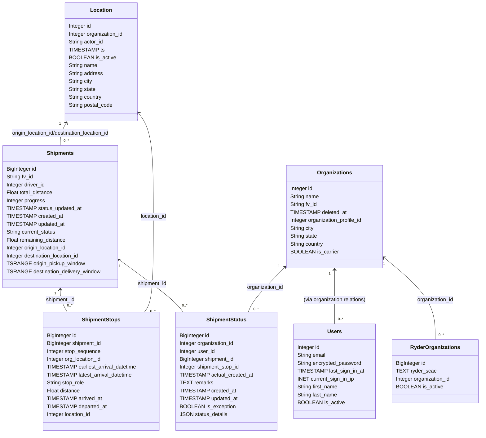

# Diagram: shipment_core/shipment_service/shipment_service/fvshared/tables.py

> Auto-generated by Obscura crawlers

## Mermaid

### SVG

<svg id="container" width="1438.9453125" xmlns="http://www.w3.org/2000/svg" class="classDiagram" height="1316" viewBox="0 0 1438.9453125 1316" role="graphics-document document" aria-roledescription="class"><g><defs><marker id="container_class-aggregationStart" class="marker aggregation class" refX="18" refY="7" markerWidth="190" markerHeight="240" orient="auto"><path d="M 18,7 L9,13 L1,7 L9,1 Z"></path></marker></defs><defs><marker id="container_class-aggregationEnd" class="marker aggregation class" refX="1" refY="7" markerWidth="20" markerHeight="28" orient="auto"><path d="M 18,7 L9,13 L1,7 L9,1 Z"></path></marker></defs><defs><marker id="container_class-extensionStart" class="marker extension class" refX="18" refY="7" markerWidth="190" markerHeight="240" orient="auto"><path d="M 1,7 L18,13 V 1 Z"></path></marker></defs><defs><marker id="container_class-extensionEnd" class="marker extension class" refX="1" refY="7" markerWidth="20" markerHeight="28" orient="auto"><path d="M 1,1 V 13 L18,7 Z"></path></marker></defs><defs><marker id="container_class-compositionStart" class="marker composition class" refX="18" refY="7" markerWidth="190" markerHeight="240" orient="auto"><path d="M 18,7 L9,13 L1,7 L9,1 Z"></path></marker></defs><defs><marker id="container_class-compositionEnd" class="marker composition class" refX="1" refY="7" markerWidth="20" markerHeight="28" orient="auto"><path d="M 18,7 L9,13 L1,7 L9,1 Z"></path></marker></defs><defs><marker id="container_class-dependencyStart" class="marker dependency class" refX="6" refY="7" markerWidth="190" markerHeight="240" orient="auto"><path d="M 5,7 L9,13 L1,7 L9,1 Z"></path></marker></defs><defs><marker id="container_class-dependencyEnd" class="marker dependency class" refX="13" refY="7" markerWidth="20" markerHeight="28" orient="auto"><path d="M 18,7 L9,13 L14,7 L9,1 Z"></path></marker></defs><defs><marker id="container_class-lollipopStart" class="marker lollipop class" refX="13" refY="7" markerWidth="190" markerHeight="240" orient="auto"><circle stroke="black" fill="transparent" cx="7" cy="7" r="6"></circle></marker></defs><defs><marker id="container_class-lollipopEnd" class="marker lollipop class" refX="1" refY="7" markerWidth="190" markerHeight="240" orient="auto"><circle stroke="black" fill="transparent" cx="7" cy="7" r="6"></circle></marker></defs><g class="root"><g class="clusters"></g><g class="edgePaths"><path d="M180.391,880L180.391,885.167C180.391,890.333,180.391,900.667,183.917,912C187.443,923.333,194.496,935.667,198.022,941.833L201.548,948" id="id_Shipments_ShipmentStops_1" class="edge-thickness-normal edge-pattern-solid relation" style=";;;" data-edge="true" data-et="edge" data-id="id_Shipments_ShipmentStops_1" data-points="W3sieCI6MTgwLjM5MDYyNSwieSI6ODc0fSx7IngiOjE4MC4zOTA2MjUsInkiOjkxMX0seyJ4IjoyMDEuNTQ4MTM1MDgwNjQ1MTgsInkiOjk0OH1d" marker-start="url(#container_class-dependencyStart)"></path><path d="M357.609,788.789L385.208,809.157C412.808,829.526,468.006,870.263,499.962,896.798C531.918,923.333,540.631,935.667,544.987,941.833L549.344,948" id="id_Shipments_ShipmentStatus_2" class="edge-thickness-normal edge-pattern-solid relation" style=";;;" data-edge="true" data-et="edge" data-id="id_Shipments_ShipmentStatus_2" data-points="W3sieCI6MzUyLjc4MTI1LCJ5Ijo3ODUuMjI1NzU2NDYyMTg5N30seyJ4Ijo1MjMuMjA1MDc4MTI1LCJ5Ijo5MTF9LHsieCI6NTQ5LjM0MzU4Nzk4OTYzMTQsInkiOjk0OH1d" marker-start="url(#container_class-dependencyStart)"></path><path d="M842.665,815.213L827.112,831.178C811.559,847.142,780.453,879.071,762.83,901.202C745.208,923.333,741.067,935.667,738.997,941.833L736.927,948" id="id_Organizations_ShipmentStatus_3" class="edge-thickness-normal edge-pattern-solid relation" style=";;;" data-edge="true" data-et="edge" data-id="id_Organizations_ShipmentStatus_3" data-points="W3sieCI6ODQ2Ljg1MTU2MjUsInkiOjgxMC45MTU0ODA2ODA4NDU3fSx7IngiOjc0OS4zNDc2NTYyNSwieSI6OTExfSx7IngiOjczNi45MjcyOTMzNDY3NzQxLCJ5Ijo5NDh9XQ==" marker-start="url(#container_class-dependencyStart)"></path><path d="M995.824,820L995.824,835.167C995.824,850.333,995.824,880.667,995.824,908C995.824,935.333,995.824,959.667,995.824,971.833L995.824,984" id="id_Organizations_Users_4" class="edge-thickness-normal edge-pattern-solid relation" style=";;;" data-edge="true" data-et="edge" data-id="id_Organizations_Users_4" data-points="W3sieCI6OTk1LjgyNDIxODc1LCJ5Ijo4MTR9LHsieCI6OTk1LjgyNDIxODc1LCJ5Ijo5MTF9LHsieCI6OTk1LjgyNDIxODc1LCJ5Ijo5ODR9XQ==" marker-start="url(#container_class-dependencyStart)"></path><path d="M1149.402,786.248L1174.301,807.04C1199.199,827.832,1248.996,869.416,1273.895,910.375C1298.793,951.333,1298.793,991.667,1298.793,1011.833L1298.793,1032" id="id_Organizations_RyderOrganizations_5" class="edge-thickness-normal edge-pattern-solid relation" style=";;;" data-edge="true" data-et="edge" data-id="id_Organizations_RyderOrganizations_5" data-points="W3sieCI6MTE0NC43OTY4NzUsInkiOjc4Mi40MDI1Mzk5NjkwNTYyfSx7IngiOjEyOTguNzkyOTY4NzUsInkiOjkxMX0seyJ4IjoxMjk4Ljc5Mjk2ODc1LCJ5IjoxMDMyfV0=" marker-start="url(#container_class-dependencyStart)"></path><path d="M198.57,373.209L195.54,378.507C192.51,383.806,186.45,394.403,183.42,405.868C180.391,417.333,180.391,429.667,180.391,435.833L180.391,442" id="id_Location_Shipments_6" class="edge-thickness-normal edge-pattern-solid relation" style=";;;" data-edge="true" data-et="edge" data-id="id_Location_Shipments_6" data-points="W3sieCI6MjAxLjU0ODEzNTA4MDY0NTE4LCJ5IjozNjh9LHsieCI6MTgwLjM5MDYyNSwieSI6NDA1fSx7IngiOjE4MC4zOTA2MjUsInkiOjQ0Mn1d" marker-start="url(#container_class-dependencyStart)"></path><path d="M419.666,358.644L424.881,366.37C430.096,374.096,440.527,389.548,445.742,439.441C450.957,489.333,450.957,573.667,450.957,658C450.957,742.333,450.957,826.667,446.794,875C442.632,923.333,434.306,935.667,430.144,941.833L425.981,948" id="id_Location_ShipmentStops_7" class="edge-thickness-normal edge-pattern-solid relation" style=";;;" data-edge="true" data-et="edge" data-id="id_Location_ShipmentStops_7" data-points="W3sieCI6NDE2LjMwODU5Mzc1LCJ5IjozNTMuNjcwODk3ODkwNjEwNH0seyJ4Ijo0NTAuOTU3MDMxMjUsInkiOjQwNX0seyJ4Ijo0NTAuOTU3MDMxMjUsInkiOjY1OH0seyJ4Ijo0NTAuOTU3MDMxMjUsInkiOjkxMX0seyJ4Ijo0MjUuOTgxMDk4NzkwMzIyNTYsInkiOjk0OH1d" marker-start="url(#container_class-dependencyStart)"></path></g><g class="edgeLabels"><g class="edgeLabel" transform="translate(180.390625, 911)"><g class="label" data-id="id_Shipments_ShipmentStops_1" transform="translate(-45.4296875, -12)"><foreignObject width="90.859375" height="24">

shipment_id

</foreignObject></g></g><g class="edgeLabel" transform="translate(456.21811, 861.56304)"><g class="label" data-id="id_Shipments_ShipmentStatus_2" transform="translate(-45.4296875, -12)"><foreignObject width="90.859375" height="24">

shipment_id

</foreignObject></g></g><g class="edgeLabel" transform="translate(784.48214, 874.93562)"><g class="label" data-id="id_Organizations_ShipmentStatus_3" transform="translate(-56.3828125, -12)"><foreignObject width="112.765625" height="24">

organization_id

</foreignObject></g></g><g class="edgeLabel" transform="translate(995.82421875, 911)"><g class="label" data-id="id_Organizations_Users_4" transform="translate(-97.25, -12)"><foreignObject width="194.5" height="24">

(via organization relations)

</foreignObject></g></g><g class="edgeLabel" transform="translate(1298.79296875, 911)"><g class="label" data-id="id_Organizations_RyderOrganizations_5" transform="translate(-56.3828125, -12)"><foreignObject width="112.765625" height="24">

organization_id

</foreignObject></g></g><g class="edgeLabel" transform="translate(180.390625, 405)"><g class="label" data-id="id_Location_Shipments_6" transform="translate(-156.1640625, -12)"><foreignObject width="312.328125" height="24">

origin_location_id/destination_location_id

</foreignObject></g></g><g class="edgeLabel" transform="translate(450.95703125, 658)"><g class="label" data-id="id_Location_ShipmentStops_7" transform="translate(-40.78125, -12)"><foreignObject width="81.5625" height="24">

location_id

</foreignObject></g></g><g class="edgeTerminals" transform="translate(165.39062750000014, 891.5000021428572)"><g class="inner" transform="translate(0, 0)"><foreignObject style="width: 9px; height: 12px;">
1
</foreignObject></g></g><g class="edgeTerminals" transform="translate(357.9547720404355, 807.6864937118495)"><g class="inner" transform="translate(0, 0)"><foreignObject style="width: 9px; height: 12px;">
1
</foreignObject></g></g><g class="edgeTerminals" transform="translate(823.8956382842838, 812.983213878953)"><g class="inner" transform="translate(0, 0)"><foreignObject style="width: 9px; height: 12px;">
1
</foreignObject></g></g><g class="edgeTerminals" transform="translate(980.824219375, 831.5000005357143)"><g class="inner" transform="translate(0, 0)"><foreignObject style="width: 9px; height: 12px;">
1
</foreignObject></g></g><g class="edgeTerminals" transform="translate(1148.6147147854913, 805.1330075139099)"><g class="inner" transform="translate(0, 0)"><foreignObject style="width: 9px; height: 12px;">
1
</foreignObject></g></g><g class="edgeTerminals" transform="translate(179.8397423218479, 375.74569392298986)"><g class="inner" transform="translate(0, 0)"><foreignObject style="width: 9px; height: 12px;">
1
</foreignObject></g></g><g class="edgeTerminals" transform="translate(413.6670381999571, 376.5678887085978)"><g class="inner" transform="translate(0, 0)"><foreignObject style="width: 9px; height: 12px;">
1
</foreignObject></g></g><g class="edgeTerminals" transform="translate(200.88259275879727, 920.3623639229897)"><g class="inner" transform="translate(0, 0)"></g><foreignObject style="width: 36px; height: 12px;">
0..*
</foreignObject></g><g class="edgeTerminals" transform="translate(546.4975167546993, 920.0520023588664)"><g class="inner" transform="translate(0, 0)"></g><foreignObject style="width: 36px; height: 12px;">
0..*
</foreignObject></g><g class="edgeTerminals" transform="translate(751.7165701644717, 931.1832932989226)"><g class="inner" transform="translate(0, 0)"></g><foreignObject style="width: 36px; height: 12px;">
0..*
</foreignObject></g><g class="edgeTerminals" transform="translate(1005.824219375, 961.5000005357143)"><g class="inner" transform="translate(0, 0)"></g><foreignObject style="width: 36px; height: 12px;">
0..*
</foreignObject></g><g class="edgeTerminals" transform="translate(1308.792969375, 1009.5000005357143)"><g class="inner" transform="translate(0, 0)"></g><foreignObject style="width: 36px; height: 12px;">
0..*
</foreignObject></g><g class="edgeTerminals" transform="translate(190.39062749999985, 419.5000021428571)"><g class="inner" transform="translate(0, 0)"></g><foreignObject style="width: 36px; height: 12px;">
0..*
</foreignObject></g><g class="edgeTerminals" transform="translate(443.20470878893093, 936.8876286985522)"><g class="inner" transform="translate(0, 0)"></g><foreignObject style="width: 36px; height: 12px;">
0..*
</foreignObject></g></g><g class="nodes"><g class="node default" id="classId-Shipments-0" transform="translate(180.390625, 658)"><g class="basic label-container"><path d="M-172.390625 -216 L172.390625 -216 L172.390625 216 L-172.390625 216" stroke="none" stroke-width="0" fill="#ECECFF" style=""></path><path d="M-172.390625 -216 C-53.107803852224976 -216, 66.17501729555005 -216, 172.390625 -216 M-172.390625 -216 C-41.88008289896064 -216, 88.63045920207873 -216, 172.390625 -216 M172.390625 -216 C172.390625 -92.33377017072075, 172.390625 31.33245965855849, 172.390625 216 M172.390625 -216 C172.390625 -66.77298371429245, 172.390625 82.4540325714151, 172.390625 216 M172.390625 216 C35.05615379276452 216, -102.27831741447096 216, -172.390625 216 M172.390625 216 C43.31061383216223 216, -85.76939733567554 216, -172.390625 216 M-172.390625 216 C-172.390625 103.70532426781222, -172.390625 -8.589351464375568, -172.390625 -216 M-172.390625 216 C-172.390625 68.14937224549931, -172.390625 -79.70125550900138, -172.390625 -216" stroke="#9370DB" stroke-width="1.3" fill="none" stroke-dasharray="0 0" style=""></path></g><g class="annotation-group text" transform="translate(0, -192)"></g><g class="label-group text" transform="translate(-38.96875, -192)"><g class="label" style="font-weight: bolder" transform="translate(0,-12)"><foreignObject width="77.9375" height="24">

Shipments

</foreignObject></g></g><g class="members-group text" transform="translate(-160.390625, -144)"><g class="label" style="" transform="translate(0,-12)"><foreignObject width="92.203125" height="24">

BigInteger id

</foreignObject></g><g class="label" style="" transform="translate(0,12)"><foreignObject width="82.28125" height="24">

String fv_id

</foreignObject></g><g class="label" style="" transform="translate(0,36)"><foreignObject width="119.640625" height="24">

Integer driver_id

</foreignObject></g><g class="label" style="" transform="translate(0,60)"><foreignObject width="143.34375" height="24">

Float total_distance

</foreignObject></g><g class="label" style="" transform="translate(0,84)"><foreignObject width="117.625" height="24">

Integer progress

</foreignObject></g><g class="label" style="" transform="translate(0,108)"><foreignObject width="220.3125" height="24">

TIMESTAMP status_updated_at

</foreignObject></g><g class="label" style="" transform="translate(0,132)"><foreignObject width="161.75" height="24">

TIMESTAMP created_at

</foreignObject></g><g class="label" style="" transform="translate(0,156)"><foreignObject width="168.234375" height="24">

TIMESTAMP updated_at

</foreignObject></g><g class="label" style="" transform="translate(0,180)"><foreignObject width="152.390625" height="24">

String current_status

</foreignObject></g><g class="label" style="" transform="translate(0,204)"><foreignObject width="182.546875" height="24">

Float remaining_distance

</foreignObject></g><g class="label" style="" transform="translate(0,228)"><foreignObject width="187.515625" height="24">

Integer origin_location_id

</foreignObject></g><g class="label" style="" transform="translate(0,252)"><foreignObject width="228.40625" height="24">

Integer destination_location_id

</foreignObject></g><g class="label" style="" transform="translate(0,276)"><foreignObject width="231.890625" height="24">

TSRANGE origin_pickup_window

</foreignObject></g><g class="label" style="" transform="translate(0,300)"><foreignObject width="281.8125" height="24">

TSRANGE destination_delivery_window

</foreignObject></g></g><g class="methods-group text" transform="translate(-160.390625, 216)"></g><g class="divider" style=""><path d="M-172.390625 -168 C-101.04045880937349 -168, -29.69029261874698 -168, 172.390625 -168 M-172.390625 -168 C-67.57989371922086 -168, 37.230837561558275 -168, 172.390625 -168" stroke="#9370DB" stroke-width="1.3" fill="none" stroke-dasharray="0 0" style=""></path></g><g class="divider" style=""><path d="M-172.390625 192 C-83.07850668517744 192, 6.233611629645111 192, 172.390625 192 M-172.390625 192 C-95.02485275046183 192, -17.659080500923665 192, 172.390625 192" stroke="#9370DB" stroke-width="1.3" fill="none" stroke-dasharray="0 0" style=""></path></g></g><g class="node default" id="classId-Users-1" transform="translate(995.82421875, 1128)"><g class="basic label-container"><path d="M-120.81640625 -144 L120.81640625 -144 L120.81640625 144 L-120.81640625 144" stroke="none" stroke-width="0" fill="#ECECFF" style=""></path><path d="M-120.81640625 -144 C-41.28933859409649 -144, 38.237729061807016 -144, 120.81640625 -144 M-120.81640625 -144 C-25.409867443088388 -144, 69.99667136382322 -144, 120.81640625 -144 M120.81640625 -144 C120.81640625 -52.5706671835499, 120.81640625 38.8586656329002, 120.81640625 144 M120.81640625 -144 C120.81640625 -33.69742693568381, 120.81640625 76.60514612863238, 120.81640625 144 M120.81640625 144 C31.45989773775301 144, -57.89661077449398 144, -120.81640625 144 M120.81640625 144 C65.90964446925587 144, 11.002882688511733 144, -120.81640625 144 M-120.81640625 144 C-120.81640625 50.78147135050199, -120.81640625 -42.437057298996024, -120.81640625 -144 M-120.81640625 144 C-120.81640625 46.597972727543976, -120.81640625 -50.80405454491205, -120.81640625 -144" stroke="#9370DB" stroke-width="1.3" fill="none" stroke-dasharray="0 0" style=""></path></g><g class="annotation-group text" transform="translate(0, -120)"></g><g class="label-group text" transform="translate(-20.4296875, -120)"><g class="label" style="font-weight: bolder" transform="translate(0,-12)"><foreignObject width="40.859375" height="24">

Users

</foreignObject></g></g><g class="members-group text" transform="translate(-108.81640625, -72)"><g class="label" style="" transform="translate(0,-12)"><foreignObject width="69.640625" height="24">

Integer id

</foreignObject></g><g class="label" style="" transform="translate(0,12)"><foreignObject width="87.46875" height="24">

String email

</foreignObject></g><g class="label" style="" transform="translate(0,36)"><foreignObject width="197.203125" height="24">

String encrypted_password

</foreignObject></g><g class="label" style="" transform="translate(0,60)"><foreignObject width="193.921875" height="24">

TIMESTAMP last_sign_in_at

</foreignObject></g><g class="label" style="" transform="translate(0,84)"><foreignObject width="171.8125" height="24">

INET current_sign_in_ip

</foreignObject></g><g class="label" style="" transform="translate(0,108)"><foreignObject width="124.34375" height="24">

String first_name

</foreignObject></g><g class="label" style="" transform="translate(0,132)"><foreignObject width="122.359375" height="24">

String last_name

</foreignObject></g><g class="label" style="" transform="translate(0,156)"><foreignObject width="135.578125" height="24">

BOOLEAN is_active

</foreignObject></g></g><g class="methods-group text" transform="translate(-108.81640625, 144)"></g><g class="divider" style=""><path d="M-120.81640625 -96 C-59.36088308364353 -96, 2.0946400827129423 -96, 120.81640625 -96 M-120.81640625 -96 C-36.327894634164096 -96, 48.16061698167181 -96, 120.81640625 -96" stroke="#9370DB" stroke-width="1.3" fill="none" stroke-dasharray="0 0" style=""></path></g><g class="divider" style=""><path d="M-120.81640625 120 C-64.16524988472247 120, -7.514093519444927 120, 120.81640625 120 M-120.81640625 120 C-37.44929556627024 120, 45.917815117459526 120, 120.81640625 120" stroke="#9370DB" stroke-width="1.3" fill="none" stroke-dasharray="0 0" style=""></path></g></g><g class="node default" id="classId-Organizations-2" transform="translate(995.82421875, 658)"><g class="basic label-container"><path d="M-148.97265625 -156 L148.97265625 -156 L148.97265625 156 L-148.97265625 156" stroke="none" stroke-width="0" fill="#ECECFF" style=""></path><path d="M-148.97265625 -156 C-44.54076127088234 -156, 59.891133708235316 -156, 148.97265625 -156 M-148.97265625 -156 C-71.62324317138234 -156, 5.726169907235317 -156, 148.97265625 -156 M148.97265625 -156 C148.97265625 -60.77935809581024, 148.97265625 34.441283808379524, 148.97265625 156 M148.97265625 -156 C148.97265625 -51.60397959467441, 148.97265625 52.79204081065117, 148.97265625 156 M148.97265625 156 C76.12824827049036 156, 3.28384029098072 156, -148.97265625 156 M148.97265625 156 C78.0228421612951 156, 7.073028072590205 156, -148.97265625 156 M-148.97265625 156 C-148.97265625 88.6034020636389, -148.97265625 21.206804127277792, -148.97265625 -156 M-148.97265625 156 C-148.97265625 89.04944479447055, -148.97265625 22.09888958894109, -148.97265625 -156" stroke="#9370DB" stroke-width="1.3" fill="none" stroke-dasharray="0 0" style=""></path></g><g class="annotation-group text" transform="translate(0, -132)"></g><g class="label-group text" transform="translate(-50.5546875, -132)"><g class="label" style="font-weight: bolder" transform="translate(0,-12)"><foreignObject width="101.109375" height="24">

Organizations

</foreignObject></g></g><g class="members-group text" transform="translate(-136.97265625, -84)"><g class="label" style="" transform="translate(0,-12)"><foreignObject width="69.640625" height="24">

Integer id

</foreignObject></g><g class="label" style="" transform="translate(0,12)"><foreignObject width="87.640625" height="24">

String name

</foreignObject></g><g class="label" style="" transform="translate(0,36)"><foreignObject width="82.28125" height="24">

String fv_id

</foreignObject></g><g class="label" style="" transform="translate(0,60)"><foreignObject width="162.765625" height="24">

TIMESTAMP deleted_at

</foreignObject></g><g class="label" style="" transform="translate(0,84)"><foreignObject width="223.390625" height="24">

Integer organization_profile_id

</foreignObject></g><g class="label" style="" transform="translate(0,108)"><foreignObject width="72.859375" height="24">

String city

</foreignObject></g><g class="label" style="" transform="translate(0,132)"><foreignObject width="83.21875" height="24">

String state

</foreignObject></g><g class="label" style="" transform="translate(0,156)"><foreignObject width="102.3125" height="24">

String country

</foreignObject></g><g class="label" style="" transform="translate(0,180)"><foreignObject width="140.359375" height="24">

BOOLEAN is_carrier

</foreignObject></g></g><g class="methods-group text" transform="translate(-136.97265625, 156)"></g><g class="divider" style=""><path d="M-148.97265625 -108 C-84.22939147516955 -108, -19.4861267003391 -108, 148.97265625 -108 M-148.97265625 -108 C-52.30081682009319 -108, 44.37102260981362 -108, 148.97265625 -108" stroke="#9370DB" stroke-width="1.3" fill="none" stroke-dasharray="0 0" style=""></path></g><g class="divider" style=""><path d="M-148.97265625 132 C-73.9079858783926 132, 1.1566844932148115 132, 148.97265625 132 M-148.97265625 132 C-79.6591580743364 132, -10.345659898672807 132, 148.97265625 132" stroke="#9370DB" stroke-width="1.3" fill="none" stroke-dasharray="0 0" style=""></path></g></g><g class="node default" id="classId-ShipmentStops-3" transform="translate(304.4765625, 1128)"><g class="basic label-container"><path d="M-173.5234375 -180 L173.5234375 -180 L173.5234375 180 L-173.5234375 180" stroke="none" stroke-width="0" fill="#ECECFF" style=""></path><path d="M-173.5234375 -180 C-52.67794699787936 -180, 68.16754350424128 -180, 173.5234375 -180 M-173.5234375 -180 C-102.61943572862606 -180, -31.715433957252117 -180, 173.5234375 -180 M173.5234375 -180 C173.5234375 -57.9287115427216, 173.5234375 64.1425769145568, 173.5234375 180 M173.5234375 -180 C173.5234375 -43.868742836905255, 173.5234375 92.26251432618949, 173.5234375 180 M173.5234375 180 C45.83015365113158 180, -81.86313019773684 180, -173.5234375 180 M173.5234375 180 C103.1574703749079 180, 32.791503249815804 180, -173.5234375 180 M-173.5234375 180 C-173.5234375 70.26128719684819, -173.5234375 -39.477425606303626, -173.5234375 -180 M-173.5234375 180 C-173.5234375 37.82857252209703, -173.5234375 -104.34285495580593, -173.5234375 -180" stroke="#9370DB" stroke-width="1.3" fill="none" stroke-dasharray="0 0" style=""></path></g><g class="annotation-group text" transform="translate(0, -156)"></g><g class="label-group text" transform="translate(-55.9375, -156)"><g class="label" style="font-weight: bolder" transform="translate(0,-12)"><foreignObject width="111.875" height="24">

ShipmentStops

</foreignObject></g></g><g class="members-group text" transform="translate(-161.5234375, -108)"><g class="label" style="" transform="translate(0,-12)"><foreignObject width="92.203125" height="24">

BigInteger id

</foreignObject></g><g class="label" style="" transform="translate(0,12)"><foreignObject width="168.96875" height="24">

BigInteger shipment_id

</foreignObject></g><g class="label" style="" transform="translate(0,36)"><foreignObject width="164.625" height="24">

Integer stop_sequence

</foreignObject></g><g class="label" style="" transform="translate(0,60)"><foreignObject width="168.9375" height="24">

Integer org_location_id

</foreignObject></g><g class="label" style="" transform="translate(0,84)"><foreignObject width="267.109375" height="24">

TIMESTAMP earliest_arrival_datetime

</foreignObject></g><g class="label" style="" transform="translate(0,108)"><foreignObject width="253.328125" height="24">

TIMESTAMP latest_arrival_datetime

</foreignObject></g><g class="label" style="" transform="translate(0,132)"><foreignObject width="115.359375" height="24">

String stop_role

</foreignObject></g><g class="label" style="" transform="translate(0,156)"><foreignObject width="101.5625" height="24">

Float distance

</foreignObject></g><g class="label" style="" transform="translate(0,180)"><foreignObject width="158.984375" height="24">

TIMESTAMP arrived_at

</foreignObject></g><g class="label" style="" transform="translate(0,204)"><foreignObject width="173.65625" height="24">

TIMESTAMP departed_at

</foreignObject></g><g class="label" style="" transform="translate(0,228)"><foreignObject width="137.109375" height="24">

Integer location_id

</foreignObject></g></g><g class="methods-group text" transform="translate(-161.5234375, 180)"></g><g class="divider" style=""><path d="M-173.5234375 -132 C-51.83392773906857 -132, 69.85558202186286 -132, 173.5234375 -132 M-173.5234375 -132 C-86.37936473702068 -132, 0.7647080259586403 -132, 173.5234375 -132" stroke="#9370DB" stroke-width="1.3" fill="none" stroke-dasharray="0 0" style=""></path></g><g class="divider" style=""><path d="M-173.5234375 156 C-95.59297771934268 156, -17.66251793868537 156, 173.5234375 156 M-173.5234375 156 C-57.105831879616645 156, 59.31177374076671 156, 173.5234375 156" stroke="#9370DB" stroke-width="1.3" fill="none" stroke-dasharray="0 0" style=""></path></g></g><g class="node default" id="classId-ShipmentStatus-4" transform="translate(676.50390625, 1128)"><g class="basic label-container"><path d="M-148.50390625 -180 L148.50390625 -180 L148.50390625 180 L-148.50390625 180" stroke="none" stroke-width="0" fill="#ECECFF" style=""></path><path d="M-148.50390625 -180 C-55.569682071368206 -180, 37.36454210726359 -180, 148.50390625 -180 M-148.50390625 -180 C-65.27938806998895 -180, 17.94513011002209 -180, 148.50390625 -180 M148.50390625 -180 C148.50390625 -97.16695974918235, 148.50390625 -14.333919498364708, 148.50390625 180 M148.50390625 -180 C148.50390625 -106.58645882763543, 148.50390625 -33.17291765527085, 148.50390625 180 M148.50390625 180 C78.19096658134121 180, 7.878026912682429 180, -148.50390625 180 M148.50390625 180 C67.14853941074524 180, -14.206827428509513 180, -148.50390625 180 M-148.50390625 180 C-148.50390625 68.53871446518455, -148.50390625 -42.92257106963089, -148.50390625 -180 M-148.50390625 180 C-148.50390625 39.22030985698311, -148.50390625 -101.55938028603379, -148.50390625 -180" stroke="#9370DB" stroke-width="1.3" fill="none" stroke-dasharray="0 0" style=""></path></g><g class="annotation-group text" transform="translate(0, -156)"></g><g class="label-group text" transform="translate(-58.5859375, -156)"><g class="label" style="font-weight: bolder" transform="translate(0,-12)"><foreignObject width="117.171875" height="24">

ShipmentStatus

</foreignObject></g></g><g class="members-group text" transform="translate(-136.50390625, -108)"><g class="label" style="" transform="translate(0,-12)"><foreignObject width="92.203125" height="24">

BigInteger id

</foreignObject></g><g class="label" style="" transform="translate(0,12)"><foreignObject width="168.3125" height="24">

Integer organization_id

</foreignObject></g><g class="label" style="" transform="translate(0,36)"><foreignObject width="108.359375" height="24">

Integer user_id

</foreignObject></g><g class="label" style="" transform="translate(0,60)"><foreignObject width="168.96875" height="24">

BigInteger shipment_id

</foreignObject></g><g class="label" style="" transform="translate(0,84)"><foreignObject width="186.265625" height="24">

Integer shipment_stop_id

</foreignObject></g><g class="label" style="" transform="translate(0,108)"><foreignObject width="214.421875" height="24">

TIMESTAMP actual_created_at

</foreignObject></g><g class="label" style="" transform="translate(0,132)"><foreignObject width="96.578125" height="24">

TEXT remarks

</foreignObject></g><g class="label" style="" transform="translate(0,156)"><foreignObject width="161.75" height="24">

TIMESTAMP created_at

</foreignObject></g><g class="label" style="" transform="translate(0,180)"><foreignObject width="168.234375" height="24">

TIMESTAMP updated_at

</foreignObject></g><g class="label" style="" transform="translate(0,204)"><foreignObject width="163.15625" height="24">

BOOLEAN is_exception

</foreignObject></g><g class="label" style="" transform="translate(0,228)"><foreignObject width="141.25" height="24">

JSON status_details

</foreignObject></g></g><g class="methods-group text" transform="translate(-136.50390625, 180)"></g><g class="divider" style=""><path d="M-148.50390625 -132 C-59.843079711402765 -132, 28.81774682719447 -132, 148.50390625 -132 M-148.50390625 -132 C-51.359531817748206 -132, 45.78484261450359 -132, 148.50390625 -132" stroke="#9370DB" stroke-width="1.3" fill="none" stroke-dasharray="0 0" style=""></path></g><g class="divider" style=""><path d="M-148.50390625 156 C-48.83522505808085 156, 50.8334561338383 156, 148.50390625 156 M-148.50390625 156 C-45.34698883566077 156, 57.809928578678466 156, 148.50390625 156" stroke="#9370DB" stroke-width="1.3" fill="none" stroke-dasharray="0 0" style=""></path></g></g><g class="node default" id="classId-Location-5" transform="translate(304.4765625, 188)"><g class="basic label-container"><path d="M-111.83203125 -180 L111.83203125 -180 L111.83203125 180 L-111.83203125 180" stroke="none" stroke-width="0" fill="#ECECFF" style=""></path><path d="M-111.83203125 -180 C-22.54488910923203 -180, 66.74225303153594 -180, 111.83203125 -180 M-111.83203125 -180 C-50.89907578930169 -180, 10.033879671396619 -180, 111.83203125 -180 M111.83203125 -180 C111.83203125 -46.30775987272904, 111.83203125 87.38448025454193, 111.83203125 180 M111.83203125 -180 C111.83203125 -91.83857068515448, 111.83203125 -3.6771413703089593, 111.83203125 180 M111.83203125 180 C36.45631232261398 180, -38.919406604772036 180, -111.83203125 180 M111.83203125 180 C43.55908863327774 180, -24.713853983444523 180, -111.83203125 180 M-111.83203125 180 C-111.83203125 75.76251448858925, -111.83203125 -28.474971022821506, -111.83203125 -180 M-111.83203125 180 C-111.83203125 41.22687221735859, -111.83203125 -97.54625556528282, -111.83203125 -180" stroke="#9370DB" stroke-width="1.3" fill="none" stroke-dasharray="0 0" style=""></path></g><g class="annotation-group text" transform="translate(0, -156)"></g><g class="label-group text" transform="translate(-31.3515625, -156)"><g class="label" style="font-weight: bolder" transform="translate(0,-12)"><foreignObject width="62.703125" height="24">

Location

</foreignObject></g></g><g class="members-group text" transform="translate(-99.83203125, -108)"><g class="label" style="" transform="translate(0,-12)"><foreignObject width="69.640625" height="24">

Integer id

</foreignObject></g><g class="label" style="" transform="translate(0,12)"><foreignObject width="168.3125" height="24">

Integer organization_id

</foreignObject></g><g class="label" style="" transform="translate(0,36)"><foreignObject width="105.65625" height="24">

String actor_id

</foreignObject></g><g class="label" style="" transform="translate(0,60)"><foreignObject width="98.09375" height="24">

TIMESTAMP ts

</foreignObject></g><g class="label" style="" transform="translate(0,84)"><foreignObject width="135.578125" height="24">

BOOLEAN is_active

</foreignObject></g><g class="label" style="" transform="translate(0,108)"><foreignObject width="87.640625" height="24">

String name

</foreignObject></g><g class="label" style="" transform="translate(0,132)"><foreignObject width="104.171875" height="24">

String address

</foreignObject></g><g class="label" style="" transform="translate(0,156)"><foreignObject width="72.859375" height="24">

String city

</foreignObject></g><g class="label" style="" transform="translate(0,180)"><foreignObject width="83.21875" height="24">

String state

</foreignObject></g><g class="label" style="" transform="translate(0,204)"><foreignObject width="102.3125" height="24">

String country

</foreignObject></g><g class="label" style="" transform="translate(0,228)"><foreignObject width="135.296875" height="24">

String postal_code

</foreignObject></g></g><g class="methods-group text" transform="translate(-99.83203125, 180)"></g><g class="divider" style=""><path d="M-111.83203125 -132 C-41.36845540542167 -132, 29.09512043915666 -132, 111.83203125 -132 M-111.83203125 -132 C-42.35366848469587 -132, 27.124694280608253 -132, 111.83203125 -132" stroke="#9370DB" stroke-width="1.3" fill="none" stroke-dasharray="0 0" style=""></path></g><g class="divider" style=""><path d="M-111.83203125 156 C-65.89492931200355 156, -19.95782737400711 156, 111.83203125 156 M-111.83203125 156 C-23.44130701449417 156, 64.94941722101166 156, 111.83203125 156" stroke="#9370DB" stroke-width="1.3" fill="none" stroke-dasharray="0 0" style=""></path></g></g><g class="node default" id="classId-RyderOrganizations-6" transform="translate(1298.79296875, 1128)"><g class="basic label-container"><path d="M-132.15234375 -96 L132.15234375 -96 L132.15234375 96 L-132.15234375 96" stroke="none" stroke-width="0" fill="#ECECFF" style=""></path><path d="M-132.15234375 -96 C-75.75605645670757 -96, -19.35976916341515 -96, 132.15234375 -96 M-132.15234375 -96 C-61.531133172235315 -96, 9.090077405529371 -96, 132.15234375 -96 M132.15234375 -96 C132.15234375 -54.50491950652769, 132.15234375 -13.009839013055384, 132.15234375 96 M132.15234375 -96 C132.15234375 -49.86251790130201, 132.15234375 -3.725035802604026, 132.15234375 96 M132.15234375 96 C52.56975787382308 96, -27.012828002353842 96, -132.15234375 96 M132.15234375 96 C77.67783428577876 96, 23.203324821557516 96, -132.15234375 96 M-132.15234375 96 C-132.15234375 32.54309576357851, -132.15234375 -30.913808472842973, -132.15234375 -96 M-132.15234375 96 C-132.15234375 56.23959886549749, -132.15234375 16.479197730994983, -132.15234375 -96" stroke="#9370DB" stroke-width="1.3" fill="none" stroke-dasharray="0 0" style=""></path></g><g class="annotation-group text" transform="translate(0, -72)"></g><g class="label-group text" transform="translate(-71.9921875, -72)"><g class="label" style="font-weight: bolder" transform="translate(0,-12)"><foreignObject width="143.984375" height="24">

RyderOrganizations

</foreignObject></g></g><g class="members-group text" transform="translate(-120.15234375, -24)"><g class="label" style="" transform="translate(0,-12)"><foreignObject width="92.203125" height="24">

BigInteger id

</foreignObject></g><g class="label" style="" transform="translate(0,12)"><foreignObject width="114.796875" height="24">

TEXT ryder_scac

</foreignObject></g><g class="label" style="" transform="translate(0,36)"><foreignObject width="168.3125" height="24">

Integer organization_id

</foreignObject></g><g class="label" style="" transform="translate(0,60)"><foreignObject width="135.578125" height="24">

BOOLEAN is_active

</foreignObject></g></g><g class="methods-group text" transform="translate(-120.15234375, 96)"></g><g class="divider" style=""><path d="M-132.15234375 -48 C-56.730872098280855 -48, 18.69059955343829 -48, 132.15234375 -48 M-132.15234375 -48 C-65.67934738997542 -48, 0.793648970049162 -48, 132.15234375 -48" stroke="#9370DB" stroke-width="1.3" fill="none" stroke-dasharray="0 0" style=""></path></g><g class="divider" style=""><path d="M-132.15234375 72 C-53.450349136156206 72, 25.25164547768759 72, 132.15234375 72 M-132.15234375 72 C-61.382791853730566 72, 9.386760042538867 72, 132.15234375 72" stroke="#9370DB" stroke-width="1.3" fill="none" stroke-dasharray="0 0" style=""></path></g></g></g></g></g></svg>
