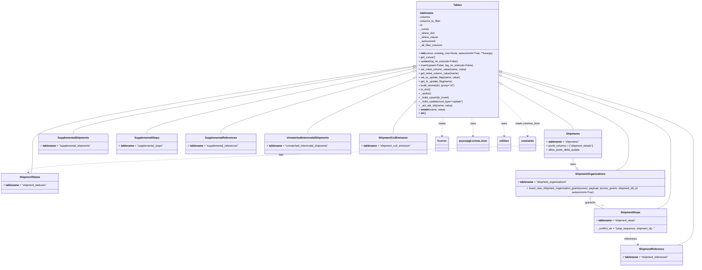

# Diagram: shipment_core/shipment_service/shipment_service/fvshared/tables_no_orm.py

> Auto-generated by Obscura crawlers

## Mermaid

### SVG

<svg id="container" width="4144.25" xmlns="http://www.w3.org/2000/svg" class="classDiagram" height="1584" viewBox="0 0 4144.25 1584" role="graphics-document document" aria-roledescription="class"><g><defs><marker id="container_class-aggregationStart" class="marker aggregation class" refX="18" refY="7" markerWidth="190" markerHeight="240" orient="auto"><path d="M 18,7 L9,13 L1,7 L9,1 Z"></path></marker></defs><defs><marker id="container_class-aggregationEnd" class="marker aggregation class" refX="1" refY="7" markerWidth="20" markerHeight="28" orient="auto"><path d="M 18,7 L9,13 L1,7 L9,1 Z"></path></marker></defs><defs><marker id="container_class-extensionStart" class="marker extension class" refX="18" refY="7" markerWidth="190" markerHeight="240" orient="auto"><path d="M 1,7 L18,13 V 1 Z"></path></marker></defs><defs><marker id="container_class-extensionEnd" class="marker extension class" refX="1" refY="7" markerWidth="20" markerHeight="28" orient="auto"><path d="M 1,1 V 13 L18,7 Z"></path></marker></defs><defs><marker id="container_class-compositionStart" class="marker composition class" refX="18" refY="7" markerWidth="190" markerHeight="240" orient="auto"><path d="M 18,7 L9,13 L1,7 L9,1 Z"></path></marker></defs><defs><marker id="container_class-compositionEnd" class="marker composition class" refX="1" refY="7" markerWidth="20" markerHeight="28" orient="auto"><path d="M 18,7 L9,13 L1,7 L9,1 Z"></path></marker></defs><defs><marker id="container_class-dependencyStart" class="marker dependency class" refX="6" refY="7" markerWidth="190" markerHeight="240" orient="auto"><path d="M 5,7 L9,13 L1,7 L9,1 Z"></path></marker></defs><defs><marker id="container_class-dependencyEnd" class="marker dependency class" refX="13" refY="7" markerWidth="20" markerHeight="28" orient="auto"><path d="M 18,7 L9,13 L14,7 L9,1 Z"></path></marker></defs><defs><marker id="container_class-lollipopStart" class="marker lollipop class" refX="13" refY="7" markerWidth="190" markerHeight="240" orient="auto"><circle stroke="black" fill="transparent" cx="7" cy="7" r="6"></circle></marker></defs><defs><marker id="container_class-lollipopEnd" class="marker lollipop class" refX="1" refY="7" markerWidth="190" markerHeight="240" orient="auto"><circle stroke="black" fill="transparent" cx="7" cy="7" r="6"></circle></marker></defs><g class="root"><g class="clusters"></g><g class="edgePaths"><path d="M2982.158,504.269L3051.595,543.724C3121.031,583.179,3259.904,662.09,3329.341,707.711C3398.777,753.333,3398.777,765.667,3398.777,771.833L3398.777,778" id="id_Tables_Shipments_1" class="edge-thickness-normal edge-pattern-solid relation" style=";;;" data-edge="true" data-et="edge" data-id="id_Tables_Shipments_1" data-points="W3sieCI6Mjk2Ny4xNjAxNTYyNSwieSI6NDk1Ljc0NjU2MTA0Nzg4NTl9LHsieCI6MzM5OC43NzczNDM3NSwieSI6NzQxfSx7IngiOjMzOTguNzc3MzQzNzUsInkiOjc3OH1d" marker-start="url(#container_class-extensionStart)"></path><path d="M2983.805,427.443L3175.879,479.703C3367.953,531.962,3752.102,636.481,3944.176,708.907C4136.25,781.333,4136.25,821.667,4136.25,862C4136.25,902.333,4136.25,942.667,4136.25,981C4136.25,1019.333,4136.25,1055.667,4136.25,1092C4136.25,1128.333,4136.25,1164.667,4136.25,1201C4136.25,1237.333,4136.25,1273.667,4136.25,1310C4136.25,1346.333,4136.25,1382.667,4119.874,1407C4103.498,1431.333,4070.745,1443.667,4054.369,1449.833L4037.993,1456" id="id_Tables_ShipmentReference_2" class="edge-thickness-normal edge-pattern-solid relation" style=";;;" data-edge="true" data-et="edge" data-id="id_Tables_ShipmentReference_2" data-points="W3sieCI6Mjk2Ny4xNjAxNTYyNSwieSI6NDIyLjkxNDU2MzgxOTcxNDJ9LHsieCI6NDEzNi4yNSwieSI6NzQxfSx7IngiOjQxMzYuMjUsInkiOjg2Mn0seyJ4Ijo0MTM2LjI1LCJ5Ijo5ODN9LHsieCI6NDEzNi4yNSwieSI6MTA5Mn0seyJ4Ijo0MTM2LjI1LCJ5IjoxMjAxfSx7IngiOjQxMzYuMjUsInkiOjEzMTB9LHsieCI6NDEzNi4yNSwieSI6MTQxOX0seyJ4Ijo0MDM3Ljk5MjU5MDIwNjE4NTUsInkiOjE0NTZ9XQ==" marker-start="url(#container_class-extensionStart)"></path><path d="M2458.232,396.064L2080.853,453.553C1703.474,511.042,948.715,626.021,571.336,703.677C193.957,781.333,193.957,821.667,193.957,862C193.957,902.333,193.957,942.667,192.732,971C191.507,999.333,189.057,1015.667,187.831,1023.833L186.606,1032" id="id_Tables_ShipmentStatus_3" class="edge-thickness-normal edge-pattern-solid relation" style=";;;" data-edge="true" data-et="edge" data-id="id_Tables_ShipmentStatus_3" data-points="W3sieCI6MjQ3NS4yODUxNTYyNSwieSI6MzkzLjQ2NTc2NDAxMTI1MjN9LHsieCI6MTkzLjk1NzAzMTI1LCJ5Ijo3NDF9LHsieCI6MTkzLjk1NzAzMTI1LCJ5Ijo4NjJ9LHsieCI6MTkzLjk1NzAzMTI1LCJ5Ijo5ODN9LHsieCI6MTg2LjYwNjMyODg0MTc0MzEsInkiOjEwMzJ9XQ==" marker-start="url(#container_class-extensionStart)"></path><path d="M2983.677,435.088L3152.872,486.073C3322.067,537.059,3660.457,639.029,3829.652,710.181C3998.848,781.333,3998.848,821.667,3998.848,862C3998.848,902.333,3998.848,942.667,3998.848,981C3998.848,1019.333,3998.848,1055.667,3998.848,1092C3998.848,1128.333,3998.848,1164.667,3984.84,1189C3970.832,1213.333,3942.817,1225.667,3928.81,1231.833L3914.802,1238" id="id_Tables_ShipmentStops_4" class="edge-thickness-normal edge-pattern-solid relation" style=";;;" data-edge="true" data-et="edge" data-id="id_Tables_ShipmentStops_4" data-points="W3sieCI6Mjk2Ny4xNjAxNTYyNSwieSI6NDMwLjExMDg5OTEyOTI0Mzd9LHsieCI6Mzk5OC44NDc2NTYyNSwieSI6NzQxfSx7IngiOjM5OTguODQ3NjU2MjUsInkiOjg2Mn0seyJ4IjozOTk4Ljg0NzY1NjI1LCJ5Ijo5ODN9LHsieCI6Mzk5OC44NDc2NTYyNSwieSI6MTA5Mn0seyJ4IjozOTk4Ljg0NzY1NjI1LCJ5IjoxMjAxfSx7IngiOjM5MTQuODAyMDcxMzg3NjE1LCJ5IjoxMjM4fV0=" marker-start="url(#container_class-extensionStart)"></path><path d="M2983.299,454.918L3109.625,502.598C3235.951,550.279,3488.602,645.639,3614.928,713.486C3741.254,781.333,3741.254,821.667,3741.254,862C3741.254,902.333,3741.254,942.667,3727.812,969C3714.37,995.333,3687.487,1007.667,3674.045,1013.833L3660.603,1020" id="id_Tables_ShipmentOrganizations_5" class="edge-thickness-normal edge-pattern-solid relation" style=";;;" data-edge="true" data-et="edge" data-id="id_Tables_ShipmentOrganizations_5" data-points="W3sieCI6Mjk2Ny4xNjAxNTYyNSwieSI6NDQ4LjgyNjUwNjU0MDg1MzUzfSx7IngiOjM3NDEuMjUzOTA2MjUsInkiOjc0MX0seyJ4IjozNzQxLjI1MzkwNjI1LCJ5Ijo4NjJ9LHsieCI6Mzc0MS4yNTM5MDYyNSwieSI6OTgzfSx7IngiOjM2NjAuNjAyODE2ODAwNDU4NiwieSI6MTAyMH1d" marker-start="url(#container_class-extensionStart)"></path><path d="M2458.275,400.33L2121.49,457.108C1784.706,513.887,1111.136,627.443,774.351,694.388C437.566,761.333,437.566,781.667,437.566,791.833L437.566,802" id="id_Tables_SupplementalShipments_6" class="edge-thickness-normal edge-pattern-solid relation" style=";;;" data-edge="true" data-et="edge" data-id="id_Tables_SupplementalShipments_6" data-points="W3sieCI6MjQ3NS4yODUxNTYyNSwieSI6Mzk3LjQ2MjQzMDAzOTU0NzN9LHsieCI6NDM3LjU2NjQwNjI1LCJ5Ijo3NDF9LHsieCI6NDM3LjU2NjQwNjI1LCJ5Ijo4MDJ9XQ==" marker-start="url(#container_class-extensionStart)"></path><path d="M2458.399,410.88L2194.903,465.9C1931.407,520.92,1404.414,630.96,1140.918,696.147C877.422,761.333,877.422,781.667,877.422,791.833L877.422,802" id="id_Tables_SupplementalStops_7" class="edge-thickness-normal edge-pattern-solid relation" style=";;;" data-edge="true" data-et="edge" data-id="id_Tables_SupplementalStops_7" data-points="W3sieCI6MjQ3NS4yODUxNTYyNSwieSI6NDA3LjM1MzY3MDM0MzgyNTN9LHsieCI6ODc3LjQyMTg3NSwieSI6NzQxfSx7IngiOjg3Ny40MjE4NzUsInkiOjgwMn1d" marker-start="url(#container_class-extensionStart)"></path><path d="M2458.65,428.033L2268.514,480.194C2078.379,532.356,1698.107,636.678,1507.972,699.006C1317.836,761.333,1317.836,781.667,1317.836,791.833L1317.836,802" id="id_Tables_SupplementalReferences_8" class="edge-thickness-normal edge-pattern-solid relation" style=";;;" data-edge="true" data-et="edge" data-id="id_Tables_SupplementalReferences_8" data-points="W3sieCI6MjQ3NS4yODUxNTYyNSwieSI6NDIzLjQ2OTU5NzgyMDAwNTczfSx7IngiOjEzMTcuODM1OTM3NSwieSI6NzQxfSx7IngiOjEzMTcuODM1OTM3NSwieSI6ODAyfV0=" marker-start="url(#container_class-extensionStart)"></path><path d="M2459.468,469.913L2355.649,515.094C2251.829,560.275,2044.19,650.638,1940.37,705.985C1836.551,761.333,1836.551,781.667,1836.551,791.833L1836.551,802" id="id_Tables_UnmatchedIntermodalShipments_9" class="edge-thickness-normal edge-pattern-solid relation" style=";;;" data-edge="true" data-et="edge" data-id="id_Tables_UnmatchedIntermodalShipments_9" data-points="W3sieCI6MjQ3NS4yODUxNTYyNSwieSI6NDYzLjAyOTQ0MjQxMzMyNDE1fSx7IngiOjE4MzYuNTUwNzgxMjUsInkiOjc0MX0seyJ4IjoxODM2LjU1MDc4MTI1LCJ5Ijo4MDJ9XQ==" marker-start="url(#container_class-extensionStart)"></path><path d="M2463.227,619.932L2443.503,640.11C2423.779,660.288,2384.331,700.644,2364.607,730.989C2344.883,761.333,2344.883,781.667,2344.883,791.833L2344.883,802" id="id_Tables_ShipmentCo2Emission_10" class="edge-thickness-normal edge-pattern-solid relation" style=";;;" data-edge="true" data-et="edge" data-id="id_Tables_ShipmentCo2Emission_10" data-points="W3sieCI6MjQ3NS4yODUxNTYyNSwieSI6NjA3LjU5Njg5ODU4MTExMTJ9LHsieCI6MjM0NC44ODI4MTI1LCJ5Ijo3NDF9LHsieCI6MjM0NC44ODI4MTI1LCJ5Ijo4MDJ9XQ==" marker-start="url(#container_class-extensionStart)"></path><path d="M3398.777,946L3398.777,952.167C3398.777,958.333,3398.777,970.667,3402.718,980.928C3406.658,991.19,3414.539,999.38,3418.479,1003.475L3422.419,1007.57" id="id_Shipments_ShipmentOrganizations_11" class="edge-thickness-normal edge-pattern-solid relation" style=";;;" data-edge="true" data-et="edge" data-id="id_Shipments_ShipmentOrganizations_11" data-points="W3sieCI6MzM5OC43NzczNDM3NSwieSI6OTQ2fSx7IngiOjMzOTguNzc3MzQzNzUsInkiOjk4M30seyJ4IjozNDM0LjM3OTc2NjM0MTc0MywieSI6MTAyMH1d" marker-end="url(#container_class-extensionEnd)"></path><path d="M3503.66,1181.25L3503.66,1184.542C3503.66,1187.833,3503.66,1194.417,3517.668,1203.875C3531.675,1213.333,3559.691,1225.667,3573.698,1231.833L3587.706,1238" id="id_ShipmentOrganizations_ShipmentStops_12" class="edge-thickness-normal edge-pattern-solid relation" style=";;;" data-edge="true" data-et="edge" data-id="id_ShipmentOrganizations_ShipmentStops_12" data-points="W3sieCI6MzUwMy42NjAxNTYyNSwieSI6MTE2NH0seyJ4IjozNTAzLjY2MDE1NjI1LCJ5IjoxMjAxfSx7IngiOjM1ODcuNzA1NzQxMTEyMzg1LCJ5IjoxMjM4fV0=" marker-start="url(#container_class-aggregationStart)"></path><path d="M3751.254,1382L3751.254,1388.167C3751.254,1394.333,3751.254,1406.667,3758.558,1418.394C3765.862,1430.122,3780.469,1441.244,3787.773,1446.804L3795.077,1452.365" id="id_ShipmentStops_ShipmentReference_13" class="edge-thickness-normal edge-pattern-dashed relation" style=";;;" data-edge="true" data-et="edge" data-id="id_ShipmentStops_ShipmentReference_13" data-points="W3sieCI6Mzc1MS4yNTM5MDYyNSwieSI6MTM4Mn0seyJ4IjozNzUxLjI1MzkwNjI1LCJ5IjoxNDE5fSx7IngiOjM3OTkuODUwNjc2NTQ2MzkxNywieSI6MTQ1Nn1d" marker-end="url(#container_class-dependencyEnd)"></path><path d="M3224.012,868.532L2713.552,887.61C2203.092,906.688,1182.173,944.844,672.79,971.1C163.407,997.355,165.561,1011.711,166.638,1018.889L167.714,1026.066" id="id_Shipments_ShipmentStatus_14" class="edge-thickness-normal edge-pattern-dashed relation" style=";;;" data-edge="true" data-et="edge" data-id="id_Shipments_ShipmentStatus_14" data-points="W3sieCI6MzIyNC4wMTE3MTg3NSwieSI6ODY4LjUzMTczMzYwMjMxNDZ9LHsieCI6MTYxLjI1MzkwNjI1LCJ5Ijo5ODN9LHsieCI6MTY4LjYwNDYwODY1ODI1NjksInkiOjEwMzJ9XQ==" marker-end="url(#container_class-dependencyEnd)"></path><path d="M2641.129,704L2639.71,710.167C2638.29,716.333,2635.452,728.667,2634.033,747C2632.613,765.333,2632.613,789.667,2632.613,801.833L2632.613,814" id="id_Tables_fv.error_15" class="edge-thickness-normal edge-pattern-dashed relation" style=";;;" data-edge="true" data-et="edge" data-id="id_Tables_fv.error_15" data-points="W3sieCI6MjY0MS4xMjg5ODc0MTg4MzEsInkiOjcwNH0seyJ4IjoyNjMyLjYxMzI4MTI1LCJ5Ijo3NDF9LHsieCI6MjYzMi42MTMyODEyNSwieSI6ODIwfV0=" marker-end="url(#container_class-dependencyEnd)"></path><path d="M2801.316,704L2802.736,710.167C2804.155,716.333,2806.993,728.667,2808.413,747C2809.832,765.333,2809.832,789.667,2809.832,801.833L2809.832,814" id="id_Tables_psycopg2.extras.Json_16" class="edge-thickness-normal edge-pattern-dashed relation" style=";;;" data-edge="true" data-et="edge" data-id="id_Tables_psycopg2.extras.Json_16" data-points="W3sieCI6MjgwMS4zMTYzMjUwODExNjksInkiOjcwNH0seyJ4IjoyODA5LjgzMjAzMTI1LCJ5Ijo3NDF9LHsieCI6MjgwOS44MzIwMzEyNSwieSI6ODIwfV0=" marker-end="url(#container_class-dependencyEnd)"></path><path d="M2962.619,704L2966.897,710.167C2971.175,716.333,2979.73,728.667,2984.008,747C2988.285,765.333,2988.285,789.667,2988.285,801.833L2988.285,814" id="id_Tables_utilities_17" class="edge-thickness-normal edge-pattern-dashed relation" style=";;;" data-edge="true" data-et="edge" data-id="id_Tables_utilities_17" data-points="W3sieCI6Mjk2Mi42MTk0MDk0OTY3NTMsInkiOjcwNH0seyJ4IjoyOTg4LjI4NTE1NjI1LCJ5Ijo3NDF9LHsieCI6Mjk4OC4yODUxNTYyNSwieSI6ODIwfV0=" marker-end="url(#container_class-dependencyEnd)"></path><path d="M2967.16,589.783L2993.673,614.986C3020.186,640.189,3073.212,690.594,3099.725,727.964C3126.238,765.333,3126.238,789.667,3126.238,801.833L3126.238,814" id="id_Tables_constants_18" class="edge-thickness-normal edge-pattern-dashed relation" style=";;;" data-edge="true" data-et="edge" data-id="id_Tables_constants_18" data-points="W3sieCI6Mjk2Ny4xNjAxNTYyNSwieSI6NTg5Ljc4MzQxODg0OTU4MTR9LHsieCI6MzEyNi4yMzgyODEyNSwieSI6NzQxfSx7IngiOjMxMjYuMjM4MjgxMjUsInkiOjgyMH1d" marker-end="url(#container_class-dependencyEnd)"></path></g><g class="edgeLabels"><g class="edgeLabel"><g class="label" data-id="id_Tables_Shipments_1" transform="translate(0, 0)"><foreignObject width="0" height="0">

</foreignObject></g></g><g class="edgeLabel"><g class="label" data-id="id_Tables_ShipmentReference_2" transform="translate(0, 0)"><foreignObject width="0" height="0">

</foreignObject></g></g><g class="edgeLabel"><g class="label" data-id="id_Tables_ShipmentStatus_3" transform="translate(0, 0)"><foreignObject width="0" height="0">

</foreignObject></g></g><g class="edgeLabel"><g class="label" data-id="id_Tables_ShipmentStops_4" transform="translate(0, 0)"><foreignObject width="0" height="0">

</foreignObject></g></g><g class="edgeLabel"><g class="label" data-id="id_Tables_ShipmentOrganizations_5" transform="translate(0, 0)"><foreignObject width="0" height="0">

</foreignObject></g></g><g class="edgeLabel"><g class="label" data-id="id_Tables_SupplementalShipments_6" transform="translate(0, 0)"><foreignObject width="0" height="0">

</foreignObject></g></g><g class="edgeLabel"><g class="label" data-id="id_Tables_SupplementalStops_7" transform="translate(0, 0)"><foreignObject width="0" height="0">

</foreignObject></g></g><g class="edgeLabel"><g class="label" data-id="id_Tables_SupplementalReferences_8" transform="translate(0, 0)"><foreignObject width="0" height="0">

</foreignObject></g></g><g class="edgeLabel"><g class="label" data-id="id_Tables_UnmatchedIntermodalShipments_9" transform="translate(0, 0)"><foreignObject width="0" height="0">

</foreignObject></g></g><g class="edgeLabel"><g class="label" data-id="id_Tables_ShipmentCo2Emission_10" transform="translate(0, 0)"><foreignObject width="0" height="0">

</foreignObject></g></g><g class="edgeLabel" transform="translate(3398.77734375, 983)"><g class="label" data-id="id_Shipments_ShipmentOrganizations_11" transform="translate(-16.4921875, -12)"><foreignObject width="32.984375" height="24">

uses

</foreignObject></g></g><g class="edgeLabel" transform="translate(3503.66015625, 1201)"><g class="label" data-id="id_ShipmentOrganizations_ShipmentStops_12" transform="translate(-31.0078125, -12)"><foreignObject width="62.015625" height="24">

grantsTo

</foreignObject></g></g><g class="edgeLabel" transform="translate(3751.25390625, 1419)"><g class="label" data-id="id_ShipmentStops_ShipmentReference_13" transform="translate(-37.828125, -12)"><foreignObject width="75.65625" height="24">

references

</foreignObject></g></g><g class="edgeLabel" transform="translate(1667.87595, 926.69114)"><g class="label" data-id="id_Shipments_ShipmentStatus_14" transform="translate(-12.703125, -12)"><foreignObject width="25.40625" height="24">

has

</foreignObject></g></g><g class="edgeLabel" transform="translate(2632.61328125, 741)"><g class="label" data-id="id_Tables_fv.error_15" transform="translate(-21.25, -12)"><foreignObject width="42.5" height="24">

raises

</foreignObject></g></g><g class="edgeLabel" transform="translate(2809.83203125, 741)"><g class="label" data-id="id_Tables_psycopg2.extras.Json_16" transform="translate(-16.4921875, -12)"><foreignObject width="32.984375" height="24">

uses

</foreignObject></g></g><g class="edgeLabel" transform="translate(2988.28515625, 741)"><g class="label" data-id="id_Tables_utilities_17" transform="translate(-16.4921875, -12)"><foreignObject width="32.984375" height="24">

uses

</foreignObject></g></g><g class="edgeLabel" transform="translate(3126.23828125, 741)"><g class="label" data-id="id_Tables_constants_18" transform="translate(-73.6328125, -12)"><foreignObject width="147.265625" height="24">

reads columns_from

</foreignObject></g></g><g class="edgeTerminals" transform="translate(3572.732939463698, 1212.2203659027216)"><g class="inner" transform="translate(0, 0)"></g><foreignObject style="width: 36px; height: 12px;">
0..*
</foreignObject></g></g><g class="nodes"><g class="node default" id="classId-Tables-0" transform="translate(2721.22265625, 356)"><g class="basic label-container"><path d="M-245.9375 -348 L245.9375 -348 L245.9375 348 L-245.9375 348" stroke="none" stroke-width="0" fill="#ECECFF" style=""></path><path d="M-245.9375 -348 C-62.85614367787363 -348, 120.22521264425274 -348, 245.9375 -348 M-245.9375 -348 C-129.86775854601956 -348, -13.798017092039089 -348, 245.9375 -348 M245.9375 -348 C245.9375 -160.88250053932862, 245.9375 26.234998921342765, 245.9375 348 M245.9375 -348 C245.9375 -159.41994623755983, 245.9375 29.160107524880345, 245.9375 348 M245.9375 348 C76.94728265721164 348, -92.04293468557671 348, -245.9375 348 M245.9375 348 C71.60891073289764 348, -102.71967853420472 348, -245.9375 348 M-245.9375 348 C-245.9375 115.93326345231804, -245.9375 -116.13347309536391, -245.9375 -348 M-245.9375 348 C-245.9375 158.1464499121469, -245.9375 -31.707100175706216, -245.9375 -348" stroke="#9370DB" stroke-width="1.3" fill="none" stroke-dasharray="0 0" style=""></path></g><g class="annotation-group text" transform="translate(0, -324)"></g><g class="label-group text" transform="translate(-23.703125, -324)"><g class="label" style="font-weight: bolder" transform="translate(0,-12)"><foreignObject width="47.40625" height="24">

Tables

</foreignObject></g></g><g class="members-group text" transform="translate(-233.9375, -276)"><g class="label" style="" transform="translate(0,-12)"><foreignObject width="88.875" height="24">

- <strong>tablename</strong>

</foreignObject></g><g class="label" style="" transform="translate(0,12)"><foreignObject width="71.921875" height="24">

- columns

</foreignObject></g><g class="label" style="" transform="translate(0,36)"><foreignObject width="136.484375" height="24">

- columns_to_filter

</foreignObject></g><g class="label" style="" transform="translate(0,60)"><foreignObject width="24.78125" height="24">

- id

</foreignObject></g><g class="label" style="" transform="translate(0,84)"><foreignObject width="64.421875" height="24">

- _cursor

</foreignObject></g><g class="label" style="" transform="translate(0,108)"><foreignObject width="97.859375" height="24">

- _where_dict

</foreignObject></g><g class="label" style="" transform="translate(0,132)"><foreignObject width="116.828125" height="24">

- _where_clause

</foreignObject></g><g class="label" style="" transform="translate(0,156)"><foreignObject width="105.96875" height="24">

- _autocommit

</foreignObject></g><g class="label" style="" transform="translate(0,180)"><foreignObject width="146.890625" height="24">

- _all_filter_columns

</foreignObject></g></g><g class="methods-group text" transform="translate(-233.9375, -36)"><g class="label" style="" transform="translate(0,-12)"><foreignObject width="444.171875" height="24">

+ <strong>init</strong>(cursor, existing_row=None, autocommit=True, **kwargs)

</foreignObject></g><g class="label" style="" transform="translate(0,12)"><foreignObject width="98.890625" height="24">

+ get_cursor()

</foreignObject></g><g class="label" style="" transform="translate(0,36)"><foreignObject width="231.28125" height="24">

+ update(log_no_execute=False)

</foreignObject></g><g class="label" style="" transform="translate(0,60)"><foreignObject width="321.171875" height="24">

+ insert(upsert=False, log_no_execute=False)

</foreignObject></g><g class="label" style="" transform="translate(0,84)"><foreignObject width="290.59375" height="24">

+ set_initial_column_value(name, value)

</foreignObject></g><g class="label" style="" transform="translate(0,108)"><foreignObject width="244.390625" height="24">

+ get_initial_column_value(name)

</foreignObject></g><g class="label" style="" transform="translate(0,132)"><foreignObject width="247.71875" height="24">

+ set_to_update_flag(name, value)

</foreignObject></g><g class="label" style="" transform="translate(0,156)"><foreignObject width="201.515625" height="24">

+ get_to_update_flag(name)

</foreignObject></g><g class="label" style="" transform="translate(0,180)"><foreignObject width="220.25" height="24">

+ build_where(dct, group="id")

</foreignObject></g><g class="label" style="" transform="translate(0,204)"><foreignObject width="72.65625" height="24">

+ to_dict()

</foreignObject></g><g class="label" style="" transform="translate(0,228)"><foreignObject width="74.125" height="24">

+ _asdict()

</foreignObject></g><g class="label" style="" transform="translate(0,252)"><foreignObject width="188.296875" height="24">

+ _build_upsert(to_insert)

</foreignObject></g><g class="label" style="" transform="translate(0,276)"><foreignObject width="272.140625" height="24">

+ _build_update(mod_type="update")

</foreignObject></g><g class="label" style="" transform="translate(0,300)"><foreignObject width="205.84375" height="24">

+ _set_attr_init(name, value)

</foreignObject></g><g class="label" style="" transform="translate(0,324)"><foreignObject width="160.015625" height="24">

+ <strong>setattr</strong>(name, value)

</foreignObject></g><g class="label" style="" transform="translate(0,348)"><foreignObject width="42.9375" height="24">

+ <strong>str</strong>()

</foreignObject></g></g><g class="divider" style=""><path d="M-245.9375 -300 C-135.98945846860386 -300, -26.041416937207686 -300, 245.9375 -300 M-245.9375 -300 C-127.22064227932105 -300, -8.50378455864211 -300, 245.9375 -300" stroke="#9370DB" stroke-width="1.3" fill="none" stroke-dasharray="0 0" style=""></path></g><g class="divider" style=""><path d="M-245.9375 -60 C-119.69024951058674 -60, 6.557000978826522 -60, 245.9375 -60 M-245.9375 -60 C-51.28475362599019 -60, 143.36799274801962 -60, 245.9375 -60" stroke="#9370DB" stroke-width="1.3" fill="none" stroke-dasharray="0 0" style=""></path></g></g><g class="node default" id="classId-Shipments-1" transform="translate(3398.77734375, 862)"><g class="basic label-container"><path d="M-174.765625 -84 L174.765625 -84 L174.765625 84 L-174.765625 84" stroke="none" stroke-width="0" fill="#ECECFF" style=""></path><path d="M-174.765625 -84 C-72.04046180480591 -84, 30.68470139038817 -84, 174.765625 -84 M-174.765625 -84 C-53.067478504121 -84, 68.630667991758 -84, 174.765625 -84 M174.765625 -84 C174.765625 -40.46321366146221, 174.765625 3.0735726770755747, 174.765625 84 M174.765625 -84 C174.765625 -36.25307347565115, 174.765625 11.493853048697702, 174.765625 84 M174.765625 84 C71.96600170191498 84, -30.833621596170047 84, -174.765625 84 M174.765625 84 C93.69409255460998 84, 12.622560109219961 84, -174.765625 84 M-174.765625 84 C-174.765625 48.579756868699775, -174.765625 13.15951373739955, -174.765625 -84 M-174.765625 84 C-174.765625 36.02671903086742, -174.765625 -11.946561938265162, -174.765625 -84" stroke="#9370DB" stroke-width="1.3" fill="none" stroke-dasharray="0 0" style=""></path></g><g class="annotation-group text" transform="translate(0, -60)"></g><g class="label-group text" transform="translate(-38.96875, -60)"><g class="label" style="font-weight: bolder" transform="translate(0,-12)"><foreignObject width="77.9375" height="24">

Shipments

</foreignObject></g></g><g class="members-group text" transform="translate(-162.765625, -12)"><g class="label" style="" transform="translate(0,-12)"><foreignObject width="195.1875" height="24">

+ <strong>tablename</strong> = "shipments"

</foreignObject></g><g class="label" style="" transform="translate(0,12)"><foreignObject width="286.5625" height="24">

+ jsonb_columns = ["shipment_details"]

</foreignObject></g><g class="label" style="" transform="translate(0,36)"><foreignObject width="204.015625" height="24">

+ allow_jsonb_delta_update

</foreignObject></g></g><g class="methods-group text" transform="translate(-162.765625, 84)"></g><g class="divider" style=""><path d="M-174.765625 -36 C-57.02274820375375 -36, 60.7201285924925 -36, 174.765625 -36 M-174.765625 -36 C-64.85622283878321 -36, 45.05317932243358 -36, 174.765625 -36" stroke="#9370DB" stroke-width="1.3" fill="none" stroke-dasharray="0 0" style=""></path></g><g class="divider" style=""><path d="M-174.765625 60 C-62.67953726993386 60, 49.40655046013228 60, 174.765625 60 M-174.765625 60 C-39.79566376859688 60, 95.17429746280624 60, 174.765625 60" stroke="#9370DB" stroke-width="1.3" fill="none" stroke-dasharray="0 0" style=""></path></g></g><g class="node default" id="classId-ShipmentReference-2" transform="translate(3878.65625, 1516)"><g class="basic label-container"><path d="M-183.640625 -60 L183.640625 -60 L183.640625 60 L-183.640625 60" stroke="none" stroke-width="0" fill="#ECECFF" style=""></path><path d="M-183.640625 -60 C-100.73271782577785 -60, -17.82481065155571 -60, 183.640625 -60 M-183.640625 -60 C-85.43400497832762 -60, 12.772615043344757 -60, 183.640625 -60 M183.640625 -60 C183.640625 -29.382971988730024, 183.640625 1.2340560225399528, 183.640625 60 M183.640625 -60 C183.640625 -12.237024953751813, 183.640625 35.52595009249637, 183.640625 60 M183.640625 60 C107.00430258230266 60, 30.367980164605314 60, -183.640625 60 M183.640625 60 C107.04383251368893 60, 30.447040027377852 60, -183.640625 60 M-183.640625 60 C-183.640625 31.694799370676616, -183.640625 3.3895987413532325, -183.640625 -60 M-183.640625 60 C-183.640625 17.523278699389785, -183.640625 -24.95344260122043, -183.640625 -60" stroke="#9370DB" stroke-width="1.3" fill="none" stroke-dasharray="0 0" style=""></path></g><g class="annotation-group text" transform="translate(0, -36)"></g><g class="label-group text" transform="translate(-71.609375, -36)"><g class="label" style="font-weight: bolder" transform="translate(0,-12)"><foreignObject width="143.21875" height="24">

ShipmentReference

</foreignObject></g></g><g class="members-group text" transform="translate(-171.640625, 12)"><g class="label" style="" transform="translate(0,-12)"><foreignObject width="271.671875" height="24">

+ <strong>tablename</strong> = "shipment_references"

</foreignObject></g></g><g class="methods-group text" transform="translate(-171.640625, 60)"></g><g class="divider" style=""><path d="M-183.640625 -12 C-109.45320165479492 -12, -35.26577830958985 -12, 183.640625 -12 M-183.640625 -12 C-66.43072300199977 -12, 50.77917899600047 -12, 183.640625 -12" stroke="#9370DB" stroke-width="1.3" fill="none" stroke-dasharray="0 0" style=""></path></g><g class="divider" style=""><path d="M-183.640625 36 C-46.22777537236422 36, 91.18507425527156 36, 183.640625 36 M-183.640625 36 C-54.04555297414316 36, 75.54951905171367 36, 183.640625 36" stroke="#9370DB" stroke-width="1.3" fill="none" stroke-dasharray="0 0" style=""></path></g></g><g class="node default" id="classId-ShipmentStatus-3" transform="translate(177.60546875, 1092)"><g class="basic label-container"><path d="M-169.60546875 -60 L169.60546875 -60 L169.60546875 60 L-169.60546875 60" stroke="none" stroke-width="0" fill="#ECECFF" style=""></path><path d="M-169.60546875 -60 C-41.589437889270414 -60, 86.42659297145917 -60, 169.60546875 -60 M-169.60546875 -60 C-48.08832212547594 -60, 73.42882449904812 -60, 169.60546875 -60 M169.60546875 -60 C169.60546875 -35.226334498264286, 169.60546875 -10.452668996528573, 169.60546875 60 M169.60546875 -60 C169.60546875 -30.448183685036376, 169.60546875 -0.8963673700727526, 169.60546875 60 M169.60546875 60 C93.5658052012763 60, 17.52614165255261 60, -169.60546875 60 M169.60546875 60 C80.81171351632003 60, -7.982041717359948 60, -169.60546875 60 M-169.60546875 60 C-169.60546875 33.75321996266417, -169.60546875 7.506439925328337, -169.60546875 -60 M-169.60546875 60 C-169.60546875 27.947184102667848, -169.60546875 -4.105631794664305, -169.60546875 -60" stroke="#9370DB" stroke-width="1.3" fill="none" stroke-dasharray="0 0" style=""></path></g><g class="annotation-group text" transform="translate(0, -36)"></g><g class="label-group text" transform="translate(-58.5859375, -36)"><g class="label" style="font-weight: bolder" transform="translate(0,-12)"><foreignObject width="117.171875" height="24">

ShipmentStatus

</foreignObject></g></g><g class="members-group text" transform="translate(-157.60546875, 12)"><g class="label" style="" transform="translate(0,-12)"><foreignObject width="256.625" height="24">

+ <strong>tablename</strong> = "shipment_statuses"

</foreignObject></g></g><g class="methods-group text" transform="translate(-157.60546875, 60)"></g><g class="divider" style=""><path d="M-169.60546875 -12 C-93.13611636156816 -12, -16.666763973136312 -12, 169.60546875 -12 M-169.60546875 -12 C-67.85960981758278 -12, 33.88624911483444 -12, 169.60546875 -12" stroke="#9370DB" stroke-width="1.3" fill="none" stroke-dasharray="0 0" style=""></path></g><g class="divider" style=""><path d="M-169.60546875 36 C-91.02645950256314 36, -12.447450255126284 36, 169.60546875 36 M-169.60546875 36 C-78.60320189679206 36, 12.399064956415884 36, 169.60546875 36" stroke="#9370DB" stroke-width="1.3" fill="none" stroke-dasharray="0 0" style=""></path></g></g><g class="node default" id="classId-ShipmentStops-4" transform="translate(3751.25390625, 1310)"><g class="basic label-container"><path d="M-219.8046875 -72 L219.8046875 -72 L219.8046875 72 L-219.8046875 72" stroke="none" stroke-width="0" fill="#ECECFF" style=""></path><path d="M-219.8046875 -72 C-103.3832101006164 -72, 13.03826729876721 -72, 219.8046875 -72 M-219.8046875 -72 C-112.00839328908566 -72, -4.21209907817132 -72, 219.8046875 -72 M219.8046875 -72 C219.8046875 -37.55639641651545, 219.8046875 -3.1127928330308947, 219.8046875 72 M219.8046875 -72 C219.8046875 -30.44852646077522, 219.8046875 11.10294707844956, 219.8046875 72 M219.8046875 72 C124.64237322835541 72, 29.48005895671082 72, -219.8046875 72 M219.8046875 72 C97.35567551860893 72, -25.093336462782133 72, -219.8046875 72 M-219.8046875 72 C-219.8046875 25.78338709665615, -219.8046875 -20.4332258066877, -219.8046875 -72 M-219.8046875 72 C-219.8046875 38.46425103909442, -219.8046875 4.928502078188842, -219.8046875 -72" stroke="#9370DB" stroke-width="1.3" fill="none" stroke-dasharray="0 0" style=""></path></g><g class="annotation-group text" transform="translate(0, -48)"></g><g class="label-group text" transform="translate(-55.9375, -48)"><g class="label" style="font-weight: bolder" transform="translate(0,-12)"><foreignObject width="111.875" height="24">

ShipmentStops

</foreignObject></g></g><g class="members-group text" transform="translate(-207.8046875, 0)"><g class="label" style="" transform="translate(0,-12)"><foreignObject width="235.359375" height="24">

+ <strong>tablename</strong> = "shipment_stops"

</foreignObject></g></g><g class="methods-group text" transform="translate(-207.8046875, 48)"><g class="label" style="" transform="translate(0,-12)"><foreignObject width="359.671875" height="24">

- _conflict_str = "(stop_sequence, shipment_id) : "

</foreignObject></g></g><g class="divider" style=""><path d="M-219.8046875 -24 C-65.3071251362781 -24, 89.1904372274438 -24, 219.8046875 -24 M-219.8046875 -24 C-91.31174047979204 -24, 37.18120654041593 -24, 219.8046875 -24" stroke="#9370DB" stroke-width="1.3" fill="none" stroke-dasharray="0 0" style=""></path></g><g class="divider" style=""><path d="M-219.8046875 24 C-47.49039963069217 24, 124.82388823861567 24, 219.8046875 24 M-219.8046875 24 C-99.43722480628412 24, 20.93023788743176 24, 219.8046875 24" stroke="#9370DB" stroke-width="1.3" fill="none" stroke-dasharray="0 0" style=""></path></g></g><g class="node default" id="classId-ShipmentOrganizations-5" transform="translate(3503.66015625, 1092)"><g class="basic label-container"><path d="M-460.1875 -72 L460.1875 -72 L460.1875 72 L-460.1875 72" stroke="none" stroke-width="0" fill="#ECECFF" style=""></path><path d="M-460.1875 -72 C-269.45059230604807 -72, -78.71368461209607 -72, 460.1875 -72 M-460.1875 -72 C-170.82569057172822 -72, 118.53611885654357 -72, 460.1875 -72 M460.1875 -72 C460.1875 -27.63674552699743, 460.1875 16.72650894600514, 460.1875 72 M460.1875 -72 C460.1875 -26.33636903370065, 460.1875 19.327261932598702, 460.1875 72 M460.1875 72 C183.47929915229184 72, -93.22890169541631 72, -460.1875 72 M460.1875 72 C227.5725332319862 72, -5.042433536027602 72, -460.1875 72 M-460.1875 72 C-460.1875 23.85206885763472, -460.1875 -24.29586228473056, -460.1875 -72 M-460.1875 72 C-460.1875 40.89647602593055, -460.1875 9.7929520518611, -460.1875 -72" stroke="#9370DB" stroke-width="1.3" fill="none" stroke-dasharray="0 0" style=""></path></g><g class="annotation-group text" transform="translate(0, -48)"></g><g class="label-group text" transform="translate(-85.65625, -48)"><g class="label" style="font-weight: bolder" transform="translate(0,-12)"><foreignObject width="171.3125" height="24">

ShipmentOrganizations

</foreignObject></g></g><g class="members-group text" transform="translate(-448.1875, 0)"><g class="label" style="" transform="translate(0,-12)"><foreignObject width="293.53125" height="24">

+ <strong>tablename</strong> = "shipment_organizations"

</foreignObject></g></g><g class="methods-group text" transform="translate(-448.1875, 48)"><g class="label" style="" transform="translate(0,-12)"><foreignObject width="810.71875" height="24">

+ insert_new_shipment_organization_grants(cursor, payload, access_grants, shipment_db_id, autocommit=True)

</foreignObject></g></g><g class="divider" style=""><path d="M-460.1875 -24 C-225.67442072088664 -24, 8.838658558226712 -24, 460.1875 -24 M-460.1875 -24 C-243.8680685118087 -24, -27.548637023617403 -24, 460.1875 -24" stroke="#9370DB" stroke-width="1.3" fill="none" stroke-dasharray="0 0" style=""></path></g><g class="divider" style=""><path d="M-460.1875 24 C-189.84022538283682 24, 80.50704923432636 24, 460.1875 24 M-460.1875 24 C-147.1197240753279 24, 165.9480518493442 24, 460.1875 24" stroke="#9370DB" stroke-width="1.3" fill="none" stroke-dasharray="0 0" style=""></path></g></g><g class="node default" id="classId-SupplementalShipments-6" transform="translate(437.56640625, 862)"><g class="basic label-container"><path d="M-208.609375 -60 L208.609375 -60 L208.609375 60 L-208.609375 60" stroke="none" stroke-width="0" fill="#ECECFF" style=""></path><path d="M-208.609375 -60 C-71.80137017146279 -60, 65.00663465707441 -60, 208.609375 -60 M-208.609375 -60 C-120.15595355169226 -60, -31.702532103384527 -60, 208.609375 -60 M208.609375 -60 C208.609375 -20.28428643283342, 208.609375 19.431427134333163, 208.609375 60 M208.609375 -60 C208.609375 -23.47176247561444, 208.609375 13.05647504877112, 208.609375 60 M208.609375 60 C84.72065349021705 60, -39.16806801956591 60, -208.609375 60 M208.609375 60 C73.5700307752862 60, -61.4693134494276 60, -208.609375 60 M-208.609375 60 C-208.609375 31.21758708976836, -208.609375 2.435174179536723, -208.609375 -60 M-208.609375 60 C-208.609375 27.644297817335577, -208.609375 -4.711404365328846, -208.609375 -60" stroke="#9370DB" stroke-width="1.3" fill="none" stroke-dasharray="0 0" style=""></path></g><g class="annotation-group text" transform="translate(0, -36)"></g><g class="label-group text" transform="translate(-89.890625, -36)"><g class="label" style="font-weight: bolder" transform="translate(0,-12)"><foreignObject width="179.78125" height="24">

SupplementalShipments

</foreignObject></g></g><g class="members-group text" transform="translate(-196.609375, 12)"><g class="label" style="" transform="translate(0,-12)"><foreignObject width="303.328125" height="24">

+ <strong>tablename</strong> = "supplemental_shipments"

</foreignObject></g></g><g class="methods-group text" transform="translate(-196.609375, 60)"></g><g class="divider" style=""><path d="M-208.609375 -12 C-109.04527926263835 -12, -9.481183525276691 -12, 208.609375 -12 M-208.609375 -12 C-47.062428783814795 -12, 114.48451743237041 -12, 208.609375 -12" stroke="#9370DB" stroke-width="1.3" fill="none" stroke-dasharray="0 0" style=""></path></g><g class="divider" style=""><path d="M-208.609375 36 C-89.96707023324011 36, 28.675234533519784 36, 208.609375 36 M-208.609375 36 C-52.893139149735845 36, 102.82309670052831 36, 208.609375 36" stroke="#9370DB" stroke-width="1.3" fill="none" stroke-dasharray="0 0" style=""></path></g></g><g class="node default" id="classId-SupplementalStops-7" transform="translate(877.421875, 862)"><g class="basic label-container"><path d="M-181.24609375 -60 L181.24609375 -60 L181.24609375 60 L-181.24609375 60" stroke="none" stroke-width="0" fill="#ECECFF" style=""></path><path d="M-181.24609375 -60 C-47.00429551090676 -60, 87.23750272818648 -60, 181.24609375 -60 M-181.24609375 -60 C-36.582158909192344 -60, 108.08177593161531 -60, 181.24609375 -60 M181.24609375 -60 C181.24609375 -29.280466744478325, 181.24609375 1.4390665110433503, 181.24609375 60 M181.24609375 -60 C181.24609375 -28.50446190895044, 181.24609375 2.991076182099121, 181.24609375 60 M181.24609375 60 C88.88404304542287 60, -3.478007659154258 60, -181.24609375 60 M181.24609375 60 C47.47940991967636 60, -86.28727391064729 60, -181.24609375 60 M-181.24609375 60 C-181.24609375 26.7841683447405, -181.24609375 -6.431663310518999, -181.24609375 -60 M-181.24609375 60 C-181.24609375 15.011083486022208, -181.24609375 -29.977833027955583, -181.24609375 -60" stroke="#9370DB" stroke-width="1.3" fill="none" stroke-dasharray="0 0" style=""></path></g><g class="annotation-group text" transform="translate(0, -36)"></g><g class="label-group text" transform="translate(-71.7578125, -36)"><g class="label" style="font-weight: bolder" transform="translate(0,-12)"><foreignObject width="143.515625" height="24">

SupplementalStops

</foreignObject></g></g><g class="members-group text" transform="translate(-169.24609375, 12)"><g class="label" style="" transform="translate(0,-12)"><foreignObject width="266.734375" height="24">

+ <strong>tablename</strong> = "supplemental_stops"

</foreignObject></g></g><g class="methods-group text" transform="translate(-169.24609375, 60)"></g><g class="divider" style=""><path d="M-181.24609375 -12 C-52.99194556434912 -12, 75.26220262130175 -12, 181.24609375 -12 M-181.24609375 -12 C-38.04988509960182 -12, 105.14632355079635 -12, 181.24609375 -12" stroke="#9370DB" stroke-width="1.3" fill="none" stroke-dasharray="0 0" style=""></path></g><g class="divider" style=""><path d="M-181.24609375 36 C-95.82609871012917 36, -10.406103670258346 36, 181.24609375 36 M-181.24609375 36 C-77.66786531929115 36, 25.910363111417695 36, 181.24609375 36" stroke="#9370DB" stroke-width="1.3" fill="none" stroke-dasharray="0 0" style=""></path></g></g><g class="node default" id="classId-SupplementalReferences-8" transform="translate(1317.8359375, 862)"><g class="basic label-container"><path d="M-209.16796875 -60 L209.16796875 -60 L209.16796875 60 L-209.16796875 60" stroke="none" stroke-width="0" fill="#ECECFF" style=""></path><path d="M-209.16796875 -60 C-48.211871728559345 -60, 112.74422529288131 -60, 209.16796875 -60 M-209.16796875 -60 C-91.99667327852828 -60, 25.174622192943445 -60, 209.16796875 -60 M209.16796875 -60 C209.16796875 -28.100162775904906, 209.16796875 3.7996744481901885, 209.16796875 60 M209.16796875 -60 C209.16796875 -30.535902613863414, 209.16796875 -1.071805227726827, 209.16796875 60 M209.16796875 60 C100.48815488659307 60, -8.19165897681387 60, -209.16796875 60 M209.16796875 60 C55.893170225084106 60, -97.38162829983179 60, -209.16796875 60 M-209.16796875 60 C-209.16796875 32.63739912074249, -209.16796875 5.274798241484973, -209.16796875 -60 M-209.16796875 60 C-209.16796875 31.26536947282689, -209.16796875 2.5307389456537805, -209.16796875 -60" stroke="#9370DB" stroke-width="1.3" fill="none" stroke-dasharray="0 0" style=""></path></g><g class="annotation-group text" transform="translate(0, -36)"></g><g class="label-group text" transform="translate(-91.2890625, -36)"><g class="label" style="font-weight: bolder" transform="translate(0,-12)"><foreignObject width="182.578125" height="24">

SupplementalReferences

</foreignObject></g></g><g class="members-group text" transform="translate(-197.16796875, 12)"><g class="label" style="" transform="translate(0,-12)"><foreignObject width="303.046875" height="24">

+ <strong>tablename</strong> = "supplemental_references"

</foreignObject></g></g><g class="methods-group text" transform="translate(-197.16796875, 60)"></g><g class="divider" style=""><path d="M-209.16796875 -12 C-67.20934877079978 -12, 74.74927120840044 -12, 209.16796875 -12 M-209.16796875 -12 C-113.83841041930815 -12, -18.508852088616294 -12, 209.16796875 -12" stroke="#9370DB" stroke-width="1.3" fill="none" stroke-dasharray="0 0" style=""></path></g><g class="divider" style=""><path d="M-209.16796875 36 C-112.78493997327693 36, -16.40191119655387 36, 209.16796875 36 M-209.16796875 36 C-107.8971437011657 36, -6.626318652331406 36, 209.16796875 36" stroke="#9370DB" stroke-width="1.3" fill="none" stroke-dasharray="0 0" style=""></path></g></g><g class="node default" id="classId-UnmatchedIntermodalShipments-9" transform="translate(1836.55078125, 862)"><g class="basic label-container"><path d="M-259.546875 -60 L259.546875 -60 L259.546875 60 L-259.546875 60" stroke="none" stroke-width="0" fill="#ECECFF" style=""></path><path d="M-259.546875 -60 C-100.52366957465429 -60, 58.499535850691416 -60, 259.546875 -60 M-259.546875 -60 C-129.20953743454712 -60, 1.1278001309057686 -60, 259.546875 -60 M259.546875 -60 C259.546875 -35.603179809117364, 259.546875 -11.206359618234735, 259.546875 60 M259.546875 -60 C259.546875 -35.88647116308295, 259.546875 -11.772942326165904, 259.546875 60 M259.546875 60 C108.68418050706919 60, -42.17851398586163 60, -259.546875 60 M259.546875 60 C53.02727310130598 60, -153.49232879738804 60, -259.546875 60 M-259.546875 60 C-259.546875 25.403344268285593, -259.546875 -9.193311463428813, -259.546875 -60 M-259.546875 60 C-259.546875 16.933913686769657, -259.546875 -26.132172626460687, -259.546875 -60" stroke="#9370DB" stroke-width="1.3" fill="none" stroke-dasharray="0 0" style=""></path></g><g class="annotation-group text" transform="translate(0, -36)"></g><g class="label-group text" transform="translate(-120.984375, -36)"><g class="label" style="font-weight: bolder" transform="translate(0,-12)"><foreignObject width="241.96875" height="24">

UnmatchedIntermodalShipments

</foreignObject></g></g><g class="members-group text" transform="translate(-247.546875, 12)"><g class="label" style="" transform="translate(0,-12)"><foreignObject width="374.109375" height="24">

+ <strong>tablename</strong> = "unmatched_intermodal_shipments"

</foreignObject></g></g><g class="methods-group text" transform="translate(-247.546875, 60)"></g><g class="divider" style=""><path d="M-259.546875 -12 C-155.00391488269744 -12, -50.46095476539489 -12, 259.546875 -12 M-259.546875 -12 C-85.03673735053272 -12, 89.47340029893456 -12, 259.546875 -12" stroke="#9370DB" stroke-width="1.3" fill="none" stroke-dasharray="0 0" style=""></path></g><g class="divider" style=""><path d="M-259.546875 36 C-135.77781903694407 36, -12.008763073888133 36, 259.546875 36 M-259.546875 36 C-110.12111101473911 36, 39.30465297052177 36, 259.546875 36" stroke="#9370DB" stroke-width="1.3" fill="none" stroke-dasharray="0 0" style=""></path></g></g><g class="node default" id="classId-ShipmentCo2Emission-10" transform="translate(2344.8828125, 862)"><g class="basic label-container"><path d="M-198.78515625 -60 L198.78515625 -60 L198.78515625 60 L-198.78515625 60" stroke="none" stroke-width="0" fill="#ECECFF" style=""></path><path d="M-198.78515625 -60 C-115.19836083487861 -60, -31.611565419757227 -60, 198.78515625 -60 M-198.78515625 -60 C-50.490148498062666 -60, 97.80485925387467 -60, 198.78515625 -60 M198.78515625 -60 C198.78515625 -25.33194944538777, 198.78515625 9.336101109224458, 198.78515625 60 M198.78515625 -60 C198.78515625 -34.07076947267922, 198.78515625 -8.141538945358434, 198.78515625 60 M198.78515625 60 C78.25214716121664 60, -42.28086192756672 60, -198.78515625 60 M198.78515625 60 C86.3996758009744 60, -25.985804648051186 60, -198.78515625 60 M-198.78515625 60 C-198.78515625 29.330405762396424, -198.78515625 -1.339188475207152, -198.78515625 -60 M-198.78515625 60 C-198.78515625 34.310321519759476, -198.78515625 8.620643039518953, -198.78515625 -60" stroke="#9370DB" stroke-width="1.3" fill="none" stroke-dasharray="0 0" style=""></path></g><g class="annotation-group text" transform="translate(0, -36)"></g><g class="label-group text" transform="translate(-80.5546875, -36)"><g class="label" style="font-weight: bolder" transform="translate(0,-12)"><foreignObject width="161.109375" height="24">

ShipmentCo2Emission

</foreignObject></g></g><g class="members-group text" transform="translate(-186.78515625, 12)"><g class="label" style="" transform="translate(0,-12)"><foreignObject width="293.015625" height="24">

+ <strong>tablename</strong> = "shipment_co2_emission"

</foreignObject></g></g><g class="methods-group text" transform="translate(-186.78515625, 60)"></g><g class="divider" style=""><path d="M-198.78515625 -12 C-40.20120160268294 -12, 118.38275304463411 -12, 198.78515625 -12 M-198.78515625 -12 C-72.13683119673162 -12, 54.51149385653676 -12, 198.78515625 -12" stroke="#9370DB" stroke-width="1.3" fill="none" stroke-dasharray="0 0" style=""></path></g><g class="divider" style=""><path d="M-198.78515625 36 C-97.93525374774639 36, 2.914648754507226 36, 198.78515625 36 M-198.78515625 36 C-91.70938670852068 36, 15.366382832958635 36, 198.78515625 36" stroke="#9370DB" stroke-width="1.3" fill="none" stroke-dasharray="0 0" style=""></path></g></g><g class="node default" id="classId-fv.error-11" transform="translate(2632.61328125, 862)"><g class="basic label-container"><path d="M-38.9453125 -42 L38.9453125 -42 L38.9453125 42 L-38.9453125 42" stroke="none" stroke-width="0" fill="#ECECFF" style=""></path><path d="M-38.9453125 -42 C-12.16300939977053 -42, 14.61929370045894 -42, 38.9453125 -42 M-38.9453125 -42 C-8.599297121685645 -42, 21.74671825662871 -42, 38.9453125 -42 M38.9453125 -42 C38.9453125 -20.099126351588044, 38.9453125 1.8017472968239119, 38.9453125 42 M38.9453125 -42 C38.9453125 -9.704126806390306, 38.9453125 22.591746387219388, 38.9453125 42 M38.9453125 42 C13.079335541236247 42, -12.786641417527505 42, -38.9453125 42 M38.9453125 42 C19.603057369268154 42, 0.26080223853630713 42, -38.9453125 42 M-38.9453125 42 C-38.9453125 22.74486310410686, -38.9453125 3.4897262082137175, -38.9453125 -42 M-38.9453125 42 C-38.9453125 19.29651244695885, -38.9453125 -3.4069751060822995, -38.9453125 -42" stroke="#9370DB" stroke-width="1.3" fill="none" stroke-dasharray="0 0" style=""></path></g><g class="annotation-group text" transform="translate(0, -18)"></g><g class="label-group text" transform="translate(-26.9453125, -18)"><g class="label" style="font-weight: bolder" transform="translate(0,-12)"><foreignObject width="53.890625" height="24">

fv.error

</foreignObject></g></g><g class="members-group text" transform="translate(-26.9453125, 30)"></g><g class="methods-group text" transform="translate(-26.9453125, 60)"></g><g class="divider" style=""><path d="M-38.9453125 6 C-20.530204750933276 6, -2.115097001866552 6, 38.9453125 6 M-38.9453125 6 C-14.97244454472499 6, 9.00042341055002 6, 38.9453125 6" stroke="#9370DB" stroke-width="1.3" fill="none" stroke-dasharray="0 0" style=""></path></g><g class="divider" style=""><path d="M-38.9453125 24 C-8.932874137946953 24, 21.079564224106093 24, 38.9453125 24 M-38.9453125 24 C-18.895479967502435 24, 1.1543525649951292 24, 38.9453125 24" stroke="#9370DB" stroke-width="1.3" fill="none" stroke-dasharray="0 0" style=""></path></g></g><g class="node default" id="classId-psycopg2.extras.Json-12" transform="translate(2809.83203125, 862)"><g class="basic label-container"><path d="M-88.2734375 -42 L88.2734375 -42 L88.2734375 42 L-88.2734375 42" stroke="none" stroke-width="0" fill="#ECECFF" style=""></path><path d="M-88.2734375 -42 C-30.259743030046756 -42, 27.753951439906487 -42, 88.2734375 -42 M-88.2734375 -42 C-22.89895586255693 -42, 42.47552577488614 -42, 88.2734375 -42 M88.2734375 -42 C88.2734375 -17.56129459662729, 88.2734375 6.8774108067454165, 88.2734375 42 M88.2734375 -42 C88.2734375 -21.947078296197752, 88.2734375 -1.894156592395504, 88.2734375 42 M88.2734375 42 C21.52653758936097 42, -45.22036232127806 42, -88.2734375 42 M88.2734375 42 C35.275265250103104 42, -17.722906999793793 42, -88.2734375 42 M-88.2734375 42 C-88.2734375 22.263583210295867, -88.2734375 2.5271664205917332, -88.2734375 -42 M-88.2734375 42 C-88.2734375 11.083699618381118, -88.2734375 -19.832600763237764, -88.2734375 -42" stroke="#9370DB" stroke-width="1.3" fill="none" stroke-dasharray="0 0" style=""></path></g><g class="annotation-group text" transform="translate(0, -18)"></g><g class="label-group text" transform="translate(-76.2734375, -18)"><g class="label" style="font-weight: bolder" transform="translate(0,-12)"><foreignObject width="152.546875" height="24">

psycopg2.extras.Json

</foreignObject></g></g><g class="members-group text" transform="translate(-76.2734375, 30)"></g><g class="methods-group text" transform="translate(-76.2734375, 60)"></g><g class="divider" style=""><path d="M-88.2734375 6 C-49.767781528881635 6, -11.26212555776327 6, 88.2734375 6 M-88.2734375 6 C-23.49247132618511 6, 41.28849484762978 6, 88.2734375 6" stroke="#9370DB" stroke-width="1.3" fill="none" stroke-dasharray="0 0" style=""></path></g><g class="divider" style=""><path d="M-88.2734375 24 C-48.99652193190759 24, -9.719606363815174 24, 88.2734375 24 M-88.2734375 24 C-24.22921009303883 24, 39.81501731392234 24, 88.2734375 24" stroke="#9370DB" stroke-width="1.3" fill="none" stroke-dasharray="0 0" style=""></path></g></g><g class="node default" id="classId-utilities-13" transform="translate(2988.28515625, 862)"><g class="basic label-container"><path d="M-40.1796875 -42 L40.1796875 -42 L40.1796875 42 L-40.1796875 42" stroke="none" stroke-width="0" fill="#ECECFF" style=""></path><path d="M-40.1796875 -42 C-9.825202003306785 -42, 20.52928349338643 -42, 40.1796875 -42 M-40.1796875 -42 C-16.18467512340097 -42, 7.810337253198057 -42, 40.1796875 -42 M40.1796875 -42 C40.1796875 -21.03795517833942, 40.1796875 -0.07591035667883972, 40.1796875 42 M40.1796875 -42 C40.1796875 -12.667734385781273, 40.1796875 16.664531228437454, 40.1796875 42 M40.1796875 42 C11.842245826613453 42, -16.495195846773093 42, -40.1796875 42 M40.1796875 42 C20.56483023783888 42, 0.9499729756777597 42, -40.1796875 42 M-40.1796875 42 C-40.1796875 15.079606765552079, -40.1796875 -11.840786468895843, -40.1796875 -42 M-40.1796875 42 C-40.1796875 11.778944326224106, -40.1796875 -18.442111347551787, -40.1796875 -42" stroke="#9370DB" stroke-width="1.3" fill="none" stroke-dasharray="0 0" style=""></path></g><g class="annotation-group text" transform="translate(0, -18)"></g><g class="label-group text" transform="translate(-28.1796875, -18)"><g class="label" style="font-weight: bolder" transform="translate(0,-12)"><foreignObject width="56.359375" height="24">

utilities

</foreignObject></g></g><g class="members-group text" transform="translate(-28.1796875, 30)"></g><g class="methods-group text" transform="translate(-28.1796875, 60)"></g><g class="divider" style=""><path d="M-40.1796875 6 C-14.259784571011046 6, 11.660118357977908 6, 40.1796875 6 M-40.1796875 6 C-15.537809873661143 6, 9.104067752677715 6, 40.1796875 6" stroke="#9370DB" stroke-width="1.3" fill="none" stroke-dasharray="0 0" style=""></path></g><g class="divider" style=""><path d="M-40.1796875 24 C-15.724883432336231 24, 8.729920635327538 24, 40.1796875 24 M-40.1796875 24 C-8.049006324707918 24, 24.081674850584164 24, 40.1796875 24" stroke="#9370DB" stroke-width="1.3" fill="none" stroke-dasharray="0 0" style=""></path></g></g><g class="node default" id="classId-constants-14" transform="translate(3126.23828125, 862)"><g class="basic label-container"><path d="M-47.7734375 -42 L47.7734375 -42 L47.7734375 42 L-47.7734375 42" stroke="none" stroke-width="0" fill="#ECECFF" style=""></path><path d="M-47.7734375 -42 C-12.493949332216694 -42, 22.785538835566612 -42, 47.7734375 -42 M-47.7734375 -42 C-17.826090600190316 -42, 12.121256299619368 -42, 47.7734375 -42 M47.7734375 -42 C47.7734375 -22.433329691463165, 47.7734375 -2.866659382926329, 47.7734375 42 M47.7734375 -42 C47.7734375 -23.501630728594762, 47.7734375 -5.003261457189524, 47.7734375 42 M47.7734375 42 C9.891452987353716 42, -27.990531525292567 42, -47.7734375 42 M47.7734375 42 C24.630691649757754 42, 1.4879457995155079 42, -47.7734375 42 M-47.7734375 42 C-47.7734375 23.184602390597842, -47.7734375 4.369204781195684, -47.7734375 -42 M-47.7734375 42 C-47.7734375 14.588929810016275, -47.7734375 -12.82214037996745, -47.7734375 -42" stroke="#9370DB" stroke-width="1.3" fill="none" stroke-dasharray="0 0" style=""></path></g><g class="annotation-group text" transform="translate(0, -18)"></g><g class="label-group text" transform="translate(-35.7734375, -18)"><g class="label" style="font-weight: bolder" transform="translate(0,-12)"><foreignObject width="71.546875" height="24">

constants

</foreignObject></g></g><g class="members-group text" transform="translate(-35.7734375, 30)"></g><g class="methods-group text" transform="translate(-35.7734375, 60)"></g><g class="divider" style=""><path d="M-47.7734375 6 C-20.49643960186581 6, 6.7805582962683815 6, 47.7734375 6 M-47.7734375 6 C-18.513002997368027 6, 10.747431505263947 6, 47.7734375 6" stroke="#9370DB" stroke-width="1.3" fill="none" stroke-dasharray="0 0" style=""></path></g><g class="divider" style=""><path d="M-47.7734375 24 C-20.73586199119229 24, 6.301713517615418 24, 47.7734375 24 M-47.7734375 24 C-26.420336081649207 24, -5.067234663298414 24, 47.7734375 24" stroke="#9370DB" stroke-width="1.3" fill="none" stroke-dasharray="0 0" style=""></path></g></g></g></g></g></svg>
