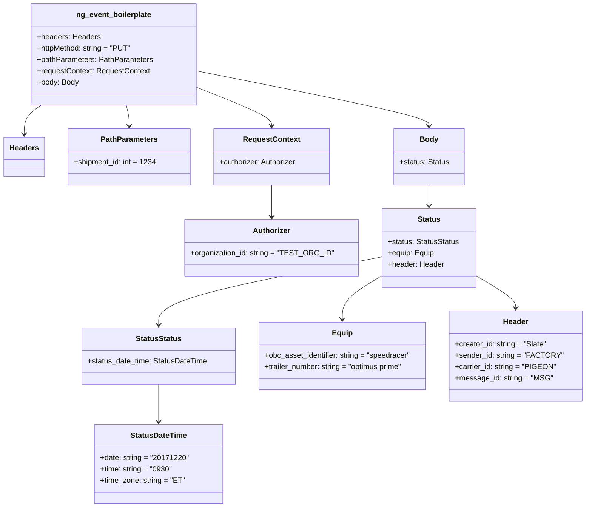

# Diagram: shipment_core/shipment_service/shipment_service/fvshared/tests/ng_shared.py

> Auto-generated by Obscura crawlers

## Mermaid

### SVG

<svg id="container" width="1226.58203125" xmlns="http://www.w3.org/2000/svg" class="classDiagram" height="1080" viewBox="0 0 1226.58203125 1080" role="graphics-document document" aria-roledescription="class"><g><defs><marker id="container_class-aggregationStart" class="marker aggregation class" refX="18" refY="7" markerWidth="190" markerHeight="240" orient="auto"><path d="M 18,7 L9,13 L1,7 L9,1 Z"></path></marker></defs><defs><marker id="container_class-aggregationEnd" class="marker aggregation class" refX="1" refY="7" markerWidth="20" markerHeight="28" orient="auto"><path d="M 18,7 L9,13 L1,7 L9,1 Z"></path></marker></defs><defs><marker id="container_class-extensionStart" class="marker extension class" refX="18" refY="7" markerWidth="190" markerHeight="240" orient="auto"><path d="M 1,7 L18,13 V 1 Z"></path></marker></defs><defs><marker id="container_class-extensionEnd" class="marker extension class" refX="1" refY="7" markerWidth="20" markerHeight="28" orient="auto"><path d="M 1,1 V 13 L18,7 Z"></path></marker></defs><defs><marker id="container_class-compositionStart" class="marker composition class" refX="18" refY="7" markerWidth="190" markerHeight="240" orient="auto"><path d="M 18,7 L9,13 L1,7 L9,1 Z"></path></marker></defs><defs><marker id="container_class-compositionEnd" class="marker composition class" refX="1" refY="7" markerWidth="20" markerHeight="28" orient="auto"><path d="M 18,7 L9,13 L1,7 L9,1 Z"></path></marker></defs><defs><marker id="container_class-dependencyStart" class="marker dependency class" refX="6" refY="7" markerWidth="190" markerHeight="240" orient="auto"><path d="M 5,7 L9,13 L1,7 L9,1 Z"></path></marker></defs><defs><marker id="container_class-dependencyEnd" class="marker dependency class" refX="13" refY="7" markerWidth="20" markerHeight="28" orient="auto"><path d="M 18,7 L9,13 L14,7 L9,1 Z"></path></marker></defs><defs><marker id="container_class-lollipopStart" class="marker lollipop class" refX="13" refY="7" markerWidth="190" markerHeight="240" orient="auto"><circle stroke="black" fill="transparent" cx="7" cy="7" r="6"></circle></marker></defs><defs><marker id="container_class-lollipopEnd" class="marker lollipop class" refX="1" refY="7" markerWidth="190" markerHeight="240" orient="auto"><circle stroke="black" fill="transparent" cx="7" cy="7" r="6"></circle></marker></defs><g class="root"><g class="clusters"></g><g class="edgePaths"><path d="M85.807,224L79.88,228.167C73.952,232.333,62.097,240.667,56.17,251C50.242,261.333,50.242,273.667,50.242,279.833L50.242,286" id="id_ng_event_boilerplate_Headers_1" class="edge-thickness-normal edge-pattern-solid relation" style=";;;" data-edge="true" data-et="edge" data-id="id_ng_event_boilerplate_Headers_1" data-points="W3sieCI6ODUuODA3NDE4OTM3OTY5OTEsInkiOjIyNH0seyJ4Ijo1MC4yNDIxODc1LCJ5IjoyNDl9LHsieCI6NTAuMjQyMTg3NSwieSI6MjkyfV0=" marker-end="url(#container_class-dependencyEnd)"></path><path d="M264.781,224L265.758,228.167C266.735,232.333,268.69,240.667,269.667,248C270.645,255.333,270.645,261.667,270.645,264.833L270.645,268" id="id_ng_event_boilerplate_PathParameters_2" class="edge-thickness-normal edge-pattern-solid relation" style=";;;" data-edge="true" data-et="edge" data-id="id_ng_event_boilerplate_PathParameters_2" data-points="W3sieCI6MjY0Ljc4MDc1MDcwNDg4NzIsInkiOjIyNH0seyJ4IjoyNzAuNjQ0NTMxMjUsInkiOjI0OX0seyJ4IjoyNzAuNjQ0NTMxMjUsInkiOjI3NH1d" marker-end="url(#container_class-dependencyEnd)"></path><path d="M412.895,185.143L439.592,195.785C466.29,206.428,519.686,227.714,546.384,241.524C573.082,255.333,573.082,261.667,573.082,264.833L573.082,268" id="id_ng_event_boilerplate_RequestContext_3" class="edge-thickness-normal edge-pattern-solid relation" style=";;;" data-edge="true" data-et="edge" data-id="id_ng_event_boilerplate_RequestContext_3" data-points="W3sieCI6NDEyLjg5NDUzMTI1LCJ5IjoxODUuMTQyNTU5NDE5MjcxNzV9LHsieCI6NTczLjA4MjAzMTI1LCJ5IjoyNDl9LHsieCI6NTczLjA4MjAzMTI1LCJ5IjoyNzR9XQ==" marker-end="url(#container_class-dependencyEnd)"></path><path d="M412.895,150.873L494.236,167.227C575.578,183.582,738.262,216.291,819.604,235.812C900.945,255.333,900.945,261.667,900.945,264.833L900.945,268" id="id_ng_event_boilerplate_Body_4" class="edge-thickness-normal edge-pattern-solid relation" style=";;;" data-edge="true" data-et="edge" data-id="id_ng_event_boilerplate_Body_4" data-points="W3sieCI6NDEyLjg5NDUzMTI1LCJ5IjoxNTAuODcyODA4NDQyMDM3NzV9LHsieCI6OTAwLjk0NTMxMjUsInkiOjI0OX0seyJ4Ijo5MDAuOTQ1MzEyNSwieSI6Mjc0fV0=" marker-end="url(#container_class-dependencyEnd)"></path><path d="M573.082,394L573.082,398.167C573.082,402.333,573.082,410.667,573.082,422C573.082,433.333,573.082,447.667,573.082,454.833L573.082,462" id="id_RequestContext_Authorizer_5" class="edge-thickness-normal edge-pattern-solid relation" style=";;;" data-edge="true" data-et="edge" data-id="id_RequestContext_Authorizer_5" data-points="W3sieCI6NTczLjA4MjAzMTI1LCJ5IjozOTR9LHsieCI6NTczLjA4MjAzMTI1LCJ5Ijo0MTl9LHsieCI6NTczLjA4MjAzMTI1LCJ5Ijo0Njh9XQ==" marker-end="url(#container_class-dependencyEnd)"></path><path d="M900.945,394L900.945,398.167C900.945,402.333,900.945,410.667,900.945,418C900.945,425.333,900.945,431.667,900.945,434.833L900.945,438" id="id_Body_Status_6" class="edge-thickness-normal edge-pattern-solid relation" style=";;;" data-edge="true" data-et="edge" data-id="id_Body_Status_6" data-points="W3sieCI6OTAwLjk0NTMxMjUsInkiOjM5NH0seyJ4Ijo5MDAuOTQ1MzEyNSwieSI6NDE5fSx7IngiOjkwMC45NDUzMTI1LCJ5Ijo0NDR9XQ==" marker-end="url(#container_class-dependencyEnd)"></path><path d="M801.32,546.885L722.087,561.904C642.854,576.923,484.388,606.962,405.155,631.147C325.922,655.333,325.922,673.667,325.922,682.833L325.922,692" id="id_Status_StatusStatus_7" class="edge-thickness-normal edge-pattern-solid relation" style=";;;" data-edge="true" data-et="edge" data-id="id_Status_StatusStatus_7" data-points="W3sieCI6ODAxLjMyMDMxMjUsInkiOjU0Ni44ODQ2NjUwMjcyNDA4fSx7IngiOjMyNS45MjE4NzUsInkiOjYzN30seyJ4IjozMjUuOTIxODc1LCJ5Ijo2OTh9XQ==" marker-end="url(#container_class-dependencyEnd)"></path><path d="M325.922,818L325.922,828.167C325.922,838.333,325.922,858.667,325.922,872C325.922,885.333,325.922,891.667,325.922,894.833L325.922,898" id="id_StatusStatus_StatusDateTime_8" class="edge-thickness-normal edge-pattern-solid relation" style=";;;" data-edge="true" data-et="edge" data-id="id_StatusStatus_StatusDateTime_8" data-points="W3sieCI6MzI1LjkyMTg3NSwieSI6ODE4fSx7IngiOjMyNS45MjE4NzUsInkiOjg3OX0seyJ4IjozMjUuOTIxODc1LCJ5Ijo5MDR9XQ==" marker-end="url(#container_class-dependencyEnd)"></path><path d="M801.32,587.53L787.522,595.775C773.724,604.02,746.128,620.51,732.329,635.922C718.531,651.333,718.531,665.667,718.531,672.833L718.531,680" id="id_Status_Equip_9" class="edge-thickness-normal edge-pattern-solid relation" style=";;;" data-edge="true" data-et="edge" data-id="id_Status_Equip_9" data-points="W3sieCI6ODAxLjMyMDMxMjUsInkiOjU4Ny41MzAwODY5NDE2MjQ5fSx7IngiOjcxOC41MzEyNSwieSI6NjM3fSx7IngiOjcxOC41MzEyNSwieSI6Njg2fV0=" marker-end="url(#container_class-dependencyEnd)"></path><path d="M1000.57,587.53L1014.368,595.775C1028.167,604.02,1055.763,620.51,1069.561,631.922C1083.359,643.333,1083.359,649.667,1083.359,652.833L1083.359,656" id="id_Status_Header_10" class="edge-thickness-normal edge-pattern-solid relation" style=";;;" data-edge="true" data-et="edge" data-id="id_Status_Header_10" data-points="W3sieCI6MTAwMC41NzAzMTI1LCJ5Ijo1ODcuNTMwMDg2OTQxNjI0OX0seyJ4IjoxMDgzLjM1OTM3NSwieSI6NjM3fSx7IngiOjEwODMuMzU5Mzc1LCJ5Ijo2NjJ9XQ==" marker-end="url(#container_class-dependencyEnd)"></path></g><g class="edgeLabels"><g class="edgeLabel"><g class="label" data-id="id_ng_event_boilerplate_Headers_1" transform="translate(0, 0)"><foreignObject width="0" height="0">

</foreignObject></g></g><g class="edgeLabel"><g class="label" data-id="id_ng_event_boilerplate_PathParameters_2" transform="translate(0, 0)"><foreignObject width="0" height="0">

</foreignObject></g></g><g class="edgeLabel"><g class="label" data-id="id_ng_event_boilerplate_RequestContext_3" transform="translate(0, 0)"><foreignObject width="0" height="0">

</foreignObject></g></g><g class="edgeLabel"><g class="label" data-id="id_ng_event_boilerplate_Body_4" transform="translate(0, 0)"><foreignObject width="0" height="0">

</foreignObject></g></g><g class="edgeLabel"><g class="label" data-id="id_RequestContext_Authorizer_5" transform="translate(0, 0)"><foreignObject width="0" height="0">

</foreignObject></g></g><g class="edgeLabel"><g class="label" data-id="id_Body_Status_6" transform="translate(0, 0)"><foreignObject width="0" height="0">

</foreignObject></g></g><g class="edgeLabel"><g class="label" data-id="id_Status_StatusStatus_7" transform="translate(0, 0)"><foreignObject width="0" height="0">

</foreignObject></g></g><g class="edgeLabel"><g class="label" data-id="id_StatusStatus_StatusDateTime_8" transform="translate(0, 0)"><foreignObject width="0" height="0">

</foreignObject></g></g><g class="edgeLabel"><g class="label" data-id="id_Status_Equip_9" transform="translate(0, 0)"><foreignObject width="0" height="0">

</foreignObject></g></g><g class="edgeLabel"><g class="label" data-id="id_Status_Header_10" transform="translate(0, 0)"><foreignObject width="0" height="0">

</foreignObject></g></g></g><g class="nodes"><g class="node default" id="classId-ng_event_boilerplate-0" transform="translate(239.44921875, 116)"><g class="basic label-container"><path d="M-173.4453125 -108 L173.4453125 -108 L173.4453125 108 L-173.4453125 108" stroke="none" stroke-width="0" fill="#ECECFF" style=""></path><path d="M-173.4453125 -108 C-100.54266250601248 -108, -27.640012512024953 -108, 173.4453125 -108 M-173.4453125 -108 C-66.45439590294063 -108, 40.536520694118735 -108, 173.4453125 -108 M173.4453125 -108 C173.4453125 -22.08019179826374, 173.4453125 63.83961640347252, 173.4453125 108 M173.4453125 -108 C173.4453125 -27.138383182007047, 173.4453125 53.723233635985906, 173.4453125 108 M173.4453125 108 C41.1057323454699 108, -91.2338478090602 108, -173.4453125 108 M173.4453125 108 C63.52396677932542 108, -46.39737894134916 108, -173.4453125 108 M-173.4453125 108 C-173.4453125 49.74771943357009, -173.4453125 -8.50456113285982, -173.4453125 -108 M-173.4453125 108 C-173.4453125 51.89152332303577, -173.4453125 -4.21695335392846, -173.4453125 -108" stroke="#9370DB" stroke-width="1.3" fill="none" stroke-dasharray="0 0" style=""></path></g><g class="annotation-group text" transform="translate(0, -84)"></g><g class="label-group text" transform="translate(-78.28125, -84)"><g class="label" style="font-weight: bolder" transform="translate(0,-12)"><foreignObject width="156.5625" height="24">

ng_event_boilerplate

</foreignObject></g></g><g class="members-group text" transform="translate(-161.4453125, -36)"><g class="label" style="" transform="translate(0,-12)"><foreignObject width="134.25" height="24">

+headers: Headers

</foreignObject></g><g class="label" style="" transform="translate(0,12)"><foreignObject width="200.9375" height="24">

+httpMethod: string = "PUT"

</foreignObject></g><g class="label" style="" transform="translate(0,36)"><foreignObject width="244.609375" height="24">

+pathParameters: PathParameters

</foreignObject></g><g class="label" style="" transform="translate(0,60)"><foreignObject width="240.421875" height="24">

+requestContext: RequestContext

</foreignObject></g><g class="label" style="" transform="translate(0,84)"><foreignObject width="88.9375" height="24">

+body: Body

</foreignObject></g></g><g class="methods-group text" transform="translate(-161.4453125, 108)"></g><g class="divider" style=""><path d="M-173.4453125 -60 C-69.3291370969478 -60, 34.78703830610439 -60, 173.4453125 -60 M-173.4453125 -60 C-86.73670885385263 -60, -0.028105207705266366 -60, 173.4453125 -60" stroke="#9370DB" stroke-width="1.3" fill="none" stroke-dasharray="0 0" style=""></path></g><g class="divider" style=""><path d="M-173.4453125 84 C-103.82336494211715 84, -34.201417384234304 84, 173.4453125 84 M-173.4453125 84 C-43.72469955368203 84, 85.99591339263594 84, 173.4453125 84" stroke="#9370DB" stroke-width="1.3" fill="none" stroke-dasharray="0 0" style=""></path></g></g><g class="node default" id="classId-Headers-1" transform="translate(50.2421875, 334)"><g class="basic label-container"><path d="M-42.2421875 -42 L42.2421875 -42 L42.2421875 42 L-42.2421875 42" stroke="none" stroke-width="0" fill="#ECECFF" style=""></path><path d="M-42.2421875 -42 C-13.750740767036998 -42, 14.740705965926004 -42, 42.2421875 -42 M-42.2421875 -42 C-13.148672018672098 -42, 15.944843462655804 -42, 42.2421875 -42 M42.2421875 -42 C42.2421875 -17.902924808561522, 42.2421875 6.1941503828769555, 42.2421875 42 M42.2421875 -42 C42.2421875 -23.003843067708956, 42.2421875 -4.007686135417913, 42.2421875 42 M42.2421875 42 C13.044928074255612 42, -16.152331351488776 42, -42.2421875 42 M42.2421875 42 C25.144487780602546 42, 8.046788061205092 42, -42.2421875 42 M-42.2421875 42 C-42.2421875 23.62500039119615, -42.2421875 5.2500007823922985, -42.2421875 -42 M-42.2421875 42 C-42.2421875 23.930050052600976, -42.2421875 5.860100105201951, -42.2421875 -42" stroke="#9370DB" stroke-width="1.3" fill="none" stroke-dasharray="0 0" style=""></path></g><g class="annotation-group text" transform="translate(0, -18)"></g><g class="label-group text" transform="translate(-30.2421875, -18)"><g class="label" style="font-weight: bolder" transform="translate(0,-12)"><foreignObject width="60.484375" height="24">

Headers

</foreignObject></g></g><g class="members-group text" transform="translate(-30.2421875, 30)"></g><g class="methods-group text" transform="translate(-30.2421875, 60)"></g><g class="divider" style=""><path d="M-42.2421875 6 C-18.859652513706145 6, 4.52288247258771 6, 42.2421875 6 M-42.2421875 6 C-16.107477193114878 6, 10.027233113770244 6, 42.2421875 6" stroke="#9370DB" stroke-width="1.3" fill="none" stroke-dasharray="0 0" style=""></path></g><g class="divider" style=""><path d="M-42.2421875 24 C-21.54942161452103 24, -0.8566557290420604 24, 42.2421875 24 M-42.2421875 24 C-11.13666173361182 24, 19.96886403277636 24, 42.2421875 24" stroke="#9370DB" stroke-width="1.3" fill="none" stroke-dasharray="0 0" style=""></path></g></g><g class="node default" id="classId-PathParameters-2" transform="translate(270.64453125, 334)"><g class="basic label-container"><path d="M-128.16015625 -60 L128.16015625 -60 L128.16015625 60 L-128.16015625 60" stroke="none" stroke-width="0" fill="#ECECFF" style=""></path><path d="M-128.16015625 -60 C-57.10865421794669 -60, 13.942847814106614 -60, 128.16015625 -60 M-128.16015625 -60 C-38.51119621354508 -60, 51.13776382290985 -60, 128.16015625 -60 M128.16015625 -60 C128.16015625 -33.4549679274417, 128.16015625 -6.909935854883393, 128.16015625 60 M128.16015625 -60 C128.16015625 -35.82178089118973, 128.16015625 -11.643561782379457, 128.16015625 60 M128.16015625 60 C44.97813194264256 60, -38.203892364714875 60, -128.16015625 60 M128.16015625 60 C32.52878503547802 60, -63.10258617904395 60, -128.16015625 60 M-128.16015625 60 C-128.16015625 20.889642526777898, -128.16015625 -18.220714946444204, -128.16015625 -60 M-128.16015625 60 C-128.16015625 23.17703162861708, -128.16015625 -13.64593674276584, -128.16015625 -60" stroke="#9370DB" stroke-width="1.3" fill="none" stroke-dasharray="0 0" style=""></path></g><g class="annotation-group text" transform="translate(0, -36)"></g><g class="label-group text" transform="translate(-58.0703125, -36)"><g class="label" style="font-weight: bolder" transform="translate(0,-12)"><foreignObject width="116.140625" height="24">

PathParameters

</foreignObject></g></g><g class="members-group text" transform="translate(-116.16015625, 12)"><g class="label" style="" transform="translate(0,-12)"><foreignObject width="174.25" height="24">

+shipment_id: int = 1234

</foreignObject></g></g><g class="methods-group text" transform="translate(-116.16015625, 60)"></g><g class="divider" style=""><path d="M-128.16015625 -12 C-75.53362213152653 -12, -22.90708801305307 -12, 128.16015625 -12 M-128.16015625 -12 C-62.64907439627734 -12, 2.8620074574453156 -12, 128.16015625 -12" stroke="#9370DB" stroke-width="1.3" fill="none" stroke-dasharray="0 0" style=""></path></g><g class="divider" style=""><path d="M-128.16015625 36 C-73.20889304489225 36, -18.257629839784514 36, 128.16015625 36 M-128.16015625 36 C-35.33964311060066 36, 57.48087002879868 36, 128.16015625 36" stroke="#9370DB" stroke-width="1.3" fill="none" stroke-dasharray="0 0" style=""></path></g></g><g class="node default" id="classId-RequestContext-3" transform="translate(573.08203125, 334)"><g class="basic label-container"><path d="M-124.27734375 -60 L124.27734375 -60 L124.27734375 60 L-124.27734375 60" stroke="none" stroke-width="0" fill="#ECECFF" style=""></path><path d="M-124.27734375 -60 C-73.91291733468725 -60, -23.548490919374487 -60, 124.27734375 -60 M-124.27734375 -60 C-24.969316199383826 -60, 74.33871135123235 -60, 124.27734375 -60 M124.27734375 -60 C124.27734375 -30.589873558809852, 124.27734375 -1.179747117619705, 124.27734375 60 M124.27734375 -60 C124.27734375 -35.78511804279134, 124.27734375 -11.570236085582678, 124.27734375 60 M124.27734375 60 C29.104295098633813 60, -66.06875355273237 60, -124.27734375 60 M124.27734375 60 C71.92178365911047 60, 19.566223568220934 60, -124.27734375 60 M-124.27734375 60 C-124.27734375 34.657428634955366, -124.27734375 9.314857269910732, -124.27734375 -60 M-124.27734375 60 C-124.27734375 23.604168698347785, -124.27734375 -12.791662603304431, -124.27734375 -60" stroke="#9370DB" stroke-width="1.3" fill="none" stroke-dasharray="0 0" style=""></path></g><g class="annotation-group text" transform="translate(0, -36)"></g><g class="label-group text" transform="translate(-58.1484375, -36)"><g class="label" style="font-weight: bolder" transform="translate(0,-12)"><foreignObject width="116.296875" height="24">

RequestContext

</foreignObject></g></g><g class="members-group text" transform="translate(-112.27734375, 12)"><g class="label" style="" transform="translate(0,-12)"><foreignObject width="166.40625" height="24">

+authorizer: Authorizer

</foreignObject></g></g><g class="methods-group text" transform="translate(-112.27734375, 60)"></g><g class="divider" style=""><path d="M-124.27734375 -12 C-54.52156775072406 -12, 15.23420824855188 -12, 124.27734375 -12 M-124.27734375 -12 C-65.02066070813336 -12, -5.763977666266726 -12, 124.27734375 -12" stroke="#9370DB" stroke-width="1.3" fill="none" stroke-dasharray="0 0" style=""></path></g><g class="divider" style=""><path d="M-124.27734375 36 C-32.799072683387436 36, 58.67919838322513 36, 124.27734375 36 M-124.27734375 36 C-51.4913967130482 36, 21.294550323903593 36, 124.27734375 36" stroke="#9370DB" stroke-width="1.3" fill="none" stroke-dasharray="0 0" style=""></path></g></g><g class="node default" id="classId-Authorizer-4" transform="translate(573.08203125, 528)"><g class="basic label-container"><path d="M-178.23828125 -60 L178.23828125 -60 L178.23828125 60 L-178.23828125 60" stroke="none" stroke-width="0" fill="#ECECFF" style=""></path><path d="M-178.23828125 -60 C-103.26007600682607 -60, -28.281870763652137 -60, 178.23828125 -60 M-178.23828125 -60 C-47.03051902303818 -60, 84.17724320392364 -60, 178.23828125 -60 M178.23828125 -60 C178.23828125 -17.605799761406857, 178.23828125 24.788400477186286, 178.23828125 60 M178.23828125 -60 C178.23828125 -33.639377424166916, 178.23828125 -7.278754848333833, 178.23828125 60 M178.23828125 60 C104.00585451073626 60, 29.773427771472512 60, -178.23828125 60 M178.23828125 60 C87.18012789546205 60, -3.8780254590759 60, -178.23828125 60 M-178.23828125 60 C-178.23828125 30.350486960659943, -178.23828125 0.7009739213198856, -178.23828125 -60 M-178.23828125 60 C-178.23828125 15.543420137468672, -178.23828125 -28.913159725062656, -178.23828125 -60" stroke="#9370DB" stroke-width="1.3" fill="none" stroke-dasharray="0 0" style=""></path></g><g class="annotation-group text" transform="translate(0, -36)"></g><g class="label-group text" transform="translate(-38.3671875, -36)"><g class="label" style="font-weight: bolder" transform="translate(0,-12)"><foreignObject width="76.734375" height="24">

Authorizer

</foreignObject></g></g><g class="members-group text" transform="translate(-166.23828125, 12)"><g class="label" style="" transform="translate(0,-12)"><foreignObject width="294.109375" height="24">

+organization_id: string = "TEST_ORG_ID"

</foreignObject></g></g><g class="methods-group text" transform="translate(-166.23828125, 60)"></g><g class="divider" style=""><path d="M-178.23828125 -12 C-86.8988552265018 -12, 4.440570796996411 -12, 178.23828125 -12 M-178.23828125 -12 C-73.03663912395776 -12, 32.16500300208449 -12, 178.23828125 -12" stroke="#9370DB" stroke-width="1.3" fill="none" stroke-dasharray="0 0" style=""></path></g><g class="divider" style=""><path d="M-178.23828125 36 C-47.62213917663084 36, 82.99400289673832 36, 178.23828125 36 M-178.23828125 36 C-86.5945575156036 36, 5.049166218792806 36, 178.23828125 36" stroke="#9370DB" stroke-width="1.3" fill="none" stroke-dasharray="0 0" style=""></path></g></g><g class="node default" id="classId-Body-5" transform="translate(900.9453125, 334)"><g class="basic label-container"><path d="M-74.33984375 -60 L74.33984375 -60 L74.33984375 60 L-74.33984375 60" stroke="none" stroke-width="0" fill="#ECECFF" style=""></path><path d="M-74.33984375 -60 C-33.664373416429775 -60, 7.011096917140449 -60, 74.33984375 -60 M-74.33984375 -60 C-22.470769016847754 -60, 29.398305716304492 -60, 74.33984375 -60 M74.33984375 -60 C74.33984375 -19.647008909988323, 74.33984375 20.705982180023355, 74.33984375 60 M74.33984375 -60 C74.33984375 -23.52747187145414, 74.33984375 12.945056257091721, 74.33984375 60 M74.33984375 60 C25.118897390234565 60, -24.10204896953087 60, -74.33984375 60 M74.33984375 60 C38.660529053053224 60, 2.981214356106449 60, -74.33984375 60 M-74.33984375 60 C-74.33984375 30.86013113428113, -74.33984375 1.7202622685622586, -74.33984375 -60 M-74.33984375 60 C-74.33984375 33.2060948097783, -74.33984375 6.4121896195565995, -74.33984375 -60" stroke="#9370DB" stroke-width="1.3" fill="none" stroke-dasharray="0 0" style=""></path></g><g class="annotation-group text" transform="translate(0, -36)"></g><g class="label-group text" transform="translate(-18.5546875, -36)"><g class="label" style="font-weight: bolder" transform="translate(0,-12)"><foreignObject width="37.109375" height="24">

Body

</foreignObject></g></g><g class="members-group text" transform="translate(-62.33984375, 12)"><g class="label" style="" transform="translate(0,-12)"><foreignObject width="106.125" height="24">

+status: Status

</foreignObject></g></g><g class="methods-group text" transform="translate(-62.33984375, 60)"></g><g class="divider" style=""><path d="M-74.33984375 -12 C-28.637039523739745 -12, 17.06576470252051 -12, 74.33984375 -12 M-74.33984375 -12 C-38.75889899576595 -12, -3.177954241531907 -12, 74.33984375 -12" stroke="#9370DB" stroke-width="1.3" fill="none" stroke-dasharray="0 0" style=""></path></g><g class="divider" style=""><path d="M-74.33984375 36 C-39.59163402441788 36, -4.843424298835757 36, 74.33984375 36 M-74.33984375 36 C-27.394677006197128 36, 19.550489737605744 36, 74.33984375 36" stroke="#9370DB" stroke-width="1.3" fill="none" stroke-dasharray="0 0" style=""></path></g></g><g class="node default" id="classId-Status-6" transform="translate(900.9453125, 528)"><g class="basic label-container"><path d="M-99.625 -84 L99.625 -84 L99.625 84 L-99.625 84" stroke="none" stroke-width="0" fill="#ECECFF" style=""></path><path d="M-99.625 -84 C-23.21187198873247 -84, 53.20125602253506 -84, 99.625 -84 M-99.625 -84 C-56.32691484520539 -84, -13.028829690410774 -84, 99.625 -84 M99.625 -84 C99.625 -40.31982887326669, 99.625 3.3603422534666265, 99.625 84 M99.625 -84 C99.625 -36.09737830138515, 99.625 11.805243397229702, 99.625 84 M99.625 84 C37.985454451289236 84, -23.654091097421528 84, -99.625 84 M99.625 84 C38.00191003778815 84, -23.6211799244237 84, -99.625 84 M-99.625 84 C-99.625 27.096136936122896, -99.625 -29.807726127754208, -99.625 -84 M-99.625 84 C-99.625 22.946922871064253, -99.625 -38.106154257871495, -99.625 -84" stroke="#9370DB" stroke-width="1.3" fill="none" stroke-dasharray="0 0" style=""></path></g><g class="annotation-group text" transform="translate(0, -60)"></g><g class="label-group text" transform="translate(-23.484375, -60)"><g class="label" style="font-weight: bolder" transform="translate(0,-12)"><foreignObject width="46.96875" height="24">

Status

</foreignObject></g></g><g class="members-group text" transform="translate(-87.625, -12)"><g class="label" style="" transform="translate(0,-12)"><foreignObject width="151.765625" height="24">

+status: StatusStatus

</foreignObject></g><g class="label" style="" transform="translate(0,12)"><foreignObject width="98.828125" height="24">

+equip: Equip

</foreignObject></g><g class="label" style="" transform="translate(0,36)"><foreignObject width="119.9375" height="24">

+header: Header

</foreignObject></g></g><g class="methods-group text" transform="translate(-87.625, 84)"></g><g class="divider" style=""><path d="M-99.625 -36 C-20.125091033379547 -36, 59.374817933240905 -36, 99.625 -36 M-99.625 -36 C-51.34268980949616 -36, -3.0603796189923145 -36, 99.625 -36" stroke="#9370DB" stroke-width="1.3" fill="none" stroke-dasharray="0 0" style=""></path></g><g class="divider" style=""><path d="M-99.625 60 C-55.52984572537248 60, -11.434691450744964 60, 99.625 60 M-99.625 60 C-51.90526783598625 60, -4.185535671972502 60, 99.625 60" stroke="#9370DB" stroke-width="1.3" fill="none" stroke-dasharray="0 0" style=""></path></g></g><g class="node default" id="classId-StatusStatus-7" transform="translate(325.921875, 758)"><g class="basic label-container"><path d="M-163.00390625 -60 L163.00390625 -60 L163.00390625 60 L-163.00390625 60" stroke="none" stroke-width="0" fill="#ECECFF" style=""></path><path d="M-163.00390625 -60 C-84.50766775190327 -60, -6.01142925380654 -60, 163.00390625 -60 M-163.00390625 -60 C-71.2273539645075 -60, 20.549198320985 -60, 163.00390625 -60 M163.00390625 -60 C163.00390625 -15.931444430372991, 163.00390625 28.137111139254017, 163.00390625 60 M163.00390625 -60 C163.00390625 -18.90966772656912, 163.00390625 22.180664546861763, 163.00390625 60 M163.00390625 60 C41.38582299604482 60, -80.23226025791035 60, -163.00390625 60 M163.00390625 60 C82.09804103584993 60, 1.1921758216998626 60, -163.00390625 60 M-163.00390625 60 C-163.00390625 31.94029902220761, -163.00390625 3.8805980444152226, -163.00390625 -60 M-163.00390625 60 C-163.00390625 13.505873881116713, -163.00390625 -32.988252237766574, -163.00390625 -60" stroke="#9370DB" stroke-width="1.3" fill="none" stroke-dasharray="0 0" style=""></path></g><g class="annotation-group text" transform="translate(0, -36)"></g><g class="label-group text" transform="translate(-46.9609375, -36)"><g class="label" style="font-weight: bolder" transform="translate(0,-12)"><foreignObject width="93.921875" height="24">

StatusStatus

</foreignObject></g></g><g class="members-group text" transform="translate(-151.00390625, 12)"><g class="label" style="" transform="translate(0,-12)"><foreignObject width="255.046875" height="24">

+status_date_time: StatusDateTime

</foreignObject></g></g><g class="methods-group text" transform="translate(-151.00390625, 60)"></g><g class="divider" style=""><path d="M-163.00390625 -12 C-91.32826907893346 -12, -19.65263190786692 -12, 163.00390625 -12 M-163.00390625 -12 C-95.5021137189266 -12, -28.00032118785319 -12, 163.00390625 -12" stroke="#9370DB" stroke-width="1.3" fill="none" stroke-dasharray="0 0" style=""></path></g><g class="divider" style=""><path d="M-163.00390625 36 C-55.668597829231516 36, 51.66671059153697 36, 163.00390625 36 M-163.00390625 36 C-95.55610446629898 36, -28.10830268259795 36, 163.00390625 36" stroke="#9370DB" stroke-width="1.3" fill="none" stroke-dasharray="0 0" style=""></path></g></g><g class="node default" id="classId-StatusDateTime-8" transform="translate(325.921875, 988)"><g class="basic label-container"><path d="M-131.65625 -84 L131.65625 -84 L131.65625 84 L-131.65625 84" stroke="none" stroke-width="0" fill="#ECECFF" style=""></path><path d="M-131.65625 -84 C-27.828698895782665 -84, 75.99885220843467 -84, 131.65625 -84 M-131.65625 -84 C-51.53562402624192 -84, 28.58500194751616 -84, 131.65625 -84 M131.65625 -84 C131.65625 -31.346857134570122, 131.65625 21.306285730859756, 131.65625 84 M131.65625 -84 C131.65625 -28.42170745544513, 131.65625 27.15658508910974, 131.65625 84 M131.65625 84 C65.41445874993771 84, -0.8273325001245837 84, -131.65625 84 M131.65625 84 C54.08781762494593 84, -23.480614750108145 84, -131.65625 84 M-131.65625 84 C-131.65625 33.374412031873916, -131.65625 -17.251175936252167, -131.65625 -84 M-131.65625 84 C-131.65625 38.6443034725132, -131.65625 -6.711393054973598, -131.65625 -84" stroke="#9370DB" stroke-width="1.3" fill="none" stroke-dasharray="0 0" style=""></path></g><g class="annotation-group text" transform="translate(0, -60)"></g><g class="label-group text" transform="translate(-58.109375, -60)"><g class="label" style="font-weight: bolder" transform="translate(0,-12)"><foreignObject width="116.21875" height="24">

StatusDateTime

</foreignObject></g></g><g class="members-group text" transform="translate(-119.65625, -12)"><g class="label" style="" transform="translate(0,-12)"><foreignObject width="181.203125" height="24">

+date: string = "20171220"

</foreignObject></g><g class="label" style="" transform="translate(0,12)"><foreignObject width="153.03125" height="24">

+time: string = "0930"

</foreignObject></g><g class="label" style="" transform="translate(0,36)"><foreignObject width="178.90625" height="24">

+time_zone: string = "ET"

</foreignObject></g></g><g class="methods-group text" transform="translate(-119.65625, 84)"></g><g class="divider" style=""><path d="M-131.65625 -36 C-42.88054283732991 -36, 45.895164325340176 -36, 131.65625 -36 M-131.65625 -36 C-40.5439446173628 -36, 50.568360765274406 -36, 131.65625 -36" stroke="#9370DB" stroke-width="1.3" fill="none" stroke-dasharray="0 0" style=""></path></g><g class="divider" style=""><path d="M-131.65625 60 C-42.646483694870724 60, 46.36328261025855 60, 131.65625 60 M-131.65625 60 C-70.02938769045198 60, -8.402525380903981 60, 131.65625 60" stroke="#9370DB" stroke-width="1.3" fill="none" stroke-dasharray="0 0" style=""></path></g></g><g class="node default" id="classId-Equip-9" transform="translate(718.53125, 758)"><g class="basic label-container"><path d="M-179.60546875 -72 L179.60546875 -72 L179.60546875 72 L-179.60546875 72" stroke="none" stroke-width="0" fill="#ECECFF" style=""></path><path d="M-179.60546875 -72 C-45.80021381973472 -72, 88.00504111053056 -72, 179.60546875 -72 M-179.60546875 -72 C-103.89995213962094 -72, -28.194435529241872 -72, 179.60546875 -72 M179.60546875 -72 C179.60546875 -18.295091410226362, 179.60546875 35.409817179547275, 179.60546875 72 M179.60546875 -72 C179.60546875 -37.28496761682689, 179.60546875 -2.56993523365378, 179.60546875 72 M179.60546875 72 C74.00679450485987 72, -31.591879740280262 72, -179.60546875 72 M179.60546875 72 C70.63962800349802 72, -38.326212743003964 72, -179.60546875 72 M-179.60546875 72 C-179.60546875 24.625490788802928, -179.60546875 -22.749018422394144, -179.60546875 -72 M-179.60546875 72 C-179.60546875 20.101122815253724, -179.60546875 -31.79775436949255, -179.60546875 -72" stroke="#9370DB" stroke-width="1.3" fill="none" stroke-dasharray="0 0" style=""></path></g><g class="annotation-group text" transform="translate(0, -48)"></g><g class="label-group text" transform="translate(-20.4609375, -48)"><g class="label" style="font-weight: bolder" transform="translate(0,-12)"><foreignObject width="40.921875" height="24">

Equip

</foreignObject></g></g><g class="members-group text" transform="translate(-167.60546875, 0)"><g class="label" style="" transform="translate(0,-12)"><foreignObject width="314.75" height="24">

+obc_asset_identifier: string = "speedracer"

</foreignObject></g><g class="label" style="" transform="translate(0,12)"><foreignObject width="301.15625" height="24">

+trailer_number: string = "optimus prime"

</foreignObject></g></g><g class="methods-group text" transform="translate(-167.60546875, 72)"></g><g class="divider" style=""><path d="M-179.60546875 -24 C-81.73030087833371 -24, 16.144866993332585 -24, 179.60546875 -24 M-179.60546875 -24 C-98.14117215239293 -24, -16.676875554785852 -24, 179.60546875 -24" stroke="#9370DB" stroke-width="1.3" fill="none" stroke-dasharray="0 0" style=""></path></g><g class="divider" style=""><path d="M-179.60546875 48 C-101.10465538860474 48, -22.60384202720948 48, 179.60546875 48 M-179.60546875 48 C-37.594120280080716 48, 104.41722818983857 48, 179.60546875 48" stroke="#9370DB" stroke-width="1.3" fill="none" stroke-dasharray="0 0" style=""></path></g></g><g class="node default" id="classId-Header-10" transform="translate(1083.359375, 758)"><g class="basic label-container"><path d="M-135.22265625 -96 L135.22265625 -96 L135.22265625 96 L-135.22265625 96" stroke="none" stroke-width="0" fill="#ECECFF" style=""></path><path d="M-135.22265625 -96 C-78.57064859096641 -96, -21.918640931932813 -96, 135.22265625 -96 M-135.22265625 -96 C-74.6337642704568 -96, -14.044872290913602 -96, 135.22265625 -96 M135.22265625 -96 C135.22265625 -42.32614966714406, 135.22265625 11.347700665711884, 135.22265625 96 M135.22265625 -96 C135.22265625 -48.85456579003822, 135.22265625 -1.7091315800764448, 135.22265625 96 M135.22265625 96 C29.037366225495802 96, -77.1479237990084 96, -135.22265625 96 M135.22265625 96 C74.29690036153366 96, 13.371144473067318 96, -135.22265625 96 M-135.22265625 96 C-135.22265625 40.53988973035017, -135.22265625 -14.920220539299663, -135.22265625 -96 M-135.22265625 96 C-135.22265625 28.299216515514132, -135.22265625 -39.401566968971736, -135.22265625 -96" stroke="#9370DB" stroke-width="1.3" fill="none" stroke-dasharray="0 0" style=""></path></g><g class="annotation-group text" transform="translate(0, -72)"></g><g class="label-group text" transform="translate(-26.4765625, -72)"><g class="label" style="font-weight: bolder" transform="translate(0,-12)"><foreignObject width="52.953125" height="24">

Header

</foreignObject></g></g><g class="members-group text" transform="translate(-123.22265625, -24)"><g class="label" style="" transform="translate(0,-12)"><foreignObject width="195.859375" height="24">

+creator_id: string = "Slate"

</foreignObject></g><g class="label" style="" transform="translate(0,12)"><foreignObject width="219.96875" height="24">

+sender_id: string = "FACTORY"

</foreignObject></g><g class="label" style="" transform="translate(0,36)"><foreignObject width="210.5" height="24">

+carrier_id: string = "PIGEON"

</foreignObject></g><g class="label" style="" transform="translate(0,60)"><foreignObject width="202.28125" height="24">

+message_id: string = "MSG"

</foreignObject></g></g><g class="methods-group text" transform="translate(-123.22265625, 96)"></g><g class="divider" style=""><path d="M-135.22265625 -48 C-66.50867012251396 -48, 2.205316004972076 -48, 135.22265625 -48 M-135.22265625 -48 C-38.56364451665196 -48, 58.095367216696076 -48, 135.22265625 -48" stroke="#9370DB" stroke-width="1.3" fill="none" stroke-dasharray="0 0" style=""></path></g><g class="divider" style=""><path d="M-135.22265625 72 C-36.48210280398909 72, 62.25845064202181 72, 135.22265625 72 M-135.22265625 72 C-58.634102875253916 72, 17.954450499492168 72, 135.22265625 72" stroke="#9370DB" stroke-width="1.3" fill="none" stroke-dasharray="0 0" style=""></path></g></g></g></g></g></svg>
