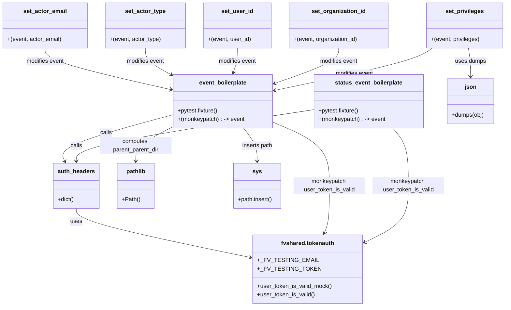

# Diagram: shipment_core/shipment_service/shipment_service/fvshared/tests/shared.py

> Auto-generated by Obscura crawlers

## Mermaid

### SVG

<svg id="container" width="1402.794921875" xmlns="http://www.w3.org/2000/svg" class="classDiagram" height="856" viewBox="0 0 1402.794921875 856" role="graphics-document document" aria-roledescription="class"><g><defs><marker id="container_class-aggregationStart" class="marker aggregation class" refX="18" refY="7" markerWidth="190" markerHeight="240" orient="auto"><path d="M 18,7 L9,13 L1,7 L9,1 Z"></path></marker></defs><defs><marker id="container_class-aggregationEnd" class="marker aggregation class" refX="1" refY="7" markerWidth="20" markerHeight="28" orient="auto"><path d="M 18,7 L9,13 L1,7 L9,1 Z"></path></marker></defs><defs><marker id="container_class-extensionStart" class="marker extension class" refX="18" refY="7" markerWidth="190" markerHeight="240" orient="auto"><path d="M 1,7 L18,13 V 1 Z"></path></marker></defs><defs><marker id="container_class-extensionEnd" class="marker extension class" refX="1" refY="7" markerWidth="20" markerHeight="28" orient="auto"><path d="M 1,1 V 13 L18,7 Z"></path></marker></defs><defs><marker id="container_class-compositionStart" class="marker composition class" refX="18" refY="7" markerWidth="190" markerHeight="240" orient="auto"><path d="M 18,7 L9,13 L1,7 L9,1 Z"></path></marker></defs><defs><marker id="container_class-compositionEnd" class="marker composition class" refX="1" refY="7" markerWidth="20" markerHeight="28" orient="auto"><path d="M 18,7 L9,13 L1,7 L9,1 Z"></path></marker></defs><defs><marker id="container_class-dependencyStart" class="marker dependency class" refX="6" refY="7" markerWidth="190" markerHeight="240" orient="auto"><path d="M 5,7 L9,13 L1,7 L9,1 Z"></path></marker></defs><defs><marker id="container_class-dependencyEnd" class="marker dependency class" refX="13" refY="7" markerWidth="20" markerHeight="28" orient="auto"><path d="M 18,7 L9,13 L14,7 L9,1 Z"></path></marker></defs><defs><marker id="container_class-lollipopStart" class="marker lollipop class" refX="13" refY="7" markerWidth="190" markerHeight="240" orient="auto"><circle stroke="black" fill="transparent" cx="7" cy="7" r="6"></circle></marker></defs><defs><marker id="container_class-lollipopEnd" class="marker lollipop class" refX="1" refY="7" markerWidth="190" markerHeight="240" orient="auto"><circle stroke="black" fill="transparent" cx="7" cy="7" r="6"></circle></marker></defs><g class="root"><g class="clusters"></g><g class="edgePaths"><path d="M210.537,582L210.537,588.167C210.537,594.333,210.537,606.667,291.187,629.56C371.837,652.454,533.136,685.908,613.786,702.635L694.436,719.362" id="id_auth_headers_fvshared.tokenauth_1" class="edge-thickness-normal edge-pattern-solid relation" style=";;;" data-edge="true" data-et="edge" data-id="id_auth_headers_fvshared.tokenauth_1" data-points="W3sieCI6MjEwLjUzNzEwOTM3NSwieSI6NTgyfSx7IngiOjIxMC41MzcxMDkzNzUsInkiOjYxOX0seyJ4Ijo3MDAuMzEwNTQ2ODc1LCJ5Ijo3MjAuNTgwMTYzNzM4NzAwM31d" marker-end="url(#container_class-dependencyEnd)"></path><path d="M475.889,320.555L422.848,334.962C369.808,349.37,263.727,378.185,214.116,399.855C164.506,421.525,171.365,436.05,174.794,443.312L178.224,450.575" id="id_event_boilerplate_auth_headers_2" class="edge-thickness-normal edge-pattern-solid relation" style=";;;" data-edge="true" data-et="edge" data-id="id_event_boilerplate_auth_headers_2" data-points="W3sieCI6NDc1Ljg4ODY3MTg3NSwieSI6MzIwLjU1NDUwMzk5MTg1Mzd9LHsieCI6MTU3LjY0NjQ4NDM3NSwieSI6NDA3fSx7IngiOjE4MC43ODYxMzI4MTI1LCJ5Ijo0NTZ9XQ==" marker-end="url(#container_class-dependencyEnd)"></path><path d="M870.15,306.168L760.215,322.973C650.279,339.779,430.408,373.389,320.473,397.361C210.537,421.333,210.537,435.667,210.537,442.833L210.537,450" id="id_status_event_boilerplate_auth_headers_3" class="edge-thickness-normal edge-pattern-solid relation" style=";;;" data-edge="true" data-et="edge" data-id="id_status_event_boilerplate_auth_headers_3" data-points="W3sieCI6ODcwLjE1MDM5MDYyNSwieSI6MzA2LjE2ODA0MzkxNzk0Mjh9LHsieCI6MjEwLjUzNzEwOTM3NSwieSI6NDA3fSx7IngiOjIxMC41MzcxMDkzNzUsInkiOjQ1Nn1d" marker-end="url(#container_class-dependencyEnd)"></path><path d="M752.396,340.53L779.02,351.608C805.643,362.686,858.89,384.843,885.513,414.588C912.137,444.333,912.137,481.667,912.137,517C912.137,552.333,912.137,585.667,909.752,607.589C907.368,629.512,902.599,640.024,900.215,645.28L897.831,650.536" id="id_event_boilerplate_fvshared.tokenauth_4" class="edge-thickness-normal edge-pattern-solid relation" style=";;;" data-edge="true" data-et="edge" data-id="id_event_boilerplate_fvshared.tokenauth_4" data-points="W3sieCI6NzUyLjM5NjQ4NDM3NSwieSI6MzQwLjUyOTYwMjIyMzE5ODF9LHsieCI6OTEyLjEzNjcxODc1LCJ5Ijo0MDd9LHsieCI6OTEyLjEzNjcxODc1LCJ5Ijo1MTl9LHsieCI6OTEyLjEzNjcxODc1LCJ5Ijo2MTl9LHsieCI6ODk1LjM1MjA3NjQ4MDI2MzEsInkiOjY1Nn1d" marker-end="url(#container_class-dependencyEnd)"></path><path d="M1088.5,358L1095.773,366.167C1103.046,374.333,1117.591,390.667,1124.864,417.5C1132.137,444.333,1132.137,481.667,1132.137,517C1132.137,552.333,1132.137,585.667,1111.567,612.093C1090.996,638.518,1049.856,658.037,1029.286,667.796L1008.716,677.555" id="id_status_event_boilerplate_fvshared.tokenauth_5" class="edge-thickness-normal edge-pattern-solid relation" style=";;;" data-edge="true" data-et="edge" data-id="id_status_event_boilerplate_fvshared.tokenauth_5" data-points="W3sieCI6MTA4OC40OTk5NTI3NDY5NzU5LCJ5IjozNTh9LHsieCI6MTEzMi4xMzY3MTg3NSwieSI6NDA3fSx7IngiOjExMzIuMTM2NzE4NzUsInkiOjUxOX0seyJ4IjoxMTMyLjEzNjcxODc1LCJ5Ijo2MTl9LHsieCI6MTAwMy4yOTQ5MjE4NzUsInkiOjY4MC4xMjY5NDEyMTgyNzM0fV0=" marker-end="url(#container_class-dependencyEnd)"></path><path d="M124.629,134L124.629,140.167C124.629,146.333,124.629,158.667,182.197,178.005C239.766,197.343,354.903,223.686,412.471,236.858L470.04,250.03" id="id_set_actor_email_event_boilerplate_6" class="edge-thickness-normal edge-pattern-solid relation" style=";;;" data-edge="true" data-et="edge" data-id="id_set_actor_email_event_boilerplate_6" data-points="W3sieCI6MTI0LjYyODkwNjI1LCJ5IjoxMzR9LHsieCI6MTI0LjYyODkwNjI1LCJ5IjoxNzF9LHsieCI6NDc1Ljg4ODY3MTg3NSwieSI6MjUxLjM2NzcxMTg5NTE3NjU3fV0=" marker-end="url(#container_class-dependencyEnd)"></path><path d="M401.719,134L401.719,140.167C401.719,146.333,401.719,158.667,413.196,170.885C424.673,183.103,447.627,195.205,459.104,201.256L470.581,207.308" id="id_set_actor_type_event_boilerplate_7" class="edge-thickness-normal edge-pattern-solid relation" style=";;;" data-edge="true" data-et="edge" data-id="id_set_actor_type_event_boilerplate_7" data-points="W3sieCI6NDAxLjcxODc1LCJ5IjoxMzR9LHsieCI6NDAxLjcxODc1LCJ5IjoxNzF9LHsieCI6NDc1Ljg4ODY3MTg3NSwieSI6MjEwLjEwNTkyOTUxNTE3NTV9XQ==" marker-end="url(#container_class-dependencyEnd)"></path><path d="M655.008,134L655.008,140.167C655.008,146.333,655.008,158.667,653.101,170.061C651.193,181.454,647.379,191.909,645.472,197.136L643.564,202.363" id="id_set_user_id_event_boilerplate_8" class="edge-thickness-normal edge-pattern-solid relation" style=";;;" data-edge="true" data-et="edge" data-id="id_set_user_id_event_boilerplate_8" data-points="W3sieCI6NjU1LjAwNzgxMjUsInkiOjEzNH0seyJ4Ijo2NTUuMDA3ODEyNSwieSI6MTcxfSx7IngiOjY0MS41MDc2OTA0Mjk2ODc1LCJ5IjoyMDh9XQ==" marker-end="url(#container_class-dependencyEnd)"></path><path d="M935.844,134L935.844,140.167C935.844,146.333,935.844,158.667,906.214,175.149C876.583,191.631,817.323,212.263,787.693,222.579L758.063,232.894" id="id_set_organization_id_event_boilerplate_9" class="edge-thickness-normal edge-pattern-solid relation" style=";;;" data-edge="true" data-et="edge" data-id="id_set_organization_id_event_boilerplate_9" data-points="W3sieCI6OTM1Ljg0Mzc1LCJ5IjoxMzR9LHsieCI6OTM1Ljg0Mzc1LCJ5IjoxNzF9LHsieCI6NzUyLjM5NjQ4NDM3NSwieSI6MjM0Ljg2NzAxNTU2MDU4NzkzfV0=" marker-end="url(#container_class-dependencyEnd)"></path><path d="M1199.077,134L1190.314,140.167C1181.552,146.333,1164.027,158.667,1090.559,178.446C1017.091,198.226,887.679,225.452,822.974,239.065L758.268,252.678" id="id_set_privileges_event_boilerplate_10" class="edge-thickness-normal edge-pattern-solid relation" style=";;;" data-edge="true" data-et="edge" data-id="id_set_privileges_event_boilerplate_10" data-points="W3sieCI6MTE5OS4wNzY2NDA2MjUsInkiOjEzNH0seyJ4IjoxMTQ2LjUwMTk1MzEyNSwieSI6MTcxfSx7IngiOjc1Mi4zOTY0ODQzNzUsInkiOjI1My45MTM1NjI4NTQwNDAxfV0=" marker-end="url(#container_class-dependencyEnd)"></path><path d="M1298.524,134L1299.496,140.167C1300.468,146.333,1302.412,158.667,1303.384,172C1304.355,185.333,1304.355,199.667,1304.355,206.833L1304.355,214" id="id_set_privileges_json_11" class="edge-thickness-normal edge-pattern-solid relation" style=";;;" data-edge="true" data-et="edge" data-id="id_set_privileges_json_11" data-points="W3sieCI6MTI5OC41MjQzNTU0Njg3NSwieSI6MTM0fSx7IngiOjEzMDQuMzU1NDY4NzUsInkiOjE3MX0seyJ4IjoxMzA0LjM1NTQ2ODc1LCJ5IjoyMjB9XQ==" marker-end="url(#container_class-dependencyEnd)"></path><path d="M475.889,354.183L458.792,362.986C441.695,371.789,407.501,389.394,390.404,405.364C373.307,421.333,373.307,435.667,373.307,442.833L373.307,450" id="id_event_boilerplate_pathlib_12" class="edge-thickness-normal edge-pattern-solid relation" style=";;;" data-edge="true" data-et="edge" data-id="id_event_boilerplate_pathlib_12" data-points="W3sieCI6NDc1Ljg4ODY3MTg3NSwieSI6MzU0LjE4MzI0ODQ1MTAzMzJ9LHsieCI6MzczLjMwNjY0MDYyNSwieSI6NDA3fSx7IngiOjM3My4zMDY2NDA2MjUsInkiOjQ1Nn1d" marker-end="url(#container_class-dependencyEnd)"></path><path d="M672.48,358L678.832,366.167C685.185,374.333,697.889,390.667,704.241,406C710.594,421.333,710.594,435.667,710.594,442.833L710.594,450" id="id_event_boilerplate_sys_13" class="edge-thickness-normal edge-pattern-solid relation" style=";;;" data-edge="true" data-et="edge" data-id="id_event_boilerplate_sys_13" data-points="W3sieCI6NjcyLjQ3OTk4MDQ2ODc1LCJ5IjozNTh9LHsieCI6NzEwLjU5Mzc1LCJ5Ijo0MDd9LHsieCI6NzEwLjU5Mzc1LCJ5Ijo0NTZ9XQ==" marker-end="url(#container_class-dependencyEnd)"></path></g><g class="edgeLabels"><g class="edgeLabel" transform="translate(210.537109375, 619)"><g class="label" data-id="id_auth_headers_fvshared.tokenauth_1" transform="translate(-16.4921875, -12)"><foreignObject width="32.984375" height="24">

uses

</foreignObject></g></g><g class="edgeLabel" transform="translate(290.62056, 370.87968)"><g class="label" data-id="id_event_boilerplate_auth_headers_2" transform="translate(-16.4453125, -12)"><foreignObject width="32.890625" height="24">

calls

</foreignObject></g></g><g class="edgeLabel" transform="translate(210.537109375, 407)"><g class="label" data-id="id_status_event_boilerplate_auth_headers_3" transform="translate(-16.4453125, -12)"><foreignObject width="32.890625" height="24">

calls

</foreignObject></g></g><g class="edgeLabel" transform="translate(912.13671875, 519)"><g class="label" data-id="id_event_boilerplate_fvshared.tokenauth_4" transform="translate(-100, -24)"><foreignObject width="200" height="48">

monkeypatch user_token_is_valid

</foreignObject></g></g><g class="edgeLabel" transform="translate(1132.13671875, 519)"><g class="label" data-id="id_status_event_boilerplate_fvshared.tokenauth_5" transform="translate(-100, -24)"><foreignObject width="200" height="48">

monkeypatch user_token_is_valid

</foreignObject></g></g><g class="edgeLabel" transform="translate(124.62890625, 171)"><g class="label" data-id="id_set_actor_email_event_boilerplate_6" transform="translate(-53.5546875, -12)"><foreignObject width="107.109375" height="24">

modifies event

</foreignObject></g></g><g class="edgeLabel" transform="translate(401.71875, 171)"><g class="label" data-id="id_set_actor_type_event_boilerplate_7" transform="translate(-53.5546875, -12)"><foreignObject width="107.109375" height="24">

modifies event

</foreignObject></g></g><g class="edgeLabel" transform="translate(655.0078125, 171)"><g class="label" data-id="id_set_user_id_event_boilerplate_8" transform="translate(-53.5546875, -12)"><foreignObject width="107.109375" height="24">

modifies event

</foreignObject></g></g><g class="edgeLabel" transform="translate(935.84375, 171)"><g class="label" data-id="id_set_organization_id_event_boilerplate_9" transform="translate(-53.5546875, -12)"><foreignObject width="107.109375" height="24">

modifies event

</foreignObject></g></g><g class="edgeLabel" transform="translate(980.9052, 205.83894)"><g class="label" data-id="id_set_privileges_event_boilerplate_10" transform="translate(-53.5546875, -12)"><foreignObject width="107.109375" height="24">

modifies event

</foreignObject></g></g><g class="edgeLabel" transform="translate(1304.35546875, 171)"><g class="label" data-id="id_set_privileges_json_11" transform="translate(-43.3984375, -12)"><foreignObject width="86.796875" height="24">

uses dumps

</foreignObject></g></g><g class="edgeLabel" transform="translate(373.306640625, 407)"><g class="label" data-id="id_event_boilerplate_pathlib_12" transform="translate(-100, -24)"><foreignObject width="200" height="48">

computes parent_parent_dir

</foreignObject></g></g><g class="edgeLabel" transform="translate(710.59375, 407)"><g class="label" data-id="id_event_boilerplate_sys_13" transform="translate(-43.4765625, -12)"><foreignObject width="86.953125" height="24">

inserts path

</foreignObject></g></g></g><g class="nodes"><g class="node default" id="classId-auth_headers-0" transform="translate(210.537109375, 519)"><g class="basic label-container"><path d="M-62.359375 -63 L62.359375 -63 L62.359375 63 L-62.359375 63" stroke="none" stroke-width="0" fill="#ECECFF" style=""></path><path d="M-62.359375 -63 C-15.054409138411486 -63, 32.25055672317703 -63, 62.359375 -63 M-62.359375 -63 C-23.30880668371759 -63, 15.741761632564817 -63, 62.359375 -63 M62.359375 -63 C62.359375 -34.49739496378754, 62.359375 -5.994789927575077, 62.359375 63 M62.359375 -63 C62.359375 -21.96342293693978, 62.359375 19.073154126120443, 62.359375 63 M62.359375 63 C33.115392696166 63, 3.8714103923320025 63, -62.359375 63 M62.359375 63 C27.12895759369993 63, -8.10145981260014 63, -62.359375 63 M-62.359375 63 C-62.359375 15.158559185025759, -62.359375 -32.68288162994848, -62.359375 -63 M-62.359375 63 C-62.359375 26.91214754286844, -62.359375 -9.175704914263122, -62.359375 -63" stroke="#9370DB" stroke-width="1.3" fill="none" stroke-dasharray="0 0" style=""></path></g><g class="annotation-group text" transform="translate(0, -39)"></g><g class="label-group text" transform="translate(-50.359375, -39)"><g class="label" style="font-weight: bolder" transform="translate(0,-12)"><foreignObject width="100.71875" height="24">

auth_headers

</foreignObject></g></g><g class="members-group text" transform="translate(-50.359375, 9)"></g><g class="methods-group text" transform="translate(-50.359375, 39)"><g class="label" style="" transform="translate(0,-12)"><foreignObject width="45.859375" height="24">

+dict()

</foreignObject></g></g><g class="divider" style=""><path d="M-62.359375 -15 C-28.323676431891705 -15, 5.712022136216589 -15, 62.359375 -15 M-62.359375 -15 C-33.44064413816649 -15, -4.521913276332981 -15, 62.359375 -15" stroke="#9370DB" stroke-width="1.3" fill="none" stroke-dasharray="0 0" style=""></path></g><g class="divider" style=""><path d="M-62.359375 9 C-23.94348571912876 9, 14.472403561742482 9, 62.359375 9 M-62.359375 9 C-19.051493684143892 9, 24.256387631712215 9, 62.359375 9" stroke="#9370DB" stroke-width="1.3" fill="none" stroke-dasharray="0 0" style=""></path></g></g><g class="node default" id="classId-set_actor_email-1" transform="translate(124.62890625, 71)"><g class="basic label-container"><path d="M-116.62890625 -63 L116.62890625 -63 L116.62890625 63 L-116.62890625 63" stroke="none" stroke-width="0" fill="#ECECFF" style=""></path><path d="M-116.62890625 -63 C-67.2742054315737 -63, -17.919504613147396 -63, 116.62890625 -63 M-116.62890625 -63 C-56.48024092658902 -63, 3.668424396821962 -63, 116.62890625 -63 M116.62890625 -63 C116.62890625 -29.974038017886024, 116.62890625 3.051923964227953, 116.62890625 63 M116.62890625 -63 C116.62890625 -32.466339356744115, 116.62890625 -1.9326787134882366, 116.62890625 63 M116.62890625 63 C45.99588470767958 63, -24.63713683464084 63, -116.62890625 63 M116.62890625 63 C47.4509159450927 63, -21.727074359814594 63, -116.62890625 63 M-116.62890625 63 C-116.62890625 14.411769855315441, -116.62890625 -34.17646028936912, -116.62890625 -63 M-116.62890625 63 C-116.62890625 35.603340148248805, -116.62890625 8.206680296497616, -116.62890625 -63" stroke="#9370DB" stroke-width="1.3" fill="none" stroke-dasharray="0 0" style=""></path></g><g class="annotation-group text" transform="translate(0, -39)"></g><g class="label-group text" transform="translate(-57.9609375, -39)"><g class="label" style="font-weight: bolder" transform="translate(0,-12)"><foreignObject width="115.921875" height="24">

set_actor_email

</foreignObject></g></g><g class="members-group text" transform="translate(-104.62890625, 9)"></g><g class="methods-group text" transform="translate(-104.62890625, 39)"><g class="label" style="" transform="translate(0,-12)"><foreignObject width="151.296875" height="24">

+(event, actor_email)

</foreignObject></g></g><g class="divider" style=""><path d="M-116.62890625 -15 C-46.160435637170735 -15, 24.30803497565853 -15, 116.62890625 -15 M-116.62890625 -15 C-64.45851151904135 -15, -12.288116788082704 -15, 116.62890625 -15" stroke="#9370DB" stroke-width="1.3" fill="none" stroke-dasharray="0 0" style=""></path></g><g class="divider" style=""><path d="M-116.62890625 9 C-43.903390059207624 9, 28.822126131584753 9, 116.62890625 9 M-116.62890625 9 C-28.036980345938673 9, 60.554945558122654 9, 116.62890625 9" stroke="#9370DB" stroke-width="1.3" fill="none" stroke-dasharray="0 0" style=""></path></g></g><g class="node default" id="classId-set_actor_type-2" transform="translate(401.71875, 71)"><g class="basic label-container"><path d="M-110.4609375 -63 L110.4609375 -63 L110.4609375 63 L-110.4609375 63" stroke="none" stroke-width="0" fill="#ECECFF" style=""></path><path d="M-110.4609375 -63 C-48.68764090079802 -63, 13.085655698403954 -63, 110.4609375 -63 M-110.4609375 -63 C-36.60641879070701 -63, 37.24809991858598 -63, 110.4609375 -63 M110.4609375 -63 C110.4609375 -29.53299559321765, 110.4609375 3.9340088135647022, 110.4609375 63 M110.4609375 -63 C110.4609375 -27.740887731282243, 110.4609375 7.518224537435515, 110.4609375 63 M110.4609375 63 C22.64946593248787 63, -65.16200563502426 63, -110.4609375 63 M110.4609375 63 C28.947486202659363 63, -52.565965094681275 63, -110.4609375 63 M-110.4609375 63 C-110.4609375 14.309156866528973, -110.4609375 -34.381686266942054, -110.4609375 -63 M-110.4609375 63 C-110.4609375 35.7135523579814, -110.4609375 8.427104715962798, -110.4609375 -63" stroke="#9370DB" stroke-width="1.3" fill="none" stroke-dasharray="0 0" style=""></path></g><g class="annotation-group text" transform="translate(0, -39)"></g><g class="label-group text" transform="translate(-54.15625, -39)"><g class="label" style="font-weight: bolder" transform="translate(0,-12)"><foreignObject width="108.3125" height="24">

set_actor_type

</foreignObject></g></g><g class="members-group text" transform="translate(-98.4609375, 9)"></g><g class="methods-group text" transform="translate(-98.4609375, 39)"><g class="label" style="" transform="translate(0,-12)"><foreignObject width="142.765625" height="24">

+(event, actor_type)

</foreignObject></g></g><g class="divider" style=""><path d="M-110.4609375 -15 C-41.82249629902752 -15, 26.81594490194496 -15, 110.4609375 -15 M-110.4609375 -15 C-42.42650159973823 -15, 25.60793430052354 -15, 110.4609375 -15" stroke="#9370DB" stroke-width="1.3" fill="none" stroke-dasharray="0 0" style=""></path></g><g class="divider" style=""><path d="M-110.4609375 9 C-35.852660561978794 9, 38.75561637604241 9, 110.4609375 9 M-110.4609375 9 C-31.976215700392686 9, 46.50850609921463 9, 110.4609375 9" stroke="#9370DB" stroke-width="1.3" fill="none" stroke-dasharray="0 0" style=""></path></g></g><g class="node default" id="classId-set_user_id-3" transform="translate(655.0078125, 71)"><g class="basic label-container"><path d="M-92.828125 -63 L92.828125 -63 L92.828125 63 L-92.828125 63" stroke="none" stroke-width="0" fill="#ECECFF" style=""></path><path d="M-92.828125 -63 C-54.51878403156718 -63, -16.20944306313436 -63, 92.828125 -63 M-92.828125 -63 C-31.850576721057784 -63, 29.12697155788443 -63, 92.828125 -63 M92.828125 -63 C92.828125 -27.29325343856086, 92.828125 8.413493122878279, 92.828125 63 M92.828125 -63 C92.828125 -31.366942295417967, 92.828125 0.2661154091640654, 92.828125 63 M92.828125 63 C25.14243483461064 63, -42.54325533077872 63, -92.828125 63 M92.828125 63 C48.01816130576065 63, 3.2081976115212996 63, -92.828125 63 M-92.828125 63 C-92.828125 17.015028409259735, -92.828125 -28.96994318148053, -92.828125 -63 M-92.828125 63 C-92.828125 22.264149486221122, -92.828125 -18.471701027557756, -92.828125 -63" stroke="#9370DB" stroke-width="1.3" fill="none" stroke-dasharray="0 0" style=""></path></g><g class="annotation-group text" transform="translate(0, -39)"></g><g class="label-group text" transform="translate(-42.015625, -39)"><g class="label" style="font-weight: bolder" transform="translate(0,-12)"><foreignObject width="84.03125" height="24">

set_user_id

</foreignObject></g></g><g class="members-group text" transform="translate(-80.828125, 9)"></g><g class="methods-group text" transform="translate(-80.828125, 39)"><g class="label" style="" transform="translate(0,-12)"><foreignObject width="119.640625" height="24">

+(event, user_id)

</foreignObject></g></g><g class="divider" style=""><path d="M-92.828125 -15 C-40.48297076590987 -15, 11.862183468180262 -15, 92.828125 -15 M-92.828125 -15 C-51.10038212156961 -15, -9.372639243139218 -15, 92.828125 -15" stroke="#9370DB" stroke-width="1.3" fill="none" stroke-dasharray="0 0" style=""></path></g><g class="divider" style=""><path d="M-92.828125 9 C-26.06433875154599 9, 40.69944749690802 9, 92.828125 9 M-92.828125 9 C-23.222708908252812 9, 46.382707183494375 9, 92.828125 9" stroke="#9370DB" stroke-width="1.3" fill="none" stroke-dasharray="0 0" style=""></path></g></g><g class="node default" id="classId-set_organization_id-4" transform="translate(935.84375, 71)"><g class="basic label-container"><path d="M-138.0078125 -63 L138.0078125 -63 L138.0078125 63 L-138.0078125 63" stroke="none" stroke-width="0" fill="#ECECFF" style=""></path><path d="M-138.0078125 -63 C-70.60286826326465 -63, -3.197924026529307 -63, 138.0078125 -63 M-138.0078125 -63 C-68.973517042553 -63, 0.06077841489400271 -63, 138.0078125 -63 M138.0078125 -63 C138.0078125 -36.676692890782775, 138.0078125 -10.353385781565542, 138.0078125 63 M138.0078125 -63 C138.0078125 -32.207340769282084, 138.0078125 -1.4146815385641602, 138.0078125 63 M138.0078125 63 C68.43193336179198 63, -1.1439457764160466 63, -138.0078125 63 M138.0078125 63 C28.63543532449816 63, -80.73694185100368 63, -138.0078125 63 M-138.0078125 63 C-138.0078125 24.3184350793739, -138.0078125 -14.363129841252203, -138.0078125 -63 M-138.0078125 63 C-138.0078125 20.94982381197071, -138.0078125 -21.10035237605858, -138.0078125 -63" stroke="#9370DB" stroke-width="1.3" fill="none" stroke-dasharray="0 0" style=""></path></g><g class="annotation-group text" transform="translate(0, -39)"></g><g class="label-group text" transform="translate(-72.421875, -39)"><g class="label" style="font-weight: bolder" transform="translate(0,-12)"><foreignObject width="144.84375" height="24">

set_organization_id

</foreignObject></g></g><g class="members-group text" transform="translate(-126.0078125, 9)"></g><g class="methods-group text" transform="translate(-126.0078125, 39)"><g class="label" style="" transform="translate(0,-12)"><foreignObject width="179.59375" height="24">

+(event, organization_id)

</foreignObject></g></g><g class="divider" style=""><path d="M-138.0078125 -15 C-35.51847081848402 -15, 66.97087086303196 -15, 138.0078125 -15 M-138.0078125 -15 C-70.07573838646812 -15, -2.1436642729362347 -15, 138.0078125 -15" stroke="#9370DB" stroke-width="1.3" fill="none" stroke-dasharray="0 0" style=""></path></g><g class="divider" style=""><path d="M-138.0078125 9 C-61.99980987499042 9, 14.008192750019163 9, 138.0078125 9 M-138.0078125 9 C-82.51853842930971 9, -27.02926435861943 9, 138.0078125 9" stroke="#9370DB" stroke-width="1.3" fill="none" stroke-dasharray="0 0" style=""></path></g></g><g class="node default" id="classId-set_privileges-5" transform="translate(1288.595703125, 71)"><g class="basic label-container"><path d="M-106.19921875 -63 L106.19921875 -63 L106.19921875 63 L-106.19921875 63" stroke="none" stroke-width="0" fill="#ECECFF" style=""></path><path d="M-106.19921875 -63 C-56.230942319175455 -63, -6.262665888350909 -63, 106.19921875 -63 M-106.19921875 -63 C-32.19224265540184 -63, 41.81473343919632 -63, 106.19921875 -63 M106.19921875 -63 C106.19921875 -34.70104242056043, 106.19921875 -6.402084841120853, 106.19921875 63 M106.19921875 -63 C106.19921875 -20.109411711907327, 106.19921875 22.781176576185345, 106.19921875 63 M106.19921875 63 C62.296442040668786 63, 18.393665331337573 63, -106.19921875 63 M106.19921875 63 C30.358956161936064 63, -45.48130642612787 63, -106.19921875 63 M-106.19921875 63 C-106.19921875 17.700431038378824, -106.19921875 -27.599137923242353, -106.19921875 -63 M-106.19921875 63 C-106.19921875 35.232075286105115, -106.19921875 7.464150572210237, -106.19921875 -63" stroke="#9370DB" stroke-width="1.3" fill="none" stroke-dasharray="0 0" style=""></path></g><g class="annotation-group text" transform="translate(0, -39)"></g><g class="label-group text" transform="translate(-51.3984375, -39)"><g class="label" style="font-weight: bolder" transform="translate(0,-12)"><foreignObject width="102.796875" height="24">

set_privileges

</foreignObject></g></g><g class="members-group text" transform="translate(-94.19921875, 9)"></g><g class="methods-group text" transform="translate(-94.19921875, 39)"><g class="label" style="" transform="translate(0,-12)"><foreignObject width="137" height="24">

+(event, privileges)

</foreignObject></g></g><g class="divider" style=""><path d="M-106.19921875 -15 C-54.26893953776587 -15, -2.338660325531734 -15, 106.19921875 -15 M-106.19921875 -15 C-28.692907568759267 -15, 48.813403612481466 -15, 106.19921875 -15" stroke="#9370DB" stroke-width="1.3" fill="none" stroke-dasharray="0 0" style=""></path></g><g class="divider" style=""><path d="M-106.19921875 9 C-56.86911910573738 9, -7.539019461474766 9, 106.19921875 9 M-106.19921875 9 C-27.90815432413541 9, 50.38291010172918 9, 106.19921875 9" stroke="#9370DB" stroke-width="1.3" fill="none" stroke-dasharray="0 0" style=""></path></g></g><g class="node default" id="classId-event_boilerplate-6" transform="translate(614.142578125, 283)"><g class="basic label-container"><path d="M-138.25390625 -75 L138.25390625 -75 L138.25390625 75 L-138.25390625 75" stroke="none" stroke-width="0" fill="#ECECFF" style=""></path><path d="M-138.25390625 -75 C-82.48268496973094 -75, -26.711463689461866 -75, 138.25390625 -75 M-138.25390625 -75 C-61.0546673656887 -75, 16.144571518622598 -75, 138.25390625 -75 M138.25390625 -75 C138.25390625 -35.40223960800215, 138.25390625 4.195520783995704, 138.25390625 75 M138.25390625 -75 C138.25390625 -40.47633666946449, 138.25390625 -5.9526733389289745, 138.25390625 75 M138.25390625 75 C57.32385757379208 75, -23.606191102415835 75, -138.25390625 75 M138.25390625 75 C81.87305672414669 75, 25.49220719829337 75, -138.25390625 75 M-138.25390625 75 C-138.25390625 21.08989369622722, -138.25390625 -32.82021260754556, -138.25390625 -75 M-138.25390625 75 C-138.25390625 21.03340049809156, -138.25390625 -32.93319900381688, -138.25390625 -75" stroke="#9370DB" stroke-width="1.3" fill="none" stroke-dasharray="0 0" style=""></path></g><g class="annotation-group text" transform="translate(0, -51)"></g><g class="label-group text" transform="translate(-65.1953125, -51)"><g class="label" style="font-weight: bolder" transform="translate(0,-12)"><foreignObject width="130.390625" height="24">

event_boilerplate

</foreignObject></g></g><g class="members-group text" transform="translate(-126.25390625, -3)"></g><g class="methods-group text" transform="translate(-126.25390625, 27)"><g class="label" style="" transform="translate(0,-12)"><foreignObject width="113.3125" height="24">

+pytest.fixture()

</foreignObject></g><g class="label" style="" transform="translate(0,12)"><foreignObject width="187.3125" height="24">

+(monkeypatch) : -&gt; event

</foreignObject></g></g><g class="divider" style=""><path d="M-138.25390625 -27 C-82.79756624938055 -27, -27.341226248761103 -27, 138.25390625 -27 M-138.25390625 -27 C-82.06605516800974 -27, -25.87820408601948 -27, 138.25390625 -27" stroke="#9370DB" stroke-width="1.3" fill="none" stroke-dasharray="0 0" style=""></path></g><g class="divider" style=""><path d="M-138.25390625 -3 C-56.64312768384387 -3, 24.967650882312256 -3, 138.25390625 -3 M-138.25390625 -3 C-43.175263641713414 -3, 51.90337896657317 -3, 138.25390625 -3" stroke="#9370DB" stroke-width="1.3" fill="none" stroke-dasharray="0 0" style=""></path></g></g><g class="node default" id="classId-status_event_boilerplate-7" transform="translate(1021.708984375, 283)"><g class="basic label-container"><path d="M-151.55859375 -75 L151.55859375 -75 L151.55859375 75 L-151.55859375 75" stroke="none" stroke-width="0" fill="#ECECFF" style=""></path><path d="M-151.55859375 -75 C-41.29688860226045 -75, 68.9648165454791 -75, 151.55859375 -75 M-151.55859375 -75 C-64.32770103414227 -75, 22.90319168171547 -75, 151.55859375 -75 M151.55859375 -75 C151.55859375 -36.11435277559404, 151.55859375 2.771294448811915, 151.55859375 75 M151.55859375 -75 C151.55859375 -37.82258719074223, 151.55859375 -0.6451743814844662, 151.55859375 75 M151.55859375 75 C89.43173861323113 75, 27.304883476462265 75, -151.55859375 75 M151.55859375 75 C61.666784485100465 75, -28.22502477979907 75, -151.55859375 75 M-151.55859375 75 C-151.55859375 28.095119999687974, -151.55859375 -18.809760000624053, -151.55859375 -75 M-151.55859375 75 C-151.55859375 20.877609067553678, -151.55859375 -33.244781864892644, -151.55859375 -75" stroke="#9370DB" stroke-width="1.3" fill="none" stroke-dasharray="0 0" style=""></path></g><g class="annotation-group text" transform="translate(0, -51)"></g><g class="label-group text" transform="translate(-91.8046875, -51)"><g class="label" style="font-weight: bolder" transform="translate(0,-12)"><foreignObject width="183.609375" height="24">

status_event_boilerplate

</foreignObject></g></g><g class="members-group text" transform="translate(-139.55859375, -3)"></g><g class="methods-group text" transform="translate(-139.55859375, 27)"><g class="label" style="" transform="translate(0,-12)"><foreignObject width="113.3125" height="24">

+pytest.fixture()

</foreignObject></g><g class="label" style="" transform="translate(0,12)"><foreignObject width="187.3125" height="24">

+(monkeypatch) : -&gt; event

</foreignObject></g></g><g class="divider" style=""><path d="M-151.55859375 -27 C-71.1527667302363 -27, 9.253060289527411 -27, 151.55859375 -27 M-151.55859375 -27 C-55.50241658807697 -27, 40.55376057384606 -27, 151.55859375 -27" stroke="#9370DB" stroke-width="1.3" fill="none" stroke-dasharray="0 0" style=""></path></g><g class="divider" style=""><path d="M-151.55859375 -3 C-65.91012381938073 -3, 19.738346111238542 -3, 151.55859375 -3 M-151.55859375 -3 C-62.59853403706718 -3, 26.361525675865636 -3, 151.55859375 -3" stroke="#9370DB" stroke-width="1.3" fill="none" stroke-dasharray="0 0" style=""></path></g></g><g class="node default" id="classId-fvshared.tokenauth-8" transform="translate(851.802734375, 752)"><g class="basic label-container"><path d="M-151.4921875 -96 L151.4921875 -96 L151.4921875 96 L-151.4921875 96" stroke="none" stroke-width="0" fill="#ECECFF" style=""></path><path d="M-151.4921875 -96 C-88.74548636856298 -96, -25.998785237125944 -96, 151.4921875 -96 M-151.4921875 -96 C-77.3828202991831 -96, -3.27345309836619 -96, 151.4921875 -96 M151.4921875 -96 C151.4921875 -35.18277895474965, 151.4921875 25.6344420905007, 151.4921875 96 M151.4921875 -96 C151.4921875 -47.11103813942827, 151.4921875 1.7779237211434662, 151.4921875 96 M151.4921875 96 C81.15854853651362 96, 10.824909573027242 96, -151.4921875 96 M151.4921875 96 C38.45808445500873 96, -74.57601858998254 96, -151.4921875 96 M-151.4921875 96 C-151.4921875 34.30922808440246, -151.4921875 -27.381543831195074, -151.4921875 -96 M-151.4921875 96 C-151.4921875 47.07721415718015, -151.4921875 -1.8455716856396975, -151.4921875 -96" stroke="#9370DB" stroke-width="1.3" fill="none" stroke-dasharray="0 0" style=""></path></g><g class="annotation-group text" transform="translate(0, -72)"></g><g class="label-group text" transform="translate(-71.234375, -72)"><g class="label" style="font-weight: bolder" transform="translate(0,-12)"><foreignObject width="142.46875" height="24">

fvshared.tokenauth

</foreignObject></g></g><g class="members-group text" transform="translate(-139.4921875, -24)"><g class="label" style="" transform="translate(0,-12)"><foreignObject width="148.75" height="24">

+_FV_TESTING_EMAIL

</foreignObject></g><g class="label" style="" transform="translate(0,12)"><foreignObject width="152.78125" height="24">

+_FV_TESTING_TOKEN

</foreignObject></g></g><g class="methods-group text" transform="translate(-139.4921875, 48)"><g class="label" style="" transform="translate(0,-12)"><foreignObject width="207.75" height="24">

+user_token_is_valid_mock()

</foreignObject></g><g class="label" style="" transform="translate(0,12)"><foreignObject width="160.53125" height="24">

+user_token_is_valid()

</foreignObject></g></g><g class="divider" style=""><path d="M-151.4921875 -48 C-62.497852556843455 -48, 26.49648238631309 -48, 151.4921875 -48 M-151.4921875 -48 C-52.5054465278087 -48, 46.4812944443826 -48, 151.4921875 -48" stroke="#9370DB" stroke-width="1.3" fill="none" stroke-dasharray="0 0" style=""></path></g><g class="divider" style=""><path d="M-151.4921875 24 C-53.79534280190116 24, 43.901501896197686 24, 151.4921875 24 M-151.4921875 24 C-34.414311985960566 24, 82.66356352807887 24, 151.4921875 24" stroke="#9370DB" stroke-width="1.3" fill="none" stroke-dasharray="0 0" style=""></path></g></g><g class="node default" id="classId-json-9" transform="translate(1304.35546875, 283)"><g class="basic label-container"><path d="M-65.328125 -63 L65.328125 -63 L65.328125 63 L-65.328125 63" stroke="none" stroke-width="0" fill="#ECECFF" style=""></path><path d="M-65.328125 -63 C-30.65227473118997 -63, 4.0235755376200615 -63, 65.328125 -63 M-65.328125 -63 C-23.526732796848037 -63, 18.274659406303925 -63, 65.328125 -63 M65.328125 -63 C65.328125 -28.477364730229283, 65.328125 6.045270539541434, 65.328125 63 M65.328125 -63 C65.328125 -28.357728461049746, 65.328125 6.2845430779005085, 65.328125 63 M65.328125 63 C25.82519793177856 63, -13.677729136442878 63, -65.328125 63 M65.328125 63 C33.65919492194533 63, 1.9902648438906496 63, -65.328125 63 M-65.328125 63 C-65.328125 29.113535661642125, -65.328125 -4.77292867671575, -65.328125 -63 M-65.328125 63 C-65.328125 34.52769666256391, -65.328125 6.055393325127817, -65.328125 -63" stroke="#9370DB" stroke-width="1.3" fill="none" stroke-dasharray="0 0" style=""></path></g><g class="annotation-group text" transform="translate(0, -39)"></g><g class="label-group text" transform="translate(-15.40625, -39)"><g class="label" style="font-weight: bolder" transform="translate(0,-12)"><foreignObject width="30.8125" height="24">

json

</foreignObject></g></g><g class="members-group text" transform="translate(-53.328125, 9)"></g><g class="methods-group text" transform="translate(-53.328125, 39)"><g class="label" style="" transform="translate(0,-12)"><foreignObject width="91.25" height="24">

+dumps(obj)

</foreignObject></g></g><g class="divider" style=""><path d="M-65.328125 -15 C-21.978040277086556 -15, 21.372044445826887 -15, 65.328125 -15 M-65.328125 -15 C-37.26080796518495 -15, -9.193490930369897 -15, 65.328125 -15" stroke="#9370DB" stroke-width="1.3" fill="none" stroke-dasharray="0 0" style=""></path></g><g class="divider" style=""><path d="M-65.328125 9 C-22.693697186049228 9, 19.940730627901544 9, 65.328125 9 M-65.328125 9 C-28.937129058078945 9, 7.45386688384211 9, 65.328125 9" stroke="#9370DB" stroke-width="1.3" fill="none" stroke-dasharray="0 0" style=""></path></g></g><g class="node default" id="classId-pathlib-10" transform="translate(373.306640625, 519)"><g class="basic label-container"><path d="M-50.41015625 -63 L50.41015625 -63 L50.41015625 63 L-50.41015625 63" stroke="none" stroke-width="0" fill="#ECECFF" style=""></path><path d="M-50.41015625 -63 C-15.48422327858659 -63, 19.44170969282682 -63, 50.41015625 -63 M-50.41015625 -63 C-21.015573339659856 -63, 8.379009570680289 -63, 50.41015625 -63 M50.41015625 -63 C50.41015625 -20.440409931880573, 50.41015625 22.119180136238853, 50.41015625 63 M50.41015625 -63 C50.41015625 -35.28194232573412, 50.41015625 -7.563884651468236, 50.41015625 63 M50.41015625 63 C13.860661879081135 63, -22.68883249183773 63, -50.41015625 63 M50.41015625 63 C22.55217974839161 63, -5.305796753216782 63, -50.41015625 63 M-50.41015625 63 C-50.41015625 26.673239001899184, -50.41015625 -9.653521996201633, -50.41015625 -63 M-50.41015625 63 C-50.41015625 25.45517236606093, -50.41015625 -12.089655267878143, -50.41015625 -63" stroke="#9370DB" stroke-width="1.3" fill="none" stroke-dasharray="0 0" style=""></path></g><g class="annotation-group text" transform="translate(0, -39)"></g><g class="label-group text" transform="translate(-26.1953125, -39)"><g class="label" style="font-weight: bolder" transform="translate(0,-12)"><foreignObject width="52.390625" height="24">

pathlib

</foreignObject></g></g><g class="members-group text" transform="translate(-38.41015625, 9)"></g><g class="methods-group text" transform="translate(-38.41015625, 39)"><g class="label" style="" transform="translate(0,-12)"><foreignObject width="50.625" height="24">

+Path()

</foreignObject></g></g><g class="divider" style=""><path d="M-50.41015625 -15 C-14.824337385166068 -15, 20.761481479667864 -15, 50.41015625 -15 M-50.41015625 -15 C-18.18964432065183 -15, 14.03086760869634 -15, 50.41015625 -15" stroke="#9370DB" stroke-width="1.3" fill="none" stroke-dasharray="0 0" style=""></path></g><g class="divider" style=""><path d="M-50.41015625 9 C-15.264026572854583 9, 19.882103104290834 9, 50.41015625 9 M-50.41015625 9 C-21.234020274949692 9, 7.942115700100615 9, 50.41015625 9" stroke="#9370DB" stroke-width="1.3" fill="none" stroke-dasharray="0 0" style=""></path></g></g><g class="node default" id="classId-sys-11" transform="translate(710.59375, 519)"><g class="basic label-container"><path d="M-66.54296875 -63 L66.54296875 -63 L66.54296875 63 L-66.54296875 63" stroke="none" stroke-width="0" fill="#ECECFF" style=""></path><path d="M-66.54296875 -63 C-36.95897531813329 -63, -7.374981886266582 -63, 66.54296875 -63 M-66.54296875 -63 C-34.88993531003334 -63, -3.2369018700666743 -63, 66.54296875 -63 M66.54296875 -63 C66.54296875 -37.478145043472495, 66.54296875 -11.956290086944989, 66.54296875 63 M66.54296875 -63 C66.54296875 -25.59250056666113, 66.54296875 11.81499886667774, 66.54296875 63 M66.54296875 63 C15.92449788137926 63, -34.69397298724148 63, -66.54296875 63 M66.54296875 63 C21.720019766428017 63, -23.102929217143966 63, -66.54296875 63 M-66.54296875 63 C-66.54296875 35.9426398418467, -66.54296875 8.88527968369339, -66.54296875 -63 M-66.54296875 63 C-66.54296875 19.804515856833234, -66.54296875 -23.390968286333532, -66.54296875 -63" stroke="#9370DB" stroke-width="1.3" fill="none" stroke-dasharray="0 0" style=""></path></g><g class="annotation-group text" transform="translate(0, -39)"></g><g class="label-group text" transform="translate(-11.6484375, -39)"><g class="label" style="font-weight: bolder" transform="translate(0,-12)"><foreignObject width="23.296875" height="24">

sys

</foreignObject></g></g><g class="members-group text" transform="translate(-54.54296875, 9)"></g><g class="methods-group text" transform="translate(-54.54296875, 39)"><g class="label" style="" transform="translate(0,-12)"><foreignObject width="97.4375" height="24">

+path.insert()

</foreignObject></g></g><g class="divider" style=""><path d="M-66.54296875 -15 C-14.902797538610486 -15, 36.73737367277903 -15, 66.54296875 -15 M-66.54296875 -15 C-26.9258683217748 -15, 12.6912321064504 -15, 66.54296875 -15" stroke="#9370DB" stroke-width="1.3" fill="none" stroke-dasharray="0 0" style=""></path></g><g class="divider" style=""><path d="M-66.54296875 9 C-35.14261366081304 9, -3.7422585716260883 9, 66.54296875 9 M-66.54296875 9 C-17.233224068324915 9, 32.07652061335017 9, 66.54296875 9" stroke="#9370DB" stroke-width="1.3" fill="none" stroke-dasharray="0 0" style=""></path></g></g></g></g></g></svg>
