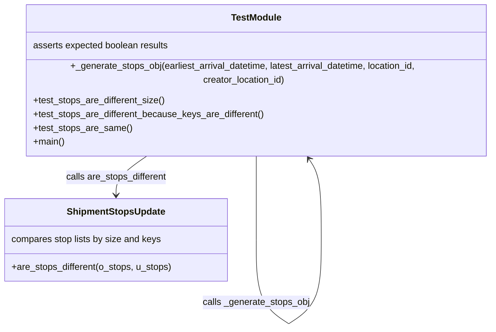

# Diagram: shipment_core/shipment_service/shipment_service/fvshared/tests/test_shipment_stops_update.py

> Auto-generated by Obscura crawlers

## Mermaid

### SVG

<svg id="container" width="868.4093627929688" xmlns="http://www.w3.org/2000/svg" class="classDiagram" height="548.1499633789062" viewBox="0 0 868.4093627929688 548.1499633789062" role="graphics-document document" aria-roledescription="class"><g><defs><marker id="container_class-aggregationStart" class="marker aggregation class" refX="18" refY="7" markerWidth="190" markerHeight="240" orient="auto"><path d="M 18,7 L9,13 L1,7 L9,1 Z"></path></marker></defs><defs><marker id="container_class-aggregationEnd" class="marker aggregation class" refX="1" refY="7" markerWidth="20" markerHeight="28" orient="auto"><path d="M 18,7 L9,13 L1,7 L9,1 Z"></path></marker></defs><defs><marker id="container_class-extensionStart" class="marker extension class" refX="18" refY="7" markerWidth="190" markerHeight="240" orient="auto"><path d="M 1,7 L18,13 V 1 Z"></path></marker></defs><defs><marker id="container_class-extensionEnd" class="marker extension class" refX="1" refY="7" markerWidth="20" markerHeight="28" orient="auto"><path d="M 1,1 V 13 L18,7 Z"></path></marker></defs><defs><marker id="container_class-compositionStart" class="marker composition class" refX="18" refY="7" markerWidth="190" markerHeight="240" orient="auto"><path d="M 18,7 L9,13 L1,7 L9,1 Z"></path></marker></defs><defs><marker id="container_class-compositionEnd" class="marker composition class" refX="1" refY="7" markerWidth="20" markerHeight="28" orient="auto"><path d="M 18,7 L9,13 L1,7 L9,1 Z"></path></marker></defs><defs><marker id="container_class-dependencyStart" class="marker dependency class" refX="6" refY="7" markerWidth="190" markerHeight="240" orient="auto"><path d="M 5,7 L9,13 L1,7 L9,1 Z"></path></marker></defs><defs><marker id="container_class-dependencyEnd" class="marker dependency class" refX="13" refY="7" markerWidth="20" markerHeight="28" orient="auto"><path d="M 18,7 L9,13 L14,7 L9,1 Z"></path></marker></defs><defs><marker id="container_class-lollipopStart" class="marker lollipop class" refX="13" refY="7" markerWidth="190" markerHeight="240" orient="auto"><circle stroke="black" fill="transparent" cx="7" cy="7" r="6"></circle></marker></defs><defs><marker id="container_class-lollipopEnd" class="marker lollipop class" refX="1" refY="7" markerWidth="190" markerHeight="240" orient="auto"><circle stroke="black" fill="transparent" cx="7" cy="7" r="6"></circle></marker></defs><g class="root"><g class="clusters"></g><g class="edgePaths"><path d="M259.119,248L249.546,254.167C239.973,260.333,220.826,272.667,211.253,284C201.68,295.333,201.68,305.667,201.68,310.833L201.68,316" id="id_TestModule_ShipmentStopsUpdate_1" class="edge-thickness-normal edge-pattern-solid relation" style=";;;" data-edge="true" data-et="edge" data-id="id_TestModule_ShipmentStopsUpdate_1" data-points="W3sieCI6MjU5LjExOTE2Nzk5MzgwNjIsInkiOjI0OH0seyJ4IjoyMDEuNjc5Njg3NSwieSI6Mjg1fSx7IngiOjIwMS42Nzk2ODc1LCJ5IjozMjJ9XQ==" marker-end="url(#container_class-dependencyEnd)"></path><path d="M445.409,248L445.409,254.167C445.409,260.333,445.409,272.667,445.409,296.992C445.409,321.317,445.409,357.633,445.409,375.792L445.409,393.95" id="TestModule-cyclic-special-1" class="edge-thickness-normal edge-pattern-solid relation" style=";;;" data-edge="true" data-et="edge" data-id="TestModule-cyclic-special-1" data-points="W3sieCI6NDQ1LjQwOTM3NTAwMDc0NTA2LCJ5IjoyNDh9LHsieCI6NDQ1LjQwOTM3NTAwMDc0NTA2LCJ5IjoyODV9LHsieCI6NDQ1LjQwOTM3NTAwMDc0NTA2LCJ5IjozOTMuOTQ5OTk5OTk5MjU0OTR9XQ=="></path><path d="M445.409,394.05L445.409,412.208C445.409,430.367,445.409,466.683,454.876,491.011C464.342,515.339,483.274,527.678,492.741,533.848L502.207,540.017" id="TestModule-cyclic-special-mid" class="edge-thickness-normal edge-pattern-solid relation" style=";;;" data-edge="true" data-et="edge" data-id="TestModule-cyclic-special-mid" data-points="W3sieCI6NDQ1LjQwOTM3NTAwMDc0NTA2LCJ5IjozOTQuMDUwMDAwMDAwNzQ1MDZ9LHsieCI6NDQ1LjQwOTM3NTAwMDc0NTA2LCJ5Ijo1MDN9LHsieCI6NTAyLjIwNzAzMTI1LCJ5Ijo1NDAuMDE3NDEyOTA0ODE0Nn1d"></path><path d="M502.307,540.017L511.773,533.848C521.24,527.678,540.172,515.339,549.638,491.003C559.105,466.667,559.105,430.333,559.105,394C559.105,357.667,559.105,321.333,555.225,297.81C551.346,274.287,543.588,263.573,539.709,258.216L535.829,252.86" id="TestModule-cyclic-special-2" class="edge-thickness-normal edge-pattern-solid relation" style=";;;" data-edge="true" data-et="edge" data-id="TestModule-cyclic-special-2" data-points="W3sieCI6NTAyLjMwNzAzMTI1MTQ5MDEsInkiOjU0MC4wMTc0MTI5MDQ4MTQ2fSx7IngiOjU1OS4xMDQ2ODc1MDA3NDUxLCJ5Ijo1MDN9LHsieCI6NTU5LjEwNDY4NzUwMDc0NTEsInkiOjM5NH0seyJ4Ijo1NTkuMTA0Njg3NTAwNzQ1MSwieSI6Mjg1fSx7IngiOjUzMi4zMTAyNTA3OTY5MjM0LCJ5IjoyNDh9XQ==" marker-end="url(#container_class-dependencyEnd)"></path></g><g class="edgeLabels"><g class="edgeLabel" transform="translate(201.6796875, 285)"><g class="label" data-id="id_TestModule_ShipmentStopsUpdate_1" transform="translate(-89.09375, -12)"><foreignObject width="178.1875" height="24">

calls are_stops_different

</foreignObject></g></g><g class="edgeLabel"><g class="label" data-id="TestModule-cyclic-special-1" transform="translate(0, 0)"><foreignObject width="0" height="0">

</foreignObject></g></g><g class="edgeLabel" transform="translate(445.40937500074506, 503)"><g class="label" data-id="TestModule-cyclic-special-mid" transform="translate(-93.6953125, -12)"><foreignObject width="187.390625" height="24">

calls _generate_stops_obj

</foreignObject></g></g><g class="edgeLabel"><g class="label" data-id="TestModule-cyclic-special-2" transform="translate(0, 0)"><foreignObject width="0" height="0">

</foreignObject></g></g></g><g class="nodes"><g class="node default" id="classId-ShipmentStopsUpdate-0" transform="translate(201.6796875, 394)"><g class="basic label-container"><path d="M-193.6796875 -72 L193.6796875 -72 L193.6796875 72 L-193.6796875 72" stroke="none" stroke-width="0" fill="#ECECFF" style=""></path><path d="M-193.6796875 -72 C-56.509163996812276 -72, 80.66135950637545 -72, 193.6796875 -72 M-193.6796875 -72 C-97.96306020364949 -72, -2.2464329072989813 -72, 193.6796875 -72 M193.6796875 -72 C193.6796875 -28.36766582734836, 193.6796875 15.264668345303278, 193.6796875 72 M193.6796875 -72 C193.6796875 -19.033480359384313, 193.6796875 33.93303928123137, 193.6796875 72 M193.6796875 72 C77.97555659151189 72, -37.72857431697622 72, -193.6796875 72 M193.6796875 72 C58.13851091974905 72, -77.4026656605019 72, -193.6796875 72 M-193.6796875 72 C-193.6796875 26.931643295784035, -193.6796875 -18.13671340843193, -193.6796875 -72 M-193.6796875 72 C-193.6796875 30.086667321656385, -193.6796875 -11.82666535668723, -193.6796875 -72" stroke="#9370DB" stroke-width="1.3" fill="none" stroke-dasharray="0 0" style=""></path></g><g class="annotation-group text" transform="translate(0, -48)"></g><g class="label-group text" transform="translate(-82.46875, -48)"><g class="label" style="font-weight: bolder" transform="translate(0,-12)"><foreignObject width="164.9375" height="24">

ShipmentStopsUpdate

</foreignObject></g></g><g class="members-group text" transform="translate(-181.6796875, 0)"><g class="label" style="" transform="translate(0,-12)"><foreignObject width="262.03125" height="24">

compares stop lists by size and keys

</foreignObject></g></g><g class="methods-group text" transform="translate(-181.6796875, 48)"><g class="label" style="" transform="translate(0,-12)"><foreignObject width="280.890625" height="24">

+are_stops_different(o_stops, u_stops)

</foreignObject></g></g><g class="divider" style=""><path d="M-193.6796875 -24 C-91.85334068732718 -24, 9.973006125345648 -24, 193.6796875 -24 M-193.6796875 -24 C-108.35897014547486 -24, -23.038252790949713 -24, 193.6796875 -24" stroke="#9370DB" stroke-width="1.3" fill="none" stroke-dasharray="0 0" style=""></path></g><g class="divider" style=""><path d="M-193.6796875 24 C-56.31520153472076 24, 81.04928443055849 24, 193.6796875 24 M-193.6796875 24 C-103.59067002271533 24, -13.501652545430659 24, 193.6796875 24" stroke="#9370DB" stroke-width="1.3" fill="none" stroke-dasharray="0 0" style=""></path></g></g><g class="node default" id="classId-TestModule-1" transform="translate(445.40937500074506, 128)"><g class="basic label-container"><path d="M-415 -120 L415 -120 L415 120 L-415 120" stroke="none" stroke-width="0" fill="#ECECFF" style=""></path><path d="M-415 -120 C-237.338459179617 -120, -59.67691835923398 -120, 415 -120 M-415 -120 C-150.46615717228536 -120, 114.06768565542927 -120, 415 -120 M415 -120 C415 -43.32780013496222, 415 33.344399730075565, 415 120 M415 -120 C415 -65.30940990030852, 415 -10.618819800617047, 415 120 M415 120 C160.76595892942345 120, -93.4680821411531 120, -415 120 M415 120 C139.61113497324237 120, -135.77773005351526 120, -415 120 M-415 120 C-415 71.90354895106464, -415 23.807097902129257, -415 -120 M-415 120 C-415 42.23284848786366, -415 -35.534303024272674, -415 -120" stroke="#9370DB" stroke-width="1.3" fill="none" stroke-dasharray="0 0" style=""></path></g><g class="annotation-group text" transform="translate(0, -96)"></g><g class="label-group text" transform="translate(-42.34375, -96)"><g class="label" style="font-weight: bolder" transform="translate(0,-12)"><foreignObject width="84.6875" height="24">

TestModule

</foreignObject></g></g><g class="members-group text" transform="translate(-403, -48)"><g class="label" style="" transform="translate(0,-12)"><foreignObject width="238.8125" height="24">

asserts expected boolean results

</foreignObject></g></g><g class="methods-group text" transform="translate(-403, 0)"><g class="label" style="" transform="translate(0,-12)"><foreignObject width="763.65625" height="24">

+_generate_stops_obj(earliest_arrival_datetime, latest_arrival_datetime, location_id, creator_location_id)

</foreignObject></g><g class="label" style="" transform="translate(0,12)"><foreignObject width="230.75" height="24">

+test_stops_are_different_size()

</foreignObject></g><g class="label" style="" transform="translate(0,36)"><foreignObject width="404.421875" height="24">

+test_stops_are_different_because_keys_are_different()

</foreignObject></g><g class="label" style="" transform="translate(0,60)"><foreignObject width="170.6875" height="24">

+test_stops_are_same()

</foreignObject></g><g class="label" style="" transform="translate(0,84)"><foreignObject width="54.65625" height="24">

+main()

</foreignObject></g></g><g class="divider" style=""><path d="M-415 -72 C-247.95893426370336 -72, -80.91786852740671 -72, 415 -72 M-415 -72 C-149.65607275263318 -72, 115.68785449473364 -72, 415 -72" stroke="#9370DB" stroke-width="1.3" fill="none" stroke-dasharray="0 0" style=""></path></g><g class="divider" style=""><path d="M-415 -24 C-224.95312819412743 -24, -34.90625638825486 -24, 415 -24 M-415 -24 C-133.2450290804091 -24, 148.5099418391818 -24, 415 -24" stroke="#9370DB" stroke-width="1.3" fill="none" stroke-dasharray="0 0" style=""></path></g></g><g class="label edgeLabel" id="TestModule---TestModule---1" transform="translate(445.40937500074506, 394)"><rect width="0.1" height="0.1"></rect><g class="label" style="" transform="translate(0, 0)"><rect></rect><foreignObject width="0" height="0">

</foreignObject></g></g><g class="label edgeLabel" id="TestModule---TestModule---2" transform="translate(502.25703125074506, 540.0500000007451)"><rect width="0.1" height="0.1"></rect><g class="label" style="" transform="translate(0, 0)"><rect></rect><foreignObject width="0" height="0">

</foreignObject></g></g></g></g></g></svg>
