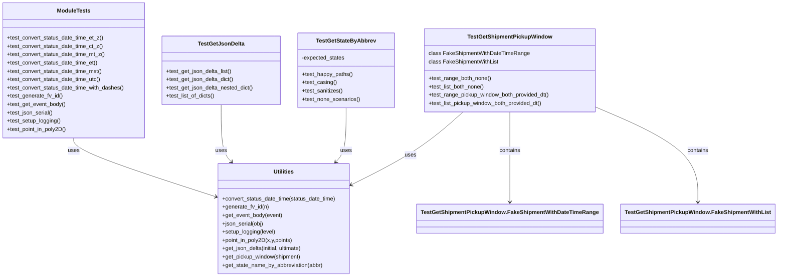
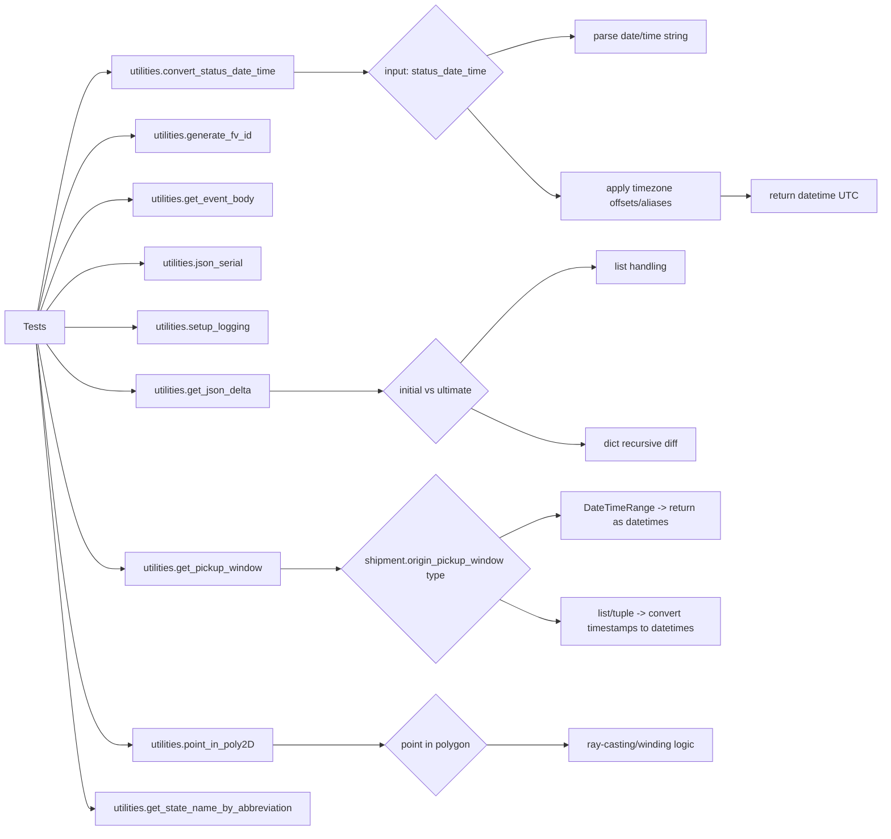

# Diagram: shipment_core/shipment_service/shipment_service/fvshared/tests/test_utilities.py

> Auto-generated by Obscura crawlers

## Diagram 1

### SVG

<svg id="container" width="2200.810546875" xmlns="http://www.w3.org/2000/svg" class="classDiagram" height="798" viewBox="0 0 2200.810546875 798" role="graphics-document document" aria-roledescription="class"><g><defs><marker id="container_class-aggregationStart" class="marker aggregation class" refX="18" refY="7" markerWidth="190" markerHeight="240" orient="auto"><path d="M 18,7 L9,13 L1,7 L9,1 Z"></path></marker></defs><defs><marker id="container_class-aggregationEnd" class="marker aggregation class" refX="1" refY="7" markerWidth="20" markerHeight="28" orient="auto"><path d="M 18,7 L9,13 L1,7 L9,1 Z"></path></marker></defs><defs><marker id="container_class-extensionStart" class="marker extension class" refX="18" refY="7" markerWidth="190" markerHeight="240" orient="auto"><path d="M 1,7 L18,13 V 1 Z"></path></marker></defs><defs><marker id="container_class-extensionEnd" class="marker extension class" refX="1" refY="7" markerWidth="20" markerHeight="28" orient="auto"><path d="M 1,1 V 13 L18,7 Z"></path></marker></defs><defs><marker id="container_class-compositionStart" class="marker composition class" refX="18" refY="7" markerWidth="190" markerHeight="240" orient="auto"><path d="M 18,7 L9,13 L1,7 L9,1 Z"></path></marker></defs><defs><marker id="container_class-compositionEnd" class="marker composition class" refX="1" refY="7" markerWidth="20" markerHeight="28" orient="auto"><path d="M 18,7 L9,13 L1,7 L9,1 Z"></path></marker></defs><defs><marker id="container_class-dependencyStart" class="marker dependency class" refX="6" refY="7" markerWidth="190" markerHeight="240" orient="auto"><path d="M 5,7 L9,13 L1,7 L9,1 Z"></path></marker></defs><defs><marker id="container_class-dependencyEnd" class="marker dependency class" refX="13" refY="7" markerWidth="20" markerHeight="28" orient="auto"><path d="M 18,7 L9,13 L14,7 L9,1 Z"></path></marker></defs><defs><marker id="container_class-lollipopStart" class="marker lollipop class" refX="13" refY="7" markerWidth="190" markerHeight="240" orient="auto"><circle stroke="black" fill="transparent" cx="7" cy="7" r="6"></circle></marker></defs><defs><marker id="container_class-lollipopEnd" class="marker lollipop class" refX="1" refY="7" markerWidth="190" markerHeight="240" orient="auto"><circle stroke="black" fill="transparent" cx="7" cy="7" r="6"></circle></marker></defs><g class="root"><g class="clusters"></g><g class="edgePaths"><path d="M212.852,398L212.852,404.167C212.852,410.333,212.852,422.667,280.706,450.823C348.561,478.98,484.27,522.96,552.125,544.95L619.98,566.94" id="id_ModuleTests_Utilities_1" class="edge-thickness-normal edge-pattern-solid relation" style=";;;" data-edge="true" data-et="edge" data-id="id_ModuleTests_Utilities_1" data-points="W3sieCI6MjEyLjg1MTU2MjUsInkiOjM5OH0seyJ4IjoyMTIuODUxNTYyNSwieSI6NDM1fSx7IngiOjYyNS42ODc1LCJ5Ijo1NjguNzkwMTE1NDgyOTg3Nn1d" marker-end="url(#container_class-dependencyEnd)"></path><path d="M638.66,302L638.66,324.167C638.66,346.333,638.66,390.667,643.617,418.262C648.574,445.856,658.489,456.713,663.446,462.141L668.403,467.569" id="id_TestGetJsonDelta_Utilities_2" class="edge-thickness-normal edge-pattern-solid relation" style=";;;" data-edge="true" data-et="edge" data-id="id_TestGetJsonDelta_Utilities_2" data-points="W3sieCI6NjM4LjY2MDE1NjI1LCJ5IjozMDJ9LHsieCI6NjM4LjY2MDE1NjI1LCJ5Ijo0MzV9LHsieCI6NjcyLjQ0ODc2MDM2MzUyMDUsInkiOjQ3Mn1d" marker-end="url(#container_class-dependencyEnd)"></path><path d="M1330.031,323L1309.42,341.667C1288.809,360.333,1247.587,397.667,1195.076,432.418C1142.566,467.169,1078.766,499.338,1046.867,515.423L1014.967,531.507" id="id_TestGetShipmentPickupWindow_Utilities_3" class="edge-thickness-normal edge-pattern-solid relation" style=";;;" data-edge="true" data-et="edge" data-id="id_TestGetShipmentPickupWindow_Utilities_3" data-points="W3sieCI6MTMzMC4wMzA2NDM4NTc3NTg2LCJ5IjozMjN9LHsieCI6MTIwNi4zNjUyMzQzNzUsInkiOjQzNX0seyJ4IjoxMDA5LjYwOTM3NSwieSI6NTM0LjIwODg1NTI1NzkzNX1d" marker-end="url(#container_class-dependencyEnd)"></path><path d="M996.637,311L996.637,331.667C996.637,352.333,996.637,393.667,991.68,419.762C986.723,445.856,976.808,456.713,971.851,462.141L966.894,467.569" id="id_TestGetStateByAbbrev_Utilities_4" class="edge-thickness-normal edge-pattern-solid relation" style=";;;" data-edge="true" data-et="edge" data-id="id_TestGetStateByAbbrev_Utilities_4" data-points="W3sieCI6OTk2LjYzNjcxODc1LCJ5IjozMTF9LHsieCI6OTk2LjYzNjcxODc1LCJ5Ijo0MzV9LHsieCI6OTYyLjg0ODExNDYzNjQ3OTUsInkiOjQ3Mn1d" marker-end="url(#container_class-dependencyEnd)"></path><path d="M1462.529,323L1462.529,341.667C1462.529,360.333,1462.529,397.667,1462.529,441C1462.529,484.333,1462.529,533.667,1462.529,558.333L1462.529,583" id="id_TestGetShipmentPickupWindow_TestGetShipmentPickupWindow.FakeShipmentWithDateTimeRange_5" class="edge-thickness-normal edge-pattern-solid relation" style=";;;" data-edge="true" data-et="edge" data-id="id_TestGetShipmentPickupWindow_TestGetShipmentPickupWindow.FakeShipmentWithDateTimeRange_5" data-points="W3sieCI6MTQ2Mi41MjkyOTY4NzUsInkiOjMyM30seyJ4IjoxNDYyLjUyOTI5Njg3NSwieSI6NDM1fSx7IngiOjE0NjIuNTI5Mjk2ODc1LCJ5Ijo1ODl9XQ==" marker-end="url(#container_class-dependencyEnd)"></path><path d="M1709.365,313.525L1754.58,333.771C1799.795,354.017,1890.225,394.508,1935.439,439.421C1980.654,484.333,1980.654,533.667,1980.654,558.333L1980.654,583" id="id_TestGetShipmentPickupWindow_TestGetShipmentPickupWindow.FakeShipmentWithList_6" class="edge-thickness-normal edge-pattern-solid relation" style=";;;" data-edge="true" data-et="edge" data-id="id_TestGetShipmentPickupWindow_TestGetShipmentPickupWindow.FakeShipmentWithList_6" data-points="W3sieCI6MTcwOS4zNjUyMzQzNzUsInkiOjMxMy41MjUzMzE3MjQ5Njk5fSx7IngiOjE5ODAuNjU0Mjk2ODc1LCJ5Ijo0MzV9LHsieCI6MTk4MC42NTQyOTY4NzUsInkiOjU4OX1d" marker-end="url(#container_class-dependencyEnd)"></path></g><g class="edgeLabels"><g class="edgeLabel" transform="translate(212.8515625, 435)"><g class="label" data-id="id_ModuleTests_Utilities_1" transform="translate(-16.4921875, -12)"><foreignObject width="32.984375" height="24">

uses

</foreignObject></g></g><g class="edgeLabel" transform="translate(638.66015625, 435)"><g class="label" data-id="id_TestGetJsonDelta_Utilities_2" transform="translate(-16.4921875, -12)"><foreignObject width="32.984375" height="24">

uses

</foreignObject></g></g><g class="edgeLabel" transform="translate(1182.47624, 447.04538)"><g class="label" data-id="id_TestGetShipmentPickupWindow_Utilities_3" transform="translate(-16.4921875, -12)"><foreignObject width="32.984375" height="24">

uses

</foreignObject></g></g><g class="edgeLabel" transform="translate(996.63671875, 435)"><g class="label" data-id="id_TestGetStateByAbbrev_Utilities_4" transform="translate(-16.4921875, -12)"><foreignObject width="32.984375" height="24">

uses

</foreignObject></g></g><g class="edgeLabel" transform="translate(1462.529296875, 435)"><g class="label" data-id="id_TestGetShipmentPickupWindow_TestGetShipmentPickupWindow.FakeShipmentWithDateTimeRange_5" transform="translate(-30.890625, -12)"><foreignObject width="61.78125" height="24">

contains

</foreignObject></g></g><g class="edgeLabel" transform="translate(1980.654296875, 435)"><g class="label" data-id="id_TestGetShipmentPickupWindow_TestGetShipmentPickupWindow.FakeShipmentWithList_6" transform="translate(-30.890625, -12)"><foreignObject width="61.78125" height="24">

contains

</foreignObject></g></g></g><g class="nodes"><g class="node default" id="classId-ModuleTests-0" transform="translate(212.8515625, 203)"><g class="basic label-container"><path d="M-204.8515625 -195 L204.8515625 -195 L204.8515625 195 L-204.8515625 195" stroke="none" stroke-width="0" fill="#ECECFF" style=""></path><path d="M-204.8515625 -195 C-54.660764986437215 -195, 95.53003252712557 -195, 204.8515625 -195 M-204.8515625 -195 C-110.5613654679541 -195, -16.27116843590821 -195, 204.8515625 -195 M204.8515625 -195 C204.8515625 -72.54508355608156, 204.8515625 49.90983288783687, 204.8515625 195 M204.8515625 -195 C204.8515625 -110.84562567775562, 204.8515625 -26.69125135551124, 204.8515625 195 M204.8515625 195 C65.68484600484112 195, -73.48187049031776 195, -204.8515625 195 M204.8515625 195 C66.438198899714 195, -71.97516470057201 195, -204.8515625 195 M-204.8515625 195 C-204.8515625 49.90784702361111, -204.8515625 -95.18430595277778, -204.8515625 -195 M-204.8515625 195 C-204.8515625 97.2688046931264, -204.8515625 -0.46239061374720336, -204.8515625 -195" stroke="#9370DB" stroke-width="1.3" fill="none" stroke-dasharray="0 0" style=""></path></g><g class="annotation-group text" transform="translate(0, -171)"></g><g class="label-group text" transform="translate(-46.203125, -171)"><g class="label" style="font-weight: bolder" transform="translate(0,-12)"><foreignObject width="92.40625" height="24">

ModuleTests

</foreignObject></g></g><g class="members-group text" transform="translate(-192.8515625, -123)"></g><g class="methods-group text" transform="translate(-192.8515625, -93)"><g class="label" style="" transform="translate(0,-12)"><foreignObject width="279.015625" height="24">

+test_convert_status_date_time_et_z()

</foreignObject></g><g class="label" style="" transform="translate(0,12)"><foreignObject width="277.9375" height="24">

+test_convert_status_date_time_ct_z()

</foreignObject></g><g class="label" style="" transform="translate(0,36)"><foreignObject width="284.328125" height="24">

+test_convert_status_date_time_mt_z()

</foreignObject></g><g class="label" style="" transform="translate(0,60)"><foreignObject width="263.703125" height="24">

+test_convert_status_date_time_et()

</foreignObject></g><g class="label" style="" transform="translate(0,84)"><foreignObject width="276.484375" height="24">

+test_convert_status_date_time_mst()

</foreignObject></g><g class="label" style="" transform="translate(0,108)"><foreignObject width="271.703125" height="24">

+test_convert_status_date_time_utc()

</foreignObject></g><g class="label" style="" transform="translate(0,132)"><foreignObject width="339.5" height="24">

+test_convert_status_date_time_with_dashes()

</foreignObject></g><g class="label" style="" transform="translate(0,156)"><foreignObject width="160.53125" height="24">

+test_generate_fv_id()

</foreignObject></g><g class="label" style="" transform="translate(0,180)"><foreignObject width="169.75" height="24">

+test_get_event_body()

</foreignObject></g><g class="label" style="" transform="translate(0,204)"><foreignObject width="133.78125" height="24">

+test_json_serial()

</foreignObject></g><g class="label" style="" transform="translate(0,228)"><foreignObject width="155.53125" height="24">

+test_setup_logging()

</foreignObject></g><g class="label" style="" transform="translate(0,252)"><foreignObject width="172.453125" height="24">

+test_point_in_poly2D()

</foreignObject></g></g><g class="divider" style=""><path d="M-204.8515625 -147 C-43.52800452824741 -147, 117.79555344350518 -147, 204.8515625 -147 M-204.8515625 -147 C-80.43669388324953 -147, 43.978174733500936 -147, 204.8515625 -147" stroke="#9370DB" stroke-width="1.3" fill="none" stroke-dasharray="0 0" style=""></path></g><g class="divider" style=""><path d="M-204.8515625 -123 C-96.25485678070146 -123, 12.341848938597082 -123, 204.8515625 -123 M-204.8515625 -123 C-72.9608222218389 -123, 58.92991805632221 -123, 204.8515625 -123" stroke="#9370DB" stroke-width="1.3" fill="none" stroke-dasharray="0 0" style=""></path></g></g><g class="node default" id="classId-TestGetJsonDelta-1" transform="translate(638.66015625, 203)"><g class="basic label-container"><path d="M-170.95703125 -99 L170.95703125 -99 L170.95703125 99 L-170.95703125 99" stroke="none" stroke-width="0" fill="#ECECFF" style=""></path><path d="M-170.95703125 -99 C-89.7518111093592 -99, -8.546590968718391 -99, 170.95703125 -99 M-170.95703125 -99 C-59.415851095340116 -99, 52.12532905931977 -99, 170.95703125 -99 M170.95703125 -99 C170.95703125 -54.36938381729558, 170.95703125 -9.738767634591156, 170.95703125 99 M170.95703125 -99 C170.95703125 -42.702379639350745, 170.95703125 13.59524072129851, 170.95703125 99 M170.95703125 99 C62.45723668475854 99, -46.04255788048292 99, -170.95703125 99 M170.95703125 99 C48.24779761612314 99, -74.46143601775373 99, -170.95703125 99 M-170.95703125 99 C-170.95703125 22.56689269658237, -170.95703125 -53.86621460683526, -170.95703125 -99 M-170.95703125 99 C-170.95703125 59.33837907075955, -170.95703125 19.6767581415191, -170.95703125 -99" stroke="#9370DB" stroke-width="1.3" fill="none" stroke-dasharray="0 0" style=""></path></g><g class="annotation-group text" transform="translate(0, -75)"></g><g class="label-group text" transform="translate(-62.9765625, -75)"><g class="label" style="font-weight: bolder" transform="translate(0,-12)"><foreignObject width="125.953125" height="24">

TestGetJsonDelta

</foreignObject></g></g><g class="members-group text" transform="translate(-158.95703125, -27)"></g><g class="methods-group text" transform="translate(-158.95703125, 3)"><g class="label" style="" transform="translate(0,-12)"><foreignObject width="192.328125" height="24">

+test_get_json_delta_list()

</foreignObject></g><g class="label" style="" transform="translate(0,12)"><foreignObject width="197.21875" height="24">

+test_get_json_delta_dict()

</foreignObject></g><g class="label" style="" transform="translate(0,36)"><foreignObject width="254.9375" height="24">

+test_get_json_delta_nested_dict()

</foreignObject></g><g class="label" style="" transform="translate(0,60)"><foreignObject width="141.59375" height="24">

+test_list_of_dicts()

</foreignObject></g></g><g class="divider" style=""><path d="M-170.95703125 -51 C-95.21234304967574 -51, -19.467654849351476 -51, 170.95703125 -51 M-170.95703125 -51 C-54.68005102994344 -51, 61.596929190113116 -51, 170.95703125 -51" stroke="#9370DB" stroke-width="1.3" fill="none" stroke-dasharray="0 0" style=""></path></g><g class="divider" style=""><path d="M-170.95703125 -27 C-97.65217882251928 -27, -24.34732639503855 -27, 170.95703125 -27 M-170.95703125 -27 C-76.47511043501798 -27, 18.006810379964037 -27, 170.95703125 -27" stroke="#9370DB" stroke-width="1.3" fill="none" stroke-dasharray="0 0" style=""></path></g></g><g class="node default" id="classId-TestGetShipmentPickupWindow-2" transform="translate(1462.529296875, 203)"><g class="basic label-container"><path d="M-246.8359375 -120 L246.8359375 -120 L246.8359375 120 L-246.8359375 120" stroke="none" stroke-width="0" fill="#ECECFF" style=""></path><path d="M-246.8359375 -120 C-115.42981856456066 -120, 15.976300370878675 -120, 246.8359375 -120 M-246.8359375 -120 C-80.43491902344994 -120, 85.96609945310013 -120, 246.8359375 -120 M246.8359375 -120 C246.8359375 -65.6767895088384, 246.8359375 -11.353579017676793, 246.8359375 120 M246.8359375 -120 C246.8359375 -29.809944534894, 246.8359375 60.380110930212, 246.8359375 120 M246.8359375 120 C100.57573650055912 120, -45.684464498881766 120, -246.8359375 120 M246.8359375 120 C118.74853604973416 120, -9.338865400531688 120, -246.8359375 120 M-246.8359375 120 C-246.8359375 38.76016028029221, -246.8359375 -42.47967943941558, -246.8359375 -120 M-246.8359375 120 C-246.8359375 60.20842255463752, -246.8359375 0.4168451092750445, -246.8359375 -120" stroke="#9370DB" stroke-width="1.3" fill="none" stroke-dasharray="0 0" style=""></path></g><g class="annotation-group text" transform="translate(0, -96)"></g><g class="label-group text" transform="translate(-116.71875, -96)"><g class="label" style="font-weight: bolder" transform="translate(0,-12)"><foreignObject width="233.4375" height="24">

TestGetShipmentPickupWindow

</foreignObject></g></g><g class="members-group text" transform="translate(-234.8359375, -48)"><g class="label" style="" transform="translate(0,-12)"><foreignObject width="287.484375" height="24">

class FakeShipmentWithDateTimeRange

</foreignObject></g><g class="label" style="" transform="translate(0,12)"><foreignObject width="200.5" height="24">

class FakeShipmentWithList

</foreignObject></g></g><g class="methods-group text" transform="translate(-234.8359375, 24)"><g class="label" style="" transform="translate(0,-12)"><foreignObject width="181.71875" height="24">

+test_range_both_none()

</foreignObject></g><g class="label" style="" transform="translate(0,12)"><foreignObject width="163.84375" height="24">

+test_list_both_none()

</foreignObject></g><g class="label" style="" transform="translate(0,36)"><foreignObject width="352.953125" height="24">

+test_range_pickup_window_both_provided_dt()

</foreignObject></g><g class="label" style="" transform="translate(0,60)"><foreignObject width="335.078125" height="24">

+test_list_pickup_window_both_provided_dt()

</foreignObject></g></g><g class="divider" style=""><path d="M-246.8359375 -72 C-112.53918091576108 -72, 21.75757566847784 -72, 246.8359375 -72 M-246.8359375 -72 C-62.11071023790319 -72, 122.61451702419362 -72, 246.8359375 -72" stroke="#9370DB" stroke-width="1.3" fill="none" stroke-dasharray="0 0" style=""></path></g><g class="divider" style=""><path d="M-246.8359375 0 C-60.12266076256364 0, 126.59061597487272 0, 246.8359375 0 M-246.8359375 0 C-103.34998349760306 0, 40.135970504793875 0, 246.8359375 0" stroke="#9370DB" stroke-width="1.3" fill="none" stroke-dasharray="0 0" style=""></path></g></g><g class="node default" id="classId-TestGetStateByAbbrev-3" transform="translate(996.63671875, 203)"><g class="basic label-container"><path d="M-137.01953125 -108 L137.01953125 -108 L137.01953125 108 L-137.01953125 108" stroke="none" stroke-width="0" fill="#ECECFF" style=""></path><path d="M-137.01953125 -108 C-61.46447539401177 -108, 14.090580461976458 -108, 137.01953125 -108 M-137.01953125 -108 C-70.99054282504633 -108, -4.961554400092666 -108, 137.01953125 -108 M137.01953125 -108 C137.01953125 -28.442563918027275, 137.01953125 51.11487216394545, 137.01953125 108 M137.01953125 -108 C137.01953125 -43.41041414527962, 137.01953125 21.179171709440766, 137.01953125 108 M137.01953125 108 C76.05150823275847 108, 15.08348521551693 108, -137.01953125 108 M137.01953125 108 C30.2170458411601 108, -76.5854395676798 108, -137.01953125 108 M-137.01953125 108 C-137.01953125 55.849203954190834, -137.01953125 3.698407908381668, -137.01953125 -108 M-137.01953125 108 C-137.01953125 62.223724713458004, -137.01953125 16.44744942691601, -137.01953125 -108" stroke="#9370DB" stroke-width="1.3" fill="none" stroke-dasharray="0 0" style=""></path></g><g class="annotation-group text" transform="translate(0, -84)"></g><g class="label-group text" transform="translate(-82.0078125, -84)"><g class="label" style="font-weight: bolder" transform="translate(0,-12)"><foreignObject width="164.015625" height="24">

TestGetStateByAbbrev

</foreignObject></g></g><g class="members-group text" transform="translate(-125.01953125, -36)"><g class="label" style="" transform="translate(0,-12)"><foreignObject width="124.375" height="24">

-expected_states

</foreignObject></g></g><g class="methods-group text" transform="translate(-125.01953125, 12)"><g class="label" style="" transform="translate(0,-12)"><foreignObject width="147.515625" height="24">

+test_happy_paths()

</foreignObject></g><g class="label" style="" transform="translate(0,12)"><foreignObject width="99.5" height="24">

+test_casing()

</foreignObject></g><g class="label" style="" transform="translate(0,36)"><foreignObject width="117.375" height="24">

+test_sanitizes()

</foreignObject></g><g class="label" style="" transform="translate(0,60)"><foreignObject width="168.03125" height="24">

+test_none_scenarios()

</foreignObject></g></g><g class="divider" style=""><path d="M-137.01953125 -60 C-39.178661298230566 -60, 58.66220865353887 -60, 137.01953125 -60 M-137.01953125 -60 C-56.35721446339491 -60, 24.30510232321018 -60, 137.01953125 -60" stroke="#9370DB" stroke-width="1.3" fill="none" stroke-dasharray="0 0" style=""></path></g><g class="divider" style=""><path d="M-137.01953125 -12 C-52.08112022737535 -12, 32.8572907952493 -12, 137.01953125 -12 M-137.01953125 -12 C-65.68117100962564 -12, 5.657189230748713 -12, 137.01953125 -12" stroke="#9370DB" stroke-width="1.3" fill="none" stroke-dasharray="0 0" style=""></path></g></g><g class="node default" id="classId-Utilities-4" transform="translate(817.6484375, 631)"><g class="basic label-container"><path d="M-191.9609375 -159 L191.9609375 -159 L191.9609375 159 L-191.9609375 159" stroke="none" stroke-width="0" fill="#ECECFF" style=""></path><path d="M-191.9609375 -159 C-82.11292621329838 -159, 27.73508507340324 -159, 191.9609375 -159 M-191.9609375 -159 C-69.10510691563216 -159, 53.750723668735674 -159, 191.9609375 -159 M191.9609375 -159 C191.9609375 -34.594448705780465, 191.9609375 89.81110258843907, 191.9609375 159 M191.9609375 -159 C191.9609375 -33.344971213769554, 191.9609375 92.31005757246089, 191.9609375 159 M191.9609375 159 C104.76662693415308 159, 17.57231636830616 159, -191.9609375 159 M191.9609375 159 C50.42319001119378 159, -91.11455747761244 159, -191.9609375 159 M-191.9609375 159 C-191.9609375 45.508818901384174, -191.9609375 -67.98236219723165, -191.9609375 -159 M-191.9609375 159 C-191.9609375 36.59728440308004, -191.9609375 -85.80543119383992, -191.9609375 -159" stroke="#9370DB" stroke-width="1.3" fill="none" stroke-dasharray="0 0" style=""></path></g><g class="annotation-group text" transform="translate(0, -135)"></g><g class="label-group text" transform="translate(-28.8125, -135)"><g class="label" style="font-weight: bolder" transform="translate(0,-12)"><foreignObject width="57.625" height="24">

Utilities

</foreignObject></g></g><g class="members-group text" transform="translate(-179.9609375, -87)"></g><g class="methods-group text" transform="translate(-179.9609375, -57)"><g class="label" style="" transform="translate(0,-12)"><foreignObject width="331.109375" height="24">

+convert_status_date_time(status_date_time)

</foreignObject></g><g class="label" style="" transform="translate(0,12)"><foreignObject width="134.03125" height="24">

+generate_fv_id(n)

</foreignObject></g><g class="label" style="" transform="translate(0,36)"><foreignObject width="174.203125" height="24">

+get_event_body(event)

</foreignObject></g><g class="label" style="" transform="translate(0,60)"><foreignObject width="120.625" height="24">

+json_serial(obj)

</foreignObject></g><g class="label" style="" transform="translate(0,84)"><foreignObject width="154.265625" height="24">

+setup_logging(level)

</foreignObject></g><g class="label" style="" transform="translate(0,108)"><foreignObject width="204.796875" height="24">

+point_in_poly2D(x,y,points)

</foreignObject></g><g class="label" style="" transform="translate(0,132)"><foreignObject width="236.859375" height="24">

+get_json_delta(initial, ultimate)

</foreignObject></g><g class="label" style="" transform="translate(0,156)"><foreignObject width="229.671875" height="24">

+get_pickup_window(shipment)

</foreignObject></g><g class="label" style="" transform="translate(0,180)"><foreignObject width="292.734375" height="24">

+get_state_name_by_abbreviation(abbr)

</foreignObject></g></g><g class="divider" style=""><path d="M-191.9609375 -111 C-99.20734100389687 -111, -6.453744507793743 -111, 191.9609375 -111 M-191.9609375 -111 C-97.21304368801664 -111, -2.46514987603328 -111, 191.9609375 -111" stroke="#9370DB" stroke-width="1.3" fill="none" stroke-dasharray="0 0" style=""></path></g><g class="divider" style=""><path d="M-191.9609375 -87 C-112.47193596047433 -87, -32.98293442094865 -87, 191.9609375 -87 M-191.9609375 -87 C-69.59691748601144 -87, 52.76710252797713 -87, 191.9609375 -87" stroke="#9370DB" stroke-width="1.3" fill="none" stroke-dasharray="0 0" style=""></path></g></g><g class="node default" id="classId-TestGetShipmentPickupWindow.FakeShipmentWithDateTimeRange-5" transform="translate(1462.529296875, 631)"><g class="basic label-container"><path d="M-255.96875 -42 L255.96875 -42 L255.96875 42 L-255.96875 42" stroke="none" stroke-width="0" fill="#ECECFF" style=""></path><path d="M-255.96875 -42 C-57.210238792154485 -42, 141.54827241569103 -42, 255.96875 -42 M-255.96875 -42 C-105.99052686486505 -42, 43.98769627026991 -42, 255.96875 -42 M255.96875 -42 C255.96875 -20.366490947492316, 255.96875 1.2670181050153673, 255.96875 42 M255.96875 -42 C255.96875 -17.39909283241635, 255.96875 7.201814335167299, 255.96875 42 M255.96875 42 C89.34644821455382 42, -77.27585357089237 42, -255.96875 42 M255.96875 42 C83.39038009167541 42, -89.18798981664918 42, -255.96875 42 M-255.96875 42 C-255.96875 23.6558471481776, -255.96875 5.311694296355199, -255.96875 -42 M-255.96875 42 C-255.96875 22.65461065164797, -255.96875 3.309221303295942, -255.96875 -42" stroke="#9370DB" stroke-width="1.3" fill="none" stroke-dasharray="0 0" style=""></path></g><g class="annotation-group text" transform="translate(0, -18)"></g><g class="label-group text" transform="translate(-243.96875, -18)"><g class="label" style="font-weight: bolder" transform="translate(0,-12)"><foreignObject width="487.9375" height="24">

TestGetShipmentPickupWindow.FakeShipmentWithDateTimeRange

</foreignObject></g></g><g class="members-group text" transform="translate(-243.96875, 30)"></g><g class="methods-group text" transform="translate(-243.96875, 60)"></g><g class="divider" style=""><path d="M-255.96875 6 C-128.6577426631442 6, -1.3467353262884103 6, 255.96875 6 M-255.96875 6 C-125.93243905108116 6, 4.103871897837678 6, 255.96875 6" stroke="#9370DB" stroke-width="1.3" fill="none" stroke-dasharray="0 0" style=""></path></g><g class="divider" style=""><path d="M-255.96875 24 C-91.39920762042388 24, 73.17033475915224 24, 255.96875 24 M-255.96875 24 C-99.39080183323617 24, 57.187146333527664 24, 255.96875 24" stroke="#9370DB" stroke-width="1.3" fill="none" stroke-dasharray="0 0" style=""></path></g></g><g class="node default" id="classId-TestGetShipmentPickupWindow.FakeShipmentWithList-6" transform="translate(1980.654296875, 631)"><g class="basic label-container"><path d="M-212.15625 -42 L212.15625 -42 L212.15625 42 L-212.15625 42" stroke="none" stroke-width="0" fill="#ECECFF" style=""></path><path d="M-212.15625 -42 C-121.05161690068513 -42, -29.946983801370266 -42, 212.15625 -42 M-212.15625 -42 C-105.26202189356411 -42, 1.632206212871779 -42, 212.15625 -42 M212.15625 -42 C212.15625 -15.6327430096426, 212.15625 10.734513980714802, 212.15625 42 M212.15625 -42 C212.15625 -11.76681378642331, 212.15625 18.46637242715338, 212.15625 42 M212.15625 42 C55.963351582096294 42, -100.22954683580741 42, -212.15625 42 M212.15625 42 C97.23656956666173 42, -17.683110866676543 42, -212.15625 42 M-212.15625 42 C-212.15625 22.980493879183506, -212.15625 3.9609877583670112, -212.15625 -42 M-212.15625 42 C-212.15625 15.705216486665726, -212.15625 -10.589567026668547, -212.15625 -42" stroke="#9370DB" stroke-width="1.3" fill="none" stroke-dasharray="0 0" style=""></path></g><g class="annotation-group text" transform="translate(0, -18)"></g><g class="label-group text" transform="translate(-200.15625, -18)"><g class="label" style="font-weight: bolder" transform="translate(0,-12)"><foreignObject width="400.3125" height="24">

TestGetShipmentPickupWindow.FakeShipmentWithList

</foreignObject></g></g><g class="members-group text" transform="translate(-200.15625, 30)"></g><g class="methods-group text" transform="translate(-200.15625, 60)"></g><g class="divider" style=""><path d="M-212.15625 6 C-105.43229073746113 6, 1.291668525077739 6, 212.15625 6 M-212.15625 6 C-101.3427110886574 6, 9.470827822685209 6, 212.15625 6" stroke="#9370DB" stroke-width="1.3" fill="none" stroke-dasharray="0 0" style=""></path></g><g class="divider" style=""><path d="M-212.15625 24 C-68.05819262070779 24, 76.03986475858443 24, 212.15625 24 M-212.15625 24 C-117.06740220919357 24, -21.978554418387148 24, 212.15625 24" stroke="#9370DB" stroke-width="1.3" fill="none" stroke-dasharray="0 0" style=""></path></g></g></g></g></g></svg>

## Diagram 2

### SVG

<svg id="container" width="1455.34375" xmlns="http://www.w3.org/2000/svg" class="flowchart" height="1373.546875" viewBox="0 0 1455.34375 1373.546875" role="graphics-document document" aria-roledescription="flowchart-v2"><g><marker id="container_flowchart-v2-pointEnd" class="marker flowchart-v2" viewBox="0 0 10 10" refX="5" refY="5" markerUnits="userSpaceOnUse" markerWidth="8" markerHeight="8" orient="auto"><path d="M 0 0 L 10 5 L 0 10 z" class="arrowMarkerPath" style="stroke-width: 1; stroke-dasharray: 1, 0;"></path></marker><marker id="container_flowchart-v2-pointStart" class="marker flowchart-v2" viewBox="0 0 10 10" refX="4.5" refY="5" markerUnits="userSpaceOnUse" markerWidth="8" markerHeight="8" orient="auto"><path d="M 0 5 L 10 10 L 10 0 z" class="arrowMarkerPath" style="stroke-width: 1; stroke-dasharray: 1, 0;"></path></marker><marker id="container_flowchart-v2-circleEnd" class="marker flowchart-v2" viewBox="0 0 10 10" refX="11" refY="5" markerUnits="userSpaceOnUse" markerWidth="11" markerHeight="11" orient="auto"><circle cx="5" cy="5" r="5" class="arrowMarkerPath" style="stroke-width: 1; stroke-dasharray: 1, 0;"></circle></marker><marker id="container_flowchart-v2-circleStart" class="marker flowchart-v2" viewBox="0 0 10 10" refX="-1" refY="5" markerUnits="userSpaceOnUse" markerWidth="11" markerHeight="11" orient="auto"><circle cx="5" cy="5" r="5" class="arrowMarkerPath" style="stroke-width: 1; stroke-dasharray: 1, 0;"></circle></marker><marker id="container_flowchart-v2-crossEnd" class="marker cross flowchart-v2" viewBox="0 0 11 11" refX="12" refY="5.2" markerUnits="userSpaceOnUse" markerWidth="11" markerHeight="11" orient="auto"><path d="M 1,1 l 9,9 M 10,1 l -9,9" class="arrowMarkerPath" style="stroke-width: 2; stroke-dasharray: 1, 0;"></path></marker><marker id="container_flowchart-v2-crossStart" class="marker cross flowchart-v2" viewBox="0 0 11 11" refX="-1" refY="5.2" markerUnits="userSpaceOnUse" markerWidth="11" markerHeight="11" orient="auto"><path d="M 1,1 l 9,9 M 10,1 l -9,9" class="arrowMarkerPath" style="stroke-width: 2; stroke-dasharray: 1, 0;"></path></marker><g class="root"><g class="clusters"></g><g class="edgePaths"><path d="M61.187,509.82L72.63,444.987C84.073,380.154,106.958,250.487,126.296,185.654C145.633,120.82,161.422,120.82,169.316,120.82L177.211,120.82" id="L_A_B_0" class="edge-thickness-normal edge-pattern-solid edge-thickness-normal edge-pattern-solid flowchart-link" style=";" data-edge="true" data-et="edge" data-id="L_A_B_0" data-points="W3sieCI6NjEuMTg3MjM3MDc5MzI2OTIsInkiOjUwOS44MjAzMTI1fSx7IngiOjEyOS44NDM3NSwieSI6MTIwLjgyMDMxMjV9LHsieCI6MTgxLjIxMDkzNzUsInkiOjEyMC44MjAzMTI1fV0=" marker-end="url(#container_flowchart-v2-pointEnd)"></path><path d="M62.776,509.82L73.954,462.32C85.132,414.82,107.488,319.82,133.349,272.32C159.211,224.82,188.578,224.82,203.262,224.82L217.945,224.82" id="L_A_C_0" class="edge-thickness-normal edge-pattern-solid edge-thickness-normal edge-pattern-solid flowchart-link" style=";" data-edge="true" data-et="edge" data-id="L_A_C_0" data-points="W3sieCI6NjIuNzc1NjkxMTA1NzY5MjMsInkiOjUwOS44MjAzMTI1fSx7IngiOjEyOS44NDM3NSwieSI6MjI0LjgyMDMxMjV9LHsieCI6MjIxLjk0NTMxMjUsInkiOjIyNC44MjAzMTI1fV0=" marker-end="url(#container_flowchart-v2-pointEnd)"></path><path d="M65.953,509.82L76.601,479.654C87.25,449.487,108.547,389.154,133.111,358.987C157.674,328.82,185.505,328.82,199.421,328.82L213.336,328.82" id="L_A_D_0" class="edge-thickness-normal edge-pattern-solid edge-thickness-normal edge-pattern-solid flowchart-link" style=";" data-edge="true" data-et="edge" data-id="L_A_D_0" data-points="W3sieCI6NjUuOTUyNTk5MTU4NjUzODQsInkiOjUwOS44MjAzMTI1fSx7IngiOjEyOS44NDM3NSwieSI6MzI4LjgyMDMxMjV9LHsieCI6MjE3LjMzNTkzNzUsInkiOjMyOC44MjAzMTI1fV0=" marker-end="url(#container_flowchart-v2-pointEnd)"></path><path d="M75.483,509.82L84.543,496.987C93.603,484.154,111.724,458.487,137.719,445.654C163.714,432.82,197.583,432.82,214.518,432.82L231.453,432.82" id="L_A_E_0" class="edge-thickness-normal edge-pattern-solid edge-thickness-normal edge-pattern-solid flowchart-link" style=";" data-edge="true" data-et="edge" data-id="L_A_E_0" data-points="W3sieCI6NzUuNDgzMzIzMzE3MzA3NywieSI6NTA5LjgyMDMxMjV9LHsieCI6MTI5Ljg0Mzc1LCJ5Ijo0MzIuODIwMzEyNX0seyJ4IjoyMzUuNDUzMTI1LCJ5Ijo0MzIuODIwMzEyNX1d" marker-end="url(#container_flowchart-v2-pointEnd)"></path><path d="M104.844,536.82L109.01,536.82C113.177,536.82,121.51,536.82,140.747,536.82C159.984,536.82,190.125,536.82,205.195,536.82L220.266,536.82" id="L_A_F_0" class="edge-thickness-normal edge-pattern-solid edge-thickness-normal edge-pattern-solid flowchart-link" style=";" data-edge="true" data-et="edge" data-id="L_A_F_0" data-points="W3sieCI6MTA0Ljg0Mzc1LCJ5Ijo1MzYuODIwMzEyNX0seyJ4IjoxMjkuODQzNzUsInkiOjUzNi44MjAzMTI1fSx7IngiOjIyNC4yNjU2MjUsInkiOjUzNi44MjAzMTI1fV0=" marker-end="url(#container_flowchart-v2-pointEnd)"></path><path d="M59.263,563.82L71.027,675.608C82.79,787.396,106.317,1010.971,131.744,1122.759C157.172,1234.547,184.5,1234.547,198.164,1234.547L211.828,1234.547" id="L_A_G_0" class="edge-thickness-normal edge-pattern-solid edge-thickness-normal edge-pattern-solid flowchart-link" style=";" data-edge="true" data-et="edge" data-id="L_A_G_0" data-points="W3sieCI6NTkuMjYzMDg5MjExMzMzNjg2LCJ5Ijo1NjMuODIwMzEyNX0seyJ4IjoxMjkuODQzNzUsInkiOjEyMzQuNTQ2ODc1fSx7IngiOjIxNS44MjgxMjUsInkiOjEyMzQuNTQ2ODc1fV0=" marker-end="url(#container_flowchart-v2-pointEnd)"></path><path d="M75.483,563.82L84.543,576.654C93.603,589.487,111.724,615.154,135.368,627.987C159.013,640.82,188.182,640.82,202.767,640.82L217.352,640.82" id="L_A_H_0" class="edge-thickness-normal edge-pattern-solid edge-thickness-normal edge-pattern-solid flowchart-link" style=";" data-edge="true" data-et="edge" data-id="L_A_H_0" data-points="W3sieCI6NzUuNDgzMzIzMzE3MzA3NywieSI6NTYzLjgyMDMxMjV9LHsieCI6MTI5Ljg0Mzc1LCJ5Ijo2NDAuODIwMzEyNX0seyJ4IjoyMjEuMzUxNTYyNSwieSI6NjQwLjgyMDMxMjV9XQ==" marker-end="url(#container_flowchart-v2-pointEnd)"></path><path d="M61.344,563.82L72.76,626.452C84.177,689.083,107.01,814.346,130.062,876.978C153.115,939.609,176.385,939.609,188.021,939.609L199.656,939.609" id="L_A_I_0" class="edge-thickness-normal edge-pattern-solid edge-thickness-normal edge-pattern-solid flowchart-link" style=";" data-edge="true" data-et="edge" data-id="L_A_I_0" data-points="W3sieCI6NjEuMzQzNTM0NTIyNDcwMjgsInkiOjU2My44MjAzMTI1fSx7IngiOjEyOS44NDM3NSwieSI6OTM5LjYwOTM3NX0seyJ4IjoyMDMuNjU2MjUsInkiOjkzOS42MDkzNzV9XQ==" marker-end="url(#container_flowchart-v2-pointEnd)"></path><path d="M58.895,563.82L70.719,692.941C82.544,822.063,106.194,1080.305,121.519,1209.426C136.844,1338.547,143.844,1338.547,147.344,1338.547L150.844,1338.547" id="L_A_J_0" class="edge-thickness-normal edge-pattern-solid edge-thickness-normal edge-pattern-solid flowchart-link" style=";" data-edge="true" data-et="edge" data-id="L_A_J_0" data-points="W3sieCI6NTguODk0NTI2Nzk2NDE1OTQsInkiOjU2My44MjAzMTI1fSx7IngiOjEyOS44NDM3NSwieSI6MTMzOC41NDY4NzV9LHsieCI6MTU0Ljg0Mzc1LCJ5IjoxMzM4LjU0Njg3NX1d" marker-end="url(#container_flowchart-v2-pointEnd)"></path><path d="M487.93,120.82L496.491,120.82C505.052,120.82,522.174,120.82,541.848,120.82C561.521,120.82,583.745,120.82,594.857,120.82L605.969,120.82" id="L_B_K_0" class="edge-thickness-normal edge-pattern-solid edge-thickness-normal edge-pattern-solid flowchart-link" style=";" data-edge="true" data-et="edge" data-id="L_B_K_0" data-points="W3sieCI6NDg3LjkyOTY4NzUsInkiOjEyMC44MjAzMTI1fSx7IngiOjUzOS4yOTY4NzUsInkiOjEyMC44MjAzMTI1fSx7IngiOjYwOS45Njg3NSwieSI6MTIwLjgyMDMxMjV9XQ==" marker-end="url(#container_flowchart-v2-pointEnd)"></path><path d="M808.513,93.724L824.808,88.573C841.102,83.423,873.692,73.121,896.537,67.971C919.383,62.82,932.484,62.82,939.035,62.82L945.586,62.82" id="L_K_L_0" class="edge-thickness-normal edge-pattern-solid edge-thickness-normal edge-pattern-solid flowchart-link" style=";" data-edge="true" data-et="edge" data-id="L_K_L_0" data-points="W3sieCI6ODA4LjUxMjkzNjgzODgyNzYsInkiOjkzLjcyMzg3NDMzODgyNzZ9LHsieCI6OTA2LjI4MTI1LCJ5Ijo2Mi44MjAzMTI1fSx7IngiOjk0OS41ODU5Mzc1LCJ5Ijo2Mi44MjAzMTI1fV0=" marker-end="url(#container_flowchart-v2-pointEnd)"></path><path d="M776.491,179.939L798.123,203.752C819.754,227.566,863.018,275.193,888.15,299.007C913.281,322.82,920.281,322.82,923.781,322.82L927.281,322.82" id="L_K_M_0" class="edge-thickness-normal edge-pattern-solid edge-thickness-normal edge-pattern-solid flowchart-link" style=";" data-edge="true" data-et="edge" data-id="L_K_M_0" data-points="W3sieCI6Nzc2LjQ5MDkxODQ4MTM0NDksInkiOjE3OS45Mzg3NjkwMTg2NTUxNH0seyJ4Ijo5MDYuMjgxMjUsInkiOjMyMi44MjAzMTI1fSx7IngiOjkzMS4yODEyNSwieSI6MzIyLjgyMDMxMjV9XQ==" marker-end="url(#container_flowchart-v2-pointEnd)"></path><path d="M1191.281,322.82L1195.448,322.82C1199.615,322.82,1207.948,322.82,1215.615,322.82C1223.281,322.82,1230.281,322.82,1233.781,322.82L1237.281,322.82" id="L_M_N_0" class="edge-thickness-normal edge-pattern-solid edge-thickness-normal edge-pattern-solid flowchart-link" style=";" data-edge="true" data-et="edge" data-id="L_M_N_0" data-points="W3sieCI6MTE5MS4yODEyNSwieSI6MzIyLjgyMDMxMjV9LHsieCI6MTIxNi4yODEyNSwieSI6MzIyLjgyMDMxMjV9LHsieCI6MTI0MS4yODEyNSwieSI6MzIyLjgyMDMxMjV9XQ==" marker-end="url(#container_flowchart-v2-pointEnd)"></path><path d="M447.789,640.82L463.04,640.82C478.292,640.82,508.794,640.82,538.911,640.82C569.029,640.82,598.76,640.82,613.626,640.82L628.492,640.82" id="L_H_O_0" class="edge-thickness-normal edge-pattern-solid edge-thickness-normal edge-pattern-solid flowchart-link" style=";" data-edge="true" data-et="edge" data-id="L_H_O_0" data-points="W3sieCI6NDQ3Ljc4OTA2MjUsInkiOjY0MC44MjAzMTI1fSx7IngiOjUzOS4yOTY4NzUsInkiOjY0MC44MjAzMTI1fSx7IngiOjYzMi40OTIxODc1LCJ5Ijo2NDAuODIwMzEyNX1d" marker-end="url(#container_flowchart-v2-pointEnd)"></path><path d="M765.77,593.504L789.188,567.724C812.607,541.943,859.444,490.382,895.479,464.601C931.513,438.82,956.745,438.82,969.361,438.82L981.977,438.82" id="L_O_P_0" class="edge-thickness-normal edge-pattern-solid edge-thickness-normal edge-pattern-solid flowchart-link" style=";" data-edge="true" data-et="edge" data-id="L_O_P_0" data-points="W3sieCI6NzY1Ljc2OTg4NDU2NDQyNjUsInkiOjU5My41MDQyNTk1NjQ0MjY1fSx7IngiOjkwNi4yODEyNSwieSI6NDM4LjgyMDMxMjV9LHsieCI6OTg1Ljk3NjU2MjUsInkiOjQzOC44MjAzMTI1fV0=" marker-end="url(#container_flowchart-v2-pointEnd)"></path><path d="M783.064,670.842L803.6,681.071C824.136,691.3,865.209,711.757,895.374,721.986C925.539,732.215,944.797,732.215,954.426,732.215L964.055,732.215" id="L_O_Q_0" class="edge-thickness-normal edge-pattern-solid edge-thickness-normal edge-pattern-solid flowchart-link" style=";" data-edge="true" data-et="edge" data-id="L_O_Q_0" data-points="W3sieCI6NzgzLjA2Mzk2ODQ0NDkyMDUsInkiOjY3MC44NDIyODE1NTUwNzk1fSx7IngiOjkwNi4yODEyNSwieSI6NzMyLjIxNDg0Mzc1fSx7IngiOjk2OC4wNTQ2ODc1LCJ5Ijo3MzIuMjE0ODQzNzV9XQ==" marker-end="url(#container_flowchart-v2-pointEnd)"></path><path d="M465.484,939.609L477.786,939.609C490.089,939.609,514.693,939.609,530.495,939.609C546.297,939.609,553.297,939.609,556.797,939.609L560.297,939.609" id="L_I_R_0" class="edge-thickness-normal edge-pattern-solid edge-thickness-normal edge-pattern-solid flowchart-link" style=";" data-edge="true" data-et="edge" data-id="L_I_R_0" data-points="W3sieCI6NDY1LjQ4NDM3NSwieSI6OTM5LjYwOTM3NX0seyJ4Ijo1MzkuMjk2ODc1LCJ5Ijo5MzkuNjA5Mzc1fSx7IngiOjU2NC4yOTY4NzUsInkiOjkzOS42MDkzNzV9XQ==" marker-end="url(#container_flowchart-v2-pointEnd)"></path><path d="M828.586,886.914L841.535,880.464C854.484,874.014,880.383,861.114,896.832,854.665C913.281,848.215,920.281,848.215,923.781,848.215L927.281,848.215" id="L_R_S_0" class="edge-thickness-normal edge-pattern-solid edge-thickness-normal edge-pattern-solid flowchart-link" style=";" data-edge="true" data-et="edge" data-id="L_R_S_0" data-points="W3sieCI6ODI4LjU4NTY1NTA2ODMxNjQsInkiOjg4Ni45MTM3ODAwNjgzMTY0fSx7IngiOjkwNi4yODEyNSwieSI6ODQ4LjIxNDg0Mzc1fSx7IngiOjkzMS4yODEyNSwieSI6ODQ4LjIxNDg0Mzc1fV0=" marker-end="url(#container_flowchart-v2-pointEnd)"></path><path d="M829.332,991.559L842.157,997.812C854.982,1004.065,880.632,1016.572,896.956,1022.825C913.281,1029.078,920.281,1029.078,923.781,1029.078L927.281,1029.078" id="L_R_T_0" class="edge-thickness-normal edge-pattern-solid edge-thickness-normal edge-pattern-solid flowchart-link" style=";" data-edge="true" data-et="edge" data-id="L_R_T_0" data-points="W3sieCI6ODI5LjMzMjA2NjI0NDAyNTMsInkiOjk5MS41NTg1NTg3NTU5NzQ3fSx7IngiOjkwNi4yODEyNSwieSI6MTAyOS4wNzgxMjV9LHsieCI6OTMxLjI4MTI1LCJ5IjoxMDI5LjA3ODEyNX1d" marker-end="url(#container_flowchart-v2-pointEnd)"></path><path d="M453.313,1234.547L467.643,1234.547C481.974,1234.547,510.635,1234.547,540.474,1234.547C570.313,1234.547,601.328,1234.547,616.836,1234.547L632.344,1234.547" id="L_G_U_0" class="edge-thickness-normal edge-pattern-solid edge-thickness-normal edge-pattern-solid flowchart-link" style=";" data-edge="true" data-et="edge" data-id="L_G_U_0" data-points="W3sieCI6NDUzLjMxMjUsInkiOjEyMzQuNTQ2ODc1fSx7IngiOjUzOS4yOTY4NzUsInkiOjEyMzQuNTQ2ODc1fSx7IngiOjYzNi4zNDM3NSwieSI6MTIzNC41NDY4NzV9XQ==" marker-end="url(#container_flowchart-v2-pointEnd)"></path><path d="M809.234,1234.547L825.409,1234.547C841.583,1234.547,873.932,1234.547,894.978,1234.547C916.023,1234.547,925.766,1234.547,930.637,1234.547L935.508,1234.547" id="L_U_V_0" class="edge-thickness-normal edge-pattern-solid edge-thickness-normal edge-pattern-solid flowchart-link" style=";" data-edge="true" data-et="edge" data-id="L_U_V_0" data-points="W3sieCI6ODA5LjIzNDM3NSwieSI6MTIzNC41NDY4NzV9LHsieCI6OTA2LjI4MTI1LCJ5IjoxMjM0LjU0Njg3NX0seyJ4Ijo5MzkuNTA3ODEyNSwieSI6MTIzNC41NDY4NzV9XQ==" marker-end="url(#container_flowchart-v2-pointEnd)"></path></g><g class="edgeLabels"><g class="edgeLabel"><g class="label" data-id="L_A_B_0" transform="translate(0, 0)"><foreignObject width="0" height="0">

</foreignObject></g></g><g class="edgeLabel"><g class="label" data-id="L_A_C_0" transform="translate(0, 0)"><foreignObject width="0" height="0">

</foreignObject></g></g><g class="edgeLabel"><g class="label" data-id="L_A_D_0" transform="translate(0, 0)"><foreignObject width="0" height="0">

</foreignObject></g></g><g class="edgeLabel"><g class="label" data-id="L_A_E_0" transform="translate(0, 0)"><foreignObject width="0" height="0">

</foreignObject></g></g><g class="edgeLabel"><g class="label" data-id="L_A_F_0" transform="translate(0, 0)"><foreignObject width="0" height="0">

</foreignObject></g></g><g class="edgeLabel"><g class="label" data-id="L_A_G_0" transform="translate(0, 0)"><foreignObject width="0" height="0">

</foreignObject></g></g><g class="edgeLabel"><g class="label" data-id="L_A_H_0" transform="translate(0, 0)"><foreignObject width="0" height="0">

</foreignObject></g></g><g class="edgeLabel"><g class="label" data-id="L_A_I_0" transform="translate(0, 0)"><foreignObject width="0" height="0">

</foreignObject></g></g><g class="edgeLabel"><g class="label" data-id="L_A_J_0" transform="translate(0, 0)"><foreignObject width="0" height="0">

</foreignObject></g></g><g class="edgeLabel"><g class="label" data-id="L_B_K_0" transform="translate(0, 0)"><foreignObject width="0" height="0">

</foreignObject></g></g><g class="edgeLabel"><g class="label" data-id="L_K_L_0" transform="translate(0, 0)"><foreignObject width="0" height="0">

</foreignObject></g></g><g class="edgeLabel"><g class="label" data-id="L_K_M_0" transform="translate(0, 0)"><foreignObject width="0" height="0">

</foreignObject></g></g><g class="edgeLabel"><g class="label" data-id="L_M_N_0" transform="translate(0, 0)"><foreignObject width="0" height="0">

</foreignObject></g></g><g class="edgeLabel"><g class="label" data-id="L_H_O_0" transform="translate(0, 0)"><foreignObject width="0" height="0">

</foreignObject></g></g><g class="edgeLabel"><g class="label" data-id="L_O_P_0" transform="translate(0, 0)"><foreignObject width="0" height="0">

</foreignObject></g></g><g class="edgeLabel"><g class="label" data-id="L_O_Q_0" transform="translate(0, 0)"><foreignObject width="0" height="0">

</foreignObject></g></g><g class="edgeLabel"><g class="label" data-id="L_I_R_0" transform="translate(0, 0)"><foreignObject width="0" height="0">

</foreignObject></g></g><g class="edgeLabel"><g class="label" data-id="L_R_S_0" transform="translate(0, 0)"><foreignObject width="0" height="0">

</foreignObject></g></g><g class="edgeLabel"><g class="label" data-id="L_R_T_0" transform="translate(0, 0)"><foreignObject width="0" height="0">

</foreignObject></g></g><g class="edgeLabel"><g class="label" data-id="L_G_U_0" transform="translate(0, 0)"><foreignObject width="0" height="0">

</foreignObject></g></g><g class="edgeLabel"><g class="label" data-id="L_U_V_0" transform="translate(0, 0)"><foreignObject width="0" height="0">

</foreignObject></g></g></g><g class="nodes"><g class="node default" id="flowchart-A-0" transform="translate(56.421875, 536.8203125)"><rect class="basic label-container" style="" x="-48.421875" y="-27" width="96.84375" height="54"></rect><g class="label" style="" transform="translate(-18.421875, -12)"><rect></rect><foreignObject width="36.84375" height="24">

Tests

</foreignObject></g></g><g class="node default" id="flowchart-B-1" transform="translate(334.5703125, 120.8203125)"><rect class="basic label-container" style="" x="-153.359375" y="-27" width="306.71875" height="54"></rect><g class="label" style="" transform="translate(-123.359375, -12)"><rect></rect><foreignObject width="246.71875" height="24">

utilities.convert_status_date_time

</foreignObject></g></g><g class="node default" id="flowchart-C-3" transform="translate(334.5703125, 224.8203125)"><rect class="basic label-container" style="" x="-112.625" y="-27" width="225.25" height="54"></rect><g class="label" style="" transform="translate(-82.625, -12)"><rect></rect><foreignObject width="165.25" height="24">

utilities.generate_fv_id

</foreignObject></g></g><g class="node default" id="flowchart-D-5" transform="translate(334.5703125, 328.8203125)"><rect class="basic label-container" style="" x="-117.234375" y="-27" width="234.46875" height="54"></rect><g class="label" style="" transform="translate(-87.234375, -12)"><rect></rect><foreignObject width="174.46875" height="24">

utilities.get_event_body

</foreignObject></g></g><g class="node default" id="flowchart-E-7" transform="translate(334.5703125, 432.8203125)"><rect class="basic label-container" style="" x="-99.1171875" y="-27" width="198.234375" height="54"></rect><g class="label" style="" transform="translate(-69.1171875, -12)"><rect></rect><foreignObject width="138.234375" height="24">

utilities.json_serial

</foreignObject></g></g><g class="node default" id="flowchart-F-9" transform="translate(334.5703125, 536.8203125)"><rect class="basic label-container" style="" x="-110.3046875" y="-27" width="220.609375" height="54"></rect><g class="label" style="" transform="translate(-80.3046875, -12)"><rect></rect><foreignObject width="160.609375" height="24">

utilities.setup_logging

</foreignObject></g></g><g class="node default" id="flowchart-G-11" transform="translate(334.5703125, 1234.546875)"><rect class="basic label-container" style="" x="-118.7421875" y="-27" width="237.484375" height="54"></rect><g class="label" style="" transform="translate(-88.7421875, -12)"><rect></rect><foreignObject width="177.484375" height="24">

utilities.point_in_poly2D

</foreignObject></g></g><g class="node default" id="flowchart-H-13" transform="translate(334.5703125, 640.8203125)"><rect class="basic label-container" style="" x="-113.21875" y="-27" width="226.4375" height="54"></rect><g class="label" style="" transform="translate(-83.21875, -12)"><rect></rect><foreignObject width="166.4375" height="24">

utilities.get_json_delta

</foreignObject></g></g><g class="node default" id="flowchart-I-15" transform="translate(334.5703125, 939.609375)"><rect class="basic label-container" style="" x="-130.9140625" y="-27" width="261.828125" height="54"></rect><g class="label" style="" transform="translate(-100.9140625, -12)"><rect></rect><foreignObject width="201.828125" height="24">

utilities.get_pickup_window

</foreignObject></g></g><g class="node default" id="flowchart-J-17" transform="translate(334.5703125, 1338.546875)"><rect class="basic label-container" style="" x="-179.7265625" y="-27" width="359.453125" height="54"></rect><g class="label" style="" transform="translate(-149.7265625, -12)"><rect></rect><foreignObject width="299.453125" height="24">

utilities.get_state_name_by_abbreviation

</foreignObject></g></g><g class="node default" id="flowchart-K-19" transform="translate(722.7890625, 120.8203125)"><polygon points="112.8203125,0 225.640625,-112.8203125 112.8203125,-225.640625 0,-112.8203125" class="label-container" transform="translate(-112.3203125, 112.8203125)"></polygon><g class="label" style="" transform="translate(-85.8203125, -12)"><rect></rect><foreignObject width="171.640625" height="24">

input: status_date_time

</foreignObject></g></g><g class="node default" id="flowchart-L-21" transform="translate(1061.28125, 62.8203125)"><rect class="basic label-container" style="" x="-111.6953125" y="-27" width="223.390625" height="54"></rect><g class="label" style="" transform="translate(-81.6953125, -12)"><rect></rect><foreignObject width="163.390625" height="24">

parse date/time string

</foreignObject></g></g><g class="node default" id="flowchart-M-23" transform="translate(1061.28125, 322.8203125)"><rect class="basic label-container" style="" x="-130" y="-39" width="260" height="78"></rect><g class="label" style="" transform="translate(-100, -24)"><rect></rect><foreignObject width="200" height="48">

apply timezone offsets/aliases

</foreignObject></g></g><g class="node default" id="flowchart-N-25" transform="translate(1344.3125, 322.8203125)"><rect class="basic label-container" style="" x="-103.03125" y="-27" width="206.0625" height="54"></rect><g class="label" style="" transform="translate(-73.03125, -12)"><rect></rect><foreignObject width="146.0625" height="24">

return datetime UTC

</foreignObject></g></g><g class="node default" id="flowchart-O-27" transform="translate(722.7890625, 640.8203125)"><polygon points="90.296875,0 180.59375,-90.296875 90.296875,-180.59375 0,-90.296875" class="label-container" transform="translate(-89.796875, 90.296875)"></polygon><g class="label" style="" transform="translate(-63.296875, -12)"><rect></rect><foreignObject width="126.59375" height="24">

initial vs ultimate

</foreignObject></g></g><g class="node default" id="flowchart-P-29" transform="translate(1061.28125, 438.8203125)"><rect class="basic label-container" style="" x="-75.3046875" y="-27" width="150.609375" height="54"></rect><g class="label" style="" transform="translate(-45.3046875, -12)"><rect></rect><foreignObject width="90.609375" height="24">

list handling

</foreignObject></g></g><g class="node default" id="flowchart-Q-31" transform="translate(1061.28125, 732.21484375)"><rect class="basic label-container" style="" x="-93.2265625" y="-27" width="186.453125" height="54"></rect><g class="label" style="" transform="translate(-63.2265625, -12)"><rect></rect><foreignObject width="126.453125" height="24">

dict recursive diff

</foreignObject></g></g><g class="node default" id="flowchart-R-33" transform="translate(722.7890625, 939.609375)"><polygon points="158.4921875,0 316.984375,-158.4921875 158.4921875,-316.984375 0,-158.4921875" class="label-container" transform="translate(-157.9921875, 158.4921875)"></polygon><g class="label" style="" transform="translate(-119.4921875, -24)"><rect></rect><foreignObject width="238.984375" height="48">

shipment.origin_pickup_window type

</foreignObject></g></g><g class="node default" id="flowchart-S-35" transform="translate(1061.28125, 848.21484375)"><rect class="basic label-container" style="" x="-130" y="-39" width="260" height="78"></rect><g class="label" style="" transform="translate(-100, -24)"><rect></rect><foreignObject width="200" height="48">

DateTimeRange -&gt; return as datetimes

</foreignObject></g></g><g class="node default" id="flowchart-T-37" transform="translate(1061.28125, 1029.078125)"><rect class="basic label-container" style="" x="-130" y="-39" width="260" height="78"></rect><g class="label" style="" transform="translate(-100, -24)"><rect></rect><foreignObject width="200" height="48">

list/tuple -&gt; convert timestamps to datetimes

</foreignObject></g></g><g class="node default" id="flowchart-U-39" transform="translate(722.7890625, 1234.546875)"><polygon points="86.4453125,0 172.890625,-86.4453125 86.4453125,-172.890625 0,-86.4453125" class="label-container" transform="translate(-85.9453125, 86.4453125)"></polygon><g class="label" style="" transform="translate(-59.4453125, -12)"><rect></rect><foreignObject width="118.890625" height="24">

point in polygon

</foreignObject></g></g><g class="node default" id="flowchart-V-41" transform="translate(1061.28125, 1234.546875)"><rect class="basic label-container" style="" x="-121.7734375" y="-27" width="243.546875" height="54"></rect><g class="label" style="" transform="translate(-91.7734375, -12)"><rect></rect><foreignObject width="183.546875" height="24">

ray-casting/winding logic

</foreignObject></g></g></g></g></g></svg>
