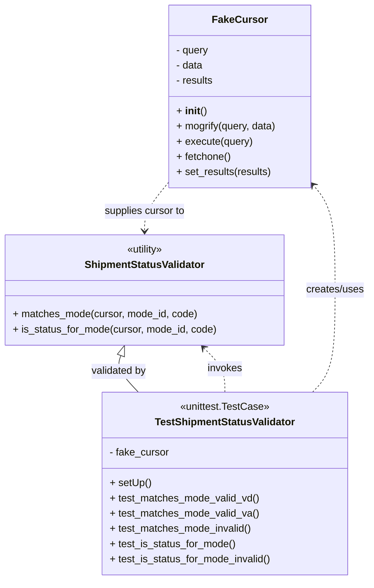

# Diagram: shipment_core/shipment_service/shipment_service/fvshared/tests/test_utility_classes.py

> Auto-generated by Obscura crawlers

## Mermaid

### SVG

<svg id="container" width="582.6953125" xmlns="http://www.w3.org/2000/svg" class="classDiagram" height="914" viewBox="0 0 582.6953125 914" role="graphics-document document" aria-roledescription="class"><g><defs><marker id="container_class-aggregationStart" class="marker aggregation class" refX="18" refY="7" markerWidth="190" markerHeight="240" orient="auto"><path d="M 18,7 L9,13 L1,7 L9,1 Z"></path></marker></defs><defs><marker id="container_class-aggregationEnd" class="marker aggregation class" refX="1" refY="7" markerWidth="20" markerHeight="28" orient="auto"><path d="M 18,7 L9,13 L1,7 L9,1 Z"></path></marker></defs><defs><marker id="container_class-extensionStart" class="marker extension class" refX="18" refY="7" markerWidth="190" markerHeight="240" orient="auto"><path d="M 1,7 L18,13 V 1 Z"></path></marker></defs><defs><marker id="container_class-extensionEnd" class="marker extension class" refX="1" refY="7" markerWidth="20" markerHeight="28" orient="auto"><path d="M 1,1 V 13 L18,7 Z"></path></marker></defs><defs><marker id="container_class-compositionStart" class="marker composition class" refX="18" refY="7" markerWidth="190" markerHeight="240" orient="auto"><path d="M 18,7 L9,13 L1,7 L9,1 Z"></path></marker></defs><defs><marker id="container_class-compositionEnd" class="marker composition class" refX="1" refY="7" markerWidth="20" markerHeight="28" orient="auto"><path d="M 18,7 L9,13 L1,7 L9,1 Z"></path></marker></defs><defs><marker id="container_class-dependencyStart" class="marker dependency class" refX="6" refY="7" markerWidth="190" markerHeight="240" orient="auto"><path d="M 5,7 L9,13 L1,7 L9,1 Z"></path></marker></defs><defs><marker id="container_class-dependencyEnd" class="marker dependency class" refX="13" refY="7" markerWidth="20" markerHeight="28" orient="auto"><path d="M 18,7 L9,13 L14,7 L9,1 Z"></path></marker></defs><defs><marker id="container_class-lollipopStart" class="marker lollipop class" refX="13" refY="7" markerWidth="190" markerHeight="240" orient="auto"><circle stroke="black" fill="transparent" cx="7" cy="7" r="6"></circle></marker></defs><defs><marker id="container_class-lollipopEnd" class="marker lollipop class" refX="1" refY="7" markerWidth="190" markerHeight="240" orient="auto"><circle stroke="black" fill="transparent" cx="7" cy="7" r="6"></circle></marker></defs><g class="root"><g class="clusters"></g><g class="edgePaths"><path d="M492.504,618L498.439,611.833C504.375,605.667,516.246,593.333,522.182,566.5C528.117,539.667,528.117,498.333,528.117,457C528.117,415.667,528.117,374.333,522.358,346.736C516.598,319.139,505.079,305.279,499.319,298.348L493.56,291.418" id="id_TestShipmentStatusValidator_FakeCursor_1" class="edge-thickness-normal edge-pattern-dashed relation" style=";;;" data-edge="true" data-et="edge" data-id="id_TestShipmentStatusValidator_FakeCursor_1" data-points="W3sieCI6NDkyLjUwMzgwOTEzMzI4NzMsInkiOjYxOH0seyJ4Ijo1MjguMTE3MTg3NSwieSI6NTgxfSx7IngiOjUyOC4xMTcxODc1LCJ5Ijo0NTd9LHsieCI6NTI4LjExNzE4NzUsInkiOjMzM30seyJ4Ijo0ODkuNzI0NjA5Mzc1LCJ5IjoyODYuODAzNDg0OTQ0ODgyMjZ9XQ==" marker-end="url(#container_class-dependencyEnd)"></path><path d="M353.9,618L353.9,611.833C353.9,605.667,353.9,593.333,348.317,581.7C342.734,570.066,331.568,559.132,325.985,553.665L320.402,548.198" id="id_TestShipmentStatusValidator_ShipmentStatusValidator_2" class="edge-thickness-normal edge-pattern-dashed relation" style=";;;" data-edge="true" data-et="edge" data-id="id_TestShipmentStatusValidator_ShipmentStatusValidator_2" data-points="W3sieCI6MzUzLjkwMDM5MDYyNSwieSI6NjE4fSx7IngiOjM1My45MDAzOTA2MjUsInkiOjU4MX0seyJ4IjozMTYuMTE1Mzc2MTM0MDcyNTYsInkiOjU0NH1d" marker-end="url(#container_class-dependencyEnd)"></path><path d="M265.662,286.803L259.263,294.503C252.865,302.202,240.067,317.601,233.668,330.467C227.27,343.333,227.27,353.667,227.27,358.833L227.27,364" id="id_FakeCursor_ShipmentStatusValidator_3" class="edge-thickness-normal edge-pattern-dashed relation" style=";;;" data-edge="true" data-et="edge" data-id="id_FakeCursor_ShipmentStatusValidator_3" data-points="W3sieCI6MjY1LjY2MjEwOTM3NSwieSI6Mjg2LjgwMzQ4NDk0NDg4MjI2fSx7IngiOjIyNy4yNjk1MzEyNSwieSI6MzMzfSx7IngiOjIyNy4yNjk1MzEyNSwieSI6MzcwfV0=" marker-end="url(#container_class-dependencyEnd)"></path><path d="M188.957,560.171L187.668,563.643C186.379,567.114,183.801,574.057,188.395,583.695C192.989,593.333,204.755,605.667,210.638,611.833L216.521,618" id="id_ShipmentStatusValidator_TestShipmentStatusValidator_4" class="edge-thickness-normal edge-pattern-solid relation" style=";;;" data-edge="true" data-et="edge" data-id="id_ShipmentStatusValidator_TestShipmentStatusValidator_4" data-points="W3sieCI6MTk0Ljk2MjQ0OTU5Njc3NDIsInkiOjU0NH0seyJ4IjoxODEuMjIyNjU2MjUsInkiOjU4MX0seyJ4IjoyMTYuNTIxNDE5NjMwNTI0ODYsInkiOjYxOH1d" marker-start="url(#container_class-extensionStart)"></path></g><g class="edgeLabels"><g class="edgeLabel" transform="translate(528.1171875, 457)"><g class="label" data-id="id_TestShipmentStatusValidator_FakeCursor_1" transform="translate(-46.578125, -12)"><foreignObject width="93.15625" height="24">

creates/uses

</foreignObject></g></g><g class="edgeLabel" transform="translate(353.900390625, 581)"><g class="label" data-id="id_TestShipmentStatusValidator_ShipmentStatusValidator_2" transform="translate(-27.5859375, -12)"><foreignObject width="55.171875" height="24">

invokes

</foreignObject></g></g><g class="edgeLabel" transform="translate(227.26953125, 333)"><g class="label" data-id="id_FakeCursor_ShipmentStatusValidator_3" transform="translate(-65.140625, -12)"><foreignObject width="130.28125" height="24">

supplies cursor to

</foreignObject></g></g><g class="edgeLabel" transform="translate(185.24985, 585.22129)"><g class="label" data-id="id_ShipmentStatusValidator_TestShipmentStatusValidator_4" transform="translate(-44.5078125, -12)"><foreignObject width="89.015625" height="24">

validated by

</foreignObject></g></g></g><g class="nodes"><g class="node default" id="classId-FakeCursor-0" transform="translate(377.693359375, 152)"><g class="basic label-container"><path d="M-112.03125 -144 L112.03125 -144 L112.03125 144 L-112.03125 144" stroke="none" stroke-width="0" fill="#ECECFF" style=""></path><path d="M-112.03125 -144 C-25.356030964543905 -144, 61.31918807091219 -144, 112.03125 -144 M-112.03125 -144 C-50.781927807262925 -144, 10.467394385474151 -144, 112.03125 -144 M112.03125 -144 C112.03125 -63.18681447571926, 112.03125 17.62637104856148, 112.03125 144 M112.03125 -144 C112.03125 -60.25517300384227, 112.03125 23.489653992315453, 112.03125 144 M112.03125 144 C66.96300234048732 144, 21.894754680974643 144, -112.03125 144 M112.03125 144 C58.681186534202354 144, 5.3311230684047075 144, -112.03125 144 M-112.03125 144 C-112.03125 53.64979748776838, -112.03125 -36.70040502446324, -112.03125 -144 M-112.03125 144 C-112.03125 41.067037713494585, -112.03125 -61.86592457301083, -112.03125 -144" stroke="#9370DB" stroke-width="1.3" fill="none" stroke-dasharray="0 0" style=""></path></g><g class="annotation-group text" transform="translate(0, -120)"></g><g class="label-group text" transform="translate(-40.4375, -120)"><g class="label" style="font-weight: bolder" transform="translate(0,-12)"><foreignObject width="80.875" height="24">

FakeCursor

</foreignObject></g></g><g class="members-group text" transform="translate(-100.03125, -72)"><g class="label" style="" transform="translate(0,-12)"><foreignObject width="52.34375" height="24">

- query

</foreignObject></g><g class="label" style="" transform="translate(0,12)"><foreignObject width="43.328125" height="24">

- data

</foreignObject></g><g class="label" style="" transform="translate(0,36)"><foreignObject width="59.828125" height="24">

- results

</foreignObject></g></g><g class="methods-group text" transform="translate(-100.03125, 24)"><g class="label" style="" transform="translate(0,-12)"><foreignObject width="47.046875" height="24">

+ <strong>init</strong>()

</foreignObject></g><g class="label" style="" transform="translate(0,12)"><foreignObject width="159.625" height="24">

+ mogrify(query, data)

</foreignObject></g><g class="label" style="" transform="translate(0,36)"><foreignObject width="120.21875" height="24">

+ execute(query)

</foreignObject></g><g class="label" style="" transform="translate(0,60)"><foreignObject width="86.515625" height="24">

+ fetchone()

</foreignObject></g><g class="label" style="" transform="translate(0,84)"><foreignObject width="151.15625" height="24">

+ set_results(results)

</foreignObject></g></g><g class="divider" style=""><path d="M-112.03125 -96 C-23.619160302271595 -96, 64.79292939545681 -96, 112.03125 -96 M-112.03125 -96 C-51.12420786370166 -96, 9.782834272596673 -96, 112.03125 -96" stroke="#9370DB" stroke-width="1.3" fill="none" stroke-dasharray="0 0" style=""></path></g><g class="divider" style=""><path d="M-112.03125 0 C-25.835192467167275 0, 60.36086506566545 0, 112.03125 0 M-112.03125 0 C-38.28538814724145 0, 35.4604737055171 0, 112.03125 0" stroke="#9370DB" stroke-width="1.3" fill="none" stroke-dasharray="0 0" style=""></path></g></g><g class="node default" id="classId-ShipmentStatusValidator-1" transform="translate(227.26953125, 457)"><g class="basic label-container"><path d="M-219.26953125 -87 L219.26953125 -87 L219.26953125 87 L-219.26953125 87" stroke="none" stroke-width="0" fill="#ECECFF" style=""></path><path d="M-219.26953125 -87 C-52.9263803711475 -87, 113.416770507705 -87, 219.26953125 -87 M-219.26953125 -87 C-58.459131792131245 -87, 102.35126766573751 -87, 219.26953125 -87 M219.26953125 -87 C219.26953125 -51.06175736003827, 219.26953125 -15.123514720076543, 219.26953125 87 M219.26953125 -87 C219.26953125 -22.87469620028814, 219.26953125 41.25060759942372, 219.26953125 87 M219.26953125 87 C60.816082694134394 87, -97.63736586173121 87, -219.26953125 87 M219.26953125 87 C83.42062479152901 87, -52.428281666941984 87, -219.26953125 87 M-219.26953125 87 C-219.26953125 31.7425823230459, -219.26953125 -23.514835353908197, -219.26953125 -87 M-219.26953125 87 C-219.26953125 25.403798958404565, -219.26953125 -36.19240208319087, -219.26953125 -87" stroke="#9370DB" stroke-width="1.3" fill="none" stroke-dasharray="0 0" style=""></path></g><g class="annotation-group text" transform="translate(-30.3125, -63)"><g class="label" style="" transform="translate(0,-12)"><foreignObject width="60.625" height="24">

«utility»

</foreignObject></g></g><g class="label-group text" transform="translate(-91.7734375, -39)"><g class="label" style="font-weight: bolder" transform="translate(0,-12)"><foreignObject width="183.546875" height="24">

ShipmentStatusValidator

</foreignObject></g></g><g class="members-group text" transform="translate(-207.26953125, 9)"></g><g class="methods-group text" transform="translate(-207.26953125, 39)"><g class="label" style="" transform="translate(0,-12)"><foreignObject width="292.109375" height="24">

+ matches_mode(cursor, mode_id, code)

</foreignObject></g><g class="label" style="" transform="translate(0,12)"><foreignObject width="322.765625" height="24">

+ is_status_for_mode(cursor, mode_id, code)

</foreignObject></g></g><g class="divider" style=""><path d="M-219.26953125 -15 C-81.28608048370222 -15, 56.69737028259556 -15, 219.26953125 -15 M-219.26953125 -15 C-75.72359785938465 -15, 67.82233553123069 -15, 219.26953125 -15" stroke="#9370DB" stroke-width="1.3" fill="none" stroke-dasharray="0 0" style=""></path></g><g class="divider" style=""><path d="M-219.26953125 9 C-72.90452733298554 9, 73.46047658402892 9, 219.26953125 9 M-219.26953125 9 C-129.86037228046024 9, -40.45121331092051 9, 219.26953125 9" stroke="#9370DB" stroke-width="1.3" fill="none" stroke-dasharray="0 0" style=""></path></g></g><g class="node default" id="classId-TestShipmentStatusValidator-2" transform="translate(353.900390625, 762)"><g class="basic label-container"><path d="M-193.66015625 -144 L193.66015625 -144 L193.66015625 144 L-193.66015625 144" stroke="none" stroke-width="0" fill="#ECECFF" style=""></path><path d="M-193.66015625 -144 C-50.962011803574995 -144, 91.73613264285001 -144, 193.66015625 -144 M-193.66015625 -144 C-83.34082376994526 -144, 26.97850871010948 -144, 193.66015625 -144 M193.66015625 -144 C193.66015625 -57.30333327450356, 193.66015625 29.393333450992884, 193.66015625 144 M193.66015625 -144 C193.66015625 -35.65370232330976, 193.66015625 72.69259535338048, 193.66015625 144 M193.66015625 144 C77.61686556928703 144, -38.42642511142594 144, -193.66015625 144 M193.66015625 144 C58.33076172579635 144, -76.9986327984073 144, -193.66015625 144 M-193.66015625 144 C-193.66015625 84.69523035851823, -193.66015625 25.39046071703646, -193.66015625 -144 M-193.66015625 144 C-193.66015625 47.09028830316646, -193.66015625 -49.81942339366708, -193.66015625 -144" stroke="#9370DB" stroke-width="1.3" fill="none" stroke-dasharray="0 0" style=""></path></g><g class="annotation-group text" transform="translate(-70.1328125, -120)"><g class="label" style="" transform="translate(0,-12)"><foreignObject width="140.265625" height="24">

«unittest.TestCase»

</foreignObject></g></g><g class="label-group text" transform="translate(-107.0234375, -96)"><g class="label" style="font-weight: bolder" transform="translate(0,-12)"><foreignObject width="214.046875" height="24">

TestShipmentStatusValidator

</foreignObject></g></g><g class="members-group text" transform="translate(-181.66015625, -48)"><g class="label" style="" transform="translate(0,-12)"><foreignObject width="94.578125" height="24">

- fake_cursor

</foreignObject></g></g><g class="methods-group text" transform="translate(-181.66015625, 0)"><g class="label" style="" transform="translate(0,-12)"><foreignObject width="64.65625" height="24">

+ setUp()

</foreignObject></g><g class="label" style="" transform="translate(0,12)"><foreignObject width="236.59375" height="24">

+ test_matches_mode_valid_vd()

</foreignObject></g><g class="label" style="" transform="translate(0,36)"><foreignObject width="235.546875" height="24">

+ test_matches_mode_valid_va()

</foreignObject></g><g class="label" style="" transform="translate(0,60)"><foreignObject width="225.640625" height="24">

+ test_matches_mode_invalid()

</foreignObject></g><g class="label" style="" transform="translate(0,84)"><foreignObject width="199.59375" height="24">

+ test_is_status_for_mode()

</foreignObject></g><g class="label" style="" transform="translate(0,108)"><foreignObject width="256.296875" height="24">

+ test_is_status_for_mode_invalid()

</foreignObject></g></g><g class="divider" style=""><path d="M-193.66015625 -72 C-87.60131924005915 -72, 18.45751776988169 -72, 193.66015625 -72 M-193.66015625 -72 C-100.4994700759816 -72, -7.338783901963211 -72, 193.66015625 -72" stroke="#9370DB" stroke-width="1.3" fill="none" stroke-dasharray="0 0" style=""></path></g><g class="divider" style=""><path d="M-193.66015625 -24 C-103.81345766078137 -24, -13.966759071562734 -24, 193.66015625 -24 M-193.66015625 -24 C-53.28558187667849 -24, 87.08899249664302 -24, 193.66015625 -24" stroke="#9370DB" stroke-width="1.3" fill="none" stroke-dasharray="0 0" style=""></path></g></g></g></g></g></svg>
