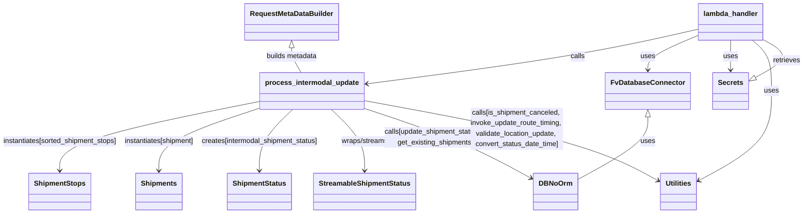

# Diagram: shipment_core/shipment_service/shipment_service/intermodal_update/intermodal_update.py


> Auto-generated by Obscura crawlers

## Diagram 1



### SVG

<svg id="container" width="1854.7734375" xmlns="http://www.w3.org/2000/svg" class="classDiagram" height="488" viewBox="0 0 1854.7734375 488" role="graphics-document document" aria-roledescription="class"><style>#container{font-family:"trebuchet ms",verdana,arial,sans-serif;font-size:16px;fill:#333;}@keyframes edge-animation-frame{from{stroke-dashoffset:0;}}@keyframes dash{to{stroke-dashoffset:0;}}#container .edge-animation-slow{stroke-dasharray:9,5!important;stroke-dashoffset:900;animation:dash 50s linear infinite;stroke-linecap:round;}#container .edge-animation-fast{stroke-dasharray:9,5!important;stroke-dashoffset:900;animation:dash 20s linear infinite;stroke-linecap:round;}#container .error-icon{fill:#552222;}#container .error-text{fill:#552222;stroke:#552222;}#container .edge-thickness-normal{stroke-width:1px;}#container .edge-thickness-thick{stroke-width:3.5px;}#container .edge-pattern-solid{stroke-dasharray:0;}#container .edge-thickness-invisible{stroke-width:0;fill:none;}#container .edge-pattern-dashed{stroke-dasharray:3;}#container .edge-pattern-dotted{stroke-dasharray:2;}#container .marker{fill:#333333;stroke:#333333;}#container .marker.cross{stroke:#333333;}#container svg{font-family:"trebuchet ms",verdana,arial,sans-serif;font-size:16px;}#container p{margin:0;}#container g.classGroup text{fill:#9370DB;stroke:none;font-family:"trebuchet ms",verdana,arial,sans-serif;font-size:10px;}#container g.classGroup text .title{font-weight:bolder;}#container .nodeLabel,#container .edgeLabel{color:#131300;}#container .edgeLabel .label rect{fill:#ECECFF;}#container .label text{fill:#131300;}#container .labelBkg{background:#ECECFF;}#container .edgeLabel .label span{background:#ECECFF;}#container .classTitle{font-weight:bolder;}#container .node rect,#container .node circle,#container .node ellipse,#container .node polygon,#container .node path{fill:#ECECFF;stroke:#9370DB;stroke-width:1px;}#container .divider{stroke:#9370DB;stroke-width:1;}#container g.clickable{cursor:pointer;}#container g.classGroup rect{fill:#ECECFF;stroke:#9370DB;}#container g.classGroup line{stroke:#9370DB;stroke-width:1;}#container .classLabel .box{stroke:none;stroke-width:0;fill:#ECECFF;opacity:0.5;}#container .classLabel .label{fill:#9370DB;font-size:10px;}#container .relation{stroke:#333333;stroke-width:1;fill:none;}#container .dashed-line{stroke-dasharray:3;}#container .dotted-line{stroke-dasharray:1 2;}#container #compositionStart,#container .composition{fill:#333333!important;stroke:#333333!important;stroke-width:1;}#container #compositionEnd,#container .composition{fill:#333333!important;stroke:#333333!important;stroke-width:1;}#container #dependencyStart,#container .dependency{fill:#333333!important;stroke:#333333!important;stroke-width:1;}#container #dependencyStart,#container .dependency{fill:#333333!important;stroke:#333333!important;stroke-width:1;}#container #extensionStart,#container .extension{fill:transparent!important;stroke:#333333!important;stroke-width:1;}#container #extensionEnd,#container .extension{fill:transparent!important;stroke:#333333!important;stroke-width:1;}#container #aggregationStart,#container .aggregation{fill:transparent!important;stroke:#333333!important;stroke-width:1;}#container #aggregationEnd,#container .aggregation{fill:transparent!important;stroke:#333333!important;stroke-width:1;}#container #lollipopStart,#container .lollipop{fill:#ECECFF!important;stroke:#333333!important;stroke-width:1;}#container #lollipopEnd,#container .lollipop{fill:#ECECFF!important;stroke:#333333!important;stroke-width:1;}#container .edgeTerminals{font-size:11px;line-height:initial;}#container .classTitleText{text-anchor:middle;font-size:18px;fill:#333;}#container .label-icon{display:inline-block;height:1em;overflow:visible;vertical-align:-0.125em;}#container .node .label-icon path{fill:currentColor;stroke:revert;stroke-width:revert;}#container :root{--mermaid-font-family:"trebuchet ms",verdana,arial,sans-serif;}</style><g><defs><marker id="container_class-aggregationStart" class="marker aggregation class" refX="18" refY="7" markerWidth="190" markerHeight="240" orient="auto"><path d="M 18,7 L9,13 L1,7 L9,1 Z"></path></marker></defs><defs><marker id="container_class-aggregationEnd" class="marker aggregation class" refX="1" refY="7" markerWidth="20" markerHeight="28" orient="auto"><path d="M 18,7 L9,13 L1,7 L9,1 Z"></path></marker></defs><defs><marker id="container_class-extensionStart" class="marker extension class" refX="18" refY="7" markerWidth="190" markerHeight="240" orient="auto"><path d="M 1,7 L18,13 V 1 Z"></path></marker></defs><defs><marker id="container_class-extensionEnd" class="marker extension class" refX="1" refY="7" markerWidth="20" markerHeight="28" orient="auto"><path d="M 1,1 V 13 L18,7 Z"></path></marker></defs><defs><marker id="container_class-compositionStart" class="marker composition class" refX="18" refY="7" markerWidth="190" markerHeight="240" orient="auto"><path d="M 18,7 L9,13 L1,7 L9,1 Z"></path></marker></defs><defs><marker id="container_class-compositionEnd" class="marker composition class" refX="1" refY="7" markerWidth="20" markerHeight="28" orient="auto"><path d="M 18,7 L9,13 L1,7 L9,1 Z"></path></marker></defs><defs><marker id="container_class-dependencyStart" class="marker dependency class" refX="6" refY="7" markerWidth="190" markerHeight="240" orient="auto"><path d="M 5,7 L9,13 L1,7 L9,1 Z"></path></marker></defs><defs><marker id="container_class-dependencyEnd" class="marker dependency class" refX="13" refY="7" markerWidth="20" markerHeight="28" orient="auto"><path d="M 18,7 L9,13 L14,7 L9,1 Z"></path></marker></defs><defs><marker id="container_class-lollipopStart" class="marker lollipop class" refX="13" refY="7" markerWidth="190" markerHeight="240" orient="auto"><circle stroke="black" fill="transparent" cx="7" cy="7" r="6"></circle></marker></defs><defs><marker id="container_class-lollipopEnd" class="marker lollipop class" refX="1" refY="7" markerWidth="190" markerHeight="240" orient="auto"><circle stroke="black" fill="transparent" cx="7" cy="7" r="6"></circle></marker></defs><g class="root"><g class="clusters"></g><g class="edgePaths"><path d="M1617,66.983L1573.195,77.32C1529.391,87.656,1441.781,108.328,1314.491,129.279C1187.201,150.231,1020.231,171.462,936.746,182.077L853.261,192.693" id="id_lambda_handler_process_intermodal_update_1" class="edge-thickness-normal edge-pattern-solid relation" style=";;;" data-edge="true" data-et="edge" data-id="id_lambda_handler_process_intermodal_update_1" data-points="W3sieCI6MTYxNywieSI6NjYuOTgzNDc5MTczOTU4N30seyJ4IjoxMzU0LjE3MTg3NSwieSI6MTI5fSx7IngiOjg0Ny4zMDg1OTM3NSwieSI6MTkzLjQ0OTc4NjU0NjQ1MzY1fV0=" marker-end="url(#container_class-dependencyEnd)"></path><path d="M1617,81.508L1598.918,89.423C1580.836,97.338,1544.672,113.169,1526.59,126.251C1508.508,139.333,1508.508,149.667,1508.508,154.833L1508.508,160" id="id_lambda_handler_FvDatabaseConnector_2" class="edge-thickness-normal edge-pattern-solid relation" style=";;;" data-edge="true" data-et="edge" data-id="id_lambda_handler_FvDatabaseConnector_2" data-points="W3sieCI6MTYxNywieSI6ODEuNTA3NjYyMzM3NjYyMzR9LHsieCI6MTUwOC41MDc4MTI1LCJ5IjoxMjl9LHsieCI6MTUwOC41MDc4MTI1LCJ5IjoxNjZ9XQ==" marker-end="url(#container_class-dependencyEnd)"></path><path d="M1688.977,92L1688.977,98.167C1688.977,104.333,1688.977,116.667,1688.977,128C1688.977,139.333,1688.977,149.667,1688.977,154.833L1688.977,160" id="id_lambda_handler_Secrets_3" class="edge-thickness-normal edge-pattern-solid relation" style=";;;" data-edge="true" data-et="edge" data-id="id_lambda_handler_Secrets_3" data-points="W3sieCI6MTY4OC45NzY1NjI1LCJ5Ijo5Mn0seyJ4IjoxNjg4Ljk3NjU2MjUsInkiOjEyOX0seyJ4IjoxNjg4Ljk3NjU2MjUsInkiOjE2Nn1d" marker-end="url(#container_class-dependencyEnd)"></path><path d="M1737.174,92L1744.25,98.167C1751.327,104.333,1765.48,116.667,1772.556,136C1779.633,155.333,1779.633,181.667,1779.633,214C1779.633,246.333,1779.633,284.667,1752.704,318.748C1725.776,352.829,1671.918,382.659,1644.99,397.574L1618.061,412.488" id="id_lambda_handler_Utilities_4" class="edge-thickness-normal edge-pattern-solid relation" style=";;;" data-edge="true" data-et="edge" data-id="id_lambda_handler_Utilities_4" data-points="W3sieCI6MTczNy4xNzM1NTYxNzA4ODYsInkiOjkyfSx7IngiOjE3NzkuNjMyODEyNSwieSI6MTI5fSx7IngiOjE3NzkuNjMyODEyNSwieSI6MjA4fSx7IngiOjE3NzkuNjMyODEyNSwieSI6MzIzfSx7IngiOjE2MTIuODEyNSwieSI6NDE1LjM5NTQ5MjM0MzAwMzM1fV0=" marker-end="url(#container_class-dependencyEnd)"></path><path d="M618.449,230.259L538.989,245.716C459.529,261.173,300.608,292.086,221.148,318.71C141.688,345.333,141.688,367.667,141.688,378.833L141.688,390" id="id_process_intermodal_update_ShipmentStops_5" class="edge-thickness-normal edge-pattern-solid relation" style=";;;" data-edge="true" data-et="edge" data-id="id_process_intermodal_update_ShipmentStops_5" data-points="W3sieCI6NjE4LjQ0OTIxODc1LCJ5IjoyMzAuMjU5MTQzMDE3NjA4Nzh9LHsieCI6MTQxLjY4NzUsInkiOjMyM30seyJ4IjoxNDEuNjg3NSwieSI6Mzk2fV0=" marker-end="url(#container_class-dependencyEnd)"></path><path d="M618.449,245.055L578.333,258.046C538.216,271.037,457.983,297.018,417.867,321.176C377.75,345.333,377.75,367.667,377.75,378.833L377.75,390" id="id_process_intermodal_update_Shipments_6" class="edge-thickness-normal edge-pattern-solid relation" style=";;;" data-edge="true" data-et="edge" data-id="id_process_intermodal_update_Shipments_6" data-points="W3sieCI6NjE4LjQ0OTIxODc1LCJ5IjoyNDUuMDU1MzE2NjIxMzg1M30seyJ4IjozNzcuNzUsInkiOjMyM30seyJ4IjozNzcuNzUsInkiOjM5Nn1d" marker-end="url(#container_class-dependencyEnd)"></path><path d="M690.295,250L677.96,262.167C665.624,274.333,640.953,298.667,628.617,322C616.281,345.333,616.281,367.667,616.281,378.833L616.281,390" id="id_process_intermodal_update_ShipmentStatus_7" class="edge-thickness-normal edge-pattern-solid relation" style=";;;" data-edge="true" data-et="edge" data-id="id_process_intermodal_update_ShipmentStatus_7" data-points="W3sieCI6NjkwLjI5NTQxNDQwMjE3NCwieSI6MjUwfSx7IngiOjYxNi4yODEyNSwieSI6MzIzfSx7IngiOjYxNi4yODEyNSwieSI6Mzk2fV0=" marker-end="url(#container_class-dependencyEnd)"></path><path d="M775.462,250L787.798,262.167C800.134,274.333,824.805,298.667,837.141,322C849.477,345.333,849.477,367.667,849.477,378.833L849.477,390" id="id_process_intermodal_update_StreamableShipmentStatus_8" class="edge-thickness-normal edge-pattern-solid relation" style=";;;" data-edge="true" data-et="edge" data-id="id_process_intermodal_update_StreamableShipmentStatus_8" data-points="W3sieCI6Nzc1LjQ2MjM5ODA5NzgyNiwieSI6MjUwfSx7IngiOjg0OS40NzY1NjI1LCJ5IjozMjN9LHsieCI6ODQ5LjQ3NjU2MjUsInkiOjM5Nn1d" marker-end="url(#container_class-dependencyEnd)"></path><path d="M847.309,245.899L886.107,258.749C924.906,271.599,1002.504,297.3,1068.186,324.583C1133.868,351.866,1187.635,380.732,1214.518,395.165L1241.401,409.598" id="id_process_intermodal_update_DBNoOrm_9" class="edge-thickness-normal edge-pattern-solid relation" style=";;;" data-edge="true" data-et="edge" data-id="id_process_intermodal_update_DBNoOrm_9" data-points="W3sieCI6ODQ3LjMwODU5Mzc1LCJ5IjoyNDUuODk5MDY1MTI2MTY4NTh9LHsieCI6MTA4MC4xMDE1NjI1LCJ5IjozMjN9LHsieCI6MTI0Ni42ODc1LCJ5Ijo0MTIuNDM1NTg5NzU4NTUyOH1d" marker-end="url(#container_class-dependencyEnd)"></path><path d="M847.309,228.839L933.485,244.532C1019.661,260.226,1192.014,291.613,1305.119,322.221C1418.224,352.829,1472.082,382.659,1499.01,397.574L1525.939,412.488" id="id_process_intermodal_update_Utilities_10" class="edge-thickness-normal edge-pattern-solid relation" style=";;;" data-edge="true" data-et="edge" data-id="id_process_intermodal_update_Utilities_10" data-points="W3sieCI6ODQ3LjMwODU5Mzc1LCJ5IjoyMjguODM4NzMwNDI5NzI2NH0seyJ4IjoxMzY0LjM2NzE4NzUsInkiOjMyM30seyJ4IjoxNTMxLjE4NzUsInkiOjQxNS4zOTU0OTIzNDMwMDMzNX1d" marker-end="url(#container_class-dependencyEnd)"></path><path d="M1508.508,267.25L1508.508,276.542C1508.508,285.833,1508.508,304.417,1480.743,328.614C1452.979,352.812,1397.451,382.624,1369.686,397.53L1341.922,412.436" id="id_FvDatabaseConnector_DBNoOrm_11" class="edge-thickness-normal edge-pattern-solid relation" style=";;;" data-edge="true" data-et="edge" data-id="id_FvDatabaseConnector_DBNoOrm_11" data-points="W3sieCI6MTUwOC41MDc4MTI1LCJ5IjoyNTB9LHsieCI6MTUwOC41MDc4MTI1LCJ5IjozMjN9LHsieCI6MTM0MS45MjE4NzUsInkiOjQxMi40MzU1ODk3NTg1NTI4fV0=" marker-start="url(#container_class-extensionStart)"></path><path d="M1743.226,177.91L1757.922,169.759C1772.619,161.607,1802.013,145.303,1804.967,130.639C1807.922,115.974,1784.438,102.948,1772.695,96.435L1760.953,89.922" id="id_Secrets_lambda_handler_12" class="edge-thickness-normal edge-pattern-solid relation" style=";;;" data-edge="true" data-et="edge" data-id="id_Secrets_lambda_handler_12" data-points="W3sieCI6MTcyOC4xNDA2MjUsInkiOjE4Ni4yNzcyNzQ5NzEyMDI5fSx7IngiOjE4MzEuNDA2MjUsInkiOjEyOX0seyJ4IjoxNzYwLjk1MzEyNSwieSI6ODkuOTIyNDk0NjUxOTY2NDN9XQ==" marker-start="url(#container_class-extensionStart)"></path><path d="M684.992,109.25L684.992,112.542C684.992,115.833,684.992,122.417,688.73,131.875C692.468,141.333,699.944,153.667,703.682,159.833L707.42,166" id="id_RequestMetaDataBuilder_process_intermodal_update_13" class="edge-thickness-normal edge-pattern-solid relation" style=";;;" data-edge="true" data-et="edge" data-id="id_RequestMetaDataBuilder_process_intermodal_update_13" data-points="W3sieCI6Njg0Ljk5MjE4NzUsInkiOjkyfSx7IngiOjY4NC45OTIxODc1LCJ5IjoxMjl9LHsieCI6NzA3LjQyMDE0NDM4MjkxMTQsInkiOjE2Nn1d" marker-start="url(#container_class-extensionStart)"></path></g><g class="edgeLabels"><g class="edgeLabel" transform="translate(1354.171875, 129)"><g class="label" data-id="id_lambda_handler_process_intermodal_update_1" transform="translate(-16.4453125, -12)"><foreignObject width="32.890625" height="24"><div xmlns="http://www.w3.org/1999/xhtml" class="labelBkg" style="display: table-cell; white-space: nowrap; line-height: 1.5; max-width: 200px; text-align: center;"><span class="edgeLabel"><p>calls</p></span></div></foreignObject></g></g><g class="edgeLabel" transform="translate(1508.5078125, 129)"><g class="label" data-id="id_lambda_handler_FvDatabaseConnector_2" transform="translate(-16.4921875, -12)"><foreignObject width="32.984375" height="24"><div xmlns="http://www.w3.org/1999/xhtml" class="labelBkg" style="display: table-cell; white-space: nowrap; line-height: 1.5; max-width: 200px; text-align: center;"><span class="edgeLabel"><p>uses</p></span></div></foreignObject></g></g><g class="edgeLabel" transform="translate(1688.9765625, 129)"><g class="label" data-id="id_lambda_handler_Secrets_3" transform="translate(-16.4921875, -12)"><foreignObject width="32.984375" height="24"><div xmlns="http://www.w3.org/1999/xhtml" class="labelBkg" style="display: table-cell; white-space: nowrap; line-height: 1.5; max-width: 200px; text-align: center;"><span class="edgeLabel"><p>uses</p></span></div></foreignObject></g></g><g class="edgeLabel" transform="translate(1779.6328125, 208)"><g class="label" data-id="id_lambda_handler_Utilities_4" transform="translate(-16.4921875, -12)"><foreignObject width="32.984375" height="24"><div xmlns="http://www.w3.org/1999/xhtml" class="labelBkg" style="display: table-cell; white-space: nowrap; line-height: 1.5; max-width: 200px; text-align: center;"><span class="edgeLabel"><p>uses</p></span></div></foreignObject></g></g><g class="edgeLabel" transform="translate(141.6875, 323)"><g class="label" data-id="id_process_intermodal_update_ShipmentStops_5" transform="translate(-133.6875, -12)"><foreignObject width="267.375" height="24"><div xmlns="http://www.w3.org/1999/xhtml" class="labelBkg" style="display: table; white-space: break-spaces; line-height: 1.5; max-width: 200px; text-align: center; width: 200px;"><span class="edgeLabel"><p>instantiates[sorted_shipment_stops]</p></span></div></foreignObject></g></g><g class="edgeLabel" transform="translate(377.75, 323)"><g class="label" data-id="id_process_intermodal_update_Shipments_6" transform="translate(-82.375, -12)"><foreignObject width="164.75" height="24"><div xmlns="http://www.w3.org/1999/xhtml" class="labelBkg" style="display: table-cell; white-space: nowrap; line-height: 1.5; max-width: 200px; text-align: center;"><span class="edgeLabel"><p>instantiates[shipment]</p></span></div></foreignObject></g></g><g class="edgeLabel" transform="translate(616.28125, 323)"><g class="label" data-id="id_process_intermodal_update_ShipmentStatus_7" transform="translate(-136.15625, -12)"><foreignObject width="272.3125" height="24"><div xmlns="http://www.w3.org/1999/xhtml" class="labelBkg" style="display: table; white-space: break-spaces; line-height: 1.5; max-width: 200px; text-align: center; width: 200px;"><span class="edgeLabel"><p>creates[intermodal_shipment_status]</p></span></div></foreignObject></g></g><g class="edgeLabel" transform="translate(849.4765625, 323)"><g class="label" data-id="id_process_intermodal_update_StreamableShipmentStatus_8" transform="translate(-54.0078125, -12)"><foreignObject width="108.015625" height="24"><div xmlns="http://www.w3.org/1999/xhtml" class="labelBkg" style="display: table-cell; white-space: nowrap; line-height: 1.5; max-width: 200px; text-align: center;"><span class="edgeLabel"><p>wraps/streams</p></span></div></foreignObject></g></g><g class="edgeLabel" transform="translate(1053.44881, 314.17262)"><g class="label" data-id="id_process_intermodal_update_DBNoOrm_9" transform="translate(-156.6171875, -24)"><foreignObject width="313.234375" height="48"><div xmlns="http://www.w3.org/1999/xhtml" class="labelBkg" style="display: table; white-space: break-spaces; line-height: 1.5; max-width: 200px; text-align: center; width: 200px;"><span class="edgeLabel"><p>calls[update_shipment_status_details_loc, get_existing_shipments_by_db_id]</p></span></div></foreignObject></g></g><g class="edgeLabel" transform="translate(1199.64437, 293.00241)"><g class="label" data-id="id_process_intermodal_update_Utilities_10" transform="translate(-107.6484375, -48)"><foreignObject width="215.296875" height="96"><div xmlns="http://www.w3.org/1999/xhtml" class="labelBkg" style="display: table; white-space: break-spaces; line-height: 1.5; max-width: 200px; text-align: center; width: 200px;"><span class="edgeLabel"><p>calls[is_shipment_canceled, invoke_update_route_timing, validate_location_update, convert_status_date_time]</p></span></div></foreignObject></g></g><g class="edgeLabel" transform="translate(1508.5078125, 323)"><g class="label" data-id="id_FvDatabaseConnector_DBNoOrm_11" transform="translate(-16.4921875, -12)"><foreignObject width="32.984375" height="24"><div xmlns="http://www.w3.org/1999/xhtml" class="labelBkg" style="display: table-cell; white-space: nowrap; line-height: 1.5; max-width: 200px; text-align: center;"><span class="edgeLabel"><p>uses</p></span></div></foreignObject></g></g><g class="edgeLabel" transform="translate(1815, 138.09988)"><g class="label" data-id="id_Secrets_lambda_handler_12" transform="translate(-31.7734375, -12)"><foreignObject width="63.546875" height="24"><div xmlns="http://www.w3.org/1999/xhtml" class="labelBkg" style="display: table-cell; white-space: nowrap; line-height: 1.5; max-width: 200px; text-align: center;"><span class="edgeLabel"><p>retrieves</p></span></div></foreignObject></g></g><g class="edgeLabel" transform="translate(684.9921875, 129)"><g class="label" data-id="id_RequestMetaDataBuilder_process_intermodal_update_13" transform="translate(-59.328125, -12)"><foreignObject width="118.65625" height="24"><div xmlns="http://www.w3.org/1999/xhtml" class="labelBkg" style="display: table-cell; white-space: nowrap; line-height: 1.5; max-width: 200px; text-align: center;"><span class="edgeLabel"><p>builds metadata</p></span></div></foreignObject></g></g></g><g class="nodes"><g class="node default" id="classId-lambda_handler-0" transform="translate(1688.9765625, 50)"><g class="basic label-container"><path d="M-71.9765625 -42 L71.9765625 -42 L71.9765625 42 L-71.9765625 42" stroke="none" stroke-width="0" fill="#ECECFF" style=""></path><path d="M-71.9765625 -42 C-17.077262609951042 -42, 37.822037280097916 -42, 71.9765625 -42 M-71.9765625 -42 C-35.659376069778396 -42, 0.6578103604432073 -42, 71.9765625 -42 M71.9765625 -42 C71.9765625 -20.559175769640206, 71.9765625 0.8816484607195889, 71.9765625 42 M71.9765625 -42 C71.9765625 -24.507995739374657, 71.9765625 -7.015991478749314, 71.9765625 42 M71.9765625 42 C30.486488537546172 42, -11.003585424907655 42, -71.9765625 42 M71.9765625 42 C38.664863515858364 42, 5.353164531716729 42, -71.9765625 42 M-71.9765625 42 C-71.9765625 19.918472988965984, -71.9765625 -2.1630540220680317, -71.9765625 -42 M-71.9765625 42 C-71.9765625 12.748346065134278, -71.9765625 -16.503307869731444, -71.9765625 -42" stroke="#9370DB" stroke-width="1.3" fill="none" stroke-dasharray="0 0" style=""></path></g><g class="annotation-group text" transform="translate(0, -18)"></g><g class="label-group text" transform="translate(-59.9765625, -18)"><g class="label" style="font-weight: bolder" transform="translate(0,-12)"><foreignObject width="119.953125" height="24"><div xmlns="http://www.w3.org/1999/xhtml" style="display: table-cell; white-space: nowrap; line-height: 1.5; max-width: 170px; text-align: center;"><span class="nodeLabel markdown-node-label" style=""><p>lambda_handler</p></span></div></foreignObject></g></g><g class="members-group text" transform="translate(-59.9765625, 30)"></g><g class="methods-group text" transform="translate(-59.9765625, 60)"></g><g class="divider" style=""><path d="M-71.9765625 6 C-15.937899214588462 6, 40.100764070823075 6, 71.9765625 6 M-71.9765625 6 C-20.808868609142024 6, 30.35882528171595 6, 71.9765625 6" stroke="#9370DB" stroke-width="1.3" fill="none" stroke-dasharray="0 0" style=""></path></g><g class="divider" style=""><path d="M-71.9765625 24 C-30.45032485166842 24, 11.075912796663161 24, 71.9765625 24 M-71.9765625 24 C-17.475697619626736 24, 37.02516726074653 24, 71.9765625 24" stroke="#9370DB" stroke-width="1.3" fill="none" stroke-dasharray="0 0" style=""></path></g></g><g class="node default" id="classId-process_intermodal_update-1" transform="translate(732.87890625, 208)"><g class="basic label-container"><path d="M-114.4296875 -42 L114.4296875 -42 L114.4296875 42 L-114.4296875 42" stroke="none" stroke-width="0" fill="#ECECFF" style=""></path><path d="M-114.4296875 -42 C-39.544621861556664 -42, 35.34044377688667 -42, 114.4296875 -42 M-114.4296875 -42 C-27.926843589417857 -42, 58.57600032116429 -42, 114.4296875 -42 M114.4296875 -42 C114.4296875 -23.435009958268218, 114.4296875 -4.870019916536435, 114.4296875 42 M114.4296875 -42 C114.4296875 -14.70663842635706, 114.4296875 12.58672314728588, 114.4296875 42 M114.4296875 42 C65.93937312364153 42, 17.449058747283075 42, -114.4296875 42 M114.4296875 42 C51.62476864160927 42, -11.180150216781456 42, -114.4296875 42 M-114.4296875 42 C-114.4296875 12.440735115214824, -114.4296875 -17.11852976957035, -114.4296875 -42 M-114.4296875 42 C-114.4296875 19.976978394054214, -114.4296875 -2.046043211891572, -114.4296875 -42" stroke="#9370DB" stroke-width="1.3" fill="none" stroke-dasharray="0 0" style=""></path></g><g class="annotation-group text" transform="translate(0, -18)"></g><g class="label-group text" transform="translate(-102.4296875, -18)"><g class="label" style="font-weight: bolder" transform="translate(0,-12)"><foreignObject width="204.859375" height="24"><div xmlns="http://www.w3.org/1999/xhtml" style="display: table-cell; white-space: nowrap; line-height: 1.5; max-width: 253px; text-align: center;"><span class="nodeLabel markdown-node-label" style=""><p>process_intermodal_update</p></span></div></foreignObject></g></g><g class="members-group text" transform="translate(-102.4296875, 30)"></g><g class="methods-group text" transform="translate(-102.4296875, 60)"></g><g class="divider" style=""><path d="M-114.4296875 6 C-28.080375435334958 6, 58.268936629330085 6, 114.4296875 6 M-114.4296875 6 C-52.01986794604321 6, 10.389951607913574 6, 114.4296875 6" stroke="#9370DB" stroke-width="1.3" fill="none" stroke-dasharray="0 0" style=""></path></g><g class="divider" style=""><path d="M-114.4296875 24 C-66.04558119556043 24, -17.66147489112086 24, 114.4296875 24 M-114.4296875 24 C-32.82929353108118 24, 48.771100437837646 24, 114.4296875 24" stroke="#9370DB" stroke-width="1.3" fill="none" stroke-dasharray="0 0" style=""></path></g></g><g class="node default" id="classId-FvDatabaseConnector-2" transform="translate(1508.5078125, 208)"><g class="basic label-container"><path d="M-91.3046875 -42 L91.3046875 -42 L91.3046875 42 L-91.3046875 42" stroke="none" stroke-width="0" fill="#ECECFF" style=""></path><path d="M-91.3046875 -42 C-44.21760239006474 -42, 2.8694827198705184 -42, 91.3046875 -42 M-91.3046875 -42 C-30.006171890240772 -42, 31.292343719518456 -42, 91.3046875 -42 M91.3046875 -42 C91.3046875 -10.802009324960153, 91.3046875 20.395981350079694, 91.3046875 42 M91.3046875 -42 C91.3046875 -24.763924352210523, 91.3046875 -7.5278487044210465, 91.3046875 42 M91.3046875 42 C40.33934891965254 42, -10.625989660694927 42, -91.3046875 42 M91.3046875 42 C29.094412894163888 42, -33.115861711672224 42, -91.3046875 42 M-91.3046875 42 C-91.3046875 8.694112705247072, -91.3046875 -24.611774589505856, -91.3046875 -42 M-91.3046875 42 C-91.3046875 19.56790107642473, -91.3046875 -2.8641978471505425, -91.3046875 -42" stroke="#9370DB" stroke-width="1.3" fill="none" stroke-dasharray="0 0" style=""></path></g><g class="annotation-group text" transform="translate(0, -18)"></g><g class="label-group text" transform="translate(-79.3046875, -18)"><g class="label" style="font-weight: bolder" transform="translate(0,-12)"><foreignObject width="158.609375" height="24"><div xmlns="http://www.w3.org/1999/xhtml" style="display: table-cell; white-space: nowrap; line-height: 1.5; max-width: 207px; text-align: center;"><span class="nodeLabel markdown-node-label" style=""><p>FvDatabaseConnector</p></span></div></foreignObject></g></g><g class="members-group text" transform="translate(-79.3046875, 30)"></g><g class="methods-group text" transform="translate(-79.3046875, 60)"></g><g class="divider" style=""><path d="M-91.3046875 6 C-38.03457617137553 6, 15.235535157248947 6, 91.3046875 6 M-91.3046875 6 C-52.63488318126382 6, -13.965078862527633 6, 91.3046875 6" stroke="#9370DB" stroke-width="1.3" fill="none" stroke-dasharray="0 0" style=""></path></g><g class="divider" style=""><path d="M-91.3046875 24 C-51.442211846326934 24, -11.579736192653868 24, 91.3046875 24 M-91.3046875 24 C-47.96324289867445 24, -4.621798297348903 24, 91.3046875 24" stroke="#9370DB" stroke-width="1.3" fill="none" stroke-dasharray="0 0" style=""></path></g></g><g class="node default" id="classId-Secrets-3" transform="translate(1688.9765625, 208)"><g class="basic label-container"><path d="M-39.1640625 -42 L39.1640625 -42 L39.1640625 42 L-39.1640625 42" stroke="none" stroke-width="0" fill="#ECECFF" style=""></path><path d="M-39.1640625 -42 C-11.680201418198632 -42, 15.803659663602737 -42, 39.1640625 -42 M-39.1640625 -42 C-12.507949321249228 -42, 14.148163857501544 -42, 39.1640625 -42 M39.1640625 -42 C39.1640625 -14.764326140087803, 39.1640625 12.471347719824394, 39.1640625 42 M39.1640625 -42 C39.1640625 -20.178115649347827, 39.1640625 1.6437687013043458, 39.1640625 42 M39.1640625 42 C18.330101411179314 42, -2.5038596776413726 42, -39.1640625 42 M39.1640625 42 C21.703657033593956 42, 4.243251567187912 42, -39.1640625 42 M-39.1640625 42 C-39.1640625 23.563433093139025, -39.1640625 5.1268661862780505, -39.1640625 -42 M-39.1640625 42 C-39.1640625 21.187451448039873, -39.1640625 0.37490289607974603, -39.1640625 -42" stroke="#9370DB" stroke-width="1.3" fill="none" stroke-dasharray="0 0" style=""></path></g><g class="annotation-group text" transform="translate(0, -18)"></g><g class="label-group text" transform="translate(-27.1640625, -18)"><g class="label" style="font-weight: bolder" transform="translate(0,-12)"><foreignObject width="54.328125" height="24"><div xmlns="http://www.w3.org/1999/xhtml" style="display: table-cell; white-space: nowrap; line-height: 1.5; max-width: 103px; text-align: center;"><span class="nodeLabel markdown-node-label" style=""><p>Secrets</p></span></div></foreignObject></g></g><g class="members-group text" transform="translate(-27.1640625, 30)"></g><g class="methods-group text" transform="translate(-27.1640625, 60)"></g><g class="divider" style=""><path d="M-39.1640625 6 C-15.445227576754249 6, 8.273607346491502 6, 39.1640625 6 M-39.1640625 6 C-11.579375202532844 6, 16.00531209493431 6, 39.1640625 6" stroke="#9370DB" stroke-width="1.3" fill="none" stroke-dasharray="0 0" style=""></path></g><g class="divider" style=""><path d="M-39.1640625 24 C-19.889429509441143 24, -0.6147965188822866 24, 39.1640625 24 M-39.1640625 24 C-8.548119394469126 24, 22.06782371106175 24, 39.1640625 24" stroke="#9370DB" stroke-width="1.3" fill="none" stroke-dasharray="0 0" style=""></path></g></g><g class="node default" id="classId-ShipmentStops-4" transform="translate(141.6875, 438)"><g class="basic label-container"><path d="M-67.9375 -42 L67.9375 -42 L67.9375 42 L-67.9375 42" stroke="none" stroke-width="0" fill="#ECECFF" style=""></path><path d="M-67.9375 -42 C-38.73028109993574 -42, -9.523062199871468 -42, 67.9375 -42 M-67.9375 -42 C-16.864282397979657 -42, 34.208935204040685 -42, 67.9375 -42 M67.9375 -42 C67.9375 -21.551224150026126, 67.9375 -1.1024483000522523, 67.9375 42 M67.9375 -42 C67.9375 -19.24835371226051, 67.9375 3.50329257547898, 67.9375 42 M67.9375 42 C27.868229381327495 42, -12.20104123734501 42, -67.9375 42 M67.9375 42 C28.161978515946494 42, -11.613542968107012 42, -67.9375 42 M-67.9375 42 C-67.9375 15.783519847704188, -67.9375 -10.432960304591624, -67.9375 -42 M-67.9375 42 C-67.9375 18.321452553937757, -67.9375 -5.357094892124486, -67.9375 -42" stroke="#9370DB" stroke-width="1.3" fill="none" stroke-dasharray="0 0" style=""></path></g><g class="annotation-group text" transform="translate(0, -18)"></g><g class="label-group text" transform="translate(-55.9375, -18)"><g class="label" style="font-weight: bolder" transform="translate(0,-12)"><foreignObject width="111.875" height="24"><div xmlns="http://www.w3.org/1999/xhtml" style="display: table-cell; white-space: nowrap; line-height: 1.5; max-width: 160px; text-align: center;"><span class="nodeLabel markdown-node-label" style=""><p>ShipmentStops</p></span></div></foreignObject></g></g><g class="members-group text" transform="translate(-55.9375, 30)"></g><g class="methods-group text" transform="translate(-55.9375, 60)"></g><g class="divider" style=""><path d="M-67.9375 6 C-31.99800702879746 6, 3.9414859424050803 6, 67.9375 6 M-67.9375 6 C-17.530487070833054 6, 32.87652585833389 6, 67.9375 6" stroke="#9370DB" stroke-width="1.3" fill="none" stroke-dasharray="0 0" style=""></path></g><g class="divider" style=""><path d="M-67.9375 24 C-34.168013495876544 24, -0.39852699175308715 24, 67.9375 24 M-67.9375 24 C-32.88142846412689 24, 2.1746430717462175 24, 67.9375 24" stroke="#9370DB" stroke-width="1.3" fill="none" stroke-dasharray="0 0" style=""></path></g></g><g class="node default" id="classId-Shipments-5" transform="translate(377.75, 438)"><g class="basic label-container"><path d="M-50.96875 -42 L50.96875 -42 L50.96875 42 L-50.96875 42" stroke="none" stroke-width="0" fill="#ECECFF" style=""></path><path d="M-50.96875 -42 C-25.35789924667637 -42, 0.25295150664725696 -42, 50.96875 -42 M-50.96875 -42 C-26.905300721782996 -42, -2.841851443565993 -42, 50.96875 -42 M50.96875 -42 C50.96875 -20.10951965834908, 50.96875 1.780960683301842, 50.96875 42 M50.96875 -42 C50.96875 -11.835286927260437, 50.96875 18.329426145479125, 50.96875 42 M50.96875 42 C13.597935774270866 42, -23.77287845145827 42, -50.96875 42 M50.96875 42 C29.014273838018266 42, 7.059797676036531 42, -50.96875 42 M-50.96875 42 C-50.96875 15.713068070417044, -50.96875 -10.573863859165911, -50.96875 -42 M-50.96875 42 C-50.96875 12.336423064322968, -50.96875 -17.327153871354064, -50.96875 -42" stroke="#9370DB" stroke-width="1.3" fill="none" stroke-dasharray="0 0" style=""></path></g><g class="annotation-group text" transform="translate(0, -18)"></g><g class="label-group text" transform="translate(-38.96875, -18)"><g class="label" style="font-weight: bolder" transform="translate(0,-12)"><foreignObject width="77.9375" height="24"><div xmlns="http://www.w3.org/1999/xhtml" style="display: table-cell; white-space: nowrap; line-height: 1.5; max-width: 127px; text-align: center;"><span class="nodeLabel markdown-node-label" style=""><p>Shipments</p></span></div></foreignObject></g></g><g class="members-group text" transform="translate(-38.96875, 30)"></g><g class="methods-group text" transform="translate(-38.96875, 60)"></g><g class="divider" style=""><path d="M-50.96875 6 C-24.120937311344942 6, 2.7268753773101153 6, 50.96875 6 M-50.96875 6 C-17.687248883581198 6, 15.594252232837604 6, 50.96875 6" stroke="#9370DB" stroke-width="1.3" fill="none" stroke-dasharray="0 0" style=""></path></g><g class="divider" style=""><path d="M-50.96875 24 C-10.481039712163437 24, 30.006670575673127 24, 50.96875 24 M-50.96875 24 C-22.040150056980988 24, 6.888449886038025 24, 50.96875 24" stroke="#9370DB" stroke-width="1.3" fill="none" stroke-dasharray="0 0" style=""></path></g></g><g class="node default" id="classId-ShipmentStatus-6" transform="translate(616.28125, 438)"><g class="basic label-container"><path d="M-70.5859375 -42 L70.5859375 -42 L70.5859375 42 L-70.5859375 42" stroke="none" stroke-width="0" fill="#ECECFF" style=""></path><path d="M-70.5859375 -42 C-31.468664215198956 -42, 7.648609069602088 -42, 70.5859375 -42 M-70.5859375 -42 C-37.90347589998466 -42, -5.221014299969326 -42, 70.5859375 -42 M70.5859375 -42 C70.5859375 -24.391377908594645, 70.5859375 -6.78275581718929, 70.5859375 42 M70.5859375 -42 C70.5859375 -18.320075581689903, 70.5859375 5.359848836620195, 70.5859375 42 M70.5859375 42 C39.182419094381885 42, 7.778900688763777 42, -70.5859375 42 M70.5859375 42 C27.6946725469705 42, -15.196592406058997 42, -70.5859375 42 M-70.5859375 42 C-70.5859375 23.660860878223527, -70.5859375 5.3217217564470545, -70.5859375 -42 M-70.5859375 42 C-70.5859375 13.584416432024074, -70.5859375 -14.831167135951851, -70.5859375 -42" stroke="#9370DB" stroke-width="1.3" fill="none" stroke-dasharray="0 0" style=""></path></g><g class="annotation-group text" transform="translate(0, -18)"></g><g class="label-group text" transform="translate(-58.5859375, -18)"><g class="label" style="font-weight: bolder" transform="translate(0,-12)"><foreignObject width="117.171875" height="24"><div xmlns="http://www.w3.org/1999/xhtml" style="display: table-cell; white-space: nowrap; line-height: 1.5; max-width: 165px; text-align: center;"><span class="nodeLabel markdown-node-label" style=""><p>ShipmentStatus</p></span></div></foreignObject></g></g><g class="members-group text" transform="translate(-58.5859375, 30)"></g><g class="methods-group text" transform="translate(-58.5859375, 60)"></g><g class="divider" style=""><path d="M-70.5859375 6 C-33.24756155050117 6, 4.090814398997665 6, 70.5859375 6 M-70.5859375 6 C-23.38380794910261 6, 23.81832160179478 6, 70.5859375 6" stroke="#9370DB" stroke-width="1.3" fill="none" stroke-dasharray="0 0" style=""></path></g><g class="divider" style=""><path d="M-70.5859375 24 C-34.46213390122544 24, 1.6616696975491152 24, 70.5859375 24 M-70.5859375 24 C-35.8311218790541 24, -1.076306258108204 24, 70.5859375 24" stroke="#9370DB" stroke-width="1.3" fill="none" stroke-dasharray="0 0" style=""></path></g></g><g class="node default" id="classId-StreamableShipmentStatus-7" transform="translate(849.4765625, 438)"><g class="basic label-container"><path d="M-112.609375 -42 L112.609375 -42 L112.609375 42 L-112.609375 42" stroke="none" stroke-width="0" fill="#ECECFF" style=""></path><path d="M-112.609375 -42 C-57.00759875844741 -42, -1.4058225168948155 -42, 112.609375 -42 M-112.609375 -42 C-42.10128784571742 -42, 28.406799308565155 -42, 112.609375 -42 M112.609375 -42 C112.609375 -9.364648103991954, 112.609375 23.270703792016093, 112.609375 42 M112.609375 -42 C112.609375 -9.05961942989694, 112.609375 23.88076114020612, 112.609375 42 M112.609375 42 C34.85299168316935 42, -42.9033916336613 42, -112.609375 42 M112.609375 42 C54.04462802433218 42, -4.520118951335647 42, -112.609375 42 M-112.609375 42 C-112.609375 16.197584746049774, -112.609375 -9.604830507900452, -112.609375 -42 M-112.609375 42 C-112.609375 13.800994826164722, -112.609375 -14.398010347670557, -112.609375 -42" stroke="#9370DB" stroke-width="1.3" fill="none" stroke-dasharray="0 0" style=""></path></g><g class="annotation-group text" transform="translate(0, -18)"></g><g class="label-group text" transform="translate(-100.609375, -18)"><g class="label" style="font-weight: bolder" transform="translate(0,-12)"><foreignObject width="201.21875" height="24"><div xmlns="http://www.w3.org/1999/xhtml" style="display: table-cell; white-space: nowrap; line-height: 1.5; max-width: 248px; text-align: center;"><span class="nodeLabel markdown-node-label" style=""><p>StreamableShipmentStatus</p></span></div></foreignObject></g></g><g class="members-group text" transform="translate(-100.609375, 30)"></g><g class="methods-group text" transform="translate(-100.609375, 60)"></g><g class="divider" style=""><path d="M-112.609375 6 C-25.858673429240284 6, 60.89202814151943 6, 112.609375 6 M-112.609375 6 C-61.72384856038428 6, -10.838322120768566 6, 112.609375 6" stroke="#9370DB" stroke-width="1.3" fill="none" stroke-dasharray="0 0" style=""></path></g><g class="divider" style=""><path d="M-112.609375 24 C-47.776213123148096 24, 17.056948753703807 24, 112.609375 24 M-112.609375 24 C-33.22963720721734 24, 46.150100585565326 24, 112.609375 24" stroke="#9370DB" stroke-width="1.3" fill="none" stroke-dasharray="0 0" style=""></path></g></g><g class="node default" id="classId-RequestMetaDataBuilder-8" transform="translate(684.9921875, 50)"><g class="basic label-container"><path d="M-103.4765625 -42 L103.4765625 -42 L103.4765625 42 L-103.4765625 42" stroke="none" stroke-width="0" fill="#ECECFF" style=""></path><path d="M-103.4765625 -42 C-29.47252400832467 -42, 44.53151448335066 -42, 103.4765625 -42 M-103.4765625 -42 C-57.72915326962889 -42, -11.981744039257777 -42, 103.4765625 -42 M103.4765625 -42 C103.4765625 -17.123562980506094, 103.4765625 7.752874038987812, 103.4765625 42 M103.4765625 -42 C103.4765625 -12.544253311123938, 103.4765625 16.911493377752123, 103.4765625 42 M103.4765625 42 C38.92559135980214 42, -25.62537978039572 42, -103.4765625 42 M103.4765625 42 C55.56354285347585 42, 7.6505232069517035 42, -103.4765625 42 M-103.4765625 42 C-103.4765625 18.12232564703929, -103.4765625 -5.755348705921421, -103.4765625 -42 M-103.4765625 42 C-103.4765625 15.146252387706816, -103.4765625 -11.707495224586367, -103.4765625 -42" stroke="#9370DB" stroke-width="1.3" fill="none" stroke-dasharray="0 0" style=""></path></g><g class="annotation-group text" transform="translate(0, -18)"></g><g class="label-group text" transform="translate(-91.4765625, -18)"><g class="label" style="font-weight: bolder" transform="translate(0,-12)"><foreignObject width="182.953125" height="24"><div xmlns="http://www.w3.org/1999/xhtml" style="display: table-cell; white-space: nowrap; line-height: 1.5; max-width: 231px; text-align: center;"><span class="nodeLabel markdown-node-label" style=""><p>RequestMetaDataBuilder</p></span></div></foreignObject></g></g><g class="members-group text" transform="translate(-91.4765625, 30)"></g><g class="methods-group text" transform="translate(-91.4765625, 60)"></g><g class="divider" style=""><path d="M-103.4765625 6 C-36.78789301373695 6, 29.900776472526104 6, 103.4765625 6 M-103.4765625 6 C-27.08664542879181 6, 49.30327164241638 6, 103.4765625 6" stroke="#9370DB" stroke-width="1.3" fill="none" stroke-dasharray="0 0" style=""></path></g><g class="divider" style=""><path d="M-103.4765625 24 C-29.012714161512392 24, 45.451134176975216 24, 103.4765625 24 M-103.4765625 24 C-20.732952026271207 24, 62.01065844745759 24, 103.4765625 24" stroke="#9370DB" stroke-width="1.3" fill="none" stroke-dasharray="0 0" style=""></path></g></g><g class="node default" id="classId-Utilities-9" transform="translate(1572, 438)"><g class="basic label-container"><path d="M-40.8125 -42 L40.8125 -42 L40.8125 42 L-40.8125 42" stroke="none" stroke-width="0" fill="#ECECFF" style=""></path><path d="M-40.8125 -42 C-22.617599028094254 -42, -4.4226980561885085 -42, 40.8125 -42 M-40.8125 -42 C-9.549347546525322 -42, 21.713804906949356 -42, 40.8125 -42 M40.8125 -42 C40.8125 -17.085646141325668, 40.8125 7.828707717348664, 40.8125 42 M40.8125 -42 C40.8125 -19.87193602569103, 40.8125 2.2561279486179373, 40.8125 42 M40.8125 42 C13.35075373313212 42, -14.110992533735761 42, -40.8125 42 M40.8125 42 C23.04785686111172 42, 5.2832137222234365 42, -40.8125 42 M-40.8125 42 C-40.8125 20.554327247347, -40.8125 -0.8913455053059991, -40.8125 -42 M-40.8125 42 C-40.8125 23.50259993760306, -40.8125 5.005199875206117, -40.8125 -42" stroke="#9370DB" stroke-width="1.3" fill="none" stroke-dasharray="0 0" style=""></path></g><g class="annotation-group text" transform="translate(0, -18)"></g><g class="label-group text" transform="translate(-28.8125, -18)"><g class="label" style="font-weight: bolder" transform="translate(0,-12)"><foreignObject width="57.625" height="24"><div xmlns="http://www.w3.org/1999/xhtml" style="display: table-cell; white-space: nowrap; line-height: 1.5; max-width: 107px; text-align: center;"><span class="nodeLabel markdown-node-label" style=""><p>Utilities</p></span></div></foreignObject></g></g><g class="members-group text" transform="translate(-28.8125, 30)"></g><g class="methods-group text" transform="translate(-28.8125, 60)"></g><g class="divider" style=""><path d="M-40.8125 6 C-21.49668004047167 6, -2.18086008094334 6, 40.8125 6 M-40.8125 6 C-22.62864753439146 6, -4.444795068782923 6, 40.8125 6" stroke="#9370DB" stroke-width="1.3" fill="none" stroke-dasharray="0 0" style=""></path></g><g class="divider" style=""><path d="M-40.8125 24 C-23.29171025701916 24, -5.770920514038323 24, 40.8125 24 M-40.8125 24 C-14.422093506227913 24, 11.968312987544174 24, 40.8125 24" stroke="#9370DB" stroke-width="1.3" fill="none" stroke-dasharray="0 0" style=""></path></g></g><g class="node default" id="classId-DBNoOrm-10" transform="translate(1294.3046875, 438)"><g class="basic label-container"><path d="M-47.6171875 -42 L47.6171875 -42 L47.6171875 42 L-47.6171875 42" stroke="none" stroke-width="0" fill="#ECECFF" style=""></path><path d="M-47.6171875 -42 C-26.96248228077602 -42, -6.307777061552038 -42, 47.6171875 -42 M-47.6171875 -42 C-18.42863371406033 -42, 10.759920071879343 -42, 47.6171875 -42 M47.6171875 -42 C47.6171875 -20.95999489872652, 47.6171875 0.08001020254695845, 47.6171875 42 M47.6171875 -42 C47.6171875 -20.699515372566115, 47.6171875 0.6009692548677705, 47.6171875 42 M47.6171875 42 C24.17013642021301 42, 0.7230853404260174 42, -47.6171875 42 M47.6171875 42 C19.48259966319913 42, -8.651988173601737 42, -47.6171875 42 M-47.6171875 42 C-47.6171875 9.087686124298656, -47.6171875 -23.824627751402687, -47.6171875 -42 M-47.6171875 42 C-47.6171875 15.441433899592997, -47.6171875 -11.117132200814005, -47.6171875 -42" stroke="#9370DB" stroke-width="1.3" fill="none" stroke-dasharray="0 0" style=""></path></g><g class="annotation-group text" transform="translate(0, -18)"></g><g class="label-group text" transform="translate(-35.6171875, -18)"><g class="label" style="font-weight: bolder" transform="translate(0,-12)"><foreignObject width="71.234375" height="24"><div xmlns="http://www.w3.org/1999/xhtml" style="display: table-cell; white-space: nowrap; line-height: 1.5; max-width: 121px; text-align: center;"><span class="nodeLabel markdown-node-label" style=""><p>DBNoOrm</p></span></div></foreignObject></g></g><g class="members-group text" transform="translate(-35.6171875, 30)"></g><g class="methods-group text" transform="translate(-35.6171875, 60)"></g><g class="divider" style=""><path d="M-47.6171875 6 C-14.557996801805224 6, 18.50119389638955 6, 47.6171875 6 M-47.6171875 6 C-20.169618382824464 6, 7.277950734351073 6, 47.6171875 6" stroke="#9370DB" stroke-width="1.3" fill="none" stroke-dasharray="0 0" style=""></path></g><g class="divider" style=""><path d="M-47.6171875 24 C-13.607319274276122 24, 20.402548951447756 24, 47.6171875 24 M-47.6171875 24 C-26.009522248358095 24, -4.401856996716191 24, 47.6171875 24" stroke="#9370DB" stroke-width="1.3" fill="none" stroke-dasharray="0 0" style=""></path></g></g></g></g></g></svg>

## Diagram 2

```mermaid
flowchart TD
Start([Start]) --> GetEventBody{Get event body}
GetEventBody --> ParseDate[Extract and parse status_date_time]
ParseDate -->|error| BadRequest1([BadRequestError])
ParseDate --> ExtractFields[Extract status codes, headers, latitude/longitude]
ExtractFields --> ValidateLocation{validate_location_update}
ValidateLocation -->|invalid| BadRequest2([BadRequestError])
ValidateLocation --> GetSecrets[SECRETS.get_secret(Database)]
GetSecrets --> LogWarn[logging.warning("Intermodal Update Version 2")]
LogWarn --> SetStage[AWS_STAGE <- env]
SetStage --> DBConnect[DB_CONN.establish_connection()]
DBConnect --> GetCursor[cursor <- DB_CONN.cursor]
GetCursor --> LoadShipment[get_existing_shipments_by_db_id(cursor, shipment_id)]
LoadShipment --> CallProcess[call process_intermodal_update(...)]
CallProcess --> Response[return make_response(shipment_status)]
Response --> End([End])
```

> SVG rendering failed for this diagram.
