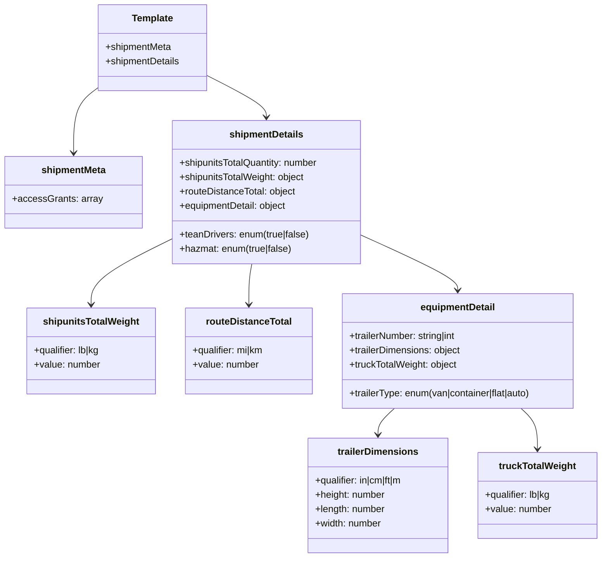
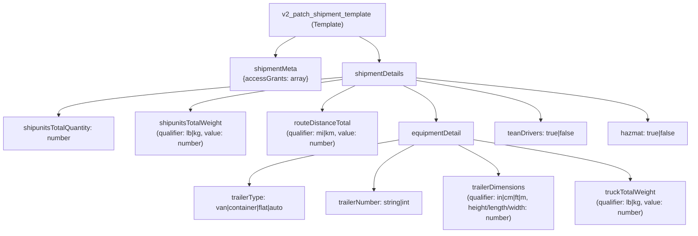

# Diagram: shipment_core/shipment_service/shipment_service/json_templates/v2_patch_shipment.py

> Auto-generated by Obscura crawlers

## Diagram 1

### SVG

<svg id="container" width="1018.0859375" xmlns="http://www.w3.org/2000/svg" class="classDiagram" height="934" viewBox="0 0 1018.0859375 934" role="graphics-document document" aria-roledescription="class"><g><defs><marker id="container_class-aggregationStart" class="marker aggregation class" refX="18" refY="7" markerWidth="190" markerHeight="240" orient="auto"><path d="M 18,7 L9,13 L1,7 L9,1 Z"></path></marker></defs><defs><marker id="container_class-aggregationEnd" class="marker aggregation class" refX="1" refY="7" markerWidth="20" markerHeight="28" orient="auto"><path d="M 18,7 L9,13 L1,7 L9,1 Z"></path></marker></defs><defs><marker id="container_class-extensionStart" class="marker extension class" refX="18" refY="7" markerWidth="190" markerHeight="240" orient="auto"><path d="M 1,7 L18,13 V 1 Z"></path></marker></defs><defs><marker id="container_class-extensionEnd" class="marker extension class" refX="1" refY="7" markerWidth="20" markerHeight="28" orient="auto"><path d="M 1,1 V 13 L18,7 Z"></path></marker></defs><defs><marker id="container_class-compositionStart" class="marker composition class" refX="18" refY="7" markerWidth="190" markerHeight="240" orient="auto"><path d="M 18,7 L9,13 L1,7 L9,1 Z"></path></marker></defs><defs><marker id="container_class-compositionEnd" class="marker composition class" refX="1" refY="7" markerWidth="20" markerHeight="28" orient="auto"><path d="M 18,7 L9,13 L1,7 L9,1 Z"></path></marker></defs><defs><marker id="container_class-dependencyStart" class="marker dependency class" refX="6" refY="7" markerWidth="190" markerHeight="240" orient="auto"><path d="M 5,7 L9,13 L1,7 L9,1 Z"></path></marker></defs><defs><marker id="container_class-dependencyEnd" class="marker dependency class" refX="13" refY="7" markerWidth="20" markerHeight="28" orient="auto"><path d="M 18,7 L9,13 L14,7 L9,1 Z"></path></marker></defs><defs><marker id="container_class-lollipopStart" class="marker lollipop class" refX="13" refY="7" markerWidth="190" markerHeight="240" orient="auto"><circle stroke="black" fill="transparent" cx="7" cy="7" r="6"></circle></marker></defs><defs><marker id="container_class-lollipopEnd" class="marker lollipop class" refX="1" refY="7" markerWidth="190" markerHeight="240" orient="auto"><circle stroke="black" fill="transparent" cx="7" cy="7" r="6"></circle></marker></defs><g class="root"><g class="clusters"></g><g class="edgePaths"><path d="M160.398,147.205L153.585,152.171C146.772,157.137,133.146,167.068,126.333,185.201C119.52,203.333,119.52,229.667,119.52,242.833L119.52,256" id="id_Template_shipmentMeta_1" class="edge-thickness-normal edge-pattern-solid relation" style=";;;" data-edge="true" data-et="edge" data-id="id_Template_shipmentMeta_1" data-points="W3sieCI6MTYwLjM5ODQzNzUsInkiOjE0Ny4yMDUzMTI1OTE3MjI5M30seyJ4IjoxMTkuNTE5NTMxMjUsInkiOjE3N30seyJ4IjoxMTkuNTE5NTMxMjUsInkiOjI2Mn1d" marker-end="url(#container_class-dependencyEnd)"></path><path d="M344.813,127.205L361.023,135.504C377.234,143.803,409.656,160.402,425.867,171.868C442.078,183.333,442.078,189.667,442.078,192.833L442.078,196" id="id_Template_shipmentDetails_2" class="edge-thickness-normal edge-pattern-solid relation" style=";;;" data-edge="true" data-et="edge" data-id="id_Template_shipmentDetails_2" data-points="W3sieCI6MzQ0LjgxMjUsInkiOjEyNy4yMDUxMzM0OTEzOTI2NH0seyJ4Ijo0NDIuMDc4MTI1LCJ5IjoxNzd9LHsieCI6NDQyLjA3ODEyNSwieSI6MjAyfV0=" marker-end="url(#container_class-dependencyEnd)"></path><path d="M281.039,401.325L258.818,412.271C236.597,423.217,192.155,445.108,169.934,463.221C147.713,481.333,147.713,495.667,147.713,502.833L147.713,510" id="id_shipmentDetails_shipunitsTotalWeight_3" class="edge-thickness-normal edge-pattern-solid relation" style=";;;" data-edge="true" data-et="edge" data-id="id_shipmentDetails_shipunitsTotalWeight_3" data-points="W3sieCI6MjgxLjAzOTA2MjUsInkiOjQwMS4zMjU0ODE4Njk3NTQyfSx7IngiOjE0Ny43MTI4OTA2MjUsInkiOjQ2N30seyJ4IjoxNDcuNzEyODkwNjI1LCJ5Ijo1MTZ9XQ==" marker-end="url(#container_class-dependencyEnd)"></path><path d="M418.746,442L417.936,446.167C417.125,450.333,415.505,458.667,414.695,470C413.885,481.333,413.885,495.667,413.885,502.833L413.885,510" id="id_shipmentDetails_routeDistanceTotal_4" class="edge-thickness-normal edge-pattern-solid relation" style=";;;" data-edge="true" data-et="edge" data-id="id_shipmentDetails_routeDistanceTotal_4" data-points="W3sieCI6NDE4Ljc0NTY4OTY1NTE3MjQ0LCJ5Ijo0NDJ9LHsieCI6NDEzLjg4NDc2NTYyNSwieSI6NDY3fSx7IngiOjQxMy44ODQ3NjU2MjUsInkiOjUxNn1d" marker-end="url(#container_class-dependencyEnd)"></path><path d="M603.117,392.543L631.446,404.952C659.775,417.362,716.434,442.181,744.763,457.757C773.092,473.333,773.092,479.667,773.092,482.833L773.092,486" id="id_shipmentDetails_equipmentDetail_5" class="edge-thickness-normal edge-pattern-solid relation" style=";;;" data-edge="true" data-et="edge" data-id="id_shipmentDetails_equipmentDetail_5" data-points="W3sieCI6NjAzLjExNzE4NzUsInkiOjM5Mi41NDI4OTkxMjAyNDV9LHsieCI6NzczLjA5MTc5Njg3NSwieSI6NDY3fSx7IngiOjc3My4wOTE3OTY4NzUsInkiOjQ5Mn1d" marker-end="url(#container_class-dependencyEnd)"></path><path d="M664.725,684L660.021,688.167C655.318,692.333,645.911,700.667,641.207,708C636.504,715.333,636.504,721.667,636.504,724.833L636.504,728" id="id_equipmentDetail_trailerDimensions_6" class="edge-thickness-normal edge-pattern-solid relation" style=";;;" data-edge="true" data-et="edge" data-id="id_equipmentDetail_trailerDimensions_6" data-points="W3sieCI6NjY0LjcyNDU0NDgwODg4NDMsInkiOjY4NH0seyJ4Ijo2MzYuNTAzOTA2MjUsInkiOjcwOX0seyJ4Ijo2MzYuNTAzOTA2MjUsInkiOjczNH1d" marker-end="url(#container_class-dependencyEnd)"></path><path d="M881.459,684L886.162,688.167C890.866,692.333,900.273,700.667,904.976,712C909.68,723.333,909.68,737.667,909.68,744.833L909.68,752" id="id_equipmentDetail_truckTotalWeight_7" class="edge-thickness-normal edge-pattern-solid relation" style=";;;" data-edge="true" data-et="edge" data-id="id_equipmentDetail_truckTotalWeight_7" data-points="W3sieCI6ODgxLjQ1OTA0ODk0MTExNTcsInkiOjY4NH0seyJ4Ijo5MDkuNjc5Njg3NSwieSI6NzA5fSx7IngiOjkwOS42Nzk2ODc1LCJ5Ijo3NTh9XQ==" marker-end="url(#container_class-dependencyEnd)"></path></g><g class="edgeLabels"><g class="edgeLabel"><g class="label" data-id="id_Template_shipmentMeta_1" transform="translate(0, 0)"><foreignObject width="0" height="0">

</foreignObject></g></g><g class="edgeLabel"><g class="label" data-id="id_Template_shipmentDetails_2" transform="translate(0, 0)"><foreignObject width="0" height="0">

</foreignObject></g></g><g class="edgeLabel"><g class="label" data-id="id_shipmentDetails_shipunitsTotalWeight_3" transform="translate(0, 0)"><foreignObject width="0" height="0">

</foreignObject></g></g><g class="edgeLabel"><g class="label" data-id="id_shipmentDetails_routeDistanceTotal_4" transform="translate(0, 0)"><foreignObject width="0" height="0">

</foreignObject></g></g><g class="edgeLabel"><g class="label" data-id="id_shipmentDetails_equipmentDetail_5" transform="translate(0, 0)"><foreignObject width="0" height="0">

</foreignObject></g></g><g class="edgeLabel"><g class="label" data-id="id_equipmentDetail_trailerDimensions_6" transform="translate(0, 0)"><foreignObject width="0" height="0">

</foreignObject></g></g><g class="edgeLabel"><g class="label" data-id="id_equipmentDetail_truckTotalWeight_7" transform="translate(0, 0)"><foreignObject width="0" height="0">

</foreignObject></g></g></g><g class="nodes"><g class="node default" id="classId-Template-0" transform="translate(252.60546875, 80)"><g class="basic label-container"><path d="M-92.20703125 -72 L92.20703125 -72 L92.20703125 72 L-92.20703125 72" stroke="none" stroke-width="0" fill="#ECECFF" style=""></path><path d="M-92.20703125 -72 C-49.05000257362548 -72, -5.892973897250954 -72, 92.20703125 -72 M-92.20703125 -72 C-33.515581702209005 -72, 25.17586784558199 -72, 92.20703125 -72 M92.20703125 -72 C92.20703125 -32.78252173515253, 92.20703125 6.434956529694944, 92.20703125 72 M92.20703125 -72 C92.20703125 -17.705536366916803, 92.20703125 36.588927266166394, 92.20703125 72 M92.20703125 72 C31.5610177624757 72, -29.0849957250486 72, -92.20703125 72 M92.20703125 72 C40.04074091712687 72, -12.125549415746264 72, -92.20703125 72 M-92.20703125 72 C-92.20703125 38.070902589693326, -92.20703125 4.141805179386651, -92.20703125 -72 M-92.20703125 72 C-92.20703125 19.717572321365864, -92.20703125 -32.56485535726827, -92.20703125 -72" stroke="#9370DB" stroke-width="1.3" fill="none" stroke-dasharray="0 0" style=""></path></g><g class="annotation-group text" transform="translate(0, -48)"></g><g class="label-group text" transform="translate(-33.9140625, -48)"><g class="label" style="font-weight: bolder" transform="translate(0,-12)"><foreignObject width="67.828125" height="24">

Template

</foreignObject></g></g><g class="members-group text" transform="translate(-80.20703125, 0)"><g class="label" style="" transform="translate(0,-12)"><foreignObject width="111.96875" height="24">

+shipmentMeta

</foreignObject></g><g class="label" style="" transform="translate(0,12)"><foreignObject width="126.5" height="24">

+shipmentDetails

</foreignObject></g></g><g class="methods-group text" transform="translate(-80.20703125, 72)"></g><g class="divider" style=""><path d="M-92.20703125 -24 C-46.03082714439853 -24, 0.14537696120294186 -24, 92.20703125 -24 M-92.20703125 -24 C-22.561371140648475 -24, 47.08428896870305 -24, 92.20703125 -24" stroke="#9370DB" stroke-width="1.3" fill="none" stroke-dasharray="0 0" style=""></path></g><g class="divider" style=""><path d="M-92.20703125 48 C-47.11322653158889 48, -2.019421813177786 48, 92.20703125 48 M-92.20703125 48 C-37.074635728533984 48, 18.057759792932032 48, 92.20703125 48" stroke="#9370DB" stroke-width="1.3" fill="none" stroke-dasharray="0 0" style=""></path></g></g><g class="node default" id="classId-shipmentMeta-1" transform="translate(119.51953125, 322)"><g class="basic label-container"><path d="M-111.51953125 -60 L111.51953125 -60 L111.51953125 60 L-111.51953125 60" stroke="none" stroke-width="0" fill="#ECECFF" style=""></path><path d="M-111.51953125 -60 C-40.37554280105394 -60, 30.768445647892122 -60, 111.51953125 -60 M-111.51953125 -60 C-50.56704073703098 -60, 10.385449775938042 -60, 111.51953125 -60 M111.51953125 -60 C111.51953125 -15.458127275675977, 111.51953125 29.083745448648045, 111.51953125 60 M111.51953125 -60 C111.51953125 -29.938925561955013, 111.51953125 0.12214887608997316, 111.51953125 60 M111.51953125 60 C58.083402775957886 60, 4.647274301915772 60, -111.51953125 60 M111.51953125 60 C39.708705368551335 60, -32.10212051289733 60, -111.51953125 60 M-111.51953125 60 C-111.51953125 14.1393380106177, -111.51953125 -31.7213239787646, -111.51953125 -60 M-111.51953125 60 C-111.51953125 25.42670614694334, -111.51953125 -9.146587706113323, -111.51953125 -60" stroke="#9370DB" stroke-width="1.3" fill="none" stroke-dasharray="0 0" style=""></path></g><g class="annotation-group text" transform="translate(0, -36)"></g><g class="label-group text" transform="translate(-52.4765625, -36)"><g class="label" style="font-weight: bolder" transform="translate(0,-12)"><foreignObject width="104.953125" height="24">

shipmentMeta

</foreignObject></g></g><g class="members-group text" transform="translate(-99.51953125, 12)"><g class="label" style="" transform="translate(0,-12)"><foreignObject width="146.5625" height="24">

+accessGrants: array

</foreignObject></g></g><g class="methods-group text" transform="translate(-99.51953125, 60)"></g><g class="divider" style=""><path d="M-111.51953125 -12 C-32.52172730878006 -12, 46.476076632439884 -12, 111.51953125 -12 M-111.51953125 -12 C-42.481916603545216 -12, 26.55569804290957 -12, 111.51953125 -12" stroke="#9370DB" stroke-width="1.3" fill="none" stroke-dasharray="0 0" style=""></path></g><g class="divider" style=""><path d="M-111.51953125 36 C-42.32680743681223 36, 26.865916376375537 36, 111.51953125 36 M-111.51953125 36 C-66.60601738878458 36, -21.692503527569173 36, 111.51953125 36" stroke="#9370DB" stroke-width="1.3" fill="none" stroke-dasharray="0 0" style=""></path></g></g><g class="node default" id="classId-shipmentDetails-2" transform="translate(442.078125, 322)"><g class="basic label-container"><path d="M-161.0390625 -120 L161.0390625 -120 L161.0390625 120 L-161.0390625 120" stroke="none" stroke-width="0" fill="#ECECFF" style=""></path><path d="M-161.0390625 -120 C-84.89571142223228 -120, -8.752360344464563 -120, 161.0390625 -120 M-161.0390625 -120 C-59.20355033427978 -120, 42.631961831440435 -120, 161.0390625 -120 M161.0390625 -120 C161.0390625 -60.41547018711934, 161.0390625 -0.8309403742386792, 161.0390625 120 M161.0390625 -120 C161.0390625 -62.530276126687916, 161.0390625 -5.060552253375832, 161.0390625 120 M161.0390625 120 C85.39777063391989 120, 9.75647876783978 120, -161.0390625 120 M161.0390625 120 C34.20221251341778 120, -92.63463747316445 120, -161.0390625 120 M-161.0390625 120 C-161.0390625 42.011274490783435, -161.0390625 -35.97745101843313, -161.0390625 -120 M-161.0390625 120 C-161.0390625 35.706019732658035, -161.0390625 -48.58796053468393, -161.0390625 -120" stroke="#9370DB" stroke-width="1.3" fill="none" stroke-dasharray="0 0" style=""></path></g><g class="annotation-group text" transform="translate(0, -96)"></g><g class="label-group text" transform="translate(-59.890625, -96)"><g class="label" style="font-weight: bolder" transform="translate(0,-12)"><foreignObject width="119.78125" height="24">

shipmentDetails

</foreignObject></g></g><g class="members-group text" transform="translate(-149.0390625, -48)"><g class="label" style="" transform="translate(0,-12)"><foreignObject width="238.1875" height="24">

+shipunitsTotalQuantity: number

</foreignObject></g><g class="label" style="" transform="translate(0,12)"><foreignObject width="214.3125" height="24">

+shipunitsTotalWeight: object

</foreignObject></g><g class="label" style="" transform="translate(0,36)"><foreignObject width="198.03125" height="24">

+routeDistanceTotal: object

</foreignObject></g><g class="label" style="" transform="translate(0,60)"><foreignObject width="183.5" height="24">

+equipmentDetail: object

</foreignObject></g></g><g class="methods-group text" transform="translate(-149.0390625, 72)"><g class="label" style="" transform="translate(0,-12)"><foreignObject width="221.453125" height="24">

+teanDrivers: enum(true|false)

</foreignObject></g><g class="label" style="" transform="translate(0,12)"><foreignObject width="191.75" height="24">

+hazmat: enum(true|false)

</foreignObject></g></g><g class="divider" style=""><path d="M-161.0390625 -72 C-52.117288417974606 -72, 56.80448566405079 -72, 161.0390625 -72 M-161.0390625 -72 C-68.98409386834032 -72, 23.070874763319352 -72, 161.0390625 -72" stroke="#9370DB" stroke-width="1.3" fill="none" stroke-dasharray="0 0" style=""></path></g><g class="divider" style=""><path d="M-161.0390625 48 C-38.38990760174913 48, 84.25924729650174 48, 161.0390625 48 M-161.0390625 48 C-75.29852886016675 48, 10.44200477966649 48, 161.0390625 48" stroke="#9370DB" stroke-width="1.3" fill="none" stroke-dasharray="0 0" style=""></path></g></g><g class="node default" id="classId-shipunitsTotalWeight-3" transform="translate(147.712890625, 588)"><g class="basic label-container"><path d="M-107.80078125 -72 L107.80078125 -72 L107.80078125 72 L-107.80078125 72" stroke="none" stroke-width="0" fill="#ECECFF" style=""></path><path d="M-107.80078125 -72 C-24.212851442441462 -72, 59.375078365117076 -72, 107.80078125 -72 M-107.80078125 -72 C-63.047222943778095 -72, -18.29366463755619 -72, 107.80078125 -72 M107.80078125 -72 C107.80078125 -41.97524133963693, 107.80078125 -11.950482679273861, 107.80078125 72 M107.80078125 -72 C107.80078125 -37.945112906007964, 107.80078125 -3.8902258120159274, 107.80078125 72 M107.80078125 72 C35.74351484862315 72, -36.3137515527537 72, -107.80078125 72 M107.80078125 72 C47.100766383216644 72, -13.599248483566711 72, -107.80078125 72 M-107.80078125 72 C-107.80078125 31.23482139439527, -107.80078125 -9.530357211209463, -107.80078125 -72 M-107.80078125 72 C-107.80078125 27.26306519073654, -107.80078125 -17.47386961852692, -107.80078125 -72" stroke="#9370DB" stroke-width="1.3" fill="none" stroke-dasharray="0 0" style=""></path></g><g class="annotation-group text" transform="translate(0, -48)"></g><g class="label-group text" transform="translate(-77.6171875, -48)"><g class="label" style="font-weight: bolder" transform="translate(0,-12)"><foreignObject width="155.234375" height="24">

shipunitsTotalWeight

</foreignObject></g></g><g class="members-group text" transform="translate(-95.80078125, 0)"><g class="label" style="" transform="translate(0,-12)"><foreignObject width="113.984375" height="24">

+qualifier: lb|kg

</foreignObject></g><g class="label" style="" transform="translate(0,12)"><foreignObject width="111.59375" height="24">

+value: number

</foreignObject></g></g><g class="methods-group text" transform="translate(-95.80078125, 72)"></g><g class="divider" style=""><path d="M-107.80078125 -24 C-41.546010737190244 -24, 24.708759775619512 -24, 107.80078125 -24 M-107.80078125 -24 C-48.37621799064184 -24, 11.048345268716318 -24, 107.80078125 -24" stroke="#9370DB" stroke-width="1.3" fill="none" stroke-dasharray="0 0" style=""></path></g><g class="divider" style=""><path d="M-107.80078125 48 C-43.07505065616526 48, 21.65067993766948 48, 107.80078125 48 M-107.80078125 48 C-30.66650819666569 48, 46.46776485666862 48, 107.80078125 48" stroke="#9370DB" stroke-width="1.3" fill="none" stroke-dasharray="0 0" style=""></path></g></g><g class="node default" id="classId-routeDistanceTotal-4" transform="translate(413.884765625, 588)"><g class="basic label-container"><path d="M-108.37109375 -72 L108.37109375 -72 L108.37109375 72 L-108.37109375 72" stroke="none" stroke-width="0" fill="#ECECFF" style=""></path><path d="M-108.37109375 -72 C-64.24850515610956 -72, -20.125916562219103 -72, 108.37109375 -72 M-108.37109375 -72 C-30.967403302530286 -72, 46.43628714493943 -72, 108.37109375 -72 M108.37109375 -72 C108.37109375 -25.989836249475935, 108.37109375 20.02032750104813, 108.37109375 72 M108.37109375 -72 C108.37109375 -35.77893747995327, 108.37109375 0.4421250400934582, 108.37109375 72 M108.37109375 72 C31.052034506617048 72, -46.267024736765904 72, -108.37109375 72 M108.37109375 72 C53.88590804304155 72, -0.5992776639168937 72, -108.37109375 72 M-108.37109375 72 C-108.37109375 37.09035307858453, -108.37109375 2.1807061571690554, -108.37109375 -72 M-108.37109375 72 C-108.37109375 18.03053153212113, -108.37109375 -35.93893693575774, -108.37109375 -72" stroke="#9370DB" stroke-width="1.3" fill="none" stroke-dasharray="0 0" style=""></path></g><g class="annotation-group text" transform="translate(0, -48)"></g><g class="label-group text" transform="translate(-69.2109375, -48)"><g class="label" style="font-weight: bolder" transform="translate(0,-12)"><foreignObject width="138.421875" height="24">

routeDistanceTotal

</foreignObject></g></g><g class="members-group text" transform="translate(-96.37109375, 0)"><g class="label" style="" transform="translate(0,-12)"><foreignObject width="123.53125" height="24">

+qualifier: mi|km

</foreignObject></g><g class="label" style="" transform="translate(0,12)"><foreignObject width="111.59375" height="24">

+value: number

</foreignObject></g></g><g class="methods-group text" transform="translate(-96.37109375, 72)"></g><g class="divider" style=""><path d="M-108.37109375 -24 C-46.550685730151244 -24, 15.269722289697512 -24, 108.37109375 -24 M-108.37109375 -24 C-46.901382957271025 -24, 14.56832783545795 -24, 108.37109375 -24" stroke="#9370DB" stroke-width="1.3" fill="none" stroke-dasharray="0 0" style=""></path></g><g class="divider" style=""><path d="M-108.37109375 48 C-25.843902601920306 48, 56.68328854615939 48, 108.37109375 48 M-108.37109375 48 C-32.39529651113186 48, 43.58050072773628 48, 108.37109375 48" stroke="#9370DB" stroke-width="1.3" fill="none" stroke-dasharray="0 0" style=""></path></g></g><g class="node default" id="classId-equipmentDetail-5" transform="translate(773.091796875, 588)"><g class="basic label-container"><path d="M-200.8359375 -96 L200.8359375 -96 L200.8359375 96 L-200.8359375 96" stroke="none" stroke-width="0" fill="#ECECFF" style=""></path><path d="M-200.8359375 -96 C-115.65879658026925 -96, -30.481655660538507 -96, 200.8359375 -96 M-200.8359375 -96 C-95.83889589054354 -96, 9.15814571891292 -96, 200.8359375 -96 M200.8359375 -96 C200.8359375 -36.21584061726599, 200.8359375 23.56831876546802, 200.8359375 96 M200.8359375 -96 C200.8359375 -34.35402119092218, 200.8359375 27.291957618155635, 200.8359375 96 M200.8359375 96 C67.74834683936916 96, -65.33924382126168 96, -200.8359375 96 M200.8359375 96 C53.19053770203132 96, -94.45486209593736 96, -200.8359375 96 M-200.8359375 96 C-200.8359375 42.82717133765419, -200.8359375 -10.345657324691615, -200.8359375 -96 M-200.8359375 96 C-200.8359375 24.537448291505356, -200.8359375 -46.92510341698929, -200.8359375 -96" stroke="#9370DB" stroke-width="1.3" fill="none" stroke-dasharray="0 0" style=""></path></g><g class="annotation-group text" transform="translate(0, -72)"></g><g class="label-group text" transform="translate(-61.34375, -72)"><g class="label" style="font-weight: bolder" transform="translate(0,-12)"><foreignObject width="122.6875" height="24">

equipmentDetail

</foreignObject></g></g><g class="members-group text" transform="translate(-188.8359375, -24)"><g class="label" style="" transform="translate(0,-12)"><foreignObject width="186.359375" height="24">

+trailerNumber: string|int

</foreignObject></g><g class="label" style="" transform="translate(0,12)"><foreignObject width="190.375" height="24">

+trailerDimensions: object

</foreignObject></g><g class="label" style="" transform="translate(0,36)"><foreignObject width="184.03125" height="24">

+truckTotalWeight: object

</foreignObject></g></g><g class="methods-group text" transform="translate(-188.8359375, 72)"><g class="label" style="" transform="translate(0,-12)"><foreignObject width="316.328125" height="24">

+trailerType: enum(van|container|flat|auto)

</foreignObject></g></g><g class="divider" style=""><path d="M-200.8359375 -48 C-44.33779032336005 -48, 112.1603568532799 -48, 200.8359375 -48 M-200.8359375 -48 C-108.59489570199791 -48, -16.353853903995827 -48, 200.8359375 -48" stroke="#9370DB" stroke-width="1.3" fill="none" stroke-dasharray="0 0" style=""></path></g><g class="divider" style=""><path d="M-200.8359375 48 C-58.143895437083415 48, 84.54814662583317 48, 200.8359375 48 M-200.8359375 48 C-70.52319588998282 48, 59.78954572003437 48, 200.8359375 48" stroke="#9370DB" stroke-width="1.3" fill="none" stroke-dasharray="0 0" style=""></path></g></g><g class="node default" id="classId-trailerDimensions-6" transform="translate(636.50390625, 830)"><g class="basic label-container"><path d="M-122.76953125 -96 L122.76953125 -96 L122.76953125 96 L-122.76953125 96" stroke="none" stroke-width="0" fill="#ECECFF" style=""></path><path d="M-122.76953125 -96 C-40.101355158209174 -96, 42.56682093358165 -96, 122.76953125 -96 M-122.76953125 -96 C-56.39237411620823 -96, 9.984783017583538 -96, 122.76953125 -96 M122.76953125 -96 C122.76953125 -50.73713273608341, 122.76953125 -5.47426547216682, 122.76953125 96 M122.76953125 -96 C122.76953125 -41.124562909434644, 122.76953125 13.750874181130712, 122.76953125 96 M122.76953125 96 C60.506176135461565 96, -1.757178979076869 96, -122.76953125 96 M122.76953125 96 C68.32955029036565 96, 13.889569330731291 96, -122.76953125 96 M-122.76953125 96 C-122.76953125 43.005527403223795, -122.76953125 -9.98894519355241, -122.76953125 -96 M-122.76953125 96 C-122.76953125 28.320165854125534, -122.76953125 -39.35966829174893, -122.76953125 -96" stroke="#9370DB" stroke-width="1.3" fill="none" stroke-dasharray="0 0" style=""></path></g><g class="annotation-group text" transform="translate(0, -72)"></g><g class="label-group text" transform="translate(-65.1484375, -72)"><g class="label" style="font-weight: bolder" transform="translate(0,-12)"><foreignObject width="130.296875" height="24">

trailerDimensions

</foreignObject></g></g><g class="members-group text" transform="translate(-110.76953125, -24)"><g class="label" style="" transform="translate(0,-12)"><foreignObject width="156.390625" height="24">

+qualifier: in|cm|ft|m

</foreignObject></g><g class="label" style="" transform="translate(0,12)"><foreignObject width="119.015625" height="24">

+height: number

</foreignObject></g><g class="label" style="" transform="translate(0,36)"><foreignObject width="119.046875" height="24">

+length: number

</foreignObject></g><g class="label" style="" transform="translate(0,60)"><foreignObject width="113.578125" height="24">

+width: number

</foreignObject></g></g><g class="methods-group text" transform="translate(-110.76953125, 96)"></g><g class="divider" style=""><path d="M-122.76953125 -48 C-65.98536860277693 -48, -9.20120595555386 -48, 122.76953125 -48 M-122.76953125 -48 C-50.43738548006618 -48, 21.894760289867634 -48, 122.76953125 -48" stroke="#9370DB" stroke-width="1.3" fill="none" stroke-dasharray="0 0" style=""></path></g><g class="divider" style=""><path d="M-122.76953125 72 C-37.63364480627757 72, 47.502241637444854 72, 122.76953125 72 M-122.76953125 72 C-41.533267006698054 72, 39.70299723660389 72, 122.76953125 72" stroke="#9370DB" stroke-width="1.3" fill="none" stroke-dasharray="0 0" style=""></path></g></g><g class="node default" id="classId-truckTotalWeight-7" transform="translate(909.6796875, 830)"><g class="basic label-container"><path d="M-100.40625 -72 L100.40625 -72 L100.40625 72 L-100.40625 72" stroke="none" stroke-width="0" fill="#ECECFF" style=""></path><path d="M-100.40625 -72 C-51.35580699129199 -72, -2.305363982583984 -72, 100.40625 -72 M-100.40625 -72 C-43.16057561973814 -72, 14.08509876052372 -72, 100.40625 -72 M100.40625 -72 C100.40625 -38.767362062946916, 100.40625 -5.534724125893831, 100.40625 72 M100.40625 -72 C100.40625 -16.49278663671503, 100.40625 39.01442672656994, 100.40625 72 M100.40625 72 C28.948814184616054 72, -42.50862163076789 72, -100.40625 72 M100.40625 72 C36.944744111327466 72, -26.516761777345067 72, -100.40625 72 M-100.40625 72 C-100.40625 19.211962608559958, -100.40625 -33.576074782880085, -100.40625 -72 M-100.40625 72 C-100.40625 20.464673310057442, -100.40625 -31.070653379885115, -100.40625 -72" stroke="#9370DB" stroke-width="1.3" fill="none" stroke-dasharray="0 0" style=""></path></g><g class="annotation-group text" transform="translate(0, -48)"></g><g class="label-group text" transform="translate(-62.828125, -48)"><g class="label" style="font-weight: bolder" transform="translate(0,-12)"><foreignObject width="125.65625" height="24">

truckTotalWeight

</foreignObject></g></g><g class="members-group text" transform="translate(-88.40625, 0)"><g class="label" style="" transform="translate(0,-12)"><foreignObject width="113.984375" height="24">

+qualifier: lb|kg

</foreignObject></g><g class="label" style="" transform="translate(0,12)"><foreignObject width="111.59375" height="24">

+value: number

</foreignObject></g></g><g class="methods-group text" transform="translate(-88.40625, 72)"></g><g class="divider" style=""><path d="M-100.40625 -24 C-46.86816594133516 -24, 6.669918117329686 -24, 100.40625 -24 M-100.40625 -24 C-48.610756006197306 -24, 3.184737987605388 -24, 100.40625 -24" stroke="#9370DB" stroke-width="1.3" fill="none" stroke-dasharray="0 0" style=""></path></g><g class="divider" style=""><path d="M-100.40625 48 C-54.96853733952881 48, -9.530824679057616 48, 100.40625 48 M-100.40625 48 C-30.18401018831669 48, 40.03822962336662 48, 100.40625 48" stroke="#9370DB" stroke-width="1.3" fill="none" stroke-dasharray="0 0" style=""></path></g></g></g></g></g></svg>

## Diagram 2

### SVG

<svg id="container" width="1727.05859375" xmlns="http://www.w3.org/2000/svg" class="flowchart" height="502" viewBox="0 0 1727.05859375 502" role="graphics-document document" aria-roledescription="flowchart-v2"><g><marker id="container_flowchart-v2-pointEnd" class="marker flowchart-v2" viewBox="0 0 10 10" refX="5" refY="5" markerUnits="userSpaceOnUse" markerWidth="8" markerHeight="8" orient="auto"><path d="M 0 0 L 10 5 L 0 10 z" class="arrowMarkerPath" style="stroke-width: 1; stroke-dasharray: 1, 0;"></path></marker><marker id="container_flowchart-v2-pointStart" class="marker flowchart-v2" viewBox="0 0 10 10" refX="4.5" refY="5" markerUnits="userSpaceOnUse" markerWidth="8" markerHeight="8" orient="auto"><path d="M 0 5 L 10 10 L 10 0 z" class="arrowMarkerPath" style="stroke-width: 1; stroke-dasharray: 1, 0;"></path></marker><marker id="container_flowchart-v2-circleEnd" class="marker flowchart-v2" viewBox="0 0 10 10" refX="11" refY="5" markerUnits="userSpaceOnUse" markerWidth="11" markerHeight="11" orient="auto"><circle cx="5" cy="5" r="5" class="arrowMarkerPath" style="stroke-width: 1; stroke-dasharray: 1, 0;"></circle></marker><marker id="container_flowchart-v2-circleStart" class="marker flowchart-v2" viewBox="0 0 10 10" refX="-1" refY="5" markerUnits="userSpaceOnUse" markerWidth="11" markerHeight="11" orient="auto"><circle cx="5" cy="5" r="5" class="arrowMarkerPath" style="stroke-width: 1; stroke-dasharray: 1, 0;"></circle></marker><marker id="container_flowchart-v2-crossEnd" class="marker cross flowchart-v2" viewBox="0 0 11 11" refX="12" refY="5.2" markerUnits="userSpaceOnUse" markerWidth="11" markerHeight="11" orient="auto"><path d="M 1,1 l 9,9 M 10,1 l -9,9" class="arrowMarkerPath" style="stroke-width: 2; stroke-dasharray: 1, 0;"></path></marker><marker id="container_flowchart-v2-crossStart" class="marker cross flowchart-v2" viewBox="0 0 11 11" refX="-1" refY="5.2" markerUnits="userSpaceOnUse" markerWidth="11" markerHeight="11" orient="auto"><path d="M 1,1 l 9,9 M 10,1 l -9,9" class="arrowMarkerPath" style="stroke-width: 2; stroke-dasharray: 1, 0;"></path></marker><g class="root"><g class="clusters"></g><g class="edgePaths"><path d="M730.229,86L721.005,90.167C711.781,94.333,693.334,102.667,684.11,110.333C674.887,118,674.887,125,674.887,128.5L674.887,132" id="L_Template_shipmentMeta_0" class="edge-thickness-normal edge-pattern-solid edge-thickness-normal edge-pattern-solid flowchart-link" style=";" data-edge="true" data-et="edge" data-id="L_Template_shipmentMeta_0" data-points="W3sieCI6NzMwLjIyODgyMDgwMDc4MTIsInkiOjg2fSx7IngiOjY3NC44ODY3MTg3NSwieSI6MTExfSx7IngiOjY3NC44ODY3MTg3NSwieSI6MTM2fV0=" marker-end="url(#container_flowchart-v2-pointEnd)"></path><path d="M902.896,86L912.12,90.167C921.344,94.333,939.791,102.667,949.015,112.333C958.238,122,958.238,133,958.238,138.5L958.238,144" id="L_Template_shipmentDetails_0" class="edge-thickness-normal edge-pattern-solid edge-thickness-normal edge-pattern-solid flowchart-link" style=";" data-edge="true" data-et="edge" data-id="L_Template_shipmentDetails_0" data-points="W3sieCI6OTAyLjg5NjE3OTE5OTIxODgsInkiOjg2fSx7IngiOjk1OC4yMzgyODEyNSwieSI6MTExfSx7IngiOjk1OC4yMzgyODEyNSwieSI6MTQ4fV0=" marker-end="url(#container_flowchart-v2-pointEnd)"></path><path d="M868.98,181.964L747.15,191.47C625.32,200.976,381.66,219.988,259.83,232.994C138,246,138,253,138,256.5L138,260" id="L_shipmentDetails_shipunitsTotalQuantity_0" class="edge-thickness-normal edge-pattern-solid edge-thickness-normal edge-pattern-solid flowchart-link" style=";" data-edge="true" data-et="edge" data-id="L_shipmentDetails_shipunitsTotalQuantity_0" data-points="W3sieCI6ODY4Ljk4MDQ2ODc1LCJ5IjoxODEuOTY0NDM5NjM5Nzc2OTR9LHsieCI6MTM4LCJ5IjoyMzl9LHsieCI6MTM4LCJ5IjoyNjR9XQ==" marker-end="url(#container_flowchart-v2-pointEnd)"></path><path d="M868.98,186.699L802.476,195.416C735.971,204.133,602.962,221.566,536.458,233.783C469.953,246,469.953,253,469.953,256.5L469.953,260" id="L_shipmentDetails_shipunitsTotalWeight_0" class="edge-thickness-normal edge-pattern-solid edge-thickness-normal edge-pattern-solid flowchart-link" style=";" data-edge="true" data-et="edge" data-id="L_shipmentDetails_shipunitsTotalWeight_0" data-points="W3sieCI6ODY4Ljk4MDQ2ODc1LCJ5IjoxODYuNjk5MTA2NDA3MTQ4NzV9LHsieCI6NDY5Ljk1MzEyNSwieSI6MjM5fSx7IngiOjQ2OS45NTMxMjUsInkiOjI2NH1d" marker-end="url(#container_flowchart-v2-pointEnd)"></path><path d="M898.159,202L884.437,208.167C870.715,214.333,843.272,226.667,829.55,236.333C815.828,246,815.828,253,815.828,256.5L815.828,260" id="L_shipmentDetails_routeDistanceTotal_0" class="edge-thickness-normal edge-pattern-solid edge-thickness-normal edge-pattern-solid flowchart-link" style=";" data-edge="true" data-et="edge" data-id="L_shipmentDetails_routeDistanceTotal_0" data-points="W3sieCI6ODk4LjE1ODk5NjU4MjAzMTIsInkiOjIwMn0seyJ4Ijo4MTUuODI4MTI1LCJ5IjoyMzl9LHsieCI6ODE1LjgyODEyNSwieSI6MjY0fV0=" marker-end="url(#container_flowchart-v2-pointEnd)"></path><path d="M1018.318,202L1032.039,208.167C1045.761,214.333,1073.205,226.667,1086.927,238.333C1100.648,250,1100.648,261,1100.648,266.5L1100.648,272" id="L_shipmentDetails_equipmentDetail_0" class="edge-thickness-normal edge-pattern-solid edge-thickness-normal edge-pattern-solid flowchart-link" style=";" data-edge="true" data-et="edge" data-id="L_shipmentDetails_equipmentDetail_0" data-points="W3sieCI6MTAxOC4zMTc1NjU5MTc5Njg4LCJ5IjoyMDJ9LHsieCI6MTEwMC42NDg0Mzc1LCJ5IjoyMzl9LHsieCI6MTEwMC42NDg0Mzc1LCJ5IjoyNzZ9XQ==" marker-end="url(#container_flowchart-v2-pointEnd)"></path><path d="M1047.496,189.486L1098.343,197.739C1149.19,205.991,1250.884,222.495,1301.731,236.248C1352.578,250,1352.578,261,1352.578,266.5L1352.578,272" id="L_shipmentDetails_teanDrivers_0" class="edge-thickness-normal edge-pattern-solid edge-thickness-normal edge-pattern-solid flowchart-link" style=";" data-edge="true" data-et="edge" data-id="L_shipmentDetails_teanDrivers_0" data-points="W3sieCI6MTA0Ny40OTYwOTM3NSwieSI6MTg5LjQ4NjIzNTg5NjYyMzF9LHsieCI6MTM1Mi41NzgxMjUsInkiOjIzOX0seyJ4IjoxMzUyLjU3ODEyNSwieSI6Mjc2fV0=" marker-end="url(#container_flowchart-v2-pointEnd)"></path><path d="M1047.496,183.768L1141.205,192.973C1234.914,202.179,1422.332,220.589,1516.041,235.295C1609.75,250,1609.75,261,1609.75,266.5L1609.75,272" id="L_shipmentDetails_hazmat_0" class="edge-thickness-normal edge-pattern-solid edge-thickness-normal edge-pattern-solid flowchart-link" style=";" data-edge="true" data-et="edge" data-id="L_shipmentDetails_hazmat_0" data-points="W3sieCI6MTA0Ny40OTYwOTM3NSwieSI6MTgzLjc2ODA2OTQ1Mzg1NDN9LHsieCI6MTYwOS43NSwieSI6MjM5fSx7IngiOjE2MDkuNzUsInkiOjI3Nn1d" marker-end="url(#container_flowchart-v2-pointEnd)"></path><path d="M1009.75,315.818L949.255,324.348C888.759,332.878,767.768,349.939,707.273,363.97C646.777,378,646.777,389,646.777,394.5L646.777,400" id="L_equipmentDetail_trailerType_0" class="edge-thickness-normal edge-pattern-solid edge-thickness-normal edge-pattern-solid flowchart-link" style=";" data-edge="true" data-et="edge" data-id="L_equipmentDetail_trailerType_0" data-points="W3sieCI6MTAwOS43NSwieSI6MzE1LjgxNzUxNTk4NjYwODI3fSx7IngiOjY0Ni43NzczNDM3NSwieSI6MzY3fSx7IngiOjY0Ni43NzczNDM3NSwieSI6NDA0fV0=" marker-end="url(#container_flowchart-v2-pointEnd)"></path><path d="M1035.408,330L1020.507,336.167C1005.606,342.333,975.805,354.667,960.905,368.333C946.004,382,946.004,397,946.004,404.5L946.004,412" id="L_equipmentDetail_trailerNumber_0" class="edge-thickness-normal edge-pattern-solid edge-thickness-normal edge-pattern-solid flowchart-link" style=";" data-edge="true" data-et="edge" data-id="L_equipmentDetail_trailerNumber_0" data-points="W3sieCI6MTAzNS40MDc3NzU4Nzg5MDYyLCJ5IjozMzB9LHsieCI6OTQ2LjAwMzkwNjI1LCJ5IjozNjd9LHsieCI6OTQ2LjAwMzkwNjI1LCJ5Ijo0MTZ9XQ==" marker-end="url(#container_flowchart-v2-pointEnd)"></path><path d="M1165.889,330L1180.79,336.167C1195.69,342.333,1225.492,354.667,1240.392,364.333C1255.293,374,1255.293,381,1255.293,384.5L1255.293,388" id="L_equipmentDetail_trailerDimensions_0" class="edge-thickness-normal edge-pattern-solid edge-thickness-normal edge-pattern-solid flowchart-link" style=";" data-edge="true" data-et="edge" data-id="L_equipmentDetail_trailerDimensions_0" data-points="W3sieCI6MTE2NS44ODkwOTkxMjEwOTM4LCJ5IjozMzB9LHsieCI6MTI1NS4yOTI5Njg3NSwieSI6MzY3fSx7IngiOjEyNTUuMjkyOTY4NzUsInkiOjM5Mn1d" marker-end="url(#container_flowchart-v2-pointEnd)"></path><path d="M1191.547,315.081L1256.657,323.734C1321.767,332.387,1451.987,349.694,1517.097,363.847C1582.207,378,1582.207,389,1582.207,394.5L1582.207,400" id="L_equipmentDetail_truckTotalWeight_0" class="edge-thickness-normal edge-pattern-solid edge-thickness-normal edge-pattern-solid flowchart-link" style=";" data-edge="true" data-et="edge" data-id="L_equipmentDetail_truckTotalWeight_0" data-points="W3sieCI6MTE5MS41NDY4NzUsInkiOjMxNS4wODA1NjUyMjE5NzYxNH0seyJ4IjoxNTgyLjIwNzAzMTI1LCJ5IjozNjd9LHsieCI6MTU4Mi4yMDcwMzEyNSwieSI6NDA0fV0=" marker-end="url(#container_flowchart-v2-pointEnd)"></path></g><g class="edgeLabels"><g class="edgeLabel"><g class="label" data-id="L_Template_shipmentMeta_0" transform="translate(0, 0)"><foreignObject width="0" height="0">

</foreignObject></g></g><g class="edgeLabel"><g class="label" data-id="L_Template_shipmentDetails_0" transform="translate(0, 0)"><foreignObject width="0" height="0">

</foreignObject></g></g><g class="edgeLabel"><g class="label" data-id="L_shipmentDetails_shipunitsTotalQuantity_0" transform="translate(0, 0)"><foreignObject width="0" height="0">

</foreignObject></g></g><g class="edgeLabel"><g class="label" data-id="L_shipmentDetails_shipunitsTotalWeight_0" transform="translate(0, 0)"><foreignObject width="0" height="0">

</foreignObject></g></g><g class="edgeLabel"><g class="label" data-id="L_shipmentDetails_routeDistanceTotal_0" transform="translate(0, 0)"><foreignObject width="0" height="0">

</foreignObject></g></g><g class="edgeLabel"><g class="label" data-id="L_shipmentDetails_equipmentDetail_0" transform="translate(0, 0)"><foreignObject width="0" height="0">

</foreignObject></g></g><g class="edgeLabel"><g class="label" data-id="L_shipmentDetails_teanDrivers_0" transform="translate(0, 0)"><foreignObject width="0" height="0">

</foreignObject></g></g><g class="edgeLabel"><g class="label" data-id="L_shipmentDetails_hazmat_0" transform="translate(0, 0)"><foreignObject width="0" height="0">

</foreignObject></g></g><g class="edgeLabel"><g class="label" data-id="L_equipmentDetail_trailerType_0" transform="translate(0, 0)"><foreignObject width="0" height="0">

</foreignObject></g></g><g class="edgeLabel"><g class="label" data-id="L_equipmentDetail_trailerNumber_0" transform="translate(0, 0)"><foreignObject width="0" height="0">

</foreignObject></g></g><g class="edgeLabel"><g class="label" data-id="L_equipmentDetail_trailerDimensions_0" transform="translate(0, 0)"><foreignObject width="0" height="0">

</foreignObject></g></g><g class="edgeLabel"><g class="label" data-id="L_equipmentDetail_truckTotalWeight_0" transform="translate(0, 0)"><foreignObject width="0" height="0">

</foreignObject></g></g></g><g class="nodes"><g class="node default" id="flowchart-Template-0" transform="translate(816.5625, 47)"><rect class="basic label-container" style="" x="-139.3046875" y="-39" width="278.609375" height="78"></rect><g class="label" style="" transform="translate(-109.3046875, -24)"><rect></rect><foreignObject width="218.609375" height="48">

v2_patch_shipment_template (Template)

</foreignObject></g></g><g class="node default" id="flowchart-shipmentMeta-1" transform="translate(674.88671875, 175)"><rect class="basic label-container" style="" x="-144.09375" y="-39" width="288.1875" height="78"></rect><g class="label" style="" transform="translate(-114.09375, -24)"><rect></rect><foreignObject width="228.1875" height="48">

shipmentMeta\n{accessGrants: array}

</foreignObject></g></g><g class="node default" id="flowchart-shipmentDetails-3" transform="translate(958.23828125, 175)"><rect class="basic label-container" style="" x="-89.2578125" y="-27" width="178.515625" height="54"></rect><g class="label" style="" transform="translate(-59.2578125, -12)"><rect></rect><foreignObject width="118.515625" height="24">

shipmentDetails

</foreignObject></g></g><g class="node default" id="flowchart-shipunitsTotalQuantity-5" transform="translate(138, 303)"><rect class="basic label-container" style="" x="-130" y="-39" width="260" height="78"></rect><g class="label" style="" transform="translate(-100, -24)"><rect></rect><foreignObject width="200" height="48">

shipunitsTotalQuantity: number

</foreignObject></g></g><g class="node default" id="flowchart-shipunitsTotalWeight-7" transform="translate(469.953125, 303)"><rect class="basic label-container" style="" x="-151.953125" y="-39" width="303.90625" height="78"></rect><g class="label" style="" transform="translate(-121.953125, -24)"><rect></rect><foreignObject width="243.90625" height="48">

shipunitsTotalWeight\n(qualifier: lb|kg, value: number)

</foreignObject></g></g><g class="node default" id="flowchart-routeDistanceTotal-9" transform="translate(815.828125, 303)"><rect class="basic label-container" style="" x="-143.921875" y="-39" width="287.84375" height="78"></rect><g class="label" style="" transform="translate(-113.921875, -24)"><rect></rect><foreignObject width="227.84375" height="48">

routeDistanceTotal\n(qualifier: mi|km, value: number)

</foreignObject></g></g><g class="node default" id="flowchart-equipmentDetail-11" transform="translate(1100.6484375, 303)"><rect class="basic label-container" style="" x="-90.8984375" y="-27" width="181.796875" height="54"></rect><g class="label" style="" transform="translate(-60.8984375, -12)"><rect></rect><foreignObject width="121.796875" height="24">

equipmentDetail

</foreignObject></g></g><g class="node default" id="flowchart-teanDrivers-13" transform="translate(1352.578125, 303)"><rect class="basic label-container" style="" x="-111.03125" y="-27" width="222.0625" height="54"></rect><g class="label" style="" transform="translate(-81.03125, -12)"><rect></rect><foreignObject width="162.0625" height="24">

teanDrivers: true|false

</foreignObject></g></g><g class="node default" id="flowchart-hazmat-15" transform="translate(1609.75, 303)"><rect class="basic label-container" style="" x="-96.140625" y="-27" width="192.28125" height="54"></rect><g class="label" style="" transform="translate(-66.140625, -12)"><rect></rect><foreignObject width="132.28125" height="24">

hazmat: true|false

</foreignObject></g></g><g class="node default" id="flowchart-trailerType-17" transform="translate(646.77734375, 443)"><rect class="basic label-container" style="" x="-130" y="-39" width="260" height="78"></rect><g class="label" style="" transform="translate(-100, -24)"><rect></rect><foreignObject width="200" height="48">

trailerType: van|container|flat|auto

</foreignObject></g></g><g class="node default" id="flowchart-trailerNumber-19" transform="translate(946.00390625, 443)"><rect class="basic label-container" style="" x="-119.2265625" y="-27" width="238.453125" height="54"></rect><g class="label" style="" transform="translate(-89.2265625, -12)"><rect></rect><foreignObject width="178.453125" height="24">

trailerNumber: string|int

</foreignObject></g></g><g class="node default" id="flowchart-trailerDimensions-21" transform="translate(1255.29296875, 443)"><rect class="basic label-container" style="" x="-140.0625" y="-51" width="280.125" height="102"></rect><g class="label" style="" transform="translate(-110.0625, -36)"><rect></rect><foreignObject width="220.125" height="72">

trailerDimensions\n(qualifier: in|cm|ft|m, height/length/width: number)

</foreignObject></g></g><g class="node default" id="flowchart-truckTotalWeight-23" transform="translate(1582.20703125, 443)"><rect class="basic label-container" style="" x="-136.8515625" y="-39" width="273.703125" height="78"></rect><g class="label" style="" transform="translate(-106.8515625, -24)"><rect></rect><foreignObject width="213.703125" height="48">

truckTotalWeight\n(qualifier: lb|kg, value: number)

</foreignObject></g></g></g></g></g></svg>
