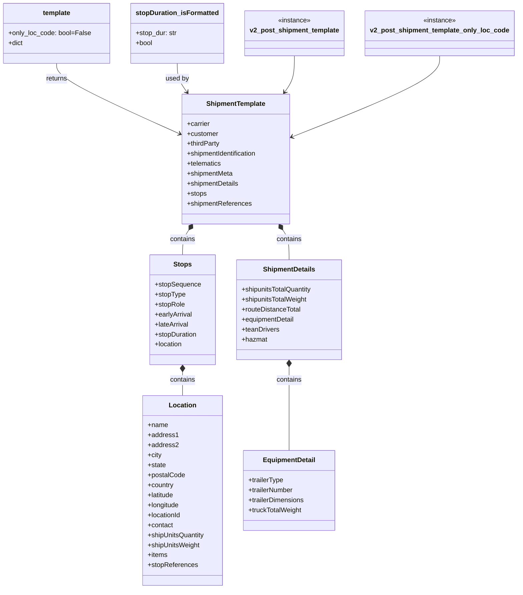

# Diagram: shipment_core/shipment_service/shipment_service/json_templates/v2_post_put_shipment.py

> Auto-generated by Obscura crawlers

## Mermaid

```mermaid
classDiagram
class stopDuration_isFormatted {
  +stop_dur: str
  +bool
}
class template {
  +only_loc_code: bool=False
  +dict
}
class ShipmentTemplate {
  +carrier
  +customer
  +thirdParty
  +shipmentIdentification
  +telematics
  +shipmentMeta
  +shipmentDetails
  +stops
  +shipmentReferences
}
class Stops {
  +stopSequence
  +stopType
  +stopRole
  +earlyArrival
  +lateArrival
  +stopDuration
  +location
}
class Location {
  +name
  +address1
  +address2
  +city
  +state
  +postalCode
  +country
  +latitude
  +longitude
  +locationId
  +contact
  +shipUnitsQuantity
  +shipUnitsWeight
  +items
  +stopReferences
}
class ShipmentDetails {
  +shipunitsTotalQuantity
  +shipunitsTotalWeight
  +routeDistanceTotal
  +equipmentDetail
  +teanDrivers
  +hazmat
}
class EquipmentDetail {
  +trailerType
  +trailerNumber
  +trailerDimensions
  +truckTotalWeight
}
template --> ShipmentTemplate : returns
stopDuration_isFormatted --> ShipmentTemplate : used by
ShipmentTemplate *-- Stops : contains
Stops *-- Location : contains
ShipmentTemplate *-- ShipmentDetails : contains
ShipmentDetails *-- EquipmentDetail : contains
class v2_post_shipment_template <<instance>>
class v2_post_shipment_template_only_loc_code <<instance>>
v2_post_shipment_template --> ShipmentTemplate
v2_post_shipment_template_only_loc_code --> ShipmentTemplate
```

> SVG rendering failed for this diagram.
