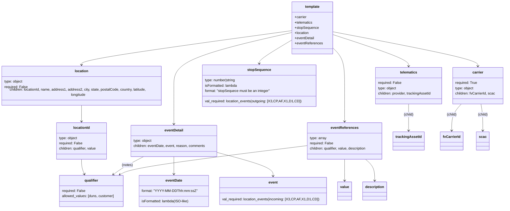

# Diagram: shipment_core/shipment_service/shipment_service/json_templates/v2_post_shipment_status.py

> Auto-generated by Obscura crawlers

## Mermaid

### SVG

<svg id="container" width="2313.5625" xmlns="http://www.w3.org/2000/svg" class="classDiagram" height="958" viewBox="0 0 2313.5625 958" role="graphics-document document" aria-roledescription="class"><g><defs><marker id="container_class-aggregationStart" class="marker aggregation class" refX="18" refY="7" markerWidth="190" markerHeight="240" orient="auto"><path d="M 18,7 L9,13 L1,7 L9,1 Z"></path></marker></defs><defs><marker id="container_class-aggregationEnd" class="marker aggregation class" refX="1" refY="7" markerWidth="20" markerHeight="28" orient="auto"><path d="M 18,7 L9,13 L1,7 L9,1 Z"></path></marker></defs><defs><marker id="container_class-extensionStart" class="marker extension class" refX="18" refY="7" markerWidth="190" markerHeight="240" orient="auto"><path d="M 1,7 L18,13 V 1 Z"></path></marker></defs><defs><marker id="container_class-extensionEnd" class="marker extension class" refX="1" refY="7" markerWidth="20" markerHeight="28" orient="auto"><path d="M 1,1 V 13 L18,7 Z"></path></marker></defs><defs><marker id="container_class-compositionStart" class="marker composition class" refX="18" refY="7" markerWidth="190" markerHeight="240" orient="auto"><path d="M 18,7 L9,13 L1,7 L9,1 Z"></path></marker></defs><defs><marker id="container_class-compositionEnd" class="marker composition class" refX="1" refY="7" markerWidth="20" markerHeight="28" orient="auto"><path d="M 18,7 L9,13 L1,7 L9,1 Z"></path></marker></defs><defs><marker id="container_class-dependencyStart" class="marker dependency class" refX="6" refY="7" markerWidth="190" markerHeight="240" orient="auto"><path d="M 5,7 L9,13 L1,7 L9,1 Z"></path></marker></defs><defs><marker id="container_class-dependencyEnd" class="marker dependency class" refX="13" refY="7" markerWidth="20" markerHeight="28" orient="auto"><path d="M 18,7 L9,13 L14,7 L9,1 Z"></path></marker></defs><defs><marker id="container_class-lollipopStart" class="marker lollipop class" refX="13" refY="7" markerWidth="190" markerHeight="240" orient="auto"><circle stroke="black" fill="transparent" cx="7" cy="7" r="6"></circle></marker></defs><defs><marker id="container_class-lollipopEnd" class="marker lollipop class" refX="1" refY="7" markerWidth="190" markerHeight="240" orient="auto"><circle stroke="black" fill="transparent" cx="7" cy="7" r="6"></circle></marker></defs><g class="root"><g class="clusters"></g><g class="edgePaths"><path d="M1524.836,145.689L1635.607,166.908C1746.378,188.126,1967.919,230.563,2078.69,256.948C2189.461,283.333,2189.461,293.667,2189.461,298.833L2189.461,304" id="id_template_carrier_1" class="edge-thickness-normal edge-pattern-solid relation" style=";;;" data-edge="true" data-et="edge" data-id="id_template_carrier_1" data-points="W3sieCI6MTUyNC44MzU5Mzc1LCJ5IjoxNDUuNjg5NDIzODQ2MDE0OX0seyJ4IjoyMTg5LjQ2MDkzNzUsInkiOjI3M30seyJ4IjoyMTg5LjQ2MDkzNzUsInkiOjMxMH1d" marker-end="url(#container_class-dependencyEnd)"></path><path d="M1524.836,158.682L1582.182,177.735C1639.529,196.788,1754.221,234.894,1811.568,259.114C1868.914,283.333,1868.914,293.667,1868.914,298.833L1868.914,304" id="id_template_telematics_2" class="edge-thickness-normal edge-pattern-solid relation" style=";;;" data-edge="true" data-et="edge" data-id="id_template_telematics_2" data-points="W3sieCI6MTUyNC44MzU5Mzc1LCJ5IjoxNTguNjgxOTg3MDIxNzA1MDh9LHsieCI6MTg2OC45MTQwNjI1LCJ5IjoyNzN9LHsieCI6MTg2OC45MTQwNjI1LCJ5IjozMTB9XQ==" marker-end="url(#container_class-dependencyEnd)"></path><path d="M1340.141,184.613L1316.111,199.345C1292.082,214.076,1244.023,243.538,1219.994,261.436C1195.965,279.333,1195.965,285.667,1195.965,288.833L1195.965,292" id="id_template_stopSequence_3" class="edge-thickness-normal edge-pattern-solid relation" style=";;;" data-edge="true" data-et="edge" data-id="id_template_stopSequence_3" data-points="W3sieCI6MTM0MC4xNDA2MjUsInkiOjE4NC42MTM0NTk5NTA0NTQxN30seyJ4IjoxMTk1Ljk2NDg0Mzc1LCJ5IjoyNzN9LHsieCI6MTE5NS45NjQ4NDM3NSwieSI6Mjk4fV0=" marker-end="url(#container_class-dependencyEnd)"></path><path d="M1340.141,140.817L1181.402,162.847C1022.664,184.878,705.188,228.939,546.449,256.136C387.711,283.333,387.711,293.667,387.711,298.833L387.711,304" id="id_template_location_4" class="edge-thickness-normal edge-pattern-solid relation" style=";;;" data-edge="true" data-et="edge" data-id="id_template_location_4" data-points="W3sieCI6MTM0MC4xNDA2MjUsInkiOjE0MC44MTY1MjA0MTU5MDh9LHsieCI6Mzg3LjcxMDkzNzUsInkiOjI3M30seyJ4IjozODcuNzEwOTM3NSwieSI6MzEwfV0=" marker-end="url(#container_class-dependencyEnd)"></path><path d="M1340.141,149.745L1252.898,170.287C1165.655,190.83,991.169,231.915,903.926,272.624C816.684,313.333,816.684,353.667,816.684,396C816.684,438.333,816.684,482.667,816.684,512C816.684,541.333,816.684,555.667,816.684,562.833L816.684,570" id="id_template_eventDetail_5" class="edge-thickness-normal edge-pattern-solid relation" style=";;;" data-edge="true" data-et="edge" data-id="id_template_eventDetail_5" data-points="W3sieCI6MTM0MC4xNDA2MjUsInkiOjE0OS43NDQ1NzMyODQ0NDc0M30seyJ4Ijo4MTYuNjgzNTkzNzUsInkiOjI3M30seyJ4Ijo4MTYuNjgzNTkzNzUsInkiOjM5NH0seyJ4Ijo4MTYuNjgzNTkzNzUsInkiOjUyN30seyJ4Ijo4MTYuNjgzNTkzNzUsInkiOjU3Nn1d" marker-end="url(#container_class-dependencyEnd)"></path><path d="M1524.836,221.798L1533.238,230.332C1541.639,238.865,1558.443,255.933,1566.844,284.633C1575.246,313.333,1575.246,353.667,1575.246,396C1575.246,438.333,1575.246,482.667,1575.246,510C1575.246,537.333,1575.246,547.667,1575.246,552.833L1575.246,558" id="id_template_eventReferences_6" class="edge-thickness-normal edge-pattern-solid relation" style=";;;" data-edge="true" data-et="edge" data-id="id_template_eventReferences_6" data-points="W3sieCI6MTUyNC44MzU5Mzc1LCJ5IjoyMjEuNzk4MDkwMDc4MjU3NTN9LHsieCI6MTU3NS4yNDYwOTM3NSwieSI6MjczfSx7IngiOjE1NzUuMjQ2MDkzNzUsInkiOjM5NH0seyJ4IjoxNTc1LjI0NjA5Mzc1LCJ5Ijo1Mjd9LHsieCI6MTU3NS4yNDYwOTM3NSwieSI6NTY0fV0=" marker-end="url(#container_class-dependencyEnd)"></path><path d="M387.711,478L387.711,486.167C387.711,494.333,387.711,510.667,387.711,524C387.711,537.333,387.711,547.667,387.711,552.833L387.711,558" id="id_location_locationId_7" class="edge-thickness-normal edge-pattern-solid relation" style=";;;" data-edge="true" data-et="edge" data-id="id_location_locationId_7" data-points="W3sieCI6Mzg3LjcxMDkzNzUsInkiOjQ3OH0seyJ4IjozODcuNzEwOTM3NSwieSI6NTI3fSx7IngiOjM4Ny43MTA5Mzc1LCJ5Ijo1NjR9XQ==" marker-end="url(#container_class-dependencyEnd)"></path><path d="M387.711,732L387.711,738.167C387.711,744.333,387.711,756.667,389.896,768.077C392.08,779.487,396.45,789.974,398.634,795.218L400.819,800.461" id="id_locationId_qualifier_8" class="edge-thickness-normal edge-pattern-solid relation" style=";;;" data-edge="true" data-et="edge" data-id="id_locationId_qualifier_8" data-points="W3sieCI6Mzg3LjcxMDkzNzUsInkiOjczMn0seyJ4IjozODcuNzEwOTM3NSwieSI6NzY5fSx7IngiOjQwMy4xMjY3MjAxODM0ODYyLCJ5Ijo4MDZ9XQ==" marker-end="url(#container_class-dependencyEnd)"></path><path d="M816.684,720L816.684,728.167C816.684,736.333,816.684,752.667,816.684,766C816.684,779.333,816.684,789.667,816.684,794.833L816.684,800" id="id_eventDetail_eventDate_9" class="edge-thickness-normal edge-pattern-solid relation" style=";;;" data-edge="true" data-et="edge" data-id="id_eventDetail_eventDate_9" data-points="W3sieCI6ODE2LjY4MzU5Mzc1LCJ5Ijo3MjB9LHsieCI6ODE2LjY4MzU5Mzc1LCJ5Ijo3Njl9LHsieCI6ODE2LjY4MzU5Mzc1LCJ5Ijo4MDZ9XQ==" marker-end="url(#container_class-dependencyEnd)"></path><path d="M1014.727,702.372L1055.174,713.477C1095.621,724.581,1176.516,746.791,1216.963,764.562C1257.41,782.333,1257.41,795.667,1257.41,802.333L1257.41,809" id="id_eventDetail_event_10" class="edge-thickness-normal edge-pattern-solid relation" style=";;;" data-edge="true" data-et="edge" data-id="id_eventDetail_event_10" data-points="W3sieCI6MTAxNC43MjY1NjI1LCJ5Ijo3MDIuMzcyMDMzMDQyMDI5M30seyJ4IjoxMjU3LjQxMDE1NjI1LCJ5Ijo3Njl9LHsieCI6MTI1Ny40MTAxNTYyNSwieSI6ODE1fV0=" marker-end="url(#container_class-dependencyEnd)"></path><path d="M678.862,720L663.229,728.167C647.597,736.333,616.332,752.667,592.915,766.417C569.499,780.168,553.932,791.335,546.149,796.919L538.365,802.503" id="id_eventDetail_qualifier_11" class="edge-thickness-normal edge-pattern-solid relation" style=";;;" data-edge="true" data-et="edge" data-id="id_eventDetail_qualifier_11" data-points="W3sieCI6Njc4Ljg2MTc5NjIyOTMzODgsInkiOjcyMH0seyJ4Ijo1ODUuMDY2NDA2MjUsInkiOjc2OX0seyJ4Ijo1MzMuNDg5OTY1NTk2MzMwMywieSI6ODA2fV0=" marker-end="url(#container_class-dependencyEnd)"></path><path d="M1868.914,478L1868.914,486.167C1868.914,494.333,1868.914,510.667,1868.914,531C1868.914,551.333,1868.914,575.667,1868.914,587.833L1868.914,600" id="id_telematics_trackingAssetId_12" class="edge-thickness-normal edge-pattern-solid relation" style=";;;" data-edge="true" data-et="edge" data-id="id_telematics_trackingAssetId_12" data-points="W3sieCI6MTg2OC45MTQwNjI1LCJ5Ijo0Nzh9LHsieCI6MTg2OC45MTQwNjI1LCJ5Ijo1Mjd9LHsieCI6MTg2OC45MTQwNjI1LCJ5Ijo2MDZ9XQ==" marker-end="url(#container_class-dependencyEnd)"></path><path d="M2103.554,478L2095.202,486.167C2086.85,494.333,2070.146,510.667,2061.793,531C2053.441,551.333,2053.441,575.667,2053.441,587.833L2053.441,600" id="id_carrier_fvCarrierId_13" class="edge-thickness-normal edge-pattern-solid relation" style=";;;" data-edge="true" data-et="edge" data-id="id_carrier_fvCarrierId_13" data-points="W3sieCI6MjEwMy41NTM4NjUxMzE1Nzg3LCJ5Ijo0Nzh9LHsieCI6MjA1My40NDE0MDYyNSwieSI6NTI3fSx7IngiOjIwNTMuNDQxNDA2MjUsInkiOjYwNn1d" marker-end="url(#container_class-dependencyEnd)"></path><path d="M2198.468,478L2199.344,486.167C2200.22,494.333,2201.971,510.667,2202.847,531C2203.723,551.333,2203.723,575.667,2203.723,587.833L2203.723,600" id="id_carrier_scac_14" class="edge-thickness-normal edge-pattern-solid relation" style=";;;" data-edge="true" data-et="edge" data-id="id_carrier_scac_14" data-points="W3sieCI6MjE5OC40NjgzMzg4MTU3ODk2LCJ5Ijo0Nzh9LHsieCI6MjIwMy43MjI2NTYyNSwieSI6NTI3fSx7IngiOjIyMDMuNzIyNjU2MjUsInkiOjYwNn1d" marker-end="url(#container_class-dependencyEnd)"></path><path d="M1400.547,670.374L1272.202,686.812C1143.858,703.25,887.169,736.125,748.535,758.246C609.9,780.366,589.32,791.733,579.03,797.416L568.74,803.099" id="id_eventReferences_qualifier_15" class="edge-thickness-normal edge-pattern-solid relation" style=";;;" data-edge="true" data-et="edge" data-id="id_eventReferences_qualifier_15" data-points="W3sieCI6MTQwMC41NDY4NzUsInkiOjY3MC4zNzQ0NDM4OTMxNjE0fSx7IngiOjYzMC40ODA0Njg3NSwieSI6NzY5fSx7IngiOjU2My40ODgyNDU0MTI4NDQsInkiOjgwNn1d" marker-end="url(#container_class-dependencyEnd)"></path><path d="M1575.246,732L1575.246,738.167C1575.246,744.333,1575.246,756.667,1575.246,773C1575.246,789.333,1575.246,809.667,1575.246,819.833L1575.246,830" id="id_eventReferences_value_16" class="edge-thickness-normal edge-pattern-solid relation" style=";;;" data-edge="true" data-et="edge" data-id="id_eventReferences_value_16" data-points="W3sieCI6MTU3NS4yNDYwOTM3NSwieSI6NzMyfSx7IngiOjE1NzUuMjQ2MDkzNzUsInkiOjc2OX0seyJ4IjoxNTc1LjI0NjA5Mzc1LCJ5Ijo4MzZ9XQ==" marker-end="url(#container_class-dependencyEnd)"></path><path d="M1669.236,732L1676.136,738.167C1683.036,744.333,1696.837,756.667,1703.737,773C1710.637,789.333,1710.637,809.667,1710.637,819.833L1710.637,830" id="id_eventReferences_description_17" class="edge-thickness-normal edge-pattern-solid relation" style=";;;" data-edge="true" data-et="edge" data-id="id_eventReferences_description_17" data-points="W3sieCI6MTY2OS4yMzYyNzk3MDA0MTMyLCJ5Ijo3MzJ9LHsieCI6MTcxMC42MzY3MTg3NSwieSI6NzY5fSx7IngiOjE3MTAuNjM2NzE4NzUsInkiOjgzNn1d" marker-end="url(#container_class-dependencyEnd)"></path></g><g class="edgeLabels"><g class="edgeLabel"><g class="label" data-id="id_template_carrier_1" transform="translate(0, 0)"><foreignObject width="0" height="0">

</foreignObject></g></g><g class="edgeLabel"><g class="label" data-id="id_template_telematics_2" transform="translate(0, 0)"><foreignObject width="0" height="0">

</foreignObject></g></g><g class="edgeLabel"><g class="label" data-id="id_template_stopSequence_3" transform="translate(0, 0)"><foreignObject width="0" height="0">

</foreignObject></g></g><g class="edgeLabel"><g class="label" data-id="id_template_location_4" transform="translate(0, 0)"><foreignObject width="0" height="0">

</foreignObject></g></g><g class="edgeLabel"><g class="label" data-id="id_template_eventDetail_5" transform="translate(0, 0)"><foreignObject width="0" height="0">

</foreignObject></g></g><g class="edgeLabel"><g class="label" data-id="id_template_eventReferences_6" transform="translate(0, 0)"><foreignObject width="0" height="0">

</foreignObject></g></g><g class="edgeLabel"><g class="label" data-id="id_location_locationId_7" transform="translate(0, 0)"><foreignObject width="0" height="0">

</foreignObject></g></g><g class="edgeLabel"><g class="label" data-id="id_locationId_qualifier_8" transform="translate(0, 0)"><foreignObject width="0" height="0">

</foreignObject></g></g><g class="edgeLabel"><g class="label" data-id="id_eventDetail_eventDate_9" transform="translate(0, 0)"><foreignObject width="0" height="0">

</foreignObject></g></g><g class="edgeLabel"><g class="label" data-id="id_eventDetail_event_10" transform="translate(0, 0)"><foreignObject width="0" height="0">

</foreignObject></g></g><g class="edgeLabel" transform="translate(603.83371, 759.1957)"><g class="label" data-id="id_eventDetail_qualifier_11" transform="translate(-25.4140625, -12)"><foreignObject width="50.828125" height="24">

(notes)

</foreignObject></g></g><g class="edgeLabel" transform="translate(1868.9140625, 527)"><g class="label" data-id="id_telematics_trackingAssetId_12" transform="translate(-23.046875, -12)"><foreignObject width="46.09375" height="24">

(child)

</foreignObject></g></g><g class="edgeLabel" transform="translate(2053.44140625, 527)"><g class="label" data-id="id_carrier_fvCarrierId_13" transform="translate(-23.046875, -12)"><foreignObject width="46.09375" height="24">

(child)

</foreignObject></g></g><g class="edgeLabel" transform="translate(2203.72265625, 527)"><g class="label" data-id="id_carrier_scac_14" transform="translate(-23.046875, -12)"><foreignObject width="46.09375" height="24">

(child)

</foreignObject></g></g><g class="edgeLabel"><g class="label" data-id="id_eventReferences_qualifier_15" transform="translate(0, 0)"><foreignObject width="0" height="0">

</foreignObject></g></g><g class="edgeLabel"><g class="label" data-id="id_eventReferences_value_16" transform="translate(0, 0)"><foreignObject width="0" height="0">

</foreignObject></g></g><g class="edgeLabel"><g class="label" data-id="id_eventReferences_description_17" transform="translate(0, 0)"><foreignObject width="0" height="0">

</foreignObject></g></g></g><g class="nodes"><g class="node default" id="classId-template-0" transform="translate(1432.48828125, 128)"><g class="basic label-container"><path d="M-92.34765625 -120 L92.34765625 -120 L92.34765625 120 L-92.34765625 120" stroke="none" stroke-width="0" fill="#ECECFF" style=""></path><path d="M-92.34765625 -120 C-38.872483797723575 -120, 14.60268865455285 -120, 92.34765625 -120 M-92.34765625 -120 C-26.80703057722195 -120, 38.7335950955561 -120, 92.34765625 -120 M92.34765625 -120 C92.34765625 -33.6620646579468, 92.34765625 52.6758706841064, 92.34765625 120 M92.34765625 -120 C92.34765625 -35.362259886365905, 92.34765625 49.27548022726819, 92.34765625 120 M92.34765625 120 C30.91868164638298 120, -30.510292957234043 120, -92.34765625 120 M92.34765625 120 C32.48278219139622 120, -27.382091867207563 120, -92.34765625 120 M-92.34765625 120 C-92.34765625 38.78866894004935, -92.34765625 -42.422662119901304, -92.34765625 -120 M-92.34765625 120 C-92.34765625 32.15944962878518, -92.34765625 -55.681100742429635, -92.34765625 -120" stroke="#9370DB" stroke-width="1.3" fill="none" stroke-dasharray="0 0" style=""></path></g><g class="annotation-group text" transform="translate(0, -96)"></g><g class="label-group text" transform="translate(-32.9765625, -96)"><g class="label" style="font-weight: bolder" transform="translate(0,-12)"><foreignObject width="65.953125" height="24">

template

</foreignObject></g></g><g class="members-group text" transform="translate(-80.34765625, -48)"><g class="label" style="" transform="translate(0,-12)"><foreignObject width="55.9375" height="24">

+carrier

</foreignObject></g><g class="label" style="" transform="translate(0,12)"><foreignObject width="83.3125" height="24">

+telematics

</foreignObject></g><g class="label" style="" transform="translate(0,36)"><foreignObject width="110.3125" height="24">

+stopSequence

</foreignObject></g><g class="label" style="" transform="translate(0,60)"><foreignObject width="67.140625" height="24">

+location

</foreignObject></g><g class="label" style="" transform="translate(0,84)"><foreignObject width="90.921875" height="24">

+eventDetail

</foreignObject></g><g class="label" style="" transform="translate(0,108)"><foreignObject width="127.71875" height="24">

+eventReferences

</foreignObject></g></g><g class="methods-group text" transform="translate(-80.34765625, 120)"></g><g class="divider" style=""><path d="M-92.34765625 -72 C-29.100740891120815 -72, 34.14617446775837 -72, 92.34765625 -72 M-92.34765625 -72 C-28.71034654951309 -72, 34.92696315097382 -72, 92.34765625 -72" stroke="#9370DB" stroke-width="1.3" fill="none" stroke-dasharray="0 0" style=""></path></g><g class="divider" style=""><path d="M-92.34765625 96 C-41.02674460384094 96, 10.294167042318122 96, 92.34765625 96 M-92.34765625 96 C-22.67178360073875 96, 47.0040890485225 96, 92.34765625 96" stroke="#9370DB" stroke-width="1.3" fill="none" stroke-dasharray="0 0" style=""></path></g></g><g class="node default" id="classId-carrier-1" transform="translate(2189.4609375, 394)"><g class="basic label-container"><path d="M-116.1015625 -84 L116.1015625 -84 L116.1015625 84 L-116.1015625 84" stroke="none" stroke-width="0" fill="#ECECFF" style=""></path><path d="M-116.1015625 -84 C-58.250217981152566 -84, -0.3988734623051329 -84, 116.1015625 -84 M-116.1015625 -84 C-30.26540343892229 -84, 55.57075562215542 -84, 116.1015625 -84 M116.1015625 -84 C116.1015625 -39.98751002303238, 116.1015625 4.024979953935244, 116.1015625 84 M116.1015625 -84 C116.1015625 -32.930874203706104, 116.1015625 18.138251592587793, 116.1015625 84 M116.1015625 84 C45.90972567909964 84, -24.282111141800726 84, -116.1015625 84 M116.1015625 84 C47.32796997573034 84, -21.44562254853932 84, -116.1015625 84 M-116.1015625 84 C-116.1015625 29.911902625639875, -116.1015625 -24.17619474872025, -116.1015625 -84 M-116.1015625 84 C-116.1015625 44.54477244851866, -116.1015625 5.089544897037314, -116.1015625 -84" stroke="#9370DB" stroke-width="1.3" fill="none" stroke-dasharray="0 0" style=""></path></g><g class="annotation-group text" transform="translate(0, -60)"></g><g class="label-group text" transform="translate(-24.4375, -60)"><g class="label" style="font-weight: bolder" transform="translate(0,-12)"><foreignObject width="48.875" height="24">

carrier

</foreignObject></g></g><g class="members-group text" transform="translate(-104.1015625, -12)"><g class="label" style="" transform="translate(0,-12)"><foreignObject width="101.875" height="24">

required: True

</foreignObject></g><g class="label" style="" transform="translate(0,12)"><foreignObject width="85.359375" height="24">

type: object

</foreignObject></g><g class="label" style="" transform="translate(0,36)"><foreignObject width="183.765625" height="24">

children: fvCarrierId, scac

</foreignObject></g></g><g class="methods-group text" transform="translate(-104.1015625, 84)"></g><g class="divider" style=""><path d="M-116.1015625 -36 C-61.76752830941487 -36, -7.433494118829742 -36, 116.1015625 -36 M-116.1015625 -36 C-68.1417236174117 -36, -20.1818847348234 -36, 116.1015625 -36" stroke="#9370DB" stroke-width="1.3" fill="none" stroke-dasharray="0 0" style=""></path></g><g class="divider" style=""><path d="M-116.1015625 60 C-55.25931044952635 60, 5.582941600947294 60, 116.1015625 60 M-116.1015625 60 C-25.672516299101204 60, 64.75652990179759 60, 116.1015625 60" stroke="#9370DB" stroke-width="1.3" fill="none" stroke-dasharray="0 0" style=""></path></g></g><g class="node default" id="classId-telematics-2" transform="translate(1868.9140625, 394)"><g class="basic label-container"><path d="M-154.4453125 -84 L154.4453125 -84 L154.4453125 84 L-154.4453125 84" stroke="none" stroke-width="0" fill="#ECECFF" style=""></path><path d="M-154.4453125 -84 C-77.37599412803023 -84, -0.30667575606045716 -84, 154.4453125 -84 M-154.4453125 -84 C-39.39699796235219 -84, 75.65131657529562 -84, 154.4453125 -84 M154.4453125 -84 C154.4453125 -30.243215272657764, 154.4453125 23.513569454684472, 154.4453125 84 M154.4453125 -84 C154.4453125 -48.615844966938674, 154.4453125 -13.231689933877348, 154.4453125 84 M154.4453125 84 C50.66245505247136 84, -53.12040239505728 84, -154.4453125 84 M154.4453125 84 C74.76959027724837 84, -4.906131945503262 84, -154.4453125 84 M-154.4453125 84 C-154.4453125 42.83287246864185, -154.4453125 1.665744937283705, -154.4453125 -84 M-154.4453125 84 C-154.4453125 46.673161588305796, -154.4453125 9.346323176611591, -154.4453125 -84" stroke="#9370DB" stroke-width="1.3" fill="none" stroke-dasharray="0 0" style=""></path></g><g class="annotation-group text" transform="translate(0, -60)"></g><g class="label-group text" transform="translate(-38.296875, -60)"><g class="label" style="font-weight: bolder" transform="translate(0,-12)"><foreignObject width="76.59375" height="24">

telematics

</foreignObject></g></g><g class="members-group text" transform="translate(-142.4453125, -12)"><g class="label" style="" transform="translate(0,-12)"><foreignObject width="106.203125" height="24">

required: False

</foreignObject></g><g class="label" style="" transform="translate(0,12)"><foreignObject width="85.359375" height="24">

type: object

</foreignObject></g><g class="label" style="" transform="translate(0,36)"><foreignObject width="246.59375" height="24">

children: provider, trackingAssetId

</foreignObject></g></g><g class="methods-group text" transform="translate(-142.4453125, 84)"></g><g class="divider" style=""><path d="M-154.4453125 -36 C-77.60761020603366 -36, -0.7699079120673105 -36, 154.4453125 -36 M-154.4453125 -36 C-37.40668106445585 -36, 79.6319503710883 -36, 154.4453125 -36" stroke="#9370DB" stroke-width="1.3" fill="none" stroke-dasharray="0 0" style=""></path></g><g class="divider" style=""><path d="M-154.4453125 60 C-31.21263078130748 60, 92.02005093738504 60, 154.4453125 60 M-154.4453125 60 C-48.062656365177816 60, 58.31999976964437 60, 154.4453125 60" stroke="#9370DB" stroke-width="1.3" fill="none" stroke-dasharray="0 0" style=""></path></g></g><g class="node default" id="classId-stopSequence-3" transform="translate(1195.96484375, 394)"><g class="basic label-container"><path d="M-250.515625 -96 L250.515625 -96 L250.515625 96 L-250.515625 96" stroke="none" stroke-width="0" fill="#ECECFF" style=""></path><path d="M-250.515625 -96 C-65.13409938340763 -96, 120.24742623318474 -96, 250.515625 -96 M-250.515625 -96 C-50.287324061698456 -96, 149.9409768766031 -96, 250.515625 -96 M250.515625 -96 C250.515625 -20.820263314708555, 250.515625 54.35947337058289, 250.515625 96 M250.515625 -96 C250.515625 -32.81704758560221, 250.515625 30.36590482879558, 250.515625 96 M250.515625 96 C89.31562966757312 96, -71.88436566485376 96, -250.515625 96 M250.515625 96 C88.21937048892934 96, -74.07688402214131 96, -250.515625 96 M-250.515625 96 C-250.515625 38.56538909253592, -250.515625 -18.869221814928153, -250.515625 -96 M-250.515625 96 C-250.515625 25.15735864952819, -250.515625 -45.68528270094362, -250.515625 -96" stroke="#9370DB" stroke-width="1.3" fill="none" stroke-dasharray="0 0" style=""></path></g><g class="annotation-group text" transform="translate(0, -72)"></g><g class="label-group text" transform="translate(-51.75, -72)"><g class="label" style="font-weight: bolder" transform="translate(0,-12)"><foreignObject width="103.5" height="24">

stopSequence

</foreignObject></g></g><g class="members-group text" transform="translate(-238.515625, -24)"><g class="label" style="" transform="translate(0,-12)"><foreignObject width="144.765625" height="24">

type: number|string

</foreignObject></g><g class="label" style="" transform="translate(0,12)"><foreignObject width="149.703125" height="24">

isFormatted: lambda

</foreignObject></g><g class="label" style="" transform="translate(0,36)"><foreignObject width="303.328125" height="24">

format: "stopSequece must be an integer"

</foreignObject></g></g><g class="methods-group text" transform="translate(-238.515625, 72)"><g class="label" style="" transform="translate(0,-12)"><foreignObject width="425.28125" height="24">

val_required: location_events(outgoing: [X3,CP,AF,X1,D1,CD])

</foreignObject></g></g><g class="divider" style=""><path d="M-250.515625 -48 C-53.60275222361065 -48, 143.3101205527787 -48, 250.515625 -48 M-250.515625 -48 C-129.040019452609 -48, -7.564413905218004 -48, 250.515625 -48" stroke="#9370DB" stroke-width="1.3" fill="none" stroke-dasharray="0 0" style=""></path></g><g class="divider" style=""><path d="M-250.515625 48 C-67.74528747837681 48, 115.02505004324638 48, 250.515625 48 M-250.515625 48 C-111.10454911005806 48, 28.30652677988388 48, 250.515625 48" stroke="#9370DB" stroke-width="1.3" fill="none" stroke-dasharray="0 0" style=""></path></g></g><g class="node default" id="classId-location-4" transform="translate(387.7109375, 394)"><g class="basic label-container"><path d="M-379.7109375 -84 L379.7109375 -84 L379.7109375 84 L-379.7109375 84" stroke="none" stroke-width="0" fill="#ECECFF" style=""></path><path d="M-379.7109375 -84 C-79.73078735569356 -84, 220.24936278861287 -84, 379.7109375 -84 M-379.7109375 -84 C-169.9292750614597 -84, 39.85238737708062 -84, 379.7109375 -84 M379.7109375 -84 C379.7109375 -38.80588070230482, 379.7109375 6.388238595390362, 379.7109375 84 M379.7109375 -84 C379.7109375 -21.561580988815614, 379.7109375 40.87683802236877, 379.7109375 84 M379.7109375 84 C141.64076188371448 84, -96.42941373257105 84, -379.7109375 84 M379.7109375 84 C137.7264696256631 84, -104.2579982486738 84, -379.7109375 84 M-379.7109375 84 C-379.7109375 37.1536995356866, -379.7109375 -9.692600928626803, -379.7109375 -84 M-379.7109375 84 C-379.7109375 32.5802870575841, -379.7109375 -18.839425884831797, -379.7109375 -84" stroke="#9370DB" stroke-width="1.3" fill="none" stroke-dasharray="0 0" style=""></path></g><g class="annotation-group text" transform="translate(0, -60)"></g><g class="label-group text" transform="translate(-29.78125, -60)"><g class="label" style="font-weight: bolder" transform="translate(0,-12)"><foreignObject width="59.5625" height="24">

location

</foreignObject></g></g><g class="members-group text" transform="translate(-367.7109375, -12)"><g class="label" style="" transform="translate(0,-12)"><foreignObject width="85.359375" height="24">

type: object

</foreignObject></g><g class="label" style="" transform="translate(0,12)"><foreignObject width="106.203125" height="24">

required: False

</foreignObject></g><g class="label" style="" transform="translate(0,36)"><foreignObject width="705.640625" height="24">

children: locationId, name, address1, address2, city, state, postalCode, country, latitude, longitude

</foreignObject></g></g><g class="methods-group text" transform="translate(-367.7109375, 84)"></g><g class="divider" style=""><path d="M-379.7109375 -36 C-130.39348724920214 -36, 118.92396300159572 -36, 379.7109375 -36 M-379.7109375 -36 C-191.2213205572926 -36, -2.7317036145851716 -36, 379.7109375 -36" stroke="#9370DB" stroke-width="1.3" fill="none" stroke-dasharray="0 0" style=""></path></g><g class="divider" style=""><path d="M-379.7109375 60 C-172.3345682195976 60, 35.0418010608048 60, 379.7109375 60 M-379.7109375 60 C-127.63790619141122 60, 124.43512511717756 60, 379.7109375 60" stroke="#9370DB" stroke-width="1.3" fill="none" stroke-dasharray="0 0" style=""></path></g></g><g class="node default" id="classId-locationId-5" transform="translate(387.7109375, 648)"><g class="basic label-container"><path d="M-117.453125 -84 L117.453125 -84 L117.453125 84 L-117.453125 84" stroke="none" stroke-width="0" fill="#ECECFF" style=""></path><path d="M-117.453125 -84 C-53.22787243938494 -84, 10.997380121230123 -84, 117.453125 -84 M-117.453125 -84 C-29.248298774430552 -84, 58.956527451138896 -84, 117.453125 -84 M117.453125 -84 C117.453125 -32.98013145711266, 117.453125 18.039737085774675, 117.453125 84 M117.453125 -84 C117.453125 -26.361681283558013, 117.453125 31.276637432883973, 117.453125 84 M117.453125 84 C67.50407236449254 84, 17.555019728985087 84, -117.453125 84 M117.453125 84 C29.89002447275331 84, -57.67307605449338 84, -117.453125 84 M-117.453125 84 C-117.453125 34.644619754828966, -117.453125 -14.710760490342068, -117.453125 -84 M-117.453125 84 C-117.453125 18.961783075767187, -117.453125 -46.076433848465626, -117.453125 -84" stroke="#9370DB" stroke-width="1.3" fill="none" stroke-dasharray="0 0" style=""></path></g><g class="annotation-group text" transform="translate(0, -60)"></g><g class="label-group text" transform="translate(-36.921875, -60)"><g class="label" style="font-weight: bolder" transform="translate(0,-12)"><foreignObject width="73.84375" height="24">

locationId

</foreignObject></g></g><g class="members-group text" transform="translate(-105.453125, -12)"><g class="label" style="" transform="translate(0,-12)"><foreignObject width="85.359375" height="24">

type: object

</foreignObject></g><g class="label" style="" transform="translate(0,12)"><foreignObject width="106.203125" height="24">

required: False

</foreignObject></g><g class="label" style="" transform="translate(0,36)"><foreignObject width="173.984375" height="24">

children: qualifier, value

</foreignObject></g></g><g class="methods-group text" transform="translate(-105.453125, 84)"></g><g class="divider" style=""><path d="M-117.453125 -36 C-47.30814340123891 -36, 22.836838197522184 -36, 117.453125 -36 M-117.453125 -36 C-33.976657397134616 -36, 49.49981020573077 -36, 117.453125 -36" stroke="#9370DB" stroke-width="1.3" fill="none" stroke-dasharray="0 0" style=""></path></g><g class="divider" style=""><path d="M-117.453125 60 C-59.23394788629618 60, -1.0147707725923567 60, 117.453125 60 M-117.453125 60 C-62.93955813310714 60, -8.425991266214282 60, 117.453125 60" stroke="#9370DB" stroke-width="1.3" fill="none" stroke-dasharray="0 0" style=""></path></g></g><g class="node default" id="classId-qualifier-6" transform="translate(433.125, 878)"><g class="basic label-container"><path d="M-147.9140625 -72 L147.9140625 -72 L147.9140625 72 L-147.9140625 72" stroke="none" stroke-width="0" fill="#ECECFF" style=""></path><path d="M-147.9140625 -72 C-40.42551948996946 -72, 67.06302352006108 -72, 147.9140625 -72 M-147.9140625 -72 C-84.4792161942132 -72, -21.044369888426402 -72, 147.9140625 -72 M147.9140625 -72 C147.9140625 -36.317132654610404, 147.9140625 -0.6342653092208081, 147.9140625 72 M147.9140625 -72 C147.9140625 -37.2742445891431, 147.9140625 -2.5484891782862036, 147.9140625 72 M147.9140625 72 C36.42969567978315 72, -75.0546711404337 72, -147.9140625 72 M147.9140625 72 C81.90382784943657 72, 15.893593198873134 72, -147.9140625 72 M-147.9140625 72 C-147.9140625 18.559682004831544, -147.9140625 -34.88063599033691, -147.9140625 -72 M-147.9140625 72 C-147.9140625 26.787213799359286, -147.9140625 -18.42557240128143, -147.9140625 -72" stroke="#9370DB" stroke-width="1.3" fill="none" stroke-dasharray="0 0" style=""></path></g><g class="annotation-group text" transform="translate(0, -48)"></g><g class="label-group text" transform="translate(-30.734375, -48)"><g class="label" style="font-weight: bolder" transform="translate(0,-12)"><foreignObject width="61.46875" height="24">

qualifier

</foreignObject></g></g><g class="members-group text" transform="translate(-135.9140625, 0)"><g class="label" style="" transform="translate(0,-12)"><foreignObject width="106.203125" height="24">

required: False

</foreignObject></g><g class="label" style="" transform="translate(0,12)"><foreignObject width="241.09375" height="24">

allowed_values: [duns, customer]

</foreignObject></g></g><g class="methods-group text" transform="translate(-135.9140625, 72)"></g><g class="divider" style=""><path d="M-147.9140625 -24 C-69.13125463188763 -24, 9.651553236224743 -24, 147.9140625 -24 M-147.9140625 -24 C-50.09131020028116 -24, 47.731442099437686 -24, 147.9140625 -24" stroke="#9370DB" stroke-width="1.3" fill="none" stroke-dasharray="0 0" style=""></path></g><g class="divider" style=""><path d="M-147.9140625 48 C-71.77909868402504 48, 4.355865131949912 48, 147.9140625 48 M-147.9140625 48 C-38.69566577294833 48, 70.52273095410334 48, 147.9140625 48" stroke="#9370DB" stroke-width="1.3" fill="none" stroke-dasharray="0 0" style=""></path></g></g><g class="node default" id="classId-eventDetail-7" transform="translate(816.68359375, 648)"><g class="basic label-container"><path d="M-198.04296875 -72 L198.04296875 -72 L198.04296875 72 L-198.04296875 72" stroke="none" stroke-width="0" fill="#ECECFF" style=""></path><path d="M-198.04296875 -72 C-114.3863937599687 -72, -30.729818769937395 -72, 198.04296875 -72 M-198.04296875 -72 C-65.96084520636455 -72, 66.1212783372709 -72, 198.04296875 -72 M198.04296875 -72 C198.04296875 -26.449993484974172, 198.04296875 19.100013030051656, 198.04296875 72 M198.04296875 -72 C198.04296875 -35.849850918900565, 198.04296875 0.30029816219887095, 198.04296875 72 M198.04296875 72 C82.27107981005997 72, -33.500809129880054 72, -198.04296875 72 M198.04296875 72 C87.32598406384402 72, -23.391000622311964 72, -198.04296875 72 M-198.04296875 72 C-198.04296875 26.401865426444616, -198.04296875 -19.19626914711077, -198.04296875 -72 M-198.04296875 72 C-198.04296875 42.62815642968616, -198.04296875 13.256312859372322, -198.04296875 -72" stroke="#9370DB" stroke-width="1.3" fill="none" stroke-dasharray="0 0" style=""></path></g><g class="annotation-group text" transform="translate(0, -48)"></g><g class="label-group text" transform="translate(-42.1484375, -48)"><g class="label" style="font-weight: bolder" transform="translate(0,-12)"><foreignObject width="84.296875" height="24">

eventDetail

</foreignObject></g></g><g class="members-group text" transform="translate(-186.04296875, 0)"><g class="label" style="" transform="translate(0,-12)"><foreignObject width="85.359375" height="24">

type: object

</foreignObject></g><g class="label" style="" transform="translate(0,12)"><foreignObject width="329.9375" height="24">

children: eventDate, event, reason, comments

</foreignObject></g></g><g class="methods-group text" transform="translate(-186.04296875, 72)"></g><g class="divider" style=""><path d="M-198.04296875 -24 C-59.18613237505255 -24, 79.6707039998949 -24, 198.04296875 -24 M-198.04296875 -24 C-59.56012356924563 -24, 78.92272161150873 -24, 198.04296875 -24" stroke="#9370DB" stroke-width="1.3" fill="none" stroke-dasharray="0 0" style=""></path></g><g class="divider" style=""><path d="M-198.04296875 48 C-58.358777112725335 48, 81.32541452454933 48, 198.04296875 48 M-198.04296875 48 C-112.51045348931986 48, -26.977938228639715 48, 198.04296875 48" stroke="#9370DB" stroke-width="1.3" fill="none" stroke-dasharray="0 0" style=""></path></g></g><g class="node default" id="classId-eventDate-8" transform="translate(816.68359375, 878)"><g class="basic label-container"><path d="M-154.4921875 -72 L154.4921875 -72 L154.4921875 72 L-154.4921875 72" stroke="none" stroke-width="0" fill="#ECECFF" style=""></path><path d="M-154.4921875 -72 C-36.212311751938515 -72, 82.06756399612297 -72, 154.4921875 -72 M-154.4921875 -72 C-61.7654745636045 -72, 30.961238372791 -72, 154.4921875 -72 M154.4921875 -72 C154.4921875 -28.846723269386914, 154.4921875 14.306553461226173, 154.4921875 72 M154.4921875 -72 C154.4921875 -24.22762983217732, 154.4921875 23.544740335645358, 154.4921875 72 M154.4921875 72 C90.11792800796083 72, 25.743668515921655 72, -154.4921875 72 M154.4921875 72 C32.55284334370562 72, -89.38650081258876 72, -154.4921875 72 M-154.4921875 72 C-154.4921875 17.551979900110148, -154.4921875 -36.896040199779705, -154.4921875 -72 M-154.4921875 72 C-154.4921875 15.414703794135875, -154.4921875 -41.17059241172825, -154.4921875 -72" stroke="#9370DB" stroke-width="1.3" fill="none" stroke-dasharray="0 0" style=""></path></g><g class="annotation-group text" transform="translate(0, -48)"></g><g class="label-group text" transform="translate(-37.390625, -48)"><g class="label" style="font-weight: bolder" transform="translate(0,-12)"><foreignObject width="74.78125" height="24">

eventDate

</foreignObject></g></g><g class="members-group text" transform="translate(-142.4921875, 0)"><g class="label" style="" transform="translate(0,-12)"><foreignObject width="247.59375" height="24">

format: "YYYY-MM-DDThh:mm:ssZ"

</foreignObject></g></g><g class="methods-group text" transform="translate(-142.4921875, 48)"><g class="label" style="" transform="translate(0,-12)"><foreignObject width="217" height="24">

isFormatted: lambda(ISO-like)

</foreignObject></g></g><g class="divider" style=""><path d="M-154.4921875 -24 C-80.25206525099313 -24, -6.011943001986253 -24, 154.4921875 -24 M-154.4921875 -24 C-78.13537169941328 -24, -1.7785558988265677 -24, 154.4921875 -24" stroke="#9370DB" stroke-width="1.3" fill="none" stroke-dasharray="0 0" style=""></path></g><g class="divider" style=""><path d="M-154.4921875 24 C-58.81963480213625 24, 36.8529178957275 24, 154.4921875 24 M-154.4921875 24 C-82.89739789358465 24, -11.302608287169306 24, 154.4921875 24" stroke="#9370DB" stroke-width="1.3" fill="none" stroke-dasharray="0 0" style=""></path></g></g><g class="node default" id="classId-event-9" transform="translate(1257.41015625, 878)"><g class="basic label-container"><path d="M-236.234375 -63 L236.234375 -63 L236.234375 63 L-236.234375 63" stroke="none" stroke-width="0" fill="#ECECFF" style=""></path><path d="M-236.234375 -63 C-127.16388436752213 -63, -18.09339373504426 -63, 236.234375 -63 M-236.234375 -63 C-85.04399018348829 -63, 66.14639463302342 -63, 236.234375 -63 M236.234375 -63 C236.234375 -32.21564806927353, 236.234375 -1.4312961385470544, 236.234375 63 M236.234375 -63 C236.234375 -14.029648180345632, 236.234375 34.94070363930874, 236.234375 63 M236.234375 63 C60.98784631869336 63, -114.25868236261329 63, -236.234375 63 M236.234375 63 C67.55989208492119 63, -101.11459083015762 63, -236.234375 63 M-236.234375 63 C-236.234375 15.088992153051613, -236.234375 -32.82201569389677, -236.234375 -63 M-236.234375 63 C-236.234375 34.83816208229577, -236.234375 6.676324164591534, -236.234375 -63" stroke="#9370DB" stroke-width="1.3" fill="none" stroke-dasharray="0 0" style=""></path></g><g class="annotation-group text" transform="translate(0, -39)"></g><g class="label-group text" transform="translate(-20.515625, -39)"><g class="label" style="font-weight: bolder" transform="translate(0,-12)"><foreignObject width="41.03125" height="24">

event

</foreignObject></g></g><g class="members-group text" transform="translate(-224.234375, 9)"></g><g class="methods-group text" transform="translate(-224.234375, 39)"><g class="label" style="" transform="translate(0,-12)"><foreignObject width="427.953125" height="24">

val_required: location_events(incoming: [X3,CP,AF,X1,D1,CD])

</foreignObject></g></g><g class="divider" style=""><path d="M-236.234375 -15 C-80.12578219690803 -15, 75.98281060618393 -15, 236.234375 -15 M-236.234375 -15 C-60.68204708391059 -15, 114.87028083217882 -15, 236.234375 -15" stroke="#9370DB" stroke-width="1.3" fill="none" stroke-dasharray="0 0" style=""></path></g><g class="divider" style=""><path d="M-236.234375 9 C-128.18606891967073 9, -20.13776283934149 9, 236.234375 9 M-236.234375 9 C-141.52029937166088 9, -46.80622374332174 9, 236.234375 9" stroke="#9370DB" stroke-width="1.3" fill="none" stroke-dasharray="0 0" style=""></path></g></g><g class="node default" id="classId-eventReferences-10" transform="translate(1575.24609375, 648)"><g class="basic label-container"><path d="M-174.69921875 -84 L174.69921875 -84 L174.69921875 84 L-174.69921875 84" stroke="none" stroke-width="0" fill="#ECECFF" style=""></path><path d="M-174.69921875 -84 C-73.16488246510065 -84, 28.369453819798707 -84, 174.69921875 -84 M-174.69921875 -84 C-68.18338987640793 -84, 38.33243899718414 -84, 174.69921875 -84 M174.69921875 -84 C174.69921875 -26.390258666496344, 174.69921875 31.219482667007313, 174.69921875 84 M174.69921875 -84 C174.69921875 -27.134699708834717, 174.69921875 29.730600582330567, 174.69921875 84 M174.69921875 84 C46.99930277046434 84, -80.70061320907132 84, -174.69921875 84 M174.69921875 84 C71.3983942970487 84, -31.902430155902607 84, -174.69921875 84 M-174.69921875 84 C-174.69921875 38.68957956534702, -174.69921875 -6.620840869305965, -174.69921875 -84 M-174.69921875 84 C-174.69921875 42.27689271548271, -174.69921875 0.5537854309654193, -174.69921875 -84" stroke="#9370DB" stroke-width="1.3" fill="none" stroke-dasharray="0 0" style=""></path></g><g class="annotation-group text" transform="translate(0, -60)"></g><g class="label-group text" transform="translate(-60.8828125, -60)"><g class="label" style="font-weight: bolder" transform="translate(0,-12)"><foreignObject width="121.765625" height="24">

eventReferences

</foreignObject></g></g><g class="members-group text" transform="translate(-162.69921875, -12)"><g class="label" style="" transform="translate(0,-12)"><foreignObject width="76.71875" height="24">

type: array

</foreignObject></g><g class="label" style="" transform="translate(0,12)"><foreignObject width="106.203125" height="24">

required: False

</foreignObject></g><g class="label" style="" transform="translate(0,36)"><foreignObject width="264.515625" height="24">

children: qualifier, value, description

</foreignObject></g></g><g class="methods-group text" transform="translate(-162.69921875, 84)"></g><g class="divider" style=""><path d="M-174.69921875 -36 C-55.569338917906634 -36, 63.56054091418673 -36, 174.69921875 -36 M-174.69921875 -36 C-36.28304044392445 -36, 102.1331378621511 -36, 174.69921875 -36" stroke="#9370DB" stroke-width="1.3" fill="none" stroke-dasharray="0 0" style=""></path></g><g class="divider" style=""><path d="M-174.69921875 60 C-70.35413438592508 60, 33.99094997814984 60, 174.69921875 60 M-174.69921875 60 C-71.6454026876241 60, 31.408413374751802 60, 174.69921875 60" stroke="#9370DB" stroke-width="1.3" fill="none" stroke-dasharray="0 0" style=""></path></g></g><g class="node default" id="classId-trackingAssetId-11" transform="translate(1868.9140625, 648)"><g class="basic label-container"><path d="M-68.96875 -42 L68.96875 -42 L68.96875 42 L-68.96875 42" stroke="none" stroke-width="0" fill="#ECECFF" style=""></path><path d="M-68.96875 -42 C-17.783690987449887 -42, 33.401368025100226 -42, 68.96875 -42 M-68.96875 -42 C-19.748024301738887 -42, 29.472701396522226 -42, 68.96875 -42 M68.96875 -42 C68.96875 -8.834473222226826, 68.96875 24.331053555546347, 68.96875 42 M68.96875 -42 C68.96875 -16.470157875359213, 68.96875 9.059684249281574, 68.96875 42 M68.96875 42 C18.182587778225198 42, -32.603574443549604 42, -68.96875 42 M68.96875 42 C21.206040086535943 42, -26.556669826928115 42, -68.96875 42 M-68.96875 42 C-68.96875 10.024681318599331, -68.96875 -21.950637362801338, -68.96875 -42 M-68.96875 42 C-68.96875 14.704408605678587, -68.96875 -12.591182788642826, -68.96875 -42" stroke="#9370DB" stroke-width="1.3" fill="none" stroke-dasharray="0 0" style=""></path></g><g class="annotation-group text" transform="translate(0, -18)"></g><g class="label-group text" transform="translate(-56.96875, -18)"><g class="label" style="font-weight: bolder" transform="translate(0,-12)"><foreignObject width="113.9375" height="24">

trackingAssetId

</foreignObject></g></g><g class="members-group text" transform="translate(-56.96875, 30)"></g><g class="methods-group text" transform="translate(-56.96875, 60)"></g><g class="divider" style=""><path d="M-68.96875 6 C-37.261698901185696 6, -5.554647802371399 6, 68.96875 6 M-68.96875 6 C-38.85461606864815 6, -8.740482137296297 6, 68.96875 6" stroke="#9370DB" stroke-width="1.3" fill="none" stroke-dasharray="0 0" style=""></path></g><g class="divider" style=""><path d="M-68.96875 24 C-17.78475166328098 24, 33.39924667343804 24, 68.96875 24 M-68.96875 24 C-24.092460426903855 24, 20.78382914619229 24, 68.96875 24" stroke="#9370DB" stroke-width="1.3" fill="none" stroke-dasharray="0 0" style=""></path></g></g><g class="node default" id="classId-fvCarrierId-12" transform="translate(2053.44140625, 648)"><g class="basic label-container"><path d="M-51.296875 -42 L51.296875 -42 L51.296875 42 L-51.296875 42" stroke="none" stroke-width="0" fill="#ECECFF" style=""></path><path d="M-51.296875 -42 C-12.11873400488389 -42, 27.05940699023222 -42, 51.296875 -42 M-51.296875 -42 C-10.495140268434902 -42, 30.306594463130196 -42, 51.296875 -42 M51.296875 -42 C51.296875 -24.13145543376028, 51.296875 -6.26291086752056, 51.296875 42 M51.296875 -42 C51.296875 -11.573752956154955, 51.296875 18.85249408769009, 51.296875 42 M51.296875 42 C30.54496492949416 42, 9.79305485898832 42, -51.296875 42 M51.296875 42 C12.276782216656535 42, -26.74331056668693 42, -51.296875 42 M-51.296875 42 C-51.296875 12.708577024394476, -51.296875 -16.58284595121105, -51.296875 -42 M-51.296875 42 C-51.296875 15.161978102391476, -51.296875 -11.676043795217048, -51.296875 -42" stroke="#9370DB" stroke-width="1.3" fill="none" stroke-dasharray="0 0" style=""></path></g><g class="annotation-group text" transform="translate(0, -18)"></g><g class="label-group text" transform="translate(-39.296875, -18)"><g class="label" style="font-weight: bolder" transform="translate(0,-12)"><foreignObject width="78.59375" height="24">

fvCarrierId

</foreignObject></g></g><g class="members-group text" transform="translate(-39.296875, 30)"></g><g class="methods-group text" transform="translate(-39.296875, 60)"></g><g class="divider" style=""><path d="M-51.296875 6 C-20.112089492734995 6, 11.07269601453001 6, 51.296875 6 M-51.296875 6 C-18.41057405847912 6, 14.475726883041759 6, 51.296875 6" stroke="#9370DB" stroke-width="1.3" fill="none" stroke-dasharray="0 0" style=""></path></g><g class="divider" style=""><path d="M-51.296875 24 C-13.368982142732492 24, 24.558910714535017 24, 51.296875 24 M-51.296875 24 C-18.897913128512343 24, 13.501048742975314 24, 51.296875 24" stroke="#9370DB" stroke-width="1.3" fill="none" stroke-dasharray="0 0" style=""></path></g></g><g class="node default" id="classId-scac-13" transform="translate(2203.72265625, 648)"><g class="basic label-container"><path d="M-27.8359375 -42 L27.8359375 -42 L27.8359375 42 L-27.8359375 42" stroke="none" stroke-width="0" fill="#ECECFF" style=""></path><path d="M-27.8359375 -42 C-11.778212350949353 -42, 4.279512798101294 -42, 27.8359375 -42 M-27.8359375 -42 C-14.237849241733734 -42, -0.6397609834674682 -42, 27.8359375 -42 M27.8359375 -42 C27.8359375 -21.78736982977861, 27.8359375 -1.574739659557217, 27.8359375 42 M27.8359375 -42 C27.8359375 -9.90175973262901, 27.8359375 22.19648053474198, 27.8359375 42 M27.8359375 42 C13.176068832588783 42, -1.4837998348224346 42, -27.8359375 42 M27.8359375 42 C9.250001930709704 42, -9.335933638580592 42, -27.8359375 42 M-27.8359375 42 C-27.8359375 10.335579918605184, -27.8359375 -21.328840162789632, -27.8359375 -42 M-27.8359375 42 C-27.8359375 14.229663766724183, -27.8359375 -13.540672466551634, -27.8359375 -42" stroke="#9370DB" stroke-width="1.3" fill="none" stroke-dasharray="0 0" style=""></path></g><g class="annotation-group text" transform="translate(0, -18)"></g><g class="label-group text" transform="translate(-15.8359375, -18)"><g class="label" style="font-weight: bolder" transform="translate(0,-12)"><foreignObject width="31.671875" height="24">

scac

</foreignObject></g></g><g class="members-group text" transform="translate(-15.8359375, 30)"></g><g class="methods-group text" transform="translate(-15.8359375, 60)"></g><g class="divider" style=""><path d="M-27.8359375 6 C-10.934056458527056 6, 5.967824582945887 6, 27.8359375 6 M-27.8359375 6 C-12.916423208307638 6, 2.0030910833847244 6, 27.8359375 6" stroke="#9370DB" stroke-width="1.3" fill="none" stroke-dasharray="0 0" style=""></path></g><g class="divider" style=""><path d="M-27.8359375 24 C-15.321812771573285 24, -2.8076880431465696 24, 27.8359375 24 M-27.8359375 24 C-6.041137422469653 24, 15.753662655060694 24, 27.8359375 24" stroke="#9370DB" stroke-width="1.3" fill="none" stroke-dasharray="0 0" style=""></path></g></g><g class="node default" id="classId-value-14" transform="translate(1575.24609375, 878)"><g class="basic label-container"><path d="M-31.6015625 -42 L31.6015625 -42 L31.6015625 42 L-31.6015625 42" stroke="none" stroke-width="0" fill="#ECECFF" style=""></path><path d="M-31.6015625 -42 C-10.679834577626512 -42, 10.241893344746977 -42, 31.6015625 -42 M-31.6015625 -42 C-6.857759415772872 -42, 17.886043668454256 -42, 31.6015625 -42 M31.6015625 -42 C31.6015625 -22.231450646065472, 31.6015625 -2.462901292130944, 31.6015625 42 M31.6015625 -42 C31.6015625 -9.116273701826813, 31.6015625 23.767452596346374, 31.6015625 42 M31.6015625 42 C15.71042720937703 42, -0.18070808124593896 42, -31.6015625 42 M31.6015625 42 C17.004176563039266 42, 2.4067906260785286 42, -31.6015625 42 M-31.6015625 42 C-31.6015625 22.352035906999706, -31.6015625 2.7040718139994127, -31.6015625 -42 M-31.6015625 42 C-31.6015625 17.604998742617894, -31.6015625 -6.790002514764211, -31.6015625 -42" stroke="#9370DB" stroke-width="1.3" fill="none" stroke-dasharray="0 0" style=""></path></g><g class="annotation-group text" transform="translate(0, -18)"></g><g class="label-group text" transform="translate(-19.6015625, -18)"><g class="label" style="font-weight: bolder" transform="translate(0,-12)"><foreignObject width="39.203125" height="24">

value

</foreignObject></g></g><g class="members-group text" transform="translate(-19.6015625, 30)"></g><g class="methods-group text" transform="translate(-19.6015625, 60)"></g><g class="divider" style=""><path d="M-31.6015625 6 C-7.274315927554717 6, 17.052930644890566 6, 31.6015625 6 M-31.6015625 6 C-14.521370932415117 6, 2.5588206351697664 6, 31.6015625 6" stroke="#9370DB" stroke-width="1.3" fill="none" stroke-dasharray="0 0" style=""></path></g><g class="divider" style=""><path d="M-31.6015625 24 C-15.66126466877362 24, 0.2790331624527589 24, 31.6015625 24 M-31.6015625 24 C-13.71975162695303 24, 4.162059246093939 24, 31.6015625 24" stroke="#9370DB" stroke-width="1.3" fill="none" stroke-dasharray="0 0" style=""></path></g></g><g class="node default" id="classId-description-15" transform="translate(1710.63671875, 878)"><g class="basic label-container"><path d="M-53.7890625 -42 L53.7890625 -42 L53.7890625 42 L-53.7890625 42" stroke="none" stroke-width="0" fill="#ECECFF" style=""></path><path d="M-53.7890625 -42 C-15.348094548455158 -42, 23.092873403089683 -42, 53.7890625 -42 M-53.7890625 -42 C-30.602221528162634 -42, -7.4153805563252675 -42, 53.7890625 -42 M53.7890625 -42 C53.7890625 -18.388529025339846, 53.7890625 5.222941949320308, 53.7890625 42 M53.7890625 -42 C53.7890625 -23.09709792323085, 53.7890625 -4.194195846461703, 53.7890625 42 M53.7890625 42 C15.702334051105105 42, -22.38439439778979 42, -53.7890625 42 M53.7890625 42 C21.406670985246706 42, -10.975720529506589 42, -53.7890625 42 M-53.7890625 42 C-53.7890625 20.9900683752881, -53.7890625 -0.0198632494237998, -53.7890625 -42 M-53.7890625 42 C-53.7890625 24.07782066137019, -53.7890625 6.1556413227403795, -53.7890625 -42" stroke="#9370DB" stroke-width="1.3" fill="none" stroke-dasharray="0 0" style=""></path></g><g class="annotation-group text" transform="translate(0, -18)"></g><g class="label-group text" transform="translate(-41.7890625, -18)"><g class="label" style="font-weight: bolder" transform="translate(0,-12)"><foreignObject width="83.578125" height="24">

description

</foreignObject></g></g><g class="members-group text" transform="translate(-41.7890625, 30)"></g><g class="methods-group text" transform="translate(-41.7890625, 60)"></g><g class="divider" style=""><path d="M-53.7890625 6 C-22.83055648022807 6, 8.127949539543863 6, 53.7890625 6 M-53.7890625 6 C-14.92924519391638 6, 23.93057211216724 6, 53.7890625 6" stroke="#9370DB" stroke-width="1.3" fill="none" stroke-dasharray="0 0" style=""></path></g><g class="divider" style=""><path d="M-53.7890625 24 C-30.417309420741017 24, -7.045556341482033 24, 53.7890625 24 M-53.7890625 24 C-16.139169261519065 24, 21.51072397696187 24, 53.7890625 24" stroke="#9370DB" stroke-width="1.3" fill="none" stroke-dasharray="0 0" style=""></path></g></g></g></g></g></svg>
