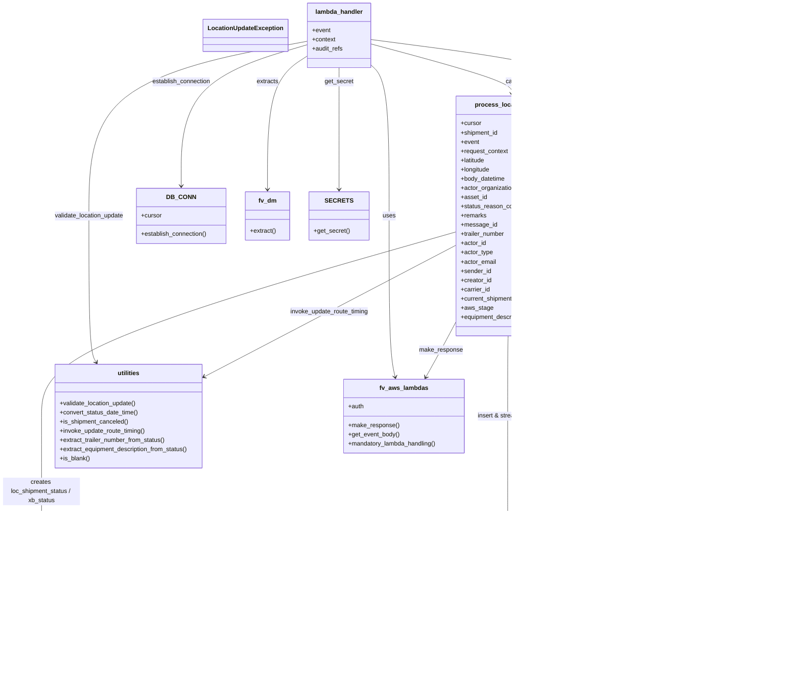

# Diagram: shipment_core/shipment_service/shipment_service/location_update/location_update.py


> Auto-generated by Obscura crawlers

## Diagram 1



### SVG

<svg id="container" width="2062.953125" xmlns="http://www.w3.org/2000/svg" class="classDiagram" height="1782" viewBox="0 0 2062.953125 1782" role="graphics-document document" aria-roledescription="class"><style>#container{font-family:"trebuchet ms",verdana,arial,sans-serif;font-size:16px;fill:#333;}@keyframes edge-animation-frame{from{stroke-dashoffset:0;}}@keyframes dash{to{stroke-dashoffset:0;}}#container .edge-animation-slow{stroke-dasharray:9,5!important;stroke-dashoffset:900;animation:dash 50s linear infinite;stroke-linecap:round;}#container .edge-animation-fast{stroke-dasharray:9,5!important;stroke-dashoffset:900;animation:dash 20s linear infinite;stroke-linecap:round;}#container .error-icon{fill:#552222;}#container .error-text{fill:#552222;stroke:#552222;}#container .edge-thickness-normal{stroke-width:1px;}#container .edge-thickness-thick{stroke-width:3.5px;}#container .edge-pattern-solid{stroke-dasharray:0;}#container .edge-thickness-invisible{stroke-width:0;fill:none;}#container .edge-pattern-dashed{stroke-dasharray:3;}#container .edge-pattern-dotted{stroke-dasharray:2;}#container .marker{fill:#333333;stroke:#333333;}#container .marker.cross{stroke:#333333;}#container svg{font-family:"trebuchet ms",verdana,arial,sans-serif;font-size:16px;}#container p{margin:0;}#container g.classGroup text{fill:#9370DB;stroke:none;font-family:"trebuchet ms",verdana,arial,sans-serif;font-size:10px;}#container g.classGroup text .title{font-weight:bolder;}#container .nodeLabel,#container .edgeLabel{color:#131300;}#container .edgeLabel .label rect{fill:#ECECFF;}#container .label text{fill:#131300;}#container .labelBkg{background:#ECECFF;}#container .edgeLabel .label span{background:#ECECFF;}#container .classTitle{font-weight:bolder;}#container .node rect,#container .node circle,#container .node ellipse,#container .node polygon,#container .node path{fill:#ECECFF;stroke:#9370DB;stroke-width:1px;}#container .divider{stroke:#9370DB;stroke-width:1;}#container g.clickable{cursor:pointer;}#container g.classGroup rect{fill:#ECECFF;stroke:#9370DB;}#container g.classGroup line{stroke:#9370DB;stroke-width:1;}#container .classLabel .box{stroke:none;stroke-width:0;fill:#ECECFF;opacity:0.5;}#container .classLabel .label{fill:#9370DB;font-size:10px;}#container .relation{stroke:#333333;stroke-width:1;fill:none;}#container .dashed-line{stroke-dasharray:3;}#container .dotted-line{stroke-dasharray:1 2;}#container #compositionStart,#container .composition{fill:#333333!important;stroke:#333333!important;stroke-width:1;}#container #compositionEnd,#container .composition{fill:#333333!important;stroke:#333333!important;stroke-width:1;}#container #dependencyStart,#container .dependency{fill:#333333!important;stroke:#333333!important;stroke-width:1;}#container #dependencyStart,#container .dependency{fill:#333333!important;stroke:#333333!important;stroke-width:1;}#container #extensionStart,#container .extension{fill:transparent!important;stroke:#333333!important;stroke-width:1;}#container #extensionEnd,#container .extension{fill:transparent!important;stroke:#333333!important;stroke-width:1;}#container #aggregationStart,#container .aggregation{fill:transparent!important;stroke:#333333!important;stroke-width:1;}#container #aggregationEnd,#container .aggregation{fill:transparent!important;stroke:#333333!important;stroke-width:1;}#container #lollipopStart,#container .lollipop{fill:#ECECFF!important;stroke:#333333!important;stroke-width:1;}#container #lollipopEnd,#container .lollipop{fill:#ECECFF!important;stroke:#333333!important;stroke-width:1;}#container .edgeTerminals{font-size:11px;line-height:initial;}#container .classTitleText{text-anchor:middle;font-size:18px;fill:#333;}#container .label-icon{display:inline-block;height:1em;overflow:visible;vertical-align:-0.125em;}#container .node .label-icon path{fill:currentColor;stroke:revert;stroke-width:revert;}#container :root{--mermaid-font-family:"trebuchet ms",verdana,arial,sans-serif;}</style><g><defs><marker id="container_class-aggregationStart" class="marker aggregation class" refX="18" refY="7" markerWidth="190" markerHeight="240" orient="auto"><path d="M 18,7 L9,13 L1,7 L9,1 Z"></path></marker></defs><defs><marker id="container_class-aggregationEnd" class="marker aggregation class" refX="1" refY="7" markerWidth="20" markerHeight="28" orient="auto"><path d="M 18,7 L9,13 L1,7 L9,1 Z"></path></marker></defs><defs><marker id="container_class-extensionStart" class="marker extension class" refX="18" refY="7" markerWidth="190" markerHeight="240" orient="auto"><path d="M 1,7 L18,13 V 1 Z"></path></marker></defs><defs><marker id="container_class-extensionEnd" class="marker extension class" refX="1" refY="7" markerWidth="20" markerHeight="28" orient="auto"><path d="M 1,1 V 13 L18,7 Z"></path></marker></defs><defs><marker id="container_class-compositionStart" class="marker composition class" refX="18" refY="7" markerWidth="190" markerHeight="240" orient="auto"><path d="M 18,7 L9,13 L1,7 L9,1 Z"></path></marker></defs><defs><marker id="container_class-compositionEnd" class="marker composition class" refX="1" refY="7" markerWidth="20" markerHeight="28" orient="auto"><path d="M 18,7 L9,13 L1,7 L9,1 Z"></path></marker></defs><defs><marker id="container_class-dependencyStart" class="marker dependency class" refX="6" refY="7" markerWidth="190" markerHeight="240" orient="auto"><path d="M 5,7 L9,13 L1,7 L9,1 Z"></path></marker></defs><defs><marker id="container_class-dependencyEnd" class="marker dependency class" refX="13" refY="7" markerWidth="20" markerHeight="28" orient="auto"><path d="M 18,7 L9,13 L14,7 L9,1 Z"></path></marker></defs><defs><marker id="container_class-lollipopStart" class="marker lollipop class" refX="13" refY="7" markerWidth="190" markerHeight="240" orient="auto"><circle stroke="black" fill="transparent" cx="7" cy="7" r="6"></circle></marker></defs><defs><marker id="container_class-lollipopEnd" class="marker lollipop class" refX="1" refY="7" markerWidth="190" markerHeight="240" orient="auto"><circle stroke="black" fill="transparent" cx="7" cy="7" r="6"></circle></marker></defs><g class="root"><g class="clusters"></g><g class="edgePaths"><path d="M963.795,171.455L970.988,178.379C978.182,185.303,992.568,199.152,999.762,264.242C1006.955,329.333,1006.955,445.667,1006.955,562C1006.955,678.333,1006.955,794.667,1009.563,864.524C1012.172,934.381,1017.388,957.763,1019.997,969.453L1022.605,981.144" id="id_lambda_handler_fv_aws_lambdas_1" class="edge-thickness-normal edge-pattern-solid relation" style=";;;" data-edge="true" data-et="edge" data-id="id_lambda_handler_fv_aws_lambdas_1" data-points="W3sieCI6OTYzLjc5NDkyMTg3NSwieSI6MTcxLjQ1NDY2MTI4MDI5ODMyfSx7IngiOjEwMDYuOTU1MDc4MTI1LCJ5IjoyMTN9LHsieCI6MTAwNi45NTUwNzgxMjUsInkiOjU2Mn0seyJ4IjoxMDA2Ljk1NTA3ODEyNSwieSI6OTExfSx7IngiOjEwMjMuOTExNDczNDczODM3MiwieSI6OTg3fV0=" marker-end="url(#container_class-dependencyEnd)"></path><path d="M798.709,147.042L782.223,158.035C765.738,169.028,732.766,191.014,716.281,248.674C699.795,306.333,699.795,399.667,699.795,446.333L699.795,493" id="id_lambda_handler_fv_dm_2" class="edge-thickness-normal edge-pattern-solid relation" style=";;;" data-edge="true" data-et="edge" data-id="id_lambda_handler_fv_dm_2" data-points="W3sieCI6Nzk4LjcwODk4NDM3NSwieSI6MTQ3LjA0MTY3NjUzMzI3MDJ9LHsieCI6Njk5Ljc5NDkyMTg3NSwieSI6MjEzfSx7IngiOjY5OS43OTQ5MjE4NzUsInkiOjQ5OX1d" marker-end="url(#container_class-dependencyEnd)"></path><path d="M881.252,176L881.252,182.167C881.252,188.333,881.252,200.667,881.252,253.5C881.252,306.333,881.252,399.667,881.252,446.333L881.252,493" id="id_lambda_handler_SECRETS_3" class="edge-thickness-normal edge-pattern-solid relation" style=";;;" data-edge="true" data-et="edge" data-id="id_lambda_handler_SECRETS_3" data-points="W3sieCI6ODgxLjI1MTk1MzEyNSwieSI6MTc2fSx7IngiOjg4MS4yNTE5NTMxMjUsInkiOjIxM30seyJ4Ijo4ODEuMjUxOTUzMTI1LCJ5Ijo0OTl9XQ==" marker-end="url(#container_class-dependencyEnd)"></path><path d="M798.709,116.689L745.043,132.741C691.377,148.793,584.045,180.896,530.379,242.115C476.713,303.333,476.713,393.667,476.713,438.833L476.713,484" id="id_lambda_handler_DB_CONN_4" class="edge-thickness-normal edge-pattern-solid relation" style=";;;" data-edge="true" data-et="edge" data-id="id_lambda_handler_DB_CONN_4" data-points="W3sieCI6Nzk4LjcwODk4NDM3NSwieSI6MTE2LjY4OTA4NDc5OTQ0Mzh9LHsieCI6NDc2LjcxMjg5MDYyNSwieSI6MjEzfSx7IngiOjQ3Ni43MTI4OTA2MjUsInkiOjQ5MH1d" marker-end="url(#container_class-dependencyEnd)"></path><path d="M963.795,102.837L1103.641,121.198C1243.487,139.558,1523.179,176.279,1663.025,252.806C1802.871,329.333,1802.871,445.667,1802.871,562C1802.871,678.333,1802.871,794.667,1809.677,868.087C1816.483,941.507,1830.094,972.014,1836.9,987.267L1843.705,1002.521" id="id_lambda_handler_db_no_orm_5" class="edge-thickness-normal edge-pattern-solid relation" style=";;;" data-edge="true" data-et="edge" data-id="id_lambda_handler_db_no_orm_5" data-points="W3sieCI6OTYzLjc5NDkyMTg3NSwieSI6MTAyLjgzNzEyMjE2NzM4MTJ9LHsieCI6MTgwMi44NzEwOTM3NSwieSI6MjEzfSx7IngiOjE4MDIuODcxMDkzNzUsInkiOjU2Mn0seyJ4IjoxODAyLjg3MTA5Mzc1LCJ5Ijo5MTF9LHsieCI6MTg0Ni4xNTAxMTgwOTU5MzAzLCJ5IjoxMDA4fV0=" marker-end="url(#container_class-dependencyEnd)"></path><path d="M798.709,107.425L704.551,125.021C610.393,142.617,422.076,177.808,327.918,253.571C233.76,329.333,233.76,445.667,233.76,562C233.76,678.333,233.76,794.667,237.028,858.148C240.296,921.63,246.832,932.259,250.1,937.574L253.368,942.889" id="id_lambda_handler_utilities_6" class="edge-thickness-normal edge-pattern-solid relation" style=";;;" data-edge="true" data-et="edge" data-id="id_lambda_handler_utilities_6" data-points="W3sieCI6Nzk4LjcwODk4NDM3NSwieSI6MTA3LjQyNTIwNDIxMzM3MTN9LHsieCI6MjMzLjc1OTc2NTYyNSwieSI6MjEzfSx7IngiOjIzMy43NTk3NjU2MjUsInkiOjU2Mn0seyJ4IjoyMzMuNzU5NzY1NjI1LCJ5Ijo5MTF9LHsieCI6MjU2LjUxMDQxMjg4MTU0MDcsInkiOjk0OH1d" marker-end="url(#container_class-dependencyEnd)"></path><path d="M963.795,114.479L1024.09,130.899C1084.384,147.319,1204.973,180.16,1265.268,201.747C1325.563,223.333,1325.563,233.667,1325.563,238.833L1325.563,244" id="id_lambda_handler_process_location_update_7" class="edge-thickness-normal edge-pattern-solid relation" style=";;;" data-edge="true" data-et="edge" data-id="id_lambda_handler_process_location_update_7" data-points="W3sieCI6OTYzLjc5NDkyMTg3NSwieSI6MTE0LjQ3OTA5NTUwODc1NDM0fSx7IngiOjEzMjUuNTYyNSwieSI6MjEzfSx7IngiOjEzMjUuNTYyNSwieSI6MjUwfV0=" marker-end="url(#container_class-dependencyEnd)"></path><path d="M1461.413,874L1464.098,880.167C1466.783,886.333,1472.153,898.667,1474.838,933.5C1477.523,968.333,1477.523,1025.667,1477.523,1087C1477.523,1148.333,1477.523,1213.667,1490.6,1256.163C1503.677,1298.66,1529.83,1318.319,1542.907,1328.149L1555.983,1337.979" id="id_process_location_update_tables__Shipments_8" class="edge-thickness-normal edge-pattern-solid relation" style=";;;" data-edge="true" data-et="edge" data-id="id_process_location_update_tables__Shipments_8" data-points="W3sieCI6MTQ2MS40MTI5NjU2MTYwNDU4LCJ5Ijo4NzR9LHsieCI6MTQ3Ny41MjM0Mzc1LCJ5Ijo5MTF9LHsieCI6MTQ3Ny41MjM0Mzc1LCJ5IjoxMDgzfSx7IngiOjE0NzcuNTIzNDM3NSwieSI6MTI3OX0seyJ4IjoxNTYwLjc3OTI5Njg3NSwieSI6MTM0MS41ODQxNzczMDM5Njk3fV0=" marker-end="url(#container_class-dependencyEnd)"></path><path d="M1472.348,643.212L1553.016,687.843C1633.684,732.475,1795.02,821.737,1868.882,881.622C1942.744,941.507,1929.133,972.014,1922.327,987.267L1915.521,1002.521" id="id_process_location_update_db_no_orm_9" class="edge-thickness-normal edge-pattern-solid relation" style=";;;" data-edge="true" data-et="edge" data-id="id_process_location_update_db_no_orm_9" data-points="W3sieCI6MTQ3Mi4zNDc2NTYyNSwieSI6NjQzLjIxMjA5NjYyOTM2NjZ9LHsieCI6MTk1Ni4zNTU0Njg3NSwieSI6OTExfSx7IngiOjE5MTMuMDc2NDQ0NDA0MDY5NywieSI6MTAwOH1d" marker-end="url(#container_class-dependencyEnd)"></path><path d="M1178.777,604.074L1000.314,655.229C821.852,706.383,464.926,808.691,286.463,888.512C108,968.333,108,1025.667,108,1087C108,1148.333,108,1213.667,108,1272.5C108,1331.333,108,1383.667,108,1432C108,1480.333,108,1524.667,273.527,1564.913C439.053,1605.158,770.107,1641.317,935.634,1659.396L1101.16,1677.475" id="id_process_location_update_tables__ShipmentStatus_10" class="edge-thickness-normal edge-pattern-solid relation" style=";;;" data-edge="true" data-et="edge" data-id="id_process_location_update_tables__ShipmentStatus_10" data-points="W3sieCI6MTE3OC43NzczNDM3NSwieSI6NjA0LjA3NDI0MjIxMDM1ODh9LHsieCI6MTA4LCJ5Ijo5MTF9LHsieCI6MTA4LCJ5IjoxMDgzfSx7IngiOjEwOCwieSI6MTI3OX0seyJ4IjoxMDgsInkiOjE0MzZ9LHsieCI6MTA4LCJ5IjoxNTY5fSx7IngiOjExMDcuMTI1LCJ5IjoxNjc4LjEyNjc2NDMzNzcyMzJ9XQ==" marker-end="url(#container_class-dependencyEnd)"></path><path d="M1319.355,874L1319.233,880.167C1319.11,886.333,1318.865,898.667,1318.742,933.5C1318.619,968.333,1318.619,1025.667,1318.619,1087C1318.619,1148.333,1318.619,1213.667,1318.619,1259C1318.619,1304.333,1318.619,1329.667,1318.619,1342.333L1318.619,1355" id="id_process_location_update_StreamableShipmentStatus_11" class="edge-thickness-normal edge-pattern-solid relation" style=";;;" data-edge="true" data-et="edge" data-id="id_process_location_update_StreamableShipmentStatus_11" data-points="W3sieCI6MTMxOS4zNTUyNTYwODg4MjUyLCJ5Ijo4NzR9LHsieCI6MTMxOC42MTkxNDA2MjUsInkiOjkxMX0seyJ4IjoxMzE4LjYxOTE0MDYyNSwieSI6MTA4M30seyJ4IjoxMzE4LjYxOTE0MDYyNSwieSI6MTI3OX0seyJ4IjoxMzE4LjYxOTE0MDYyNSwieSI6MTM2MX1d" marker-end="url(#container_class-dependencyEnd)"></path><path d="M1472.348,747.101L1494.01,774.417C1515.672,801.734,1558.996,856.367,1580.658,912.35C1602.32,968.333,1602.32,1025.667,1602.32,1087C1602.32,1148.333,1602.32,1213.667,1607.292,1255.618C1612.263,1297.57,1622.206,1316.14,1627.177,1325.425L1632.149,1334.71" id="id_process_location_update_tables__Shipments_12" class="edge-thickness-normal edge-pattern-solid relation" style=";;;" data-edge="true" data-et="edge" data-id="id_process_location_update_tables__Shipments_12" data-points="W3sieCI6MTQ3Mi4zNDc2NTYyNSwieSI6NzQ3LjEwMDUzNjM0NDM4OTV9LHsieCI6MTYwMi4zMjAzMTI1LCJ5Ijo5MTF9LHsieCI6MTYwMi4zMjAzMTI1LCJ5IjoxMDgzfSx7IngiOjE2MDIuMzIwMzEyNSwieSI6MTI3OX0seyJ4IjoxNjM0Ljk4MDc3OTc1NzE2NTcsInkiOjEzNDB9XQ==" marker-end="url(#container_class-dependencyEnd)"></path><path d="M1178.777,639.471L1093.033,684.726C1007.289,729.981,835.801,820.49,729.561,876.599C623.322,932.707,582.332,954.414,561.837,965.268L541.341,976.122" id="id_process_location_update_utilities_13" class="edge-thickness-normal edge-pattern-solid relation" style=";;;" data-edge="true" data-et="edge" data-id="id_process_location_update_utilities_13" data-points="W3sieCI6MTE3OC43NzczNDM3NSwieSI6NjM5LjQ3MTQ4NTExMzQyMTV9LHsieCI6NjY0LjMxMjUsInkiOjkxMX0seyJ4Ijo1MzYuMDM5MDYyNSwieSI6OTc4LjkyOTUyMjQxMjExMzR9XQ==" marker-end="url(#container_class-dependencyEnd)"></path><path d="M1178.777,843.53L1172.914,854.775C1167.051,866.02,1155.326,888.51,1142.722,911.553C1130.118,934.597,1116.636,958.194,1109.895,969.992L1103.155,981.79" id="id_process_location_update_fv_aws_lambdas_14" class="edge-thickness-normal edge-pattern-solid relation" style=";;;" data-edge="true" data-et="edge" data-id="id_process_location_update_fv_aws_lambdas_14" data-points="W3sieCI6MTE3OC43NzczNDM3NSwieSI6ODQzLjUzMDAzODEwNDQzODN9LHsieCI6MTE0My41OTk2MDkzNzUsInkiOjkxMX0seyJ4IjoxMTAwLjE3ODE4ODU5MDExNjIsInkiOjk4N31d" marker-end="url(#container_class-dependencyEnd)"></path><path d="M1318.619,1511L1318.619,1520.667C1318.619,1530.333,1318.619,1549.667,1314.028,1564.738C1309.437,1579.809,1300.255,1590.618,1295.664,1596.023L1291.073,1601.427" id="id_StreamableShipmentStatus_tables__ShipmentStatus_15" class="edge-thickness-normal edge-pattern-solid relation" style=";;;" data-edge="true" data-et="edge" data-id="id_StreamableShipmentStatus_tables__ShipmentStatus_15" data-points="W3sieCI6MTMxOC42MTkxNDA2MjUsInkiOjE1MTF9LHsieCI6MTMxOC42MTkxNDA2MjUsInkiOjE1Njl9LHsieCI6MTI4Ny4xODgzNzE2NDI1NjIsInkiOjE2MDZ9XQ==" marker-end="url(#container_class-dependencyEnd)"></path><path d="M1686.381,1532L1686.381,1538.167C1686.381,1544.333,1686.381,1556.667,1627.042,1578.092C1567.704,1599.517,1449.027,1630.035,1389.688,1645.293L1330.35,1660.552" id="id_tables__Shipments_tables__ShipmentStatus_16" class="edge-thickness-normal edge-pattern-solid relation" style=";;;" data-edge="true" data-et="edge" data-id="id_tables__Shipments_tables__ShipmentStatus_16" data-points="W3sieCI6MTY4Ni4zODA4NTkzNzUsInkiOjE1MzJ9LHsieCI6MTY4Ni4zODA4NTkzNzUsInkiOjE1Njl9LHsieCI6MTMyNC41MzkwNjI1LCJ5IjoxNjYyLjA0NjM2Mzc0NTc5MjJ9XQ==" marker-end="url(#container_class-dependencyEnd)"></path><path d="M1879.613,1158L1879.613,1178.167C1879.613,1198.333,1879.613,1238.667,1867.876,1268.369C1856.14,1298.072,1832.666,1317.144,1820.929,1326.68L1809.192,1336.216" id="id_db_no_orm_tables__Shipments_17" class="edge-thickness-normal edge-pattern-solid relation" style=";;;" data-edge="true" data-et="edge" data-id="id_db_no_orm_tables__Shipments_17" data-points="W3sieCI6MTg3OS42MTMyODEyNSwieSI6MTE1OH0seyJ4IjoxODc5LjYxMzI4MTI1LCJ5IjoxMjc5fSx7IngiOjE4MDQuNTM1NzE2MDYyODk4LCJ5IjoxMzQwfV0=" marker-end="url(#container_class-dependencyEnd)"></path></g><g class="edgeLabels"><g class="edgeLabel" transform="translate(1006.955078125, 562)"><g class="label" data-id="id_lambda_handler_fv_aws_lambdas_1" transform="translate(-16.4921875, -12)"><foreignObject width="32.984375" height="24"><div xmlns="http://www.w3.org/1999/xhtml" class="labelBkg" style="display: table-cell; white-space: nowrap; line-height: 1.5; max-width: 200px; text-align: center;"><span class="edgeLabel"><p>uses</p></span></div></foreignObject></g></g><g class="edgeLabel" transform="translate(699.794921875, 213)"><g class="label" data-id="id_lambda_handler_fv_dm_2" transform="translate(-28.6640625, -12)"><foreignObject width="57.328125" height="24"><div xmlns="http://www.w3.org/1999/xhtml" class="labelBkg" style="display: table-cell; white-space: nowrap; line-height: 1.5; max-width: 200px; text-align: center;"><span class="edgeLabel"><p>extracts</p></span></div></foreignObject></g></g><g class="edgeLabel" transform="translate(881.251953125, 213)"><g class="label" data-id="id_lambda_handler_SECRETS_3" transform="translate(-37.4609375, -12)"><foreignObject width="74.921875" height="24"><div xmlns="http://www.w3.org/1999/xhtml" class="labelBkg" style="display: table-cell; white-space: nowrap; line-height: 1.5; max-width: 200px; text-align: center;"><span class="edgeLabel"><p>get_secret</p></span></div></foreignObject></g></g><g class="edgeLabel" transform="translate(476.712890625, 213)"><g class="label" data-id="id_lambda_handler_DB_CONN_4" transform="translate(-77.4609375, -12)"><foreignObject width="154.921875" height="24"><div xmlns="http://www.w3.org/1999/xhtml" class="labelBkg" style="display: table-cell; white-space: nowrap; line-height: 1.5; max-width: 200px; text-align: center;"><span class="edgeLabel"><p>establish_connection</p></span></div></foreignObject></g></g><g class="edgeLabel" transform="translate(1802.87109375, 562)"><g class="label" data-id="id_lambda_handler_db_no_orm_5" transform="translate(-122.578125, -12)"><foreignObject width="245.15625" height="24"><div xmlns="http://www.w3.org/1999/xhtml" class="labelBkg" style="display: table; white-space: break-spaces; line-height: 1.5; max-width: 200px; text-align: center; width: 200px;"><span class="edgeLabel"><p>get_existing_shipments_by_db_id</p></span></div></foreignObject></g></g><g class="edgeLabel" transform="translate(233.759765625, 562)"><g class="label" data-id="id_lambda_handler_utilities_6" transform="translate(-92.1171875, -12)"><foreignObject width="184.234375" height="24"><div xmlns="http://www.w3.org/1999/xhtml" class="labelBkg" style="display: table-cell; white-space: nowrap; line-height: 1.5; max-width: 200px; text-align: center;"><span class="edgeLabel"><p>validate_location_update</p></span></div></foreignObject></g></g><g class="edgeLabel" transform="translate(1325.5625, 213)"><g class="label" data-id="id_lambda_handler_process_location_update_7" transform="translate(-16.4453125, -12)"><foreignObject width="32.890625" height="24"><div xmlns="http://www.w3.org/1999/xhtml" class="labelBkg" style="display: table-cell; white-space: nowrap; line-height: 1.5; max-width: 200px; text-align: center;"><span class="edgeLabel"><p>calls</p></span></div></foreignObject></g></g><g class="edgeLabel" transform="translate(1477.5234375, 1083)"><g class="label" data-id="id_process_location_update_tables__Shipments_8" transform="translate(-37.84375, -12)"><foreignObject width="75.6875" height="24"><div xmlns="http://www.w3.org/1999/xhtml" class="labelBkg" style="display: table-cell; white-space: nowrap; line-height: 1.5; max-width: 200px; text-align: center;"><span class="edgeLabel"><p>constructs</p></span></div></foreignObject></g></g><g class="edgeLabel" transform="translate(1760.82177, 802.81671)"><g class="label" data-id="id_process_location_update_db_no_orm_9" transform="translate(-133.484375, -12)"><foreignObject width="266.96875" height="24"><div xmlns="http://www.w3.org/1999/xhtml" class="labelBkg" style="display: table; white-space: break-spaces; line-height: 1.5; max-width: 200px; text-align: center; width: 200px;"><span class="edgeLabel"><p>update_shipment_status_details_loc</p></span></div></foreignObject></g></g><g class="edgeLabel" transform="translate(108, 1279)"><g class="label" data-id="id_process_location_update_tables__ShipmentStatus_10" transform="translate(-100, -36)"><foreignObject width="200" height="72"><div xmlns="http://www.w3.org/1999/xhtml" class="labelBkg" style="display: table; white-space: break-spaces; line-height: 1.5; max-width: 200px; text-align: center; width: 200px;"><span class="edgeLabel"><p>creates loc_shipment_status / xb_status</p></span></div></foreignObject></g></g><g class="edgeLabel" transform="translate(1318.619140625, 1083)"><g class="label" data-id="id_process_location_update_StreamableShipmentStatus_11" transform="translate(-80.21875, -12)"><foreignObject width="160.4375" height="24"><div xmlns="http://www.w3.org/1999/xhtml" class="labelBkg" style="display: table-cell; white-space: nowrap; line-height: 1.5; max-width: 200px; text-align: center;"><span class="edgeLabel"><p>insert &amp; stream_event</p></span></div></foreignObject></g></g><g class="edgeLabel" transform="translate(1602.3203125, 1083)"><g class="label" data-id="id_process_location_update_tables__Shipments_12" transform="translate(-66.953125, -12)"><foreignObject width="133.90625" height="24"><div xmlns="http://www.w3.org/1999/xhtml" class="labelBkg" style="display: table-cell; white-space: nowrap; line-height: 1.5; max-width: 200px; text-align: center;"><span class="edgeLabel"><p>shipment.update()</p></span></div></foreignObject></g></g><g class="edgeLabel" transform="translate(857.36102, 809.11125)"><g class="label" data-id="id_process_location_update_utilities_13" transform="translate(-103.609375, -12)"><foreignObject width="207.21875" height="24"><div xmlns="http://www.w3.org/1999/xhtml" class="labelBkg" style="display: table; white-space: break-spaces; line-height: 1.5; max-width: 200px; text-align: center; width: 200px;"><span class="edgeLabel"><p>invoke_update_route_timing</p></span></div></foreignObject></g></g><g class="edgeLabel" transform="translate(1140.76213, 915.96641)"><g class="label" data-id="id_process_location_update_fv_aws_lambdas_14" transform="translate(-56.75, -12)"><foreignObject width="113.5" height="24"><div xmlns="http://www.w3.org/1999/xhtml" class="labelBkg" style="display: table-cell; white-space: nowrap; line-height: 1.5; max-width: 200px; text-align: center;"><span class="edgeLabel"><p>make_response</p></span></div></foreignObject></g></g><g class="edgeLabel" transform="translate(1318.619140625, 1569)"><g class="label" data-id="id_StreamableShipmentStatus_tables__ShipmentStatus_15" transform="translate(-21.390625, -12)"><foreignObject width="42.78125" height="24"><div xmlns="http://www.w3.org/1999/xhtml" class="labelBkg" style="display: table-cell; white-space: nowrap; line-height: 1.5; max-width: 200px; text-align: center;"><span class="edgeLabel"><p>wraps</p></span></div></foreignObject></g></g><g class="edgeLabel" transform="translate(1686.380859375, 1569)"><g class="label" data-id="id_tables__Shipments_tables__ShipmentStatus_16" transform="translate(-24.734375, -12)"><foreignObject width="49.46875" height="24"><div xmlns="http://www.w3.org/1999/xhtml" class="labelBkg" style="display: table-cell; white-space: nowrap; line-height: 1.5; max-width: 200px; text-align: center;"><span class="edgeLabel"><p>relates</p></span></div></foreignObject></g></g><g class="edgeLabel" transform="translate(1879.61328125, 1279)"><g class="label" data-id="id_db_no_orm_tables__Shipments_17" transform="translate(-45.9453125, -12)"><foreignObject width="91.890625" height="24"><div xmlns="http://www.w3.org/1999/xhtml" class="labelBkg" style="display: table-cell; white-space: nowrap; line-height: 1.5; max-width: 200px; text-align: center;"><span class="edgeLabel"><p>reads/writes</p></span></div></foreignObject></g></g></g><g class="nodes"><g class="node default" id="classId-LocationUpdateException-0" transform="translate(643.138671875, 92)"><g class="basic label-container"><path d="M-105.5703125 -42 L105.5703125 -42 L105.5703125 42 L-105.5703125 42" stroke="none" stroke-width="0" fill="#ECECFF" style=""></path><path d="M-105.5703125 -42 C-27.45729385401819 -42, 50.65572479196362 -42, 105.5703125 -42 M-105.5703125 -42 C-44.60893604573638 -42, 16.352440408527244 -42, 105.5703125 -42 M105.5703125 -42 C105.5703125 -16.93335038146742, 105.5703125 8.13329923706516, 105.5703125 42 M105.5703125 -42 C105.5703125 -17.190891094829222, 105.5703125 7.618217810341555, 105.5703125 42 M105.5703125 42 C37.10906531972876 42, -31.352181860542487 42, -105.5703125 42 M105.5703125 42 C22.368930403697206 42, -60.83245169260559 42, -105.5703125 42 M-105.5703125 42 C-105.5703125 15.09838372189434, -105.5703125 -11.80323255621132, -105.5703125 -42 M-105.5703125 42 C-105.5703125 8.72837616266792, -105.5703125 -24.54324767466416, -105.5703125 -42" stroke="#9370DB" stroke-width="1.3" fill="none" stroke-dasharray="0 0" style=""></path></g><g class="annotation-group text" transform="translate(0, -18)"></g><g class="label-group text" transform="translate(-93.5703125, -18)"><g class="label" style="font-weight: bolder" transform="translate(0,-12)"><foreignObject width="187.140625" height="24"><div xmlns="http://www.w3.org/1999/xhtml" style="display: table-cell; white-space: nowrap; line-height: 1.5; max-width: 235px; text-align: center;"><span class="nodeLabel markdown-node-label" style=""><p>LocationUpdateException</p></span></div></foreignObject></g></g><g class="members-group text" transform="translate(-93.5703125, 30)"></g><g class="methods-group text" transform="translate(-93.5703125, 60)"></g><g class="divider" style=""><path d="M-105.5703125 6 C-52.78093268275364 6, 0.008447134492726605 6, 105.5703125 6 M-105.5703125 6 C-52.20805777407718 6, 1.154196951845634 6, 105.5703125 6" stroke="#9370DB" stroke-width="1.3" fill="none" stroke-dasharray="0 0" style=""></path></g><g class="divider" style=""><path d="M-105.5703125 24 C-37.95169281423799 24, 29.666926871524026 24, 105.5703125 24 M-105.5703125 24 C-40.37972749471287 24, 24.810857510574266 24, 105.5703125 24" stroke="#9370DB" stroke-width="1.3" fill="none" stroke-dasharray="0 0" style=""></path></g></g><g class="node default" id="classId-lambda_handler-1" transform="translate(881.251953125, 92)"><g class="basic label-container"><path d="M-82.54296875 -84 L82.54296875 -84 L82.54296875 84 L-82.54296875 84" stroke="none" stroke-width="0" fill="#ECECFF" style=""></path><path d="M-82.54296875 -84 C-32.29989285257316 -84, 17.943183044853683 -84, 82.54296875 -84 M-82.54296875 -84 C-22.202985265075526 -84, 38.13699821984895 -84, 82.54296875 -84 M82.54296875 -84 C82.54296875 -32.89696625780381, 82.54296875 18.206067484392378, 82.54296875 84 M82.54296875 -84 C82.54296875 -37.83878006426813, 82.54296875 8.322439871463743, 82.54296875 84 M82.54296875 84 C38.29909708035021 84, -5.944774589299584 84, -82.54296875 84 M82.54296875 84 C17.345441430288204 84, -47.85208588942359 84, -82.54296875 84 M-82.54296875 84 C-82.54296875 24.322601898384818, -82.54296875 -35.354796203230364, -82.54296875 -84 M-82.54296875 84 C-82.54296875 25.879127207735756, -82.54296875 -32.24174558452849, -82.54296875 -84" stroke="#9370DB" stroke-width="1.3" fill="none" stroke-dasharray="0 0" style=""></path></g><g class="annotation-group text" transform="translate(0, -60)"></g><g class="label-group text" transform="translate(-59.9765625, -60)"><g class="label" style="font-weight: bolder" transform="translate(0,-12)"><foreignObject width="119.953125" height="24"><div xmlns="http://www.w3.org/1999/xhtml" style="display: table-cell; white-space: nowrap; line-height: 1.5; max-width: 170px; text-align: center;"><span class="nodeLabel markdown-node-label" style=""><p>lambda_handler</p></span></div></foreignObject></g></g><g class="members-group text" transform="translate(-70.54296875, -12)"><g class="label" style="" transform="translate(0,-12)"><foreignObject width="48.328125" height="24"><div xmlns="http://www.w3.org/1999/xhtml" style="display: table-cell; white-space: nowrap; line-height: 1.5; max-width: 106px; text-align: center;"><span class="nodeLabel markdown-node-label" style=""><p>+event</p></span></div></foreignObject></g><g class="label" style="" transform="translate(0,12)"><foreignObject width="61.6875" height="24"><div xmlns="http://www.w3.org/1999/xhtml" style="display: table-cell; white-space: nowrap; line-height: 1.5; max-width: 119px; text-align: center;"><span class="nodeLabel markdown-node-label" style=""><p>+context</p></span></div></foreignObject></g><g class="label" style="" transform="translate(0,36)"><foreignObject width="81.109375" height="24"><div xmlns="http://www.w3.org/1999/xhtml" style="display: table-cell; white-space: nowrap; line-height: 1.5; max-width: 138px; text-align: center;"><span class="nodeLabel markdown-node-label" style=""><p>+audit_refs</p></span></div></foreignObject></g></g><g class="methods-group text" transform="translate(-70.54296875, 84)"></g><g class="divider" style=""><path d="M-82.54296875 -36 C-39.97493219103253 -36, 2.5931043679349415 -36, 82.54296875 -36 M-82.54296875 -36 C-45.148361364539106 -36, -7.753753979078212 -36, 82.54296875 -36" stroke="#9370DB" stroke-width="1.3" fill="none" stroke-dasharray="0 0" style=""></path></g><g class="divider" style=""><path d="M-82.54296875 60 C-48.62557371531343 60, -14.708178680626858 60, 82.54296875 60 M-82.54296875 60 C-18.750578485684933 60, 45.041811778630134 60, 82.54296875 60" stroke="#9370DB" stroke-width="1.3" fill="none" stroke-dasharray="0 0" style=""></path></g></g><g class="node default" id="classId-process_location_update-2" transform="translate(1325.5625, 562)"><g class="basic label-container"><path d="M-146.78515625 -312 L146.78515625 -312 L146.78515625 312 L-146.78515625 312" stroke="none" stroke-width="0" fill="#ECECFF" style=""></path><path d="M-146.78515625 -312 C-65.79185973037357 -312, 15.201436789252853 -312, 146.78515625 -312 M-146.78515625 -312 C-65.7207534261555 -312, 15.343649397689006 -312, 146.78515625 -312 M146.78515625 -312 C146.78515625 -120.16442371624083, 146.78515625 71.67115256751833, 146.78515625 312 M146.78515625 -312 C146.78515625 -136.4397942379157, 146.78515625 39.12041152416862, 146.78515625 312 M146.78515625 312 C57.68517085574257 312, -31.41481453851486 312, -146.78515625 312 M146.78515625 312 C38.32525767201167 312, -70.13464090597665 312, -146.78515625 312 M-146.78515625 312 C-146.78515625 87.90043481763138, -146.78515625 -136.19913036473724, -146.78515625 -312 M-146.78515625 312 C-146.78515625 80.48303935762144, -146.78515625 -151.03392128475713, -146.78515625 -312" stroke="#9370DB" stroke-width="1.3" fill="none" stroke-dasharray="0 0" style=""></path></g><g class="annotation-group text" transform="translate(0, -288)"></g><g class="label-group text" transform="translate(-91.7734375, -288)"><g class="label" style="font-weight: bolder" transform="translate(0,-12)"><foreignObject width="183.546875" height="24"><div xmlns="http://www.w3.org/1999/xhtml" style="display: table-cell; white-space: nowrap; line-height: 1.5; max-width: 232px; text-align: center;"><span class="nodeLabel markdown-node-label" style=""><p>process_location_update</p></span></div></foreignObject></g></g><g class="members-group text" transform="translate(-134.78515625, -240)"><g class="label" style="" transform="translate(0,-12)"><foreignObject width="53.71875" height="24"><div xmlns="http://www.w3.org/1999/xhtml" style="display: table-cell; white-space: nowrap; line-height: 1.5; max-width: 112px; text-align: center;"><span class="nodeLabel markdown-node-label" style=""><p>+cursor</p></span></div></foreignObject></g><g class="label" style="" transform="translate(0,12)"><foreignObject width="98.84375" height="24"><div xmlns="http://www.w3.org/1999/xhtml" style="display: table-cell; white-space: nowrap; line-height: 1.5; max-width: 156px; text-align: center;"><span class="nodeLabel markdown-node-label" style=""><p>+shipment_id</p></span></div></foreignObject></g><g class="label" style="" transform="translate(0,36)"><foreignObject width="48.328125" height="24"><div xmlns="http://www.w3.org/1999/xhtml" style="display: table-cell; white-space: nowrap; line-height: 1.5; max-width: 106px; text-align: center;"><span class="nodeLabel markdown-node-label" style=""><p>+event</p></span></div></foreignObject></g><g class="label" style="" transform="translate(0,60)"><foreignObject width="124.953125" height="24"><div xmlns="http://www.w3.org/1999/xhtml" style="display: table-cell; white-space: nowrap; line-height: 1.5; max-width: 183px; text-align: center;"><span class="nodeLabel markdown-node-label" style=""><p>+request_context</p></span></div></foreignObject></g><g class="label" style="" transform="translate(0,84)"><foreignObject width="64.96875" height="24"><div xmlns="http://www.w3.org/1999/xhtml" style="display: table-cell; white-space: nowrap; line-height: 1.5; max-width: 122px; text-align: center;"><span class="nodeLabel markdown-node-label" style=""><p>+latitude</p></span></div></foreignObject></g><g class="label" style="" transform="translate(0,108)"><foreignObject width="77.53125" height="24"><div xmlns="http://www.w3.org/1999/xhtml" style="display: table-cell; white-space: nowrap; line-height: 1.5; max-width: 135px; text-align: center;"><span class="nodeLabel markdown-node-label" style=""><p>+longitude</p></span></div></foreignObject></g><g class="label" style="" transform="translate(0,132)"><foreignObject width="117.046875" height="24"><div xmlns="http://www.w3.org/1999/xhtml" style="display: table-cell; white-space: nowrap; line-height: 1.5; max-width: 174px; text-align: center;"><span class="nodeLabel markdown-node-label" style=""><p>+body_datetime</p></span></div></foreignObject></g><g class="label" style="" transform="translate(0,156)"><foreignObject width="164.625" height="24"><div xmlns="http://www.w3.org/1999/xhtml" style="display: table-cell; white-space: nowrap; line-height: 1.5; max-width: 222px; text-align: center;"><span class="nodeLabel markdown-node-label" style=""><p>+actor_organization_id</p></span></div></foreignObject></g><g class="label" style="" transform="translate(0,180)"><foreignObject width="67.96875" height="24"><div xmlns="http://www.w3.org/1999/xhtml" style="display: table-cell; white-space: nowrap; line-height: 1.5; max-width: 125px; text-align: center;"><span class="nodeLabel markdown-node-label" style=""><p>+asset_id</p></span></div></foreignObject></g><g class="label" style="" transform="translate(0,204)"><foreignObject width="152.34375" height="24"><div xmlns="http://www.w3.org/1999/xhtml" style="display: table-cell; white-space: nowrap; line-height: 1.5; max-width: 210px; text-align: center;"><span class="nodeLabel markdown-node-label" style=""><p>+status_reason_code</p></span></div></foreignObject></g><g class="label" style="" transform="translate(0,228)"><foreignObject width="66.578125" height="24"><div xmlns="http://www.w3.org/1999/xhtml" style="display: table-cell; white-space: nowrap; line-height: 1.5; max-width: 124px; text-align: center;"><span class="nodeLabel markdown-node-label" style=""><p>+remarks</p></span></div></foreignObject></g><g class="label" style="" transform="translate(0,252)"><foreignObject width="92.453125" height="24"><div xmlns="http://www.w3.org/1999/xhtml" style="display: table-cell; white-space: nowrap; line-height: 1.5; max-width: 150px; text-align: center;"><span class="nodeLabel markdown-node-label" style=""><p>+message_id</p></span></div></foreignObject></g><g class="label" style="" transform="translate(0,276)"><foreignObject width="115.859375" height="24"><div xmlns="http://www.w3.org/1999/xhtml" style="display: table-cell; white-space: nowrap; line-height: 1.5; max-width: 174px; text-align: center;"><span class="nodeLabel markdown-node-label" style=""><p>+trailer_number</p></span></div></foreignObject></g><g class="label" style="" transform="translate(0,300)"><foreignObject width="66.28125" height="24"><div xmlns="http://www.w3.org/1999/xhtml" style="display: table-cell; white-space: nowrap; line-height: 1.5; max-width: 124px; text-align: center;"><span class="nodeLabel markdown-node-label" style=""><p>+actor_id</p></span></div></foreignObject></g><g class="label" style="" transform="translate(0,324)"><foreignObject width="83.671875" height="24"><div xmlns="http://www.w3.org/1999/xhtml" style="display: table-cell; white-space: nowrap; line-height: 1.5; max-width: 141px; text-align: center;"><span class="nodeLabel markdown-node-label" style=""><p>+actor_type</p></span></div></foreignObject></g><g class="label" style="" transform="translate(0,348)"><foreignObject width="92.21875" height="24"><div xmlns="http://www.w3.org/1999/xhtml" style="display: table-cell; white-space: nowrap; line-height: 1.5; max-width: 150px; text-align: center;"><span class="nodeLabel markdown-node-label" style=""><p>+actor_email</p></span></div></foreignObject></g><g class="label" style="" transform="translate(0,372)"><foreignObject width="79.140625" height="24"><div xmlns="http://www.w3.org/1999/xhtml" style="display: table-cell; white-space: nowrap; line-height: 1.5; max-width: 137px; text-align: center;"><span class="nodeLabel markdown-node-label" style=""><p>+sender_id</p></span></div></foreignObject></g><g class="label" style="" transform="translate(0,396)"><foreignObject width="80.78125" height="24"><div xmlns="http://www.w3.org/1999/xhtml" style="display: table-cell; white-space: nowrap; line-height: 1.5; max-width: 138px; text-align: center;"><span class="nodeLabel markdown-node-label" style=""><p>+creator_id</p></span></div></foreignObject></g><g class="label" style="" transform="translate(0,420)"><foreignObject width="77.0625" height="24"><div xmlns="http://www.w3.org/1999/xhtml" style="display: table-cell; white-space: nowrap; line-height: 1.5; max-width: 134px; text-align: center;"><span class="nodeLabel markdown-node-label" style=""><p>+carrier_id</p></span></div></foreignObject></g><g class="label" style="" transform="translate(0,444)"><foreignObject width="137.296875" height="24"><div xmlns="http://www.w3.org/1999/xhtml" style="display: table-cell; white-space: nowrap; line-height: 1.5; max-width: 195px; text-align: center;"><span class="nodeLabel markdown-node-label" style=""><p>+current_shipment</p></span></div></foreignObject></g><g class="label" style="" transform="translate(0,468)"><foreignObject width="81.78125" height="24"><div xmlns="http://www.w3.org/1999/xhtml" style="display: table-cell; white-space: nowrap; line-height: 1.5; max-width: 139px; text-align: center;"><span class="nodeLabel markdown-node-label" style=""><p>+aws_stage</p></span></div></foreignObject></g><g class="label" style="" transform="translate(0,492)"><foreignObject width="177.796875" height="24"><div xmlns="http://www.w3.org/1999/xhtml" style="display: table-cell; white-space: nowrap; line-height: 1.5; max-width: 235px; text-align: center;"><span class="nodeLabel markdown-node-label" style=""><p>+equipment_description</p></span></div></foreignObject></g></g><g class="methods-group text" transform="translate(-134.78515625, 312)"></g><g class="divider" style=""><path d="M-146.78515625 -264 C-55.6419462199289 -264, 35.501263810142206 -264, 146.78515625 -264 M-146.78515625 -264 C-71.4445032602422 -264, 3.8961497295155993 -264, 146.78515625 -264" stroke="#9370DB" stroke-width="1.3" fill="none" stroke-dasharray="0 0" style=""></path></g><g class="divider" style=""><path d="M-146.78515625 288 C-85.3965554299853 288, -24.007954609970596 288, 146.78515625 288 M-146.78515625 288 C-41.15731340419188 288, 64.47052944161624 288, 146.78515625 288" stroke="#9370DB" stroke-width="1.3" fill="none" stroke-dasharray="0 0" style=""></path></g></g><g class="node default" id="classId-DB_CONN-3" transform="translate(476.712890625, 562)"><g class="basic label-container"><path d="M-115.8359375 -72 L115.8359375 -72 L115.8359375 72 L-115.8359375 72" stroke="none" stroke-width="0" fill="#ECECFF" style=""></path><path d="M-115.8359375 -72 C-50.76324785975552 -72, 14.309441780488953 -72, 115.8359375 -72 M-115.8359375 -72 C-40.54009216217747 -72, 34.755753175645054 -72, 115.8359375 -72 M115.8359375 -72 C115.8359375 -33.437199292925484, 115.8359375 5.125601414149031, 115.8359375 72 M115.8359375 -72 C115.8359375 -18.222018044667912, 115.8359375 35.555963910664175, 115.8359375 72 M115.8359375 72 C65.79510863522381 72, 15.754279770447638 72, -115.8359375 72 M115.8359375 72 C44.48782916556243 72, -26.860279168875138 72, -115.8359375 72 M-115.8359375 72 C-115.8359375 18.348048758985684, -115.8359375 -35.30390248202863, -115.8359375 -72 M-115.8359375 72 C-115.8359375 19.12318846830211, -115.8359375 -33.75362306339578, -115.8359375 -72" stroke="#9370DB" stroke-width="1.3" fill="none" stroke-dasharray="0 0" style=""></path></g><g class="annotation-group text" transform="translate(0, -48)"></g><g class="label-group text" transform="translate(-34.40625, -48)"><g class="label" style="font-weight: bolder" transform="translate(0,-12)"><foreignObject width="68.8125" height="24"><div xmlns="http://www.w3.org/1999/xhtml" style="display: table-cell; white-space: nowrap; line-height: 1.5; max-width: 119px; text-align: center;"><span class="nodeLabel markdown-node-label" style=""><p>DB_CONN</p></span></div></foreignObject></g></g><g class="members-group text" transform="translate(-103.8359375, 0)"><g class="label" style="" transform="translate(0,-12)"><foreignObject width="53.71875" height="24"><div xmlns="http://www.w3.org/1999/xhtml" style="display: table-cell; white-space: nowrap; line-height: 1.5; max-width: 112px; text-align: center;"><span class="nodeLabel markdown-node-label" style=""><p>+cursor</p></span></div></foreignObject></g></g><g class="methods-group text" transform="translate(-103.8359375, 48)"><g class="label" style="" transform="translate(0,-12)"><foreignObject width="173.265625" height="24"><div xmlns="http://www.w3.org/1999/xhtml" style="display: table-cell; white-space: nowrap; line-height: 1.5; max-width: 231px; text-align: center;"><span class="nodeLabel markdown-node-label" style=""><p>+establish_connection()</p></span></div></foreignObject></g></g><g class="divider" style=""><path d="M-115.8359375 -24 C-30.055332274074118 -24, 55.725272951851764 -24, 115.8359375 -24 M-115.8359375 -24 C-29.252404116017104 -24, 57.33112926796579 -24, 115.8359375 -24" stroke="#9370DB" stroke-width="1.3" fill="none" stroke-dasharray="0 0" style=""></path></g><g class="divider" style=""><path d="M-115.8359375 24 C-28.164191744566907 24, 59.50755401086619 24, 115.8359375 24 M-115.8359375 24 C-42.51600343263934 24, 30.803930634721326 24, 115.8359375 24" stroke="#9370DB" stroke-width="1.3" fill="none" stroke-dasharray="0 0" style=""></path></g></g><g class="node default" id="classId-tables__Shipments-4" transform="translate(1686.380859375, 1436)"><g class="basic label-container"><path d="M-125.6015625 -96 L125.6015625 -96 L125.6015625 96 L-125.6015625 96" stroke="none" stroke-width="0" fill="#ECECFF" style=""></path><path d="M-125.6015625 -96 C-54.00524687550438 -96, 17.591068748991233 -96, 125.6015625 -96 M-125.6015625 -96 C-51.892473197875134 -96, 21.816616104249732 -96, 125.6015625 -96 M125.6015625 -96 C125.6015625 -38.314280473839375, 125.6015625 19.37143905232125, 125.6015625 96 M125.6015625 -96 C125.6015625 -44.76193658128787, 125.6015625 6.47612683742426, 125.6015625 96 M125.6015625 96 C28.194601555861453 96, -69.2123593882771 96, -125.6015625 96 M125.6015625 96 C45.22792671222925 96, -35.145709075541504 96, -125.6015625 96 M-125.6015625 96 C-125.6015625 35.692689965572754, -125.6015625 -24.614620068854492, -125.6015625 -96 M-125.6015625 96 C-125.6015625 42.71201417425477, -125.6015625 -10.575971651490462, -125.6015625 -96" stroke="#9370DB" stroke-width="1.3" fill="none" stroke-dasharray="0 0" style=""></path></g><g class="annotation-group text" transform="translate(0, -72)"></g><g class="label-group text" transform="translate(-69.65625, -72)"><g class="label" style="font-weight: bolder" transform="translate(0,-12)"><foreignObject width="139.3125" height="24"><div xmlns="http://www.w3.org/1999/xhtml" style="display: table-cell; white-space: nowrap; line-height: 1.5; max-width: 188px; text-align: center;"><span class="nodeLabel markdown-node-label" style=""><p>tables__Shipments</p></span></div></foreignObject></g></g><g class="members-group text" transform="translate(-113.6015625, -24)"><g class="label" style="" transform="translate(0,-12)"><foreignObject width="115.859375" height="24"><div xmlns="http://www.w3.org/1999/xhtml" style="display: table-cell; white-space: nowrap; line-height: 1.5; max-width: 174px; text-align: center;"><span class="nodeLabel markdown-node-label" style=""><p>+trailer_number</p></span></div></foreignObject></g><g class="label" style="" transform="translate(0,12)"><foreignObject width="102.71875" height="24"><div xmlns="http://www.w3.org/1999/xhtml" style="display: table-cell; white-space: nowrap; line-height: 1.5; max-width: 160px; text-align: center;"><span class="nodeLabel markdown-node-label" style=""><p>+obc_asset_id</p></span></div></foreignObject></g><g class="label" style="" transform="translate(0,36)"><foreignObject width="157.546875" height="24"><div xmlns="http://www.w3.org/1999/xhtml" style="display: table-cell; white-space: nowrap; line-height: 1.5; max-width: 215px; text-align: center;"><span class="nodeLabel markdown-node-label" style=""><p>+creator_shipment_id</p></span></div></foreignObject></g></g><g class="methods-group text" transform="translate(-113.6015625, 72)"><g class="label" style="" transform="translate(0,-12)"><foreignObject width="69.703125" height="24"><div xmlns="http://www.w3.org/1999/xhtml" style="display: table-cell; white-space: nowrap; line-height: 1.5; max-width: 127px; text-align: center;"><span class="nodeLabel markdown-node-label" style=""><p>+update()</p></span></div></foreignObject></g></g><g class="divider" style=""><path d="M-125.6015625 -48 C-66.17938079165069 -48, -6.757199083301359 -48, 125.6015625 -48 M-125.6015625 -48 C-37.79402154228211 -48, 50.01351941543578 -48, 125.6015625 -48" stroke="#9370DB" stroke-width="1.3" fill="none" stroke-dasharray="0 0" style=""></path></g><g class="divider" style=""><path d="M-125.6015625 48 C-29.318217066216718 48, 66.96512836756656 48, 125.6015625 48 M-125.6015625 48 C-58.12032693693058 48, 9.360908626138837 48, 125.6015625 48" stroke="#9370DB" stroke-width="1.3" fill="none" stroke-dasharray="0 0" style=""></path></g></g><g class="node default" id="classId-tables__ShipmentStatus-5" transform="translate(1215.83203125, 1690)"><g class="basic label-container"><path d="M-108.70703125 -84 L108.70703125 -84 L108.70703125 84 L-108.70703125 84" stroke="none" stroke-width="0" fill="#ECECFF" style=""></path><path d="M-108.70703125 -84 C-62.46443764459502 -84, -16.221844039190046 -84, 108.70703125 -84 M-108.70703125 -84 C-59.60529716656331 -84, -10.503563083126622 -84, 108.70703125 -84 M108.70703125 -84 C108.70703125 -18.696952373416266, 108.70703125 46.60609525316747, 108.70703125 84 M108.70703125 -84 C108.70703125 -30.555302727931476, 108.70703125 22.889394544137048, 108.70703125 84 M108.70703125 84 C24.53360467829883 84, -59.63982189340234 84, -108.70703125 84 M108.70703125 84 C60.54831401002834 84, 12.389596770056684 84, -108.70703125 84 M-108.70703125 84 C-108.70703125 48.85321539320745, -108.70703125 13.706430786414899, -108.70703125 -84 M-108.70703125 84 C-108.70703125 34.406463175692494, -108.70703125 -15.187073648615012, -108.70703125 -84" stroke="#9370DB" stroke-width="1.3" fill="none" stroke-dasharray="0 0" style=""></path></g><g class="annotation-group text" transform="translate(0, -60)"></g><g class="label-group text" transform="translate(-89.2734375, -60)"><g class="label" style="font-weight: bolder" transform="translate(0,-12)"><foreignObject width="178.546875" height="24"><div xmlns="http://www.w3.org/1999/xhtml" style="display: table-cell; white-space: nowrap; line-height: 1.5; max-width: 226px; text-align: center;"><span class="nodeLabel markdown-node-label" style=""><p>tables__ShipmentStatus</p></span></div></foreignObject></g></g><g class="members-group text" transform="translate(-96.70703125, -12)"><g class="label" style="" transform="translate(0,-12)"><foreignObject width="22.078125" height="24"><div xmlns="http://www.w3.org/1999/xhtml" style="display: table-cell; white-space: nowrap; line-height: 1.5; max-width: 79px; text-align: center;"><span class="nodeLabel markdown-node-label" style=""><p>+id</p></span></div></foreignObject></g><g class="label" style="" transform="translate(0,12)"><foreignObject width="104.140625" height="24"><div xmlns="http://www.w3.org/1999/xhtml" style="display: table-cell; white-space: nowrap; line-height: 1.5; max-width: 162px; text-align: center;"><span class="nodeLabel markdown-node-label" style=""><p>+processed_at</p></span></div></foreignObject></g></g><g class="methods-group text" transform="translate(-96.70703125, 60)"><g class="label" style="" transform="translate(0,-12)"><foreignObject width="68.34375" height="24"><div xmlns="http://www.w3.org/1999/xhtml" style="display: table-cell; white-space: nowrap; line-height: 1.5; max-width: 126px; text-align: center;"><span class="nodeLabel markdown-node-label" style=""><p>+to_dict()</p></span></div></foreignObject></g></g><g class="divider" style=""><path d="M-108.70703125 -36 C-58.89824370975322 -36, -9.089456169506434 -36, 108.70703125 -36 M-108.70703125 -36 C-63.353586717712446 -36, -18.00014218542489 -36, 108.70703125 -36" stroke="#9370DB" stroke-width="1.3" fill="none" stroke-dasharray="0 0" style=""></path></g><g class="divider" style=""><path d="M-108.70703125 36 C-29.79230346283211 36, 49.12242432433578 36, 108.70703125 36 M-108.70703125 36 C-42.02075638433848 36, 24.665518481323033 36, 108.70703125 36" stroke="#9370DB" stroke-width="1.3" fill="none" stroke-dasharray="0 0" style=""></path></g></g><g class="node default" id="classId-StreamableShipmentStatus-6" transform="translate(1318.619140625, 1436)"><g class="basic label-container"><path d="M-120.609375 -75 L120.609375 -75 L120.609375 75 L-120.609375 75" stroke="none" stroke-width="0" fill="#ECECFF" style=""></path><path d="M-120.609375 -75 C-60.532216165333494 -75, -0.45505733066698895 -75, 120.609375 -75 M-120.609375 -75 C-71.9399840132813 -75, -23.270593026562608 -75, 120.609375 -75 M120.609375 -75 C120.609375 -16.733165569919983, 120.609375 41.533668860160034, 120.609375 75 M120.609375 -75 C120.609375 -24.936471000469886, 120.609375 25.127057999060227, 120.609375 75 M120.609375 75 C65.44401407913884 75, 10.278653158277692 75, -120.609375 75 M120.609375 75 C28.12574603534864 75, -64.35788292930272 75, -120.609375 75 M-120.609375 75 C-120.609375 32.0448912517882, -120.609375 -10.910217496423599, -120.609375 -75 M-120.609375 75 C-120.609375 42.10047304281535, -120.609375 9.200946085630704, -120.609375 -75" stroke="#9370DB" stroke-width="1.3" fill="none" stroke-dasharray="0 0" style=""></path></g><g class="annotation-group text" transform="translate(0, -51)"></g><g class="label-group text" transform="translate(-100.609375, -51)"><g class="label" style="font-weight: bolder" transform="translate(0,-12)"><foreignObject width="201.21875" height="24"><div xmlns="http://www.w3.org/1999/xhtml" style="display: table-cell; white-space: nowrap; line-height: 1.5; max-width: 248px; text-align: center;"><span class="nodeLabel markdown-node-label" style=""><p>StreamableShipmentStatus</p></span></div></foreignObject></g></g><g class="members-group text" transform="translate(-108.609375, -3)"></g><g class="methods-group text" transform="translate(-108.609375, 27)"><g class="label" style="" transform="translate(0,-12)"><foreignObject width="60.390625" height="24"><div xmlns="http://www.w3.org/1999/xhtml" style="display: table-cell; white-space: nowrap; line-height: 1.5; max-width: 118px; text-align: center;"><span class="nodeLabel markdown-node-label" style=""><p>+insert()</p></span></div></foreignObject></g><g class="label" style="" transform="translate(0,12)"><foreignObject width="116.609375" height="24"><div xmlns="http://www.w3.org/1999/xhtml" style="display: table-cell; white-space: nowrap; line-height: 1.5; max-width: 174px; text-align: center;"><span class="nodeLabel markdown-node-label" style=""><p>+stream_event()</p></span></div></foreignObject></g></g><g class="divider" style=""><path d="M-120.609375 -27 C-69.5796744518953 -27, -18.549973903790615 -27, 120.609375 -27 M-120.609375 -27 C-25.74272844001068 -27, 69.12391811997864 -27, 120.609375 -27" stroke="#9370DB" stroke-width="1.3" fill="none" stroke-dasharray="0 0" style=""></path></g><g class="divider" style=""><path d="M-120.609375 -3 C-26.42104262645377 -3, 67.76728974709246 -3, 120.609375 -3 M-120.609375 -3 C-36.306904397500034 -3, 47.99556620499993 -3, 120.609375 -3" stroke="#9370DB" stroke-width="1.3" fill="none" stroke-dasharray="0 0" style=""></path></g></g><g class="node default" id="classId-db_no_orm-7" transform="translate(1879.61328125, 1083)"><g class="basic label-container"><path d="M-175.33984375 -75 L175.33984375 -75 L175.33984375 75 L-175.33984375 75" stroke="none" stroke-width="0" fill="#ECECFF" style=""></path><path d="M-175.33984375 -75 C-35.37231752172602 -75, 104.59520870654796 -75, 175.33984375 -75 M-175.33984375 -75 C-47.38001835690851 -75, 80.57980703618298 -75, 175.33984375 -75 M175.33984375 -75 C175.33984375 -44.160355369971384, 175.33984375 -13.320710739942768, 175.33984375 75 M175.33984375 -75 C175.33984375 -19.13319787843745, 175.33984375 36.7336042431251, 175.33984375 75 M175.33984375 75 C94.38367040531787 75, 13.427497060635744 75, -175.33984375 75 M175.33984375 75 C89.06112337606153 75, 2.7824030021230612 75, -175.33984375 75 M-175.33984375 75 C-175.33984375 21.328275824568408, -175.33984375 -32.343448350863184, -175.33984375 -75 M-175.33984375 75 C-175.33984375 19.5288525130969, -175.33984375 -35.9422949738062, -175.33984375 -75" stroke="#9370DB" stroke-width="1.3" fill="none" stroke-dasharray="0 0" style=""></path></g><g class="annotation-group text" transform="translate(0, -51)"></g><g class="label-group text" transform="translate(-41.3515625, -51)"><g class="label" style="font-weight: bolder" transform="translate(0,-12)"><foreignObject width="82.703125" height="24"><div xmlns="http://www.w3.org/1999/xhtml" style="display: table-cell; white-space: nowrap; line-height: 1.5; max-width: 133px; text-align: center;"><span class="nodeLabel markdown-node-label" style=""><p>db_no_orm</p></span></div></foreignObject></g></g><g class="members-group text" transform="translate(-163.33984375, -3)"></g><g class="methods-group text" transform="translate(-163.33984375, 27)"><g class="label" style="" transform="translate(0,-12)"><foreignObject width="263.515625" height="24"><div xmlns="http://www.w3.org/1999/xhtml" style="display: table-cell; white-space: nowrap; line-height: 1.5; max-width: 321px; text-align: center;"><span class="nodeLabel markdown-node-label" style=""><p>+get_existing_shipments_by_db_id()</p></span></div></foreignObject></g><g class="label" style="" transform="translate(0,12)"><foreignObject width="285.328125" height="24"><div xmlns="http://www.w3.org/1999/xhtml" style="display: table-cell; white-space: nowrap; line-height: 1.5; max-width: 343px; text-align: center;"><span class="nodeLabel markdown-node-label" style=""><p>+update_shipment_status_details_loc()</p></span></div></foreignObject></g></g><g class="divider" style=""><path d="M-175.33984375 -27 C-75.63271835152133 -27, 24.074407046957333 -27, 175.33984375 -27 M-175.33984375 -27 C-98.92760330711626 -27, -22.515362864232515 -27, 175.33984375 -27" stroke="#9370DB" stroke-width="1.3" fill="none" stroke-dasharray="0 0" style=""></path></g><g class="divider" style=""><path d="M-175.33984375 -3 C-56.97422132414415 -3, 61.39140110171169 -3, 175.33984375 -3 M-175.33984375 -3 C-74.29980897295592 -3, 26.74022580408817 -3, 175.33984375 -3" stroke="#9370DB" stroke-width="1.3" fill="none" stroke-dasharray="0 0" style=""></path></g></g><g class="node default" id="classId-utilities-8" transform="translate(339.51953125, 1083)"><g class="basic label-container"><path d="M-196.51953125 -135 L196.51953125 -135 L196.51953125 135 L-196.51953125 135" stroke="none" stroke-width="0" fill="#ECECFF" style=""></path><path d="M-196.51953125 -135 C-48.894618761966 -135, 98.730293726068 -135, 196.51953125 -135 M-196.51953125 -135 C-57.254525267382206 -135, 82.01048071523559 -135, 196.51953125 -135 M196.51953125 -135 C196.51953125 -51.39860275905042, 196.51953125 32.20279448189916, 196.51953125 135 M196.51953125 -135 C196.51953125 -71.56947716877711, 196.51953125 -8.138954337554225, 196.51953125 135 M196.51953125 135 C43.563603440191145 135, -109.39232436961771 135, -196.51953125 135 M196.51953125 135 C104.45123280558701 135, 12.382934361174023 135, -196.51953125 135 M-196.51953125 135 C-196.51953125 28.08275313361122, -196.51953125 -78.83449373277756, -196.51953125 -135 M-196.51953125 135 C-196.51953125 77.1890117147125, -196.51953125 19.378023429425, -196.51953125 -135" stroke="#9370DB" stroke-width="1.3" fill="none" stroke-dasharray="0 0" style=""></path></g><g class="annotation-group text" transform="translate(0, -111)"></g><g class="label-group text" transform="translate(-28.1796875, -111)"><g class="label" style="font-weight: bolder" transform="translate(0,-12)"><foreignObject width="56.359375" height="24"><div xmlns="http://www.w3.org/1999/xhtml" style="display: table-cell; white-space: nowrap; line-height: 1.5; max-width: 105px; text-align: center;"><span class="nodeLabel markdown-node-label" style=""><p>utilities</p></span></div></foreignObject></g></g><g class="members-group text" transform="translate(-184.51953125, -63)"></g><g class="methods-group text" transform="translate(-184.51953125, -33)"><g class="label" style="" transform="translate(0,-12)"><foreignObject width="202.421875" height="24"><div xmlns="http://www.w3.org/1999/xhtml" style="display: table-cell; white-space: nowrap; line-height: 1.5; max-width: 260px; text-align: center;"><span class="nodeLabel markdown-node-label" style=""><p>+validate_location_update()</p></span></div></foreignObject></g><g class="label" style="" transform="translate(0,12)"><foreignObject width="206.109375" height="24"><div xmlns="http://www.w3.org/1999/xhtml" style="display: table-cell; white-space: nowrap; line-height: 1.5; max-width: 263px; text-align: center;"><span class="nodeLabel markdown-node-label" style=""><p>+convert_status_date_time()</p></span></div></foreignObject></g><g class="label" style="" transform="translate(0,36)"><foreignObject width="179.296875" height="24"><div xmlns="http://www.w3.org/1999/xhtml" style="display: table-cell; white-space: nowrap; line-height: 1.5; max-width: 237px; text-align: center;"><span class="nodeLabel markdown-node-label" style=""><p>+is_shipment_canceled()</p></span></div></foreignObject></g><g class="label" style="" transform="translate(0,60)"><foreignObject width="225.578125" height="24"><div xmlns="http://www.w3.org/1999/xhtml" style="display: table-cell; white-space: nowrap; line-height: 1.5; max-width: 283px; text-align: center;"><span class="nodeLabel markdown-node-label" style=""><p>+invoke_update_route_timing()</p></span></div></foreignObject></g><g class="label" style="" transform="translate(0,84)"><foreignObject width="277.71875" height="24"><div xmlns="http://www.w3.org/1999/xhtml" style="display: table-cell; white-space: nowrap; line-height: 1.5; max-width: 335px; text-align: center;"><span class="nodeLabel markdown-node-label" style=""><p>+extract_trailer_number_from_status()</p></span></div></foreignObject></g><g class="label" style="" transform="translate(0,108)"><foreignObject width="340.859375" height="24"><div xmlns="http://www.w3.org/1999/xhtml" style="display: table-cell; white-space: nowrap; line-height: 1.5; max-width: 398px; text-align: center;"><span class="nodeLabel markdown-node-label" style=""><p>+extract_equipment_description_from_status()</p></span></div></foreignObject></g><g class="label" style="" transform="translate(0,132)"><foreignObject width="78.734375" height="24"><div xmlns="http://www.w3.org/1999/xhtml" style="display: table-cell; white-space: nowrap; line-height: 1.5; max-width: 136px; text-align: center;"><span class="nodeLabel markdown-node-label" style=""><p>+is_blank()</p></span></div></foreignObject></g></g><g class="divider" style=""><path d="M-196.51953125 -87 C-79.96177294259137 -87, 36.59598536481727 -87, 196.51953125 -87 M-196.51953125 -87 C-42.271552765785515 -87, 111.97642571842897 -87, 196.51953125 -87" stroke="#9370DB" stroke-width="1.3" fill="none" stroke-dasharray="0 0" style=""></path></g><g class="divider" style=""><path d="M-196.51953125 -63 C-53.708626675856465 -63, 89.10227789828707 -63, 196.51953125 -63 M-196.51953125 -63 C-113.2505474982216 -63, -29.981563746443186 -63, 196.51953125 -63" stroke="#9370DB" stroke-width="1.3" fill="none" stroke-dasharray="0 0" style=""></path></g></g><g class="node default" id="classId-fv_aws_lambdas-9" transform="translate(1045.330078125, 1083)"><g class="basic label-container"><path d="M-158.0703125 -96 L158.0703125 -96 L158.0703125 96 L-158.0703125 96" stroke="none" stroke-width="0" fill="#ECECFF" style=""></path><path d="M-158.0703125 -96 C-41.43176649342912 -96, 75.20677951314175 -96, 158.0703125 -96 M-158.0703125 -96 C-65.75935028888246 -96, 26.551611922235082 -96, 158.0703125 -96 M158.0703125 -96 C158.0703125 -43.66196992831686, 158.0703125 8.676060143366286, 158.0703125 96 M158.0703125 -96 C158.0703125 -41.87453815255044, 158.0703125 12.250923694899114, 158.0703125 96 M158.0703125 96 C77.2286282735312 96, -3.6130559529376 96, -158.0703125 96 M158.0703125 96 C58.7374395592951 96, -40.595433381409805 96, -158.0703125 96 M-158.0703125 96 C-158.0703125 57.001549159256165, -158.0703125 18.00309831851233, -158.0703125 -96 M-158.0703125 96 C-158.0703125 22.11171420516459, -158.0703125 -51.77657158967082, -158.0703125 -96" stroke="#9370DB" stroke-width="1.3" fill="none" stroke-dasharray="0 0" style=""></path></g><g class="annotation-group text" transform="translate(0, -72)"></g><g class="label-group text" transform="translate(-60.0625, -72)"><g class="label" style="font-weight: bolder" transform="translate(0,-12)"><foreignObject width="120.125" height="24"><div xmlns="http://www.w3.org/1999/xhtml" style="display: table-cell; white-space: nowrap; line-height: 1.5; max-width: 168px; text-align: center;"><span class="nodeLabel markdown-node-label" style=""><p>fv_aws_lambdas</p></span></div></foreignObject></g></g><g class="members-group text" transform="translate(-146.0703125, -24)"><g class="label" style="" transform="translate(0,-12)"><foreignObject width="40.921875" height="24"><div xmlns="http://www.w3.org/1999/xhtml" style="display: table-cell; white-space: nowrap; line-height: 1.5; max-width: 98px; text-align: center;"><span class="nodeLabel markdown-node-label" style=""><p>+auth</p></span></div></foreignObject></g></g><g class="methods-group text" transform="translate(-146.0703125, 24)"><g class="label" style="" transform="translate(0,-12)"><foreignObject width="131.84375" height="24"><div xmlns="http://www.w3.org/1999/xhtml" style="display: table-cell; white-space: nowrap; line-height: 1.5; max-width: 189px; text-align: center;"><span class="nodeLabel markdown-node-label" style=""><p>+make_response()</p></span></div></foreignObject></g><g class="label" style="" transform="translate(0,12)"><foreignObject width="133.859375" height="24"><div xmlns="http://www.w3.org/1999/xhtml" style="display: table-cell; white-space: nowrap; line-height: 1.5; max-width: 191px; text-align: center;"><span class="nodeLabel markdown-node-label" style=""><p>+get_event_body()</p></span></div></foreignObject></g><g class="label" style="" transform="translate(0,36)"><foreignObject width="232.078125" height="24"><div xmlns="http://www.w3.org/1999/xhtml" style="display: table-cell; white-space: nowrap; line-height: 1.5; max-width: 289px; text-align: center;"><span class="nodeLabel markdown-node-label" style=""><p>+mandatory_lambda_handling()</p></span></div></foreignObject></g></g><g class="divider" style=""><path d="M-158.0703125 -48 C-41.66644994722952 -48, 74.73741260554095 -48, 158.0703125 -48 M-158.0703125 -48 C-91.90252357294763 -48, -25.73473464589526 -48, 158.0703125 -48" stroke="#9370DB" stroke-width="1.3" fill="none" stroke-dasharray="0 0" style=""></path></g><g class="divider" style=""><path d="M-158.0703125 0 C-50.99905903830063 0, 56.07219442339874 0, 158.0703125 0 M-158.0703125 0 C-73.53434089101299 0, 11.001630717974024 0, 158.0703125 0" stroke="#9370DB" stroke-width="1.3" fill="none" stroke-dasharray="0 0" style=""></path></g></g><g class="node default" id="classId-fv_dm-10" transform="translate(699.794921875, 562)"><g class="basic label-container"><path d="M-57.24609375 -63 L57.24609375 -63 L57.24609375 63 L-57.24609375 63" stroke="none" stroke-width="0" fill="#ECECFF" style=""></path><path d="M-57.24609375 -63 C-23.76651311890099 -63, 9.713067512198023 -63, 57.24609375 -63 M-57.24609375 -63 C-25.738918878790013 -63, 5.768255992419974 -63, 57.24609375 -63 M57.24609375 -63 C57.24609375 -28.28005610011418, 57.24609375 6.43988779977164, 57.24609375 63 M57.24609375 -63 C57.24609375 -13.257402182622677, 57.24609375 36.485195634754646, 57.24609375 63 M57.24609375 63 C18.513368514431733 63, -20.219356721136535 63, -57.24609375 63 M57.24609375 63 C22.209579387736085 63, -12.82693497452783 63, -57.24609375 63 M-57.24609375 63 C-57.24609375 33.912975601348435, -57.24609375 4.825951202696878, -57.24609375 -63 M-57.24609375 63 C-57.24609375 36.17731942142524, -57.24609375 9.35463884285047, -57.24609375 -63" stroke="#9370DB" stroke-width="1.3" fill="none" stroke-dasharray="0 0" style=""></path></g><g class="annotation-group text" transform="translate(0, -39)"></g><g class="label-group text" transform="translate(-22.2734375, -39)"><g class="label" style="font-weight: bolder" transform="translate(0,-12)"><foreignObject width="44.546875" height="24"><div xmlns="http://www.w3.org/1999/xhtml" style="display: table-cell; white-space: nowrap; line-height: 1.5; max-width: 94px; text-align: center;"><span class="nodeLabel markdown-node-label" style=""><p>fv_dm</p></span></div></foreignObject></g></g><g class="members-group text" transform="translate(-45.24609375, 9)"></g><g class="methods-group text" transform="translate(-45.24609375, 39)"><g class="label" style="" transform="translate(0,-12)"><foreignObject width="68.21875" height="24"><div xmlns="http://www.w3.org/1999/xhtml" style="display: table-cell; white-space: nowrap; line-height: 1.5; max-width: 126px; text-align: center;"><span class="nodeLabel markdown-node-label" style=""><p>+extract()</p></span></div></foreignObject></g></g><g class="divider" style=""><path d="M-57.24609375 -15 C-20.984204737075785 -15, 15.27768427584843 -15, 57.24609375 -15 M-57.24609375 -15 C-27.580106448962308 -15, 2.085880852075384 -15, 57.24609375 -15" stroke="#9370DB" stroke-width="1.3" fill="none" stroke-dasharray="0 0" style=""></path></g><g class="divider" style=""><path d="M-57.24609375 9 C-33.37988133520015 9, -9.513668920400313 9, 57.24609375 9 M-57.24609375 9 C-11.449933061830038 9, 34.346227626339925 9, 57.24609375 9" stroke="#9370DB" stroke-width="1.3" fill="none" stroke-dasharray="0 0" style=""></path></g></g><g class="node default" id="classId-SECRETS-11" transform="translate(881.251953125, 562)"><g class="basic label-container"><path d="M-74.2109375 -63 L74.2109375 -63 L74.2109375 63 L-74.2109375 63" stroke="none" stroke-width="0" fill="#ECECFF" style=""></path><path d="M-74.2109375 -63 C-28.423072362676336 -63, 17.364792774647327 -63, 74.2109375 -63 M-74.2109375 -63 C-25.86709545231202 -63, 22.476746595375957 -63, 74.2109375 -63 M74.2109375 -63 C74.2109375 -35.4936991686915, 74.2109375 -7.987398337382999, 74.2109375 63 M74.2109375 -63 C74.2109375 -34.94426762969803, 74.2109375 -6.888535259396065, 74.2109375 63 M74.2109375 63 C27.092440438502415 63, -20.02605662299517 63, -74.2109375 63 M74.2109375 63 C25.330066578584677 63, -23.550804342830645 63, -74.2109375 63 M-74.2109375 63 C-74.2109375 29.98203152053714, -74.2109375 -3.035936958925717, -74.2109375 -63 M-74.2109375 63 C-74.2109375 21.116918936501662, -74.2109375 -20.766162126996676, -74.2109375 -63" stroke="#9370DB" stroke-width="1.3" fill="none" stroke-dasharray="0 0" style=""></path></g><g class="annotation-group text" transform="translate(0, -39)"></g><g class="label-group text" transform="translate(-31.15625, -39)"><g class="label" style="font-weight: bolder" transform="translate(0,-12)"><foreignObject width="62.3125" height="24"><div xmlns="http://www.w3.org/1999/xhtml" style="display: table-cell; white-space: nowrap; line-height: 1.5; max-width: 111px; text-align: center;"><span class="nodeLabel markdown-node-label" style=""><p>SECRETS</p></span></div></foreignObject></g></g><g class="members-group text" transform="translate(-62.2109375, 9)"></g><g class="methods-group text" transform="translate(-62.2109375, 39)"><g class="label" style="" transform="translate(0,-12)"><foreignObject width="93.265625" height="24"><div xmlns="http://www.w3.org/1999/xhtml" style="display: table-cell; white-space: nowrap; line-height: 1.5; max-width: 151px; text-align: center;"><span class="nodeLabel markdown-node-label" style=""><p>+get_secret()</p></span></div></foreignObject></g></g><g class="divider" style=""><path d="M-74.2109375 -15 C-41.93842346646349 -15, -9.66590943292698 -15, 74.2109375 -15 M-74.2109375 -15 C-40.833482311032405 -15, -7.45602712206481 -15, 74.2109375 -15" stroke="#9370DB" stroke-width="1.3" fill="none" stroke-dasharray="0 0" style=""></path></g><g class="divider" style=""><path d="M-74.2109375 9 C-24.067508999293445 9, 26.07591950141311 9, 74.2109375 9 M-74.2109375 9 C-24.953770659886494 9, 24.30339618022701 9, 74.2109375 9" stroke="#9370DB" stroke-width="1.3" fill="none" stroke-dasharray="0 0" style=""></path></g></g></g></g></g></svg>

## Diagram 2

```mermaid
flowchart LR
    A[Incoming Lambda Event] --> B[lambda_handler]
    B --> C[Extract actor, headers, body, shipment_id]
    C --> D[Parse status_date_time -> body_datetime]
    D --> E[Validate latitude/longitude via utilities.validate_location_update]
    E --> F[DB_CONN.establish_connection() and get cursor]
    F --> G[db_no_orm.get_existing_shipments_by_db_id(cursor, shipment_id)]
    G --> H[Determine asset_id, trailer_number, equipment_description]
    H --> I[Call process_location_update(...)]
    I --> J[HERE.get_city_state_postal_country -> city,state,postal,country]
    J --> K[db_no_orm.update_shipment_status_details_loc(...)]
    K --> L[Create loc_shipment_status (ShipmentStatus)]
    L --> M[StreamableShipmentStatus.insert().stream_event(metadata, shipment, "LO")]
    M --> N[If shipment.obc_asset_id is null -> create XB status and stream]
    N --> O[shipment.update()]
    O --> P[If not canceled -> utilities.invoke_update_route_timing(...)]
    P --> Q[Return make_response({shipment_status: loc_shipment_status.to_dict()})]
    Q --> R[Lambda returns HTTP response]
```

> SVG rendering failed for this diagram.
