# Diagram: shipment_core/shipment_service/shipment_service/ltl_update/ltl_update.py

> Auto-generated by Obscura crawlers

## Mermaid

```mermaid
classDiagram
    class Module {
        +SECRETS
        +DB_CONN
        +LTL_STATUS_REMARKS
    }
    class LTLStatusCode {
        <<enumeration>>
        +A3..K1
    }
    class set_arrived_departed {
        +cursor, stop_id, arrived, body_datetime, override=True
    }
    class handle_ltl_create {
        +cursor, request_context, creator_org, stop_obj
        +-> location_id
    }
    class process_terminal_stop {
        +cursor, request_context, shipment, city, state, latitude, longitude, carrier_org, creator_org, body_datetime, sorted_shipment_stops, shipment_status_code=""
    }
    class get_stop_lat_long {
        +stop
        +-> latitude, longitude
    }
    class process_ltl_update {
        +cursor, event, event_body, request_context, body_datetime, actor_organization_id, status_reason_code, remarks, message_id, actor_id, actor_type, actor_email, creator_id, carrier_id, current_shipment, sorted_shipment_stops, shipment_status_code, references, stop_sequence, context=None
        +-> ltl_shipment_status
    }
    class locations_match {
        +cur_loc, tender_loc
        +-> bool
    }
    class lambda_handler {
        +event, context, audit_refs
        +-> response
    }
    class tables_ShipmentStops {
        +insert()
        +update()
        +fields...
    }
    class tables_ShipmentStatus {
        +insert()
        +to_dict()
    }
    class tables_Shipments {
        +update()
        +fields...
    }
    class DB {
        +establish_connection()
        +cursor
    }
    class FV_AWS_LAMBDAS {
        +invoke_lambda()
        +get_event_body()
        +make_response()
        +get_request_id()
    }
    class FV_HERE {
        +get_stop_location()
        +get_city_state_postal_country()
        +get_lat_long()
    }
    class UTIL {
        +format_datetime_utc()
        +format_fv_stop_time()
        +validate_location_update()
        +is_valid_lat_long()
        +form_bool()
        +clear_carrier_delay()
        +send_shipment_subscription_notifications()
        +add_escape_to_backslash()
        +convert_status_date_time()
    }
    class DB_NO_ORM {
        +get_org_lad_id()
        +upsert_shipment_stop_reference()
        +get_existing_shipments_by_db_id()
        +get_org_from_fv_id()
        +update_shipment_status_details_loc()
        +update_shipment_eta_and_tracking()
        +is_duplicate_equipment_num_allowed()
    }
    class ETA_SHARED_UTILS {
        +can_update_shipment_eta()
        +has_carrier_provided_eta()
        +get_fv_eta()
    }
    class ETA_UTILS {
        +new_shipment_eta()
    }
    class ShipmentCo2EmissionQueueHelper {
        +send_messages()
    }

    Module --> LTLStatusCode
    Module --> DB
    Module --> FV_AWS_LAMBDAS
    Module --> FV_HERE
    Module --> UTIL
    Module --> DB_NO_ORM
    Module --> ETA_SHARED_UTILS
    Module --> ETA_UTILS
    Module --> ShipmentCo2EmissionQueueHelper

    lambda_handler --> process_ltl_update : calls
    lambda_handler --> DB : uses
    lambda_handler --> FV_AWS_LAMBDAS : uses
    lambda_handler --> Module.LTL_STATUS_REMARKS : reads
    process_ltl_update --> get_stop_lat_long : uses
    process_ltl_update --> FV_HERE : geocoding
    process_ltl_update --> DB_NO_ORM : persists/status helpers
    process_ltl_update --> ETA_SHARED_UTILS : computes ETA
    process_ltl_update --> ETA_UTILS : new_shipment_eta
    process_ltl_update --> set_arrived_departed : updates times
    process_ltl_update --> tables_ShipmentStatus : creates
    process_ltl_update --> tables_Shipments : updates
    process_ltl_update --> process_terminal_stop : may call
    process_terminal_stop --> handle_ltl_create : may call
    process_terminal_stop --> FV_AWS_LAMBDAS : invokes locations-get, locations-post/put
    handle_ltl_create --> FV_AWS_LAMBDAS : invokes locations-get, locations-put/locations-post
    handle_ltl_create --> DB_NO_ORM : get_org_lad_id
    process_terminal_stop --> tables_ShipmentStops : insert/update
    process_ltl_update --> ShipmentCo2EmissionQueueHelper : instantiates and send_messages
    locations_match --> UTIL : reads geofence center
    set_arrived_departed --> DB : executes update query
    DB --> tables_ShipmentStops
    DB --> tables_ShipmentStatus
    DB --> tables_Shipments
```

### SVG

<svg id="container" width="5382.224609375" xmlns="http://www.w3.org/2000/svg" class="classDiagram" height="1428" viewBox="0 0 5382.224609375 1428" role="graphics-document document" aria-roledescription="class"><g><defs><marker id="container_class-aggregationStart" class="marker aggregation class" refX="18" refY="7" markerWidth="190" markerHeight="240" orient="auto"><path d="M 18,7 L9,13 L1,7 L9,1 Z"></path></marker></defs><defs><marker id="container_class-aggregationEnd" class="marker aggregation class" refX="1" refY="7" markerWidth="20" markerHeight="28" orient="auto"><path d="M 18,7 L9,13 L1,7 L9,1 Z"></path></marker></defs><defs><marker id="container_class-extensionStart" class="marker extension class" refX="18" refY="7" markerWidth="190" markerHeight="240" orient="auto"><path d="M 1,7 L18,13 V 1 Z"></path></marker></defs><defs><marker id="container_class-extensionEnd" class="marker extension class" refX="1" refY="7" markerWidth="20" markerHeight="28" orient="auto"><path d="M 1,1 V 13 L18,7 Z"></path></marker></defs><defs><marker id="container_class-compositionStart" class="marker composition class" refX="18" refY="7" markerWidth="190" markerHeight="240" orient="auto"><path d="M 18,7 L9,13 L1,7 L9,1 Z"></path></marker></defs><defs><marker id="container_class-compositionEnd" class="marker composition class" refX="1" refY="7" markerWidth="20" markerHeight="28" orient="auto"><path d="M 18,7 L9,13 L1,7 L9,1 Z"></path></marker></defs><defs><marker id="container_class-dependencyStart" class="marker dependency class" refX="6" refY="7" markerWidth="190" markerHeight="240" orient="auto"><path d="M 5,7 L9,13 L1,7 L9,1 Z"></path></marker></defs><defs><marker id="container_class-dependencyEnd" class="marker dependency class" refX="13" refY="7" markerWidth="20" markerHeight="28" orient="auto"><path d="M 18,7 L9,13 L14,7 L9,1 Z"></path></marker></defs><defs><marker id="container_class-lollipopStart" class="marker lollipop class" refX="13" refY="7" markerWidth="190" markerHeight="240" orient="auto"><circle stroke="black" fill="transparent" cx="7" cy="7" r="6"></circle></marker></defs><defs><marker id="container_class-lollipopEnd" class="marker lollipop class" refX="1" refY="7" markerWidth="190" markerHeight="240" orient="auto"><circle stroke="black" fill="transparent" cx="7" cy="7" r="6"></circle></marker></defs><g class="root"><g class="clusters"></g><g class="edgePaths"><path d="M1361.385,321.029L1161.389,341.357C961.394,361.686,561.403,402.343,361.408,444.338C161.412,486.333,161.412,529.667,161.412,551.333L161.412,573" id="id_Module_LTLStatusCode_1" class="edge-thickness-normal edge-pattern-solid relation" style=";;;" data-edge="true" data-et="edge" data-id="id_Module_LTLStatusCode_1" data-points="W3sieCI6MTM2MS4zODQ3NjU2MjUsInkiOjMyMS4wMjg1MDcxMTU1ODM4fSx7IngiOjE2MS40MTIxMDkzNzUsInkiOjQ0M30seyJ4IjoxNjEuNDEyMTA5Mzc1LCJ5Ijo1Nzl9XQ==" marker-end="url(#container_class-dependencyEnd)"></path><path d="M1578.385,314.875L2053.676,336.229C2528.967,357.583,3479.549,400.292,3954.84,456.312C4430.131,512.333,4430.131,581.667,4430.131,649C4430.131,716.333,4430.131,781.667,4438.957,820.285C4447.783,858.904,4465.436,870.807,4474.262,876.759L4483.088,882.711" id="id_Module_DB_2" class="edge-thickness-normal edge-pattern-solid relation" style=";;;" data-edge="true" data-et="edge" data-id="id_Module_DB_2" data-points="W3sieCI6MTU3OC4zODQ3NjU2MjUsInkiOjMxNC44NzQ3NjM2MzIxNDF9LHsieCI6NDQzMC4xMzA4NTkzNzUsInkiOjQ0M30seyJ4Ijo0NDMwLjEzMDg1OTM3NSwieSI6NjUxfSx7IngiOjQ0MzAuMTMwODU5Mzc1LCJ5Ijo4NDd9LHsieCI6NDQ4OC4wNjI1LCJ5Ijo4ODYuMDY1ODI5Njk4MjgwNn1d" marker-end="url(#container_class-dependencyEnd)"></path><path d="M1361.385,321.966L1178.482,342.139C995.579,362.311,629.773,402.655,446.87,457.494C263.967,512.333,263.967,581.667,263.967,649C263.967,716.333,263.967,781.667,263.967,832.5C263.967,883.333,263.967,919.667,263.967,960C263.967,1000.333,263.967,1044.667,271.395,1082.101C278.823,1119.535,293.678,1150.07,301.106,1165.337L308.534,1180.605" id="id_Module_FV_AWS_LAMBDAS_3" class="edge-thickness-normal edge-pattern-solid relation" style=";;;" data-edge="true" data-et="edge" data-id="id_Module_FV_AWS_LAMBDAS_3" data-points="W3sieCI6MTM2MS4zODQ3NjU2MjUsInkiOjMyMS45NjY0MDI2NjkxMjg0Nn0seyJ4IjoyNjMuOTY2Nzk2ODc1LCJ5Ijo0NDN9LHsieCI6MjYzLjk2Njc5Njg3NSwieSI6NjUxfSx7IngiOjI2My45NjY3OTY4NzUsInkiOjg0N30seyJ4IjoyNjMuOTY2Nzk2ODc1LCJ5Ijo5NTZ9LHsieCI6MjYzLjk2Njc5Njg3NSwieSI6MTA4OX0seyJ4IjozMTEuMTU4OTkwMzUzOTU0MSwieSI6MTE4Nn1d" marker-end="url(#container_class-dependencyEnd)"></path><path d="M1361.385,328.137L1246.861,347.281C1132.337,366.425,903.288,404.712,801.968,443.197C700.648,481.682,727.055,520.363,740.259,539.704L753.463,559.045" id="id_Module_FV_HERE_4" class="edge-thickness-normal edge-pattern-solid relation" style=";;;" data-edge="true" data-et="edge" data-id="id_Module_FV_HERE_4" data-points="W3sieCI6MTM2MS4zODQ3NjU2MjUsInkiOjMyOC4xMzY4NjgyMDMzNTMyM30seyJ4Ijo2NzQuMjQwMjM0Mzc1LCJ5Ijo0NDN9LHsieCI6NzU2Ljg0NjAwMzYwNTc2OTMsInkiOjU2NH1d" marker-end="url(#container_class-dependencyEnd)"></path><path d="M1361.385,343.14L1306.895,359.784C1252.406,376.427,1143.426,409.713,1094.643,433.732C1045.86,457.751,1057.272,472.503,1062.978,479.879L1068.684,487.254" id="id_Module_UTIL_5" class="edge-thickness-normal edge-pattern-solid relation" style=";;;" data-edge="true" data-et="edge" data-id="id_Module_UTIL_5" data-points="W3sieCI6MTM2MS4zODQ3NjU2MjUsInkiOjM0My4xNDAyMzI1MjQ3NTk2fSx7IngiOjEwMzQuNDQ3MjY1NjI1LCJ5Ijo0NDN9LHsieCI6MTA3Mi4zNTU4MjU1NzA5MTM2LCJ5Ijo0OTJ9XQ==" marker-end="url(#container_class-dependencyEnd)"></path><path d="M1578.385,316.16L1950.746,337.3C2323.108,358.44,3067.831,400.72,3440.193,456.527C3812.555,512.333,3812.555,581.667,3812.555,649C3812.555,716.333,3812.555,781.667,3812.555,832.5C3812.555,883.333,3812.555,919.667,3812.555,960C3812.555,1000.333,3812.555,1044.667,3828.587,1077.857C3844.619,1111.047,3876.683,1133.093,3892.715,1144.117L3908.747,1155.14" id="id_Module_DB_NO_ORM_6" class="edge-thickness-normal edge-pattern-solid relation" style=";;;" data-edge="true" data-et="edge" data-id="id_Module_DB_NO_ORM_6" data-points="W3sieCI6MTU3OC4zODQ3NjU2MjUsInkiOjMxNi4xNTk4NTE5OTg0NjI2fSx7IngiOjM4MTIuNTU0Njg3NSwieSI6NDQzfSx7IngiOjM4MTIuNTU0Njg3NSwieSI6NjUxfSx7IngiOjM4MTIuNTU0Njg3NSwieSI6ODQ3fSx7IngiOjM4MTIuNTU0Njg3NSwieSI6OTU2fSx7IngiOjM4MTIuNTU0Njg3NSwieSI6MTA4OX0seyJ4IjozOTEzLjY5MTQwNjI1LCJ5IjoxMTU4LjUzOTM3NjQ5ODgwMX1d" marker-end="url(#container_class-dependencyEnd)"></path><path d="M1504.689,394L1508.073,402.167C1511.457,410.333,1518.225,426.667,1526.862,454.035C1535.499,481.404,1546.005,519.808,1551.259,539.011L1556.512,558.213" id="id_Module_ETA_SHARED_UTILS_7" class="edge-thickness-normal edge-pattern-solid relation" style=";;;" data-edge="true" data-et="edge" data-id="id_Module_ETA_SHARED_UTILS_7" data-points="W3sieCI6MTUwNC42ODk0NTMxMjUsInkiOjM5NH0seyJ4IjoxNTI0Ljk5MjE4NzUsInkiOjQ0M30seyJ4IjoxNTU4LjA5NTE2Nzg5MzYyOTksInkiOjU2NH1d" marker-end="url(#container_class-dependencyEnd)"></path><path d="M1578.385,342.694L1633.865,359.412C1689.344,376.129,1800.304,409.565,1869.255,449.583C1938.206,489.602,1965.149,536.204,1978.62,559.505L1992.091,582.806" id="id_Module_ETA_UTILS_8" class="edge-thickness-normal edge-pattern-solid relation" style=";;;" data-edge="true" data-et="edge" data-id="id_Module_ETA_UTILS_8" data-points="W3sieCI6MTU3OC4zODQ3NjU2MjUsInkiOjM0Mi42OTQxMzE0OTQ4NzE0fSx7IngiOjE5MTEuMjYzNjcxODc1LCJ5Ijo0NDN9LHsieCI6MTk5NS4wOTQ1MTk5ODE5NzEyLCJ5Ijo1ODh9XQ==" marker-end="url(#container_class-dependencyEnd)"></path><path d="M1578.385,329.084L1686.326,348.07C1794.267,367.056,2010.149,405.028,2129.947,447.29C2249.745,489.551,2273.459,536.102,2285.316,559.378L2297.173,582.654" id="id_Module_ShipmentCo2EmissionQueueHelper_9" class="edge-thickness-normal edge-pattern-solid relation" style=";;;" data-edge="true" data-et="edge" data-id="id_Module_ShipmentCo2EmissionQueueHelper_9" data-points="W3sieCI6MTU3OC4zODQ3NjU2MjUsInkiOjMyOS4wODQyNjUxNDk5MzAxfSx7IngiOjIyMjYuMDMxMjUsInkiOjQ0M30seyJ4IjoyMjk5Ljg5Njg4ODE0NjAzMzcsInkiOjU4OH1d" marker-end="url(#container_class-dependencyEnd)"></path><path d="M2580.287,105.817L2654.298,119.681C2728.308,133.545,2876.329,161.272,2950.339,182.303C3024.35,203.333,3024.35,217.667,3024.35,224.833L3024.35,232" id="id_lambda_handler_process_ltl_update_10" class="edge-thickness-normal edge-pattern-solid relation" style=";;;" data-edge="true" data-et="edge" data-id="id_lambda_handler_process_ltl_update_10" data-points="W3sieCI6MjU4MC4yODcxMDkzNzUsInkiOjEwNS44MTc0NjQ3Mzk1NjYyfSx7IngiOjMwMjQuMzQ5NjA5Mzc1LCJ5IjoxODl9LHsieCI6MzAyNC4zNDk2MDkzNzUsInkiOjIzOH1d" marker-end="url(#container_class-dependencyEnd)"></path><path d="M2580.287,87.422L2894.676,104.351C3209.066,121.281,3837.844,155.141,4152.234,192.237C4466.623,229.333,4466.623,269.667,4466.623,312C4466.623,354.333,4466.623,398.667,4466.623,455.5C4466.623,512.333,4466.623,581.667,4466.623,649C4466.623,716.333,4466.623,781.667,4472.949,819.843C4479.275,858.02,4491.927,869.04,4498.253,874.549L4504.579,880.059" id="id_lambda_handler_DB_11" class="edge-thickness-normal edge-pattern-solid relation" style=";;;" data-edge="true" data-et="edge" data-id="id_lambda_handler_DB_11" data-points="W3sieCI6MjU4MC4yODcxMDkzNzUsInkiOjg3LjQyMTc2NDQyNzc2MjI4fSx7IngiOjQ0NjYuNjIzMDQ2ODc1LCJ5IjoxODl9LHsieCI6NDQ2Ni42MjMwNDY4NzUsInkiOjMxMH0seyJ4Ijo0NDY2LjYyMzA0Njg3NSwieSI6NDQzfSx7IngiOjQ0NjYuNjIzMDQ2ODc1LCJ5Ijo2NTF9LHsieCI6NDQ2Ni42MjMwNDY4NzUsInkiOjg0N30seyJ4Ijo0NTA5LjEwMzk2MzU4OTQ0OSwieSI6ODg0fV0=" marker-end="url(#container_class-dependencyEnd)"></path><path d="M2304.639,87.013L1970.609,104.011C1636.579,121.009,968.519,155.004,634.489,192.169C300.459,229.333,300.459,269.667,300.459,312C300.459,354.333,300.459,398.667,300.459,455.5C300.459,512.333,300.459,581.667,300.459,649C300.459,716.333,300.459,781.667,300.459,832.5C300.459,883.333,300.459,919.667,300.459,960C300.459,1000.333,300.459,1044.667,305.027,1082.042C309.594,1119.418,318.73,1149.836,323.298,1165.045L327.865,1180.254" id="id_lambda_handler_FV_AWS_LAMBDAS_12" class="edge-thickness-normal edge-pattern-solid relation" style=";;;" data-edge="true" data-et="edge" data-id="id_lambda_handler_FV_AWS_LAMBDAS_12" data-points="W3sieCI6MjMwNC42Mzg2NzE4NzUsInkiOjg3LjAxMzQ1MTE4OTI4ODY1fSx7IngiOjMwMC40NTg5ODQzNzUsInkiOjE4OX0seyJ4IjozMDAuNDU4OTg0Mzc1LCJ5IjozMTB9LHsieCI6MzAwLjQ1ODk4NDM3NSwieSI6NDQzfSx7IngiOjMwMC40NTg5ODQzNzUsInkiOjY1MX0seyJ4IjozMDAuNDU4OTg0Mzc1LCJ5Ijo4NDd9LHsieCI6MzAwLjQ1ODk4NDM3NSwieSI6OTU2fSx7IngiOjMwMC40NTg5ODQzNzUsInkiOjEwODl9LHsieCI6MzI5LjU5MTI2ODczNDA1NjE0LCJ5IjoxMTg2fV0=" marker-end="url(#container_class-dependencyEnd)"></path><path d="M2304.639,101.706L2212.259,116.255C2119.88,130.804,1935.12,159.902,1842.741,186.618C1750.361,213.333,1750.361,237.667,1750.361,249.833L1750.361,262" id="id_lambda_handler_Module.LTL_STATUS_REMARKS_13" class="edge-thickness-normal edge-pattern-solid relation" style=";;;" data-edge="true" data-et="edge" data-id="id_lambda_handler_Module.LTL_STATUS_REMARKS_13" data-points="W3sieCI6MjMwNC42Mzg2NzE4NzUsInkiOjEwMS43MDYxMjAzOTg2OTUxfSx7IngiOjE3NTAuMzYxMzI4MTI1LCJ5IjoxODl9LHsieCI6MTc1MC4zNjEzMjgxMjUsInkiOjI2OH1d" marker-end="url(#container_class-dependencyEnd)"></path><path d="M1922.338,367.964L1684.573,380.47C1446.808,392.976,971.278,417.988,733.513,452.161C495.748,486.333,495.748,529.667,495.748,551.333L495.748,573" id="id_process_ltl_update_get_stop_lat_long_14" class="edge-thickness-normal edge-pattern-solid relation" style=";;;" data-edge="true" data-et="edge" data-id="id_process_ltl_update_get_stop_lat_long_14" data-points="W3sieCI6MTkyMi4zMzc4OTA2MjUsInkiOjM2Ny45NjM4ODA0MTgwOTE4fSx7IngiOjQ5NS43NDgwNDY4NzUsInkiOjQ0M30seyJ4Ijo0OTUuNzQ4MDQ2ODc1LCJ5Ijo1Nzl9XQ==" marker-end="url(#container_class-dependencyEnd)"></path><path d="M1922.338,381.594L1764.808,391.829C1607.278,402.063,1292.218,422.531,1119.698,452.141C947.178,481.751,917.199,520.503,902.209,539.879L887.219,559.254" id="id_process_ltl_update_FV_HERE_15" class="edge-thickness-normal edge-pattern-solid relation" style=";;;" data-edge="true" data-et="edge" data-id="id_process_ltl_update_FV_HERE_15" data-points="W3sieCI6MTkyMi4zMzc4OTA2MjUsInkiOjM4MS41OTQ0NTc3MjY5NTQ0M30seyJ4Ijo5NzcuMTU4MjAzMTI1LCJ5Ijo0NDN9LHsieCI6ODgzLjU0NzI2OTM4MTAwOTYsInkiOjU2NH1d" marker-end="url(#container_class-dependencyEnd)"></path><path d="M3719.711,382L3817.898,392.167C3916.086,402.333,4112.461,422.667,4210.648,467.5C4308.836,512.333,4308.836,581.667,4308.836,649C4308.836,716.333,4308.836,781.667,4308.836,832.5C4308.836,883.333,4308.836,919.667,4308.836,960C4308.836,1000.333,4308.836,1044.667,4298.613,1076.32C4288.389,1107.973,4267.943,1126.946,4257.72,1136.432L4247.496,1145.919" id="id_process_ltl_update_DB_NO_ORM_16" class="edge-thickness-normal edge-pattern-solid relation" style=";;;" data-edge="true" data-et="edge" data-id="id_process_ltl_update_DB_NO_ORM_16" data-points="W3sieCI6MzcxOS43MTA2MjkxMTE4NDIsInkiOjM4Mn0seyJ4Ijo0MzA4LjgzNTkzNzUsInkiOjQ0M30seyJ4Ijo0MzA4LjgzNTkzNzUsInkiOjY1MX0seyJ4Ijo0MzA4LjgzNTkzNzUsInkiOjg0N30seyJ4Ijo0MzA4LjgzNTkzNzUsInkiOjk1Nn0seyJ4Ijo0MzA4LjgzNTkzNzUsInkiOjEwODl9LHsieCI6NDI0My4wOTgyNzQwNzUyNTUsInkiOjExNTB9XQ==" marker-end="url(#container_class-dependencyEnd)"></path><path d="M2383.781,382L2293.33,392.167C2202.879,402.333,2021.978,422.667,1907.178,452.374C1792.378,482.082,1743.681,521.163,1719.332,540.704L1694.983,560.245" id="id_process_ltl_update_ETA_SHARED_UTILS_17" class="edge-thickness-normal edge-pattern-solid relation" style=";;;" data-edge="true" data-et="edge" data-id="id_process_ltl_update_ETA_SHARED_UTILS_17" data-points="W3sieCI6MjM4My43ODA1MzA0Mjc2MzE3LCJ5IjozODJ9LHsieCI6MTg0MS4wNzYxNzE4NzUsInkiOjQ0M30seyJ4IjoxNjkwLjMwMzM3Mjg5NjYzNDUsInkiOjU2NH1d" marker-end="url(#container_class-dependencyEnd)"></path><path d="M2544.238,382L2476.444,392.167C2408.651,402.333,2273.064,422.667,2193.413,456.109C2113.763,489.551,2090.048,536.102,2078.191,559.378L2066.334,582.654" id="id_process_ltl_update_ETA_UTILS_18" class="edge-thickness-normal edge-pattern-solid relation" style=";;;" data-edge="true" data-et="edge" data-id="id_process_ltl_update_ETA_UTILS_18" data-points="W3sieCI6MjU0NC4yMzc4ODQ3NTA5NCwieSI6MzgyfSx7IngiOjIxMzcuNDc2NTYyNSwieSI6NDQzfSx7IngiOjIwNjMuNjEwOTI0MzUzOTY2MywieSI6NTg4fV0=" marker-end="url(#container_class-dependencyEnd)"></path><path d="M3960.381,382L4092.552,392.167C4224.724,402.333,4489.066,422.667,4621.237,456.5C4753.408,490.333,4753.408,537.667,4753.408,561.333L4753.408,585" id="id_process_ltl_update_set_arrived_departed_19" class="edge-thickness-normal edge-pattern-solid relation" style=";;;" data-edge="true" data-et="edge" data-id="id_process_ltl_update_set_arrived_departed_19" data-points="W3sieCI6Mzk2MC4zODEzMjkyOTk4MTIsInkiOjM4Mn0seyJ4Ijo0NzUzLjQwODIwMzEyNSwieSI6NDQzfSx7IngiOjQ3NTMuNDA4MjAzMTI1LCJ5Ijo1OTF9XQ==" marker-end="url(#container_class-dependencyEnd)"></path><path d="M4126.361,377.634L4303.868,388.529C4481.376,399.423,4836.39,421.211,5013.897,466.772C5191.404,512.333,5191.404,581.667,5191.404,649C5191.404,716.333,5191.404,781.667,5191.404,832.5C5191.404,883.333,5191.404,919.667,5191.404,960C5191.404,1000.333,5191.404,1044.667,5199.814,1086.084C5208.224,1127.501,5225.043,1166.001,5233.453,1185.251L5241.863,1204.502" id="id_process_ltl_update_tables_ShipmentStatus_20" class="edge-thickness-normal edge-pattern-solid relation" style=";;;" data-edge="true" data-et="edge" data-id="id_process_ltl_update_tables_ShipmentStatus_20" data-points="W3sieCI6NDEyNi4zNjEzMjgxMjUsInkiOjM3Ny42MzQ0NTMwODQ3MjR9LHsieCI6NTE5MS40MDQyOTY4NzUsInkiOjQ0M30seyJ4Ijo1MTkxLjQwNDI5Njg3NSwieSI6NjUxfSx7IngiOjUxOTEuNDA0Mjk2ODc1LCJ5Ijo4NDd9LHsieCI6NTE5MS40MDQyOTY4NzUsInkiOjk1Nn0seyJ4Ijo1MTkxLjQwNDI5Njg3NSwieSI6MTA4OX0seyJ4Ijo1MjQ0LjI2NDYyODUwNzY1MzUsInkiOjEyMTB9XQ==" marker-end="url(#container_class-dependencyEnd)"></path><path d="M4115.633,382L4269.727,392.167C4423.82,402.333,4732.007,422.667,4886.1,467.5C5040.193,512.333,5040.193,581.667,5040.193,649C5040.193,716.333,5040.193,781.667,5040.193,832.5C5040.193,883.333,5040.193,919.667,5040.193,960C5040.193,1000.333,5040.193,1044.667,5041.197,1086.501C5042.2,1128.336,5044.207,1167.672,5045.211,1187.34L5046.214,1207.008" id="id_process_ltl_update_tables_Shipments_21" class="edge-thickness-normal edge-pattern-solid relation" style=";;;" data-edge="true" data-et="edge" data-id="id_process_ltl_update_tables_Shipments_21" data-points="W3sieCI6NDExNS42MzM0NDM5NjE0NjYsInkiOjM4Mn0seyJ4Ijo1MDQwLjE5MzM1OTM3NSwieSI6NDQzfSx7IngiOjUwNDAuMTkzMzU5Mzc1LCJ5Ijo2NTF9LHsieCI6NTA0MC4xOTMzNTkzNzUsInkiOjg0N30seyJ4Ijo1MDQwLjE5MzM1OTM3NSwieSI6OTU2fSx7IngiOjUwNDAuMTkzMzU5Mzc1LCJ5IjoxMDg5fSx7IngiOjUwNDYuNTE5ODg5OTg3MjQ1LCJ5IjoxMjEzfV0=" marker-end="url(#container_class-dependencyEnd)"></path><path d="M3094.744,382L3104.683,392.167C3114.623,402.333,3134.503,422.667,3144.443,456.5C3154.383,490.333,3154.383,537.667,3154.383,561.333L3154.383,585" id="id_process_ltl_update_process_terminal_stop_22" class="edge-thickness-normal edge-pattern-solid relation" style=";;;" data-edge="true" data-et="edge" data-id="id_process_ltl_update_process_terminal_stop_22" data-points="W3sieCI6MzA5NC43NDM1MjM4NDg2ODQsInkiOjM4Mn0seyJ4IjozMTU0LjM4MjgxMjUsInkiOjQ0M30seyJ4IjozMTU0LjM4MjgxMjUsInkiOjU5MX1d" marker-end="url(#container_class-dependencyEnd)"></path><path d="M3431.825,711L3536.637,733.667C3641.449,756.333,3851.072,801.667,3955.884,829.5C4060.695,857.333,4060.695,867.667,4060.695,872.833L4060.695,878" id="id_process_terminal_stop_handle_ltl_create_23" class="edge-thickness-normal edge-pattern-solid relation" style=";;;" data-edge="true" data-et="edge" data-id="id_process_terminal_stop_handle_ltl_create_23" data-points="W3sieCI6MzQzMS44MjU0MTQ1NDA4MTY0LCJ5Ijo3MTF9LHsieCI6NDA2MC42OTUzMTI1LCJ5Ijo4NDd9LHsieCI6NDA2MC42OTUzMTI1LCJ5Ijo4ODR9XQ==" marker-end="url(#container_class-dependencyEnd)"></path><path d="M3154.383,711L3154.383,733.667C3154.383,756.333,3154.383,801.667,3154.383,842.5C3154.383,883.333,3154.383,919.667,3154.383,960C3154.383,1000.333,3154.383,1044.667,2708.242,1098.118C2262.102,1151.57,1369.821,1214.14,923.68,1245.425L477.54,1276.71" id="id_process_terminal_stop_FV_AWS_LAMBDAS_24" class="edge-thickness-normal edge-pattern-solid relation" style=";;;" data-edge="true" data-et="edge" data-id="id_process_terminal_stop_FV_AWS_LAMBDAS_24" data-points="W3sieCI6MzE1NC4zODI4MTI1LCJ5Ijo3MTF9LHsieCI6MzE1NC4zODI4MTI1LCJ5Ijo4NDd9LHsieCI6MzE1NC4zODI4MTI1LCJ5Ijo5NTZ9LHsieCI6MzE1NC4zODI4MTI1LCJ5IjoxMDg5fSx7IngiOjQ3MS41NTQ2ODc1LCJ5IjoxMjc3LjEyOTk3ODI2ODAwOTJ9XQ==" marker-end="url(#container_class-dependencyEnd)"></path><path d="M3847.555,1005.11L3786.874,1019.092C3726.193,1033.073,3604.831,1061.037,3043.162,1106.449C2481.493,1151.861,1479.518,1214.722,978.531,1246.153L477.543,1277.583" id="id_handle_ltl_create_FV_AWS_LAMBDAS_25" class="edge-thickness-normal edge-pattern-solid relation" style=";;;" data-edge="true" data-et="edge" data-id="id_handle_ltl_create_FV_AWS_LAMBDAS_25" data-points="W3sieCI6Mzg0Ny41NTQ2ODc1LCJ5IjoxMDA1LjExMDE4NDc0NjU2NTd9LHsieCI6MzQ4My40Njg3NSwieSI6MTA4OX0seyJ4Ijo0NzEuNTU0Njg3NSwieSI6MTI3Ny45NTg5Nzc1MjAwOTYxfV0=" marker-end="url(#container_class-dependencyEnd)"></path><path d="M4273.836,1001.537L4342.067,1016.114C4410.298,1030.691,4546.759,1059.846,4548.991,1096.512C4551.222,1133.179,4419.224,1177.359,4353.224,1199.448L4287.225,1221.538" id="id_handle_ltl_create_DB_NO_ORM_26" class="edge-thickness-normal edge-pattern-solid relation" style=";;;" data-edge="true" data-et="edge" data-id="id_handle_ltl_create_DB_NO_ORM_26" data-points="W3sieCI6NDI3My44MzU5Mzc1LCJ5IjoxMDAxLjUzNjYyMTU2MDk5M30seyJ4Ijo0NjgzLjIyMDcwMzEyNSwieSI6MTA4OX0seyJ4Ijo0MjgxLjUzNTE1NjI1LCJ5IjoxMjIzLjQ0MjIyOTEyMjQwNTd9XQ==" marker-end="url(#container_class-dependencyEnd)"></path><path d="M2531.211,691.022L2126.434,717.019C1721.656,743.015,912.102,795.007,507.324,839.17C102.547,883.333,102.547,919.667,102.547,960C102.547,1000.333,102.547,1044.667,102.547,1084.5C102.547,1124.333,102.547,1159.667,102.547,1177.333L102.547,1195" id="id_process_terminal_stop_tables_ShipmentStops_27" class="edge-thickness-normal edge-pattern-solid relation" style=";;;" data-edge="true" data-et="edge" data-id="id_process_terminal_stop_tables_ShipmentStops_27" data-points="W3sieCI6MjUzMS4yMTA5Mzc1LCJ5Ijo2OTEuMDIyMzYzNTg3NDkyMX0seyJ4IjoxMDIuNTQ2ODc1LCJ5Ijo4NDd9LHsieCI6MTAyLjU0Njg3NSwieSI6OTU2fSx7IngiOjEwMi41NDY4NzUsInkiOjEwODl9LHsieCI6MTAyLjU0Njg3NSwieSI6MTIwMX1d" marker-end="url(#container_class-dependencyEnd)"></path><path d="M2829.659,382L2802.168,392.167C2774.677,402.333,2719.695,422.667,2654.394,456.47C2589.093,490.273,2513.474,537.546,2475.664,561.183L2437.854,584.819" id="id_process_ltl_update_ShipmentCo2EmissionQueueHelper_28" class="edge-thickness-normal edge-pattern-solid relation" style=";;;" data-edge="true" data-et="edge" data-id="id_process_ltl_update_ShipmentCo2EmissionQueueHelper_28" data-points="W3sieCI6MjgyOS42NTkwNTQ4NjM3MjIsInkiOjM4Mn0seyJ4IjoyNjY0LjcxMjg5MDYyNSwieSI6NDQzfSx7IngiOjI0MzIuNzY2ODA4MTQzMDI5LCJ5Ijo1ODh9XQ==" marker-end="url(#container_class-dependencyEnd)"></path><path d="M927.623,344.615L981.731,361.013C1035.839,377.41,1144.054,410.205,1196.191,433.805C1248.329,457.404,1244.388,471.808,1242.418,479.011L1240.447,486.213" id="id_locations_match_UTIL_29" class="edge-thickness-normal edge-pattern-solid relation" style=";;;" data-edge="true" data-et="edge" data-id="id_locations_match_UTIL_29" data-points="W3sieCI6OTI3LjYyMzA0Njg3NSwieSI6MzQ0LjYxNTM1OTk2NzI0NTM1fSx7IngiOjEyNTIuMjY5NTMxMjUsInkiOjQ0M30seyJ4IjoxMjM4Ljg2NDE5MjA4MjMzMTgsInkiOjQ5Mn1d" marker-end="url(#container_class-dependencyEnd)"></path><path d="M4753.408,711L4753.408,733.667C4753.408,756.333,4753.408,801.667,4744.582,830.285C4735.756,858.904,4718.104,870.807,4709.277,876.759L4700.451,882.711" id="id_set_arrived_departed_DB_30" class="edge-thickness-normal edge-pattern-solid relation" style=";;;" data-edge="true" data-et="edge" data-id="id_set_arrived_departed_DB_30" data-points="W3sieCI6NDc1My40MDgyMDMxMjUsInkiOjcxMX0seyJ4Ijo0NzUzLjQwODIwMzEyNSwieSI6ODQ3fSx7IngiOjQ2OTUuNDc2NTYyNSwieSI6ODg2LjA2NTgyOTY5ODI4MDZ9XQ==" marker-end="url(#container_class-dependencyEnd)"></path><path d="M4488.063,959.161L3778.162,980.801C3068.262,1002.441,1648.462,1045.72,927.092,1085.186C205.722,1124.651,182.783,1160.303,171.313,1178.129L159.843,1195.954" id="id_DB_tables_ShipmentStops_31" class="edge-thickness-normal edge-pattern-solid relation" style=";;;" data-edge="true" data-et="edge" data-id="id_DB_tables_ShipmentStops_31" data-points="W3sieCI6NDQ4OC4wNjI1LCJ5Ijo5NTkuMTYxMjg3MDg3OTgxNn0seyJ4IjoyMjguNjYyMTA5Mzc1LCJ5IjoxMDg5fSx7IngiOjE1Ni41OTYyNjExNjA3MTQyOCwieSI6MTIwMX1d" marker-end="url(#container_class-dependencyEnd)"></path><path d="M4695.477,975.839L4794.069,994.699C4892.661,1013.559,5089.845,1051.28,5187.459,1089.308C5285.073,1127.336,5283.117,1165.672,5282.14,1184.84L5281.162,1204.008" id="id_DB_tables_ShipmentStatus_32" class="edge-thickness-normal edge-pattern-solid relation" style=";;;" data-edge="true" data-et="edge" data-id="id_DB_tables_ShipmentStatus_32" data-points="W3sieCI6NDY5NS40NzY1NjI1LCJ5Ijo5NzUuODM4Njc4Nzc2MTk5M30seyJ4Ijo1Mjg3LjAyOTI5Njg3NSwieSI6MTA4OX0seyJ4Ijo1MjgwLjg1NTgyNzQ4NzI0NSwieSI6MTIxMH1d" marker-end="url(#container_class-dependencyEnd)"></path><path d="M4695.477,980.55L4771.832,998.625C4848.188,1016.7,5000.9,1052.85,5066.818,1090.707C5132.735,1128.564,5111.86,1168.129,5101.422,1187.911L5090.984,1207.693" id="id_DB_tables_Shipments_33" class="edge-thickness-normal edge-pattern-solid relation" style=";;;" data-edge="true" data-et="edge" data-id="id_DB_tables_Shipments_33" data-points="W3sieCI6NDY5NS40NzY1NjI1LCJ5Ijo5ODAuNTQ5Njc3OTIxNzM0OH0seyJ4Ijo1MTUzLjYxMTMyODEyNSwieSI6MTA4OX0seyJ4Ijo1MDg4LjE4MzYzMzYwOTY5NCwieSI6MTIxM31d" marker-end="url(#container_class-dependencyEnd)"></path></g><g class="edgeLabels"><g class="edgeLabel"><g class="label" data-id="id_Module_LTLStatusCode_1" transform="translate(0, 0)"><foreignObject width="0" height="0">

</foreignObject></g></g><g class="edgeLabel"><g class="label" data-id="id_Module_DB_2" transform="translate(0, 0)"><foreignObject width="0" height="0">

</foreignObject></g></g><g class="edgeLabel"><g class="label" data-id="id_Module_FV_AWS_LAMBDAS_3" transform="translate(0, 0)"><foreignObject width="0" height="0">

</foreignObject></g></g><g class="edgeLabel"><g class="label" data-id="id_Module_FV_HERE_4" transform="translate(0, 0)"><foreignObject width="0" height="0">

</foreignObject></g></g><g class="edgeLabel"><g class="label" data-id="id_Module_UTIL_5" transform="translate(0, 0)"><foreignObject width="0" height="0">

</foreignObject></g></g><g class="edgeLabel"><g class="label" data-id="id_Module_DB_NO_ORM_6" transform="translate(0, 0)"><foreignObject width="0" height="0">

</foreignObject></g></g><g class="edgeLabel"><g class="label" data-id="id_Module_ETA_SHARED_UTILS_7" transform="translate(0, 0)"><foreignObject width="0" height="0">

</foreignObject></g></g><g class="edgeLabel"><g class="label" data-id="id_Module_ETA_UTILS_8" transform="translate(0, 0)"><foreignObject width="0" height="0">

</foreignObject></g></g><g class="edgeLabel"><g class="label" data-id="id_Module_ShipmentCo2EmissionQueueHelper_9" transform="translate(0, 0)"><foreignObject width="0" height="0">

</foreignObject></g></g><g class="edgeLabel" transform="translate(3024.349609375, 189)"><g class="label" data-id="id_lambda_handler_process_ltl_update_10" transform="translate(-16.4453125, -12)"><foreignObject width="32.890625" height="24">

calls

</foreignObject></g></g><g class="edgeLabel" transform="translate(4466.623046875, 443)"><g class="label" data-id="id_lambda_handler_DB_11" transform="translate(-16.4921875, -12)"><foreignObject width="32.984375" height="24">

uses

</foreignObject></g></g><g class="edgeLabel" transform="translate(300.458984375, 651)"><g class="label" data-id="id_lambda_handler_FV_AWS_LAMBDAS_12" transform="translate(-16.4921875, -12)"><foreignObject width="32.984375" height="24">

uses

</foreignObject></g></g><g class="edgeLabel" transform="translate(1750.361328125, 189)"><g class="label" data-id="id_lambda_handler_Module.LTL_STATUS_REMARKS_13" transform="translate(-20.0078125, -12)"><foreignObject width="40.015625" height="24">

reads

</foreignObject></g></g><g class="edgeLabel" transform="translate(495.748046875, 443)"><g class="label" data-id="id_process_ltl_update_get_stop_lat_long_14" transform="translate(-16.4921875, -12)"><foreignObject width="32.984375" height="24">

uses

</foreignObject></g></g><g class="edgeLabel" transform="translate(1373.41712, 417.25622)"><g class="label" data-id="id_process_ltl_update_FV_HERE_15" transform="translate(-37.2890625, -12)"><foreignObject width="74.578125" height="24">

geocoding

</foreignObject></g></g><g class="edgeLabel" transform="translate(4308.8359375, 847)"><g class="label" data-id="id_process_ltl_update_DB_NO_ORM_16" transform="translate(-83.8828125, -12)"><foreignObject width="167.765625" height="24">

persists/status helpers

</foreignObject></g></g><g class="edgeLabel" transform="translate(2016.37217, 423.29672)"><g class="label" data-id="id_process_ltl_update_ETA_SHARED_UTILS_17" transform="translate(-50.1875, -12)"><foreignObject width="100.375" height="24">

computes ETA

</foreignObject></g></g><g class="edgeLabel" transform="translate(2260.39188, 424.56699)"><g class="label" data-id="id_process_ltl_update_ETA_UTILS_18" transform="translate(-68.5546875, -12)"><foreignObject width="137.109375" height="24">

new_shipment_eta

</foreignObject></g></g><g class="edgeLabel" transform="translate(4753.408203125, 443)"><g class="label" data-id="id_process_ltl_update_set_arrived_departed_19" transform="translate(-51.625, -12)"><foreignObject width="103.25" height="24">

updates times

</foreignObject></g></g><g class="edgeLabel" transform="translate(5191.404296875, 847)"><g class="label" data-id="id_process_ltl_update_tables_ShipmentStatus_20" transform="translate(-26.171875, -12)"><foreignObject width="52.34375" height="24">

creates

</foreignObject></g></g><g class="edgeLabel" transform="translate(5040.193359375, 847)"><g class="label" data-id="id_process_ltl_update_tables_Shipments_21" transform="translate(-29.4140625, -12)"><foreignObject width="58.828125" height="24">

updates

</foreignObject></g></g><g class="edgeLabel" transform="translate(3154.3828125, 443)"><g class="label" data-id="id_process_ltl_update_process_terminal_stop_22" transform="translate(-29.8515625, -12)"><foreignObject width="59.703125" height="24">

may call

</foreignObject></g></g><g class="edgeLabel" transform="translate(4060.6953125, 847)"><g class="label" data-id="id_process_terminal_stop_handle_ltl_create_23" transform="translate(-29.8515625, -12)"><foreignObject width="59.703125" height="24">

may call

</foreignObject></g></g><g class="edgeLabel" transform="translate(3154.3828125, 956)"><g class="label" data-id="id_process_terminal_stop_FV_AWS_LAMBDAS_24" transform="translate(-100, -24)"><foreignObject width="200" height="48">

invokes locations-get, locations-post/put

</foreignObject></g></g><g class="edgeLabel" transform="translate(2163.95795, 1171.78238)"><g class="label" data-id="id_handle_ltl_create_FV_AWS_LAMBDAS_25" transform="translate(-100, -36)"><foreignObject width="200" height="72">

invokes locations-get, locations-put/locations-post

</foreignObject></g></g><g class="edgeLabel" transform="translate(4680.8673, 1089.78767)"><g class="label" data-id="id_handle_ltl_create_DB_NO_ORM_26" transform="translate(-53.8359375, -12)"><foreignObject width="107.671875" height="24">

get_org_lad_id

</foreignObject></g></g><g class="edgeLabel" transform="translate(102.546875, 956)"><g class="label" data-id="id_process_terminal_stop_tables_ShipmentStops_27" transform="translate(-50.609375, -12)"><foreignObject width="101.21875" height="24">

insert/update

</foreignObject></g></g><g class="edgeLabel" transform="translate(2623.30128, 468.88828)"><g class="label" data-id="id_process_ltl_update_ShipmentCo2EmissionQueueHelper_28" transform="translate(-100, -24)"><foreignObject width="200" height="48">

instantiates and send_messages

</foreignObject></g></g><g class="edgeLabel" transform="translate(1114.25486, 401.17443)"><g class="label" data-id="id_locations_match_UTIL_29" transform="translate(-79.90625, -12)"><foreignObject width="159.8125" height="24">

reads geofence center

</foreignObject></g></g><g class="edgeLabel" transform="translate(4753.408203125, 847)"><g class="label" data-id="id_set_arrived_departed_DB_30" transform="translate(-82.4609375, -12)"><foreignObject width="164.921875" height="24">

executes update query

</foreignObject></g></g><g class="edgeLabel"><g class="label" data-id="id_DB_tables_ShipmentStops_31" transform="translate(0, 0)"><foreignObject width="0" height="0">

</foreignObject></g></g><g class="edgeLabel"><g class="label" data-id="id_DB_tables_ShipmentStatus_32" transform="translate(0, 0)"><foreignObject width="0" height="0">

</foreignObject></g></g><g class="edgeLabel"><g class="label" data-id="id_DB_tables_Shipments_33" transform="translate(0, 0)"><foreignObject width="0" height="0">

</foreignObject></g></g></g><g class="nodes"><g class="node default" id="classId-Module-0" transform="translate(1469.884765625, 310)"><g class="basic label-container"><path d="M-108.5 -84 L108.5 -84 L108.5 84 L-108.5 84" stroke="none" stroke-width="0" fill="#ECECFF" style=""></path><path d="M-108.5 -84 C-38.42705255997549 -84, 31.645894880049013 -84, 108.5 -84 M-108.5 -84 C-35.60534311953937 -84, 37.28931376092126 -84, 108.5 -84 M108.5 -84 C108.5 -17.48269333960654, 108.5 49.03461332078692, 108.5 84 M108.5 -84 C108.5 -35.03304033414055, 108.5 13.933919331718897, 108.5 84 M108.5 84 C29.3298793362368 84, -49.8402413275264 84, -108.5 84 M108.5 84 C55.66110506557743 84, 2.8222101311548613 84, -108.5 84 M-108.5 84 C-108.5 27.003394043745423, -108.5 -29.993211912509153, -108.5 -84 M-108.5 84 C-108.5 46.602934041490855, -108.5 9.20586808298171, -108.5 -84" stroke="#9370DB" stroke-width="1.3" fill="none" stroke-dasharray="0 0" style=""></path></g><g class="annotation-group text" transform="translate(0, -60)"></g><g class="label-group text" transform="translate(-27.09375, -60)"><g class="label" style="font-weight: bolder" transform="translate(0,-12)"><foreignObject width="54.1875" height="24">

Module

</foreignObject></g></g><g class="members-group text" transform="translate(-96.5, -12)"><g class="label" style="" transform="translate(0,-12)"><foreignObject width="68.3125" height="24">

+SECRETS

</foreignObject></g><g class="label" style="" transform="translate(0,12)"><foreignObject width="76.953125" height="24">

+DB_CONN

</foreignObject></g><g class="label" style="" transform="translate(0,36)"><foreignObject width="165.90625" height="24">

+LTL_STATUS_REMARKS

</foreignObject></g></g><g class="methods-group text" transform="translate(-96.5, 84)"></g><g class="divider" style=""><path d="M-108.5 -36 C-61.40388675149048 -36, -14.307773502980965 -36, 108.5 -36 M-108.5 -36 C-31.978712344964563 -36, 44.54257531007087 -36, 108.5 -36" stroke="#9370DB" stroke-width="1.3" fill="none" stroke-dasharray="0 0" style=""></path></g><g class="divider" style=""><path d="M-108.5 60 C-62.713055971454324 60, -16.926111942908648 60, 108.5 60 M-108.5 60 C-41.03209108169331 60, 26.43581783661338 60, 108.5 60" stroke="#9370DB" stroke-width="1.3" fill="none" stroke-dasharray="0 0" style=""></path></g></g><g class="node default" id="classId-LTLStatusCode-1" transform="translate(161.412109375, 651)"><g class="basic label-container"><path d="M-67.5546875 -72 L67.5546875 -72 L67.5546875 72 L-67.5546875 72" stroke="none" stroke-width="0" fill="#ECECFF" style=""></path><path d="M-67.5546875 -72 C-35.99156454108821 -72, -4.428441582176426 -72, 67.5546875 -72 M-67.5546875 -72 C-26.56793973845739 -72, 14.41880802308522 -72, 67.5546875 -72 M67.5546875 -72 C67.5546875 -29.98585598747748, 67.5546875 12.028288025045043, 67.5546875 72 M67.5546875 -72 C67.5546875 -42.54624095147065, 67.5546875 -13.092481902941309, 67.5546875 72 M67.5546875 72 C25.090203003848558 72, -17.374281492302885 72, -67.5546875 72 M67.5546875 72 C20.15450358658328 72, -27.245680326833437 72, -67.5546875 72 M-67.5546875 72 C-67.5546875 18.91390054267454, -67.5546875 -34.17219891465092, -67.5546875 -72 M-67.5546875 72 C-67.5546875 17.173738015686858, -67.5546875 -37.652523968626284, -67.5546875 -72" stroke="#9370DB" stroke-width="1.3" fill="none" stroke-dasharray="0 0" style=""></path></g><g class="annotation-group text" transform="translate(-55.5546875, -48)"><g class="label" style="" transform="translate(0,-12)"><foreignObject width="111.109375" height="24">

«enumeration»

</foreignObject></g></g><g class="label-group text" transform="translate(-53.4921875, -24)"><g class="label" style="font-weight: bolder" transform="translate(0,-12)"><foreignObject width="106.984375" height="24">

LTLStatusCode

</foreignObject></g></g><g class="members-group text" transform="translate(-55.5546875, 24)"><g class="label" style="" transform="translate(0,-12)"><foreignObject width="48.390625" height="24">

+A3..K1

</foreignObject></g></g><g class="methods-group text" transform="translate(-55.5546875, 72)"></g><g class="divider" style=""><path d="M-67.5546875 0 C-39.955266354296405 0, -12.355845208592811 0, 67.5546875 0 M-67.5546875 0 C-19.381534902470428 0, 28.791617695059145 0, 67.5546875 0" stroke="#9370DB" stroke-width="1.3" fill="none" stroke-dasharray="0 0" style=""></path></g><g class="divider" style=""><path d="M-67.5546875 48 C-17.17466290987702 48, 33.20536168024596 48, 67.5546875 48 M-67.5546875 48 C-28.50364427590526 48, 10.547398948189482 48, 67.5546875 48" stroke="#9370DB" stroke-width="1.3" fill="none" stroke-dasharray="0 0" style=""></path></g></g><g class="node default" id="classId-set_arrived_departed-2" transform="translate(4753.408203125, 651)"><g class="basic label-container"><path d="M-251.78515625 -60 L251.78515625 -60 L251.78515625 60 L-251.78515625 60" stroke="none" stroke-width="0" fill="#ECECFF" style=""></path><path d="M-251.78515625 -60 C-68.22465440703508 -60, 115.33584743592985 -60, 251.78515625 -60 M-251.78515625 -60 C-113.03171410574396 -60, 25.721728038512083 -60, 251.78515625 -60 M251.78515625 -60 C251.78515625 -27.645793821005654, 251.78515625 4.708412357988692, 251.78515625 60 M251.78515625 -60 C251.78515625 -15.113646205144, 251.78515625 29.772707589712, 251.78515625 60 M251.78515625 60 C81.13593635984444 60, -89.51328353031113 60, -251.78515625 60 M251.78515625 60 C134.05850953383796 60, 16.331862817675926 60, -251.78515625 60 M-251.78515625 60 C-251.78515625 27.745493736252072, -251.78515625 -4.509012527495855, -251.78515625 -60 M-251.78515625 60 C-251.78515625 25.613517878972516, -251.78515625 -8.772964242054968, -251.78515625 -60" stroke="#9370DB" stroke-width="1.3" fill="none" stroke-dasharray="0 0" style=""></path></g><g class="annotation-group text" transform="translate(0, -36)"></g><g class="label-group text" transform="translate(-79.3515625, -36)"><g class="label" style="font-weight: bolder" transform="translate(0,-12)"><foreignObject width="158.703125" height="24">

set_arrived_departed

</foreignObject></g></g><g class="members-group text" transform="translate(-239.78515625, 12)"><g class="label" style="" transform="translate(0,-12)"><foreignObject width="400.21875" height="24">

+cursor, stop_id, arrived, body_datetime, override=True

</foreignObject></g></g><g class="methods-group text" transform="translate(-239.78515625, 60)"></g><g class="divider" style=""><path d="M-251.78515625 -12 C-56.15870756421978 -12, 139.46774112156044 -12, 251.78515625 -12 M-251.78515625 -12 C-86.45651810171151 -12, 78.87212004657698 -12, 251.78515625 -12" stroke="#9370DB" stroke-width="1.3" fill="none" stroke-dasharray="0 0" style=""></path></g><g class="divider" style=""><path d="M-251.78515625 36 C-90.44927013685196 36, 70.88661597629607 36, 251.78515625 36 M-251.78515625 36 C-67.11018840469839 36, 117.56477944060322 36, 251.78515625 36" stroke="#9370DB" stroke-width="1.3" fill="none" stroke-dasharray="0 0" style=""></path></g></g><g class="node default" id="classId-handle_ltl_create-3" transform="translate(4060.6953125, 956)"><g class="basic label-container"><path d="M-213.140625 -72 L213.140625 -72 L213.140625 72 L-213.140625 72" stroke="none" stroke-width="0" fill="#ECECFF" style=""></path><path d="M-213.140625 -72 C-82.25734008181209 -72, 48.62594483637582 -72, 213.140625 -72 M-213.140625 -72 C-51.82124104138185 -72, 109.4981429172363 -72, 213.140625 -72 M213.140625 -72 C213.140625 -20.733798299642906, 213.140625 30.532403400714188, 213.140625 72 M213.140625 -72 C213.140625 -35.77096432437263, 213.140625 0.45807135125474474, 213.140625 72 M213.140625 72 C62.87216215576831 72, -87.39630068846338 72, -213.140625 72 M213.140625 72 C83.94861234297105 72, -45.24340031405791 72, -213.140625 72 M-213.140625 72 C-213.140625 28.247656856451627, -213.140625 -15.504686287096746, -213.140625 -72 M-213.140625 72 C-213.140625 30.92064566143837, -213.140625 -10.158708677123258, -213.140625 -72" stroke="#9370DB" stroke-width="1.3" fill="none" stroke-dasharray="0 0" style=""></path></g><g class="annotation-group text" transform="translate(0, -48)"></g><g class="label-group text" transform="translate(-63.734375, -48)"><g class="label" style="font-weight: bolder" transform="translate(0,-12)"><foreignObject width="127.46875" height="24">

handle_ltl_create

</foreignObject></g></g><g class="members-group text" transform="translate(-201.140625, 0)"><g class="label" style="" transform="translate(0,-12)"><foreignObject width="338.546875" height="24">

+cursor, request_context, creator_org, stop_obj

</foreignObject></g><g class="label" style="" transform="translate(0,12)"><foreignObject width="108.234375" height="24">

+-&gt; location_id

</foreignObject></g></g><g class="methods-group text" transform="translate(-201.140625, 72)"></g><g class="divider" style=""><path d="M-213.140625 -24 C-93.22006521952795 -24, 26.700494560944094 -24, 213.140625 -24 M-213.140625 -24 C-119.61748406853346 -24, -26.094343137066915 -24, 213.140625 -24" stroke="#9370DB" stroke-width="1.3" fill="none" stroke-dasharray="0 0" style=""></path></g><g class="divider" style=""><path d="M-213.140625 48 C-43.09846551506101 48, 126.94369396987798 48, 213.140625 48 M-213.140625 48 C-73.48503364982844 48, 66.17055770034312 48, 213.140625 48" stroke="#9370DB" stroke-width="1.3" fill="none" stroke-dasharray="0 0" style=""></path></g></g><g class="node default" id="classId-process_terminal_stop-4" transform="translate(3154.3828125, 651)"><g class="basic label-container"><path d="M-623.171875 -60 L623.171875 -60 L623.171875 60 L-623.171875 60" stroke="none" stroke-width="0" fill="#ECECFF" style=""></path><path d="M-623.171875 -60 C-294.30148836174885 -60, 34.568898276502296 -60, 623.171875 -60 M-623.171875 -60 C-225.46772135336585 -60, 172.2364322932683 -60, 623.171875 -60 M623.171875 -60 C623.171875 -35.93104680344923, 623.171875 -11.862093606898455, 623.171875 60 M623.171875 -60 C623.171875 -18.06336923600177, 623.171875 23.873261527996462, 623.171875 60 M623.171875 60 C322.17663031319756 60, 21.181385626395127 60, -623.171875 60 M623.171875 60 C135.33498630817337 60, -352.50190238365326 60, -623.171875 60 M-623.171875 60 C-623.171875 22.673770371061515, -623.171875 -14.65245925787697, -623.171875 -60 M-623.171875 60 C-623.171875 29.10399575944178, -623.171875 -1.79200848111644, -623.171875 -60" stroke="#9370DB" stroke-width="1.3" fill="none" stroke-dasharray="0 0" style=""></path></g><g class="annotation-group text" transform="translate(0, -36)"></g><g class="label-group text" transform="translate(-83.3125, -36)"><g class="label" style="font-weight: bolder" transform="translate(0,-12)"><foreignObject width="166.625" height="24">

process_terminal_stop

</foreignObject></g></g><g class="members-group text" transform="translate(-611.171875, 12)"><g class="label" style="" transform="translate(0,-12)"><foreignObject width="1139.03125" height="24">

+cursor, request_context, shipment, city, state, latitude, longitude, carrier_org, creator_org, body_datetime, sorted_shipment_stops, shipment_status_code=""

</foreignObject></g></g><g class="methods-group text" transform="translate(-611.171875, 60)"></g><g class="divider" style=""><path d="M-623.171875 -12 C-355.7102694859852 -12, -88.24866397197036 -12, 623.171875 -12 M-623.171875 -12 C-164.6091391725348 -12, 293.9535966549304 -12, 623.171875 -12" stroke="#9370DB" stroke-width="1.3" fill="none" stroke-dasharray="0 0" style=""></path></g><g class="divider" style=""><path d="M-623.171875 36 C-249.100393074483 36, 124.97108885103398 36, 623.171875 36 M-623.171875 36 C-248.75893073787444 36, 125.65401352425113 36, 623.171875 36" stroke="#9370DB" stroke-width="1.3" fill="none" stroke-dasharray="0 0" style=""></path></g></g><g class="node default" id="classId-get_stop_lat_long-5" transform="translate(495.748046875, 651)"><g class="basic label-container"><path d="M-125.55078125 -72 L125.55078125 -72 L125.55078125 72 L-125.55078125 72" stroke="none" stroke-width="0" fill="#ECECFF" style=""></path><path d="M-125.55078125 -72 C-65.14010118970538 -72, -4.729421129410767 -72, 125.55078125 -72 M-125.55078125 -72 C-46.75261824126116 -72, 32.04554476747768 -72, 125.55078125 -72 M125.55078125 -72 C125.55078125 -23.955491063249383, 125.55078125 24.089017873501234, 125.55078125 72 M125.55078125 -72 C125.55078125 -35.83307284837882, 125.55078125 0.33385430324236154, 125.55078125 72 M125.55078125 72 C43.86426138564069 72, -37.822258478718624 72, -125.55078125 72 M125.55078125 72 C31.375005615644696 72, -62.80077001871061 72, -125.55078125 72 M-125.55078125 72 C-125.55078125 36.43279486896829, -125.55078125 0.865589737936574, -125.55078125 -72 M-125.55078125 72 C-125.55078125 24.038927289436806, -125.55078125 -23.922145421126388, -125.55078125 -72" stroke="#9370DB" stroke-width="1.3" fill="none" stroke-dasharray="0 0" style=""></path></g><g class="annotation-group text" transform="translate(0, -48)"></g><g class="label-group text" transform="translate(-65.9921875, -48)"><g class="label" style="font-weight: bolder" transform="translate(0,-12)"><foreignObject width="131.984375" height="24">

get_stop_lat_long

</foreignObject></g></g><g class="members-group text" transform="translate(-113.55078125, 0)"><g class="label" style="" transform="translate(0,-12)"><foreignObject width="39.84375" height="24">

+stop

</foreignObject></g><g class="label" style="" transform="translate(0,12)"><foreignObject width="161.109375" height="24">

+-&gt; latitude, longitude

</foreignObject></g></g><g class="methods-group text" transform="translate(-113.55078125, 72)"></g><g class="divider" style=""><path d="M-125.55078125 -24 C-26.790974799378915 -24, 71.96883165124217 -24, 125.55078125 -24 M-125.55078125 -24 C-53.176218301647694 -24, 19.198344646704612 -24, 125.55078125 -24" stroke="#9370DB" stroke-width="1.3" fill="none" stroke-dasharray="0 0" style=""></path></g><g class="divider" style=""><path d="M-125.55078125 48 C-44.04482687963207 48, 37.46112749073586 48, 125.55078125 48 M-125.55078125 48 C-60.81583599590692 48, 3.919109258186154 48, 125.55078125 48" stroke="#9370DB" stroke-width="1.3" fill="none" stroke-dasharray="0 0" style=""></path></g></g><g class="node default" id="classId-process_ltl_update-6" transform="translate(3024.349609375, 310)"><g class="basic label-container"><path d="M-1102.01171875 -72 L1102.01171875 -72 L1102.01171875 72 L-1102.01171875 72" stroke="none" stroke-width="0" fill="#ECECFF" style=""></path><path d="M-1102.01171875 -72 C-262.7784676220209 -72, 576.4547835059582 -72, 1102.01171875 -72 M-1102.01171875 -72 C-226.52082659647158 -72, 648.9700655570568 -72, 1102.01171875 -72 M1102.01171875 -72 C1102.01171875 -40.45280016687238, 1102.01171875 -8.905600333744765, 1102.01171875 72 M1102.01171875 -72 C1102.01171875 -21.025387585125685, 1102.01171875 29.94922482974863, 1102.01171875 72 M1102.01171875 72 C562.9712298576517 72, 23.930740965303357 72, -1102.01171875 72 M1102.01171875 72 C378.9032329316344 72, -344.20525288673116 72, -1102.01171875 72 M-1102.01171875 72 C-1102.01171875 32.88727694033962, -1102.01171875 -6.225446119320765, -1102.01171875 -72 M-1102.01171875 72 C-1102.01171875 24.92191881945334, -1102.01171875 -22.156162361093322, -1102.01171875 -72" stroke="#9370DB" stroke-width="1.3" fill="none" stroke-dasharray="0 0" style=""></path></g><g class="annotation-group text" transform="translate(0, -48)"></g><g class="label-group text" transform="translate(-69.7578125, -48)"><g class="label" style="font-weight: bolder" transform="translate(0,-12)"><foreignObject width="139.515625" height="24">

process_ltl_update

</foreignObject></g></g><g class="members-group text" transform="translate(-1090.01171875, 0)"><g class="label" style="" transform="translate(0,-12)"><foreignObject width="2110.265625" height="24">

+cursor, event, event_body, request_context, body_datetime, actor_organization_id, status_reason_code, remarks, message_id, actor_id, actor_type, actor_email, creator_id, carrier_id, current_shipment, sorted_shipment_stops, shipment_status_code, references, stop_sequence, context=None

</foreignObject></g><g class="label" style="" transform="translate(0,12)"><foreignObject width="171.15625" height="24">

+-&gt; ltl_shipment_status

</foreignObject></g></g><g class="methods-group text" transform="translate(-1090.01171875, 72)"></g><g class="divider" style=""><path d="M-1102.01171875 -24 C-604.2979253109339 -24, -106.58413187186784 -24, 1102.01171875 -24 M-1102.01171875 -24 C-389.8672258312091 -24, 322.2772670875818 -24, 1102.01171875 -24" stroke="#9370DB" stroke-width="1.3" fill="none" stroke-dasharray="0 0" style=""></path></g><g class="divider" style=""><path d="M-1102.01171875 48 C-240.27960585112544 48, 621.4525070477491 48, 1102.01171875 48 M-1102.01171875 48 C-604.3960694160776 48, -106.78042008215505 48, 1102.01171875 48" stroke="#9370DB" stroke-width="1.3" fill="none" stroke-dasharray="0 0" style=""></path></g></g><g class="node default" id="classId-locations_match-7" transform="translate(813.400390625, 310)"><g class="basic label-container"><path d="M-114.22265625 -72 L114.22265625 -72 L114.22265625 72 L-114.22265625 72" stroke="none" stroke-width="0" fill="#ECECFF" style=""></path><path d="M-114.22265625 -72 C-38.943433879772556 -72, 36.33578849045489 -72, 114.22265625 -72 M-114.22265625 -72 C-54.26970165067501 -72, 5.683252948649979 -72, 114.22265625 -72 M114.22265625 -72 C114.22265625 -20.610333924058757, 114.22265625 30.779332151882485, 114.22265625 72 M114.22265625 -72 C114.22265625 -30.376442725504347, 114.22265625 11.247114548991306, 114.22265625 72 M114.22265625 72 C50.176306656832296 72, -13.870042936335409 72, -114.22265625 72 M114.22265625 72 C51.45494157009691 72, -11.312773109806173 72, -114.22265625 72 M-114.22265625 72 C-114.22265625 40.636910201821756, -114.22265625 9.273820403643512, -114.22265625 -72 M-114.22265625 72 C-114.22265625 15.564676900523573, -114.22265625 -40.870646198952855, -114.22265625 -72" stroke="#9370DB" stroke-width="1.3" fill="none" stroke-dasharray="0 0" style=""></path></g><g class="annotation-group text" transform="translate(0, -48)"></g><g class="label-group text" transform="translate(-60.1796875, -48)"><g class="label" style="font-weight: bolder" transform="translate(0,-12)"><foreignObject width="120.359375" height="24">

locations_match

</foreignObject></g></g><g class="members-group text" transform="translate(-102.22265625, 0)"><g class="label" style="" transform="translate(0,-12)"><foreignObject width="144.265625" height="24">

+cur_loc, tender_loc

</foreignObject></g><g class="label" style="" transform="translate(0,12)"><foreignObject width="59.5625" height="24">

+-&gt; bool

</foreignObject></g></g><g class="methods-group text" transform="translate(-102.22265625, 72)"></g><g class="divider" style=""><path d="M-114.22265625 -24 C-61.144734248581514 -24, -8.066812247163028 -24, 114.22265625 -24 M-114.22265625 -24 C-66.9870301636854 -24, -19.75140407737082 -24, 114.22265625 -24" stroke="#9370DB" stroke-width="1.3" fill="none" stroke-dasharray="0 0" style=""></path></g><g class="divider" style=""><path d="M-114.22265625 48 C-44.753549819456424 48, 24.715556611087152 48, 114.22265625 48 M-114.22265625 48 C-49.82730675145325 48, 14.5680427470935 48, 114.22265625 48" stroke="#9370DB" stroke-width="1.3" fill="none" stroke-dasharray="0 0" style=""></path></g></g><g class="node default" id="classId-lambda_handler-8" transform="translate(2442.462890625, 80)"><g class="basic label-container"><path d="M-137.82421875 -72 L137.82421875 -72 L137.82421875 72 L-137.82421875 72" stroke="none" stroke-width="0" fill="#ECECFF" style=""></path><path d="M-137.82421875 -72 C-34.69120277469237 -72, 68.44181320061526 -72, 137.82421875 -72 M-137.82421875 -72 C-57.71258411967342 -72, 22.399050510653154 -72, 137.82421875 -72 M137.82421875 -72 C137.82421875 -19.467410040478356, 137.82421875 33.06517991904329, 137.82421875 72 M137.82421875 -72 C137.82421875 -41.26315250188145, 137.82421875 -10.526305003762893, 137.82421875 72 M137.82421875 72 C37.32374727213566 72, -63.176724205728675 72, -137.82421875 72 M137.82421875 72 C56.456903774373814 72, -24.910411201252373 72, -137.82421875 72 M-137.82421875 72 C-137.82421875 23.2745021356693, -137.82421875 -25.450995728661397, -137.82421875 -72 M-137.82421875 72 C-137.82421875 37.8094510094456, -137.82421875 3.6189020188912053, -137.82421875 -72" stroke="#9370DB" stroke-width="1.3" fill="none" stroke-dasharray="0 0" style=""></path></g><g class="annotation-group text" transform="translate(0, -48)"></g><g class="label-group text" transform="translate(-59.9765625, -48)"><g class="label" style="font-weight: bolder" transform="translate(0,-12)"><foreignObject width="119.953125" height="24">

lambda_handler

</foreignObject></g></g><g class="members-group text" transform="translate(-125.82421875, 0)"><g class="label" style="" transform="translate(0,-12)"><foreignObject width="191.671875" height="24">

+event, context, audit_refs

</foreignObject></g><g class="label" style="" transform="translate(0,12)"><foreignObject width="92.984375" height="24">

+-&gt; response

</foreignObject></g></g><g class="methods-group text" transform="translate(-125.82421875, 72)"></g><g class="divider" style=""><path d="M-137.82421875 -24 C-31.366461323385934 -24, 75.09129610322813 -24, 137.82421875 -24 M-137.82421875 -24 C-36.48274606571516 -24, 64.85872661856968 -24, 137.82421875 -24" stroke="#9370DB" stroke-width="1.3" fill="none" stroke-dasharray="0 0" style=""></path></g><g class="divider" style=""><path d="M-137.82421875 48 C-55.319919183141295 48, 27.18438038371741 48, 137.82421875 48 M-137.82421875 48 C-49.16448867160746 48, 39.495241406785084 48, 137.82421875 48" stroke="#9370DB" stroke-width="1.3" fill="none" stroke-dasharray="0 0" style=""></path></g></g><g class="node default" id="classId-tables_ShipmentStops-9" transform="translate(102.546875, 1285)"><g class="basic label-container"><path d="M-94.546875 -84 L94.546875 -84 L94.546875 84 L-94.546875 84" stroke="none" stroke-width="0" fill="#ECECFF" style=""></path><path d="M-94.546875 -84 C-43.00781441729137 -84, 8.531246165417258 -84, 94.546875 -84 M-94.546875 -84 C-35.50631535806197 -84, 23.534244283876063 -84, 94.546875 -84 M94.546875 -84 C94.546875 -24.563993521819945, 94.546875 34.87201295636011, 94.546875 84 M94.546875 -84 C94.546875 -43.766021551433376, 94.546875 -3.5320431028667514, 94.546875 84 M94.546875 84 C47.656995837185114 84, 0.7671166743702287 84, -94.546875 84 M94.546875 84 C24.463606941498526 84, -45.61966111700295 84, -94.546875 84 M-94.546875 84 C-94.546875 21.812670941537434, -94.546875 -40.37465811692513, -94.546875 -84 M-94.546875 84 C-94.546875 27.25271884847357, -94.546875 -29.49456230305286, -94.546875 -84" stroke="#9370DB" stroke-width="1.3" fill="none" stroke-dasharray="0 0" style=""></path></g><g class="annotation-group text" transform="translate(0, -60)"></g><g class="label-group text" transform="translate(-82.546875, -60)"><g class="label" style="font-weight: bolder" transform="translate(0,-12)"><foreignObject width="165.09375" height="24">

tables_ShipmentStops

</foreignObject></g></g><g class="members-group text" transform="translate(-82.546875, -12)"><g class="label" style="" transform="translate(0,-12)"><foreignObject width="58.84375" height="24">

+fields...

</foreignObject></g></g><g class="methods-group text" transform="translate(-82.546875, 36)"><g class="label" style="" transform="translate(0,-12)"><foreignObject width="60.390625" height="24">

+insert()

</foreignObject></g><g class="label" style="" transform="translate(0,12)"><foreignObject width="69.703125" height="24">

+update()

</foreignObject></g></g><g class="divider" style=""><path d="M-94.546875 -36 C-40.330129730701536 -36, 13.886615538596928 -36, 94.546875 -36 M-94.546875 -36 C-19.882491692675927 -36, 54.781891614648146 -36, 94.546875 -36" stroke="#9370DB" stroke-width="1.3" fill="none" stroke-dasharray="0 0" style=""></path></g><g class="divider" style=""><path d="M-94.546875 12 C-36.49618005184619 12, 21.554514896307623 12, 94.546875 12 M-94.546875 12 C-49.739018326725954 12, -4.931161653451909 12, 94.546875 12" stroke="#9370DB" stroke-width="1.3" fill="none" stroke-dasharray="0 0" style=""></path></g></g><g class="node default" id="classId-tables_ShipmentStatus-10" transform="translate(5277.029296875, 1285)"><g class="basic label-container"><path d="M-97.1953125 -75 L97.1953125 -75 L97.1953125 75 L-97.1953125 75" stroke="none" stroke-width="0" fill="#ECECFF" style=""></path><path d="M-97.1953125 -75 C-37.177261106109505 -75, 22.84079028778099 -75, 97.1953125 -75 M-97.1953125 -75 C-45.91615358242685 -75, 5.363005335146298 -75, 97.1953125 -75 M97.1953125 -75 C97.1953125 -25.967565455858995, 97.1953125 23.06486908828201, 97.1953125 75 M97.1953125 -75 C97.1953125 -16.455081841903457, 97.1953125 42.089836316193086, 97.1953125 75 M97.1953125 75 C20.247319184611143 75, -56.70067413077771 75, -97.1953125 75 M97.1953125 75 C27.054051192615347 75, -43.087210114769306 75, -97.1953125 75 M-97.1953125 75 C-97.1953125 22.755925568102505, -97.1953125 -29.48814886379499, -97.1953125 -75 M-97.1953125 75 C-97.1953125 33.48579280462845, -97.1953125 -8.028414390743094, -97.1953125 -75" stroke="#9370DB" stroke-width="1.3" fill="none" stroke-dasharray="0 0" style=""></path></g><g class="annotation-group text" transform="translate(0, -51)"></g><g class="label-group text" transform="translate(-85.1953125, -51)"><g class="label" style="font-weight: bolder" transform="translate(0,-12)"><foreignObject width="170.390625" height="24">

tables_ShipmentStatus

</foreignObject></g></g><g class="members-group text" transform="translate(-85.1953125, -3)"></g><g class="methods-group text" transform="translate(-85.1953125, 27)"><g class="label" style="" transform="translate(0,-12)"><foreignObject width="60.390625" height="24">

+insert()

</foreignObject></g><g class="label" style="" transform="translate(0,12)"><foreignObject width="68.34375" height="24">

+to_dict()

</foreignObject></g></g><g class="divider" style=""><path d="M-97.1953125 -27 C-35.797946784820034 -27, 25.59941893035993 -27, 97.1953125 -27 M-97.1953125 -27 C-49.47493927112625 -27, -1.754566042252506 -27, 97.1953125 -27" stroke="#9370DB" stroke-width="1.3" fill="none" stroke-dasharray="0 0" style=""></path></g><g class="divider" style=""><path d="M-97.1953125 -3 C-30.570594116966063 -3, 36.05412426606787 -3, 97.1953125 -3 M-97.1953125 -3 C-25.042869705704945 -3, 47.10957308859011 -3, 97.1953125 -3" stroke="#9370DB" stroke-width="1.3" fill="none" stroke-dasharray="0 0" style=""></path></g></g><g class="node default" id="classId-tables_Shipments-11" transform="translate(5050.193359375, 1285)"><g class="basic label-container"><path d="M-79.640625 -72 L79.640625 -72 L79.640625 72 L-79.640625 72" stroke="none" stroke-width="0" fill="#ECECFF" style=""></path><path d="M-79.640625 -72 C-32.79593098251275 -72, 14.048763034974499 -72, 79.640625 -72 M-79.640625 -72 C-31.01444308440552 -72, 17.61173883118896 -72, 79.640625 -72 M79.640625 -72 C79.640625 -31.831709727851603, 79.640625 8.336580544296794, 79.640625 72 M79.640625 -72 C79.640625 -23.520742710278604, 79.640625 24.95851457944279, 79.640625 72 M79.640625 72 C44.46000911152761 72, 9.279393223055223 72, -79.640625 72 M79.640625 72 C21.9558292610877 72, -35.7289664778246 72, -79.640625 72 M-79.640625 72 C-79.640625 42.45314819358991, -79.640625 12.906296387179815, -79.640625 -72 M-79.640625 72 C-79.640625 38.85664242030627, -79.640625 5.713284840612545, -79.640625 -72" stroke="#9370DB" stroke-width="1.3" fill="none" stroke-dasharray="0 0" style=""></path></g><g class="annotation-group text" transform="translate(0, -48)"></g><g class="label-group text" transform="translate(-65.578125, -48)"><g class="label" style="font-weight: bolder" transform="translate(0,-12)"><foreignObject width="131.15625" height="24">

tables_Shipments

</foreignObject></g></g><g class="members-group text" transform="translate(-67.640625, 0)"><g class="label" style="" transform="translate(0,-12)"><foreignObject width="58.84375" height="24">

+fields...

</foreignObject></g></g><g class="methods-group text" transform="translate(-67.640625, 48)"><g class="label" style="" transform="translate(0,-12)"><foreignObject width="69.703125" height="24">

+update()

</foreignObject></g></g><g class="divider" style=""><path d="M-79.640625 -24 C-18.11034480775089 -24, 43.41993538449822 -24, 79.640625 -24 M-79.640625 -24 C-35.35769316060344 -24, 8.925238678793121 -24, 79.640625 -24" stroke="#9370DB" stroke-width="1.3" fill="none" stroke-dasharray="0 0" style=""></path></g><g class="divider" style=""><path d="M-79.640625 24 C-40.89955403464102 24, -2.158483069282042 24, 79.640625 24 M-79.640625 24 C-33.27157436563185 24, 13.097476268736301 24, 79.640625 24" stroke="#9370DB" stroke-width="1.3" fill="none" stroke-dasharray="0 0" style=""></path></g></g><g class="node default" id="classId-DB-12" transform="translate(4591.76953125, 956)"><g class="basic label-container"><path d="M-103.70703125 -72 L103.70703125 -72 L103.70703125 72 L-103.70703125 72" stroke="none" stroke-width="0" fill="#ECECFF" style=""></path><path d="M-103.70703125 -72 C-24.441013218186285 -72, 54.82500481362743 -72, 103.70703125 -72 M-103.70703125 -72 C-23.93054007376685 -72, 55.8459511024663 -72, 103.70703125 -72 M103.70703125 -72 C103.70703125 -17.267175110492303, 103.70703125 37.46564977901539, 103.70703125 72 M103.70703125 -72 C103.70703125 -34.11616005009696, 103.70703125 3.767679899806083, 103.70703125 72 M103.70703125 72 C57.32268473192573 72, 10.938338213851466 72, -103.70703125 72 M103.70703125 72 C55.84018661838289 72, 7.973341986765774 72, -103.70703125 72 M-103.70703125 72 C-103.70703125 34.9236505605268, -103.70703125 -2.1526988789463957, -103.70703125 -72 M-103.70703125 72 C-103.70703125 39.385969505187674, -103.70703125 6.771939010375348, -103.70703125 -72" stroke="#9370DB" stroke-width="1.3" fill="none" stroke-dasharray="0 0" style=""></path></g><g class="annotation-group text" transform="translate(0, -48)"></g><g class="label-group text" transform="translate(-10.1484375, -48)"><g class="label" style="font-weight: bolder" transform="translate(0,-12)"><foreignObject width="20.296875" height="24">

DB

</foreignObject></g></g><g class="members-group text" transform="translate(-91.70703125, 0)"><g class="label" style="" transform="translate(0,-12)"><foreignObject width="53.71875" height="24">

+cursor

</foreignObject></g></g><g class="methods-group text" transform="translate(-91.70703125, 48)"><g class="label" style="" transform="translate(0,-12)"><foreignObject width="173.265625" height="24">

+establish_connection()

</foreignObject></g></g><g class="divider" style=""><path d="M-103.70703125 -24 C-59.66713663454854 -24, -15.627242019097082 -24, 103.70703125 -24 M-103.70703125 -24 C-35.64828595940264 -24, 32.410459331194716 -24, 103.70703125 -24" stroke="#9370DB" stroke-width="1.3" fill="none" stroke-dasharray="0 0" style=""></path></g><g class="divider" style=""><path d="M-103.70703125 24 C-51.75733402928992 24, 0.19236319142015645 24, 103.70703125 24 M-103.70703125 24 C-28.992455751816877 24, 45.722119746366246 24, 103.70703125 24" stroke="#9370DB" stroke-width="1.3" fill="none" stroke-dasharray="0 0" style=""></path></g></g><g class="node default" id="classId-FV_AWS_LAMBDAS-13" transform="translate(359.32421875, 1285)"><g class="basic label-container"><path d="M-112.23046875 -99 L112.23046875 -99 L112.23046875 99 L-112.23046875 99" stroke="none" stroke-width="0" fill="#ECECFF" style=""></path><path d="M-112.23046875 -99 C-64.79130264455677 -99, -17.352136539113545 -99, 112.23046875 -99 M-112.23046875 -99 C-44.35995459978572 -99, 23.510559550428553 -99, 112.23046875 -99 M112.23046875 -99 C112.23046875 -49.08798090576982, 112.23046875 0.8240381884603636, 112.23046875 99 M112.23046875 -99 C112.23046875 -42.958385521437386, 112.23046875 13.083228957125229, 112.23046875 99 M112.23046875 99 C38.423263433702644 99, -35.38394188259471 99, -112.23046875 99 M112.23046875 99 C28.774510891518247 99, -54.681446966963506 99, -112.23046875 99 M-112.23046875 99 C-112.23046875 44.08678335172249, -112.23046875 -10.826433296555024, -112.23046875 -99 M-112.23046875 99 C-112.23046875 23.082804151206787, -112.23046875 -52.834391697586426, -112.23046875 -99" stroke="#9370DB" stroke-width="1.3" fill="none" stroke-dasharray="0 0" style=""></path></g><g class="annotation-group text" transform="translate(0, -75)"></g><g class="label-group text" transform="translate(-66.6015625, -75)"><g class="label" style="font-weight: bolder" transform="translate(0,-12)"><foreignObject width="133.203125" height="24">

FV_AWS_LAMBDAS

</foreignObject></g></g><g class="members-group text" transform="translate(-100.23046875, -27)"></g><g class="methods-group text" transform="translate(-100.23046875, 3)"><g class="label" style="" transform="translate(0,-12)"><foreignObject width="128.703125" height="24">

+invoke_lambda()

</foreignObject></g><g class="label" style="" transform="translate(0,12)"><foreignObject width="133.859375" height="24">

+get_event_body()

</foreignObject></g><g class="label" style="" transform="translate(0,36)"><foreignObject width="131.84375" height="24">

+make_response()

</foreignObject></g><g class="label" style="" transform="translate(0,60)"><foreignObject width="126.90625" height="24">

+get_request_id()

</foreignObject></g></g><g class="divider" style=""><path d="M-112.23046875 -51 C-56.70933445134187 -51, -1.1882001526837342 -51, 112.23046875 -51 M-112.23046875 -51 C-31.340146252697423 -51, 49.550176244605154 -51, 112.23046875 -51" stroke="#9370DB" stroke-width="1.3" fill="none" stroke-dasharray="0 0" style=""></path></g><g class="divider" style=""><path d="M-112.23046875 -27 C-53.058995169638536 -27, 6.112478410722929 -27, 112.23046875 -27 M-112.23046875 -27 C-35.956538548859 -27, 40.317391652282 -27, 112.23046875 -27" stroke="#9370DB" stroke-width="1.3" fill="none" stroke-dasharray="0 0" style=""></path></g></g><g class="node default" id="classId-FV_HERE-14" transform="translate(816.240234375, 651)"><g class="basic label-container"><path d="M-144.94140625 -87 L144.94140625 -87 L144.94140625 87 L-144.94140625 87" stroke="none" stroke-width="0" fill="#ECECFF" style=""></path><path d="M-144.94140625 -87 C-36.157350520694806 -87, 72.62670520861039 -87, 144.94140625 -87 M-144.94140625 -87 C-34.170898832993075 -87, 76.59960858401385 -87, 144.94140625 -87 M144.94140625 -87 C144.94140625 -50.36131982480598, 144.94140625 -13.722639649611963, 144.94140625 87 M144.94140625 -87 C144.94140625 -28.70589137223989, 144.94140625 29.58821725552022, 144.94140625 87 M144.94140625 87 C29.565295277879372 87, -85.81081569424126 87, -144.94140625 87 M144.94140625 87 C39.492849435990166 87, -65.95570737801967 87, -144.94140625 87 M-144.94140625 87 C-144.94140625 45.7994200923153, -144.94140625 4.598840184630603, -144.94140625 -87 M-144.94140625 87 C-144.94140625 45.5629888549443, -144.94140625 4.125977709888602, -144.94140625 -87" stroke="#9370DB" stroke-width="1.3" fill="none" stroke-dasharray="0 0" style=""></path></g><g class="annotation-group text" transform="translate(0, -63)"></g><g class="label-group text" transform="translate(-30.8984375, -63)"><g class="label" style="font-weight: bolder" transform="translate(0,-12)"><foreignObject width="61.796875" height="24">

FV_HERE

</foreignObject></g></g><g class="members-group text" transform="translate(-132.94140625, -15)"></g><g class="methods-group text" transform="translate(-132.94140625, 15)"><g class="label" style="" transform="translate(0,-12)"><foreignObject width="148.09375" height="24">

+get_stop_location()

</foreignObject></g><g class="label" style="" transform="translate(0,12)"><foreignObject width="234.984375" height="24">

+get_city_state_postal_country()

</foreignObject></g><g class="label" style="" transform="translate(0,36)"><foreignObject width="107.96875" height="24">

+get_lat_long()

</foreignObject></g></g><g class="divider" style=""><path d="M-144.94140625 -39 C-68.09076298213247 -39, 8.75988028573505 -39, 144.94140625 -39 M-144.94140625 -39 C-37.039122794213995 -39, 70.86316066157201 -39, 144.94140625 -39" stroke="#9370DB" stroke-width="1.3" fill="none" stroke-dasharray="0 0" style=""></path></g><g class="divider" style=""><path d="M-144.94140625 -15 C-74.03487096218616 -15, -3.128335674372323 -15, 144.94140625 -15 M-144.94140625 -15 C-35.672873059140656 -15, 73.59566013171869 -15, 144.94140625 -15" stroke="#9370DB" stroke-width="1.3" fill="none" stroke-dasharray="0 0" style=""></path></g></g><g class="node default" id="classId-UTIL-15" transform="translate(1195.365234375, 651)"><g class="basic label-container"><path d="M-184.18359375 -159 L184.18359375 -159 L184.18359375 159 L-184.18359375 159" stroke="none" stroke-width="0" fill="#ECECFF" style=""></path><path d="M-184.18359375 -159 C-81.45475056444269 -159, 21.27409262111462 -159, 184.18359375 -159 M-184.18359375 -159 C-92.0871054158748 -159, 0.009382918250395278 -159, 184.18359375 -159 M184.18359375 -159 C184.18359375 -53.83985593016321, 184.18359375 51.32028813967358, 184.18359375 159 M184.18359375 -159 C184.18359375 -61.80790539678367, 184.18359375 35.384189206432666, 184.18359375 159 M184.18359375 159 C62.6718273634734 159, -58.839939023053205 159, -184.18359375 159 M184.18359375 159 C48.011557183739825 159, -88.16047938252035 159, -184.18359375 159 M-184.18359375 159 C-184.18359375 70.4826020874687, -184.18359375 -18.034795825062588, -184.18359375 -159 M-184.18359375 159 C-184.18359375 49.92493711350615, -184.18359375 -59.15012577298771, -184.18359375 -159" stroke="#9370DB" stroke-width="1.3" fill="none" stroke-dasharray="0 0" style=""></path></g><g class="annotation-group text" transform="translate(0, -135)"></g><g class="label-group text" transform="translate(-15.9765625, -135)"><g class="label" style="font-weight: bolder" transform="translate(0,-12)"><foreignObject width="31.953125" height="24">

UTIL

</foreignObject></g></g><g class="members-group text" transform="translate(-172.18359375, -87)"></g><g class="methods-group text" transform="translate(-172.18359375, -57)"><g class="label" style="" transform="translate(0,-12)"><foreignObject width="170.453125" height="24">

+format_datetime_utc()

</foreignObject></g><g class="label" style="" transform="translate(0,12)"><foreignObject width="168.359375" height="24">

+format_fv_stop_time()

</foreignObject></g><g class="label" style="" transform="translate(0,36)"><foreignObject width="202.421875" height="24">

+validate_location_update()

</foreignObject></g><g class="label" style="" transform="translate(0,60)"><foreignObject width="139.84375" height="24">

+is_valid_lat_long()

</foreignObject></g><g class="label" style="" transform="translate(0,84)"><foreignObject width="93.75" height="24">

+form_bool()

</foreignObject></g><g class="label" style="" transform="translate(0,108)"><foreignObject width="154.6875" height="24">

+clear_carrier_delay()

</foreignObject></g><g class="label" style="" transform="translate(0,132)"><foreignObject width="328.390625" height="24">

+send_shipment_subscription_notifications()

</foreignObject></g><g class="label" style="" transform="translate(0,156)"><foreignObject width="206.40625" height="24">

+add_escape_to_backslash()

</foreignObject></g><g class="label" style="" transform="translate(0,180)"><foreignObject width="206.109375" height="24">

+convert_status_date_time()

</foreignObject></g></g><g class="divider" style=""><path d="M-184.18359375 -111 C-44.7473977495587 -111, 94.6887982508826 -111, 184.18359375 -111 M-184.18359375 -111 C-108.8040532479409 -111, -33.4245127458818 -111, 184.18359375 -111" stroke="#9370DB" stroke-width="1.3" fill="none" stroke-dasharray="0 0" style=""></path></g><g class="divider" style=""><path d="M-184.18359375 -87 C-84.99739075549462 -87, 14.188812239010758 -87, 184.18359375 -87 M-184.18359375 -87 C-108.47411896256435 -87, -32.764644175128694 -87, 184.18359375 -87" stroke="#9370DB" stroke-width="1.3" fill="none" stroke-dasharray="0 0" style=""></path></g></g><g class="node default" id="classId-DB_NO_ORM-16" transform="translate(4097.61328125, 1285)"><g class="basic label-container"><path d="M-183.921875 -135 L183.921875 -135 L183.921875 135 L-183.921875 135" stroke="none" stroke-width="0" fill="#ECECFF" style=""></path><path d="M-183.921875 -135 C-66.03581419299172 -135, 51.850246614016555 -135, 183.921875 -135 M-183.921875 -135 C-78.25895855995981 -135, 27.403957880080384 -135, 183.921875 -135 M183.921875 -135 C183.921875 -61.58274812490531, 183.921875 11.834503750189384, 183.921875 135 M183.921875 -135 C183.921875 -47.92825748441621, 183.921875 39.143485031167586, 183.921875 135 M183.921875 135 C54.2460755614901 135, -75.4297238770198 135, -183.921875 135 M183.921875 135 C70.56839010710495 135, -42.78509478579011 135, -183.921875 135 M-183.921875 135 C-183.921875 73.75209553984092, -183.921875 12.50419107968186, -183.921875 -135 M-183.921875 135 C-183.921875 31.392203185718643, -183.921875 -72.21559362856271, -183.921875 -135" stroke="#9370DB" stroke-width="1.3" fill="none" stroke-dasharray="0 0" style=""></path></g><g class="annotation-group text" transform="translate(0, -111)"></g><g class="label-group text" transform="translate(-45.25, -111)"><g class="label" style="font-weight: bolder" transform="translate(0,-12)"><foreignObject width="90.5" height="24">

DB_NO_ORM

</foreignObject></g></g><g class="members-group text" transform="translate(-171.921875, -63)"></g><g class="methods-group text" transform="translate(-171.921875, -33)"><g class="label" style="" transform="translate(0,-12)"><foreignObject width="126.03125" height="24">

+get_org_lad_id()

</foreignObject></g><g class="label" style="" transform="translate(0,12)"><foreignObject width="258.4375" height="24">

+upsert_shipment_stop_reference()

</foreignObject></g><g class="label" style="" transform="translate(0,36)"><foreignObject width="263.515625" height="24">

+get_existing_shipments_by_db_id()

</foreignObject></g><g class="label" style="" transform="translate(0,60)"><foreignObject width="157.84375" height="24">

+get_org_from_fv_id()

</foreignObject></g><g class="label" style="" transform="translate(0,84)"><foreignObject width="285.328125" height="24">

+update_shipment_status_details_loc()

</foreignObject></g><g class="label" style="" transform="translate(0,108)"><foreignObject width="279.03125" height="24">

+update_shipment_eta_and_tracking()

</foreignObject></g><g class="label" style="" transform="translate(0,132)"><foreignObject width="298.59375" height="24">

+is_duplicate_equipment_num_allowed()

</foreignObject></g></g><g class="divider" style=""><path d="M-183.921875 -87 C-85.65611218367252 -87, 12.609650632654962 -87, 183.921875 -87 M-183.921875 -87 C-68.26640015663622 -87, 47.389074686727554 -87, 183.921875 -87" stroke="#9370DB" stroke-width="1.3" fill="none" stroke-dasharray="0 0" style=""></path></g><g class="divider" style=""><path d="M-183.921875 -63 C-94.65232326350392 -63, -5.382771527007833 -63, 183.921875 -63 M-183.921875 -63 C-54.63961002440203 -63, 74.64265495119594 -63, 183.921875 -63" stroke="#9370DB" stroke-width="1.3" fill="none" stroke-dasharray="0 0" style=""></path></g></g><g class="node default" id="classId-ETA_SHARED_UTILS-17" transform="translate(1581.896484375, 651)"><g class="basic label-container"><path d="M-152.34765625 -87 L152.34765625 -87 L152.34765625 87 L-152.34765625 87" stroke="none" stroke-width="0" fill="#ECECFF" style=""></path><path d="M-152.34765625 -87 C-82.98245645697999 -87, -13.617256663959978 -87, 152.34765625 -87 M-152.34765625 -87 C-73.58150910938384 -87, 5.184638031232311 -87, 152.34765625 -87 M152.34765625 -87 C152.34765625 -32.478989714074665, 152.34765625 22.04202057185067, 152.34765625 87 M152.34765625 -87 C152.34765625 -44.614767563249664, 152.34765625 -2.2295351264993286, 152.34765625 87 M152.34765625 87 C67.19712391727893 87, -17.95340841544214 87, -152.34765625 87 M152.34765625 87 C40.96153988784371 87, -70.42457647431257 87, -152.34765625 87 M-152.34765625 87 C-152.34765625 24.93382539164186, -152.34765625 -37.13234921671628, -152.34765625 -87 M-152.34765625 87 C-152.34765625 40.76498951992674, -152.34765625 -5.470020960146513, -152.34765625 -87" stroke="#9370DB" stroke-width="1.3" fill="none" stroke-dasharray="0 0" style=""></path></g><g class="annotation-group text" transform="translate(0, -63)"></g><g class="label-group text" transform="translate(-69.8828125, -63)"><g class="label" style="font-weight: bolder" transform="translate(0,-12)"><foreignObject width="139.765625" height="24">

ETA_SHARED_UTILS

</foreignObject></g></g><g class="members-group text" transform="translate(-140.34765625, -15)"></g><g class="methods-group text" transform="translate(-140.34765625, 15)"><g class="label" style="" transform="translate(0,-12)"><foreignObject width="210.8125" height="24">

+can_update_shipment_eta()

</foreignObject></g><g class="label" style="" transform="translate(0,12)"><foreignObject width="202.234375" height="24">

+has_carrier_provided_eta()

</foreignObject></g><g class="label" style="" transform="translate(0,36)"><foreignObject width="92.765625" height="24">

+get_fv_eta()

</foreignObject></g></g><g class="divider" style=""><path d="M-152.34765625 -39 C-37.68233089069621 -39, 76.98299446860759 -39, 152.34765625 -39 M-152.34765625 -39 C-43.24381169423205 -39, 65.8600328615359 -39, 152.34765625 -39" stroke="#9370DB" stroke-width="1.3" fill="none" stroke-dasharray="0 0" style=""></path></g><g class="divider" style=""><path d="M-152.34765625 -15 C-81.95076763784493 -15, -11.553879025689866 -15, 152.34765625 -15 M-152.34765625 -15 C-73.53882250833465 -15, 5.270011233330706 -15, 152.34765625 -15" stroke="#9370DB" stroke-width="1.3" fill="none" stroke-dasharray="0 0" style=""></path></g></g><g class="node default" id="classId-ETA_UTILS-18" transform="translate(2031.517578125, 651)"><g class="basic label-container"><path d="M-108.34765625 -63 L108.34765625 -63 L108.34765625 63 L-108.34765625 63" stroke="none" stroke-width="0" fill="#ECECFF" style=""></path><path d="M-108.34765625 -63 C-45.139938275872254 -63, 18.067779698255492 -63, 108.34765625 -63 M-108.34765625 -63 C-47.78732258372257 -63, 12.77301108255486 -63, 108.34765625 -63 M108.34765625 -63 C108.34765625 -18.75250624599782, 108.34765625 25.494987508004357, 108.34765625 63 M108.34765625 -63 C108.34765625 -20.00816155924298, 108.34765625 22.983676881514043, 108.34765625 63 M108.34765625 63 C24.797024329859923 63, -58.753607590280154 63, -108.34765625 63 M108.34765625 63 C45.99509040859778 63, -16.357475432804435 63, -108.34765625 63 M-108.34765625 63 C-108.34765625 31.192100414325527, -108.34765625 -0.6157991713489466, -108.34765625 -63 M-108.34765625 63 C-108.34765625 14.162518999163474, -108.34765625 -34.67496200167305, -108.34765625 -63" stroke="#9370DB" stroke-width="1.3" fill="none" stroke-dasharray="0 0" style=""></path></g><g class="annotation-group text" transform="translate(0, -39)"></g><g class="label-group text" transform="translate(-37.2265625, -39)"><g class="label" style="font-weight: bolder" transform="translate(0,-12)"><foreignObject width="74.453125" height="24">

ETA_UTILS

</foreignObject></g></g><g class="members-group text" transform="translate(-96.34765625, 9)"></g><g class="methods-group text" transform="translate(-96.34765625, 39)"><g class="label" style="" transform="translate(0,-12)"><foreignObject width="155.46875" height="24">

+new_shipment_eta()

</foreignObject></g></g><g class="divider" style=""><path d="M-108.34765625 -15 C-41.34387839080681 -15, 25.659899468386385 -15, 108.34765625 -15 M-108.34765625 -15 C-39.50505833972754 -15, 29.33753957054492 -15, 108.34765625 -15" stroke="#9370DB" stroke-width="1.3" fill="none" stroke-dasharray="0 0" style=""></path></g><g class="divider" style=""><path d="M-108.34765625 9 C-50.92253999362088 9, 6.5025762627582395 9, 108.34765625 9 M-108.34765625 9 C-46.39689321496424 9, 15.553869820071526 9, 108.34765625 9" stroke="#9370DB" stroke-width="1.3" fill="none" stroke-dasharray="0 0" style=""></path></g></g><g class="node default" id="classId-ShipmentCo2EmissionQueueHelper-19" transform="translate(2331.990234375, 651)"><g class="basic label-container"><path d="M-142.125 -63 L142.125 -63 L142.125 63 L-142.125 63" stroke="none" stroke-width="0" fill="#ECECFF" style=""></path><path d="M-142.125 -63 C-38.9589138313539 -63, 64.2071723372922 -63, 142.125 -63 M-142.125 -63 C-76.92726560659273 -63, -11.729531213185453 -63, 142.125 -63 M142.125 -63 C142.125 -20.80608784684135, 142.125 21.3878243063173, 142.125 63 M142.125 -63 C142.125 -32.614728024143034, 142.125 -2.2294560482860746, 142.125 63 M142.125 63 C77.9155303811568 63, 13.706060762313598 63, -142.125 63 M142.125 63 C34.75242920785065 63, -72.6201415842987 63, -142.125 63 M-142.125 63 C-142.125 26.235812523046107, -142.125 -10.528374953907786, -142.125 -63 M-142.125 63 C-142.125 12.773901141114926, -142.125 -37.45219771777015, -142.125 -63" stroke="#9370DB" stroke-width="1.3" fill="none" stroke-dasharray="0 0" style=""></path></g><g class="annotation-group text" transform="translate(0, -39)"></g><g class="label-group text" transform="translate(-128.578125, -39)"><g class="label" style="font-weight: bolder" transform="translate(0,-12)"><foreignObject width="257.15625" height="24">

ShipmentCo2EmissionQueueHelper

</foreignObject></g></g><g class="members-group text" transform="translate(-130.125, 9)"></g><g class="methods-group text" transform="translate(-130.125, 39)"><g class="label" style="" transform="translate(0,-12)"><foreignObject width="131.671875" height="24">

+send_messages()

</foreignObject></g></g><g class="divider" style=""><path d="M-142.125 -15 C-50.619119476886894 -15, 40.88676104622621 -15, 142.125 -15 M-142.125 -15 C-60.046686098768745 -15, 22.03162780246251 -15, 142.125 -15" stroke="#9370DB" stroke-width="1.3" fill="none" stroke-dasharray="0 0" style=""></path></g><g class="divider" style=""><path d="M-142.125 9 C-70.5783018762181 9, 0.9683962475637884 9, 142.125 9 M-142.125 9 C-61.68357746408648 9, 18.757845071827035 9, 142.125 9" stroke="#9370DB" stroke-width="1.3" fill="none" stroke-dasharray="0 0" style=""></path></g></g><g class="node default" id="classId-Module.LTL_STATUS_REMARKS-20" transform="translate(1750.361328125, 310)"><g class="basic label-container"><path d="M-121.9765625 -42 L121.9765625 -42 L121.9765625 42 L-121.9765625 42" stroke="none" stroke-width="0" fill="#ECECFF" style=""></path><path d="M-121.9765625 -42 C-29.00039649393119 -42, 63.97576951213762 -42, 121.9765625 -42 M-121.9765625 -42 C-37.91560455261303 -42, 46.145353394773934 -42, 121.9765625 -42 M121.9765625 -42 C121.9765625 -15.032073791559498, 121.9765625 11.935852416881005, 121.9765625 42 M121.9765625 -42 C121.9765625 -10.16980952352186, 121.9765625 21.66038095295628, 121.9765625 42 M121.9765625 42 C29.90260820908584 42, -62.17134608182832 42, -121.9765625 42 M121.9765625 42 C67.32825964052854 42, 12.679956781057086 42, -121.9765625 42 M-121.9765625 42 C-121.9765625 21.686838475333694, -121.9765625 1.373676950667388, -121.9765625 -42 M-121.9765625 42 C-121.9765625 23.29209488659782, -121.9765625 4.584189773195639, -121.9765625 -42" stroke="#9370DB" stroke-width="1.3" fill="none" stroke-dasharray="0 0" style=""></path></g><g class="annotation-group text" transform="translate(0, -18)"></g><g class="label-group text" transform="translate(-109.9765625, -18)"><g class="label" style="font-weight: bolder" transform="translate(0,-12)"><foreignObject width="219.953125" height="24">

Module.LTL_STATUS_REMARKS

</foreignObject></g></g><g class="members-group text" transform="translate(-109.9765625, 30)"></g><g class="methods-group text" transform="translate(-109.9765625, 60)"></g><g class="divider" style=""><path d="M-121.9765625 6 C-39.15189985262873 6, 43.67276279474254 6, 121.9765625 6 M-121.9765625 6 C-67.0269809898929 6, -12.077399479785797 6, 121.9765625 6" stroke="#9370DB" stroke-width="1.3" fill="none" stroke-dasharray="0 0" style=""></path></g><g class="divider" style=""><path d="M-121.9765625 24 C-29.340202207444975 24, 63.29615808511005 24, 121.9765625 24 M-121.9765625 24 C-34.442860959888066 24, 53.09084058022387 24, 121.9765625 24" stroke="#9370DB" stroke-width="1.3" fill="none" stroke-dasharray="0 0" style=""></path></g></g></g></g></g></svg>
