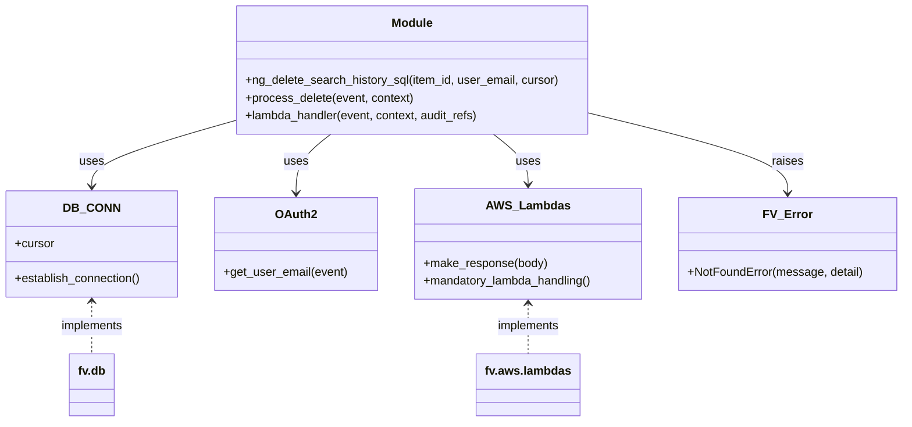

# Diagram: shipment_core/shipment_service/shipment_service/ng_preferences/ng_delete_search_history.py


> Auto-generated by Obscura crawlers

## Diagram 1



### SVG

<svg id="container" width="1216.8046875" xmlns="http://www.w3.org/2000/svg" class="classDiagram" height="572" viewBox="0 0 1216.8046875 572" role="graphics-document document" aria-roledescription="class"><style>#container{font-family:"trebuchet ms",verdana,arial,sans-serif;font-size:16px;fill:#333;}@keyframes edge-animation-frame{from{stroke-dashoffset:0;}}@keyframes dash{to{stroke-dashoffset:0;}}#container .edge-animation-slow{stroke-dasharray:9,5!important;stroke-dashoffset:900;animation:dash 50s linear infinite;stroke-linecap:round;}#container .edge-animation-fast{stroke-dasharray:9,5!important;stroke-dashoffset:900;animation:dash 20s linear infinite;stroke-linecap:round;}#container .error-icon{fill:#552222;}#container .error-text{fill:#552222;stroke:#552222;}#container .edge-thickness-normal{stroke-width:1px;}#container .edge-thickness-thick{stroke-width:3.5px;}#container .edge-pattern-solid{stroke-dasharray:0;}#container .edge-thickness-invisible{stroke-width:0;fill:none;}#container .edge-pattern-dashed{stroke-dasharray:3;}#container .edge-pattern-dotted{stroke-dasharray:2;}#container .marker{fill:#333333;stroke:#333333;}#container .marker.cross{stroke:#333333;}#container svg{font-family:"trebuchet ms",verdana,arial,sans-serif;font-size:16px;}#container p{margin:0;}#container g.classGroup text{fill:#9370DB;stroke:none;font-family:"trebuchet ms",verdana,arial,sans-serif;font-size:10px;}#container g.classGroup text .title{font-weight:bolder;}#container .nodeLabel,#container .edgeLabel{color:#131300;}#container .edgeLabel .label rect{fill:#ECECFF;}#container .label text{fill:#131300;}#container .labelBkg{background:#ECECFF;}#container .edgeLabel .label span{background:#ECECFF;}#container .classTitle{font-weight:bolder;}#container .node rect,#container .node circle,#container .node ellipse,#container .node polygon,#container .node path{fill:#ECECFF;stroke:#9370DB;stroke-width:1px;}#container .divider{stroke:#9370DB;stroke-width:1;}#container g.clickable{cursor:pointer;}#container g.classGroup rect{fill:#ECECFF;stroke:#9370DB;}#container g.classGroup line{stroke:#9370DB;stroke-width:1;}#container .classLabel .box{stroke:none;stroke-width:0;fill:#ECECFF;opacity:0.5;}#container .classLabel .label{fill:#9370DB;font-size:10px;}#container .relation{stroke:#333333;stroke-width:1;fill:none;}#container .dashed-line{stroke-dasharray:3;}#container .dotted-line{stroke-dasharray:1 2;}#container #compositionStart,#container .composition{fill:#333333!important;stroke:#333333!important;stroke-width:1;}#container #compositionEnd,#container .composition{fill:#333333!important;stroke:#333333!important;stroke-width:1;}#container #dependencyStart,#container .dependency{fill:#333333!important;stroke:#333333!important;stroke-width:1;}#container #dependencyStart,#container .dependency{fill:#333333!important;stroke:#333333!important;stroke-width:1;}#container #extensionStart,#container .extension{fill:transparent!important;stroke:#333333!important;stroke-width:1;}#container #extensionEnd,#container .extension{fill:transparent!important;stroke:#333333!important;stroke-width:1;}#container #aggregationStart,#container .aggregation{fill:transparent!important;stroke:#333333!important;stroke-width:1;}#container #aggregationEnd,#container .aggregation{fill:transparent!important;stroke:#333333!important;stroke-width:1;}#container #lollipopStart,#container .lollipop{fill:#ECECFF!important;stroke:#333333!important;stroke-width:1;}#container #lollipopEnd,#container .lollipop{fill:#ECECFF!important;stroke:#333333!important;stroke-width:1;}#container .edgeTerminals{font-size:11px;line-height:initial;}#container .classTitleText{text-anchor:middle;font-size:18px;fill:#333;}#container .label-icon{display:inline-block;height:1em;overflow:visible;vertical-align:-0.125em;}#container .node .label-icon path{fill:currentColor;stroke:revert;stroke-width:revert;}#container :root{--mermaid-font-family:"trebuchet ms",verdana,arial,sans-serif;}</style><g><defs><marker id="container_class-aggregationStart" class="marker aggregation class" refX="18" refY="7" markerWidth="190" markerHeight="240" orient="auto"><path d="M 18,7 L9,13 L1,7 L9,1 Z"></path></marker></defs><defs><marker id="container_class-aggregationEnd" class="marker aggregation class" refX="1" refY="7" markerWidth="20" markerHeight="28" orient="auto"><path d="M 18,7 L9,13 L1,7 L9,1 Z"></path></marker></defs><defs><marker id="container_class-extensionStart" class="marker extension class" refX="18" refY="7" markerWidth="190" markerHeight="240" orient="auto"><path d="M 1,7 L18,13 V 1 Z"></path></marker></defs><defs><marker id="container_class-extensionEnd" class="marker extension class" refX="1" refY="7" markerWidth="20" markerHeight="28" orient="auto"><path d="M 1,1 V 13 L18,7 Z"></path></marker></defs><defs><marker id="container_class-compositionStart" class="marker composition class" refX="18" refY="7" markerWidth="190" markerHeight="240" orient="auto"><path d="M 18,7 L9,13 L1,7 L9,1 Z"></path></marker></defs><defs><marker id="container_class-compositionEnd" class="marker composition class" refX="1" refY="7" markerWidth="20" markerHeight="28" orient="auto"><path d="M 18,7 L9,13 L1,7 L9,1 Z"></path></marker></defs><defs><marker id="container_class-dependencyStart" class="marker dependency class" refX="6" refY="7" markerWidth="190" markerHeight="240" orient="auto"><path d="M 5,7 L9,13 L1,7 L9,1 Z"></path></marker></defs><defs><marker id="container_class-dependencyEnd" class="marker dependency class" refX="13" refY="7" markerWidth="20" markerHeight="28" orient="auto"><path d="M 18,7 L9,13 L14,7 L9,1 Z"></path></marker></defs><defs><marker id="container_class-lollipopStart" class="marker lollipop class" refX="13" refY="7" markerWidth="190" markerHeight="240" orient="auto"><circle stroke="black" fill="transparent" cx="7" cy="7" r="6"></circle></marker></defs><defs><marker id="container_class-lollipopEnd" class="marker lollipop class" refX="1" refY="7" markerWidth="190" markerHeight="240" orient="auto"><circle stroke="black" fill="transparent" cx="7" cy="7" r="6"></circle></marker></defs><g class="root"><g class="clusters"></g><g class="edgePaths"><path d="M315.686,163.931L283.711,173.109C251.736,182.287,187.786,200.644,155.811,215.488C123.836,230.333,123.836,241.667,123.836,247.333L123.836,253" id="id_Module_DB_CONN_1" class="edge-thickness-normal edge-pattern-solid relation" style=";;;" data-edge="true" data-et="edge" data-id="id_Module_DB_CONN_1" data-points="W3sieCI6MzE1LjY4NTU0Njg3NSwieSI6MTYzLjkzMDgxMTY5NTUwNDUzfSx7IngiOjEyMy44MzU5Mzc1LCJ5IjoyMTl9LHsieCI6MTIzLjgzNTkzNzUsInkiOjI1OX1d" marker-end="url(#container_class-dependencyEnd)"></path><path d="M445.765,182L437.963,188.167C430.162,194.333,414.56,206.667,406.758,220C398.957,233.333,398.957,247.667,398.957,254.833L398.957,262" id="id_Module_OAuth2_2" class="edge-thickness-normal edge-pattern-solid relation" style=";;;" data-edge="true" data-et="edge" data-id="id_Module_OAuth2_2" data-points="W3sieCI6NDQ1Ljc2NDc1ODY5NDU1NjQ2LCJ5IjoxODJ9LHsieCI6Mzk4Ljk1NzAzMTI1LCJ5IjoyMTl9LHsieCI6Mzk4Ljk1NzAzMTI1LCJ5IjoyNjh9XQ==" marker-end="url(#container_class-dependencyEnd)"></path><path d="M665.888,182L673.689,188.167C681.49,194.333,697.093,206.667,704.894,218C712.695,229.333,712.695,239.667,712.695,244.833L712.695,250" id="id_Module_AWS_Lambdas_3" class="edge-thickness-normal edge-pattern-solid relation" style=";;;" data-edge="true" data-et="edge" data-id="id_Module_AWS_Lambdas_3" data-points="W3sieCI6NjY1Ljg4NzU4NTA1NTQ0MzUsInkiOjE4Mn0seyJ4Ijo3MTIuNjk1MzEyNSwieSI6MjE5fSx7IngiOjcxMi42OTUzMTI1LCJ5IjoyNTZ9XQ==" marker-end="url(#container_class-dependencyEnd)"></path><path d="M795.967,153.715L840.468,164.596C884.97,175.477,973.973,197.238,1018.475,215.286C1062.977,233.333,1062.977,247.667,1062.977,254.833L1062.977,262" id="id_Module_FV_Error_4" class="edge-thickness-normal edge-pattern-solid relation" style=";;;" data-edge="true" data-et="edge" data-id="id_Module_FV_Error_4" data-points="W3sieCI6Nzk1Ljk2Njc5Njg3NSwieSI6MTUzLjcxNTIwMTc0MzgxMjEyfSx7IngiOjEwNjIuOTc2NTYyNSwieSI6MjE5fSx7IngiOjEwNjIuOTc2NTYyNSwieSI6MjY4fV0=" marker-end="url(#container_class-dependencyEnd)"></path><path d="M123.836,409L123.836,414.667C123.836,420.333,123.836,431.667,123.836,443.5C123.836,455.333,123.836,467.667,123.836,473.833L123.836,480" id="id_DB_CONN_fv.db_5" class="edge-thickness-normal edge-pattern-dashed relation" style=";;;" data-edge="true" data-et="edge" data-id="id_DB_CONN_fv.db_5" data-points="W3sieCI6MTIzLjgzNTkzNzUsInkiOjQwM30seyJ4IjoxMjMuODM1OTM3NSwieSI6NDQzfSx7IngiOjEyMy44MzU5Mzc1LCJ5Ijo0ODB9XQ==" marker-start="url(#container_class-dependencyStart)"></path><path d="M712.695,412L712.695,417.167C712.695,422.333,712.695,432.667,712.695,444C712.695,455.333,712.695,467.667,712.695,473.833L712.695,480" id="id_AWS_Lambdas_fv.aws.lambdas_6" class="edge-thickness-normal edge-pattern-dashed relation" style=";;;" data-edge="true" data-et="edge" data-id="id_AWS_Lambdas_fv.aws.lambdas_6" data-points="W3sieCI6NzEyLjY5NTMxMjUsInkiOjQwNn0seyJ4Ijo3MTIuNjk1MzEyNSwieSI6NDQzfSx7IngiOjcxMi42OTUzMTI1LCJ5Ijo0ODB9XQ==" marker-start="url(#container_class-dependencyStart)"></path></g><g class="edgeLabels"><g class="edgeLabel" transform="translate(123.8359375, 219)"><g class="label" data-id="id_Module_DB_CONN_1" transform="translate(-16.4921875, -12)"><foreignObject width="32.984375" height="24"><div xmlns="http://www.w3.org/1999/xhtml" class="labelBkg" style="display: table-cell; white-space: nowrap; line-height: 1.5; max-width: 200px; text-align: center;"><span class="edgeLabel"><p>uses</p></span></div></foreignObject></g></g><g class="edgeLabel" transform="translate(398.95703125, 219)"><g class="label" data-id="id_Module_OAuth2_2" transform="translate(-16.4921875, -12)"><foreignObject width="32.984375" height="24"><div xmlns="http://www.w3.org/1999/xhtml" class="labelBkg" style="display: table-cell; white-space: nowrap; line-height: 1.5; max-width: 200px; text-align: center;"><span class="edgeLabel"><p>uses</p></span></div></foreignObject></g></g><g class="edgeLabel" transform="translate(712.6953125, 219)"><g class="label" data-id="id_Module_AWS_Lambdas_3" transform="translate(-16.4921875, -12)"><foreignObject width="32.984375" height="24"><div xmlns="http://www.w3.org/1999/xhtml" class="labelBkg" style="display: table-cell; white-space: nowrap; line-height: 1.5; max-width: 200px; text-align: center;"><span class="edgeLabel"><p>uses</p></span></div></foreignObject></g></g><g class="edgeLabel" transform="translate(1062.9765625, 219)"><g class="label" data-id="id_Module_FV_Error_4" transform="translate(-21.25, -12)"><foreignObject width="42.5" height="24"><div xmlns="http://www.w3.org/1999/xhtml" class="labelBkg" style="display: table-cell; white-space: nowrap; line-height: 1.5; max-width: 200px; text-align: center;"><span class="edgeLabel"><p>raises</p></span></div></foreignObject></g></g><g class="edgeLabel" transform="translate(123.8359375, 443)"><g class="label" data-id="id_DB_CONN_fv.db_5" transform="translate(-43.0625, -12)"><foreignObject width="86.125" height="24"><div xmlns="http://www.w3.org/1999/xhtml" class="labelBkg" style="display: table-cell; white-space: nowrap; line-height: 1.5; max-width: 200px; text-align: center;"><span class="edgeLabel"><p>implements</p></span></div></foreignObject></g></g><g class="edgeLabel" transform="translate(712.6953125, 443)"><g class="label" data-id="id_AWS_Lambdas_fv.aws.lambdas_6" transform="translate(-43.0625, -12)"><foreignObject width="86.125" height="24"><div xmlns="http://www.w3.org/1999/xhtml" class="labelBkg" style="display: table-cell; white-space: nowrap; line-height: 1.5; max-width: 200px; text-align: center;"><span class="edgeLabel"><p>implements</p></span></div></foreignObject></g></g></g><g class="nodes"><g class="node default" id="classId-Module-0" transform="translate(555.826171875, 95)"><g class="basic label-container"><path d="M-240.140625 -87 L240.140625 -87 L240.140625 87 L-240.140625 87" stroke="none" stroke-width="0" fill="#ECECFF" style=""></path><path d="M-240.140625 -87 C-107.59865635919672 -87, 24.943312281606552 -87, 240.140625 -87 M-240.140625 -87 C-82.75087185189366 -87, 74.63888129621267 -87, 240.140625 -87 M240.140625 -87 C240.140625 -48.58870997946413, 240.140625 -10.177419958928255, 240.140625 87 M240.140625 -87 C240.140625 -24.897609441118405, 240.140625 37.20478111776319, 240.140625 87 M240.140625 87 C143.83210648138578 87, 47.523587962771586 87, -240.140625 87 M240.140625 87 C59.20897532033109 87, -121.72267435933782 87, -240.140625 87 M-240.140625 87 C-240.140625 31.026178361964938, -240.140625 -24.947643276070124, -240.140625 -87 M-240.140625 87 C-240.140625 19.24847189768809, -240.140625 -48.50305620462382, -240.140625 -87" stroke="#9370DB" stroke-width="1.3" fill="none" stroke-dasharray="0 0" style=""></path></g><g class="annotation-group text" transform="translate(0, -63)"></g><g class="label-group text" transform="translate(-27.09375, -63)"><g class="label" style="font-weight: bolder" transform="translate(0,-12)"><foreignObject width="54.1875" height="24"><div xmlns="http://www.w3.org/1999/xhtml" style="display: table-cell; white-space: nowrap; line-height: 1.5; max-width: 104px; text-align: center;"><span class="nodeLabel markdown-node-label" style=""><p>Module</p></span></div></foreignObject></g></g><g class="members-group text" transform="translate(-228.140625, -15)"></g><g class="methods-group text" transform="translate(-228.140625, 15)"><g class="label" style="" transform="translate(0,-12)"><foreignObject width="429.1875" height="24"><div xmlns="http://www.w3.org/1999/xhtml" style="display: table-cell; white-space: nowrap; line-height: 1.5; max-width: 487px; text-align: center;"><span class="nodeLabel markdown-node-label" style=""><p>+ng_delete_search_history_sql(item_id, user_email, cursor)</p></span></div></foreignObject></g><g class="label" style="" transform="translate(0,12)"><foreignObject width="229.46875" height="24"><div xmlns="http://www.w3.org/1999/xhtml" style="display: table-cell; white-space: nowrap; line-height: 1.5; max-width: 287px; text-align: center;"><span class="nodeLabel markdown-node-label" style=""><p>+process_delete(event, context)</p></span></div></foreignObject></g><g class="label" style="" transform="translate(0,36)"><foreignObject width="321.6875" height="24"><div xmlns="http://www.w3.org/1999/xhtml" style="display: table-cell; white-space: nowrap; line-height: 1.5; max-width: 379px; text-align: center;"><span class="nodeLabel markdown-node-label" style=""><p>+lambda_handler(event, context, audit_refs)</p></span></div></foreignObject></g></g><g class="divider" style=""><path d="M-240.140625 -39 C-117.00896441366041 -39, 6.122696172679184 -39, 240.140625 -39 M-240.140625 -39 C-81.62895094589857 -39, 76.88272310820287 -39, 240.140625 -39" stroke="#9370DB" stroke-width="1.3" fill="none" stroke-dasharray="0 0" style=""></path></g><g class="divider" style=""><path d="M-240.140625 -15 C-139.45809980383314 -15, -38.77557460766627 -15, 240.140625 -15 M-240.140625 -15 C-137.87863021823506 -15, -35.61663543647009 -15, 240.140625 -15" stroke="#9370DB" stroke-width="1.3" fill="none" stroke-dasharray="0 0" style=""></path></g></g><g class="node default" id="classId-DB_CONN-1" transform="translate(123.8359375, 331)"><g class="basic label-container"><path d="M-115.8359375 -72 L115.8359375 -72 L115.8359375 72 L-115.8359375 72" stroke="none" stroke-width="0" fill="#ECECFF" style=""></path><path d="M-115.8359375 -72 C-29.354178842752603 -72, 57.127579814494794 -72, 115.8359375 -72 M-115.8359375 -72 C-28.460751123906917 -72, 58.914435252186166 -72, 115.8359375 -72 M115.8359375 -72 C115.8359375 -39.384559129398255, 115.8359375 -6.76911825879651, 115.8359375 72 M115.8359375 -72 C115.8359375 -24.446957024045552, 115.8359375 23.106085951908895, 115.8359375 72 M115.8359375 72 C49.071235380935576 72, -17.693466738128848 72, -115.8359375 72 M115.8359375 72 C58.7796336771715 72, 1.7233298543430067 72, -115.8359375 72 M-115.8359375 72 C-115.8359375 35.14268634882376, -115.8359375 -1.7146273023524827, -115.8359375 -72 M-115.8359375 72 C-115.8359375 15.059449364938743, -115.8359375 -41.881101270122514, -115.8359375 -72" stroke="#9370DB" stroke-width="1.3" fill="none" stroke-dasharray="0 0" style=""></path></g><g class="annotation-group text" transform="translate(0, -48)"></g><g class="label-group text" transform="translate(-34.40625, -48)"><g class="label" style="font-weight: bolder" transform="translate(0,-12)"><foreignObject width="68.8125" height="24"><div xmlns="http://www.w3.org/1999/xhtml" style="display: table-cell; white-space: nowrap; line-height: 1.5; max-width: 119px; text-align: center;"><span class="nodeLabel markdown-node-label" style=""><p>DB_CONN</p></span></div></foreignObject></g></g><g class="members-group text" transform="translate(-103.8359375, 0)"><g class="label" style="" transform="translate(0,-12)"><foreignObject width="53.71875" height="24"><div xmlns="http://www.w3.org/1999/xhtml" style="display: table-cell; white-space: nowrap; line-height: 1.5; max-width: 112px; text-align: center;"><span class="nodeLabel markdown-node-label" style=""><p>+cursor</p></span></div></foreignObject></g></g><g class="methods-group text" transform="translate(-103.8359375, 48)"><g class="label" style="" transform="translate(0,-12)"><foreignObject width="173.265625" height="24"><div xmlns="http://www.w3.org/1999/xhtml" style="display: table-cell; white-space: nowrap; line-height: 1.5; max-width: 231px; text-align: center;"><span class="nodeLabel markdown-node-label" style=""><p>+establish_connection()</p></span></div></foreignObject></g></g><g class="divider" style=""><path d="M-115.8359375 -24 C-43.77610441054286 -24, 28.283728678914287 -24, 115.8359375 -24 M-115.8359375 -24 C-39.91752661520894 -24, 36.000884269582116 -24, 115.8359375 -24" stroke="#9370DB" stroke-width="1.3" fill="none" stroke-dasharray="0 0" style=""></path></g><g class="divider" style=""><path d="M-115.8359375 24 C-67.07231118940413 24, -18.308684878808265 24, 115.8359375 24 M-115.8359375 24 C-45.03849860651518 24, 25.758940286969647 24, 115.8359375 24" stroke="#9370DB" stroke-width="1.3" fill="none" stroke-dasharray="0 0" style=""></path></g></g><g class="node default" id="classId-OAuth2-2" transform="translate(398.95703125, 331)"><g class="basic label-container"><path d="M-109.28515625 -63 L109.28515625 -63 L109.28515625 63 L-109.28515625 63" stroke="none" stroke-width="0" fill="#ECECFF" style=""></path><path d="M-109.28515625 -63 C-55.23814998632414 -63, -1.1911437226482775 -63, 109.28515625 -63 M-109.28515625 -63 C-55.7065897587016 -63, -2.1280232674031936 -63, 109.28515625 -63 M109.28515625 -63 C109.28515625 -22.213881777264426, 109.28515625 18.572236445471148, 109.28515625 63 M109.28515625 -63 C109.28515625 -13.57698660430416, 109.28515625 35.84602679139168, 109.28515625 63 M109.28515625 63 C33.212417233594664 63, -42.86032178281067 63, -109.28515625 63 M109.28515625 63 C63.30225661753634 63, 17.319356985072673 63, -109.28515625 63 M-109.28515625 63 C-109.28515625 24.710756006498784, -109.28515625 -13.578487987002433, -109.28515625 -63 M-109.28515625 63 C-109.28515625 15.619896641518274, -109.28515625 -31.760206716963452, -109.28515625 -63" stroke="#9370DB" stroke-width="1.3" fill="none" stroke-dasharray="0 0" style=""></path></g><g class="annotation-group text" transform="translate(0, -39)"></g><g class="label-group text" transform="translate(-26.5859375, -39)"><g class="label" style="font-weight: bolder" transform="translate(0,-12)"><foreignObject width="53.171875" height="24"><div xmlns="http://www.w3.org/1999/xhtml" style="display: table-cell; white-space: nowrap; line-height: 1.5; max-width: 103px; text-align: center;"><span class="nodeLabel markdown-node-label" style=""><p>OAuth2</p></span></div></foreignObject></g></g><g class="members-group text" transform="translate(-97.28515625, 9)"></g><g class="methods-group text" transform="translate(-97.28515625, 39)"><g class="label" style="" transform="translate(0,-12)"><foreignObject width="167.984375" height="24"><div xmlns="http://www.w3.org/1999/xhtml" style="display: table-cell; white-space: nowrap; line-height: 1.5; max-width: 225px; text-align: center;"><span class="nodeLabel markdown-node-label" style=""><p>+get_user_email(event)</p></span></div></foreignObject></g></g><g class="divider" style=""><path d="M-109.28515625 -15 C-23.028566656564266 -15, 63.22802293687147 -15, 109.28515625 -15 M-109.28515625 -15 C-47.370871730073354 -15, 14.543412789853292 -15, 109.28515625 -15" stroke="#9370DB" stroke-width="1.3" fill="none" stroke-dasharray="0 0" style=""></path></g><g class="divider" style=""><path d="M-109.28515625 9 C-61.853152549622514 9, -14.421148849245029 9, 109.28515625 9 M-109.28515625 9 C-63.8091470445054 9, -18.333137839010803 9, 109.28515625 9" stroke="#9370DB" stroke-width="1.3" fill="none" stroke-dasharray="0 0" style=""></path></g></g><g class="node default" id="classId-AWS_Lambdas-3" transform="translate(712.6953125, 331)"><g class="basic label-container"><path d="M-154.453125 -75 L154.453125 -75 L154.453125 75 L-154.453125 75" stroke="none" stroke-width="0" fill="#ECECFF" style=""></path><path d="M-154.453125 -75 C-40.938430199516006 -75, 72.57626460096799 -75, 154.453125 -75 M-154.453125 -75 C-74.07642923221567 -75, 6.300266535568653 -75, 154.453125 -75 M154.453125 -75 C154.453125 -30.318026826827598, 154.453125 14.363946346344804, 154.453125 75 M154.453125 -75 C154.453125 -20.606852282138483, 154.453125 33.786295435723034, 154.453125 75 M154.453125 75 C64.81354528140731 75, -24.82603443718537 75, -154.453125 75 M154.453125 75 C69.98168736933181 75, -14.489750261336383 75, -154.453125 75 M-154.453125 75 C-154.453125 27.7762183785998, -154.453125 -19.4475632428004, -154.453125 -75 M-154.453125 75 C-154.453125 43.79771758243811, -154.453125 12.595435164876221, -154.453125 -75" stroke="#9370DB" stroke-width="1.3" fill="none" stroke-dasharray="0 0" style=""></path></g><g class="annotation-group text" transform="translate(0, -51)"></g><g class="label-group text" transform="translate(-52.828125, -51)"><g class="label" style="font-weight: bolder" transform="translate(0,-12)"><foreignObject width="105.65625" height="24"><div xmlns="http://www.w3.org/1999/xhtml" style="display: table-cell; white-space: nowrap; line-height: 1.5; max-width: 154px; text-align: center;"><span class="nodeLabel markdown-node-label" style=""><p>AWS_Lambdas</p></span></div></foreignObject></g></g><g class="members-group text" transform="translate(-142.453125, -3)"></g><g class="methods-group text" transform="translate(-142.453125, 27)"><g class="label" style="" transform="translate(0,-12)"><foreignObject width="168.140625" height="24"><div xmlns="http://www.w3.org/1999/xhtml" style="display: table-cell; white-space: nowrap; line-height: 1.5; max-width: 226px; text-align: center;"><span class="nodeLabel markdown-node-label" style=""><p>+make_response(body)</p></span></div></foreignObject></g><g class="label" style="" transform="translate(0,12)"><foreignObject width="232.078125" height="24"><div xmlns="http://www.w3.org/1999/xhtml" style="display: table-cell; white-space: nowrap; line-height: 1.5; max-width: 289px; text-align: center;"><span class="nodeLabel markdown-node-label" style=""><p>+mandatory_lambda_handling()</p></span></div></foreignObject></g></g><g class="divider" style=""><path d="M-154.453125 -27 C-42.84422143386182 -27, 68.76468213227636 -27, 154.453125 -27 M-154.453125 -27 C-57.971891386401836 -27, 38.50934222719633 -27, 154.453125 -27" stroke="#9370DB" stroke-width="1.3" fill="none" stroke-dasharray="0 0" style=""></path></g><g class="divider" style=""><path d="M-154.453125 -3 C-73.99885718331143 -3, 6.4554106333771415 -3, 154.453125 -3 M-154.453125 -3 C-74.75296686606738 -3, 4.947191267865236 -3, 154.453125 -3" stroke="#9370DB" stroke-width="1.3" fill="none" stroke-dasharray="0 0" style=""></path></g></g><g class="node default" id="classId-FV_Error-4" transform="translate(1062.9765625, 331)"><g class="basic label-container"><path d="M-145.828125 -63 L145.828125 -63 L145.828125 63 L-145.828125 63" stroke="none" stroke-width="0" fill="#ECECFF" style=""></path><path d="M-145.828125 -63 C-67.39590862806003 -63, 11.036307743879945 -63, 145.828125 -63 M-145.828125 -63 C-32.998031155982034 -63, 79.83206268803593 -63, 145.828125 -63 M145.828125 -63 C145.828125 -19.74972631014395, 145.828125 23.500547379712103, 145.828125 63 M145.828125 -63 C145.828125 -28.11602790256711, 145.828125 6.767944194865777, 145.828125 63 M145.828125 63 C30.919052860155944 63, -83.99001927968811 63, -145.828125 63 M145.828125 63 C58.00042653664161 63, -29.827271926716776 63, -145.828125 63 M-145.828125 63 C-145.828125 35.40089599955944, -145.828125 7.801791999118876, -145.828125 -63 M-145.828125 63 C-145.828125 37.437941179658395, -145.828125 11.87588235931679, -145.828125 -63" stroke="#9370DB" stroke-width="1.3" fill="none" stroke-dasharray="0 0" style=""></path></g><g class="annotation-group text" transform="translate(0, -39)"></g><g class="label-group text" transform="translate(-30.40625, -39)"><g class="label" style="font-weight: bolder" transform="translate(0,-12)"><foreignObject width="60.8125" height="24"><div xmlns="http://www.w3.org/1999/xhtml" style="display: table-cell; white-space: nowrap; line-height: 1.5; max-width: 111px; text-align: center;"><span class="nodeLabel markdown-node-label" style=""><p>FV_Error</p></span></div></foreignObject></g></g><g class="members-group text" transform="translate(-133.828125, 9)"></g><g class="methods-group text" transform="translate(-133.828125, 39)"><g class="label" style="" transform="translate(0,-12)"><foreignObject width="237.25" height="24"><div xmlns="http://www.w3.org/1999/xhtml" style="display: table-cell; white-space: nowrap; line-height: 1.5; max-width: 295px; text-align: center;"><span class="nodeLabel markdown-node-label" style=""><p>+NotFoundError(message, detail)</p></span></div></foreignObject></g></g><g class="divider" style=""><path d="M-145.828125 -15 C-38.92999069872663 -15, 67.96814360254675 -15, 145.828125 -15 M-145.828125 -15 C-69.9925477267311 -15, 5.843029546537792 -15, 145.828125 -15" stroke="#9370DB" stroke-width="1.3" fill="none" stroke-dasharray="0 0" style=""></path></g><g class="divider" style=""><path d="M-145.828125 9 C-33.55685055102501 9, 78.71442389794998 9, 145.828125 9 M-145.828125 9 C-57.76888061314261 9, 30.290363773714773 9, 145.828125 9" stroke="#9370DB" stroke-width="1.3" fill="none" stroke-dasharray="0 0" style=""></path></g></g><g class="node default" id="classId-fv.db-5" transform="translate(123.8359375, 522)"><g class="basic label-container"><path d="M-30.0546875 -42 L30.0546875 -42 L30.0546875 42 L-30.0546875 42" stroke="none" stroke-width="0" fill="#ECECFF" style=""></path><path d="M-30.0546875 -42 C-6.806856351319119 -42, 16.44097479736176 -42, 30.0546875 -42 M-30.0546875 -42 C-7.281472056058178 -42, 15.491743387883645 -42, 30.0546875 -42 M30.0546875 -42 C30.0546875 -19.131507947079168, 30.0546875 3.736984105841664, 30.0546875 42 M30.0546875 -42 C30.0546875 -11.067951131628764, 30.0546875 19.864097736742472, 30.0546875 42 M30.0546875 42 C9.144644001470109 42, -11.765399497059782 42, -30.0546875 42 M30.0546875 42 C16.545461329677213 42, 3.036235159354426 42, -30.0546875 42 M-30.0546875 42 C-30.0546875 10.164680291749612, -30.0546875 -21.670639416500777, -30.0546875 -42 M-30.0546875 42 C-30.0546875 20.383210207390288, -30.0546875 -1.2335795852194238, -30.0546875 -42" stroke="#9370DB" stroke-width="1.3" fill="none" stroke-dasharray="0 0" style=""></path></g><g class="annotation-group text" transform="translate(0, -18)"></g><g class="label-group text" transform="translate(-18.0546875, -18)"><g class="label" style="font-weight: bolder" transform="translate(0,-12)"><foreignObject width="36.109375" height="24"><div xmlns="http://www.w3.org/1999/xhtml" style="display: table-cell; white-space: nowrap; line-height: 1.5; max-width: 85px; text-align: center;"><span class="nodeLabel markdown-node-label" style=""><p>fv.db</p></span></div></foreignObject></g></g><g class="members-group text" transform="translate(-18.0546875, 30)"></g><g class="methods-group text" transform="translate(-18.0546875, 60)"></g><g class="divider" style=""><path d="M-30.0546875 6 C-6.317037282860294 6, 17.42061293427941 6, 30.0546875 6 M-30.0546875 6 C-7.591962021982592 6, 14.870763456034815 6, 30.0546875 6" stroke="#9370DB" stroke-width="1.3" fill="none" stroke-dasharray="0 0" style=""></path></g><g class="divider" style=""><path d="M-30.0546875 24 C-13.8954506761904 24, 2.2637861476192 24, 30.0546875 24 M-30.0546875 24 C-15.17910303361969 24, -0.3035185672393794 24, 30.0546875 24" stroke="#9370DB" stroke-width="1.3" fill="none" stroke-dasharray="0 0" style=""></path></g></g><g class="node default" id="classId-fv.aws.lambdas-6" transform="translate(712.6953125, 522)"><g class="basic label-container"><path d="M-67.8984375 -42 L67.8984375 -42 L67.8984375 42 L-67.8984375 42" stroke="none" stroke-width="0" fill="#ECECFF" style=""></path><path d="M-67.8984375 -42 C-14.216915518576613 -42, 39.464606462846774 -42, 67.8984375 -42 M-67.8984375 -42 C-40.28749330660529 -42, -12.676549113210584 -42, 67.8984375 -42 M67.8984375 -42 C67.8984375 -18.450210389366607, 67.8984375 5.0995792212667865, 67.8984375 42 M67.8984375 -42 C67.8984375 -19.699268913701093, 67.8984375 2.601462172597813, 67.8984375 42 M67.8984375 42 C30.251840444260367 42, -7.394756611479266 42, -67.8984375 42 M67.8984375 42 C15.53455654334008 42, -36.82932441331984 42, -67.8984375 42 M-67.8984375 42 C-67.8984375 18.581668333826, -67.8984375 -4.836663332348003, -67.8984375 -42 M-67.8984375 42 C-67.8984375 18.469542137340706, -67.8984375 -5.060915725318587, -67.8984375 -42" stroke="#9370DB" stroke-width="1.3" fill="none" stroke-dasharray="0 0" style=""></path></g><g class="annotation-group text" transform="translate(0, -18)"></g><g class="label-group text" transform="translate(-55.8984375, -18)"><g class="label" style="font-weight: bolder" transform="translate(0,-12)"><foreignObject width="111.796875" height="24"><div xmlns="http://www.w3.org/1999/xhtml" style="display: table-cell; white-space: nowrap; line-height: 1.5; max-width: 160px; text-align: center;"><span class="nodeLabel markdown-node-label" style=""><p>fv.aws.lambdas</p></span></div></foreignObject></g></g><g class="members-group text" transform="translate(-55.8984375, 30)"></g><g class="methods-group text" transform="translate(-55.8984375, 60)"></g><g class="divider" style=""><path d="M-67.8984375 6 C-37.022400655223535 6, -6.1463638104470775 6, 67.8984375 6 M-67.8984375 6 C-30.875456448975463 6, 6.147524602049074 6, 67.8984375 6" stroke="#9370DB" stroke-width="1.3" fill="none" stroke-dasharray="0 0" style=""></path></g><g class="divider" style=""><path d="M-67.8984375 24 C-25.010819898114278 24, 17.876797703771445 24, 67.8984375 24 M-67.8984375 24 C-36.65138023764783 24, -5.404322975295663 24, 67.8984375 24" stroke="#9370DB" stroke-width="1.3" fill="none" stroke-dasharray="0 0" style=""></path></g></g></g></g></g></svg>

## Diagram 2

```mermaid
flowchart TD
    A[HTTP DELETE /preferences/search-history/{item_id}] --> B[lambda_handler]
    B --> C[mandatory_lambda_handling wrapper]
    C --> D[process_delete(event, context)]
    D --> E[DB_CONN.establish_connection()]
    E --> F[cursor = DB_CONN.cursor]
    D --> G[Get user_email via oauth2.get_user_email(event)]
    D --> H{event.pathParameters and item_id present?}
    H -- Yes --> I[call ng_delete_search_history_sql(item_id, user_email, cursor)]
    I --> J{ng_delete_search_history_sql returned a row?}
    J -- Yes --> K[process_delete_result remains None; call make_response(process_delete_result)]
    K --> L[Return HTTP 200/response]
    J -- No --> M[raise fv.error.NotFoundError("no records deleted")]
    H -- No --> M
    M --> N[Lambda returns error (NotFound)]
```

> SVG rendering failed for this diagram.
