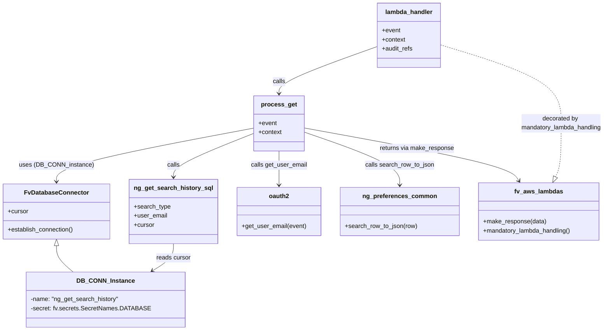
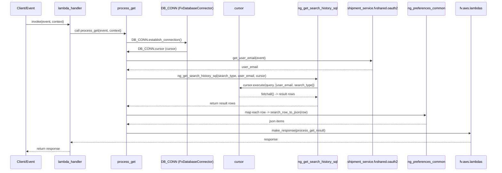

# Diagram: shipment_core/shipment_service/shipment_service/ng_preferences/ng_get_search_history.py

> Auto-generated by Obscura crawlers

## Diagram 1

### SVG

<svg id="container" width="1558.484375" xmlns="http://www.w3.org/2000/svg" class="classDiagram" height="862" viewBox="0 0 1558.484375 862" role="graphics-document document" aria-roledescription="class"><g><defs><marker id="container_class-aggregationStart" class="marker aggregation class" refX="18" refY="7" markerWidth="190" markerHeight="240" orient="auto"><path d="M 18,7 L9,13 L1,7 L9,1 Z"></path></marker></defs><defs><marker id="container_class-aggregationEnd" class="marker aggregation class" refX="1" refY="7" markerWidth="20" markerHeight="28" orient="auto"><path d="M 18,7 L9,13 L1,7 L9,1 Z"></path></marker></defs><defs><marker id="container_class-extensionStart" class="marker extension class" refX="18" refY="7" markerWidth="190" markerHeight="240" orient="auto"><path d="M 1,7 L18,13 V 1 Z"></path></marker></defs><defs><marker id="container_class-extensionEnd" class="marker extension class" refX="1" refY="7" markerWidth="20" markerHeight="28" orient="auto"><path d="M 1,1 V 13 L18,7 Z"></path></marker></defs><defs><marker id="container_class-compositionStart" class="marker composition class" refX="18" refY="7" markerWidth="190" markerHeight="240" orient="auto"><path d="M 18,7 L9,13 L1,7 L9,1 Z"></path></marker></defs><defs><marker id="container_class-compositionEnd" class="marker composition class" refX="1" refY="7" markerWidth="20" markerHeight="28" orient="auto"><path d="M 18,7 L9,13 L1,7 L9,1 Z"></path></marker></defs><defs><marker id="container_class-dependencyStart" class="marker dependency class" refX="6" refY="7" markerWidth="190" markerHeight="240" orient="auto"><path d="M 5,7 L9,13 L1,7 L9,1 Z"></path></marker></defs><defs><marker id="container_class-dependencyEnd" class="marker dependency class" refX="13" refY="7" markerWidth="20" markerHeight="28" orient="auto"><path d="M 18,7 L9,13 L14,7 L9,1 Z"></path></marker></defs><defs><marker id="container_class-lollipopStart" class="marker lollipop class" refX="13" refY="7" markerWidth="190" markerHeight="240" orient="auto"><circle stroke="black" fill="transparent" cx="7" cy="7" r="6"></circle></marker></defs><defs><marker id="container_class-lollipopEnd" class="marker lollipop class" refX="1" refY="7" markerWidth="190" markerHeight="240" orient="auto"><circle stroke="black" fill="transparent" cx="7" cy="7" r="6"></circle></marker></defs><g class="root"><g class="clusters"></g><g class="edgePaths"><path d="M146.285,641.25L146.285,646.542C146.285,651.833,146.285,662.417,153.176,673.875C160.066,685.333,173.847,697.667,180.737,703.833L187.628,710" id="id_FvDatabaseConnector_DB_CONN_Instance_1" class="edge-thickness-normal edge-pattern-solid relation" style=";;;" data-edge="true" data-et="edge" data-id="id_FvDatabaseConnector_DB_CONN_Instance_1" data-points="W3sieCI6MTQ2LjI4NTE1NjI1LCJ5Ijo2MjR9LHsieCI6MTQ2LjI4NTE1NjI1LCJ5Ijo2NzN9LHsieCI6MTg3LjYyNzcyMzYyMzg1MzIzLCJ5Ijo3MTB9XQ==" marker-start="url(#container_class-extensionStart)"></path><path d="M648.598,334.466L564.879,350.555C481.16,366.644,313.723,398.822,230.004,422.078C146.285,445.333,146.285,459.667,146.285,466.833L146.285,474" id="id_process_get_FvDatabaseConnector_2" class="edge-thickness-normal edge-pattern-solid relation" style=";;;" data-edge="true" data-et="edge" data-id="id_process_get_FvDatabaseConnector_2" data-points="W3sieCI6NjQ4LjU5NzY1NjI1LCJ5IjozMzQuNDY2MTA4MzQ4NTk5ODV9LHsieCI6MTQ2LjI4NTE1NjI1LCJ5Ijo0MzF9LHsieCI6MTQ2LjI4NTE1NjI1LCJ5Ijo0ODB9XQ==" marker-end="url(#container_class-dependencyEnd)"></path><path d="M444.672,636L444.672,642.167C444.672,648.333,444.672,660.667,435.532,672.475C426.392,684.283,408.113,695.566,398.973,701.207L389.833,706.849" id="id_ng_get_search_history_sql_DB_CONN_Instance_3" class="edge-thickness-normal edge-pattern-solid relation" style=";;;" data-edge="true" data-et="edge" data-id="id_ng_get_search_history_sql_DB_CONN_Instance_3" data-points="W3sieCI6NDQ0LjY3MTg3NSwieSI6NjM2fSx7IngiOjQ0NC42NzE4NzUsInkiOjY3M30seyJ4IjozODQuNzI3MjA3NTY4ODA3MzMsInkiOjcxMH1d" marker-end="url(#container_class-dependencyEnd)"></path><path d="M966.557,121.758L924.375,136.965C882.193,152.172,797.829,182.586,755.647,202.96C713.465,223.333,713.465,233.667,713.465,238.833L713.465,244" id="id_lambda_handler_process_get_4" class="edge-thickness-normal edge-pattern-solid relation" style=";;;" data-edge="true" data-et="edge" data-id="id_lambda_handler_process_get_4" data-points="W3sieCI6OTY2LjU1NjY0MDYyNSwieSI6MTIxLjc1NzY0MjA2MTE1OTc3fSx7IngiOjcxMy40NjQ4NDM3NSwieSI6MjEzfSx7IngiOjcxMy40NjQ4NDM3NSwieSI6MjUwfV0=" marker-end="url(#container_class-dependencyEnd)"></path><path d="M648.598,348.305L614.61,362.087C580.622,375.87,512.647,403.435,478.66,422.384C444.672,441.333,444.672,451.667,444.672,456.833L444.672,462" id="id_process_get_ng_get_search_history_sql_5" class="edge-thickness-normal edge-pattern-solid relation" style=";;;" data-edge="true" data-et="edge" data-id="id_process_get_ng_get_search_history_sql_5" data-points="W3sieCI6NjQ4LjU5NzY1NjI1LCJ5IjozNDguMzA0NzE4NzIyMjk3M30seyJ4Ijo0NDQuNjcxODc1LCJ5Ijo0MzF9LHsieCI6NDQ0LjY3MTg3NSwieSI6NDY4fV0=" marker-end="url(#container_class-dependencyEnd)"></path><path d="M713.465,394L713.465,400.167C713.465,406.333,713.465,418.667,713.465,433.5C713.465,448.333,713.465,465.667,713.465,474.333L713.465,483" id="id_process_get_oauth2_6" class="edge-thickness-normal edge-pattern-solid relation" style=";;;" data-edge="true" data-et="edge" data-id="id_process_get_oauth2_6" data-points="W3sieCI6NzEzLjQ2NDg0Mzc1LCJ5IjozOTR9LHsieCI6NzEzLjQ2NDg0Mzc1LCJ5Ijo0MzF9LHsieCI6NzEzLjQ2NDg0Mzc1LCJ5Ijo0ODl9XQ==" marker-end="url(#container_class-dependencyEnd)"></path><path d="M778.332,344.739L819.345,359.116C860.358,373.493,942.384,402.246,983.397,425.29C1024.41,448.333,1024.41,465.667,1024.41,474.333L1024.41,483" id="id_process_get_ng_preferences_common_7" class="edge-thickness-normal edge-pattern-solid relation" style=";;;" data-edge="true" data-et="edge" data-id="id_process_get_ng_preferences_common_7" data-points="W3sieCI6Nzc4LjMzMjAzMTI1LCJ5IjozNDQuNzM4ODAwNTMyNjQ5OX0seyJ4IjoxMDI0LjQxMDE1NjI1LCJ5Ijo0MzF9LHsieCI6MTAyNC40MTAxNTYyNSwieSI6NDg5fV0=" marker-end="url(#container_class-dependencyEnd)"></path><path d="M1131.643,117.315L1183.641,133.263C1235.639,149.21,1339.636,181.105,1391.634,215.219C1443.633,249.333,1443.633,285.667,1443.633,322C1443.633,358.333,1443.633,394.667,1441.159,417.915C1438.686,441.163,1433.739,451.327,1431.265,456.408L1428.791,461.49" id="id_lambda_handler_fv_aws_lambdas_8" class="edge-thickness-normal edge-pattern-dashed relation" style=";;;" data-edge="true" data-et="edge" data-id="id_lambda_handler_fv_aws_lambdas_8" data-points="W3sieCI6MTEzMS42NDI1NzgxMjUsInkiOjExNy4zMTUyMzExMTI3MTcyN30seyJ4IjoxNDQzLjYzMjgxMjUsInkiOjIxM30seyJ4IjoxNDQzLjYzMjgxMjUsInkiOjMyMn0seyJ4IjoxNDQzLjYzMjgxMjUsInkiOjQzMX0seyJ4IjoxNDIxLjI0MTY3MDk3MTA3NDQsInkiOjQ3N31d" marker-end="url(#container_class-extensionEnd)"></path><path d="M778.332,333.877L866.739,350.064C955.146,366.251,1131.961,398.626,1224.649,421.633C1317.338,444.639,1325.9,458.279,1330.181,465.099L1334.462,471.918" id="id_process_get_fv_aws_lambdas_9" class="edge-thickness-normal edge-pattern-solid relation" style=";;;" data-edge="true" data-et="edge" data-id="id_process_get_fv_aws_lambdas_9" data-points="W3sieCI6Nzc4LjMzMjAzMTI1LCJ5IjozMzMuODc3MDMzNzE3MzAyMn0seyJ4IjoxMzA4Ljc3NTM5MDYyNSwieSI6NDMxfSx7IngiOjEzMzcuNjUyMzU5ODkxNTI5LCJ5Ijo0Nzd9XQ==" marker-end="url(#container_class-dependencyEnd)"></path></g><g class="edgeLabels"><g class="edgeLabel"><g class="label" data-id="id_FvDatabaseConnector_DB_CONN_Instance_1" transform="translate(0, 0)"><foreignObject width="0" height="0">

</foreignObject></g></g><g class="edgeLabel" transform="translate(146.28515625, 431)"><g class="label" data-id="id_process_get_FvDatabaseConnector_2" transform="translate(-93.015625, -12)"><foreignObject width="186.03125" height="24">

uses (DB_CONN_instance)

</foreignObject></g></g><g class="edgeLabel" transform="translate(444.671875, 673)"><g class="label" data-id="id_ng_get_search_history_sql_DB_CONN_Instance_3" transform="translate(-44.984375, -12)"><foreignObject width="89.96875" height="24">

reads cursor

</foreignObject></g></g><g class="edgeLabel" transform="translate(713.46484375, 213)"><g class="label" data-id="id_lambda_handler_process_get_4" transform="translate(-16.4453125, -12)"><foreignObject width="32.890625" height="24">

calls

</foreignObject></g></g><g class="edgeLabel" transform="translate(444.671875, 431)"><g class="label" data-id="id_process_get_ng_get_search_history_sql_5" transform="translate(-16.4453125, -12)"><foreignObject width="32.890625" height="24">

calls

</foreignObject></g></g><g class="edgeLabel" transform="translate(713.46484375, 431)"><g class="label" data-id="id_process_get_oauth2_6" transform="translate(-73.2109375, -12)"><foreignObject width="146.421875" height="24">

calls get_user_email

</foreignObject></g></g><g class="edgeLabel" transform="translate(1024.41015625, 431)"><g class="label" data-id="id_process_get_ng_preferences_common_7" transform="translate(-90.609375, -12)"><foreignObject width="181.21875" height="24">

calls search_row_to_json

</foreignObject></g></g><g class="edgeLabel" transform="translate(1443.6328125, 322)"><g class="label" data-id="id_lambda_handler_fv_aws_lambdas_8" transform="translate(-106.8515625, -24)"><foreignObject width="213.703125" height="48">

decorated by mandatory_lambda_handling

</foreignObject></g></g><g class="edgeLabel" transform="translate(1070.26604, 387.32948)"><g class="label" data-id="id_process_get_fv_aws_lambdas_9" transform="translate(-97.796875, -12)"><foreignObject width="195.59375" height="24">

returns via make_response

</foreignObject></g></g></g><g class="nodes"><g class="node default" id="classId-FvDatabaseConnector-0" transform="translate(146.28515625, 552)"><g class="basic label-container"><path d="M-138.28515625 -72 L138.28515625 -72 L138.28515625 72 L-138.28515625 72" stroke="none" stroke-width="0" fill="#ECECFF" style=""></path><path d="M-138.28515625 -72 C-78.8837832793814 -72, -19.48241030876281 -72, 138.28515625 -72 M-138.28515625 -72 C-48.19152213669709 -72, 41.90211197660582 -72, 138.28515625 -72 M138.28515625 -72 C138.28515625 -24.492188741397378, 138.28515625 23.015622517205244, 138.28515625 72 M138.28515625 -72 C138.28515625 -16.24829701601297, 138.28515625 39.50340596797406, 138.28515625 72 M138.28515625 72 C56.194889074013986 72, -25.895378101972028 72, -138.28515625 72 M138.28515625 72 C41.92534866587293 72, -54.43445891825414 72, -138.28515625 72 M-138.28515625 72 C-138.28515625 15.817471393054326, -138.28515625 -40.36505721389135, -138.28515625 -72 M-138.28515625 72 C-138.28515625 23.521600632211474, -138.28515625 -24.956798735577053, -138.28515625 -72" stroke="#9370DB" stroke-width="1.3" fill="none" stroke-dasharray="0 0" style=""></path></g><g class="annotation-group text" transform="translate(0, -48)"></g><g class="label-group text" transform="translate(-79.3046875, -48)"><g class="label" style="font-weight: bolder" transform="translate(0,-12)"><foreignObject width="158.609375" height="24">

FvDatabaseConnector

</foreignObject></g></g><g class="members-group text" transform="translate(-126.28515625, 0)"><g class="label" style="" transform="translate(0,-12)"><foreignObject width="53.71875" height="24">

+cursor

</foreignObject></g></g><g class="methods-group text" transform="translate(-126.28515625, 48)"><g class="label" style="" transform="translate(0,-12)"><foreignObject width="173.265625" height="24">

+establish_connection()

</foreignObject></g></g><g class="divider" style=""><path d="M-138.28515625 -24 C-76.74847419063076 -24, -15.211792131261532 -24, 138.28515625 -24 M-138.28515625 -24 C-63.09479863637651 -24, 12.09555897724698 -24, 138.28515625 -24" stroke="#9370DB" stroke-width="1.3" fill="none" stroke-dasharray="0 0" style=""></path></g><g class="divider" style=""><path d="M-138.28515625 24 C-43.50151350061232 24, 51.28212924877536 24, 138.28515625 24 M-138.28515625 24 C-65.24488181245584 24, 7.795392625088311 24, 138.28515625 24" stroke="#9370DB" stroke-width="1.3" fill="none" stroke-dasharray="0 0" style=""></path></g></g><g class="node default" id="classId-DB_CONN_Instance-1" transform="translate(268.078125, 782)"><g class="basic label-container"><path d="M-196.921875 -72 L196.921875 -72 L196.921875 72 L-196.921875 72" stroke="none" stroke-width="0" fill="#ECECFF" style=""></path><path d="M-196.921875 -72 C-92.44578035828802 -72, 12.030314283423962 -72, 196.921875 -72 M-196.921875 -72 C-117.66564007386287 -72, -38.40940514772575 -72, 196.921875 -72 M196.921875 -72 C196.921875 -26.453392893021537, 196.921875 19.093214213956927, 196.921875 72 M196.921875 -72 C196.921875 -29.529347657298956, 196.921875 12.941304685402088, 196.921875 72 M196.921875 72 C82.98014062336352 72, -30.96159375327295 72, -196.921875 72 M196.921875 72 C115.13592265113927 72, 33.349970302278535 72, -196.921875 72 M-196.921875 72 C-196.921875 25.405067246112097, -196.921875 -21.189865507775806, -196.921875 -72 M-196.921875 72 C-196.921875 37.21656130576997, -196.921875 2.433122611539943, -196.921875 -72" stroke="#9370DB" stroke-width="1.3" fill="none" stroke-dasharray="0 0" style=""></path></g><g class="annotation-group text" transform="translate(0, -48)"></g><g class="label-group text" transform="translate(-69.46875, -48)"><g class="label" style="font-weight: bolder" transform="translate(0,-12)"><foreignObject width="138.9375" height="24">

DB_CONN_Instance

</foreignObject></g></g><g class="members-group text" transform="translate(-184.921875, 0)"><g class="label" style="" transform="translate(0,-12)"><foreignObject width="230.984375" height="24">

-name: "ng_get_search_history"

</foreignObject></g><g class="label" style="" transform="translate(0,12)"><foreignObject width="300.375" height="24">

-secret: fv.secrets.SecretNames.DATABASE

</foreignObject></g></g><g class="methods-group text" transform="translate(-184.921875, 72)"></g><g class="divider" style=""><path d="M-196.921875 -24 C-54.07325996681368 -24, 88.77535506637264 -24, 196.921875 -24 M-196.921875 -24 C-47.980948466086716 -24, 100.95997806782657 -24, 196.921875 -24" stroke="#9370DB" stroke-width="1.3" fill="none" stroke-dasharray="0 0" style=""></path></g><g class="divider" style=""><path d="M-196.921875 48 C-42.5222766998792 48, 111.8773216002416 48, 196.921875 48 M-196.921875 48 C-83.35119606106606 48, 30.219482877867875 48, 196.921875 48" stroke="#9370DB" stroke-width="1.3" fill="none" stroke-dasharray="0 0" style=""></path></g></g><g class="node default" id="classId-ng_get_search_history_sql-2" transform="translate(444.671875, 552)"><g class="basic label-container"><path d="M-110.1015625 -84 L110.1015625 -84 L110.1015625 84 L-110.1015625 84" stroke="none" stroke-width="0" fill="#ECECFF" style=""></path><path d="M-110.1015625 -84 C-50.509450705971716 -84, 9.082661088056568 -84, 110.1015625 -84 M-110.1015625 -84 C-64.48462880575077 -84, -18.867695111501547 -84, 110.1015625 -84 M110.1015625 -84 C110.1015625 -43.90641864029592, 110.1015625 -3.812837280591836, 110.1015625 84 M110.1015625 -84 C110.1015625 -41.55363720755609, 110.1015625 0.8927255848878133, 110.1015625 84 M110.1015625 84 C31.11865850044184 84, -47.86424549911632 84, -110.1015625 84 M110.1015625 84 C53.96064421686485 84, -2.1802740662703 84, -110.1015625 84 M-110.1015625 84 C-110.1015625 17.327103024475846, -110.1015625 -49.34579395104831, -110.1015625 -84 M-110.1015625 84 C-110.1015625 38.962846647695685, -110.1015625 -6.074306704608631, -110.1015625 -84" stroke="#9370DB" stroke-width="1.3" fill="none" stroke-dasharray="0 0" style=""></path></g><g class="annotation-group text" transform="translate(0, -60)"></g><g class="label-group text" transform="translate(-98.1015625, -60)"><g class="label" style="font-weight: bolder" transform="translate(0,-12)"><foreignObject width="196.203125" height="24">

ng_get_search_history_sql

</foreignObject></g></g><g class="members-group text" transform="translate(-98.1015625, -12)"><g class="label" style="" transform="translate(0,-12)"><foreignObject width="95.234375" height="24">

+search_type

</foreignObject></g><g class="label" style="" transform="translate(0,12)"><foreignObject width="86.734375" height="24">

+user_email

</foreignObject></g><g class="label" style="" transform="translate(0,36)"><foreignObject width="53.71875" height="24">

+cursor

</foreignObject></g></g><g class="methods-group text" transform="translate(-98.1015625, 84)"></g><g class="divider" style=""><path d="M-110.1015625 -36 C-40.83114838932278 -36, 28.439265721354445 -36, 110.1015625 -36 M-110.1015625 -36 C-31.749149207313238 -36, 46.603264085373524 -36, 110.1015625 -36" stroke="#9370DB" stroke-width="1.3" fill="none" stroke-dasharray="0 0" style=""></path></g><g class="divider" style=""><path d="M-110.1015625 60 C-58.86398640736081 60, -7.626410314721625 60, 110.1015625 60 M-110.1015625 60 C-48.37063625846212 60, 13.36028998307576 60, 110.1015625 60" stroke="#9370DB" stroke-width="1.3" fill="none" stroke-dasharray="0 0" style=""></path></g></g><g class="node default" id="classId-process_get-3" transform="translate(713.46484375, 322)"><g class="basic label-container"><path d="M-64.8671875 -72 L64.8671875 -72 L64.8671875 72 L-64.8671875 72" stroke="none" stroke-width="0" fill="#ECECFF" style=""></path><path d="M-64.8671875 -72 C-26.785578122250392 -72, 11.296031255499216 -72, 64.8671875 -72 M-64.8671875 -72 C-14.609991531596762 -72, 35.647204436806476 -72, 64.8671875 -72 M64.8671875 -72 C64.8671875 -35.67109909447071, 64.8671875 0.6578018110585759, 64.8671875 72 M64.8671875 -72 C64.8671875 -15.58510161046663, 64.8671875 40.82979677906674, 64.8671875 72 M64.8671875 72 C20.202597994759948 72, -24.461991510480104 72, -64.8671875 72 M64.8671875 72 C19.757619750393573 72, -25.351947999212854 72, -64.8671875 72 M-64.8671875 72 C-64.8671875 32.496108903717875, -64.8671875 -7.00778219256425, -64.8671875 -72 M-64.8671875 72 C-64.8671875 23.952289076071487, -64.8671875 -24.095421847857025, -64.8671875 -72" stroke="#9370DB" stroke-width="1.3" fill="none" stroke-dasharray="0 0" style=""></path></g><g class="annotation-group text" transform="translate(0, -48)"></g><g class="label-group text" transform="translate(-44.046875, -48)"><g class="label" style="font-weight: bolder" transform="translate(0,-12)"><foreignObject width="88.09375" height="24">

process_get

</foreignObject></g></g><g class="members-group text" transform="translate(-52.8671875, 0)"><g class="label" style="" transform="translate(0,-12)"><foreignObject width="48.328125" height="24">

+event

</foreignObject></g><g class="label" style="" transform="translate(0,12)"><foreignObject width="61.6875" height="24">

+context

</foreignObject></g></g><g class="methods-group text" transform="translate(-52.8671875, 72)"></g><g class="divider" style=""><path d="M-64.8671875 -24 C-16.684127860528413 -24, 31.498931778943174 -24, 64.8671875 -24 M-64.8671875 -24 C-29.704905601145605 -24, 5.457376297708791 -24, 64.8671875 -24" stroke="#9370DB" stroke-width="1.3" fill="none" stroke-dasharray="0 0" style=""></path></g><g class="divider" style=""><path d="M-64.8671875 48 C-14.94910929169459 48, 34.96896891661082 48, 64.8671875 48 M-64.8671875 48 C-24.556879951803083 48, 15.753427596393834 48, 64.8671875 48" stroke="#9370DB" stroke-width="1.3" fill="none" stroke-dasharray="0 0" style=""></path></g></g><g class="node default" id="classId-lambda_handler-4" transform="translate(1049.099609375, 92)"><g class="basic label-container"><path d="M-82.54296875 -84 L82.54296875 -84 L82.54296875 84 L-82.54296875 84" stroke="none" stroke-width="0" fill="#ECECFF" style=""></path><path d="M-82.54296875 -84 C-17.091833610187095 -84, 48.35930152962581 -84, 82.54296875 -84 M-82.54296875 -84 C-37.30077752724586 -84, 7.941413695508274 -84, 82.54296875 -84 M82.54296875 -84 C82.54296875 -39.57826157877245, 82.54296875 4.843476842455104, 82.54296875 84 M82.54296875 -84 C82.54296875 -39.784170151952274, 82.54296875 4.431659696095451, 82.54296875 84 M82.54296875 84 C28.673652297808673 84, -25.195664154382655 84, -82.54296875 84 M82.54296875 84 C27.969124014553778 84, -26.604720720892445 84, -82.54296875 84 M-82.54296875 84 C-82.54296875 19.830345734090926, -82.54296875 -44.33930853181815, -82.54296875 -84 M-82.54296875 84 C-82.54296875 29.60387339415084, -82.54296875 -24.792253211698323, -82.54296875 -84" stroke="#9370DB" stroke-width="1.3" fill="none" stroke-dasharray="0 0" style=""></path></g><g class="annotation-group text" transform="translate(0, -60)"></g><g class="label-group text" transform="translate(-59.9765625, -60)"><g class="label" style="font-weight: bolder" transform="translate(0,-12)"><foreignObject width="119.953125" height="24">

lambda_handler

</foreignObject></g></g><g class="members-group text" transform="translate(-70.54296875, -12)"><g class="label" style="" transform="translate(0,-12)"><foreignObject width="48.328125" height="24">

+event

</foreignObject></g><g class="label" style="" transform="translate(0,12)"><foreignObject width="61.6875" height="24">

+context

</foreignObject></g><g class="label" style="" transform="translate(0,36)"><foreignObject width="81.109375" height="24">

+audit_refs

</foreignObject></g></g><g class="methods-group text" transform="translate(-70.54296875, 84)"></g><g class="divider" style=""><path d="M-82.54296875 -36 C-39.54603090237486 -36, 3.4509069452502814 -36, 82.54296875 -36 M-82.54296875 -36 C-34.208232383889154 -36, 14.126503982221692 -36, 82.54296875 -36" stroke="#9370DB" stroke-width="1.3" fill="none" stroke-dasharray="0 0" style=""></path></g><g class="divider" style=""><path d="M-82.54296875 60 C-43.091880834790864 60, -3.6407929195817275 60, 82.54296875 60 M-82.54296875 60 C-40.77678525034089 60, 0.9893982493182136 60, 82.54296875 60" stroke="#9370DB" stroke-width="1.3" fill="none" stroke-dasharray="0 0" style=""></path></g></g><g class="node default" id="classId-fv_aws_lambdas-5" transform="translate(1384.734375, 552)"><g class="basic label-container"><path d="M-158.0703125 -75 L158.0703125 -75 L158.0703125 75 L-158.0703125 75" stroke="none" stroke-width="0" fill="#ECECFF" style=""></path><path d="M-158.0703125 -75 C-42.03751897638476 -75, 73.99527454723048 -75, 158.0703125 -75 M-158.0703125 -75 C-42.51289367099787 -75, 73.04452515800426 -75, 158.0703125 -75 M158.0703125 -75 C158.0703125 -22.539605993884685, 158.0703125 29.92078801223063, 158.0703125 75 M158.0703125 -75 C158.0703125 -20.709581679694708, 158.0703125 33.580836640610585, 158.0703125 75 M158.0703125 75 C38.51431897486114 75, -81.04167455027772 75, -158.0703125 75 M158.0703125 75 C52.46235745964779 75, -53.14559758070442 75, -158.0703125 75 M-158.0703125 75 C-158.0703125 19.590494873008765, -158.0703125 -35.81901025398247, -158.0703125 -75 M-158.0703125 75 C-158.0703125 27.082727629434515, -158.0703125 -20.83454474113097, -158.0703125 -75" stroke="#9370DB" stroke-width="1.3" fill="none" stroke-dasharray="0 0" style=""></path></g><g class="annotation-group text" transform="translate(0, -51)"></g><g class="label-group text" transform="translate(-60.0625, -51)"><g class="label" style="font-weight: bolder" transform="translate(0,-12)"><foreignObject width="120.125" height="24">

fv_aws_lambdas

</foreignObject></g></g><g class="members-group text" transform="translate(-146.0703125, -3)"></g><g class="methods-group text" transform="translate(-146.0703125, 27)"><g class="label" style="" transform="translate(0,-12)"><foreignObject width="164.484375" height="24">

+make_response(data)

</foreignObject></g><g class="label" style="" transform="translate(0,12)"><foreignObject width="232.078125" height="24">

+mandatory_lambda_handling()

</foreignObject></g></g><g class="divider" style=""><path d="M-158.0703125 -27 C-50.04168077351555 -27, 57.9869509529689 -27, 158.0703125 -27 M-158.0703125 -27 C-33.62934198211035 -27, 90.8116285357793 -27, 158.0703125 -27" stroke="#9370DB" stroke-width="1.3" fill="none" stroke-dasharray="0 0" style=""></path></g><g class="divider" style=""><path d="M-158.0703125 -3 C-79.37490944524953 -3, -0.679506390499057 -3, 158.0703125 -3 M-158.0703125 -3 C-72.5370950114834 -3, 12.996122477033197 -3, 158.0703125 -3" stroke="#9370DB" stroke-width="1.3" fill="none" stroke-dasharray="0 0" style=""></path></g></g><g class="node default" id="classId-oauth2-6" transform="translate(713.46484375, 552)"><g class="basic label-container"><path d="M-108.69140625 -63 L108.69140625 -63 L108.69140625 63 L-108.69140625 63" stroke="none" stroke-width="0" fill="#ECECFF" style=""></path><path d="M-108.69140625 -63 C-58.95250020892298 -63, -9.213594167845955 -63, 108.69140625 -63 M-108.69140625 -63 C-33.41693014677902 -63, 41.85754595644195 -63, 108.69140625 -63 M108.69140625 -63 C108.69140625 -24.228645507655536, 108.69140625 14.542708984688929, 108.69140625 63 M108.69140625 -63 C108.69140625 -36.964323678300495, 108.69140625 -10.92864735660099, 108.69140625 63 M108.69140625 63 C33.752229020138344 63, -41.18694820972331 63, -108.69140625 63 M108.69140625 63 C51.281437774970115 63, -6.12853070005977 63, -108.69140625 63 M-108.69140625 63 C-108.69140625 36.88415858458663, -108.69140625 10.768317169173258, -108.69140625 -63 M-108.69140625 63 C-108.69140625 16.087841020338097, -108.69140625 -30.824317959323807, -108.69140625 -63" stroke="#9370DB" stroke-width="1.3" fill="none" stroke-dasharray="0 0" style=""></path></g><g class="annotation-group text" transform="translate(0, -39)"></g><g class="label-group text" transform="translate(-25.3984375, -39)"><g class="label" style="font-weight: bolder" transform="translate(0,-12)"><foreignObject width="50.796875" height="24">

oauth2

</foreignObject></g></g><g class="members-group text" transform="translate(-96.69140625, 9)"></g><g class="methods-group text" transform="translate(-96.69140625, 39)"><g class="label" style="" transform="translate(0,-12)"><foreignObject width="167.984375" height="24">

+get_user_email(event)

</foreignObject></g></g><g class="divider" style=""><path d="M-108.69140625 -15 C-64.62742488004409 -15, -20.563443510088177 -15, 108.69140625 -15 M-108.69140625 -15 C-58.14676894582946 -15, -7.602131641658914 -15, 108.69140625 -15" stroke="#9370DB" stroke-width="1.3" fill="none" stroke-dasharray="0 0" style=""></path></g><g class="divider" style=""><path d="M-108.69140625 9 C-28.118153355349378 9, 52.455099539301244 9, 108.69140625 9 M-108.69140625 9 C-25.56322207170207 9, 57.56496210659586 9, 108.69140625 9" stroke="#9370DB" stroke-width="1.3" fill="none" stroke-dasharray="0 0" style=""></path></g></g><g class="node default" id="classId-ng_preferences_common-7" transform="translate(1024.41015625, 552)"><g class="basic label-container"><path d="M-152.25390625 -63 L152.25390625 -63 L152.25390625 63 L-152.25390625 63" stroke="none" stroke-width="0" fill="#ECECFF" style=""></path><path d="M-152.25390625 -63 C-35.18100395890464 -63, 81.89189833219072 -63, 152.25390625 -63 M-152.25390625 -63 C-74.09705213938581 -63, 4.0598019712283815 -63, 152.25390625 -63 M152.25390625 -63 C152.25390625 -13.166236128476243, 152.25390625 36.667527743047515, 152.25390625 63 M152.25390625 -63 C152.25390625 -21.522007492863253, 152.25390625 19.955985014273494, 152.25390625 63 M152.25390625 63 C50.29088573551425 63, -51.6721347789715 63, -152.25390625 63 M152.25390625 63 C50.42380356604599 63, -51.40629911790802 63, -152.25390625 63 M-152.25390625 63 C-152.25390625 26.54600745419716, -152.25390625 -9.907985091605681, -152.25390625 -63 M-152.25390625 63 C-152.25390625 36.0511255555316, -152.25390625 9.10225111106319, -152.25390625 -63" stroke="#9370DB" stroke-width="1.3" fill="none" stroke-dasharray="0 0" style=""></path></g><g class="annotation-group text" transform="translate(0, -39)"></g><g class="label-group text" transform="translate(-91.5390625, -39)"><g class="label" style="font-weight: bolder" transform="translate(0,-12)"><foreignObject width="183.078125" height="24">

ng_preferences_common

</foreignObject></g></g><g class="members-group text" transform="translate(-140.25390625, 9)"></g><g class="methods-group text" transform="translate(-140.25390625, 39)"><g class="label" style="" transform="translate(0,-12)"><foreignObject width="188.96875" height="24">

+search_row_to_json(row)

</foreignObject></g></g><g class="divider" style=""><path d="M-152.25390625 -15 C-42.69628095651068 -15, 66.86134433697865 -15, 152.25390625 -15 M-152.25390625 -15 C-83.68034139369334 -15, -15.10677653738668 -15, 152.25390625 -15" stroke="#9370DB" stroke-width="1.3" fill="none" stroke-dasharray="0 0" style=""></path></g><g class="divider" style=""><path d="M-152.25390625 9 C-72.39354209893958 9, 7.466822052120847 9, 152.25390625 9 M-152.25390625 9 C-59.15896799984347 9, 33.93597025031306 9, 152.25390625 9" stroke="#9370DB" stroke-width="1.3" fill="none" stroke-dasharray="0 0" style=""></path></g></g></g></g></g></svg>

## Diagram 2

### SVG

<svg id="container" width="2560.5" xmlns="http://www.w3.org/2000/svg" height="891" viewBox="-50 -10 2560.5 891" role="graphics-document document" aria-roledescription="sequence"><g><rect x="2310.5" y="805" fill="#eaeaea" stroke="#666" width="150" height="65" name="AWS" rx="3" ry="3" class="actor actor-bottom"></rect><text x="2385.5" y="837.5" dominant-baseline="central" alignment-baseline="central" class="actor actor-box" style="text-anchor: middle; font-size: 16px; font-weight: 400;"><tspan x="2385.5" dy="0">fv.aws.lambdas</tspan></text></g><g><rect x="2058.5" y="805" fill="#eaeaea" stroke="#666" width="202" height="65" name="Prefs" rx="3" ry="3" class="actor actor-bottom"></rect><text x="2159.5" y="837.5" dominant-baseline="central" alignment-baseline="central" class="actor actor-box" style="text-anchor: middle; font-size: 16px; font-weight: 400;"><tspan x="2159.5" dy="0">ng_preferences_common</tspan></text></g><g><rect x="1740.5" y="805" fill="#eaeaea" stroke="#666" width="268" height="65" name="OAuth" rx="3" ry="3" class="actor actor-bottom"></rect><text x="1874.5" y="837.5" dominant-baseline="central" alignment-baseline="central" class="actor actor-box" style="text-anchor: middle; font-size: 16px; font-weight: 400;"><tspan x="1874.5" dy="0">shipment_service.fvshared.oauth2</tspan></text></g><g><rect x="1477.5" y="805" fill="#eaeaea" stroke="#666" width="213" height="65" name="SQL" rx="3" ry="3" class="actor actor-bottom"></rect><text x="1584" y="837.5" dominant-baseline="central" alignment-baseline="central" class="actor actor-box" style="text-anchor: middle; font-size: 16px; font-weight: 400;"><tspan x="1584" dy="0">ng_get_search_history_sql</tspan></text></g><g><rect x="1091" y="805" fill="#eaeaea" stroke="#666" width="150" height="65" name="Cursor" rx="3" ry="3" class="actor actor-bottom"></rect><text x="1166" y="837.5" dominant-baseline="central" alignment-baseline="central" class="actor actor-box" style="text-anchor: middle; font-size: 16px; font-weight: 400;"><tspan x="1166" dy="0">cursor</tspan></text></g><g><rect x="781" y="805" fill="#eaeaea" stroke="#666" width="260" height="65" name="DB" rx="3" ry="3" class="actor actor-bottom"></rect><text x="911" y="837.5" dominant-baseline="central" alignment-baseline="central" class="actor actor-box" style="text-anchor: middle; font-size: 16px; font-weight: 400;"><tspan x="911" dy="0">DB_CONN (FvDatabaseConnector)</tspan></text></g><g><rect x="528" y="805" fill="#eaeaea" stroke="#666" width="150" height="65" name="Process" rx="3" ry="3" class="actor actor-bottom"></rect><text x="603" y="837.5" dominant-baseline="central" alignment-baseline="central" class="actor actor-box" style="text-anchor: middle; font-size: 16px; font-weight: 400;"><tspan x="603" dy="0">process_get</tspan></text></g><g><rect x="230" y="805" fill="#eaeaea" stroke="#666" width="150" height="65" name="Lambda" rx="3" ry="3" class="actor actor-bottom"></rect><text x="305" y="837.5" dominant-baseline="central" alignment-baseline="central" class="actor actor-box" style="text-anchor: middle; font-size: 16px; font-weight: 400;"><tspan x="305" dy="0">lambda_handler</tspan></text></g><g><rect x="0" y="805" fill="#eaeaea" stroke="#666" width="150" height="65" name="Client" rx="3" ry="3" class="actor actor-bottom"></rect><text x="75" y="837.5" dominant-baseline="central" alignment-baseline="central" class="actor actor-box" style="text-anchor: middle; font-size: 16px; font-weight: 400;"><tspan x="75" dy="0">Client/Event</tspan></text></g><g><line id="actor8" x1="2385.5" y1="65" x2="2385.5" y2="805" class="actor-line 200" stroke-width="0.5px" stroke="#999" name="AWS"></line><g id="root-8"><rect x="2310.5" y="0" fill="#eaeaea" stroke="#666" width="150" height="65" name="AWS" rx="3" ry="3" class="actor actor-top"></rect><text x="2385.5" y="32.5" dominant-baseline="central" alignment-baseline="central" class="actor actor-box" style="text-anchor: middle; font-size: 16px; font-weight: 400;"><tspan x="2385.5" dy="0">fv.aws.lambdas</tspan></text></g></g><g><line id="actor7" x1="2159.5" y1="65" x2="2159.5" y2="805" class="actor-line 200" stroke-width="0.5px" stroke="#999" name="Prefs"></line><g id="root-7"><rect x="2058.5" y="0" fill="#eaeaea" stroke="#666" width="202" height="65" name="Prefs" rx="3" ry="3" class="actor actor-top"></rect><text x="2159.5" y="32.5" dominant-baseline="central" alignment-baseline="central" class="actor actor-box" style="text-anchor: middle; font-size: 16px; font-weight: 400;"><tspan x="2159.5" dy="0">ng_preferences_common</tspan></text></g></g><g><line id="actor6" x1="1874.5" y1="65" x2="1874.5" y2="805" class="actor-line 200" stroke-width="0.5px" stroke="#999" name="OAuth"></line><g id="root-6"><rect x="1740.5" y="0" fill="#eaeaea" stroke="#666" width="268" height="65" name="OAuth" rx="3" ry="3" class="actor actor-top"></rect><text x="1874.5" y="32.5" dominant-baseline="central" alignment-baseline="central" class="actor actor-box" style="text-anchor: middle; font-size: 16px; font-weight: 400;"><tspan x="1874.5" dy="0">shipment_service.fvshared.oauth2</tspan></text></g></g><g><line id="actor5" x1="1584" y1="65" x2="1584" y2="805" class="actor-line 200" stroke-width="0.5px" stroke="#999" name="SQL"></line><g id="root-5"><rect x="1477.5" y="0" fill="#eaeaea" stroke="#666" width="213" height="65" name="SQL" rx="3" ry="3" class="actor actor-top"></rect><text x="1584" y="32.5" dominant-baseline="central" alignment-baseline="central" class="actor actor-box" style="text-anchor: middle; font-size: 16px; font-weight: 400;"><tspan x="1584" dy="0">ng_get_search_history_sql</tspan></text></g></g><g><line id="actor4" x1="1166" y1="65" x2="1166" y2="805" class="actor-line 200" stroke-width="0.5px" stroke="#999" name="Cursor"></line><g id="root-4"><rect x="1091" y="0" fill="#eaeaea" stroke="#666" width="150" height="65" name="Cursor" rx="3" ry="3" class="actor actor-top"></rect><text x="1166" y="32.5" dominant-baseline="central" alignment-baseline="central" class="actor actor-box" style="text-anchor: middle; font-size: 16px; font-weight: 400;"><tspan x="1166" dy="0">cursor</tspan></text></g></g><g><line id="actor3" x1="911" y1="65" x2="911" y2="805" class="actor-line 200" stroke-width="0.5px" stroke="#999" name="DB"></line><g id="root-3"><rect x="781" y="0" fill="#eaeaea" stroke="#666" width="260" height="65" name="DB" rx="3" ry="3" class="actor actor-top"></rect><text x="911" y="32.5" dominant-baseline="central" alignment-baseline="central" class="actor actor-box" style="text-anchor: middle; font-size: 16px; font-weight: 400;"><tspan x="911" dy="0">DB_CONN (FvDatabaseConnector)</tspan></text></g></g><g><line id="actor2" x1="603" y1="65" x2="603" y2="805" class="actor-line 200" stroke-width="0.5px" stroke="#999" name="Process"></line><g id="root-2"><rect x="528" y="0" fill="#eaeaea" stroke="#666" width="150" height="65" name="Process" rx="3" ry="3" class="actor actor-top"></rect><text x="603" y="32.5" dominant-baseline="central" alignment-baseline="central" class="actor actor-box" style="text-anchor: middle; font-size: 16px; font-weight: 400;"><tspan x="603" dy="0">process_get</tspan></text></g></g><g><line id="actor1" x1="305" y1="65" x2="305" y2="805" class="actor-line 200" stroke-width="0.5px" stroke="#999" name="Lambda"></line><g id="root-1"><rect x="230" y="0" fill="#eaeaea" stroke="#666" width="150" height="65" name="Lambda" rx="3" ry="3" class="actor actor-top"></rect><text x="305" y="32.5" dominant-baseline="central" alignment-baseline="central" class="actor actor-box" style="text-anchor: middle; font-size: 16px; font-weight: 400;"><tspan x="305" dy="0">lambda_handler</tspan></text></g></g><g><line id="actor0" x1="75" y1="65" x2="75" y2="805" class="actor-line 200" stroke-width="0.5px" stroke="#999" name="Client"></line><g id="root-0"><rect x="0" y="0" fill="#eaeaea" stroke="#666" width="150" height="65" name="Client" rx="3" ry="3" class="actor actor-top"></rect><text x="75" y="32.5" dominant-baseline="central" alignment-baseline="central" class="actor actor-box" style="text-anchor: middle; font-size: 16px; font-weight: 400;"><tspan x="75" dy="0">Client/Event</tspan></text></g></g><g></g><defs><symbol id="computer" width="24" height="24"><path transform="scale(.5)" d="M2 2v13h20v-13h-20zm18 11h-16v-9h16v9zm-10.228 6l.466-1h3.524l.467 1h-4.457zm14.228 3h-24l2-6h2.104l-1.33 4h18.45l-1.297-4h2.073l2 6zm-5-10h-14v-7h14v7z"></path></symbol></defs><defs><symbol id="database" fill-rule="evenodd" clip-rule="evenodd"><path transform="scale(.5)" d="M12.258.001l.256.004.255.005.253.008.251.01.249.012.247.015.246.016.242.019.241.02.239.023.236.024.233.027.231.028.229.031.225.032.223.034.22.036.217.038.214.04.211.041.208.043.205.045.201.046.198.048.194.05.191.051.187.053.183.054.18.056.175.057.172.059.168.06.163.061.16.063.155.064.15.066.074.033.073.033.071.034.07.034.069.035.068.035.067.035.066.035.064.036.064.036.062.036.06.036.06.037.058.037.058.037.055.038.055.038.053.038.052.038.051.039.05.039.048.039.047.039.045.04.044.04.043.04.041.04.04.041.039.041.037.041.036.041.034.041.033.042.032.042.03.042.029.042.027.042.026.043.024.043.023.043.021.043.02.043.018.044.017.043.015.044.013.044.012.044.011.045.009.044.007.045.006.045.004.045.002.045.001.045v17l-.001.045-.002.045-.004.045-.006.045-.007.045-.009.044-.011.045-.012.044-.013.044-.015.044-.017.043-.018.044-.02.043-.021.043-.023.043-.024.043-.026.043-.027.042-.029.042-.03.042-.032.042-.033.042-.034.041-.036.041-.037.041-.039.041-.04.041-.041.04-.043.04-.044.04-.045.04-.047.039-.048.039-.05.039-.051.039-.052.038-.053.038-.055.038-.055.038-.058.037-.058.037-.06.037-.06.036-.062.036-.064.036-.064.036-.066.035-.067.035-.068.035-.069.035-.07.034-.071.034-.073.033-.074.033-.15.066-.155.064-.16.063-.163.061-.168.06-.172.059-.175.057-.18.056-.183.054-.187.053-.191.051-.194.05-.198.048-.201.046-.205.045-.208.043-.211.041-.214.04-.217.038-.22.036-.223.034-.225.032-.229.031-.231.028-.233.027-.236.024-.239.023-.241.02-.242.019-.246.016-.247.015-.249.012-.251.01-.253.008-.255.005-.256.004-.258.001-.258-.001-.256-.004-.255-.005-.253-.008-.251-.01-.249-.012-.247-.015-.245-.016-.243-.019-.241-.02-.238-.023-.236-.024-.234-.027-.231-.028-.228-.031-.226-.032-.223-.034-.22-.036-.217-.038-.214-.04-.211-.041-.208-.043-.204-.045-.201-.046-.198-.048-.195-.05-.19-.051-.187-.053-.184-.054-.179-.056-.176-.057-.172-.059-.167-.06-.164-.061-.159-.063-.155-.064-.151-.066-.074-.033-.072-.033-.072-.034-.07-.034-.069-.035-.068-.035-.067-.035-.066-.035-.064-.036-.063-.036-.062-.036-.061-.036-.06-.037-.058-.037-.057-.037-.056-.038-.055-.038-.053-.038-.052-.038-.051-.039-.049-.039-.049-.039-.046-.039-.046-.04-.044-.04-.043-.04-.041-.04-.04-.041-.039-.041-.037-.041-.036-.041-.034-.041-.033-.042-.032-.042-.03-.042-.029-.042-.027-.042-.026-.043-.024-.043-.023-.043-.021-.043-.02-.043-.018-.044-.017-.043-.015-.044-.013-.044-.012-.044-.011-.045-.009-.044-.007-.045-.006-.045-.004-.045-.002-.045-.001-.045v-17l.001-.045.002-.045.004-.045.006-.045.007-.045.009-.044.011-.045.012-.044.013-.044.015-.044.017-.043.018-.044.02-.043.021-.043.023-.043.024-.043.026-.043.027-.042.029-.042.03-.042.032-.042.033-.042.034-.041.036-.041.037-.041.039-.041.04-.041.041-.04.043-.04.044-.04.046-.04.046-.039.049-.039.049-.039.051-.039.052-.038.053-.038.055-.038.056-.038.057-.037.058-.037.06-.037.061-.036.062-.036.063-.036.064-.036.066-.035.067-.035.068-.035.069-.035.07-.034.072-.034.072-.033.074-.033.151-.066.155-.064.159-.063.164-.061.167-.06.172-.059.176-.057.179-.056.184-.054.187-.053.19-.051.195-.05.198-.048.201-.046.204-.045.208-.043.211-.041.214-.04.217-.038.22-.036.223-.034.226-.032.228-.031.231-.028.234-.027.236-.024.238-.023.241-.02.243-.019.245-.016.247-.015.249-.012.251-.01.253-.008.255-.005.256-.004.258-.001.258.001zm-9.258 20.499v.01l.001.021.003.021.004.022.005.021.006.022.007.022.009.023.01.022.011.023.012.023.013.023.015.023.016.024.017.023.018.024.019.024.021.024.022.025.023.024.024.025.052.049.056.05.061.051.066.051.07.051.075.051.079.052.084.052.088.052.092.052.097.052.102.051.105.052.11.052.114.051.119.051.123.051.127.05.131.05.135.05.139.048.144.049.147.047.152.047.155.047.16.045.163.045.167.043.171.043.176.041.178.041.183.039.187.039.19.037.194.035.197.035.202.033.204.031.209.03.212.029.216.027.219.025.222.024.226.021.23.02.233.018.236.016.24.015.243.012.246.01.249.008.253.005.256.004.259.001.26-.001.257-.004.254-.005.25-.008.247-.011.244-.012.241-.014.237-.016.233-.018.231-.021.226-.021.224-.024.22-.026.216-.027.212-.028.21-.031.205-.031.202-.034.198-.034.194-.036.191-.037.187-.039.183-.04.179-.04.175-.042.172-.043.168-.044.163-.045.16-.046.155-.046.152-.047.148-.048.143-.049.139-.049.136-.05.131-.05.126-.05.123-.051.118-.052.114-.051.11-.052.106-.052.101-.052.096-.052.092-.052.088-.053.083-.051.079-.052.074-.052.07-.051.065-.051.06-.051.056-.05.051-.05.023-.024.023-.025.021-.024.02-.024.019-.024.018-.024.017-.024.015-.023.014-.024.013-.023.012-.023.01-.023.01-.022.008-.022.006-.022.006-.022.004-.022.004-.021.001-.021.001-.021v-4.127l-.077.055-.08.053-.083.054-.085.053-.087.052-.09.052-.093.051-.095.05-.097.05-.1.049-.102.049-.105.048-.106.047-.109.047-.111.046-.114.045-.115.045-.118.044-.12.043-.122.042-.124.042-.126.041-.128.04-.13.04-.132.038-.134.038-.135.037-.138.037-.139.035-.142.035-.143.034-.144.033-.147.032-.148.031-.15.03-.151.03-.153.029-.154.027-.156.027-.158.026-.159.025-.161.024-.162.023-.163.022-.165.021-.166.02-.167.019-.169.018-.169.017-.171.016-.173.015-.173.014-.175.013-.175.012-.177.011-.178.01-.179.008-.179.008-.181.006-.182.005-.182.004-.184.003-.184.002h-.37l-.184-.002-.184-.003-.182-.004-.182-.005-.181-.006-.179-.008-.179-.008-.178-.01-.176-.011-.176-.012-.175-.013-.173-.014-.172-.015-.171-.016-.17-.017-.169-.018-.167-.019-.166-.02-.165-.021-.163-.022-.162-.023-.161-.024-.159-.025-.157-.026-.156-.027-.155-.027-.153-.029-.151-.03-.15-.03-.148-.031-.146-.032-.145-.033-.143-.034-.141-.035-.14-.035-.137-.037-.136-.037-.134-.038-.132-.038-.13-.04-.128-.04-.126-.041-.124-.042-.122-.042-.12-.044-.117-.043-.116-.045-.113-.045-.112-.046-.109-.047-.106-.047-.105-.048-.102-.049-.1-.049-.097-.05-.095-.05-.093-.052-.09-.051-.087-.052-.085-.053-.083-.054-.08-.054-.077-.054v4.127zm0-5.654v.011l.001.021.003.021.004.021.005.022.006.022.007.022.009.022.01.022.011.023.012.023.013.023.015.024.016.023.017.024.018.024.019.024.021.024.022.024.023.025.024.024.052.05.056.05.061.05.066.051.07.051.075.052.079.051.084.052.088.052.092.052.097.052.102.052.105.052.11.051.114.051.119.052.123.05.127.051.131.05.135.049.139.049.144.048.147.048.152.047.155.046.16.045.163.045.167.044.171.042.176.042.178.04.183.04.187.038.19.037.194.036.197.034.202.033.204.032.209.03.212.028.216.027.219.025.222.024.226.022.23.02.233.018.236.016.24.014.243.012.246.01.249.008.253.006.256.003.259.001.26-.001.257-.003.254-.006.25-.008.247-.01.244-.012.241-.015.237-.016.233-.018.231-.02.226-.022.224-.024.22-.025.216-.027.212-.029.21-.03.205-.032.202-.033.198-.035.194-.036.191-.037.187-.039.183-.039.179-.041.175-.042.172-.043.168-.044.163-.045.16-.045.155-.047.152-.047.148-.048.143-.048.139-.05.136-.049.131-.05.126-.051.123-.051.118-.051.114-.052.11-.052.106-.052.101-.052.096-.052.092-.052.088-.052.083-.052.079-.052.074-.051.07-.052.065-.051.06-.05.056-.051.051-.049.023-.025.023-.024.021-.025.02-.024.019-.024.018-.024.017-.024.015-.023.014-.023.013-.024.012-.022.01-.023.01-.023.008-.022.006-.022.006-.022.004-.021.004-.022.001-.021.001-.021v-4.139l-.077.054-.08.054-.083.054-.085.052-.087.053-.09.051-.093.051-.095.051-.097.05-.1.049-.102.049-.105.048-.106.047-.109.047-.111.046-.114.045-.115.044-.118.044-.12.044-.122.042-.124.042-.126.041-.128.04-.13.039-.132.039-.134.038-.135.037-.138.036-.139.036-.142.035-.143.033-.144.033-.147.033-.148.031-.15.03-.151.03-.153.028-.154.028-.156.027-.158.026-.159.025-.161.024-.162.023-.163.022-.165.021-.166.02-.167.019-.169.018-.169.017-.171.016-.173.015-.173.014-.175.013-.175.012-.177.011-.178.009-.179.009-.179.007-.181.007-.182.005-.182.004-.184.003-.184.002h-.37l-.184-.002-.184-.003-.182-.004-.182-.005-.181-.007-.179-.007-.179-.009-.178-.009-.176-.011-.176-.012-.175-.013-.173-.014-.172-.015-.171-.016-.17-.017-.169-.018-.167-.019-.166-.02-.165-.021-.163-.022-.162-.023-.161-.024-.159-.025-.157-.026-.156-.027-.155-.028-.153-.028-.151-.03-.15-.03-.148-.031-.146-.033-.145-.033-.143-.033-.141-.035-.14-.036-.137-.036-.136-.037-.134-.038-.132-.039-.13-.039-.128-.04-.126-.041-.124-.042-.122-.043-.12-.043-.117-.044-.116-.044-.113-.046-.112-.046-.109-.046-.106-.047-.105-.048-.102-.049-.1-.049-.097-.05-.095-.051-.093-.051-.09-.051-.087-.053-.085-.052-.083-.054-.08-.054-.077-.054v4.139zm0-5.666v.011l.001.02.003.022.004.021.005.022.006.021.007.022.009.023.01.022.011.023.012.023.013.023.015.023.016.024.017.024.018.023.019.024.021.025.022.024.023.024.024.025.052.05.056.05.061.05.066.051.07.051.075.052.079.051.084.052.088.052.092.052.097.052.102.052.105.051.11.052.114.051.119.051.123.051.127.05.131.05.135.05.139.049.144.048.147.048.152.047.155.046.16.045.163.045.167.043.171.043.176.042.178.04.183.04.187.038.19.037.194.036.197.034.202.033.204.032.209.03.212.028.216.027.219.025.222.024.226.021.23.02.233.018.236.017.24.014.243.012.246.01.249.008.253.006.256.003.259.001.26-.001.257-.003.254-.006.25-.008.247-.01.244-.013.241-.014.237-.016.233-.018.231-.02.226-.022.224-.024.22-.025.216-.027.212-.029.21-.03.205-.032.202-.033.198-.035.194-.036.191-.037.187-.039.183-.039.179-.041.175-.042.172-.043.168-.044.163-.045.16-.045.155-.047.152-.047.148-.048.143-.049.139-.049.136-.049.131-.051.126-.05.123-.051.118-.052.114-.051.11-.052.106-.052.101-.052.096-.052.092-.052.088-.052.083-.052.079-.052.074-.052.07-.051.065-.051.06-.051.056-.05.051-.049.023-.025.023-.025.021-.024.02-.024.019-.024.018-.024.017-.024.015-.023.014-.024.013-.023.012-.023.01-.022.01-.023.008-.022.006-.022.006-.022.004-.022.004-.021.001-.021.001-.021v-4.153l-.077.054-.08.054-.083.053-.085.053-.087.053-.09.051-.093.051-.095.051-.097.05-.1.049-.102.048-.105.048-.106.048-.109.046-.111.046-.114.046-.115.044-.118.044-.12.043-.122.043-.124.042-.126.041-.128.04-.13.039-.132.039-.134.038-.135.037-.138.036-.139.036-.142.034-.143.034-.144.033-.147.032-.148.032-.15.03-.151.03-.153.028-.154.028-.156.027-.158.026-.159.024-.161.024-.162.023-.163.023-.165.021-.166.02-.167.019-.169.018-.169.017-.171.016-.173.015-.173.014-.175.013-.175.012-.177.01-.178.01-.179.009-.179.007-.181.006-.182.006-.182.004-.184.003-.184.001-.185.001-.185-.001-.184-.001-.184-.003-.182-.004-.182-.006-.181-.006-.179-.007-.179-.009-.178-.01-.176-.01-.176-.012-.175-.013-.173-.014-.172-.015-.171-.016-.17-.017-.169-.018-.167-.019-.166-.02-.165-.021-.163-.023-.162-.023-.161-.024-.159-.024-.157-.026-.156-.027-.155-.028-.153-.028-.151-.03-.15-.03-.148-.032-.146-.032-.145-.033-.143-.034-.141-.034-.14-.036-.137-.036-.136-.037-.134-.038-.132-.039-.13-.039-.128-.041-.126-.041-.124-.041-.122-.043-.12-.043-.117-.044-.116-.044-.113-.046-.112-.046-.109-.046-.106-.048-.105-.048-.102-.048-.1-.05-.097-.049-.095-.051-.093-.051-.09-.052-.087-.052-.085-.053-.083-.053-.08-.054-.077-.054v4.153zm8.74-8.179l-.257.004-.254.005-.25.008-.247.011-.244.012-.241.014-.237.016-.233.018-.231.021-.226.022-.224.023-.22.026-.216.027-.212.028-.21.031-.205.032-.202.033-.198.034-.194.036-.191.038-.187.038-.183.04-.179.041-.175.042-.172.043-.168.043-.163.045-.16.046-.155.046-.152.048-.148.048-.143.048-.139.049-.136.05-.131.05-.126.051-.123.051-.118.051-.114.052-.11.052-.106.052-.101.052-.096.052-.092.052-.088.052-.083.052-.079.052-.074.051-.07.052-.065.051-.06.05-.056.05-.051.05-.023.025-.023.024-.021.024-.02.025-.019.024-.018.024-.017.023-.015.024-.014.023-.013.023-.012.023-.01.023-.01.022-.008.022-.006.023-.006.021-.004.022-.004.021-.001.021-.001.021.001.021.001.021.004.021.004.022.006.021.006.023.008.022.01.022.01.023.012.023.013.023.014.023.015.024.017.023.018.024.019.024.02.025.021.024.023.024.023.025.051.05.056.05.06.05.065.051.07.052.074.051.079.052.083.052.088.052.092.052.096.052.101.052.106.052.11.052.114.052.118.051.123.051.126.051.131.05.136.05.139.049.143.048.148.048.152.048.155.046.16.046.163.045.168.043.172.043.175.042.179.041.183.04.187.038.191.038.194.036.198.034.202.033.205.032.21.031.212.028.216.027.22.026.224.023.226.022.231.021.233.018.237.016.241.014.244.012.247.011.25.008.254.005.257.004.26.001.26-.001.257-.004.254-.005.25-.008.247-.011.244-.012.241-.014.237-.016.233-.018.231-.021.226-.022.224-.023.22-.026.216-.027.212-.028.21-.031.205-.032.202-.033.198-.034.194-.036.191-.038.187-.038.183-.04.179-.041.175-.042.172-.043.168-.043.163-.045.16-.046.155-.046.152-.048.148-.048.143-.048.139-.049.136-.05.131-.05.126-.051.123-.051.118-.051.114-.052.11-.052.106-.052.101-.052.096-.052.092-.052.088-.052.083-.052.079-.052.074-.051.07-.052.065-.051.06-.05.056-.05.051-.05.023-.025.023-.024.021-.024.02-.025.019-.024.018-.024.017-.023.015-.024.014-.023.013-.023.012-.023.01-.023.01-.022.008-.022.006-.023.006-.021.004-.022.004-.021.001-.021.001-.021-.001-.021-.001-.021-.004-.021-.004-.022-.006-.021-.006-.023-.008-.022-.01-.022-.01-.023-.012-.023-.013-.023-.014-.023-.015-.024-.017-.023-.018-.024-.019-.024-.02-.025-.021-.024-.023-.024-.023-.025-.051-.05-.056-.05-.06-.05-.065-.051-.07-.052-.074-.051-.079-.052-.083-.052-.088-.052-.092-.052-.096-.052-.101-.052-.106-.052-.11-.052-.114-.052-.118-.051-.123-.051-.126-.051-.131-.05-.136-.05-.139-.049-.143-.048-.148-.048-.152-.048-.155-.046-.16-.046-.163-.045-.168-.043-.172-.043-.175-.042-.179-.041-.183-.04-.187-.038-.191-.038-.194-.036-.198-.034-.202-.033-.205-.032-.21-.031-.212-.028-.216-.027-.22-.026-.224-.023-.226-.022-.231-.021-.233-.018-.237-.016-.241-.014-.244-.012-.247-.011-.25-.008-.254-.005-.257-.004-.26-.001-.26.001z"></path></symbol></defs><defs><symbol id="clock" width="24" height="24"><path transform="scale(.5)" d="M12 2c5.514 0 10 4.486 10 10s-4.486 10-10 10-10-4.486-10-10 4.486-10 10-10zm0-2c-6.627 0-12 5.373-12 12s5.373 12 12 12 12-5.373 12-12-5.373-12-12-12zm5.848 12.459c.202.038.202.333.001.372-1.907.361-6.045 1.111-6.547 1.111-.719 0-1.301-.582-1.301-1.301 0-.512.77-5.447 1.125-7.445.034-.192.312-.181.343.014l.985 6.238 5.394 1.011z"></path></symbol></defs><defs><marker id="arrowhead" refX="7.9" refY="5" markerUnits="userSpaceOnUse" markerWidth="12" markerHeight="12" orient="auto-start-reverse"><path d="M -1 0 L 10 5 L 0 10 z"></path></marker></defs><defs><marker id="crosshead" markerWidth="15" markerHeight="8" orient="auto" refX="4" refY="4.5"><path fill="none" stroke="#000000" stroke-width="1pt" d="M 1,2 L 6,7 M 6,2 L 1,7" style="stroke-dasharray: 0, 0;"></path></marker></defs><defs><marker id="filled-head" refX="15.5" refY="7" markerWidth="20" markerHeight="28" orient="auto"><path d="M 18,7 L9,13 L14,7 L9,1 Z"></path></marker></defs><defs><marker id="sequencenumber" refX="15" refY="15" markerWidth="60" markerHeight="40" orient="auto"><circle cx="15" cy="15" r="6"></circle></marker></defs><text x="189" y="80" text-anchor="middle" dominant-baseline="middle" alignment-baseline="middle" class="messageText" dy="1em" style="font-size: 16px; font-weight: 400;">invoke(event, context)</text><line x1="76" y1="113" x2="301" y2="113" class="messageLine0" stroke-width="2" stroke="none" marker-end="url(#arrowhead)" style="fill: none;"></line><text x="453" y="128" text-anchor="middle" dominant-baseline="middle" alignment-baseline="middle" class="messageText" dy="1em" style="font-size: 16px; font-weight: 400;">call process_get(event, context)</text><line x1="306" y1="161" x2="599" y2="161" class="messageLine0" stroke-width="2" stroke="none" marker-end="url(#arrowhead)" style="fill: none;"></line><text x="756" y="176" text-anchor="middle" dominant-baseline="middle" alignment-baseline="middle" class="messageText" dy="1em" style="font-size: 16px; font-weight: 400;">DB_CONN.establish_connection()</text><line x1="604" y1="209" x2="907" y2="209" class="messageLine0" stroke-width="2" stroke="none" marker-end="url(#arrowhead)" style="fill: none;"></line><text x="759" y="224" text-anchor="middle" dominant-baseline="middle" alignment-baseline="middle" class="messageText" dy="1em" style="font-size: 16px; font-weight: 400;">DB_CONN.cursor (cursor)</text><line x1="910" y1="257" x2="607" y2="257" class="messageLine0" stroke-width="2" stroke="none" marker-end="url(#arrowhead)" style="fill: none;"></line><text x="1237" y="272" text-anchor="middle" dominant-baseline="middle" alignment-baseline="middle" class="messageText" dy="1em" style="font-size: 16px; font-weight: 400;">get_user_email(event)</text><line x1="604" y1="305" x2="1870.5" y2="305" class="messageLine0" stroke-width="2" stroke="none" marker-end="url(#arrowhead)" style="fill: none;"></line><text x="1240" y="320" text-anchor="middle" dominant-baseline="middle" alignment-baseline="middle" class="messageText" dy="1em" style="font-size: 16px; font-weight: 400;">user_email</text><line x1="1873.5" y1="353" x2="607" y2="353" class="messageLine1" stroke-width="2" stroke="none" marker-end="url(#arrowhead)" style="stroke-dasharray: 3, 3; fill: none;"></line><text x="1092" y="368" text-anchor="middle" dominant-baseline="middle" alignment-baseline="middle" class="messageText" dy="1em" style="font-size: 16px; font-weight: 400;">ng_get_search_history_sql(search_type, user_email, cursor)</text><line x1="604" y1="401" x2="1580" y2="401" class="messageLine0" stroke-width="2" stroke="none" marker-end="url(#arrowhead)" style="fill: none;"></line><text x="1377" y="416" text-anchor="middle" dominant-baseline="middle" alignment-baseline="middle" class="messageText" dy="1em" style="font-size: 16px; font-weight: 400;">cursor.execute(query, [user_email, search_type])</text><line x1="1583" y1="449" x2="1170" y2="449" class="messageLine0" stroke-width="2" stroke="none" marker-end="url(#arrowhead)" style="fill: none;"></line><text x="1374" y="464" text-anchor="middle" dominant-baseline="middle" alignment-baseline="middle" class="messageText" dy="1em" style="font-size: 16px; font-weight: 400;">fetchall() -&gt; result rows</text><line x1="1167" y1="497" x2="1580" y2="497" class="messageLine1" stroke-width="2" stroke="none" marker-end="url(#arrowhead)" style="stroke-dasharray: 3, 3; fill: none;"></line><text x="1095" y="512" text-anchor="middle" dominant-baseline="middle" alignment-baseline="middle" class="messageText" dy="1em" style="font-size: 16px; font-weight: 400;">return result rows</text><line x1="1583" y1="545" x2="607" y2="545" class="messageLine1" stroke-width="2" stroke="none" marker-end="url(#arrowhead)" style="stroke-dasharray: 3, 3; fill: none;"></line><text x="1380" y="560" text-anchor="middle" dominant-baseline="middle" alignment-baseline="middle" class="messageText" dy="1em" style="font-size: 16px; font-weight: 400;">map each row -&gt; search_row_to_json(row)</text><line x1="604" y1="593" x2="2155.5" y2="593" class="messageLine0" stroke-width="2" stroke="none" marker-end="url(#arrowhead)" style="fill: none;"></line><text x="1383" y="608" text-anchor="middle" dominant-baseline="middle" alignment-baseline="middle" class="messageText" dy="1em" style="font-size: 16px; font-weight: 400;">json items</text><line x1="2158.5" y1="641" x2="607" y2="641" class="messageLine1" stroke-width="2" stroke="none" marker-end="url(#arrowhead)" style="stroke-dasharray: 3, 3; fill: none;"></line><text x="1493" y="656" text-anchor="middle" dominant-baseline="middle" alignment-baseline="middle" class="messageText" dy="1em" style="font-size: 16px; font-weight: 400;">make_response(process_get_result)</text><line x1="604" y1="689" x2="2381.5" y2="689" class="messageLine0" stroke-width="2" stroke="none" marker-end="url(#arrowhead)" style="fill: none;"></line><text x="1347" y="704" text-anchor="middle" dominant-baseline="middle" alignment-baseline="middle" class="messageText" dy="1em" style="font-size: 16px; font-weight: 400;">response</text><line x1="2384.5" y1="737" x2="309" y2="737" class="messageLine1" stroke-width="2" stroke="none" marker-end="url(#arrowhead)" style="stroke-dasharray: 3, 3; fill: none;"></line><text x="192" y="752" text-anchor="middle" dominant-baseline="middle" alignment-baseline="middle" class="messageText" dy="1em" style="font-size: 16px; font-weight: 400;">return response</text><line x1="304" y1="785" x2="79" y2="785" class="messageLine1" stroke-width="2" stroke="none" marker-end="url(#arrowhead)" style="stroke-dasharray: 3, 3; fill: none;"></line></svg>
