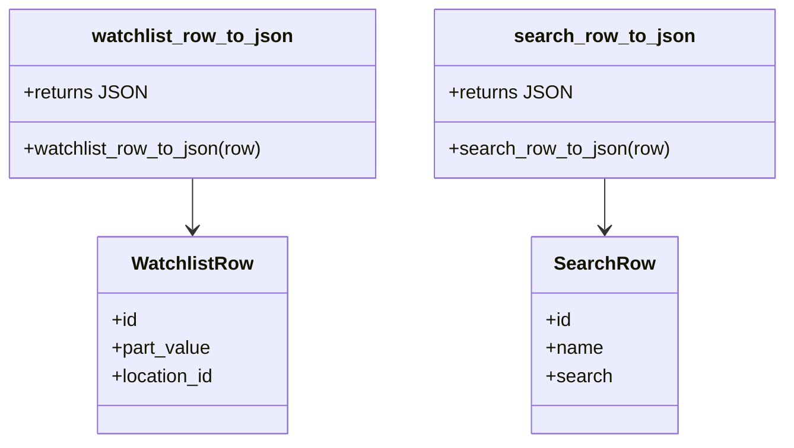

# Diagram: shipment_core/shipment_service/shipment_service/ng_preferences/ng_preferences_common.py

> Auto-generated by Obscura crawlers

## Mermaid

### SVG

<svg id="container" width="665.0234375" xmlns="http://www.w3.org/2000/svg" class="classDiagram" height="378" viewBox="0 0 665.0234375 378" role="graphics-document document" aria-roledescription="class"><g><defs><marker id="container_class-aggregationStart" class="marker aggregation class" refX="18" refY="7" markerWidth="190" markerHeight="240" orient="auto"><path d="M 18,7 L9,13 L1,7 L9,1 Z"></path></marker></defs><defs><marker id="container_class-aggregationEnd" class="marker aggregation class" refX="1" refY="7" markerWidth="20" markerHeight="28" orient="auto"><path d="M 18,7 L9,13 L1,7 L9,1 Z"></path></marker></defs><defs><marker id="container_class-extensionStart" class="marker extension class" refX="18" refY="7" markerWidth="190" markerHeight="240" orient="auto"><path d="M 1,7 L18,13 V 1 Z"></path></marker></defs><defs><marker id="container_class-extensionEnd" class="marker extension class" refX="1" refY="7" markerWidth="20" markerHeight="28" orient="auto"><path d="M 1,1 V 13 L18,7 Z"></path></marker></defs><defs><marker id="container_class-compositionStart" class="marker composition class" refX="18" refY="7" markerWidth="190" markerHeight="240" orient="auto"><path d="M 18,7 L9,13 L1,7 L9,1 Z"></path></marker></defs><defs><marker id="container_class-compositionEnd" class="marker composition class" refX="1" refY="7" markerWidth="20" markerHeight="28" orient="auto"><path d="M 18,7 L9,13 L1,7 L9,1 Z"></path></marker></defs><defs><marker id="container_class-dependencyStart" class="marker dependency class" refX="6" refY="7" markerWidth="190" markerHeight="240" orient="auto"><path d="M 5,7 L9,13 L1,7 L9,1 Z"></path></marker></defs><defs><marker id="container_class-dependencyEnd" class="marker dependency class" refX="13" refY="7" markerWidth="20" markerHeight="28" orient="auto"><path d="M 18,7 L9,13 L14,7 L9,1 Z"></path></marker></defs><defs><marker id="container_class-lollipopStart" class="marker lollipop class" refX="13" refY="7" markerWidth="190" markerHeight="240" orient="auto"><circle stroke="black" fill="transparent" cx="7" cy="7" r="6"></circle></marker></defs><defs><marker id="container_class-lollipopEnd" class="marker lollipop class" refX="1" refY="7" markerWidth="190" markerHeight="240" orient="auto"><circle stroke="black" fill="transparent" cx="7" cy="7" r="6"></circle></marker></defs><g class="root"><g class="clusters"></g><g class="edgePaths"><path d="M164.449,152L164.449,156.167C164.449,160.333,164.449,168.667,164.449,176C164.449,183.333,164.449,189.667,164.449,192.833L164.449,196" id="id_watchlist_row_to_json_WatchlistRow_1" class="edge-thickness-normal edge-pattern-solid relation" style=";;;" data-edge="true" data-et="edge" data-id="id_watchlist_row_to_json_WatchlistRow_1" data-points="W3sieCI6MTY0LjQ0OTIxODc1LCJ5IjoxNTJ9LHsieCI6MTY0LjQ0OTIxODc1LCJ5IjoxNzd9LHsieCI6MTY0LjQ0OTIxODc1LCJ5IjoyMDJ9XQ==" marker-end="url(#container_class-dependencyEnd)"></path><path d="M513.961,152L513.961,156.167C513.961,160.333,513.961,168.667,513.961,176C513.961,183.333,513.961,189.667,513.961,192.833L513.961,196" id="id_search_row_to_json_SearchRow_2" class="edge-thickness-normal edge-pattern-solid relation" style=";;;" data-edge="true" data-et="edge" data-id="id_search_row_to_json_SearchRow_2" data-points="W3sieCI6NTEzLjk2MDkzNzUsInkiOjE1Mn0seyJ4Ijo1MTMuOTYwOTM3NSwieSI6MTc3fSx7IngiOjUxMy45NjA5Mzc1LCJ5IjoyMDJ9XQ==" marker-end="url(#container_class-dependencyEnd)"></path></g><g class="edgeLabels"><g class="edgeLabel"><g class="label" data-id="id_watchlist_row_to_json_WatchlistRow_1" transform="translate(0, 0)"><foreignObject width="0" height="0">

</foreignObject></g></g><g class="edgeLabel"><g class="label" data-id="id_search_row_to_json_SearchRow_2" transform="translate(0, 0)"><foreignObject width="0" height="0">

</foreignObject></g></g></g><g class="nodes"><g class="node default" id="classId-WatchlistRow-0" transform="translate(164.44921875, 286)"><g class="basic label-container"><path d="M-81.46484375 -84 L81.46484375 -84 L81.46484375 84 L-81.46484375 84" stroke="none" stroke-width="0" fill="#ECECFF" style=""></path><path d="M-81.46484375 -84 C-27.374021982861507 -84, 26.716799784276986 -84, 81.46484375 -84 M-81.46484375 -84 C-26.163222529561324 -84, 29.138398690877352 -84, 81.46484375 -84 M81.46484375 -84 C81.46484375 -44.14376476300027, 81.46484375 -4.28752952600054, 81.46484375 84 M81.46484375 -84 C81.46484375 -20.230245447635944, 81.46484375 43.53950910472811, 81.46484375 84 M81.46484375 84 C24.688500385410535 84, -32.08784297917893 84, -81.46484375 84 M81.46484375 84 C27.564782395591116 84, -26.335278958817767 84, -81.46484375 84 M-81.46484375 84 C-81.46484375 33.836782612914355, -81.46484375 -16.32643477417129, -81.46484375 -84 M-81.46484375 84 C-81.46484375 40.73895047473083, -81.46484375 -2.522099050538344, -81.46484375 -84" stroke="#9370DB" stroke-width="1.3" fill="none" stroke-dasharray="0 0" style=""></path></g><g class="annotation-group text" transform="translate(0, -60)"></g><g class="label-group text" transform="translate(-49.3828125, -60)"><g class="label" style="font-weight: bolder" transform="translate(0,-12)"><foreignObject width="98.765625" height="24">

WatchlistRow

</foreignObject></g></g><g class="members-group text" transform="translate(-69.46484375, -12)"><g class="label" style="" transform="translate(0,-12)"><foreignObject width="22.078125" height="24">

+id

</foreignObject></g><g class="label" style="" transform="translate(0,12)"><foreignObject width="84.71875" height="24">

+part_value

</foreignObject></g><g class="label" style="" transform="translate(0,36)"><foreignObject width="89.546875" height="24">

+location_id

</foreignObject></g></g><g class="methods-group text" transform="translate(-69.46484375, 84)"></g><g class="divider" style=""><path d="M-81.46484375 -36 C-26.40216626879883 -36, 28.66051121240234 -36, 81.46484375 -36 M-81.46484375 -36 C-32.08379744983548 -36, 17.29724885032904 -36, 81.46484375 -36" stroke="#9370DB" stroke-width="1.3" fill="none" stroke-dasharray="0 0" style=""></path></g><g class="divider" style=""><path d="M-81.46484375 60 C-27.73891497970208 60, 25.98701379059584 60, 81.46484375 60 M-81.46484375 60 C-32.30453440217689 60, 16.855774945646218 60, 81.46484375 60" stroke="#9370DB" stroke-width="1.3" fill="none" stroke-dasharray="0 0" style=""></path></g></g><g class="node default" id="classId-SearchRow-1" transform="translate(513.9609375, 286)"><g class="basic label-container"><path d="M-59.82421875 -84 L59.82421875 -84 L59.82421875 84 L-59.82421875 84" stroke="none" stroke-width="0" fill="#ECECFF" style=""></path><path d="M-59.82421875 -84 C-22.246313143078083 -84, 15.331592463843833 -84, 59.82421875 -84 M-59.82421875 -84 C-15.61357525176502 -84, 28.59706824646996 -84, 59.82421875 -84 M59.82421875 -84 C59.82421875 -46.02969500517854, 59.82421875 -8.059390010357077, 59.82421875 84 M59.82421875 -84 C59.82421875 -34.400262392892586, 59.82421875 15.199475214214829, 59.82421875 84 M59.82421875 84 C13.51292898383484 84, -32.79836078233032 84, -59.82421875 84 M59.82421875 84 C34.77254258806144 84, 9.720866426122875 84, -59.82421875 84 M-59.82421875 84 C-59.82421875 41.954759040642564, -59.82421875 -0.09048191871487177, -59.82421875 -84 M-59.82421875 84 C-59.82421875 37.412905223029576, -59.82421875 -9.174189553940849, -59.82421875 -84" stroke="#9370DB" stroke-width="1.3" fill="none" stroke-dasharray="0 0" style=""></path></g><g class="annotation-group text" transform="translate(0, -60)"></g><g class="label-group text" transform="translate(-40.1953125, -60)"><g class="label" style="font-weight: bolder" transform="translate(0,-12)"><foreignObject width="80.390625" height="24">

SearchRow

</foreignObject></g></g><g class="members-group text" transform="translate(-47.82421875, -12)"><g class="label" style="" transform="translate(0,-12)"><foreignObject width="22.078125" height="24">

+id

</foreignObject></g><g class="label" style="" transform="translate(0,12)"><foreignObject width="48.5" height="24">

+name

</foreignObject></g><g class="label" style="" transform="translate(0,36)"><foreignObject width="55.453125" height="24">

+search

</foreignObject></g></g><g class="methods-group text" transform="translate(-47.82421875, 84)"></g><g class="divider" style=""><path d="M-59.82421875 -36 C-19.498109803641967 -36, 20.827999142716067 -36, 59.82421875 -36 M-59.82421875 -36 C-34.18472512343966 -36, -8.545231496879332 -36, 59.82421875 -36" stroke="#9370DB" stroke-width="1.3" fill="none" stroke-dasharray="0 0" style=""></path></g><g class="divider" style=""><path d="M-59.82421875 60 C-34.91981736600469 60, -10.01541598200938 60, 59.82421875 60 M-59.82421875 60 C-19.8099772719857 60, 20.204264206028597 60, 59.82421875 60" stroke="#9370DB" stroke-width="1.3" fill="none" stroke-dasharray="0 0" style=""></path></g></g><g class="node default" id="classId-watchlist_row_to_json-2" transform="translate(164.44921875, 80)"><g class="basic label-container"><path d="M-156.44921875 -72 L156.44921875 -72 L156.44921875 72 L-156.44921875 72" stroke="none" stroke-width="0" fill="#ECECFF" style=""></path><path d="M-156.44921875 -72 C-57.99037145927302 -72, 40.46847583145396 -72, 156.44921875 -72 M-156.44921875 -72 C-47.50028984483217 -72, 61.448639060335665 -72, 156.44921875 -72 M156.44921875 -72 C156.44921875 -33.72949400038412, 156.44921875 4.541011999231756, 156.44921875 72 M156.44921875 -72 C156.44921875 -28.844063447332147, 156.44921875 14.311873105335707, 156.44921875 72 M156.44921875 72 C90.76011093284829 72, 25.071003115696584 72, -156.44921875 72 M156.44921875 72 C72.87002027763056 72, -10.709178194738882 72, -156.44921875 72 M-156.44921875 72 C-156.44921875 18.47001117889976, -156.44921875 -35.05997764220048, -156.44921875 -72 M-156.44921875 72 C-156.44921875 33.63067939743794, -156.44921875 -4.738641205124125, -156.44921875 -72" stroke="#9370DB" stroke-width="1.3" fill="none" stroke-dasharray="0 0" style=""></path></g><g class="annotation-group text" transform="translate(0, -48)"></g><g class="label-group text" transform="translate(-82.3984375, -48)"><g class="label" style="font-weight: bolder" transform="translate(0,-12)"><foreignObject width="164.796875" height="24">

watchlist_row_to_json

</foreignObject></g></g><g class="members-group text" transform="translate(-144.44921875, 0)"><g class="label" style="" transform="translate(0,-12)"><foreignObject width="100.359375" height="24">

+returns JSON

</foreignObject></g></g><g class="methods-group text" transform="translate(-144.44921875, 48)"><g class="label" style="" transform="translate(0,-12)"><foreignObject width="206.5" height="24">

+watchlist_row_to_json(row)

</foreignObject></g></g><g class="divider" style=""><path d="M-156.44921875 -24 C-42.09857373462262 -24, 72.25207128075476 -24, 156.44921875 -24 M-156.44921875 -24 C-69.80150098631327 -24, 16.846216777373456 -24, 156.44921875 -24" stroke="#9370DB" stroke-width="1.3" fill="none" stroke-dasharray="0 0" style=""></path></g><g class="divider" style=""><path d="M-156.44921875 24 C-80.9765746940713 24, -5.503930638142606 24, 156.44921875 24 M-156.44921875 24 C-91.33371871009666 24, -26.218218670193323 24, 156.44921875 24" stroke="#9370DB" stroke-width="1.3" fill="none" stroke-dasharray="0 0" style=""></path></g></g><g class="node default" id="classId-search_row_to_json-3" transform="translate(513.9609375, 80)"><g class="basic label-container"><path d="M-143.0625 -72 L143.0625 -72 L143.0625 72 L-143.0625 72" stroke="none" stroke-width="0" fill="#ECECFF" style=""></path><path d="M-143.0625 -72 C-44.38619438550592 -72, 54.29011122898817 -72, 143.0625 -72 M-143.0625 -72 C-48.675985742064725 -72, 45.71052851587055 -72, 143.0625 -72 M143.0625 -72 C143.0625 -29.350941751098254, 143.0625 13.298116497803491, 143.0625 72 M143.0625 -72 C143.0625 -40.09687614354952, 143.0625 -8.193752287099045, 143.0625 72 M143.0625 72 C46.98787498701746 72, -49.086750025965074 72, -143.0625 72 M143.0625 72 C70.62835416730604 72, -1.8057916653879147 72, -143.0625 72 M-143.0625 72 C-143.0625 36.135832221411526, -143.0625 0.27166444282305235, -143.0625 -72 M-143.0625 72 C-143.0625 28.57489914235932, -143.0625 -14.850201715281358, -143.0625 -72" stroke="#9370DB" stroke-width="1.3" fill="none" stroke-dasharray="0 0" style=""></path></g><g class="annotation-group text" transform="translate(0, -48)"></g><g class="label-group text" transform="translate(-73.15625, -48)"><g class="label" style="font-weight: bolder" transform="translate(0,-12)"><foreignObject width="146.3125" height="24">

search_row_to_json

</foreignObject></g></g><g class="members-group text" transform="translate(-131.0625, 0)"><g class="label" style="" transform="translate(0,-12)"><foreignObject width="100.359375" height="24">

+returns JSON

</foreignObject></g></g><g class="methods-group text" transform="translate(-131.0625, 48)"><g class="label" style="" transform="translate(0,-12)"><foreignObject width="188.96875" height="24">

+search_row_to_json(row)

</foreignObject></g></g><g class="divider" style=""><path d="M-143.0625 -24 C-64.0472297320914 -24, 14.96804053581721 -24, 143.0625 -24 M-143.0625 -24 C-71.7765209387127 -24, -0.490541877425386 -24, 143.0625 -24" stroke="#9370DB" stroke-width="1.3" fill="none" stroke-dasharray="0 0" style=""></path></g><g class="divider" style=""><path d="M-143.0625 24 C-34.264347616938664 24, 74.53380476612267 24, 143.0625 24 M-143.0625 24 C-73.14695404935564 24, -3.2314080987112845 24, 143.0625 24" stroke="#9370DB" stroke-width="1.3" fill="none" stroke-dasharray="0 0" style=""></path></g></g></g></g></g></svg>
