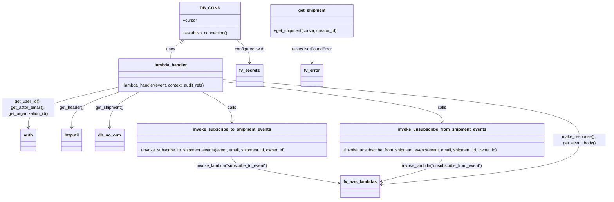

# Diagram: shipment_core/shipment_service/shipment_service/ng_preferences/set_shipment_watch.py


> Auto-generated by Obscura crawlers

## Diagram 1



### SVG

<svg id="container" width="2325.1796875" xmlns="http://www.w3.org/2000/svg" class="classDiagram" height="766" viewBox="0 0 2325.1796875 766" role="graphics-document document" aria-roledescription="class"><style>#container{font-family:"trebuchet ms",verdana,arial,sans-serif;font-size:16px;fill:#333;}@keyframes edge-animation-frame{from{stroke-dashoffset:0;}}@keyframes dash{to{stroke-dashoffset:0;}}#container .edge-animation-slow{stroke-dasharray:9,5!important;stroke-dashoffset:900;animation:dash 50s linear infinite;stroke-linecap:round;}#container .edge-animation-fast{stroke-dasharray:9,5!important;stroke-dashoffset:900;animation:dash 20s linear infinite;stroke-linecap:round;}#container .error-icon{fill:#552222;}#container .error-text{fill:#552222;stroke:#552222;}#container .edge-thickness-normal{stroke-width:1px;}#container .edge-thickness-thick{stroke-width:3.5px;}#container .edge-pattern-solid{stroke-dasharray:0;}#container .edge-thickness-invisible{stroke-width:0;fill:none;}#container .edge-pattern-dashed{stroke-dasharray:3;}#container .edge-pattern-dotted{stroke-dasharray:2;}#container .marker{fill:#333333;stroke:#333333;}#container .marker.cross{stroke:#333333;}#container svg{font-family:"trebuchet ms",verdana,arial,sans-serif;font-size:16px;}#container p{margin:0;}#container g.classGroup text{fill:#9370DB;stroke:none;font-family:"trebuchet ms",verdana,arial,sans-serif;font-size:10px;}#container g.classGroup text .title{font-weight:bolder;}#container .nodeLabel,#container .edgeLabel{color:#131300;}#container .edgeLabel .label rect{fill:#ECECFF;}#container .label text{fill:#131300;}#container .labelBkg{background:#ECECFF;}#container .edgeLabel .label span{background:#ECECFF;}#container .classTitle{font-weight:bolder;}#container .node rect,#container .node circle,#container .node ellipse,#container .node polygon,#container .node path{fill:#ECECFF;stroke:#9370DB;stroke-width:1px;}#container .divider{stroke:#9370DB;stroke-width:1;}#container g.clickable{cursor:pointer;}#container g.classGroup rect{fill:#ECECFF;stroke:#9370DB;}#container g.classGroup line{stroke:#9370DB;stroke-width:1;}#container .classLabel .box{stroke:none;stroke-width:0;fill:#ECECFF;opacity:0.5;}#container .classLabel .label{fill:#9370DB;font-size:10px;}#container .relation{stroke:#333333;stroke-width:1;fill:none;}#container .dashed-line{stroke-dasharray:3;}#container .dotted-line{stroke-dasharray:1 2;}#container #compositionStart,#container .composition{fill:#333333!important;stroke:#333333!important;stroke-width:1;}#container #compositionEnd,#container .composition{fill:#333333!important;stroke:#333333!important;stroke-width:1;}#container #dependencyStart,#container .dependency{fill:#333333!important;stroke:#333333!important;stroke-width:1;}#container #dependencyStart,#container .dependency{fill:#333333!important;stroke:#333333!important;stroke-width:1;}#container #extensionStart,#container .extension{fill:transparent!important;stroke:#333333!important;stroke-width:1;}#container #extensionEnd,#container .extension{fill:transparent!important;stroke:#333333!important;stroke-width:1;}#container #aggregationStart,#container .aggregation{fill:transparent!important;stroke:#333333!important;stroke-width:1;}#container #aggregationEnd,#container .aggregation{fill:transparent!important;stroke:#333333!important;stroke-width:1;}#container #lollipopStart,#container .lollipop{fill:#ECECFF!important;stroke:#333333!important;stroke-width:1;}#container #lollipopEnd,#container .lollipop{fill:#ECECFF!important;stroke:#333333!important;stroke-width:1;}#container .edgeTerminals{font-size:11px;line-height:initial;}#container .classTitleText{text-anchor:middle;font-size:18px;fill:#333;}#container .label-icon{display:inline-block;height:1em;overflow:visible;vertical-align:-0.125em;}#container .node .label-icon path{fill:currentColor;stroke:revert;stroke-width:revert;}#container :root{--mermaid-font-family:"trebuchet ms",verdana,arial,sans-serif;}</style><g><defs><marker id="container_class-aggregationStart" class="marker aggregation class" refX="18" refY="7" markerWidth="190" markerHeight="240" orient="auto"><path d="M 18,7 L9,13 L1,7 L9,1 Z"></path></marker></defs><defs><marker id="container_class-aggregationEnd" class="marker aggregation class" refX="1" refY="7" markerWidth="20" markerHeight="28" orient="auto"><path d="M 18,7 L9,13 L1,7 L9,1 Z"></path></marker></defs><defs><marker id="container_class-extensionStart" class="marker extension class" refX="18" refY="7" markerWidth="190" markerHeight="240" orient="auto"><path d="M 1,7 L18,13 V 1 Z"></path></marker></defs><defs><marker id="container_class-extensionEnd" class="marker extension class" refX="1" refY="7" markerWidth="20" markerHeight="28" orient="auto"><path d="M 1,1 V 13 L18,7 Z"></path></marker></defs><defs><marker id="container_class-compositionStart" class="marker composition class" refX="18" refY="7" markerWidth="190" markerHeight="240" orient="auto"><path d="M 18,7 L9,13 L1,7 L9,1 Z"></path></marker></defs><defs><marker id="container_class-compositionEnd" class="marker composition class" refX="1" refY="7" markerWidth="20" markerHeight="28" orient="auto"><path d="M 18,7 L9,13 L1,7 L9,1 Z"></path></marker></defs><defs><marker id="container_class-dependencyStart" class="marker dependency class" refX="6" refY="7" markerWidth="190" markerHeight="240" orient="auto"><path d="M 5,7 L9,13 L1,7 L9,1 Z"></path></marker></defs><defs><marker id="container_class-dependencyEnd" class="marker dependency class" refX="13" refY="7" markerWidth="20" markerHeight="28" orient="auto"><path d="M 18,7 L9,13 L14,7 L9,1 Z"></path></marker></defs><defs><marker id="container_class-lollipopStart" class="marker lollipop class" refX="13" refY="7" markerWidth="190" markerHeight="240" orient="auto"><circle stroke="black" fill="transparent" cx="7" cy="7" r="6"></circle></marker></defs><defs><marker id="container_class-lollipopEnd" class="marker lollipop class" refX="1" refY="7" markerWidth="190" markerHeight="240" orient="auto"><circle stroke="black" fill="transparent" cx="7" cy="7" r="6"></circle></marker></defs><g class="root"><g class="clusters"></g><g class="edgePaths"><path d="M688.204,162.093L681.988,166.577C675.773,171.062,663.341,180.031,657.126,190.682C650.91,201.333,650.91,213.667,650.91,219.833L650.91,226" id="id_DB_CONN_lambda_handler_1" class="edge-thickness-normal edge-pattern-solid relation" style=";;;" data-edge="true" data-et="edge" data-id="id_DB_CONN_lambda_handler_1" data-points="W3sieCI6NzAyLjE5Mjg5MzQ5MTk3MjQsInkiOjE1Mn0seyJ4Ijo2NTAuOTEwMTU2MjUsInkiOjE4OX0seyJ4Ijo2NTAuOTEwMTU2MjUsInkiOjIyNn1d" marker-start="url(#container_class-extensionStart)"></path><path d="M448.078,335.327L391.398,348.272C334.719,361.218,221.359,387.109,164.68,412.721C108,438.333,108,463.667,108,476.333L108,489" id="id_lambda_handler_auth_2" class="edge-thickness-normal edge-pattern-solid relation" style=";;;" data-edge="true" data-et="edge" data-id="id_lambda_handler_auth_2" data-points="W3sieCI6NDQ4LjA3ODEyNSwieSI6MzM1LjMyNjU4MjAwNTI1MjM2fSx7IngiOjEwOCwieSI6NDEzfSx7IngiOjEwOCwieSI6NDk1fV0=" marker-end="url(#container_class-dependencyEnd)"></path><path d="M459.507,352L428.619,362.167C397.731,372.333,335.955,392.667,305.068,415.5C274.18,438.333,274.18,463.667,274.18,476.333L274.18,489" id="id_lambda_handler_httputil_3" class="edge-thickness-normal edge-pattern-solid relation" style=";;;" data-edge="true" data-et="edge" data-id="id_lambda_handler_httputil_3" data-points="W3sieCI6NDU5LjUwNjc3MjkzMzQ2Nzc0LCJ5IjozNTJ9LHsieCI6Mjc0LjE3OTY4NzUsInkiOjQxM30seyJ4IjoyNzQuMTc5Njg3NSwieSI6NDk1fV0=" marker-end="url(#container_class-dependencyEnd)"></path><path d="M532.271,352L513.126,362.167C493.98,372.333,455.689,392.667,436.544,415.5C417.398,438.333,417.398,463.667,417.398,476.333L417.398,489" id="id_lambda_handler_db_no_orm_4" class="edge-thickness-normal edge-pattern-solid relation" style=";;;" data-edge="true" data-et="edge" data-id="id_lambda_handler_db_no_orm_4" data-points="W3sieCI6NTMyLjI3MTEzNzg1MjgyMjYsInkiOjM1Mn0seyJ4Ijo0MTcuMzk4NDM3NSwieSI6NDEzfSx7IngiOjQxNy4zOTg0Mzc1LCJ5Ijo0OTV9XQ==" marker-end="url(#container_class-dependencyEnd)"></path><path d="M769.549,352L788.695,362.167C807.84,372.333,846.131,392.667,865.276,412C884.422,431.333,884.422,449.667,884.422,458.833L884.422,468" id="id_lambda_handler_invoke_subscribe_to_shipment_events_5" class="edge-thickness-normal edge-pattern-solid relation" style=";;;" data-edge="true" data-et="edge" data-id="id_lambda_handler_invoke_subscribe_to_shipment_events_5" data-points="W3sieCI6NzY5LjU0OTE3NDY0NzE3NzQsInkiOjM1Mn0seyJ4Ijo4ODQuNDIxODc1LCJ5Ijo0MTN9LHsieCI6ODg0LjQyMTg3NSwieSI6NDc0fV0=" marker-end="url(#container_class-dependencyEnd)"></path><path d="M853.742,313.202L993.141,329.835C1132.54,346.468,1411.339,379.734,1550.738,405.534C1690.137,431.333,1690.137,449.667,1690.137,458.833L1690.137,468" id="id_lambda_handler_invoke_unsubscribe_from_shipment_events_6" class="edge-thickness-normal edge-pattern-solid relation" style=";;;" data-edge="true" data-et="edge" data-id="id_lambda_handler_invoke_unsubscribe_from_shipment_events_6" data-points="W3sieCI6ODUzLjc0MjE4NzUsInkiOjMxMy4yMDE4MTc3NTgwOTgzNH0seyJ4IjoxNjkwLjEzNjcxODc1LCJ5Ijo0MTN9LHsieCI6MTY5MC4xMzY3MTg3NSwieSI6NDc0fV0=" marker-end="url(#container_class-dependencyEnd)"></path><path d="M884.422,600L884.422,606.167C884.422,612.333,884.422,624.667,953.49,641.915C1022.559,659.163,1160.696,681.325,1229.765,692.407L1298.834,703.488" id="id_invoke_subscribe_to_shipment_events_fv_aws_lambdas_7" class="edge-thickness-normal edge-pattern-solid relation" style=";;;" data-edge="true" data-et="edge" data-id="id_invoke_subscribe_to_shipment_events_fv_aws_lambdas_7" data-points="W3sieCI6ODg0LjQyMTg3NSwieSI6NjAwfSx7IngiOjg4NC40MjE4NzUsInkiOjYzN30seyJ4IjoxMzA0Ljc1NzgxMjUsInkiOjcwNC40MzgzNTE4MTc0NzV9XQ==" marker-end="url(#container_class-dependencyEnd)"></path><path d="M1690.137,600L1690.137,606.167C1690.137,612.333,1690.137,624.667,1650.897,640.727C1611.658,656.788,1533.179,676.575,1493.94,686.469L1454.701,696.363" id="id_invoke_unsubscribe_from_shipment_events_fv_aws_lambdas_8" class="edge-thickness-normal edge-pattern-solid relation" style=";;;" data-edge="true" data-et="edge" data-id="id_invoke_unsubscribe_from_shipment_events_fv_aws_lambdas_8" data-points="W3sieCI6MTY5MC4xMzY3MTg3NSwieSI6NjAwfSx7IngiOjE2OTAuMTM2NzE4NzUsInkiOjYzN30seyJ4IjoxNDQ4Ljg4MjgxMjUsInkiOjY5Ny44MzAwNjg5NDQ4ODE1fV0=" marker-end="url(#container_class-dependencyEnd)"></path><path d="M1192.635,143L1192.635,150.667C1192.635,158.333,1192.635,173.667,1192.635,190C1192.635,206.333,1192.635,223.667,1192.635,232.333L1192.635,241" id="id_get_shipment_fv_error_9" class="edge-thickness-normal edge-pattern-solid relation" style=";;;" data-edge="true" data-et="edge" data-id="id_get_shipment_fv_error_9" data-points="W3sieCI6MTE5Mi42MzQ3NjU2MjUsInkiOjE0M30seyJ4IjoxMTkyLjYzNDc2NTYyNSwieSI6MTg5fSx7IngiOjExOTIuNjM0NzY1NjI1LCJ5IjoyNDd9XQ==" marker-end="url(#container_class-dependencyEnd)"></path><path d="M901.78,152L910.327,158.167C918.874,164.333,935.968,176.667,944.515,191.5C953.063,206.333,953.063,223.667,953.063,232.333L953.063,241" id="id_DB_CONN_fv_secrets_10" class="edge-thickness-normal edge-pattern-solid relation" style=";;;" data-edge="true" data-et="edge" data-id="id_DB_CONN_fv_secrets_10" data-points="W3sieCI6OTAxLjc3OTc2Mjc1ODAyNzYsInkiOjE1Mn0seyJ4Ijo5NTMuMDYyNSwieSI6MTg5fSx7IngiOjk1My4wNjI1LCJ5IjoyNDd9XQ==" marker-end="url(#container_class-dependencyEnd)"></path><path d="M853.742,305.058L1080.982,323.048C1308.221,341.039,1762.701,377.019,1989.94,415.676C2217.18,454.333,2217.18,495.667,2217.18,533C2217.18,570.333,2217.18,603.667,2090.126,632.277C1963.072,660.888,1708.964,684.776,1581.91,696.72L1454.856,708.664" id="id_lambda_handler_fv_aws_lambdas_11" class="edge-thickness-normal edge-pattern-solid relation" style=";;;" data-edge="true" data-et="edge" data-id="id_lambda_handler_fv_aws_lambdas_11" data-points="W3sieCI6ODUzLjc0MjE4NzUsInkiOjMwNS4wNTgwMTAwNTA3NTI1Nn0seyJ4IjoyMjE3LjE3OTY4NzUsInkiOjQxM30seyJ4IjoyMjE3LjE3OTY4NzUsInkiOjUzN30seyJ4IjoyMjE3LjE3OTY4NzUsInkiOjYzN30seyJ4IjoxNDQ4Ljg4MjgxMjUsInkiOjcwOS4yMjU1OTE3Mjk3Mjg4fV0=" marker-end="url(#container_class-dependencyEnd)"></path></g><g class="edgeLabels"><g class="edgeLabel" transform="translate(650.91015625, 189)"><g class="label" data-id="id_DB_CONN_lambda_handler_1" transform="translate(-16.4921875, -12)"><foreignObject width="32.984375" height="24"><div xmlns="http://www.w3.org/1999/xhtml" class="labelBkg" style="display: table-cell; white-space: nowrap; line-height: 1.5; max-width: 200px; text-align: center;"><span class="edgeLabel"><p>uses</p></span></div></foreignObject></g></g><g class="edgeLabel" transform="translate(108, 413)"><g class="label" data-id="id_lambda_handler_auth_2" transform="translate(-100, -36)"><foreignObject width="200" height="72"><div xmlns="http://www.w3.org/1999/xhtml" class="labelBkg" style="display: table; white-space: break-spaces; line-height: 1.5; max-width: 200px; text-align: center; width: 200px;"><span class="edgeLabel"><p>get_user_id(), get_actor_email(), get_organization_id()</p></span></div></foreignObject></g></g><g class="edgeLabel" transform="translate(274.1796875, 413)"><g class="label" data-id="id_lambda_handler_httputil_3" transform="translate(-46.1796875, -12)"><foreignObject width="92.359375" height="24"><div xmlns="http://www.w3.org/1999/xhtml" class="labelBkg" style="display: table-cell; white-space: nowrap; line-height: 1.5; max-width: 200px; text-align: center;"><span class="edgeLabel"><p>get_header()</p></span></div></foreignObject></g></g><g class="edgeLabel" transform="translate(417.3984375, 413)"><g class="label" data-id="id_lambda_handler_db_no_orm_4" transform="translate(-54.8515625, -12)"><foreignObject width="109.703125" height="24"><div xmlns="http://www.w3.org/1999/xhtml" class="labelBkg" style="display: table-cell; white-space: nowrap; line-height: 1.5; max-width: 200px; text-align: center;"><span class="edgeLabel"><p>get_shipment()</p></span></div></foreignObject></g></g><g class="edgeLabel" transform="translate(884.421875, 413)"><g class="label" data-id="id_lambda_handler_invoke_subscribe_to_shipment_events_5" transform="translate(-16.4453125, -12)"><foreignObject width="32.890625" height="24"><div xmlns="http://www.w3.org/1999/xhtml" class="labelBkg" style="display: table-cell; white-space: nowrap; line-height: 1.5; max-width: 200px; text-align: center;"><span class="edgeLabel"><p>calls</p></span></div></foreignObject></g></g><g class="edgeLabel" transform="translate(1690.13671875, 413)"><g class="label" data-id="id_lambda_handler_invoke_unsubscribe_from_shipment_events_6" transform="translate(-16.4453125, -12)"><foreignObject width="32.890625" height="24"><div xmlns="http://www.w3.org/1999/xhtml" class="labelBkg" style="display: table-cell; white-space: nowrap; line-height: 1.5; max-width: 200px; text-align: center;"><span class="edgeLabel"><p>calls</p></span></div></foreignObject></g></g><g class="edgeLabel" transform="translate(884.421875, 637)"><g class="label" data-id="id_invoke_subscribe_to_shipment_events_fv_aws_lambdas_7" transform="translate(-136.984375, -12)"><foreignObject width="273.96875" height="24"><div xmlns="http://www.w3.org/1999/xhtml" class="labelBkg" style="display: table; white-space: break-spaces; line-height: 1.5; max-width: 200px; text-align: center; width: 200px;"><span class="edgeLabel"><p>invoke_lambda("subscribe_to_event")</p></span></div></foreignObject></g></g><g class="edgeLabel" transform="translate(1690.13671875, 637)"><g class="label" data-id="id_invoke_unsubscribe_from_shipment_events_fv_aws_lambdas_8" transform="translate(-156.1875, -12)"><foreignObject width="312.375" height="24"><div xmlns="http://www.w3.org/1999/xhtml" class="labelBkg" style="display: table; white-space: break-spaces; line-height: 1.5; max-width: 200px; text-align: center; width: 200px;"><span class="edgeLabel"><p>invoke_lambda("unsubscribe_from_event")</p></span></div></foreignObject></g></g><g class="edgeLabel" transform="translate(1192.634765625, 189)"><g class="label" data-id="id_get_shipment_fv_error_9" transform="translate(-76.7421875, -12)"><foreignObject width="153.484375" height="24"><div xmlns="http://www.w3.org/1999/xhtml" class="labelBkg" style="display: table-cell; white-space: nowrap; line-height: 1.5; max-width: 200px; text-align: center;"><span class="edgeLabel"><p>raises NotFoundError</p></span></div></foreignObject></g></g><g class="edgeLabel" transform="translate(953.0625, 189)"><g class="label" data-id="id_DB_CONN_fv_secrets_10" transform="translate(-57.921875, -12)"><foreignObject width="115.84375" height="24"><div xmlns="http://www.w3.org/1999/xhtml" class="labelBkg" style="display: table-cell; white-space: nowrap; line-height: 1.5; max-width: 200px; text-align: center;"><span class="edgeLabel"><p>configured_with</p></span></div></foreignObject></g></g><g class="edgeLabel" transform="translate(2217.1796875, 537)"><g class="label" data-id="id_lambda_handler_fv_aws_lambdas_11" transform="translate(-100, -24)"><foreignObject width="200" height="48"><div xmlns="http://www.w3.org/1999/xhtml" class="labelBkg" style="display: table; white-space: break-spaces; line-height: 1.5; max-width: 200px; text-align: center; width: 200px;"><span class="edgeLabel"><p>make_response(), get_event_body()</p></span></div></foreignObject></g></g></g><g class="nodes"><g class="node default" id="classId-DB_CONN-0" transform="translate(801.986328125, 80)"><g class="basic label-container"><path d="M-115.8359375 -72 L115.8359375 -72 L115.8359375 72 L-115.8359375 72" stroke="none" stroke-width="0" fill="#ECECFF" style=""></path><path d="M-115.8359375 -72 C-34.064006731328675 -72, 47.70792403734265 -72, 115.8359375 -72 M-115.8359375 -72 C-35.668038918462 -72, 44.499859663075995 -72, 115.8359375 -72 M115.8359375 -72 C115.8359375 -14.930505394359692, 115.8359375 42.13898921128062, 115.8359375 72 M115.8359375 -72 C115.8359375 -42.08456391246672, 115.8359375 -12.169127824933447, 115.8359375 72 M115.8359375 72 C24.073122450921062 72, -67.68969259815788 72, -115.8359375 72 M115.8359375 72 C63.09937140140976 72, 10.362805302819524 72, -115.8359375 72 M-115.8359375 72 C-115.8359375 30.591299506980363, -115.8359375 -10.817400986039274, -115.8359375 -72 M-115.8359375 72 C-115.8359375 42.17149630480071, -115.8359375 12.342992609601417, -115.8359375 -72" stroke="#9370DB" stroke-width="1.3" fill="none" stroke-dasharray="0 0" style=""></path></g><g class="annotation-group text" transform="translate(0, -48)"></g><g class="label-group text" transform="translate(-34.40625, -48)"><g class="label" style="font-weight: bolder" transform="translate(0,-12)"><foreignObject width="68.8125" height="24"><div xmlns="http://www.w3.org/1999/xhtml" style="display: table-cell; white-space: nowrap; line-height: 1.5; max-width: 119px; text-align: center;"><span class="nodeLabel markdown-node-label" style=""><p>DB_CONN</p></span></div></foreignObject></g></g><g class="members-group text" transform="translate(-103.8359375, 0)"><g class="label" style="" transform="translate(0,-12)"><foreignObject width="53.71875" height="24"><div xmlns="http://www.w3.org/1999/xhtml" style="display: table-cell; white-space: nowrap; line-height: 1.5; max-width: 112px; text-align: center;"><span class="nodeLabel markdown-node-label" style=""><p>+cursor</p></span></div></foreignObject></g></g><g class="methods-group text" transform="translate(-103.8359375, 48)"><g class="label" style="" transform="translate(0,-12)"><foreignObject width="173.265625" height="24"><div xmlns="http://www.w3.org/1999/xhtml" style="display: table-cell; white-space: nowrap; line-height: 1.5; max-width: 231px; text-align: center;"><span class="nodeLabel markdown-node-label" style=""><p>+establish_connection()</p></span></div></foreignObject></g></g><g class="divider" style=""><path d="M-115.8359375 -24 C-44.953336702950736 -24, 25.929264094098528 -24, 115.8359375 -24 M-115.8359375 -24 C-41.046324466333346 -24, 33.74328856733331 -24, 115.8359375 -24" stroke="#9370DB" stroke-width="1.3" fill="none" stroke-dasharray="0 0" style=""></path></g><g class="divider" style=""><path d="M-115.8359375 24 C-53.92848280576127 24, 7.97897188847746 24, 115.8359375 24 M-115.8359375 24 C-65.71342404850667 24, -15.590910597013334 24, 115.8359375 24" stroke="#9370DB" stroke-width="1.3" fill="none" stroke-dasharray="0 0" style=""></path></g></g><g class="node default" id="classId-get_shipment-1" transform="translate(1192.634765625, 80)"><g class="basic label-container"><path d="M-158.64453125 -63 L158.64453125 -63 L158.64453125 63 L-158.64453125 63" stroke="none" stroke-width="0" fill="#ECECFF" style=""></path><path d="M-158.64453125 -63 C-34.61959741051156 -63, 89.40533642897688 -63, 158.64453125 -63 M-158.64453125 -63 C-39.82622302924213 -63, 78.99208519151574 -63, 158.64453125 -63 M158.64453125 -63 C158.64453125 -17.85697029431976, 158.64453125 27.286059411360483, 158.64453125 63 M158.64453125 -63 C158.64453125 -21.801949497382374, 158.64453125 19.396101005235252, 158.64453125 63 M158.64453125 63 C80.28608051728428 63, 1.927629784568552 63, -158.64453125 63 M158.64453125 63 C54.97885207550685 63, -48.6868270989863 63, -158.64453125 63 M-158.64453125 63 C-158.64453125 27.3585179037756, -158.64453125 -8.282964192448802, -158.64453125 -63 M-158.64453125 63 C-158.64453125 25.675761909328024, -158.64453125 -11.648476181343952, -158.64453125 -63" stroke="#9370DB" stroke-width="1.3" fill="none" stroke-dasharray="0 0" style=""></path></g><g class="annotation-group text" transform="translate(0, -39)"></g><g class="label-group text" transform="translate(-50.2890625, -39)"><g class="label" style="font-weight: bolder" transform="translate(0,-12)"><foreignObject width="100.578125" height="24"><div xmlns="http://www.w3.org/1999/xhtml" style="display: table-cell; white-space: nowrap; line-height: 1.5; max-width: 150px; text-align: center;"><span class="nodeLabel markdown-node-label" style=""><p>get_shipment</p></span></div></foreignObject></g></g><g class="members-group text" transform="translate(-146.64453125, 9)"></g><g class="methods-group text" transform="translate(-146.64453125, 39)"><g class="label" style="" transform="translate(0,-12)"><foreignObject width="243" height="24"><div xmlns="http://www.w3.org/1999/xhtml" style="display: table-cell; white-space: nowrap; line-height: 1.5; max-width: 300px; text-align: center;"><span class="nodeLabel markdown-node-label" style=""><p>+get_shipment(cursor, creator_id)</p></span></div></foreignObject></g></g><g class="divider" style=""><path d="M-158.64453125 -15 C-80.28709444248747 -15, -1.9296576349749444 -15, 158.64453125 -15 M-158.64453125 -15 C-50.55075734669997 -15, 57.543016556600065 -15, 158.64453125 -15" stroke="#9370DB" stroke-width="1.3" fill="none" stroke-dasharray="0 0" style=""></path></g><g class="divider" style=""><path d="M-158.64453125 9 C-32.16449760872342 9, 94.31553603255315 9, 158.64453125 9 M-158.64453125 9 C-87.84364328494985 9, -17.042755319899697 9, 158.64453125 9" stroke="#9370DB" stroke-width="1.3" fill="none" stroke-dasharray="0 0" style=""></path></g></g><g class="node default" id="classId-invoke_subscribe_to_shipment_events-2" transform="translate(884.421875, 537)"><g class="basic label-container"><path d="M-363.671875 -63 L363.671875 -63 L363.671875 63 L-363.671875 63" stroke="none" stroke-width="0" fill="#ECECFF" style=""></path><path d="M-363.671875 -63 C-217.48675991347653 -63, -71.30164482695307 -63, 363.671875 -63 M-363.671875 -63 C-123.02037888441947 -63, 117.63111723116106 -63, 363.671875 -63 M363.671875 -63 C363.671875 -17.922272078473597, 363.671875 27.155455843052806, 363.671875 63 M363.671875 -63 C363.671875 -15.646871817532357, 363.671875 31.706256364935285, 363.671875 63 M363.671875 63 C129.62735569751104 63, -104.41716360497793 63, -363.671875 63 M363.671875 63 C139.761124061302 63, -84.14962687739597 63, -363.671875 63 M-363.671875 63 C-363.671875 35.13531074430217, -363.671875 7.270621488604334, -363.671875 -63 M-363.671875 63 C-363.671875 36.584655972453845, -363.671875 10.169311944907683, -363.671875 -63" stroke="#9370DB" stroke-width="1.3" fill="none" stroke-dasharray="0 0" style=""></path></g><g class="annotation-group text" transform="translate(0, -39)"></g><g class="label-group text" transform="translate(-142.0625, -39)"><g class="label" style="font-weight: bolder" transform="translate(0,-12)"><foreignObject width="284.125" height="24"><div xmlns="http://www.w3.org/1999/xhtml" style="display: table-cell; white-space: nowrap; line-height: 1.5; max-width: 331px; text-align: center;"><span class="nodeLabel markdown-node-label" style=""><p>invoke_subscribe_to_shipment_events</p></span></div></foreignObject></g></g><g class="members-group text" transform="translate(-351.671875, 9)"></g><g class="methods-group text" transform="translate(-351.671875, 39)"><g class="label" style="" transform="translate(0,-12)"><foreignObject width="561.28125" height="24"><div xmlns="http://www.w3.org/1999/xhtml" style="display: table-cell; white-space: nowrap; line-height: 1.5; max-width: 619px; text-align: center;"><span class="nodeLabel markdown-node-label" style=""><p>+invoke_subscribe_to_shipment_events(event, email, shipment_id, owner_id)</p></span></div></foreignObject></g></g><g class="divider" style=""><path d="M-363.671875 -15 C-150.13107233888604 -15, 63.409730322227915 -15, 363.671875 -15 M-363.671875 -15 C-125.30365906704108 -15, 113.06455686591784 -15, 363.671875 -15" stroke="#9370DB" stroke-width="1.3" fill="none" stroke-dasharray="0 0" style=""></path></g><g class="divider" style=""><path d="M-363.671875 9 C-183.95969879921157 9, -4.2475225984231315 9, 363.671875 9 M-363.671875 9 C-140.7364542025216 9, 82.1989665949568 9, 363.671875 9" stroke="#9370DB" stroke-width="1.3" fill="none" stroke-dasharray="0 0" style=""></path></g></g><g class="node default" id="classId-invoke_unsubscribe_from_shipment_events-3" transform="translate(1690.13671875, 537)"><g class="basic label-container"><path d="M-392.04296875 -63 L392.04296875 -63 L392.04296875 63 L-392.04296875 63" stroke="none" stroke-width="0" fill="#ECECFF" style=""></path><path d="M-392.04296875 -63 C-105.38421672953882 -63, 181.27453529092236 -63, 392.04296875 -63 M-392.04296875 -63 C-123.18979257778858 -63, 145.66338359442284 -63, 392.04296875 -63 M392.04296875 -63 C392.04296875 -12.75390630918897, 392.04296875 37.49218738162206, 392.04296875 63 M392.04296875 -63 C392.04296875 -19.49737798738427, 392.04296875 24.005244025231463, 392.04296875 63 M392.04296875 63 C80.40082638520931 63, -231.24131597958137 63, -392.04296875 63 M392.04296875 63 C79.58104836947382 63, -232.88087201105236 63, -392.04296875 63 M-392.04296875 63 C-392.04296875 26.293760229346248, -392.04296875 -10.412479541307505, -392.04296875 -63 M-392.04296875 63 C-392.04296875 14.139572918733393, -392.04296875 -34.720854162533215, -392.04296875 -63" stroke="#9370DB" stroke-width="1.3" fill="none" stroke-dasharray="0 0" style=""></path></g><g class="annotation-group text" transform="translate(0, -39)"></g><g class="label-group text" transform="translate(-160.8828125, -39)"><g class="label" style="font-weight: bolder" transform="translate(0,-12)"><foreignObject width="321.765625" height="24"><div xmlns="http://www.w3.org/1999/xhtml" style="display: table-cell; white-space: nowrap; line-height: 1.5; max-width: 369px; text-align: center;"><span class="nodeLabel markdown-node-label" style=""><p>invoke_unsubscribe_from_shipment_events</p></span></div></foreignObject></g></g><g class="members-group text" transform="translate(-380.04296875, 9)"></g><g class="methods-group text" transform="translate(-380.04296875, 39)"><g class="label" style="" transform="translate(0,-12)"><foreignObject width="599.203125" height="24"><div xmlns="http://www.w3.org/1999/xhtml" style="display: table-cell; white-space: nowrap; line-height: 1.5; max-width: 657px; text-align: center;"><span class="nodeLabel markdown-node-label" style=""><p>+invoke_unsubscribe_from_shipment_events(event, email, shipment_id, owner_id)</p></span></div></foreignObject></g></g><g class="divider" style=""><path d="M-392.04296875 -15 C-186.61898721771846 -15, 18.80499431456309 -15, 392.04296875 -15 M-392.04296875 -15 C-219.3092374593648 -15, -46.57550616872959 -15, 392.04296875 -15" stroke="#9370DB" stroke-width="1.3" fill="none" stroke-dasharray="0 0" style=""></path></g><g class="divider" style=""><path d="M-392.04296875 9 C-124.49276320810668 9, 143.05744233378664 9, 392.04296875 9 M-392.04296875 9 C-160.26753106415543 9, 71.50790662168913 9, 392.04296875 9" stroke="#9370DB" stroke-width="1.3" fill="none" stroke-dasharray="0 0" style=""></path></g></g><g class="node default" id="classId-lambda_handler-4" transform="translate(650.91015625, 289)"><g class="basic label-container"><path d="M-202.83203125 -63 L202.83203125 -63 L202.83203125 63 L-202.83203125 63" stroke="none" stroke-width="0" fill="#ECECFF" style=""></path><path d="M-202.83203125 -63 C-93.23437067993476 -63, 16.36328989013049 -63, 202.83203125 -63 M-202.83203125 -63 C-61.358552280842645 -63, 80.11492668831471 -63, 202.83203125 -63 M202.83203125 -63 C202.83203125 -17.74857726495322, 202.83203125 27.50284547009356, 202.83203125 63 M202.83203125 -63 C202.83203125 -13.815332488898399, 202.83203125 35.3693350222032, 202.83203125 63 M202.83203125 63 C73.05159148138517 63, -56.72884828722965 63, -202.83203125 63 M202.83203125 63 C105.77723102001903 63, 8.72243079003806 63, -202.83203125 63 M-202.83203125 63 C-202.83203125 16.113933315247266, -202.83203125 -30.772133369505468, -202.83203125 -63 M-202.83203125 63 C-202.83203125 22.712042068731193, -202.83203125 -17.575915862537613, -202.83203125 -63" stroke="#9370DB" stroke-width="1.3" fill="none" stroke-dasharray="0 0" style=""></path></g><g class="annotation-group text" transform="translate(0, -39)"></g><g class="label-group text" transform="translate(-59.9765625, -39)"><g class="label" style="font-weight: bolder" transform="translate(0,-12)"><foreignObject width="119.953125" height="24"><div xmlns="http://www.w3.org/1999/xhtml" style="display: table-cell; white-space: nowrap; line-height: 1.5; max-width: 170px; text-align: center;"><span class="nodeLabel markdown-node-label" style=""><p>lambda_handler</p></span></div></foreignObject></g></g><g class="members-group text" transform="translate(-190.83203125, 9)"></g><g class="methods-group text" transform="translate(-190.83203125, 39)"><g class="label" style="" transform="translate(0,-12)"><foreignObject width="321.6875" height="24"><div xmlns="http://www.w3.org/1999/xhtml" style="display: table-cell; white-space: nowrap; line-height: 1.5; max-width: 379px; text-align: center;"><span class="nodeLabel markdown-node-label" style=""><p>+lambda_handler(event, context, audit_refs)</p></span></div></foreignObject></g></g><g class="divider" style=""><path d="M-202.83203125 -15 C-51.73088024511611 -15, 99.37027075976778 -15, 202.83203125 -15 M-202.83203125 -15 C-41.563661197059815 -15, 119.70470885588037 -15, 202.83203125 -15" stroke="#9370DB" stroke-width="1.3" fill="none" stroke-dasharray="0 0" style=""></path></g><g class="divider" style=""><path d="M-202.83203125 9 C-72.38494096512281 9, 58.06214931975438 9, 202.83203125 9 M-202.83203125 9 C-118.07568569619126 9, -33.319340142382515 9, 202.83203125 9" stroke="#9370DB" stroke-width="1.3" fill="none" stroke-dasharray="0 0" style=""></path></g></g><g class="node default" id="classId-db_no_orm-5" transform="translate(417.3984375, 537)"><g class="basic label-container"><path d="M-53.3515625 -42 L53.3515625 -42 L53.3515625 42 L-53.3515625 42" stroke="none" stroke-width="0" fill="#ECECFF" style=""></path><path d="M-53.3515625 -42 C-27.378899866897328 -42, -1.4062372337946556 -42, 53.3515625 -42 M-53.3515625 -42 C-27.60191959346369 -42, -1.8522766869273823 -42, 53.3515625 -42 M53.3515625 -42 C53.3515625 -19.059682601841633, 53.3515625 3.880634796316734, 53.3515625 42 M53.3515625 -42 C53.3515625 -15.50687961595381, 53.3515625 10.98624076809238, 53.3515625 42 M53.3515625 42 C29.02640952759274 42, 4.701256555185481 42, -53.3515625 42 M53.3515625 42 C13.716890911713065 42, -25.91778067657387 42, -53.3515625 42 M-53.3515625 42 C-53.3515625 17.854087849930217, -53.3515625 -6.291824300139567, -53.3515625 -42 M-53.3515625 42 C-53.3515625 17.04501601169855, -53.3515625 -7.9099679766029, -53.3515625 -42" stroke="#9370DB" stroke-width="1.3" fill="none" stroke-dasharray="0 0" style=""></path></g><g class="annotation-group text" transform="translate(0, -18)"></g><g class="label-group text" transform="translate(-41.3515625, -18)"><g class="label" style="font-weight: bolder" transform="translate(0,-12)"><foreignObject width="82.703125" height="24"><div xmlns="http://www.w3.org/1999/xhtml" style="display: table-cell; white-space: nowrap; line-height: 1.5; max-width: 133px; text-align: center;"><span class="nodeLabel markdown-node-label" style=""><p>db_no_orm</p></span></div></foreignObject></g></g><g class="members-group text" transform="translate(-41.3515625, 30)"></g><g class="methods-group text" transform="translate(-41.3515625, 60)"></g><g class="divider" style=""><path d="M-53.3515625 6 C-22.565368934387998 6, 8.220824631224005 6, 53.3515625 6 M-53.3515625 6 C-13.161605031783267 6, 27.028352436433465 6, 53.3515625 6" stroke="#9370DB" stroke-width="1.3" fill="none" stroke-dasharray="0 0" style=""></path></g><g class="divider" style=""><path d="M-53.3515625 24 C-13.705189527978796 24, 25.94118344404241 24, 53.3515625 24 M-53.3515625 24 C-19.680218226378898 24, 13.991126047242204 24, 53.3515625 24" stroke="#9370DB" stroke-width="1.3" fill="none" stroke-dasharray="0 0" style=""></path></g></g><g class="node default" id="classId-auth-6" transform="translate(108, 537)"><g class="basic label-container"><path d="M-28.6640625 -42 L28.6640625 -42 L28.6640625 42 L-28.6640625 42" stroke="none" stroke-width="0" fill="#ECECFF" style=""></path><path d="M-28.6640625 -42 C-11.465682504581785 -42, 5.732697490836429 -42, 28.6640625 -42 M-28.6640625 -42 C-10.975410234181659 -42, 6.713242031636682 -42, 28.6640625 -42 M28.6640625 -42 C28.6640625 -20.186678595319183, 28.6640625 1.626642809361634, 28.6640625 42 M28.6640625 -42 C28.6640625 -9.389738096469856, 28.6640625 23.22052380706029, 28.6640625 42 M28.6640625 42 C14.283710410504167 42, -0.09664167899166642 42, -28.6640625 42 M28.6640625 42 C10.552960193796388 42, -7.558142112407225 42, -28.6640625 42 M-28.6640625 42 C-28.6640625 9.748007721790302, -28.6640625 -22.503984556419397, -28.6640625 -42 M-28.6640625 42 C-28.6640625 10.652213280059023, -28.6640625 -20.695573439881954, -28.6640625 -42" stroke="#9370DB" stroke-width="1.3" fill="none" stroke-dasharray="0 0" style=""></path></g><g class="annotation-group text" transform="translate(0, -18)"></g><g class="label-group text" transform="translate(-16.6640625, -18)"><g class="label" style="font-weight: bolder" transform="translate(0,-12)"><foreignObject width="33.328125" height="24"><div xmlns="http://www.w3.org/1999/xhtml" style="display: table-cell; white-space: nowrap; line-height: 1.5; max-width: 83px; text-align: center;"><span class="nodeLabel markdown-node-label" style=""><p>auth</p></span></div></foreignObject></g></g><g class="members-group text" transform="translate(-16.6640625, 30)"></g><g class="methods-group text" transform="translate(-16.6640625, 60)"></g><g class="divider" style=""><path d="M-28.6640625 6 C-12.19855690691029 6, 4.266948686179418 6, 28.6640625 6 M-28.6640625 6 C-15.881870179733037 6, -3.099677859466073 6, 28.6640625 6" stroke="#9370DB" stroke-width="1.3" fill="none" stroke-dasharray="0 0" style=""></path></g><g class="divider" style=""><path d="M-28.6640625 24 C-7.385704063466758 24, 13.892654373066485 24, 28.6640625 24 M-28.6640625 24 C-6.856326615748092 24, 14.951409268503816 24, 28.6640625 24" stroke="#9370DB" stroke-width="1.3" fill="none" stroke-dasharray="0 0" style=""></path></g></g><g class="node default" id="classId-fv_aws_lambdas-7" transform="translate(1376.8203125, 716)"><g class="basic label-container"><path d="M-72.0625 -42 L72.0625 -42 L72.0625 42 L-72.0625 42" stroke="none" stroke-width="0" fill="#ECECFF" style=""></path><path d="M-72.0625 -42 C-42.48711795097204 -42, -12.911735901944084 -42, 72.0625 -42 M-72.0625 -42 C-33.18953071745765 -42, 5.6834385650847 -42, 72.0625 -42 M72.0625 -42 C72.0625 -10.00090380953112, 72.0625 21.99819238093776, 72.0625 42 M72.0625 -42 C72.0625 -19.600738057657697, 72.0625 2.798523884684606, 72.0625 42 M72.0625 42 C20.055080688473872 42, -31.952338623052256 42, -72.0625 42 M72.0625 42 C38.376862837252375 42, 4.69122567450475 42, -72.0625 42 M-72.0625 42 C-72.0625 17.38233138904294, -72.0625 -7.235337221914122, -72.0625 -42 M-72.0625 42 C-72.0625 19.12739450093894, -72.0625 -3.7452109981221184, -72.0625 -42" stroke="#9370DB" stroke-width="1.3" fill="none" stroke-dasharray="0 0" style=""></path></g><g class="annotation-group text" transform="translate(0, -18)"></g><g class="label-group text" transform="translate(-60.0625, -18)"><g class="label" style="font-weight: bolder" transform="translate(0,-12)"><foreignObject width="120.125" height="24"><div xmlns="http://www.w3.org/1999/xhtml" style="display: table-cell; white-space: nowrap; line-height: 1.5; max-width: 168px; text-align: center;"><span class="nodeLabel markdown-node-label" style=""><p>fv_aws_lambdas</p></span></div></foreignObject></g></g><g class="members-group text" transform="translate(-60.0625, 30)"></g><g class="methods-group text" transform="translate(-60.0625, 60)"></g><g class="divider" style=""><path d="M-72.0625 6 C-42.0191248503743 6, -11.975749700748601 6, 72.0625 6 M-72.0625 6 C-16.10483718875843 6, 39.85282562248314 6, 72.0625 6" stroke="#9370DB" stroke-width="1.3" fill="none" stroke-dasharray="0 0" style=""></path></g><g class="divider" style=""><path d="M-72.0625 24 C-35.37896832149807 24, 1.3045633570038575 24, 72.0625 24 M-72.0625 24 C-32.46034186178539 24, 7.141816276429225 24, 72.0625 24" stroke="#9370DB" stroke-width="1.3" fill="none" stroke-dasharray="0 0" style=""></path></g></g><g class="node default" id="classId-httputil-8" transform="translate(274.1796875, 537)"><g class="basic label-container"><path d="M-39.8671875 -42 L39.8671875 -42 L39.8671875 42 L-39.8671875 42" stroke="none" stroke-width="0" fill="#ECECFF" style=""></path><path d="M-39.8671875 -42 C-9.661707862228994 -42, 20.543771775542012 -42, 39.8671875 -42 M-39.8671875 -42 C-10.426400155541288 -42, 19.014387188917425 -42, 39.8671875 -42 M39.8671875 -42 C39.8671875 -16.458064766826418, 39.8671875 9.083870466347165, 39.8671875 42 M39.8671875 -42 C39.8671875 -18.810322940351266, 39.8671875 4.379354119297467, 39.8671875 42 M39.8671875 42 C14.4896730135847 42, -10.887841472830601 42, -39.8671875 42 M39.8671875 42 C12.259655703282494 42, -15.347876093435012 42, -39.8671875 42 M-39.8671875 42 C-39.8671875 13.482387814183866, -39.8671875 -15.035224371632268, -39.8671875 -42 M-39.8671875 42 C-39.8671875 9.886806104318737, -39.8671875 -22.226387791362527, -39.8671875 -42" stroke="#9370DB" stroke-width="1.3" fill="none" stroke-dasharray="0 0" style=""></path></g><g class="annotation-group text" transform="translate(0, -18)"></g><g class="label-group text" transform="translate(-27.8671875, -18)"><g class="label" style="font-weight: bolder" transform="translate(0,-12)"><foreignObject width="55.734375" height="24"><div xmlns="http://www.w3.org/1999/xhtml" style="display: table-cell; white-space: nowrap; line-height: 1.5; max-width: 105px; text-align: center;"><span class="nodeLabel markdown-node-label" style=""><p>httputil</p></span></div></foreignObject></g></g><g class="members-group text" transform="translate(-27.8671875, 30)"></g><g class="methods-group text" transform="translate(-27.8671875, 60)"></g><g class="divider" style=""><path d="M-39.8671875 6 C-16.81830341789051 6, 6.2305806642189765 6, 39.8671875 6 M-39.8671875 6 C-22.677731357902566 6, -5.488275215805132 6, 39.8671875 6" stroke="#9370DB" stroke-width="1.3" fill="none" stroke-dasharray="0 0" style=""></path></g><g class="divider" style=""><path d="M-39.8671875 24 C-11.16362281243729 24, 17.53994187512542 24, 39.8671875 24 M-39.8671875 24 C-15.499283380519259 24, 8.868620738961482 24, 39.8671875 24" stroke="#9370DB" stroke-width="1.3" fill="none" stroke-dasharray="0 0" style=""></path></g></g><g class="node default" id="classId-fv_error-9" transform="translate(1192.634765625, 289)"><g class="basic label-container"><path d="M-41.1875 -42 L41.1875 -42 L41.1875 42 L-41.1875 42" stroke="none" stroke-width="0" fill="#ECECFF" style=""></path><path d="M-41.1875 -42 C-14.365507729863115 -42, 12.45648454027377 -42, 41.1875 -42 M-41.1875 -42 C-13.905812714491283 -42, 13.375874571017434 -42, 41.1875 -42 M41.1875 -42 C41.1875 -23.420507971177198, 41.1875 -4.841015942354396, 41.1875 42 M41.1875 -42 C41.1875 -24.86869477110936, 41.1875 -7.737389542218722, 41.1875 42 M41.1875 42 C15.106439669487859 42, -10.974620661024282 42, -41.1875 42 M41.1875 42 C9.826608592499408 42, -21.534282815001184 42, -41.1875 42 M-41.1875 42 C-41.1875 22.730150565472997, -41.1875 3.460301130945993, -41.1875 -42 M-41.1875 42 C-41.1875 10.063388015682758, -41.1875 -21.873223968634484, -41.1875 -42" stroke="#9370DB" stroke-width="1.3" fill="none" stroke-dasharray="0 0" style=""></path></g><g class="annotation-group text" transform="translate(0, -18)"></g><g class="label-group text" transform="translate(-29.1875, -18)"><g class="label" style="font-weight: bolder" transform="translate(0,-12)"><foreignObject width="58.375" height="24"><div xmlns="http://www.w3.org/1999/xhtml" style="display: table-cell; white-space: nowrap; line-height: 1.5; max-width: 108px; text-align: center;"><span class="nodeLabel markdown-node-label" style=""><p>fv_error</p></span></div></foreignObject></g></g><g class="members-group text" transform="translate(-29.1875, 30)"></g><g class="methods-group text" transform="translate(-29.1875, 60)"></g><g class="divider" style=""><path d="M-41.1875 6 C-18.80460326171936 6, 3.578293476561278 6, 41.1875 6 M-41.1875 6 C-13.312964832565083 6, 14.561570334869835 6, 41.1875 6" stroke="#9370DB" stroke-width="1.3" fill="none" stroke-dasharray="0 0" style=""></path></g><g class="divider" style=""><path d="M-41.1875 24 C-15.64695370697899 24, 9.893592586042018 24, 41.1875 24 M-41.1875 24 C-17.622422815329234 24, 5.942654369341533 24, 41.1875 24" stroke="#9370DB" stroke-width="1.3" fill="none" stroke-dasharray="0 0" style=""></path></g></g><g class="node default" id="classId-fv_secrets-10" transform="translate(953.0625, 289)"><g class="basic label-container"><path d="M-49.3203125 -42 L49.3203125 -42 L49.3203125 42 L-49.3203125 42" stroke="none" stroke-width="0" fill="#ECECFF" style=""></path><path d="M-49.3203125 -42 C-22.025659062488554 -42, 5.268994375022892 -42, 49.3203125 -42 M-49.3203125 -42 C-28.519200279425437 -42, -7.718088058850874 -42, 49.3203125 -42 M49.3203125 -42 C49.3203125 -12.992762243475049, 49.3203125 16.014475513049902, 49.3203125 42 M49.3203125 -42 C49.3203125 -13.145027861905241, 49.3203125 15.709944276189518, 49.3203125 42 M49.3203125 42 C19.33830938969026 42, -10.643693720619481 42, -49.3203125 42 M49.3203125 42 C17.68207302509799 42, -13.956166449804023 42, -49.3203125 42 M-49.3203125 42 C-49.3203125 24.90822517591784, -49.3203125 7.816450351835677, -49.3203125 -42 M-49.3203125 42 C-49.3203125 12.924923648805592, -49.3203125 -16.150152702388816, -49.3203125 -42" stroke="#9370DB" stroke-width="1.3" fill="none" stroke-dasharray="0 0" style=""></path></g><g class="annotation-group text" transform="translate(0, -18)"></g><g class="label-group text" transform="translate(-37.3203125, -18)"><g class="label" style="font-weight: bolder" transform="translate(0,-12)"><foreignObject width="74.640625" height="24"><div xmlns="http://www.w3.org/1999/xhtml" style="display: table-cell; white-space: nowrap; line-height: 1.5; max-width: 123px; text-align: center;"><span class="nodeLabel markdown-node-label" style=""><p>fv_secrets</p></span></div></foreignObject></g></g><g class="members-group text" transform="translate(-37.3203125, 30)"></g><g class="methods-group text" transform="translate(-37.3203125, 60)"></g><g class="divider" style=""><path d="M-49.3203125 6 C-20.395577922581836 6, 8.529156654836328 6, 49.3203125 6 M-49.3203125 6 C-24.871773877123847 6, -0.42323525424769315 6, 49.3203125 6" stroke="#9370DB" stroke-width="1.3" fill="none" stroke-dasharray="0 0" style=""></path></g><g class="divider" style=""><path d="M-49.3203125 24 C-20.886718024850182 24, 7.546876450299635 24, 49.3203125 24 M-49.3203125 24 C-11.047271861207122 24, 27.225768777585756 24, 49.3203125 24" stroke="#9370DB" stroke-width="1.3" fill="none" stroke-dasharray="0 0" style=""></path></g></g></g></g></g></svg>

## Diagram 2

```mermaid
flowchart TD
    A[Incoming Lambda Event] --> B{Extract header X-WSS-fvShipmentId}
    B -->|valid| C[Parse carrier_id, creator_id, creator_shipment_id]
    C --> D[auth.get_user_id(event)]
    C --> E[httputil.get_header(...)]
    D --> F[fv.aws.lambdas.get_event_body(event)]
    E --> G[DB_CONN.establish_connection()]
    G --> H[db_no_orm.get_shipment(cursor, creator_shipment_id, creator_id, carrier_id)]
    H --> I[shipment_db_id]
    F --> J{body.watch present?}
    J -->|true & watch == "true"| K[Insert shipment_user_watch]
    K --> L[invoke_subscribe_to_shipment_events -> fv.aws.lambdas.invoke_lambda("subscribe_to_event")]
    J -->|true & watch != "true"| M[Delete shipment_user_watch]
    M --> N[invoke_unsubscribe_from_shipment_events -> fv.aws.lambdas.invoke_lambda("unsubscribe_from_event")]
    L --> O{statusCode < 400?}
    N --> O
    O -->|yes| P[Execute DB query on cursor]
    P --> Q[Return 200 response via fv.aws.lambdas.make_response]
    J -->|false| R[Raise BadRequestError "watch flag not specified"]
```

> SVG rendering failed for this diagram.
