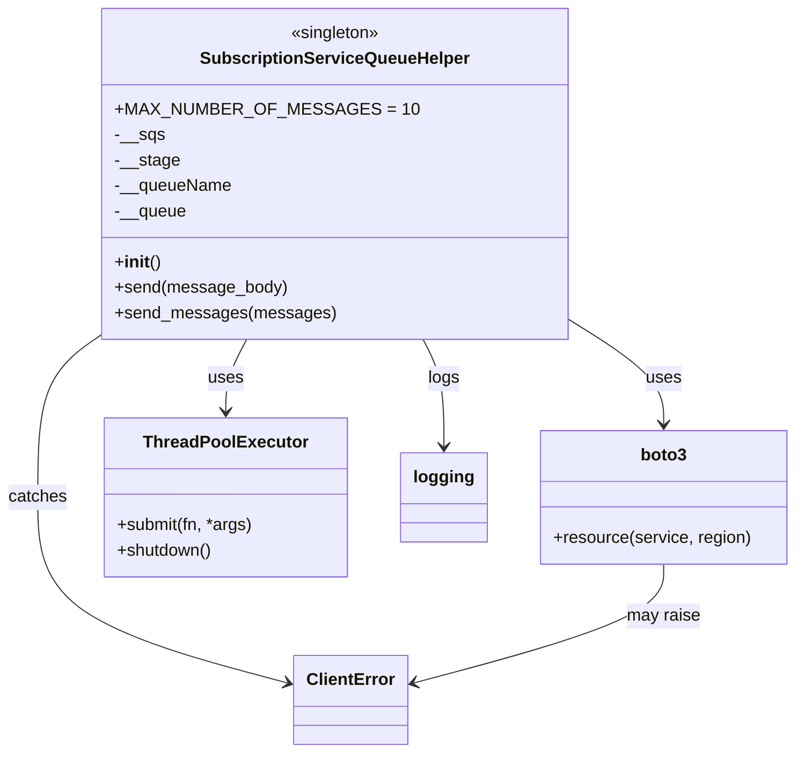

# Diagram: shipment_core/shipment_service/shipment_service/ng_preferences/subscription/SubscriptionServiceQueueHelper.py


> Auto-generated by Obscura crawlers

## Diagram 1



### SVG

<svg id="container" width="740.546875" xmlns="http://www.w3.org/2000/svg" class="classDiagram" height="710" viewBox="0 0 740.546875 710" role="graphics-document document" aria-roledescription="class"><style>#container{font-family:"trebuchet ms",verdana,arial,sans-serif;font-size:16px;fill:#333;}@keyframes edge-animation-frame{from{stroke-dashoffset:0;}}@keyframes dash{to{stroke-dashoffset:0;}}#container .edge-animation-slow{stroke-dasharray:9,5!important;stroke-dashoffset:900;animation:dash 50s linear infinite;stroke-linecap:round;}#container .edge-animation-fast{stroke-dasharray:9,5!important;stroke-dashoffset:900;animation:dash 20s linear infinite;stroke-linecap:round;}#container .error-icon{fill:#552222;}#container .error-text{fill:#552222;stroke:#552222;}#container .edge-thickness-normal{stroke-width:1px;}#container .edge-thickness-thick{stroke-width:3.5px;}#container .edge-pattern-solid{stroke-dasharray:0;}#container .edge-thickness-invisible{stroke-width:0;fill:none;}#container .edge-pattern-dashed{stroke-dasharray:3;}#container .edge-pattern-dotted{stroke-dasharray:2;}#container .marker{fill:#333333;stroke:#333333;}#container .marker.cross{stroke:#333333;}#container svg{font-family:"trebuchet ms",verdana,arial,sans-serif;font-size:16px;}#container p{margin:0;}#container g.classGroup text{fill:#9370DB;stroke:none;font-family:"trebuchet ms",verdana,arial,sans-serif;font-size:10px;}#container g.classGroup text .title{font-weight:bolder;}#container .nodeLabel,#container .edgeLabel{color:#131300;}#container .edgeLabel .label rect{fill:#ECECFF;}#container .label text{fill:#131300;}#container .labelBkg{background:#ECECFF;}#container .edgeLabel .label span{background:#ECECFF;}#container .classTitle{font-weight:bolder;}#container .node rect,#container .node circle,#container .node ellipse,#container .node polygon,#container .node path{fill:#ECECFF;stroke:#9370DB;stroke-width:1px;}#container .divider{stroke:#9370DB;stroke-width:1;}#container g.clickable{cursor:pointer;}#container g.classGroup rect{fill:#ECECFF;stroke:#9370DB;}#container g.classGroup line{stroke:#9370DB;stroke-width:1;}#container .classLabel .box{stroke:none;stroke-width:0;fill:#ECECFF;opacity:0.5;}#container .classLabel .label{fill:#9370DB;font-size:10px;}#container .relation{stroke:#333333;stroke-width:1;fill:none;}#container .dashed-line{stroke-dasharray:3;}#container .dotted-line{stroke-dasharray:1 2;}#container #compositionStart,#container .composition{fill:#333333!important;stroke:#333333!important;stroke-width:1;}#container #compositionEnd,#container .composition{fill:#333333!important;stroke:#333333!important;stroke-width:1;}#container #dependencyStart,#container .dependency{fill:#333333!important;stroke:#333333!important;stroke-width:1;}#container #dependencyStart,#container .dependency{fill:#333333!important;stroke:#333333!important;stroke-width:1;}#container #extensionStart,#container .extension{fill:transparent!important;stroke:#333333!important;stroke-width:1;}#container #extensionEnd,#container .extension{fill:transparent!important;stroke:#333333!important;stroke-width:1;}#container #aggregationStart,#container .aggregation{fill:transparent!important;stroke:#333333!important;stroke-width:1;}#container #aggregationEnd,#container .aggregation{fill:transparent!important;stroke:#333333!important;stroke-width:1;}#container #lollipopStart,#container .lollipop{fill:#ECECFF!important;stroke:#333333!important;stroke-width:1;}#container #lollipopEnd,#container .lollipop{fill:#ECECFF!important;stroke:#333333!important;stroke-width:1;}#container .edgeTerminals{font-size:11px;line-height:initial;}#container .classTitleText{text-anchor:middle;font-size:18px;fill:#333;}#container .label-icon{display:inline-block;height:1em;overflow:visible;vertical-align:-0.125em;}#container .node .label-icon path{fill:currentColor;stroke:revert;stroke-width:revert;}#container :root{--mermaid-font-family:"trebuchet ms",verdana,arial,sans-serif;}</style><g><defs><marker id="container_class-aggregationStart" class="marker aggregation class" refX="18" refY="7" markerWidth="190" markerHeight="240" orient="auto"><path d="M 18,7 L9,13 L1,7 L9,1 Z"></path></marker></defs><defs><marker id="container_class-aggregationEnd" class="marker aggregation class" refX="1" refY="7" markerWidth="20" markerHeight="28" orient="auto"><path d="M 18,7 L9,13 L1,7 L9,1 Z"></path></marker></defs><defs><marker id="container_class-extensionStart" class="marker extension class" refX="18" refY="7" markerWidth="190" markerHeight="240" orient="auto"><path d="M 1,7 L18,13 V 1 Z"></path></marker></defs><defs><marker id="container_class-extensionEnd" class="marker extension class" refX="1" refY="7" markerWidth="20" markerHeight="28" orient="auto"><path d="M 1,1 V 13 L18,7 Z"></path></marker></defs><defs><marker id="container_class-compositionStart" class="marker composition class" refX="18" refY="7" markerWidth="190" markerHeight="240" orient="auto"><path d="M 18,7 L9,13 L1,7 L9,1 Z"></path></marker></defs><defs><marker id="container_class-compositionEnd" class="marker composition class" refX="1" refY="7" markerWidth="20" markerHeight="28" orient="auto"><path d="M 18,7 L9,13 L1,7 L9,1 Z"></path></marker></defs><defs><marker id="container_class-dependencyStart" class="marker dependency class" refX="6" refY="7" markerWidth="190" markerHeight="240" orient="auto"><path d="M 5,7 L9,13 L1,7 L9,1 Z"></path></marker></defs><defs><marker id="container_class-dependencyEnd" class="marker dependency class" refX="13" refY="7" markerWidth="20" markerHeight="28" orient="auto"><path d="M 18,7 L9,13 L14,7 L9,1 Z"></path></marker></defs><defs><marker id="container_class-lollipopStart" class="marker lollipop class" refX="13" refY="7" markerWidth="190" markerHeight="240" orient="auto"><circle stroke="black" fill="transparent" cx="7" cy="7" r="6"></circle></marker></defs><defs><marker id="container_class-lollipopEnd" class="marker lollipop class" refX="1" refY="7" markerWidth="190" markerHeight="240" orient="auto"><circle stroke="black" fill="transparent" cx="7" cy="7" r="6"></circle></marker></defs><g class="root"><g class="clusters"></g><g class="edgePaths"><path d="M508.768,288.378L526.863,299.815C544.958,311.252,581.149,334.126,599.244,352.73C617.34,371.333,617.34,385.667,617.34,392.833L617.34,400" id="id_SubscriptionServiceQueueHelper_boto3_1" class="edge-thickness-normal edge-pattern-solid relation" style=";;;" data-edge="true" data-et="edge" data-id="id_SubscriptionServiceQueueHelper_boto3_1" data-points="W3sieCI6NTA4Ljc2NzU3ODEyNSwieSI6Mjg4LjM3ODE4OTI2MDkyOTR9LHsieCI6NjE3LjMzOTg0Mzc1LCJ5IjozNTd9LHsieCI6NjE3LjMzOTg0Mzc1LCJ5Ijo0MDZ9XQ==" marker-end="url(#container_class-dependencyEnd)"></path><path d="M230.305,320L227.076,326.167C223.848,332.333,217.391,344.667,214.162,356C210.934,367.333,210.934,377.667,210.934,382.833L210.934,388" id="id_SubscriptionServiceQueueHelper_ThreadPoolExecutor_2" class="edge-thickness-normal edge-pattern-solid relation" style=";;;" data-edge="true" data-et="edge" data-id="id_SubscriptionServiceQueueHelper_ThreadPoolExecutor_2" data-points="W3sieCI6MjMwLjMwNDkwMDAxNjE5MTcsInkiOjMyMH0seyJ4IjoyMTAuOTMzNTkzNzUsInkiOjM1N30seyJ4IjoyMTAuOTMzNTkzNzUsInkiOjM5NH1d" marker-end="url(#container_class-dependencyEnd)"></path><path d="M115.189,301.36L101.904,310.633C88.618,319.907,62.048,338.453,48.762,366.393C35.477,394.333,35.477,431.667,35.477,469C35.477,506.333,35.477,543.667,74.423,572.909C113.37,602.151,191.263,623.303,230.21,633.878L269.157,644.454" id="id_SubscriptionServiceQueueHelper_ClientError_3" class="edge-thickness-normal edge-pattern-solid relation" style=";;;" data-edge="true" data-et="edge" data-id="id_SubscriptionServiceQueueHelper_ClientError_3" data-points="W3sieCI6MTE1LjE4OTQ1MzEyNSwieSI6MzAxLjM1OTkzMDQ5MzI1Nzd9LHsieCI6MzUuNDc2NTYyNSwieSI6MzU3fSx7IngiOjM1LjQ3NjU2MjUsInkiOjQ2OX0seyJ4IjozNS40NzY1NjI1LCJ5Ijo1ODF9LHsieCI6Mjc0Ljk0NzI2NTYyNSwieSI6NjQ2LjAyNjIyMjMzMjYxOTV9XQ==" marker-end="url(#container_class-dependencyEnd)"></path><path d="M393.652,320L396.881,326.167C400.109,332.333,406.566,344.667,409.795,361.5C413.023,378.333,413.023,399.667,413.023,410.333L413.023,421" id="id_SubscriptionServiceQueueHelper_logging_4" class="edge-thickness-normal edge-pattern-solid relation" style=";;;" data-edge="true" data-et="edge" data-id="id_SubscriptionServiceQueueHelper_logging_4" data-points="W3sieCI6MzkzLjY1MjEzMTIzMzgwODMsInkiOjMyMH0seyJ4Ijo0MTMuMDIzNDM3NSwieSI6MzU3fSx7IngiOjQxMy4wMjM0Mzc1LCJ5Ijo0Mjd9XQ==" marker-end="url(#container_class-dependencyEnd)"></path><path d="M617.34,532L617.34,540.167C617.34,548.333,617.34,564.667,578.393,583.409C539.446,602.151,461.553,623.303,422.606,633.878L383.659,644.454" id="id_boto3_ClientError_5" class="edge-thickness-normal edge-pattern-solid relation" style=";;;" data-edge="true" data-et="edge" data-id="id_boto3_ClientError_5" data-points="W3sieCI6NjE3LjMzOTg0Mzc1LCJ5Ijo1MzJ9LHsieCI6NjE3LjMzOTg0Mzc1LCJ5Ijo1ODF9LHsieCI6Mzc3Ljg2OTE0MDYyNSwieSI6NjQ2LjAyNjIyMjMzMjYxOTV9XQ==" marker-end="url(#container_class-dependencyEnd)"></path></g><g class="edgeLabels"><g class="edgeLabel" transform="translate(617.33984375, 357)"><g class="label" data-id="id_SubscriptionServiceQueueHelper_boto3_1" transform="translate(-16.4921875, -12)"><foreignObject width="32.984375" height="24"><div xmlns="http://www.w3.org/1999/xhtml" class="labelBkg" style="display: table-cell; white-space: nowrap; line-height: 1.5; max-width: 200px; text-align: center;"><span class="edgeLabel"><p>uses</p></span></div></foreignObject></g></g><g class="edgeLabel" transform="translate(210.93359375, 357)"><g class="label" data-id="id_SubscriptionServiceQueueHelper_ThreadPoolExecutor_2" transform="translate(-16.4921875, -12)"><foreignObject width="32.984375" height="24"><div xmlns="http://www.w3.org/1999/xhtml" class="labelBkg" style="display: table-cell; white-space: nowrap; line-height: 1.5; max-width: 200px; text-align: center;"><span class="edgeLabel"><p>uses</p></span></div></foreignObject></g></g><g class="edgeLabel" transform="translate(35.4765625, 469)"><g class="label" data-id="id_SubscriptionServiceQueueHelper_ClientError_3" transform="translate(-27.4765625, -12)"><foreignObject width="54.953125" height="24"><div xmlns="http://www.w3.org/1999/xhtml" class="labelBkg" style="display: table-cell; white-space: nowrap; line-height: 1.5; max-width: 200px; text-align: center;"><span class="edgeLabel"><p>catches</p></span></div></foreignObject></g></g><g class="edgeLabel" transform="translate(413.0234375, 357)"><g class="label" data-id="id_SubscriptionServiceQueueHelper_logging_4" transform="translate(-14.8203125, -12)"><foreignObject width="29.640625" height="24"><div xmlns="http://www.w3.org/1999/xhtml" class="labelBkg" style="display: table-cell; white-space: nowrap; line-height: 1.5; max-width: 200px; text-align: center;"><span class="edgeLabel"><p>logs</p></span></div></foreignObject></g></g><g class="edgeLabel" transform="translate(617.33984375, 581)"><g class="label" data-id="id_boto3_ClientError_5" transform="translate(-34.65625, -12)"><foreignObject width="69.3125" height="24"><div xmlns="http://www.w3.org/1999/xhtml" class="labelBkg" style="display: table-cell; white-space: nowrap; line-height: 1.5; max-width: 200px; text-align: center;"><span class="edgeLabel"><p>may raise</p></span></div></foreignObject></g></g></g><g class="nodes"><g class="node default" id="classId-SubscriptionServiceQueueHelper-0" transform="translate(311.978515625, 164)"><g class="basic label-container"><path d="M-196.7890625 -156 L196.7890625 -156 L196.7890625 156 L-196.7890625 156" stroke="none" stroke-width="0" fill="#ECECFF" style=""></path><path d="M-196.7890625 -156 C-95.28396984066072 -156, 6.221122818678566 -156, 196.7890625 -156 M-196.7890625 -156 C-104.37463158581248 -156, -11.96020067162496 -156, 196.7890625 -156 M196.7890625 -156 C196.7890625 -32.01264269550755, 196.7890625 91.9747146089849, 196.7890625 156 M196.7890625 -156 C196.7890625 -84.0316331145191, 196.7890625 -12.063266229038192, 196.7890625 156 M196.7890625 156 C104.56555937755209 156, 12.342056255104183 156, -196.7890625 156 M196.7890625 156 C108.22071469188191 156, 19.65236688376382 156, -196.7890625 156 M-196.7890625 156 C-196.7890625 76.03301367938745, -196.7890625 -3.933972641225097, -196.7890625 -156 M-196.7890625 156 C-196.7890625 59.208491307759886, -196.7890625 -37.58301738448023, -196.7890625 -156" stroke="#9370DB" stroke-width="1.3" fill="none" stroke-dasharray="0 0" style=""></path></g><g class="annotation-group text" transform="translate(-42.765625, -132)"><g class="label" style="" transform="translate(0,-12)"><foreignObject width="85.53125" height="24"><div xmlns="http://www.w3.org/1999/xhtml" style="display: table-cell; white-space: nowrap; line-height: 1.5; max-width: 136px; text-align: center;"><span class="nodeLabel markdown-node-label" style=""><p>«singleton»</p></span></div></foreignObject></g></g><g class="label-group text" transform="translate(-121.171875, -108)"><g class="label" style="font-weight: bolder" transform="translate(0,-12)"><foreignObject width="242.34375" height="24"><div xmlns="http://www.w3.org/1999/xhtml" style="display: table-cell; white-space: nowrap; line-height: 1.5; max-width: 291px; text-align: center;"><span class="nodeLabel markdown-node-label" style=""><p>SubscriptionServiceQueueHelper</p></span></div></foreignObject></g></g><g class="members-group text" transform="translate(-184.7890625, -60)"><g class="label" style="" transform="translate(0,-12)"><foreignObject width="248.40625" height="24"><div xmlns="http://www.w3.org/1999/xhtml" style="display: table-cell; white-space: nowrap; line-height: 1.5; max-width: 306px; text-align: center;"><span class="nodeLabel markdown-node-label" style=""><p>+MAX_NUMBER_OF_MESSAGES = 10</p></span></div></foreignObject></g><g class="label" style="" transform="translate(0,12)"><foreignObject width="46.171875" height="24"><div xmlns="http://www.w3.org/1999/xhtml" style="display: table-cell; white-space: nowrap; line-height: 1.5; max-width: 104px; text-align: center;"><span class="nodeLabel markdown-node-label" style=""><p>-__sqs</p></span></div></foreignObject></g><g class="label" style="" transform="translate(0,36)"><foreignObject width="60.125" height="24"><div xmlns="http://www.w3.org/1999/xhtml" style="display: table-cell; white-space: nowrap; line-height: 1.5; max-width: 117px; text-align: center;"><span class="nodeLabel markdown-node-label" style=""><p>-__stage</p></span></div></foreignObject></g><g class="label" style="" transform="translate(0,60)"><foreignObject width="109.03125" height="24"><div xmlns="http://www.w3.org/1999/xhtml" style="display: table-cell; white-space: nowrap; line-height: 1.5; max-width: 166px; text-align: center;"><span class="nodeLabel markdown-node-label" style=""><p>-__queueName</p></span></div></foreignObject></g><g class="label" style="" transform="translate(0,84)"><foreignObject width="66.96875" height="24"><div xmlns="http://www.w3.org/1999/xhtml" style="display: table-cell; white-space: nowrap; line-height: 1.5; max-width: 124px; text-align: center;"><span class="nodeLabel markdown-node-label" style=""><p>-__queue</p></span></div></foreignObject></g></g><g class="methods-group text" transform="translate(-184.7890625, 84)"><g class="label" style="" transform="translate(0,-12)"><foreignObject width="42.796875" height="24"><div xmlns="http://www.w3.org/1999/xhtml" style="display: table-cell; white-space: nowrap; line-height: 1.5; max-width: 132px; text-align: center;"><span class="nodeLabel markdown-node-label" style=""><p>+<strong>init</strong>()</p></span></div></foreignObject></g><g class="label" style="" transform="translate(0,12)"><foreignObject width="160.171875" height="24"><div xmlns="http://www.w3.org/1999/xhtml" style="display: table-cell; white-space: nowrap; line-height: 1.5; max-width: 218px; text-align: center;"><span class="nodeLabel markdown-node-label" style=""><p>+send(message_body)</p></span></div></foreignObject></g><g class="label" style="" transform="translate(0,36)"><foreignObject width="201.53125" height="24"><div xmlns="http://www.w3.org/1999/xhtml" style="display: table-cell; white-space: nowrap; line-height: 1.5; max-width: 259px; text-align: center;"><span class="nodeLabel markdown-node-label" style=""><p>+send_messages(messages)</p></span></div></foreignObject></g></g><g class="divider" style=""><path d="M-196.7890625 -84 C-49.8642647997583 -84, 97.0605329004834 -84, 196.7890625 -84 M-196.7890625 -84 C-46.79128365684008 -84, 103.20649518631984 -84, 196.7890625 -84" stroke="#9370DB" stroke-width="1.3" fill="none" stroke-dasharray="0 0" style=""></path></g><g class="divider" style=""><path d="M-196.7890625 60 C-67.10462310406271 60, 62.57981629187458 60, 196.7890625 60 M-196.7890625 60 C-78.16533337507533 60, 40.45839574984933 60, 196.7890625 60" stroke="#9370DB" stroke-width="1.3" fill="none" stroke-dasharray="0 0" style=""></path></g></g><g class="node default" id="classId-boto3-1" transform="translate(617.33984375, 469)"><g class="basic label-container"><path d="M-115.20703125 -63 L115.20703125 -63 L115.20703125 63 L-115.20703125 63" stroke="none" stroke-width="0" fill="#ECECFF" style=""></path><path d="M-115.20703125 -63 C-35.792166301521235 -63, 43.62269864695753 -63, 115.20703125 -63 M-115.20703125 -63 C-63.75637288233127 -63, -12.30571451466254 -63, 115.20703125 -63 M115.20703125 -63 C115.20703125 -36.35266282527421, 115.20703125 -9.705325650548424, 115.20703125 63 M115.20703125 -63 C115.20703125 -21.056526366072596, 115.20703125 20.886947267854808, 115.20703125 63 M115.20703125 63 C58.407878999504696 63, 1.6087267490093922 63, -115.20703125 63 M115.20703125 63 C25.585601128508443 63, -64.03582899298311 63, -115.20703125 63 M-115.20703125 63 C-115.20703125 32.18361210832083, -115.20703125 1.3672242166416595, -115.20703125 -63 M-115.20703125 63 C-115.20703125 32.50777777084234, -115.20703125 2.0155555416846695, -115.20703125 -63" stroke="#9370DB" stroke-width="1.3" fill="none" stroke-dasharray="0 0" style=""></path></g><g class="annotation-group text" transform="translate(0, -39)"></g><g class="label-group text" transform="translate(-21.0703125, -39)"><g class="label" style="font-weight: bolder" transform="translate(0,-12)"><foreignObject width="42.140625" height="24"><div xmlns="http://www.w3.org/1999/xhtml" style="display: table-cell; white-space: nowrap; line-height: 1.5; max-width: 91px; text-align: center;"><span class="nodeLabel markdown-node-label" style=""><p>boto3</p></span></div></foreignObject></g></g><g class="members-group text" transform="translate(-103.20703125, 9)"></g><g class="methods-group text" transform="translate(-103.20703125, 39)"><g class="label" style="" transform="translate(0,-12)"><foreignObject width="185.34375" height="24"><div xmlns="http://www.w3.org/1999/xhtml" style="display: table-cell; white-space: nowrap; line-height: 1.5; max-width: 243px; text-align: center;"><span class="nodeLabel markdown-node-label" style=""><p>+resource(service, region)</p></span></div></foreignObject></g></g><g class="divider" style=""><path d="M-115.20703125 -15 C-52.47100084675228 -15, 10.265029556495435 -15, 115.20703125 -15 M-115.20703125 -15 C-24.16824250558686 -15, 66.87054623882628 -15, 115.20703125 -15" stroke="#9370DB" stroke-width="1.3" fill="none" stroke-dasharray="0 0" style=""></path></g><g class="divider" style=""><path d="M-115.20703125 9 C-43.454993313468975 9, 28.29704462306205 9, 115.20703125 9 M-115.20703125 9 C-62.70299888023834 9, -10.19896651047668 9, 115.20703125 9" stroke="#9370DB" stroke-width="1.3" fill="none" stroke-dasharray="0 0" style=""></path></g></g><g class="node default" id="classId-ThreadPoolExecutor-2" transform="translate(210.93359375, 469)"><g class="basic label-container"><path d="M-112.98046875 -75 L112.98046875 -75 L112.98046875 75 L-112.98046875 75" stroke="none" stroke-width="0" fill="#ECECFF" style=""></path><path d="M-112.98046875 -75 C-33.446896209694984 -75, 46.08667633061003 -75, 112.98046875 -75 M-112.98046875 -75 C-47.19212458131304 -75, 18.596219587373923 -75, 112.98046875 -75 M112.98046875 -75 C112.98046875 -28.78250279607269, 112.98046875 17.434994407854617, 112.98046875 75 M112.98046875 -75 C112.98046875 -29.5536652713308, 112.98046875 15.8926694573384, 112.98046875 75 M112.98046875 75 C26.104857050299714 75, -60.77075464940057 75, -112.98046875 75 M112.98046875 75 C23.44047743293642 75, -66.09951388412716 75, -112.98046875 75 M-112.98046875 75 C-112.98046875 19.274203080824137, -112.98046875 -36.45159383835173, -112.98046875 -75 M-112.98046875 75 C-112.98046875 23.369468138405473, -112.98046875 -28.261063723189054, -112.98046875 -75" stroke="#9370DB" stroke-width="1.3" fill="none" stroke-dasharray="0 0" style=""></path></g><g class="annotation-group text" transform="translate(0, -51)"></g><g class="label-group text" transform="translate(-73.4765625, -51)"><g class="label" style="font-weight: bolder" transform="translate(0,-12)"><foreignObject width="146.953125" height="24"><div xmlns="http://www.w3.org/1999/xhtml" style="display: table-cell; white-space: nowrap; line-height: 1.5; max-width: 196px; text-align: center;"><span class="nodeLabel markdown-node-label" style=""><p>ThreadPoolExecutor</p></span></div></foreignObject></g></g><g class="members-group text" transform="translate(-100.98046875, -3)"></g><g class="methods-group text" transform="translate(-100.98046875, 27)"><g class="label" style="" transform="translate(0,-12)"><foreignObject width="128.484375" height="24"><div xmlns="http://www.w3.org/1999/xhtml" style="display: table-cell; white-space: nowrap; line-height: 1.5; max-width: 186px; text-align: center;"><span class="nodeLabel markdown-node-label" style=""><p>+submit(fn, *args)</p></span></div></foreignObject></g><g class="label" style="" transform="translate(0,12)"><foreignObject width="89.8125" height="24"><div xmlns="http://www.w3.org/1999/xhtml" style="display: table-cell; white-space: nowrap; line-height: 1.5; max-width: 147px; text-align: center;"><span class="nodeLabel markdown-node-label" style=""><p>+shutdown()</p></span></div></foreignObject></g></g><g class="divider" style=""><path d="M-112.98046875 -27 C-35.858198203325756 -27, 41.26407234334849 -27, 112.98046875 -27 M-112.98046875 -27 C-48.47787910085975 -27, 16.024710548280495 -27, 112.98046875 -27" stroke="#9370DB" stroke-width="1.3" fill="none" stroke-dasharray="0 0" style=""></path></g><g class="divider" style=""><path d="M-112.98046875 -3 C-56.95045724820367 -3, -0.9204457464073386 -3, 112.98046875 -3 M-112.98046875 -3 C-64.07795699161525 -3, -15.17544523323052 -3, 112.98046875 -3" stroke="#9370DB" stroke-width="1.3" fill="none" stroke-dasharray="0 0" style=""></path></g></g><g class="node default" id="classId-ClientError-3" transform="translate(326.408203125, 660)"><g class="basic label-container"><path d="M-51.4609375 -42 L51.4609375 -42 L51.4609375 42 L-51.4609375 42" stroke="none" stroke-width="0" fill="#ECECFF" style=""></path><path d="M-51.4609375 -42 C-11.254934000397249 -42, 28.951069499205502 -42, 51.4609375 -42 M-51.4609375 -42 C-22.548215459200893 -42, 6.364506581598214 -42, 51.4609375 -42 M51.4609375 -42 C51.4609375 -13.716614318631642, 51.4609375 14.566771362736716, 51.4609375 42 M51.4609375 -42 C51.4609375 -11.144131613101386, 51.4609375 19.711736773797227, 51.4609375 42 M51.4609375 42 C23.53400981330924 42, -4.392917873381521 42, -51.4609375 42 M51.4609375 42 C11.63039022511473 42, -28.20015704977054 42, -51.4609375 42 M-51.4609375 42 C-51.4609375 18.266687040358597, -51.4609375 -5.466625919282805, -51.4609375 -42 M-51.4609375 42 C-51.4609375 9.934661159493402, -51.4609375 -22.130677681013196, -51.4609375 -42" stroke="#9370DB" stroke-width="1.3" fill="none" stroke-dasharray="0 0" style=""></path></g><g class="annotation-group text" transform="translate(0, -18)"></g><g class="label-group text" transform="translate(-39.4609375, -18)"><g class="label" style="font-weight: bolder" transform="translate(0,-12)"><foreignObject width="78.921875" height="24"><div xmlns="http://www.w3.org/1999/xhtml" style="display: table-cell; white-space: nowrap; line-height: 1.5; max-width: 128px; text-align: center;"><span class="nodeLabel markdown-node-label" style=""><p>ClientError</p></span></div></foreignObject></g></g><g class="members-group text" transform="translate(-39.4609375, 30)"></g><g class="methods-group text" transform="translate(-39.4609375, 60)"></g><g class="divider" style=""><path d="M-51.4609375 6 C-12.370257263846433 6, 26.720422972307134 6, 51.4609375 6 M-51.4609375 6 C-20.71199428056778 6, 10.036948938864441 6, 51.4609375 6" stroke="#9370DB" stroke-width="1.3" fill="none" stroke-dasharray="0 0" style=""></path></g><g class="divider" style=""><path d="M-51.4609375 24 C-28.954968635510816 24, -6.448999771021633 24, 51.4609375 24 M-51.4609375 24 C-19.572608733854725 24, 12.31572003229055 24, 51.4609375 24" stroke="#9370DB" stroke-width="1.3" fill="none" stroke-dasharray="0 0" style=""></path></g></g><g class="node default" id="classId-logging-4" transform="translate(413.0234375, 469)"><g class="basic label-container"><path d="M-39.109375 -42 L39.109375 -42 L39.109375 42 L-39.109375 42" stroke="none" stroke-width="0" fill="#ECECFF" style=""></path><path d="M-39.109375 -42 C-19.595821922408117 -42, -0.08226884481623387 -42, 39.109375 -42 M-39.109375 -42 C-16.453870071690357 -42, 6.201634856619286 -42, 39.109375 -42 M39.109375 -42 C39.109375 -8.849188357994862, 39.109375 24.301623284010276, 39.109375 42 M39.109375 -42 C39.109375 -11.885091944032165, 39.109375 18.22981611193567, 39.109375 42 M39.109375 42 C15.088365771999399 42, -8.932643456001202 42, -39.109375 42 M39.109375 42 C22.708436027323895 42, 6.30749705464779 42, -39.109375 42 M-39.109375 42 C-39.109375 11.59132744053236, -39.109375 -18.81734511893528, -39.109375 -42 M-39.109375 42 C-39.109375 11.312822371128167, -39.109375 -19.374355257743666, -39.109375 -42" stroke="#9370DB" stroke-width="1.3" fill="none" stroke-dasharray="0 0" style=""></path></g><g class="annotation-group text" transform="translate(0, -18)"></g><g class="label-group text" transform="translate(-27.109375, -18)"><g class="label" style="font-weight: bolder" transform="translate(0,-12)"><foreignObject width="54.21875" height="24"><div xmlns="http://www.w3.org/1999/xhtml" style="display: table-cell; white-space: nowrap; line-height: 1.5; max-width: 103px; text-align: center;"><span class="nodeLabel markdown-node-label" style=""><p>logging</p></span></div></foreignObject></g></g><g class="members-group text" transform="translate(-27.109375, 30)"></g><g class="methods-group text" transform="translate(-27.109375, 60)"></g><g class="divider" style=""><path d="M-39.109375 6 C-22.007601293833016 6, -4.905827587666032 6, 39.109375 6 M-39.109375 6 C-7.835325303988146 6, 23.43872439202371 6, 39.109375 6" stroke="#9370DB" stroke-width="1.3" fill="none" stroke-dasharray="0 0" style=""></path></g><g class="divider" style=""><path d="M-39.109375 24 C-14.128820611859094 24, 10.851733776281812 24, 39.109375 24 M-39.109375 24 C-21.6353280048574 24, -4.1612810097147985 24, 39.109375 24" stroke="#9370DB" stroke-width="1.3" fill="none" stroke-dasharray="0 0" style=""></path></g></g></g></g></g></svg>

## Diagram 2

```mermaid
flowchart TD
    A[send_messages(messages) start] --> B{messages empty?}
    B -- Yes --> C[return]
    B -- No --> D[logging.info "sending total messages"]
    D --> E[split messages into blocks of MAX_NUMBER_OF_MESSAGES]
    E --> F[for each message_block]
    F --> G[logging.info "sending message block"]
    G --> H[executor = ThreadPoolExecutor(max_workers=len(message_block))]
    H --> I[for each message in message_block: submit send(message)]
    I --> J[collect futures tasks]
    J --> K[for task in as_completed(tasks)]
    K --> L[call task.result() (propagate exception if any)]
    L --> M[continue until all tasks complete]
    M --> N[next message_block or end]
    N --> O[send_messages end]
```

> SVG rendering failed for this diagram.
