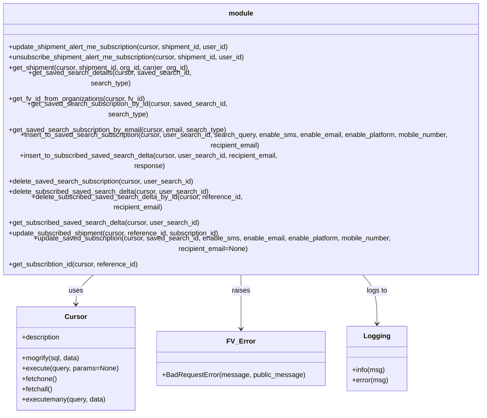

# Diagram: shipment_core/shipment_service/shipment_service/ng_preferences/subscription/db_no_orm.py


> Auto-generated by Obscura crawlers

## Diagram 1



### SVG

<svg id="container" width="1192.84375" xmlns="http://www.w3.org/2000/svg" class="classDiagram" height="816" viewBox="0 0 1192.84375 816" role="graphics-document document" aria-roledescription="class"><style>#container{font-family:"trebuchet ms",verdana,arial,sans-serif;font-size:16px;fill:#333;}@keyframes edge-animation-frame{from{stroke-dashoffset:0;}}@keyframes dash{to{stroke-dashoffset:0;}}#container .edge-animation-slow{stroke-dasharray:9,5!important;stroke-dashoffset:900;animation:dash 50s linear infinite;stroke-linecap:round;}#container .edge-animation-fast{stroke-dasharray:9,5!important;stroke-dashoffset:900;animation:dash 20s linear infinite;stroke-linecap:round;}#container .error-icon{fill:#552222;}#container .error-text{fill:#552222;stroke:#552222;}#container .edge-thickness-normal{stroke-width:1px;}#container .edge-thickness-thick{stroke-width:3.5px;}#container .edge-pattern-solid{stroke-dasharray:0;}#container .edge-thickness-invisible{stroke-width:0;fill:none;}#container .edge-pattern-dashed{stroke-dasharray:3;}#container .edge-pattern-dotted{stroke-dasharray:2;}#container .marker{fill:#333333;stroke:#333333;}#container .marker.cross{stroke:#333333;}#container svg{font-family:"trebuchet ms",verdana,arial,sans-serif;font-size:16px;}#container p{margin:0;}#container g.classGroup text{fill:#9370DB;stroke:none;font-family:"trebuchet ms",verdana,arial,sans-serif;font-size:10px;}#container g.classGroup text .title{font-weight:bolder;}#container .nodeLabel,#container .edgeLabel{color:#131300;}#container .edgeLabel .label rect{fill:#ECECFF;}#container .label text{fill:#131300;}#container .labelBkg{background:#ECECFF;}#container .edgeLabel .label span{background:#ECECFF;}#container .classTitle{font-weight:bolder;}#container .node rect,#container .node circle,#container .node ellipse,#container .node polygon,#container .node path{fill:#ECECFF;stroke:#9370DB;stroke-width:1px;}#container .divider{stroke:#9370DB;stroke-width:1;}#container g.clickable{cursor:pointer;}#container g.classGroup rect{fill:#ECECFF;stroke:#9370DB;}#container g.classGroup line{stroke:#9370DB;stroke-width:1;}#container .classLabel .box{stroke:none;stroke-width:0;fill:#ECECFF;opacity:0.5;}#container .classLabel .label{fill:#9370DB;font-size:10px;}#container .relation{stroke:#333333;stroke-width:1;fill:none;}#container .dashed-line{stroke-dasharray:3;}#container .dotted-line{stroke-dasharray:1 2;}#container #compositionStart,#container .composition{fill:#333333!important;stroke:#333333!important;stroke-width:1;}#container #compositionEnd,#container .composition{fill:#333333!important;stroke:#333333!important;stroke-width:1;}#container #dependencyStart,#container .dependency{fill:#333333!important;stroke:#333333!important;stroke-width:1;}#container #dependencyStart,#container .dependency{fill:#333333!important;stroke:#333333!important;stroke-width:1;}#container #extensionStart,#container .extension{fill:transparent!important;stroke:#333333!important;stroke-width:1;}#container #extensionEnd,#container .extension{fill:transparent!important;stroke:#333333!important;stroke-width:1;}#container #aggregationStart,#container .aggregation{fill:transparent!important;stroke:#333333!important;stroke-width:1;}#container #aggregationEnd,#container .aggregation{fill:transparent!important;stroke:#333333!important;stroke-width:1;}#container #lollipopStart,#container .lollipop{fill:#ECECFF!important;stroke:#333333!important;stroke-width:1;}#container #lollipopEnd,#container .lollipop{fill:#ECECFF!important;stroke:#333333!important;stroke-width:1;}#container .edgeTerminals{font-size:11px;line-height:initial;}#container .classTitleText{text-anchor:middle;font-size:18px;fill:#333;}#container .label-icon{display:inline-block;height:1em;overflow:visible;vertical-align:-0.125em;}#container .node .label-icon path{fill:currentColor;stroke:revert;stroke-width:revert;}#container :root{--mermaid-font-family:"trebuchet ms",verdana,arial,sans-serif;}</style><g><defs><marker id="container_class-aggregationStart" class="marker aggregation class" refX="18" refY="7" markerWidth="190" markerHeight="240" orient="auto"><path d="M 18,7 L9,13 L1,7 L9,1 Z"></path></marker></defs><defs><marker id="container_class-aggregationEnd" class="marker aggregation class" refX="1" refY="7" markerWidth="20" markerHeight="28" orient="auto"><path d="M 18,7 L9,13 L1,7 L9,1 Z"></path></marker></defs><defs><marker id="container_class-extensionStart" class="marker extension class" refX="18" refY="7" markerWidth="190" markerHeight="240" orient="auto"><path d="M 1,7 L18,13 V 1 Z"></path></marker></defs><defs><marker id="container_class-extensionEnd" class="marker extension class" refX="1" refY="7" markerWidth="20" markerHeight="28" orient="auto"><path d="M 1,1 V 13 L18,7 Z"></path></marker></defs><defs><marker id="container_class-compositionStart" class="marker composition class" refX="18" refY="7" markerWidth="190" markerHeight="240" orient="auto"><path d="M 18,7 L9,13 L1,7 L9,1 Z"></path></marker></defs><defs><marker id="container_class-compositionEnd" class="marker composition class" refX="1" refY="7" markerWidth="20" markerHeight="28" orient="auto"><path d="M 18,7 L9,13 L1,7 L9,1 Z"></path></marker></defs><defs><marker id="container_class-dependencyStart" class="marker dependency class" refX="6" refY="7" markerWidth="190" markerHeight="240" orient="auto"><path d="M 5,7 L9,13 L1,7 L9,1 Z"></path></marker></defs><defs><marker id="container_class-dependencyEnd" class="marker dependency class" refX="13" refY="7" markerWidth="20" markerHeight="28" orient="auto"><path d="M 18,7 L9,13 L14,7 L9,1 Z"></path></marker></defs><defs><marker id="container_class-lollipopStart" class="marker lollipop class" refX="13" refY="7" markerWidth="190" markerHeight="240" orient="auto"><circle stroke="black" fill="transparent" cx="7" cy="7" r="6"></circle></marker></defs><defs><marker id="container_class-lollipopEnd" class="marker lollipop class" refX="1" refY="7" markerWidth="190" markerHeight="240" orient="auto"><circle stroke="black" fill="transparent" cx="7" cy="7" r="6"></circle></marker></defs><g class="root"><g class="clusters"></g><g class="edgePaths"><path d="M269.674,494L261.382,500.167C253.09,506.333,236.506,518.667,228.214,530C219.922,541.333,219.922,551.667,219.922,556.833L219.922,562" id="id_module_Cursor_1" class="edge-thickness-normal edge-pattern-solid relation" style=";;;" data-edge="true" data-et="edge" data-id="id_module_Cursor_1" data-points="W3sieCI6MjY5LjY3MzY2MDcxNDI4NTcsInkiOjQ5NH0seyJ4IjoyMTkuOTIxODc1LCJ5Ijo1MzF9LHsieCI6MjE5LjkyMTg3NSwieSI6NTY4fV0=" marker-end="url(#container_class-dependencyEnd)"></path><path d="M596.422,494L596.422,500.167C596.422,506.333,596.422,518.667,596.422,539.5C596.422,560.333,596.422,589.667,596.422,604.333L596.422,619" id="id_module_FV_Error_2" class="edge-thickness-normal edge-pattern-solid relation" style=";;;" data-edge="true" data-et="edge" data-id="id_module_FV_Error_2" data-points="W3sieCI6NTk2LjQyMTg3NSwieSI6NDk0fSx7IngiOjU5Ni40MjE4NzUsInkiOjUzMX0seyJ4Ijo1OTYuNDIxODc1LCJ5Ijo2MjV9XQ==" marker-end="url(#container_class-dependencyEnd)"></path><path d="M864.763,494L871.572,500.167C878.382,506.333,892.002,518.667,898.811,537.5C905.621,556.333,905.621,581.667,905.621,594.333L905.621,607" id="id_module_Logging_3" class="edge-thickness-normal edge-pattern-solid relation" style=";;;" data-edge="true" data-et="edge" data-id="id_module_Logging_3" data-points="W3sieCI6ODY0Ljc2MjYyNTU1ODAzNTgsInkiOjQ5NH0seyJ4Ijo5MDUuNjIxMDkzNzUsInkiOjUzMX0seyJ4Ijo5MDUuNjIxMDkzNzUsInkiOjYxM31d" marker-end="url(#container_class-dependencyEnd)"></path></g><g class="edgeLabels"><g class="edgeLabel" transform="translate(219.921875, 531)"><g class="label" data-id="id_module_Cursor_1" transform="translate(-16.4921875, -12)"><foreignObject width="32.984375" height="24"><div xmlns="http://www.w3.org/1999/xhtml" class="labelBkg" style="display: table-cell; white-space: nowrap; line-height: 1.5; max-width: 200px; text-align: center;"><span class="edgeLabel"><p>uses</p></span></div></foreignObject></g></g><g class="edgeLabel" transform="translate(596.421875, 531)"><g class="label" data-id="id_module_FV_Error_2" transform="translate(-21.25, -12)"><foreignObject width="42.5" height="24"><div xmlns="http://www.w3.org/1999/xhtml" class="labelBkg" style="display: table-cell; white-space: nowrap; line-height: 1.5; max-width: 200px; text-align: center;"><span class="edgeLabel"><p>raises</p></span></div></foreignObject></g></g><g class="edgeLabel" transform="translate(905.62109375, 531)"><g class="label" data-id="id_module_Logging_3" transform="translate(-24.3828125, -12)"><foreignObject width="48.765625" height="24"><div xmlns="http://www.w3.org/1999/xhtml" class="labelBkg" style="display: table-cell; white-space: nowrap; line-height: 1.5; max-width: 200px; text-align: center;"><span class="edgeLabel"><p>logs to</p></span></div></foreignObject></g></g></g><g class="nodes"><g class="node default" id="classId-module-0" transform="translate(596.421875, 251)"><g class="basic label-container"><path d="M-588.421875 -243 L588.421875 -243 L588.421875 243 L-588.421875 243" stroke="none" stroke-width="0" fill="#ECECFF" style=""></path><path d="M-588.421875 -243 C-153.08773652819508 -243, 282.24640194360984 -243, 588.421875 -243 M-588.421875 -243 C-173.04051542897366 -243, 242.34084414205267 -243, 588.421875 -243 M588.421875 -243 C588.421875 -141.80316610084787, 588.421875 -40.60633220169578, 588.421875 243 M588.421875 -243 C588.421875 -74.96651347351974, 588.421875 93.06697305296052, 588.421875 243 M588.421875 243 C253.1577396659285 243, -82.10639566814302 243, -588.421875 243 M588.421875 243 C221.71811039719364 243, -144.98565420561272 243, -588.421875 243 M-588.421875 243 C-588.421875 85.20423637669319, -588.421875 -72.59152724661362, -588.421875 -243 M-588.421875 243 C-588.421875 91.92080895677546, -588.421875 -59.15838208644908, -588.421875 -243" stroke="#9370DB" stroke-width="1.3" fill="none" stroke-dasharray="0 0" style=""></path></g><g class="annotation-group text" transform="translate(0, -219)"></g><g class="label-group text" transform="translate(-27.5625, -219)"><g class="label" style="font-weight: bolder" transform="translate(0,-12)"><foreignObject width="55.125" height="24"><div xmlns="http://www.w3.org/1999/xhtml" style="display: table-cell; white-space: nowrap; line-height: 1.5; max-width: 105px; text-align: center;"><span class="nodeLabel markdown-node-label" style=""><p>module</p></span></div></foreignObject></g></g><g class="members-group text" transform="translate(-576.421875, -171)"></g><g class="methods-group text" transform="translate(-576.421875, -141)"><g class="label" style="" transform="translate(0,-12)"><foreignObject width="521.59375" height="24"><div xmlns="http://www.w3.org/1999/xhtml" style="display: table-cell; white-space: nowrap; line-height: 1.5; max-width: 579px; text-align: center;"><span class="nodeLabel markdown-node-label" style=""><p>+update_shipment_alert_me_subscription(cursor, shipment_id, user_id)</p></span></div></foreignObject></g><g class="label" style="" transform="translate(0,12)"><foreignObject width="559.25" height="24"><div xmlns="http://www.w3.org/1999/xhtml" style="display: table-cell; white-space: nowrap; line-height: 1.5; max-width: 617px; text-align: center;"><span class="nodeLabel markdown-node-label" style=""><p>+unsubscribe_shipment_alert_me_subscription(cursor, shipment_id, user_id)</p></span></div></foreignObject></g><g class="label" style="" transform="translate(0,36)"><foreignObject width="424.03125" height="24"><div xmlns="http://www.w3.org/1999/xhtml" style="display: table-cell; white-space: nowrap; line-height: 1.5; max-width: 481px; text-align: center;"><span class="nodeLabel markdown-node-label" style=""><p>+get_shipment(cursor, shipment_id, org_id, carrier_org_id)</p></span></div></foreignObject></g><g class="label" style="" transform="translate(0,60)"><foreignObject width="472.125" height="24"><div xmlns="http://www.w3.org/1999/xhtml" style="display: table-cell; white-space: nowrap; line-height: 1.5; max-width: 529px; text-align: center;"><span class="nodeLabel markdown-node-label" style=""><p>+get_saved_search_details(cursor, saved_search_id, search_type)</p></span></div></foreignObject></g><g class="label" style="" transform="translate(0,84)"><foreignObject width="319.6875" height="24"><div xmlns="http://www.w3.org/1999/xhtml" style="display: table-cell; white-space: nowrap; line-height: 1.5; max-width: 377px; text-align: center;"><span class="nodeLabel markdown-node-label" style=""><p>+get_fv_id_from_organizations(cursor, fv_id)</p></span></div></foreignObject></g><g class="label" style="" transform="translate(0,108)"><foreignObject width="561.265625" height="24"><div xmlns="http://www.w3.org/1999/xhtml" style="display: table-cell; white-space: nowrap; line-height: 1.5; max-width: 619px; text-align: center;"><span class="nodeLabel markdown-node-label" style=""><p>+get_saved_search_subscription_by_id(cursor, saved_search_id, search_type)</p></span></div></foreignObject></g><g class="label" style="" transform="translate(0,132)"><foreignObject width="507.5625" height="24"><div xmlns="http://www.w3.org/1999/xhtml" style="display: table-cell; white-space: nowrap; line-height: 1.5; max-width: 565px; text-align: center;"><span class="nodeLabel markdown-node-label" style=""><p>+get_saved_search_subscription_by_email(cursor, email, search_type)</p></span></div></foreignObject></g><g class="label" style="" transform="translate(0,156)"><foreignObject width="1125.28125" height="24"><div xmlns="http://www.w3.org/1999/xhtml" style="display: table-cell; white-space: nowrap; line-height: 1.5; max-width: 1183px; text-align: center;"><span class="nodeLabel markdown-node-label" style=""><p>+insert_to_saved_search_subscription(cursor, user_search_id, search_query, enable_sms, enable_email, enable_platform, mobile_number, recipient_email)</p></span></div></foreignObject></g><g class="label" style="" transform="translate(0,180)"><foreignObject width="678.90625" height="24"><div xmlns="http://www.w3.org/1999/xhtml" style="display: table-cell; white-space: nowrap; line-height: 1.5; max-width: 736px; text-align: center;"><span class="nodeLabel markdown-node-label" style=""><p>+insert_to_subscribed_saved_search_delta(cursor, user_search_id, recipient_email, response)</p></span></div></foreignObject></g><g class="label" style="" transform="translate(0,204)"><foreignObject width="429.90625" height="24"><div xmlns="http://www.w3.org/1999/xhtml" style="display: table-cell; white-space: nowrap; line-height: 1.5; max-width: 487px; text-align: center;"><span class="nodeLabel markdown-node-label" style=""><p>+delete_saved_search_subscription(cursor, user_search_id)</p></span></div></foreignObject></g><g class="label" style="" transform="translate(0,228)"><foreignObject width="464.53125" height="24"><div xmlns="http://www.w3.org/1999/xhtml" style="display: table-cell; white-space: nowrap; line-height: 1.5; max-width: 522px; text-align: center;"><span class="nodeLabel markdown-node-label" style=""><p>+delete_subscribed_saved_search_delta(cursor, user_search_id)</p></span></div></foreignObject></g><g class="label" style="" transform="translate(0,252)"><foreignObject width="614.65625" height="24"><div xmlns="http://www.w3.org/1999/xhtml" style="display: table-cell; white-space: nowrap; line-height: 1.5; max-width: 672px; text-align: center;"><span class="nodeLabel markdown-node-label" style=""><p>+delete_subscribed_saved_search_delta_by_id(cursor, reference_id, recipient_email)</p></span></div></foreignObject></g><g class="label" style="" transform="translate(0,276)"><foreignObject width="441.546875" height="24"><div xmlns="http://www.w3.org/1999/xhtml" style="display: table-cell; white-space: nowrap; line-height: 1.5; max-width: 499px; text-align: center;"><span class="nodeLabel markdown-node-label" style=""><p>+get_subscribed_saved_search_delta(cursor, user_search_id)</p></span></div></foreignObject></g><g class="label" style="" transform="translate(0,300)"><foreignObject width="498.234375" height="24"><div xmlns="http://www.w3.org/1999/xhtml" style="display: table-cell; white-space: nowrap; line-height: 1.5; max-width: 556px; text-align: center;"><span class="nodeLabel markdown-node-label" style=""><p>+update_subscribed_shipment(cursor, reference_id, subscription_id)</p></span></div></foreignObject></g><g class="label" style="" transform="translate(0,324)"><foreignObject width="1009.21875" height="24"><div xmlns="http://www.w3.org/1999/xhtml" style="display: table-cell; white-space: nowrap; line-height: 1.5; max-width: 1067px; text-align: center;"><span class="nodeLabel markdown-node-label" style=""><p>+update_saved_subscription(cursor, saved_search_id, enable_sms, enable_email, enable_platform, mobile_number, recipient_email=None)</p></span></div></foreignObject></g><g class="label" style="" transform="translate(0,348)"><foreignObject width="305.03125" height="24"><div xmlns="http://www.w3.org/1999/xhtml" style="display: table-cell; white-space: nowrap; line-height: 1.5; max-width: 362px; text-align: center;"><span class="nodeLabel markdown-node-label" style=""><p>+get_subscribtion_id(cursor, reference_id)</p></span></div></foreignObject></g></g><g class="divider" style=""><path d="M-588.421875 -195 C-208.62501045047003 -195, 171.17185409905994 -195, 588.421875 -195 M-588.421875 -195 C-333.47221373930466 -195, -78.52255247860933 -195, 588.421875 -195" stroke="#9370DB" stroke-width="1.3" fill="none" stroke-dasharray="0 0" style=""></path></g><g class="divider" style=""><path d="M-588.421875 -171 C-237.96005021172863 -171, 112.50177457654274 -171, 588.421875 -171 M-588.421875 -171 C-288.20632680251435 -171, 12.009221394971291 -171, 588.421875 -171" stroke="#9370DB" stroke-width="1.3" fill="none" stroke-dasharray="0 0" style=""></path></g></g><g class="node default" id="classId-Cursor-1" transform="translate(219.921875, 688)"><g class="basic label-container"><path d="M-135.625 -120 L135.625 -120 L135.625 120 L-135.625 120" stroke="none" stroke-width="0" fill="#ECECFF" style=""></path><path d="M-135.625 -120 C-44.27109114992962 -120, 47.082817700140765 -120, 135.625 -120 M-135.625 -120 C-65.94935123536166 -120, 3.7262975292766782 -120, 135.625 -120 M135.625 -120 C135.625 -32.10925574331122, 135.625 55.78148851337755, 135.625 120 M135.625 -120 C135.625 -50.44151139202461, 135.625 19.116977215950783, 135.625 120 M135.625 120 C70.65164271100188 120, 5.678285422003768 120, -135.625 120 M135.625 120 C41.580178706566215 120, -52.46464258686757 120, -135.625 120 M-135.625 120 C-135.625 31.564598919880595, -135.625 -56.87080216023881, -135.625 -120 M-135.625 120 C-135.625 49.24471954846227, -135.625 -21.510560903075458, -135.625 -120" stroke="#9370DB" stroke-width="1.3" fill="none" stroke-dasharray="0 0" style=""></path></g><g class="annotation-group text" transform="translate(0, -96)"></g><g class="label-group text" transform="translate(-23.90625, -96)"><g class="label" style="font-weight: bolder" transform="translate(0,-12)"><foreignObject width="47.8125" height="24"><div xmlns="http://www.w3.org/1999/xhtml" style="display: table-cell; white-space: nowrap; line-height: 1.5; max-width: 98px; text-align: center;"><span class="nodeLabel markdown-node-label" style=""><p>Cursor</p></span></div></foreignObject></g></g><g class="members-group text" transform="translate(-123.625, -48)"><g class="label" style="" transform="translate(0,-12)"><foreignObject width="90.59375" height="24"><div xmlns="http://www.w3.org/1999/xhtml" style="display: table-cell; white-space: nowrap; line-height: 1.5; max-width: 148px; text-align: center;"><span class="nodeLabel markdown-node-label" style=""><p>+description</p></span></div></foreignObject></g></g><g class="methods-group text" transform="translate(-123.625, 0)"><g class="label" style="" transform="translate(0,-12)"><foreignObject width="136.171875" height="24"><div xmlns="http://www.w3.org/1999/xhtml" style="display: table-cell; white-space: nowrap; line-height: 1.5; max-width: 194px; text-align: center;"><span class="nodeLabel markdown-node-label" style=""><p>+mogrify(sql, data)</p></span></div></foreignObject></g><g class="label" style="" transform="translate(0,12)"><foreignObject width="223.34375" height="24"><div xmlns="http://www.w3.org/1999/xhtml" style="display: table-cell; white-space: nowrap; line-height: 1.5; max-width: 281px; text-align: center;"><span class="nodeLabel markdown-node-label" style=""><p>+execute(query, params=None)</p></span></div></foreignObject></g><g class="label" style="" transform="translate(0,36)"><foreignObject width="82.046875" height="24"><div xmlns="http://www.w3.org/1999/xhtml" style="display: table-cell; white-space: nowrap; line-height: 1.5; max-width: 139px; text-align: center;"><span class="nodeLabel markdown-node-label" style=""><p>+fetchone()</p></span></div></foreignObject></g><g class="label" style="" transform="translate(0,60)"><foreignObject width="72.515625" height="24"><div xmlns="http://www.w3.org/1999/xhtml" style="display: table-cell; white-space: nowrap; line-height: 1.5; max-width: 130px; text-align: center;"><span class="nodeLabel markdown-node-label" style=""><p>+fetchall()</p></span></div></foreignObject></g><g class="label" style="" transform="translate(0,84)"><foreignObject width="195.609375" height="24"><div xmlns="http://www.w3.org/1999/xhtml" style="display: table-cell; white-space: nowrap; line-height: 1.5; max-width: 253px; text-align: center;"><span class="nodeLabel markdown-node-label" style=""><p>+executemany(query, data)</p></span></div></foreignObject></g></g><g class="divider" style=""><path d="M-135.625 -72 C-64.04612270789204 -72, 7.5327545842159225 -72, 135.625 -72 M-135.625 -72 C-70.90282531926492 -72, -6.1806506385298405 -72, 135.625 -72" stroke="#9370DB" stroke-width="1.3" fill="none" stroke-dasharray="0 0" style=""></path></g><g class="divider" style=""><path d="M-135.625 -24 C-31.947650398828088 -24, 71.72969920234382 -24, 135.625 -24 M-135.625 -24 C-72.92507551002004 -24, -10.225151020040087 -24, 135.625 -24" stroke="#9370DB" stroke-width="1.3" fill="none" stroke-dasharray="0 0" style=""></path></g></g><g class="node default" id="classId-FV_Error-2" transform="translate(596.421875, 688)"><g class="basic label-container"><path d="M-190.875 -63 L190.875 -63 L190.875 63 L-190.875 63" stroke="none" stroke-width="0" fill="#ECECFF" style=""></path><path d="M-190.875 -63 C-56.66925053935228 -63, 77.53649892129545 -63, 190.875 -63 M-190.875 -63 C-45.876444061476946 -63, 99.12211187704611 -63, 190.875 -63 M190.875 -63 C190.875 -26.949649418598646, 190.875 9.100701162802707, 190.875 63 M190.875 -63 C190.875 -16.519868046057475, 190.875 29.96026390788505, 190.875 63 M190.875 63 C64.31334215200867 63, -62.248315695982654 63, -190.875 63 M190.875 63 C75.59452990269894 63, -39.685940194602125 63, -190.875 63 M-190.875 63 C-190.875 30.232601072727554, -190.875 -2.534797854544891, -190.875 -63 M-190.875 63 C-190.875 21.953622884971836, -190.875 -19.09275423005633, -190.875 -63" stroke="#9370DB" stroke-width="1.3" fill="none" stroke-dasharray="0 0" style=""></path></g><g class="annotation-group text" transform="translate(0, -39)"></g><g class="label-group text" transform="translate(-30.40625, -39)"><g class="label" style="font-weight: bolder" transform="translate(0,-12)"><foreignObject width="60.8125" height="24"><div xmlns="http://www.w3.org/1999/xhtml" style="display: table-cell; white-space: nowrap; line-height: 1.5; max-width: 111px; text-align: center;"><span class="nodeLabel markdown-node-label" style=""><p>FV_Error</p></span></div></foreignObject></g></g><g class="members-group text" transform="translate(-178.875, 9)"></g><g class="methods-group text" transform="translate(-178.875, 39)"><g class="label" style="" transform="translate(0,-12)"><foreignObject width="327.34375" height="24"><div xmlns="http://www.w3.org/1999/xhtml" style="display: table-cell; white-space: nowrap; line-height: 1.5; max-width: 385px; text-align: center;"><span class="nodeLabel markdown-node-label" style=""><p>+BadRequestError(message, public_message)</p></span></div></foreignObject></g></g><g class="divider" style=""><path d="M-190.875 -15 C-44.66167808639722 -15, 101.55164382720557 -15, 190.875 -15 M-190.875 -15 C-111.16827912044405 -15, -31.46155824088811 -15, 190.875 -15" stroke="#9370DB" stroke-width="1.3" fill="none" stroke-dasharray="0 0" style=""></path></g><g class="divider" style=""><path d="M-190.875 9 C-51.28778194317755 9, 88.2994361136449 9, 190.875 9 M-190.875 9 C-65.73572015087687 9, 59.403559698246255 9, 190.875 9" stroke="#9370DB" stroke-width="1.3" fill="none" stroke-dasharray="0 0" style=""></path></g></g><g class="node default" id="classId-Logging-3" transform="translate(905.62109375, 688)"><g class="basic label-container"><path d="M-68.32421875 -75 L68.32421875 -75 L68.32421875 75 L-68.32421875 75" stroke="none" stroke-width="0" fill="#ECECFF" style=""></path><path d="M-68.32421875 -75 C-18.582893846341044 -75, 31.158431057317912 -75, 68.32421875 -75 M-68.32421875 -75 C-21.99356242233315 -75, 24.337093905333703 -75, 68.32421875 -75 M68.32421875 -75 C68.32421875 -29.232193649104254, 68.32421875 16.535612701791493, 68.32421875 75 M68.32421875 -75 C68.32421875 -31.510214026058513, 68.32421875 11.979571947882974, 68.32421875 75 M68.32421875 75 C21.43682326491583 75, -25.45057222016834 75, -68.32421875 75 M68.32421875 75 C19.960810684540583 75, -28.402597380918834 75, -68.32421875 75 M-68.32421875 75 C-68.32421875 24.355883414632736, -68.32421875 -26.28823317073453, -68.32421875 -75 M-68.32421875 75 C-68.32421875 40.44469960299104, -68.32421875 5.889399205982073, -68.32421875 -75" stroke="#9370DB" stroke-width="1.3" fill="none" stroke-dasharray="0 0" style=""></path></g><g class="annotation-group text" transform="translate(0, -51)"></g><g class="label-group text" transform="translate(-28.6796875, -51)"><g class="label" style="font-weight: bolder" transform="translate(0,-12)"><foreignObject width="57.359375" height="24"><div xmlns="http://www.w3.org/1999/xhtml" style="display: table-cell; white-space: nowrap; line-height: 1.5; max-width: 106px; text-align: center;"><span class="nodeLabel markdown-node-label" style=""><p>Logging</p></span></div></foreignObject></g></g><g class="members-group text" transform="translate(-56.32421875, -3)"></g><g class="methods-group text" transform="translate(-56.32421875, 27)"><g class="label" style="" transform="translate(0,-12)"><foreignObject width="76.296875" height="24"><div xmlns="http://www.w3.org/1999/xhtml" style="display: table-cell; white-space: nowrap; line-height: 1.5; max-width: 134px; text-align: center;"><span class="nodeLabel markdown-node-label" style=""><p>+info(msg)</p></span></div></foreignObject></g><g class="label" style="" transform="translate(0,12)"><foreignObject width="83.96875" height="24"><div xmlns="http://www.w3.org/1999/xhtml" style="display: table-cell; white-space: nowrap; line-height: 1.5; max-width: 141px; text-align: center;"><span class="nodeLabel markdown-node-label" style=""><p>+error(msg)</p></span></div></foreignObject></g></g><g class="divider" style=""><path d="M-68.32421875 -27 C-31.143341891412838 -27, 6.037534967174324 -27, 68.32421875 -27 M-68.32421875 -27 C-30.809613647163452 -27, 6.704991455673095 -27, 68.32421875 -27" stroke="#9370DB" stroke-width="1.3" fill="none" stroke-dasharray="0 0" style=""></path></g><g class="divider" style=""><path d="M-68.32421875 -3 C-32.16430872000236 -3, 3.99560130999528 -3, 68.32421875 -3 M-68.32421875 -3 C-26.690988223699172 -3, 14.942242302601656 -3, 68.32421875 -3" stroke="#9370DB" stroke-width="1.3" fill="none" stroke-dasharray="0 0" style=""></path></g></g></g></g></g></svg>

## Diagram 2

```mermaid
flowchart TD
    A[Caller] -->|calls| B[get_shipment(cursor, shipment_id, org_id, carrier_org_id)]
    B --> C{builds SQL with\ncreator_shipment_id, org_id,\ncarrier_org_id}
    C --> D[Cursor.mogrify(sql, data)]
    D --> E[Logging.info(mogrified_query)]
    D --> F[Cursor.execute(mogrified_query)]
    F --> G[Cursor.fetchone() -> shipment]
    G --> H{shipment exists?}
    H -- yes --> I[return {owner_id, shipment_db_id}]
    H -- no --> J[raise fv.error.BadRequestError("Shipment ... does not exist")]
    B --> K[subqueries: organizations fv_id lookup]
```

> SVG rendering failed for this diagram.
