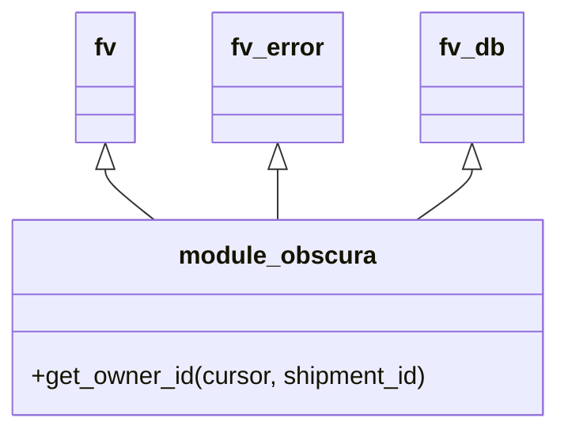

# Diagram: shipment_core/shipment_service/shipment_service/ng_preferences/subscription/get_owner_id_db.py


> Auto-generated by Obscura crawlers

## Diagram 1



### SVG

<svg id="container" width="358.859375" xmlns="http://www.w3.org/2000/svg" class="classDiagram" height="276" viewBox="0 0 358.859375 276" role="graphics-document document" aria-roledescription="class"><style>#container{font-family:"trebuchet ms",verdana,arial,sans-serif;font-size:16px;fill:#333;}@keyframes edge-animation-frame{from{stroke-dashoffset:0;}}@keyframes dash{to{stroke-dashoffset:0;}}#container .edge-animation-slow{stroke-dasharray:9,5!important;stroke-dashoffset:900;animation:dash 50s linear infinite;stroke-linecap:round;}#container .edge-animation-fast{stroke-dasharray:9,5!important;stroke-dashoffset:900;animation:dash 20s linear infinite;stroke-linecap:round;}#container .error-icon{fill:#552222;}#container .error-text{fill:#552222;stroke:#552222;}#container .edge-thickness-normal{stroke-width:1px;}#container .edge-thickness-thick{stroke-width:3.5px;}#container .edge-pattern-solid{stroke-dasharray:0;}#container .edge-thickness-invisible{stroke-width:0;fill:none;}#container .edge-pattern-dashed{stroke-dasharray:3;}#container .edge-pattern-dotted{stroke-dasharray:2;}#container .marker{fill:#333333;stroke:#333333;}#container .marker.cross{stroke:#333333;}#container svg{font-family:"trebuchet ms",verdana,arial,sans-serif;font-size:16px;}#container p{margin:0;}#container g.classGroup text{fill:#9370DB;stroke:none;font-family:"trebuchet ms",verdana,arial,sans-serif;font-size:10px;}#container g.classGroup text .title{font-weight:bolder;}#container .nodeLabel,#container .edgeLabel{color:#131300;}#container .edgeLabel .label rect{fill:#ECECFF;}#container .label text{fill:#131300;}#container .labelBkg{background:#ECECFF;}#container .edgeLabel .label span{background:#ECECFF;}#container .classTitle{font-weight:bolder;}#container .node rect,#container .node circle,#container .node ellipse,#container .node polygon,#container .node path{fill:#ECECFF;stroke:#9370DB;stroke-width:1px;}#container .divider{stroke:#9370DB;stroke-width:1;}#container g.clickable{cursor:pointer;}#container g.classGroup rect{fill:#ECECFF;stroke:#9370DB;}#container g.classGroup line{stroke:#9370DB;stroke-width:1;}#container .classLabel .box{stroke:none;stroke-width:0;fill:#ECECFF;opacity:0.5;}#container .classLabel .label{fill:#9370DB;font-size:10px;}#container .relation{stroke:#333333;stroke-width:1;fill:none;}#container .dashed-line{stroke-dasharray:3;}#container .dotted-line{stroke-dasharray:1 2;}#container #compositionStart,#container .composition{fill:#333333!important;stroke:#333333!important;stroke-width:1;}#container #compositionEnd,#container .composition{fill:#333333!important;stroke:#333333!important;stroke-width:1;}#container #dependencyStart,#container .dependency{fill:#333333!important;stroke:#333333!important;stroke-width:1;}#container #dependencyStart,#container .dependency{fill:#333333!important;stroke:#333333!important;stroke-width:1;}#container #extensionStart,#container .extension{fill:transparent!important;stroke:#333333!important;stroke-width:1;}#container #extensionEnd,#container .extension{fill:transparent!important;stroke:#333333!important;stroke-width:1;}#container #aggregationStart,#container .aggregation{fill:transparent!important;stroke:#333333!important;stroke-width:1;}#container #aggregationEnd,#container .aggregation{fill:transparent!important;stroke:#333333!important;stroke-width:1;}#container #lollipopStart,#container .lollipop{fill:#ECECFF!important;stroke:#333333!important;stroke-width:1;}#container #lollipopEnd,#container .lollipop{fill:#ECECFF!important;stroke:#333333!important;stroke-width:1;}#container .edgeTerminals{font-size:11px;line-height:initial;}#container .classTitleText{text-anchor:middle;font-size:18px;fill:#333;}#container .label-icon{display:inline-block;height:1em;overflow:visible;vertical-align:-0.125em;}#container .node .label-icon path{fill:currentColor;stroke:revert;stroke-width:revert;}#container :root{--mermaid-font-family:"trebuchet ms",verdana,arial,sans-serif;}</style><g><defs><marker id="container_class-aggregationStart" class="marker aggregation class" refX="18" refY="7" markerWidth="190" markerHeight="240" orient="auto"><path d="M 18,7 L9,13 L1,7 L9,1 Z"></path></marker></defs><defs><marker id="container_class-aggregationEnd" class="marker aggregation class" refX="1" refY="7" markerWidth="20" markerHeight="28" orient="auto"><path d="M 18,7 L9,13 L1,7 L9,1 Z"></path></marker></defs><defs><marker id="container_class-extensionStart" class="marker extension class" refX="18" refY="7" markerWidth="190" markerHeight="240" orient="auto"><path d="M 1,7 L18,13 V 1 Z"></path></marker></defs><defs><marker id="container_class-extensionEnd" class="marker extension class" refX="1" refY="7" markerWidth="20" markerHeight="28" orient="auto"><path d="M 1,1 V 13 L18,7 Z"></path></marker></defs><defs><marker id="container_class-compositionStart" class="marker composition class" refX="18" refY="7" markerWidth="190" markerHeight="240" orient="auto"><path d="M 18,7 L9,13 L1,7 L9,1 Z"></path></marker></defs><defs><marker id="container_class-compositionEnd" class="marker composition class" refX="1" refY="7" markerWidth="20" markerHeight="28" orient="auto"><path d="M 18,7 L9,13 L1,7 L9,1 Z"></path></marker></defs><defs><marker id="container_class-dependencyStart" class="marker dependency class" refX="6" refY="7" markerWidth="190" markerHeight="240" orient="auto"><path d="M 5,7 L9,13 L1,7 L9,1 Z"></path></marker></defs><defs><marker id="container_class-dependencyEnd" class="marker dependency class" refX="13" refY="7" markerWidth="20" markerHeight="28" orient="auto"><path d="M 18,7 L9,13 L14,7 L9,1 Z"></path></marker></defs><defs><marker id="container_class-lollipopStart" class="marker lollipop class" refX="13" refY="7" markerWidth="190" markerHeight="240" orient="auto"><circle stroke="black" fill="transparent" cx="7" cy="7" r="6"></circle></marker></defs><defs><marker id="container_class-lollipopEnd" class="marker lollipop class" refX="1" refY="7" markerWidth="190" markerHeight="240" orient="auto"><circle stroke="black" fill="transparent" cx="7" cy="7" r="6"></circle></marker></defs><g class="root"><g class="clusters"></g><g class="edgePaths"><path d="M69.289,109.25L69.289,110.542C69.289,111.833,69.289,114.417,74.504,119.875C79.719,125.333,90.149,133.667,95.364,137.833L100.579,142" id="id_fv_module_obscura_1" class="edge-thickness-normal edge-pattern-solid relation" style=";;;" data-edge="true" data-et="edge" data-id="id_fv_module_obscura_1" data-points="W3sieCI6NjkuMjg5MDYyNSwieSI6OTJ9LHsieCI6NjkuMjg5MDYyNSwieSI6MTE3fSx7IngiOjEwMC41NzkwMTI3ODQwOTA5LCJ5IjoxNDJ9XQ==" marker-start="url(#container_class-extensionStart)"></path><path d="M179.43,109.25L179.43,110.542C179.43,111.833,179.43,114.417,179.43,119.875C179.43,125.333,179.43,133.667,179.43,137.833L179.43,142" id="id_fv_error_module_obscura_2" class="edge-thickness-normal edge-pattern-solid relation" style=";;;" data-edge="true" data-et="edge" data-id="id_fv_error_module_obscura_2" data-points="W3sieCI6MTc5LjQyOTY4NzUsInkiOjkyfSx7IngiOjE3OS40Mjk2ODc1LCJ5IjoxMTd9LHsieCI6MTc5LjQyOTY4NzUsInkiOjE0Mn1d" marker-start="url(#container_class-extensionStart)"></path><path d="M302.906,109.25L302.906,110.542C302.906,111.833,302.906,114.417,297.06,119.875C291.213,125.333,279.521,133.667,273.674,137.833L267.828,142" id="id_fv_db_module_obscura_3" class="edge-thickness-normal edge-pattern-solid relation" style=";;;" data-edge="true" data-et="edge" data-id="id_fv_db_module_obscura_3" data-points="W3sieCI6MzAyLjkwNjI1LCJ5Ijo5Mn0seyJ4IjozMDIuOTA2MjUsInkiOjExN30seyJ4IjoyNjcuODI3NjgxMTA3OTU0NTYsInkiOjE0Mn1d" marker-start="url(#container_class-extensionStart)"></path></g><g class="edgeLabels"><g class="edgeLabel"><g class="label" data-id="id_fv_module_obscura_1" transform="translate(0, 0)"><foreignObject width="0" height="0"><div xmlns="http://www.w3.org/1999/xhtml" class="labelBkg" style="display: table-cell; white-space: nowrap; line-height: 1.5; max-width: 200px; text-align: center;"><span class="edgeLabel"></span></div></foreignObject></g></g><g class="edgeLabel"><g class="label" data-id="id_fv_error_module_obscura_2" transform="translate(0, 0)"><foreignObject width="0" height="0"><div xmlns="http://www.w3.org/1999/xhtml" class="labelBkg" style="display: table-cell; white-space: nowrap; line-height: 1.5; max-width: 200px; text-align: center;"><span class="edgeLabel"></span></div></foreignObject></g></g><g class="edgeLabel"><g class="label" data-id="id_fv_db_module_obscura_3" transform="translate(0, 0)"><foreignObject width="0" height="0"><div xmlns="http://www.w3.org/1999/xhtml" class="labelBkg" style="display: table-cell; white-space: nowrap; line-height: 1.5; max-width: 200px; text-align: center;"><span class="edgeLabel"></span></div></foreignObject></g></g></g><g class="nodes"><g class="node default" id="classId-module_obscura-0" transform="translate(179.4296875, 205)"><g class="basic label-container"><path d="M-171.4296875 -63 L171.4296875 -63 L171.4296875 63 L-171.4296875 63" stroke="none" stroke-width="0" fill="#ECECFF" style=""></path><path d="M-171.4296875 -63 C-94.66923877222746 -63, -17.908790044454918 -63, 171.4296875 -63 M-171.4296875 -63 C-59.107328259956205 -63, 53.21503098008759 -63, 171.4296875 -63 M171.4296875 -63 C171.4296875 -22.8363329270384, 171.4296875 17.327334145923203, 171.4296875 63 M171.4296875 -63 C171.4296875 -30.297081385843278, 171.4296875 2.4058372283134446, 171.4296875 63 M171.4296875 63 C75.29250170080809 63, -20.844684098383823 63, -171.4296875 63 M171.4296875 63 C54.22024301286109 63, -62.98920147427782 63, -171.4296875 63 M-171.4296875 63 C-171.4296875 26.07945007914435, -171.4296875 -10.841099841711298, -171.4296875 -63 M-171.4296875 63 C-171.4296875 29.652326981295012, -171.4296875 -3.6953460374099762, -171.4296875 -63" stroke="#9370DB" stroke-width="1.3" fill="none" stroke-dasharray="0 0" style=""></path></g><g class="annotation-group text" transform="translate(0, -39)"></g><g class="label-group text" transform="translate(-60.359375, -39)"><g class="label" style="font-weight: bolder" transform="translate(0,-12)"><foreignObject width="120.71875" height="24"><div xmlns="http://www.w3.org/1999/xhtml" style="display: table-cell; white-space: nowrap; line-height: 1.5; max-width: 170px; text-align: center;"><span class="nodeLabel markdown-node-label" style=""><p>module_obscura</p></span></div></foreignObject></g></g><g class="members-group text" transform="translate(-159.4296875, 9)"></g><g class="methods-group text" transform="translate(-159.4296875, 39)"><g class="label" style="" transform="translate(0,-12)"><foreignObject width="258.5" height="24"><div xmlns="http://www.w3.org/1999/xhtml" style="display: table-cell; white-space: nowrap; line-height: 1.5; max-width: 316px; text-align: center;"><span class="nodeLabel markdown-node-label" style=""><p>+get_owner_id(cursor, shipment_id)</p></span></div></foreignObject></g></g><g class="divider" style=""><path d="M-171.4296875 -15 C-86.3978889776372 -15, -1.3660904552743887 -15, 171.4296875 -15 M-171.4296875 -15 C-76.09552578955332 -15, 19.23863592089336 -15, 171.4296875 -15" stroke="#9370DB" stroke-width="1.3" fill="none" stroke-dasharray="0 0" style=""></path></g><g class="divider" style=""><path d="M-171.4296875 9 C-62.20619651137237 9, 47.01729447725526 9, 171.4296875 9 M-171.4296875 9 C-36.098541231336156 9, 99.23260503732769 9, 171.4296875 9" stroke="#9370DB" stroke-width="1.3" fill="none" stroke-dasharray="0 0" style=""></path></g></g><g class="node default" id="classId-fv-1" transform="translate(69.2890625, 50)"><g class="basic label-container"><path d="M-18.953125 -42 L18.953125 -42 L18.953125 42 L-18.953125 42" stroke="none" stroke-width="0" fill="#ECECFF" style=""></path><path d="M-18.953125 -42 C-5.961154554627166 -42, 7.030815890745668 -42, 18.953125 -42 M-18.953125 -42 C-4.594731017693228 -42, 9.763662964613545 -42, 18.953125 -42 M18.953125 -42 C18.953125 -20.225839559618002, 18.953125 1.5483208807639954, 18.953125 42 M18.953125 -42 C18.953125 -11.202206075951072, 18.953125 19.595587848097857, 18.953125 42 M18.953125 42 C7.442897116734683 42, -4.067330766530635 42, -18.953125 42 M18.953125 42 C5.2706120637831155 42, -8.411900872433769 42, -18.953125 42 M-18.953125 42 C-18.953125 19.333599974467337, -18.953125 -3.332800051065327, -18.953125 -42 M-18.953125 42 C-18.953125 20.94082555725732, -18.953125 -0.11834888548536071, -18.953125 -42" stroke="#9370DB" stroke-width="1.3" fill="none" stroke-dasharray="0 0" style=""></path></g><g class="annotation-group text" transform="translate(0, -18)"></g><g class="label-group text" transform="translate(-6.953125, -18)"><g class="label" style="font-weight: bolder" transform="translate(0,-12)"><foreignObject width="13.90625" height="24"><div xmlns="http://www.w3.org/1999/xhtml" style="display: table-cell; white-space: nowrap; line-height: 1.5; max-width: 63px; text-align: center;"><span class="nodeLabel markdown-node-label" style=""><p>fv</p></span></div></foreignObject></g></g><g class="members-group text" transform="translate(-6.953125, 30)"></g><g class="methods-group text" transform="translate(-6.953125, 60)"></g><g class="divider" style=""><path d="M-18.953125 6 C-10.146715370533054 6, -1.340305741066107 6, 18.953125 6 M-18.953125 6 C-7.693081933144949 6, 3.5669611337101017 6, 18.953125 6" stroke="#9370DB" stroke-width="1.3" fill="none" stroke-dasharray="0 0" style=""></path></g><g class="divider" style=""><path d="M-18.953125 24 C-7.522356277893191 24, 3.908412444213617 24, 18.953125 24 M-18.953125 24 C-10.766876390116169 24, -2.580627780232337 24, 18.953125 24" stroke="#9370DB" stroke-width="1.3" fill="none" stroke-dasharray="0 0" style=""></path></g></g><g class="node default" id="classId-fv_error-2" transform="translate(179.4296875, 50)"><g class="basic label-container"><path d="M-41.1875 -42 L41.1875 -42 L41.1875 42 L-41.1875 42" stroke="none" stroke-width="0" fill="#ECECFF" style=""></path><path d="M-41.1875 -42 C-16.178340325944387 -42, 8.830819348111227 -42, 41.1875 -42 M-41.1875 -42 C-11.775269623894474 -42, 17.636960752211053 -42, 41.1875 -42 M41.1875 -42 C41.1875 -21.296246234836797, 41.1875 -0.5924924696735943, 41.1875 42 M41.1875 -42 C41.1875 -14.261029902828685, 41.1875 13.47794019434263, 41.1875 42 M41.1875 42 C17.3957627382712 42, -6.395974523457603 42, -41.1875 42 M41.1875 42 C9.373099562770683 42, -22.441300874458634 42, -41.1875 42 M-41.1875 42 C-41.1875 20.286166491100666, -41.1875 -1.4276670177986688, -41.1875 -42 M-41.1875 42 C-41.1875 12.183390502580622, -41.1875 -17.633218994838757, -41.1875 -42" stroke="#9370DB" stroke-width="1.3" fill="none" stroke-dasharray="0 0" style=""></path></g><g class="annotation-group text" transform="translate(0, -18)"></g><g class="label-group text" transform="translate(-29.1875, -18)"><g class="label" style="font-weight: bolder" transform="translate(0,-12)"><foreignObject width="58.375" height="24"><div xmlns="http://www.w3.org/1999/xhtml" style="display: table-cell; white-space: nowrap; line-height: 1.5; max-width: 108px; text-align: center;"><span class="nodeLabel markdown-node-label" style=""><p>fv_error</p></span></div></foreignObject></g></g><g class="members-group text" transform="translate(-29.1875, 30)"></g><g class="methods-group text" transform="translate(-29.1875, 60)"></g><g class="divider" style=""><path d="M-41.1875 6 C-15.222656358779641 6, 10.742187282440717 6, 41.1875 6 M-41.1875 6 C-23.018991614985012 6, -4.850483229970024 6, 41.1875 6" stroke="#9370DB" stroke-width="1.3" fill="none" stroke-dasharray="0 0" style=""></path></g><g class="divider" style=""><path d="M-41.1875 24 C-15.853133935188058 24, 9.481232129623884 24, 41.1875 24 M-41.1875 24 C-9.229679823082975 24, 22.72814035383405 24, 41.1875 24" stroke="#9370DB" stroke-width="1.3" fill="none" stroke-dasharray="0 0" style=""></path></g></g><g class="node default" id="classId-fv_db-3" transform="translate(302.90625, 50)"><g class="basic label-container"><path d="M-32.2890625 -42 L32.2890625 -42 L32.2890625 42 L-32.2890625 42" stroke="none" stroke-width="0" fill="#ECECFF" style=""></path><path d="M-32.2890625 -42 C-15.62056533938285 -42, 1.0479318212343003 -42, 32.2890625 -42 M-32.2890625 -42 C-12.190481212479312 -42, 7.908100075041375 -42, 32.2890625 -42 M32.2890625 -42 C32.2890625 -10.328656851958844, 32.2890625 21.342686296082313, 32.2890625 42 M32.2890625 -42 C32.2890625 -12.354929319113786, 32.2890625 17.290141361772427, 32.2890625 42 M32.2890625 42 C16.976899023902305 42, 1.6647355478046109 42, -32.2890625 42 M32.2890625 42 C15.92896884299769 42, -0.4311248140046189 42, -32.2890625 42 M-32.2890625 42 C-32.2890625 16.136295026817386, -32.2890625 -9.727409946365228, -32.2890625 -42 M-32.2890625 42 C-32.2890625 12.333610905530612, -32.2890625 -17.332778188938775, -32.2890625 -42" stroke="#9370DB" stroke-width="1.3" fill="none" stroke-dasharray="0 0" style=""></path></g><g class="annotation-group text" transform="translate(0, -18)"></g><g class="label-group text" transform="translate(-20.2890625, -18)"><g class="label" style="font-weight: bolder" transform="translate(0,-12)"><foreignObject width="40.578125" height="24"><div xmlns="http://www.w3.org/1999/xhtml" style="display: table-cell; white-space: nowrap; line-height: 1.5; max-width: 90px; text-align: center;"><span class="nodeLabel markdown-node-label" style=""><p>fv_db</p></span></div></foreignObject></g></g><g class="members-group text" transform="translate(-20.2890625, 30)"></g><g class="methods-group text" transform="translate(-20.2890625, 60)"></g><g class="divider" style=""><path d="M-32.2890625 6 C-9.767035482231162 6, 12.754991535537677 6, 32.2890625 6 M-32.2890625 6 C-13.546630876967459 6, 5.195800746065082 6, 32.2890625 6" stroke="#9370DB" stroke-width="1.3" fill="none" stroke-dasharray="0 0" style=""></path></g><g class="divider" style=""><path d="M-32.2890625 24 C-11.917482966992054 24, 8.454096566015892 24, 32.2890625 24 M-32.2890625 24 C-10.757232771201728 24, 10.774596957596543 24, 32.2890625 24" stroke="#9370DB" stroke-width="1.3" fill="none" stroke-dasharray="0 0" style=""></path></g></g></g></g></g></svg>

## Diagram 2

```mermaid
flowchart TD
    A[Start: call get_owner_id] --> B[Build data dict {"id": shipment_id}]
    B --> C[Prepare SQL query string]
    C --> D[Log cursor.mogrify(query, data).decode()]
    D --> E[Execute cursor.execute(query, data)]
    E --> F{cursor.fetchone() -> rows}
    F -- No rows --> G[Raise BadRequestError("Shipment ... does not exist")]
    F -- Has rows --> H[Return {"owner_id": rows.created_by_org_id}]
    G --> I[End: error]
    H --> I[End: success]
```

> SVG rendering failed for this diagram.
